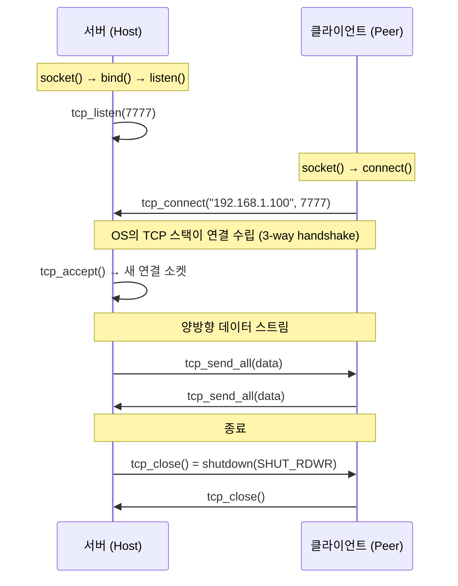
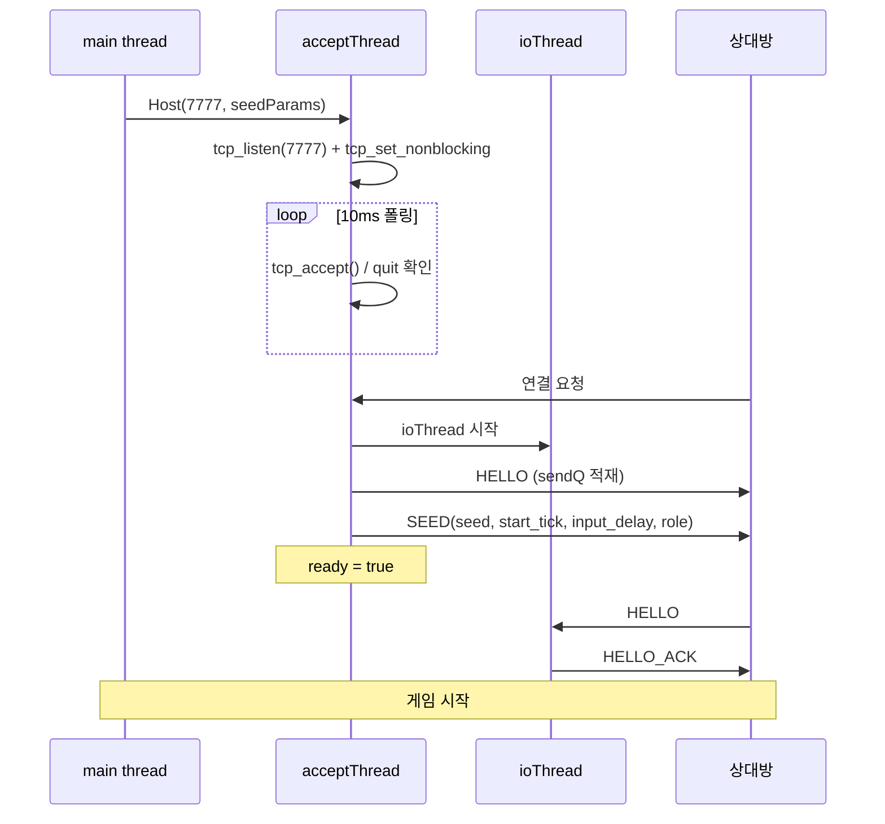
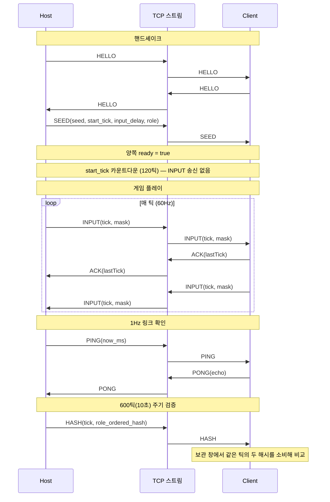
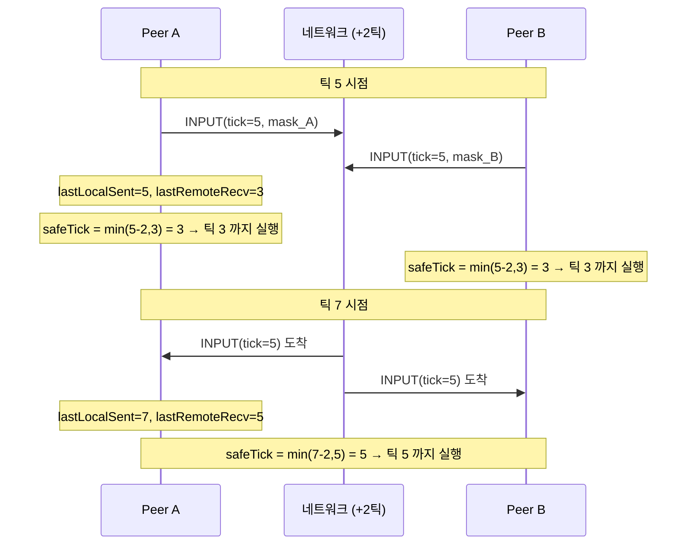
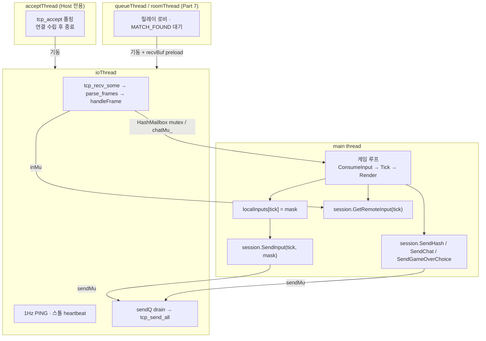
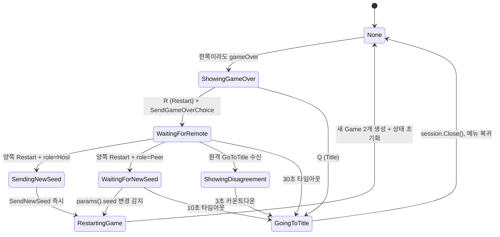
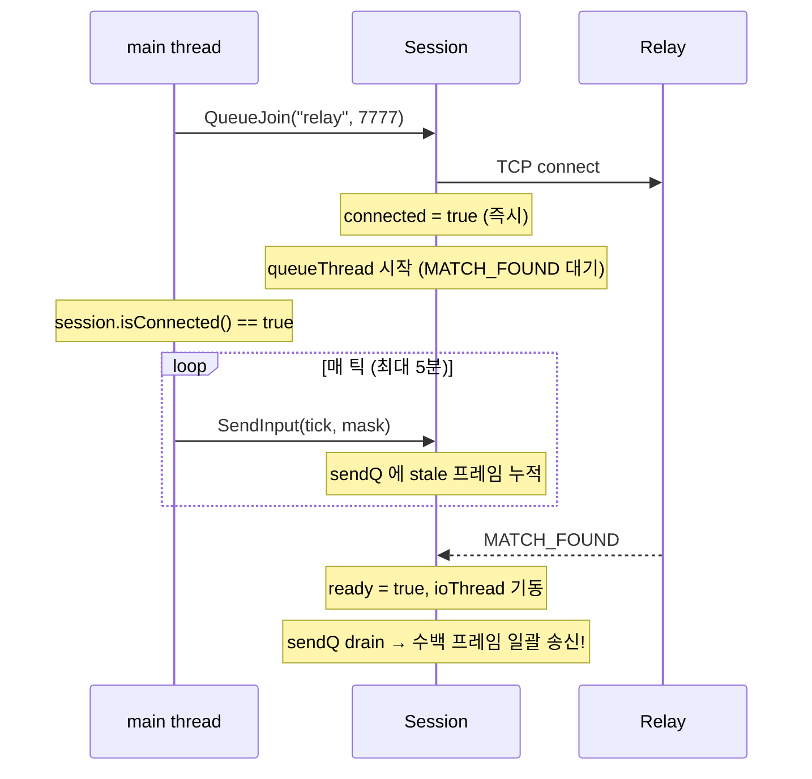
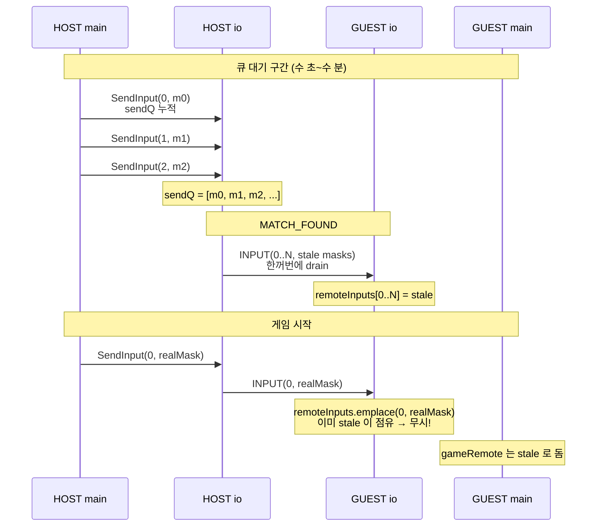
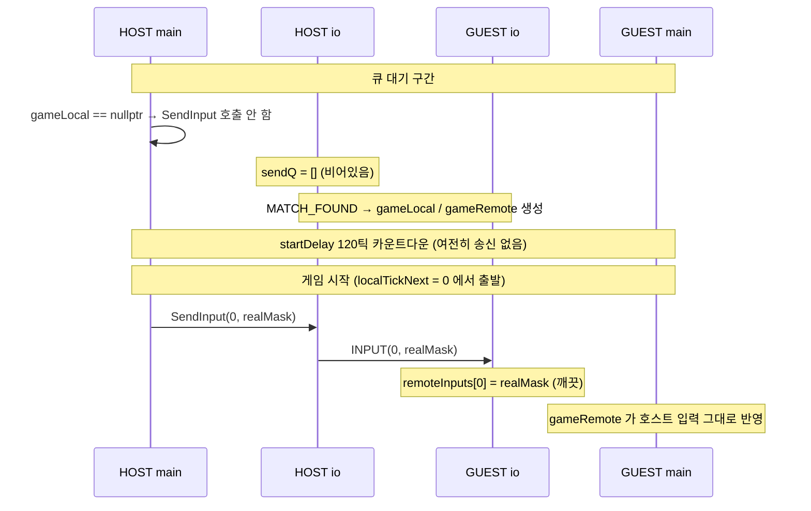
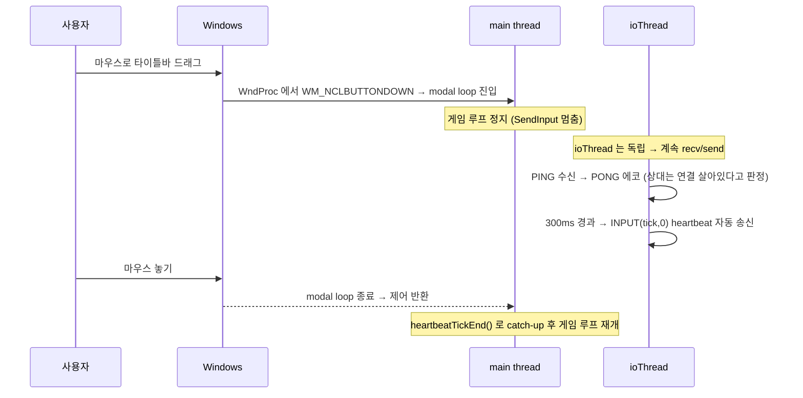

# Part 6: 결정론적 멀티플레이 — TCP Lockstep 네트워킹

> **시리즈:** 제로부터 멀티플레이어 테트리스 + RL | [시리즈 목차](./README.md) | **Part 6**

---

> **공개 접속의 현재 경로:** [Part 16](part16-secure-admission.md)은 WSS 게이트웨이와 일회용 게임 입장권을 추가한다. 이 장의 raw TCP 명령은 로컬/내부 연결을 설명한다. 공개 포트는 WSS, relay는 `--loopback-only`이며, 기존 token 필드에는 장기 계정 토큰 대신 입장권을 넣는다.

## 이번 Part의 구현 계약

- **선행 상태:** Part 1 의 결정론적 `SimGame` 과 그 상태 해시(`StateHash()` / `StateHashBreakdown()`), Part 4 의 60Hz 고정 틱 루프와 틱별 입력 마스크 (`ConsumeInput`), 그리고 `SimGame` 을 감싸며 해시를 `ComputeStateHash()` 로 노출하는 `Game` 래퍼. 이 장에서 `gameLocal->ComputeStateHash()` 는 Part 4 래퍼의 메서드고, 섹션별 breakdown 은 `gameLocal->sim.StateHashBreakdown()` 처럼 내부 `SimGame` 에서 직접 꺼낸다.
- **이번 Part의 파일:** `net/socket.h`, `net/socket.cpp`, `net/framing.h`, `net/framing.cpp`, `net/session.h`, `net/session.cpp` 를 새로 만들고, `src/main.cpp` 에 `AppMode::Net` 경로를 추가한다. `CMakeLists.txt` 에 새 `net/*.cpp` 소스와 소켓 라이브러리 링크가 붙는다.
- **연결점:** 상태가 아니라 **시드와 틱별 입력**만 교환한다. `main.cpp` 의 틱 루프가 `Session::SendInput` 으로 자기 입력을 밀어 넣고, `Session::GetRemoteInput` 으로 상대 입력을 당겨온 뒤, safeTick 이전까지만 두 `SimGame` 을 진행시킨다.
- **완료 게이트:**
  1. 프레이밍 계약(부분 수신 · 잘못된 길이 · 체크섬 불일치)이 자동 테스트로 통과한다 — `python/tests/test_framing_parity.py`. 이 패리티 하네스(`python/netbot/framing.py` 미러 포함)는 [Part 8](./part8-python-rl.md) 이 구현한다 — 여기서는 완성 저장소에서 실행만 한다.
  2. 같은 머신에서 `--host` / `--connect` 두 인스턴스를 붙이면 양쪽 `[INIT] seed=...` 가 일치하고, 600틱마다 교환하는 결합 해시가 어긋나지 않는다(`[DESYNC]` 로그 0건).

이 장의 구현 산출물은 **직결 P2P lockstep 세션**이다. `HELLO` / `HELLO_ACK` / `SEED` / `INPUT` / `ACK` / `PING` / `PONG` / `HASH` / `GAME_OVER_CHOICE` / `CHAT`의 전송 계약과 `Session::ioThread`를 완성한다. 현재 `net/session.*`에는 릴레이와 랭킹 확장도 함께 있지만, `QUEUE_*` / `ROOM_*` / `MATCH_FOUND`는 Part 7, `MATCH_SUMMARY` / `MATCH_RESULT`의 서버 권위 의미는 Part 10의 소유다. `SERVER_REJECT`의 **wire 계약과 하위 호환 근거**는 이 장이 갖고, 어떤 상한에서 그것을 발행하는지는 Part 7 과 [Part 14](./part14-event-loop-scaling.md) 가 갖는다. 이 장의 현재 소스 발췌에 그런 타입이 보이더라도 직결 세션을 이해하는 데 필요한 wire 기반과 수신 안전성만 읽는다.

## 들어가며

네트워크 게임의 상태 동기화에는 세 가지 주요 모델이 있다.

| 모델 | 원리 | 대역폭 | 레이턴시 체감 | 구현 복잡도 |
|------|------|--------|-------------|-----------|
| **클라이언트-서버** | 서버가 권위적 상태를 유지, 클라이언트는 입력 전송 + 상태 수신 | 높음 (전체 상태 전송) | 서버 왕복 시간만큼 | 중간 |
| **Lockstep** | 모든 피어가 같은 시뮬레이션 실행, 입력만 교환 | 극히 낮음 (입력 마스크 자체는 틱당 1바이트) | 양쪽 입력이 도착할 때까지 대기 | 낮음 |
| **Rollback** | Lockstep + 예측. 입력 없으면 예측 실행, 나중에 보정 | 낮음 | 거의 없음 (예측 정확 시) | 높음 |

이 프로젝트는 **Lockstep** 을 사용한다. 전제 조건은 **결정론적 시뮬레이션** (Part 1) 과 **고정 틱 레이트**(Part 4) 다. 같은 시드 + 같은 입력 순서 = 같은 결과이므로, 네트워크로 전체 상태가 아닌 **입력만** 교환하면 된다. 시뮬레이션 입력 마스크는 틱당 1바이트이고, 실제 TCP 프레임은 길이/타입/체크섬과 tick/count 가 붙어 단일 tick INPUT 기준 14바이트다.

단점도 명확하다. 한쪽의 입력이 도착하지 않으면 다른 쪽이 **대기**한다. 이것이 Lockstep 특유의 "끊김" 이다.

### 왜 Rollback 이 아닌가 — 정량 비교

Rollback(GGPO 계열)은 상대 입력이 없어도 "직전 입력이 유지될 것" 이라고 **예측**해서 시뮬레이션을 계속 돌리고, 실제 입력이 도착하면 그 틱까지 되감아 재시뮬레이션한다. 격투 게임에서 사실상 표준이 된 이유는 명확하다 — 한 프레임 (16.7ms) 의 입력 타이밍이 승패를 가르기 때문이다.

테트리스는 그 조건이 다르다. Part 1 의 `SimGame` 은 생성자에서 `dropIntervalTicks` 를 `TICKS_PER_SECOND / 2`, 즉 **30틱(500ms)** 으로 잡고 (`src/sim_game.cpp`), 레벨이 오를 때마다 `30 - (level-1)*27/19` 로 줄이되 하한을 3틱으로 clamp 한다(`src/sim_game.cpp`). 즉 피스가 한 칸 내려가는 데 걸리는 시간은 레벨 1 에서 500ms, 최고 레벨 20 에서도 50ms 다.

기본 `input_delay = 2` 가 만드는 체감 지연은 33ms —

- 레벨 1 기준 **한 중력 스텝의 6.7%**
- 레벨 20 기준 **한 중력 스텝의 67%**, 즉 최악의 경우에도 피스가 한 칸 내려가기 전에 입력이 반영된다.

플레이어가 인지하는 단위는 "피스가 어디에 놓이는가" 이지 "몇 밀리초에 움직였는가" 가 아니다. 33ms 는 이 게임의 결정 단위 아래로 숨는다.

반대편에는 rollback 이 요구하는 비용이 있다.

| 요구 사항 | Lockstep | Rollback |
|---|---|---|
| 상태 스냅샷 | 불필요 | 매 틱 `SimGame` 전체를 저장 (그리드 10×20 + RNG + 카운터, 롤백 윈도우 길이만큼 링) |
| 재시뮬레이션 | 없음 | 오차 발견 시 최대 롤백 윈도우 길이만큼 `Tick()` 재실행 |
| 시각적 보정 | 없음 | 되감기로 인한 화면 튐(피스 위치 점프, 라인 클리어 취소)의 UI 처리 |
| 오디오/이펙트 | 그대로 | 재실행 구간에서 효과음·쉐이크 중복 발화 방지 로직 필요 |
| 코드 침투 범위 | `net/` 만 | `SimGame` · `Game` · 렌더러 · 오디오 전부 |

가비지 라인 교환(Part 4 의 `AddPendingGarbage`)까지 되감아야 하므로 재시뮬은 "내 보드만" 이 아니라 두 보드 모두를 대상으로 해야 한다. Lockstep 은 이 전부를 0 으로 만든다. 이 게임에서 rollback 의 이득(33ms 절약)이 그 비용을 정당화하지 못한다는 것이 이 프로젝트의 판단이다.

Lockstep 의 진짜 약점은 지연이 아니라 **한쪽이 멈추면 둘 다 멈춘다**는 것이다. 이 장의 PING/PONG 하트비트와 ioThread 자동 heartbeat 절이 그 완화책을 다룬다.

### 왜 TCP 인가 — 그리고 그 대가

lockstep 은 "틱 t 의 입력" 이 반드시 도착해야 진행한다. 하나라도 유실되면 시뮬레이션이 영구히 멈추므로 **신뢰성 있는 순서 보장 전송**이 필요하다. UDP 위에 재전송·순서 복원을 직접 얹는 대신 TCP 를 쓰면 그 계층이 공짜다.

대가는 두 가지다.

1. **head-of-line 블로킹.** TCP 는 앞의 세그먼트가 재전송되는 동안 뒤의 세그먼트를 애플리케이션에 넘기지 않는다. 커널이 이미 받아둔 틱 t+3 의 INPUT 이 있어도 틱 t 가 재전송 중이면 `recv` 가 반환하지 않는다. lockstep 은 어차피 t 를 기다려야 하므로 손해가 작지만, "새 입력만 최신으로 쓰고 옛것은 버린다" 는 UDP 식 최적화는 불가능하다.
2. **바이트 스트림에는 메시지 경계가 없다.** UDP 는 데이터그램 하나가 곧 메시지지만, TCP 는 우리가 직접 프레이밍을 해야 한다. 이 프로젝트는 `길이 + 타입 + payload + 체크섬`을 한 프레임으로 정의하고 수신 버퍼에서 완성된 프레임만 꺼낸다.

여기에 Nagle 알고리즘이 기본으로 켜져 있다는 세 번째 함정이 붙는다. 작은 INPUT 프레임을 더 큰 세그먼트로 합치느라 기다리면 lockstep의 체감 지연이 늘어나므로 연결 직후 `TCP_NODELAY`를 켠다. 이 선택은 처리량보다 작은 메시지의 즉시성을 우선한다.

---

## 1. TCP 소켓 추상화

### 1.1 소켓의 기본 흐름

TCP 소켓의 서버/클라이언트 수명주기다. `accept`는 OS가 대기열에 둔 연결을 꺼내 새 핸들로 반환한다. 연결 수립은 애플리케이션의 `accept` 호출보다 먼저 완료될 수 있다. 리스너와 반환된 연결 소켓은 별개의 자원이다.

이 코드의 `tcp_listen`은 블로킹 리스너를 만든다. 서버 호출자가 `tcp_set_nonblocking`으로 바꾼 뒤 폴링한다. 연결 소켓은 `tcp_accept`·`tcp_connect`가 논블로킹 설정에 성공해야 반환한다.


```mermaid
sequenceDiagram
    participant S as 서버 (Host)
    participant C as 클라이언트 (Peer)

    Note over S: socket() → bind() → listen()
    S->>S: tcp_listen(7777)
    Note over C: socket() → connect()
    C->>S: tcp_connect("192.168.1.100", 7777)
    Note over S,C: OS의 TCP 스택이 연결 수립 (3-way handshake)
    S->>S: tcp_accept() → 새 연결 소켓
    Note over S,C: 양방향 데이터 스트림
    S->>C: tcp_send_all(data)
    C->>S: tcp_send_all(data)
    Note over S,C: 종료
    S->>C: tcp_close() = shutdown(SHUT_RDWR)
    C->>S: tcp_close()
```

### 1.2 `TcpSocket` — 참조 카운트 소유 핸들

소켓 래퍼의 첫 번째 책임은 플랫폼 차이를 숨기는 것이지만, 더 중요한 책임은 **소켓 핸들의 소유권**을 명확히 하는 것이다.

**현재 소스 발췌 — `net/socket.h`**

```cpp
// TCP 소켓 핸들 — 참조 카운트 소유(ref-counted owning handle).
//
//   과거에는 평범한 { NativeSocket fd } 였다. 같은 연결의 복사본을 여러 detached 스레드가
//   값으로 들고 각자 ::close 했기 때문에, 한 스레드가 닫은 fd 정수를 곧바로 새
//   accept() 가 재사용하면 살아있던 다른 스레드가 "엉뚱한 클라이언트 소켓"에
//   read/write 하는 use-after-close / fd-reuse 경합이 있었다(공개 서버에서 교차
//   연결 데이터 유출로 악용 가능).
//
//   이제 fd 는 shared_ptr<NativeSocket> 가 소유하며, 모든 복사본은 같은 제어 블록을
//   공유한다. 실제 ::close 는 "마지막 복사본이 사라지는 순간" deleter 에서
//   정확히 한 번 호출된다(이중 close 와 fd 재사용 경합 제거).
//
//   tcp_close() 는 즉시 ::shutdown(SHUT_RDWR) 만 호출한다 — 같은 fd 를 폴링/대기
//   중인 다른 복사본의 recv 를 EOF 로 깨워 루프를 빠져나가게 한다. 소유권(=실제
//   close)은 RAII 에 맡긴다. shutdown 은 일반 스레드에서 반복 호출해도 무해한
//   종료 신호로만 사용한다. TcpSocket 은 shared_ptr 를 읽으므로 tcp_close() 를
//   signal handler 에서 직접 호출하면 안 된다.
//
//   동시성 계약: 한 TcpSocket "인스턴스(변수)" 자체를 두 스레드가 동시에
//   재대입/소멸시키면 안 된다(shared_ptr 인스턴스 자체는 thread-safe 가 아님).
//   서로 다른 복사본을 각 스레드가 들고 read/close 하는 것은 안전하다.
struct TcpSocket {
    std::shared_ptr<StreamTransport> transport; // client WSS; never a reactor fd
    std::shared_ptr<NativeSocket> fdh;  // 제어 블록: *fdh == fd. 마지막 참조 소멸 시 ::close.

    NativeSocket fd() const { return fdh ? *fdh : kInvalidSocket; }
    bool valid() const { return transport ? transport->alive() : fdh && socket_valid(*fdh); }
};
```

위 구조에는 TCP fd뿐 아니라 `StreamTransport` 소유권도 있다. WSS는 이 인터페이스의 send/receive/close로 위임하고, 아래 fd·shutdown 설명은 일반 TCP 경로에 적용된다. WSS의 별도 스레드·TLS·종료 수명은 Part 16에서 설명한다.

`net/native_socket.h`의 `NativeSocket`은 POSIX에서 `int`, Windows에서 포인터 크기의 부호 없는 정수다. Windows SOCKET을 `int`로 줄이면 핸들 값이 잘릴 수 있으므로 소유자·Reactor API·등록 컨테이너·서버 연결 상태까지 같은 타입을 전달한다. POSIX는 음수, Windows는 `INVALID_SOCKET`에 대응하는 값으로 무효 상태를 판정한다. 0도 유효한 핸들이 될 수 있다. `valid()`는 TCP 경로에서 자원 소유 여부를 확인하며 원격 연결의 건강 상태를 증명하지 않는다. [Microsoft SOCKET 타입 계약](https://learn.microsoft.com/en-us/windows/win32/winsock/socket-data-type-2)을 참고한다.

fd를 닫는 경로는 생성 실패 정리와 마지막 소유자의 deleter다.

**현재 소스 발췌 — `net/socket.cpp`**

```cpp
static void close_fd(NativeSocket fd) {
    if (!socket_valid(fd)) return;
#ifdef _WIN32
    closesocket(fd);
#else
    ::close(fd);
#endif
}

static TcpSocket make_owned(NativeSocket fd) {
    TcpSocket s;
    try {
        // Keep the real handle unowned until both allocations succeed. If the
        // control-block allocation fails, shared_ptr deletes only the sentinel.
        auto owner = std::shared_ptr<NativeSocket>(new NativeSocket(kInvalidSocket),
            [](NativeSocket* p) { if (p) { close_fd(*p); delete p; } });
        *owner = fd;
        s.fdh = std::move(owner);
    } catch (const std::bad_alloc&) {
        close_fd(fd);
    }
    return s;
}
```

`make_owned`는 무효 핸들을 담은 저장소와 shared_ptr 제어 블록을 먼저 준비한 뒤 실제 핸들을 넣는다. 첫 할당 또는 제어 블록 할당이 실패해도 실제 소켓은 catch에서 한 번만 닫힌다. 제어 블록 준비 중 deleter가 호출되어도 그때는 무효 핸들만 갖고 있으므로 중복 close가 생기지 않는다.

이 형태가 필요한 이유는 스레드 간에 소켓을 값으로 넘기기 때문이다. `{ int fd }` 구조체를 그대로 복사하면 소유자가 여러 명 생기지만, 커널 fd 정수는 소유권을 표현하지 못한다. 한 스레드가 `close(fd)` 한 직후 다른 `accept()` 가 같은 정수 값을 재사용하면, 아직 그 정수를 들고 있던 스레드가 새 연결에 `read/write` 하는 fd-reuse 경합이 생긴다. 공개 릴레이에서는 서로 다른 클라이언트 연결의 데이터가 교차할 수 있으므로 단순 안정성 버그가 아니라 데이터 유출 취약점이다.

### 1.3 서버: bind + listen + accept

`tcp_listen()` 은 raw fd 를 만들되, 반환 직전에만 `make_owned(fd)` 로 감싼다. 실패 경로에서는 아직 소유 핸들이 없으므로 `close_fd` 를 직접 부른다.

**현재 소스 발췌 — `net/socket.cpp`**

```cpp
static int set_bind_policy(NativeSocket fd) {
    int yes = 1;
#ifdef _WIN32
    return setsockopt(fd, SOL_SOCKET, SO_EXCLUSIVEADDRUSE, (const char*)&yes, sizeof(yes));
#else
    return setsockopt(fd, SOL_SOCKET, SO_REUSEADDR, &yes, sizeof(yes));
#endif
}
```

**현재 소스 발췌 — `net/socket.cpp`**

```cpp
TcpSocket tcp_listen(uint16_t port, int backlog, bool loopback_only) {
    if (!net_init()) return TcpSocket{};
    NativeSocket fd = ::socket(AF_INET, SOCK_STREAM, IPPROTO_TCP);
    if (!socket_valid(fd)) return TcpSocket{};
    if (set_bind_policy(fd) != 0) { close_fd(fd); return TcpSocket{}; }
    sockaddr_in addr{};
    addr.sin_family = AF_INET;
    addr.sin_addr.s_addr = htonl(loopback_only ? INADDR_LOOPBACK : INADDR_ANY);
    addr.sin_port = htons(port);
    if (::bind(fd, (sockaddr*)&addr, sizeof(addr)) != 0) {
        close_fd(fd);
        return TcpSocket{};
    }
    if (::listen(fd, backlog) != 0) {
        close_fd(fd);
        return TcpSocket{};
    }
    return make_owned(fd);
}
```

`loopback_only`를 켜면 내부 IPv4 loopback에만 bind한다. 공개 배포는 이 옵션과 별도의 WSS 게이트웨이를 조합한다. `tcp_accept`의 선택적 `AcceptResult` 출력은 연결 없음과 fd 고갈 같은 실패를 구분해 서버의 재시도·입장 제한 판단을 돕는다.

**바인드 정책:** POSIX 경로는 `SO_REUSEADDR`를 요청해 주소 재사용 규칙을 완화한다. 실제 재바인드 가능 여부는 살아 있는 리스너·연결·주소와 OS 정책에 달려 있다. TIME_WAIT 기간이나 재시작 성공을 고정값으로 보장하지 않는다. Windows 경로는 `SO_EXCLUSIVEADDRUSE`를 bind 전에 설정한다. Windows의 `SO_REUSEADDR`는 사용 중인 포트에 강제로 바인드해 어느 소켓으로 전달될지 불명확하게 만들 수 있어 같은 의미로 쓰지 않는다. 옵션 설정이 실패하면 후보 소켓을 닫고 실패를 반환한다. 배타 바인드 역시 연결 상태 때문에 즉시 재바인드가 안 될 수 있다. [Microsoft의 주소 재사용·배타 사용 계약](https://learn.microsoft.com/en-us/windows/win32/winsock/using-so-reuseaddr-and-so-exclusiveaddruse)을 참고한다.

수락은 `tcp_accept` 다. 수락된 자식 소켓에만 논블로킹 + NODELAY + keepalive 를 건다 — listen 소켓에 걸어도 자식으로 상속되지 않는 플랫폼이 있다. NODELAY 의 근거는 §15, keepalive 가 어떤 실패를 감지하는지는 §11.7 이 다룬다.

**현재 소스 발췌 — `net/socket.cpp`**

```cpp
TcpSocket tcp_accept(const TcpSocket& server, AcceptResult* out_result) {
    auto report = [&](AcceptResult r) { if (out_result) *out_result = r; };
    if (!server.valid()) { report(AcceptResult::Error); return TcpSocket{}; }
    sockaddr_in addr{}; socklen_t alen = sizeof(addr);
    NativeSocket fd = ::accept(server.fd(), (sockaddr*)&addr, &alen);
    if (!socket_valid(fd)) {
#ifdef _WIN32
        const int e = WSAGetLastError();
        report(e == WSAEWOULDBLOCK ? AcceptResult::WouldBlock
             : e == WSAEMFILE      ? AcceptResult::FdExhausted
                                   : AcceptResult::Error);
#else
        // EMFILE(프로세스 fd 상한) 과 ENFILE(시스템 전체) 을 함께 본다. 둘 다
        // "기다린다고 낫지 않는" 부류이고, 호출자가 할 일이 같다.
        const int e = errno;
        report((e == EAGAIN || e == EWOULDBLOCK) ? AcceptResult::WouldBlock
             : (e == EMFILE || e == ENFILE)      ? AcceptResult::FdExhausted
                                                 : AcceptResult::Error);
#endif
        return TcpSocket{};
    }
    report(AcceptResult::Error);
    // 수락된 소켓을 논블로킹 + NODELAY 로 설정.
    if (!set_nonblocking(fd)) { close_fd(fd); return TcpSocket{}; }
    set_nodelay(fd);
    set_keepalive(fd);
    auto owned = make_owned(fd);
    if (owned.valid()) report(AcceptResult::Ok);
    return owned;
}
```

### 1.4 클라이언트: connect

**현재 소스 발췌 — `net/socket.cpp`**

```cpp
TcpSocket tcp_connect(const std::string& host, uint16_t port) {
    if (!net_init()) return TcpSocket{};

    addrinfo hints{}; hints.ai_family = AF_INET; hints.ai_socktype = SOCK_STREAM;
    addrinfo* res = nullptr; char portStr[16];
    std::snprintf(portStr, sizeof(portStr), "%u", (unsigned)port);
    if (getaddrinfo(host.c_str(), portStr, &hints, &res) != 0) return TcpSocket{};
    NativeSocket fd = kInvalidSocket;
    for (addrinfo* p = res; p; p = p->ai_next) {
        fd = ::socket(p->ai_family, p->ai_socktype, p->ai_protocol);
        if (!socket_valid(fd)) continue;
        if (::connect(fd, p->ai_addr, (int)p->ai_addrlen) == 0) {
            break;
        }
        close_fd(fd);
        fd = kInvalidSocket;
    }
    freeaddrinfo(res);
    if (!socket_valid(fd)) return TcpSocket{};
    // 연결된 소켓을 논블로킹 + NODELAY 로 설정.
    if (!set_nonblocking(fd)) { close_fd(fd); return TcpSocket{}; }
    set_nodelay(fd);
    set_keepalive(fd);
    return make_owned(fd);
}
```

`getaddrinfo` 는 호스트 이름("192.168.1.100" 또는 "relay.example.com")을 `sockaddr` 로 변환한다. IPv4/IPv6, DNS 해석을 모두 처리하는 현대적 API 로, 오래된 `inet_addr` / `gethostbyname` 대신 쓴다. 여기서는 `ai_family = AF_INET` 으로 IPv4 만 요청한다.

연결 자체는 **블로킹**이다. `set_nonblocking` 은 `connect` 성공 뒤에 걸린다. 즉 `tcp_connect` 를 메인 스레드에서 호출하면 상대가 응답할 때까지 게임 루프가 멈춘다 — 그래서 릴레이 경로는 `Session` 안의 별도 스레드에서 호출한다 ([Part 7](./part7-relay-server.md) 의 `Session::queueThread`).

### 1.5 논블로킹 I/O

**현재 소스 발췌 — `net/socket.cpp`**

```cpp
static bool set_nonblocking(NativeSocket fd) {
#ifdef _WIN32
    u_long mode = 1;
    return ioctlsocket(fd, FIONBIO, &mode) == 0;
#else
    int flags = fcntl(fd, F_GETFL, 0);
    if (flags == -1) return false;
    return fcntl(fd, F_SETFL, flags | O_NONBLOCK) == 0;
#endif
}
```

`fcntl(F_GETFL)` 실패를 먼저 걸러야 한다. 실패 시 `flags == -1` 이고, 그대로 `-1 | O_NONBLOCK` 을 `F_SETFL` 로 넘기면 **모든 파일 상태 플래그가 세워진 값**을 쓰게 된다. 한 줄이지만 빼먹으면 조용히 이상한 상태가 된다.

논블로킹 모드에서 `recv()` 는 데이터가 없으면 즉시 반환한다(에러 코드 `WSAEWOULDBLOCK` / `EAGAIN`). 이것이 중요한 이유는 명확하다 — I/O 스레드가 `recv` 에서 블로킹되면 송신 큐를 처리할 수 없다. 논블로킹으로 `recv` → `send` 큐 처리 → `recv` 순환을 구현한다.

### 1.6 `tcp_send_all` — 논블로킹 위의 "전량 송신"

논블로킹 소켓에서 `send`는 요청한 바이트 중 일부만 받아들일 수 있다. 네이티브 TCP 경로의 `tcp_send_all`은 양수 반환량만큼 위치를 전진하며 전체 요청을 로컬 OS에 맡기면 true를 반환한다. 중간 실패 전 일부 바이트가 이미 받아들여졌을 수 있으므로 false를 전송0이나 원자적 취소로 해석하지 않는다.

Windows의 send 길이는 int다. `net/io_size.h`의 `io_chunk_size`가 size_t 요청을 INT_MAX 이하로 제한한 뒤 변환한다. 전체 버퍼 길이와 호출 한 번의 길이를 분리하므로 큰 값의 부호·상위 비트 손실을 피한다. 논블로킹 `tcp_send_some`도 같은 제한을 사용하며 나중 호출이 실패해도 out_sent에 앞서 수락된 양을 남긴다.

**현재 소스 발췌 — `net/socket.cpp`**

```cpp
bool tcp_send_all(const TcpSocket& s, const void* data, size_t len) {
    if (s.transport) return s.transport->send(data,len);
    const NativeSocket fd = s.fd();
    if (!socket_valid(fd)) return false;
    const uint8_t* p = static_cast<const uint8_t*>(data);
    size_t sent = 0;
    // Total call budget: intermittent progress must not restart the clock.
    const auto deadline = std::chrono::steady_clock::now() + std::chrono::seconds(5);
    while (sent < len) {
        if (std::chrono::steady_clock::now() >= deadline) return false;
#ifdef _WIN32
        int n = ::send(fd, (const char*)(p + sent), io_chunk_size(len - sent), 0);
        if (n < 0) {
            int err = WSAGetLastError();
            if (err == WSAEWOULDBLOCK) {
                // 논블로킹에서 버퍼 가득참 - 짧은 대기 후 재시도
                std::this_thread::sleep_for(std::chrono::milliseconds(1));
                continue;
            }
            return false;
        }
        if (n == 0) return false; // nonempty request made no progress
#else
        int flags = 0;
#ifdef MSG_NOSIGNAL
        flags |= MSG_NOSIGNAL;
#endif
        ssize_t n = ::send(fd, (const char*)(p + sent), (size_t)(len - sent), flags);
        if (n < 0) {
            if (errno == EINTR) continue;
            if (errno == EAGAIN || errno == EWOULDBLOCK) {
                // 논블로킹에서 버퍼 가득참 - 짧은 대기 후 재시도
                std::this_thread::sleep_for(std::chrono::milliseconds(1));
                continue;
            }
            return false;
        }
        if (n == 0) return false; // nonempty request made no progress
#endif
        sent += (size_t)n;
    }
    return true;
}
```

여기서 놓치기 쉬운 사실 세 가지.

- **소켓은 논블로킹이지만 `tcp_send_all` 은 "느슨하게 블로킹" 한다.** 커널 송신 버퍼가 가득 차면 1ms 씩 자며 재시도한다. 즉 호출자 스레드는 실제로 멈춘다 — 그래서 `sendMu` 를 잡은 채 호출하면 안 된다(스레드 모델 절 참조).
- **전체 호출의 마감시간은 시작 시각+5초다.** 매 send 시도 전에 단조 시계를 확인한다. 부분 진행이 있어도 갱신하지 않으므로 조금씩 읽는 상대가 호출을 계속 연장할 수 없다. 이 정책은 논블로킹 소켓을 전제로 한다. 스케줄링 지연으로 실제 반환 시각이 늦어질 수 있으며, 마지막 시도에서 모두 수락됐으면 성공한다.
- **`MSG_NOSIGNAL` 과 `SIGPIPE`.** POSIX 에서 닫힌 소켓에 쓰면 기본적으로 프로세스가 `SIGPIPE` 로 죽는다. `net_init()` 이 `std::signal(SIGPIPE, SIG_IGN)` 로 무시하도록 만들고, 여기서는 플래그로도 한 번 더 막는다.

전체 시간 제한과 무진행 제한은 다른 정책이다. 무진행 제한은 바이트가 조금이라도 진행되면 다시 시작하므로 전체 호출 시간을 제한하지 않는다. 현재 네이티브 함수는 전체 시간 제한을 사용한다. POSIX EINTR 재시도도 루프 위의 마감시간 검사를 다시 거친다. Windows WSAEINTR는 호출 취소로 오류 반환한다.

실패 후 같은 연결에서 원래 버퍼를 처음부터 다시 보내면 이미 수락된 접두사가 중복된다. `tcp_send_some`의 true+out_sent<len은 보류 후 같은 연결의 남은 범위부터 재개할 수 있다는 계약이지만, false는 진행 불가 오류다. 현재 호출자는 false를 연결 실패로 처리한다. 새 연결에서 같은 요청을 재전송하려면 별도의 요청 식별·중복 처리 규약이 필요하다.

WSS 경로는 `net/wss_client.cpp`의 `WssClient::send`로 분기한다. 이 구현의 true는 복사본이 로컬 비동기 송신 큐에 수락되었다는 뜻이며, 네이티브 함수의5초 루프를 실행하지 않는다. 큐 상한과 비동기 전송의 수명은 해당 어댑터의 계약이다. 어느 경로도 상대 애플리케이션의 처리 완료를 뜻하지 않는다. `net/stream_transport.h`를 읽을 때 반환값이 보장하는 계층을 함께 확인한다.

수신은 대칭적으로 단순하다. "지금 읽을 수 있는 만큼만 누적 버퍼 뒤에 붙인다."

**현재 소스 발췌 — `net/socket.cpp`**

```cpp
bool tcp_recv_some(const TcpSocket& s, std::vector<uint8_t>& outBuf) {
    if (s.transport) return s.transport->receive(outBuf);
    const NativeSocket fd = s.fd();
    if (!socket_valid(fd)) return false;
    uint8_t tmp[4096];
    for (;;) {
#ifdef _WIN32
        const int n = ::recv(fd, reinterpret_cast<char*>(tmp), sizeof(tmp), 0);
        if (n < 0) {
            const int error = WSAGetLastError();
            if (error == WSAEWOULDBLOCK) return true;
            return false;
        }
#else
        const ssize_t n = ::recv(fd, tmp, sizeof(tmp), 0);
        if (n < 0) {
            const int error = errno;
            if (error == EINTR) continue;
            if (error == EAGAIN || error == EWOULDBLOCK) return true;
            return false;
        }
#endif
        if (n == 0) return false; // peer send direction ended after queued bytes
        outBuf.insert(outBuf.end(), tmp, tmp + n);
        return true;
    }
}
```

반환값의 의미가 중요하다. **`true`에는 데이터 수신과 WouldBlock이 모두 포함**된다. 이번 호출에서 종료할 사유를 관찰하지 않았다는 뜻이며 상대의 생존을 증명하지 않는다. 호출부는 vector 크기의 증가량으로 실제 수신량을 확인한다. POSIX EINTR은 같은 수신을 다시 시도한다. Winsock WSAEINTR은 호출 취소라서 오류로 돌려주며, WSAEINPROGRESS도 WouldBlock과 같은 상태로 취급하지 않는다. EOF나 그 밖의 오류는 false다. 길이4096은 한 번의 임시 수신 버퍼 크기이며 메시지 길이가 아니다.

### 1.7 `tcp_close` 는 닫지 않는다

**현재 소스 발췌 — `net/socket.cpp`**

```cpp
void tcp_close(TcpSocket& s) {
    if (s.transport) { s.transport->close(); return; }
    if (!s.fdh) return;
    NativeSocket fd = *s.fdh;
    if (socket_valid(fd)) {
#ifdef _WIN32
        ::shutdown(fd, SD_BOTH);
#else
        ::shutdown(fd, SHUT_RDWR);
#endif
    }
}
```

이름과 달리 `tcp_close` 는 **종료 신호**다. 실제 `::close` 는 마지막 `TcpSocket` 복사본이 소멸할 때만 일어난다. 덕분에 "여러 스레드가 각자 `tcp_close` 를 불러도 안전" 하고, "누군가 아직 그 fd 를 읽고 있어도 정수가 재사용되지 않는다".

한 가지 예외가 있다. `shutdown` 은 **블로킹 `accept` 를 깨우지 못하는** 플랫폼이 있다. 그래서 listen 소켓만은 논블로킹으로 전환해 `quit` 플래그를 폴링한다 — 그 공개 래퍼가 `tcp_set_nonblocking` 이다.

**현재 소스 발췌 — `net/socket.cpp`**

```cpp
bool tcp_set_nonblocking(const TcpSocket& s) {
    return s.valid() && set_nonblocking(s.fd());
}
```

---

## 2. 길이-접두사 프레이밍

### 2.1 TCP 스트림의 특성

TCP 는 **바이트 스트림**이다. 메시지 경계가 없다. 5바이트를 보내고 3바이트를 보내면, 수신 측에서 8바이트가 한 번에 올 수도, 2+6 으로 올 수도, 1+1+1+1+1+3 으로 올 수도 있다.

```text
송신: [HELLO][SEED message][INPUT message]
수신: [HEL][LO SEED messa][ge INPUT message]
      ← 송신 호출·메시지 경계와 수신 호출 경계가 일치하지 않을 수 있음 →
```

수신 버퍼를 크게 만든다고 send 단위가 복구되는 것은 아니다. recv가 반환한 양수 길이만큼만 누적해야 하며, 버퍼의 나머지 부분은 이번 호출의 입력이 아니다. ABCDEF를 [ABC][DEF] 또는 [AB][CDEF]로 읽어도 누적 결과는 같아야 한다. TCP 세그먼트 역시 send/recv 호출 경계와 일대일 대응하지 않는다. [RFC9293 §3.7](https://www.rfc-editor.org/rfc/rfc9293.html#section-3.7)의 경계 계약을 참고한다.

데이터는 상대의 송신 종료를 관찰하기 전에 먼저 읽힐 수 있다. 양수 길이를 요청한 recv의0은 남은 데이터를 소비한 뒤의 EOF다. 양쪽이 데이터를 보낸 뒤 서로 EOF만 기다리면서 송신 방향을 닫지 않으면 함께 대기할 수 있다. EOF로 한 묶음을 끝내는 진단에서는 한쪽이 shutdown(SHUT_WR/SD_SEND) 후 계속 읽어 응답을 받을 수 있다. 게임처럼 같은 연결로 요청을 계속 주고받을 때는 이 방식만으로 각 메시지를 구별할 수 없다.

고정 버퍼를 누적할 때는 `추가량 > 용량 - 사용량`을 먼저 검사한다. `사용량 + 추가량`의 오버플로를 피하고, 이번 추가가 거절되면 이미 받은 접두사를 그대로 유지한다. 메모리 상한과 대기 시간 상한은 별개다. 고정64바이트로 제한해도 상대가 EOF를 보내지 않으면 블로킹 recv는 계속 기다릴 수 있다.

이 프로젝트의 반복 메시지 구분에는 각 메시지에 **길이 접두사**를 붙인다.

### 2.2 프레임 구조

```text
byte    0        2        3                     3+N   7+N
        ┌────────┬────────┬─────────────────────┬────────┐
        │ LEN    │ TYPE   │ PAYLOAD             │ CHKSUM │
        │ u16 LE │ u8     │ N = LEN - 1 bytes   │ u32 LE │
        └────────┴────────┴─────────────────────┴────────┘

LEN            = TYPE(1) + PAYLOAD(N)
전체 프레임 크기 = 2 + LEN + 4 = 7 + N bytes
```

| 필드 | 크기 | 설명 |
|------|------|------|
| LEN | 2 bytes (u16 LE) | TYPE + PAYLOAD 의 바이트 수 |
| TYPE | 1 byte | 메시지 종류 (HELLO=1, INPUT=4, ...) |
| PAYLOAD | LEN-1 bytes | 메시지별 데이터 |
| CHECKSUM | 4 bytes (u32 LE) | PAYLOAD 의 FNV-1a 32-bit 해시 |

정수 필드는 규약에 명시한 폭과 **리틀 엔디안** 순서로 직렬화한다. 읽기/쓰기 헬퍼는 숫자의 비트를 시프트해 바이트를 조립하므로 CPU의 객체 저장 순서에 의존하지 않는다. `sizeof(struct)`나 호스트 포인터 크기는 wire 크기를 결정하지 않는다.

**현재 소스 발췌 — `net/framing.cpp`**

```cpp
void le_write_u16(std::vector<uint8_t>& v, uint16_t x) {
    v.push_back((uint8_t)(x & 0xFF)); v.push_back((uint8_t)((x>>8)&0xFF));
}
void le_write_u32(std::vector<uint8_t>& v, uint32_t x) {
    for (int i=0;i<4;++i) v.push_back((uint8_t)((x>>(8*i))&0xFF));
}
void le_write_u64(std::vector<uint8_t>& v, uint64_t x) {
    for (int i=0;i<8;++i) v.push_back((uint8_t)((x>>(8*i))&0xFF));
}
uint16_t le_read_u16(const uint8_t* p) { return (uint16_t)p[0] | ((uint16_t)p[1] << 8); }
uint32_t le_read_u32(const uint8_t* p) { return (uint32_t)p[0] | ((uint32_t)p[1]<<8) | ((uint32_t)p[2]<<16) | ((uint32_t)p[3]<<24); }
int32_t le_read_i32(const uint8_t* p) {
    const uint32_t raw = le_read_u32(p);
    const auto max = static_cast<uint32_t>((std::numeric_limits<int32_t>::max)());
    if (raw <= max) return static_cast<int32_t>(raw);
    // UINT32_MAX - raw fits int32_t here. No out-of-range unsigned→signed cast.
    return -1 - static_cast<int32_t>((std::numeric_limits<uint32_t>::max)() - raw);
}
uint64_t le_read_u64(const uint8_t* p) {
    // 리틀엔디안: p[0]이 최하위 바이트
    uint64_t x=0; for (int i=7;i>=0;--i){ x = (x<<8) | p[i]; } return x;
}
```

`memcpy` 로 구조체를 통째로 던지지 않는 이유가 이것이다 — 패딩과 엔디안이 플랫폼에 노출되면 크로스 플랫폼 결정론이 깨진다. Part 1 이 시뮬레이션에서 지킨 원칙을 와이어에서도 그대로 지킨다.

### 2.3 FNV-1a 32-bit 체크섬

**현재 소스 발췌 — `net/framing.cpp`**

```cpp
uint32_t fnv1a32(const uint8_t* data, size_t len, uint32_t seed) {
    uint32_t h = seed;
    for (size_t i = 0; i < len; ++i) { h ^= data[i]; h *= 16777619u; }
    return h;
}
```

기본 seed 는 헤더에 있다 — `net/framing.h` 의 `uint32_t seed=2166136261u`.

$$h_0 = 2166136261, \quad h_i = (h_{i-1} \oplus \text{byte}_i) \times 16777619$$

Part 1 에서 사용한 FNV-1a 64-bit 와 같은 알고리즘의 32비트 버전이다. CRC32 대신 이것을 고른 이유는 세 가지다.

1. **구현과 검증 규약이 작다.** CRC32는 테이블이나 비트 단위 루프가 필요하고, 다항식·초기값·반전 규약을 맞추지 않으면 구현마다 값이 다르다. 이 프로젝트는 Python 미러(`python/netbot/framing.py`)와 바이트 단위로 일치해야 하므로 규약이 단순한 알고리즘이 유리하다.
2. **이미 프로젝트에 있다.** Part 1 의 상태 해시가 FNV-1a 64 다. 같은 XOR·곱셈 순서를 사용하지만 상수와 누적 정수 폭을32비트 규약에 맞춘다.
3. **계산량이 payload 길이에 비례한다.** 최대 페이로드는4 KiB다. 실제 비용은 메시지 빈도와 함께 측정해야 한다.

#### 왜 PAYLOAD 만 덮는가 — 실제 트레이드오프

체크섬은 `PAYLOAD` 만 덮는다. `LEN` 과 `TYPE` 은 덮지 않는다. 이 선택에는 분명한 대가가 있다.

송신 함수는 입력 payload만으로 체크섬을 계산한다. 수신 버퍼와 완성된 송신 프레임에서는 헤더와 payload가 이미 연속되어 있으므로, **헤더까지 검사하려면 반드시 별도 재조립이 필요하다는 설명은 맞지 않는다.** 현재 범위는 wire 규약의 선택이며, 변경하면 양쪽 구현과 버전 호환 정책을 함께 바꿔야 한다.

LEN과 TYPE은 이 체크섬으로 직접 보호되지 않는다. 잘못된 LEN이 상한을 넘으면 길이 검사로 거절되고, 범위 안에서 달라지면 체크섬 불일치로 드러날 수도 있다. 그러나 그 길이가 가리키는 다음 위치도 틀릴 수 있어 체크섬을 건너뛰는 동작만으로 원래 경계를 되찾는다고 보장할 수 없다. 프레임 시작을 찾는 별도 재동기화 규약도 없다.

TCP 자체의 오류 검출과 별개로 이 값은 직렬화 결과의 불일치를 찾는 데 쓰인다. 검출되지 않는 충돌이 존재하며, 악의적인 송신자는 올바른 값도 계산할 수 있다. 체크섬 일치만으로 버전 호환이나 상대의 신뢰성을 판정하지 않는다.

#### 체크섬은 악의적 변조를 막지 못한다

이 점은 분명히 해 둬야 한다. **FNV-1a 32 는 비암호학적 해시이고 키가 없다.** 공격자는 payload 를 원하는 대로 바꾼 뒤 같은 함수로 체크섬을 다시 계산해 붙이면 그만이다. 심지어 알고리즘을 몰라도 되는데, 프로토콜이 공개되어 있으므로 `build_frame` 을 그대로 재구현하면 된다.

따라서 페이로드 크기, 내부 길이 필드, enum 범위, tick 윈도우와 큐 상한은 체크섬과 별도로 검증해야 한다. 체크섬은 전송 중 **사고**를 찾고, 범위 검증은 의도적인 자원 소모와 잘못된 상태 전이를 막는다. 프레임 위조 자체를 막으려면 세션 키 기반 MAC(HMAC 등)이 필요하지만 현재 프로토콜에는 없다. 현재 보안 목표는 임의 바이트가 들어와도 프로세스가 죽거나 무한히 자원을 쓰지 않게 하는 것이다.

### 2.4 상수와 `build_frame`

프레임 한계와 필드 크기는 `net/framing.h` 의 공개 `constexpr` 상수다. 처음에는 `framing.cpp` 의 익명 네임스페이스에 숨겨 두었지만, 릴레이 서버가 ranked 경로에서 프레임 경계를 직접 읽게 되면서 같은 값이 두 곳에 복제됐다. 프로토콜 한계는 구현 세부가 아니라 **wire 계약의 일부**다 — 계약에 속한 수는 계약을 선언하는 헤더에서 한 번만 정의해야, 한쪽만 값을 바꿔 반대편 파서가 정상 프레임을 "스트림 오염" 으로 오판하는 사고가 원천 차단된다. 그래서 헤더로 승격했고, `server/relay.cpp` 도 이 상수를 참조한다.

**현재 소스 발췌 — `net/framing.h`**

```cpp
// 프레임 한계/헤더 필드 크기 — C++ 쪽 단일 진실 공급원(과거엔 framing.cpp 익명
// 네임스페이스에 있던 값을 공개 승격했고, server/relay.cpp 도 이 상수를 참조한다).
// 주의: 같은 값이 Python 미러(python/netbot/framing.py)에 중복돼 있고, 패리티
//   테스트(python/tests/test_framing_parity.py)가 이 값을 고정한다. 한쪽만 올리면
//   반대편 파서가 정상 프레임의 LEN 을 한도 초과로 보고 스트림 오염으로 오판해
//   연결을 끊으므로, 반드시 양쪽을 함께 바꿔야 한다.
// kMaxPayloadBytes 는 단순 메모리 최적화가 아니라 wire 보안 경계다: 악성 길이
//   선언을 받은 파서가 끝없이 body 를 기다리며 수신 버퍼를 키우는 것을 막는다.
//   정상 메시지 중 가장 큰 CHAT 도 이 한도 아래에 들어온다.
constexpr std::size_t kMaxPayloadBytes    = 4096;  // PAYLOAD 상한 (바이트)
constexpr std::size_t kFrameLenBytes      = 2;     // LEN 필드 (u16 LE)
constexpr std::size_t kFrameTypeBytes     = 1;     // TYPE 필드 (u8)
constexpr std::size_t kFrameChecksumBytes = 4;     // CHECKSUM 필드 (u32 LE, FNV-1a)
```

`kMaxPayloadBytes = 4096` 을 두는 이유는 u16 `LEN`의 표현 범위(65535)보다 작은 애플리케이션 자원 한도를 적용하기 위해서다. 실사용 최대는 CHAT 200자 UTF-8(~800 B)이고 HASH/INPUT 은 수십 바이트라, 4 KiB 면 정상 트래픽에 닿지 않으면서 악성 길이 선언을 조기에 자를 수 있다. C++ 안에서는 이 헤더가 단일 진실 공급원이지만 언어 경계는 컴파일러가 지켜 주지 않는다 — Python 미러(`python/netbot/framing.py`)가 같은 값을 자체 상수로 다시 들고, 고정 벡터 테스트(`python/tests/test_framing_parity.py`)와 실제 두 구현을 실행하는 `scripts/check_learning_framing.py`로 이 계약을 검사한다. 컴파일 타임 공유가 불가능한 곳에서는 테스트가 상수의 계약을 대신 지킨다.

**현재 소스 발췌 — `net/framing.cpp`**

```cpp
std::vector<uint8_t> build_frame(MsgType t, const std::vector<uint8_t>& payload) {
    // 발신 측에서도 페이로드 상한을 검사 — 초과 시 빈 벡터로 실패.
    if (payload.size() > kMaxPayloadBytes) return {};
    // LEN = TYPE(1) + PAYLOAD(N)
    std::vector<uint8_t> out; out.reserve(kFrameLenBytes + kFrameTypeBytes + payload.size() + kFrameChecksumBytes);
    const uint16_t len = static_cast<uint16_t>(kFrameTypeBytes + payload.size());
    le_write_u16(out, len);
    out.push_back(static_cast<uint8_t>(t));
    out.insert(out.end(), payload.begin(), payload.end());
    // CHK = FNV-1a32(PAYLOAD)
    const uint32_t chk = payload.empty() ? 0u : fnv1a32(payload.data(), payload.size());
    le_write_u32(out, chk);
    return out;
}
```

두 가지 규약이 이 함수에 박혀 있다.

- **빈 payload 의 체크섬은 `0`.** `fnv1a32(nullptr, 0)` 은 seed 값 (`0x811C9DC5`)을 그대로 반환하지만, 여기서는 short-circuit 으로 0 을 쓴다. `QUEUE_CANCEL` / `ROOM_LEAVE` 처럼 payload 가 없는 프레임이 있으므로 이 규약을 놓치면 상대가 전부 드롭한다.
- **상한 초과는 빈 벡터.** 발신 측에서 미리 막으면 "프레임이 나가긴 했는데 상대가 끊어버림" 같은 디버깅하기 어려운 상황이 없다. 호출부는 빈 벡터를 큐에 넣게 되므로 `tcp_send_all(.., 0)` 이 즉시 성공 반환한다 — 조용히 아무 일도 일어나지 않는다.

### 2.5 `parse_frames` — 부분 수신 처리

**현재 소스 발췌 — `net/framing.cpp`**

```cpp
bool parse_frames(std::vector<uint8_t>& streamBuf, std::vector<Frame>& out) {
    size_t offset = 0;
    while (true) {
        // Invariant: offset <= size; advance only by a complete frame.
        const size_t remaining = streamBuf.size() - offset;
        if (remaining < kFrameLenBytes) break;

        // LEN = TYPE + PAYLOAD 길이
        const uint16_t len = le_read_u16(&streamBuf[offset]);

        // Reject an oversized declaration before buffering the payload.
        if (static_cast<size_t>(len) > kMaxPayloadBytes + kFrameTypeBytes) {
            streamBuf.clear();
            return false;
        }

        const size_t need = kFrameLenBytes + static_cast<size_t>(len) + kFrameChecksumBytes;
        if (remaining < need) break;

        // A zero length frame has no type byte.
        if (len < kFrameTypeBytes) { offset += need; continue; }

        const uint8_t type = streamBuf[offset + kFrameLenBytes];
        const uint8_t* payload = &streamBuf[offset + kFrameLenBytes + kFrameTypeBytes];
        const size_t payloadLen = static_cast<size_t>(len) - kFrameTypeBytes; // LEN - TYPE(1)

        const size_t chkPos = offset + kFrameLenBytes + static_cast<size_t>(len);
        const uint32_t chk = le_read_u32(&streamBuf[chkPos]);
        const uint32_t calc = (payloadLen == 0) ? 0u : fnv1a32(payload, payloadLen);

        if (chk == calc) {
            Frame f; f.type = static_cast<MsgType>(type);
            f.payload.assign(payload, payload + payloadLen);
            out.push_back(std::move(f));
        }

        offset += need;
    }
    // Keep the incomplete tail for the next receive.
    if (offset > 0) streamBuf.erase(streamBuf.begin(), streamBuf.begin() + offset);
    return true;
}
```

핵심 동작 다섯 가지.

1. **누적 버퍼.** `streamBuf` 는 `tcp_recv_some` 이 호출될 때마다 뒤에 바이트가 붙는 버퍼다. `parse_frames` 는 앞에서부터 완성된 프레임만 뽑고, 아직 불완전한 꼬리는 남긴다. 다음 `recv` 에서 나머지가 도착하면 이어 붙여 파싱한다.
2. **오버사이즈 선언은 즉시 차단.** `len > kMaxPayloadBytes + kFrameTypeBytes` 면 버퍼를 통째로 비우고 `false` 를 반환한다. 악의적 peer 가 `len = 65535` 를 선언하면 그 전에는 64 KiB 가 모일 때까지 기다려야 했다. **부분 수신 상태에서 `len` 2바이트만 받아도 판정할 수 있다**는 점이 이 검사의 핵심이다.
3. **`len = 0`은 스킵.** TYPE 바이트조차 없는 프레임이므로 `len - 1`을 계산하면 unsigned `size_t`에서 매우 큰 값으로 언더플로할 수 있다. payload 길이를 계산하기 전에 거부해야 한다.
4. **체크섬 불일치는 현재 구현에서 드롭이지 단절이 아니다.** 파서는 손상된 프레임 하나를 소비하고 뒤 프레임을 계속 읽는다. 다만 `INPUT`처럼 진행에 필수인 프레임이 드롭되면 애플리케이션 계층 재전송이 없어 lockstep은 스스로 복구하지 못한다. 따라서 이 동작은 스트림 파서를 살려 두는 정책일 뿐, 게임 세션 복구 보장은 아니다. 손상 프레임을 즉시 연결 실패로 승격할지는 운영 보안 정책으로 별도 결정해야 한다.
5. **알 수 없는 TYPE 은 그대로 통과시킨다.** `static_cast<MsgType>(type)` 은 범위 검사를 하지 않는다. 걸러내는 곳은 `Session::handleFrame` 의 `switch` 의 `default: break;` 다 — 새 타입이 추가된 상대 버전과 붙어도 파서가 죽지 않는 포워드 호환성.

반환값도 계약이 있다. `true` 는 "정상적으로 파싱했다(0개일 수도 있음)", `false` 는 "스트림이 오염됐으니 세션을 끊어라" 다. `Session::parseReceived`는 게임 I/O·커스텀 룸·매칭 대기·수락 로비의 네 경로에서 반환값을 확인한다. false이면 해당 호출이 모은 정상 접두사 프레임까지 버리고 실패/종료 상태를 기록한 뒤 전송 계층을 shutdown한다. 워커 안에서 `Close()`를 호출하면 자신을 join할 수 있으므로, join과 소유 핸들 해제는 세션 소유자의 `Close()`에 남긴다. 릴레이 서버([Part 7](./part7-relay-server.md))도 false를 연결 종료로 처리한다.

원시 파서는 오류 전에 out에 추가한 프레임을 되돌리지 않는다. 이 점과 Session의 배치 폐기 정책을 구분해야 한다. 이미 앞선 호출에서 처리한 프레임까지 취소하는 트랜잭션은 아니다. 또한 프레임 길이 상한은 한 메시지의 크기만 제한한다. 연결당 누적량·프레임 빈도·무응답 시간은 호출자와 서버 정책에서 따로 제한한다.

### 2.6 size_t 뺄셈 주의

`parse_frames` 를 처음 쓸 때 나온 버그다.

**예시(실제 저장소에는 없음)**

```cpp
// 위험: payloadLen = len - 1에서 len이 0이면?
const size_t payloadLen = (size_t)len - 1;  // len=0 → SIZE_MAX!
```

`size_t` 는 unsigned 이므로 `0 - 1 = SIZE_MAX`(64비트에서 약 $1.8 \times 10^{19}$). 이 값으로 `fnv1a32(payload, payloadLen)` 을 호출하면 수십 엑사바이트를 읽으려 해서 크래시한다. 현재 코드가 `if (len < kFrameTypeBytes) { offset += need; continue; }` 로 이 경로를 먼저 차단하는 이유다.

버퍼의 남은 범위도 불변식으로 계산한다. 현재 루프는 `offset = 0`에서 시작해 **완성된 프레임 크기만큼만** 전진하므로 `offset <= streamBuf.size()`를 유지한다. 이 전제 아래 `remaining = size - offset`은 언더플로하지 않는다. `remaining < need`이면 기다리고, 아니면 offset에 need를 더해도 size를 넘지 않는다.

임의의 unsigned 뺄셈을 덧셈으로 바꾸는 것만으로 안전해지지는 않는다. 덧셈도 범위를 넘으면 래핑한다. 먼저 각 값의 범위를 증명하고, 그 범위 안에서 계산하는 것이 핵심이다. 여기서는 LEN 상한을 확인한 뒤 `2 + LEN + 4`를 계산하므로 최대4103이다.

### 2.7 왜 바이너리인가 — 그리고 Python 미러

JSON 이나 MessagePack 도 60Hz 에 충분히 빠르다. 그럼에도 고정 오프셋 바이너리를 쓰는 이유:

- **프레임의 필드 배치를 계산할 수 있다.** LEN은0, TYPE은2, payload는3에서 시작한다. 체크섬 위치와 총길이는 payload 크기에 따라 달라진다. payload가7바이트이면 프레임은14바이트다.
- **고정 크기 필드 읽기가 작다.** `le_read_u32(p)` 자체는 바이트를 조립하며 동적 할당하지 않는다. 전체 파서는 `Frame::payload.assign`과 out 벡터 확장에서 할당할 수 있고, 수신 벡터도 별도 저장소를 쓴다. JSON 파서의 할당 여부 역시 구현에 달려 있으므로 형식 이름만으로 성능을 단정하지 않는다.
- **게임 로직의 해시와 같은 FNV-1a 를 재사용한다.** 배운 것 하나로 두 곳을 덮는다.

이 규약이 정말로 지켜지는지 확인하는 자동 테스트가 있다. `python/netbot/framing.py` 가 같은 와이어 포맷을 Python 으로 구현하고, `python/tests/test_framing_parity.py` 가 Python 구현의 고정 벡터와 round-trip을 검사한다 — 미러와 테스트의 구현은 [Part 8](./part8-python-rl.md) 이 소유하고, 이 장은 완성 저장소에서 계약의 소비자로 실행만 한다. 빈 payload 체크섬 0, cap 초과 스트림 폐기, 부분 수신 재조립, 체크섬 불일치 drop이 모두 테스트 항목이다. Python은 정수가 넘치지 않으므로 FNV-1a의 각 곱셈 뒤에 `& 0xFFFFFFFF`를 적용해야 C++의 `uint32_t` wraparound와 같아진다.

`scripts/check_learning_framing.py`는 `tests/learning/framing_parity_probe.cpp`를 실제 `net/framing.cpp`와 컴파일해 Python 결과와 직접 비교한다. 16바이트 두 프레임의32768가지 분할에서 매 호출의 출력·남은 꼬리·실패 신호를 대조한다. 빈/최대 payload의 생성 결과, 잘못된 체크섬과 길이도 포함한다. 고정 Python 벡터만 실행하는 검사와 검증 범위가 다르다.

알 수 없는 TYPE은 C++ 파서가 출력하고 Python 파서는 소비 후 버린다. 이 차이는 별도로 검사하며, 두 파서의 모든 출력이 같다고 주장하지 않는다. 알려진 타입의 wire 해석이 비교 대상이다.

미러가 값만 복제하는 것은 아니다. §2.4 의 payload 상한(`net::kMaxPayloadBytes`)은 Python 쪽 상수로 중복돼 있고 패리티 테스트가 두 값을 함께 고정한다. 오버사이즈 선언에 대한 반응도 언어 관례에 맞게 번역됐다 — C++ `parse_frames` 는 `false` 를 반환해 호출자에게 "연결을 끊어라" 를 알리는데, 반환값은 조용히 무시되기 쉬우므로 Python 미러는 같은 상황에서 `FramingError` 예외를 던진다. 처리하지 않으면 전파되는 예외가, 그 언어에서 이 계약을 가장 무시하기 어려운 형태다.

이 시점에서 다음이 통과한다.

```bash
uv sync --dev
uv run python -m pytest python/tests/test_framing_parity.py -q
```

기대 결과: framing 패리티 파일에서 수집된 모든 항목이 통과한다.

### 2.8 필드 폭과 payload 전체의 유효성

프레임 파서는 메시지의 경계를 확인한다. payload를 해석하는 코드는 다시 각 필드의 읽기 가능한 범위와 값의 도메인을 확인해야 한다. `le_read_u32(p)`는 길이를 받지 않는 저수준 함수다. 호출자가 p부터4바이트가 실제로 읽기 가능함을 보장해야 한다. 포인터가 null이 아니라는 사실만으로 이 조건을 알 수는 없다.

INPUT의 규약은 `[first_tick:u32LE][count:u16LE][mask:count]`다. 예를 들어 시작틱 `0x01020304`, 개수3, 입력 `01 00 10`은 `04 03 02 01 03 00 01 00 10`의9바이트 payload가 된다. 길이·TYPE·체크섬을 포함한 외부 프레임과 payload의9바이트를 구분한다.

**현재 소스 발췌 — `net/input_message.h`**

```cpp
inline bool decode_input_payload(const std::vector<uint8_t>& payload,
                                 InputBatchView& out) noexcept {
    constexpr size_t header = 6;
    if (payload.size() < header || payload.size() > kMaxPayloadBytes) return false;
    const uint32_t first = le_read_u32(payload.data());
    const uint16_t count = le_read_u16(payload.data() + 4);
    if (count == 0 || payload.size() - header != count) return false;
    // Sequence numbers do not wrap within one accepted batch.
    if (static_cast<uint32_t>(count - 1) >
        (std::numeric_limits<uint32_t>::max)() - first) return false;
    const uint8_t* masks = payload.data() + header;
    for (uint16_t i = 0; i < count; ++i) {
        if (!isValidInputMask(masks[i])) return false;
    }
    out = InputBatchView{first, count, masks};
    return true;
}
```

검증 순서는 저장소 범위 → 필드 읽기 → 정확한 본문 크기 → 틱 구간 → 모든 입력 비트다. count는1 이상이며 남은 payload 길이와 정확히 같아야 한다. 한 필드가 존재한다고 선언된 모든 항목이 존재하는 것은 아니다. 현재 INPUT 형식은 뒤의 추가 바이트를 허용하는 확장 규약이 없으므로 남는 바이트도 거절한다.

`first_tick + count - 1`을 먼저 계산하면 unsigned 래핑으로 작은 틱이 생길 수 있다. 그래서 count가 양수임을 먼저 확인한 뒤 `count - 1 <= UINT32_MAX - first_tick`을 검사한다. 실패하면 해당 payload 전체를 적용하지 않는다. 원거리 틱 윈도우와 입력 큐 상한은 이 구조 검사 뒤 Session이 별도로 적용한다.

입력 마스크는 `core/input.h`의 `isValidInputMask`로 알려진 비트만 허용한다. 0과 왼쪽+오른쪽의 조합은 허용되고, 요청 간 우선순위는 시뮬레이션 규칙에 남는다. 마지막 마스크가 잘못된 경우 앞의 정상 마스크까지 미리 입력 큐에 넣지 않도록 전체를 확인한 뒤 `InputBatchView`를 반환한다. 이 뷰는 payload를 차용하므로 payload보다 오래 보관할 수 없다.

`MATCH_RESULT`의 signed32 필드는2의 보수 wire 표현을 따른다. C++17에서 표현 범위를 넘는 unsigned 값을 signed로 직접 변환한 결과는 구현 정의다([N4659 정수 변환 규칙](https://timsong-cpp.github.io/cppwp/n4659/conv.integral)). `le_read_i32`는 양수 범위와 음수 범위를 나누어 모두 표현 가능한 중간값으로 복원한다. 음수 저장은 `uint32_t`로의 모듈러 변환 후 바이트 단위로 쓸 수 있다. 객체 메모리를 재해석하지 않는다.

검증은 `tests/input_message_test.cpp`의 길이·마스크·틱 경계와 signed 양끝 값, `scripts/check_learning_serialization.py`의 실제 Session 수신으로 나눈다. 서로 같은 오류를 가진 인코더와 디코더의 round-trip만으로 wire 규약을 증명하지 않도록 고정 바이트 벡터도 비교한다.

---
## 3. 메시지 타입

`MsgType` 은 1바이트 enum 이다. 이 장이 만드는 직결 세션은 1~9 와 20(CHAT)만 쓰고, 10~19 는 릴레이 서버와 주고받는 확장, 21 은 릴레이가 연결을 거절하며 사유를 밝히는 프레임이다.

**현재 소스 발췌 — `net/framing.h`**

```cpp
// 메시지 타입
enum class MsgType : uint8_t {
    HELLO = 1,
    HELLO_ACK = 2,
    SEED = 3,
    INPUT = 4,
    ACK = 5,
    PING = 6,
    PONG = 7,
    HASH = 8,
    GAME_OVER_CHOICE = 9,

    // 릴레이/매치메이킹 확장. 큐·룸 제어는 relay와 Session이 소비하고,
    // 매치 중 일반 게임 프레임은 전달한다. ranked MATCH_SUMMARY만 relay가
    // 결과 검증을 위해 가로챈다. SimGame은 이 제어 타입을 직접 소비하지 않는다.
    //
    // QUEUE_JOIN / ROOM_CREATE / ROOM_JOIN 은 모두 tetris_meta 인증 토큰을
    // 같이 실어 보낸다. 토큰은 32 hex chars (플랫폼 user-data 경로에 저장).
    // ranked relay(--meta)는 토큰이 없거나 검증에 실패하면 소켓을 close한다.
    // unranked relay(meta 없음)는 tok_len==0을 허용한다.
    QUEUE_JOIN    = 10,  // C→S : [tok_len:1][token:N]   (tok_len==0 이면 미인증)
    QUEUE_CANCEL  = 11,  // C→S : 빈 페이로드 (매치메이킹 큐 취소)
    MATCH_FOUND   = 12,  // S→C : [role:1][seed:8 LE][my_icon_len:1][my_icon:N]
                         //        [peer_icon_len:1][peer_icon:N][uuid_len:1][uuid:N]
                         //        role: 1=HOST, 2=GUEST. 구 클라이언트는 UUID를 무시한다.

    // 커스텀 룸
    //   플레이어가 5자리 코드로 방을 만들어 친구와 페어링.
    //   서버가 둘 다 Ready 상태를 확인하면 MATCH_FOUND 로 릴레이 경로에 진입.
    ROOM_CREATE = 13,  // C→S : [tok_len:1][token:N]
    ROOM_JOIN   = 14,  // C→S : [code_len:1][code:N][tok_len:1][token:N]
    ROOM_INFO   = 15,  // S→C : [code_len:1][code:N][status:1][peer_count:1]
                       //   status: 0=waiting 1=full 2=notfound 3=gonefull(상대 퇴장)
    ROOM_LEAVE  = 16,  // C→S : 빈 페이로드
    READY       = 17,  // C→S, S→C(forward) : [ready:1]  (1=ready, 0=not)

    // 메타데이터/RP 연동. relay가 MATCH_SUMMARY를 가로채 결과를 검증하고,
    // meta의 POST /v1/matches 응답을 MATCH_RESULT로 돌려준다.
    MATCH_SUMMARY = 18,  // C→S : [won:1][my_score:4 LE][my_lines:4 LE]
                         //        [opp_score_observed:4 LE][opp_lines_observed:4 LE]
                         //        [duration_s:4 LE]  (총 21 바이트)
    MATCH_RESULT  = 19,  // S→C : [elo_before:4 LE][elo_after:4 LE][delta:4 LE signed]
                         //   필드명 elo_* 는 하위 호환용. 값은 RP이며 delta=0은 무변동.

    CHAT        = 20,  // 양방향 : [text_len:2 LE][utf8:N] (릴레이가 통과 포워딩)

    // 서버가 연결을 거절하며 사유를 밝힌다.
    //   S→C : [reason:1][text_len:1][utf8:N]
    // 상한(전역 연결 수·per-IP·전역 tx 예산)에 걸린 연결은 예전에는 소켓이
    // 그냥 닫혔다. 사용자에게는 원인 모를 끊김이고, 문의가 와도 서버 로그와
    // 맞춰 보기 전에는 아무 말도 못 했다. 이 프레임을 먼저 내려보내면
    // 클라이언트가 "서버 만원" 같은 문구를 띄울 수 있다.
    SERVER_REJECT = 21,
};
```

파싱 결과는 타입 + 바이트 배열 한 쌍이다.

**현재 소스 발췌 — `net/framing.h`**

```cpp
// 파싱된 메시지 프레임
struct Frame {
    MsgType type;
    std::vector<uint8_t> payload;
};
```

### 3.1 이 장이 다루는 범위

| 타입 | 페이로드 | 방향 | 용도 | 담당 |
|------|---------|------|------|------|
| HELLO (1) | `[version:u16]` | 양방향 | 연결 확인 (핸드셰이크 시작) | Part 6 |
| HELLO_ACK (2) | `[ok:u8]` | 양방향 | 핸드셰이크 응답 | Part 6 |
| SEED (3) | `[seed:u64][start_tick:u32][input_delay:u8][role:u8]` | Host → Peer | 게임 파라미터 전달 | Part 6 |
| INPUT (4) | `[from_tick:u32][count:u16][mask0:u8]...` | 양방향 | 틱별 입력 전송 | Part 6 |
| ACK (5) | `[last_tick:u32]` | 양방향 | 수신 확인 (현재는 소비만 하고 사용하지 않음) | Part 6 |
| PING (6) | `[timestamp:u64]` | 양방향 | 링크 생존 확인 | Part 6 |
| PONG (7) | `[timestamp:u64]` | 양방향 | PING 에코 | Part 6 |
| HASH (8) | `[tick:u32][hash:u64]` | 양방향 | 상태 해시 교차 검증 | Part 6 |
| GAME_OVER_CHOICE (9) | `[choice:u8]` | 양방향 | 재시작/타이틀 협상 | Part 6 |
| CHAT (20) | `[text_len:u16][utf8:N]` | 양방향 | 인게임 채팅 (릴레이가 raw frame으로 전달) | Part 6 |
| QUEUE_JOIN (10) | `[tok_len:1][token:N]` | C→S | 랜덤 큐 참가 | [Part 7](./part7-relay-server.md) |
| QUEUE_CANCEL (11) | 없음 | C→S | 큐 취소 | Part 7 |
| MATCH_FOUND (12) | `[role:1][seed:8][my_icon][peer_icon][match_uuid][ranked:1]` | S→C | 페어링 완료와 결과 멱등 키 통지 | Part 7 |
| ROOM_CREATE (13) | `[tok_len:1][token:N]` | C→S | 방 생성 | Part 7 |
| ROOM_JOIN (14) | `[code_len:1][code:N][tok_len:1][token:N]` | C→S | 방 입장 | Part 7 |
| ROOM_INFO (15) | `[code_len:1][code:N][status:1][peer_count:1]` | S→C | 방 상태 통지 | Part 7 |
| ROOM_LEAVE (16) | 없음 | C→S | 방 퇴장 | Part 7 |
| READY (17) | `[ready:1]` | 양방향 | 수락/거절 | Part 7 |
| MATCH_SUMMARY (18) | 21바이트 (아래) | C→S | 랭킹 집계 요청 | Part 7 / [Part 10](./part10-meta-and-ranking.md) |
| MATCH_RESULT (19) | `[elo_before:4][elo_after:4][delta:4 signed][status:1]` | S→C | RP 변동과 검증·저장 상태 | 이 장에서 **수신 처리**, relay 판정·발행은 [Part 10](./part10-meta-and-ranking.md) |
| SERVER_REJECT (21) | `[reason:1][text_len:1][utf8:N]` | S→C | 상한에 걸린 연결에 사유를 밝히고 끊는다 | 계약은 이 장, 발행은 Part 7 |

`MATCH_RESULT`는 완성된 소스의 확장 타입이다. relay가 meta의 확정 결과를 담아 보내면 `Session::handleFrame`이 파싱하고 `Session::GetMatchResult`로 UI에 노출한다. wire에는 `elo_before`, `elo_after`, `delta`라는 하위 호환 이름의 RP 값만 들어간다. BP와 XP는 이 프레임에 없으므로 메뉴 복귀 뒤 meta profile을 다시 읽어 갱신한다. 랭킹 판정과 실패 정책은 Part 10이 설명한다.

### 3.2 방향 칸이 곧 신뢰 경계다 — 서버 전용 타입

위 표에서 가장 무심코 지나치기 쉬운 칸이 **방향**이다. 그런데 이 프로토콜에서 방향은 문서화 편의가 아니라 **보안 계약**이다.

이유는 릴레이의 구조에 있다. 매치가 성립하면 두 클라이언트는 같은 소켓 하나로 서버 프레임과 상대 프레임을 함께 받는다. 그리고 **받는 쪽은 둘을 구별할 방법이 없다.** 프레임에는 출처 필드가 없기 때문이다. `MATCH_RESULT` 가 왔다면 그것은 서버가 보낸 확정 결과라고 믿는 것 — 그 믿음 위에 프로토콜 전체가 서 있다.

릴레이가 포워딩 중에 아무 타입이나 그대로 흘려보내면 그 믿음을 **상대 플레이어가 위조할 수 있다.** 매치 중인 사람이 `MATCH_RESULT` 를 한 프레임 올려보내면, 릴레이가 그것을 상대에게 넘기고, 상대 클라이언트는 없던 RP 변동을 화면에 띄운다. `ROOM_INFO` 나 `MATCH_FOUND` 를 보내면 상대를 있지도 않은 방·매치 상태로 밀어 넣을 수 있다.

그래서 "이 타입을 서버만 만들 수 있는가" 를 산문이 아니라 **함수**로 적어 두 바이너리가 함께 호출한다.

**현재 소스 발췌 — `net/framing.h`**

```cpp
constexpr bool is_server_only_type(uint8_t type) {
    return type == static_cast<uint8_t>(MsgType::MATCH_FOUND)  ||
           type == static_cast<uint8_t>(MsgType::ROOM_INFO)    ||
           type == static_cast<uint8_t>(MsgType::MATCH_RESULT) ||
           type == static_cast<uint8_t>(MsgType::SERVER_REJECT);
}
```

목록의 근거는 전부 위 표의 방향 칸이다. `S→C` 로 적힌 타입은 서버가 만들어 내려보내는 것이고, 클라이언트가 같은 타입을 올려보낼 자리는 프로토콜 어디에도 없다.

**여기 없는 것들의 근거도 같은 표다.** 이쪽이 더 중요하다 — "서버가 보내는 것처럼 보이는 타입" 을 이름만 보고 넣으면 멀쩡한 기능이 죽는다.

- `HELLO_ACK` 은 이름과 달리 서버가 아니라 **상대 피어**가 보내는 응답이다. 직결 세션에서 HELLO 를 받은 쪽이 돌려주는 프레임이고, 릴레이 매치에서도 그대로 통과해야 한다. 막으면 매치가 아예 시작되지 않는다.
- `READY` 는 표가 `C→S, S→C(forward)` 라고 못 박는다. 릴레이가 중계하는 것이 정상 동작이다.
- `CHAT` 은 양방향이다.
- `MATCH_SUMMARY` 는 `C→S` 라 클라이언트가 보내는 것이 맞다. 랭크드 릴레이가 이것을 가로채는 이유는 "서버 전용이라서" 가 아니라 **서버가 입력으로 계산한 결과의 확정 시점을 알리기** 때문이므로, 성격이 다른 목록이다.

**위반한 프레임은 버리되 연결은 살린다.** 이것도 결정이다. 반칙한 쪽을 끊고 싶은 충동이 자연스럽지만, 포워딩은 양방향이라 여기서 연결을 끊으면 위조한 쪽만이 아니라 **상대의 경기까지 함께 끝난다.** 한 사람의 반칙으로 무관한 사람의 판을 깨는 것은, 이 프레임들을 막아서 지키려던 것과 정확히 같은 손해다. 그리고 프레임을 버리기만 해도 공격자가 얻는 것은 없다.

> **일반 규칙: "누가 이 메시지를 만들 수 있는가" 를 타입 정의 옆에 값으로 적어라.**
> 방향 주석은 사람이 읽는 문서이고, 사람은 새 타입을 추가할 때 그 문서를 갱신하는 것을 잊는다. 방향을 코드가 읽을 수 있는 술어로 만들어 두면, 그 술어를 부르는 모든 지점이 자동으로 새 타입을 반영한다. 그리고 이 판단은 반드시 **프로토콜을 정의하는 곳**에 있어야 한다 — 서버 구현마다 각자 목록을 들고 있으면, 그중 하나만 갱신을 놓쳐도 그 서버가 구멍이 된다.

### 3.3 거절에도 사유가 있어야 한다

`SERVER_REJECT` 는 반대 방향의 문제를 푼다. 상한에 걸린 연결을 그냥 `close` 하면 사용자에게는 **원인 모를 끊김**이다. 서버 만원인지, 회선이 끊긴 건지, 클라이언트 버그인지 구별할 근거가 화면에 하나도 없다. 문의가 와도 서버 로그와 시각을 맞춰 보기 전에는 아무 말도 못 한다.

**현재 소스 발췌 — `net/framing.h`**

```cpp
enum class RejectReason : uint8_t {
    ServerFull       = 1,  // 프로세스 전체 동시 연결 상한
    IpSessionLimit   = 2,  // per-IP 동시 세션 상한
    IpHandshakeLimit = 3,  // per-IP 동시 핸드셰이크 상한
    TxBudget         = 4,  // 프로세스 전체 보류 송신 예산
    AuthBacklog      = 5,  // 대기 중인 meta 인증 왕복 상한
    RoomGuessLimit   = 6,  // per-IP 룸 코드 오답 예산 소진
    QueueNoShow      = 7,  // per-IP 매칭 후 무응답 예산 소진
};
```

세 가지 설계 규칙이 여기 들어 있다.

**첫째, 사유 코드 값은 wire 규약이다.** 재사용하거나 다시 번호를 매기지 않고 새 사유는 뒤에 덧붙인다. 모르는 코드를 받은 클라이언트는 함께 실린 텍스트를 쓰거나 일반 문구로 물러선다. 코드와 텍스트를 함께 싣는 이유가 이것이다 — 코드는 클라이언트가 분기하기 위한 것이고, 텍스트는 클라이언트가 그 코드를 모를 때를 위한 것이다.

**둘째, 이 타입을 모르는 구버전 클라이언트도 안전하다.** 그 근거는 이 장이 이미 만들어 둔 성질이다. `parse_frames` 는 타입을 해석하지 않고 그대로 올려 주고, `Session::handleFrame` 의 `switch` 는 `default: break;` 로 흘려 보낸다. 큐·룸 대기 루프도 자기가 찾는 타입이 아니면 건너뛴다. Python 미러도 모르는 타입을 그 프레임만 소비하고 계속 읽는다. 어느 쪽이든 **프레임을 무시한 뒤 소켓 종료를 관측**하므로, 구버전에서의 동작은 예전과 정확히 같다 — 조용한 끊김이다. 새 클라이언트만 사유를 읽는다.

이것이 "알 수 없는 TYPE 을 그대로 통과시킨다" 는 파서 규칙이 값을 하는 자리다. 그 규칙이 없었다면 서버에 새 프레임 하나를 추가하는 일이 **클라이언트 강제 업데이트**를 요구했을 것이다. 포워드 호환성은 추상적인 미덕이 아니라, 나중에 무엇을 클라이언트 릴리스와 묶지 않아도 되는지를 정하는 실무적 자산이다.

**셋째, 전달은 보장이 아니라 최선의 노력이다.** 거절은 소켓을 닫기 직전에 일어난다. 닫는 시점에 아직 읽지 않은 수신 데이터가 남아 있으면 커널은 FIN 대신 RST 를 보내고, 그러면 방금 큐에 넣은 바이트도 함께 버려진다. 서버는 닫기 전에 수신 큐를 한 번 비워 그 창을 좁히지만 **없애지는 못한다.** 그래서 클라이언트는 이 프레임이 오지 않는 경우에도 기존의 일반 문구로 물러설 수 있어야 한다. **최선 노력 통지 위에 필수 UI 를 올리지 않는 것** — 이 구분을 흐리면 "가끔 아무 메시지도 안 뜨는" 버그가 된다.

---

## 4. 세션 라이프사이클

`Session` 은 소켓 하나와 그 위의 스레드들을 소유하는 객체다. 진입 경로는 세 가지 — 직결 호스트(`Host`), 직결 클라이언트(`Connect`), 릴레이(`QueueJoin` / `RoomCreate` / `RoomJoin`, [Part 7](./part7-relay-server.md)). 어느 경로든 끝에는 같은 `ioThread` 가 돈다.

### 4.1 호스트 흐름


```mermaid
sequenceDiagram
    participant Main as main thread
    participant AccT as acceptThread
    participant IOT as ioThread
    participant Peer as 상대방

    Main->>AccT: Host(7777, seedParams)
    AccT->>AccT: tcp_listen(7777) + tcp_set_nonblocking
    loop 10ms 폴링
        AccT->>AccT: tcp_accept() / quit 확인
    end
    Peer->>AccT: 연결 요청
    AccT->>IOT: ioThread 시작
    AccT->>Peer: HELLO (sendQ 적재)
    AccT->>Peer: SEED(seed, start_tick, input_delay, role)
    Note over AccT: ready = true
    Peer->>IOT: HELLO
    IOT->>Peer: HELLO_ACK
    Note over Main,Peer: 게임 시작
```

호스트는 두 개의 스레드를 쓴다.

1. **acceptThread**: listen 소켓을 논블로킹으로 전환한 뒤 10ms 간격으로 `tcp_accept()` 를 폴링한다. **블로킹 대기가 아니다** — `tcp_close` 가 `shutdown` 만 하므로 블로킹 `accept` 를 깨우지 못하는 플랫폼이 있기 때문이다. 연결이 수립되면 `ioThread` 를 시작하고 HELLO + SEED 를 큐에 넣는다.
2. **ioThread**: 논블로킹 recv/send 루프. 메시지 파싱 + 송신 큐 처리.

시작과 종료는 한 소유자 스레드에서 순서대로 호출한다. `Host`·`Connect`·`QueueJoin`·`RoomCreate`·`RoomJoin`은 상태를 지우기 전에 아직 join하지 않은 워커가 있는지 검사한다. 워커 함수가 반환했거나 취소 플래그를 세웠어도 `std::thread`는 join 전까지 joinable이다. 이 상태의 스레드 객체를 새 스레드로 덮어쓰면 프로그램이 종료될 수 있으므로, 재시작은 `Close()`로 수명 정리를 마친 뒤 수행한다.

**현재 소스 발췌 — `net/session.cpp`**
```cpp
bool Session::hasUnjoinedWorkers() const {
    return ath.joinable() || qth.joinable() || rth.joinable() || th.joinable();
}
```

검사 순서도 소유권을 따른다. accept·queue·room 워커가 `th`를 생성할 수 있으므로 이 세 워커를 먼저 검사한다. 하나라도 joinable이면 단락 평가로 `th`를 읽지 않는다. 이 조건은 임의의 여러 호출자에서 start/Close를 동시에 호출해도 된다는 잠금 장치가 아니다.

`Host()`는 `Close()`로 이전 워커를 정리한 상태에서 수신 버퍼·입력/송신 큐·틱·해시 상태를 초기화한다. 같은 `Session` 객체를 재사용하는 경로(타이틀 복귀 후 재접속)에서 이전 연결의 `sendQ` 가 새 연결의 첫 송신으로 새어 나가는 것을 막기 위함이다.

**현재 소스 발췌 — `net/session.cpp`**

```cpp
bool Session::Host(uint16_t port, const SeedParams& sp) {
    if (hasUnjoinedWorkers()) return false;

    // Close() 이후 재사용을 위한 상태 리셋. 같은 Session 객체를 재활용할 때
    // 이전 세션의 sendQ / HASH 상태가 남아 새 연결의 ioThread 로 유출되는 것을
    // 방지한다 (stale backlog 의 재연결 변종).
    quit = false;
    connectionFailed = false;
    connected = false;
    ready = false;
    {
        std::lock_guard<std::mutex> lk(inMu);
        remoteInputs.clear();
    }
    lastRemoteTick = 0;
    lastLocalTick = 0;
    recvBuf.clear();
    { std::lock_guard<std::mutex> lk(sendMu); sendQ.clear(); pendingSendBytes = 0; }
    hashMailbox_.clear();

    { std::lock_guard<std::mutex> lk(seedMu); seedParams = sp; }
    listening = true;
    ath = std::thread(&Session::acceptThread, this, port);
    return true;
}
```

`acceptThread` 전체는 다음과 같다.

**현재 소스 발췌 — `net/session.cpp`**

```cpp
void Session::acceptThread(uint16_t port)
{
    NET_TRACE("[NET] Starting to listen on port " << port);
    {
        std::lock_guard<std::mutex> lk(sockMu_);
        if (quit.load()) { listening = false; return; }
        listenSock = tcp_listen(port, 1);
    }
    if (!listenSock.valid()) {
        NET_WARN("[NET] Failed to listen on port " << port);
        listening = false;
        return;
    }
    // Blocking accept cancellation is not portable. Only enter the polling
    // loop after nonblocking setup succeeds, so quit remains observable.
    if (!tcp_set_nonblocking(listenSock)) {
        NET_WARN("[NET] Listen nonblocking setup failed");
        std::lock_guard<std::mutex> lk(sockMu_);
        tcp_close(listenSock);
        listenSock = {};
        listening = false;
        return;
    }
    NET_TRACE("[NET] Listening on port " << port << ", waiting for connection...");
    TcpSocket client;
    while (!quit.load()) {
        client = tcp_accept(listenSock);
        if (client.valid()) break;
        std::this_thread::sleep_for(std::chrono::milliseconds(10));
    }
    {
        std::lock_guard<std::mutex> lk(sockMu_);
        if (listenSock.valid()) tcp_close(listenSock);
        listenSock = TcpSocket{};
    }
    if (quit.load() || !client.valid()) {
        if (client.valid()) tcp_close(client);
        listening = false;
        return;
    }
    NET_TRACE("[NET] Client connected!");
    {
        std::lock_guard<std::mutex> lk(sockMu_);
        if (quit.load()) {
            tcp_close(client);
            listening = false;
            return;
        }
        sock = client;
    }
    connected = true;
    listening = false;
    th = std::thread(&Session::ioThread, this);
    {
        std::vector<uint8_t> pl; le_write_u16(pl, 1);
        auto fr = build_frame(MsgType::HELLO, pl);
        pushSend(std::move(fr));
        NET_TRACE("[NET] Queued HELLO message");
    }
    {
        std::vector<uint8_t> pl;
        {
            std::lock_guard<std::mutex> lk(seedMu);
            le_write_u64(pl, seedParams.seed);
            le_write_u32(pl, seedParams.start_tick);
            pl.push_back(seedParams.input_delay);
            // SEED assigns the receiver's role; keep our local role unchanged.
            pl.push_back((uint8_t)(seedParams.role == Role::Host ? Role::Peer : Role::Host));
        }
        auto fr = build_frame(MsgType::SEED, pl);
        pushSend(std::move(fr));
        {
            std::lock_guard<std::mutex> lk2(seedMu);
            NET_TRACE("[NET] Queued SEED message (seed=0x" << std::hex << seedParams.seed << std::dec << ")");
        }
    }
    lastPongMs.store(now_ms());
    lastPingSentMs.store(0);
    ready = true;
    NET_TRACE("[NET] Host session is ready!");
}
```

`sockMu_` 가 세 번 등장한다. `Session::sock` 은 `shared_ptr` 멤버이고, 이 워커 스레드가 대입(publish)하는 동안 메인 스레드가 `Close()` 에서 읽을 수 있다. `shared_ptr` **인스턴스 자체**는 thread-safe 가 아니므로 그 접근을 직렬화해야 한다. 그리고 매 잠금 안에서 `quit` 를 다시 확인하는 이유는, `Close()` 가 `quit = true` 를 먼저 세우고 잠금을 잡기 때문이다 — 워커는 "잠금 이후 publish 하지 않거나(quit 재확인), 이미 publish 한 값을 Close 가 본다" 중 하나로 귀결된다.

### 4.2 `NET_TRACE` / `NET_WARN`

위 코드에 보이는 `NET_TRACE` 는 `std::cout` 이 아니다. 세션 파일 상단에서 컴파일 타임 스위치로 정의된다.

**현재 소스 발췌 — `net/session.cpp`**

```cpp
#if defined(TETRIS_ENABLE_NET_TRACE)
#define NET_TRACE(expr) do { std::cout << expr << std::endl; } while (0)
#else
#define NET_TRACE(expr) do {} while (0)
#endif
#define NET_WARN(expr) do { std::cerr << expr << std::endl; } while (0)
```

- `NET_TRACE` 는 **기본 빌드에서 완전히 사라진다.** `CMakeLists.txt` 의 `TETRIS_ENABLE_NET_TRACE` 옵션이 기본 OFF 이고, ON 일 때만 `target_compile_definitions` 로 `TETRIS_ENABLE_NET_TRACE=1` 이 주입된다 (`CMakeLists.txt`).
- `NET_WARN` 은 항상 살아 있고 **stderr** 로 나간다. 연결 실패·타임아웃처럼 드물게 한 번 찍히는 이벤트만 이 매크로를 쓴다.

`ioThread`의 hot path에서 `std::cout`을 부르는 것만으로도 Windows 콘솔 I/O가 블로킹돼 프레임이 밀릴 수 있다. 로그를 지우는 대신 컴파일 타임에 없애면 디버깅 가능성을 보존하면서 릴리스 경로의 I/O를 제거할 수 있다.

네트워크를 디버깅할 때는 이렇게 빌드한다.

```bash
cmake -S . -B build -DTETRIS_USE_SDL2=ON -DTETRIS_ENABLE_NET_TRACE=ON
cmake --build build --target tetris
```

### 4.3 클라이언트 흐름

**현재 소스 발췌 — `net/session.cpp`**

```cpp
bool Session::Connect(const std::string& host, uint16_t port) {
    if (hasUnjoinedWorkers()) return false;
    NET_TRACE("[NET] Connecting to " << host << ":" << port);

    // Close() 이후 재사용을 위한 상태 리셋 (sendQ / HASH 포함)
    quit = false;
    connectionFailed = false;
    connected = false;
    ready = false;
    listening = false;
    {
        std::lock_guard<std::mutex> lk(inMu);
        remoteInputs.clear();
    }
    lastRemoteTick = 0;
    lastLocalTick = 0;
    recvBuf.clear();
    { std::lock_guard<std::mutex> lk(sendMu); sendQ.clear(); pendingSendBytes = 0; }
    hashMailbox_.clear();

    TcpSocket connectedSock = tcp_connect(host, port);
    if (!connectedSock.valid()) {
        NET_WARN("[NET] Failed to connect to " << host << ":" << port);
        connectionFailed = true;
        return false;
    }
    {
        std::lock_guard<std::mutex> lk(sockMu_);
        if (quit.load()) {
            tcp_close(connectedSock);
            return false;
        }
        sock = connectedSock;
    }
    NET_TRACE("[NET] Connected to " << host << ":" << port);
    connected = true;
    th = std::thread(&Session::ioThread, this);
    {
        std::vector<uint8_t> pl; le_write_u16(pl, 1);
        auto fr = build_frame(MsgType::HELLO, pl);
        pushSend(std::move(fr));
        NET_TRACE("[NET] Sent HELLO message");
    }
    return true;
}
```

세 가지를 눈여겨볼 것.

1. **연결 결과를 로컬 소유자로 받는다.** 연결 실패에서는 세션 소켓을 공개하지 않는다. 이 직접 `Connect` 경로는 호출자에서 동기적으로 실행되므로 호출 도중 같은 소유자가 UI 취소를 처리할 수는 없다.
2. **공개할 때 `sockMu_`와 `quit` 검사를 유지한다.** 비동기 queue/room 경로도 이 공개 규약을 사용한다. 워커의 연결 결과가 취소 뒤 공개되지 않도록 하고, 실제 핸들 정리는 `Close()`의 join 뒤에 완료한다. 이 잠금 하나가 Session 전체의 동시 시작/종료를 허용하지는 않는다.
3. **I/O 스레드를 생성하고 HELLO를 큐에 넣는다.** 생성됐다는 사실은 이미 CPU에서 실행 중이라는 뜻이 아니다. 송신 큐가 생산자와 소비자 사이의 실행 순서 차이를 흡수한다.

클라이언트는 HELLO 를 보내고 호스트의 SEED 를 받으면 `ready = true` 가 된다(SEED를 처리하는 `handleFrame` 분기). 즉 **`connected` 와 `ready` 는 다른 시점**이다. `SendInput`은 둘 다 참일 때만 전송해야 하며, 그렇지 않으면 매치 대기 중 쌓인 INPUT이 준비 직후 한꺼번에 흘러가 첫 틱부터 DESYNC를 만든다.

`Close()`는 종료 요청 → 공개된 전송 계층 shutdown → 생산 워커 join → I/O 워커 join → 소유 핸들 해제 순서를 따른다. join은 워커도 사용하는 잠금 밖에서 수행한다. 직접 native `tcp_connect`의 DNS 조회와 connect는 블로킹이며 별도의 애플리케이션 마감시간이 없다. 아직 소켓을 공개하지 않은 연결 시도는 `Close()`가 shutdown할 대상이 없어, 비동기 워커의 join도 해당 호출 반환까지 기다릴 수 있다. 취소 요청과 즉시 종료 완료를 같은 의미로 설명해서는 안 된다.

### 4.4 SEED 파라미터

**현재 소스 발췌 — `net/session.h`**

```cpp
struct SeedParams {
    uint64_t seed{0};
    uint32_t start_tick{120};
    uint8_t input_delay{2};
    Role role{Role::Host};
    bool ranked = false; // Explicit server policy; direct P2P and old servers default to practice.
    std::string local_icon_id{"default"};
    std::string remote_icon_id{"default"};
};
```

- `seed` — 양쪽 `SimGame` 에 동일하게 전달되는 RNG 시드. lockstep 의 출발점.
- `start_tick` — 시작 지연(기본 120틱 = 2초). SEED 프레임의 전달 시간과 양쪽 로딩 시차를 흡수하는 카운트다운이다.
- `input_delay` — 네트워크 지터 흡수 버퍼(기본 2틱).
- `role` — 로컬 플레이어의 Host/Peer 역할. SEED wire의 role은 **받는 쪽에 배정할 역할**이므로 호스트는 자신의 Host를 유지하고 Peer 값을 전송한다. 연습전 재시작 시 Host가 새 seed를 만든다. 랭크전은 서버가 준 seed를 쓰며 재대전에는 새 매칭이 필요하다.
- `ranked` — MATCH_FOUND의 서버 정책 바이트로 정한다. SEED에는 실리지 않으며, 직결 P2P와 정책 바이트가 없는 옛 서버는 연습전으로 취급한다.
- `local_icon_id` / `remote_icon_id` — 릴레이가 `MATCH_FOUND` 에 실어 보내는 플레이어 아이콘 식별자. **SEED 프레임에는 실리지 않는다** — 직결 P2P 경로에서는 기본값 `"default"` 그대로다. 아이콘 소유권과 카탈로그는 [Part 10](./part10-meta-and-ranking.md), 릴레이가 이 값을 채우는 경로는 [Part 7](./part7-relay-server.md) 이 다룬다.

SEED를 큐에 넣은 호스트는 상대 확인 응답을 기다리지 않고 ready를 세운다. HELLO의 버전 값과 HELLO_ACK도 현재 분기에서는 엄격한 협상 관문이 아니다. 따라서 ready를 양쪽이 동시에 시작 조건을 확인했다는 뜻으로 해석하지 않는다. 시작 카운트다운 역시 각 기기의 로컬 지연이며 공통 벽시계 시각의 약속이 아니다.

SEED 프레임의 와이어 페이로드는 앞의 네 필드만이다 (`[seed:u64][start_tick:u32][input_delay:u8][role:u8]` = 14바이트). `ranked`와 아이콘 문자열은 MATCH_FOUND에서 채운 세션 상태이며 SEED에는 직렬화하지 않는다.

`params()` 접근자는 복사본을 반환한다 — 호출자가 잠금을 신경 쓰지 않아도 되게.

**현재 소스 발췌 — `net/session.h`**

```cpp
    SeedParams params() const {
        std::lock_guard<std::mutex> lk(seedMu);
        return seedParams;
    }
```

### 4.5 전체 세션 시퀀스

핸드셰이크부터 주기 검증까지 한 장에 담으면 이렇다.


```mermaid
sequenceDiagram
    participant H as Host
    participant Net as TCP 스트림
    participant C as Client

    Note over H,C: 핸드셰이크
    H->>Net: HELLO
    Net->>C: HELLO
    C->>Net: HELLO
    Net->>H: HELLO
    H->>Net: SEED(seed, start_tick, input_delay, role)
    Net->>C: SEED
    Note over H,C: 양쪽 ready = true

    Note over H,C: start_tick 카운트다운 (120틱) — INPUT 송신 없음

    Note over H,C: 게임 플레이
    loop 매 틱 (60Hz)
        H->>Net: INPUT(tick, mask)
        Net->>C: INPUT(tick, mask)
        C->>Net: ACK(lastTick)
        Net->>H: ACK(lastTick)
        C->>Net: INPUT(tick, mask)
        Net->>H: INPUT(tick, mask)
    end

    Note over H,C: 1Hz 링크 확인
    H->>Net: PING(now_ms)
    Net->>C: PING
    C->>Net: PONG(echo)
    Net->>H: PONG

    Note over H,C: 600틱(10초) 주기 검증
    H->>Net: HASH(tick, role_ordered_hash)
    Net->>C: HASH
    Note over C: 보관 창에서 같은 틱의 두 해시를 소비해 비교
```

`HELLO` 는 양쪽이 서로에게 보낸다(호스트는 `acceptThread` 에서, 클라이언트는 `Connect` 에서). 받은 쪽은 `HELLO_ACK` 로 답하지만, 현재 구현은 그 응답을 로그만 찍고 상태 전이에 쓰지 않는다 — 실제 "준비 완료" 신호는 SEED 다.

---

## 5. Lockstep 동기화

### 5.1 safeTick 계산

$$\text{safeTick} = \min(\text{lastLocalSent} - \text{inputDelay},\ \text{lastRemoteRecv})$$

- `lastLocalSent`: 로컬에서 마지막으로 전송한 틱 번호
- `lastRemoteRecv`: 상대 입력 맵에 기록한 최대 틱 번호. 그 이하가 모두 채워졌다는 뜻은 아니다.
- `inputDelay`: 네트워크 지터를 흡수하는 버퍼 (기본 2틱)

**safeTick은 진행 상한이며 입력 존재 여부는 매 틱 따로 확인한다.** 두 맵에 해당 틱의 입력이 모두 있어야 진행한다. 어느 한쪽이 비어 있으면 그 틱에서 기다린다.

### 5.2 타임라인 예시

60Hz(틱 16.67ms), 상대 `INPUT` 이 2틱 늦게 도착하는 상황.


```mermaid
sequenceDiagram
    participant A as Peer A
    participant N as 네트워크 (+2틱)
    participant B as Peer B

    Note over A,B: 틱 5 시점
    A->>N: INPUT(tick=5, mask_A)
    B->>N: INPUT(tick=5, mask_B)
    Note over A: lastLocalSent=5, lastRemoteRecv=3
    Note over A: safeTick = min(5-2,3) = 3 → 틱 3 까지 실행
    Note over B: safeTick = min(5-2,3) = 3 → 틱 3 까지 실행

    Note over A,B: 틱 7 시점
    N->>A: INPUT(tick=5) 도착
    N->>B: INPUT(tick=5) 도착
    Note over A: lastLocalSent=7, lastRemoteRecv=5
    Note over A,B: safeTick = min(7-2,5) = 5 → 틱 5 까지 실행
```

`inputDelay`의 역할은 지터(패킷 도착 시간의 변동) 흡수다. `inputDelay = 0`이면 패킷이 조금만 늦어도 시뮬레이션이 멈춘다. `inputDelay = 2`면 60Hz 기준 2틱의 입력 여유를 먼저 쌓고, `safeTick = min(lastLocalSent - inputDelay, lastRemoteRecv)`까지만 진행한다. 지연을 늘리면 입력을 더 오래 보관한다. 실제 정지 횟수와 체감 반응은 도착 패턴과 루프 스케줄링에도 의존한다.

### 5.3 시뮬레이션 진행

(Net 모드 틱 루프 내부)

**현재 소스 발췌 — `src/main.cpp`**

```cpp
                    int64_t lastLocalSent = (localTickNext == 0) ? -1 : (int64_t)localTickNext - 1;
                    int64_t lastRemote    = (int64_t)session.maxRemoteTick();
                    // Delay follows local input production; already received remote
                    // records remain usable when future arrivals briefly pause.
                    int64_t safeTick      = std::min(lastLocalSent - (int64_t)inputDelay, lastRemote);

                    if ((int64_t)simTick <= safeTick && gameLocal && gameRemote &&
                        !gameLocal->gameOver && !gameRemote->gameOver)
                    {
                        while ((int64_t)simTick <= safeTick &&
                               !gameLocal->gameOver && !gameRemote->gameOver)
                        {
                            uint8_t li = 0, ri = 0;
                            if (!net::read_input_pair(localInputs, simTick,
                                    [&](uint32_t tick, uint8_t& mask) {
                                        return session.GetRemoteInput(tick, mask);
                                    }, li, ri)) break;
                            gameLocal->SubmitInput(li);
                            gameRemote->SubmitInput(ri);
                            gameLocal->Tick();
                            gameRemote->Tick();
```

두 개의 `SimGame` 인스턴스를 유지한다.

- `gameLocal`: 로컬 플레이어의 입력으로 구동
- `gameRemote`: 상대 플레이어의 입력으로 구동

양쪽 게임이 같은 시드에서 시작하므로 블록 순서가 동일하다. 다른 점은 적용되는 입력뿐이다.

세부 사항 세 가지.

- **`gameOver` 가드를 매 반복 확인한다.** 한 번에 여러 틱을 따라잡는 도중 한 보드가 끝나면 그 틱까지만 적용한다. 바깥 조건만 검사하면 다음 반복에서 종료된 보드에 추가 입력을 제출할 수 있다.
- **두 입력 중 하나라도 없으면 `break`.** `net::read_input_pair`는 로컬 맵과 상대 조회 결과를 함께 확인한다. 최대 수신 틱 아래에도 빈 틱이 있을 수 있다.
- **맵에 저장된 0은 중립 입력이다.** 누락된 항목을 0으로 대신하면 실제로 생성·전송한 입력과 다른 기록을 재생할 수 있다. heartbeat catch-up에서 전송한 중립 입력을 맵에 기록하는 작업과 누락을 임의로 채우는 작업을 구분한다.

두 조회를 조합하는 보조 함수는 `net/input_pair.h`의 `read_input_pair`다. 로컬 값은 임시 변수에 보관하고 상대 조회까지 성공한 뒤 두 출력을 함께 갱신한다. 어느 한쪽이 없으면 출력은 그대로다.

`GetRemoteInput` 자체는 단순한 맵 조회다.

**현재 소스 발췌 — `net/session.cpp`**

```cpp
bool Session::GetRemoteInput(uint32_t tick, uint8_t& outMask) {
    std::lock_guard<std::mutex> lk(inMu);
    auto it = remoteInputs.find(tick);
    if (it == remoteInputs.end()) return false;
    outMask = it->second; return true;
}
```

송신도 대칭적으로 짧다. 틱 하나당 프레임 하나 — `count` 는 항상 1 이다.

**현재 소스 발췌 — `net/session.cpp`**

```cpp
void Session::SendInput(uint32_t tick, uint8_t mask) {
    // Transport readiness is required; the caller also owns the gameplay phase.
    if (!connected.load() || !ready.load() || quit.load()) return;
    // 메인 스레드 활성 시각 갱신 — ioThread 의 스톨 감지 (창 드래그 대응) 이 이 값
    // 을 기준으로 동작한다.
    lastMainActivityMs_.store(now_ms());
    auto cur = lastLocalTick.load();
    if (tick > cur) lastLocalTick.store(tick);
    std::vector<uint8_t> pl; le_write_u32(pl, tick); le_write_u16(pl, 1); pl.push_back(mask);
    auto fr = build_frame(MsgType::INPUT, pl);
    pushSend(std::move(fr));
}
```

`count` 필드가 있는데 항상 1 을 넣는 이유는 프로토콜에 여유를 남겨두기 위해서다. 수신 측은 `count > 1` 도 정상 처리하므로, 나중에 "지난 N틱을 묶어 보내는" 재전송 최적화를 넣더라도 와이어 포맷을 바꾸지 않아도 된다.

---

## 6. 스레드 모델

### 6.1 스레드 구성


```mermaid
graph TB
    subgraph MAIN["main thread"]
        A["게임 루프<br/>ConsumeInput → Tick → Render"]
        B["localInputs[tick] = mask"]
        C["session.SendInput(tick, mask)"]
        D["session.GetRemoteInput(tick)"]
        E["session.SendHash / SendChat / SendGameOverChoice"]
    end
    subgraph ACC["acceptThread (Host 전용)"]
        F["tcp_accept 폴링<br/>연결 수립 후 종료"]
    end
    subgraph IO["ioThread"]
        G["tcp_recv_some → parse_frames → handleFrame"]
        H["1Hz PING · 스톨 heartbeat"]
        I["sendQ drain → tcp_send_all"]
    end
    subgraph LOBBY["queueThread / roomThread (Part 7)"]
        J["릴레이 로비 · MATCH_FOUND 대기"]
    end

    A --> B --> C
    A --> D
    A --> E
    C -->|"sendMu"| I
    E -->|"sendMu"| I
    G -->|"inMu"| D
    G -->|"HashMailbox mutex / chatMu_"| A
    F -->|"기동"| IO
    J -->|"기동 + recvBuf preload"| IO
```

`Session` 의 `std::thread` 멤버는 `th`(ioThread), `ath`(acceptThread), `qth`(queueThread), `rth`(roomThread) 다. 이 중 동시에 사는 것은 많아야 둘이다 — 로비 스레드가 ioThread 를 띄우고 스스로 종료하는 구조이기 때문이다.

### 6.2 뮤텍스 — 페이즈별 소유권을 왜 나누는가

| 뮤텍스 | 보호 대상 | 접근 스레드 | 담당 파트 |
|--------|----------|------------|---|
| `sockMu_` | `sock` / `listenSock` (shared_ptr 인스턴스) | 모든 워커의 publish, main 의 Close/Cancel | Part 6 |
| `seedMu` | `seedParams` | main(읽기), ioThread(SEED 수신 시 쓰기), 로비 스레드(MATCH_FOUND 시 쓰기) | Part 6 |
| `sendMu` | `sendQ` (게임 송신 큐) | main(SendInput/SendHash/...), ioThread(drain) | Part 6 |
| `inMu` | `remoteInputs`, watermark | ioThread(INPUT 수신), main(GetRemoteInput) | Part 6 |
| `HashMailbox::mutex_` | 로컬/원격 틱 창·최신 진단 샘플·비교 커서 | ioThread(원격), main(로컬/소비) | Part 6 |
| `chatMu_` | `chatQ_` | ioThread(쓰기), main(PullChat) | Part 6 |
| `matchResultMu_` | `matchResult_` + `matchResultValid_` | ioThread(쓰기), main(GetMatchResult) | Part 6 |
| `roomMu_` | `roomCode_` | roomThread(쓰기), main(읽기) | Part 7 |
| `roomSendMu_` | `roomSendQ_` | main(RoomSendReady), roomThread(drain) | Part 7 |
| `roomSockSendMu_` | 룸 단계 소켓 쓰기 | roomThread drain, main 의 `RoomLeave` 동기 송신 | Part 7 |
| `queueSendMu_` | `queueSendQ_` | main(QueueConfirm), queueThread(drain) | Part 7 |
| `queueSockSendMu_` | 로비 단계 소켓 쓰기 | queueThread drain, main 의 `QueueDecline` 동기 송신 | Part 7 |

잠금 목록은 기능 확장에 따라 달라질 수 있지만, 나뉜 이유는 구조적이다. 게임 전송, 큐 로비, 룸 로비, 결과 수신이 서로 다른 스레드와 수명을 가지므로 한 잠금에 모두 몰아넣지 않는다.

**"왜 소켓 하나에 outbound writer 를 하나로 통일하지 않았나."** 가장 단순한 대안은 "소켓 하나 = 송신 큐 하나 = 드레이닝 스레드 하나" 다. 그러면 `sendMu` 하나만 남고 `roomSendMu_` / `queueSendMu_` / `*SockSendMu_` 네 개가 사라진다. 그런데 이 설계에는 그 통일을 막는 두 가지 제약이 있다.

1. **소켓의 수명이 세 페이즈로 나뉘고, 각 페이즈의 소유 스레드가 다르다.** 릴레이 경로에서 소켓은 (a) `roomThread`/`queueThread` 가 로비 프레임을 주고받는 구간 → (b) 양쪽 수락 완료 → (c) `ioThread` 가 게임 프레임을 주고받는 구간을 거친다. 페이즈마다 "지금 무엇을 보내도 되는가" 가 다르다 — 로비에서 `INPUT` 을 보내면 릴레이가 무시하거나 끊고, 게임 중에 `READY` 를 보내면 상대 파서가 드롭한다. 큐 분리는 단계별 송신 경로를 구분한다. 큐 자체는 프레임 타입이나 현재 단계를 검사하지 않으므로, 실제 허용 여부는 각 송신 API와 수신 상태 검사로 강제해야 한다.
2. **종료 경로가 "큐에 넣고 나간다" 를 허용하지 않는다.** `QueueDecline` 과 `RoomLeave` 는 큐에 프레임을 넣은 뒤 곧바로 `quit = true` 를 세우는데, 드레이닝 스레드는 `while (!quit)` 상단에서 quit 을 먼저 보고 **드레인 없이 종료**한다. 그러면 `READY(0)` / `ROOM_LEAVE` 가 실제로 나가지 않아 상대는 "거절" 이 아니라 "타임아웃" 을 본다. 그래서 두 메서드는 메인 스레드에서 **직접** `tcp_send_all` 을 호출하고, 그 호출이 드레이닝 스레드의 송신과 섞이지 않도록 `*SockSendMu_` 로 직렬화한다.

정직하게 말하면 이건 트레이드오프다. 단일 writer 스레드 + 명시적 "flush 후 종료" 핸드셰이크로 만들었다면 뮤텍스 수는 줄었을 것이고, 대신 종료 프로토콜이 복잡해졌을 것이다. 현재 코드는 거절·퇴장 프레임을 동기 송신한 뒤 종료한다. 이 경로는 송신 잠금을 기다리거나 I/O를 수행하는 동안 호출자인 main을 멈출 수 있다. `sendMu` 계열이 지키는 불변식은 하나로 요약된다 — **하나의 fd 에 대해 동시에 `tcp_send_all` 을 호출하는 스레드는 언제나 최대 하나다.**

### 값 인계, 이벤트 큐와 최신 상태

생산자는 큐에 저장을 마친 뒤 잠금을 풀고, 소비자는 같은 뮤텍스를 획득한 뒤 그 값을 읽는다. 이 동기화 관계가 큐 내용의 가시성을 제공한다. `atomic<bool> quit`만 사용하면서 컨테이너를 잠금 없이 읽고 쓰는 것은 안전하지 않다. 컨테이너 슬롯·크기·인덱스를 함께 보호해야 한다.

큐 잠금 안에서는 소유하는 값만 복사하거나 이동하고, 네트워크 I/O·콜백·스레드 join은 밖에서 수행한다. `sendQ`에서 뺀 `pkt`는 워커의 지역 vector가 버퍼를 소유하므로 잠금을 푼 뒤에도 살아 있다. 반대로 main의 임시 버퍼 주소만 넣으면 원본 파괴나 변경과 경합할 수 있다.

`remoteInputs`는 틱별 입력 기록이다. HASH는 HashExchange가 로컬·원격을 각각 8칸의 주기 창에 보관한다. 같은 mutex가 전체 기록과 창 이동을 보호하고, 양쪽이 모두 있는 가장 이른 틱만 PollHashComparison으로 소비한다. GetLastRemoteHash는 마지막 접수 값을 보는 진단용 API다. 최신 상태 조회와 비교 기록 소비의 계약을 구분한다.

학습용 `docs/learn/checkpoints/93-thread-queues/net/thread_link.h`는 연결이 끝난 소켓을 워커에 이동하고 양방향 8칸 값 큐로 통신한다. 큐 full은 송신자에게 실패를 반환하며, 수신 큐 overflow는 연결을 실패로 끝낸다. 큐 닫기는 저장된 프레임을 소진하게 하지만 취소는 미전송 프레임을 포기할 수 있다. 이 구조는 종료 시 main이 소켓을 함께 닫는 현재 Session과 서로 다른 소유권 계약이다.

### 6.3 `ioThread` — 루프 전체

**현재 소스 발췌 — `net/session.cpp`**

```cpp
void Session::ioThread() {
    pendingPongs_ = PongWindow{};
    NET_TRACE("[NET] I/O thread started");
    auto startTime = std::chrono::steady_clock::now();
    const auto CONNECTION_TIMEOUT = std::chrono::seconds(10);

    while (!quit.load()) {
        bool hasActivity = false;

        if (!ready.load()) {
            auto elapsed = std::chrono::steady_clock::now() - startTime;
            if (elapsed > CONNECTION_TIMEOUT) {
                NET_WARN("[NET] Connection timeout after 10 seconds");
                connectionFailed = true;
                quit = true;
                break;
            }
        }

        // ready 이후 약 1초마다 probe를 큐에 넣는다. 수신·송신 대기와
        // 스케줄링 지연 때문에 실제 wire 송신 간격이 고정되지는 않는다.
        if (ready.load()) {
            int64_t now = now_ms();
            int64_t lastSent = lastPingSentMs.load();
            if (lastSent == 0 || (now - lastSent) >= 1000) {
                lastPingSentMs.store(now);
                if (now >= 0 && pendingPongs_.remember(static_cast<uint64_t>(now))) {
                    std::vector<uint8_t> pl; le_write_u64(pl, (uint64_t)now);
                    auto fr = build_frame(MsgType::PING, pl);
                    pushSend(std::move(fr));
                }
            }

            // 메인 스레드 스톨 자동 heartbeat — 창 드래그 시 메인 루프가 WM_ENTERSIZEMOVE
            // 모달에 갇혀 SendInput 이 멈춰도, ioThread 는 계속 돌고 있으므로 이 쪽에서
            // INPUT(tick,0) 을 대신 송신해 lockstep 을 계속 진행시킨다.
            //   · lastMainActivityMs_ == 0  → 첫 입력 전 (게임 시작 전) 이라 건너뜀.
            //   · 스톨 기준: 300ms 이상 SendInput 없음. 일반 60Hz 틱 (=16ms) 에선 트리거 안 됨.
            //   · 전송 간격: 16ms 이상마다 최대 하나. 정확한 60Hz 생성이나 catch-up 보장은 아니다.
            int64_t mainAct = lastMainActivityMs_.load();
            if (mainAct > 0 && (now - mainAct) > 300) {
                int64_t lastHeartbeat = lastHeartbeatMs_.load();
                if (lastHeartbeat == 0 || (now - lastHeartbeat) >= 16) {
                    lastHeartbeatMs_.store(now);
                    uint32_t nextTick = lastLocalTick.load() + 1;
                    std::vector<uint8_t> pl;
                    le_write_u32(pl, nextTick);
                    le_write_u16(pl, 1);
                    pl.push_back(0);
                    auto fr = build_frame(MsgType::INPUT, pl);
                    lastLocalTick.store(nextTick);
                    heartbeatTickEnd_.store(nextTick);
                    pushSend(std::move(fr));
                }
            } else {
                lastHeartbeatMs_.store(0);
            }
        }

        size_t prevSize = recvBuf.size();
        if (tcp_recv_some(sock, recvBuf)) {
            const bool newBytes = (recvBuf.size() > prevSize);
            if (newBytes) hasActivity = true;
            // 주의: 이 루프는 60Hz+ 로 돈다. 여기서 std::cout 으로 매 recv/parse
            // 를 찍으면 Windows 콘솔 I/O 가 blocking 해 Host 쪽 프레임이 밀린다.
            // 로그가 필요하면 NET_TRACE 매크로 등으로 gate 해 debug 빌드에서만.
            //
            // 조건은 newBytes 뿐 아니라 "recvBuf 가 비어있지 않은 경우" 로 확장한다.
            // queueThread 로비 / roomThread MATCH_FOUND 분기가 ioThread 전환 시
            // 재직렬화된 프레임을 recvBuf 에 pre-load 해 두는데, 첫 recv 가 0 바이트
            // 를 리턴하면 parse_frames 자체가 스킵되어 preload 가 소비되지 않는다.
            if (newBytes || !recvBuf.empty()) {
                std::vector<Frame> frames;
                if (!parseReceived(recvBuf, frames)) break;
                for (auto& f : frames) {
                    if (quit.load()) break;
                    handleFrame(f);
                }
            }
        } else {
            NET_WARN("[NET] Connection lost or receive failed");
            connectionFailed = true;
            quit = true;
            break;
        }

        // Bound one drain pass so new receive/control work gets another turn.
        for (size_t sentFrames = 0; sentFrames < 64 && !quit.load(); ++sentFrames) {
            std::vector<uint8_t> pkt;
            {
                std::lock_guard<std::mutex> lk(sendMu);
                if (sendQ.empty()) break;
                pkt = std::move(sendQ.front());
                sendQ.pop_front();
                hasActivity = true;
                // Keep the byte charge while pkt lives outside the queue.
            }
            const bool sent = tcp_send_all(sock, pkt.data(), pkt.size());
            {
                std::lock_guard<std::mutex> lk(sendMu);
                pendingSendBytes -= pkt.size();
            }
            if (!sent) {
                NET_WARN("[NET] Send failed!");
                connectionFailed = true;
                quit = true;
                break;
            }
        }

        if (!hasActivity) {
            std::this_thread::sleep_for(std::chrono::milliseconds(2));
        }
    }
    NET_TRACE("[NET] I/O thread exiting");
}
```

루프의 다섯 단계를 순서대로 짚는다.

1. **핸드셰이크 타임아웃.** `ready` 가 아닌 상태로 10초가 지나면 실패 처리. 이미 시작된 ioThread에서 핸드셰이크가 진행되지 않는 경우를 다룬다. ioThread가 시작되기 전 DNS 조회나 connect 대기에는 이 10초 검사가 적용되지 않는다.
2. **1Hz PING.** `ready` 이후에만. 상세는 PING/PONG 절.
3. **메인 스레드 스톨 heartbeat.** 창 드래그 대응. 상세는 PING/PONG 절.
4. **수신 → 파싱 → 처리.**
5. **송신 큐 드레인.** `sendMu` 를 **놓은 뒤** `tcp_send_all` 을 부른다. `tcp_send_all` 은 커널 버퍼가 차면 1ms 씩 자며 재시도하므로, 잠금을 쥔 채 부르면 메인 스레드의 `SendInput` 이 그 시간만큼 통째로 막힌다. 큐에서 하나 꺼내고 즉시 놓는 이 패턴이 lockstep 루프를 지킨다.

마지막의 `hasActivity` 는 CPU 절약이다. 받은 것도 보낸 것도 없으면 2ms 잔다 — 2ms는 요청한 휴식 길이이며 스케줄러 지연과 처리 시간을 포함한 실제 주파수를 보장하지 않는다. 활동이 있으면 추가 sleep 없이 다시 순회한다.

**`newBytes || !recvBuf.empty()` 조건은 그냥 방어 코드가 아니다.** [Part 7](./part7-relay-server.md) 의 `queueThread` / `roomThread` 는 `MATCH_FOUND` 를 받은 뒤 같은 `recv` 에 딸려 온 게임 프레임을 재직렬화해 `recvBuf` 에 **미리 넣어 두고** ioThread 를 띄운다. 조건이 `newBytes` 뿐이면 ioThread 의 첫 `tcp_recv_some` 이 0 바이트를 반환하는 순간 `parse_frames` 자체가 스킵되어 그 preload 가 소비되지 않는다. 결과는 첫 `INPUT`/`PING` 유실 → lockstep stall 이다. 조건 한 개 차이로 릴레이 경로가 멈춘다.

### 6.4 종료 프로토콜

**현재 소스 발췌 — `net/session.cpp`**

```cpp
void Session::Close() {
    quit = true;
    // 공개된 연결에 shutdown을 요청한다. accept 워커는 논블로킹 폴링에서 quit를 본다.
    //   sockMu_ 로 워커 스레드의 publish 와 직렬화 — Close 가 quit 를 먼저 세팅하므로
    //   워커는 이 잠금 이후 publish 하지 않거나(잠금 안에서 quit 재확인), 이미 publish
    //   한 값을 우리가 본다. (shared_ptr 멤버 data race 방지)
    {
        std::lock_guard<std::mutex> lk(sockMu_);
        if (listening && listenSock.valid()) tcp_close(listenSock);
        if (sock.valid()) tcp_close(sock);
    }
    // 공개 소켓에는 shutdown을 요청했지만, DNS/connect 등 미공개 작업의
    // 완료 시간까지 보장하지는 않는다. join은 워커가 쓸 잠금 밖에서 수행한다.
    if (ath.joinable()) ath.join();
    if (qth.joinable()) qth.join();
    if (rth.joinable()) rth.join();
    if (th.joinable()) th.join();
    // join 후엔 워커가 모두 종료됐다. 늦게 publish 됐을 수 있으니 한 번 더 닫고,
    // 소유자 복사본을 명시적으로 비운다 — 마지막 참조를 버려 실제 fd 를 닫고
    // valid() 를 false 로 되돌린다(연결 종료 후 fd 잔존 회귀 방지).
    {
        std::lock_guard<std::mutex> lk(sockMu_);
        if (sock.valid()) tcp_close(sock);
        if (listenSock.valid()) tcp_close(listenSock);
        sock = TcpSocket{};
        listenSock = TcpSocket{};
    }
    connected = false; ready = false; listening = false;
    roomState_.store(RoomState::Idle);
    roomPeerCount_.store(0);
    {
        std::lock_guard<std::mutex> lk(roomMu_);
        roomCode_.clear();
    }
    {
        std::lock_guard<std::mutex> lk(roomSendMu_);
        roomSendQ_.clear();
    }
    queueMatched_.store(false);
    queueLocalReady_.store(false);
    queuePeerReady_.store(false);
    {
        std::lock_guard<std::mutex> lk(queueSendMu_);
        queueSendQ_.clear();
    }
    // 스톨 heartbeat 상태 초기화 — 다음 세션에서 첫 SendInput 까지는 비활성.
    lastMainActivityMs_.store(0);
    heartbeatTickEnd_.store(0);
    lastHeartbeatMs_.store(0);
    {
        std::lock_guard<std::mutex> lk(chatMu_);
        chatQ_.clear();
    }
    // 게임 sendQ / HASH pair 도 함께 비움 — 같은 Session 객체 재사용 시 이전
    // 연결의 stale 프레임이 새 연결의 ioThread 에서 선두로 나가는 것 방지.
    { std::lock_guard<std::mutex> lk(sendMu); sendQ.clear(); pendingSendBytes = 0; }
    hashMailbox_.clear();
    // MATCH_RESULT 도 초기화. ClearGameOverChoices 만 의존하면 타이틀→새 매치
    // 경로에서 이전 라운드 결과가 새 매치 게임오버 시점에 즉시 읽히는 경계가
    // 있었다. Close 는 세션 경계마다 반드시 실행되므로 여기서 보장.
    {
        std::lock_guard<std::mutex> lk(matchResultMu_);
        matchResultValid_ = false;
        matchResult_ = MatchResult{};
    }
}
```

종료 순서가 중요하다. **먼저 종료 신호를 보내고, 그 다음 스레드를 join 하고, 마지막에 owning handle 을 비운다.** join은 워커가 필요로 하는 잠금을 잡지 않은 상태에서 호출한다. join 자체에는 취소나 시간 제한 기능이 없으므로, 워커가 모든 대기 지점에서 빠져나올 경로도 필요하다. 공개 소켓의 shutdown은 아직 publish되지 않은 DNS/connect 작업까지 취소하지 않는다.

```text
잘못된 순서:
  main thread: ath.join() → 대기 (acceptThread 가 accept 폴링 중이지만 quit 가 안 섬)
  acceptThread: quit 를 못 봤으므로 계속 폴링
  → 데드락

올바른 순서:
  main thread: quit=true, tcp_close(listenSock) → accept/recv 루프가 반환할 조건 형성
  main thread: ath.join() → acceptThread 종료 대기
  main thread: listenSock = TcpSocket{} → 마지막 참조가 사라지면 실제 fd close
```

`Close()` 의 후반부는 전부 "다음 세션을 위한 초기화" 다. 이 프로젝트는 `Session` 객체를 `main()` 스택에 하나만 두고 재사용하므로, 한 라운드가 남긴 상태가 다음 라운드로 새는 경계가 반복해서 문제를 일으켰다 — 주석 세 덩이가 각각 그 사고의 기록이다.

---

## 7. 상태 해시 교차 검증

### 7.1 무엇을 보내는가

주기적으로 양쪽 피어가 자기 상태 해시를 교환한다.

**현재 소스 발췌 — `net/session.cpp`**

```cpp
void Session::SendHash(uint32_t tick, uint64_t hash) {
    const auto admission = hashMailbox_.record_local(tick, hash);
    if (admission != HashPut::stored && admission != HashPut::duplicate) {
        NET_WARN("[NET] Local HASH admission failed");
        connectionFailed = true;
        quit = true;
        return;
    }
    std::vector<uint8_t> pl; le_write_u32(pl, tick); le_write_u64(pl, hash);
    auto fr = build_frame(MsgType::HASH, pl);
    pushSend(std::move(fr));
}
```

수신 측에서 같은 틱의 해시를 비교한다. 불일치 = **디싱크(desynchronization)**. "어떤 해시를 보내야 하는가" 는 생각보다 함정이 많아서 §17에서 로컬 관점과 역할 순서, XOR 상쇄를 구분한다.

### 7.2 주기와 링 크기의 근거

**현재 소스 발췌 — `src/main.cpp`**

```cpp
    // F.2 — Session retains both origins until each periodic pair is compared.
    constexpr uint32_t HASH_PERIOD_TICKS = net::HashExchange::period;
    uint32_t lastHashSentTick = (uint32_t)-1;
    uint32_t desyncTick = 0;
    bool desyncDetected = false;
    auto resetHashComparison = [&] {
        lastHashSentTick = (uint32_t)-1;
        desyncDetected = false;
        desyncTick = 0;
    };
```

- **600틱은 60Hz 규칙 진행에서 약10초 분량이다.** 실제 벽시각은 대기·정지에 따라 길어진다. 기본 wire 프레임은19바이트이므로 샘플당 전송량은 작다. 주기는 감지 간격을 바꾸며 상태를 복구하지 않는다.
- **창은 다음 비교 틱부터 8개의 주기 샘플을 보관한다.** 범위 밖을 거절하며 미비교 기록을 덮어쓰지 않는다. 틱 범위가 특정 벽시계 지연 보장은 아니다.
- **인덱스는 `(tick / HASH_PERIOD_TICKS) % HASH_RING`이다.** 같은 슬롯을 여러 틱이 재사용하므로 `slot.tick == rt`도 확인한다.
- **먼저 도착한 원격 해시는 아직 비교한 것이 아니다.** 같은 틱의 로컬 값이 생길 때까지 보관한다. PollHashComparison은 가장 이른 양쪽 기록을 한 번 소비하고 커서를 전진시킨다. 더 늦은 틱이 먼저 준비돼도 누락된 앞 틱을 건너뛰지 않는다.

### 7.3 감지와 복구의 책임

현재 클라이언트는 불일치를 발견하면 배너와 로그를 남긴다. 해시만으로 어느 쪽 상태가
올바른지 판단할 수 없으므로 임의로 상대 상태를 덮어쓰지 않는다. 합의된 체크포인트와
입력 이력의 재실행, 권위 서버의 상태 복원, 라운드 중단·재시작 같은 대응에는 각각
별도의 상태 형식·신뢰 기준·경기 결과 규약이 필요하다.

불일치는 버그 외에도 다른 규칙 버전·잘못된 초기 조건·허위 해시 전송 때문에 나타날 수 있다.
이 기능은 진단 도구이며 부정행위 판정이나 서버의 결과 검증을 대신하지 않는다.
일치도 충돌 가능성·누락된 해시 대상·미비교 샘플까지 배제하는 증거는 아니다.

### 7.4 디싱크의 일반적 원인

| 원인 | 증상 | 이 프로젝트의 대응 |
|------|------|------|
| RNG 호출 순서 차이 | 블록 순서가 다름 | RNG 호출을 피스 생성 경로 한 곳으로 고정 (Part 1) |
| 부동소수점 연산 차이 | 물리 값 차이 | 시뮬레이션에 부동소수점 자체가 없음 — 원천 차단 |
| 입력 손실/중복 | 한쪽에서 입력이 적용되지 않음 | TCP + 프레이밍 체크섬, 그리고 `emplace` 의 "덮어쓰지 않음" 의미론 |
| 입력 처리 순서 차이 | 동시 입력의 적용 순서가 다름 | `SubmitInput` 내부의 분기 순서를 고정 (Part 1) |
| 라운드 경계에서 tick 재사용 | 재시작 직후부터 갈라짐 | `ClearInputs()` 가 sendQ 의 INPUT/HASH 를 필터 드롭 |
| 시뮬레이션 밖 상태 혼입 | 간헐적·비재현 | `ComputeStateHash` 가 덮는 필드를 Part 1 에서 명시적으로 열거 |

이 프로젝트의 시뮬레이션은 정수 연산만 사용하므로, 가장 흔한 디싱크 원인인 "크로스 플랫폼 부동소수점 차이" 가 원천적으로 제거된다. 실제로 이 장에서 잡은 DESYNC 세 건은 전부 **네트워크 계층의 타이밍 버그** 였지 시뮬레이션 버그가 아니었다.

---

## 8. 게임 오버 협상

### 8.1 상태 머신

연습전 UI에서 R은 `Restart` 선택을 보내고 상대 선택을 기다린다. Q는 선택 메시지를 보내지 않고 바로 `GoingToTitle`로 전환해 세션을 닫는다. 프로토콜에는 `GoToTitle` 값과 불일치 처리 분기가 있지만, 현재 Q 버튼의 일반 경로와는 구분해야 한다. 랭크전은 같은 연결에서 재시작하지 않으며 메뉴로 돌아가 새 매칭을 요청한다.

**현재 소스 발췌 — `src/main.cpp`**

```cpp
enum class GameOverState {
    None,
    ShowingGameOver,
    WaitingForRemote,
    ShowingDisagreement,
    SendingNewSeed,
    WaitingForNewSeed,
    RestartingGame,
    GoingToTitle,
};
```


```mermaid
stateDiagram-v2
    [*] --> None
    None --> ShowingGameOver: 한쪽이라도 gameOver
    ShowingGameOver --> WaitingForRemote: R (Restart) + SendGameOverChoice
    ShowingGameOver --> GoingToTitle: Q (Title)

    WaitingForRemote --> SendingNewSeed: 양쪽 Restart + role=Host
    WaitingForRemote --> WaitingForNewSeed: 양쪽 Restart + role=Peer
    WaitingForRemote --> ShowingDisagreement: 원격 GoToTitle 수신
    WaitingForRemote --> GoingToTitle: 30초 타임아웃

    ShowingDisagreement --> GoingToTitle: 3초 카운트다운

    SendingNewSeed --> RestartingGame: SendNewSeed 즉시
    WaitingForNewSeed --> RestartingGame: params().seed 변경 감지
    WaitingForNewSeed --> GoingToTitle: 10초 타임아웃

    RestartingGame --> None: 새 Game 2개 생성 + 상태 초기화
    GoingToTitle --> None: session.Close(), 메뉴 복귀
```

타임아웃 상수는 `src/main.cpp` 의 `GAME_OVER_TIMEOUT = 30.0f`, `DISAGREEMENT_COUNTDOWN = 3.0f` 이고, `WaitingForNewSeed` 의 10초는 `src/main.cpp` 에 리터럴로 있다.

### 8.2 의견 불일치 처리

`WaitingForRemote`에서 내 Restart와 원격 GoToTitle이 다르면 그 클라이언트는 `ShowingDisagreement`에 들어가 3초 뒤 메뉴로 복귀한다. 현재 Q 경로는 GoToTitle을 보내지 않고 연결을 닫으므로 상대도 같은 3초 화면을 본다고 보장할 수 없다. 상대는 연결 종료나 대기 시간 제한 경로를 관찰할 수 있다. 재대전은 두 참여자의 의사가 모두 있어야 진행하며, 나가는 사람의 연결 유지가 전제가 되어서는 안 된다.

### 8.3 재시작 시 시드 교환

Host 역할인 쪽이 새 시드를 만들어 SEED 프레임으로 보낸다.

**현재 소스 발췌 — `net/session.cpp`**

```cpp
void Session::SendNewSeed(uint64_t newSeed) {
    std::vector<uint8_t> pl;
    {
        std::lock_guard<std::mutex> lk(seedMu);
        seedParams.seed = newSeed;
        le_write_u64(pl, seedParams.seed);
        le_write_u32(pl, seedParams.start_tick);
        pl.push_back(seedParams.input_delay);
        // SEED assigns the receiver's role; keep our local role unchanged.
        pl.push_back((uint8_t)(seedParams.role == Role::Host ? Role::Peer : Role::Host));
    }
    auto fr = build_frame(MsgType::SEED, pl);
    pushSend(std::move(fr));
    NET_TRACE("[NET] Sent new seed: 0x" << std::hex << newSeed << std::dec);
}
```

Guest는 `WaitingForNewSeed`에서 `session.params().seed`를 읽어 직전 시드와 다르면 재시작한다. 이 방식은 값의 변화를 사건으로 사용하므로 같은 시드가 다시 오면 새 프레임이어도 감지하지 못한다. 시드는 생성 규칙의 초기값이고 라운드 식별자는 실행 회차의 이름이다. 둘을 같은 의미로 사용하지 않으려면 별도의 증가하는 라운드 ID와 시작 확인 절차가 필요하다. 현재 wire에는 그 전체 절차가 없다.

Host는 `SendNewSeed`로 로컬 송신 큐에 넣은 뒤 바로 `RestartingGame`으로 이동한다. `ClearInputs()`는 큐에 남은 SEED를 보존한다. 고정 1.5초 대기를 제거해 인위적인 지연은 없앴지만, 실제 송신·수신·처리 시차는 큐와 스케줄링의 영향도 받으므로 RTT만으로 한정할 수 없다. 큐 수락을 상대의 시작 완료로 해석해서는 안 된다.

### 8.4 종료 사건의 책임 경계

시뮬레이션의 terminal은 규칙상 더 진행할 틱이 없다는 뜻이다. 재대전 선택은 사용자의 의사이며, 양쪽 Restart의 로컬 관측은 같은 연결에서 새 라운드를 준비할 조건이다. 다음 라운드의 ID·시드·역할·지연 합의는 별도의 시작 절차로 다룬다.

네트워크에서 한쪽 송신 방향의 종료와 게임 판정도 구분한다. TCP는 한 방향의 송신을 끝낸 뒤 반대 방향을 계속 수신하는 동작을 지원한다([RFC 9293 §3.6](https://www.rfc-editor.org/rfc/rfc9293.html#section-3.6)). 현재 `tcp_recv_some`은 EOF와 오류를 false로 묶고 Session은 이를 연결 종료 사유로 처리한다. 그 반환값만으로 상대의 기권 의사나 승자를 판단하지 않는다.

랭크 경기의 `MATCH_SUMMARY`는 서버 최종화의 계기다. 서버의 입력 재실행 결과와 영속 저장 응답을 거쳐 `MATCH_RESULT`를 보낸다. 클라이언트의 게임오버 화면, 통신 종료, 서버 검증, 저장 확인은 각각 다른 상태다. `Applied`를 검증기 내부에서 임시로 산출하는 것과 저장 성공 후 wire로 보내는 것을 구분한다. 결과 저장 실패는 `SaveFailed`, 서버 시뮬레이션 미종료는 `Incomplete`다. 자세한 판정·저장 책임은 [Part 18](./part18-authoritative-results.md)에서 다룬다.

학습용 `98-end-negotiation`은 한 소유자의 순수 상태 머신으로 이 경계를 실험한다. 현재 라운드의 원격 선택은 로컬 terminal 전에 와도 한 개 보관하되, 타이머는 로컬 종료 후 활성화할 때 시작한다. 다른 라운드의 선택과 중복·충돌을 구별하고, 마감 시각에 도달한 뒤에는 늦은 선택으로 협상을 되살리지 않는다. 이 기준의 TYPE42/round ID는 현재 게임의 TYPE9/1바이트 wire와 직접 호환되지 않는다.

---

## 9. 오류와 함정

### 9.1 size_t 뺄셈 언더플로

**증상:** `parse_frames` 에서 크래시. 또는 `buf.size() - offset` 이 음수여야 할 때 거대한 양수가 되어 조건 분기가 잘못됨.

**원인:** size_t 범위의 unsigned 산술에서는 0에서 1을 빼면 최댓값으로 돌아간다. offset이 size를 넘은 상태에서 남은 길이를 계산하면 부족한 길이가 큰 양수처럼 보인다.

**해결:** 현재 파서는 `offset <= streamBuf.size()` 불변식을 유지한 뒤 `remaining = size - offset`을 계산하고 `remaining < need`를 검사한다. offset은 완전한 프레임의 길이만큼만 증가한다. 덧셈으로 바꾸는 것만으로 안전해지지는 않는다. `offset + need`도 범위 검증 전에 계산하면 오버플로할 수 있으므로, 뺄셈의 전제를 먼저 확보하고 남은 길이와 비교한다.

> **레퍼런스:** [C++ 작업 초안의 unsigned 산술 규칙(basic.fundamental)](https://eel.is/c++draft/basic.fundamental#2). 모듈러 계산 자체가 정의되어 있어도, 그 결과를 잘못된 버퍼 길이로 사용하면 범위를 벗어날 수 있다.

### 9.2 `Close()` 에서 소켓 종료 전 thread join

**증상:** 프로그램이 종료되지 않는다. `Close()` 에서 무한 대기.

**원인:** `acceptThread` 가 연결을 기다리는 중인데 `quit` 를 세우지 않고 `ath.join()` 부터 부르면, 아무도 연결하지 않는 한 영원히 대기한다.

**해결:** `quit = true` 를 먼저 세우고 `tcp_close(listenSock)` 으로 shutdown 을 호출한 뒤 join 한다. 현재 구현은 listen 소켓을 논블로킹으로 전환하고 10ms 간격 으로 accept 를 폴링하므로, shutdown 이 블로킹 accept 를 깨우지 못하는 플랫폼에 서도 `quit` 를 보고 빠져나온다. join 이 끝난 뒤 `listenSock = TcpSocket{}` 으로 마지막 소유 참조를 해제해 실제 fd 를 닫는다.

### 9.3 fd 정수 복사와 재사용 경합

**증상:** A 클라이언트가 끊긴 직후 새 B 클라이언트가 같은 릴레이에 붙으면, 살아 있던 스레드가 B 의 fd 정수에 대해 read/write 할 수 있다. 최악의 경우 서로 다른 연결의 데이터가 교차한다.

**원인:** `{ int fd }` 를 값으로 복사한 구조체가 여러 스레드에 퍼져 있고, 각 스레드가 독립적으로 `close(fd)` 한다. POSIX/WinSock fd 값은 단순 정수라서 닫힌 뒤 곧바로 새 socket/accept 결과로 재사용될 수 있다.

**해결:** `TcpSocket` 을 `shared_ptr<NativeSocket>` 기반 owning handle 로 만들고, 실제 close 는 마지막 복사본의 deleter 에서 한 번만 수행한다. `tcp_close()` 는 fd 를 닫지 않고 `shutdown(SHUT_RDWR)` 만 호출해 recv/send 루프를 깨운다. `Session::sock` 처럼 shared_ptr 멤버 자체를 재대입하는 곳은 `sockMu_` 로 직렬화한다.

### 9.4 `seedParams` 데이터 레이스

**증상:** 클라이언트가 잘못된 시드로 게임을 시작한다. 드물게 발생.

**원인:** `ioThread` 가 SEED 메시지를 받아 `seedParams.seed` 에 쓰는 동시에 main thread 가 `session.params().seed` 를 읽는다. 데이터 레이스 = undefined behavior. `seedParams` 는 `std::string` 두 개를 포함하므로 tearing 이 아니라 힙 접근 충돌로 이어질 수 있다.

**해결:** `seedMu` 뮤텍스로 보호하고 `params()` 는 잠금 범위 안에서 복사본을 반환한다.

### 9.5 INPUT 메시지 버퍼 오버리드

**증상:** 간헐적 크래시 또는 잘못된 입력 값.

**원인:** INPUT 메시지의 `count` 필드가 실제 페이로드보다 클 때 `arr[i]` 가 버퍼 범위를 초과.

**해결:** 현재 `decode_input_payload`는 헤더를 먼저 확인하고 payload가 정확히 `6 + count`바이트인지 검사한다. count 상한·틱 범위·허용 입력 비트도 모두 확인한 뒤 배치를 적용한다. 상세는 "악성 프레임 방어" 절.

### 9.6 창 드래그 시 Lockstep 정체

**증상:** 한쪽 플레이어가 창을 드래그하는 동안 상대방의 게임도 멈춘다.

**원인:** Win32 의 모달 메시지 루프(`WM_ENTERSIZEMOVE`)가 게임 루프를 점유한다. 그 동안 `SendInput()` 이 호출되지 않으므로 상대방의 `maxRemoteTick()` 이 증가하지 않고 `safeTick` 이 정체된다.

**해결(저장소에서 완화함):** 완전한 해결은 Rollback 네트코드로의 전환이 필요하지만, 이 저장소는 **ioThread 자동 heartbeat** 로 실질적으로 완화한다. 메인 스레드가 멈춰도 ioThread가 빈 INPUT을 발행하고, 복귀한 메인 스레드는 `heartbeatTickEnd()`까지의 로컬 입력을 0으로 채운다. PING/PONG은 이 틱 보완과 별도로 링크 지연·단절 상태를 갱신한다.

> **레퍼런스:** Mark Terrano & Paul Bettner, "1500 Archers on a 28.8: Network Programming in Age of Empires and Beyond" (GDC 1999). Lockstep 모델의 원전. "if one player is slow, everyone is slow."

---
## 10. inputDelay / safeTick 심화

§5.1 에서 `safeTick = min(lastLocalSent - inputDelay, lastRemoteRecv)` 라는 공식을 소개했다. 실제 게임에서 이 값이 어떻게 움직이는지, `inputDelay` 를 어떻게 골라야 하는지 더 파고든다.

### 10.1 로컬 생성 시계와 상대 입력 존재

입력 생성 순번과 시뮬레이션 소비 순번을 나눠 생각한다. 로컬 입력을 틱 n까지
생성했다면, D틱의 입력 지연을 적용한 로컬 소비 상한은 `n-D`다.
상대 입력도 있어야 하므로 현재 게임의 계산은 다음과 같다.

$$\text{safeTick}_A = \min(n-D, r)$$

n은 로컬 생성·송신 요청한 마지막 번호, r은 상대 맵에 저장한 최대 번호다.
송신 요청은 상대가 받았다는 확인이 아니다. 두 맵에 현재 simTick이 있는지는
`read_input_pair`로 따로 검사한다. r이 커도 중간 입력이 비면 그 틱에서 기다린다.

입력 t는 `INPUT(t)`로 보내고 `remoteInputs[t]`에 그대로 보관한다. 번호를 t+D로
바꾸지 않는다. 로컬 생성 순번이 t+D에 도달했을 때 t를 실행할 수 있도록 **소비 시점**을
늦춘다. 시뮬레이션이 기다려도 입력 생성이 독립적으로 진행되어야 시작 지연을 벗어날 수 있다.

`min(n,r)-D`를 사용하면 상대 입력이 잠깐 멈춘 동안 r-D도 그대로 멈춘다.
이미 받은 입력까지 계속 D개 남겨야 해서 그 여유를 소비할 수 없다. 현재 식은 D를
로컬 상한에서만 빼므로, 이미 도착한 상대 입력을 지연된 로컬 일정에 맞춰 소비한다.

### 10.2 같은 도착 시간선에서 여유 입력을 소비하기

매 입력 생성 펄스마다 한 개의 로컬 입력을 만들고, 두 맵의 빈 구간이 없다고 하자.
상대 입력이 처음에는 제때 도착하고 펄스 3~4에서 잠깐 멈췄다가 5에서 몰려온다.
D=2이며 표의 숫자는 해당 펄스가 끝났을 때 **다음에 소비할 틱**이다.

| 로컬 생성 마지막 n | 상대 최대 r | D=0 | D=2: min(n-D,r) | 비교: min(n,r)-D |
|---|---|---|---|---|
| 0 | 0 | 1 | 0 | 0 |
| 1 | 1 | 2 | 0 | 0 |
| 2 | 2 | 3 | 1 | 1 |
| 3 | 2 | 3 | 2 | 1 |
| 4 | 2 | 3 | 3 | 1 |
| 5 | 5 | 6 | 4 | 4 |
| 6 | 6 | 7 | 5 | 5 |
| 7 | 7 | 8 | 6 | 6 |

D=2 경로는 초기 두 펄스를 기다린 뒤 매 펄스 하나씩 소비한다. D=0은 바로 시작하지만
3~4에서 멈추고 5에서 세 틱을 따라잡는다. 비교 식도 3~4에서 멈추므로 예약한 입력이
일시적 도착 공백을 메우지 못한다.

이 표는 특정 도착 이력의 결과다. 공백이 더 길어 실제 다음 입력이 없으면 D=2도
기다린다. 여러 틱을 따라잡는 경우의 작업량·표시 간격은 메인 루프의 예산과 함께 다룬다.
D=2의 60Hz 환산값 약33.33ms는 로컬 입력을 의도적으로 늦춘 양이며, 총 체감 반응은
상대 도착·스케줄링·렌더링 지연의 영향을 더 받는다.

### 10.3 inputDelay 선택의 트레이드오프

| `inputDelay` | 60Hz에서 정책상 추가 여유 |
|---|---|
| 0 | 0ms |
| 1 | 약 16.67ms |
| **2 (기본)** | **약 33.33ms** |
| 4 | 약 66.67ms |
| 8 | 약 133.33ms |

표는 틱 수를 시간으로 환산한 값이다. 네트워크 종류별 적합성이나 총 체감 지연을
보장하는 수치가 아니다. 입력 대기·보드 진행·프레임 출력 시점을 기록해 실제 경로에서 판단한다.

이 프로젝트는 **SEED 메시지에 `input_delay` 를 실어서 호스트가 결정**한다. 호스트가 RTT 를 보고 클라이언트에게 통지하는 적응형 구조는 아직 구현되지 않았고, 기본 2 로 고정되어 있다. 확장 여지: 첫 PING 왕복 결과를 보고 호스트가 `SendNewSeed` 와 같은 방식으로 `input_delay` 를 조정하는 메시지를 추가하면 된다.

### 10.4 경계 케이스: 초반 start_tick 구간

`start_tick = 120` (2초 카운트다운) 동안에는 양쪽이 서로에게 `INPUT` 을 보내지 않는다(그 이유는 "대기 중 stale INPUT backlog" 절). 이 구간의 `safeTick` 은 수학적으로 음수가 될 수 있다(`min(-1 - 2, 0) = -3`). `int64_t` 로 계산하는 이유가 이것이다 — `(localTickNext == 0) ? -1 : ...` 분기도 `uint32_t` 언더플로를 피하기 위한 방어였다.

초기 `maxRemoteTick()`은 0이다. 이는 틱 0 수신의 증거가 아니며 실제 존재 여부는 맵 조회로 확인한다.

`simTick` 은 `uint32_t` 이므로 비교 시 `(int64_t)simTick <= safeTick` 으로 캐스팅한다. 이러면 `simTick = 0`, `safeTick = -3` 일 때 `0 <= -3` 은 false — 루프가 돌지 않는다. 정상이다.

---

## 11. PING/PONG 하트비트와 LinkStatus

§3 의 프로토콜은 HELLO/SEED/INPUT/ACK/HASH/GAME_OVER_CHOICE 만으로 "깨끗한" 네트워크에서는 동작한다. 그런데 실제 환경에는 두 가지 **애매한 상황** 이 있다.

1. **상대가 창을 드래그 중** — Win32 의 모달 메시지 루프가 main thread 를 점유해서 `SendInput()` 호출이 멈춘다. 하지만 ioThread 는 별도 스레드라 살아있고, TCP 연결도 끊어지지 않는다. 상대는 지금 "일시적으로 얼어있는" 상태.
2. **경로가 조용히 끊김** — 케이블 단절이나 패킷 폐기처럼 FIN/RST가 도착하지 않으면 즉시 오류를 관찰하지 못할 수 있다. 프로세스 종료 때 OS가 연결을 정리해 FIN/RST가 도착하는 경우와 구분한다.

입력 진행과 통신 응답은 별도로 관찰해야 한다. main이 멈춰도 ioThread가 응답하면 PONG은 계속 돌아올 수 있다. 반대로 PONG 지연만으로 케이블 단절·상대 프로세스 정지·로컬 I/O 지연 중 어느 것이 원인인지 확정할 수 없다. 하트비트는 일정 시간 응답을 관찰하지 못했을 때 대기·종료 정책을 적용하기 위한 근거다.

### 11.1 상태 정의

**현재 소스 발췌 — `net/session.h`**

```cpp
// 링크 건강 상태 — 마지막 PONG 수신 경과 시간 기반
//   OK     : 확인된 PONG 이후 < 2s 또는 ready 직후 유예
//   Stalled: 2s ≤ 경과 < 10s — 응답 지연, 원인은 이 상태만으로 알 수 없음
//   Lost   : 경과 ≥ 10s 혹은 hasFailed() — 종료 정책에 사용할 관찰 결과
enum class LinkStatus : uint8_t { OK=0, Stalled=1, Lost=2 };
```

PING 페이로드는 `[timestamp:u64 LE]` 하나다. 응답자는 그 값을 해석하거나 자기 시계로 바꾸지 않고 그대로 PONG에 넣는다. 현재 `net/pong_window.h`의 `PongWindow`는 보낸 토큰을 16개 보관한다. ready 상태에서 정확히 8바이트이고 미소비 요청과 일치하며, 로컬 접수 시각부터 10초 미만인 응답만 건강 시각을 갱신한다. 같은 응답 재사용·미요청 값·미래 시각은 갱신하지 않는다. 같은 연결에서 한 번 발급한 시각 이하의 토큰은 다시 발급하지 않아, 빠른 ready 재설정으로 같은 밀리초가 반복돼도 소비한 토큰을 재사용하지 않는다. 토큰은 상관관계 확인용이며 신원 인증이나 게임 진행 증명은 아니다.

### 11.2 송신: ioThread 의 1Hz 타이머

(`ioThread` 본문 중)

**현재 소스 발췌 — `net/session.cpp`**

```cpp
        // ready 이후 약 1초마다 probe를 큐에 넣는다. 수신·송신 대기와
        // 스케줄링 지연 때문에 실제 wire 송신 간격이 고정되지는 않는다.
        if (ready.load()) {
            int64_t now = now_ms();
            int64_t lastSent = lastPingSentMs.load();
            if (lastSent == 0 || (now - lastSent) >= 1000) {
                lastPingSentMs.store(now);
                if (now >= 0 && pendingPongs_.remember(static_cast<uint64_t>(now))) {
                    std::vector<uint8_t> pl; le_write_u64(pl, (uint64_t)now);
                    auto fr = build_frame(MsgType::PING, pl);
                    pushSend(std::move(fr));
                }
            }
```

핵심: **PING 은 main thread 가 아니라 ioThread 가 찍는다.** main이 창 드래그로 멈춰도 ioThread가 계속 실행되고 통신 경로가 진행되면 응답할 수 있다. 이 응답이 main의 틱 처리나 렌더링까지 진행 중임을 뜻하지는 않는다.

`lastPingSentMs` 는 각 진입점(`acceptThread`, SEED 수신, 로비 전환)에서 `0` 으로 리셋된다. `lastSent == 0` 분기는 ready 이후 워커가 해당 분기를 처음 실행할 때 큐에 넣게 한다. 실제 wire 송신 시점은 앞선 작업과 큐 대기의 영향을 받는다. `pendingPongs_`는 ioThread 시작 때 새 창으로 초기화하며 연결 간 요청 기록을 재사용하지 않는다.

### 11.3 수신: handleFrame 의 두 분기

(`handleFrame` 의 switch 중)

**현재 소스 발췌 — `net/session.cpp`**

```cpp
    case MsgType::PING: {
        // Valid control probes are echoed by the I/O worker, independently of main.
        if (!ready.load() || f.payload.size() != 8) break;
        auto fr = build_frame(MsgType::PONG, f.payload);
        pushSend(std::move(fr));
    } break;
    case MsgType::PONG: {
        if (!ready.load() || f.payload.size() != 8) break;
        const int64_t now = now_ms();
        const uint64_t token = le_read_u64(f.payload.data());
        if (now >= 0 && pendingPongs_.consume(token, static_cast<uint64_t>(now), 10000))
            lastPongMs.store(now);
    } break;
```

잘못된 길이의 PING은 에코하지 않는다. PONG은 요청 창에서 정확히 한 번 소비돼야 시각을 기록한다. 일반 INPUT이나 PING 수신은 우리의 probe가 왕복했다는 증거가 아니므로 갱신하지 않는다. 수신 워커만 창을 수정하고 main은 atomic 건강 시각을 읽는다.

**현재 소스 발췌 — `net/pong_window.h`**

```cpp
    bool consume(std::uint64_t token, std::uint64_t now,
                 std::uint64_t max_age) noexcept {
        if (now < token || now - token >= max_age) return false;
        for (auto& item : pending_) {
            if (item && *item == token) { item.reset(); return true; }
        }
        return false;
    }

```

16개 창은 오래된 미응답 요청을 덮어쓴다. 약 1초 간격 요청과 10초 유효 기간을 위한 제한이며, 무제한 응답 이력 저장소가 아니다. 큐에 넣은 시점을 기준으로 하므로 느린 로컬 송신 대기도 응답 나이에 포함된다.

### 11.4 판정: `linkStatus()`

**현재 소스 발췌 — `net/session.cpp`**

```cpp
LinkStatus Session::linkStatus() const {
    if (connectionFailed.load()) return LinkStatus::Lost;
    if (!ready.load()) return LinkStatus::OK;
    int64_t last = lastPongMs.load();
    if (last == 0) return LinkStatus::OK;  // 첫 PONG 전에는 판단 유예
    int64_t ago = now_ms() - last;
    if (ago >= 10000) return LinkStatus::Lost;
    if (ago >=  2000) return LinkStatus::Stalled;
    return LinkStatus::OK;
}
```

| `now - lastPongMs` | 상태 | UI 표시 | 시뮬레이션 |
|---|---|---|---|
| `< 2000ms` | `OK` | 없음 | 입력 쌍과 소비 일정에 따라 진행 |
| `2000 ≤ _ < 10000` | `Stalled` | "Waiting for peer response..." | 입력 대기와 별도로 관찰 |
| `≥ 10000` | `Lost` | "Peer response lost" + 복귀 유예 | 유예 종료 시 연결 정리 |

2초와 10초는 이 게임의 관찰·종료 정책 기준이다. 네트워크 지연·스케줄링·로컬 송신 대기 모두 영향을 주므로 원격 장애의 증명으로 사용할 수 없다. ready 직후에는 유예 시작 시각으로 lastPongMs를 초기화한다. 이때 OK는 아직 응답을 확인했다는 뜻이 아니다.

### 11.5 grace 복귀 — Stalled → OK 자동 재개

`linkStatus()` 가 `Stalled` 로 분류돼도 **세션을 닫지 않는다.** UI 오버레이만 띄우고, 다음 PONG 이 돌아와 2초 이내가 되면 조용히 `OK` 로 복귀한다.

`Lost` 는 좀 더 적극적이다. 처음 `Lost` 를 본 순간부터 main.cpp 가 10초짜리 별도 카운트다운을 돌리고, 그 사이에 `Stalled` 나 `OK` 로 회복하면 취소한다. 이 유예는 일시적인 지연에서 회복할 기회를 제공한다. main이 정지하면 UI의 카운트다운 계산 자체도 지연되므로, 실제 경과 시간이나 원인 분류를 보장하지 않는다.

**현재 소스 발췌 — `src/main.cpp`**

```cpp
        // Section A — 링크 Lost 감지 + grace 카운트다운.
        // 실제 게임 세션(gameLocal/gameRemote 생성 이후)의 상대 단절에만 적용한다.
        // relay 접속 실패/매치메이킹 실패는 "opponent disconnected" 가 아니라
        // 아래 Net 대기 카드의 Matchmaking Failed / Connection Failed 로 보여야 한다.
        if (app == AppMode::Net && gameLocal && gameRemote) {
            net::LinkStatus ls = session.linkStatus();
            if (ls == net::LinkStatus::Lost) {
                if (!linkLostActive) {
                    linkLostActive = true;
                    linkLostCountdown = LINK_LOST_GRACE;
                    std::cout << "[NET] Peer lost — returning to title in "
                              << LINK_LOST_GRACE << "s\n";
                } else {
                    linkLostCountdown -= deltaTime;
                    if (linkLostCountdown <= 0.0f) {
                        std::cout << "[NET] Grace elapsed — returning to menu\n";
                        session.Close();
                        gameLocal.reset(); gameRemote.reset();
                        gameOverState = GameOverState::None;
                        queueMode = false; netMode = false;
                        linkLostActive = false; linkLostCountdown = 0.0f;
                        app = AppMode::Menu;
                    }
                }
            } else if (linkLostActive) {
                // Stalled 는 유지하되 Lost 에서 회복되면 카운트다운 취소.
                linkLostActive = false;
                linkLostCountdown = 0.0f;
                std::cout << "[NET] Peer recovered — cancelling grace\n";
            }
        } else if (linkLostActive) {
            linkLostActive = false;
            linkLostCountdown = 0.0f;
        }
```

조건이 `app == AppMode::Net` 만이 아니라 **`&& gameLocal && gameRemote`** 라는 점이 중요하다. 릴레이 접속 실패나 매치메이킹 타임아웃도 `linkStatus()` 를 `Lost` 로 만드는데(`connectionFailed` 경로), 그때는 게임 객체가 아직 없다. 가드가 없으면 "매치 상대를 찾는 중" 화면에 "상대가 연결을 끊었습니다 — 10초 후 타이틀로" 가 뜬다. 실제로는 상대가 있던 적이 없다. `LINK_LOST_GRACE` 는 `src/main.cpp` 의 `10.0f` 다.

### 11.6 메인 스레드 스톨 자동 heartbeat (창 드래그 대응)

PING/PONG 은 "상대가 아직 살아있는가" 를 알려주지만, 창 드래그 같은 상황에서는 한 가지 **남은 문제** 가 있다.

- 드래그 중인 쪽의 `ioThread` 는 살아있어 PING/PONG 은 정상. `linkStatus` 도 `OK`.
- 하지만 그 쪽의 **main thread** 는 `WM_ENTERSIZEMOVE` 모달 루프에 잡혀 `Session::SendInput()` 을 호출하지 못한다.
- 상대의 `safeTick = min(localSent - inputDelay, remoteMax)` 계산에서 `remoteMax` 가 드래그 기간 내내 정체 → 보관한 입력을 소진하면 상대방의 게임도 기다린다.

즉 "링크 건강 = OK, but 한 쪽이 INPUT 을 못 쏘고 있음" 상황이다. `linkStatus` 만으로는 판정 불가.

**해결**: `ioThread` 가 main thread 의 스톨을 직접 감지해 **대신 `INPUT(tick, 0)` heartbeat 을 송신**한다. ioThread 는 별개 스레드라 창 드래그에 전혀 영향받지 않는다.

(`ioThread` 본문 중, PING 송신 바로 뒤)

**현재 소스 발췌 — `net/session.cpp`**

```cpp
            // 메인 스레드 스톨 자동 heartbeat — 창 드래그 시 메인 루프가 WM_ENTERSIZEMOVE
            // 모달에 갇혀 SendInput 이 멈춰도, ioThread 는 계속 돌고 있으므로 이 쪽에서
            // INPUT(tick,0) 을 대신 송신해 lockstep 을 계속 진행시킨다.
            //   · lastMainActivityMs_ == 0  → 첫 입력 전 (게임 시작 전) 이라 건너뜀.
            //   · 스톨 기준: 300ms 이상 SendInput 없음. 일반 60Hz 틱 (=16ms) 에선 트리거 안 됨.
            //   · 전송 간격: 16ms 이상마다 최대 하나. 정확한 60Hz 생성이나 catch-up 보장은 아니다.
            int64_t mainAct = lastMainActivityMs_.load();
            if (mainAct > 0 && (now - mainAct) > 300) {
                int64_t lastHeartbeat = lastHeartbeatMs_.load();
                if (lastHeartbeat == 0 || (now - lastHeartbeat) >= 16) {
                    lastHeartbeatMs_.store(now);
                    uint32_t nextTick = lastLocalTick.load() + 1;
                    std::vector<uint8_t> pl;
                    le_write_u32(pl, nextTick);
                    le_write_u16(pl, 1);
                    pl.push_back(0);
                    auto fr = build_frame(MsgType::INPUT, pl);
                    lastLocalTick.store(nextTick);
                    heartbeatTickEnd_.store(nextTick);
                    pushSend(std::move(fr));
                }
            } else {
                lastHeartbeatMs_.store(0);
            }
```

- `lastMainActivityMs_` 는 `SendInput` 이 호출될 때마다 `now_ms()` 로 갱신되는 atomic 이다.
- `mainAct == 0` 은 "아직 첫 입력 전"(카운트다운 구간) — heartbeat 미발동.
- `300ms` 임계: 정상 60Hz 틱(16ms 주기)에선 절대 닿지 않는 값. 창 드래그 / 일시적 스파이크에서만 트리거.
- `16ms` rate limit: heartbeat 을 60Hz 로 송신. ioThread 본체는 유휴 시 2ms sleep 으로 ~500Hz 로 돌기 때문에 이게 없으면 폭주한다.
- `.load()` / `.store()` 를 명시적으로 쓴다. `lastHeartbeatMs_` 는 `std::atomic<int64_t>` 이므로 `lastHeartbeatMs_ == 0` 같은 암묵 변환도 컴파일되지만, 원자적 읽기 지점을 눈에 보이게 두는 편이 이런 코드에서 안전하다.

**메인이 깨어난 뒤 catch-up**:

(Net 모드 틱 루프, `SendInput` 직전)

**현재 소스 발췌 — `src/main.cpp`**

```cpp
                    // 창 드래그 등으로 메인 스레드가 멈춘 동안 ioThread 가 자동으로
                    // INPUT(t,0) 을 상대에게 흘려 lockstep 을 계속 돌렸다면, 우리도
                    // 그 구간을 0 으로 채워 localInputs 와 peer 관측치가 일치하도록
                    // 맞춘다. 그렇지 않으면 같은 tick 에 우리 sim 은 inputMask 를 쓰고
                    // peer 는 0 을 써 DESYNC.
                    //   hbEnd==0 은 "heartbeat 한 번도 안 터짐" 을 의미 — 게임 시작
                    //   tick 0 과 구별하기 위해 반드시 hbEnd>0 조건으로 가드한다.
                    uint32_t hbEnd = session.heartbeatTickEnd();
                    if (hbEnd > 0 && hbEnd >= localTickNext) {
                        for (uint32_t t = localTickNext; t <= hbEnd; ++t) {
                            localInputs[t] = 0;
                        }
                        localTickNext = hbEnd + 1;
                    }
                    localInputs[localTickNext] = inputMask;
                    session.SendInput(localTickNext, inputMask);
                    localTickNext++;
```

상대는 `INPUT(t, 0)` 을 이미 받았으므로 자기 `remoteInputs[t] = 0` 으로 진행했다. 우리 `localInputs[t]` 를 같은 0 으로 채우지 않으면 **같은 tick 에서 우리 sim 은 실제 inputMask 를 쓰고 상대 sim 은 0 을 써 DESYNC** 가 난다. 한 줄의 catch-up 루프로 peer 의 관측치와 일치시킨다.

이 경로는 상대에게 중립 입력을 공급하고, main이 돌아왔을 때 같은 입력을 로컬 기록에 채우도록 설계돼 있다. 드래그한 쪽의 규칙·렌더는 그동안 정지한다. 입력 생성과 복귀 시점의 인계, 틱 순환, catch-up 예산은 별도 경계이며 양쪽의 실시간 진행을 보장하지 않는다.

**`hbEnd == 0` 가드의 왜.** 이 가드를 처음 작성할 땐 `hbEnd >= localTickNext` 한 줄이면 된다고 착각했는데, 게임 시작 직후 `localTickNext = 0, hbEnd = 0` 에서 조건이 `0 >= 0 → true` 로 평가돼 `localInputs[0] = 0` 으로 덮어씌우고 `localTickNext` 가 1 로 점프하는 치명적 버그가 있었다. 결과적으로 `INPUT(0)` 이 전송되지 않아 상대 `remoteInputs[0]` 이 영원히 비어 있고, `safeTick = min(local - inputDelay, remote)` 계산의 상한만으로 해결되지 않고, 틱 0의 입력 조회가 실패해 **양쪽 sim 이 기다리는 상태**. `hbEnd == 0` 을 "heartbeat 미발동" sentinel 로 명확히 구분해야 한다(heartbeat 은 `lastLocalTick + 1` 부터 시작하니 실제 발동 시엔 항상 `hbEnd ≥ 1`).

### 11.7 TCP keepalive와 PING/PONG은 서로 다른 실패를 본다

현재 `tcp_accept`와 `tcp_connect`는 연결 소켓에 `set_keepalive`를 호출한다. POSIX에서 지원되는 옵션과 Windows `SIO_KEEPALIVE_VALS`로 idle 15초·간격 5초를 요청한다. 요청한 간격이 같아도 probe 횟수·OS 처리·옵션 성공 여부가 달라 실제 장애 감지 시간이 같다고 보장할 수 없다. 현재 함수는 설정 실패를 최선 노력 방식으로 무시한다.

`SIO_KEEPALIVE_VALS`는 연결별 idle·interval을 지정한다. 최신 Windows에는 probe 횟수를 다루는 `TCP_KEEPCNT`도 있으며 Windows 10 1703부터 지원한다. 따라서 모든 Vista 이후 버전에서 횟수를 바꿀 수 없다는 설명을 일반화하지 않는다. 현재 코드는 그 옵션을 설정하지 않는다. [Microsoft SIO_KEEPALIVE_VALS](https://learn.microsoft.com/en-us/windows/win32/winsock/sio-keepalive-vals), [IPPROTO_TCP 옵션](https://learn.microsoft.com/en-us/windows/win32/winsock/ipproto-tcp-socket-options)을 함께 확인한다.

**현재 소스 발췌 — `net/socket.cpp`**

```cpp
static void set_keepalive(NativeSocket fd) {
    int yes = 1;
#ifdef _WIN32
    setsockopt(fd, SOL_SOCKET, SO_KEEPALIVE, (const char*)&yes, sizeof(yes));
    // SIO_KEEPALIVE_VALS requests per-connection idle/interval settings.
    // Probe count and actual failure-detection latency remain platform-specific;
    // this path does not set TCP_KEEPCNT. Option failures are best-effort below.
    tcp_keepalive ka{};
    ka.onoff = 1;
    ka.keepalivetime = 15000;     // idle 15초 후 첫 probe (ms)
    ka.keepaliveinterval = 5000;  // probe 간격 5초 (ms)
    DWORD bytesReturned = 0;
    // keepalive 는 best-effort 폴백이라 setsockopt/WSAIoctl 실패는 조용히 무시한다
    // (실패해도 연결 자체는 정상 동작하고, 상위의 PING/PONG 타임아웃이 최후 방어선).
    WSAIoctl((SOCKET)fd, SIO_KEEPALIVE_VALS, &ka, sizeof(ka),
             nullptr, 0, &bytesReturned, nullptr, nullptr);
#else
    setsockopt(fd, SOL_SOCKET, SO_KEEPALIVE, &yes, sizeof(yes));
#  if defined(TCP_KEEPIDLE)
    int idle = 15;
    setsockopt(fd, IPPROTO_TCP, TCP_KEEPIDLE, &idle, sizeof(idle));
#  elif defined(TCP_KEEPALIVE)
    int idle = 15;
    setsockopt(fd, IPPROTO_TCP, TCP_KEEPALIVE, &idle, sizeof(idle));
#  endif
#  if defined(TCP_KEEPINTVL)
    int interval = 5;
    setsockopt(fd, IPPROTO_TCP, TCP_KEEPINTVL, &interval, sizeof(interval));
#  endif
#  if defined(TCP_KEEPCNT)
    int probes = 3;
    setsockopt(fd, IPPROTO_TCP, TCP_KEEPCNT, &probes, sizeof(probes));
#  endif
#endif
}
```

반환값이 없고 `setsockopt`/`WSAIoctl` 실패를 조용히 무시하는 것은 의도다. keepalive는 연결의 성립 조건이 아니라 회수용 안전망이고, 실패해도 연결은 정상 동작하며 최후 방어선은 상위의 PING/PONG 타임아웃이다. 실패를 오류로 승격하면 "keepalive 옵션이 없는 플랫폼에서는 접속 자체가 안 되는" 더 나쁜 결과가 된다.

커널 keepalive만으로 게임 상태를 판단할 수는 없다. 조정이 best-effort라 실제 적용값이 보장되지 않고, 감지 결과도 `LinkStatus`에 필요한 마지막 응답 시각과 원격 tick 진행 정보를 주지 않기 때문이다. 반대로 애플리케이션 PING/PONG만으로는 NAT와 커널이 보유한 반쪽 연결을 OS 수준에서 정리하는 역할을 완전히 대신하지 못한다.

따라서 두 계층을 함께 쓴다. TCP keepalive는 FIN/RST 없이 사라진 peer를 회수하는 커널 안전망이고, PING/PONG은 UI의 `OK`/`Stalled`/`Lost` 판정과 RTT 관측을 위한 게임 프로토콜이다. relay의 방향별 무활동 제한은 여기에 별도로 더해져, 매치 자원을 언제 회수하고 기권으로 볼지를 결정한다.

---

## 12. 악성 프레임 방어

프로토콜을 확장하면서 한 가지 원칙이 생겼다. **필드를 읽기 전에 크기를, 상태에 적용하기 전에 값을 검증하라.** 손상된 프레임(체크섬 충돌)이나 악성 프레임(악의적 클라이언트 / fuzz 테스트)이 들어와도 프로세스가 터지면 안 된다.

이 원칙을 위반한 옛 코드에서 여러 버그가 나왔다. 먼저 최종형을 통째로 보자.

**현재 소스 발췌 — `net/session.cpp`**

```cpp
void Session::handleFrame(const Frame& f) {
    switch (f.type) {
    case MsgType::HELLO: {
        NET_TRACE("[NET] Received HELLO message");
        std::vector<uint8_t> pl; pl.push_back(1);
        auto fr = build_frame(MsgType::HELLO_ACK, pl);
        pushSend(std::move(fr));
        NET_TRACE("[NET] Queued HELLO_ACK response");
    } break;
    case MsgType::HELLO_ACK: {
        NET_TRACE("[NET] Received HELLO_ACK message");
    } break;
    case MsgType::SEED: {
        NET_TRACE("[NET] Received SEED message");
        if (f.payload.size() == 8+4+1+1 &&
            (f.payload[13] == (uint8_t)Role::Host || f.payload[13] == (uint8_t)Role::Peer)) {
            const uint8_t* p = f.payload.data();
            std::lock_guard<std::mutex> lk(seedMu);
            seedParams.seed = le_read_u64(p);
            seedParams.start_tick = le_read_u32(p+8);
            seedParams.input_delay = p[12];
            uint8_t rawRole = p[13];
            seedParams.role = (Role)rawRole;
            NET_TRACE("[NET] Parsed SEED: seed=0x" << std::hex << seedParams.seed
                      << ", start_tick=" << std::dec << seedParams.start_tick
                      << ", input_delay=" << (int)seedParams.input_delay);
            lastPongMs.store(now_ms());
            lastPingSentMs.store(0);
            ready = true;
            NET_TRACE("[NET] Client session is ready!");
        } else {
            NET_WARN("[NET] Invalid SEED payload (length/role): " << f.payload.size());
        }
    } break;
    case MsgType::INPUT: {
        InputBatchView batch;
        if (decode_input_payload(f.payload, batch)) {
            const uint32_t from = batch.first_tick;
            const uint16_t cnt = batch.count;
            const uint8_t* arr = batch.masks;
            // [보안] 신뢰할 수 없는 피어의 INPUT 처리:
            //  - remoteInputs 무한 증가로 인한 메모리 고갈을 막기 위해 누적 크기를 제한.
            //  - tick 래핑/원거리 tick 주입으로 인한 desync 를 막기 위해 현재 수신
            //    지점(lastRemoteTick) 기준 윈도우를 벗어난 tick 은 폐기.
            constexpr size_t   kMaxRemoteInputs = 8192;  // 버퍼링 가능한 최대 tick 수
            constexpr uint32_t kMaxTickWindow   = 4096;  // 현재 지점 대비 허용 거리(과거/미래)
            {
                std::lock_guard<std::mutex> lk(inMu);
                const uint32_t cur = lastRemoteTick.load();
                // Check all eligible new keys before applying this batch. Partial
                // admission could ACK beyond an input we silently dropped.
                size_t newEntries = 0;
                for (uint16_t i = 0; i < cnt; ++i) {
                    const uint32_t tick = from + i;
                    const uint32_t dist = (tick >= cur) ? (tick - cur) : (cur - tick);
                    if (dist <= kMaxTickWindow && remoteInputs.find(tick) == remoteInputs.end())
                        ++newEntries;
                }
                if (newEntries > kMaxRemoteInputs - remoteInputs.size()) {
                    NET_WARN("[NET] INPUT storage limit reached; rejecting entire batch");
                    connectionFailed = true;
                    quit = true;
                    break;
                }
                for (uint16_t i=0;i<cnt;++i) {
                    const uint32_t tick = from + i;
                    const uint32_t dist = (tick >= cur) ? (tick - cur) : (cur - tick);
                    if (dist > kMaxTickWindow) continue;  // 윈도우 밖(가비지/래핑) 폐기
                    remoteInputs.emplace(tick, arr[i]);
                    if (tick > lastRemoteTick) lastRemoteTick = tick;
                }
            }
            std::vector<uint8_t> ack; le_write_u32(ack, lastRemoteTick.load());
            auto fr = build_frame(MsgType::ACK, ack);
            pushSend(std::move(fr));
        }
    } break;
    case MsgType::ACK: {
    } break;
    case MsgType::HASH: {
        if (f.payload.size() != 4+8) {
            connectionFailed = true;
            quit = true;
            break;
        }
        const uint8_t* p = f.payload.data();
        const auto admission = hashMailbox_.record_remote(le_read_u32(p), le_read_u64(p+4));
        if (admission != HashPut::stored && admission != HashPut::duplicate &&
            admission != HashPut::stale) {
            NET_WARN("[NET] Remote HASH admission failed");
            connectionFailed = true;
            quit = true;
        }
    } break;
    case MsgType::GAME_OVER_CHOICE: {
        if (f.payload.size() != 1) break;
        const uint8_t choice = f.payload[0];
        if (choice != static_cast<uint8_t>(GameOverChoice::Restart) &&
            choice != static_cast<uint8_t>(GameOverChoice::GoToTitle)) break;
        // One intention per round: duplicates are harmless, conflicts are not updates.
        uint8_t expected = 0;
        if (!remoteGameOverChoice.compare_exchange_strong(expected, choice) && expected != choice) {
            NET_WARN("[NET] Conflicting game-over choice");
            connectionFailed = true;
            quit = true;
        }
    } break;
    case MsgType::PING: {
        // Valid control probes are echoed by the I/O worker, independently of main.
        if (!ready.load() || f.payload.size() != 8) break;
        auto fr = build_frame(MsgType::PONG, f.payload);
        pushSend(std::move(fr));
    } break;
    case MsgType::PONG: {
        if (!ready.load() || f.payload.size() != 8) break;
        const int64_t now = now_ms();
        const uint64_t token = le_read_u64(f.payload.data());
        if (now >= 0 && pendingPongs_.consume(token, static_cast<uint64_t>(now), 10000))
            lastPongMs.store(now);
    } break;
    case MsgType::CHAT: {
        // [text_len:2][utf8:N]
        if (f.payload.size() < 2) break;
        uint16_t n = le_read_u16(f.payload.data());
        if ((size_t)n + 2 > f.payload.size()) break;  // 손상 — 드롭
        std::string text((const char*)f.payload.data() + 2, n);
        std::lock_guard<std::mutex> lk(chatMu_);
        // 큐 상한 — UI 가 PullChat 을 멈춘 상태에서 상대가 CHAT 을 플러딩해도
        // 메모리가 무한 증가하지 않도록 가장 오래된 메시지부터 버린다.
        constexpr size_t kMaxChatQueue = 256;
        if (chatQ_.size() >= kMaxChatQueue) chatQ_.pop_front();
        chatQ_.push_back(std::move(text));
    } break;
    case MsgType::MATCH_RESULT: {
        // [elo_before:4 LE][elo_after:4 LE][delta:4 LE signed]  (12 bytes)
        if (f.payload.size() < 12) break;
        const uint8_t* p = f.payload.data();
        MatchResult r;
        r.elo_before = le_read_i32(p);
        r.elo_after  = le_read_i32(p + 4);
        r.delta      = le_read_i32(p + 8);
        if (f.payload.size() >= 13 && p[12] <= uint8_t(ResultStatus::Draw)) r.status = static_cast<ResultStatus>(p[12]);
        std::lock_guard<std::mutex> lk(matchResultMu_);
        matchResult_ = r;
        matchResultValid_ = true;
    } break;
    default: break;
    }
}
```

이 함수는 **전적으로 ioThread 에서만 호출된다.** 그래서 각 분기가 다른 필드를 건드릴 때 서로 경합하지 않고, 메인 스레드와의 경계에만 잠금이 필요하다. 이제 분기별로 어떤 사고가 이 형태를 만들었는지 본다.

### 12.1 INPUT — `count` 바운드 체크

INPUT 페이로드는 `[from_tick:u32][count:u16][mask0:u8]...[maskN-1:u8]` 형태다. `count` 는 "이 프레임에 실린 마스크 개수". 구 코드는 `count` 를 믿고 `arr[i]` 로 바로 읽었다 — `count = 10000` 이 왔는데 payload 는 6바이트(헤더만) 이면 버퍼 경계 밖으로 나가 크래시한다.

`net/input_message.h`의 `decode_input_payload`가 전체 payload를 검사한다(§2.8). 헤더를 읽은 뒤 `payload.size() - 6 == count`를 요구하므로 부족한 바이트와 불필요한 뒷부분을 모두 거절한다. count0·틱 구간 래핑·알 수 없는 입력 비트도 상태 변경 전에 거절한다. 성공한 `InputBatchView`만 Session의 큐 적용 루프로 들어간다.

### 12.2 INPUT — tick 윈도우와 맵 상한

`count` 검사만으로는 부족하다. 프레임 하나가 실을 수 있는 마스크는 payload 상한(`net::kMaxPayloadBytes` = 4096바이트)에서 INPUT 헤더 6바이트(`[from_tick:4][count:2]`)를 뺀 4090개로 제한되지만, **프레임을 여러 번 보내는 것은 막지 못한다.** 악의적 peer 가 `from_tick` 을 매번 바꿔가며 INPUT 을 계속 흘리면 `remoteInputs` 가 무한히 커진다 — `unordered_map` 이므로 노드당 수십 바이트, 초당 수 MB 로 늘어난다.

**현재 소스 발췌 — `net/session.cpp`**

```cpp
            constexpr size_t   kMaxRemoteInputs = 8192;  // 버퍼링 가능한 최대 tick 수
            constexpr uint32_t kMaxTickWindow   = 4096;  // 현재 지점 대비 허용 거리(과거/미래)
```

두 가드가 서로 다른 공격을 막는다.

- **`kMaxTickWindow = 4096`** — 현재 수신 지점(`lastRemoteTick`) 기준으로 과거·미래 4096틱(약 68초) 밖의 tick 은 버린다. 단일 배치의 틱 래핑은 decode_input_payload가 먼저 막는다. 이 거리 검사는 이미 유효한 틱 중 현재 수신 지점에서 멀리 떨어진 값을 제한한다. 거리 검사만으로 래핑 방어를 대신할 수 없다. 거리 계산이 `(tick >= cur) ? (tick - cur) : (cur - tick)` 인 것도 언더플로 회피다.
- **`kMaxRemoteInputs = 8192`** — 같은 잠금 안에서 배치의 거리 정책을 통과하는 신규 키 수를 먼저 센다. 전부 보관할 수 없으면 map/watermark를 바꾸지 않고 ACK도 보내지 않으며 실패를 표시한다. 들어갈 수 있으면 적용한다. 남은 1칸에 신규 2개가 온 경우 한 개만 저장하는 오류를 막는다. 이미 보관한 키는 추가 공간을 요구하지 않으며 현재 emplace의 기존 값 유지 정책은 그대로다. 장기간 소비가 멈추거나 생산이 앞서면 정상 연결도 이 운영 상한에 닿을 수 있다.

**`inMu` 잠금이 for 루프 밖에 한 번만 있다**는 점도 의도적이다. 예전에는 틱마다 lock/unlock 을 반복했는데, 매치 시작 직후 수백 프레임이 한꺼번에 도착하는 구간에서 메인 스레드의 `GetRemoteInput` 과 경합해 게임 루프가 밀렸다. 루프 전체를 한 번의 임계 구역으로 묶으면 메인 스레드가 기다리는 총 시간이 오히려 줄어든다.

한 가지 더: `remoteInputs.emplace` 는 **키가 이미 있으면 기존 값을 유지한다.** 이 의미론이 뒤의 "stale INPUT backlog" 버그를 즉시 드러나게 만든 결정적 요소다.

### 12.3 GAME_OVER_CHOICE — enum 범위 검증

`GameOverChoice`는 명시적으로 `uint8_t`를 기반 타입으로 사용한다. `None=0`은 로컬의 미선택 상태이고 wire로 허용하는 값은 `Restart=1`, `GoToTitle=2`다. C++ enum으로 형변환하는 것만으로 정의된 열거자에 속하는지 검사되지는 않는다. 모든 enum class의 기반 타입이 uint8_t인 것도 아니다.

수신에서는 payload가 **정확히 1바이트**인지 확인한 뒤 1 또는 2만 허용한다. 첫 바이트만 검사하면 `[1, 99]`처럼 불필요한 데이터가 붙은 잘못된 메시지도 승인할 수 있다. 길이·값이 잘못된 메시지는 선택 상태를 바꾸지 않고 무시한다. 송신 API도 유효한 두 값만 큐에 넣는다.

`remoteGameOverChoice`는 최초 유효 선택을 `compare_exchange_strong`으로 저장한다. 같은 값의 재수신은 허용하고, 다른 값으로 번복하는 메시지는 기존 선택을 보존하며 연결 실패를 표시한다. 이는 반복 전달의 멱등성(같은 요청의 재적용이 결과를 바꾸지 않음)과 상충 요청의 검출을 구분한 정책이다.

`ClearGameOverChoices()`는 로컬·원격 선택과 UI용 결과 버퍼를 비운다. 계정에 저장된 보상을 취소하는 함수는 아니다. 현재 wire에는 round ID가 없어 초기화 뒤 늦게 들어온 옛 선택을 식별하지 못한다. atomic 갱신은 한 값의 동시 접근을 보호하며, 라운드 전환 전체를 하나의 트랜잭션으로 만들지는 않는다.

### 12.4 CHAT — 길이 필드 클램프와 큐 상한

CHAT 페이로드는 `[text_len:u16 LE][utf8:N]`. 구 코드는 `text_len` 을 믿고 `N` 바이트를 잘라냈다. 악성 프레임이 `text_len = 4095` 인데 실제 페이로드가 2바이트만 있으면 버퍼 오버리드다. `(size_t)n + 2 > f.payload.size()` 가 그 방어다.

두 번째 방어는 **수신 큐 상한**이다.

**현재 소스 발췌 — `net/session.cpp`**

```cpp
        constexpr size_t kMaxChatQueue = 256;
        if (chatQ_.size() >= kMaxChatQueue) chatQ_.pop_front();
        chatQ_.push_back(std::move(text));
```

`chatQ_` 는 메인 스레드가 `PullChat` 으로 비우는 큐다. UI 가 채팅을 읽지 않는 상태(메뉴 전환, 모달 표시)에서 상대가 CHAT 을 플러딩하면 큐가 무한히 자란다. 상한에 닿으면 **가장 오래된 것부터 버린다** — 최신 메시지를 살리는 쪽이 채팅 UX 에 맞다. 256줄 × 최대 1 KiB ≈ 256 KiB는 보관한 텍스트 바이트의 상한이다. string/deque 객체·할당 오버헤드는 별도다.

송신 측에서도 클램프를 건다.

**현재 소스 발췌 — `net/session.cpp`**

```cpp
void Session::SendChat(const std::string& text) {
    // 길이 상한 — 프레임 페이로드 한도(net::kMaxPayloadBytes = 4096)보다 훨씬 작게 클램프.
    // UTF-8 을 자르면 부분 바이트가 될 수 있으므로 호출부에서 이미 200자 이내로
    // 잘라놓는 것이 원칙. 여기서는 최종 방어만.
    constexpr size_t kMax = 1024;
    size_t n = text.size() > kMax ? kMax : text.size();
    std::vector<uint8_t> pl;
    le_write_u16(pl, (uint16_t)n);
    pl.insert(pl.end(), text.begin(), text.begin() + n);
    auto fr = build_frame(MsgType::CHAT, pl);
    pushSend(std::move(fr));
}

bool Session::PullChat(std::string& outText) {
    std::lock_guard<std::mutex> lk(chatMu_);
    if (chatQ_.empty()) return false;
    outText = std::move(chatQ_.front());
    chatQ_.pop_front();
    return true;
}
```

UTF-8 중간 바이트에서 잘릴 수 있으므로 호출부에서 "문자" 단위로 자르는 것이 원칙이고, `SendChat` 은 "바이트" 단위 최종 방어다. `SendChat` 이 마지막에 부르는 `pushSend` 는 모든 송신이 공유하는 단일 관문인데, 그 큐 자체의 상한은 §13 의 백프레셔 주제이므로 거기서 다룬다.

### 12.5 SEED — role 바이트 범위 검증

`SEED`는 정확히 14바이트이며 role은 1(Host) 또는 2(Peer)여야 한다. 이 조건을 모두 검사한 뒤에만 seed·start_tick·input_delay·role을 갱신한다. 틀린 역할 값을 기본값으로 바꾸면서 나머지 필드를 수용하지 않고, 메시지 전체를 무시해 기존 설정과 ready 상태를 보존한다.

초기 호스트와 SendNewSeed는 받는 쪽의 역할을 전송한다. 로컬 Host를 그대로 보내면 상대도 Host가 되어 연습전 재시작의 시드 결정자가 둘이 된다. 이전의 송신자 역할을 그대로 보내던 클라이언트와는 역할 해석이 달라지므로 직결 양쪽을 함께 갱신해야 한다. 이 필드만 보고 구버전의 의도를 자동 판별할 수는 없다. 정상 14바이트 SEED는 재대전에 사용되므로 이후 수신도 허용한다. 현재 검사는 메시지 문법을 검증하며, 상대의 권한·현재 경기 단계·재전송 여부를 모두 인증하는 검사는 아니다. start_tick/u8 input_delay의 별도 운영 상한과 HELLO 버전 협상도 이 검사와 구별해야 한다.

### 12.6 정리: 방어 규칙 다섯 가지

1. **다중 필드 payload**는 필수 헤더가 있는지 먼저 확인하고, 고정 길이 메시지는 정확한 길이까지 검사한다. 확장을 허용하는 메시지는 그 규약을 별도로 따른다.
2. **길이 필드**는 헤더 존재를 확인한 뒤 남은 크기와 비교한다. 헤더를 확인한 뺄셈은 언더플로를 피하며, 검증 전 헤더+길이 덧셈은 오버플로할 수 있다. INPUT처럼 전체 길이가 정해진 문법은 남은 크기와 count의 정확한 일치를 요구한다.
3. **enum 바이트**는 허용한 값만 수용한다. SEED의 잘못된 role은 메시지 전체를 거절한다. 기본값 대체는 프로토콜이 명시적으로 허용한 필드에만 적용한다.
4. **송신 측에서도** 상한 클램프. 구 버전 클라이언트가 버그로 과장된 값을 보내지 않도록.
5. **무한히 자랄 수 있는 자료구조에는 상한을 건다.** 프레임 하나의 크기를 막는 것과 프레임 개수를 막는 것은 다른 문제다. `remoteInputs` 는 tick 윈도우 + 맵 상한, `chatQ_` 는 큐 길이 상한으로 막는다.

다섯 번째가 이 목록에서 가장 늦게 추가됐고, 가장 놓치기 쉬운 규칙이다. 처음 네 규칙은 "프레임 하나를 안전하게 읽는" 문제고, 다섯 번째는 "프레임이 계속 오는" 문제다. fuzz 테스트는 다양한 문법 실패를 탐색하는 데 도움이 되지만 모든 검증의 정확성을 증명하지 않는다. 경계값·실패 시 상태 보존을 직접 검사하고, 반복 요청의 자원 사용량도 별도로 관찰해야 한다.

릴레이의 검증 범위는 모드에 따라 다르다. 두 모드 모두 프레임 **경계**는 훑는다 — 서버만 만들 수 있는 타입(§3.2)을 걸러 내려면 타입 바이트가 어디 있는지 알아야 하기 때문이다. 그 위에서 **unranked 매치는 통과한 프레임의 내용을 보지 않고** 원본 바이트를 그대로 흘리고, 끝점 `Session`이 프레임과 payload를 검증한다. **ranked 매치는 INPUT·SEED의 checksum과 구조를 공통 검증기에서 확인하고, MATCH_SUMMARY를 결과 확정 요청으로 소비**한다. 그 외 게임 프레임은 wire byte를 바꾸지 않고 상대에게 보낸다. relay가 전체 게임 프로토콜을 재구현하지 않는 것은 결정론 시뮬레이션과 중계 서버의 소유권을 분리하기 위해서다.

---

## 13. 백프레셔와 큐 바운드

수신 버퍼·입력 큐·송신 큐·채팅 문자열처럼 외부 입력에 따라 자랄 수 있는 상태를 한곳에 모아, 각 상한과 초과 정책을 대조한다.

| 큐 / 버퍼 | 소유 | 상한 | 초과 시 동작 | 정의 위치 |
|---|---|---|---|---|
| `recvBuf` (프레임 파싱 전 누적) | `Session` (ioThread) | 파싱 후에는 최대 크기 프레임의 불완전 tail만 유지 | 매 recv 후 완성 프레임 제거, 오버사이즈 LEN 선언 시 `clear()` + `false` | `net/framing.cpp`, `net/session.cpp` |
| 단일 프레임 payload | 프로토콜 | 4096 B (`net::kMaxPayloadBytes`) | 송신: 빈 벡터 반환 / 수신: 스트림 폐기 | `net/framing.h` |
| `remoteInputs` (수신 입력 맵) | `Session` | 8192 엔트리 | 배치의 적용 대상 신규 키가 전부 들어갈 수 없으면 배치 미적용·ACK 생략·실패 표시 | `net/session.cpp` |
| INPUT tick 윈도우 | `Session` | ±4096 틱 | 해당 tick 폐기 | `net/session.cpp` |
| `chatQ_` (수신 채팅 큐) | `Session` | 256줄 | 가장 오래된 것 pop | `net/session.cpp` |
| CHAT 송신 텍스트 | `Session` | 1024 B | 잘라서 송신 | `net/session.cpp` |
| 네이티브 `tcp_send_all` 전체 호출 | `net/socket.cpp` | 시도 전5초 마감 검사 | `false` 반환 → 연결 실패 처리 | `net/socket.cpp` |
| 릴레이 로비 수신 버퍼 | 릴레이 서버 | 64 KiB | 연결 종료 | `server/relay.cpp` (Part 7) |
| 릴레이 보류 송신 (연결당) | 릴레이 서버 | 고수위에서 상대 읽기 정지, 하드 상한에서 종료 | 정지 → 종료 | `server/reactor_relay.cpp` ([Part 14](./part14-event-loop-scaling.md)) |
| 릴레이 보류 송신 (프로세스 전체) | 릴레이 서버 | `--max-tx-mib` | 사유(`SERVER_REJECT`)를 밝히고 종료 | `server/reactor_relay.cpp` (Part 14) |
| 릴레이 연결 워커 | 릴레이 서버 | 256 | 신규 연결 거부 | `server/main.cpp` (Part 7) |
| 릴레이 동시 연결 | 릴레이 서버 | `--max-conns` | 사유(`SERVER_REJECT`)를 밝히고 거부 | `server/reactor_relay.cpp` (Part 14) |
| 릴레이 인증 대기 큐 | 릴레이 서버 | `--max-pending-auth` | 사유(`SERVER_REJECT`)를 밝히고 거부 | `server/reactor_relay.cpp` (Part 14) |
| 릴레이 중계 워커 | 릴레이 서버 | 512 | 신규 매치 거부 | `server/relay.cpp` (Part 7) |
| `sendQ` (게임 송신 큐) | `Session` | 대기 4096프레임 | 새 접수 거절·실패 표시 | `Session::pushSend` |
| `pendingSendBytes` | `Session`, `sendMu` | 대기 + 현재 transport 호출의 wire 바이트 1 MiB | 새 접수 거절·실패 표시 | `Session::pushSend` / `ioThread` |

개수 제한은 많은 작은 항목을, 바이트 제한은 적은 큰 항목을 다룬다. 둘을 함께 검사한다. 여기서 바이트는 직렬화한 프레임 길이이며 vector/deque 객체, 할당 여유 공간, OS 소켓 버퍼를 포함한 RSS 측정값은 아니다.

### 13.1 `sendQ` 가 자라는 조건

`sendQ` 에 넣는 쪽은 메인 스레드(`SendInput`/`SendHash`/`SendChat`/ `SendGameOverChoice`/`SendMatchSummary`)와 ioThread(PING, heartbeat, PONG, ACK) 이고, 비우는 쪽은 ioThread 하나다. 자라려면 "넣는 속도 > 빼는 속도" 여야 한다.

- **정상 상태**: 틱당 INPUT 1개(60Hz)를 넣고 ioThread 가 즉시 뺀다. 큐 길이는 0~2 를 오간다.
- **상대가 데이터를 안 읽는 경우**: `tcp_send_all` 이 커널 버퍼 포화로 1ms 씩 자며 재시도한다. 이 동안 메인 스레드는 계속 넣는다 → 큐가 자란다. 현재 네이티브 `tcp_send_all`은 전체5초 마감시간을 검사하고, 실패하면 ioThread가 종료 상태로 전환한다. 60Hz의14바이트 INPUT만 생산한다고 가정하면5초 동안 약4.2KB의 wire 데이터가 추가된다. 이는 예시 생산량이며 실제 최악의 메모리 상한이 아니다. 다른 메시지·객체/할당 오버헤드·스케줄링 지연이 있으므로 sendQ의 독립된 프레임 개수 제한이 필요하다.
- **`connected == true` 인데 `ready == false` 인 긴 구간**: 여기가 진짜 위험했다. 릴레이 매치메이킹 대기는 최대 5분이고, 그 동안 메인 스레드가 `SendInput` 을 계속 부르면 큐가 300초 × 60 × 14바이트 ≈ 250 KB(프레임 18,000개) 까지 자란다. 메모리보다 심각한 문제는 **매치 성립 직후 과거 프레임이 한꺼번에 전송돼 현재 틱과 섞이는 것**이다. `connected && ready && started` 전송 조건이 이 stale backlog를 상류에서 차단한다.

### 13.2 왜 상한을 걸지 않았나

`sendQ` 에 상한을 걸면 "무엇을 버릴 것인가" 를 정해야 한다. 현재 라운드의 INPUT은 lockstep 진행에 필요하므로 송신 지연만을 이유로 임의 폐기하면 안 된다. 라운드가 바뀌어 의미를 잃은 INPUT/HASH와 현재 라운드의 제어 프레임을 구분해야 한다. SEED 를 잃으면 상대는 `WaitingForNewSeed` 에서 10초 타임아웃으로 떨어지고, GAME_OVER_CHOICE 를 잃으면 30초 협상 타임아웃이다.

일반 포화 정책과 라운드 전환 정리는 목적이 다르다. `ClearInputs()`는 이전 라운드의 의미를 잃은 입력을 제거하는 경계이며, 정상 진행 중 보류 바이트를 임의로 버려도 된다는 근거가 아니다.

(`ClearInputs` 본문 중)

**현재 소스 발췌 — `net/session.cpp`**

```cpp
    }
    // 재시작 경계에서 outbound sendQ 에 남아있는 이전 라운드 INPUT/HASH 를 드롭.
    // 프로토콜에 round-id 가 없어 새 라운드의 tick 번호와 stale 이 섞이면 수신
    // 측 remoteInputs.emplace 가 stale 을 선점해 DESYNC 를 유발할 수 있다.
    //
    // 중요: 모두 비우면 안 된다. SendNewSeed() 같은 컨트롤 프레임(SEED 등) 이
    // 아직 drain 되지 않았을 수 있다 — 네트워크 stall 상태에서 Host 가 restart
    // 를 누르고 1.5초 경과 후 ClearInputs 가 호출되면, 아직 송신되지 못한 SEED
    // 프레임까지 같이 날아가 Guest 가 WaitingForNewSeed 타임아웃으로 떨어진다.
    // 따라서 frame type 을 보고 INPUT/HASH 만 필터링해 드롭.
    // 프레임 레이아웃: [len:2][type:1][payload:N][chk:4] → byte[2] == MsgType.
```

이 코드가 보여주듯 "타입을 보고 선택적으로 버리는" 로직은 이미 존재한다. `sendQ`의 stale INPUT은 임의 cap으로 잘라 상태를 숨기지 않고, `SendInput` 호출 조건을 네 겹으로 좁혀 생성 자체를 막는다. 큐의 크기보다 어느 세션 상태에서 어떤 프레임을 만들 수 있는지가 핵심 불변식이다.

그러나 상류 가드는 남은 리스크였다. 하나라도 뚫리면(예: 새 UI 경로가 추가되면서 게임 객체 없이 `SendInput` 을 부르면) 다시 같은 사고가 난다. 그래서 모든 송신을 한 함수로 모으고 거기에 상한을 걸었다.

**현재 소스 발췌 — `net/session.cpp`**

```cpp
// A full queue is an admission failure, not proof that the peer disappeared.
// Input records cannot be silently discarded while continuing the same match.
constexpr size_t kMaxSendQueue = 4096; // Queued frames; one more may be in transport.
constexpr size_t kMaxPendingSendBytes = 1024 * 1024; // Wire bytes, including active send.
constexpr size_t kMaxSendFrameBytes = kMaxPayloadBytes + kFrameLenBytes +
    kFrameTypeBytes + kFrameChecksumBytes;

void Session::pushSend(std::vector<uint8_t>&& fr) {
    std::lock_guard<std::mutex> lk(sendMu);
    if (quit.load() || fr.empty() || fr.size() > kMaxSendFrameBytes ||
        sendQ.size() >= kMaxSendQueue ||
        fr.size() > kMaxPendingSendBytes - pendingSendBytes) {
        NET_WARN("[NET] send admission failed: queued=" << sendQ.size()
                 << " pending_bytes=" << pendingSendBytes);
        connectionFailed = true;
        quit = true;
        return;
    }
    sendQ.push_back(std::move(fr));
    pendingSendBytes += sendQ.back().size(); // Charge only after insertion succeeds.
}
```

`ClearInputs`는 라운드 전환 때 아직 큐 안에 있는 INPUT/HASH만 제거하고 그 크기만 예산에서 뺀다. 워커로 이동한 프레임의 charge는 남겨 두며 transport 호출이 끝난 쪽에서 반환한다. 이미 전송했거나 송신 중인 프레임까지 취소하는 기능은 아니다. 현재 wire에 round-id가 없으므로 이 필터만으로 이전 라운드 데이터 혼입을 완전히 막았다고 할 수 없다.

경기 중 INPUT을 조용히 버리면 현재 lockstep은 빠진 틱에서 기다릴 수 있다. 다음 입력은 자기 틱 번호를 가지므로 자동으로 그 자리를 메우지 않는다. 실패를 숨기고 계속 진행하는 대신 접수 실패를 연결 실패 상태로 드러낸다.

4096/60≈68.3초는 초당 정확히 60개만 생산하고 하나도 소비하지 않는 예의 계산이다. 순간적인 대량 생산·다른 메시지·지속적인 생산/소비 속도 차이도 큐를 채울 수 있어, 포화만으로 상대가 사라졌다고 판단할 수 없다. 현재 정책은 운영 상한을 넘긴 연결의 처리를 실패로 표시하는 것이다.

### 13.4 접수와 송신 완료 사이의 예산

`pendingSendBytes`는 큐에서 pop할 때 줄이지 않는다. `pkt`가 워커 지역 vector로 옮겨져도 transport 호출이 사용하는 바이트가 남아 있기 때문이다. 호출이 끝나면 성공·실패 모두 현재 pkt의 charge를 반환한다. 대기 프레임은 계속 charge되며 Close가 모든 워커를 join한 뒤 큐와 카운터를 함께 초기화한다. 각 시작 경로도 워커가 없는 상태에서 함께 초기화한다.

큐 소진은 한 순회에 최대 64프레임으로 제한하고 각 반복 전에 quit를 확인한다. 계속 생산하는 동안 무한히 송신 큐만 비우며 수신·제어 처리를 굶기는 경계를 줄인다. 네이티브 호출 하나가 최대 5초 동안 진행될 수 있으므로 64개 제한이 특정 수신 지연을 보장하는 것은 아니다.

WSS 경로의 `tcp_send_all` 성공은 어댑터의 비동기 큐 수락이다. 이때 Session charge를 반환해도 WssClient의 별도 128KiB 보류 송신 예산 아래 복사본이 남을 수 있다. 계층마다 어디까지 책임지는 예산인지 구분해야 한다.

학습 기준 `docs/learn/checkpoints/95-backpressure/net/flow_queue.h`는 대기+활성 프레임 개수와 wire 바이트를 함께 제한한다. 고수위105B에 닿으면 접수를 쉬고, 완료로70B 이하가 됐을 때 재개하는 히스테리시스를 사용한다. 현재 Session은 이 고/저수위 재개 정책을 쓰지 않고 하드 상한 초과를 실패로 처리한다.

---
## 14. 대기 중 stale INPUT backlog 버그와 수정

이 버그는 실제 빌드를 공개 릴레이에 꽂고 두 인스턴스를 붙여본 뒤에야 표면에 드러났다. §5 의 lockstep 공식은 교과서 그대로 동작했다. 핸드셰이크도 깨끗했고, `start_tick` 카운트다운도 양쪽이 동시에 빠져나왔고, 첫 수 틱의 `INPUT` 교환도 정상이었다. 그런데 **게임을 시작하고 정확히 10초(HASH 주기)가 지나자 `[DESYNC]` 로그가 터졌다.** 그리고 그 다음 10초, 또 그 다음 10초에도.

### 14.1 증상 — 10초 주기로 반복되는 DESYNC

주기 HASH 검증이 찍은 로그:

```text
[DESYNC] tick=600  local=0x8ac... remote=0xf21...
[DESYNC] tick=1200 local=0x73e... remote=0x9c4...
[DESYNC] tick=1800 local=0x2b1... remote=0x056...
```

양쪽 실행 파일은 같은 커밋에서 빌드됐고, SEED 는 한쪽(호스트)이 결정해 `SEED` 프레임으로 전달한 그대로 썼고, `[INIT]` 로그가 찍은 초기 seed 와 초기 두 게임 해시는 **양쪽에서 완전히 일치**했다. 즉 lockstep 출발점은 같았다. 그런데 시간이 지나며 `gameLocal` 과 `gameRemote` 가 양쪽에서 서로 다른 궤적을 그리고 있었다.

### 14.2 증거 — DESYNC breakdown 의 비대칭성

`StateHashBreakdown` 을 써서 DESYNC 순간의 양쪽 창 로그를 나란히 놓고 봤다. 아래는 실제 로그의 형태다(필드별 해시만).

```text
HOST 창:
  gameLocal : grid=.... cur=.... nxt=.... rng=.... sf=.... co=....
  gameRemote: grid=.... cur=.... nxt=.... rng=.... sf=.... co=....

GUEST 창:
  gameLocal : grid=.... cur=.... nxt=.... rng=.... sf=.... co=....
  gameRemote: grid=.... cur=.... nxt=.... rng=.... sf=.... co=....
```

핵심 관찰은 두 줄이었다.

- **HOST.gameRemote ≡ GUEST.gameLocal** — 모든 섹션 일치
- **HOST.gameLocal ≢ GUEST.gameRemote** — 어긋남

`gameLocal` 과 `gameRemote` 의 의미를 복기하자. §5.3 에서 정의한 대로:

- HOST.gameLocal = "호스트 플레이어의 입력" 으로 돌린 SimGame
- HOST.gameRemote = "게스트 플레이어의 입력" 으로 돌린 SimGame
- GUEST.gameLocal = "게스트 플레이어의 입력" 으로 돌린 SimGame
- GUEST.gameRemote = "호스트 플레이어의 입력" 으로 돌린 SimGame

lockstep 이 정상이면 **HOST.gameLocal ≡ GUEST.gameRemote** 여야 한다(둘 다 "호스트 입력으로 돌린 결과"). 같은 방식으로 **HOST.gameRemote ≡ GUEST.gameLocal** 이어야 한다. 그런데 관찰 결과는 후자만 일치했다. 즉 **"게스트 → 호스트 방향의 입력 전달"** 은 깨끗하고 **"호스트 → 게스트 방향의 입력 전달"** 만 오염됐다.

한쪽 방향만 선택적으로 깨진다는 사실은 **세션 진입 타이밍을 우선 의심할 근거**였다. 양쪽이 같은 `build_frame`과 `parse_frames`를 쓰므로 정적 포맷 오류라면 대칭으로 재현될 가능성이 높다. 그렇다고 비대칭 증상이 타이밍 버그를 증명하는 것은 아니다. 방향별 네트워크 손상, 송신 큐 상태, 데이터 레이스도 후보이므로 로그와 상태 해시로 하나씩 배제해야 한다.

### 14.3 원인 — stale 프레임 backlog

범인은 `main.cpp` 의 틱 루프에 있었다. 당시 코드는 이랬다.

버그가 있던 옛 형태를 재구성

**예시(실제 저장소에는 없음)**

```cpp
while (accumulator >= SECONDS_PER_TICK)
{
    uint8_t inputMask = ConsumeInput(chatComposing);

    if (app == AppMode::Net && session.isConnected())
    {
        localInputs[localTickNext] = inputMask;
        session.SendInput(localTickNext, inputMask);   // 매 틱 무조건 송신
        localTickNext++;

        if (session.isReady() && (!gameLocal || !gameRemote))
        {
            // 여기서 처음으로 gameLocal / gameRemote 를 만든다.
            // 그런데 그 시점까지 위의 SendInput 은 이미 수백 번 호출됐다.
        }
    }
}
```

조건이 `session.isConnected()` 였다는 점이 핵심이다. `Session::Connect()` / `Session::QueueJoin()` 는 TCP 연결이 수립되면 즉시 `connected = true` 로 바꾼다. 그런데 릴레이 경로에서 `connected = true` 와 `ready = true` 는 **다른 시점** 이다.


```mermaid
sequenceDiagram
    participant M as main thread
    participant S as Session
    participant R as Relay

    M->>S: QueueJoin("relay", 7777)
    S->>R: TCP connect
    Note over S: connected = true (즉시)
    Note over S: queueThread 시작 (MATCH_FOUND 대기)
    Note over M: session.isConnected() == true
    loop 매 틱 (최대 5분)
        M->>S: SendInput(tick, mask)
        Note over S: sendQ 에 stale 프레임 누적
    end
    R-->>S: MATCH_FOUND
    Note over S: ready = true, ioThread 기동
    Note over S: sendQ drain → 수백 프레임 일괄 송신!
```

호스트가 먼저 큐에 들어오고 게스트가 나중에 붙으면 **호스트 측만** 대기 시간이 길다 → 호스트의 `sendQ` 에 stale INPUT 프레임이 더 많이 쌓인다. MATCH_FOUND 순간 호스트는 수백 프레임을 한꺼번에 토해내고, 이게 게스트의 `ioThread` 로 쏟아져 들어간다.

게스트 측 `handleFrame(INPUT)` 은 받은 tick 을 `remoteInputs.emplace(tick, mask)` 로 넣는다. `std::unordered_map::emplace` 의 의미론은 **키가 이미 존재하면 insert 하지 않고 기존 값을 유지한다** 이다. stale 프레임의 `from_tick` 은 0 부터 시작하므로, 게스트의 `remoteInputs[0..N]` 은 stale 값(= 호스트가 매치 대기 중 큐에 넣었던 무의미한 입력)으로 선점된다.

이후 진짜 게임이 시작돼 호스트가 `SendInput(tick=0, realMask)` 를 보내도, 게스트 측 `emplace` 는 기존 값을 보존한다 → 호스트의 진짜 입력이 통째로 버려진다. HOST.gameLocal 은 `realMask` 로 돌고 GUEST.gameRemote 는 `staleMask` 로 돌고 → 두 게임 상태가 갈라진다.

반대 방향은 왜 멀쩡했나? 게스트는 호스트보다 **나중에** 큐에 들어갔기 때문이다. 게스트의 `sendQ` 에 쌓인 stale 프레임은 적거나 없었다 → 호스트 측 오염은 없거나 무시할 수준이었다. 관찰된 비대칭성이 정확히 이 시간 차이의 그림자였다.

### 14.4 수정 — 입력을 생산할 수 있는 상태

수정 후 코드는 연결·준비 상태와 실제 경기 진행 조건을 함께 검사한다. `SendInput` 자체도 connected/ready/quit를 검사해 준비 전 호출이 큐·입력 watermark·main 활동 시각을 바꾸지 않게 한다. 카운트다운과 게임오버는 Session이 모르는 UI/게임 상태이므로 호출부가 판단한다. 이 원자 변수 조회는 전체 라운드 전환의 원자적 합의를 뜻하지 않는다.

**현재 소스 발췌 — `src/main.cpp`**

```cpp
            if (app == AppMode::Net && session.isConnected())
            {
                // 중요: INPUT 을 보낼 수 있는 조건은 엄격히.
                //   1) 게임 객체(gameLocal/gameRemote) 가 존재 — 매치메이킹 대기
                //      기간에는 sendQ 에 stale 프레임이 쌓여 ioThread 기동 시 상대
                //      remoteInputs 의 tick 0..N 을 stale 로 점유(= emplace 가 진짜
                //      입력을 덮어쓰지 않음) → 비대칭 DESYNC 를 유발.
                //   2) startDelay == 0 — 카운트다운(120틱) 동안에도 보내면 tick
                //      0..119 가 쌓여 시작 직후 fast-forward 구간 발생.
                //   3) gameOverState == None — 게임 오버 화면 / 재시작 협상 / 시드
                //      교환 대기 동안에도 보내면 "끝난 라운드의 INPUT" 이 새 라운드의
                //      같은 tick 번호 공간과 섞임. 프로토콜에 round-id 가 없으므로
                //      수신 측 emplace 가 stale 로 선점할 위험.
                //   4) 아직 양쪽 보드가 gameOver 가 아님 — 같은 프레임에 게임오버가
                //      난 뒤 렌더 단계에서 FSM 이 전환되기 전이라도 추가 INPUT 금지.
                if (session.isReady() && gameLocal && gameRemote && startDelay == 0 &&
                    gameOverState == GameOverState::None &&
                    !gameLocal->gameOver && !gameRemote->gameOver)
                {
                    // 창 드래그 등으로 메인 스레드가 멈춘 동안 ioThread 가 자동으로
                    // INPUT(t,0) 을 상대에게 흘려 lockstep 을 계속 돌렸다면, 우리도
                    // 그 구간을 0 으로 채워 localInputs 와 peer 관측치가 일치하도록
                    // 맞춘다. 그렇지 않으면 같은 tick 에 우리 sim 은 inputMask 를 쓰고
                    // peer 는 0 을 써 DESYNC.
                    //   hbEnd==0 은 "heartbeat 한 번도 안 터짐" 을 의미 — 게임 시작
                    //   tick 0 과 구별하기 위해 반드시 hbEnd>0 조건으로 가드한다.
                    uint32_t hbEnd = session.heartbeatTickEnd();
                    if (hbEnd > 0 && hbEnd >= localTickNext) {
                        for (uint32_t t = localTickNext; t <= hbEnd; ++t) {
                            localInputs[t] = 0;
                        }
                        localTickNext = hbEnd + 1;
                    }
                    localInputs[localTickNext] = inputMask;
                    session.SendInput(localTickNext, inputMask);
                    localTickNext++;
                }
```

**네 조건을 하나라도 빼면 이 장이 통째로 다루는 DESYNC 가 재현된다.** 각각이 막는 구간이 다르다.

| 조건 | 막는 구간 | 빠뜨렸을 때의 증상 |
|---|---|---|
| `gameLocal && gameRemote` | 매치메이킹 / 룸 대기(최대 5분) | 매치 직후 비대칭 DESYNC + 트래픽 스파이크 |
| `startDelay == 0` | 시작 카운트다운 120틱(2초) | tick 0..119 가 미리 쌓여 시작 직후 fast-forward |
| `gameOverState == None` | 게임오버 화면 · 재시작 협상 · 시드 교환 | 끝난 라운드의 INPUT 이 새 라운드 tick 공간에 선점 |
| `!gameLocal->gameOver && !gameRemote->gameOver` | 게임오버 발생 프레임과 FSM 전환 사이 | 한두 틱의 여분 INPUT — 재시작 라운드 tick 0 을 오염 |

한 줄 요약: **"연결됐다" 와 "이 라운드가 진행 중이다" 는 완전히 다르다.** `SendInput` 의 가드는 전자가 아니라 후자여야 한다.

### 14.5 수정 전/후 타임라인 비교

수정 전:


```mermaid
sequenceDiagram
    participant HM as HOST main
    participant HI as HOST io
    participant GI as GUEST io
    participant GM as GUEST main

    Note over HM,GM: 큐 대기 구간 (수 초~수 분)
    HM->>HI: SendInput(0, m0) <br/> sendQ 누적
    HM->>HI: SendInput(1, m1)
    HM->>HI: SendInput(2, m2)
    Note over HI: sendQ = [m0, m1, m2, ...]
    Note over HI,GI: MATCH_FOUND
    HI->>GI: INPUT(0..N, stale masks) <br/> 한꺼번에 drain
    Note over GI: remoteInputs[0..N] = stale
    Note over HM,GM: 게임 시작
    HM->>HI: SendInput(0, realMask)
    HI->>GI: INPUT(0, realMask)
    Note over GI: remoteInputs.emplace(0, realMask) <br/> 이미 stale 이 점유 → 무시!
    Note over GM: gameRemote 는 stale 로 돔
```

수정 후:


```mermaid
sequenceDiagram
    participant HM as HOST main
    participant HI as HOST io
    participant GI as GUEST io
    participant GM as GUEST main

    Note over HM,GM: 큐 대기 구간
    HM->>HM: gameLocal == nullptr → SendInput 호출 안 함
    Note over HI: sendQ = [] (비어있음)
    Note over HI,GI: MATCH_FOUND → gameLocal / gameRemote 생성
    Note over HM,GM: startDelay 120틱 카운트다운 (여전히 송신 없음)
    Note over HM,GM: 게임 시작 (localTickNext = 0 에서 출발)
    HM->>HI: SendInput(0, realMask)
    HI->>GI: INPUT(0, realMask)
    Note over GI: remoteInputs[0] = realMask (깨끗)
    Note over GM: gameRemote 가 호스트 입력 그대로 반영
```

### 14.6 부수 효과

준비 전 생산을 막으면 매칭 대기 시간에 비례해 불필요한 INPUT이 쌓이는 원인을 제거한다. 다만 경기 중 큐의 길이와 송신 간격은 생산량·네트워크 대기·워커 스케줄링에 따라 달라진다. 이 가드가 큐를 항상 한 틱 이내로 유지하거나 정확히 초당 60개씩 송신한다고 보장하지 않는다. 지속적인 속도 차이는 §13의 개수/바이트 상한과 접수 정책으로 따로 다룬다.

### 14.7 교훈

`emplace`는 같은 키가 이미 있으면 기존 값을 유지하고, `operator[]`에 대입하면 덮어쓴다. 어느 쪽도 그 값이 어느 라운드의 입력인지 알아내지는 못한다. 잘못된 이전 입력이 먼저 들어오면 첫 값 유지가 오류를 고정하고, 덮어쓰기로 바꾸면 도착 순서에 따라 실행 기록이 바뀔 수 있다. 동일 틱의 같은 값 재전송과 서로 다른 값 충돌을 구분하고, 라운드 식별은 그 앞에서 검사해야 한다. 이 버그의 특정 재현에서 해시 차이가 보였다는 사실을 모든 잘못된 입력이 즉시 DESYNC를 만든다는 보장으로 확장하지 않는다.

두 번째 교훈은 **비대칭 증상은 후보의 우선순위를 바꾸는 정보**라는 것이다. 공용 framing 코드보다 방향별 큐와 페이즈 전환을 먼저 보게 만들었고, 실제 로그가 "양쪽이 서로 다른 시각에 세션 상태로 들어갔다"는 원인을 확인해 주었다. 증상만으로 다른 원인을 단정하지 않고, 관측 자료와 함께 범위를 좁히는 방식이 중요하다.

### 14.8 라운드 경계에서 지킬 것 — `ClearInputs()`

이 버그의 일반형은 "게임으로 간주하면 안 되는 시간에 INPUT 을 보낸다" 이다. 회귀를 막는 첫 번째 방어선은 §14.4의 생산 조건 검사지만, 두 번째 방어선이 하나 더 있다. 재시작 경계에서 호출하는 `ClearInputs()` 다.

**현재 소스 발췌 — `net/session.cpp`**

```cpp
void Session::ClearInputs() {
    {
        std::lock_guard<std::mutex> lk(inMu);
        remoteInputs.clear();
        lastRemoteTick.store(0);
        lastLocalTick.store(0);
    }
    // 재시작 경계에서 outbound sendQ 에 남아있는 이전 라운드 INPUT/HASH 를 드롭.
    // 프로토콜에 round-id 가 없어 새 라운드의 tick 번호와 stale 이 섞이면 수신
    // 측 remoteInputs.emplace 가 stale 을 선점해 DESYNC 를 유발할 수 있다.
    //
    // 중요: 모두 비우면 안 된다. SendNewSeed() 같은 컨트롤 프레임(SEED 등) 이
    // 아직 drain 되지 않았을 수 있다 — 네트워크 stall 상태에서 Host 가 restart
    // 를 누르고 1.5초 경과 후 ClearInputs 가 호출되면, 아직 송신되지 못한 SEED
    // 프레임까지 같이 날아가 Guest 가 WaitingForNewSeed 타임아웃으로 떨어진다.
    // 따라서 frame type 을 보고 INPUT/HASH 만 필터링해 드롭.
    // 프레임 레이아웃: [len:2][type:1][payload:N][chk:4] → byte[2] == MsgType.
    {
        std::lock_guard<std::mutex> lk(sendMu);
        std::deque<std::vector<uint8_t>> keep;
        for (auto& fr : sendQ) {
            const bool discard = fr.size() < 3 ||
                static_cast<MsgType>(fr[2]) == MsgType::INPUT ||
                static_cast<MsgType>(fr[2]) == MsgType::HASH;
            if (discard) {
                pendingSendBytes -= fr.size(); // Only queued frames; active send stays charged.
                continue;
            }
            keep.push_back(std::move(fr));
        }
        sendQ = std::move(keep);
    }
    // 원격 HASH 도 초기화 — 이전 라운드 hash 가 새 라운드 tick 과 충돌 방지.
    hashMailbox_.clear();
    // 재시작 경계에서 heartbeat 상태도 리셋 — 새 라운드의 tick 0 부터 다시 감지.
    lastMainActivityMs_.store(0);
    heartbeatTickEnd_.store(0);
    lastHeartbeatMs_.store(0);
    NET_TRACE("[NET] Cleared input queues for restart");
}
```

이 함수는 네 가지 상태를 건드린다.

1. **수신 측** — `remoteInputs` 와 두 watermark 를 0 으로. 새 라운드가 tick 0 에서 다시 시작하므로 이전 라운드의 tick 500 짜리 엔트리가 남아 있으면 `maxRemoteTick()` 이 500 을 반환해 `safeTick` 이 엉뚱하게 앞서 나간다.
2. **송신 측 `sendQ`** — **여기가 핵심이다.** 문서상 "수신 맵만 지우는 함수" 라고 오해하기 쉬운데, 실제로는 `sendMu` 를 잡고 큐를 순회하며 **프레임의 타입 바이트(`fr[2]`)를 보고 INPUT/HASH 만 선택적으로 드롭**한다.
3. **원격 HASH 쌍** — 이전 라운드 tick 600 의 해시가 남아 있으면 새 라운드 tick 600 의 로컬 해시와 비교되어 DESYNC 오탐이 난다.
4. **heartbeat 상태** — 새 라운드의 tick 0 부터 스톨 감지를 다시 시작한다.

#### 왜 전부 비우지 않고 타입 필터링인가

`sendQ.clear()` 한 줄이면 될 것 같지만, 그 형태가 실제로 사고를 냈다.

재시작 흐름을 다시 보자. Host 는 `SendingNewSeed` 상태에서 `session.SendNewSeed(newSeed)` 를 호출해 SEED 프레임을 `sendQ` 에 넣고, 곧바로 `RestartingGame` 으로 넘어가 거기서 `session.ClearInputs()` 를 부른다. 네트워크가 정상이면 그 사이에 ioThread 가 이미 SEED 를 드레인했겠지만, **`tcp_send_all` 이 커널 버퍼 포화로 재시도 중이거나 상대가 잠깐 얼어 있으면 SEED 는 아직 큐에 있다.**

이때 `sendQ.clear()` 를 하면:

1. SEED 프레임이 큐에서 사라진다 — 영원히 전송되지 않는다.
2. Guest 는 `WaitingForNewSeed` 에서 `session.params().seed` 가 바뀌기를 기다린다.
3. 10초 타임아웃 후 Guest 는 `GoingToTitle` 로 떨어진다.
4. Host와 Guest의 게임 진행 상태가 달라질 수 있다. PONG 응답 경로는 게임 진행과 별개이므로, SEED 유실이 반드시 PONG 중단이나 특정 타임아웃 순서를 만든다고 단정할 수 없다.

증상은 "재시작을 눌렀는데 가끔 둘 다 타이틀로 튕긴다" 이고, 네트워크가 빠른 개발 환경에서는 재현이 거의 안 된다.

그래서 필터링한다. 버려야 하는 것과 지켜야 하는 것의 기준은 명확하다.

| 프레임 | 처리 | 이유 |
|---|---|---|
| `INPUT` | 드롭 | tick 번호 공간이 라운드마다 0 부터 재사용된다. 프로토콜에 round-id 가 없어 새 라운드와 구분 불가 |
| `HASH` | 드롭 | 같은 이유 — tick 600 의 해시가 어느 라운드 것인지 알 수 없다 |
| `SEED` | 보존 | 유실 시 Guest 가 라운드에 진입하지 못한다 |
| `GAME_OVER_CHOICE` | 보존 | 유실 시 상대가 30초 협상 타임아웃 |
| `CHAT` / `PING` / `PONG` / `ACK` | 보존 | 현재 타입 필터가 남기는 제어/부가 기록. ACK는 틱을 포함하므로 라운드와 무관하다는 뜻은 아님 |
| `MATCH_SUMMARY` | 보존 | 현재 필터의 보존 대상. 랭킹 권한/집계 수락 여부는 서버 정책을 별도로 확인 |

판정 방법이 재미있다. `sendQ` 에는 이미 직렬화된 바이트 배열이 들어 있으므로 프레임을 되파싱할 필요가 없다 — 와이어 레이아웃이 `[len:2][type:1][payload:N][chk:4]` 이므로 **`fr[2]` 가 곧 `MsgType`** 이다. `fr.size() < 3` 검사는 `build_frame` 이 상한 초과로 빈 벡터를 반환한 경우를 거른다.

이 필터는 아직 `sendQ` 안에 있는 INPUT/HASH만 제거한다. 워커 지역 버퍼, 어댑터 큐, OS 버퍼와 상대의 수신 경로에 들어간 데이터는 취소하지 않는다. 수신 맵을 비운 직후에도 그런 기록이 도착할 수 있다.

라운드 번호를 INPUT/HASH와 협상 메시지에 포함하면 `(round, tick)`으로 기록을 구별할 수 있다. 그래도 새 경기의 규칙 상태·큐·커서를 초기화하는 작업은 남는다. 단일 바이트 번호는 256회 뒤 재사용되므로 단순히 필드 하나를 추가했다고 해결되는 것도 아니다. 번호 합의, 재접속 범위, 재사용 금지와 소진 정책을 함께 정의해야 한다. 현재 실제 게임 wire에는 이 식별자가 없으며, 학습 체크포인트의 확장은 아래에서 별도로 구현한다.

### 14.9 회귀를 막는 체크리스트

다음 구간에서는 `SendInput()` 을 호출하지 않는다.

- 매치메이킹/룸 대기 중: 아직 `Session::isReady()` 가 아니다.
- `startDelay` 카운트다운 중: 양쪽이 같은 tick 0 에서 출발하기 전이다.
- 게임오버 화면/재시작 협상 중: 기존 `Game` 객체가 살아 있어도 라운드는 끝났다.
- 새 seed 로 재시작 직전: tick 이 0 으로 재사용되므로 이전 라운드 INPUT 과 섞이면 안 된다.

라운드 경계에서 `ClearInputs()`로 현재 보관 상태를 정리한다. 이것만으로 이미 송신 중인 이전 기록의 재유입을 차단하지는 못한다.

### 14.10 학습 구현: 라운드가 붙은 입력과 서로 다른 카운트다운

`docs/learn/checkpoints/96-round-inputs`의 TYPE41은 `[round:u64][first_tick:u32][count:u16][masks:count]`를 사용한다. round는 0을 예약하고 같은 연결 수명에서 증가만 허용한다. 실제 INPUT4와 별개의 학습 프로토콜 확장이다. 이 필드는 신원 인증이나 seed 합의를 대신하지 않는다.

`RoundGate`는 waiting→countdown→playing→ended 전이를 관리한다. 로컬 캡처는 playing에서만 허용하지만, 같은 round의 상대 입력은 countdown 중에도 보관한다. 상대의 카운트다운이 먼저 끝날 수 있어서 이 값을 버리면 상대는 이미 보낸 틱을 다시 보낼 이유가 없고 lockstep은 영원히 기다릴 수 있다. 수신 보관 허가와 로컬 생산 허가는 서로 다른 조건이다.

`RoundPlay`는 gate와 DelayedLockstep을 같은 소유자 아래 조합한다. 이전 round는 입력 맵에 넣기 전에 거절하고, 미래 round도 자동 전환하지 않는다. prepare는 양쪽이 번호·seed·역할·시작 틱을 합의한 뒤 호출하는 경계다. 기존 학습 SEED 메시지의 자동 확장이 아니며, 네트워크를 통한 재시작 협상은 별도 구현이 필요하다.

현재 실제 Session의 워커 중립 입력 생성은 lastMainActivityMs_와 원자 틱 값을 별도로 읽는다. main의 경기 페이즈를 동일한 트랜잭션으로 인계받는 구조가 아니므로, 이번 main/SendInput 가드가 그 경로까지 막았다고 해석하지 않는다. 학습 구현에서는 입력 생산자를 하나로 두고, 관측용 PING/PONG과 규칙을 진행시키는 중립 입력을 구분한다.

---

## 15. TCP_NODELAY (Nagle 비활성화)

DESYNC 를 잡고 나니 다른 증상이 드러났다. 로컬 루프백(같은 PC 두 창)에서는 체감상 완벽한데, LAN 건너 두 대로 붙이니 **입력이 간헐적으로 늦게 반영**됐다. safeTick 이 계속 멈췄다 풀렸다를 반복 — lockstep 이 살짝 끊겼다.

### 15.1 Nagle 알고리즘

TCP 소켓의 기본 동작은 [Nagle 알고리즘 (RFC 896, 1984)](https://tools.ietf.org/html/rfc896)이 켜진 상태다. Nagle 의 목적은 1980년대 Telnet 환경 최적화 — "1바이트씩 타이핑하는 사용자" 를 위해 작은 패킷을 모아서 보낸다. 구체적으로:

- 소켓 송신 버퍼에 ACK 안 받은 데이터가 있고 새 데이터가 MSS(최대 세그먼트 크기, 보통 1460바이트)보다 작으면 **잠깐 기다린다**.
- 이전 데이터의 ACK 가 도착하거나 버퍼에 MSS 이상이 모이면 그제서야 송신한다.
- 최대 대기 시간은 OS 와 설정에 따라 다르다. 수신 측의 지연 ACK(delayed ACK, 보통 40~200ms)와 결합되면 실시간 게임 입력에는 치명적인 지연이 된다.

### 15.2 우리 트래픽과의 충돌

게임 INPUT 프레임 하나의 바이트 수: 헤더 2 + 타입 1 + payload 7 + 체크섬 4 = 14바이트. 60Hz 로 보내면 초당 840바이트, 프레임당 16.67ms 간격이다.

Nagle 의 관점에서 보면:

1. tick 0 INPUT 송신(14바이트) → 상대에게 도착, ACK 발생
2. tick 1 INPUT 송신(14바이트) → 이전 ACK 가 빠르게 오면 바로 송신. 그런데 네트워크 RTT 가 30ms 라면 ACK 는 아직 안 왔다 → Nagle 이 **대기 모드**
3. tick 2 INPUT 이 16.67ms 뒤에 도착 → 총 28바이트. 여전히 MSS(1460) 훨씬 미만. 계속 대기
4. ACK 가 도착할 때까지 수 틱 분량이 모여 한꺼번에 송신

**lockstep 의 safeTick 은 상대 INPUT 의 최신 틱 번호에 전적으로 의존한다.** Nagle 때문에 내 INPUT 이 뒤늦게 묶여 도착하면 상대 safeTick 은 여러 틱 동안 멈췄다가 펄스 형태로 뛴다. 예를 들어 200ms 지연이면 60Hz 기준 약 12틱이다. 상대는 내가 그동안 아무 입력도 안 한 것처럼 보다가 갑자기 와르르 행동하는 화면을 본다. 내 쪽도 증상이 대칭적으로 나타난다.

체감상 이건 대역폭 부족처럼 보이지만 실은 "지연 ↔ 대역폭" 트레이드오프에서 우리 선호와 OS 기본값이 정반대인 상황이다. 우리는 대역폭(초당 1 KB)이 남아돌아도 지연을 0 으로 쥐어짜고 싶다.

### 15.3 수정 — `set_nodelay` 헬퍼

**현재 소스 발췌 — `net/socket.cpp`**

```cpp
static int set_nodelay(NativeSocket fd) {
    int yes = 1;
#ifdef _WIN32
    return setsockopt(fd, IPPROTO_TCP, TCP_NODELAY, (const char*)&yes, sizeof(yes));
#else
    return setsockopt(fd, IPPROTO_TCP, TCP_NODELAY, &yes, sizeof(yes));
#endif
}
```

주석의 "7바이트" 는 프레임 전체(14바이트)가 아니라 payload 크기를 가리킨다.

`IPPROTO_TCP` / `TCP_NODELAY` 는 `<netinet/tcp.h>`(POSIX) 또는 `<winsock2.h>`(Windows)에 정의되어 있다. Windows 에서도 상수 이름과 인자 의미는 동일하고, `setsockopt` 의 네 번째 인자가 `const char*` 로 캐스팅되어야 하는 것만 차이다.

이 헬퍼는 소켓이 "연결된 직후" 두 곳에서 호출된다 — §1.3 의 `tcp_accept` 와 §1.4 의 `tcp_connect`. 두 함수 모두 `set_nonblocking` → `set_nodelay` → `set_keepalive`(§11.7) 를 거쳐 `make_owned(fd)` 로 감싼다.

중요: `tcp_listen` 의 리턴 소켓(= listen 소켓)에는 NODELAY 를 걸지 않는다. listen 소켓은 데이터를 주고받지 않고 `accept` 만 한다. 이건 "listen 소켓의 설정이 accept 자식으로 상속되는가" 문제인데, `SO_REUSEADDR` 등 일부는 상속되고 `TCP_NODELAY` 는 상속되지 않는 플랫폼이 있다. 자식 소켓에 직접 거는 것이 안전하다.

### 15.4 릴레이 경로에서의 적용

이 프로젝트는 NAT 우회를 위해 릴레이를 거친다. 경로는 다음과 같다.

```text
Client A ↔ Relay ↔ Client B
```

A ↔ Relay 구간의 accept 는 Relay 측 `tcp_accept`, A 측 `tcp_connect` — 둘 다 위 헬퍼를 호출하므로 양방향 NODELAY 다. Relay ↔ B 구간도 마찬가지. 결과적으로 전체 경로가 Nagle 없이 흐른다.

릴레이 서버([Part 7](./part7-relay-server.md))가 `net/socket.cpp` 의 같은 `tcp_accept` 를 쓰기 때문에 별도 수정이 필요 없다 — 클라이언트 소켓 코드를 고치면 서버도 자동으로 혜택을 본다. 이것이 소켓 레이어를 한 파일에 모아둔 실리다.

### 15.5 수정 효과와 검증 기준

여기서 확정적으로 계산 가능한 값은 다음뿐이다.

| 항목 | 값 | 근거 |
|---|---:|---|
| INPUT payload | 7 bytes | `[tick:u32][cnt:u16][mask:u8]` |
| INPUT wire frame | 14 bytes | `[len:u16][type:u8][payload:7][checksum:u32]` |
| 60Hz 편도 전송량 | 840 bytes/s | `14 * 60` |

NODELAY 검증은 절대 ms 값을 문서에 고정하지 않는다. 네트워크 카드, OS 지연 ACK, 무선 환경, VM/sandbox 여부에 따라 값이 크게 달라지기 때문이다. 대신 다음 현상을 본다.

| 관찰 항목 | Nagle ON 에서 자주 보이는 패턴 | NODELAY 기대 패턴 |
|---|---|---|
| INPUT 도착 | 여러 tick 이 묶여 펄스로 도착 | 대부분 tick 간격에 가깝게 도착 |
| safeTick | 멈췄다가 여러 tick 점프 | 꾸준히 증가 |
| 대역폭 | 거의 동일 | 거의 동일 |

대역폭은 거의 변하지 않는다. 단지 패킷이 "뭉쳐서" 갔던 게 "펼쳐져서" 갈 뿐이다. 대부분의 실시간 통신 프로젝트가 NODELAY 를 기본으로 설정하는 이유다.

---

## 16. HASH pair atomic race 수정

§7 에서 소개한 HASH 교차 검증은 단순해 보이지만, 멀티스레드 코드에서 흔한 함정 하나를 안고 있었다.

### 16.1 문제 — 두 atomic 의 비원자적 쌍

구 코드는 `lastHashTickRemote`(`uint32_t`)와 `lastHashRemote`(`uint64_t`)를 각각 `std::atomic` 으로 잡았다.

버그가 있던 옛 형태를 재구성

**예시(실제 저장소에는 없음)**

```cpp
std::atomic<uint32_t> lastHashTickRemote{0};
std::atomic<uint64_t> lastHashRemote{0};

// ioThread — HASH 수신
case MsgType::HASH: {
    uint32_t t = le_read_u32(p);
    uint64_t h = le_read_u64(p+4);
    lastHashTickRemote.store(t);   // ① 먼저
    lastHashRemote.store(h);       // ② 그 다음
} break;

// main thread — 조회
bool GetLastRemoteHash(uint32_t& tick, uint64_t& hash) const {
    tick = lastHashTickRemote.load();
    hash = lastHashRemote.load();
    return tick != 0;
}
```

이 코드의 문제: ioThread 가 `① tick = 1200` 을 store 한 직후, `② hash = 0xNEW` 를 store 하기 **전** 에 main thread 가 끼어들어 `load` 하면 **새로운 tick + 옛날 hash** 를 읽게 된다.

그 결과가 DESYNC 검사에서 무엇이 되는지 따라가 보자.

- `rt = 1200`(새)은 로컬 링에 있다 — 이미 tick 1200 시점에 SendHash 했으므로
- `rh = (tick 600 시점의 옛 해시)` — 당연히 `slot.hash` 와 다르다
- → **가짜 DESYNC 판정**

실제 lockstep 은 정상인데 race 때문에 배너가 뜨는 사고다.

### 16.2 같은 잠금 아래에서 기록을 복사한다

현재 Session은 `HashExchange = HashMailbox<600, 8>`을 소유한다. HashSample은 tick/hash를 한 값으로 묶고, HashMailbox의 같은 mutex 아래에서 쓰고 복사한다. 하나의 필드만 atomic으로 바꾸거나 읽기 순서를 바꾸는 것으로 묶음의 일관성을 대신할 수 없다.

**현재 소스 발췌 — `net/hash_mailbox.h`**

```cpp
bool latest_remote(HashSample& out) const {
        std::lock_guard<std::mutex> lock(mutex_);
        if (!latest_) {
            return false;
        }
        out = *latest_;
        return true;
    }

```

`mutable` mutex는 const 조회에서도 잠금을 잡게 한다. 잠금 안에서 완전한 값을 호출자의 지역 변수로 복사한 뒤 반환하므로, 이후 기록이 교체돼도 이미 복사한 값은 바뀌지 않는다. 반환한 포인터로 내부 슬롯을 직접 읽게 하지 않는다.

### 16.3 최신 관측과 모든 주기 기록 비교를 구분한다

최신 값은 앞 값을 덮어써도 되는 상태 관측이다. 하지만 600의 불일치 뒤 1200의 일치가 도착했다고 600을 생략하면 비교 결과가 달라진다. 따라서 현재 게임 비교는 별도의 로컬/원격 틱 창에 기록한다.

**현재 소스 발췌 — `net/hash_mailbox.h`**

```cpp
HashPut record_remote(uint32_t t, uint64_t hash) {
        std::lock_guard<std::mutex> lock(mutex_);
        const HashPut r = put(remote_, t, hash);
        if (r == HashPut::stored || r == HashPut::duplicate) {
            latest_ = HashSample{t, hash};
        }
        return r;
    }

```

다음 비교 틱은 수신 값이 아니라 poll 성공으로만 전진한다. 양쪽의 가장 이른 슬롯이 모두 있어야 비교 쌍을 복사하고 제거한다. 값이 다른 쌍도 한 번 소비해 불일치를 보고한다. 0 해시는 유효한 값이며 optional의 존재 여부로 수신 유무를 표현한다.

**현재 소스 발췌 — `net/hash_mailbox.h`**

```cpp
bool poll(HashComparison& out) {
        std::lock_guard<std::mutex> lock(mutex_);
        if (!local_[0] || !remote_[0]) {
            return false;
        }
        const HashComparison candidate{
            static_cast<uint32_t>(next_),
            *local_[0],
            *remote_[0],
        };
        shift(local_);
        shift(remote_);
        next_ += Period;
        out = candidate;
        return true;
    }

```

### 16.4 상한과 실패 정책

실제 게임은 완료 틱 600,1200,...을 8칸 창에 접수한다. 같은 틱/같은 값은 duplicate, 다른 값은 conflict다. 이미 비교한 틱은 stale이고, 주기에 맞지 않거나 0인 틱은 invalid다. 창보다 먼 틱은 too_far다. 원격 stale은 무시하며, 충돌·형식·범위·창 초과는 세션 실패로 표시한다. 로컬 접수 실패도 숨기고 송신하지 않는다.

8칸은 4800틱 범위의 상한이며 특정 시간 동안의 지연을 보장하는 값이 아니다. 중간 HASH가 오지 않으면 뒤의 완성 쌍도 기다린다. 워커가 PONG을 계속 처리한다고 비교가 진행되는 것은 아니므로, 누락 감지의 시간 정책은 별도다. 현재는 창을 넘기면 실패하며, 무한 메모리나 조용한 덮어쓰기로 해결하지 않는다.

GetLastRemoteHash는 마지막으로 접수한 원격 도착을 비소비 방식으로 보여 준다. 가장 큰 틱을 반환하는 계약은 아니다. 실제 main은 PollHashComparison으로 보관된 쌍을 순서대로 소비하고 잠금 밖에서 로그와 UI를 갱신한다.

### 16.5 C++의 데이터 레이스와 논리적 혼합

서로 다른 두 atomic을 seq_cst로 읽고 써도 writer의 tick 갱신과 hash 갱신 사이에 reader가 들어갈 수 있다. 이 접근 자체는 데이터 레이스가 없지만, 한 논리적 기록이라는 불변식을 깨뜨린다. release/acquire도 이후 게시가 읽기와 겹칠 수 있는 반복 갱신에서 자동으로 묶음 트랜잭션을 만들지는 않는다.

시퀀스 번호 전후를 검사하더라도 그 사이 plain payload를 동시 읽기/쓰기하면 C++ 데이터 레이스가 될 수 있다. 묶은 trivially-copyable 값의 atomic, immutable 값 인계, mutex 등 각 방식의 언어 계약과 수명을 먼저 확인한다. lock-free 여부와 원자성 지원은 서로 다른 질문이다.

clear는 보관된 기록과 비교 커서를 같은 잠금 아래 초기화한다. 이미 전송 중인 이전 라운드 메시지까지 취소하지 않으며 현재 wire에는 round-id가 없다. 새 라운드의 생산·수신 소속 문제는 §14의 범위와 함께 읽는다.

---

## 17. 역할 순서로 두 보드 해시 결합

### 17.1 로컬 관점만 비교하면 서로 다른 플레이어를 비교한다

HOST의 gameLocal은 호스트 보드, PEER의 gameLocal은 상대 보드다. 정상 경기여도 입력이
다르므로 두 값이 다를 수 있다. 반면 HOST.gameLocal과 PEER.gameRemote는 같은 플레이어를
가리킨다. 두 보드의 식별 순서를 먼저 맞춘다.

### 17.2 XOR가 놓치는 상쇄

XOR는 순서가 바뀌어도 같은 결과를 주지만, `a ^ a == 0`이라는 성질도 있다.
한 프로세스의 두 보드가 해시11이고 다른 프로세스의 두 보드가 해시29이면,
모두 XOR 결과가 0이다. 이는 독립적이고 균일한 난수 해시라는 가정으로 숨길 수 없는
구조적 반례다. 같은 시드·비슷한 입력을 사용하는 두 보드는 독립이라고 보장할 수 없다.

현재는 호스트 보드 → 상대 보드 순서로 두 64비트 값을 결합한다. `core/hash.h`의
`hash_player_pair`는 DUEL/버전1 구분 바이트와 두 값을 명시적인 little-endian 순서로
FNV-1a에 누적한다. XOR의 동등값 상쇄를 피하지만 64비트 체크섬의 충돌 가능성은 남는다.

### 17.3 송신할 값과 로컬 기록을 같은 시점에 만든다

`simTick++` 뒤이므로 HASH의 tick은 이미 적용한 틱 수다. 입력 599까지 실행했으면 상태 번호 600이다.
게임 역할은 CLI의 isHost 플래그보다 세션이 확정한 role을 기준으로 읽는다.

**현재 소스 발췌 — `src/main.cpp`**

```cpp
if (simTick > 0 && simTick % HASH_PERIOD_TICKS == 0 &&
                                simTick != lastHashSentTick) {
                                uint64_t hL = gameLocal->ComputeStateHash();
                                uint64_t hR = gameRemote->ComputeStateHash();
                                const bool localIsHost = session.params().role == net::Role::Host;
                                uint64_t h = localIsHost ? hash_player_pair(hL, hR)
                                                         : hash_player_pair(hR, hL);
                                session.SendHash(simTick, h);
                                lastHashSentTick = simTick;
                            }
```

두 클라이언트가 같은 결합 규약을 써야 한다. wire의 필드 폭이 같아도 구버전 XOR 값과는 서로 비교할 수 없으므로
배포 시 양쪽 클라이언트를 함께 갱신한다. 이 프로토콜에는 해시 결합 알고리즘 협상 필드가 아직 없다.

### 17.4 범위와 진단 한계

주기 해시의 일치는 그 검사 지점에서 해시에 포함한 상태에 관한 신호다. 초기 상태도 검사할 가치가 있지만
현재 게임은 초기 상태와 별도로 완료 틱 600부터 주기 송신한다. 수신 존재 여부는 optional로 표현하며, tick 0은 이 주기 창의 접수 범위에 포함하지 않는다.
학습 기준은 별도의 존재 표현으로 초기 0 스냅샷도 교환한다.

최종 결합 해시에서 필드별 상태를 복원할 수는 없다. 필드별 breakdown을 남길 때는
**비교 대상 틱**과 **breakdown을 계산한 틱**을 같이 기록한다. 서로 다르면 당시 원인에 관한 직접 증거로
해석하지 말고 입력 이력과 상태 스냅샷으로 추적한다.

---

## 18. DESYNC breakdown 로그와 `[INIT]` 덤프

§14~§17 의 수정을 모두 적용하고도 릴리스 후에 새로운 DESYNC 가 나타날 가능성은 있다 — 예컨대 `SimGame` 로직에 비결정론을 도입하는 회귀. 이를 빠르게 추적할 수 있도록 두 종류의 진단 로그를 `src/main.cpp` 에 심어 뒀다.

### 18.1 `[INIT]` 덤프 — 출발점 확인

게임 객체가 생성되는 직후에 다음을 찍는다.

(`gameLocal`/`gameRemote` 생성 직후)

**현재 소스 발췌 — `src/main.cpp`**

```cpp
                    // DESYNC 디버깅: 양쪽 창 로그를 비교해 초기 seed + 초기 hash 가
                    // 같은지 먼저 확인. 여기가 다르면 lockstep 출발점부터 갈림.
                    fprintf(stderr, "[INIT] seed=0x%016llx inputDelay=%u startDelay=%u\n",
                            (unsigned long long)sessionSeed,
                            (unsigned)inputDelay, (unsigned)startDelay);
                    fprintf(stderr, "[INIT] gameLocal  hash=0x%016llx\n",
                            (unsigned long long)gameLocal->ComputeStateHash());
                    fprintf(stderr, "[INIT] gameRemote hash=0x%016llx\n",
                            (unsigned long long)gameRemote->ComputeStateHash());
```

DESYNC 를 디버깅할 때 체크리스트:

1. **양쪽 창의 `[INIT] seed=...` 가 같은가?** 다르면 협상·역할·초기화·버전 차이를 조사한다.
2. **양쪽 창의 `[INIT] gameLocal hash` 가 같은가?** 다르면 규칙 버전·초기화 데이터·시드 사용·해시 규약을 확인한다. 해시 하나로 특정 원인을 단정하지 않는다.
3. **gameLocal 과 gameRemote 의 초기 hash 가 같은가?** 같아야 한다 — 둘 다 같은 seed, 같은 입력(아직 아무 입력 없음)이므로.

초기 해시가 같으면 출발점을 비교할 유용한 단서가 된다. 충돌·규칙 버전·해시에 포함하지 않은 상태까지 증명한 것은 아니다. 이후 샘플과 입력 이력을 함께 대조한다.

### 18.2 DESYNC breakdown — 어느 필드가 깨졌나

**현재 소스 발췌 — `src/main.cpp`**

```cpp
        // F.2 — Compare pending samples in tick order, outside the mailbox lock.
        if (app == AppMode::Net && gameLocal) {
            uint32_t rt = 0; uint64_t localHash = 0, rh = 0;
            // Each successful poll consumes one earliest complete pair.
            while (session.PollHashComparison(rt, localHash, rh)) {
                if (localHash != rh) {
                    // Breakdown is sampled now, not from the compared snapshot.
                    fprintf(stderr, "[DESYNC] tick=%u local=0x%016llx remote=0x%016llx\n",
                            rt, (unsigned long long)localHash, (unsigned long long)rh);
                    if (gameLocal && gameRemote) {
                        fprintf(stderr, "[DESYNC-DIAGNOSTIC] captured_tick=%u compared_tick=%u\n", simTick, rt);
                        auto bL = gameLocal->sim.StateHashBreakdown();
                        auto bR = gameRemote->sim.StateHashBreakdown();
                        fprintf(stderr, "  gameLocal : grid=%016llx cur=%016llx nxt=%016llx rng=%016llx sf=%016llx co=%016llx\n",
                                (unsigned long long)bL.grid, (unsigned long long)bL.currentBlock,
                                (unsigned long long)bL.nextBlock, (unsigned long long)bL.rng,
                                (unsigned long long)bL.scoreFlags, (unsigned long long)bL.combat);
                        fprintf(stderr, "  gameRemote: grid=%016llx cur=%016llx nxt=%016llx rng=%016llx sf=%016llx co=%016llx\n",
                                (unsigned long long)bR.grid, (unsigned long long)bR.currentBlock,
                                (unsigned long long)bR.nextBlock, (unsigned long long)bR.rng,
                                (unsigned long long)bR.scoreFlags, (unsigned long long)bR.combat);
                    }
                    desyncDetected = true;
                    desyncTick = rt;
                }
            }
        }
```

PollHashComparison의 false는 가장 이른 비교 쌍이 아직 준비되지 않았다는 뜻이며 출력 인수를 바꾸지 않는다. true는 같은 틱의 두 값이 복사되고 소비됐다는 뜻이다. 해시 값 0도 비교한다. tick 0을 받지 않는 것은 존재 sentinel 때문이 아니라 현재 게임의 주기가 600부터 시작하는 정책 때문이다.

`StateHashBreakdown()`은 `SimGame`의 전체 해시를 원인 도메인별 독립 해시로
나눠 구조체로 반환한다. 필드 개수보다 각 묶음의 이름과 책임이 진단 계약이다.

| 섹션 | 포함 상태 | DESYNC 시 의심 |
|---|---|---|
| `grid` | 10×20 보드 셀 | 충돌/락/라인 클리어 로직 |
| `currentBlock` | 현재 피스 타입/위치/회전 | 입력 처리, 킥 회전 |
| `nextBlock` | 다음 피스 큐 | RNG 호출 순서 |
| `rng` | RNG 내부 상태 | RNG 구현 차이 |
| `scoreFlags` | 점수 · 레벨 · 게임오버 플래그 · 중력 카운터 | 점수 계산 식, 레벨업 경계 |
| `combat` | 공격 라인 송수신 카운터 | 가비지 교환 로직 |

같은 역할·같은 captured_tick의 로그가 있을 때 다른 섹션을 조사 단서로 삼는다. `rng` 차이는 시드·호출 순서·난수 구현을, `grid` 차이는 입력·충돌·라인 처리 등을 확인할 이유가 된다. 현재 시점의 차이만으로 과거 비교 틱의 최초 원인을 단정하지 않는다.

### 18.3 로그 출력 경로 — stdout 이 아닌 stderr

두 덤프 모두 `fprintf(stderr, ...)` 를 쓴다. 이유는 세 가지다.

1. **진단 스트림** — stderr는 일반 출력과 분리된 오류·진단 통로다. 버퍼링·리다이렉션·프로세스 종료 방식에 따라 실제 기록 보존은 달라지므로 크래시 직전 출력의 영구 보존까지 보장하지 않는다.
2. **리다이렉션 분리** — `tetris > out.log 2> err.log` 같이 DESYNC 로그만 따로 분리하고 싶을 때 편하다.
3. **`NET_WARN` 과 일관** — 세션 계층의 경고도 stderr 로 나간다.

`fprintf` 대신 `std::cout` 을 썼다면 main thread 가 `std::cout` 의 내부 mutex 와 flush 를 경유해 stdio 동기화 버퍼를 거친다. Windows 콘솔 I/O는 blocking이라 정상 게임 루프의 상시 로그가 틱을 밀 수 있다. DESYNC breakdown은 같은 틱의 비교에서 반복 출력하지 않고, 평상시 텔레메트리는 카운터로 모아 루프 밖에서 읽는다.

---

## 19. Host 렉 기타 원인 정리

§14 의 stale backlog 와 §15 의 Nagle 을 잡고 나서도 호스트 측에서 미묘한 프레임 드랍이 관찰됐다. 원인은 네트워크가 아니라 **stdout I/O** 와 **OS 모달 루프** 였다.

### 19.1 ioThread 의 hot-path stdout 제거

`Session::ioThread()` 는 유휴 시에도 2ms sleep 으로 ~500Hz 로 도는 루프다. 옛 코드는 디버깅 편의를 위해 이렇게 썼다.

버그가 있던 옛 형태를 재구성

**예시(실제 저장소에는 없음)**

```cpp
while (!quit.load()) {
    if (tcp_recv_some(sock, recvBuf) && recvBuf.size() > prevSize) {
        std::cout << "[NET] Received " << (recvBuf.size() - prevSize)
                  << " bytes" << std::endl;
        std::vector<Frame> frames;
        parse_frames(recvBuf, frames);
        std::cout << "[NET] Parsed " << frames.size() << " frames" << std::endl;
        for (auto& f : frames) handleFrame(f);
    }
}
```

Windows 에서 `std::cout << ... << std::endl` 은 다음을 수행한다.

1. `cout` 내부 mutex lock
2. stdio sync (C++ stream ↔ C stdio)
3. `WriteFile(GetStdHandle(STD_OUTPUT_HANDLE), ...)` — **콘솔에 직접 쓸 때 blocking**. 콘솔이 스크롤 버퍼를 재구성 중이면 수 ms 정지
4. `std::endl` 이 flush 까지 호출 → stdout 버퍼를 비우고 돌아옴

초당 수십~수백 줄이 찍히면 ioThread 가 거의 "콘솔 출력 대기 스레드" 가 된다. main thread 가 `session.SendInput()` 으로 `sendMu` 를 잡아 큐에 넣어도 ioThread 가 드레인을 못 해서 `sendQ` 가 증가 → 반대쪽의 safeTick 이 뒤처진다.

수정은 두 단계였다. 먼저 hot path 의 로그를 지우고, 그 다음 **남길 로그는 `NET_TRACE` 매크로로 감쌌다**(§4.2). 현재 코드는 §6.3 의 `ioThread` 전체 인용에 있는 그대로다 — hot path 에는 `std::cout` 이 단 한 줄도 없고, `NET_WARN` 만 단절 시 한 번 찍힌다.

| 지점 | 제거 전 (초당 호출) | 현재 |
|---|---|---|
| `[NET] Received N bytes` | ~60~500 | 0 (완전 삭제) |
| `[NET] Parsed N frames` | ~60~500 | 0 (완전 삭제) |
| `[NET] I/O thread started` | 1회 | `NET_TRACE` — 기본 빌드에서 0, trace 빌드에서 1회 |
| `[NET] Connection lost ...` | 단절 시 1회 | `NET_WARN` — 항상 stderr 로 1회 |

이 변경 이후 hot-path 콘솔 I/O 가 사라져 호스트 측 프레임 타임이 안정된다. 프로파일러 없이도 "마우스 커서가 창 위를 지나갈 때 살짝 버벅이던" 증상이 사라지는지로 확인할 수 있다.

### 19.2 같은 콘솔에서 두 인스턴스 실행 시 콘솔 공유

개발 중 한 PC 에서 두 창을 띄워 테스트할 때, 같은 셸 세션에서 두 프로세스를 실행하면 **같은 콘솔 핸들을 공유**한다. 한쪽이 `std::cout` 으로 찍을 때 콘솔 버퍼 lock 을 잡고, 다른 쪽이 동시에 찍으면 대기한다. 결과적으로 네트워크와 무관하게 둘 다 밀린다.

Windows 에서의 해결:

```powershell
Start-Process .\tetris.exe -ArgumentList "--host","7777"
Start-Process .\tetris.exe -ArgumentList "--connect","127.0.0.1:7777"
```

`Start-Process` 는 각 프로세스를 새 콘솔에 띄운다(cmd.exe 의 `start` 도 같다). 두 인스턴스의 stdout 이 섞이거나 lock 경합하지 않는다.

Linux/macOS 에서는 stderr 을 파일로 분리하는 쪽이 편하다.

```bash
./build/tetris --host 7777 2> host.log &
./build/tetris --connect 127.0.0.1:7777 2> guest.log &
```

`[INIT]` 과 `[DESYNC]` 가 stderr 로 나가므로, 두 로그 파일을 나란히 놓으면 §18 의 breakdown 대조가 그대로 된다.

### 19.3 Windows 창 드래그 = modal 루프

Windows 는 타이틀 바 드래그나 리사이즈 시 **modal message loop** 로 진입한다 — 운영체제가 자체 이벤트 루프를 돌리면서 앱의 main thread 를 점유한다. 그 동안 `GetMessage` → `DispatchMessage` → 앱의 WndProc 은 호출되지만, main thread 는 메시지 루프 바깥의 게임 로직(`SimGame::Tick`, `SendInput`)을 실행할 수 없다.


```mermaid
sequenceDiagram
    participant U as 사용자
    participant OS as Windows
    participant M as main thread
    participant I as ioThread

    U->>OS: 마우스로 타이틀바 드래그
    OS->>M: WndProc 에서 WM_NCLBUTTONDOWN → modal loop 진입
    Note over M: 게임 루프 정지 (SendInput 멈춤)
    Note over I: ioThread 는 독립 → 계속 recv/send
    I->>I: PING 수신 → PONG 에코 (상대는 연결 살아있다고 판정)
    I->>I: 300ms 경과 → INPUT(tick,0) heartbeat 자동 송신
    U->>OS: 마우스 놓기
    OS-->>M: modal loop 종료 → 제어 반환
    Note over M: heartbeatTickEnd() 로 catch-up 후 게임 루프 재개
```

Lockstep 관점에서 이건 §11 의 `Stalled` 상태에 해당한다. 상대 측에서 보면 우리 `maxRemoteTick` 이 멈춰 있다 — 다만 ioThread 의 자동 heartbeat 이 `INPUT(t, 0)` 을 계속 흘리므로 상대의 `safeTick` 은 전진한다. 그리고 ioThread 가 PING 에 PONG 으로 답하므로 `linkStatus()` 는 `OK` 또는 `Stalled` 에 머물고 `Lost` 로 가지 않는다.

남는 한계는 **드래그한 본인의 시뮬레이션이 멈춘다**는 것이다. 그 구간의 자기 입력은 전부 0 으로 기록되므로, 드래그 중에는 조작이 불가능하다. 이건 lockstep 모델의 본질적 한계가 아니라 OS 모달 루프의 성질이고, 완전한 해결은 게임 루프를 별도 스레드로 분리하는 것이다 — 렌더링과 입력 처리까지 얽히므로 이 프로젝트는 채택하지 않았다.

---

## 20. 현재 `Session`의 확장 경계

완성된 `net/session.*`는 직결 P2P 외에 relay 큐·커스텀 룸·랭킹 결과 수신까지 한 객체에 담는다. 그러나 구현 순서와 설명 책임은 분리한다. 이 장에서 확보한 것은 소켓 소유권, framing, `ioThread`, lockstep 입력과 해시 교환이다.

- relay endpoint의 빌드 기본값·환경변수·`--relay` 우선순위와 `queueThread`/`roomThread` 전환은 Part 7의 클라이언트 릴레이 경계에 속한다.
- `RoomState`와 `ROOM_INFO` 매핑은 Part 7의 룸 상태 기계가 소유한다.
- `MATCH_SUMMARY`/`MATCH_RESULT`의 RP 의미, 결과 교차검증, BP·XP 갱신은 Part 10의 랭킹 신뢰 경계가 소유한다.

이 구분은 파일 위치보다 데이터 권위를 우선한다. 같은 `Session` 클래스에 메서드가 있다는 이유만으로 P2P transport를 배우는 시점에 계정·DB 정책까지 끌어오지 않는다. 확장 경로도 결국 이 장의 `recvBuf`, 송신 직렬화, `Close()` 수명 계약을 재사용한다는 사실만 여기서 고정한다.

## 21. CMakeLists 확장

이 장은 `net/socket.cpp`, `net/framing.cpp`, `net/session.cpp`를 추가하고 플랫폼별 소켓·스레드 라이브러리를 링크한다.

(게임 타깃 부분만)

**Part 6 체크포인트 — `CMakeLists.txt`**

```cmake
# 공통: 시뮬레이션 + 게임 로직 + 렌더러 + 오디오 + 네트워킹
set(TETRIS_GAME_COMMON
    ${TETRIS_SIM_SOURCES}
    src/main.cpp
    src/game.cpp
    src/gui.cpp
    src/colors.cpp
    core/replay.cpp
    net/socket.cpp        # Part 6 신규
    net/framing.cpp       # Part 6 신규
    net/session.cpp       # Part 6 신규
    renderer/renderer.cpp
    renderer/gl_api.cpp
    renderer/text_gl.cpp
    renderer/shake.cpp
    renderer/image_gl.cpp
)

set(TETRIS_GAME_HEADERS
    ${TETRIS_SIM_HEADERS}
    src/game.h
    src/colors.h
    core/replay.h
    net/socket.h          # Part 6 신규
    net/framing.h         # Part 6 신규
    net/session.h         # Part 6 신규
    platform/platform.h
    renderer/renderer.h
    renderer/gl_api.h
    renderer/gl_internal.h
    renderer/gl_shaders.h
    renderer/shake.h
    renderer/image.h
    audio/audio.h
)

if (TETRIS_USE_SDL2)
    find_package(SDL2 REQUIRED)
    add_executable(tetris
        ${TETRIS_GAME_COMMON}
        ${TETRIS_GAME_HEADERS}
        platform/sdl.cpp
        audio/sdl_audio.cpp
    )
    target_include_directories(tetris PRIVATE
        ${CMAKE_CURRENT_SOURCE_DIR}
        ${CMAKE_CURRENT_SOURCE_DIR}/third_party
        ${SDL2_INCLUDE_DIRS})
    if (TARGET SDL2::SDL2)
        target_link_libraries(tetris PRIVATE SDL2::SDL2)
    else()
        target_link_libraries(tetris PRIVATE ${SDL2_LIBRARIES})
    endif()
    find_package(OpenGL REQUIRED)
    target_link_libraries(tetris PRIVATE OpenGL::GL)
    if (WIN32)
        target_link_libraries(tetris PRIVATE gdiplus ws2_32)   # Part 6: ws2_32
    elseif (NOT APPLE)
        find_package(Threads REQUIRED)                          # Part 6: pthread
        target_link_libraries(tetris PRIVATE Threads::Threads)
    endif()
else()
    add_executable(tetris
        ${TETRIS_GAME_COMMON}
        ${TETRIS_GAME_HEADERS}
        platform/win32.cpp
        audio/audio.cpp
    )
    target_include_directories(tetris PRIVATE
        ${CMAKE_CURRENT_SOURCE_DIR}
        ${CMAKE_CURRENT_SOURCE_DIR}/third_party)
    if (WIN32)
        target_link_libraries(tetris PRIVATE opengl32 gdi32 gdiplus winmm ws2_32 xaudio2 ole32)
    else()
        message(FATAL_ERROR "Handmade Win32 backend is Windows-only. Set -DTETRIS_USE_SDL2=ON.")
    endif()
endif()

# Part 6 신규 — 상세 네트워크 로그를 선택적으로 컴파일
option(TETRIS_ENABLE_NET_TRACE "Enable verbose game-client net/session trace logs" OFF)
if (TETRIS_ENABLE_NET_TRACE)
    target_compile_definitions(tetris PRIVATE TETRIS_ENABLE_NET_TRACE=1)
endif()
```

이 체크포인트의 `TETRIS_GAME_COMMON`은 lockstep까지의 소스만 포함한다. 완성형 타깃은 같은 목록에 relay endpoint·큐·룸, 봇, meta HTTP 클라이언트를 더한다. 이들은 lockstep 계약을 바꾸는 대신 각자의 상태 소유자로 남는다. 디버그 단축키는 `TETRIS_ENABLE_DEBUG_UI`가 켜진 전용 빌드에만 컴파일된다.

링크 라이브러리에 대해:

- **Windows**: `ws2_32` 가 WinSock2 다. `net/socket.cpp` 는 `#pragma comment(lib, "ws2_32.lib")` 도 갖고 있지만 그건 MSVC 전용이라, MinGW/Clang 빌드를 위해 CMake 쪽에도 명시한다.
- **Linux**: `Threads::Threads` 가 필요하다. `std::thread` 는 libstdc++ 에서 pthread 심볼을 요구하고, 링크하지 않으면 런타임에 `Enable multithreading to use std::thread: Operation not permitted` 예외가 난다.
- **macOS**: pthread 가 libSystem 에 포함돼 있어 별도 링크가 필요 없다.

---

## 22. `Session` 공개 API 소유권 지도

완성된 `net/session.h`의 공개 API를 기능 소유 문서별로 나누면 다음과 같다. 같은 클래스에 선언돼 있어도 직결 lockstep 메서드는 이 장, 큐·룸 메서드는 Part 7이 구현 책임을 가진다.

| 메서드 / 접근자 | 역할 | 구현 위치 |
|---|---|---|
| `Host(port, sp)` | 직결 호스트 — listen + acceptThread | **Part 6** |
| `Connect(host, port)` | 직결 클라이언트 — connect + HELLO | **Part 6** |
| `Close()` | 세션 종료 · 스레드 join · 상태 리셋 | **Part 6** |
| `isConnected()` / `isReady()` / `isListening()` / `hasFailed()` | 세션 상태 폴링 | **Part 6** |
| `linkStatus()` | PING/PONG 기반 링크 건강 | **Part 6** |
| `params()` | `SeedParams` 복사본 | **Part 6** |
| `SendInput(tick, mask)` | 틱 입력 송신 | **Part 6** |
| `SendHash(tick, hash)` | 결합 상태 해시 송신 | **Part 6** |
| `SendGameOverChoice(choice)` | 재시작/타이틀 선택 송신 | **Part 6** |
| `SendNewSeed(seed)` | 재시작용 새 시드 송신 | **Part 6** |
| `GetRemoteInput(tick, out)` | 상대 입력 조회 | **Part 6** |
| `GetLastRemoteHash(tick, hash)` | 마지막 접수 원격 해시 진단 조회(비소비) | **Part 6** |
| `PollHashComparison(tick, local, remote)` | 가장 이른 완성 비교 쌍 소비 | **Part 6** |
| `GetRemoteGameOverChoice(out)` / `ClearGameOverChoices()` | 상대 선택 조회/리셋 | **Part 6** |
| `SendChat(text)` / `PullChat(out)` | 인게임 채팅 | **Part 6** |
| `maxRemoteTick()` / `maxLocalTick()` | safeTick 계산용 watermark | **Part 6** |
| `heartbeatTickEnd()` | ioThread 자동 heartbeat 의 최대 tick | **Part 6** |
| `ClearInputs()` | 라운드 경계 큐 정리 | **Part 6** |
| `QueueJoin(...)` / `QueueCancel()` | 릴레이 랜덤 큐 참가/취소 | [Part 7](./part7-relay-server.md) |
| `isQueueMatched()` / `queueLocalReady()` / `queuePeerReady()` | 수락 로비 상태 | Part 7 |
| `QueueConfirm()` / `QueueDecline()` | 수락 로비 수락/거절 | Part 7 |
| `RoomCreate(...)` / `RoomJoin(...)` | 커스텀 룸 생성/입장 | Part 7 |
| `RoomSendReady(bool)` / `RoomLeave()` | 룸 준비/퇴장 | Part 7 |
| `roomState()` / `roomPeerCount()` / `roomCode()` | 룸 대기 화면에 필요한 상태 조회 | Part 7 |
| `SendMatchSummary(...)` / `GetMatchResult(...)` | 결과 보고와 relay가 확정한 RP 결과 조회 | [Part 10](./part10-meta-and-ranking.md) |

이 표에 한때 `Adopt(socket, role, seed, ...)`라는 항목이 하나 더 있었다. 릴레이가 페어링한 소켓을 채택해 HELLO/SEED 핸드셰이크를 생략하려는 API였지만 호출부가 없어 제거됐다. 실제 경로는 `queueThread` / `roomThread`가 `seedParams`와 `ready`를 채운 뒤 `ioThread`를 직접 띄운다. 별도 채택 객체를 만들면 매치메이킹 중 이미 읽어 둔 `recvBuf`의 소유권까지 옮겨야 하므로, 같은 `Session` 안에서 전환하는 편이 프레임 손실을 막는다.

### 22.1 완성형 relay와의 연결 경계

완성형 relay 구조는 이 장의 lockstep 계약에 아래 경계를 연결한다. 서버 내부 구현은 [relay 서버](./part7-relay-server.md)에 모아 두었다.

- **서버 측** — `server/*.cpp`가 `net/socket.cpp`와 `net/framing.cpp`를 재사용하고 `net/session.cpp`는 쓰지 않는다. 입장·룸 제어 프레임과 ranked 결과 요약은 해석하고, 서버 전용 타입은 걸러 내며(§3.2), 성립된 게임의 나머지 일반 프레임은 게임 상태를 만들지 않고 전달한다.
- **클라이언트 측** — `queueThread` / `roomThread`가 큐와 룸 페이즈를 소유한다. 두 스레드는 `ioThread`와 같은 소켓을 다른 페이즈에서 쓰므로, §6.2의 뮤텍스 분할과 §6.3의 `recvBuf` preload 계약이 핸드오프를 보호한다.
- **배포 설정** — CMake 기본 endpoint, `TETRIS_RELAY_ENDPOINT`, `--relay` 순으로 값을 덮어쓴다. 주소는 UI에 하드코딩하지 않고 배포자와 실행 환경이 정한다.

릴레이가 붙어도 lockstep의 `INPUT`·`ACK`·`PING/PONG`·`HASH` 처리 규칙은 달라지지 않는다. relay는 일반 게임 프레임을 전달하고, ranked `MATCH_SUMMARY`만 서버 결과 검증을 위해 가로채며, 클라이언트가 위조한 서버 전용 타입은 버린다. 클라이언트 `Session::handleFrame`에는 서버가 돌려주는 `MATCH_RESULT` 경로가 추가되지만, `SimGame`의 틱 진행과 입력 순서는 직결 P2P와 같다.

---

## 부록 A: 디버깅 단축키 (F5 / F6 / H)

Lockstep 을 만들다 보면 "같은 시드에서 정말로 같은 결과가 나오는가" 를 끊임없이 확인해야 한다. 이를 위한 세 단축키를 `src/main.cpp` 의 메인 루프 뒤쪽에 달아 두었다. 네트워크 계층을 건드리지 않고, 순수 키보드 핸들러 수준의 툴링이다.

**현재 소스 발췌 — `src/main.cpp`**

```cpp
        // F5/F6 리플레이
        if (platform_key_pressed(PKEY_F5)) { recording = true; replay.frames.clear(); }
        if (platform_key_pressed(PKEY_F6) && recording)
        {
            std::error_code ec;
            std::filesystem::create_directories("out", ec);
            ReplayIO::Save("out/replay.txt", replay);
            recording = false;
        }

#if defined(TETRIS_ENABLE_DEBUG_UI)
        // H 키: 해시 출력 (debug UI 빌드 전용)
        if (platform_key_pressed(PKEY_H))
        {
            unsigned long long h1 = gameSingle ? gameSingle->ComputeStateHash() : 0;
            unsigned long long hL = gameLocal  ? gameLocal->ComputeStateHash()  : 0;
            unsigned long long hR = gameRemote ? gameRemote->ComputeStateHash() : 0;
            std::cout << "Hash single=0x" << std::hex << h1
                      << " local=0x" << hL << " remote=0x" << hR << std::dec << "\n";
        }
#endif
```

### A.1 H — 상태 해시 즉석 덤프

**`H` 는 기본 빌드에 없다.** `#if defined(TETRIS_ENABLE_DEBUG_UI)` 로 감싸져 있고, 그 옵션은 `CMakeLists.txt` 에서 기본 OFF 다. 쓰려면 이렇게 빌드한다.

```bash
cmake -S . -B build -DTETRIS_USE_SDL2=ON -DTETRIS_ENABLE_DEBUG_UI=ON
cmake --build build --target tetris
```

이 빌드에서 플레이 중 아무 때나 `H` 를 누르면 현재 세 게임 객체(싱글 / 로컬 / 원격)의 `ComputeStateHash()` 결과를 stdout 으로 찍는다. 싱글 모드에서는 `local`/`remote` 가 0, 멀티에서는 `single` 이 0 이다.

네트 모드에서 양쪽 클라이언트가 같은 틱에 `H` 를 누르면 `local` 과 `remote` 가 서로 교차해서 일치해야 한다 — Host 쪽의 `local=0xABCD` 가 Client 쪽의 `remote=0xABCD` 와 같으면 시뮬레이션이 동기 상태다. 자동 HASH 검증(§7)이 10초 주기로 이를 대신하지만, 개발 중에 "지금 이 순간" 을 포착하고 싶을 때 `H` 가 즉시 답을 준다.

주의: "같은 틱에 누른다" 는 것이 사람 손으로는 정확히 불가능하므로, 이 도구는 "완전히 갈라졌는가" 를 확인하는 용도지 정밀 비교용은 아니다. 정밀 비교에는 같은 틱에서 보관한 상태나 입력 이력이 필요하다. `[DESYNC]` breakdown은 기록한 시점도 함께 확인한다.

### A.2 F5 / F6 — 리플레이 녹화

`F5` 와 `F6` 은 **gate 없이 항상 살아 있다.**

`F5` 는 리플레이 녹화를 시작한다. 현재 `replay.frames` 를 비우고 `recording = true` 로 세팅하면, 이후 매 틱마다 main loop 이 입력을 `replay.frames` 에 추가한다. `F6` 은 녹화를 종료하고 `out/replay.txt` 로 저장한다.

저장 포맷은 `core/replay.cpp`의 Save/Load가 담당한다. seed·ticks 두 헤더와 틱당 index·p1·p2를 십진수 텍스트로 기록한다. Load는 마스크의 허용 비트, 연속 인덱스, 선언 개수와 파일 상한을 검사하고 완성된 결과만 전달한다. [Part 4의 로더 계약](./part4-game-wrapper-and-loop.md#74-리플레이-파일에서-읽은-값을-검증한다)을 함께 본다.

F5/F6는 현재 로컬 inputMask와 p2=0을 기록한다. 경기 중간의 상태 스냅샷·상대 입력·온라인 적용 틱을 모두 저장하지 않으므로 온라인 경기 전체를 이 파일만으로 재현할 수 있다고 가정하지 않는다. 완전한 재현에는 같은 규칙·초기 상태와 실제 적용한 양쪽 틱 입력이 필요하다.

활용할 때 필요한 자료를 나누어 본다.

- **결정론 회귀 테스트**: `sim_hash_dump`는 정한 시드와 입력 시퀀스로 상태 해시를 출력하는 헤드리스 도구다. 같은 사례를 여러 플랫폼에서 실행해 해시를 비교하면 검사한 경로의 불일치를 찾을 수 있다. 해시 일치가 모든 가능한 입력에 대한 증명이나 전체 메모리의 바이트 비교를 대신하지는 않는다.
- **DESYNC 조사 자료**: F5/F6의 로컬 입력은 조사에 참고할 수 있다. 양쪽 시뮬레이션을 재현하려면 시작 상태와 실제 적용 틱별 두 입력을 별도로 확보해야 한다. §18의 초기 상태·DESYNC breakdown과 대응시켜 차이를 추적한다.
- **봇 데모로 확장**: 실제 봇 틱 입력까지 기록하면 재생 때 모델을 다시 추론하는 대신 저장한 입력을 적용할 수 있다. 현재 F5/F6의 p2=0 경로에는 이 수집을 추가해야 한다. 봇 대전 전체를 재현하려면 같은 시작 상태와 가비지 교환 순서도 함께 맞춘다.

---

## 부록 B: 프로토콜 확장 요약

본문의 Lockstep 핵심 프로토콜(HELLO/SEED/INPUT/ACK/HASH) 위에 다음 기능들이 `net/framing.h` 의 `MsgType` 과 `net/session.h` 의 메서드로 추가되었다. 각 항목의 상세는 본문 절 또는 다른 파트를 가리킨다.

### B.1 PING/PONG 하트비트 + LinkStatus

TCP keepalive는 게임 main의 진행을 확인하지 않는다. 감지 시점은 설정과 운영체제 동작에 따라 달라진다. 1Hz 로 양쪽이 `PING(timestamp_u64)` 을 보내고 받은 쪽은 즉시 같은 payload 로 `PONG` 에코. ioThread 가 PING 을 송신하고 유효한 미소비 요청에 대한 PONG을 확인한 시각(`lastPongMs`)을 갱신한다. 상세는 §11 — 커널 keepalive 를 짧게 조정해 별도 안전망으로 쓰는 역할 분담은 §11.7.

### B.2 5자리 코드 기반 커스텀 룸

친구끼리 플레이할 때 랜덤 큐 대신 사전 공유된 5자리 코드로 페어링한다. 프레임 타입: `ROOM_CREATE`, `ROOM_JOIN`, `ROOM_INFO`, `READY`, `ROOM_LEAVE`.

```text
Client → Relay: ROOM_CREATE{token}
Relay → Client: ROOM_INFO{code:"A1B2C", status:0, peer_count:1}
              (화면에 "코드: A1B2C" 표시, 친구가 입력하도록)
(친구 측) Client2 → Relay: ROOM_JOIN{code:"A1B2C", token}
Relay → Client1, Client2: ROOM_INFO{..., peer_count:2}
Client1, Client2 → Relay: READY{1}
Relay → Client1: MATCH_FOUND{role=HOST, seed, my_icon, peer_icon, match_uuid}
Relay → Client2: MATCH_FOUND{role=GUEST, seed, my_icon, peer_icon, match_uuid}
```

클라이언트와 서버의 룸 상태 기계는 [Part 7](./part7-relay-server.md)의 `RoomRegistry`와 `roomThread` 설명에 함께 있다.

### B.3 인-게임 채팅

프레임 타입 `CHAT`, 페이로드 `[text_len:u16][utf8:N]`. 릴레이는 게임 내용을 해석하지 않고 raw frame으로 전달한다. `Session::SendChat(text)` / `Session::PullChat(outText)`. UTF-8 한글 포함, 호출부에서 200자 이내 권장(최종 방어는 송신 1024 B, 프레임 상한 4096 B). 수신 큐 상한은 256줄. 상세는 §12.4.

### B.4 비동기 릴레이 큐

`Connect()` 는 TCP 연결 시점에 메인 스레드를 블록하지만, 릴레이 큐 매칭은 최대 5분이 걸릴 수 있다. `QueueJoin()` 은 별도 `queueThread` 를 기동해 호출 즉시 리턴하고, 메인 루프는 `isReady()` / `hasFailed()` / `isQueueMatched()` 로 폴링한다. 사용자 취소는 `QueueCancel()` 이 `QUEUE_CANCEL` 을 보내고 소켓을 shutdown 해 스레드를 unblock 한다. 구현은 [Part 7](./part7-relay-server.md).

### B.5 주기 HASH 자동 검증 + DESYNC 배너

600틱마다 역할 순서로 결합한 두 보드 해시를 `SendHash`로 기록·송신한다. Session의 8칸 주기 창에 보관한 로컬/원격 값을 main이 같은 틱 순서로 소비해 비교한다. 불일치 시 UI 에 빨간 "DESYNC" 배너를 표시해 사용자가 게임을 리셋할 수 있게 한다. 상세는 §7, §17, §18.

### B.6 랭킹 연동 (MATCH_SUMMARY / MATCH_RESULT)

게임오버 시 `SendMatchSummary`로 결과 보고를 보내고, relay가 meta 서버에 POST한 뒤 `MATCH_RESULT`로 RP 변동을 돌려준다. payload 형식과 클라이언트 수신 슬롯, 결과 교차검증은 [Part 10](./part10-meta-and-ranking.md)의 wire 이름·랭킹 연동 설명이 소유한다.

---

## 이 장에서 완성된 것

- `socket` → `framing` → `session` 3계층으로 lockstep 네트워킹 스택을 분리했다. `net/` 의 어느 파일도 `SimGame` 을 include 하지 않는다.
- 길이-접두사 프레이밍과 FNV-1a 32 체크섬으로 TCP 바이트 스트림 위에 메시지 경계를 세웠다. 부분 수신, 오버사이즈 선언, 체크섬 불일치, 미지 타입이 모두 정의된 동작을 갖는다. 미지 타입을 흘려보내는 규칙 덕분에, 나중에 서버가 `SERVER_REJECT` 같은 새 프레임을 추가해도 구버전 클라이언트의 동작이 달라지지 않는다.
- 타입 표의 **방향 칸을 신뢰 경계로** 승격했다. 서버만 만들 수 있는 타입을 술어(`net::is_server_only_type`)로 적어 두 릴레이 바이너리가 함께 호출하고, 클라이언트가 위조한 그런 프레임은 중계되지 않는다.
- `HELLO` / `SEED` / `INPUT` / `ACK` / `PING` / `PONG` / `HASH` / `GAME_OVER_CHOICE` / `CHAT` 까지 직결 P2P 프로토콜의 메시지 흐름을 고정했다.
- `safeTick = min(lastLocalSent - inputDelay, lastRemoteRecv)` 로 두 `SimGame` 을 동기 진행시키고, 600틱마다 역할 순서로 결합한 해시로 교차 검증한다.
- 창 드래그 · 일시 정지 · 진짜 단절을 PING/PONG + ioThread 자동 heartbeat 으로 구분해, 한쪽이 얼어도 상대 화면이 멈추지 않는다.
- 신뢰할 수 없는 피어를 가정한 방어 다섯 규칙(크기 검사 · 길이 필드 재확인 · enum 범위 · 송신 클램프 · 큐 상한)을 프레임 처리 전 경로에 적용했다.

## 수동 테스트

### 프레이밍 계약 (자동)

```bash
uv sync --dev
uv run python -m pytest python/tests/test_framing_parity.py -q
```

기대 결과: framing 패리티 파일에서 수집된 모든 항목이 통과한다.

### 직결 P2P 세션 (수동, 두 인스턴스)

```bash
# Linux/macOS (SDL2 백엔드가 기본)
cmake -S . -B build -DTETRIS_USE_SDL2=ON
cmake --build build
./build/tetris --host 7777 2> host.log &
./build/tetris --connect 127.0.0.1:7777 2> guest.log &
```

```powershell
# Windows (Win32/XAudio2 handmade 백엔드가 기본)
cmake -S . -B build -DTETRIS_USE_SDL2=OFF
cmake --build build --config Release
Start-Process build\Release\tetris.exe -ArgumentList "--host","7777"
Start-Process build\Release\tetris.exe -ArgumentList "--connect","127.0.0.1:7777"
```

현재 저장소는 `tetris`가 자산 복사에 의존하므로 전체 빌드와 `--target tetris` 모두 같은 자산을 준비한다. 게임을 실행할 때는 그 자산 디렉터리가 보이는 작업 디렉터리를 사용한다.

기대 결과:

1. 양쪽 `*.log` 의 `[INIT] seed=0x...` 가 **동일**하다.
2. 양쪽 `[INIT] gameLocal hash` 와 `[INIT] gameRemote hash` 가 각각 동일하고, 같은 창 안에서는 두 값이 서로 같다.
3. 2초 카운트다운 후 양쪽 보드가 같은 피스 순서로 시작한다.
4. 10초 이상 플레이해도 `[DESYNC]` 가 **한 줄도** 찍히지 않는다.
5. 한쪽 창을 마우스로 3~5초 드래그해도 상대 화면은 계속 흐르고, 놓으면 드래그한 쪽이 빠르게 따라잡는다. `[DESYNC]` 는 나오지 않는다.
6. 한쪽 프로세스를 강제 종료하면 상대 화면에 "Peer response lost" 배너가 뜨고 10초 후 메뉴로 돌아간다.

### 결정론 회귀 (자동)

```bash
cmake -S . -B build-sim -DTETRIS_BUILD_GAME=OFF -DTETRIS_BUILD_TEST=ON
cmake --build build-sim --target sim_hash_dump
./build-sim/sim_hash_dump | diff - python/tests/_sim_hash_dump.txt && echo "결정론 OK"
```

lockstep 이 성립하려면 이 테스트가 먼저 통과해야 한다. 네트워크 계층을 의심하기 전에 시뮬레이션 결정론부터 확인하는 순서를 지킨다.

---

## 참고 자료

1. **Mark Terrano & Paul Bettner**, "1500 Archers on a 28.8: Network Programming in Age of Empires and Beyond" (GDC 1999). Lockstep 동기화의 원전. "deterministic lockstep" 용어의 기원이자 "if one player is slow, everyone is slow" 라는 한계의 최초 문서화
2. **Glenn Fiedler**, "Networking for Game Programmers" 시리즈 (gafferongames.com). "Sending and Receiving Packets", "Reliability, Ordering and Congestion Avoidance Over UDP" — 이 프로젝트가 TCP 를 택함으로써 직접 구현하지 않아도 된 계층들
3. **RFC 793** (Transmission Control Protocol, 1981). TCP 의 스트림 특성, 3-way handshake, TIME_WAIT 상태
4. **RFC 896** (John Nagle, "Congestion Control in IP/TCP Internetworks", 1984). Nagle 알고리즘의 원문. §15 가 이걸 끄는 이유
5. **Fowler-Noll-Vo hash** (www.isthe.com/chongo/tech/comp/fnv/). FNV-1a 32-bit 및 64-bit 의 상수, 충돌 특성, 벤치마크
6. **Microsoft WinSock2 Documentation**. `ioctlsocket(FIONBIO)`, `SO_REUSEADDR`, `TCP_NODELAY`, `WSAGetLastError` 에러 코드
7. **"Rollback Netcode" GGPO** (Tony Cannon, ggpo.net). Lockstep 의 한계를 극복하는 rollback/prediction 모델. §들어가며의 정량 비교가 이 모델을 채택하지 않은 근거
