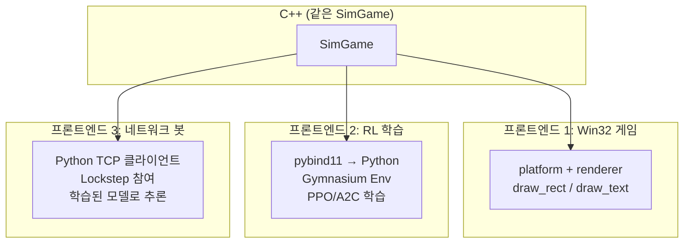
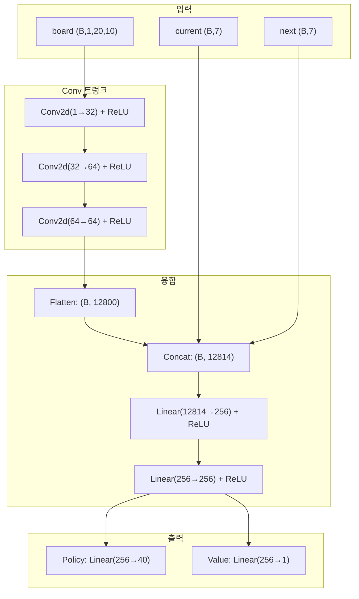
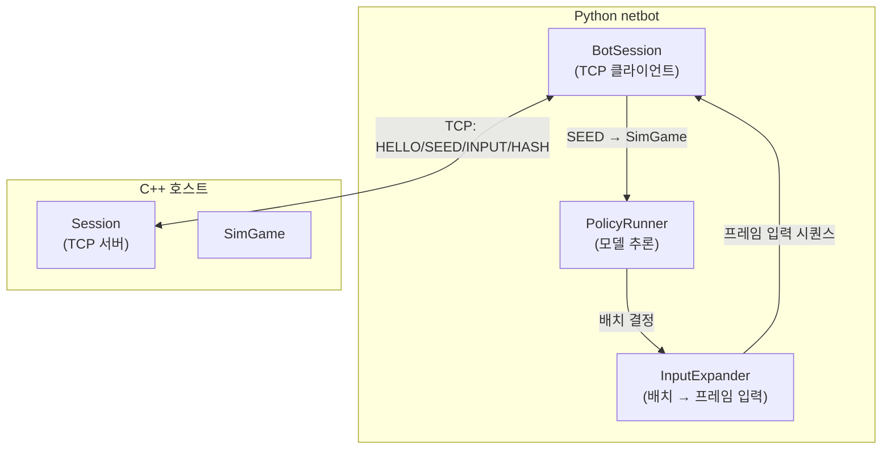
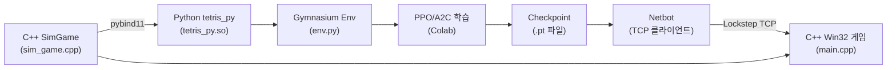

# Part 6: Python 바인딩과 강화학습 — pybind11에서 Colab 학습까지

> **시리즈:** 제로부터 멀티플레이어 테트리스 + RL까지
> [Part 1: 윈도우와 OpenGL](./part1-window-and-opengl.md) | [Part 2: 2D 렌더링](./part2-2d-rendering.md) | [Part 3: 테트리스 로직](./part3-tetris-logic.md) | [Part 4: 게임 루프](./part4-game-loop.md) | [Part 5: 네트워킹](./part5-lockstep-networking.md) | **Part 6**

---

## 들어가며

Part 3의 `SimGame`은 C++ 순수 로직이다. Part 5의 Lockstep 네트코드는 두 명의 플레이어를 동기화한다. 이 두 시스템을 결합하면, 세 번째 프론트엔드가 가능해진다: **AI 에이전트가 네트워크로 대전한다.**

이것을 실현하려면:
1. C++ SimGame을 Python에서 호출할 수 있어야 한다 (pybind11)
2. 강화학습 프레임워크가 이해하는 인터페이스로 감싸야 한다 (Gymnasium 환경)
3. 정책 네트워크를 설계하고 학습해야 한다 (CNN + policy/value head)
4. 학습된 모델이 Lockstep 클라이언트로 네트워크 대전에 참여해야 한다 (netbot)

같은 `SimGame` C++ 코드가 세 가지 프론트엔드를 구동한다:



이 시리즈의 전체 소스 코드는 `bindings/tetris_py.cpp` (133줄), `python/common/` (6개 모듈, ~500줄), `python/netbot/` (~900줄), `tests/sim_hash_dump.cpp` (162줄)에 해당한다.

---

## 1. pybind11 바인딩

### 1.1 왜 pybind11인가

C++에서 Python으로의 바인딩 방법은 여러 가지다:

| 방법 | 장점 | 단점 |
|------|------|------|
| ctypes / cffi | Python 표준, 별도 빌드 불필요 | C API만 가능, 클래스 노출 어려움 |
| Cython | 성숙, 성능 좋음 | 별도 언어 문법 학습 필요 |
| **pybind11** | C++11 네이티브, 헤더 전용, numpy 통합 | CMake 설정 필요 |
| SWIG | 다중 언어 | 코드 생성 복잡, C++ 템플릿 제한 |

pybind11의 결정적 장점: C++ 클래스를 그대로 Python에 노출할 수 있고, numpy 배열과의 변환이 간단하다. 헤더 전용이므로 `pip install pybind11` 후 바로 사용 가능.

### 1.2 CMake 설정

```cmake
# CMakeLists.txt — pybind11 모듈
if (TETRIS_BUILD_PY)
    set(PYBIND11_FINDPYTHON ON)
    find_package(pybind11 CONFIG QUIET)
    if (NOT pybind11_FOUND)
        message(FATAL_ERROR
            "pybind11 not found. Install: pip install pybind11")
    endif()

    pybind11_add_module(tetris_py
        bindings/tetris_py.cpp
        ${TETRIS_SIM_SOURCES}     # sim_game.cpp, position.cpp
        ${TETRIS_SIM_HEADERS}
    )
    target_include_directories(tetris_py PRIVATE ${CMAKE_CURRENT_SOURCE_DIR})
endif()
```

`pybind11_add_module`은 공유 라이브러리(.pyd / .so)를 생성한다. 이 모듈은 `import tetris_py`로 Python에서 로드된다. raylib이나 Win32 API에 의존하지 않으므로 Linux/macOS에서도 빌드 가능하다.

### 1.3 바인딩 코드

```cpp
// bindings/tetris_py.cpp
#include <pybind11/pybind11.h>
#include <pybind11/stl.h>
#include <pybind11/numpy.h>
#include "../src/sim_game.h"

namespace py = pybind11;

PYBIND11_MODULE(tetris_py, m)
{
    // Placement 구조체
    py::class_<SimGame::Placement>(m, "Placement")
        .def_readonly("col", &SimGame::Placement::col)
        .def_readonly("rot", &SimGame::Placement::rot);

    // SimBlock (읽기 전용 관측 핸들)
    py::class_<SimBlock>(m, "SimBlock")
        .def_readonly("id",             &SimBlock::id)
        .def_readonly("rotation_state", &SimBlock::rotationState)
        .def_readonly("row_offset",     &SimBlock::rowOffset)
        .def_readonly("column_offset",  &SimBlock::columnOffset)
        .def("cell_positions", [](const SimBlock& b) {
            auto tiles = b.GetCellPositions();
            py::list out;
            for (const auto& t : tiles)
                out.append(py::make_tuple(t.row, t.column));
            return out;
        });

    // SimGame
    py::class_<SimGame>(m, "SimGame")
        .def(py::init<uint64_t>(), py::arg("seed") = 0)

        // RL 학습용 API
        .def("legal_placements", &SimGame::LegalPlacements)
        .def("apply_placement",  &SimGame::ApplyPlacement,
             py::arg("col"), py::arg("rot"))

        // Lockstep용 API
        .def("submit_input",     &SimGame::SubmitInput, py::arg("input_mask"))
        .def("tick",             &SimGame::Tick)

        // 관측 접근자
        .def("grid", [](const SimGame& g) {
            // 20x10 int 배열을 numpy로 복사
            const auto& raw = g.Grid();
            auto arr = py::array_t<int32_t>({20, 10});
            auto buf = arr.mutable_unchecked<2>();
            for (int r = 0; r < 20; ++r)
                for (int c = 0; c < 10; ++c)
                    buf(r, c) = raw[r][c];
            return arr;
        })
        .def("current_block", &SimGame::CurrentBlock,
             py::return_value_policy::reference_internal)
        .def("score",      &SimGame::Score)
        .def("game_over",  &SimGame::IsGameOver)
        .def("state_hash", &SimGame::StateHash);
}
```

### 1.4 grid()의 복사 정책

`grid()` 바인딩에서 `int grid[20][10]`을 numpy 배열로 **복사**한다. 참조를 반환하지 않는 이유:

```python
# 위험: 참조 반환 시
arr = game.grid()        # arr이 SimGame 내부 메모리를 직접 가리킴
game.apply_placement(4, 0)  # SimGame 내부 상태 변경
# arr이 가리키는 메모리가 이미 바뀜 → 이전 관측이 아닌 현재 상태를 보게 됨
```

더 심각한 경우: `SimGame` 객체가 소멸된 후 `arr`에 접근하면 **dangling pointer**가 된다. 200개 int(800바이트) 복사 비용은 학습 처리량 대비 무시할 수 있으므로, 안전한 복사를 선택했다.

### 1.5 reference_internal 정책

`current_block()`, `ghost_block()`, `next_block()`은 `py::return_value_policy::reference_internal`을 사용한다. 이 정책은 "반환된 참조의 수명을 부모 객체(SimGame)에 묶는다". SimGame이 살아있는 동안 블록 참조도 유효하다.

```python
block = game.current_block()   # SimGame 내부의 SimBlock에 대한 참조
print(block.id)                # OK (game이 살아있으므로)
del game                        # SimGame 소멸
print(block.id)                 # Python에서 에러 (내부적으로 보호됨)
```

---

## 2. 관측 공간 설계

### 2.1 관측 구성

```python
# python/common/obs.py
def build_observation(sim: SimGame) -> dict[str, torch.Tensor]:
    raw = np.asarray(sim.grid(), dtype=np.float32)      # (20, 10)
    occupied = ((raw > 0) & (raw != 8)).astype(np.float32)
    board = occupied[None, :, :]                          # (1, 20, 10)

    current = _piece_one_hot(sim.current_block_id())     # (7,)
    nxt     = _piece_one_hot(sim.next_block_id())        # (7,)

    return {"board": torch.from_numpy(board),
            "current": torch.from_numpy(current),
            "next": torch.from_numpy(nxt)}
```

| 키 | 형태 | 내용 |
|----|------|------|
| `board` | `(1, 20, 10)` float32 | 점유맵: 1 = 잠긴 블록, 0 = 빈칸 |
| `current` | `(7,)` float32 | 현재 블록 ID의 one-hot |
| `next` | `(7,)` float32 | 다음 블록 ID의 one-hot |

### 2.2 설계 결정

**고스트 블록 제외**: 고스트(id=8)는 현재 블록의 하드 드롭 위치 프리뷰다. 정책이 이미 합법적 배치(placement)를 결정하므로, 고스트 정보는 중복이다. `(raw > 0) & (raw != 8)`로 필터링한다.

**현재 블록의 위치/회전 제외**: placement-level API에서 정책은 "이 블록을 어디에 놓을 것인가"를 결정한다. 현재 블록의 중간 상태(떨어지는 중의 위치/회전)는 이 API에서 무관하다. 블록 **종류**(id)만 필요하므로 one-hot으로 충분하다.

**float32 점유맵**: 원본 그리드는 0~8 int이지만, CNN 입력으로는 이진 점유맵(0/1)이 적합하다. 블록 색상(1~7)은 게임 진행에 무관한 시각적 속성이므로 제거한다.

---

## 3. 행동 공간 설계

### 3.1 배치 수준 행동

```python
# python/common/__init__.py
NUM_COLS = 10
NUM_ROTATIONS = 4
NUM_PLACEMENTS = NUM_COLS * NUM_ROTATIONS  # 40
```

40개 이산 행동: 10열 x 4회전. 인코딩:

$$\text{action} = \text{col} \times 4 + \text{rot}$$

```python
# python/common/action_mask.py
def encode_action(col: int, rot: int) -> int:
    return col * NUM_ROTATIONS + rot

def decode_action(action: int) -> tuple[int, int]:
    return action // NUM_ROTATIONS, action % NUM_ROTATIONS
```

### 3.2 합법 행동 마스크

모든 40개 행동이 항상 유효하지는 않다. O 블록(정사각형)은 4개의 회전 상태가 동일하므로 사실상 1개의 유효 회전만 있다. I 블록이 가장자리 열에서는 범위를 벗어날 수도 있다.

```python
def legal_mask(sim: SimGame) -> torch.Tensor:
    mask = torch.zeros(NUM_PLACEMENTS, dtype=torch.bool)
    for placement in sim.legal_placements():
        mask[encode_action(placement.col, placement.rot)] = True
    return mask
```

`sim.legal_placements()`는 C++ 측에서 모든 (col, rot) 조합을 검증한다: 회전 → 이동 → 하드 드롭 시뮬레이션. 유효한 조합만 반환.

정책 네트워크의 출력(40개 logit)에 합법 마스크를 적용하면, 불법 행동의 확률이 정확히 0이 된다:

```python
def masked_log_softmax(logits, mask, eps=1e-9):
    masked = logits.masked_fill(~mask, float("-inf"))
    return F.log_softmax(masked + eps, dim=-1)
```

불법 행동의 logit을 $-\infty$로 설정하면 softmax 후 확률이 0이 된다.

---

## 4. Gymnasium 환경

### 4.1 인터페이스

```python
# python/common/env.py
class TetrisPlacementEnv(gym.Env):
    metadata = {"render_modes": []}

    def __init__(self, seed=None):
        self.action_space = spaces.Discrete(NUM_PLACEMENTS)  # 40
        self.observation_space = spaces.Dict({
            "board":   spaces.Box(0, 1, (1, 20, 10), float32),
            "current": spaces.Box(0, 1, (7,),        float32),
            "next":    spaces.Box(0, 1, (7,),        float32),
        })
```

표준 Gymnasium 인터페이스를 따르므로, CleanRL, Stable Baselines3, RLlib 등 어떤 RL 프레임워크든 바로 연결 가능하다.

### 4.2 step()

```python
def step(self, action):
    col, rot = decode_action(int(action))
    cleared = self.sim.apply_placement(col, rot)

    if cleared < 0:
        reward = 0.0           # 불법 배치 → 0 보상 (방어적 처리)
    else:
        reward = float(cleared) # 클리어된 줄 수 = 보상

    terminated = self.sim.game_over()
    truncated = False
    return self._observation(), reward, terminated, truncated, self._info()
```

**보상 = 클리어된 줄 수 (0~4)**. 이 단순한 보상 함수가 작동하는 이유: 라인을 많이 클리어하면 높은 보상, 게임 오버되면 에피소드 종료(미래 보상 상실). 에이전트는 자연스럽게 "오래 생존하면서 많이 클리어"하는 전략을 학습한다.

### 4.3 info dict

```python
def _info(self):
    return {
        "legal_mask": legal_mask(self.sim).numpy(),
        "score": self.sim.score(),
        "state_hash": self.sim.state_hash(),
    }
```

`legal_mask`는 매 step마다 반환된다. 정책이 이 마스크를 사용해 불법 행동을 필터링한다. `state_hash`는 디버깅 용도.

---

## 5. CNN 정책 네트워크

### 5.1 아키텍처

```python
# python/common/models.py
class TetrisPolicyNet(nn.Module):
    ARCH_VERSION = 1

    def __init__(self, conv_channels=(32, 64, 64), hidden=256):
        # Conv 트렁크: (B, 1, 20, 10) → (B, 64, 20, 10)
        self.trunk = nn.Sequential(
            nn.Conv2d(1, 32, 3, padding=1), nn.ReLU(),
            nn.Conv2d(32, 64, 3, padding=1), nn.ReLU(),
            nn.Conv2d(64, 64, 3, padding=1), nn.ReLU(),
        )
        # Flatten + piece info → FC
        flat = 64 * 20 * 10  # 12,800
        self.fuse = nn.Sequential(
            nn.Linear(flat + 14, hidden), nn.ReLU(),  # +14 = current(7) + next(7)
            nn.Linear(hidden, hidden), nn.ReLU(),
        )
        self.policy_head = nn.Linear(hidden, 40)   # 40개 행동
        self.value_head  = nn.Linear(hidden, 1)    # 상태 가치
```



### 5.2 설계 결정

**Conv2d(kernel=3, padding=1)**: 3x3 커널로 인접 셀의 패턴(빈 행, 높이 차이, 구멍)을 감지한다. `padding=1`로 공간 차원을 보존한다. 테트리스 보드는 20x10으로 작아서 풀링 없이 전체 해상도를 유지한다.

**현재/다음 블록을 concat으로 융합**: 블록 정보를 CNN 입력 채널로 추가하는 방법도 있지만, one-hot 벡터 7개를 20x10 전체에 브로드캐스트하면 파라미터 대비 정보가 희박하다. flatten 후 concat이 더 효율적이다.

**Actor-Critic 구조**: policy head(40개 logit)와 value head(스칼라)를 공유 트렁크에서 분기한다. PPO, A2C 등 policy gradient 알고리즘이 이 구조를 요구한다.

### 5.3 ARCH_VERSION 가드

```python
ARCH_VERSION = 1
```

아키텍처가 바뀔 때마다 이 값을 증가시킨다. 체크포인트 로더가 이 값을 검증한다.

아키텍처 변경 없이 `ARCH_VERSION`을 올리지 않으면: Colab에서 학습한 가중치가 엉뚱한 레이어에 로드되어, 모델이 의미 없는 행동을 출력한다. PyTorch의 `load_state_dict`는 키 이름만 검증하므로, 같은 이름이면 shape이 달라도 에러 없이 로드될 수 있다 (이후 forward pass에서 shape mismatch 에러).

---

## 6. 체크포인트 시스템

### 6.1 저장

```python
# python/common/checkpoint.py
def save_checkpoint(model, path, extra=None):
    payload = {
        "state_dict": model.state_dict(),
        "__meta__": {
            "arch_version": TetrisPolicyNet.ARCH_VERSION,
            "class": "TetrisPolicyNet",
            **(extra or {}),
        },
    }
    torch.save(payload, str(path))
```

### 6.2 로드

```python
def load_checkpoint(path, device="cpu"):
    payload = torch.load(str(path), map_location=device, weights_only=False)
    meta = payload.get("__meta__", {})

    # 아키텍처 버전 검증
    if meta.get("arch_version") != TetrisPolicyNet.ARCH_VERSION:
        raise RuntimeError(
            f"Checkpoint arch_version {meta.get('arch_version')!r} != "
            f"current {TetrisPolicyNet.ARCH_VERSION!r}")

    model = TetrisPolicyNet()
    model.load_state_dict(payload["state_dict"])
    model.to(device).eval()
    return model
```

`map_location=device`가 크로스 플랫폼 이식에서 중요하다. Colab(Linux, CUDA)에서 학습한 모델을 Windows(CPU)에서 로드할 때, GPU 텐서를 CPU로 자동 매핑한다.

---

## 7. BCTS Dellacherie 베이스라인

### 7.1 손수 만든 평가 함수

RL 학습 전에, 손으로 설계한 평가 함수로 "괜찮은" 수준의 AI를 만들 수 있다:

```python
# python/common/features.py
BCTS_WEIGHTS = {
    "aggregate_height": -0.510066,
    "bumpiness":        -0.184483,
    "holes":            -0.35663,
    "max_height":        0.0,
    "rows_cleared":      0.760666,
    "wells":            -0.1,
}
```

이 가중치는 Dellacherie(2003)의 연구에서 유래한다. 각 합법 배치에 대해 보드 상태를 시뮬레이션하고, 위 특성의 가중합을 계산하여 가장 높은 점수의 배치를 선택한다.

특성의 의미:

| 특성 | 계산 | 의미 |
|------|------|------|
| `aggregate_height` | 모든 열의 높이 합 | 높을수록 위험 (음의 가중치) |
| `bumpiness` | 인접 열 높이 차이의 절대값 합 | 울퉁불퉁할수록 비효율 |
| `holes` | 위에 채워진 셀이 있는 빈칸 수 | 구멍은 라인 클리어를 방해 |
| `wells` | 양쪽이 높고 가운데가 낮은 깊이의 삼각합 | 깊은 우물은 I 블록 전용 |
| `rows_cleared` | 클리어된 줄 수 | 유일한 양의 가중치 |

### 7.2 BCTS의 성능

학습 없이도 BCTS 에이전트는 수백~수천 줄을 클리어할 수 있다. 이것이 RL 학습의 **베이스라인 하한**이 된다: 학습된 정책이 BCTS를 이기지 못하면 학습에 문제가 있다.

---

## 8. 네트워크 봇

### 8.1 아키텍처

네트워크 봇은 Part 5의 Lockstep 클라이언트를 Python으로 구현한 것이다. C++ Win32 게임과 동일한 프레이밍/메시지를 사용하므로, C++ 호스트와 Python 봇이 직접 대전할 수 있다.



핵심 구성 요소:

1. **BotSession**: Part 5의 `Session`과 동일한 프로토콜을 Python으로 구현. HELLO/SEED 핸드셰이크, INPUT 송수신, HASH 교차 검증.
2. **PolicyRunner**: 매 배치 시점에 `build_observation()` → 모델 추론 → `decode_action()`. BCTS 규칙 기반과 신경망 정책 중 선택 가능.
3. **InputExpander**: placement-level 결정(col, rot)을 frame-level 입력 시퀀스(좌/우 이동, 회전, 하드 드롭)로 변환. Lockstep은 프레임 단위 입력을 요구하므로.

### 8.2 배치 → 프레임 변환

RL 학습은 배치 단위(col, rot)이지만, Lockstep 네트워크는 프레임 단위(틱마다 비트마스크)다. 변환 알고리즘:

1. 현재 블록의 회전 상태에서 목표 회전까지 필요한 회전 수 계산
2. 현재 열에서 목표 열까지 필요한 이동 수 계산
3. 회전 입력 → 이동 입력 → 하드 드롭 순서로 프레임 입력 생성

---

## 9. 크로스 플랫폼 결정론 테스트

### 9.1 C++ 레퍼런스 덤프

```cpp
// tests/sim_hash_dump.cpp — 결정론적 입력 스크립트
struct Step { uint8_t mask; int ticks; };

const Step SCRIPT[] = {
    {0x00, 30},   // 30틱 대기
    {0x01, 1},    // LEFT
    {0x01, 1},    // LEFT
    {0x01, 1},    // LEFT
    {0x08, 1},    // ROTATE
    {0x10, 2},    // DROP + 2틱
    // ... 30개 스텝
};
```

이 스크립트를 여러 시드에 대해 실행하고, 각 스텝 후의 `StateHash()`를 출력한다. 이 출력이 **레퍼런스**다.

### 9.2 Python 교차 검증

```python
# python/tests/test_determinism_crossplatform.py
def _run_script(seed):
    sim = SimGame(seed)
    out = []
    total_ticks = 0
    for step_index, (mask, ticks) in enumerate(SCRIPT):
        sim.submit_input(mask)
        for _ in range(ticks):
            sim.tick()
            total_ticks += 1
        out.append((step_index, total_ticks, sim.score(),
                     sim.game_over(), sim.state_hash()))
    return out
```

Python 바인딩(Linux Colab에서 빌드)으로 같은 스크립트를 실행한다. 모든 스텝의 `state_hash`가 C++ 레퍼런스와 일치하면, Linux와 Windows 빌드가 비트 단위로 동일하다는 증거다.

### 9.3 왜 이 테스트가 필요한가

SimGame은 순수 정수 연산(XorShift64*, FNV-1a, 그리드 조작)만 사용하므로 이론적으로 크로스 플랫폼 결정론이 보장된다. 그러나:

- `int`의 크기: C++ 표준은 `int`가 최소 16비트라고만 정의한다 (대부분 32비트이지만)
- unsigned modulo: `rng.nextUInt(7)`에서 `next() % 7`의 동작이 unsigned 64비트 modulo에 의존
- 메모리 레이아웃: `sizeof(int) * 20 * 10 = 800`이 양쪽에서 동일해야 `fnv1a64`의 결과가 일치

이 테스트는 이런 가정이 실제로 성립하는지 자동으로 검증한다.

---

## 오류와 함정

### (1) numpy 배열의 dangling pointer

**증상:** Python에서 `sim.grid()` 반환값에 접근 시 세그먼트 폴트 또는 쓰레기 데이터.

**원인:** grid()가 SimGame 내부 메모리에 대한 참조를 반환하면, SimGame이 소멸되거나 상태가 바뀐 후 numpy 배열이 무효한 메모리를 가리킨다.

**해결:** grid() 바인딩에서 데이터를 **복사**하여 반환. 800바이트 복사는 무시할 수 있는 비용.

### (2) ARCH_VERSION 미갱신

**증상:** 학습된 모델을 로드했는데 정책이 의미 없는 행동을 출력한다. 에러 없이 로드됨.

**원인:** `models.py`에서 레이어 크기를 변경했지만 `ARCH_VERSION`을 올리지 않아, 이전 체크포인트의 가중치가 새 아키텍처에 로드됨.

**해결:** `checkpoint.py`의 로더가 `ARCH_VERSION` 불일치 시 `RuntimeError`를 발생시킨다. 아키텍처 변경 시 반드시 버전을 올린다.

### (3) Colab → Windows 이식 시 endianness

**증상:** Colab(Linux x86_64)에서 학습한 모델이 Windows에서 다른 출력을 낸다.

**원인:** PyTorch의 `.pt` 파일은 텐서를 네이티브 endianness로 저장한다. 그러나 x86과 x86_64는 모두 리틀 엔디안이므로, **이 경우에는 문제가 없다.** ARM이나 다른 빅 엔디안 플랫폼으로 이식할 때만 주의.

PyTorch의 `torch.save`/`torch.load`는 내부적으로 pickle + zipfile을 사용하며, `map_location` 파라미터가 디바이스 매핑을 처리한다. 엔디안 변환은 PyTorch가 자동 처리하지 않으므로, 빅 엔디안 플랫폼에서는 수동 변환이 필요하다.

### (4) 합법 마스크와 탐색 정책

**증상:** 학습 초기에 에이전트가 불법 행동을 선택하려고 해서 보상이 항상 0.

**원인:** `legal_mask`를 정책에 적용하지 않으면, 40개 행동 중 유효한 것이 ~20개 정도이므로 무작위 탐색의 절반이 불법 행동.

**해결:** `masked_log_softmax`로 불법 행동의 logit을 $-\infty$로 설정. 이것은 학습의 **필수 요소**이지, 선택이 아니다.

---

## 정리

전체 파이프라인:



1. **C++ SimGame** — 결정론적 게임 로직 (Part 3)
2. **pybind11** — C++ → Python 브릿지
3. **Gymnasium 환경** — RL 프레임워크 표준 인터페이스
4. **학습** — Colab에서 PPO/A2C로 정책 학습
5. **체크포인트** — arch_version 가드로 안전한 모델 이식
6. **Netbot** — 학습된 정책이 Lockstep으로 네트워크 대전

이 시리즈의 출발점은 `InitWindow(500, 620, "TETRIS")` 한 줄이었다. 6편에 걸쳐 그 한 줄이 숨기는 실체를 풀어냈다: Win32 윈도우, OpenGL 렌더링, 결정론적 시뮬레이션, 고정 틱 게임 루프, TCP Lockstep 네트워킹, 그리고 Python RL 학습 파이프라인. 각 계층이 아래 계층 위에 쌓이며, 최종적으로 C++ 시뮬레이터가 세 가지 프론트엔드를 구동하는 아키텍처에 도달했다.

---

## 참고 자료

1. **pybind11 documentation** (pybind11.readthedocs.io). "First Steps", "NumPy", "Return Value Policies" — C++ 객체를 Python에 노출하는 패턴
2. **Gymnasium API** (gymnasium.farama.org). `Env.step()`, `Env.reset()`, `spaces.Dict` — 표준 RL 환경 인터페이스
3. **Christophe Thiery & Bruno Scherrer**, "Building Controllers for Tetris" (2009, International Computer Games Association Journal). BCTS 특성 집합의 정의와 최적 가중치 탐색
4. **Dellacherie's Tetris AI** (2003). 6개 특성의 선형 조합으로 수만 줄 클리어를 달성한 최초의 체계적 접근
5. **Volodymyr Mnih et al.**, "Human-level control through deep reinforcement learning" (2015, Nature). CNN + RL로 Atari 게임을 학습한 DQN 논문 — 이 프로젝트의 아키텍처 참고
6. **John Schulman et al.**, "Proximal Policy Optimization Algorithms" (2017, arXiv). PPO 알고리즘 — 이 프로젝트의 학습에 적합한 policy gradient 방법
