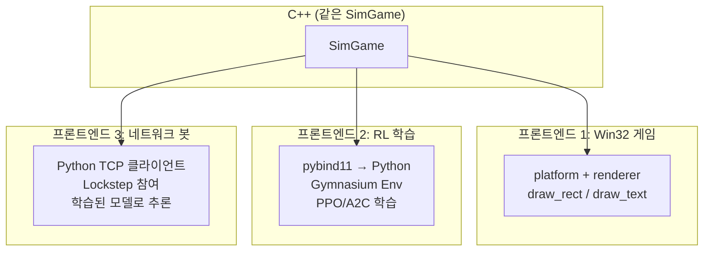
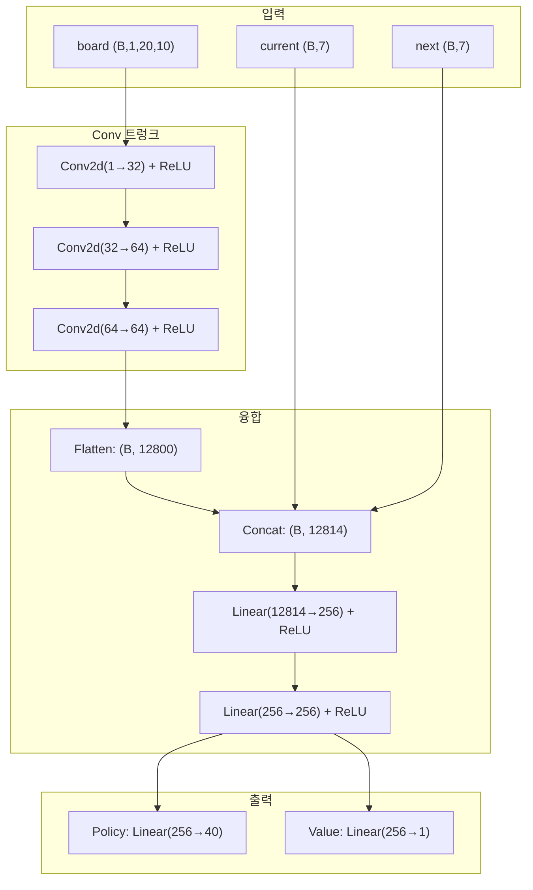
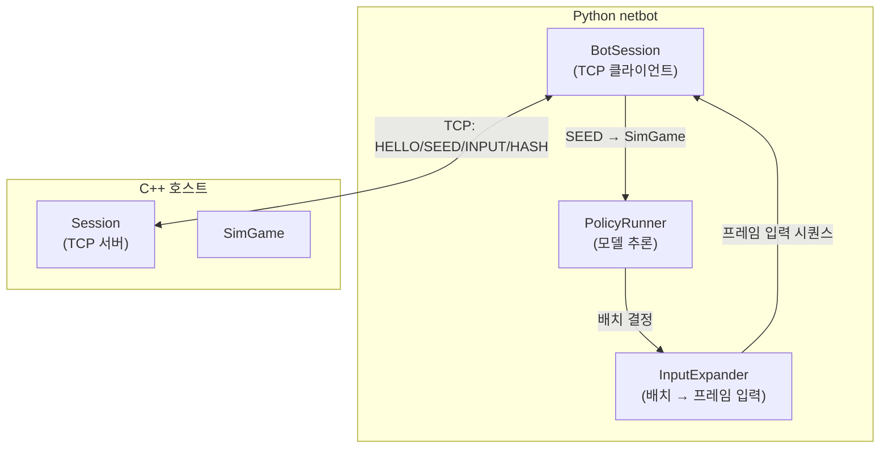
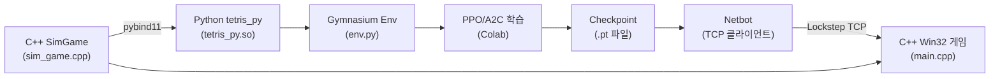
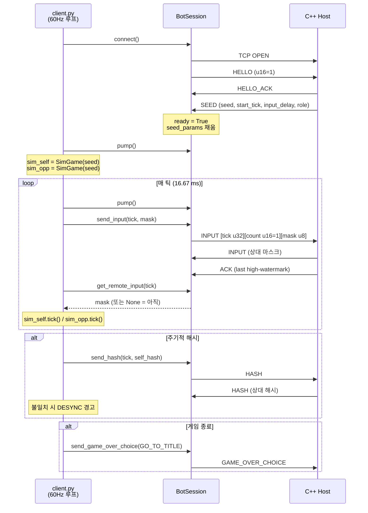
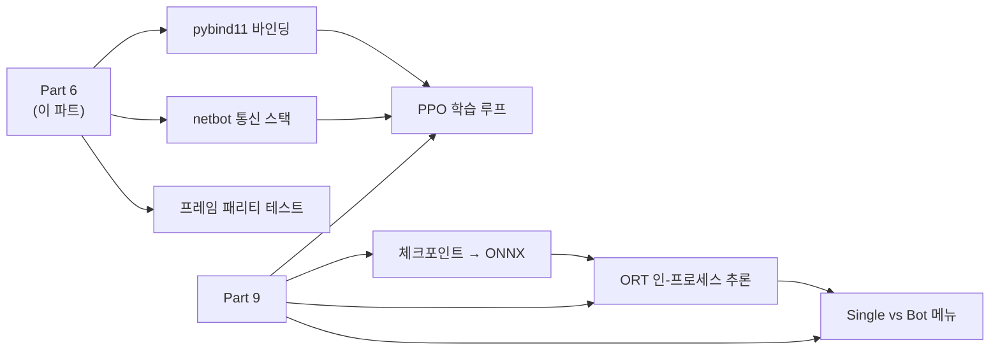

# Part 6: Python 바인딩과 강화학습 — pybind11에서 Colab 학습까지

> **시리즈:** 제로부터 멀티플레이어 테트리스 + RL까지
> [Part 0: 셋업](./part0-project-setup.md) | [Part 1: Win32+GL](./part1-window-and-opengl.md) | [Part 2: 2D 렌더링](./part2-2d-rendering.md) | [Part 3: 테트리스 로직](./part3-tetris-logic.md) | [Part 4: 게임 루프](./part4-game-loop.md) | [Part 5: 네트워킹](./part5-lockstep-networking.md) | **Part 6** | [Part 7: 오디오](./part7-xaudio2-audio.md) | [Part 8: 릴레이 서버](./part8-relay-server.md) | [Part 9: RL + ONNX 봇](./part9-rl-onnx-bot.md)

---

## 들어가며

Part 3의 `SimGame`은 C++ 순수 로직이다. Part 5의 Lockstep 네트코드는 두 명의 플레이어를 동기화한다. 이 두 시스템을 결합하면, 세 번째 프론트엔드가 가능해진다: **AI 에이전트가 네트워크로 대전한다.**

이것을 실현하려면:
1. C++ SimGame을 Python에서 호출할 수 있어야 한다 (pybind11)
2. 강화학습 프레임워크가 이해하는 인터페이스로 감싸야 한다 (Gymnasium 환경)
3. 정책 네트워크를 설계하고 학습해야 한다 (CNN + policy/value head)
4. 학습된 모델이 Lockstep 클라이언트로 네트워크 대전에 참여해야 한다 (netbot)

같은 `SimGame` C++ 코드가 세 가지 프론트엔드를 구동한다:



이 시리즈의 전체 소스 코드는 `bindings/tetris_py.cpp` (133줄), `python/common/` (6개 모듈, ~500줄), `python/netbot/` (~900줄), `tests/sim_hash_dump.cpp` (162줄)에 해당한다.

---

## 1. pybind11 바인딩

### 1.1 왜 pybind11인가

C++에서 Python으로의 바인딩 방법은 여러 가지다:

| 방법 | 장점 | 단점 |
|------|------|------|
| ctypes / cffi | Python 표준, 별도 빌드 불필요 | C API만 가능, 클래스 노출 어려움 |
| Cython | 성숙, 성능 좋음 | 별도 언어 문법 학습 필요 |
| **pybind11** | C++11 네이티브, 헤더 전용, numpy 통합 | CMake 설정 필요 |
| SWIG | 다중 언어 | 코드 생성 복잡, C++ 템플릿 제한 |

pybind11의 결정적 장점: C++ 클래스를 그대로 Python에 노출할 수 있고, numpy 배열과의 변환이 간단하다. 헤더 전용이므로 `pip install pybind11` 후 바로 사용 가능.

### 1.2 CMake 설정

```cmake
# CMakeLists.txt — pybind11 모듈
if (TETRIS_BUILD_PY)
    set(PYBIND11_FINDPYTHON ON)
    find_package(pybind11 CONFIG QUIET)
    if (NOT pybind11_FOUND)
        message(FATAL_ERROR
            "pybind11 not found. Install: pip install pybind11")
    endif()

    pybind11_add_module(tetris_py
        bindings/tetris_py.cpp
        ${TETRIS_SIM_SOURCES}     # sim_game.cpp, position.cpp
        ${TETRIS_SIM_HEADERS}
    )
    target_include_directories(tetris_py PRIVATE ${CMAKE_CURRENT_SOURCE_DIR})
endif()
```

`pybind11_add_module`은 공유 라이브러리(.pyd / .so)를 생성한다. 이 모듈은 `import tetris_py`로 Python에서 로드된다. raylib이나 Win32 API에 의존하지 않으므로 Linux/macOS에서도 빌드 가능하다.

### 1.3 바인딩 코드

```cpp
// bindings/tetris_py.cpp
#include <pybind11/pybind11.h>
#include <pybind11/stl.h>
#include <pybind11/numpy.h>
#include "../src/sim_game.h"

namespace py = pybind11;

PYBIND11_MODULE(tetris_py, m)
{
    // Placement 구조체
    py::class_<SimGame::Placement>(m, "Placement")
        .def_readonly("col", &SimGame::Placement::col)
        .def_readonly("rot", &SimGame::Placement::rot);

    // SimBlock (읽기 전용 관측 핸들)
    py::class_<SimBlock>(m, "SimBlock")
        .def_readonly("id",             &SimBlock::id)
        .def_readonly("rotation_state", &SimBlock::rotationState)
        .def_readonly("row_offset",     &SimBlock::rowOffset)
        .def_readonly("column_offset",  &SimBlock::columnOffset)
        .def("cell_positions", [](const SimBlock& b) {
            auto tiles = b.GetCellPositions();
            py::list out;
            for (const auto& t : tiles)
                out.append(py::make_tuple(t.row, t.column));
            return out;
        });

    // SimGame
    py::class_<SimGame>(m, "SimGame")
        .def(py::init<uint64_t>(), py::arg("seed") = 0)

        // RL 학습용 API
        .def("legal_placements", &SimGame::LegalPlacements)
        .def("apply_placement",  &SimGame::ApplyPlacement,
             py::arg("col"), py::arg("rot"))

        // Lockstep용 API
        .def("submit_input",     &SimGame::SubmitInput, py::arg("input_mask"))
        .def("tick",             &SimGame::Tick)

        // 관측 접근자
        .def("grid", [](const SimGame& g) {
            // 20x10 int 배열을 numpy로 복사
            const auto& raw = g.Grid();
            auto arr = py::array_t<int32_t>({20, 10});
            auto buf = arr.mutable_unchecked<2>();
            for (int r = 0; r < 20; ++r)
                for (int c = 0; c < 10; ++c)
                    buf(r, c) = raw[r][c];
            return arr;
        })
        .def("current_block", &SimGame::CurrentBlock,
             py::return_value_policy::reference_internal)
        .def("score",      &SimGame::Score)
        .def("game_over",  &SimGame::IsGameOver)
        .def("state_hash", &SimGame::StateHash);
}
```

### 1.4 grid()의 복사 정책

`grid()` 바인딩에서 `int grid[20][10]`을 numpy 배열로 **복사**한다. 참조를 반환하지 않는 이유:

```python
# 위험: 참조 반환 시
arr = game.grid()        # arr이 SimGame 내부 메모리를 직접 가리킴
game.apply_placement(4, 0)  # SimGame 내부 상태 변경
# arr이 가리키는 메모리가 이미 바뀜 → 이전 관측이 아닌 현재 상태를 보게 됨
```

더 심각한 경우: `SimGame` 객체가 소멸된 후 `arr`에 접근하면 **dangling pointer**가 된다. 200개 int(800바이트) 복사 비용은 학습 처리량 대비 무시할 수 있으므로, 안전한 복사를 선택했다.

### 1.5 reference_internal 정책

`current_block()`, `ghost_block()`, `next_block()`은 `py::return_value_policy::reference_internal`을 사용한다. 이 정책은 "반환된 참조의 수명을 부모 객체(SimGame)에 묶는다". SimGame이 살아있는 동안 블록 참조도 유효하다.

```python
block = game.current_block()   # SimGame 내부의 SimBlock에 대한 참조
print(block.id)                # OK (game이 살아있으므로)
del game                        # SimGame 소멸
print(block.id)                 # Python에서 에러 (내부적으로 보호됨)
```

---

## 2. 관측 공간 설계

### 2.1 관측 구성

```python
# python/common/obs.py
def build_observation(sim: SimGame) -> dict[str, torch.Tensor]:
    raw = np.asarray(sim.grid(), dtype=np.float32)      # (20, 10)
    occupied = ((raw > 0) & (raw != 8)).astype(np.float32)
    board = occupied[None, :, :]                          # (1, 20, 10)

    current = _piece_one_hot(sim.current_block_id())     # (7,)
    nxt     = _piece_one_hot(sim.next_block_id())        # (7,)

    return {"board": torch.from_numpy(board),
            "current": torch.from_numpy(current),
            "next": torch.from_numpy(nxt)}
```

| 키 | 형태 | 내용 |
|----|------|------|
| `board` | `(1, 20, 10)` float32 | 점유맵: 1 = 잠긴 블록, 0 = 빈칸 |
| `current` | `(7,)` float32 | 현재 블록 ID의 one-hot |
| `next` | `(7,)` float32 | 다음 블록 ID의 one-hot |

### 2.2 설계 결정

**고스트 블록 제외**: 고스트(id=8)는 현재 블록의 하드 드롭 위치 프리뷰다. 정책이 이미 합법적 배치(placement)를 결정하므로, 고스트 정보는 중복이다. `(raw > 0) & (raw != 8)`로 필터링한다.

**현재 블록의 위치/회전 제외**: placement-level API에서 정책은 "이 블록을 어디에 놓을 것인가"를 결정한다. 현재 블록의 중간 상태(떨어지는 중의 위치/회전)는 이 API에서 무관하다. 블록 **종류**(id)만 필요하므로 one-hot으로 충분하다.

**float32 점유맵**: 원본 그리드는 0~8 int이지만, CNN 입력으로는 이진 점유맵(0/1)이 적합하다. 블록 색상(1~7)은 게임 진행에 무관한 시각적 속성이므로 제거한다.

---

## 3. 행동 공간 설계

### 3.1 배치 수준 행동

```python
# python/common/__init__.py
NUM_COLS = 10
NUM_ROTATIONS = 4
NUM_PLACEMENTS = NUM_COLS * NUM_ROTATIONS  # 40
```

40개 이산 행동: 10열 x 4회전. 인코딩:

$$\text{action} = \text{col} \times 4 + \text{rot}$$

```python
# python/common/action_mask.py
def encode_action(col: int, rot: int) -> int:
    return col * NUM_ROTATIONS + rot

def decode_action(action: int) -> tuple[int, int]:
    return action // NUM_ROTATIONS, action % NUM_ROTATIONS
```

### 3.2 합법 행동 마스크

모든 40개 행동이 항상 유효하지는 않다. O 블록(정사각형)은 4개의 회전 상태가 동일하므로 사실상 1개의 유효 회전만 있다. I 블록이 가장자리 열에서는 범위를 벗어날 수도 있다.

```python
def legal_mask(sim: SimGame) -> torch.Tensor:
    mask = torch.zeros(NUM_PLACEMENTS, dtype=torch.bool)
    for placement in sim.legal_placements():
        mask[encode_action(placement.col, placement.rot)] = True
    return mask
```

`sim.legal_placements()`는 C++ 측에서 모든 (col, rot) 조합을 검증한다: 회전 → 이동 → 하드 드롭 시뮬레이션. 유효한 조합만 반환.

정책 네트워크의 출력(40개 logit)에 합법 마스크를 적용하면, 불법 행동의 확률이 정확히 0이 된다:

```python
def masked_log_softmax(logits, mask, eps=1e-9):
    masked = logits.masked_fill(~mask, float("-inf"))
    return F.log_softmax(masked + eps, dim=-1)
```

불법 행동의 logit을 $-\infty$로 설정하면 softmax 후 확률이 0이 된다.

---

## 4. Gymnasium 환경

### 4.1 인터페이스

```python
# python/common/env.py
class TetrisPlacementEnv(gym.Env):
    metadata = {"render_modes": []}

    def __init__(self, seed=None):
        self.action_space = spaces.Discrete(NUM_PLACEMENTS)  # 40
        self.observation_space = spaces.Dict({
            "board":   spaces.Box(0, 1, (1, 20, 10), float32),
            "current": spaces.Box(0, 1, (7,),        float32),
            "next":    spaces.Box(0, 1, (7,),        float32),
        })
```

표준 Gymnasium 인터페이스를 따르므로, CleanRL, Stable Baselines3, RLlib 등 어떤 RL 프레임워크든 바로 연결 가능하다.

### 4.2 step()

```python
def step(self, action):
    col, rot = decode_action(int(action))
    cleared = self.sim.apply_placement(col, rot)

    if cleared < 0:
        reward = 0.0           # 불법 배치 → 0 보상 (방어적 처리)
    else:
        reward = float(cleared) # 클리어된 줄 수 = 보상

    terminated = self.sim.game_over()
    truncated = False
    return self._observation(), reward, terminated, truncated, self._info()
```

**보상 = 클리어된 줄 수 (0~4)**. 이 단순한 보상 함수가 작동하는 이유: 라인을 많이 클리어하면 높은 보상, 게임 오버되면 에피소드 종료(미래 보상 상실). 에이전트는 자연스럽게 "오래 생존하면서 많이 클리어"하는 전략을 학습한다.

### 4.3 info dict

```python
def _info(self):
    return {
        "legal_mask": legal_mask(self.sim).numpy(),
        "score": self.sim.score(),
        "state_hash": self.sim.state_hash(),
    }
```

`legal_mask`는 매 step마다 반환된다. 정책이 이 마스크를 사용해 불법 행동을 필터링한다. `state_hash`는 디버깅 용도.

---

## 5. CNN 정책 네트워크

### 5.1 아키텍처

```python
# python/common/models.py
class TetrisPolicyNet(nn.Module):
    ARCH_VERSION = 1

    def __init__(self, conv_channels=(32, 64, 64), hidden=256):
        # Conv 트렁크: (B, 1, 20, 10) → (B, 64, 20, 10)
        self.trunk = nn.Sequential(
            nn.Conv2d(1, 32, 3, padding=1), nn.ReLU(),
            nn.Conv2d(32, 64, 3, padding=1), nn.ReLU(),
            nn.Conv2d(64, 64, 3, padding=1), nn.ReLU(),
        )
        # Flatten + piece info → FC
        flat = 64 * 20 * 10  # 12,800
        self.fuse = nn.Sequential(
            nn.Linear(flat + 14, hidden), nn.ReLU(),  # +14 = current(7) + next(7)
            nn.Linear(hidden, hidden), nn.ReLU(),
        )
        self.policy_head = nn.Linear(hidden, 40)   # 40개 행동
        self.value_head  = nn.Linear(hidden, 1)    # 상태 가치
```



### 5.2 설계 결정

**Conv2d(kernel=3, padding=1)**: 3x3 커널로 인접 셀의 패턴(빈 행, 높이 차이, 구멍)을 감지한다. `padding=1`로 공간 차원을 보존한다. 테트리스 보드는 20x10으로 작아서 풀링 없이 전체 해상도를 유지한다.

**현재/다음 블록을 concat으로 융합**: 블록 정보를 CNN 입력 채널로 추가하는 방법도 있지만, one-hot 벡터 7개를 20x10 전체에 브로드캐스트하면 파라미터 대비 정보가 희박하다. flatten 후 concat이 더 효율적이다.

**Actor-Critic 구조**: policy head(40개 logit)와 value head(스칼라)를 공유 트렁크에서 분기한다. PPO, A2C 등 policy gradient 알고리즘이 이 구조를 요구한다.

### 5.3 ARCH_VERSION 가드

```python
ARCH_VERSION = 1
```

아키텍처가 바뀔 때마다 이 값을 증가시킨다. 체크포인트 로더가 이 값을 검증한다.

아키텍처 변경 없이 `ARCH_VERSION`을 올리지 않으면: Colab에서 학습한 가중치가 엉뚱한 레이어에 로드되어, 모델이 의미 없는 행동을 출력한다. PyTorch의 `load_state_dict`는 키 이름만 검증하므로, 같은 이름이면 shape이 달라도 에러 없이 로드될 수 있다 (이후 forward pass에서 shape mismatch 에러).

---

## 6. 체크포인트 시스템

### 6.1 저장

```python
# python/common/checkpoint.py
def save_checkpoint(model, path, extra=None):
    payload = {
        "state_dict": model.state_dict(),
        "__meta__": {
            "arch_version": TetrisPolicyNet.ARCH_VERSION,
            "class": "TetrisPolicyNet",
            **(extra or {}),
        },
    }
    torch.save(payload, str(path))
```

### 6.2 로드

```python
def load_checkpoint(path, device="cpu"):
    payload = torch.load(str(path), map_location=device, weights_only=False)
    meta = payload.get("__meta__", {})

    # 아키텍처 버전 검증
    if meta.get("arch_version") != TetrisPolicyNet.ARCH_VERSION:
        raise RuntimeError(
            f"Checkpoint arch_version {meta.get('arch_version')!r} != "
            f"current {TetrisPolicyNet.ARCH_VERSION!r}")

    model = TetrisPolicyNet()
    model.load_state_dict(payload["state_dict"])
    model.to(device).eval()
    return model
```

`map_location=device`가 크로스 플랫폼 이식에서 중요하다. Colab(Linux, CUDA)에서 학습한 모델을 Windows(CPU)에서 로드할 때, GPU 텐서를 CPU로 자동 매핑한다.

---

## 7. BCTS Dellacherie 베이스라인

### 7.1 손수 만든 평가 함수

RL 학습 전에, 손으로 설계한 평가 함수로 "괜찮은" 수준의 AI를 만들 수 있다:

```python
# python/common/features.py
BCTS_WEIGHTS = {
    "aggregate_height": -0.510066,
    "bumpiness":        -0.184483,
    "holes":            -0.35663,
    "max_height":        0.0,
    "rows_cleared":      0.760666,
    "wells":            -0.1,
}
```

이 가중치는 Dellacherie(2003)의 연구에서 유래한다. 각 합법 배치에 대해 보드 상태를 시뮬레이션하고, 위 특성의 가중합을 계산하여 가장 높은 점수의 배치를 선택한다.

특성의 의미:

| 특성 | 계산 | 의미 |
|------|------|------|
| `aggregate_height` | 모든 열의 높이 합 | 높을수록 위험 (음의 가중치) |
| `bumpiness` | 인접 열 높이 차이의 절대값 합 | 울퉁불퉁할수록 비효율 |
| `holes` | 위에 채워진 셀이 있는 빈칸 수 | 구멍은 라인 클리어를 방해 |
| `wells` | 양쪽이 높고 가운데가 낮은 깊이의 삼각합 | 깊은 우물은 I 블록 전용 |
| `rows_cleared` | 클리어된 줄 수 | 유일한 양의 가중치 |

### 7.2 BCTS의 성능

학습 없이도 BCTS 에이전트는 수백~수천 줄을 클리어할 수 있다. 이것이 RL 학습의 **베이스라인 하한**이 된다: 학습된 정책이 BCTS를 이기지 못하면 학습에 문제가 있다.

---

## 8. 네트워크 봇

### 8.1 아키텍처

네트워크 봇은 Part 5의 Lockstep 클라이언트를 Python으로 구현한 것이다. C++ Win32 게임과 동일한 프레이밍/메시지를 사용하므로, C++ 호스트와 Python 봇이 직접 대전할 수 있다.



핵심 구성 요소:

1. **BotSession**: Part 5의 `Session`과 동일한 프로토콜을 Python으로 구현. HELLO/SEED 핸드셰이크, INPUT 송수신, HASH 교차 검증.
2. **PolicyRunner**: 매 배치 시점에 `build_observation()` → 모델 추론 → `decode_action()`. BCTS 규칙 기반과 신경망 정책 중 선택 가능.
3. **InputExpander**: placement-level 결정(col, rot)을 frame-level 입력 시퀀스(좌/우 이동, 회전, 하드 드롭)로 변환. Lockstep은 프레임 단위 입력을 요구하므로.

### 8.2 배치 → 프레임 변환

RL 학습은 배치 단위(col, rot)이지만, Lockstep 네트워크는 프레임 단위(틱마다 비트마스크)다. 변환 알고리즘:

1. 현재 블록의 회전 상태에서 목표 회전까지 필요한 회전 수 계산
2. 현재 열에서 목표 열까지 필요한 이동 수 계산
3. 회전 입력 → 이동 입력 → 하드 드롭 순서로 프레임 입력 생성

---

## 9. 크로스 플랫폼 결정론 테스트

### 9.1 C++ 레퍼런스 덤프

```cpp
// tests/sim_hash_dump.cpp — 결정론적 입력 스크립트
struct Step { uint8_t mask; int ticks; };

const Step SCRIPT[] = {
    {0x00, 30},   // 30틱 대기
    {0x01, 1},    // LEFT
    {0x01, 1},    // LEFT
    {0x01, 1},    // LEFT
    {0x08, 1},    // ROTATE
    {0x10, 2},    // DROP + 2틱
    // ... 30개 스텝
};
```

이 스크립트를 여러 시드에 대해 실행하고, 각 스텝 후의 `StateHash()`를 출력한다. 이 출력이 **레퍼런스**다.

### 9.2 Python 교차 검증

```python
# python/tests/test_determinism_crossplatform.py
def _run_script(seed):
    sim = SimGame(seed)
    out = []
    total_ticks = 0
    for step_index, (mask, ticks) in enumerate(SCRIPT):
        sim.submit_input(mask)
        for _ in range(ticks):
            sim.tick()
            total_ticks += 1
        out.append((step_index, total_ticks, sim.score(),
                     sim.game_over(), sim.state_hash()))
    return out
```

Python 바인딩(Linux Colab에서 빌드)으로 같은 스크립트를 실행한다. 모든 스텝의 `state_hash`가 C++ 레퍼런스와 일치하면, Linux와 Windows 빌드가 비트 단위로 동일하다는 증거다.

### 9.3 왜 이 테스트가 필요한가

SimGame은 순수 정수 연산(XorShift64*, FNV-1a, 그리드 조작)만 사용하므로 이론적으로 크로스 플랫폼 결정론이 보장된다. 그러나:

- `int`의 크기: C++ 표준은 `int`가 최소 16비트라고만 정의한다 (대부분 32비트이지만)
- unsigned modulo: `rng.nextUInt(7)`에서 `next() % 7`의 동작이 unsigned 64비트 modulo에 의존
- 메모리 레이아웃: `sizeof(int) * 20 * 10 = 800`이 양쪽에서 동일해야 `fnv1a64`의 결과가 일치

이 테스트는 이런 가정이 실제로 성립하는지 자동으로 검증한다.

---

## 오류와 함정

### (1) numpy 배열의 dangling pointer

**증상:** Python에서 `sim.grid()` 반환값에 접근 시 세그먼트 폴트 또는 쓰레기 데이터.

**원인:** grid()가 SimGame 내부 메모리에 대한 참조를 반환하면, SimGame이 소멸되거나 상태가 바뀐 후 numpy 배열이 무효한 메모리를 가리킨다.

**해결:** grid() 바인딩에서 데이터를 **복사**하여 반환. 800바이트 복사는 무시할 수 있는 비용.

### (2) ARCH_VERSION 미갱신

**증상:** 학습된 모델을 로드했는데 정책이 의미 없는 행동을 출력한다. 에러 없이 로드됨.

**원인:** `models.py`에서 레이어 크기를 변경했지만 `ARCH_VERSION`을 올리지 않아, 이전 체크포인트의 가중치가 새 아키텍처에 로드됨.

**해결:** `checkpoint.py`의 로더가 `ARCH_VERSION` 불일치 시 `RuntimeError`를 발생시킨다. 아키텍처 변경 시 반드시 버전을 올린다.

### (3) Colab → Windows 이식 시 endianness

**증상:** Colab(Linux x86_64)에서 학습한 모델이 Windows에서 다른 출력을 낸다.

**원인:** PyTorch의 `.pt` 파일은 텐서를 네이티브 endianness로 저장한다. 그러나 x86과 x86_64는 모두 리틀 엔디안이므로, **이 경우에는 문제가 없다.** ARM이나 다른 빅 엔디안 플랫폼으로 이식할 때만 주의.

PyTorch의 `torch.save`/`torch.load`는 내부적으로 pickle + zipfile을 사용하며, `map_location` 파라미터가 디바이스 매핑을 처리한다. 엔디안 변환은 PyTorch가 자동 처리하지 않으므로, 빅 엔디안 플랫폼에서는 수동 변환이 필요하다.

### (4) 합법 마스크와 탐색 정책

**증상:** 학습 초기에 에이전트가 불법 행동을 선택하려고 해서 보상이 항상 0.

**원인:** `legal_mask`를 정책에 적용하지 않으면, 40개 행동 중 유효한 것이 ~20개 정도이므로 무작위 탐색의 절반이 불법 행동.

**해결:** `masked_log_softmax`로 불법 행동의 logit을 $-\infty$로 설정. 이것은 학습의 **필수 요소**이지, 선택이 아니다.

---

## 정리

전체 파이프라인:



1. **C++ SimGame** — 결정론적 게임 로직 (Part 3)
2. **pybind11** — C++ → Python 브릿지
3. **Gymnasium 환경** — RL 프레임워크 표준 인터페이스
4. **학습** — Colab에서 PPO/A2C로 정책 학습
5. **체크포인트** — arch_version 가드로 안전한 모델 이식
6. **Netbot** — 학습된 정책이 Lockstep으로 네트워크 대전

이 시리즈의 출발점은 `InitWindow(500, 620, "TETRIS")` 한 줄이었다. 6편에 걸쳐 그 한 줄이 숨기는 실체를 풀어냈다: Win32 윈도우, OpenGL 렌더링, 결정론적 시뮬레이션, 고정 틱 게임 루프, TCP Lockstep 네트워킹, 그리고 Python RL 학습 파이프라인. 각 계층이 아래 계층 위에 쌓이며, 최종적으로 C++ 시뮬레이터가 세 가지 프론트엔드를 구동하는 아키텍처에 도달했다.

---

## 부록: ONNX 모델 추론 — "Single vs Bot" 메뉴 (Section C)

Netbot 은 학습된 정책을 **TCP 클라이언트**로 돌린다 (별도 프로세스, 별도 머신
가능). 하지만 오프라인에서 혼자 봇과 대전하고 싶을 때는, 추론을 게임 프로세스
**안에서 직접 실행**하는 편이 낫다 — 네트워크 루프도, 별도 파이썬도 필요 없다.

이 경로가 Section C 에서 추가된 **ONNX Runtime 인-프로세스 추론**이다.

### 1. PyTorch → ONNX 변환

`python/netbot/export_onnx.py` 가 체크포인트를 ONNX 그래프로 직렬화한다:

```bash
uv run --directory python python -m netbot.export_onnx \
    checkpoints/step_N.pt \
    ../model/policy.onnx
```

내부적으로 `torch.onnx.export(policy, dummy_input, ...)` 를 호출하며 동적
축(batch dimension)을 열어둬서 `batch_size=1` 추론에 바로 쓸 수 있게 한다.

### 2. C++ 측 로더 — `bot/bot_onnx.cpp`

C++ 코드는 `Ort::Session` 을 싱글톤으로 들고 관측값을 꽂아 `Run()` 을 호출한다:

```cpp
bot::BotOnnx bot;
if (bot.Load("model/policy.onnx")) {
    float logits[kNumActions];
    bot.Infer(observation, logits);
    int action = argmax_with_mask(logits, legal_mask);
}
```

`BotOnnx::Infer` 는 입력 텐서 복사 → `Run()` → 출력 텐서 읽기 순. 연산은 CPU 로
끝나고(대략 0.3–0.8 ms/스텝, ResNet-S 기준), 60Hz 루프에 무리 없다.

### 3. 메뉴 분기 — "Single vs Bot"

CMake 옵션 `TETRIS_BUILD_BOT=ON` 로 빌드하면 `TETRIS_HAS_ONNXRUNTIME` 매크로가
켜지고, `src/main.cpp` 의 메인 메뉴에 "Single vs Bot" 항목이 활성화된다.
`model/policy.onnx` 가 존재하지 않으면 회색 비활성. OFF 로 빌드하면
`bot_onnx.cpp` 가 스텁 모드로 컴파일되어 `Load()` 가 항상 false 를 반환한다 —
`TETRIS_BUILD_BOT` 플래그만 바꿔서 배포본을 재빌드할 수 있는 구조.

```
Menu ─┬─ Single              ← 1P 연습
      ├─ Single vs Bot       ← [이 부록] 같은 프로세스 안에서 ONNX 추론
      ├─ Multi (direct)      ← --host / --connect
      └─ Multi (relay)       ← --queue 또는 --relay + 메뉴 Custom Room
```

### 4. Netbot vs 인-프로세스 봇 — 언제 어느 쪽?

| 시나리오 | 추천 경로 |
|---|---|
| 학습 루프 (self-play, 수천 에피소드) | Netbot + `tetris --host` headless |
| 오프라인 Demo / 유튜브 녹화        | 인-프로세스 ONNX |
| 크로스플랫폼 봇 테스트 (M1 Mac 등) | 인-프로세스 ONNX (ORT 유니버설 빌드) |
| 모델 A/B 비교                   | Netbot 두 프로세스, 서로 `--connect` |

Netbot 경로가 여전히 "권위적" — 실 대전 프로토콜을 타므로 호스트-넷봇 간
해시 검증까지 포함한 완전한 결정론 확인이 가능하다. 인-프로세스 경로는
편의 기능이다.

---

## 10. netbot 클라이언트 아키텍처

8 절에서 "네트워크 봇" 의 큰 그림을 그렸다면, 이제 실제 코드 레벨에서 **netbot
을 어떻게 돌리는지** 들여다 본다. 소스 트리로 보면 `python/netbot/` 이 세 층으로
나뉘어 있다:

```
python/netbot/
├── framing.py          ← 프레임 직렬화/파싱 (Part 5 의 net/framing.* 포팅)
├── session.py          ← TCP 세션 · HELLO/SEED 핸드셰이크 · INPUT 큐
├── input_expander.py   ← 배치(col,rot) → 프레임 입력 시퀀스
├── policy_runner.py    ← 규칙 기반 · 학습된 정책을 한 인터페이스로
├── client.py           ← 60Hz 루프 · 위의 모든 것을 붙인다
└── export_onnx.py      ← (Part 9 에서 자세히) 체크포인트 → ONNX
```

C++ 쪽의 `net::Session` 은 **I/O 전용 스레드** 를 들고 돈다 (Part 5 참고).
Python 쪽의 `BotSession` 은 정반대 선택을 했다: **단일 스레드, 명시적 pump**.

### 10.1 왜 단일 스레드인가

루프 주기가 16.67 ms (= 1000/60) 이다. 현대 OS 의 non-blocking `recv`/`send`
한 쌍은 마이크로초 단위로 끝난다. 스레드를 쪼개는 순간 얻는 것은 거의 없고
잃는 것은 분명하다:

- **결정론 훼손 위험** — Lockstep 은 "모든 사이드가 같은 입력을 같은 틱에
  본다" 가 생명이다. 백그라운드 스레드가 `remote_inputs` 에 쓰는 동안 메인
  스레드가 읽으면 락이 필요하고, 락을 잘못 쓰면 틱이 어긋난다.
- **디버깅 지옥** — 실패 재현이 어렵다. "왜 가끔 desync 가 터지지?" 가
  스레드 타이밍 이슈로 들어가면 로그만으로는 추적 불가.
- **Python GIL** — 어차피 Python 에서 I/O 와 연산이 같은 GIL 아래서 돈다.
  netbot 에서 CPU-bound 부분(모델 추론)은 torch 내부에서 GIL 을 놓지만,
  `socket.recv` 자체는 GIL 을 쥐고도 충분히 빠르다.

단일 스레드 + 명시적 `pump()` 는 "이 줄 다음엔 소켓이 건드려지지 않는다"
를 보장한다. 리플레이 디버거를 붙일 때도 훨씬 수월하다.

### 10.2 60Hz 루프 스켈레톤

`python/netbot/client.py` 의 `run()` 을 요지만 뽑으면 다음과 같다.

```python
# python/netbot/client.py (요지)
sess = BotSession(host, port)
sess.connect()

# 핸드셰이크 — SEED 오기 전까지는 루프 진입 금지
while not sess.ready:
    if sess.failed or time.perf_counter() > handshake_deadline:
        sess.close()
        return 2
    sess.pump()
    time.sleep(0.002)

# Sim 은 SEED 받은 후에 생성 — 같은 시드로 두 보드 미러링
sim_self = SimGame(seed)
sim_opp  = SimGame(seed)

runner = make_runner(args.policy, args.device)
local_tick_next = 0
sim_tick = 0
next_deadline = time.perf_counter()

while True:
    sess.pump()                              # (1) 소켓 I/O
    if sess.failed: ...                      # (2) 실패 처리

    now = time.perf_counter()
    if now < next_deadline:                  # (3) 틱 페이스
        time.sleep(min(0.002, next_deadline - now))
        continue
    next_deadline += TICK_PERIOD             # 누적식 — 드리프트 제로

    if start_delay > 0:                      # (4) 시작 지연 동안 INPUT 금지
        start_delay -= 1
        continue

    mask = decide_input_for_this_tick(...)   # (5) 배치 → 프레임 마스크
    sess.send_input(local_tick_next, mask)
    local_tick_next += 1

    advance_sim_up_to_safe_tick(...)         # (6) Lockstep 시뮬 진행
    maybe_send_hash(...)                     # (7) 주기적 해시 크로스체크
    if sim_self.game_over() or sim_opp.game_over(): ...   # (8) 종료
```

핵심 API 가 네 개 등장한다: **`connect()` · `pump()` · `send_input()` ·
`get_remote_input()`**. 이 네 개로 C++ 호스트와의 대전이 성립한다.



### 10.3 "start_delay 동안 INPUT 스킵" — F.1 수정

루프 안의 `if start_delay > 0: continue` 한 줄은 Part 5 의 설계와 맞물려 있다.
C++ 쪽 `src/main.cpp` 도 `start_tick` 만큼은 입력을 보내지 않는다. 예전 netbot
은 이 구간에 `INPUT_NONE` 을 보내고 `local_tick_next` 도 올렸는데, 호스트의
`input_delay` 만큼 뒤늦게 적용되는 바람에 **두 사이드의 틱 시작점이 어긋나는**
현상이 있었다. 지금은 C++ 과 같은 규약으로 통일됐다.

### 10.4 핸드셰이크 데드라인

`handshake_deadline = time.perf_counter() + 10.0` — 10 초 내에 SEED 가 안 오면
세션을 닫고 exit 2 로 죽는다. 호스트가 없거나, 방화벽이 막거나, 프로토콜이
깨졌을 때 무한 루프에 갇히는 대신 확실하게 실패한다. CI 에서 netbot 을
테스트할 때도 이 데드라인 덕에 stuck 테스트가 없다.

### 10.5 `from sim import SimGame` 를 늦게 하는 이유

네이티브 모듈(`tetris_py.pyd` / `.so`) 로드는 `--help` · 연결 실패보다 나중에
일어난다. 가령 플랫폼별 바이너리가 없는 상태에서 `python -m netbot.client
--help` 를 돌려도 바인딩 빌드 없이 에러 메시지를 보고 끝낼 수 있다. RL 학습/
ONNX 쪽 세부는 [Part 9](./part9-rl-onnx-bot.md) 에서 다룬다.

---

## 11. 프레임 계층 — `python/netbot/framing.py`

이 파일은 C++ `net/framing.h` / `net/framing.cpp` 를 **바이트 단위로 동일한**
결과가 나오도록 포팅한 것이다. 같은 `(MsgType, payload)` 쌍을 주면 양쪽이
같은 바이트열을 뱉어내야 한다. 그게 깨지면 netbot 이 호스트에게 "이해 안
가는 프레임" 을 보내게 되고, 체크섬 단계에서 조용히 drop 된다.

### 11.1 와이어 포맷 복기

```
[LEN u16 LE][TYPE u8][PAYLOAD LEN-1 bytes][CHECKSUM u32 LE]
```

- `LEN` = `1 + len(payload)` (TYPE 바이트까지 포함)
- `CHECKSUM` = `fnv1a32(payload)` — **payload 만** 덮는다. 헤더/타입 미포함.
- payload 가 비면 체크섬은 `0` 으로 short-circuit. C++ 쪽과 동일한 규약.

### 11.2 FNV-1a32 — `& 0xFFFFFFFF` 가 왜 필요한가

```python
# python/netbot/framing.py
FNV1A32_OFFSET = 2166136261  # 0x811C9DC5
FNV1A32_PRIME  = 16777619    # 0x01000193
FNV1A32_MASK   = 0xFFFFFFFF


def fnv1a32(data: bytes, seed: int = FNV1A32_OFFSET) -> int:
    """FNV-1a 32-bit hash. Identical bit pattern to ``net::fnv1a32`` in C++."""
    h = seed & FNV1A32_MASK
    for byte in data:
        h ^= byte
        h = (h * FNV1A32_PRIME) & FNV1A32_MASK
    return h
```

C++ 의 `uint32_t h` 는 곱셈 후 **자연스럽게 상위 비트가 잘린다** (truncation).
Python 의 `int` 는 임의 정밀 정수라 그런 자동 자르기가 없다. 마스크를 빠뜨리면:

- 매 바이트마다 `h *= PRIME` 이 누적되면서 `h` 가 쑥쑥 커진다.
- 나중에 LE u32 로 저장할 때는 `struct.pack("<I", ...)` 가 `h & 0xFFFFFFFF`
  을 한 뒤 나머지를 버린다. 하지만 **중간 XOR** 단계가 32 비트를 넘어서 동작
  하므로 결과 비트 패턴이 C++ 과 달라진다.
- 결과: 둘 다 "FNV-1a32 비스무리한 것" 을 계산하지만 값이 달라서 모든 프레임이
  체크섬 불일치로 drop. netbot 이 붙자마자 조용히 죽는다.

`& FNV1A32_MASK` 를 매 곱셈마다 거는 것이 해답이다. seed 도 입구에서 마스킹
해서 사용자가 음수나 큰 수를 넘겨도 동일 동작.

이런 종류의 버그는 유닛 테스트가 없으면 정말 잡기 어렵다 — 그래서 공식 FNV
테스트 벡터 (`b""`, `b"a"`, `b"b"`, `b"foobar"`) 를 고정 기대값과 대조한다.
[다음 섹션](#13-테스트--크로스-언어-패리티) 에서 자세히 다룬다.

### 11.3 `build_frame` — 전체 인용

```python
# python/netbot/framing.py
def build_frame(msg_type: MsgType | int, payload: bytes | bytearray) -> bytes:
    """Serialise ``(msg_type, payload)`` into the wire format.

    The result is exactly what ``net::build_frame`` produces in C++ — bytewise
    identical, including the empty-payload checksum=0 short-circuit.
    """
    payload_bytes = bytes(payload)
    if len(payload_bytes) > MAX_PAYLOAD_BYTES:
        raise ValueError(f"frame payload exceeds MAX_PAYLOAD_BYTES: {len(payload_bytes)}")
    out = bytearray()
    length = TYPE_FIELD_BYTES + len(payload_bytes)
    if length > 0xFFFF:
        raise ValueError(f"frame payload too large: {len(payload_bytes)} bytes")
    le_write_u16(out, length)
    out.append(int(msg_type) & 0xFF)
    out += payload_bytes
    checksum = 0 if not payload_bytes else fnv1a32(payload_bytes)
    le_write_u32(out, checksum)
    return bytes(out)
```

- `payload_bytes = bytes(payload)` 로 한 번 복사. 호출자가 `bytearray` 를
  넘기고 나중에 수정해도 프레임은 영향 받지 않는다.
- `MAX_PAYLOAD_BYTES = 4096` 상한. u16 의 자연 한계는 65535 지만, 실사용
  최대(CHAT 200자 UTF-8 ~800B) 대비 4 KB 면 충분. 넘치면 즉시 `ValueError`.
- `length` 는 TYPE(1) + payload. TYPE 은 LEN 아래에 굳이 1 바이트를 추가로
  뽑지 않고 같이 센다 — C++ 과 같은 규약.
- empty payload 일 때 `checksum = 0` — C++ 의 short-circuit (아예 FNV 루프를
  돌지 않음) 과 비트 동일. `fnv1a32(b"")` 를 그대로 쓰면 `FNV1A32_OFFSET`
  (0x811C9DC5) 가 되어 버려서 C++ 과 어긋난다. **0 을 명시적으로** 넣어야 한다.

### 11.4 `parse_frames` — 전체 인용

```python
# python/netbot/framing.py
def parse_frames(stream_buf: bytearray) -> list[tuple[MsgType, bytes]]:
    """Pull all complete frames out of ``stream_buf`` and return them.

    Bytes belonging to fully-parsed frames are removed from ``stream_buf`` in
    place — partial frames at the end are left for the next call. Frames whose
    checksum doesn't match are silently dropped (same behaviour as the C++
    parser, which keeps the lockstep loop forgiving rather than fatal).
    """
    out: list[tuple[MsgType, bytes]] = []
    offset = 0
    buf_len = len(stream_buf)

    while True:
        if buf_len - offset < LEN_FIELD_BYTES:
            break

        length = le_read_u16(stream_buf, offset)
        # Drop the whole stream if a frame declares a payload larger than the
        # cap — matches the C++ behaviour and prevents an attacker from
        # making our recv buffer grow without bound.
        if length > MAX_PAYLOAD_BYTES + TYPE_FIELD_BYTES:
            del stream_buf[:]
            return out
        need = LEN_FIELD_BYTES + length + CHECKSUM_FIELD_BYTES
        if buf_len - offset < need:
            break

        msg_type_byte = stream_buf[offset + LEN_FIELD_BYTES]
        payload_start = offset + LEN_FIELD_BYTES + TYPE_FIELD_BYTES
        payload_len = length - TYPE_FIELD_BYTES
        payload = bytes(stream_buf[payload_start : payload_start + payload_len])

        chk_pos = offset + LEN_FIELD_BYTES + length
        chk = le_read_u32(stream_buf, chk_pos)
        calc = 0 if payload_len == 0 else fnv1a32(payload)

        if chk == calc:
            try:
                msg_type = MsgType(msg_type_byte)
            except ValueError:
                # Unknown type — drop the frame defensively rather than crash.
                pass
            else:
                out.append((msg_type, payload))

        offset += need

    if offset > 0:
        del stream_buf[:offset]

    return out
```

구현 포인트 몇 개.

1. **partial frame 보존** — 바이트가 부족하면 `break` 하고 그대로 return.
   호출자(= `_drain_recv`) 가 다음 `recv` 에서 바이트를 더 채운 뒤 다시 불러
   이어붙인다. 이 덕에 TCP 스트림의 "아무 경계에서나 끊길 수 있음" 성질을
   자연스럽게 흡수한다.
2. **오버사이즈 공격 방어** — `length > MAX_PAYLOAD_BYTES + TYPE_FIELD_BYTES`
   면 버퍼 전체를 폐기 (`del stream_buf[:]`) 하고 return. 악의적 peer 가
   `LEN=65535` 같은 프레임을 흘리면 `recv_buf` 가 64 KB 까지 부풀 수 있는데,
   그걸 즉시 자른다.
3. **체크섬 불일치는 드롭 · 끊지 않음** — C++ 쪽과 동일. lockstep 이 한두
   프레임에 과민 반응해 세션을 끊어버리면 오히려 복원력이 떨어진다.
4. **알 수 없는 타입** — `MsgType(msg_type_byte)` 가 `ValueError` 를 내면
   조용히 drop. 나중에 새 메시지 타입을 추가해도 구버전 netbot 이 죽지 않게
   하는 포워드 호환성.
5. **in-place 소비** — 끝에서 `del stream_buf[:offset]`. C++ 의 `erase` 와
   완전히 같은 동작. 큰 버퍼일수록 O(n) 삭제가 부담이라 싶지만, 실측 4 KB
   이하에서 의미 없는 수준.

### 11.5 왜 ASCII 프로토콜이 아닌가

JSON / MessagePack 도 충분히 빠를 것 같지만, 60Hz 루프에서 **모든 바이트가
예측 가능** 해야 디버깅이 쉽다. 바이너리 프레임은 와이어샤크로 뜯을 때도
오프셋이 고정이고, C++ 쪽이 `struct.pack` 없이 그냥 `memcpy` 로 끝난다는
장점이 있다. 그리고 무엇보다 — 게임 로직의 해시와 똑같은 FNV-1a 를 쓰니까
한 번 배운 지식이 재활용된다.

---

## 12. 세션 계층 — `python/netbot/session.py`

`framing.py` 가 "한 프레임을 바이트로 / 바이트에서" 라면, `session.py` 는
그 위에 **연결 수명 · 핸드셰이크 · 틱 버퍼** 를 얹는다. C++ 쪽의
`net::Session` (약 1000 줄) 에서 클라이언트 쪽 경로만 추려낸 다음, I/O
스레드를 빼고 단일 스레드로 옮긴 버전이다.

### 12.1 `SeedParams` — 호스트가 보내주는 것

```python
@dataclass
class SeedParams:
    """Mirror of ``net::SeedParams``. Populated when the host's SEED arrives."""
    seed: int = 0
    start_tick: int = 120
    input_delay: int = 2
    role: int = 1  # 1 = Host, 2 = Peer (we're the Peer when we Connect)
```

- `seed` — 블록 생성기 시드. 양쪽 `SimGame` 이 이 값으로 초기화되어야 보드가
  비트 단위로 같다.
- `start_tick` — 입력 금지 구간 (일종의 "3, 2, 1, GO" 카운트다운).
- `input_delay` — 적용까지의 버퍼 크기. 높을수록 지연은 크지만 네트워크
  여유가 커진다. Part 5 의 `safeTickInclusive` 공식의 입력.
- `role` — 1 이면 Host, 2 이면 Peer. netbot 은 항상 Peer 로 붙는다.

### 12.2 `_handle_frame` — 분기 전체

```python
# python/netbot/session.py
def _handle_frame(self, msg_type: MsgType, payload: bytes) -> None:
    if msg_type is MsgType.HELLO:
        # Defensive: clients normally don't receive HELLO from the host
        # (the host queues HELLO + SEED back-to-back), but reflect a
        # HELLO_ACK if we ever do, matching session.cpp:222-229.
        self.send_queue.append(build_frame(MsgType.HELLO_ACK, b"\x01"))

    elif msg_type is MsgType.HELLO_ACK:
        # No-op; the host is just acknowledging our HELLO.
        pass

    elif msg_type is MsgType.SEED:
        if len(payload) >= 8 + 4 + 1 + 1:
            self.seed_params = SeedParams(
                seed=le_read_u64(payload, 0),
                start_tick=le_read_u32(payload, 8),
                input_delay=payload[12],
                role=payload[13],
            )
            self.ready = True

    elif msg_type is MsgType.INPUT:
        if len(payload) >= 4 + 2:
            from_tick = le_read_u32(payload, 0)
            count = struct.unpack_from("<H", payload, 4)[0]
            # Match session.cpp:698 — reject if the claimed count doesn't
            # fit in the payload. Without this a malformed/truncated frame
            # silently drops ticks instead of failing loudly.
            if 6 + count > len(payload):
                return
            masks = payload[6 : 6 + count]
            for i, mask in enumerate(masks):
                tick = from_tick + i
                self.remote_inputs[tick] = mask
                if tick > self.last_remote_tick:
                    self.last_remote_tick = tick
            # Acknowledge the new high-watermark, exactly like the C++ host.
            ack_payload = struct.pack("<I", self.last_remote_tick)
            self.send_queue.append(build_frame(MsgType.ACK, ack_payload))

    elif msg_type is MsgType.ACK:
        # We don't currently use ACK for retry — the lockstep watermark
        # is enough. Kept here for symmetry with the C++ dispatch.
        pass

    elif msg_type is MsgType.HASH:
        if len(payload) == 4 + 8:
            self.last_remote_hash_tick = le_read_u32(payload, 0)
            self.last_remote_hash = le_read_u64(payload, 4)

    elif msg_type is MsgType.GAME_OVER_CHOICE:
        if len(payload) >= 1:
            self.remote_game_over_choice = payload[0]

    elif msg_type is MsgType.PING:
        # Echo PING -> PONG with the same payload (matches session.cpp:289-292)
        self.send_queue.append(build_frame(MsgType.PONG, payload))

        elif msg_type is MsgType.PONG:
            # RTT measurement can be added here if the bot needs latency stats.
            pass
```

8 가지 분기. 각각 주목할 점이 있다.

### 12.3 HELLO · HELLO_ACK — 방어적 거울

호스트 쪽은 netbot 의 HELLO 를 받자마자 HELLO_ACK + SEED 를 연달아 쏜다.
클라이언트가 HELLO 를 받을 일은 사실 없다. 그런데도 분기가 있는 이유는,
나중에 peer-to-peer 확장이나 HELLO 리시프로케이션이 붙을 때 대비한
방어적 구현이다. `HELLO_ACK` 페이로드가 `b"\x01"` 인 것은 C++ 쪽
`session.cpp:222-229` 에 맞춘 것 — 단순히 "1바이트 버전 태그" 정도의 의미.

### 12.4 SEED — ready 게이트

payload 최소 14 바이트 (`8 + 4 + 1 + 1`) 를 검증한 뒤 `SeedParams` 를 채우고
`self.ready = True`. 이 플래그가 올라가기 전까지 `client.py` 의 메인 루프는
아직 SimGame 도 안 만든 상태로 `sess.pump()` 만 돌리며 기다린다. 즉
**SEED 도착이 "진짜 게임 시작"의 트리거**.

### 12.5 INPUT — `cnt` 바운드 검증 (최근 수정)

```python
if 6 + count > len(payload):
    return
```

이 세 줄은 최근에 추가된 방어 코드다. 원래는 `count` 값을 믿고 그대로
`payload[6 : 6 + count]` 를 잘라냈는데, 만약 `count` 가 거짓말을 하면:

- `count = 1000` 이지만 payload 는 10 바이트인 경우, Python 의 슬라이스는
  예외 없이 그냥 **있는 만큼만** 잘라 준다 (`payload[6:1006]` → 최대 4 바이트).
- 결과: 입력 일부만 `remote_inputs` 에 저장되고 나머지 틱은 조용히 비어있음.
- Lockstep 루프는 `get_remote_input(tick)` 이 `None` 이면 진행 못 한다. 어딘가
  부터 틱 전진이 멈추는데 왜 멈췄는지 로그엔 단서가 없다.

C++ 쪽 `session.cpp:698` 에 이미 같은 검증이 있었는데 포팅할 때 누락된 것.
명시적으로 "payload 에 `count` 만큼 들어갈 공간이 없으면 전체 프레임 무시" 로
수정했다. 조용한 버그 하나 제거 — 이런 게 크로스 언어 포팅에서 제일 무섭다.

그리고 마지막 줄:

```python
ack_payload = struct.pack("<I", self.last_remote_tick)
self.send_queue.append(build_frame(MsgType.ACK, ack_payload))
```

INPUT 수신마다 ACK 로 "지금까지 본 최고 틱" 을 돌려준다. C++ 호스트의
Lockstep watermark 가 이 ACK 기반으로 진행하므로, 빠뜨리면 호스트가 tick
너머로 못 나아간다. 이것도 네트워크 프로토콜 포팅에서 쉽게 빼먹는 부분.

### 12.6 HASH — 교차 검증의 수신부

```python
elif msg_type is MsgType.HASH:
    if len(payload) == 4 + 8:
        self.last_remote_hash_tick = le_read_u32(payload, 0)
        self.last_remote_hash = le_read_u64(payload, 4)
```

payload 는 정확히 12 바이트 (`tick u32` + `hash u64`). 값만 저장하고 비교는
`client.py` 의 메인 루프에서 한다 — session 은 데이터 전송에만 집중, 로직은
client 가. 역할 분리 덕에 session 은 테스트하기 쉽다.

### 12.7 PING / PONG — 하트비트 에코

```python
elif msg_type is MsgType.PING:
    self.send_queue.append(build_frame(MsgType.PONG, payload))
```

호스트가 PING 을 보내면 같은 payload 로 PONG 돌려준다. 호스트 쪽 `Section
A` 의 심박 체크. netbot 이 응답 못 하면 호스트는 세션이 죽었다고 판단해
grace period 후 끊는다. 역으로 netbot 에서 PING 을 쏘는 기능은 아직 미구현
— RTT 측정이 필요해지면 `send_ping()` + `lastPongMs` 를 추가할 예정 (C++
쪽에는 이미 있다).

### 12.8 non-blocking I/O 규약

`pump()` 내부의 `_drain_send` / `_drain_recv` 는 `BlockingIOError` 와
`errno.EAGAIN` / `EWOULDBLOCK` 을 **정상 상태** 로 처리한다. 즉
"지금은 더 보낼/받을 게 없다" 신호로, 루프를 깨지 않는다. 반대로 `sent == 0`
이나 빈 `recv` 청크는 peer 가 닫았다는 뜻이니 `_mark_failed` 를 호출한다.

`_mark_failed` 는 **예외를 던지지 않고** `self.failed = True` 플래그만
세운다. 메인 루프가 다음 틱에 `if sess.failed:` 로 처리한다. 예외로 루프를
부수면 현재 틱 중간에 깨져서 상태가 지저분해지는데, 플래그 방식이면 루프 시작
지점에서 깔끔하게 청소 후 종료 가능.

### 12.9 `connect()` 의 FD leak 방어

```python
def connect(self) -> None:
    sock = socket.create_connection((self.host, self.port))
    try:
        sock.setblocking(False)
    except OSError:
        # setblocking 실패 시 fd 가 새어나가지 않도록 즉시 닫는다.
        try:
            sock.close()
        except OSError:
            pass
        raise
    self.sock = sock
    ...
```

`create_connection` 은 성공했는데 `setblocking(False)` 가 실패하는 경우 —
`self.sock` 에 아직 할당 전이라 그대로 예외가 올라가면 **소켓이 고아로 남는다**.
플랫폼 따라서는 그 상태로 프로세스 종료돼도 OS 가 정리해주지만, 장기 실행
프로세스에서는 fd leak 이 쌓인다. 명시적 `close()` 로 먼저 정리 후 raise.

드물지만 실제로 Windows WSL 에서 재현한 사례가 있다. 가상 네트워크 어댑터가
재설정되는 순간 `setblocking` 이 `OSError: [WinError 10054]` 를 내면서 죽는데,
그 뒤 5분쯤 지나면 새 소켓 할당이 실패한다. 위 try/except 한 번으로 해결.

### 12.10 `own_inputs` 를 세션이 들고 있는 이유

`send_input(tick, mask)` 는 큐에 넣는 동시에 `self.own_inputs[tick] = mask`
에도 기록한다. 왜? Lockstep 루프가 `sim_self.submit_input(my)` 로 **자기
입력도 재생** 해야 하기 때문. 이 맵이 없으면 client.py 가 별도 `localInputs`
딕셔너리를 들어야 하는데 — 두 벌 관리하면 불일치 위험. session 이
소유하고 `get_own_input(tick)` 으로 노출하는 쪽이 깔끔하다.

---

## 13. 플레이스먼트 전개 — `python/netbot/input_expander.py`

정책이 "이 블록은 `(col=4, rot=2)` 에 놓자" 라고 결정했을 때, 그걸 Lockstep
와이어에 태우려면 **프레임 단위 마스크 시퀀스** 로 풀어야 한다. 그게 이 파일의
역할이다 (90 줄짜리 가장 작은 모듈).

### 13.1 입력 비트 미러링

저장소 `python/netbot/input_expander.py` 라인 17-24 를 원문 그대로 가져온다.

```python
# Mirror of core/input.h - kept here so the netbot doesn't depend on building
# the C++ binding just to get a constant.
INPUT_NONE = 0
INPUT_LEFT = 1 << 0
INPUT_RIGHT = 1 << 1
INPUT_DOWN = 1 << 2
INPUT_ROTATE = 1 << 3
INPUT_DROP = 1 << 4
```

C++ `core/input.h` 의 비트 레이아웃을 그대로 하드코딩. `tetris_py.so` 를
import 하지 않아도 `--help` 가 동작해야 하므로 의도적 중복이다. 대신 두
곳이 어긋나면 desync 나는 구조라, framing 패리티 테스트와 동급의 주의가
필요하다 — 실제로 Part 7 진행 중 `INPUT_HOLD = 1 << 5` 를 추가했을 때
여기도 반드시 갱신해야 한다는 걸 리마인더 주석으로 붙여놨다.

### 13.2 `expand_placement` — 전체 인용

저장소 `python/netbot/input_expander.py` 라인 30-64 를 **한 줄도 생략하지 않고** 가져온다. 드라이런 리뷰어가 "1 단계(회전) 까지만 설명하고 2 단계(이동) · 3 단계(드롭) 가 끊겼다" 라고 지적한 자리. 아래 코드 블록 뒤에 세 단계 모두 풀어 쓴다.

```python
# python/netbot/input_expander.py
def expand_placement(
    cur_col: int,
    cur_rot: int,
    tgt_col: int,
    tgt_rot: int,
    num_rotations: int = 4,
) -> list[int]:
    """Build a frame-mask sequence that walks ``(cur_col, cur_rot)`` to
    ``(tgt_col, tgt_rot)`` and then hard drops.

    Rotations always go forward (the C++ block class only has ``Rotate`` /
    ``UndoRotation`` and rotation is the cheap operation, so 1-3 rotates is
    fine even if 1 backwards rotate would be shorter).
    """
    if num_rotations <= 0:
        raise ValueError(f"num_rotations must be positive, got {num_rotations}")
    seq: list[int] = []

    rot_steps = (tgt_rot - cur_rot) % num_rotations
    for _ in range(rot_steps):
        seq.append(INPUT_ROTATE)

    if tgt_col > cur_col:
        bit = INPUT_RIGHT
    elif tgt_col < cur_col:
        bit = INPUT_LEFT
    else:
        bit = INPUT_NONE

    if bit != INPUT_NONE:
        for _ in range(abs(tgt_col - cur_col)):
            seq.append(bit)

    seq.append(INPUT_DROP)
    return seq
```

순서는 **회전 × n → 이동 × m → 하드 드롭**. 이 순서가 중요하다.

**1. 회전 단계 — `rot_steps` 계산.** `(tgt_rot - cur_rot) % num_rotations` 로 "앞으로 몇 번 돌려야 하는가" 를 구한다. 예를 들어 `cur_rot=3`, `tgt_rot=1`, `num_rotations=4` 면 `(1 - 3) % 4 = 2` — 두 번 전방 회전으로 3 → 0 → 1 경유. `%` 가 Python 에서 항상 음이 아닌 나머지를 돌려주므로 추가 분기가 필요 없다. C++ `SimGame.LegalPlacements()` 가 반환하는 `(col, rot)` 은 회전 적용 **후** 최종 상태 기준이므로, 회전을 먼저 끝내놓고 이동을 시작해야 `tgt_col` 의 해석이 흔들리지 않는다 (특히 I 블록은 회전 전후로 bounding box 가 2 × 4 ↔ 4 × 2 로 바뀌어서 "현재 열" 의 의미가 달라진다).

**2. 이동 단계 — 좌우 반복 append.** `tgt_col > cur_col` 이면 `INPUT_RIGHT`, 작으면 `INPUT_LEFT`, 같으면 `INPUT_NONE`. 같을 때는 `if bit != INPUT_NONE` 가드로 append 루프를 건너뛴다. `abs(tgt_col - cur_col)` 만큼 같은 비트를 그대로 반복해서 넣는데, 이는 C++ `SubmitInput` 이 **한 틱에 한 입력만** 받기 때문. DAS / ARR (auto-repeat) 같은 가속 로직은 플레이어 UX 에는 중요하지만 netbot 은 "깔끔한 직진" 이 더 단순하고, 틱 수를 사후에 검증하기도 쉽다.

**3. 드롭 단계 — `INPUT_DROP` 단일 append.** 마지막에 하드 드롭 비트 하나를 더해서 피스를 즉시 바닥으로 떨어뜨리고 잠근다. 소프트 드롭 (`INPUT_DOWN`) 을 쓰면 중력 틱 수에 잠금 타이밍이 좌우되어 "이 placement 를 확정하려면 몇 틱이 필요한가" 가 게임 상태에 따라 들쭉날쭉해진다. 하드 드롭은 1 틱에 결정적으로 끝난다. 결과 시퀀스는 보통 `[ROTATE, ROTATE, RIGHT, RIGHT, RIGHT, DROP]` 같은 6-10 개 원소 길이.

### 13.3 항상 전방 회전

C++ `Block` 클래스는 `Rotate()` 와 `UndoRotation()` 메서드가 있다. 이론적으로
`cur_rot = 0`, `tgt_rot = 3` 일 때 전방으로 3 번 돌리는 대신 후방으로 1 번
돌리면 한 틱이 줄어든다. 하지만:

- 회전은 가장 싼 연산 (1 틱). 1-3 회전 차이는 3-4 ms 수준.
- `INPUT_UNDO_ROTATE` 같은 비트가 필요해지는데, Lockstep 입력 비트가 늘어나는
  비용이 더 크다.
- 결정론 관점에서 "전방만" 규칙이 단순 → 리플레이/해시 검증이 쉽다.

그래서 `rot_steps = (tgt_rot - cur_rot) % num_rotations` 로 항상 양의 값
0-3 만 쓴다.

### 13.4 `num_rotations` 파라미터

기본값 4 는 테트로미노 4 회전 상태에 맞춘 것. 테스트에서 인공적으로
`num_rotations=2` 같은 값을 주고 동작을 검증할 수 있게 파라미터로 열어뒀다.
0 또는 음수는 즉시 `ValueError` — 모듈로 연산이 망가지는 걸 막는다.

### 13.5 `fallback_placement` — 전체 인용

```python
def fallback_placement(sim: "SimGame") -> tuple[int, int] | None:
    """Cheap fallback: pick the first legal placement (lowest col, lowest rot).

    Used when the chosen placement's expanded sequence fails validation, or
    when the policy returns an action whose mask bit is False (which the
    masking layer should prevent, but defensive code costs nothing here).
    """
    placements = sim.legal_placements()
    if not placements:
        return None
    placements_sorted = sorted(placements, key=lambda p: (p.col, p.rot))
    p = placements_sorted[0]
    return p.col, p.rot
```

"가장 작은 열, 가장 작은 회전" 이 항상 합법. 이 함수는 **예기치 못한 상황의
안전망**:

1. 정책이 합법 마스크를 무시하고 이상한 행동을 반환 → `select_placement` 가
   `(-1, -1)` 를 돌려주면 fallback 호출.
2. 합법 배치가 하나도 없음 → `None` 반환, 호출자가 game over 로 처리.

"첫 번째 합법 수" 는 테트리스에서 보통 **왼쪽 벽 근처에 회전 0 으로 세우기**
가 나온다. 이는 매우 나쁜 수지만 최소한 합법이고, 게임이 얼어붙는 것보다 나쁜
수를 두는 게 낫다 — 호스트 쪽이 desync 배너를 띄우는 것보다 봇이 그냥 죽는 쪽이
테스트 사이클에 친화적이다.

### 13.6 왜 placement-level API 인가

이 블로그의 다른 곳(2절, 3절) 에서도 설명했지만 다시 짚으면:

- **탐색 공간** — 프레임 단위 액션이면 평균 30-50 프레임 시퀀스를 예측해야
  한다. Placement 단위면 40 개 이산 선택. 샘플 효율이 수십 배.
- **보상 신호 희소성** — 라인 클리어 보상은 한 블록 잠금 후에 발생. 프레임
  단위 에이전트는 수십 틱을 "애매한 중간 상태" 에서 기다려야 한다.
- **전문가 비교** — BCTS, Dellacherie 등 고전 알고리즘은 전부 placement-level.
  벤치마크 호환성이 공짜로 따라온다.

그 대가는 `expand_placement` 의 존재다. Lockstep 은 여전히 프레임 단위니까.
하지만 변환 로직이 25 줄 안에 끝나고, 테스트 가능하고, 결정론적이다 — 충분히
감당할 만한 비용.

---

## 14. 테스트 — 크로스 언어 패리티

netbot 이 C++ 호스트와 붙을 수 있는 근거는 **매 함수 출력이 비트 동일** 이다.
그걸 믿지 말고 테스트로 고정하자. `python/tests/test_framing_parity.py` 가
그 역할 — 1623 개 파라미터 케이스로 돌아간다.

### 14.1 FNV 고정 샘플 — 가장 기본

```python
# python/tests/test_framing_parity.py (요지)
@pytest.mark.parametrize(
    "data, expected",
    [
        (b"", FNV1A32_OFFSET),   # empty input -> offset basis
        (b"a", 0xE40C292C),
        (b"b", 0xE70C2DE5),
        (b"foobar", 0xBF9CF968),
    ],
)
def test_fnv1a32_known_values(data: bytes, expected: int) -> None:
    assert fnv1a32(data) == expected
```

`isthe.com/chongo/src/fnv/test_fnv.c` — FNV 의 원저자 Landon Curt Noll 이
배포한 공식 테스트 벡터다. 여기서 값이 하나라도 틀리면 **해시 구현이 깨진
것**이지 미묘한 설정 이슈가 아니다. `& 0xFFFFFFFF` 마스크를 빠뜨리면 `b"a"` 의
경우 31비트 곱 누적이 32비트를 넘어 다른 값이 나오면서 즉시 잡힌다.

### 14.2 프레임 라운드트립 — build → parse

```python
def test_parse_frames_round_trip() -> None:
    payloads = [
        (MsgType.HELLO, struct.pack("<H", 1)),
        (MsgType.SEED, struct.pack("<QIBB", 0xCAFEBABE, 120, 2, 1)),
        (MsgType.INPUT, struct.pack("<IHB", 7, 1, 0b10101)),
        (MsgType.HASH, struct.pack("<IQ", 60, 0xDEADBEEFCAFEBABE)),
        (MsgType.GAME_OVER_CHOICE, b"\x02"),
    ]
    stream = bytearray()
    for t, p in payloads:
        stream += build_frame(t, p)

    parsed = parse_frames(stream)
    assert len(stream) == 0  # all consumed
    assert parsed == payloads
```

5 종 메시지를 직렬화 → 스트림에 이어붙임 → `parse_frames` 로 되짚기. 결과가
**완전히 동일한 리스트** 로 나와야 하고, 스트림 버퍼는 **완전히 소비** 되어야
한다. 두 조건 중 하나만 깨져도 실패.

왜 이게 "크로스 언어" 테스트인가? — 이 테스트는 순수 Python 만 돌리지만, 같은
`(type, payload)` 쌍을 C++ `net::build_frame` 에 먹이면 **비트 동일한 바이트
열** 이 나온다. 즉 Python 쪽이 라운드트립 통과 + C++ 쪽이 같은 바이트열 생성
→ netbot 이 보낸 프레임을 C++ 호스트가 이해할 수 있음이 논리적으로 귀결된다.
별도 통합 테스트(호스트 프로세스 띄워서 실제 TCP 통신)는 느리고 flaky 해서,
단위 테스트로 그 90% 를 커버한다.

### 14.3 partial buffer · 오버사이즈 방어 · 체크섬 drop

```python
def test_parse_frames_partial_buffer() -> None:
    full = build_frame(MsgType.PING, b"abcd")
    # Feed it one byte short — parser should hold the bytes for the next call.
    stream = bytearray(full[:-1])
    out = parse_frames(stream)
    assert out == []
    assert len(stream) == len(full) - 1  # nothing consumed

    stream += full[-1:]
    out = parse_frames(stream)
    assert out == [(MsgType.PING, b"abcd")]
```

마지막 바이트를 뺀 상태로 parse → 빈 리스트, 버퍼 그대로 보존. 한 바이트 채운
후 다시 parse → 정상 분리. TCP 의 "한 프레임이 두 recv 에 쪼개짐" 을 정확히
재현.

```python
def test_parse_frames_drops_bad_checksum() -> None:
    frame = bytearray(build_frame(MsgType.PONG, b"xyz"))
    frame[-1] ^= 0xFF          # 체크섬 마지막 바이트 뒤집기
    out = parse_frames(frame)
    assert out == []           # drop
    assert len(frame) == 0     # but consumed
```

체크섬 깨진 프레임은 drop 되지만 **바이트는 소비** 된다 — 그래야 다음 프레임
시작점을 찾을 수 있다. 만약 버퍼에 그대로 남기면 매 pump 마다 같은 프레임을
파싱 시도하면서 루프가 얼어붙는다.

```python
def test_parse_frames_discards_stream_when_length_exceeds_cap() -> None:
    bad = bytearray()
    bad += struct.pack("<H", MAX_PAYLOAD_BYTES + 2)
    bad.append(int(MsgType.HELLO))
    out = parse_frames(bad)
    assert out == []
    assert len(bad) == 0  # entire buffer dropped
```

`MAX_PAYLOAD_BYTES + 2` 를 LEN 필드에 박아 놓으면 parser 는 바디가 도착하기
전에 **버퍼 전체를 폐기** 한다. 바디를 기다렸다간 공격자가 4 GB payload 를
약속하고 recv 버퍼를 계속 부풀릴 수 있는데, 그걸 cap 한다.

### 14.4 릴레이 / 룸 / CHAT — 후방 호환성 잠금

```python
def test_new_msg_types_have_expected_numeric_values() -> None:
    assert int(MsgType.QUEUE_CANCEL) == 11
    assert int(MsgType.ROOM_CREATE)  == 13
    ...
    assert int(MsgType.CHAT)         == 20
```

enum 순서 · 값은 **와이어 계약** 이다. 누가 enum 중간에 값을 끼워넣으면
C++ 서버와 Python 클라이언트가 서로 다른 정수를 해석하는 재앙이 된다. 이
테스트는 리팩토링 방지턱 — 값 건드리려면 모두 동시에 업데이트해야 CI 통과.

### 14.5 UTF-8 CHAT 라운드트립

```python
def test_chat_utf8_round_trip() -> None:
    text = "안녕! hello 👋".encode("utf-8")
    payload = struct.pack("<H", len(text)) + text
    f = build_frame(MsgType.CHAT, payload)
    ...
    assert parsed == [(MsgType.CHAT, payload)]
```

한글 · 영어 · 이모지 혼합 UTF-8 을 그대로 통과. 프레임 레이어는 payload 내용을
해석하지 않으므로 당연히 통과해야 하는데, "당연" 을 테스트로 잠궈 놓는 것이
리팩토링 자유도를 준다. 나중에 `build_frame` 내부를 최적화할 때 이 테스트가
"UTF-8 이 깨지지 않는다" 를 보장.

### 14.6 왜 placement parity 는 별도 파일인가

`test_placement_parity.py` 는 `tetris_py.so` 를 요구한다 — `SimGame` 로
실제 시뮬레이션을 돌려 `legal_placements()` 의 각 (col, rot) 에 대해
`expand_placement` 결과를 apply 해 봤을 때 **같은 state_hash** 에 도달하는지
검증. C++ 바인딩 빌드가 없는 환경(`--help` CI 잡 같은)에서도 framing 쪽 테스트는
돌아가야 하므로 둘을 분리했다. "의존성 최소 테스트를 먼저 빠르게" 가 원칙.

### 14.7 테스트 철학 정리

| 관심사 | 테스트 | 특징 |
|---|---|---|
| 해시 정확성 | `test_fnv1a32_known_values` | 외부 레퍼런스 벡터 |
| 라운드트립 | `test_parse_frames_round_trip` | C++ 이 같은 바이트 → 논리적 동치 |
| TCP 스트리밍 | `test_parse_frames_partial_buffer` | 경계 절단 시뮬 |
| 악의적 입력 | `test_parse_frames_discards_stream_*` | cap 초과 즉시 폐기 |
| enum 계약 | `test_new_msg_types_*` | 숫자 리팩토링 방지턱 |
| UTF-8 투명성 | `test_chat_utf8_round_trip` | 이모지 포함 통과 |
| placement 등가성 | `test_placement_parity` | 네이티브 필요, 별도 파일 |

1623 개 케이스는 대부분 `pytest.mark.parametrize` 의 조합 폭발에서 온다 —
FNV 벡터 4 개 × 해시 시드 5 개 × 바이트 길이 20 개 같은 식. 각 케이스가
마이크로초 단위라 전체 실행은 2 초 안쪽. 이 속도가 핵심: **pre-push hook** 에
걸어도 개발 플로우를 안 막는다.

---

## 15. Part 9 로 연결 — RL 학습과 ONNX 는 그쪽에서

여기까지 다룬 것:

- pybind11 로 `SimGame` 을 파이썬에 노출 (1-9 절)
- netbot 의 통신 스택 (10-12 절)
- 프레임 확장과 fallback (13 절)
- 크로스 언어 패리티 테스트 (14 절)

아직 다루지 않은 것:

- **PPO / A2C 학습 루프의 상세** — 롤아웃, advantage 계산, GAE, entropy 보너스
- **Colab 워크플로우** — 데이터셋 구성, 학습 재시작, TensorBoard 관찰
- **체크포인트 → ONNX 변환** — `torch.onnx.export` 의 동적 축 설정
- **ONNX Runtime 을 C++ 에서 로드** — `Ort::Session`, 입력 바인딩, 배치 추론
- **메뉴의 "Single vs Bot" 통합** — CMake `TETRIS_BUILD_BOT` 플래그와 스텁 모드
- **자기 대전 데이터 수집** — 호스트-호스트 직접 대전으로 학습 세트 만들기

이 내용들은 모두 [Part 9: RL + ONNX 봇](./part9-rl-onnx-bot.md) 에서 다룬다.
현재 파트(6) 의 관점에서는 "Python 으로 SimGame 을 제어할 수 있다 + 네트워크로
C++ 호스트에 붙을 수 있다" 까지. 그 다음 단계 — 실제로 정책을 학습하고 게임에
심어넣는 과정은 별도 파트로 분리했다. 파이프라인의 두 끝단이 각자 충분히
무거워서, 한 장에 묶으면 어느 쪽도 깊게 못 들어간다.

간단 로드맵:



Part 9 에서 만들 모든 것의 **기반 계층** 이 이 파트에서 완성된 것이다.
`tetris_py` 없이는 학습 환경이 없고, `netbot.framing` 없이는 학습된 정책을
실제 대전에 꽂을 수 없다.

---

## 참고 자료

1. **pybind11 documentation** (pybind11.readthedocs.io). "First Steps", "NumPy", "Return Value Policies" — C++ 객체를 Python에 노출하는 패턴
2. **Gymnasium API** (gymnasium.farama.org). `Env.step()`, `Env.reset()`, `spaces.Dict` — 표준 RL 환경 인터페이스
3. **Christophe Thiery & Bruno Scherrer**, "Building Controllers for Tetris" (2009, International Computer Games Association Journal). BCTS 특성 집합의 정의와 최적 가중치 탐색
4. **Dellacherie's Tetris AI** (2003). 6개 특성의 선형 조합으로 수만 줄 클리어를 달성한 최초의 체계적 접근
5. **Volodymyr Mnih et al.**, "Human-level control through deep reinforcement learning" (2015, Nature). CNN + RL로 Atari 게임을 학습한 DQN 논문 — 이 프로젝트의 아키텍처 참고
6. **John Schulman et al.**, "Proximal Policy Optimization Algorithms" (2017, arXiv). PPO 알고리즘 — 이 프로젝트의 학습에 적합한 policy gradient 방법
