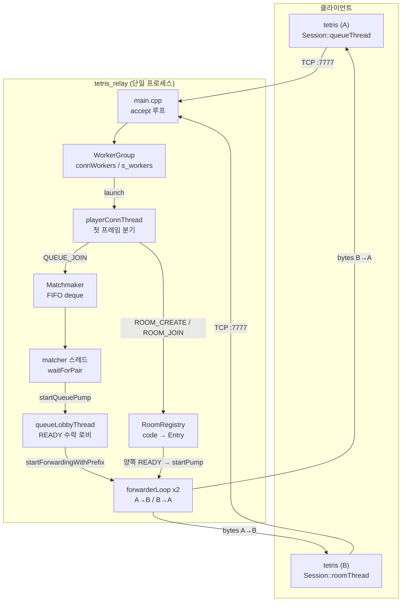
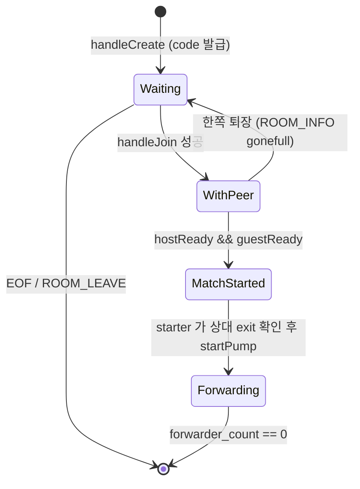
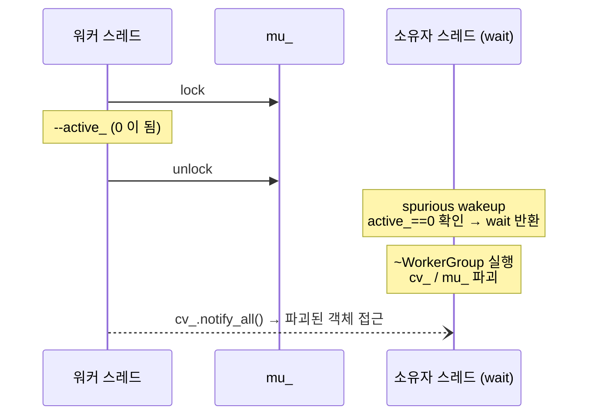
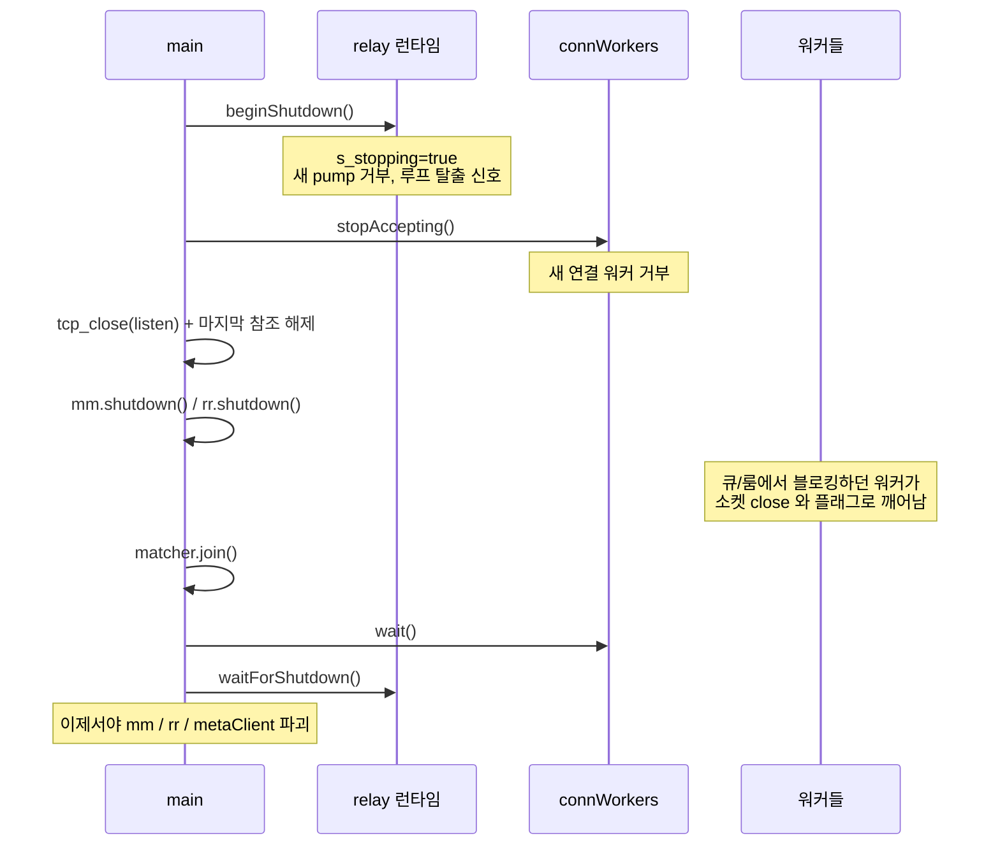
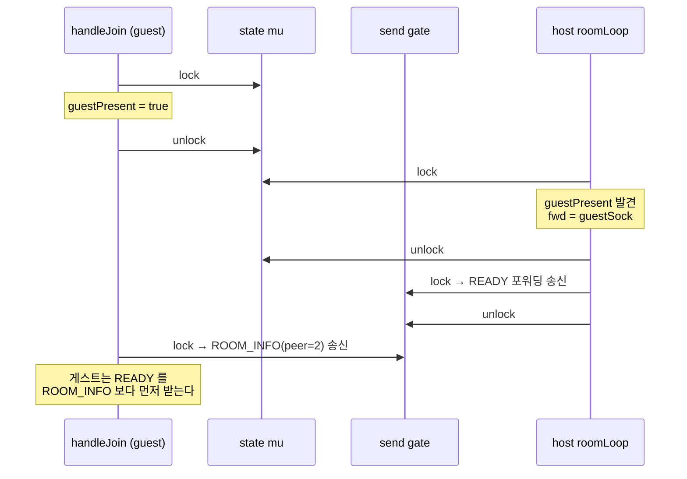
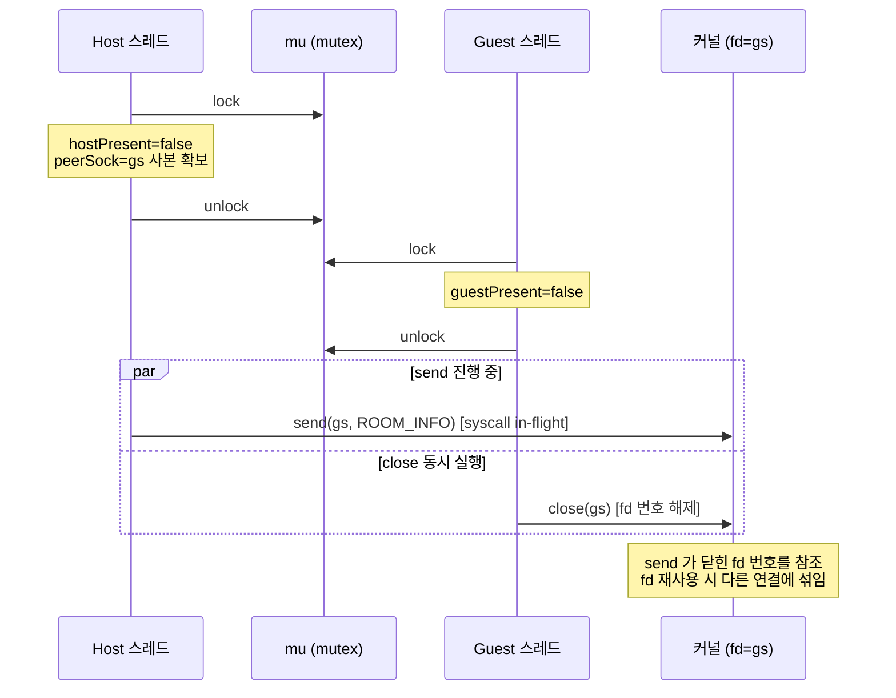
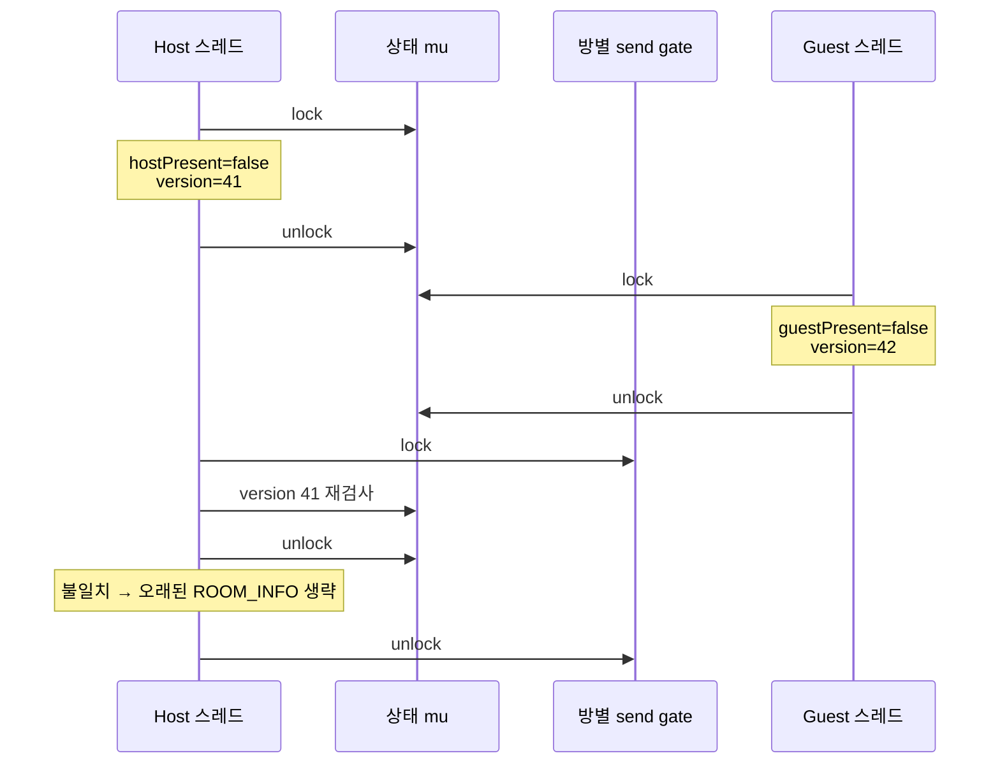
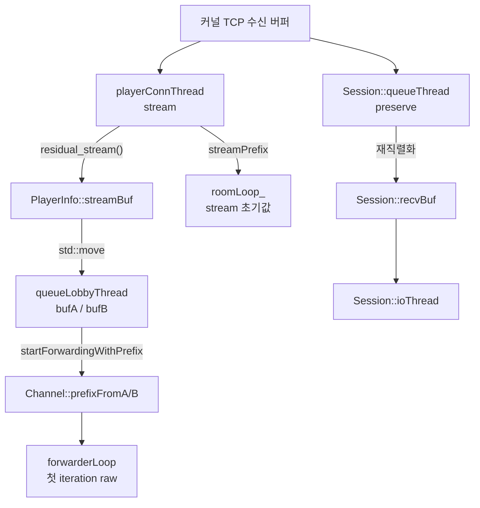
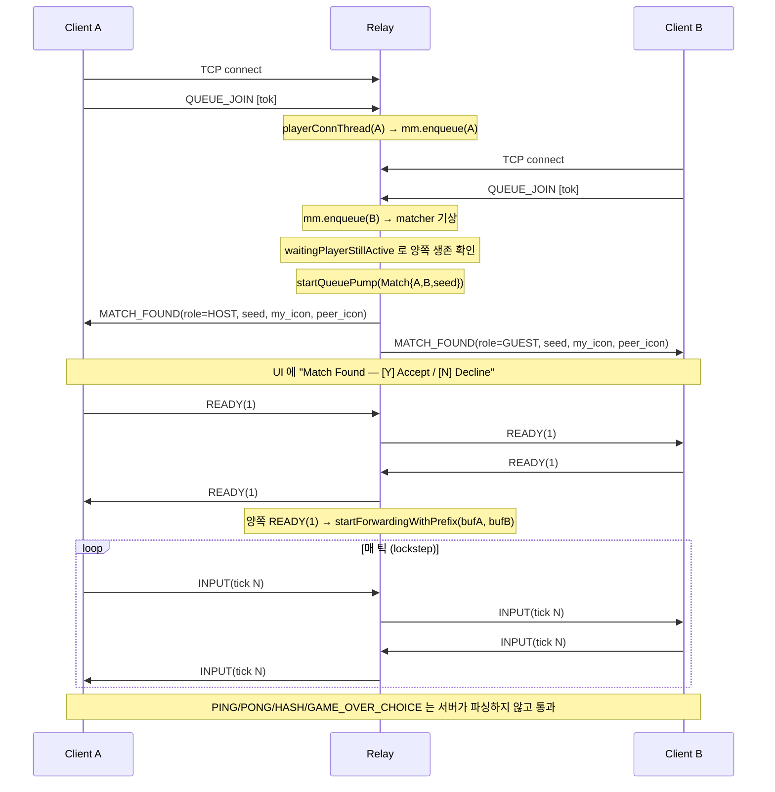
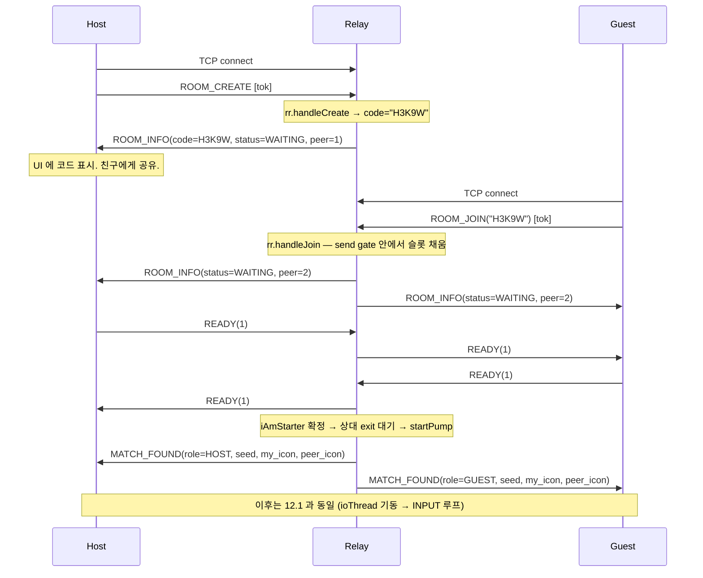

# Part 7: 릴레이 서버 — 매치메이킹, 룸 코드, 투명 포워딩

> **시리즈:** 제로부터 멀티플레이어 테트리스 + RL까지 [시리즈 목차](./README.md) · [이전: Part 6 — Lockstep](./part6-lockstep-networking.md) · **Part 7** · [다음: Part 8 — Python RL](./part8-python-rl.md)

---

## 이번 Part의 구현 계약

- **선행 상태:** [Part 6](./part6-lockstep-networking.md) 이 `net/socket.h`(`TcpSocket`, `tcp_listen`/`tcp_connect`/`tcp_accept`/`tcp_recv_some`/`tcp_send_all`/`tcp_close`), `net/framing.h`(`build_frame`/`parse_frames`/`fnv1a32`/`le_*`), `net::Session` 의 직결 P2P 경로(`Host`/`Connect`/`ioThread`/`handleFrame`)를 완성해 뒀다. `MsgType` 에 `QUEUE_*`/`ROOM_*`/`MATCH_*`/`READY`/`CHAT` 값이 이미 선언돼 있고, `Session` 의 릴레이용 공개 메서드는 선언만 있는 상태다.
- **이번 Part의 파일:** `server/main.cpp`, `server/player_conn.h/.cpp`, `server/matchmaker.h/.cpp`, `server/room.h/.cpp`, `server/relay.h/.cpp`, `server/worker_group.h`, `tests/worker_group_test.cpp`, `CMakeLists.txt`(타깃 `tetris_relay`, `worker_group_test`), 그리고 `net/session.cpp` 의 릴레이 절반 (`QueueJoin`/`QueueCancel`/`QueueConfirm`/`QueueDecline`/`RoomCreate`/`RoomJoin`/ `RoomSendReady`/`RoomLeave`/`queueThread`/`roomThread`).
- **연결점:** 서버는 `net/socket.*` 과 `net/framing.*` 만 재사용한다. 게임 시뮬레이션· 렌더러·오디오를 링크하지 않는다. 클라이언트 쪽은 `queueThread`/`roomThread` 가 `MATCH_FOUND` 를 받은 뒤 그대로 `Session::ioThread` 로 전환하므로, Part 6 의 lockstep 코드는 한 줄도 바뀌지 않는다.
- **완료 게이트:** `tetris_relay` 와 `worker_group_test` 가 빌드되고, `worker_group_test` 가 0을 리턴하며, 포트 **7788** 에 띄운 릴레이에 대해 `test_relay_smoke.py` + `test_room_smoke.py` 가 `6 passed` 여야 한다 (명령은 말미 "수동 테스트" 참조).

## 1. 왜 릴레이인가 — P2P 와의 트레이드오프

Part 6 에서 TCP 기반 lockstep 네트워킹을 만들었다. 한쪽이 `tcp_listen()` 으로 포트를 열고 반대쪽이 `tcp_connect()` 로 붙는 구조. 단순하고 결정론적이지만 실제 인터넷 환경에서는 바로 깨진다.

- **NAT.** 집에서 공유기를 쓰는 사용자가 "호스트" 가 되려면 포트포워딩을 해야 한다. 일반 사용자에게 이걸 시킬 수 없다. UPnP 는 환경 의존이 크고, 둘 다 NAT 뒤일 때는 홀펀칭이 필요하다.
- **디스커버리.** "아무나" 와 붙고 싶을 때 두 명을 모아주는 주체가 P2P 에는 없다.
- **룸 코드.** 친구와 하려면 5자리 코드 하나면 충분해야 한다. IP 를 주고받게 하고 싶지 않다.

### 1.1 홀펀칭을 버리는 대가

STUN/TURN 계열의 홀펀칭은 UDP 를 전제로 한다. TCP 홀펀칭도 이론상 가능하지만 성공률이 NAT 구현에 크게 좌우되고, 실패 시 결국 TURN(= 릴레이)으로 폴백해야 한다. 즉 **홀펀칭을 하더라도 릴레이는 어차피 필요하다.** 그렇다면 처음부터 릴레이 하나만 공인 IP 에 올려두고 모든 클라이언트가 동일하게 `tcp_connect("relay:7777")` 만 하게 만드는 편이 코드 경로가 하나로 줄어든다. 이 프로젝트가 택한 길이다.

### 1.2 TCP 릴레이가 실제로 지불하는 비용

이 선택은 공짜가 아니다. 문서에 적어두지 않으면 나중에 "왜 가끔 화면이 멈추지" 를 설명할 수 없다.

- **Head-of-line 블로킹.** TCP 는 순서 보장 스트림이다. 세그먼트 하나가 유실되면 그 뒤에 이미 도착한 바이트가 커널 버퍼에 있어도 애플리케이션으로 올라오지 않는다. lockstep 은 "상대 입력이 전부 도착해야 시뮬레이션을 진행" 하므로, 이 지연이 **그대로 화면 정지**로 보인다. UDP 라면 한 틱을 건너뛰고 다음 틱 입력을 먼저 쓸 수 있지만, TCP 에서는 불가능하다.
- **재전송 타이머의 하한.** 최초 재전송은 RTO 에 걸리고 리눅스 기본 하한은 200ms 다. 60Hz 기준 12틱이다. `inputDelay` 를 2틱(약 33ms) 으로 두는 한 이 구간은 흡수되지 않고 stall 로 노출된다.
- **홉이 하나 늘어난다.** A→B 가 아니라 A→R→B 다. 추가 지연은 릴레이 위치와 경로에 따라 달라지므로 고정 수치를 박지 않는다. 운영 지역이 정해지면 실측한 RTT 로 `input_delay` 기본값을 조정한다.
- **서버 자원.** 모든 매치의 모든 바이트가 서버를 통과한다. 매치당 소켓 2개 + 포워더 스레드 2개 + (랜덤 큐라면) 로비 스레드 1개가 잡힌다. 대역폭은 P2P 였다면 0이었을 몫이다.

그럼에도 TCP 를 쓰는 이유는 단순하다. **결정론적 lockstep 은 입력 유실을 허용하지 못한다.** UDP 로 내려가면 재전송·순서 복원·중복 제거를 직접 구현해야 하고, 그건 결국 TCP 를 다시 만드는 일이다. 손실을 견디는 진짜 해법은 전송 계층이 아니라 게임 계층에 있다 — 매 패킷에 최근 N틱 입력을 중복해 실어 보내는 redundancy, 그리고 롤백. 둘 다 결정론 모델 자체를 바꾸는 큰 변경이라 이 시리즈 범위 밖이다.

### 1.3 릴레이의 책임 세 가지

`tetris_relay` 라는 별도 실행 파일이 하는 일은 셋뿐이다.

1. **매치메이킹 큐**: `QUEUE_JOIN` 을 보낸 연결 두 개가 모이면 페어링.
2. **룸 레지스트리**: `ROOM_CREATE` 로 5자리 코드 발급, `ROOM_JOIN <code>` 으로 참여.
3. **투명 바이트 포워딩**: 둘이 맺어진 순간부터 `INPUT`/`HASH`/`GAME_OVER_CHOICE`/`PING` 같은 프레임을 해석하지 않고 그대로 중계한다.

3번이 핵심이다. 게임 로직(결정론, 락스텝, 가비지 큐)은 릴레이가 몰라야 한다. 릴레이가 파싱하는 프레임은 `QUEUE_JOIN`/`QUEUE_CANCEL`/`ROOM_CREATE`/`ROOM_JOIN`/ `ROOM_LEAVE`/`READY`/`CHAT` 과, ranked 매치에서만 가로채는 `MATCH_SUMMARY` 뿐이다. 나머지는 전부 블라인드 포워딩이다. 그래서 릴레이를 추가해도 Part 6 의 게임 세션 코드는 바뀌지 않는다.

> **범위 안내**: 이 장은 **릴레이 + 매치메이킹 + 룸 + 클라이언트 측 릴레이 경로**만 다룬다. RP·DB·HTTP API 를 담당하는 별도 실행 파일 `tetris_meta` 와 `relay.cpp::finalizeRanked` 의 ranked 분기(교차검증, `post_match` 호출)는 [Part 10](./part10-meta-and-ranking.md) 에서 이어 붙인다. 없어도 unranked 게임은 그대로 동작한다.

## 2. 전체 아키텍처



스레드 모델은 다음과 같다.

| 스레드 | 개수 | 하는 일 | 소유 자원 |
|---|---|---|---|
| main | 1 | 논블로킹 `accept()` 폴링 | listen 소켓 |
| matcher | 1 | `waitForPair()` → `startQueuePump()` | 없음(참조만) |
| `playerConnThread` | 연결당 1 (≤256) | 첫 프레임 분기, 룸 진입 시 `roomLoop_` 로 블로킹 | 그 연결 소켓 |
| `queueLobbyThread` | 매치당 1 | 랜덤 큐 수락 로비 (30초) | 두 소켓 |
| `forwarderLoop` | 매치당 2 | 한 방향 바이트 복사 | `shared_ptr<Channel>` |

`queueLobbyThread` 와 `forwarderLoop` 를 합친 relay 워커의 상한은 512다.

소유권 모델은 Part 6 에서 만든 `net::TcpSocket` 을 그대로 쓴다. 이것은 파일 디스크립터를 `shared_ptr<int>` 제어 블록으로 소유하는 owning handle 이라 값 복사·이동이 안전하고, 실제 `close(2)` 는 마지막 복사본이 사라질 때 딱 한 번 일어난다. `tcp_close()` 는 fd 를 즉시 닫지 않고 `shutdown()` 으로 대기 중인 `recv`/`accept` 를 깨우는 **종료 신호**다. 이 장의 스레드 인계는 전부 이 전제 위에 서 있다. 소유권 모델 자체의 최종 정리는 [Part 12](./part12-hardening-and-release.md) 에서 다룬다.

서버 쪽 룸 상태를 상태 기계로 보면 이렇다. (클라이언트 쪽 `net::RoomState` 9개 상태 기계는 [Part 6](./part6-lockstep-networking.md) 이 그린다.)



## 3. CMakeLists 확장

Part 7 이 추가하는 소스는 `server/*.cpp` 5개와 헤더 4개, `server/worker_group.h`, 그리고 회귀 테스트 `tests/worker_group_test.cpp` 다. 새 타깃은 두 개다.

먼저 `TETRIS_BUILD_TEST` 블록에 `worker_group_test` 를 추가한다.

**현재 소스 발췌 — `CMakeLists.txt:317-325`**

```cmake
    add_executable(worker_group_test
        tests/worker_group_test.cpp
        server/worker_group.h
    )
    target_include_directories(worker_group_test PRIVATE ${CMAKE_CURRENT_SOURCE_DIR})
    if (NOT WIN32)
        find_package(Threads REQUIRED)
        target_link_libraries(worker_group_test PRIVATE Threads::Threads)
    endif()
```

그리고 릴레이 본체.

**현재 소스 발췌 — `CMakeLists.txt:334-382`**

```cmake
if (TETRIS_BUILD_RELAY)
    # relay 가 meta HTTP API 를 호출하려면 httplib 헤더와 http_client.cpp 필요.
    # third_party/httplib.h 는 TETRIS_BUILD_META 와 공유 — 릴레이만 빌드해도 필요.
    if (NOT EXISTS "${CMAKE_CURRENT_SOURCE_DIR}/third_party/httplib.h")
        message(FATAL_ERROR
            "TETRIS_BUILD_RELAY=ON 이지만 third_party/httplib.h 가 없습니다. "
            "meta API 호출용. cpp-httplib 를 다운로드해 third_party/ 에 넣으세요.")
    endif()
    add_executable(tetris_relay
        server/main.cpp
        server/matchmaker.cpp
        server/player_conn.cpp
        server/relay.cpp
        server/room.cpp
        net/socket.cpp
        net/framing.cpp
        meta/http_client.cpp
        server/matchmaker.h
        server/player_conn.h
        server/relay.h
        server/room.h
        server/worker_group.h
        net/socket.h
        net/framing.h
        meta/http_client.h
        meta/protocol.h
    )
    target_include_directories(tetris_relay PRIVATE
        ${CMAKE_CURRENT_SOURCE_DIR}
        ${CMAKE_CURRENT_SOURCE_DIR}/third_party
    )
    if (WIN32)
        target_link_libraries(tetris_relay PRIVATE ws2_32)
    else()
        # Linux/macOS: std::thread 는 pthread 를 필요로 함 (libstdc++)
        find_package(Threads REQUIRED)
        target_link_libraries(tetris_relay PRIVATE Threads::Threads)
    endif()
    if (TETRIS_ENABLE_HTTPS AND OpenSSL_FOUND)
        target_compile_definitions(tetris_relay PRIVATE CPPHTTPLIB_OPENSSL_SUPPORT)
        target_link_libraries(tetris_relay PRIVATE OpenSSL::SSL OpenSSL::Crypto)
    endif()
    # Section G: Linux 배포 번들용 rpath
    if (UNIX AND NOT APPLE)
        set_target_properties(tetris_relay PROPERTIES
            BUILD_RPATH "$ORIGIN/lib"
            INSTALL_RPATH "$ORIGIN/lib")
    endif()
endif()
```

두 블록 모두 최종 저장소와 동일하다. Part 7 이후의 어떤 장도 이 두 타깃의 소스 목록을 바꾸지 않으므로, 이 장의 체크포인트가 곧 최종형이다.

주의할 점 두 가지.

- **릴레이만 빌드해도 `third_party/httplib.h` 가 필요하다.** `TETRIS_BUILD_META` 와 공유하는 헤더이고, 없으면 configure 단계에서 `FATAL_ERROR` 로 죽는다. 릴레이가 `meta/http_client.cpp` 를 링크하기 때문이다.
- **`meta/http_client.cpp` 는 릴레이에도 링크된다.** ranked 매치일 때 릴레이가 `/v1/auth/verify` 와 `/v1/matches` 를 직접 호출하기 때문이다. `--meta` 를 주지 않으면 이 코드는 전혀 실행되지 않지만, 링크는 항상 된다. 이 클라이언트의 내부 구현은 [Part 10](./part10-meta-and-ranking.md) 에서 만든다. 이 장에서는 `meta::client::MetaClient*` 를 "null 일 수 있는 불투명 포인터" 로만 다룬다.

`TETRIS_BUILD_RELAY` 옵션 자체는 기본 OFF 이므로(`CMakeLists.txt:27`), 릴레이를 빌드하려면 명시적으로 켜야 한다. 게임 클라이언트를 함께 빌드할 필요는 없다.

## 4. `WorkerGroup` — detached 워커의 수명과 예외 격리

서버 코드를 쓰기 전에 스레드 수명 정책부터 정한다. 릴레이는 연결마다, 매치마다 스레드를 만든다. 가장 쉬운 구현은 `std::thread(...).detach()` 지만 그러면 세 가지가 동시에 깨진다.

1. **상한이 없다.** `connect()` 플러딩만으로 스레드와 핸들이 고갈된다.
2. **예외가 프로세스를 죽인다.** detached 스레드에서 예외가 빠져나오면 `std::terminate` 다.
3. **종료 시 참조가 먼저 죽는다.** `main` 이 반환하면서 `Matchmaker`/`RoomRegistry`/ `MetaClient` 를 파괴하는데, 아직 살아 있는 워커가 그 참조를 쓰고 있으면 use-after-free 다.

세 문제를 한 클래스로 묶은 것이 `server/worker_group.h` 다. 헤더 온리 100줄이다.

**현재 소스 발췌 — `server/worker_group.h:1-107`**

```cpp
#pragma once

#include <condition_variable>
#include <cstddef>
#include <cstdio>
#include <exception>
#include <limits>
#include <mutex>
#include <thread>
#include <utility>

namespace relay {

// Tracks detached workers so their owner can stop accepting new work and wait
// until every running callback has released its references.
class WorkerGroup {
public:
    explicit WorkerGroup(
        const char* name,
        size_t maxActive = std::numeric_limits<size_t>::max()) noexcept
        : name_(name), maxActive_(maxActive) {}

    ~WorkerGroup()
    {
        stopAccepting();
        wait();
    }

    WorkerGroup(const WorkerGroup&) = delete;
    WorkerGroup& operator=(const WorkerGroup&) = delete;

    template <typename Fn>
    bool launch(Fn&& fn) noexcept
    {
        {
            std::lock_guard<std::mutex> lk(mu_);
            if (!accepting_) return false;
            if (active_ >= maxActive_) {
                std::fprintf(stderr, "[%s] worker limit reached (%zu)\n",
                             name_, maxActive_);
                return false;
            }
            ++active_;
        }

        try {
            std::thread([this, work = std::forward<Fn>(fn)]() mutable {
                Completion completion{this};
                try {
                    work();
                } catch (const std::exception& e) {
                    std::fprintf(stderr, "[%s] worker failed: %s\n", name_, e.what());
                } catch (...) {
                    std::fprintf(stderr, "[%s] worker failed: unknown exception\n", name_);
                }
            }).detach();
        } catch (const std::exception& e) {
            finish();
            std::fprintf(stderr, "[%s] worker launch failed: %s\n", name_, e.what());
            return false;
        } catch (...) {
            finish();
            std::fprintf(stderr, "[%s] worker launch failed: unknown exception\n", name_);
            return false;
        }
        return true;
    }

    void stopAccepting() noexcept
    {
        std::lock_guard<std::mutex> lk(mu_);
        accepting_ = false;
    }

    void wait() noexcept
    {
        std::unique_lock<std::mutex> lk(mu_);
        cv_.wait(lk, [this] { return active_ == 0; });
    }

private:
    struct Completion {
        WorkerGroup* owner;
        ~Completion() { owner->finish(); }
    };

    void finish() noexcept
    {
        // notify 는 반드시 lock 보유 중에 — unlock 후 notify 하면, 그 사이에
        // wait() 쪽이 spurious wakeup 으로 active_==0 을 보고 반환해 cv_ 를
        // 파괴한 뒤 (예: ~WorkerGroup) 이 스레드가 파괴된 cv_ 에 notify 하는
        // use-after-free 경합이 생긴다. lock 안이면 waiter 는 lock 재획득
        // 전까지 반환할 수 없어 cv_ 수명이 보장된다.
        std::lock_guard<std::mutex> lk(mu_);
        --active_;
        cv_.notify_all();
    }

    const char* name_;
    std::mutex mu_;
    std::condition_variable cv_;
    size_t active_{0};
    const size_t maxActive_;
    bool accepting_{true};
};

}  // namespace relay
```

### 4.1 카운터를 증가시키는 시점

`launch` 는 스레드를 만들기 **전에** `active_` 를 올린다. 순서를 뒤집어 스레드를 먼저 만들고 그 안에서 올리면, `launch` 가 반환한 직후 `wait()` 가 호출됐을 때 아직 카운터가 0이라 "다 끝났다" 고 오판한다. 반대로 `std::thread` 생성이 예외를 던지면 이미 올린 카운터를 되돌려야 하므로 두 catch 블록이 `finish()` 를 부른다.

`maxActive_` 검사도 같은 임계구역 안에 있다. 검사와 증가가 분리되면 상한을 넘겨 통과하는 창이 생긴다.

### 4.2 `Completion` 이 RAII 인 이유

워커 본문은 `work()` 를 `try/catch(...)` 로 감싼다. 그런데 감소 처리를 catch 블록 뒤에 그냥 써두면, `std::fprintf` 같은 정리 코드 자체가 던지거나 `work` 가 catch 로 잡히지 않는 방식으로 스택을 벗어날 때 카운터가 영원히 줄지 않는다. 그러면 `wait()` 가 영구 블록된다.

`Completion` 은 스레드 함수 본문의 **첫 줄**에 선언된 스택 객체다. 어떤 경로로 나가든 소멸자가 `finish()` 를 호출한다. 감소 책임을 제어 흐름이 아니라 스코프에 묶은 것이다. 같은 패턴이 뒤에서 `forwarderLoop` 의 `ForwarderCompletion` 으로 한 번 더 나온다.

### 4.3 `finish()` 가 lock 을 쥔 채 notify 하는 이유

교과서적 조언은 "notify 전에 unlock 하라 — waiter 가 깨자마자 lock 을 못 잡고 다시 자는 낭비를 피한다" 다. 여기서는 **일부러 반대로** 한다. 코드 주석이 이유를 그대로 적어두고 있다. 재구성하면 이런 인터리빙이다.



`wait()` 안의 `cv_.wait(lk, pred)` 는 술어가 참이면 **notify 없이도** 반환할 수 있다. spurious wakeup 이 그 순간에 끼면 소유자는 `--active_` 만 보고 즉시 반환하고, `~WorkerGroup` 이 `cv_` 를 파괴한다. 그 뒤 워커가 `cv_.notify_all()` 을 호출하면 이미 없는 객체를 건드린다.

lock 을 쥔 채 notify 하면 이 창이 닫힌다. `wait()` 가 술어를 확인하고 반환하려면 반드시 `mu_` 를 다시 잡아야 하는데, `finish()` 가 `mu_` 를 놓기 전까지는 잡을 수 없다. `finish()` 가 `mu_` 를 놓는 시점에는 `notify_all()` 이 이미 끝나 있다. 성능 손해는 스레드 종료 경로 한 번의 락 경합이고, 얻는 것은 소멸 순서 안전성이다.

> 이 트레이드오프는 "condition variable 을 그 waiter 보다 오래 살려둘 수 없는 구조" 에서 항상 나타난다. `WorkerGroup` 은 스택/전역 객체이지 `shared_ptr` 로 관리되는 대상이 아니므로, 수명 보장을 락으로 만들어야 한다.

### 4.4 회귀 테스트

`WorkerGroup` 은 서버 전체의 종료 안전성을 떠받치므로 독립 실행 테스트가 있다. 43줄이고 어서션 대신 종료 코드로 실패를 알린다 — 외부 테스트 프레임워크가 필요 없다.

**현재 소스 발췌 — `tests/worker_group_test.cpp:1-43`**

```cpp
#include "../server/worker_group.h"

#include <condition_variable>
#include <mutex>
#include <stdexcept>

int main()
{
    relay::WorkerGroup workers{"worker-group-test", 1};
    std::mutex mu;
    std::condition_variable cv;
    bool started = false;
    bool release = false;

    if (!workers.launch([&] {
            std::unique_lock<std::mutex> lk(mu);
            started = true;
            cv.notify_all();
            cv.wait(lk, [&] { return release; });
        })) {
        return 1;
    }

    {
        std::unique_lock<std::mutex> lk(mu);
        cv.wait(lk, [&] { return started; });
    }
    if (workers.launch([] {})) return 2;

    {
        std::lock_guard<std::mutex> lk(mu);
        release = true;
    }
    cv.notify_all();
    workers.wait();

    if (!workers.launch([] { throw std::runtime_error("expected"); })) return 3;
    workers.wait();

    workers.stopAccepting();
    if (workers.launch([] {})) return 4;
    return 0;
}
```

검증하는 것은 네 가지다.

| 종료 코드 | 실패한 성질 |
|---|---|
| 1 | 상한 이내의 첫 `launch` 가 성공해야 한다 |
| 2 | `maxActive=1` 인데 두 번째 `launch` 가 통과했다 (상한 미작동) |
| 3 | 워커가 끝난 뒤 슬롯이 반납되지 않았다 |
| 4 | `stopAccepting()` 이후에도 새 워커를 받았다 |

세 번째 `launch` 는 일부러 `std::runtime_error` 를 던진다. 그 뒤의 `workers.wait()` 가 반환하면 "예외가 프로세스를 죽이지 않았고, 카운터도 정상 감소했다" 가 동시에 증명된다. 실행하면 stderr 에 다음 두 줄이 찍히는 것이 정상이다.

```text
[worker-group-test] worker limit reached (1)
[worker-group-test] worker failed: expected
```

빌드와 실행:

```bash
cmake -S . -B build -DTETRIS_BUILD_GAME=OFF -DTETRIS_BUILD_TEST=ON
cmake --build build --target worker_group_test
./build/worker_group_test && echo "WorkerGroup OK"
```

## 5. 서버 엔트리 `server/main.cpp`

이제 서버 본체다. `main` 은 인자 파싱, 리스닝, matcher 스레드 기동, accept 루프, 그리고 순서가 중요한 종료 시퀀스를 담당한다. 전체를 그대로 싣는다.

**현재 소스 발췌 — `server/main.cpp:1-227`**

```cpp
// server/main.cpp — Tetris Multiplayer 릴레이 서버
//
// 빠른 요약:
//   1) TCP 포트(기본 7777) listen
//   2) accept 될 때마다 playerConnThread 스폰 → 해당 스레드가
//      QUEUE_JOIN 프레임을 기다렸다가 matchmaker 큐에 등록
//   3) matcher 스레드가 2명이 모이면 꺼내 relay::startPump() 호출 →
//      양쪽에 MATCH_FOUND 전송 + 바이트 포워딩 시작
//
// 프로토콜(net/framing.h):
//   C→S QUEUE_JOIN   (10) : [tok_len:1][token:N]
//   S→C MATCH_FOUND  (12) : [role:1][seed:8 LE][my_icon_len:1][my_icon:N][peer_icon_len:1][peer_icon:N]
//   (이후 바이트는 투명 포워딩 — SEED/INPUT/HASH/GAME_OVER_CHOICE 그대로 통과)

#include "matchmaker.h"
#include "player_conn.h"
#include "relay.h"
#include "room.h"
#include "worker_group.h"
#include "../net/socket.h"
#include "../meta/http_client.h"

#include <atomic>
#include <charconv>
#include <chrono>
#include <csignal>
#include <cstdint>
#include <cstdio>
#include <cstdlib>
#include <cstring>
#include <functional>
#include <iostream>
#include <memory>
#include <string>
#include <system_error>
#include <thread>

namespace {

std::atomic<bool> g_running{true};
net::TcpSocket    g_listen_sock{};  // 논블로킹 listen 소켓 (accept 폴링)

// 동시 연결 worker 상한 — 연결당 detached 스레드를 만들므로 상한이
// 없으면 connect 플러딩만으로 메모리/핸들이 고갈된다. playerConnThread 는
// 첫 프레임 대기(≤10s)와 룸 대기 동안 스레드를 점유하므로, 정상 부하(수십 명)
// 대비 넉넉한 값으로 제한하고 초과분은 즉시 close 한다.
constexpr size_t kMaxConnWorkers = 256;

void signalHandler(int /*sig*/) {
    // async-signal-safe 하게 플래그만 세운다. listen 소켓은 논블로킹이라
    // accept 루프가 최대 ~10ms 안에 g_running 을 보고 빠져나온다. 핸들러에서
    // 소켓(shared_ptr) 을 건드리지 않는다 — atomic store 만 사용.
    g_running.store(false);
}

void printUsage() {
    std::cout <<
        "Usage: tetris_relay [--port N] [--meta URL] [--meta-secret SECRET]\n"
        "  --port N         TCP listen port (default 7777)\n"
        "  --meta URL       tetris_meta base URL (e.g. https://api.example.com)\n"
        "                   If omitted, relay runs unranked (no token verify,\n"
        "                   no /v1/matches POST).\n"
        "  --meta-secret S  Send X-Relay-Secret on /v1/matches.\n"
        "                   Defaults to TETRIS_RELAY_SECRET if set.\n"
        "  -h, --help       Show this help\n";
}

bool parsePort(const std::string& s, uint16_t& out) {
    if (s.empty()) return false;
    unsigned int value = 0;
    auto* first = s.data();
    auto* last = s.data() + s.size();
    auto res = std::from_chars(first, last, value);
    if (res.ec != std::errc{} || res.ptr != last) return false;
    if (value < 1 || value > 65535) return false;
    out = static_cast<uint16_t>(value);
    return true;
}

}  // namespace

int main(int argc, char** argv) {
    uint16_t    port = 7777;
    std::string metaUrl;  // empty = unranked
    std::string metaSecret;
    if (const char* env = std::getenv("TETRIS_RELAY_SECRET")) {
        metaSecret = env;
    }

    for (int i = 1; i < argc; ++i) {
        const std::string a = argv[i];
        if (a == "--port" && i + 1 < argc) {
            const std::string portArg = argv[++i];
            if (!parsePort(portArg, port)) {
                std::cerr << "Invalid --port value: " << portArg << " (expected 1..65535)\n";
                return 2;
            }
        } else if (a == "--meta" && i + 1 < argc) {
            metaUrl = argv[++i];
        } else if (a == "--meta-secret" && i + 1 < argc) {
            metaSecret = argv[++i];
        } else if (a == "-h" || a == "--help") {
            printUsage();
            return 0;
        } else {
            std::cerr << "Unknown arg: " << a << "\n";
            printUsage();
            return 1;
        }
    }

    // meta 클라이언트 (옵션). URL 미지정 시 nullptr → unranked.
    std::unique_ptr<meta::client::MetaClient> metaClient;
    if (!metaUrl.empty()) {
        if (metaSecret.empty()) {
            std::cerr << "[relay] refusing to start: --meta set but no relay secret. "
                      << "Set --meta-secret or TETRIS_RELAY_SECRET (meta rejects "
                      << "POST /v1/matches without it).\n";
            return 2;
        }
        metaClient = std::make_unique<meta::client::MetaClient>(metaUrl, metaSecret);
        if (!metaClient->valid()) {
            std::cerr << "[relay] invalid --meta URL: " << metaUrl << "\n";
            return 2;
        } else {
            std::cout << "[relay] meta enabled: " << metaUrl << "\n";
        }
    } else {
        std::cout << "[relay] meta=none (unranked mode)\n";
    }

    std::signal(SIGINT,  signalHandler);
    std::signal(SIGTERM, signalHandler);

    if (!net::net_init()) {
        std::cerr << "net_init() failed\n";
        return 1;
    }

    g_listen_sock = net::tcp_listen(port, /*backlog=*/16);
    if (!g_listen_sock.valid()) {
        std::cerr << "tcp_listen(" << port << ") failed — port in use?\n";
        net::net_shutdown();
        return 1;
    }
    // listen 소켓을 논블로킹으로 — 시그널 핸들러가 fd 를 닫지 않고 g_running
    // 플래그만 세워도 accept 루프가 폴링으로 빠져나오게 한다(async-signal-safe).
    net::tcp_set_nonblocking(g_listen_sock);
    std::cout << "[relay] listening on 0.0.0.0:" << port << "\n";
    std::cout << "[relay] local IP: " << net::get_local_ip() << "\n";
    std::cout << "[relay] Ctrl+C to stop\n";

    relay::Matchmaker   mm;
    relay::RoomRegistry rr;

    // 연결 worker는 완료 즉시 detach되지만 WorkerGroup이 생성 실패와 실행 중
    // 예외까지 처리한다. 종료 시 drain한 뒤 mm/rr/meta를 파괴해 참조 수명을 보장한다.
    relay::WorkerGroup connWorkers{"relay-connection", kMaxConnWorkers};

    // 매칭 전담 스레드: 2명 모일 때마다 페어링 + relay 시작.
    // meta 가 있으면 post_match 를 호출할 수 있도록 포인터를 startPump 에 넘긴다.
    meta::client::MetaClient* mcPtr = metaClient.get();
    rr.setMeta(mcPtr);
    std::thread matcher;
    try {
        matcher = std::thread([&mm, mcPtr] {
            try {
                while (true) {
                    auto match = mm.waitForPair();
                    if (!match) break;  // shutdown
                    // 랜덤 큐 경로: MATCH_FOUND → 양쪽 READY(1) 수락 대기 → 게임 포워딩.
                    // (커스텀 룸 경로는 room.cpp 가 READY 를 자체 확인한 뒤 startPump 를 호출한다.)
                    relay::startQueuePump(std::move(*match), mcPtr);
                }
            } catch (const std::exception& e) {
                std::cerr << "[relay] matcher failed: " << e.what() << "\n";
                g_running.store(false);
                mm.shutdown();
            } catch (...) {
                std::cerr << "[relay] matcher failed: unknown exception\n";
                g_running.store(false);
                mm.shutdown();
            }
        });
    } catch (const std::exception& e) {
        std::cerr << "[relay] matcher launch failed: " << e.what() << "\n";
        net::tcp_close(g_listen_sock);
        g_listen_sock = net::TcpSocket{};
        net::net_shutdown();
        return 1;
    }

    // accept 루프 (논블로킹 폴링)
    uint32_t next_conn_id = 1;
    while (g_running.load()) {
        auto client = net::tcp_accept(g_listen_sock);
        if (!client.valid()) {
            // 논블로킹 accept: 대기 연결 없음(EWOULDBLOCK) 또는 셧다운.
            if (!g_running.load()) break;
            // 대기 연결 없음 — 잠깐 쉬었다가 재폴링.
            std::this_thread::sleep_for(std::chrono::milliseconds(10));
            continue;
        }
        const uint32_t id = next_conn_id++;
        std::cout << "[relay] accept conn=" << id << "\n";
        if (!connWorkers.launch([client = std::move(client), id, &mm, &rr, mcPtr]() mutable {
            relay::playerConnThread(std::move(client), id, mm, rr, mcPtr);
        })) {
            std::cerr << "[relay] rejecting conn=" << id
                      << ": connection worker unavailable\n";
        }
    }

    std::cout << "[relay] shutting down...\n";
    relay::beginShutdown();
    connWorkers.stopAccepting();
    net::tcp_close(g_listen_sock);
    g_listen_sock = net::TcpSocket{};  // 마지막 참조 해제 → 실제 fd close
    mm.shutdown();
    rr.shutdown();
    if (matcher.joinable()) matcher.join();
    connWorkers.wait();
    relay::waitForShutdown();
    net::net_shutdown();
    std::cout << "[relay] done\n";
    return 0;
}
```

주목할 부분을 짚는다.

**시그널 처리.** `SIGINT`/`SIGTERM` 핸들러는 `g_running = false` 만 한다. 핸들러 안에서 `tcp_close()` 나 `shared_ptr` 접근을 하지 않는다 — 둘 다 async-signal-safe 가 아니다. listen 소켓은 `tcp_set_nonblocking()` 으로 전환돼 있고 accept 루프가 10ms 간격으로 폴링하므로, 플래그만 바꿔도 곧 루프를 빠져나온다. 실제 소켓 정리는 루프를 나온 뒤 일반 스레드 문맥에서 한다.

**matcher 스레드의 이중 예외 방어.** 람다 **안쪽**에 `try/catch` 가 있고, `std::thread` 생성 자체도 `try/catch` 로 감쌌다. matcher 는 `WorkerGroup` 소속이 아니라 직접 만든 `std::thread` 이므로 `WorkerGroup` 의 예외 격리가 적용되지 않는다. 그래서 각각을 따로 막는다.

- 람다 안에서 예외가 나면 `g_running=false` + `mm.shutdown()` 으로 **서버 전체를 질서 있게 내린다**. 매칭이 죽은 채로 accept 만 계속하면 큐에 사람이 무한정 쌓인다.
- 스레드 생성이 실패하면 listen 소켓을 정리하고 `return 1` 로 즉시 종료한다. matcher 없는 릴레이는 아무 일도 못 한다.

**소켓 소유권 이전.** `connWorkers.launch` 의 람다 캡처 `[client = std::move(client), ...]` 로 소켓이 워커에게 넘어간다. `TcpSocket` 은 owning handle 이므로 이동 후에도 fd 는 살아 있고, 워커가 끝나 마지막 복사본이 사라질 때 한 번만 닫힌다.

**종료 순서가 곧 안전성이다.** 다섯 줄의 순서에는 각각 이유가 있다.



`beginShutdown()` 을 가장 먼저 부르는 이유는 이미 돌고 있는 로비/포워더가 새 작업을 시작하지 못하게 막기 위해서다. `mm.shutdown()`/`rr.shutdown()` 은 블로킹 중인 워커를 깨우는 역할이고, `connWorkers.wait()` 와 `relay::waitForShutdown()` 이 실제로 모든 워커가 참조를 놓을 때까지 기다린다. 이 두 wait 이 `main` 의 지역 변수 `mm`/`rr`/ `metaClient` 소멸보다 먼저 완료되므로 use-after-free 가 없다.

이 시점에서 빌드하면 서버는 "연결을 받아 워커를 띄운다" 까지만 한다. 실제 분기는 `playerConnThread` 에 있다.

## 6. 첫 프레임 분기 — `server/player_conn.cpp`

새 연결이 들어오면 서버는 이 연결이 무엇을 원하는지 모른다. 의도는 셋이다.

1. **아무나랑 매칭하고 싶다** → `QUEUE_JOIN`
2. **방을 만들어 코드를 공유하고 싶다** → `ROOM_CREATE`
3. **받은 코드로 입장하고 싶다** → `ROOM_JOIN <code>`

이 분기가 `playerConnThread` 의 단일 책임이다. 여기에 토큰 인증과 잔여 바이트 인계가 붙는다. 파일 앞부분의 익명 네임스페이스가 그 세 헬퍼를 담고 있다.

**현재 소스 발췌 — `server/player_conn.cpp:1-94`**

```cpp
#include "player_conn.h"

#include "matchmaker.h"
#include "room.h"
#include "relay.h"
#include "../net/framing.h"
#include "../meta/http_client.h"

#include <chrono>
#include <iostream>
#include <optional>
#include <string>
#include <thread>
#include <utility>
#include <vector>

namespace relay {

namespace {

// QUEUE_JOIN 또는 ROOM_CREATE 페이로드 끝의 [tok_len:1][token:N] 추출.
// 토큰 페이로드 앞에 다른 바이트가 있으면 offset 을 지정.  범위 초과 시 빈 문자열.
std::string extract_token(const std::vector<uint8_t>& pl, size_t offset)
{
    if (pl.size() < offset + 1) return {};
    const uint8_t n = pl[offset];
    if (n == 0) return {};
    if (pl.size() < offset + 1u + n) return {};
    return std::string(pl.begin() + offset + 1,
                       pl.begin() + offset + 1 + n);
}

// 첫 프레임(QUEUE_JOIN 등)과 같은 recv 에 실려 이미 파싱된 후속 프레임들과
// 아직 완성되지 않은 partial tail 을 원본 바이트 스트림으로 복원한다.
// build_frame 은 동일 payload 에 대해 bit-identical 하므로 재직렬화가 안전하다.
// 이 잔여분을 다음 단계(matchmaker 큐 / roomLoop_)의 수신 버퍼로 이관하지 않으면
// 그 프레임들(예: QUEUE_JOIN 직후의 QUEUE_CANCEL)이 조용히 유실된다.
std::vector<uint8_t> residual_stream(const std::vector<net::Frame>& frames,
                                     size_t next_idx,
                                     const std::vector<uint8_t>& tail)
{
    std::vector<uint8_t> out;
    for (size_t j = next_idx; j < frames.size(); ++j) {
        auto bytes = net::build_frame(frames[j].type, frames[j].payload);
        out.insert(out.end(), bytes.begin(), bytes.end());
    }
    out.insert(out.end(), tail.begin(), tail.end());
    return out;
}

// meta 가 nullptr 또는 token 이 비어 있으면 unranked (player_id=0, elo=0).
// verify 실패면 std::nullopt → 호출자가 소켓 close.
struct AuthOutcome {
    int64_t     player_id = 0;
    int         elo = 0;
    std::string username;
    std::string token;
    std::string selected_icon_id{"default"};
};
std::optional<AuthOutcome>
authenticate(meta::client::MetaClient* meta, const std::string& token,
             uint32_t conn_id, const char* what)
{
    AuthOutcome o;
    if (!meta) {
        // unranked: meta 미연동 — 토큰이 있더라도 무시.
        std::cerr << "[conn " << conn_id << "] " << what
                  << " unranked (no meta)\n";
        return o;
    }
    if (token.empty()) {
        std::cerr << "[conn " << conn_id << "] " << what
                  << " missing token -> reject\n";
        return std::nullopt;
    }
    auto auth = meta->verify_token(token);
    if (!auth) {
        std::cerr << "[conn " << conn_id << "] " << what
                  << " meta verify failed -> reject\n";
        return std::nullopt;
    }
    o.player_id = auth->player_id;
    o.elo       = auth->elo;
    o.username  = auth->username;
    o.token     = token;
    o.selected_icon_id = auth->selected_icon_id.empty() ? "default" : auth->selected_icon_id;
    std::cerr << "[conn " << conn_id << "] " << what
              << " authed player_id=" << auth->player_id
              << " elo=" << auth->elo
              << " icon=" << o.selected_icon_id << "\n";
    return o;
}

} // namespace
```

`AuthOutcome` 에 `selected_icon_id` 가 들어 있다는 점을 놓치면 안 된다. 이 값은 `MATCH_FOUND` 페이로드에 실려 상대 클라이언트의 아이콘 표시에 쓰인다. 기본값 `"default"` 는 meta 미연동(unranked)일 때 그대로 나간다.

이제 본체다.

**현재 소스 발췌 — `server/player_conn.cpp:96-193`**

```cpp
// 첫 프레임(QUEUE_JOIN / ROOM_CREATE / ROOM_JOIN) 대기 제한 시간.
// 클라이언트는 TCP connect 직후 바로 첫 프레임을 보내므로 10초면 충분.
static constexpr auto kJoinTimeout  = std::chrono::seconds(10);
static constexpr auto kPollInterval = std::chrono::milliseconds(10);

void playerConnThread(net::TcpSocket sock, uint32_t conn_id,
                      Matchmaker& mm, RoomRegistry& rr,
                      meta::client::MetaClient* meta) {
    std::vector<uint8_t> stream;
    stream.reserve(64);

    const auto deadline = std::chrono::steady_clock::now() + kJoinTimeout;

    while (std::chrono::steady_clock::now() < deadline && !isShuttingDown()) {
        if (!net::tcp_recv_some(sock, stream)) {
            std::cerr << "[conn " << conn_id << "] disconnected before first frame\n";
            net::tcp_close(sock);
            return;
        }

        if (!stream.empty()) {
            std::vector<net::Frame> frames;
            net::parse_frames(stream, frames);
            for (size_t i = 0; i < frames.size(); ++i) {
                const net::Frame& f = frames[i];
                if (f.type == net::MsgType::QUEUE_JOIN) {
                    // 페이로드: [tok_len:1][token:N]
                    std::string tok = extract_token(f.payload, 0);
                    auto auth = authenticate(meta, tok, conn_id, "QUEUE_JOIN");
                    if (!auth) { net::tcp_close(sock); return; }

                    PlayerInfo pi;
                    pi.sock      = std::move(sock);
                    pi.conn_id   = conn_id;
                    pi.player_id = auth->player_id;
                    pi.elo       = auth->elo;
                    pi.username  = std::move(auth->username);
                    pi.token     = std::move(auth->token);
                    pi.selected_icon_id = std::move(auth->selected_icon_id);
                    // 같은 recv 로 이미 도착한 후속 프레임/부분 바이트를 큐
                    // 폴링 버퍼로 이관 (즉시 QUEUE_CANCEL 유실 방지).
                    pi.streamBuf = residual_stream(frames, i + 1, stream);
                    std::cerr << "[conn " << conn_id << "] QUEUE_JOIN -> queued\n";
                    mm.enqueue(std::move(pi));
                    return;
                }
                if (f.type == net::MsgType::QUEUE_CANCEL) {
                    std::cerr << "[conn " << conn_id << "] QUEUE_CANCEL before queued\n";
                    net::tcp_close(sock);
                    return;
                }
                if (f.type == net::MsgType::ROOM_CREATE) {
                    // 페이로드: [tok_len:1][token:N]
                    std::string tok = extract_token(f.payload, 0);
                    auto auth = authenticate(meta, tok, conn_id, "ROOM_CREATE");
                    if (!auth) { net::tcp_close(sock); return; }
                    std::cerr << "[conn " << conn_id << "] ROOM_CREATE\n";
                    rr.handleCreate(std::move(sock), conn_id,
                                    auth->player_id, auth->elo,
                                    auth->username, auth->token,
                                    auth->selected_icon_id,
                                    residual_stream(frames, i + 1, stream));
                    return;
                }
                if (f.type == net::MsgType::ROOM_JOIN) {
                    if (f.payload.size() < 1) continue;
                    const uint8_t n = f.payload[0];
                    constexpr uint8_t kMaxCodeLen = 5;
                    if (n == 0 || n > kMaxCodeLen ||
                        f.payload.size() < 1u + n) continue;
                    std::string code(f.payload.begin() + 1,
                                     f.payload.begin() + 1 + n);
                    // 코드 뒤에 [tok_len:1][token:N]
                    std::string tok = extract_token(f.payload, 1u + n);
                    auto auth = authenticate(meta, tok, conn_id, "ROOM_JOIN");
                    if (!auth) { net::tcp_close(sock); return; }
                    std::cerr << "[conn " << conn_id << "] ROOM_JOIN " << code << "\n";
                    rr.handleJoin(code, std::move(sock), conn_id,
                                  auth->player_id, auth->elo,
                                  auth->username, auth->token,
                                  auth->selected_icon_id,
                                  residual_stream(frames, i + 1, stream));
                    return;
                }
                // HELLO 등 낯선 프레임은 초기 phase 에서는 무시 + 계속 대기
            }
        }

        std::this_thread::sleep_for(kPollInterval);
    }

    if (!isShuttingDown()) {
        std::cerr << "[conn " << conn_id << "] first-frame timeout -> close\n";
    }
    net::tcp_close(sock);
}

}  // namespace relay
```

### 6.1 10초 데드라인과 셧다운 게이트

루프 조건이 둘이다: `now < deadline && !isShuttingDown()`.

- **데드라인.** 클라이언트는 `connect()` 성공 직후 바로 첫 프레임을 보낸다. 10초를 넘기면 이상한 클라이언트로 보고 끊는다. 연결만 열어두고 아무것도 보내지 않는 slowloris 류 공격으로 스레드와 fd 가 무한정 쌓이는 것을 막는 최소 방어다.
- **셧다운 게이트.** `relay::isShuttingDown()` 이 없으면 서버가 종료를 시작한 뒤에도 이 스레드가 최대 10초 더 살아 있다. `connWorkers.wait()` 가 그만큼 블록되고, `Ctrl+C` 를 눌러도 프로세스가 바로 안 죽는다. 마지막 타임아웃 로그도 `if (!isShuttingDown())` 으로 감싸 정상 종료 때 쓸데없는 경고가 쏟아지지 않게 한다.

### 6.2 폴링 루프

`tcp_recv_some` 은 "지금 읽을 수 있는 만큼만" 읽는 논블로킹 계열 호출이다. 바이트가 없으면 `stream` 을 그대로 두고 `true` 를 반환한다(연결이 끊겼을 때만 `false`). 그래서 `stream.empty()` 면 10ms 자고 다시 시도한다. 첫 프레임 대기는 최대 10초라 폴링 오버헤드가 문제 되지 않는다. 실제 CPU 사용률은 동시 연결 수에 비례하므로, 운영 배포 전에 대상 환경에서 직접 확인한다.

### 6.3 스트림 소유권 규칙 — `residual_stream`

이 장 전체에서 가장 반복적으로 등장하는 개념이다.

**TCP 의 단계 경계는 `recv` 경계가 아니다.** 한 번의 `recv` 에 `QUEUE_JOIN + QUEUE_CANCEL` 이 함께 담길 수 있고, `ROOM_JOIN + READY` 가 붙어 올 수도 있다. 첫 프레임만 처리하고 지역 변수 `stream` 을 그냥 버리면, 이미 커널에서 유저 공간으로 끌어온 뒤쪽 바이트는 **다음 단계가 다시 받을 방법이 없다**. 커널 버퍼에는 더 이상 없기 때문이다.

`residual_stream(frames, i + 1, stream)` 이 하는 일은 두 가지다.

1. 아직 소비하지 않은 완성 프레임(`frames[i+1..]`)을 `build_frame` 으로 **재직렬화**한다. `build_frame` 은 같은 payload 에 대해 항상 같은 바이트를 만들므로(체크섬 포함) 원본과 비트 단위로 동일하다.
2. `parse_frames` 가 소비하고 남긴 미완성 tail(`stream`)을 그 뒤에 이어 붙인다.

순서가 중요하다. 완성 프레임이 앞, partial tail 이 뒤여야 스트림의 시간 순서가 보존된다. 반환된 바이트는 `PlayerInfo::streamBuf` 또는 `roomLoop_` 의 초기 수신 버퍼로 이동한다.

일반화하면 이렇다: **프로토콜 상태가 바뀔 때는 소켓뿐 아니라 그 소켓에서 이미 읽은 바이트도 함께 인계해야 한다.** 같은 규칙이 이 장에서 네 번 더 나온다 — `PlayerInfo::streamBuf` → `queueLobbyThread` 의 `bufA`/`bufB` → `Channel::prefixFromA/B` → `forwarderLoop` 의 첫 iteration, 그리고 클라이언트 쪽 `Session::recvBuf`.

### 6.4 `ROOM_JOIN` 길이 상한 (`kMaxCodeLen = 5`)

`ROOM_JOIN` 페이로드는 `[code_len:1][code:N][tok_len:1][token:N]` 이다. `code_len` 이 `uint8_t` 라 문법적으로 255까지 허용된다. `room.cpp` 의 `kCodeLen = 5` 는 코드 **생성** 상수일 뿐 입력 검증이 아니다. 상한이 없으면 `code_len=200` + 쓰레기 200바이트가 그대로 통과해서

- `unordered_map<string, Entry>::find` 가 200자 키로 호출되고,
- 로그에 제어문자를 포함한 200자 문자열이 그대로 찍히며(터미널·로그 파이프라인 오염),
- 악성 트래픽이 `handleJoin` 구조 깊숙이 도달한다.

그래서 `constexpr uint8_t kMaxCodeLen = 5;` 를 두고 `n > kMaxCodeLen` 이면 프레임을 조용히 버리고 다음 프레임을 기다린다. 5자를 넘는 코드는 정상 클라이언트가 만들 수 없으므로 여기 걸리는 건 프로토콜 버그이거나 악성 연결이다. 어느 쪽이든 드롭이 가장 덜 파괴적인 선택이다.

**경계 검증은 바깥에서부터 좁혀 들어가야 한다.** `player_conn.cpp` 가 프로토콜의 바깥 경계이므로 룸 코드에 대한 구조적 불변조건은 여기서 확정한다. 그 덕에 `handleJoin` 은 "내가 받는 code 는 길이 ≤ 5" 를 안전히 가정할 수 있다. 계층 아래로 갈수록 불변조건이 단순해지는 편이 유지보수에 유리하다.

**낯선 프레임은 무시한다.** `HELLO` 같은 프레임이 이 단계에 오면 그냥 `continue` 다. 프로토콜 오용일 수도, 언젠가 추가될 기능일 수도 있다. "모르면 버리고 계속 기다리기" 가 버전 간 전방 호환에 가장 안전하다.

## 7. `Matchmaker` — FIFO 큐

매치메이커의 책임은 하나다: **대기 중인 연결을 FIFO 로 두 개씩 묶는다.** RP 범위나 지역을 고려하는 확장 매칭은 범위 밖이다.

### 7.1 자료구조

**현재 소스 발췌 — `server/matchmaker.h:29-81`**

```cpp
// 큐에 들어간 플레이어 정보.
// player_id / elo / username / token 은 meta /v1/auth/verify 성공 시 채워진다.
// meta 비활성화(--meta 없음) 또는 토큰 미제공 시 player_id=0 (unranked).
struct PlayerInfo {
    net::TcpSocket sock;
    uint32_t       conn_id{0};  // 로깅용
    int64_t        player_id{0};
    int            elo{0};
    std::string    username;    // empty = guest (no nickname yet)
    std::string    token;       // relay 가 /v1/matches 에 참조 없이 전달은 안 함
    std::string    selected_icon_id{"default"};

    // 큐 대기 중 이 소켓에서 recv 됐지만 아직 완성 프레임이 못 된 잔여 바이트.
    // 폴링 1회마다 로컬 버퍼를 쓰면 프레임이 TCP 세그먼트 경계에 걸쳐 도착할 때
    // 앞쪽 절반이 유실되어 스트림이 어긋난다 — 반드시 여기 누적하고, 매치 성립
    // 후에는 lobby 버퍼의 초기값으로 이관한다 (relay.cpp queueLobbyThread).
    std::vector<uint8_t> streamBuf;
};

// 매칭 결과 (2 명)
//   a = HOST  (먼저 큐 진입)
//   b = GUEST (나중 큐 진입)
struct Match {
    PlayerInfo a;
    PlayerInfo b;
    uint64_t   seed{0};     // 서버가 부여한 결정론적 seed
    uint32_t   match_id{0}; // 로깅용 단조 증가 번호
};

class Matchmaker {
public:
    Matchmaker();
    ~Matchmaker();

    // 프로듀서: QUEUE_JOIN 이 확인된 플레이어를 큐에 등록. 컨슈머를 깨움.
    void enqueue(PlayerInfo p);

    // 컨슈머: 2명 모일 때까지 블로킹. shutdown() 호출 시 std::nullopt.
    std::optional<Match> waitForPair();

    // 모든 대기 스레드를 깨우고 큐에 남은 소켓을 닫는다.
    void shutdown();

private:
    uint64_t nextSeed();  // xorshift64 — 서버 내부 RNG

    std::mutex              mu;
    std::condition_variable cv;
    std::deque<PlayerInfo>  waiting;
    std::atomic<bool>       stopping{false};
    uint32_t                next_match_id{1};
    uint64_t                seed_state{0};
};
```

`PlayerInfo::streamBuf` 가 §6.3 에서 만든 잔여 바이트의 목적지다. 큐에서 대기하는 동안 추가로 도착하는 바이트도 여기에 계속 누적된다.

### 7.2 페어링 전에 생존을 확인한다

큐에 들어간 뒤 상대를 기다리는 동안 클라이언트가 창을 닫거나 `QUEUE_CANCEL` 을 보낼 수 있다. 이걸 페어링 **후에** 발견하면 상대는 `MATCH_FOUND` 를 받자마자 EOF 를 보게 되어 "매칭됐다가 즉시 끊김" 이라는 최악의 UX 가 나온다. 그래서 큐에서 꺼내기 직전에 검사한다.

**현재 소스 발췌 — `server/matchmaker.cpp:12-46`**

```cpp
namespace {

bool waitingPlayerStillActive(PlayerInfo& p) {
    // p.streamBuf 에 누적 수신 — 로컬 버퍼를 쓰면 폴링 사이에 걸친 부분 프레임
    // 바이트가 유실되어 스트림이 어긋난다. parse_frames 가 완성 프레임만큼만
    // 소비하고 잔여 tail 은 다음 폴링/로비 단계로 넘어간다.
    if (!net::tcp_recv_some(p.sock, p.streamBuf)) {
        std::cerr << "[matchmaker] conn=" << p.conn_id
                  << " left queue before match\n";
        net::tcp_close(p.sock);
        return false;
    }

    if (!p.streamBuf.empty()) {
        std::vector<net::Frame> frames;
        if (!net::parse_frames(p.streamBuf, frames)) {
            std::cerr << "[matchmaker] conn=" << p.conn_id
                      << " sent malformed queue frame\n";
            net::tcp_close(p.sock);
            return false;
        }
        for (const auto& f : frames) {
            if (f.type == net::MsgType::QUEUE_CANCEL) {
                std::cerr << "[matchmaker] conn=" << p.conn_id
                          << " cancelled queue\n";
                net::tcp_close(p.sock);
                return false;
            }
        }
    }

    return true;
}

}  // namespace
```

세 가지 사유로 큐에서 제거한다: **EOF**(창 닫힘/프로세스 종료), **malformed frame** (`parse_frames` 실패), **`QUEUE_CANCEL`**.

`p.streamBuf` 에 누적하는 것이 핵심이다. 지역 버퍼를 쓰면 폴링 사이에 걸친 부분 프레임의 앞 절반이 사라져 스트림 전체가 어긋난다. `parse_frames` 는 완성된 프레임만큼만 앞에서 소비하고 나머지는 그대로 남기므로, 남은 tail 은 다음 폴링이나 로비 단계로 자연스럽게 넘어간다.

부작용이 하나 있다. 이 함수는 `parse_frames` 로 완성 프레임을 **소비해 버린다**. `QUEUE_CANCEL` 이 아닌 프레임(예: 성급한 `READY`)이 여기서 사라진다는 뜻이다. 실제로는 클라이언트가 `MATCH_FOUND` 를 받기 전에 `READY` 를 보낼 이유가 없으므로 문제가 되지 않지만, 프로토콜을 확장할 때는 기억해야 할 제약이다.

### 7.3 큐 본체

**현재 소스 발췌 — `server/matchmaker.cpp:48-115`**

```cpp
Matchmaker::Matchmaker() {
    // 서버 부팅 시각 기반 초기 seed. 재시작마다 다른 게임이 나오도록.
    using clock = std::chrono::high_resolution_clock;
    seed_state = static_cast<uint64_t>(clock::now().time_since_epoch().count());
    if (seed_state == 0) seed_state = 0xDEADBEEFCAFEBABEULL;
}

Matchmaker::~Matchmaker() {
    shutdown();
}

// xorshift64: 단순하고 빠른 PRNG. 매치마다 새 seed 만 필요하므로 충분.
// 분배 품질이 중요한 RL 시뮬레이션 쪽은 SimGame 이 자체 RNG 를 가지고 있음.
uint64_t Matchmaker::nextSeed() {
    uint64_t x = seed_state;
    x ^= x << 13;
    x ^= x >> 7;
    x ^= x << 17;
    seed_state = x;
    return x;
}

void Matchmaker::enqueue(PlayerInfo p) {
    {
        std::lock_guard<std::mutex> lk(mu);
        waiting.push_back(std::move(p));
    }
    cv.notify_one();
}

std::optional<Match> Matchmaker::waitForPair() {
    std::unique_lock<std::mutex> lk(mu);
    while (true) {
        // predicate 형태의 wait: spurious wakeup 에 안전
        cv.wait(lk, [this] { return stopping.load() || waiting.size() >= 2; });
        if (stopping.load()) return std::nullopt;

        while (!waiting.empty() && !waitingPlayerStillActive(waiting.front())) {
            waiting.pop_front();
        }
        if (waiting.size() < 2) continue;

        while (waiting.size() >= 2 && !waitingPlayerStillActive(waiting[1])) {
            waiting.erase(waiting.begin() + 1);
        }
        if (waiting.size() >= 2) break;
    }

    Match m;
    m.a = std::move(waiting.front()); waiting.pop_front();
    m.b = std::move(waiting.front()); waiting.pop_front();
    m.seed = nextSeed();
    m.match_id = next_match_id++;
    return m;
}

void Matchmaker::shutdown() {
    {
        std::lock_guard<std::mutex> lk(mu);
        if (stopping.exchange(true)) return;  // 이미 셧다운됨
        // 큐에 남은 연결들 닫기 (대기하던 플레이어에게 친절한 종료)
        for (auto& p : waiting) {
            net::tcp_close(p.sock);
        }
        waiting.clear();
    }
    cv.notify_all();
}
```

`waitForPair` 의 바깥 `while (true)` 는 정리 후 인원이 2명 미만으로 줄면 다시 `cv.wait` 로 돌아가기 위한 것이다. head 를 먼저 정리하고, 그다음 `waiting[1]` 을 정리한다. head 부터 하는 이유는 pop 이 인덱스를 흔들지 않기 때문이고, 두 번째 루프가 `erase(begin()+1)` 인 이유는 head 는 이미 살아 있음이 확인됐으므로 건드리지 않기 위해서다.

`waitingPlayerStillActive` 를 `mu` 를 쥔 채로 부른다는 점은 의도된 단순화다. `tcp_recv_some` 은 논블로킹이라 오래 잡지 않는다. 반대로 큐를 락 밖에서 검사하면 그사이 `enqueue` 가 컨테이너를 재할당해 참조가 무효화된다.

**FIFO 의 페어링 순서.** 큐 head 가 먼저 기다린 사람이므로 HOST(`m.a`), 새로 들어온 쪽이 GUEST(`m.b`) 다. 릴레이는 대칭이라 기능상 차이가 없지만, 로그를 읽을 때 "A 가 먼저, B 가 나중" 이 일관되게 유지된다.

### 7.4 `MATCH_FOUND` 포맷과 seed 를 서버가 정하는 이유

```text
MATCH_FOUND (12) 페이로드 =
  [role:1][seed:8 LE][my_icon_len:1][my_icon:N][peer_icon_len:1][peer_icon:N]
  role: 1 = HOST,  2 = GUEST
  seed: 8바이트 LE — 양쪽 클라이언트가 공유할 lockstep RNG 시드
  my_icon / peer_icon : 각 [len:1][bytes:N] — 본인/상대 아이콘 식별자(없으면 "default")
```

결정론적 lockstep 은 두 클라이언트가 **동일한 RNG 스트림**을 공유해야 한다. Part 6 의 직접 접속에서는 호스트가 seed 를 뽑아 `SEED` 프레임으로 알려준다. 릴레이 경로에서는 서버가 seed 를 한 번 정해 `MATCH_FOUND` 에 실어 양쪽에 동시에 보낸다. 그래서 릴레이 경로에서는 `HELLO`/`HELLO_ACK`/`SEED` 핸드셰이크를 **다시 하지 않는다**. HOST/GUEST 역할은 보드 배치·로그·재시작 협상 같은 클라이언트 내부 비대칭을 일관되게 만들기 위한 라벨이다.

icon 필드는 각 클라이언트 관점에서 `my_icon` → `peer_icon` 순으로 들어간다. 즉 같은 매치라도 A 에게 가는 프레임과 B 에게 가는 프레임의 icon 순서가 서로 뒤바뀐다. 뒤쪽 icon 필드는 구버전 클라이언트 호환을 위해 optional 처럼 파싱한다 — 페이로드가 9바이트뿐이어도 유효한 `MATCH_FOUND` 로 취급한다.

## 8. `RoomRegistry` — 5자 코드 방

매치메이킹이 "아무나랑" 이라면 룸은 "지정된 사람과" 다. 책임은 셋이다.

1. `handleCreate`: 새 코드 발급, `Entry` 생성, 호스트 대기 루프 시작.
2. `handleJoin`: 코드 검색, 빈 슬롯이면 게스트로 채우고 양쪽에 `ROOM_INFO` 통지.
3. `roomLoop_`: `READY` 동기, `CHAT` 포워딩, 양쪽 READY 면 매치로 인계.

### 8.1 `Entry` 와 잠금 순서 규칙

**현재 소스 발췌 — `server/room.h:64-90`**

```cpp
    struct Entry {
        std::string    code;
        net::TcpSocket hostSock{};
        net::TcpSocket guestSock{};
        uint32_t       hostConn = 0;
        uint32_t       guestConn = 0;
        bool           hostPresent  = false;
        bool           guestPresent = false;
        bool           hostReady    = false;
        bool           guestReady   = false;
        bool           matchStarted = false;  // 한쪽이 starter 로 선점
        bool           hostExited   = false;  // player thread 가 read 루프를 빠져나옴
        bool           guestExited  = false;
        uint64_t       roomInfoVersion = 0;

        // 인증 메타 (meta 연동 시 채워짐. 0 = unranked)
        int64_t        hostPlayerId  = 0;
        int            hostElo       = 0;
        std::string    hostUsername;
        std::string    hostToken;
        std::string    hostSelectedIconId{"default"};
        int64_t        guestPlayerId = 0;
        int            guestElo      = 0;
        std::string    guestUsername;
        std::string    guestToken;
        std::string    guestSelectedIconId{"default"};
    };
```

`Entry` 는 호스트/게스트 두 슬롯을 대칭으로 갖는다. `present`(연결 살아 있음), `ready`(READY(1) 보냄), `exited`(read 루프 이탈함) 세 플래그가 각각 별개인 점에 주의한다. 셋은 서로 다른 시점에 바뀌고, 매치 인계는 세 조합을 모두 본다.

`roomInfoVersion` 은 이 `Entry` 의 상태가 몇 번 바뀌었는지 세는 단조 증가 번호다. 용도는 §9 에서 설명한다.

레지스트리 자체의 동기화 자원은 이렇다.

**현재 소스 발췌 — `server/room.h:108-120`**

```cpp
    std::mutex              mu;
    std::condition_variable cv;
    std::unordered_map<std::string, Entry> rooms;
    // 같은 방에서 동일 소켓으로 향하는 ROOM_INFO/READY/CHAT 프레임이 서로
    // interleave되지 않도록 코드 해시로 나눈 송신 게이트를 사용한다.
    static constexpr size_t kRoomSendShardCount = 64;
    std::array<std::mutex, kRoomSendShardCount> roomSendMu_;
    std::atomic<bool>       stopping{false};
    uint64_t                code_rng_state_ = 0;
    uint64_t                seed_state_     = 0;
    uint64_t                next_room_info_version_ = 1;
    uint32_t                next_match_id_  = 100000;  // 매치메이킹과 match_id 충돌 피해
    meta::client::MetaClient* meta_ = nullptr;
```

잠금이 두 종류다. 전역 상태 뮤텍스 `mu` 하나와, 방 코드 해시로 나눈 송신 게이트 `roomSendMu_[64]` 다. 둘을 동시에 잡아야 하는 곳이 있으므로 **순서 규칙**이 필요하다.

> **잠금 순서 규칙: send gate → state `mu`.** 두 뮤텍스를 중첩해 잡을 때는 언제나 `roomSendMu_[shard]` 를 먼저 잡고 그다음 `mu` 를 잡는다. 반대 순서를 쓰는 코드가 하나라도 섞이면 즉시 데드락 후보가 된다.

이 규칙이 지켜지는 곳은 두 군데다 — `handleJoin`(§8.5)과 `sendRoomInfoIfCurrent_` (§8.3). 왜 하필 이 방향인지는 §9 에서 다룬다. 여기서는 규칙만 기억하면 된다.

`next_match_id_` 가 100000 부터 시작하는 것은 `Matchmaker` 의 `next_match_id`(1부터)와 로그에서 겹치지 않게 하려는 것이다. 두 카운터는 별개 객체라 값 자체가 충돌해도 동작에는 문제가 없지만, 로그를 읽는 사람에게는 문제가 된다.

### 8.2 룸 코드 RNG — 충돌보다 예측이 문제다

**현재 소스 발췌 — `server/room.cpp:17-38`**

```cpp
namespace {

// base32 알파벳 — 혼동 쉬운 0/O/1/I 제외 (plan §D.1)
constexpr char   kCodeAlphabet[]    = "ABCDEFGHJKLMNPQRSTUVWXYZ23456789";
constexpr size_t kCodeAlphabetN     = sizeof(kCodeAlphabet) - 1;
constexpr size_t kCodeLen           = 5;
constexpr auto   kPollInterval      = std::chrono::milliseconds(10);

// ROOM_INFO status 바이트 (plan §D.2 / framing.h)
constexpr uint8_t kStatusWaiting    = 0;
constexpr uint8_t kStatusFull       = 1;
constexpr uint8_t kStatusNotFound   = 2;
constexpr uint8_t kStatusGoneFull   = 3;

uint64_t xorshift64_(uint64_t& s) {
    uint64_t x = s;
    x ^= x << 13; x ^= x >> 7; x ^= x << 17;
    s = x;
    return x;
}

}  // namespace
```

32 글자 알파벳 × 5자리 = 32^5 ≈ 33.5M 조합이다. 동시에 몇백 개 방이 떠 있어도 충돌 확률은 무시할 수준이고, 어차피 생성 시 재시도한다. 혼동하기 쉬운 `0`/`O`/`1`/`I` 를 뺀 것은 음성·문자 전달 실수를 줄이기 위해서다 — 친구에게 "내 방 코드 H3K9W" 라고 불러줄 때 `0` 과 `O` 를 헷갈리면 안 된다.

**현재 소스 발췌 — `server/room.cpp:40-65`**

```cpp
RoomRegistry::RoomRegistry() {
    using clock = std::chrono::high_resolution_clock;
    const auto t = static_cast<uint64_t>(clock::now().time_since_epoch().count());
    // 룸코드는 추측되면 남의 방에 난입할 수 있으므로 부팅 시각만으로 시드하지
    // 않는다 — random_device(주요 플랫폼에서 OS CSPRNG)를 섞어 예측을 차단.
    std::random_device rd;
    const uint64_t r = (static_cast<uint64_t>(rd()) << 32) | rd();
    code_rng_state_ = (t ^ r) ? (t ^ r) : 0xC0FFEE0DDB0B0BAAULL;
    // seed stream 은 다른 상태 — 한 프로세스 안에서 matchmaker 와 충돌 최소화.
    seed_state_     = (t ? t : 0xDEADBEEFCAFEBABEULL) ^ 0x9E3779B97F4A7C15ULL;
}

std::string RoomRegistry::generateCode_() {
    // mu 잡힘. 충돌 나면 재시도 — 실질적으로 매우 드물다 (32^5 = 33M 조합).
    for (int attempt = 0; attempt < 32; ++attempt) {
        std::string c(kCodeLen, 'A');
        uint64_t x = xorshift64_(code_rng_state_);
        for (size_t i = 0; i < kCodeLen; ++i) {
            c[i] = kCodeAlphabet[x % kCodeAlphabetN];
            x /= kCodeAlphabetN;
            if (x == 0) x = xorshift64_(code_rng_state_);
        }
        if (rooms.find(c) == rooms.end()) return c;
    }
    return {};  // 상상 속 병리적 충돌
}
```

여기서 중요한 것은 충돌 확률이 아니라 **예측 가능성**이다. 룸 코드는 사실상 인증 수단이다 — 코드를 아는 사람은 누구나 그 방에 들어간다. 시드를 부팅 시각만으로 잡으면, 서버 시작 시각을 대략 아는 공격자가 xorshift64 상태를 좁은 범위로 재현해 현재 떠 있는 방 코드를 열거할 수 있다. `code_rng_state_` 는 그래서 고해상도 시각과 `std::random_device`(주요 플랫폼에서 OS CSPRNG) 64비트를 XOR 한다.

xorshift64 자체는 암호학적 PRNG 가 아니라, 출력 몇 개를 보면 내부 상태를 복원할 수 있다. 하지만 코드를 받은 사람은 자기 방 코드 하나만 알 뿐이고 32비트 미만의 정보다. "상태를 통째로 노출하지 않는 한 예측 불가" 수준이면 이 위협 모델에는 충분하다. 방 하나가 오래 살아 있지도 않다.

`seed_state_` 는 코드 RNG 와 **다른 스트림**이다. 같은 상태를 공유하면 코드 하나를 아는 사람이 그 방의 게임 시드까지 유추할 수 있다. 황금비 상수 `0x9E3779B97F4A7C15` 로 XOR 해 스트림을 갈라놓는다.

`generateCode_` 의 나눗셈 루프는 64비트 난수 하나를 base32 자릿수로 계속 쪼개다가 `x` 가 0이 되면 새 난수를 뽑는다. 32^5 를 담으려면 25비트면 되므로 보통 난수 한 개로 5글자가 다 나온다.

### 8.3 송신 헬퍼 3종

**현재 소스 발췌 — `server/room.cpp:70-107`**

```cpp
void RoomRegistry::sendRoomInfo_(const net::TcpSocket& sock, const std::string& code,
                                  uint8_t status, uint8_t peerCount) {
    // ROOM_INFO payload: [code_len:1][code:N][status:1][peer_count:1]
    std::vector<uint8_t> payload;
    payload.reserve(1 + code.size() + 2);
    payload.push_back(static_cast<uint8_t>(code.size()));
    for (char c : code) payload.push_back(static_cast<uint8_t>(c));
    payload.push_back(status);
    payload.push_back(peerCount);
    auto f = net::build_frame(net::MsgType::ROOM_INFO, payload);
    net::tcp_send_all(sock, f.data(), f.size());
}

void RoomRegistry::sendRoomInfoIfCurrent_(
    const net::TcpSocket& sock, const std::string& code,
    uint8_t status, uint8_t peerCount, uint64_t expectedVersion) {
    // 새 상태가 먼저 기록됐다면 이전 알림을 생략한다. 이전 알림이 이미 송신
    // 중이면 새 알림은 같은 방의 게이트 뒤에서 기다리므로 wire 순서도 보장된다.
    const size_t shard = std::hash<std::string>{}(code) % kRoomSendShardCount;
    std::lock_guard<std::mutex> sendLk(roomSendMu_[shard]);
    {
        std::lock_guard<std::mutex> lk(mu);
        auto it = rooms.find(code);
        if (it == rooms.end() ||
            it->second.roomInfoVersion != expectedVersion) {
            return;
        }
    }
    sendRoomInfo_(sock, code, status, peerCount);
}

bool RoomRegistry::sendRoomFrame_(const std::string& code,
                                  const net::TcpSocket& sock,
                                  const std::vector<uint8_t>& frame) {
    const size_t shard = std::hash<std::string>{}(code) % kRoomSendShardCount;
    std::lock_guard<std::mutex> sendLk(roomSendMu_[shard]);
    return net::tcp_send_all(sock, frame.data(), frame.size());
}
```

- `sendRoomInfo_` 는 게이트 없이 그대로 보낸다. 이미 게이트를 쥔 호출자만 부른다.
- `sendRoomInfoIfCurrent_` 는 게이트를 먼저 잡고, `mu` 아래에서 버전을 재검사한 뒤 보낸다. 규칙대로 **gate → mu** 순서다.
- `sendRoomFrame_` 은 `READY`/`CHAT` 포워딩용이다. 게이트만 잡는다.

`ROOM_INFO`, `READY`, `CHAT` 이 전부 같은 게이트를 통과하므로, 같은 방으로 향하는 프레임들이 wire 상에서 서로 끼어들지 않는다. `tcp_send_all` 은 partial send 루프라 락 없이 두 스레드가 같은 fd 에 들어가면 프레임 바이트가 섞인다.

**트레이드오프.** 64개 shard 를 쓰므로 코드 해시가 같은 shard 로 떨어진 서로 다른 방은 송신하는 동안 잠시 직렬화된다. 방마다 뮤텍스를 동적 할당하지 않으면서 전역 병목도 피하는 절충이다. 방 수가 수천 단위로 커지면 shard 수를 늘리거나, §13 에서 논하는 "방별 outbound queue + 단일 writer" 로 옮겨야 한다.

### 8.4 방 만들기 — `handleCreate`

**현재 소스 발췌 — `server/room.cpp:109-140`**

```cpp
void RoomRegistry::handleCreate(net::TcpSocket sock, uint32_t conn_id,
                                int64_t player_id, int elo,
                                const std::string& username, const std::string& token,
                                const std::string& selected_icon_id,
                                std::vector<uint8_t> streamPrefix) {
    if (stopping.load()) { net::tcp_close(sock); return; }
    std::string code;
    uint64_t roomInfoVersion = 0;
    {
        std::unique_lock<std::mutex> lk(mu);
        code = generateCode_();
        if (code.empty()) {
            lk.unlock();
            net::tcp_close(sock);
            return;
        }
        Entry& r       = rooms[code];
        r.code         = code;
        r.hostSock     = sock;
        r.hostConn     = conn_id;
        r.hostPresent  = true;
        r.hostPlayerId = player_id;
        r.hostElo      = elo;
        r.hostUsername = username;
        r.hostToken    = token;
        r.hostSelectedIconId = selected_icon_id.empty() ? "default" : selected_icon_id;
        roomInfoVersion = r.roomInfoVersion = next_room_info_version_++;
    }
    std::cerr << "[room] conn=" << conn_id << " created code=" << code << "\n";
    sendRoomInfoIfCurrent_(sock, code, kStatusWaiting, 1, roomInfoVersion);
    roomLoop_(code, /*isHost=*/true, std::move(streamPrefix));
}
```

인자가 8개다. 소켓과 conn_id 외에 인증 결과 5개(`player_id`, `elo`, `username`, `token`, `selected_icon_id`)와 §6.3 의 잔여 바이트 `streamPrefix` 가 따라온다. 인증 정보는 나중에 `Match` 를 조립할 때 그대로 쓰이므로 여기서 `Entry` 에 보관한다.

락 안에서 코드 발급과 `Entry` 등록, 그리고 `roomInfoVersion` 확정까지 마친다. 발급한 버전 번호를 지역 변수에 복사해두고, 락을 나온 뒤 `sendRoomInfoIfCurrent_` 로 "그 버전이 아직 최신이면" 보낸다. 이 시점에는 호스트 혼자라 사실 경쟁자가 없지만, 모든 송신 경로를 같은 헬퍼로 통일하는 편이 규칙을 어길 여지를 없앤다.

마지막 줄에서 `roomLoop_` 로 들어간다. **`handleCreate` 는 방이 끝날 때까지 반환하지 않는다.** 호출자인 `playerConnThread` 가 그대로 대기실 루프가 되는 구조다.

### 8.5 방 입장 — `handleJoin`

**현재 소스 발췌 — `server/room.cpp:142-203`**

```cpp
void RoomRegistry::handleJoin(const std::string& code, net::TcpSocket sock, uint32_t conn_id,
                              int64_t player_id, int elo,
                              const std::string& username, const std::string& token,
                              const std::string& selected_icon_id,
                              std::vector<uint8_t> streamPrefix) {
    if (stopping.load()) { net::tcp_close(sock); return; }
    bool entered = false;
    uint64_t roomInfoVersion = 0;
    {
        // send gate를 먼저 잡은 뒤 guestPresent를 공개한다. 반대 순서면 host
        // roomLoop가 그 사이 guest를 발견하고 CHAT/READY를 ROOM_INFO보다 먼저
        // 보낼 수 있다. 모든 중첩 잠금은 send gate -> state mu 순서를 따른다.
        const size_t shard = std::hash<std::string>{}(code) % kRoomSendShardCount;
        std::unique_lock<std::mutex> sendLk(roomSendMu_[shard]);
        std::unique_lock<std::mutex> lk(mu);
        auto it = rooms.find(code);
        if (it == rooms.end()) {
            lk.unlock();
            sendRoomInfo_(sock, code, kStatusNotFound, 0);
            net::tcp_close(sock);
            std::cerr << "[room] conn=" << conn_id << " join " << code << " notfound\n";
            return;
        }
        auto& r = it->second;
        if (r.guestPresent || r.matchStarted) {
            const uint8_t peerCount =
                static_cast<uint8_t>((r.hostPresent ? 1 : 0) + (r.guestPresent ? 1 : 0));
            lk.unlock();
            sendRoomInfo_(sock, code, kStatusFull, peerCount);
            net::tcp_close(sock);
            std::cerr << "[room] conn=" << conn_id << " join " << code << " full\n";
            return;
        }
        r.guestSock     = sock;
        r.guestConn     = conn_id;
        r.guestPresent  = true;
        r.guestPlayerId = player_id;
        r.guestElo      = elo;
        r.guestUsername = username;
        r.guestToken    = token;
        r.guestSelectedIconId = selected_icon_id.empty() ? "default" : selected_icon_id;
        net::TcpSocket hs = r.hostSock;
        net::TcpSocket gs = r.guestSock;
        roomInfoVersion = r.roomInfoVersion = next_room_info_version_++;
        lk.unlock();
        {
            std::lock_guard<std::mutex> stateLk(mu);
            auto current = rooms.find(code);
            entered = current != rooms.end() &&
                      current->second.roomInfoVersion == roomInfoVersion;
        }
        if (entered) {
            // 두 참가자의 ROOM_INFO 사이에도 READY/CHAT이 끼지 않는다.
            sendRoomInfo_(hs, code, kStatusWaiting, 2);
            sendRoomInfo_(gs, code, kStatusWaiting, 2);
        }
    }
    if (entered) {
        std::cerr << "[room] conn=" << conn_id << " joined " << code << "\n";
        roomLoop_(code, /*isHost=*/false, std::move(streamPrefix));
    }
}
```

경로는 셋이다.

1. **코드 없음** — `ROOM_INFO(status=NOT_FOUND, peer=0)` 보내고 닫는다.
2. **이미 꽉 참** (`guestPresent || matchStarted`) — `ROOM_INFO(status=FULL, peer=N)` 보내고 닫는다. `matchStarted` 를 함께 보는 이유는, 두 명이 이미 매치로 넘어가는 중인 방에 세 번째가 들어오면 안 되기 때문이다.
3. **입장 성공** — 게스트 슬롯을 채우고 양쪽에 `ROOM_INFO(status=WAITING, peer=2)` 를 보낸 뒤 `roomLoop_` 로 들어간다.

여기가 **잠금 순서 규칙이 실제로 필요한 지점**이다. 게이트를 먼저 잡고 그다음 `mu` 를 잡는다. 반대로 했다면 이런 일이 벌어진다.



게스트 클라이언트는 아직 자기가 방에 들어갔다는 사실(`ROOM_INFO`)조차 모르는 채로 상대의 `READY` 를 먼저 받는다. 클라이언트 상태 기계는 그 프레임을 버리거나 `RoomState` 를 잘못 전이시킨다. 게이트를 먼저 잡으면 호스트의 포워딩은 게이트 뒤에서 대기하므로, `ROOM_INFO` 두 개가 먼저 나간 뒤에야 전달된다.

두 `ROOM_INFO` 를 **같은 임계구간 안에서 연속으로** 보내는 것도 같은 이유다. 사이에 다른 프레임이 끼면 호스트와 게스트가 보는 방 상태 순서가 어긋난다.

`lk.unlock()` 후 다시 `mu` 를 잡아 버전을 재확인하는 `entered` 검사는, 그 짧은 사이에 방이 사라지거나(호스트가 나감) 다른 상태 갱신이 끼어들었는지 보는 것이다. 버전이 바뀌었으면 `ROOM_INFO` 를 보내지 않고 `roomLoop_` 에도 들어가지 않는다.

`ROOM_INFO` 의 status 바이트는 네 값이다.

| 값 | 이름 | 의미 |
|----|------|------|
| 0 | WAITING | 방에 있고 대기/매칭 진행 가능 |
| 1 | FULL | 방은 있지만 이미 2명 (또는 매치 시작됨) |
| 2 | NOT_FOUND | 그런 코드 없음 |
| 3 | GONE_FULL | 상대가 나가서 혼자 남음 |

### 8.6 대기실 루프 — `roomLoop_`

호스트와 게스트 스레드가 각각 한 벌씩 이 함수를 돈다. 함수 전체를 싣는다.

**현재 소스 발췌 — `server/room.cpp:205-395`**

```cpp
void RoomRegistry::roomLoop_(const std::string& code, bool isHost,
                             std::vector<uint8_t> streamPrefix) {
    // 내 소켓 사본 확보 (lock 밖에서 recv 하기 위함)
    net::TcpSocket mySock;
    {
        std::lock_guard<std::mutex> lk(mu);
        auto it = rooms.find(code);
        if (it == rooms.end()) return;
        auto& r = it->second;
        mySock = isHost ? r.hostSock : r.guestSock;
    }

    // playerConnThread 가 첫 프레임과 함께 끌어온 잔여 바이트를 수신 버퍼의
    // 초기값으로 사용 — ROOM_CREATE/JOIN 직후 같은 recv 에 실려온 READY/CHAT
    // 등이 유실되지 않는다.
    std::vector<uint8_t> stream = std::move(streamPrefix);
    stream.reserve(256);
    bool leaveRequested   = false;
    bool peerStartedMatch = false;
    bool iAmStarter       = false;

    while (!stopping.load()) {
        if (!net::tcp_recv_some(mySock, stream)) {
            // EOF — 소켓 닫힘
            break;
        }

        if (!stream.empty()) {
            std::vector<net::Frame> frames;
            net::parse_frames(stream, frames);
            for (const auto& f : frames) {
                if (f.type == net::MsgType::READY) {
                    const bool ready = !f.payload.empty() && f.payload[0] != 0;
                    net::TcpSocket fwd{};
                    bool hasFwd = false;
                    {
                        std::lock_guard<std::mutex> lk(mu);
                        auto it = rooms.find(code);
                        if (it != rooms.end()) {
                            auto& r = it->second;
                            if (isHost) r.hostReady  = ready;
                            else        r.guestReady = ready;
                            if (isHost && r.guestPresent) { fwd = r.guestSock; hasFwd = true; }
                            if (!isHost && r.hostPresent) { fwd = r.hostSock;  hasFwd = true; }
                        }
                    }
                    if (hasFwd) {
                        std::vector<uint8_t> p; p.push_back(ready ? 1 : 0);
                        auto out = net::build_frame(net::MsgType::READY, p);
                        sendRoomFrame_(code, fwd, out);
                    }
                } else if (f.type == net::MsgType::ROOM_LEAVE) {
                    leaveRequested = true;
                } else if (f.type == net::MsgType::CHAT) {
                    // 대기 중 채팅 — 상대에게 그대로 전달
                    net::TcpSocket fwd{};
                    bool hasFwd = false;
                    {
                        std::lock_guard<std::mutex> lk(mu);
                        auto it = rooms.find(code);
                        if (it != rooms.end()) {
                            auto& r = it->second;
                            if (isHost && r.guestPresent) { fwd = r.guestSock; hasFwd = true; }
                            if (!isHost && r.hostPresent) { fwd = r.hostSock;  hasFwd = true; }
                        }
                    }
                    if (hasFwd) {
                        auto out = net::build_frame(net::MsgType::CHAT, f.payload);
                        sendRoomFrame_(code, fwd, out);
                    }
                }
                // 다른 타입(HELLO 등)은 이 단계에서는 무시
            }
        }

        if (leaveRequested) break;

        // 상태 변화 체크
        {
            std::lock_guard<std::mutex> lk(mu);
            auto it = rooms.find(code);
            if (it == rooms.end()) break;
            auto& r = it->second;

            if (r.matchStarted) {
                // 상대가 starter 로 선점함 — 내 read 루프를 내려놓고 exit 플래그 세팅
                peerStartedMatch = true;
                if (isHost) r.hostExited = true;
                else        r.guestExited = true;
                cv.notify_all();
                break;
            }

            if (r.hostPresent && r.guestPresent && r.hostReady && r.guestReady) {
                r.matchStarted = true;
                iAmStarter     = true;
                cv.notify_all();
                break;
            }
        }

        std::this_thread::sleep_for(kPollInterval);
    }

    if (iAmStarter) {
        // 상대가 read 루프를 내려놓을 때까지 대기 — 이후 둘 다 소켓을 forwarderLoop
        // 에 넘긴다. 같은 fd 를 두 스레드가 동시에 recv 하지 않도록 보장.
        Match m{};
        {
            std::unique_lock<std::mutex> lk(mu);
            cv.wait(lk, [&] {
                if (stopping.load()) return true;
                auto it = rooms.find(code);
                if (it == rooms.end()) return true;
                auto& r = it->second;
                if (isHost)  return r.guestExited || !r.guestPresent;
                else         return r.hostExited  || !r.hostPresent;
            });

            auto it = rooms.find(code);
            if (it == rooms.end() || stopping.load()) {
                // 상대 사라짐 — 내 소켓만 닫고 종료
                if (it != rooms.end()) rooms.erase(it);
                net::tcp_close(mySock);
                return;
            }
            auto& r = it->second;
            if (!(r.hostPresent && r.guestPresent)) {
                // 상대가 매치 시작 직전에 퇴장 — 혼자 남은 소켓 정리
                net::tcp_close(mySock);
                rooms.erase(it);
                return;
            }

            m.a.sock      = r.hostSock;
            m.a.conn_id   = r.hostConn;
            m.a.player_id = r.hostPlayerId;
            m.a.elo       = r.hostElo;
            m.a.username  = r.hostUsername;
            m.a.token     = r.hostToken;
            m.a.selected_icon_id = r.hostSelectedIconId;
            m.b.sock      = r.guestSock;
            m.b.conn_id   = r.guestConn;
            m.b.player_id = r.guestPlayerId;
            m.b.elo       = r.guestElo;
            m.b.username  = r.guestUsername;
            m.b.token     = r.guestToken;
            m.b.selected_icon_id = r.guestSelectedIconId;
            m.seed        = nextSeed_();
            m.match_id    = nextMatchId_();
            rooms.erase(it);
        }
        std::cerr << "[room] code=" << code << " -> match id=" << m.match_id
                  << " seed=0x" << std::hex << m.seed << std::dec << "\n";
        relay::startPump(std::move(m), meta_);
        return;
    }

    if (peerStartedMatch) {
        // starter 가 내 소켓을 forwarderLoop 으로 이관함. 닫지 않고 리턴.
        return;
    }

    // 일반 종료(ROOM_LEAVE / EOF / shutdown) — 상대에게 알리고 내 소켓 닫음.
    // peer 통지는 상태 mutex 밖에서 보내되 방별 게이트로 직렬화한다.
    // tcp_send_all 이 블록해도 다른 방의 처리는 계속되며, 버전 검증으로
    // 새 입장 뒤 오래된 gonefull 이 도착하는 상태 역전을 막는다.
    net::TcpSocket peerSock{};
    bool notifyPeer = false;
    uint64_t roomInfoVersion = 0;
    {
        std::lock_guard<std::mutex> lk(mu);
        auto it = rooms.find(code);
        if (it != rooms.end()) {
            auto& r = it->second;
            if (isHost) { r.hostPresent = false;  r.hostReady  = false; }
            else        { r.guestPresent = false; r.guestReady = false; }
            if (isHost && r.guestPresent) { peerSock = r.guestSock; notifyPeer = true; }
            if (!isHost && r.hostPresent) { peerSock = r.hostSock;  notifyPeer = true; }
            roomInfoVersion = r.roomInfoVersion = next_room_info_version_++;
            if (!r.hostPresent && !r.guestPresent) rooms.erase(it);
        }
    }

    if (notifyPeer) {
        sendRoomInfoIfCurrent_(peerSock, code, kStatusGoneFull, 1,
                               roomInfoVersion);
    }

    net::tcp_close(mySock);
}
```

**읽기 루프의 첫 줄이 중요하다.** `std::vector<uint8_t> stream = std::move(streamPrefix);` — `playerConnThread` 가 끌어온 잔여 바이트를 수신 버퍼의 **초기값**으로 쓴다. 빈 벡터로 시작하면 `ROOM_CREATE` 와 같은 세그먼트에 담겨온 `READY` 가 그대로 사라져, 호스트가 방을 만들자마자 READY 를 눌렀을 때 서버가 영원히 그 사실을 모른다.

**READY 포워딩.** 서버는 내 플래그를 갱신하고 `sendRoomFrame_` 로 상대에게 그대로 전달한다. 상대 UI 의 "Opponent: READY" 토글을 위해서다. 서버가 UI 결정을 하지 않는다 — 서버는 상태의 단일 소스이고, 표시는 클라이언트 몫이다. 포워딩은 반드시 `sendRoomFrame_`(게이트 경유)로 나가야 한다. 직접 `tcp_send_all` 을 부르면 §8.5 의 순서 보장이 깨진다.

**상태 변화 체크는 매 iteration 마다 한다.** 두 조건 중 하나에 걸리면 루프를 나간다.

- `r.matchStarted` 가 이미 참 → 상대가 starter 로 선점했다. 내 `*Exited` 플래그를 세우고 `cv.notify_all()` 로 상대를 깨운 뒤 `peerStartedMatch = true` 로 나간다.
- 양쪽 present + 양쪽 ready → 내가 starter 다. `matchStarted = true` 로 선점하고 `iAmStarter = true` 로 나간다.

먼저 락을 잡은 쪽이 starter 가 되고 다른 쪽은 반드시 두 번째 분기를 못 본다. `startPump` 가 두 번 불리는 일이 구조적으로 불가능하다.

### 8.7 룸에서 매치로의 인계 — `iAmStarter` 분기

이 프로젝트에서 가장 미묘한 부분이다. 다시 떼어 본다.

**현재 소스 발췌 — `server/room.cpp:309-361`**

```cpp
    if (iAmStarter) {
        // 상대가 read 루프를 내려놓을 때까지 대기 — 이후 둘 다 소켓을 forwarderLoop
        // 에 넘긴다. 같은 fd 를 두 스레드가 동시에 recv 하지 않도록 보장.
        Match m{};
        {
            std::unique_lock<std::mutex> lk(mu);
            cv.wait(lk, [&] {
                if (stopping.load()) return true;
                auto it = rooms.find(code);
                if (it == rooms.end()) return true;
                auto& r = it->second;
                if (isHost)  return r.guestExited || !r.guestPresent;
                else         return r.hostExited  || !r.hostPresent;
            });

            auto it = rooms.find(code);
            if (it == rooms.end() || stopping.load()) {
                // 상대 사라짐 — 내 소켓만 닫고 종료
                if (it != rooms.end()) rooms.erase(it);
                net::tcp_close(mySock);
                return;
            }
            auto& r = it->second;
            if (!(r.hostPresent && r.guestPresent)) {
                // 상대가 매치 시작 직전에 퇴장 — 혼자 남은 소켓 정리
                net::tcp_close(mySock);
                rooms.erase(it);
                return;
            }

            m.a.sock      = r.hostSock;
            m.a.conn_id   = r.hostConn;
            m.a.player_id = r.hostPlayerId;
            m.a.elo       = r.hostElo;
            m.a.username  = r.hostUsername;
            m.a.token     = r.hostToken;
            m.a.selected_icon_id = r.hostSelectedIconId;
            m.b.sock      = r.guestSock;
            m.b.conn_id   = r.guestConn;
            m.b.player_id = r.guestPlayerId;
            m.b.elo       = r.guestElo;
            m.b.username  = r.guestUsername;
            m.b.token     = r.guestToken;
            m.b.selected_icon_id = r.guestSelectedIconId;
            m.seed        = nextSeed_();
            m.match_id    = nextMatchId_();
            rooms.erase(it);
        }
        std::cerr << "[room] code=" << code << " -> match id=" << m.match_id
                  << " seed=0x" << std::hex << m.seed << std::dec << "\n";
        relay::startPump(std::move(m), meta_);
        return;
    }
```

**왜 상대의 exit 를 기다려야 하는가.** starter 가 `startPump` 를 부르면 그 안에서 `forwarderLoop` 두 개가 뜨고, 각각 두 소켓에 대해 `tcp_recv_some` 을 돌린다. 그런데 이 순간 상대 `roomLoop_` 스레드가 아직 자기 소켓에서 `tcp_recv_some` 을 돌고 있으면, **같은 fd 를 두 스레드가 동시에 recv 하게 된다.** 그러면 도착한 바이트가 두 버퍼로 쪼개져 들어간다. 어느 쪽도 완성 프레임을 못 만들거나, 룸 루프가 게임 프레임을 집어삼켜 포워더가 영영 못 보게 된다. 프레임 경계가 깨지므로 체크섬 실패도 아니고 그냥 스트림이 어긋난다 — 재현도 진단도 어려운 종류의 버그다.

그래서 `cv.wait` 로 `guestExited || !guestPresent`(호스트가 starter 인 경우)를 기다린다. 상대는 §8.6 의 첫 분기에서 `*Exited = true` 를 세우고 `notify_all` 을 한 뒤 루프를 나갔으므로, 이 조건이 참이 되는 시점에 상대 스레드는 확실히 recv 를 멈춘 상태다. `!guestPresent` 를 OR 로 넣은 이유는 상대가 exit 플래그를 세우기 전에 아예 연결이 끊겨 사라진 경우에도 깨어나야 하기 때문이다. `stopping` 과 `rooms.find == end` 도 같은 이유의 탈출 조건이다.

깨어난 뒤에는 조건을 **다시 확인**한다. `cv.wait` 의 술어가 참이 된 이유가 "상대가 준비됨" 이 아니라 "상대가 사라짐" 일 수 있기 때문이다. `hostPresent && guestPresent` 가 아니면 매치를 만들지 않고 자기 소켓만 닫고 방을 지운다.

**`Match` 조립.** 양쪽의 소켓·conn_id·player_id·elo·username·token·icon 을 그대로 복사한다. `Match` 는 §7.1 에서 매치메이커가 쓰던 것과 동일한 구조체다. 덕분에 `relay::startPump` 는 "이 매치가 랜덤 큐에서 왔는지 룸에서 왔는지" 를 알 필요가 없다. seed 와 match_id 는 `RoomRegistry` 의 자체 RNG/카운터에서 뽑는다.

**`rooms.erase(it)` 는 `startPump` 호출 전에, 락 안에서 한다.** 방은 이 순간부터 존재 의미가 없다. 남겨두면 같은 코드로 새 `handleJoin` 이 들어와 이미 게임 중인 소켓에 `ROOM_INFO` 를 보낼 수 있다. 지운 뒤 락을 벗어나서 `startPump` 를 부른다 — `startPump` 안에서 `MATCH_FOUND` 두 개를 `tcp_send_all` 로 보내므로, 상태 뮤텍스를 쥔 채 부르면 네트워크가 막힐 때 모든 방이 멈춘다.

**게스트 스레드는 소켓을 닫지 않는다.** `peerStartedMatch` 분기가 그냥 `return` 이다. 소켓 소유권은 starter 가 `Match` 에 복사해 포워더로 넘겼다. `TcpSocket` 이 참조 카운트 핸들이라 게스트 스레드의 지역 사본이 소멸해도 fd 는 살아 있다.

### 8.8 일반 종료 경로

**현재 소스 발췌 — `server/room.cpp:368-394`**

```cpp
    // 일반 종료(ROOM_LEAVE / EOF / shutdown) — 상대에게 알리고 내 소켓 닫음.
    // peer 통지는 상태 mutex 밖에서 보내되 방별 게이트로 직렬화한다.
    // tcp_send_all 이 블록해도 다른 방의 처리는 계속되며, 버전 검증으로
    // 새 입장 뒤 오래된 gonefull 이 도착하는 상태 역전을 막는다.
    net::TcpSocket peerSock{};
    bool notifyPeer = false;
    uint64_t roomInfoVersion = 0;
    {
        std::lock_guard<std::mutex> lk(mu);
        auto it = rooms.find(code);
        if (it != rooms.end()) {
            auto& r = it->second;
            if (isHost) { r.hostPresent = false;  r.hostReady  = false; }
            else        { r.guestPresent = false; r.guestReady = false; }
            if (isHost && r.guestPresent) { peerSock = r.guestSock; notifyPeer = true; }
            if (!isHost && r.hostPresent) { peerSock = r.hostSock;  notifyPeer = true; }
            roomInfoVersion = r.roomInfoVersion = next_room_info_version_++;
            if (!r.hostPresent && !r.guestPresent) rooms.erase(it);
        }
    }

    if (notifyPeer) {
        sendRoomInfoIfCurrent_(peerSock, code, kStatusGoneFull, 1,
                               roomInfoVersion);
    }

    net::tcp_close(mySock);
```

내 present/ready 를 내리고, 상대가 남아 있으면 그 소켓 사본과 새 버전 번호를 확보한 뒤, 아무도 안 남았으면 방을 지운다. 여기까지가 `mu` 안이다. 실제 `ROOM_INFO(GONE_FULL)` 송신은 락 밖에서 게이트를 통해 나간다.

이 짧은 코드에 세 가지 방어가 겹쳐 있다. 왜 그런지는 다음 절의 주제다.

마지막으로 레지스트리 종료.

**현재 소스 발췌 — `server/room.cpp:397-401`**

```cpp
void RoomRegistry::shutdown() {
    if (stopping.exchange(true)) return;
    cv.notify_all();
    // roomLoop_ 들은 stopping 을 보고 자기 소켓을 닫으며 종료한다.
}
```

`exchange` 로 재진입을 막고, `cv.notify_all()` 로 `iAmStarter` 대기 중인 스레드를 깨운다. 나머지 `roomLoop_` 들은 다음 iteration 에서 `stopping` 을 보고 나간다. 최대 지연은 폴링 간격 10ms 다.

## 9. 동시 나가기 레이스 — 과거 버그와 현재 계약

이 장의 "실패 모드" 교훈이다. 릴레이를 처음 만들 때 실제로 마주친 문제였고, [Part 12](./part12-hardening-and-release.md) 의 fd 소유권 하드닝까지 이어졌다.

먼저 두 시점을 구분해야 한다.

- **당시**: `TcpSocket` 이 raw fd 정수에 가까웠다. 여러 스레드가 같은 fd **번호** 사본을 들고 있었고, 한쪽이 `close(fd)` 한 직후 OS 가 그 번호를 새 연결에 재사용하면 살아 있던 다른 스레드가 엉뚱한 연결에 `send` 할 수 있었다.
- **현재**: `TcpSocket` 은 `shared_ptr<int>` owning handle 이고, 실제 `close` 는 마지막 복사본이 사라질 때만 일어난다. `tcp_close()` 는 `shutdown()` 으로 루프를 깨우는 신호일 뿐이다. fd 재사용 유출은 소유권 모델에서 이미 막힌다.

그럼에도 §8.8 에 버전 검증과 송신 게이트가 남아 있는 이유는, 소유권 모델이 막는 것과 막지 못하는 것이 다르기 때문이다. 이 절은 그 경계를 정리한다.

### 9.1 증상

두 클라이언트가 거의 동시에 룸에서 나갈 때(한쪽은 `ROOM_LEAVE`, 다른 쪽은 창 닫기로 EOF) 서버가 드물게 죽거나, 이전 fd 번호로 전혀 다른 소켓에 `ROOM_INFO` 바이트가 섞여 들어갔다. raw fd 모델에서는 로컬 단발 테스트로 재현하기 어렵고, 접속과 퇴장을 반복하는 부하 상황에서 확률적으로만 드러나는 종류였다.

### 9.2 원인 — 락 밖으로 나온 send 와 fd 재사용

`roomLoop_` 의 "일반 종료" 경로 초기 버전은 대략 이랬다.

**예시(실제 저장소에는 없음 — 하드닝 이전 구현의 재구성)**

```cpp
net::TcpSocket peerSock{};
bool notifyPeer = false;
{
    std::lock_guard<std::mutex> lk(mu);
    auto it = rooms.find(code);
    if (it != rooms.end()) {
        auto& r = it->second;
        if (isHost) { r.hostPresent = false;  r.hostReady  = false; }
        else        { r.guestPresent = false; r.guestReady = false; }
        if (isHost && r.guestPresent) { peerSock = r.guestSock; notifyPeer = true; }
        if (!isHost && r.hostPresent) { peerSock = r.hostSock;  notifyPeer = true; }
        if (!r.hostPresent && !r.guestPresent) rooms.erase(it);
    }
}
// lock 밖에서 send
if (notifyPeer) sendRoomInfo_(peerSock, code, kStatusGoneFull, 1);
net::tcp_close(mySock);
```

"lock hold 시간을 줄이자" 는 상식적 최적화다. 실제로 `tcp_send_all` 은 상대가 느리면 소켓 send 버퍼가 찰 때까지 블록할 수 있고, 그동안 전역 `mu` 를 쥐고 있으면 서버의 **모든** 방이 멈춘다. 그러니 락 밖으로 빼는 방향 자체는 옳다.

문제는 그 시점의 `peerSock` 이 소유권 없는 fd 번호 **사본** 이었다는 점이다. 두 스레드가 거의 동시에 이 경로에 들어가면 다음 인터리빙이 가능했다.

1. **호스트 스레드**: 락 안에서 `hostPresent=false`, `peerSock=gs` 확보, unlock.
2. **게스트 스레드**: 락 안에서 `guestPresent=false`, `peerSock=hs` 확보, unlock.
3. **호스트 스레드**: 락 밖에서 `tcp_send_all(gs, ...)` 시스템 콜 진입.
4. **게스트 스레드**: `rooms.erase(code)` + `close(mySock=gs)` 실행 — fd 번호가 커널에서 해제된다.
5. **호스트 스레드**: 3번의 send 가 방금 닫힌 fd 번호를 참조한다. OS 가 그 번호를 새 `accept()` 에 곧바로 재사용하면, 전혀 무관한 클라이언트 연결에 `ROOM_INFO` 바이트가 섞여 들어간다.



단일 테스트에서는 보이지 않는다. 매치를 연속으로 수백 번 돌려야 확률이 누적된다.

### 9.3 현재의 세 겹 방어

현재 코드는 서로 다른 층위에서 세 가지를 건다.

**(1) fd 를 owning handle 로 소유한다.** `TcpSocket` 복사본이 살아 있는 동안 실제 fd 는 닫히지 않는다. `tcp_close()` 는 `shutdown()` 만 호출하고, 실제 `close` 는 마지막 참조가 소멸할 때 RAII deleter 가 한 번 수행한다. §9.2 의 4번과 5번 사이에 fd 번호가 재사용될 가능성이 사라진다. `peerSock` 사본이 살아 있는 한 그 번호는 누구에게도 배정되지 않는다.

이것만으로 fd 재사용 문제는 끝난다. 하지만 남는 게 둘 있다.

**(2) 상태에 단조 증가 버전을 붙인다.** 소유권은 "엉뚱한 소켓에 쓰는 것" 을 막지만 "오래된 정보를 옳은 소켓에 쓰는 것" 은 막지 못한다. 다음 시나리오를 보자.

- 게스트가 나간다. 호스트 쪽에 `GONE_FULL` 을 보내려고 준비한다 (version=41).
- 그 직후 새 게스트가 `handleJoin` 으로 들어와 `ROOM_INFO(WAITING, peer=2)` 를 보낸다 (version=42).
- 41번 알림이 42번보다 늦게 wire 에 올라가면, 호스트 UI 는 방금 사람이 들어왔는데 "혼자 남았음" 으로 되돌아간다.

`roomInfoVersion` 은 이 **상태 역전**을 막는다. 알림을 예약할 때 버전을 받아두고, 실제 송신 직전에 `mu` 아래에서 그 버전이 아직 최신인지 확인한다. 아니면 그냥 보내지 않는다. 잃는 것은 없다 — 더 새로운 알림이 이미 진실을 전달했기 때문이다.

**(3) 송신을 방별 게이트로 직렬화한다.** 버전 검증은 "보낼지 말지" 를 정할 뿐, 두 `tcp_send_all` 이 같은 소켓에 동시에 들어가는 것은 막지 못한다. partial send 루프 두 개가 겹치면 프레임 바이트가 섞이고, 수신 측은 체크섬 실패로 프레임을 버린다. `roomSendMu_[hash(code) % 64]` 가 같은 방의 `ROOM_INFO`/`READY`/`CHAT` 을 전부 한 줄로 세운다. §8.5 에서 본 "입장은 게이트를 먼저 잡고 `guestPresent` 를 공개한다" 도 이 게이트의 응용이다.

수정 후의 순서는 이렇다.



`mu` 는 짧게 잡고 상태와 버전만 확정한다. 그 뒤 `sendRoomInfoIfCurrent_` 가 게이트를 잡고, `mu` 아래에서 버전을 재검사한 다음 송신한다. 네트워크가 타임아웃까지 막혀도 전역 room 상태 뮤텍스를 점유하지 않으므로 다른 방의 create/join/leave 는 계속된다.

**일반화된 교훈.** raw fd 정수는 소유권이 아니다. "fd 사본을 여러 스레드가 나눠 갖고, 한쪽이 close, 한쪽이 write" 하는 패턴은 반드시 fd 재사용 버그로 이어진다. 최종 해법은 `close` 와 `write` 순서를 임시로 맞추는 데 있지 않고 **fd 자체를 참조 카운트 owning handle 로 감싸는 것**이다. 그 위에 논리적 상태 역전을 막는 버전 번호와, wire 순서를 지키는 송신 게이트가 각각 별개로 얹힌다. 세 층이 각각 다른 문제를 푼다는 점이 중요하다.

## 10. `server/relay.cpp` — 수락 로비와 포워더

매치가 성립하면 두 진입점 중 하나가 호출된다.

- **커스텀 룸 경로**: `relay::startPump(Match, meta)` — 양쪽이 이미 룸 로비에서 READY 교환을 마쳤으므로 `MATCH_FOUND` 를 보내고 곧바로 포워더를 연다.
- **랜덤 큐 경로**: `relay::startQueuePump(Match, meta)` — `MATCH_FOUND` 를 보낸 뒤 **수락 로비** 워커를 띄우고, 양쪽 `READY(1)` 이 모이면 포워더를 연다.

둘 다 호출자(룸 스레드 / matcher 스레드)를 블록하지 않는다.

### 10.1 파일 수준 상태

**현재 소스 발췌 — `server/relay.cpp:23-30`**

```cpp
namespace {

std::atomic<bool> s_stopping{false};
// queue lobby와 양방향 forwarder도 모두 detached thread이므로 연결 워커와
// 별도로 상한을 둔다. 빠른 QUEUE_JOIN 플러드가 첫-frame 워커를 즉시 통과해
// 무제한 lobby thread를 만드는 경로까지 이 그룹이 차단한다.
constexpr size_t kMaxRelayWorkers = 512;
WorkerGroup s_workers{"relay", kMaxRelayWorkers};
```

연결 워커(256)와 relay 워커(512)를 별도 그룹으로 나눈 이유가 주석에 있다. `QUEUE_JOIN` 을 보내고 바로 빠지는 연결은 `playerConnThread` 를 순식간에 통과하므로 연결 워커 상한에 걸리지 않는다. 그 뒤에 만들어지는 로비/포워더 스레드에 별도 예산이 없으면 플러딩으로 무한정 생성된다.

### 10.2 `Channel` — 두 방향이 공유하는 상태

**현재 소스 발췌 — `server/relay.cpp:67-110`**

```cpp
// 양 방향 스레드가 공유하는 채널 상태.
// · forwarder_count 가 0 이 되는 순간 양 소켓 close.
// · summaryA/B 는 forwarderLoop 가 MATCH_SUMMARY 프레임을 가로챌 때 채워짐.
struct Channel {
    net::TcpSocket   A;            // HOST 소켓
    net::TcpSocket   B;            // GUEST 소켓
    uint32_t         match_id{0};

    int64_t          playerA_id{0};
    int64_t          playerB_id{0};
    int              playerA_elo{0};
    int              playerB_elo{0};

    std::atomic<bool> closed{false};
    std::atomic<int>  forwarder_count{2};

    // MATCH_SUMMARY 수집
    std::mutex              sumMu;
    std::optional<Summary>  summaryA;
    std::optional<Summary>  summaryB;
    bool                    summaryHandled{false};   // 한 번만 처리

    // Lobby 단계에서 recv 됐지만 아직 포워딩되지 못한 raw 바이트.
    //   READY 교환 중 상대가 먼저 게임 프레임(PING 등)을 보내면 TCP 버퍼를 lobby
    //   스레드가 이미 kernel→userspace 로 끌어온 상태다. 그 바이트는 forwarder 가
    //   다시 recv 할 수 없으므로, 첫 iteration 에서 streamBuf / 상대 소켓으로 재주입.
    std::vector<uint8_t>   prefixFromA;
    std::vector<uint8_t>   prefixFromB;

    // 목적지 소켓별 send mutex — forwarderLoop 두 방향이 같은 목적지에 동시
    // tcp_send_all 을 호출하는 것을 직렬화.  배경:
    //   · A→B forwarder 는 B 에 tcp_send_all.
    //   · B→A forwarder 는 A 에 tcp_send_all.
    //   · finalizeRanked 는 A 와 B 양쪽에 MATCH_RESULT 를 직접 송신.
    // tcp_send_all 은 partial send 루프라 두 스레드가 같은 fd 에 interleaved 로
    // 진입하면 프레임 바이트가 섞일 위험이 있다 — 손상된 프레임 → 체크섬 실패 →
    // 그 프레임만 드롭되면 그나마 낫지만, MATCH_RESULT 같이 재전송이 없는 건
    // 유실된다. 목적지별 mutex 로 원자성 보장.
    std::mutex             sendMuA;
    std::mutex             sendMuB;

    // meta 호출 경로 (nullptr 이면 MATCH_SUMMARY 는 투명 포워딩)
    meta::client::MetaClient* meta{nullptr};
};
```

`Channel` 은 `shared_ptr` 로 두 포워더가 공유한다. `forwarder_count` 가 0이 되는 순간 양 소켓을 닫는다 — 어느 쪽 스레드가 먼저 끝나든 마지막 하나가 정리를 맡는다.

**목적지별 send 뮤텍스가 왜 필요한가.** 같은 목적지 소켓에 쓸 수 있는 주체가 셋이다.

- `A→B` 포워더가 B 에 게임 프레임을 쓴다.
- `B→A` 포워더가 A 에 게임 프레임을 쓴다.
- `finalizeRanked` 가 A 와 B **양쪽**에 `MATCH_RESULT` 를 직접 쓴다.

세 번째가 문제다. `finalizeRanked` 는 양쪽 `MATCH_SUMMARY` 를 다 모은 스레드 하나가 실행하는데, 그 순간 반대 방향 포워더는 여전히 자기 목적지에 쓰고 있다. `MATCH_RESULT` 는 재전송이 없으므로 바이트가 섞이면 그대로 유실된다. 그래서 **모든** 목적지 송신을 헬퍼로 감쌌다.

**현재 소스 발췌 — `server/relay.cpp:112-132`**

```cpp
// A/B 소켓 각각에 대한 send — 대상별 mutex 로 직렬화.
bool sendToA(Channel& ch, const std::vector<uint8_t>& frame)
{
    std::lock_guard<std::mutex> lk(ch.sendMuA);
    return net::tcp_send_all(ch.A, frame.data(), frame.size());
}
bool sendToA(Channel& ch, const uint8_t* data, size_t len)
{
    std::lock_guard<std::mutex> lk(ch.sendMuA);
    return net::tcp_send_all(ch.A, data, len);
}
bool sendToB(Channel& ch, const std::vector<uint8_t>& frame)
{
    std::lock_guard<std::mutex> lk(ch.sendMuB);
    return net::tcp_send_all(ch.B, frame.data(), frame.size());
}
bool sendToB(Channel& ch, const uint8_t* data, size_t len)
{
    std::lock_guard<std::mutex> lk(ch.sendMuB);
    return net::tcp_send_all(ch.B, data, len);
}
```

오버로드가 둘씩인 이유는 호출부가 두 형태이기 때문이다. 완성된 프레임 벡터를 보내는 경우(`MATCH_RESULT`)와, 수신 버퍼의 일부 구간을 그대로 보내는 경우(포워딩)다. 후자에서 벡터를 새로 만들면 매 프레임 복사가 생긴다.

같은 "메인 스레드와 I/O 스레드가 한 fd 에 쓸 수 있는" 패턴이 클라이언트 쪽 `Session::QueueDecline` / `Session::RoomLeave` 에도 나온다 — §11.2 에서 다룬다.

### 10.3 `MATCH_FOUND` 송신

**현재 소스 발췌 — `server/relay.cpp:402-429`**

```cpp
// MATCH_FOUND 프레임 전송.
// 페이로드: [role:1][seed:8 LE][my_icon_len:1][my_icon:N][peer_icon_len:1][peer_icon:N]
// 뒤쪽 icon 필드는 구버전 클라와의 완만한 호환을 위해 optional 처럼 파싱한다.
bool sendMatchFound(const net::TcpSocket& sock, uint8_t role, uint64_t seed,
                    const std::string& my_icon,
                    const std::string& peer_icon) {
    const std::string my = my_icon.empty() ? "default" : my_icon;
    const std::string peer = peer_icon.empty() ? "default" : peer_icon;
    const size_t my_len = std::min<size_t>(my.size(), 255);
    const size_t peer_len = std::min<size_t>(peer.size(), 255);

    std::vector<uint8_t> payload;
    payload.reserve(9 + 1 + my_len + 1 + peer_len);
    payload.push_back(role);
    net::le_write_u64(payload, seed);
    auto append_icon = [&](const std::string& icon, size_t n) {
        payload.push_back(static_cast<uint8_t>(n));
        const size_t old_size = payload.size();
        payload.resize(old_size + n);
        if (n > 0) {
            std::memcpy(payload.data() + old_size, icon.data(), n);
        }
    };
    append_icon(my, my_len);
    append_icon(peer, peer_len);
    auto frame = net::build_frame(net::MsgType::MATCH_FOUND, payload);
    return net::tcp_send_all(sock, frame.data(), frame.size());
}
```

길이 필드가 1바이트이므로 아이콘 식별자를 255로 clamp 한다. 빈 문자열은 `"default"` 로 정규화해 수신 측이 빈 값을 특별 취급하지 않아도 되게 한다. 이 함수는 포워딩이 아직 시작되기 전에만 불리므로 `sendToA`/`sendToB` 게이트를 쓰지 않는다 — 이 시점에 그 소켓에 쓰는 스레드는 하나뿐이다.

### 10.4 포워더 시작

**현재 소스 발췌 — `server/relay.cpp:431-469`**

```cpp
// 포워더 채널을 열어 추적되는 worker 2개로 양방향 바이트 포워딩 시작.
// MATCH_FOUND 는 이미 호출자가 송신했다고 가정.
// prefixFromA/B: lobby 에서 이미 recv 했지만 forwarder 로 넘겨야 할 raw 바이트.
//   (READY 교환 직후 상대가 바로 PING/INPUT 을 보내 lobby 가 그 바이트를 kernel 에서
//    끌어왔을 때, 이 상태를 잃지 않도록 한다.)
void startForwardingWithPrefix(Match match, meta::client::MetaClient* meta,
                                std::vector<uint8_t> prefixFromA,
                                std::vector<uint8_t> prefixFromB) {
    std::cerr << "[relay] match forwarding id=" << match.match_id
              << " HOST=conn" << match.a.conn_id
              << " (pid=" << match.a.player_id << " elo=" << match.a.elo << ")"
              << " GUEST=conn" << match.b.conn_id
              << " (pid=" << match.b.player_id << " elo=" << match.b.elo << ")"
              << " seed=0x" << std::hex << match.seed << std::dec << "\n";

    auto ch = std::make_shared<Channel>();
    ch->A           = match.a.sock;
    ch->B           = match.b.sock;
    ch->match_id    = match.match_id;
    ch->playerA_id  = match.a.player_id;
    ch->playerB_id  = match.b.player_id;
    ch->playerA_elo = match.a.elo;
    ch->playerB_elo = match.b.elo;
    ch->meta        = meta;
    ch->prefixFromA = std::move(prefixFromA);
    ch->prefixFromB = std::move(prefixFromB);

    const bool launchedA = s_workers.launch([ch] { forwarderLoop(ch, true); });
    const bool launchedB = s_workers.launch([ch] { forwarderLoop(ch, false); });
    if (!launchedA || !launchedB) {
        ch->closed.store(true);
        net::tcp_close(ch->A);
        net::tcp_close(ch->B);
    }
}

void startForwarding(Match match, meta::client::MetaClient* meta) {
    startForwardingWithPrefix(std::move(match), meta, {}, {});
}
```

두 워커 중 하나만 뜨는 경우가 있을 수 있다(상한 도달). 그때는 `closed` 를 세우고 양 소켓을 닫는다. 뜬 쪽 워커는 다음 iteration 에서 `closed` 를 보고 나가면서 `ForwarderCompletion` 으로 카운트를 정리한다. `forwarder_count` 초기값이 2 이므로 하나만 떴을 때는 0이 되지 않지만, 이미 `tcp_close` 를 여기서 했으므로 fd 는 정리된다.

**현재 소스 발췌 — `server/relay.cpp:667-722`**

```cpp
void startPump(Match match, meta::client::MetaClient* meta) {
    constexpr uint8_t ROLE_HOST  = 1;
    constexpr uint8_t ROLE_GUEST = 2;

    if (s_stopping.load()) {
        net::tcp_close(match.a.sock);
        net::tcp_close(match.b.sock);
        return;
    }

    const bool ok_a = sendMatchFound(match.a.sock, ROLE_HOST,  match.seed,
                                     match.a.selected_icon_id, match.b.selected_icon_id);
    const bool ok_b = sendMatchFound(match.b.sock, ROLE_GUEST, match.seed,
                                     match.b.selected_icon_id, match.a.selected_icon_id);

    if (!ok_a || !ok_b) {
        std::cerr << "[relay] MATCH_FOUND send failed, match=" << match.match_id << "\n";
        net::tcp_close(match.a.sock);
        net::tcp_close(match.b.sock);
        return;
    }

    startForwarding(std::move(match), meta);
}

void startQueuePump(Match match, meta::client::MetaClient* meta) {
    constexpr uint8_t ROLE_HOST  = 1;
    constexpr uint8_t ROLE_GUEST = 2;

    if (s_stopping.load()) {
        net::tcp_close(match.a.sock);
        net::tcp_close(match.b.sock);
        return;
    }

    const bool ok_a = sendMatchFound(match.a.sock, ROLE_HOST,  match.seed,
                                     match.a.selected_icon_id, match.b.selected_icon_id);
    const bool ok_b = sendMatchFound(match.b.sock, ROLE_GUEST, match.seed,
                                     match.b.selected_icon_id, match.a.selected_icon_id);

    if (!ok_a || !ok_b) {
        std::cerr << "[relay] MATCH_FOUND send failed, match=" << match.match_id << "\n";
        net::tcp_close(match.a.sock);
        net::tcp_close(match.b.sock);
        return;
    }

    // matcher 스레드를 블록하지 않되 종료 시 server가 drain할 수 있게 추적한다.
    auto pending = std::make_shared<Match>(std::move(match));
    if (!s_workers.launch([pending, meta] {
            queueLobbyThread(std::move(*pending), meta);
        })) {
        net::tcp_close(pending->a.sock);
        net::tcp_close(pending->b.sock);
    }
}
```

두 함수의 앞부분이 동일하고 마지막 한 줄만 다르다 — 룸 경로는 곧바로 포워딩, 큐 경로는 수락 로비를 한 단계 끼운다. icon 인자의 순서가 A 와 B 에서 뒤바뀌는 것도 확인할 수 있다.

`Match` 를 `shared_ptr` 로 감싸 람다에 넘기는 이유는 `std::function` 계열 래퍼가 복사 가능한 호출체를 요구할 수 있기 때문이다. `Match` 는 소켓 핸들과 문자열을 담고 있어 이동만 가능한 형태로 캡처하면 다루기 번거롭다.

### 10.5 수락 로비 — `queueLobbyThread`

랜덤 매칭은 서로 모르는 사람을 붙이는 것이라 "매치가 잡혔으니 바로 시작" 은 불친절하다. 그래서 `MATCH_FOUND` 직후 30초짜리 수락 단계를 둔다.

**현재 소스 발췌 — `server/relay.cpp:471-663`**

```cpp
// 랜덤 큐 전용: MATCH_FOUND 이후 양쪽 READY(1) 확인까지 대기하는 로비 루프.
// 추적되는 worker에서 돌아 matcher를 블록하지 않는다.
//
// 규칙:
//   · READY(1) 두 번 모두 수신 → startForwarding.
//   · READY(0) / QUEUE_CANCEL / EOF / send 실패 / 30s 타임아웃 → 양측 close.
//   · 수락 상태는 상대에게 그대로 forward — 클라 UI 에서 "peer ready" 표시용.
//
// 주의 — 프레임 소비 정책:
//   클라이언트는 상대 READY(1) 포워딩을 본 순간 ioThread 로 전환해 곧바로 PING 등
//   게임 프레임을 송신할 수 있다. 그 바이트는 아직 forwarder 가 recv 하기 전 lobby
//   스레드 차원의 TCP 버퍼에 쌓일 수 있으므로, 이 함수는 parse_frames(전체 소비)
//   대신 "한 프레임씩 앞에서 파싱" 방식으로 동작한다. READY/QUEUE_CANCEL 은 직접
//   처리하고, 그 외 타입을 만나면 더 파싱하지 않고 멈춰 나머지 바이트를
//   Channel::prefixFromA / prefixFromB 로 forwarder 에게 이관한다.
void queueLobbyThread(Match match, meta::client::MetaClient* meta) {
    constexpr auto kConfirmTimeout = std::chrono::seconds(30);
    constexpr auto kPollInterval   = std::chrono::milliseconds(10);
    constexpr size_t LEN_FIELD          = 2;
    constexpr size_t TYPE_FIELD         = 1;
    constexpr size_t CHECKSUM_FIELD     = 4;
    constexpr size_t MAX_PAYLOAD_BYTES  = 4096;  // net/framing.cpp 와 동일 한도
    // ready 확정 후 forwarder 이관 전까지 쌓일 수 있는 raw 바이트 상한.
    // 정상 클라이언트는 READY 직후 PING/INPUT 몇 프레임 수준(<1KB)이므로 64KB 면
    // 충분하다. 상한이 없으면 악성 클라가 30초 동안 회선 속도로 밀어넣어 relay
    // 메모리를 소모시킬 수 있다.
    constexpr size_t kMaxLobbyBufBytes  = 64 * 1024;

    bool aReady = false;
    bool bReady = false;
    bool abort  = false;

    // 매치메이킹 큐 폴링 단계에서 이미 recv 된 잔여 바이트를 이어받는다
    // (PlayerInfo::streamBuf 주석 참조). 없으면 그냥 빈 버퍼.
    std::vector<uint8_t> bufA = std::move(match.a.streamBuf);
    std::vector<uint8_t> bufB = std::move(match.b.streamBuf);

    const auto deadline = std::chrono::steady_clock::now() + kConfirmTimeout;

    auto forward_ready = [](const net::TcpSocket& dst, uint8_t ready) -> bool {
        std::vector<uint8_t> pl; pl.push_back(ready ? 1 : 0);
        auto fr = net::build_frame(net::MsgType::READY, pl);
        return net::tcp_send_all(dst, fr.data(), fr.size());
    };

    // "한 프레임씩 처리" — READY/QUEUE_CANCEL 은 소비하고 action 실행.
    // 그 외 타입(게임 프레임)을 만나면 즉시 멈춰 버퍼의 현재 상태를 그대로 보존한다.
    // 반환값: 0=진행 계속, 1=이 사이드 ready 확정, 2=이 사이드 decline/cancel, -1=send 실패.
    auto consume_ready_frames = [&](std::vector<uint8_t>& buf,
                                     const net::TcpSocket& peer) -> int {
        while (buf.size() >= LEN_FIELD + CHECKSUM_FIELD) {
            const uint16_t len = (uint16_t)buf[0] | ((uint16_t)buf[1] << 8);

            // 페이로드 상한 초과 — framing.cpp::parse_frames 와 동일하게
            // 스트림 전체를 버리고 ready/cancel 어느 것도 소비하지 않는다.
            // 호출자는 이 사이드를 abort 처리한다.
            if ((size_t)len > MAX_PAYLOAD_BYTES + TYPE_FIELD) {
                buf.clear();
                return -1;
            }

            const size_t totalNeeded = LEN_FIELD + (size_t)len + CHECKSUM_FIELD;
            if (buf.size() < totalNeeded) return 0;  // 미완성 — 다음 recv 대기.

            // 손상 프레임(len=0) — 한 프레임치 바이트를 버리고 계속.
            if (len < TYPE_FIELD) {
                buf.erase(buf.begin(), buf.begin() + totalNeeded);
                continue;
            }

            const uint8_t type = buf[LEN_FIELD];
            // 게임 프레임 (READY / QUEUE_CANCEL 이 아닌 것) 을 보면 멈춘다 — 포워더로 이관.
            if (type != (uint8_t)net::MsgType::READY &&
                type != (uint8_t)net::MsgType::QUEUE_CANCEL) {
                return 0;
            }

            // 체크섬 검증 (다른 invalid 프레임이면 버리고 계속).
            const size_t payloadLen = (size_t)len - TYPE_FIELD;
            const uint32_t chk = net::le_read_u32(buf.data() + LEN_FIELD + (size_t)len);
            const uint32_t calc = payloadLen == 0 ? 0u
                : net::fnv1a32(buf.data() + LEN_FIELD + TYPE_FIELD, payloadLen);
            if (chk != calc) {
                buf.erase(buf.begin(), buf.begin() + totalNeeded);
                continue;
            }

            if (type == (uint8_t)net::MsgType::READY) {
                const uint8_t v = payloadLen == 0 ? 0 : buf[LEN_FIELD + TYPE_FIELD];
                buf.erase(buf.begin(), buf.begin() + totalNeeded);
                if (v == 0) {
                    forward_ready(peer, 0);
                    return 2;
                }
                if (!forward_ready(peer, 1)) return -1;
                return 1;
            }
            // QUEUE_CANCEL
            buf.erase(buf.begin(), buf.begin() + totalNeeded);
            forward_ready(peer, 0);
            return 2;
        }
        return 0;
    };

    while (!abort && !(aReady && bReady) && !s_stopping.load()) {
        if (std::chrono::steady_clock::now() >= deadline) {
            std::cerr << "[relay] match=" << match.match_id
                      << " queue lobby timeout (aReady=" << aReady
                      << " bReady=" << bReady << ")\n";
            abort = true;
            break;
        }

        // 양쪽 소켓 모두 폴링해 EOF 를 감지한다 — ready 확정된 쪽이 이후에 창 닫기
        // 같은 이유로 끊어져도 상대에게 즉시 알려 "상대가 계속 있는 것처럼 보이는"
        // 버그를 방지. 단, 프레임 파싱(READY/QUEUE_CANCEL 소비) 은 아직 ready 가
        // 안 된 쪽만. ready 확정 뒤의 raw 바이트는 bufA/bufB 에 그대로 쌓여 나중에
        // forwarder 로 prefix 이관된다.
        const bool okA = net::tcp_recv_some(match.a.sock, bufA);
        const bool okB = net::tcp_recv_some(match.b.sock, bufB);
        if (!okA) {
            std::cerr << "[relay] match=" << match.match_id
                      << " queue lobby A disconnected (aReady=" << aReady
                      << " bReady=" << bReady << ")\n";
            // 상대에게 READY(0) 전송해 "상대 취소" 시그널 — 소켓이 이미 닫혔을
            // 수 있지만 send 실패해도 어차피 다음 라인에서 close.
            if (bReady || !aReady) forward_ready(match.b.sock, 0);
            abort = true; break;
        }
        if (!okB) {
            std::cerr << "[relay] match=" << match.match_id
                      << " queue lobby B disconnected (aReady=" << aReady
                      << " bReady=" << bReady << ")\n";
            if (aReady || !bReady) forward_ready(match.a.sock, 0);
            abort = true; break;
        }

        // 로비 버퍼 상한 — ready 확정 뒤 forwarder 이관 대기 중인 raw 바이트가
        // 무한정 쌓이는 것을 차단. 초과하는 쪽은 프로토콜을 벗어난 것으로 보고
        // 매치를 중단한다.
        if (bufA.size() > kMaxLobbyBufBytes || bufB.size() > kMaxLobbyBufBytes) {
            std::cerr << "[relay] match=" << match.match_id
                      << " queue lobby buffer overflow (A=" << bufA.size()
                      << " B=" << bufB.size() << ") -> abort\n";
            abort = true; break;
        }

        if (!aReady) {
            int r = consume_ready_frames(bufA, match.b.sock);
            if (r == 1) {
                aReady = true;
            } else if (r == 2) {
                std::cerr << "[relay] match=" << match.match_id
                          << " A declined/cancelled in lobby\n";
                abort = true; break;
            } else if (r == -1) {
                abort = true; break;
            }
        }
        if (abort) break;

        if (!bReady) {
            int r = consume_ready_frames(bufB, match.a.sock);
            if (r == 1) {
                bReady = true;
            } else if (r == 2) {
                std::cerr << "[relay] match=" << match.match_id
                          << " B declined/cancelled in lobby\n";
                abort = true; break;
            } else if (r == -1) {
                abort = true; break;
            }
        }
        if (abort) break;

        if (!(aReady && bReady)) {
            std::this_thread::sleep_for(kPollInterval);
        }
    }

    if (abort || s_stopping.load()) {
        net::tcp_close(match.a.sock);
        net::tcp_close(match.b.sock);
        return;
    }

    std::cerr << "[relay] match=" << match.match_id
              << " queue lobby accepted, starting forwarders\n";

    // lobby 에서 남긴 raw 바이트(READY 이후 도착한 게임 프레임) 를 forwarder 로 이관.
    startForwardingWithPrefix(std::move(match), meta, std::move(bufA), std::move(bufB));
}
```

세 가지를 짚는다.

**한 프레임씩 앞에서 파싱한다.** `parse_frames` 를 쓰지 않는다. `parse_frames` 는 버퍼에 있는 완성 프레임을 **전부** 소비하는데, 클라이언트는 상대의 `READY(1)` 포워딩을 본 순간 곧바로 `ioThread` 를 띄워 첫 `PING` 을 쏜다. 그 `PING` 이 같은 recv 에 묶여 로비 스레드로 들어오면, `parse_frames` 가 그것까지 삼켜버리고 포워더는 영영 받지 못한다. lockstep 첫 틱이 그대로 멈춘다.

그래서 `consume_ready_frames` 는 직접 프레이밍을 돈다. `READY`/`QUEUE_CANCEL` 만 소비하고, 그 외 타입을 만나면 **아무것도 지우지 않고 즉시 반환**한다. 남은 바이트는 `bufA`/`bufB` 에 그대로 있다가 `startForwardingWithPrefix` 로 `Channel::prefixFromA/B` 에 실린다.

**양쪽 소켓을 모두 폴링한다.** 프레임 파싱은 아직 ready 가 아닌 쪽만 하지만 `tcp_recv_some` 은 양쪽 다 부른다. 초기 구현은 "ready 확정된 쪽은 더 읽지 않는다" 였는데 이런 UX 버그가 났다.

- B 가 `READY(1)` 을 보낸다 → `bReady=true` → 릴레이는 B 소켓을 더 읽지 않는다.
- A 는 아직 수락하지 않았다 → 릴레이는 A 만 폴링한다.
- B 가 창을 닫는다 → B 소켓 EOF. **릴레이는 B 를 읽지 않으므로 감지하지 못한다.**
- A 화면에는 최대 30초 동안 "Opponent: READY" 가 그대로 남는다.

지금은 EOF 를 양쪽에서 감시하고, 끊긴 쪽을 발견하면 상대에게 `READY(0)` 을 보낸 뒤 양 소켓을 닫는다. ready 확정 쪽에서 읽은 raw 바이트도 `bufA`/`bufB` 에 그대로 쌓이므로 prefix 이관 로직은 영향받지 않는다. 파싱만 건너뛸 뿐 recv 는 계속한다.

**버퍼 상한 64KiB.** ready 확정 후 포워더 이관까지 쌓이는 raw 바이트를 제한한다. 정상 클라이언트는 그 사이 `PING`/`INPUT` 몇 프레임(1KB 미만)만 보낸다. 상한이 없으면 악성 클라이언트가 30초 동안 회선 속도로 밀어넣어 릴레이 메모리를 소모시킬 수 있다.

### 10.6 `forwarderLoop`

매치가 시작된 뒤의 본체다. 한 방향을 담당하고 매치당 두 개가 돈다.

**현재 소스 발췌 — `server/relay.cpp:212-400`**

```cpp
// 한 방향 포워딩 루프.
//   a_to_b == true  → A 에서 읽어 B 로 쓰기. MATCH_SUMMARY 는 가로챔.
//   a_to_b == false → B → A.
//
// MATCH_SUMMARY 는 반드시 ranked + meta 연동 + 양쪽 player_id != 0 일 때만
// 가로챈다. 그 외의 경우(unranked / no meta)는 투명 포워딩.
void forwarderLoop(std::shared_ptr<Channel> ch, bool a_to_b)
{
    const net::TcpSocket& from = a_to_b ? ch->A : ch->B;
    const net::TcpSocket& to   = a_to_b ? ch->B : ch->A;
    const char*           dir  = a_to_b ? "A->B" : "B->A";

    // 예외를 포함한 모든 반환 경로에서 반대편 루프를 멈추고 채널 카운트를
    // 정리한다. WorkerGroup이 본문 예외를 격리하더라도 이 도메인 정리는
    // forwarderLoop 안에서 수행되어야 상대 worker와 shutdown이 남지 않는다.
    struct ForwarderCompletion {
        std::shared_ptr<Channel> channel;
        const char* direction;

        ~ForwarderCompletion()
        {
            std::cerr << "[relay] match=" << channel->match_id
                      << " " << direction << " end\n";
            channel->closed.store(true);
            if (--channel->forwarder_count == 0) {
                net::tcp_close(channel->A);
                net::tcp_close(channel->B);
                std::cerr << "[relay] match=" << channel->match_id << " closed\n";
            }
        }
    } completion{ch, dir};

    const bool rankedMatch = (ch->meta != nullptr) &&
                             (ch->playerA_id != 0) &&
                             (ch->playerB_id != 0);

    // parse_frames 는 스트림 버퍼가 필요. MATCH_SUMMARY 만 따로 빼내고 나머지는
    // 원본 바이트 그대로 to 에 보내야 한다 — 이를 위해 raw 와 parsed 두 경로를
    // 유지한다. rankedMatch=false 면 파싱하지 않고 raw 를 그대로 전달.
    std::vector<uint8_t> raw; raw.reserve(4096);
    std::vector<uint8_t> streamBuf; streamBuf.reserve(4096);

    // Lobby 에서 남긴 prefix 바이트가 있으면 첫 iteration 의 raw 로 사용한다.
    //   · unranked 모드: 그대로 to 로 송신.
    //   · ranked 모드: streamBuf 에 들어가 프레이밍 파서가 처리.
    bool havePrefix = false;
    {
        std::vector<uint8_t>& pref = a_to_b ? ch->prefixFromA : ch->prefixFromB;
        if (!pref.empty()) {
            raw = std::move(pref);
            pref.clear();
            havePrefix = true;
        }
    }

    while (!ch->closed.load() && !s_stopping.load()) {
        if (havePrefix) {
            havePrefix = false;  // raw 는 이미 준비돼 있음 — 바로 처리.
        } else {
            raw.clear();
            if (!net::tcp_recv_some(from, raw)) break;
            if (raw.empty()) {
                std::this_thread::sleep_for(std::chrono::milliseconds(1));
                continue;
            }
        }

        if (!rankedMatch) {
            // 투명 포워딩 — MATCH_SUMMARY 도 통과 (클라는 서버 응답 못 받아도 OK).
            // sendMuA/B 로 보호해 finalizeRanked / 반대 방향 forwarder 와 직렬화.
            const bool ok = a_to_b ? sendToB(*ch, raw.data(), raw.size())
                                   : sendToA(*ch, raw.data(), raw.size());
            if (!ok) break;
            continue;
        }

        // ranked: 프레임 단위로 파싱해 MATCH_SUMMARY 를 가로챈다.
        // parse_frames 는 streamBuf 를 소비형으로 다룸 (완성된 프레임만큼 앞에서 제거).
        streamBuf.insert(streamBuf.end(), raw.begin(), raw.end());
        // 프레임 경계를 파악하기 위해 build_frame 의 역함수가 필요. 우리 프레임
        // 포맷은 [LEN:2][TYPE:1][PAYLOAD:LEN-1][CHK:4] — LEN 앞 2바이트로 총
        // 바이트 수 (= LEN + 2 + 4) 를 알 수 있다. parse_frames 는 체크섬까지
        // 확인해 프레임 객체를 주지만, raw 바이트는 소비하고 버린다. 그래서
        // MATCH_SUMMARY 가 아닌 프레임은 원본을 다시 재조립해 to 로 보내야 한다.
        //
        // 간단하게 가기 위해 우리는 streamBuf 를 직접 프레이밍한다:
        //   · LEN 을 읽어 완성된 프레임이 있으면 (2+len+4 bytes) 잘라낸다.
        //   · TYPE 이 MATCH_SUMMARY 이면 수집만 하고 포워딩하지 않는다.
        //   · 그 외 TYPE 이면 잘라낸 바이트 전체를 to 로 송신.
        //
        // MATCH_SUMMARY 는 relay 가 실제로 신뢰해 RP 갱신에 쓰므로, 이 타입만큼은
        // 최소한 framing.cpp 와 동일한 payload checksum 을 재검증한다. 나머지
        // 프레임은 기존처럼 투명 포워딩한다.

        bool sendFailed = false;
        constexpr size_t kRelayMaxPayload = 4096;  // net/framing.cpp 의 MAX_PAYLOAD_BYTES 와 동일
        while (streamBuf.size() >= 2) {
            const uint16_t payloadAndType = static_cast<uint16_t>(streamBuf[0]) |
                                            (static_cast<uint16_t>(streamBuf[1]) << 8);

            // 페이로드 상한 초과 선언이면 framing.cpp::parse_frames 와 동일하게
            // 스트림 전체를 버린다. 손상/악성 LEN 으로 forwarder 가 64KB 까지
            // 버퍼링하는 것을 방지한다.
            if (static_cast<size_t>(payloadAndType) > kRelayMaxPayload + 1u) {
                std::cerr << "[relay] match=" << ch->match_id
                          << " dropping over-sized frame (len=" << payloadAndType
                          << ") from " << (a_to_b ? "A" : "B") << "\n";
                streamBuf.clear();
                break;
            }

            const size_t totalNeeded = 2u + payloadAndType + 4u;  // LEN(2)+LEN+CHK(4)
            if (streamBuf.size() < totalNeeded) break;

            if (payloadAndType < 1u) {
                std::cerr << "[relay] match=" << ch->match_id
                          << " dropping malformed frame (len=0)\n";
                streamBuf.erase(streamBuf.begin(), streamBuf.begin() + totalNeeded);
                continue;
            }

            const uint8_t typeByte = streamBuf[2];
            if (typeByte == static_cast<uint8_t>(net::MsgType::MATCH_SUMMARY)) {
                // 페이로드는 [2..2+len-1], len-1 은 payload 길이 (TYPE 제외).
                const size_t payloadLen = payloadAndType >= 1u ? payloadAndType - 1u : 0u;
                const uint8_t* payloadPtr = streamBuf.data() + 3;
                const uint32_t chk = net::le_read_u32(streamBuf.data() + 2u + payloadAndType);
                const uint32_t calc = payloadLen == 0
                    ? 0u
                    : net::fnv1a32(payloadPtr, payloadLen);

                if (chk != calc) {
                    std::cerr << "[relay] match=" << ch->match_id
                              << " dropping MATCH_SUMMARY with bad checksum from "
                              << (a_to_b ? "A" : "B") << "\n";
                    streamBuf.erase(streamBuf.begin(), streamBuf.begin() + totalNeeded);
                    continue;
                }

                std::vector<uint8_t> payload(streamBuf.begin() + 3,
                                             streamBuf.begin() + 3 + payloadLen);
                Summary s{};
                if (parse_summary(payload, s)) {
                    {
                        std::lock_guard<std::mutex> lk(ch->sumMu);
                        if (a_to_b) { if (!ch->summaryA) ch->summaryA = s; }
                        else        { if (!ch->summaryB) ch->summaryB = s; }
                    }
                    std::cerr << "[relay] match=" << ch->match_id
                              << " got MATCH_SUMMARY from " << (a_to_b ? "A" : "B")
                              << " won=" << (int)s.won
                              << " score=" << s.my_score
                              << "\n";
                } else {
                    std::cerr << "[relay] match=" << ch->match_id
                              << " dropping malformed MATCH_SUMMARY payload from "
                              << (a_to_b ? "A" : "B")
                              << " size=" << payload.size() << "\n";
                }
                // 가로챔 — 상대 포워딩 안 함.
            } else {
                // 다른 프레임은 원본 바이트 그대로 to 로 송신 (sendMuA/B 로 직렬화).
                const bool ok = a_to_b ? sendToB(*ch, streamBuf.data(), totalNeeded)
                                       : sendToA(*ch, streamBuf.data(), totalNeeded);
                if (!ok) {
                    sendFailed = true;
                    break;
                }
            }
            streamBuf.erase(streamBuf.begin(), streamBuf.begin() + totalNeeded);
        }

        if (sendFailed) break;

        // 양쪽 MATCH_SUMMARY 모두 모였다면 finalize. (매 루프 체크 — 가벼움)
        bool both = false;
        {
            std::lock_guard<std::mutex> lk(ch->sumMu);
            both = ch->summaryA.has_value() && ch->summaryB.has_value() && !ch->summaryHandled;
        }
        if (both) {
            finalizeRanked(*ch);
        }
    }

    // 연결 종료 직전 — 한쪽만 summary 보내고 끊긴 경우에도 상대에겐 delta=0 을
    // 돌려주고 싶지만, 복잡도 대비 이득이 작으므로 skip. finalize 는 "양쪽 모두
    // 도착했을 때" 만 호출됨.
}
```

**`ForwarderCompletion` — §4.2 패턴의 재등장.** 이 루프는 `break` 지점이 다섯 군데다. recv EOF, unranked send 실패, ranked send 실패, `closed` 감지, `s_stopping`. 각각에서 "반대편 루프를 멈추고, 카운트를 줄이고, 마지막이면 소켓을 닫는" 세 동작을 반복해 쓰면 언젠가 하나를 빠뜨린다. 스택 객체의 소멸자에 묶어 모든 경로를 한 번에 덮는다.

`WorkerGroup` 이 이미 예외를 잡아주는데도 여기에 또 RAII 를 두는 이유는 층위가 다르기 때문이다. `WorkerGroup` 은 **프로세스를 지키고**(예외가 `terminate` 로 가지 않게), `ForwarderCompletion` 은 **도메인 상태를 지킨다**(상대 워커와 소켓이 남지 않게). 전자만 있으면 예외 발생 시 반대 방향 포워더가 영원히 recv 를 돌고, 매치가 서버에 남는다.

**prefix 주입.** 로비에서 넘어온 바이트가 있으면 첫 iteration 에서 `recv` 를 건너뛰고 그것부터 처리한다. `havePrefix` 를 즉시 `false` 로 되돌리므로 딱 한 번만 적용된다. unranked 면 그대로 상대에게 흘리고, ranked 면 `streamBuf` 로 들어가 프레이밍 파서를 탄다. §6.3 의 스트림 소유권 규칙이 서버 쪽에서 종착하는 지점이다.

**언제 프레임 경계를 보는가.** `rankedMatch` 가 아니면 받은 raw 바이트를 그대로 넘긴다. TCP 가 프레임 중간을 쪼개도 수신 측 `parse_frames` 가 재조립하므로 문제없다. ranked 매치만 예외다 — 릴레이가 `MATCH_SUMMARY` 를 가로채 결과를 교차검증해야 하므로 직접 프레이밍 파서를 돌린다. 규칙은 셋이다.

1. `LEN` 이 `kRelayMaxPayload + 1`(= 4097)을 넘으면 **스트림 전체를 버린다**. `net/framing.cpp::parse_frames` 와 같은 정책이다. 손상되거나 악의적인 `LEN` 하나로 포워더가 64KB 를 버퍼링하는 것을 막는다.
2. `MATCH_SUMMARY` 는 체크섬을 재검증한 뒤 수집만 하고 **포워딩하지 않는다**. 릴레이가 실제로 신뢰해 RP 갱신에 쓰는 유일한 프레임이므로 여기만 검증한다.
3. 그 외 타입은 잘라낸 바이트를 **원본 그대로** 목적지로 보낸다. 재직렬화하지 않는다.

즉 릴레이는 게임 규칙을 해석하지 않되, 랭킹 신뢰 경계에 필요한 프레임 하나만 선택적으로 파싱한다. `finalizeRanked` 의 교차검증 규칙과 `post_match` 호출은 [Part 10](./part10-meta-and-ranking.md) 에서 다룬다.

**한쪽이 끊기면 반대쪽도 닫힌다.** `ForwarderCompletion` 이 `closed = true` 를 세우고, 반대 방향 루프는 다음 iteration 상단의 `!ch->closed.load()` 에서 빠져나온다. 그쪽 소멸자에서 `forwarder_count` 가 0이 되어 양 소켓을 닫는다. 종료 트리거가 단일 소스다.

**idle 시 1ms 슬립.** `tcp_recv_some` 이 빈 결과를 주면 1ms 잔다. 60Hz lockstep 에서 프레임 간격이 16ms 이므로 지연 기여는 무시할 수준이고, 바쁜 대기로 코어를 태우지도 않는다.

### 10.7 종료 프로토콜

**현재 소스 발췌 — `server/relay.cpp:724-738`**

```cpp
void beginShutdown()
{
    s_stopping.store(true);
    s_workers.stopAccepting();
}

void waitForShutdown()
{
    s_workers.wait();
}

bool isShuttingDown()
{
    return s_stopping.load();
}
```

`beginShutdown()` 은 두 가지를 동시에 한다 — 기존 루프에게 나가라고 알리고(`s_stopping`), 새 워커를 거부한다(`stopAccepting`). `isShuttingDown()` 은 §6.1 에서 본 대로 `playerConnThread` 도 참조한다. `waitForShutdown()` 은 `main` 이 마지막에 부르는 배리어다.

## 11. 클라이언트 측 릴레이 구현 — `net/session.cpp`

서버만 만들면 절반이다. Part 6 의 `Session` 은 직결 P2P 경로(`Host`/`Connect`)만 구현돼 있고, 릴레이용 메서드는 선언만 있었다. 이 절에서 그 나머지를 채운다.

### 11.1 공개 API

**현재 소스 발췌 — `net/session.h:74-116`**

```cpp
    bool QueueJoin(const std::string& host, uint16_t port,
                   uint32_t start_tick = 120, uint8_t input_delay = 2,
                   const std::string& auth_token = {});
    // 매칭 대기 중 취소. 소켓을 닫아 큐 스레드를 즉시 해제.
    void QueueCancel();

    // 랜덤 큐 수락 로비 (MATCH_FOUND 수신 이후 ~ 게임 시작 직전).
    //   · isQueueMatched()   : 서버가 상대를 페어링해 MATCH_FOUND 를 보냈지만
    //                          아직 양쪽 READY(1) 수락은 끝나지 않은 상태.
    //   · queueLocalReady()  : 내가 QueueConfirm(true) 을 보냈는가.
    //   · queuePeerReady()   : 상대도 READY(1) 을 보냈는가 (릴레이가 forward).
    //   · QueueConfirm()     : 로비에서 "수락" — READY(1) 전송.
    //   · QueueDecline()     : 로비에서 "거절" — READY(0) 전송 후 연결 종료.
    // 양쪽 ready 가 되면 queueThread 가 자동으로 ioThread 로 전환 (ready=true).
    bool isQueueMatched() const { return queueMatched_.load(); }
    bool queueLocalReady() const { return queueLocalReady_.load(); }
    bool queuePeerReady() const { return queuePeerReady_.load(); }
    void QueueConfirm();
    void QueueDecline();

    // 커스텀 룸 경로 — QueueJoin 과 유사한 비동기 구조.
    //   RoomCreate : 서버가 5자리 코드 발급 후 ROOM_INFO 회신
    //   RoomJoin   : 기존 코드로 입장
    // 두 메서드 모두 즉시 true 를 리턴하고, 진행 상태는 roomState() 로 폴링.
    // MATCH_FOUND 도착 시 QueueJoin 과 동일하게 ioThread 기동 + ready=true.
    bool RoomCreate(const std::string& host, uint16_t port,
                    uint32_t start_tick = 120, uint8_t input_delay = 2,
                    const std::string& auth_token = {});
    bool RoomJoin(const std::string& host, uint16_t port,
                  const std::string& code,
                  uint32_t start_tick = 120, uint8_t input_delay = 2,
                  const std::string& auth_token = {});
    // READY 플래그 송신 (양쪽 true 시 서버가 MATCH_FOUND 발행).
    void RoomSendReady(bool ready);
    // ROOM_LEAVE 송신 후 소켓 종료 — 큰 방을 떠난다.
    void RoomLeave();

    RoomState   roomState() const { return roomState_.load(); }
    int         roomPeerCount() const { return roomPeerCount_.load(); }
    std::string roomCode() const {
        std::lock_guard<std::mutex> lk(roomMu_);
        return roomCode_;
    }
```

설계 원칙이 하나다: **메인 스레드를 절대 블록하지 않는다.** 게임 루프는 60Hz 로 돌아야 하므로 "릴레이에 접속하고 상대를 기다리는" 동안 `tcp_connect` 나 `recv` 에서 멈출 수 없다. 그래서 모든 릴레이 진입점은 전용 스레드를 띄우고 즉시 반환하며, 호출부는 `isReady()`/`hasFailed()`/`roomState()`/`isQueueMatched()` 를 매 프레임 폴링한다. `RoomState` 9개 상태의 전이도를 [Part 6](./part6-lockstep-networking.md) 이 그린다.

### 11.2 큐 진입점 네 개

**현재 소스 발췌 — `net/session.cpp:312-385`**

```cpp
bool Session::QueueJoin(const std::string& host, uint16_t port,
                        uint32_t start_tick, uint8_t input_delay,
                        const std::string& auth_token) {
    if (qth.joinable() || th.joinable() || ath.joinable()) return false;

    // Close() 이후 재사용을 위한 상태 리셋 (sendQ / HASH 포함)
    quit = false;
    connectionFailed = false;
    connected = false;
    ready = false;
    listening = false;
    {
        std::lock_guard<std::mutex> lk(inMu);
        remoteInputs.clear();
    }
    lastRemoteTick = 0;
    lastLocalTick = 0;
    recvBuf.clear();
    { std::lock_guard<std::mutex> lk(sendMu); sendQ.clear(); }
    { std::lock_guard<std::mutex> lk(hashMu_); lastHashTickRemote = 0; lastHashRemote = 0; }
    queueMatched_.store(false);
    queueLocalReady_.store(false);
    queuePeerReady_.store(false);
    { std::lock_guard<std::mutex> lk(queueSendMu_); queueSendQ_.clear(); }

    qth = std::thread(&Session::queueThread, this, host, port, start_tick, input_delay, auth_token);
    return true;
}

void Session::QueueCancel() {
    // 큐잉 중에만 호출 — 가능하면 릴레이에 명시 취소를 먼저 보낸 뒤,
    // sock 을 닫아 recv 블록을 해제하고 quit 로 루프 종료.
    TcpSocket s;
    { std::lock_guard<std::mutex> lk(sockMu_); s = sock; }
    if (s.valid()) {
        auto fr = build_frame(MsgType::QUEUE_CANCEL, {});
        if (!fr.empty()) {
            tcp_send_all(s, fr.data(), fr.size());
        }
    }
    quit = true;
    if (s.valid()) tcp_close(s);
    // qth.join() 은 Close() 에서 처리 — 여기선 블록 없이 신호만 보낸다.
}

void Session::QueueConfirm() {
    // 로비에서 "수락" 버튼 — READY(1) 을 queueThread outbound 큐에 적재.
    // 실제 전송은 queueThread 가 처리하고, peer READY(1) 까지 오면 ioThread 로 전환.
    if (queueLocalReady_.exchange(true)) return;  // idempotent
    std::vector<uint8_t> pl; pl.push_back(1);
    auto fr = build_frame(MsgType::READY, pl);
    std::lock_guard<std::mutex> lk(queueSendMu_);
    queueSendQ_.push_back(std::move(fr));
}

void Session::QueueDecline() {
    // 로비에서 "거절". READY(0) 을 동기적으로 송신한 뒤 quit 을 세팅한다.
    //   이전 구현은 queueSendQ_ 에 밀어넣고 quit=true 를 즉시 세팅했지만 —
    //   queueThread 는 while(!quit) 상단에서 quit 을 먼저 보고 drain 없이 바로
    //   종료, main.cpp 가 곧바로 Close() 로 소켓을 닫아 READY(0) 이 실제로
    //   송신되지 않고 relay 쪽은 EOF 로만 본다. 그 결과 상대는 "거절" 이 아니라
    //   "상대 timeout/EOF" 로 판정받는 경계 케이스가 있었다.
    //   여기서 직접 tcp_send_all 을 호출하되, queueThread drain 과 같은 fd 에
    //   interleaved 쓰기가 되지 않도록 queueSockSendMu_ 로 직렬화.
    std::vector<uint8_t> pl; pl.push_back(0);
    auto fr = build_frame(MsgType::READY, pl);
    TcpSocket s;
    { std::lock_guard<std::mutex> lk(sockMu_); s = sock; }
    if (s.valid()) {
        std::lock_guard<std::mutex> lk(queueSockSendMu_);
        tcp_send_all(s, fr.data(), fr.size());
    }
    quit = true;
}
```

**상태 리셋이 왜 이렇게 긴가.** 같은 `Session` 객체를 타이틀 화면과 게임 사이에서 재사용하기 때문이다. 이전 세션의 `sendQ` 나 원격 해시가 남아 있으면 새 연결의 `ioThread` 가 그것부터 내보낸다 — 상대는 아직 시작하지도 않은 게임의 `INPUT` 을 받는다. 리셋 목록이 길다는 건 "이 객체는 상태가 많다" 는 신호이고, 새 멤버를 추가할 때마다 이 목록에도 넣어야 한다는 유지보수 부담이 있다.

**`QueueConfirm` 은 비동기, `QueueDecline` 은 동기.** 비대칭이 의도적이다.

- 수락은 큐에 적재만 하고 `queueThread` 의 drain 이 보낸다. 그 뒤로도 스레드가 계속 살아 있으므로 언제든 나간다.
- 거절은 그 직후 연결을 끊는다. 큐에 적재하면 `queueThread` 가 `while (!quit)` 상단에서 `quit` 을 먼저 보고 **drain 없이** 빠져나가고, `main` 이 곧바로 `Close()` 로 소켓을 닫는다. `READY(0)` 은 실제로 송신되지 않고 릴레이는 EOF 만 본다. 그러면 상대는 "명시적 거절" 이 아니라 "타임아웃/끊김" 으로 표시된다.

그래서 `QueueDecline` 은 `tcp_send_all` 을 직접 부른다. 다만 그 순간 `queueThread` 도 같은 fd 에 drain 중일 수 있으므로 `queueSockSendMu_` 로 직렬화한다. §10.2 의 `sendMuA`/`sendMuB` 와 정확히 같은 문제이고 같은 해법이다. `RoomLeave` 도 동일한 이유로 `roomSockSendMu_` 를 쓴다.

`QueueCancel` 도 명시 취소를 먼저 보낸 뒤 소켓을 닫는다. §7.2 의 `waitingPlayerStillActive` 가 그 `QUEUE_CANCEL` 을 읽고 큐에서 즉시 제거한다. EOF 만으로도 제거되지만, 명시 프레임이 있으면 로그가 정확해진다.

`sockMu_` 로 `sock` 복사본을 뜨는 패턴이 반복된다. `sock` 은 `shared_ptr` 기반이라 워커 스레드의 대입과 메인 스레드의 읽기가 겹치면 그 자체가 data race 다. 값을 지역 변수로 복사한 뒤 락 밖에서 쓴다.

### 11.3 `queueThread` — 큐 대기와 수락 로비

**현재 소스 발췌 — `net/session.cpp:641-827`**

```cpp
void Session::queueThread(std::string host, uint16_t port,
                          uint32_t start_tick, uint8_t input_delay,
                          std::string auth_token) {
    NET_TRACE("[QUEUE] Connecting to relay " << host << ":" << port);
    TcpSocket s = tcp_connect(host, port);
    if (!s.valid()) {
        NET_WARN("[QUEUE] Failed to connect to relay");
        connectionFailed = true;
        return;
    }
    // connect 중에 QueueCancel/Close 가 호출됐다면 sock 할당 전에 로컬에서 닫는다.
    {
        std::lock_guard<std::mutex> lk(sockMu_);
        if (quit.load()) {
            tcp_close(s);
            return;
        }
        sock = s;
    }
    connected = true;
    NET_TRACE("[QUEUE] Connected, sending QUEUE_JOIN");

    // QUEUE_JOIN 페이로드: [tok_len:1][token:N]
    std::vector<uint8_t> joinPl;
    {
        const size_t n = std::min<size_t>(auth_token.size(), 255);
        joinPl.push_back(static_cast<uint8_t>(n));
        for (size_t i = 0; i < n; ++i) joinPl.push_back(static_cast<uint8_t>(auth_token[i]));
    }
    auto join = build_frame(MsgType::QUEUE_JOIN, joinPl);
    if (!tcp_send_all(sock, join.data(), join.size())) {
        NET_WARN("[QUEUE] Failed to send QUEUE_JOIN");
        connectionFailed = true; quit = true;
        return;
    }

    // MATCH_FOUND 대기 — 최대 5분, 2ms 폴링.
    auto matchDeadline = std::chrono::steady_clock::now() + std::chrono::minutes(5);
    std::vector<uint8_t> buf;
    bool matched = false;
    while (!quit.load() && !matched) {
        if (std::chrono::steady_clock::now() >= matchDeadline) {
            NET_WARN("[QUEUE] Timeout waiting for MATCH_FOUND");
            connectionFailed = true; quit = true;
            return;
        }
        if (!tcp_recv_some(sock, buf)) {
            NET_WARN("[QUEUE] Relay disconnected before MATCH_FOUND");
            connectionFailed = true; quit = true;
            return;
        }
        std::vector<Frame> frames;
        parse_frames(buf, frames);
        // MATCH_FOUND 뒤에 같은 recv 에 실린 프레임을 다음 단계(로비)로 넘기기 위한 보존 버퍼.
        // build_frame 은 동일 payload 에 대해 bit-identical 재생산되므로 체크섬 포함 복원 가능.
        std::vector<uint8_t> preserve;
        for (auto& f : frames) {
            if (f.type == MsgType::MATCH_FOUND && f.payload.size() >= 9) {
                uint8_t roleByte = f.payload[0];
                uint64_t seed = le_read_u64(f.payload.data() + 1);
                Role role = (roleByte == (uint8_t)Role::Host) ? Role::Host : Role::Peer;
                std::string localIcon = "default";
                std::string remoteIcon = "default";
                parse_match_icons(f.payload, localIcon, remoteIcon);
                {
                    std::lock_guard<std::mutex> lk(seedMu);
                    seedParams.seed = seed;
                    seedParams.start_tick = start_tick;
                    seedParams.input_delay = input_delay;
                    seedParams.role = role;
                    seedParams.local_icon_id = localIcon;
                    seedParams.remote_icon_id = remoteIcon;
                }
                NET_TRACE("[QUEUE] MATCH_FOUND role="
                          << (role == Role::Host ? "HOST" : "GUEST")
                          << " seed=0x" << std::hex << seed << std::dec
                          << " icons local=" << localIcon
                          << " remote=" << remoteIcon
                          << " — waiting for user to accept...");
                matched = true;
                queueMatched_.store(true);
            } else if (matched) {
                // MATCH_FOUND 직후 같은 recv 에 실린 lobby/게임 프레임 (상대의 빠른
                // READY 또는 이미 포워딩 시작된 바이트). 재직렬화해 보존.
                auto bytes = build_frame(f.type, f.payload);
                preserve.insert(preserve.end(), bytes.begin(), bytes.end());
            }
        }
        // preserve + buf(partial tail) 순서로 합쳐야 스트림 시간 순서가 보존된다.
        // buf.insert(end) 는 partial tail 뒤에 붙여 다음 parse 때 오프셋이 어긋나므로 금지.
        if (!preserve.empty()) {
            preserve.insert(preserve.end(), buf.begin(), buf.end());
            buf = std::move(preserve);
        }
        if (!matched) std::this_thread::sleep_for(std::chrono::milliseconds(2));
    }
    if (!matched) {
        NET_TRACE("[QUEUE] Cancelled");
        return;
    }

    // 수락 로비 단계: 서버가 양쪽 READY(1) 을 수집할 때까지 대기.
    // · outbound: QueueConfirm/QueueDecline 이 queueSendQ_ 에 적재한 READY 프레임 drain.
    // · inbound : 릴레이가 포워딩한 peer 의 READY 수신. READY(1) → queuePeerReady_=true,
    //             READY(0) → 상대가 거절 → connectionFailed.
    //   양쪽 ready 가 되면 릴레이가 바로 게임 바이트 포워딩을 시작하므로, 여기서도
    //   ready=true 로 전환해 ioThread 기동.
    auto lobbyDeadline = std::chrono::steady_clock::now() + std::chrono::seconds(45);
    while (!quit.load()) {
        if (std::chrono::steady_clock::now() >= lobbyDeadline) {
            NET_WARN("[QUEUE] Lobby timeout (peer did not accept)");
            connectionFailed = true; quit = true;
            return;
        }

        // outbound drain — QueueConfirm 결과 (QueueDecline 은 동기 송신 후 quit).
        // tcp_send_all 은 main thread 의 QueueDecline 과 같은 fd 로 동시 진입
        // 가능하므로 queueSockSendMu_ 로 직렬화.
        while (true) {
            std::vector<uint8_t> pkt;
            {
                std::lock_guard<std::mutex> lk(queueSendMu_);
                if (queueSendQ_.empty()) break;
                pkt = std::move(queueSendQ_.front());
                queueSendQ_.pop_front();
            }
            std::lock_guard<std::mutex> lkSock(queueSockSendMu_);
            if (!tcp_send_all(sock, pkt.data(), pkt.size())) {
                NET_WARN("[QUEUE] Lobby send failed");
                connectionFailed = true; quit = true; break;
            }
        }
        if (quit.load()) break;

        if (!tcp_recv_some(sock, buf)) {
            NET_WARN("[QUEUE] Lobby: peer/relay disconnected");
            connectionFailed = true; quit = true;
            return;
        }
        std::vector<Frame> frames;
        parse_frames(buf, frames);
        bool peerDeclined = false;
        // 로비 외 프레임(INPUT/PING/HASH 등)은 재직렬화해 recvBuf 에 바로 적재한다.
        // 릴레이는 양쪽 READY 를 본 순간부터 게임 바이트 포워딩을 시작하므로, 상대
        // ioThread 가 먼저 보낸 프레임이 같은 recv 에 묶여 로비 단계 queueThread
        // 로 들어올 수 있다. 버리면 첫 PING/INPUT 유실 → lockstep stall.
        for (auto& f : frames) {
            if (f.type == MsgType::READY) {
                uint8_t v = f.payload.empty() ? 0 : f.payload[0];
                if (v == 0) {
                    NET_TRACE("[QUEUE] Peer declined");
                    peerDeclined = true;
                } else {
                    queuePeerReady_.store(true);
                }
            } else {
                // 게임/기타 프레임 — 재직렬화해 recvBuf 로 이관(ioThread 가 소비).
                auto bytes = build_frame(f.type, f.payload);
                recvBuf.insert(recvBuf.end(), bytes.begin(), bytes.end());
            }
        }
        if (peerDeclined) {
            connectionFailed = true; quit = true;
            return;
        }

        if (queueLocalReady_.load() && queuePeerReady_.load()) {
            // 양쪽 수락 완료 → 게임 세션으로 전환.
            // parse_frames 가 뜯어내고 남은 partial tail 도 recvBuf 뒤에 붙여
            // ioThread 첫 루프에서 이어서 파싱되게 한다. (이미 보존된
            // 완성 프레임이 앞에 있고, 그 뒤에 partial 이 붙는 순서 → 스트림
            // 시간 순서 보존.)
            NET_TRACE("[QUEUE] Both accepted, starting game session");
            recvBuf.insert(recvBuf.end(), buf.begin(), buf.end());
            queueMatched_.store(false);
            lastPongMs.store(now_ms());
            lastPingSentMs.store(0);
            ready = true;
            th = std::thread(&Session::ioThread, this);
            return;
        }

        std::this_thread::sleep_for(std::chrono::milliseconds(5));
    }
    // quit 로 나옴 (QueueDecline/QueueCancel/Close).
    NET_TRACE("[QUEUE] Lobby cancelled");
}
```

이 함수는 세 단계다.

**(1) 연결과 `QUEUE_JOIN`.** `tcp_connect` 성공 후 `sock` 에 대입하기 전에 `quit` 을 다시 확인한다. connect 가 진행되는 동안 사용자가 취소했다면, `QueueCancel` 의 `sock.valid()` 검사는 이미 지나간 뒤다. 그대로 대입하면 아무도 닫지 않는 fd 가 남는다. 그래서 `sockMu_` 안에서 `quit` 을 보고, 참이면 지역 소켓을 직접 닫고 반환한다.

**(2) `MATCH_FOUND` 대기 (최대 5분).** 2ms 폴링이다. `preserve` 버퍼가 §6.3 의 규칙을 클라이언트 쪽에서 구현한 것이다. `MATCH_FOUND` 와 같은 recv 에 실려온 뒤쪽 프레임을 `build_frame` 으로 재직렬화해 보존한다.

합치는 **순서**에 주의한다. `preserve` 를 먼저 놓고 그 뒤에 `buf`(partial tail)를 이어 붙인 다음 `buf = std::move(preserve)` 로 바꿔치기한다. 반대로 `buf` 뒤에 `preserve` 를 붙이면 미완성 바이트 다음에 완성 프레임이 오게 되어, 다음 `parse_frames` 가 프레임 경계를 완전히 잘못 잡는다.

**(3) 수락 로비 (최대 45초).** outbound drain → recv → 프레임 처리 순으로 돈다. `READY(1)` 이면 `queuePeerReady_`, `READY(0)` 이면 상대 거절이다. 그 외 프레임은 **즉시 `recvBuf` 로 옮긴다** — 릴레이는 양쪽 READY 를 확인한 순간부터 게임 바이트를 포워딩하므로, 상대의 첫 `PING`/`INPUT` 이 내 로비 단계로 들어올 수 있다. 버리면 lockstep 첫 틱이 멈춘다. §10.5 의 서버 쪽 prefix 이관과 정확히 대칭인 처리다.

양쪽 ready 가 확정되면 남은 partial tail 까지 `recvBuf` 뒤에 붙이고, `ready = true` 로 바꾼 뒤 `ioThread` 를 띄우고 반환한다. `ioThread` 는 첫 루프에서 `recvBuf` 를 `parse_frames` 로 소비하므로 이관된 프레임이 정상 처리된다.

**클라이언트 45초 vs 서버 30초.** 로비 타임아웃이 서버보다 길다. 의도된 것이다. 서버가 30초에 먼저 포기하고 소켓을 닫으면 클라이언트는 EOF 를 받아 "상대가 수락하지 않음" 으로 정확히 처리한다. 반대로 클라이언트가 먼저 끊으면 서버 입장에서는 그냥 연결이 사라진 것이라 상대에게 보낼 이유를 특정하기 어렵다. **판정 권한은 항상 한쪽에 몰아두는 편이 상태 기계를 단순하게 만든다.**

### 11.4 룸 진입점 네 개

**현재 소스 발췌 — `net/session.cpp:387-435`**

```cpp
bool Session::RoomCreate(const std::string& host, uint16_t port,
                         uint32_t start_tick, uint8_t input_delay,
                         const std::string& auth_token) {
    if (qth.joinable() || th.joinable() || ath.joinable() || rth.joinable()) return false;
    quit = false;
    connectionFailed = false;
    connected = false;
    ready = false;
    listening = false;
    { std::lock_guard<std::mutex> lk(inMu); remoteInputs.clear(); }
    lastRemoteTick = 0;
    lastLocalTick = 0;
    recvBuf.clear();
    { std::lock_guard<std::mutex> lk(sendMu); sendQ.clear(); }
    { std::lock_guard<std::mutex> lk(hashMu_); lastHashTickRemote = 0; lastHashRemote = 0; }
    roomState_.store(RoomState::Connecting);
    roomPeerCount_.store(0);
    { std::lock_guard<std::mutex> lk(roomMu_); roomCode_.clear(); }
    { std::lock_guard<std::mutex> lk(roomSendMu_); roomSendQ_.clear(); }
    rth = std::thread(&Session::roomThread, this, host, port,
                      std::string{}, start_tick, input_delay, auth_token);
    return true;
}

bool Session::RoomJoin(const std::string& host, uint16_t port,
                       const std::string& code,
                       uint32_t start_tick, uint8_t input_delay,
                       const std::string& auth_token) {
    if (qth.joinable() || th.joinable() || ath.joinable() || rth.joinable()) return false;
    if (code.empty() || code.size() > 255) return false;
    quit = false;
    connectionFailed = false;
    connected = false;
    ready = false;
    listening = false;
    { std::lock_guard<std::mutex> lk(inMu); remoteInputs.clear(); }
    lastRemoteTick = 0;
    lastLocalTick = 0;
    recvBuf.clear();
    { std::lock_guard<std::mutex> lk(sendMu); sendQ.clear(); }
    { std::lock_guard<std::mutex> lk(hashMu_); lastHashTickRemote = 0; lastHashRemote = 0; }
    roomState_.store(RoomState::Connecting);
    roomPeerCount_.store(0);
    { std::lock_guard<std::mutex> lk(roomMu_); roomCode_ = code; }
    { std::lock_guard<std::mutex> lk(roomSendMu_); roomSendQ_.clear(); }
    rth = std::thread(&Session::roomThread, this, host, port,
                      code, start_tick, input_delay, auth_token);
    return true;
}
```

두 함수는 사실상 같다. 차이는 `roomThread` 에 넘기는 `joinCode` 가 비었는지 여부와, `roomCode_` 초기값뿐이다. `roomThread` 안에서 `joinCode.empty()` 로 CREATE/JOIN 을 가른다. 코드를 미리 `roomCode_` 에 넣어두는 이유는 UI 가 서버 응답 전에도 "입력한 코드로 접속 중" 을 표시할 수 있게 하기 위해서다.

**현재 소스 발췌 — `net/session.cpp:437-458`**

```cpp
void Session::RoomSendReady(bool readyFlag) {
    std::vector<uint8_t> pl; pl.push_back(readyFlag ? 1 : 0);
    auto fr = build_frame(MsgType::READY, pl);
    std::lock_guard<std::mutex> lk(roomSendMu_);
    roomSendQ_.push_back(std::move(fr));
}

void Session::RoomLeave() {
    // ROOM_LEAVE 는 동기적으로 직접 송신한다 — 이전 구현은 roomSendQ_ 에 넣고
    // quit=true 를 즉시 세팅했지만, roomThread 루프가 while(!quit) 상단에서
    // quit 을 먼저 보고 drain 없이 종료, main.cpp 는 곧바로 Close() 로 소켓을
    // 닫아 ROOM_LEAVE 가 실제로 송신되지 않는 경계가 있었다. (QueueDecline 과
    // 동일한 패턴 — roomSockSendMu_ 로 roomThread drain 과의 interleave 방지.)
    auto fr = build_frame(MsgType::ROOM_LEAVE, {});
    TcpSocket s;
    { std::lock_guard<std::mutex> lk(sockMu_); s = sock; }
    if (s.valid()) {
        std::lock_guard<std::mutex> lk(roomSockSendMu_);
        tcp_send_all(s, fr.data(), fr.size());
    }
    quit = true;
}
```

`RoomSendReady`(비동기 큐)와 `RoomLeave`(동기 송신)의 비대칭은 §11.2 의 `QueueConfirm`/`QueueDecline` 과 완전히 같은 이유다. **연결을 끊는 프레임은 반드시 동기로 보내야 한다.** 큐에 넣으면 소비자가 그 전에 죽는다.

### 11.5 `roomThread`

**현재 소스 발췌 — `net/session.cpp:460-639`**

```cpp
void Session::roomThread(std::string host, uint16_t port,
                         std::string joinCode,
                         uint32_t start_tick, uint8_t input_delay,
                         std::string auth_token) {
    const bool doCreate = joinCode.empty();
    NET_TRACE("[ROOM] Connecting to relay " << host << ":" << port
              << " for " << (doCreate ? "CREATE" : ("JOIN " + joinCode)));
    TcpSocket s = tcp_connect(host, port);
    if (!s.valid()) {
        NET_WARN("[ROOM] Failed to connect");
        roomState_.store(RoomState::Failed);
        connectionFailed = true;
        return;
    }
    // connect 중에 Close()가 호출됐다면 sock 할당 전에 로컬에서 닫고 빠져나간다.
    // 그렇지 않으면 Close 의 sock.valid() 체크가 이미 지나간 뒤 할당되어 fd 누수.
    {
        std::lock_guard<std::mutex> lk(sockMu_);
        if (quit.load()) {
            tcp_close(s);
            roomState_.store(RoomState::Idle);
            return;
        }
        sock = s;
    }
    connected = true;

    // 첫 프레임 송신. 페이로드 끝에 [tok_len:1][token:N] 추가.
    // 토큰 길이는 최대 255 로 clamp — 실제로는 32 hex chars 표준.
    auto append_token = [&](std::vector<uint8_t>& pl) {
        const size_t n = std::min<size_t>(auth_token.size(), 255);
        pl.push_back(static_cast<uint8_t>(n));
        for (size_t i = 0; i < n; ++i) pl.push_back(static_cast<uint8_t>(auth_token[i]));
    };
    std::vector<uint8_t> first;
    if (doCreate) {
        std::vector<uint8_t> pl;
        append_token(pl);
        first = build_frame(MsgType::ROOM_CREATE, pl);
    } else {
        std::vector<uint8_t> pl;
        pl.push_back(static_cast<uint8_t>(joinCode.size()));
        for (char c : joinCode) pl.push_back(static_cast<uint8_t>(c));
        append_token(pl);
        first = build_frame(MsgType::ROOM_JOIN, pl);
    }
    if (!tcp_send_all(sock, first.data(), first.size())) {
        NET_WARN("[ROOM] Failed to send first frame");
        roomState_.store(RoomState::Failed);
        connectionFailed = true;
        quit = true;
        return;
    }

    std::vector<uint8_t> buf;
    while (!quit.load()) {
        // 아웃바운드 drain (READY) — ROOM_LEAVE 는 RoomLeave() 가 동기 송신.
        // roomSockSendMu_ 로 RoomLeave 의 직접 송신과 직렬화.
        while (true) {
            std::vector<uint8_t> pkt;
            {
                std::lock_guard<std::mutex> lk(roomSendMu_);
                if (roomSendQ_.empty()) break;
                pkt = std::move(roomSendQ_.front());
                roomSendQ_.pop_front();
            }
            std::lock_guard<std::mutex> lkSock(roomSockSendMu_);
            if (!tcp_send_all(sock, pkt.data(), pkt.size())) {
                NET_WARN("[ROOM] Send failed");
                roomState_.store(RoomState::Failed);
                connectionFailed = true;
                quit = true;
                break;
            }
        }

        if (quit.load()) break;

        if (!tcp_recv_some(sock, buf)) {
            NET_WARN("[ROOM] Disconnected");
            roomState_.store(RoomState::Failed);
            connectionFailed = true;
            quit = true;
            break;
        }

        std::vector<Frame> frames;
        parse_frames(buf, frames);
        bool matchFound = false;
        for (auto& f : frames) {
            if (f.type == MsgType::ROOM_INFO) {
                // [code_len:1][code:N][status:1][peer_count:1]
                if (f.payload.size() < 3) continue;
                uint8_t n = f.payload[0];
                if (f.payload.size() < 1u + n + 2u) continue;
                std::string code(f.payload.begin() + 1, f.payload.begin() + 1 + n);
                uint8_t status = f.payload[1 + n];
                uint8_t peerCount = f.payload[2 + n];
                {
                    std::lock_guard<std::mutex> lk(roomMu_);
                    roomCode_ = code;
                }
                roomPeerCount_.store(peerCount);
                switch (status) {
                    case 0: roomState_.store(peerCount >= 2 ? RoomState::WaitingWithPeer
                                                            : RoomState::Waiting); break;
                    case 1: roomState_.store(RoomState::Full); break;
                    case 2: roomState_.store(RoomState::NotFound); break;
                    case 3: roomState_.store(RoomState::GoneFull); break;
                    default: break;
                }
                NET_TRACE("[ROOM] INFO code=" << code
                          << " status=" << (int)status
                          << " peers=" << (int)peerCount);
                // NotFound/Full: 서버가 소켓을 닫을 예정이라 이 스레드도 곧 EOF로 종료된다.
            } else if (f.type == MsgType::READY) {
                // 상대방의 READY 에코 — UI 표시용으로만 사용 (세션에 저장 안 함).
                // peerReady 상태는 main.cpp 쪽에서 별도 플래그로 추적할 수 있도록 로그만.
                NET_TRACE("[ROOM] peer READY="
                          << (f.payload.empty() ? 0 : (int)f.payload[0]));
            } else if (f.type == MsgType::MATCH_FOUND && f.payload.size() >= 9) {
                uint8_t roleByte = f.payload[0];
                uint64_t seed = le_read_u64(f.payload.data() + 1);
                Role role = (roleByte == (uint8_t)Role::Host) ? Role::Host : Role::Peer;
                std::string localIcon = "default";
                std::string remoteIcon = "default";
                parse_match_icons(f.payload, localIcon, remoteIcon);
                {
                    std::lock_guard<std::mutex> lk(seedMu);
                    seedParams.seed = seed;
                    seedParams.start_tick = start_tick;
                    seedParams.input_delay = input_delay;
                    seedParams.role = role;
                    seedParams.local_icon_id = localIcon;
                    seedParams.remote_icon_id = remoteIcon;
                }
                NET_TRACE("[ROOM] MATCH_FOUND role="
                          << (role == Role::Host ? "HOST" : "GUEST")
                          << " seed=0x" << std::hex << seed << std::dec
                          << " icons local=" << localIcon
                          << " remote=" << remoteIcon);
                matchFound = true;
                // 계속 루프를 돌며 남은 frames 를 검사 — 릴레이가 MATCH_FOUND 직후
                // 게임 포워딩을 시작하므로 같은 recv 에 실린 게임 프레임을 놓치지
                // 않도록 아래 else 브랜치에서 recvBuf 에 복원한다.
            } else if (matchFound) {
                // MATCH_FOUND 가 먼저 온 뒤 같은 recv 에 실린 게임 프레임 (INPUT/PING 등).
                // 버리면 lockstep 1 tick stall 또는 첫 PING 유실. 재직렬화해 recvBuf
                // 맨 뒤에 쌓는다 — ioThread 가 첫 루프에서 parse_frames 로 소비.
                auto bytes = build_frame(f.type, f.payload);
                recvBuf.insert(recvBuf.end(), bytes.begin(), bytes.end());
            }
            // 그 외 (matchFound 이전의 예기치 못한 프레임)는 로비 단계라 관심 없음.
        }
        if (matchFound) {
            // parse_frames 가 뜯어내고 남은 incomplete-tail 바이트도 그대로 이관.
            recvBuf.insert(recvBuf.end(), buf.begin(), buf.end());
            lastPongMs.store(now_ms());
            lastPingSentMs.store(0);
            roomState_.store(RoomState::Starting);
            ready = true;
            th = std::thread(&Session::ioThread, this);
            return;
        }
        std::this_thread::sleep_for(std::chrono::milliseconds(2));
    }
    // quit 에 의해 종료된 경로 — 소켓 정리
    NET_TRACE("[ROOM] Leaving / cancelled");
    {
        std::lock_guard<std::mutex> lk(sockMu_);
        if (sock.valid()) {
            tcp_close(sock);
            sock = TcpSocket{};
        }
    }
    connected = false;
    if (roomState_.load() != RoomState::Starting) {
        roomState_.store(RoomState::Idle);
    }
}
```

구조는 `queueThread` 와 같다 — connect, 첫 프레임, 폴링 루프. 차이는 셋이다.

**`ROOM_INFO` 가 상태 기계를 구동한다.** status 바이트 하나와 `peer_count` 가 `RoomState` 로 매핑된다. status=0 일 때만 `peer_count` 를 보고 `Waiting`/`WaitingWithPeer` 를 가른다. 서버는 UI 를 모르고, 클라이언트는 이 네 값만 보면 룸의 모든 전이를 표시할 수 있다.

`NotFound`/`Full` 인 경우 서버가 곧 소켓을 닫는다(§8.5). 클라이언트는 별도 처리 없이 다음 recv 에서 EOF 를 받고 `RoomState::Failed` 로 넘어간 뒤 루프를 나간다. 정확한 이유는 그 직전에 세팅된 `NotFound`/`Full` 이므로, UI 는 EOF 를 기다리지 말고 `roomState()` 가 그 두 값이 되는 즉시 메시지를 띄우고 로비로 돌아가야 한다.

함수 마지막의 `if (roomState_.load() != RoomState::Starting)` 는 정상 종료 경로에서만 `Idle` 로 되돌리기 위한 것이다. `MATCH_FOUND` 를 받아 `Starting` 이 된 경우에는 이 분기 자체에 도달하지 않지만(그 앞에서 `return`), 방어적으로 남겨 뒀다.

**`MATCH_FOUND` 이후에도 루프를 계속 돈다.** `break` 하지 않고 남은 프레임을 마저 검사한다. `else if (matchFound)` 브랜치가 그 뒤 프레임을 `recvBuf` 로 옮긴다. 룸 경로에는 수락 로비가 없어서 릴레이가 `MATCH_FOUND` 직후 곧바로 포워딩을 시작하므로, 상대의 첫 게임 프레임이 같은 세그먼트에 실려 올 확률이 큐 경로보다 오히려 높다.

**`ioThread` 로의 전환은 인라인이다.** `ready = true; th = std::thread(&Session::ioThread, this);` 두 줄이 전부다. 별도의 소켓 인계 API 를 부르지 않는다 — 이유는 다음 절에서 다룬다.

### 11.6 `recvBuf` 인계 — 왜 별도의 인계 API 를 쓰지 않는가

`ioThread` 로 넘어가는 대목이 이렇게 밋밋한 데에는 이유가 있다.

**현재 소스 발췌 — `net/session.cpp:818-819`**

```cpp
            ready = true;
            th = std::thread(&Session::ioThread, this);
```

한때 이 자리에는 `Session::Adopt(socket, role, seed, ...)` 라는 전용 인계 API 가 있었다. "릴레이가 페어링한 소켓을 통째로 채택하고 HELLO/SEED 핸드셰이크를 생략한다" 는 발상이었고, 이름만 보면 여기 딱 맞는 물건이다.

그런데 그 구현은 **"완전히 새 소켓을 처음부터 채택한다"** 는 전제로 세션 상태를 전부 리셋했고, 거기에 `recvBuf.clear()` 가 들어 있었다.

그게 이 경로에서는 치명적이다. §11.5 에서 본 대로 `MATCH_FOUND` 와 상대의 첫 게임 프레임이 **같은 recv 세그먼트에 함께 실려 오는 일이 흔하다.** 그 프레임들은 이미 `recvBuf` 에 옮겨져 있다. 여기서 `recvBuf` 를 비우면 상대의 첫 `PING` 이나 `INPUT` 이 통째로 사라진다 — lockstep 이 한 틱 멈추거나 링크 상태가 `Stalled` 로 오판된다.

그래서 두 스레드는 인계 API 를 부르는 대신 **필요한 것만** 한다.

| 전용 인계 API 가 하려던 일 | 릴레이 경로의 실제 대응 |
|---|---|
| 세션 상태 전체 리셋 | `QueueJoin`/`RoomCreate`/`RoomJoin` 진입 시 이미 수행했다 |
| `recvBuf.clear()` | **하지 않는다** — 인계된 프레임을 보존해야 한다 |
| `seedParams` 채우기 | `MATCH_FOUND` 파싱 시점에 이미 채웠다 |
| `sock` 대입 | 이미 자기 스레드가 소유 중인 소켓이다 |
| `lastPongMs`/`lastPingSentMs` 초기화 | 그대로 수행한다 |
| `ready = true` + `ioThread` 기동 | 그대로 수행한다 |

여섯 항목 중 실제로 남는 것은 마지막 두 줄뿐이다. 나머지는 이미 됐거나, 해서는 안 되는 일이다.

`Adopt` 는 결국 **호출부가 한 곳도 없는 채로 남아 있다가 저장소에서 제거됐다.** "릴레이 인계용" 이라는 이름과 주석을 달고 있었지만 정작 릴레이 경로가 쓸 수 없는 API 였고, 남겨 두면 다음 사람이 "이걸 쓰면 되겠네" 하고 손을 댔다가 위의 `recvBuf` 문제를 다시 만나게 된다. 쓰이지 않는 잘못된 추상화는 없느니만 못하다.

이로써 스트림 소유권 규칙(§6.3)의 전 구간이 연결된다.



서버 쪽 다섯 단계와 클라이언트 쪽 두 단계가 모두 같은 규칙을 따른다. 어느 한 곳에서 버리면 그 지점에서 lockstep 이 조용히 멈춘다.

## 12. 메시지 시퀀스

두 경로를 한 번에 본다.

### 12.1 QUEUE 경로



**수락 로비가 큐 경로에만 있는 이유.** 랜덤 매칭은 서로 모르는 사람을 붙이는 것이라 "매치가 잡혔으니 바로 시작" 은 불친절하다. 자리를 비운 사이 매칭돼 그대로 패배하는 경험을 막는다. 커스텀 룸은 이미 자체 READY 교환 단계가 있으므로 이 로비를 거치지 않고 `startPump` 로 곧장 들어간다.

- 클라이언트는 `MATCH_FOUND` 수신 후 `Session::isQueueMatched()` 로 로비 진입을 감지하고 수락 UI 를 띄운다.
- `QueueConfirm()` → `READY(1)` 송신. 릴레이가 상대에게 그대로 forward 하므로 상대 화면의 "Opponent: READY" 가 즉시 갱신된다.
- 한쪽이 `READY(0)`/`QUEUE_CANCEL` 을 보내거나 30초가 지나면 양 소켓을 닫는다. 양쪽 모두 "Matchmaking Failed" 로 메뉴에 복귀한다.

### 12.2 ROOM 경로



`ROOM_INFO` status 값의 UI 대응은 이렇다.

| status | 트리거 | 클라이언트 `RoomState` |
|--------|--------|------|
| 0 WAITING (peer=1) | 방 생성 · 상대 퇴장 후 재대기 | `Waiting` |
| 0 WAITING (peer=2) | 상대 입장 | `WaitingWithPeer` |
| 1 FULL | 세 번째 접속자가 JOIN 시도 | `Full` |
| 2 NOT_FOUND | 없는 코드로 JOIN | `NotFound` |
| 3 GONE_FULL | 상대 퇴장 | `GoneFull` |

## 13. 동시성 상수와 백프레셔 경계

### 13.1 왜 지금은 뮤텍스 여섯 종인가

현재 릴레이의 동기화 자원을 전부 나열하면 이렇다.

| 자원 | 보호 대상 | 경합 범위 |
|---|---|---|
| `Matchmaker::mu` + `cv` | 대기 큐 `deque` | 전역 (큐 전체) |
| `RoomRegistry::mu` + `cv` | `rooms` 맵과 모든 `Entry` | 전역 (모든 방) |
| `RoomRegistry::roomSendMu_[64]` | 방별 송신 순서 | 코드 해시 shard |
| `Channel::sumMu` | `summaryA/B`, `summaryHandled` | 매치 단위 |
| `Channel::sendMuA` / `sendMuB` | 목적지 소켓 쓰기 | 소켓 단위 |
| `WorkerGroup::mu_` + `cv_` | 활성 워커 수 | 그룹 단위 |

이 구조의 장점은 명확하다. 각 뮤텍스가 지키는 불변조건이 짧고, 잠금 순서 규칙이 하나(§8.1 의 gate → state mu)뿐이며, 대부분의 임계구역이 몇십 나노초로 끝난다. 포워딩 경로에는 전역 락이 전혀 없다 — `Channel` 하나만 만지면 되므로 매치 수가 늘어도 서로 간섭하지 않는다.

단점은 두 가지다. 첫째, `RoomRegistry::mu` 는 여전히 전역이라 방 수가 많아지면 `roomLoop_` 들의 10ms 폴링이 모두 이 락을 두드린다. 둘째, 잠금 순서 규칙을 사람이 지켜야 한다. 새 코드가 `mu` 를 잡은 채 `sendRoomFrame_` 를 부르면 즉시 데드락이다.

**대안은 방별 outbound 큐 + 단일 writer 다.** 각 방에 송신 큐를 두고 전용 writer 스레드(또는 이벤트 루프)가 그 큐만 비운다. 그러면 송신 게이트가 아예 없어지고, "프레임 순서" 는 큐 순서로 자동 보장된다. 비용은 이렇다.

- 방마다 스레드를 두면 스레드 수가 폭발한다. 이벤트 루프(epoll/IOCP)로 가면 지금의 "스레드당 하나의 소켓, 블로킹 코드" 라는 단순함을 통째로 버려야 한다.
- 큐를 거치므로 송신에 한 단계 지연이 추가된다. lockstep 에서는 이 지연이 그대로 체감 입력 지연이다.
- 큐가 무한하면 느린 클라이언트가 메모리를 먹고, 유한하면 넘칠 때 무엇을 버릴지 정책이 필요하다.

수백 명 규모에서는 현재 구조가 더 단순하고 지연도 낮다. 수천 매치 동시 진행이 목표가 되는 순간 이벤트 루프로 옮기는 것이 자연스러운 다음 단계다.

### 13.2 자원 상한 표

릴레이가 실제로 강제하는 경계는 전부 상수다. 한자리에 모아둔다.

| 상수 | 값 | 위치 | 막는 것 |
|---|---|---|---|
| `kMaxConnWorkers` | 256 | `server/main.cpp:47` | connect 플러딩으로 인한 스레드/핸들 고갈 |
| `kMaxRelayWorkers` | 512 | `server/relay.cpp:29` | 로비/포워더 스레드 무한 생성 |
| `kJoinTimeout` | 10초 | `server/player_conn.cpp:98` | 첫 프레임을 안 보내는 연결 점유 |
| `kMaxCodeLen` | 5 | `server/player_conn.cpp:163` | 과대 룸 코드로 인한 로그 오염·조회 비용 |
| `kConfirmTimeout` | 30초 | `server/relay.cpp:487` | 수락 로비 무한 대기 |
| `kMaxLobbyBufBytes` | 64 KiB | `server/relay.cpp:497` | 로비 단계 메모리 소모 공격 |
| `kRelayMaxPayload` | 4096 | `server/relay.cpp:307` | 손상/악성 `LEN` 으로 인한 버퍼링 |
| `MAX_PAYLOAD_BYTES` | 4096 | `server/relay.cpp:492` | 로비 파서의 같은 한도 |
| `kRoomSendShardCount` | 64 | `server/room.h:113` | 송신 게이트 뮤텍스 수 (전역 병목 회피) |
| 룸 폴링 간격 | 10ms | `server/room.cpp:23` | 대기실 CPU 사용 |
| 포워더 idle 슬립 | 1ms | `server/relay.cpp:274` | 바쁜 대기 |
| 클라 큐 대기 | 5분 | `net/session.cpp:703` | 상대 없는 큐 무한 대기 |
| 클라 로비 대기 | 45초 | `net/session.cpp:773` | 서버 30초보다 길게 — 판정은 서버가 |

**빠진 것이 하나 있다.** 매치가 시작된 뒤의 **초당 전송량 제한이 없다.** 프레임 하나의 크기는 4KB 로 제한되지만, 악성 클라이언트가 그 크기의 프레임을 회선 속도로 계속 보내면 릴레이는 그대로 상대에게 전달한다. 상대의 `parse_frames` 가 알 수 없는 타입을 버리므로 게임은 깨지지 않지만, 서버 대역폭과 상대 CPU 를 소모시킬 수 있다.

운영 규모가 커지면 연결별 token bucket 이나 초당 프레임 수 상한이 필요하다. 지금 구조에서 넣을 자리는 명확하다 — `forwarderLoop` 의 송신 직전, `sendToA`/`sendToB` 호출 지점이다. 여기에 슬라이딩 윈도우 카운터를 두면 매치 단위로 제한할 수 있다.

### 13.3 지연

릴레이는 홉을 하나 늘린다. 추가 지연은 릴레이 위치와 네트워크 경로에 좌우되므로 문서에 고정 수치를 박지 않는다. 대신 조정 가능한 손잡이가 어디 있는지만 기록한다.

- Part 6 의 lockstep 은 `inputDelay` 로 지터 여유를 둔다. 릴레이 경로에서 이 값은 `Session::QueueJoin`/`RoomCreate`/`RoomJoin` 의 `input_delay` 인자로 들어가 `SeedParams` 에 실린다. 기본 2틱(약 33ms)이다.
- 운영 지역이 정해지면 실제 RTT 를 측정해 이 기본값을 조정한다. `PING`/`PONG` 왕복 시간이 그 측정치다.
- 결정론을 깨지 않는 것이 지연 몇 밀리초보다 훨씬 큰 이득이다. 지연을 줄이려고 입력을 추측 적용하는 순간 롤백 구현이 필요해진다.

## 14. 메타 통합 시 확장 지점

이 장의 릴레이는 의도적으로 **transparent forwarder** 다 — 게임 점수도, 인증의 내용도, RP 도 모른다. 그 단순함 덕분에 ARM64 리눅스 같은 자원 제약 환경에 무상태로 띄워둘 수 있다.

[Part 10](./part10-meta-and-ranking.md) 에서 별도 `tetris_meta` HTTP+SQLite 서버를 도입해 토큰 인증과 RP 갱신을 붙인다. 릴레이 쪽 변경은 이미 이 장의 코드에 들어와 있고, 실제로 동작하는 부분만 늘어난다.

1. `QUEUE_JOIN`/`ROOM_CREATE`/`ROOM_JOIN` 페이로드의 `[tok_len:1][token:N]` 을 `authenticate()` 가 `/v1/auth/verify` 로 1회 검증해 `player_id`/`elo`/`username`/ `selected_icon_id` 를 채운다. `--meta` 없이 뜨면 이 경로가 통째로 건너뛰어진다.
2. `forwarderLoop` 이 ranked 매치(meta 연동 + 양쪽 `player_id != 0`)일 때만 `MATCH_SUMMARY` 를 가로챈다. 양쪽이 모두 도착하면 `finalizeRanked` 가 교차검증 후 `/v1/matches` 로 POST 하고 `MATCH_RESULT` 를 두 클라이언트에 보낸다.

교차검증 규칙, `post_match` 호출과 오류 처리, `MATCH_RESULT` 의 의미는 전부 [Part 10](./part10-meta-and-ranking.md) 의 주제다. DB 와 RP 계산은 meta 쪽에 격리되고, 릴레이의 코드 추가량은 `forwarderLoop` 의 selective passthrough 분기 하나와 `finalizeRanked` 함수 하나뿐이다.

## 이 장에서 완성된 것

- `tetris_relay` 단일 바이너리 — 포트 하나로 매치메이킹 + 룸 코드 + 투명 포워딩.
- `WorkerGroup` — detached 워커의 상한·예외 격리·drain, 그리고 이를 검증하는 `worker_group_test`.
- `Matchmaker` FIFO 큐. 페어링 **전에** `waitingPlayerStillActive` 로 EOF/취소/손상 프레임을 걸러낸다.
- `RoomRegistry` — base32 5자 코드 발급(예측 차단 시딩 포함), 대기실 루프, READY 동기, CHAT 포워딩, `iAmStarter` 를 통한 룸 → 매치 인계.
- 동시 나가기 레이스의 세 겹 방어 — owning handle, `roomInfoVersion`, 방별 송신 게이트.
- `queueLobbyThread` 의 수락 로비와 한-프레임-씩 파싱, `Channel::prefixFromA/B` 로의 잔여 바이트 이관.
- `forwarderLoop` 양방향 전달. unranked 는 raw 통과, ranked 는 `MATCH_SUMMARY` 만 체크섬 검증 후 가로채고 나머지는 원본 바이트 그대로 전달.
- 클라이언트 측 릴레이 경로 전부 — `QueueJoin`/`QueueCancel`/`QueueConfirm`/ `QueueDecline`/`RoomCreate`/`RoomJoin`/`RoomSendReady`/`RoomLeave` 와 `queueThread`/`roomThread`, 그리고 `recvBuf` 인계.
- 단계 전환 시 잔여 TCP 바이트를 잃지 않는 스트림 소유권 규칙 (서버 5단계 + 클라이언트 2단계).

## 수동 테스트

### 빌드

```bash
cmake -S . -B build -DTETRIS_BUILD_GAME=OFF -DTETRIS_BUILD_RELAY=ON -DTETRIS_BUILD_TEST=ON
cmake --build build --target tetris_relay worker_group_test
```

게임 클라이언트까지 함께 쓰려면 `-DTETRIS_BUILD_GAME=ON` 으로 다시 구성하고 `--target tetris` 를 추가한다. Visual Studio 같은 multi-config 제너레이터에서는 산출물이 `build/Release/tetris_relay.exe` 에 놓이고 `--config Release` 가 필요하다. Makefiles/Ninja 에서는 `--config` 가 무시되며 산출물은 `build/tetris_relay` 다. **두 경로를 섞어 쓰지 않는다.**

### 1. WorkerGroup 회귀

```bash
./build/worker_group_test && echo "WorkerGroup OK"
```

기대 결과: stderr 에 `worker limit reached (1)` 과 `worker failed: expected` 두 줄이 찍히고 종료 코드 0, `WorkerGroup OK` 출력.

### 2. relay / room smoke — 포트는 7788 고정

`python/tests/test_relay_smoke.py:20` 과 `test_room_smoke.py:24` 는 `RELAY_PORT = 7788` 하드코딩이다. 다른 포트로 띄우면 테스트가 실패하지 않고 조용히 skip 된다.

```bash
cmake -S . -B build -DTETRIS_BUILD_GAME=OFF -DTETRIS_BUILD_RELAY=ON
cmake --build build --target tetris_relay
./build/tetris_relay --port 7788 &
sleep 1
uv run python -m pytest python/tests/test_relay_smoke.py \
                       python/tests/test_room_smoke.py -q
kill %1
```

기대 결과: `6 passed`.

두 테스트가 검증하는 것은 이렇다. `test_relay_smoke.py` 는 소켓 두 개로 `QUEUE_JOIN` 을 보내 양쪽이 **같은 seed** 와 서로 다른 role(HOST/GUEST)의 `MATCH_FOUND` 를 받는지 본다. `test_room_smoke.py` 는 A 가 `ROOM_CREATE` 로 받은 코드를 B 가 `ROOM_JOIN` 하고, 양쪽 `READY` 후 `MATCH_FOUND` 가 나오는지 본다. 즉 이 장의 두 경로가 모두 덮인다.

### 3. 서버 로그로 흐름 확인

```bash
./build/tetris_relay --port 7788
# [relay] meta=none (unranked mode)
# [relay] listening on 0.0.0.0:7788
# [relay] local IP: 192.168.x.y
# [relay] Ctrl+C to stop
```

두 클라이언트가 붙으면 대략 이런 로그가 나온다.

```text
[relay] accept conn=1
[conn 1] QUEUE_JOIN unranked (no meta)
[conn 1] QUEUE_JOIN -> queued
[relay] accept conn=2
[conn 2] QUEUE_JOIN unranked (no meta)
[conn 2] QUEUE_JOIN -> queued
[relay] match=1 queue lobby accepted, starting forwarders
[relay] match forwarding id=1 HOST=conn1 (pid=0 elo=0) GUEST=conn2 (pid=0 elo=0) seed=0x...
```

한쪽이 종료하면 다음 세 줄로 정리된다.

```text
[relay] match=1 A->B end
[relay] match=1 B->A end
[relay] match=1 closed
```

### 4. 게임 클라이언트로 QUEUE 경로

게임까지 빌드했다면 셸 두 개에서:

```bash
./build/tetris --queue 127.0.0.1:7788
./build/tetris --queue 127.0.0.1:7788
```

기대 결과: 양쪽에 "Match Found" 수락 UI 가 뜨고, 둘 다 수락하면 같은 seed 로 게임이 시작된다. 한쪽만 수락하고 30초를 넘기면 양쪽 모두 메뉴로 돌아온다.

### 5. 게임 클라이언트로 ROOM 경로

```bash
./build/tetris --relay 127.0.0.1:7788
```

호스트는 메뉴에서 `Custom Room Multi` → `Create Room` 으로 들어가 표시된 5자리 코드를 확인한다. 게스트도 같은 릴레이 주소로 실행해 `Custom Room Multi` → `Join Room` 에서 그 코드를 입력한다. 양쪽 화면의 peer count 가 2로 갱신되고, 둘 다 READY 를 켜면 매치가 시작된다.

### 6. 실패 시나리오

| 시나리오 | 기대 동작 |
|---|---|
| 존재하지 않는 코드로 Join (`ZZZZZ`) | `ROOM_INFO(status=NOT_FOUND)` 수신 → `RoomState::NotFound` → 에러 표시 후 로비 복귀 |
| 꽉 찬 방에 세 번째가 Join | `ROOM_INFO(status=FULL, peer=2)` → `RoomState::Full` |
| 대기실에서 한쪽이 창 닫기 | 남은 쪽이 `ROOM_INFO(status=GONE_FULL, peer=1)` 수신, 방에 그대로 남음 |
| 큐 대기 중 취소 | `QUEUE_CANCEL` 송신 → 서버 로그에 `cancelled queue`, 큐에서 제거 |
| 수락 로비에서 거절 | 상대에게 `READY(0)` 이 forward 되어 "상대 거절" 로 표시 (EOF 가 아님) |
| 릴레이에 `Ctrl+C` | 진행 중 매치의 양 소켓이 닫히고, 클라이언트는 링크 단절로 처리 |

### 7. 봇과 릴레이의 현재 경계

현재 봇은 `Single vs Bot` 의 인프로세스 휴리스틱/ONNX 경로이며 릴레이에 접속하지 않는다. `python/netbot/` 에는 wire 테스트용 framing, 입력 전개, ONNX export 만 남아 있다. 온라인 봇을 다시 붙이려면 `MATCH_FOUND`/`READY`, ranked 토큰, `MATCH_SUMMARY`/`MATCH_RESULT` 까지 모두 구현해야 한다.


