# Part 7: 릴레이 서버 — 매치메이킹, 룸 코드, 선택적 프레임 전달

> **시리즈:** 제로부터 멀티플레이어 테트리스 + RL | [시리즈 목차](./README.md) | **Part 7**

---

> **공개 접속의 현재 경로:** [Part 16](part16-secure-admission.md)은 WSS 게이트웨이와 일회용 게임 입장권을 추가한다. 이 장의 raw TCP 명령은 로컬/내부 연결을 설명한다. 공개 포트는 WSS, relay는 `--loopback-only`이며, 기존 token 필드에는 장기 계정 토큰 대신 입장권을 넣는다.

## 이번 Part의 구현 계약

- **선행 상태:** [Part 6](./part6-lockstep-networking.md) 이 `net/socket.h`(`TcpSocket`, `tcp_listen`/`tcp_connect`/`tcp_accept`/`tcp_recv_some`/`tcp_send_all`/`tcp_close`), `net/framing.h`(`build_frame`/`parse_frames`/`fnv1a32`/`le_*`), `net::Session` 의 직결 P2P 경로(`Host`/`Connect`/`ioThread`/`handleFrame`)를 완성해 뒀다. `MsgType` 에 `QUEUE_*`/`ROOM_*`/`MATCH_*`/`READY`/`CHAT` 값이 이미 선언돼 있고, `Session` 의 릴레이용 공개 메서드는 선언만 있는 상태다. peer IP 조회 헬퍼 `net::tcp_peer_ip` 는 이 시점에 없다 — §5 의 IP별 입장 예산을 위해 이 장이 `net/socket.h/.cpp` 에 추가한다.
- **이번 Part의 파일:** `server/main.cpp`, `server/player_conn.h/.cpp`, `server/matchmaker.h/.cpp`, `server/room.h/.cpp`, `server/relay.h/.cpp`, `server/worker_group.h`, `server/player_session.h`, `server/match_uuid.h`, `server/ip_admission.h`, `server/log.h/.cpp`, `tests/worker_group_test.cpp`, `net/socket.h/.cpp`(`tcp_peer_ip` 추가), `CMakeLists.txt`(타깃 `tetris_relay`, `worker_group_test`), 그리고 `net/session.cpp` 의 릴레이 절반 (`QueueJoin`/`QueueCancel`/`QueueConfirm`/`QueueDecline`/`RoomCreate`/`RoomJoin`/ `RoomSendReady`/`RoomLeave`/`queueThread`/`roomThread`).
- **연결점:** 초기 전달 계층은 `net/socket.*`과 `net/framing.*`을 재사용한다. 현재 랭크 검증은 Part 18의 `RankedGame`과 `SimGame`도 링크하며 렌더러·오디오·사용자 계정 파일은 링크하지 않는다. 클라이언트 쪽은 `queueThread`/`roomThread` 가 `MATCH_FOUND` 를 받은 뒤 그대로 `Session::ioThread` 로 전환하므로, Part 6 의 lockstep 코드는 한 줄도 바뀌지 않는다.
- **완료 게이트:** `tetris_relay`와 `worker_group_test`가 빌드되고, 단위 테스트가 0을 반환하며, 포트 **7788**에 띄운 relay를 대상으로 queue/room smoke 테스트가 skip 없이 모두 통과해야 한다. `tetris_relay` 링크에는 `meta/` 클라이언트 파일이 필요하다 — §3 의 선행 확보 절이 입수 방법을 안내한다.

## 1. 왜 릴레이인가 — P2P 와의 트레이드오프

직접 연결에서는 한 클라이언트가 listen하고 다른 클라이언트가 그 주소로 connect한다. 같은 규칙과 입력을 사용하는 lockstep은 이 연결 위에서 실행된다. 공개 인터넷에서 이 방식을 사용하려면 접속 가능한 주소와 방화벽·NAT 정책부터 해결해야 한다.

- **접근 가능성:** 외부에서 NAT 뒤의 listen 소켓에 도달하려면 적절한 포트 매핑이나 연결 설정 절차가 필요할 수 있다. 공인 주소가 있어도 방화벽이 차단할 수 있고, 상위 NAT 때문에 사용자가 설정할 수 없는 경우도 있다.
- **상대 찾기:** 직접 게임 연결과 중앙 매칭은 공존할 수 있다. 누가 누구와 만날지 정하는 제어 기능과 실제 게임 바이트의 경로를 분리한다.
- **접속 정보:** 방 코드는 서버의 방 레코드를 찾는 식별자다. 코드를 안다고 운영체제가 그 코드로 TCP 연결을 만드는 것은 아니다. 클라이언트는 설정된 서버 주소에 접속하고 프로토콜로 코드를 보낸다.

### 1.1 연결 경로를 단순화하는 선택

STUN은 주소 매핑 발견 등에 사용하는 도구이며 그 자체가 완전한 연결 보장 절차는 아니다. STUN은 UDP뿐 아니라 TCP 등에서도 사용할 수 있다([RFC8489](https://www.rfc-editor.org/rfc/rfc8489.html)). TURN은 중계 자원을 제공하며, TCP allocation 확장도 있다([RFC6062](https://www.rfc-editor.org/rfc/rfc6062.html)). 이들을 모두 UDP 홀펀칭이라고 부르면 각 프로토콜의 역할과 전송 경계를 섞게 된다.

이 프로젝트는 사용자의 게임 포트를 직접 열게 하는 대신 양쪽 클라이언트가 도달 가능한 relay에 접속하는 경로를 선택한다. 직접 연결 시도와 중계 폴백을 모두 구현할 수도 있지만 접속 상태와 운영해야 할 경로가 늘어난다. 중계가 모든 환경에서 필수라는 뜻보다는, 이 서비스가 선택한 지원 범위와 구현 비용의 절충으로 이해한다. 현재 공개 경로는 문서 상단의 WSS 게이트웨이를 포함하고, 아래 TCP 그림은 내부 게임 전송 구조다.

### 1.2 TCP 릴레이가 실제로 지불하는 비용

- **순서 대기:** TCP에서 앞 바이트의 유실이 복구되지 않으면 뒤의 바이트도 순서대로 애플리케이션에 전달될 수 없다. lockstep은 필요한 틱의 입력을 기다리므로 시뮬레이션이 정체될 수 있다. UI 렌더링이나 독립 애니메이션까지 반드시 멈추는 것은 아니다. UDP로 뒤 틱이 먼저 도착해도 같은 규칙 상태를 유지하려면 빠진 입력을 채우거나 예측·재실행 정책이 필요하다.
- **복구 시간:** 모든 손실의 최초 재전송이 고정200ms 뒤에 일어나는 것은 아니다. 빠른 재전송은 타이머 만료 전에 일어날 수 있다([RFC5681 §3.2](https://www.rfc-editor.org/rfc/rfc5681.html#section-3.2)). RTO 계산도 별도 규약과 구현 조건에 따른다([RFC6298](https://www.rfc-editor.org/rfc/rfc6298.html)). 실제 입력 도착 분포와 정체를 관측해 지연 정책을 고른다.
- **경로와 큐:** 중계 경로는 A→R→B다. 두 구간의 전송 지연과 R에서의 대기·처리를 더한다. 이 경로의 합이 실제 A→B 직접 경로보다 항상 크다고 단정할 수는 없다. 양방향 경로가 비대칭일 수 있어 RTT를2로 나눈 값도 한 방향 지연의 정확한 측정값은 아니다.
- **서버 자원:** 2인 경기 N개는 서버의 연결 소켓2N개를 사용한다(리스너·관리 연결 별도). 스레드형 relay는 전송 중 방향별 포워더2개를 사용한다. 랜덤 큐 수락 로비1개는 앞 단계이며 전환 중 잠깐 겹칠 수 있어 언제나 매치당3개로 합산하지 않는다. reactor형은 다른 스레드 소유 모델을 갖는다.

두 클라이언트가 각각 초당 F프레임, 프레임당 B바이트를 보내고 서버가 각 바이트를 한 번 전달한다면 N개 경기의 애플리케이션 ingress와 egress는 각각 `2×N×B×F`바이트/초다. 합산 I/O와 송신만의 비용을 구분한다. TCP/IP·WSS·TLS·ACK·재전송·제어 메시지와 검증 CPU는 이 단순 식에 포함하지 않는다. 연결당 큐 예산 Q를 잡으면 `2×N×Q`바이트지만 이것도 실제 RSS가 아니다.

입력 중복 전송은 과거 입력을 여러 메시지에 넣어 유실 복구 기회를 늘리는 전송 정책이다. 롤백은 상태를 저장하고 늦은 입력으로 재실행하는 게임 실행 정책이다. 둘 모두 같은 상태·입력의 결정적 규칙 함수를 활용할 수 있으며, 그 함수 자체를 반드시 바꾸어야 하는 것은 아니다. 현재 lockstep 경로의 TCP 선택은 복구 책임을 어디에 둘지에 관한 선택이다.

### 1.3 릴레이가 소유하는 상태와 소유하지 않는 상태

`tetris_relay`는 외부 입력을 처리하는 경계이므로 단순한 소켓 복사보다 많은
실행 상태를 소유한다.

1. **입장과 세션 안전성**: 첫 프레임 기한, worker·IP별 상한, meta 토큰 인증,
   같은 플레이어의 프로세스 내 활성 session lease를 관리한다.
2. **매칭과 로비**: `QUEUE_JOIN` 연결을 페어링하고, `ROOM_CREATE`/`ROOM_JOIN`의
   방 코드와 양쪽 READY 상태를 관리한다.
3. **매치 전송과 종료 처리**: 두 모드 모두 서버 전용 프레임 위조를 걸러 낸다.
   unranked는 나머지 게임 바이트를 전달한다. ranked는 INPUT·SEED를 공통 검증기에
   관측시키면서 원본 wire byte를 상대에게 전달하고, MATCH_SUMMARY는 종료 요청으로 쓴다.
4. **랭킹 결과 경계**: 입력으로 서버 경기 종료를 재현하고 멱등 `match_uuid`로 meta에
   저장한 뒤 `MATCH_RESULT`를 돌려준다. 연결 종료도 확정 처리를 시도하지만 미완료
   입력만으로는 승패나 보상을 만들지 않는다.

현재 ranked 채널은 `SimGame`을 실행한다. 입력의 구조와 규칙에 맞는 종료를 확인할 수
있지만, 정상 입력을 자동 생성하는 매크로나 일부러 져 주는 담합까지 판별하는 것은 아니다.
이 검증으로 추가되는 CPU 비용은 기존 순수 전달 부하 결과와 별도로 측정해야 한다.
구현과 실패 상태는 [Part 18](./part18-authoritative-results.md)이 설명한다.

> **범위 안내**: 이 장은 **릴레이 + 매치메이킹 + 룸 + 클라이언트 측 릴레이 경로**를 소유한다. RP·DB·HTTP API는 별도 실행 파일 `tetris_meta`의 책임이고, ranked 분기의 서버 결과 검증과 `post_match` 호출은 [메타·랭킹 문서](./part10-meta-and-ranking.md)가 설명한다. meta 없이 실행한 relay는 명시적인 unranked 모드로 동작한다.

## 2. 전체 아키텍처

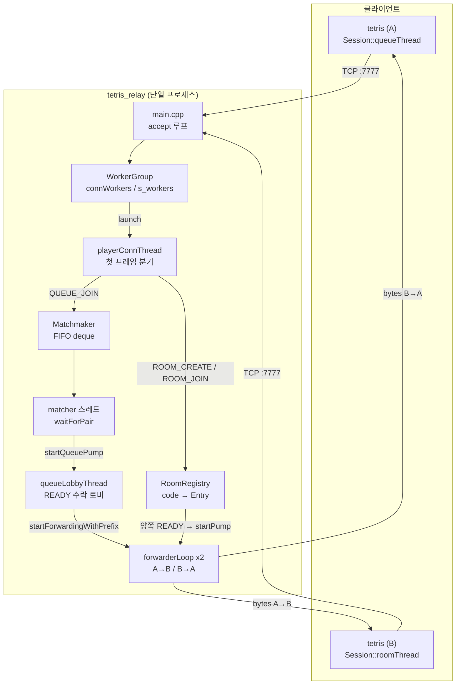
```mermaid
graph TB
    subgraph CLIENTS["클라이언트"]
        CA["tetris (A)<br/>Session::queueThread"]
        CB["tetris (B)<br/>Session::roomThread"]
    end

    subgraph RELAY["tetris_relay (단일 프로세스)"]
        ACC["main.cpp<br/>accept 루프"]
        WG["WorkerGroup<br/>connWorkers / s_workers"]
        PC["playerConnThread<br/>첫 프레임 분기"]
        MM["Matchmaker<br/>FIFO deque"]
        RR["RoomRegistry<br/>code → Entry"]
        MATCHER["matcher 스레드<br/>waitForPair"]
        LOBBY["queueLobbyThread<br/>READY 수락 로비"]
        FWD["forwarderLoop x2<br/>A→B / B→A"]
    end

    CA -- "TCP :7777" --> ACC
    CB -- "TCP :7777" --> ACC
    ACC --> WG
    WG -- launch --> PC
    PC -- QUEUE_JOIN --> MM
    PC -- "ROOM_CREATE / ROOM_JOIN" --> RR
    MM --> MATCHER
    MATCHER -- startQueuePump --> LOBBY
    LOBBY -- startForwardingWithPrefix --> FWD
    RR -- "양쪽 READY → startPump" --> FWD
    FWD -- "bytes A→B" --> CB
    FWD -- "bytes B→A" --> CA
```

스레드 모델은 다음과 같다.

| 스레드 | 개수 | 하는 일 | 소유 자원 |
|---|---|---|---|
| main | 1 | 논블로킹 `accept()` 폴링 | listen 소켓 |
| matcher | 1 | `waitForPair()` → `startQueuePump()` | 없음(참조만) |
| `playerConnThread` | 연결당 1 (≤256) | 첫 프레임 분기, 룸 진입 시 `roomLoop_` 로 블로킹 | 그 연결 소켓 |
| `queueLobbyThread` | 매치당 1 | 랜덤 큐 수락 로비 (30초) | 두 소켓 |
| `forwarderLoop` | 매치당 2 | 한 방향 바이트 복사 | `shared_ptr<Channel>` |

`queueLobbyThread` 와 `forwarderLoop` 를 합친 relay 워커의 상한은 512다.

소유권 모델은 `net::TcpSocket`을 그대로 쓴다. 플랫폼별 소켓 값을 `shared_ptr<NativeSocket>` 제어 블록으로 소유하는 handle이라 값 복사·이동이 안전하고, 실제 `close(2)`는 마지막 복사본이 사라질 때 한 번 일어난다. `tcp_close()`는 fd를 즉시 파괴하는 함수가 아니라 `shutdown()`으로 대기 중인 `recv`를 깨우는 **종료 신호**다. 블로킹 `accept`는 플랫폼에 따라 `shutdown`으로 깨어나지 않으므로 listen 소켓만은 §5 처럼 논블로킹 폴링으로 돌린다. worker와 shutdown 경로가 복사본을 잠시 함께 가져도 use-after-close와 이중 close가 나지 않는다는 것이 모든 스레드 인계의 전제다.

서버 쪽 룸 상태를 상태 기계로 보면 이렇다. 클라이언트의 `RoomState`는 같은 장의 `roomThread` 설명에서 서버 status와 함께 연결한다.

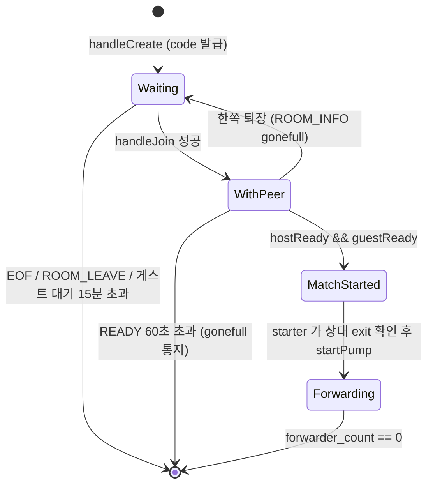
```mermaid
stateDiagram-v2
    [*] --> Waiting: handleCreate (code 발급)
    Waiting --> WithPeer: handleJoin 성공
    Waiting --> [*]: EOF / ROOM_LEAVE / 게스트 대기 15분 초과
    WithPeer --> Waiting: 한쪽 퇴장 (ROOM_INFO gonefull)
    WithPeer --> [*]: READY 60초 초과 (gonefull 통지)
    WithPeer --> MatchStarted: hostReady && guestReady
    MatchStarted --> Forwarding: starter 가 상대 exit 확인 후 startPump
    Forwarding --> [*]: forwarder_count == 0
```

## 3. CMakeLists 확장

이 장은 `server/`의 연결 분기, 매치메이커, 룸, 포워더, worker 수명 코드를 묶고 `tests/worker_group_test.cpp`로 worker 계약을 고정한다. 빌드에는 relay 실행 파일과 worker 회귀 타깃이 추가된다.

### 3.1 선행 확보 — `meta/http_client.*` 와 `meta/protocol.h`

아래 타깃 정의를 보면 `tetris_relay` 는 `meta/http_client.cpp` 를 **무조건** 링크한다. ranked 매치에서 relay 가 인증과 결과 저장을 위해 meta HTTP API 를 부르기 때문인데, 그 세 파일(`meta/http_client.h`, `meta/http_client.cpp`, `meta/protocol.h`)의 계약과 구현은 [메타·랭킹 문서](./part10-meta-and-ranking.md)가 소유한다. 순서대로 따라온 독자는 이 시점에 `meta/` 디렉토리가 비어 있으므로 configure 는 통과해도 링크가 실패한다.

다리를 놓는 방법은 둘이다.

1. **실패 의미론을 지키는 스텁을 직접 쓴다 (권장).** `verify_token`/`post_match` 가 항상 `std::nullopt` 를(유효한 인증/저장 확인 응답을 얻지 못한 상태) 반환하는 최소 구현이면 이 장의 완료 게이트 — unranked smoke 테스트 — 는 전부 통과한다. 신경망을 만들 때 encoder/decoder 껍데기를 먼저 선언하고 이후에 채우는 것과 같은 전개다: 인터페이스 계약을 먼저 손에 쥐면, 메타·랭킹 장에서 본문을 채울 때 이 장의 relay 코드가 그 계약을 어떻게 소비하는지 이미 알고 있는 상태가 된다.
2. **최종 저장소의 세 파일을 그대로 가져온다.** `third_party/httplib.h` 와 함께 복사만 하면 되고, 내용 이해는 뒤로 미뤄도 된다. 이 장의 relay 코드는 `meta::client::MetaClient*` 를 **null 일 수 있는 서비스 의존성**으로만 다루므로, `--meta` 없이 띄우는 한 이 코드는 링크만 되고 실행되지 않는다.

일반화하면 이렇다. **링커는 실행되지 않는 코드 경로의 심볼도 요구한다.** 빌드 의존성과 런타임 의존성은 다른 축이고, 한 장의 빌드 게이트가 뒤 장 소유의 파일을 가로지를 때 표준적인 다리는 "인터페이스의 실패 의미론을 지키는 스텁"이다. 스텁이 성공을 흉내 내면 뒤 장을 붙일 때 가짜 성공 경로가 실제 계약과 충돌하지만, 실패만 반환하는 스텁은 나중에 진짜 구현으로 바꿔도 동작 변화가 "안 되던 것이 되게" 한 방향뿐이라 안전하다.

### 3.2 타깃 정의

먼저 `TETRIS_BUILD_TEST` 블록에 `worker_group_test` 를 추가한다.

**현재 소스 발췌 — `CMakeLists.txt`**

```cmake
    add_executable(worker_group_test
        tests/worker_group_test.cpp
        server/worker_group.h
    )
    target_include_directories(worker_group_test PRIVATE ${CMAKE_CURRENT_SOURCE_DIR})
    if (NOT WIN32)
        find_package(Threads REQUIRED)
        target_link_libraries(worker_group_test PRIVATE Threads::Threads)
    endif()
```

그리고 릴레이 본체.

**현재 소스 발췌 — `CMakeLists.txt`**

```cmake
if (TETRIS_BUILD_RELAY)
    # relay 가 meta HTTP API 를 호출하려면 httplib 헤더와 http_client.cpp 필요.
    # third_party/httplib.h 는 TETRIS_BUILD_META 와 공유 — 릴레이만 빌드해도 필요.
    if (NOT EXISTS "${CMAKE_CURRENT_SOURCE_DIR}/third_party/httplib.h")
        message(FATAL_ERROR
            "TETRIS_BUILD_RELAY=ON 이지만 third_party/httplib.h 가 없습니다. "
            "meta API 호출용. cpp-httplib 를 다운로드해 third_party/ 에 넣으세요.")
    endif()
    add_executable(tetris_relay
        ${TETRIS_SIM_SOURCES}
        server/main.cpp
        server/log.cpp
        server/matchmaker.cpp
        server/player_conn.cpp
        server/relay.cpp
        server/room.cpp
        server/room_code.cpp
        server/room_code.h
        net/socket.cpp
        net/framing.cpp
        meta/http_client.cpp
        server/ip_admission.h
        server/log.h
        server/matchmaker.h
        server/match_uuid.h
        server/match_seed.h
        server/room_guess_budget.h
        server/player_conn.h
        server/player_session.h
        server/relay.h
        server/room.h
        server/worker_group.h
        net/socket.h
        net/framing.h
        meta/http_client.h
        meta/protocol.h
    )
    target_include_directories(tetris_relay PRIVATE
        ${CMAKE_CURRENT_SOURCE_DIR}
        ${CMAKE_CURRENT_SOURCE_DIR}/third_party
    )
    if (WIN32)
        target_link_libraries(tetris_relay PRIVATE ws2_32 bcrypt)
    else()
        # Linux/macOS: std::thread 는 pthread 를 필요로 함 (libstdc++)
        find_package(Threads REQUIRED)
        target_link_libraries(tetris_relay PRIVATE Threads::Threads)
    endif()
    if (TETRIS_ENABLE_HTTPS AND OpenSSL_FOUND)
        target_compile_definitions(tetris_relay PRIVATE CPPHTTPLIB_OPENSSL_SUPPORT)
        target_link_libraries(tetris_relay PRIVATE OpenSSL::SSL OpenSSL::Crypto)
    endif()
    # Section G: Linux 배포 번들용 rpath
    if (UNIX AND NOT APPLE)
        set_target_properties(tetris_relay PROPERTIES
            BUILD_RPATH "$ORIGIN/lib"
            INSTALL_RPATH "$ORIGIN/lib")
    endif()
endif()
```

두 블록은 relay와 worker test 타깃의 책임 경계를 보여 준다. 이후 하드닝으로 헤더나 구현 파일이 늘 수 있으므로 실제 소스 목록은 현재 `CMakeLists.txt`를 기준으로 하고, 타깃이 게임 렌더링·오디오 소스를 링크하지 않는다는 불변식을 확인한다.

주의할 점 두 가지.

- **릴레이만 빌드해도 `third_party/httplib.h` 가 필요하다.** `TETRIS_BUILD_META` 와 공유하는 헤더이고, 없으면 configure 단계에서 `FATAL_ERROR` 로 죽는다. 릴레이가 `meta/http_client.cpp` 를 링크하기 때문이다.
- **`meta/http_client.cpp`는 릴레이에도 링크된다.** ranked 매치에서 relay가 `/v1/auth/verify`와 `/v1/matches`를 직접 호출하기 때문이다. `--meta`를 주지 않으면 이 코드는 실행되지 않지만 링크는 항상 된다. 이 장의 relay 경계에서는 `meta::client::MetaClient*`를 null일 수 있는 서비스 의존성으로 보고, HTTP·인증 계약은 [메타·랭킹 문서](./part10-meta-and-ranking.md)에 모은다.

`TETRIS_BUILD_RELAY` 옵션 자체는 기본 OFF 이므로(`CMakeLists.txt`), 릴레이를 빌드하려면 명시적으로 켜야 한다. 게임 클라이언트를 함께 빌드할 필요는 없다.

## 4. `WorkerGroup` — detached 워커의 수명과 예외 격리

연결 처리와 매치 전달은 서로 다른 수명의 작업이다. 작업마다 스레드를 만들고
detach할 때에는 아래 책임을 별도로 구현해야 한다.

1. **접수 상한:** 작업이 무제한 시작되지 않도록 예약과 상한 검사를 묶는다.
2. **본문 예외 처리:** 스레드 진입 함수 밖으로 예외가 빠져나가면 프로세스가 종료될 수 있다. detach 여부와 별개다.
3. **참조 수명:** 작업이 빌려 쓴 Matchmaker·RoomRegistry·MetaClient는 작업과 캡처 정리보다 오래 살아 있어야 한다.

헤더 전용 WorkerGroup은 접수한 작업의 실행과 캡처 정리를 센다. 작업마다 새 OS
스레드를 만들므로 스레드 풀은 아니다. active 상한도 완료 통지 뒤의 OS 정리·TLS
소멸까지 포함한 모든 네이티브 스레드 수의 엄밀한 상한으로 해석하지 않는다.

**현재 소스 발췌 — `server/worker_group.h`**

```cpp
#pragma once

#include <condition_variable>
#include <cstddef>
#include <cstdio>
#include <exception>
#include <limits>
#include <memory>
#include <mutex>
#include <thread>
#include <type_traits>
#include <utility>

namespace relay {

// Tracks detached workers so their owner can stop accepting new work and wait
// until every callback and its owned captures have been destroyed.
// stopAccepting does not cancel running jobs. The owner must wake them before
// waiting, and finish/join external callers before destroying this group.
// A task must not wait on its own group. TLS destructors/OS thread exit are
// outside this task-drain boundary; use join ownership when those matter.
class WorkerGroup {
public:
    explicit WorkerGroup(
        const char* name,
        size_t maxActive = std::numeric_limits<size_t>::max()) noexcept
        : name_(name), maxActive_(maxActive) {}

    ~WorkerGroup()
    {
        stopAccepting();
        wait();
    }

    WorkerGroup(const WorkerGroup&) = delete;
    WorkerGroup& operator=(const WorkerGroup&) = delete;

    template <typename Fn>
    bool launch(Fn&& fn) noexcept
    {
        {
            std::lock_guard<std::mutex> lk(mu_);
            if (!accepting_) return false;
            if (active_ >= maxActive_) {
                std::fprintf(stderr, "[%s] worker limit reached (%zu)\n",
                             name_, maxActive_);
                return false;
            }
            ++active_;
        }

        std::thread worker;
        try {
            worker = std::thread(
                [this, work = std::make_unique<std::decay_t<Fn>>(std::forward<Fn>(fn))]() mutable {
                Completion completion{this};
                // Locals die in reverse order. Destroy the task (including its
                // captures) before Completion releases the active slot.
                auto ownedWork = std::move(work);
                try {
                    (*ownedWork)();
                } catch (const std::exception& e) {
                    std::fprintf(stderr, "[%s] worker failed: %s\n", name_, e.what());
                } catch (...) {
                    std::fprintf(stderr, "[%s] worker failed: unknown exception\n", name_);
                }
            });
        } catch (const std::exception& e) {
            std::fprintf(stderr, "[%s] worker launch failed: %s\n", name_, e.what());
            finish();
            return false;
        } catch (...) {
            std::fprintf(stderr, "[%s] worker launch failed: unknown exception\n", name_);
            finish();
            return false;
        }
        // A failed detach must not destroy a joinable temporary. The task
        // already started, so only its Completion releases the slot.
        try {
            worker.detach();
        } catch (...) {
            worker.join(); // Fallback may block. A join failure is fail-fast.
        }
        return true;
    }

    void stopAccepting() noexcept
    {
        std::lock_guard<std::mutex> lk(mu_);
        accepting_ = false;
    }

    void wait() noexcept
    {
        std::unique_lock<std::mutex> lk(mu_);
        cv_.wait(lk, [this] { return active_ == 0; });
    }

private:
    struct Completion {
        WorkerGroup* owner;
        ~Completion() { owner->finish(); }
    };

    void finish() noexcept
    {
        // notify 는 반드시 lock 보유 중에 — unlock 후 notify 하면, 그 사이에
        // wait() 쪽이 spurious wakeup 으로 active_==0 을 보고 반환해 cv_ 를
        // 파괴한 뒤 (예: ~WorkerGroup) 이 스레드가 파괴된 cv_ 에 notify 하는
        // use-after-free 경합이 생긴다. lock 안이면 waiter 는 lock 재획득
        // 전까지 반환할 수 없어 cv_ 수명이 보장된다.
        std::lock_guard<std::mutex> lk(mu_);
        --active_;
        cv_.notify_all();
    }

    const char* name_;
    std::mutex mu_;
    std::condition_variable cv_;
    size_t active_{0};
    const size_t maxActive_;
    bool accepting_{true};
};

}  // namespace relay
```

### 4.1 접수 예약과 생성 실패

상한 검사·accepting 검사·active 증가는 같은 mutex 임계구역 안에서 수행한다.
검사 후 lock을 풀고 따로 증가하면 두 생산자가 같은 빈 자리를 보고 모두 통과할 수 있다.
작업을 시작한 뒤 그 작업 안에서 active를 올려도 안 된다. 시작 직후의 wait가 아직
0을 보고 반환할 수 있기 때문이다. 여러 연결 worker가 동시에 큐에 진입하므로
matchmaker의 생산자도 하나라고 가정하지 않는다.

예약 뒤 callable 저장소와 std::thread를 만든다. 이 생성이 실패하면 catch에서
예약을 한 번 반납한다. 오류 기록도 finish 이전에 남겨 완료 통지 후 그룹을 다시
사용하지 않는다. task 본문에서 발생한 예외는 이미 시작한 worker 안에서 처리한다.

생성된 스레드는 이름 있는 worker 변수에 보관한 뒤 detach한다. detach 실패는
작업 생성 실패와 다르다. 이미 시작된 작업의 Completion이 카운터를 반납하므로
호출자가 다시 finish하면 안 된다. 현재 정책은 join으로 기다린 뒤 true를 반환하는
폴백이다. 드문 이 경로에서는 launch가 작업 종료까지 막힐 수 있고, join 자체 실패는
noexcept 경계를 통해 fail-fast한다. 지원할 시스템 자원 오류의 복구 정책은 별도다.
[join·detach의 계약](https://eel.is/c++draft/thread.thread.member)과
[joinable thread의 소멸](https://eel.is/c++draft/thread.thread.destr)을 함께 읽는다.

### 4.2 본문 반환과 캡처 소멸을 구별한다

Completion은 스코프를 나갈 때 finish를 호출한다. 이 RAII는 정상 반환과 C++ 예외
처리 흐름의 감소 책임을 한곳에 묶는다. abort·강제 프로세스 종료·비정상적인 소멸자
예외까지 자원 정리를 보장한다는 뜻은 아니다. fprintf가 일반적으로 C++ 예외를
던지므로 guard가 필요하다는 설명도 사용하지 않는다.

람다에 work 객체를 직접 캡처하면 본문 지역 객체인 Completion이 먼저 파괴되고,
람다의 work 캡처는 그 뒤에 파괴될 수 있다. 이때 active가 0이라고 해도 소켓·슬롯
등의 캡처 정리가 아직 끝나지 않았을 수 있다. 따라서 callable을 unique_ptr로
보관하고, Completion을 선언한 다음 그 포인터를 지역 ownedWork로 이동한다.

지역 객체는 선언의 역순으로 파괴된다. ownedWork가 callable과 캡처를 정리한 뒤
Completion이 슬롯을 놓는다. 원래 람다에 남은 포인터는 비어 있다. shared_ptr를
캡처했다면 여기서 놓는 것은 이 작업의 참조이며 다른 소유자가 가진 객체까지 강제로
파괴하지 않는다. 작업 중 소켓을 큐나 다른 단계에 인계했다면 그 새 소유권은 계속된다.

wait는 이 작업/캡처 완료 경계를 기다린다. detached 스레드의 OS 종료와 TLS 소멸까지
join하는 것은 아니다. thread_local 소멸자가 그룹이나 먼저 파괴될 상태를 다시
사용하는 설계라면 join 소유권 등 더 강한 수명 정책이 필요하다.

### 4.3 `finish()` 가 lock 을 쥔 채 notify 하는 이유

교과서적 조언은 "notify 전에 unlock 하라 — waiter 가 깨자마자 lock 을 못 잡고 다시 자는 낭비를 피한다" 다. 여기서는 **일부러 반대로** 한다. 코드 주석이 이유를 그대로 적어두고 있다. 재구성하면 이런 인터리빙이다.

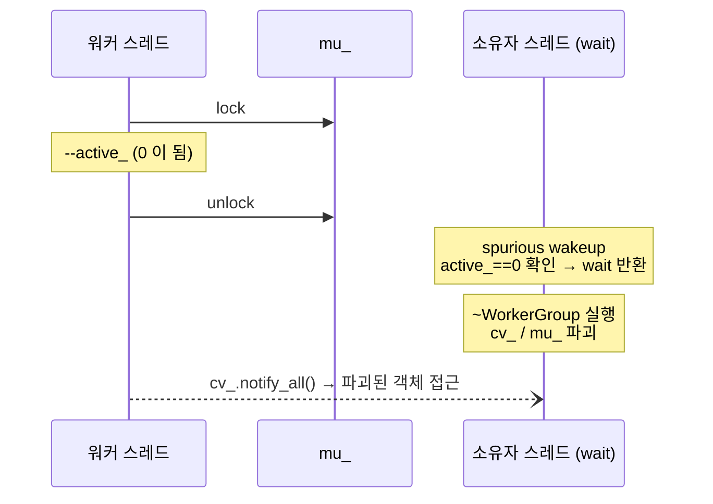
```mermaid
sequenceDiagram
    participant W as 워커 스레드
    participant M as mu_
    participant O as 소유자 스레드 (wait)

    W->>M: lock
    Note over W: --active_ (0 이 됨)
    W->>M: unlock
    Note over O: spurious wakeup<br/>active_==0 확인 → wait 반환
    Note over O: ~WorkerGroup 실행<br/>cv_ / mu_ 파괴
    W--)O: cv_.notify_all() → 파괴된 객체 접근
```

`wait()` 안의 `cv_.wait(lk, pred)` 는 술어가 참이면 **notify 없이도** 반환할 수 있다. spurious wakeup 이 그 순간에 끼면 소유자는 `--active_` 만 보고 즉시 반환하고, `~WorkerGroup` 이 `cv_` 를 파괴한다. 그 뒤 워커가 `cv_.notify_all()` 을 호출하면 이미 없는 객체를 건드린다.

lock 을 쥔 채 notify 하면 이 창이 닫힌다. `wait()` 가 술어를 확인하고 반환하려면 반드시 `mu_` 를 다시 잡아야 하는데, `finish()` 가 `mu_` 를 놓기 전까지는 잡을 수 없다. `finish()` 가 `mu_` 를 놓는 시점에는 `notify_all()` 이 이미 끝나 있다. 성능 손해는 스레드 종료 경로 한 번의 락 경합이고, 얻는 것은 소멸 순서 안전성이다.

이 선택은 마지막 완료 통지 뒤 소유자가 그룹을 파괴할 수 있는 현재 구조의 수명 조건에
맞춘 것이다. 별도 공유 상태가 condition_variable의 수명을 보장하는 설계도 가능하다.
notify를 언제나 lock 안이나 밖에 두어야 한다는 일반 규칙으로 바꾸지 않는다.
wait는 알림의 개수가 아니라 같은 mutex로 보호한 active==0 술어를 반복 확인한다.
[condition_variable의 wait 계약](https://eel.is/c++draft/thread.condition.condvar)이
잠금 해제·대기·재획득과 허위 깨움의 관계를 설명한다.

stopAccepting은 새 접수만 닫는다. 이미 기다리는 작업은 별도의 종료 플래그·큐 닫기·
notify 또는 I/O 취소로 빠져나오게 해야 한다. 그 다음 wait하고 빌려 준 상태를
파괴한다. 그룹 안의 작업이 자기 그룹을 wait하면 자기 active를 기다리므로
교착될 수 있다. 그룹 파괴 전에는 외부 launch/wait 호출자도 모두 정리해야 한다.

### 4.4 회귀 테스트

`WorkerGroup`은 서버 전체의 종료 안전성을 떠받치므로 독립 실행 테스트가 있다. 어서션 대신 종료 코드로 실패를 알려 외부 테스트 프레임워크 없이 실행할 수 있다.

**현재 소스 발췌 — `tests/worker_group_test.cpp`**

```cpp
#include "../server/worker_group.h"

#include <condition_variable>
#include <mutex>
#include <stdexcept>

int main()
{
    relay::WorkerGroup workers{"worker-group-test", 1};
    std::mutex mu;
    std::condition_variable cv;
    bool started = false;
    bool release = false;

    if (!workers.launch([&] {
            std::unique_lock<std::mutex> lk(mu);
            started = true;
            cv.notify_all();
            cv.wait(lk, [&] { return release; });
        })) {
        return 1;
    }

    {
        std::unique_lock<std::mutex> lk(mu);
        cv.wait(lk, [&] { return started; });
    }
    if (workers.launch([] {})) return 2;

    {
        std::lock_guard<std::mutex> lk(mu);
        release = true;
    }
    cv.notify_all();
    workers.wait();

    if (!workers.launch([] { throw std::runtime_error("expected"); })) return 3;
    workers.wait();

    workers.stopAccepting();
    if (workers.launch([] {})) return 4;
    return 0;
}
```

검증하는 것은 네 가지다.

| 종료 코드 | 실패한 성질 |
|---|---|
| 1 | 상한 이내의 첫 `launch` 가 성공해야 한다 |
| 2 | `maxActive=1` 인데 두 번째 `launch` 가 통과했다 (상한 미작동) |
| 3 | 워커가 끝난 뒤 슬롯이 반납되지 않았다 |
| 4 | `stopAccepting()` 이후에도 새 워커를 받았다 |

세 번째 `launch` 는 일부러 `std::runtime_error` 를 던진다. 그 뒤의 `workers.wait()` 가 반환하면 "예외가 프로세스를 죽이지 않았고, 카운터도 정상 감소했다" 가 동시에 증명된다. 실행하면 stderr 에 다음 두 줄이 찍히는 것이 정상이다.

```text
[worker-group-test] worker limit reached (1)
[worker-group-test] worker failed: expected
```

빌드와 실행:

```bash
cmake -S . -B build -DTETRIS_BUILD_GAME=OFF -DTETRIS_BUILD_TEST=ON
cmake --build build --target worker_group_test
./build/worker_group_test && echo "WorkerGroup OK"
```

캡처 정리 순서는 tests/learning/worker_lifetime.cpp의 추가 회귀로 검사한다.
마지막 캡처의 소멸자를 조건 변수에서 멈춘 뒤 같은 상한 1 그룹에 새 작업을 넣는다.
이때 거절되어야 한다. sleep으로 실행 속도를 추측하지 않고 소멸자 진입 사건을 기다린다.
이 검사는 CTest의 worker_lifetime이며, callable 이동 생성 실패의 예약 복원,
알려진/알 수 없는 본문 예외, move-only 작업, 동시 생산자의 상한과 접수 중단도 검사한다.

## 5. 서버 엔트리 `server/main.cpp`

이제 서버 본체다. `main` 은 인자 파싱, 리스닝, matcher 스레드 기동, accept 루프, 그리고 순서가 중요한 종료 시퀀스를 담당한다. 연결 수명과 입장 제한이 한 흐름에서 맞물리므로 이 파일은 전체 구조가 보이도록 싣는다.

**현재 소스 발췌 — `server/main.cpp`**

```cpp
// Relay process entry point. Protocol details live in net/framing.h and docs.

#include "ip_admission.h"
#include "matchmaker.h"
#include "player_conn.h"
#include "relay.h"
#include "room.h"
#include "worker_group.h"
#include "../net/socket.h"
#include "../meta/http_client.h"
#include "log.h"

#include <atomic>
#include <charconv>
#include <chrono>
#include <csignal>
#include <cstdint>
#include <cstdio>
#include <cstdlib>
#include <cstring>
#include <functional>
#include <iostream>
#include <memory>
#include <string>
#include <system_error>
#include <thread>

namespace {

static_assert(std::atomic<bool>::is_always_lock_free,
              "signal handler requires lock-free atomic<bool>");
std::atomic<bool> g_running{true};
net::TcpSocket    g_listen_sock{};  // 논블로킹 listen 소켓 (accept 폴링)

// Bound thread and handle use during connection setup.
constexpr size_t kMaxConnWorkers = 256;

// per-IP 상한은 server/ip_admission.h 가 두 릴레이 바이너리에 공통으로 정의한다
// (핸드셰이크 슬롯 = 인증까지, 세션 슬롯 = 연결이 죽을 때까지).

void signalHandler(int /*sig*/) {
    // The signal handler only touches an atomic flag.
    g_running.store(false);
}

void printUsage() {
    std::cout <<
        "Usage: tetris_relay [--port N] [--meta URL] [--meta-secret SECRET]\n"
        "                    [--max-sessions-per-ip N] [--log-level L]\n"
        "  --log-level L    error|warn|info|debug (default info). 운영에서는 warn 이\n"
        "                   접속·매치 줄까지 지운다. TETRIS_RELAY_LOG_LEVEL 로도\n"
        "                   정할 수 있고 이 인자가 이긴다.\n"
        "  --loopback-only  Listen on 127.0.0.1 behind the WSS gateway.\n"
        "  --port N         TCP listen port (default 7777)\n"
        "  --meta URL       tetris_meta base URL (e.g. https://api.example.com)\n"
        "                   If omitted, relay runs unranked (no token verify,\n"
        "                   no /v1/matches POST).\n"
        "  --meta-secret S  Send X-Relay-Secret on /v1/matches.\n"
        "                   Defaults to TETRIS_RELAY_SECRET if set.\n"
        "  --max-sessions-per-ip N\n"
        "                   Concurrent connections one address may hold for the\n"
        "                   life of the connection (default "
        << relay::kMaxSessionsPerIp << ").\n"
        "                   Separate from the per-IP handshake budget ("
        << relay::kMaxHandshakesPerIp << "), which\n"
        "                   is released as soon as a connection authenticates.\n"
        "                   Raise it only for a deployment that legitimately\n"
        "                   shares one address across many players.\n"
        "  -h, --help       Show this help\n";
}

bool parseCount(const std::string& s, size_t& out) {
    if (s.empty()) return false;
    unsigned long long value = 0;
    auto* first = s.data();
    auto* last = s.data() + s.size();
    auto res = std::from_chars(first, last, value);
    if (res.ec != std::errc{} || res.ptr != last) return false;
    if (value < 1 || value > 100000) return false;
    out = static_cast<size_t>(value);
    return true;
}

bool parsePort(const std::string& s, uint16_t& out) {
    if (s.empty()) return false;
    unsigned int value = 0;
    auto* first = s.data();
    auto* last = s.data() + s.size();
    auto res = std::from_chars(first, last, value);
    if (res.ec != std::errc{} || res.ptr != last) return false;
    if (value < 1 || value > 65535) return false;
    out = static_cast<uint16_t>(value);
    return true;
}

}  // namespace

int main(int argc, char** argv) {
    uint16_t    port = 7777;
    std::string metaUrl;  // empty = unranked
    bool loopbackOnly = false;
    std::string metaSecret;
    if (const char* env = std::getenv("TETRIS_RELAY_SECRET")) {
        metaSecret = env;
    }

    // 환경변수 먼저, 인자 나중 — 루프 릴레이와 같은 규칙이다. 두 바이너리가 로그
    // 설정을 다르게 받으면 운영자가 바이너리마다 다른 것을 외워야 한다.
    // 잘못된 값은 알린 뒤 기본값으로 간다. 로그 설정 하나로 서버가 안 뜨는 쪽이
    // 더 나쁜 실패다.
    if (const char* env = std::getenv("TETRIS_RELAY_LOG_LEVEL")) {
        relay::LogLevel lv{};
        if (relay::parse_log_level(env, lv)) relay::set_log_level(lv);
        else RLOG_WARN("[relay] TETRIS_RELAY_LOG_LEVEL 값을 알 수 없어 무시합니다: "
                       << env);
    }

    for (int i = 1; i < argc; ++i) {
        const std::string a = argv[i];
        if (a == "--log-level" && i + 1 < argc) {
            const std::string v = argv[++i];
            relay::LogLevel lv{};
            if (!relay::parse_log_level(v, lv)) {
                RLOG_ERROR("[relay] --log-level 은 error|warn|info|debug 여야 합니다: " << v);
                return 2;
            }
            relay::set_log_level(lv);
        } else if (a == "--port" && i + 1 < argc) {
            const std::string portArg = argv[++i];
            if (!parsePort(portArg, port)) {
                RLOG_ERROR("Invalid --port value: " << portArg
                           << " (expected 1..65535)");
                return 2;
            }
        } else if (a == "--loopback-only") {
            loopbackOnly = true;
        } else if (a == "--meta" && i + 1 < argc) {
            metaUrl = argv[++i];
        } else if (a == "--meta-secret" && i + 1 < argc) {
            metaSecret = argv[++i];
        } else if (a == "--max-sessions-per-ip" && i + 1 < argc) {
            const std::string arg = argv[++i];
            size_t n = 0;
            if (!parseCount(arg, n)) {
                RLOG_ERROR("Invalid --max-sessions-per-ip value: " << arg
                           << " (expected 1..100000)");
                return 2;
            }
            relay::IpAdmission::set_session_limit(n);
        } else if (a == "-h" || a == "--help") {
            printUsage();
            return 0;
        } else {
            RLOG_ERROR("Unknown arg: " << a);
            printUsage();
            return 1;
        }
    }

    // meta 클라이언트 (옵션). URL 미지정 시 nullptr → unranked.
    std::unique_ptr<meta::client::MetaClient> metaClient;
    if (!metaUrl.empty()) {
        if (metaSecret.empty()) {
            RLOG_ERROR("[relay] refusing to start: --meta set but no relay secret. "
                       << "Set --meta-secret or TETRIS_RELAY_SECRET (meta rejects "
                       << "POST /v1/matches without it).");
            return 2;
        }
        metaClient = std::make_unique<meta::client::MetaClient>(metaUrl, metaSecret);
        if (!metaClient->valid()) {
            RLOG_ERROR("[relay] invalid --meta URL: " << metaUrl);
            return 2;
        } else {
            RLOG_INFO("[relay] meta enabled: " << metaUrl);
        }
    } else {
        RLOG_INFO("[relay] meta=none (unranked mode)");
    }

    std::signal(SIGINT,  signalHandler);
    std::signal(SIGTERM, signalHandler);
#if defined(_WIN32)
    // Windows 콘솔의 CTRL_BREAK_EVENT 는 CRT 가 SIGBREAK 로 전달한다. Python
    // 테스트가 TerminateProcess(핸들러 실행 기회가 아예 없다) 대신
    // CTRL_BREAK_EVENT 로 우아한 종료 경로를 검증할 수 있도록 함께 등록한다.
    std::signal(SIGBREAK, signalHandler);
#endif

    if (!net::net_init()) {
        RLOG_ERROR("net_init() failed");
        return 1;
    }

    g_listen_sock = net::tcp_listen(port, /*backlog=*/256, loopbackOnly);
    if (!g_listen_sock.valid()) {
        RLOG_ERROR("tcp_listen(" << port << ") failed — port in use?");
        net::net_shutdown();
        return 1;
    }
    // Nonblocking accept lets the loop observe the shutdown flag.
    if (!net::tcp_set_nonblocking(g_listen_sock)) {
        RLOG_ERROR("listen nonblocking setup failed");
        net::tcp_close(g_listen_sock);
        g_listen_sock = {};
        net::net_shutdown();
        return 1;
    }
    RLOG_INFO("[relay] listening on 0.0.0.0:" << port);
    RLOG_INFO("[relay] local IP: " << net::get_local_ip());
    RLOG_INFO("[relay] Ctrl+C to stop");

    relay::Matchmaker   mm;
    relay::RoomRegistry rr;

    // Drain workers before destroying the state they reference.
    relay::WorkerGroup connWorkers{"relay-connection", kMaxConnWorkers};
    RLOG_INFO("[relay] per-IP limits: handshakes=" << relay::kMaxHandshakesPerIp
              << " sessions=" << relay::IpAdmission::session_limit());

    // 매칭 전담 스레드: 2명 모일 때마다 페어링 + relay 시작.
    // meta 가 있으면 post_match 를 호출할 수 있도록 포인터를 startPump 에 넘긴다.
    meta::client::MetaClient* mcPtr = metaClient.get();
    rr.setMeta(mcPtr);
    std::thread matcher;
    try {
        matcher = std::thread([&mm, mcPtr] {
            try {
                while (true) {
                    auto match = mm.waitForPair();
                    if (!match) break;  // shutdown
                    // 랜덤 큐 경로: MATCH_FOUND → 양쪽 READY(1) 수락 대기 → 게임 포워딩.
                    // (커스텀 룸 경로는 room.cpp 가 READY 를 자체 확인한 뒤 startPump 를 호출한다.)
                    relay::startQueuePump(std::move(*match), mcPtr);
                }
            } catch (const std::exception& e) {
                RLOG_ERROR("[relay] matcher failed: " << e.what());
                g_running.store(false);
                mm.shutdown();
            } catch (...) {
                RLOG_ERROR("[relay] matcher failed: unknown exception");
                g_running.store(false);
                mm.shutdown();
            }
        });
    } catch (const std::exception& e) {
        RLOG_ERROR("[relay] matcher launch failed: " << e.what());
        net::tcp_close(g_listen_sock);
        g_listen_sock = net::TcpSocket{};
        net::net_shutdown();
        return 1;
    }

    // accept 루프 (논블로킹 폴링)
    uint32_t next_conn_id = 1;
    while (g_running.load()) {
        auto client = net::tcp_accept(g_listen_sock);
        if (!client.valid()) {
            // 논블로킹 accept: 대기 연결 없음(EWOULDBLOCK) 또는 셧다운.
            if (!g_running.load()) break;
            // 대기 연결 없음 — 잠깐 쉬었다가 재폴링.
            std::this_thread::sleep_for(std::chrono::milliseconds(10));
            continue;
        }
        const uint32_t id = next_conn_id++;
        std::string peerIp = net::tcp_peer_ip(client);
        if (peerIp.empty()) {
            // getpeername 실패 시 모든 연결이 "unknown" 단일 버킷(상한 16)을
            // 공유하면 무관한 연결끼리 서로를 굶긴다. fd 는 이 연결이 살아있는
            // 동안 프로세스 내에서 유일하므로 연결별 고유 키로 대신 사용한다
            // (per-IP 상한은 못 걸지만, 실패 케이스끼리의 공멸보다 낫다).
            peerIp = "fd:" + std::to_string(client.fd());
        }
        // 두 상한을 독립적으로 건다. 세션 슬롯은 연결이 죽을 때까지(소켓과 함께
        // 큐·룸·포워딩으로 옮겨 다니며) 붙들고, 핸드셰이크 슬롯은 인증이 끝나는
        // 순간 playerConnThread 가 놓아준다.
        auto sessionSlot = relay::IpAdmission::acquire(
            peerIp, relay::IpAdmission::Kind::Session);
        if (!sessionSlot) {
            RLOG_INFO("[relay] rejecting conn=" << id << " ip=" << peerIp
                      << ": per-IP session limit player_id=0 match_uuid=-");
            net::tcp_close(client);
            continue;
        }
        auto handshakeSlot = relay::IpAdmission::acquire(
            peerIp, relay::IpAdmission::Kind::Handshake);
        if (!handshakeSlot) {
            RLOG_INFO("[relay] rejecting conn=" << id << " ip=" << peerIp
                      << ": per-IP handshake limit player_id=0 match_uuid=-");
            net::tcp_close(client);
            continue;
        }
        RLOG_DEBUG("[relay] accept conn=" << id << " ip=" << peerIp);
        // launch 가 실패하면 람다(그리고 두 슬롯 사본)가 그대로 소멸하므로
        // 별도의 반납 경로가 필요 없다.
        if (!connWorkers.launch([client = std::move(client), id, &mm, &rr, mcPtr,
                                 handshakeSlot = std::move(handshakeSlot),
                                 sessionSlot = std::move(sessionSlot)]() mutable {
            relay::playerConnThread(std::move(client), id, mm, rr, mcPtr,
                                    std::move(handshakeSlot),
                                    std::move(sessionSlot));
        })) {
            RLOG_WARN("[relay] rejecting conn=" << id
                      << ": connection worker unavailable player_id=0 match_uuid=-");
        }
    }

    RLOG_INFO("[relay] shutting down...");
    relay::beginShutdown();
    connWorkers.stopAccepting();
    net::tcp_close(g_listen_sock);
    g_listen_sock = net::TcpSocket{};  // 마지막 참조 해제 → 실제 fd close
    mm.shutdown();
    rr.shutdown();
    if (matcher.joinable()) matcher.join();
    connWorkers.wait();
    relay::waitForShutdown();
    net::net_shutdown();
    RLOG_INFO("[relay] done");
    return 0;
}
```

주목할 부분을 짚는다.

**시그널 처리.** `SIGINT`/`SIGTERM` 핸들러는 `g_running = false` 만 한다. 핸들러 안에서 `tcp_close()` 나 `shared_ptr` 접근을 하지 않는다 — 둘 다 async-signal-safe 가 아니다. listen 소켓은 `tcp_set_nonblocking()`의 성공을 확인한 뒤 폴링하며, accept 루프가 정지 플래그를 읽으면 루프를 빠져나온다. 전환 실패는 기동 실패로 처리한다. 반복의 대기 간격은 OS 스케줄링을 포함한 종료 시간 보장이 아니다. 실제 소켓 정리는 루프를 나온 뒤 일반 스레드 문맥에서 한다. Windows 에서는 `SIGBREAK` 도 같은 핸들러에 등록한다 — 콘솔 `CTRL_BREAK_EVENT` 가 CRT 를 거쳐 `SIGBREAK` 로 도착하므로, 테스트 하네스가 `TerminateProcess`(핸들러가 실행될 기회 자체가 없다) 대신 이 이벤트로 우아한 종료 시퀀스 전체를 검증할 수 있다. 종료 경로는 검증할 수 없으면 없는 것과 같다는 원칙의 플랫폼별 각론이다.

**matcher 스레드의 이중 예외 방어.** 람다 **안쪽**에 `try/catch` 가 있고, `std::thread` 생성 자체도 `try/catch` 로 감쌌다. matcher 는 `WorkerGroup` 소속이 아니라 직접 만든 `std::thread` 이므로 `WorkerGroup` 의 예외 격리가 적용되지 않는다. 그래서 각각을 따로 막는다.

- 람다 안에서 예외가 나면 `g_running=false` + `mm.shutdown()` 으로 **서버 전체를 질서 있게 내린다**. 매칭이 죽은 채로 accept 만 계속하면 큐에 사람이 무한정 쌓인다.
- 스레드 생성이 실패하면 listen 소켓을 정리하고 `return 1` 로 즉시 종료한다. matcher 없는 릴레이는 아무 일도 못 한다.

**소켓 소유권 이전.** `connWorkers.launch` 의 람다 캡처 `[client = std::move(client), ...]` 로 소켓이 워커에게 넘어간다. `TcpSocket` 은 owning handle 이므로 이동 후에도 fd 는 살아 있고, 워커가 끝나 마지막 복사본이 사라질 때 한 번만 닫힌다.

**로그 한 줄은 원자적이어야 한다.** 이 서버는 연결마다 스레드를 만든다. 그래서 `std::cerr << a << b << c` 는 여기서 특히 위험하다 — 삽입 연산자 하나하나가 별도의 출력 연산이라, 다른 연결의 스레드가 그 사이에 끼어들면 **두 매치의 로그가 한 줄에 엉킨다.** 부하가 낮을 때는 거의 안 보이다가 붐빌 때 나타나는데, 하필 로그가 가장 필요한 순간이 그때다. 엉킨 줄은 "그 시각 그 사람이 왜 끊겼는지" 를 못 맞추므로 문의 대응에 쓸 수 없다.

`server/log.h` 의 `RLOG_ERROR`/`RLOG_WARN`/`RLOG_INFO`/`RLOG_DEBUG` 는 줄 전체를 스택 위의 문자열로 조립한 뒤 `write` 를 정확히 한 번 부른다. 파이프로 받을 때 `PIPE_BUF`(4096) 이하의 `write` 는 커널이 쪼개지 않으므로, 이 로그의 줄 길이에서는 인터리브가 **구조적으로** 불가능해진다. 잠금으로 지키는 대신 한 번의 시스템 콜로 만들어 얻는 원자성이라, 로그가 새로운 경합 지점이 되지 않는다는 점이 중요하다 — 로그 뮤텍스를 두면 그 락을 모든 연결 스레드가 다투게 된다.

매크로인 이유는 지연 평가다. 함수였다면 인자의 문자열 접합과 정수 포매팅이 레벨과 무관하게 매번 계산되고, "끄면 사라진다" 는 기대와 정반대로 비용이 항상 지불된다. 임계값 아래의 호출은 원자적 load 한 번으로 끝나야 조사할 때만 상세 로그를 켜는 운영이 성립한다. 그리고 **포워딩 hot path 에는 어느 레벨에서도 로그를 두지 않는다** — 저전력 배포 대상에서 로깅이 트래픽 처리와 CPU 를 다투면 안 되기 때문이다.

마지막으로, 모든 종료·거절 줄에 `match_uuid` 와 `player_id` 를 붙이고 타임스탬프를 UTC 로 고정한다. meta 의 경기 기록이 UTC 이고 같은 `match_uuid` 를 키로 갖기 때문이다. **로그의 값어치는 줄 수가 아니라 다른 시스템과 이어 붙일 수 있는 키의 유무에서 나온다.**

**IP별 입장 예산.** 전역 worker 상한만 두면 한 공격자가 모든 자리를 차지할 수 있다. accept 직후 얻은 peer IP로 `IpAdmission` 슬롯을 잡되, 수명이 다른 종류를 각각 건다 — 핸드셰이크 슬롯은 첫 명령이 인증을 통과하는 순간 `playerConnThread` 가 놓아주고, 세션 슬롯은 소켓을 따라 큐·룸·포워딩으로 옮겨 다니며 연결이 죽을 때까지 남는다. `IpAdmission::acquire` 가 돌려주는 것은 `shared_ptr` 이라 마지막 사본이 사라질 때 카운터가 줄고, 워커 람다가 슬롯을 이동 캡처로 받아 가므로 정상 반환·예외·서버 종료 어느 경로에서도 반납된다. 워커 생성 자체가 실패한 경우에도 람다가 실행되지 않은 채 그대로 소멸하므로 별도의 반납 경로가 필요 없다. 성립된 매치의 소켓 수명은 relay worker 예산이 따로 제한한다.

여기서 쓰는 `net::tcp_peer_ip` 는 Part 6 의 소켓 계층에 없던 함수로, **이 장이 `net/socket.h` 에 추가하는 admission 전용 헬퍼**다. `getnameinfo` 를 숫자형 모드로 호출해 DNS 조회 없이 peer 주소 문자열만 얻는다. 조회가 실패해 빈 문자열이 돌아오면 모든 실패 연결이 `"unknown"` 이라는 단일 버킷(상한 16)에 몰려 서로를 굶기게 되므로, 그 연결이 살아 있는 동안 프로세스 내에서 유일한 fd 번호를 `"fd:N"` 키로 대신 쓴다. per-IP 상한이라는 원래 목적은 그 연결에 한해 포기하지만, 키 공간을 잃지 않는 것이 무관한 연결끼리의 공멸보다 낫다 — 식별자 기반 예산에서 식별 실패를 하나의 공유 키로 접으면 그 키 자체가 DoS 표면이 된다는 일반 원칙이다.

**종료 순서가 곧 안전성이다.** `beginShutdown()` 부터 `net_shutdown()` 까지 이어지는 종료 시퀀스의 순서에는 줄마다 이유가 있다.

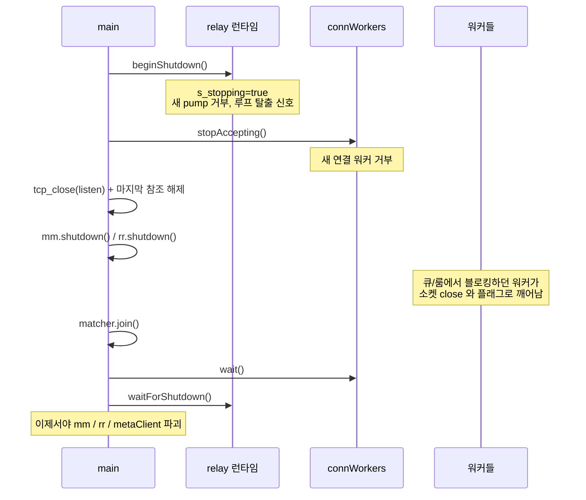
```mermaid
sequenceDiagram
    participant M as main
    participant R as relay 런타임
    participant C as connWorkers
    participant W as 워커들

    M->>R: beginShutdown()
    Note over R: s_stopping=true<br/>새 pump 거부, 루프 탈출 신호
    M->>C: stopAccepting()
    Note over C: 새 연결 워커 거부
    M->>M: tcp_close(listen) + 마지막 참조 해제
    M->>M: mm.shutdown() / rr.shutdown()
    Note over W: 큐/룸에서 블로킹하던 워커가<br/>소켓 close 와 플래그로 깨어남
    M->>M: matcher.join()
    M->>C: wait()
    M->>R: waitForShutdown()
    Note over M: 이제서야 mm / rr / metaClient 파괴
```

`beginShutdown()` 을 가장 먼저 부르는 이유는 이미 돌고 있는 로비/포워더가 새 작업을 시작하지 못하게 막기 위해서다. `mm.shutdown()`/`rr.shutdown()` 은 블로킹 중인 워커를 깨우는 역할이고, `connWorkers.wait()` 와 `relay::waitForShutdown()` 이 실제로 모든 워커가 참조를 놓을 때까지 기다린다. 이 두 wait을 main의 mm·rr·metaClient 소멸보다 먼저 마치면 추적하는 작업 본문과
캡처가 빌린 참조의 수명을 지킬 수 있다. 다른 추적되지 않은 작업이나 TLS 소멸의
접근까지 보장하는 것은 아니므로 참조를 전달하는 모든 실행 경로를 함께 확인한다.

이 시점에서 빌드하면 서버는 "연결을 받아 워커를 띄운다" 까지만 한다. 실제 분기는 `playerConnThread` 에 있다.

## 6. 첫 프레임 분기 — `server/player_conn.cpp`

새 연결이 들어오면 서버는 이 연결이 무엇을 원하는지 모른다. 의도는 셋이다.

1. **아무나랑 매칭하고 싶다** → `QUEUE_JOIN`
2. **방을 만들어 코드를 공유하고 싶다** → `ROOM_CREATE`
3. **받은 코드로 입장하고 싶다** → `ROOM_JOIN <code>`

이 분기가 `playerConnThread` 의 단일 책임이다. 여기에 토큰 인증과 잔여 바이트 인계가 붙는다. 파일 앞부분의 익명 네임스페이스가 첫 프레임 분기에 필요한 헬퍼들 — 입장권 추출, 잔여 스트림 복원, meta에서의 일회용 입장권 소비 — 을 담고 있다.

**현재 소스 발췌 — `server/player_conn.cpp`**

```cpp
#include "player_conn.h"

#include "matchmaker.h"
#include "room.h"
#include "relay.h"
#include "../net/framing.h"
#include "log.h"
#include "../meta/http_client.h"

#include <chrono>
#include <optional>
#include <mutex>
#include <string>
#include <thread>
#include <unordered_map>
#include <utility>
#include <vector>

namespace relay {

namespace {

// Read [token length][token] at the given payload offset.
std::string extract_token(const std::vector<uint8_t>& pl, size_t offset)
{
    if (pl.size() < offset + 1) return {};
    const uint8_t n = pl[offset];
    if (n == 0) return {};
    if (pl.size() < offset + 1u + n) return {};
    return std::string(pl.begin() + offset + 1,
                       pl.begin() + offset + 1 + n);
}

// Preserve frames and a partial tail received after the first command.
std::vector<uint8_t> residual_stream(const std::vector<net::Frame>& frames,
                                     size_t next_idx,
                                     const std::vector<uint8_t>& tail)
{
    std::vector<uint8_t> out;
    for (size_t j = next_idx; j < frames.size(); ++j) {
        auto bytes = net::build_frame(frames[j].type, frames[j].payload);
        out.insert(out.end(), bytes.begin(), bytes.end());
    }
    out.insert(out.end(), tail.begin(), tail.end());
    return out;
}

// A null meta client selects unranked mode.
struct AuthOutcome {
    int64_t     player_id = 0;
    int         elo = 0;
    std::string username;
    std::string token;
    std::string selected_icon_id{"default"};
    std::shared_ptr<PlayerSessionLease> session_lease;
};

std::optional<AuthOutcome>
authenticate(meta::client::MetaClient* meta, const std::string& token,
             uint32_t conn_id, const char* what)
{
    AuthOutcome o;
    if (!meta) {
        // unranked: meta 미연동 — 토큰이 있더라도 무시.
        RLOG_DEBUG("[conn " << conn_id << "] " << what
                   << " unranked (no meta)");
        return o;
    }
    if (token.empty()) {
        RLOG_INFO("[conn " << conn_id << "] " << what
                  << " missing token -> reject player_id=0 match_uuid=-");
        return std::nullopt;
    }
    auto auth = meta->consume_game_ticket(token);
    if (!auth) {
        RLOG_INFO("[conn " << conn_id << "] game admission rejected");
        return std::nullopt;
    }
    o.player_id = auth->player_id;
    o.elo       = auth->elo;
    o.username  = auth->username;
    o.token     = token;
    o.selected_icon_id = auth->selected_icon_id.empty() ? "default" : auth->selected_icon_id;
    o.session_lease = PlayerSessionLease::acquire(o.player_id);
    if (!o.session_lease) {
        RLOG_INFO("[conn " << conn_id << "] " << what
                  << " duplicate active session -> reject player_id="
                  << o.player_id << " match_uuid=-");
        return std::nullopt;
    }
    RLOG_DEBUG("[conn " << conn_id << "] " << what
               << " authed player_id=" << auth->player_id
               << " elo=" << auth->elo
               << " icon=" << o.selected_icon_id);
    return o;
}

} // namespace

// Bound the initial polling phase from worker entry, without extending it on
// partial/unknown frames. This cooperative check does not cancel a blocking
// authenticate() call; the HTTP client's own limits apply to that call.
static constexpr auto kJoinTimeout  = std::chrono::seconds(5);
static constexpr auto kPollInterval = std::chrono::milliseconds(10);

void playerConnThread(net::TcpSocket sock, uint32_t conn_id,
                      Matchmaker& mm, RoomRegistry& rr,
                      meta::client::MetaClient* meta,
                      std::shared_ptr<IpAdmission> handshake_slot,
                      std::shared_ptr<IpAdmission> session_slot) {
    std::vector<uint8_t> stream;
    stream.reserve(64);

    const auto deadline = std::chrono::steady_clock::now() + kJoinTimeout;

    while (std::chrono::steady_clock::now() < deadline && !isShuttingDown()) {
        if (!net::tcp_recv_some(sock, stream)) {
            RLOG_INFO("[conn " << conn_id
                      << "] close: disconnected before first frame"
                      << " player_id=0 match_uuid=-");
            net::tcp_close(sock);
            return;
        }

        if (!stream.empty()) {
            std::vector<net::Frame> frames;
            if (!net::parse_frames(stream, frames)) {
                RLOG_WARN("[conn " << conn_id << "] close: invalid frame boundary");
                net::tcp_close(sock);
                return;
            }
            for (size_t i = 0; i < frames.size(); ++i) {
                const net::Frame& f = frames[i];
                if (f.type == net::MsgType::QUEUE_JOIN) {
                    // 페이로드: [tok_len:1][token:N]
                    std::string tok = extract_token(f.payload, 0);
                    auto auth = authenticate(meta, tok, conn_id, "QUEUE_JOIN");
                    if (!auth) { net::tcp_close(sock); return; }
                    // 핸드셰이크 끝 — 같은 IP 뒤에 오는 접속이 굶지 않게 슬롯을
                    // 놓아준다. 세션 슬롯은 아래에서 PlayerInfo 로 넘어간다.
                    handshake_slot.reset();

                    PlayerInfo pi;
                    pi.sock      = std::move(sock);
                    pi.conn_id   = conn_id;
                    pi.player_id = auth->player_id;
                    pi.elo       = auth->elo;
                    pi.username  = std::move(auth->username);
                    pi.token     = std::move(auth->token);
                    pi.selected_icon_id = std::move(auth->selected_icon_id);
                    pi.session_lease = std::move(auth->session_lease);
                    pi.ip_session    = std::move(session_slot);
                    // 같은 recv 로 이미 도착한 후속 프레임/부분 바이트를 큐
                    // 폴링 버퍼로 이관 (즉시 QUEUE_CANCEL 유실 방지).
                    pi.streamBuf = residual_stream(frames, i + 1, stream);
                    if (mm.enqueue(std::move(pi))) {
                        RLOG_DEBUG("[conn " << conn_id << "] QUEUE_JOIN -> queued"
                                   << " player_id=" << auth->player_id);
                    } else {
                        RLOG_INFO("[conn " << conn_id << "] queue unavailable");
                    }
                    return;
                }
                if (f.type == net::MsgType::QUEUE_CANCEL) {
                    RLOG_INFO("[conn " << conn_id
                              << "] close: QUEUE_CANCEL before queued"
                              << " player_id=0 match_uuid=-");
                    net::tcp_close(sock);
                    return;
                }
                if (f.type == net::MsgType::ROOM_CREATE) {
                    // 페이로드: [tok_len:1][token:N]
                    std::string tok = extract_token(f.payload, 0);
                    auto auth = authenticate(meta, tok, conn_id, "ROOM_CREATE");
                    if (!auth) { net::tcp_close(sock); return; }
                    handshake_slot.reset();   // 핸드셰이크 끝 (위 QUEUE_JOIN 주석 참고)
                    RLOG_DEBUG("[conn " << conn_id << "] ROOM_CREATE"
                               << " player_id=" << auth->player_id);
                    rr.handleCreate(std::move(sock), conn_id,
                                    auth->player_id, auth->elo,
                                    auth->username, auth->token,
                                    auth->selected_icon_id,
                                    std::move(auth->session_lease),
                                    std::move(session_slot),
                                    residual_stream(frames, i + 1, stream));
                    return;
                }
                if (f.type == net::MsgType::ROOM_JOIN) {
                    if (f.payload.size() < 1) continue;
                    const uint8_t n = f.payload[0];
                    constexpr uint8_t kMaxCodeLen = 5;
                    if (n == 0 || n > kMaxCodeLen ||
                        f.payload.size() < 1u + n) continue;
                    std::string code(f.payload.begin() + 1,
                                     f.payload.begin() + 1 + n);
                    // 코드 뒤에 [tok_len:1][token:N]
                    std::string tok = extract_token(f.payload, 1u + n);
                    auto auth = authenticate(meta, tok, conn_id, "ROOM_JOIN");
                    if (!auth) { net::tcp_close(sock); return; }
                    handshake_slot.reset();   // 핸드셰이크 끝 (위 QUEUE_JOIN 주석 참고)
                    RLOG_DEBUG("[conn " << conn_id << "] ROOM_JOIN " << code
                               << " player_id=" << auth->player_id);
                    rr.handleJoin(code, std::move(sock), conn_id,
                                  auth->player_id, auth->elo,
                                  auth->username, auth->token,
                                  auth->selected_icon_id,
                                  std::move(auth->session_lease),
                                  std::move(session_slot),
                                  residual_stream(frames, i + 1, stream));
                    return;
                }
                // HELLO 등 낯선 프레임은 초기 phase 에서는 무시 + 계속 대기
            }
        }

        std::this_thread::sleep_for(kPollInterval);
    }

    if (!isShuttingDown()) {
        RLOG_INFO("[conn " << conn_id << "] close: first-frame timeout"
                  << " player_id=0 match_uuid=-");
    }
    net::tcp_close(sock);
}

}  // namespace relay
```

`AuthOutcome` 에 `selected_icon_id` 가 들어 있다는 점을 놓치면 안 된다. 이 값은 `MATCH_FOUND` 페이로드에 실려 상대 클라이언트의 아이콘 표시에 쓰인다. 기본값 `"default"` 는 meta 미연동(unranked)일 때 그대로 나간다.

`authenticate` 의 성공 분기는 두 가지를 더 남긴다.

- **일회용 입장권.** `consume_game_ticket`이 meta에서 성공한 경우에만 입장한다. 오프라인 성공 캐시는 없고, meta 장애 때도 새 랭크 입장은 거절한다. 장기 접근 키는 HTTPS API에서 티켓을 발급받는 데 사용한다(Part 16).
- **세션 lease.** `PlayerSessionLease::acquire(player_id)` 가 계정당 프로세스 내 활성 세션을 하나로 강제한다. 같은 토큰을 두 창에서 동시에 쓰면 두 번째 연결이 여기서 거절된다. 이 `shared_ptr` lease 는 `AuthOutcome` 에 실려 나가는 순간부터 소켓과 같은 여정을 밟는다 — **인증이 lease 의 탄생 지점**이고, §8 의 룸 `Entry` 와 §10 의 `Channel` 이 차례로 보관자가 된다.

이제 본체다.

**현재 소스 발췌 — `server/player_conn.cpp`**

```cpp
// Bound the initial polling phase from worker entry, without extending it on
// partial/unknown frames. This cooperative check does not cancel a blocking
// authenticate() call; the HTTP client's own limits apply to that call.
static constexpr auto kJoinTimeout  = std::chrono::seconds(5);
static constexpr auto kPollInterval = std::chrono::milliseconds(10);

void playerConnThread(net::TcpSocket sock, uint32_t conn_id,
                      Matchmaker& mm, RoomRegistry& rr,
                      meta::client::MetaClient* meta,
                      std::shared_ptr<IpAdmission> handshake_slot,
                      std::shared_ptr<IpAdmission> session_slot) {
    std::vector<uint8_t> stream;
    stream.reserve(64);

    const auto deadline = std::chrono::steady_clock::now() + kJoinTimeout;

    while (std::chrono::steady_clock::now() < deadline && !isShuttingDown()) {
        if (!net::tcp_recv_some(sock, stream)) {
            RLOG_INFO("[conn " << conn_id
                      << "] close: disconnected before first frame"
                      << " player_id=0 match_uuid=-");
            net::tcp_close(sock);
            return;
        }

        if (!stream.empty()) {
            std::vector<net::Frame> frames;
            if (!net::parse_frames(stream, frames)) {
                RLOG_WARN("[conn " << conn_id << "] close: invalid frame boundary");
                net::tcp_close(sock);
                return;
            }
            for (size_t i = 0; i < frames.size(); ++i) {
                const net::Frame& f = frames[i];
                if (f.type == net::MsgType::QUEUE_JOIN) {
                    // 페이로드: [tok_len:1][token:N]
                    std::string tok = extract_token(f.payload, 0);
                    auto auth = authenticate(meta, tok, conn_id, "QUEUE_JOIN");
                    if (!auth) { net::tcp_close(sock); return; }
                    // 핸드셰이크 끝 — 같은 IP 뒤에 오는 접속이 굶지 않게 슬롯을
                    // 놓아준다. 세션 슬롯은 아래에서 PlayerInfo 로 넘어간다.
                    handshake_slot.reset();

                    PlayerInfo pi;
                    pi.sock      = std::move(sock);
                    pi.conn_id   = conn_id;
                    pi.player_id = auth->player_id;
                    pi.elo       = auth->elo;
                    pi.username  = std::move(auth->username);
                    pi.token     = std::move(auth->token);
                    pi.selected_icon_id = std::move(auth->selected_icon_id);
                    pi.session_lease = std::move(auth->session_lease);
                    pi.ip_session    = std::move(session_slot);
                    // 같은 recv 로 이미 도착한 후속 프레임/부분 바이트를 큐
                    // 폴링 버퍼로 이관 (즉시 QUEUE_CANCEL 유실 방지).
                    pi.streamBuf = residual_stream(frames, i + 1, stream);
                    if (mm.enqueue(std::move(pi))) {
                        RLOG_DEBUG("[conn " << conn_id << "] QUEUE_JOIN -> queued"
                                   << " player_id=" << auth->player_id);
                    } else {
                        RLOG_INFO("[conn " << conn_id << "] queue unavailable");
                    }
                    return;
                }
                if (f.type == net::MsgType::QUEUE_CANCEL) {
                    RLOG_INFO("[conn " << conn_id
                              << "] close: QUEUE_CANCEL before queued"
                              << " player_id=0 match_uuid=-");
                    net::tcp_close(sock);
                    return;
                }
                if (f.type == net::MsgType::ROOM_CREATE) {
                    // 페이로드: [tok_len:1][token:N]
                    std::string tok = extract_token(f.payload, 0);
                    auto auth = authenticate(meta, tok, conn_id, "ROOM_CREATE");
                    if (!auth) { net::tcp_close(sock); return; }
                    handshake_slot.reset();   // 핸드셰이크 끝 (위 QUEUE_JOIN 주석 참고)
                    RLOG_DEBUG("[conn " << conn_id << "] ROOM_CREATE"
                               << " player_id=" << auth->player_id);
                    rr.handleCreate(std::move(sock), conn_id,
                                    auth->player_id, auth->elo,
                                    auth->username, auth->token,
                                    auth->selected_icon_id,
                                    std::move(auth->session_lease),
                                    std::move(session_slot),
                                    residual_stream(frames, i + 1, stream));
                    return;
                }
                if (f.type == net::MsgType::ROOM_JOIN) {
                    if (f.payload.size() < 1) continue;
                    const uint8_t n = f.payload[0];
                    constexpr uint8_t kMaxCodeLen = 5;
                    if (n == 0 || n > kMaxCodeLen ||
                        f.payload.size() < 1u + n) continue;
                    std::string code(f.payload.begin() + 1,
                                     f.payload.begin() + 1 + n);
                    // 코드 뒤에 [tok_len:1][token:N]
                    std::string tok = extract_token(f.payload, 1u + n);
                    auto auth = authenticate(meta, tok, conn_id, "ROOM_JOIN");
                    if (!auth) { net::tcp_close(sock); return; }
                    handshake_slot.reset();   // 핸드셰이크 끝 (위 QUEUE_JOIN 주석 참고)
                    RLOG_DEBUG("[conn " << conn_id << "] ROOM_JOIN " << code
                               << " player_id=" << auth->player_id);
                    rr.handleJoin(code, std::move(sock), conn_id,
                                  auth->player_id, auth->elo,
                                  auth->username, auth->token,
                                  auth->selected_icon_id,
                                  std::move(auth->session_lease),
                                  std::move(session_slot),
                                  residual_stream(frames, i + 1, stream));
                    return;
                }
                // HELLO 등 낯선 프레임은 초기 phase 에서는 무시 + 계속 대기
            }
        }

        std::this_thread::sleep_for(kPollInterval);
    }

    if (!isShuttingDown()) {
        RLOG_INFO("[conn " << conn_id << "] close: first-frame timeout"
                  << " player_id=0 match_uuid=-");
    }
    net::tcp_close(sock);
}

}  // namespace relay
```

### 6.1 첫 프레임 데드라인과 셧다운 게이트

루프 조건은 `now < deadline && !isShuttingDown()`이다. `deadline`은 worker가
함수에 들어온 때의 `steady_clock` 값에 5초를 더해 한 번 정한다. 일부 바이트나
낯선 프레임이 도착해도 연장하지 않는다. 요청을 조금씩 보내며 입장 worker를
계속 점유하는 연결의 초기 대기 시간을 제한하려는 정책이다.

이 검사는 루프가 다시 조건을 평가할 때 작동하는 **협력적 시간 제한**이다.
accept 직후부터 재는 전체 접속 시간이나 정확히 5초에 실행되는 취소 타이머가 아니다.
스케줄링·반복 내부 작업·sleep 때문에 관측 시점이 늦어질 수 있다. 특히 동기
`authenticate()`의 HTTP 호출을 중단하지 않으며, 그 호출에는 HTTP 클라이언트의
자체 제한이 적용된다. 첫 프레임 제한과 인증까지 포함한 전체 제한이 필요하다면
마감의 전달·남은 시간 계산·취소 또는 결과 폐기 정책을 따로 설계해야 한다.

셧다운 게이트는 반복을 재개할 때 새 입장 처리를 그만두게 한다. 진행 중인 HTTP
작업을 즉시 취소하지는 않는다. 마지막 로그도 `!isShuttingDown()`일 때만 남겨
정상 종료와 첫 프레임 시간 초과를 구별한다.

### 6.2 폴링 루프와 파서 실패

`tcp_recv_some`은 논블로킹 수신을 시도한다. 읽은 바이트가 있거나 잠시 읽을 수
없는 상태이면 `true`, EOF 또는 치명적 I/O 오류이면 `false`다. 프레임을 완성하지
못했어도 오류로 닫지 않고 다음 반복에서 이어 받는다. 반복 끝의 10ms sleep은
폴링 빈도를 줄이는 정책이며, 정확한 실행 주기를 보장하지 않는다.

`stream.reserve(64)`는 재할당을 줄이기 위한 초기 예약이다. 벡터의 크기 상한을
64바이트로 제한하지 않는다. 프레임 길이 상한과 수신량·연결 예산은 각자의 검사에서
확인해야 한다. 전역 worker 예산과 같은 peer IP의 setup worker 예산도 첫 프레임
타임아웃과 별개의 자원 제한이다.

`parse_frames`가 `false`이면 첫 단계는 소켓을 닫고 반환한다. 특히 지나치게 큰
길이 선언을 만나기 전에 정상 프레임 일부가 `frames`에 들어 있을 수 있으므로,
반환값 검사보다 프레임 분기를 먼저 실행하면 안 된다. 방 대기 루프에서도 같은
실패를 확인한 뒤 `break`하여 공통 방·참가자·소켓 정리 경로로 간다.
이 반환값은 파서가 치명적으로 분류한 오류를 뜻한다. 현재 파서가 건너뛰도록 정한
체크섬 오류 등의 정책까지 모든 잘못된 프레임이 즉시 종료한다고 일반화하지 않는다.

### 6.3 스트림 소유권 규칙 — `residual_stream`

이 장 전체에서 가장 반복적으로 등장하는 개념이다.

**TCP의 프로토콜 단계 경계는 `recv` 경계가 아니다.** 한 번의 `recv`에 `QUEUE_JOIN + QUEUE_CANCEL`이 함께 담길 수 있고, `ROOM_JOIN + READY`가 붙어 올 수도 있다. 첫 프레임만 처리하고 지역 변수 `stream`을 버리면, 이미 커널에서 유저 공간으로 가져온 뒤쪽 바이트는 **소켓 소유권을 넘겨받은 루프가 다시 받을 방법이 없다.** 커널 버퍼에는 더 이상 없기 때문이다.

`residual_stream(frames, i + 1, stream)` 이 하는 일은 두 가지다.

1. 아직 소비하지 않은 유효한 완성 프레임(`frames[i+1..]`)을 `build_frame`으로 **재직렬화**한다. 현재 정규 프레임 형식에서 같은 TYPE·payload는 같은 길이·체크섬을 만든다. 파서가 이미 버린 잘못된 바이트까지 원본 수신 전체를 복원하는 것은 아니다.
2. `parse_frames` 가 소비하고 남긴 미완성 tail(`stream`)을 그 뒤에 이어 붙인다.

순서가 중요하다. 완성 프레임이 앞, partial tail 이 뒤여야 스트림의 시간 순서가 보존된다. 반환된 바이트는 `PlayerInfo::streamBuf` 또는 `roomLoop_` 의 초기 수신 버퍼로 이동한다.

일반화하면 이렇다: **프로토콜 상태가 바뀔 때는 소켓뿐 아니라 그 소켓에서 이미 읽은 바이트도 함께 인계해야 한다.** 같은 규칙이 이 장의 단계 전환마다 반복된다 — `PlayerInfo::streamBuf` → `queueLobbyThread` 의 `bufA`/`bufB` → `Channel::prefixFromA/B` → `forwarderLoop` 의 첫 iteration, 그리고 클라이언트 쪽 `Session::recvBuf`.

### 6.4 `ROOM_JOIN` 길이 상한과 단계별 허용 정책

`ROOM_JOIN` 페이로드는 `[code_len:1][code:N][tok_len:1][token:N]`이다.
바깥 분기는 code 길이 1~5와 해당 바이트의 존재를 확인한다. 0이나 5 초과,
코드 바이트 부족이면 해당 프레임을 건너뛰고 초기 마감까지 기다린다.
`room.cpp`의 생성 길이 5와 수신 분기의 허용 길이 1~5는 서로 다른 조건이다.
여기서 길이를 제한해도 알파벳이나 제어문자까지 검증한 것은 아니다.

이 경로를 통해 들어온 `handleJoin` 호출에는 길이 조건이 성립한다. 다른 호출자가
생기면 같은 조건을 지키거나 함수 경계에서 검증해야 한다. 생성 상수만으로 외부
입력이 검증되었다고 가정하거나, 길이 상한만으로 로그의 문자 안전성을 보장하지 않는다.

`HELLO` 등 이 단계에서 처리하지 않는 완성 프레임은 무시하고 계속 기다린다.
이는 현재 프로토콜의 관용 정책이며, 버전 호환성을 자동 보장하는 일반 원칙은 아니다.
필수 기능을 뜻하는 낯선 프레임도 있는 프로토콜이라면 버전 협상이나 명시적 거절이
필요하다. 무시하더라도 마감을 연장하지 않으며, 알려진 명령의 형식 오류와
모르는 종류의 프레임을 구별해 정책을 정한다.

HTML의 첫 입장 실습은 이 경계를 작게 구현한다. TYPE50 한 종류 안에 경로를
명시하고 join 코드에는 정확히 5개의 대문자·숫자를 요구한다. 잘못된 TYPE50은
즉시 거절하며, 낯선 프레임은 4개까지 허용하고 단계 수신량은 128바이트로 묶는다.
이 학습용 규약과 숫자는 현재 서버의 wire 형식·인증·예산과 다르다.

## 7. `Matchmaker` — FIFO 큐

매치메이커의 책임은 하나다: **대기 중인 연결을 FIFO 로 두 개씩 묶는다.** RP 범위나 지역을 고려하는 확장 매칭은 범위 밖이다.

### 7.1 자료구조

**현재 소스 발췌 — `server/matchmaker.h`**

```cpp
// 큐에 들어간 플레이어 정보.
// meta의 일회용 게임 입장권 소비가 성공하면 인증 정보가 채워진다.
// --meta가 없을 때만 player_id=0 (unranked). 랭크 입장권 누락은 거절한다.
struct PlayerInfo {
    net::TcpSocket sock;
    uint32_t       conn_id{0};  // 로깅용
    int64_t        player_id{0};
    int            elo{0};
    std::string    username;    // empty = guest (no nickname yet)
    std::string    token;       // relay 가 /v1/matches 에 참조 없이 전달은 안 함
    std::string    selected_icon_id{"default"};
    std::shared_ptr<PlayerSessionLease> session_lease;
    // per-IP 세션 슬롯. 이 연결이 살아 있는 내내 유지돼야 하므로 소켓을 따라
    // 큐 → 로비 → 포워딩 Channel 로 함께 옮겨 간다 (session_lease 와 같은 결).
    std::shared_ptr<IpAdmission> ip_session;

    // 이미 recv했으나 이 단계에서 아직 소비하지 않은 바이트.
    // 첫 인계에는 완성된 QUEUE_CANCEL도 포함될 수 있다. 큐 파싱 뒤 남은
    // 부분 꼬리는 다음 폴링 또는 로비의 초기 버퍼로 이어 간다.
    std::vector<uint8_t> streamBuf;
};

// 매칭 결과 (2 명)
//   a = HOST  (먼저 큐 진입)
//   b = GUEST (나중 큐 진입)
struct Match {
    PlayerInfo a;
    PlayerInfo b;
    uint64_t   seed{0};     // 서버가 부여한 결정론적 seed
    uint32_t   match_id{0}; // 로깅용 단조 증가 번호
    std::string match_uuid; // meta 결과 멱등성 키 (프로세스 재시작에도 충돌 방지)
};

class Matchmaker {
public:
    static constexpr std::size_t kMaxWaiting = 1024;
    Matchmaker();
    ~Matchmaker();

    // 여러 생산자가 호출 가능. 등록 성공이면 true.
    // 종료 중/대기 상한이면 소켓을 종료하고 소유한 슬롯을 반납하며 false.
    bool enqueue(PlayerInfo p);

    // 단일 컨슈머: 취소/끊김을 주기적으로 정리하고 살아남은 앞의 두 명을 인계.
    // shutdown()이면 nullopt. 새 데이터 도착은 다음 폴링에서 관측할 수 있다.
    std::optional<Match> waitForPair();

    // 모든 대기 스레드를 깨우고 큐에 남은 소켓을 닫는다.
    void shutdown();

private:
    uint64_t nextSeed();  // 매치마다 독립 추출 (match_seed.h)

    std::mutex              mu;
    std::condition_variable cv;
    std::deque<PlayerInfo>  waiting;
    std::atomic<bool>       stopping{false};
    uint32_t                next_match_id{1};
    // MATCH_FOUND 로 나가는 값이라 스트림을 두지 않는다 (match_seed.h).
    relay::MatchSeedSource  seed_src;
};
```

`PlayerInfo::streamBuf` 가 §6.3 에서 만든 잔여 바이트의 목적지다. 큐에서 대기하는 동안 추가로 도착하는 바이트도 여기에 계속 누적된다.

`session_lease` 필드 때문에 이 헤더는 `player_session.h` 를 include 한다. §6 에서 인증이 획득한 lease 가 `PlayerInfo` 에 실려 큐에서 대기하는 동안 이 구조체가 보관자다 — 큐에서 제거되는 어느 경로(취소·EOF·셧다운)로든 `PlayerInfo` 가 소멸하면 lease 도 함께 풀린다. `Match::match_uuid` 는 페어링 순간 부여되는 결과 멱등성 키로, §7.3 에서 발급 지점을 본다.

### 7.2 페어링 전에 생존을 확인한다

큐에서 기다리는 동안 클라이언트가 창을 닫거나 QUEUE_CANCEL을 보낼 수 있다.
매처는 대기 연결을 주기적으로 확인해 취소·끊김을 관측하고 제거한다. 한 명만 남아도
다음 등록이 올 때까지 정리를 미루지 않는다. 검사 직후에도 연결이 끊길 수 있으므로
로비·포워딩 단계의 오류 처리는 계속 필요하다.

**현재 소스 발췌 — `server/matchmaker.cpp`**

```cpp
namespace {

bool waitingPlayerStillActive(PlayerInfo& p) {
    // p.streamBuf 에 누적 수신 — 로컬 버퍼를 쓰면 폴링 사이에 걸친 부분 프레임
    // 바이트가 유실되어 스트림이 어긋난다. parse_frames 가 완성 프레임만큼만
    // 소비하고 잔여 tail 은 다음 폴링/로비 단계로 넘어간다.
    if (!net::tcp_recv_some(p.sock, p.streamBuf)) {
        RLOG_INFO("[matchmaker] conn=" << p.conn_id
                  << " player_id=" << p.player_id
                  << " left queue before match");
        net::tcp_close(p.sock);
        return false;
    }

    if (!p.streamBuf.empty()) {
        std::vector<net::Frame> frames;
        if (!net::parse_frames(p.streamBuf, frames)) {
            RLOG_INFO("[matchmaker] conn=" << p.conn_id
                      << " player_id=" << p.player_id
                      << " sent malformed queue frame");
            net::tcp_close(p.sock);
            return false;
        }
        for (const auto& f : frames) {
            if (f.type == net::MsgType::QUEUE_CANCEL) {
                RLOG_INFO("[matchmaker] conn=" << p.conn_id
                          << " player_id=" << p.player_id
                          << " cancelled queue");
                net::tcp_close(p.sock);
                return false;
            }
        }
    }

    return true;
}

}  // namespace
```

제거 사유는 수신 EOF 또는 복구 불가능한 I/O 오류, 프레임 파싱 실패, QUEUE_CANCEL이다.
제거된 PlayerInfo가 소유한 세션 lease와 IP 슬롯도 마지막 참조가 풀리면 반납된다.

streamBuf는 이미 수신했지만 아직 소비하지 않은 바이트다. 첫 입장 처리기에서
넘긴 완성된 취소 프레임도 들어갈 수 있다. parse_frames는 완성 프레임을 소비하고
미완성 꼬리를 남긴다. 이 꼬리는 다음 폴링 또는 로비의 초기 버퍼로 이어진다.

현재 큐는 QUEUE_CANCEL 이외의 완성 프레임을 소비한 뒤 무시한다. 일찍 보낸 READY도
저장되지 않는다. 클라이언트는 MATCH_FOUND 이후 로비 규약에 따라 READY를 보낸다.
선행 전송을 허용하도록 프로토콜을 확장한다면 허용 종류·순서와 버퍼 인계 정책도
함께 바꿔야 한다. 부분 바이트 보존과 모든 완성 메시지 보존은 서로 다른 계약이다.

### 7.3 큐 본체

**현재 소스 발췌 — `server/matchmaker.cpp`**

```cpp
Matchmaker::Matchmaker() = default;

Matchmaker::~Matchmaker() {
    shutdown();
}

// 매치 seed 는 MATCH_FOUND 로 두 클라이언트에게 그대로 나간다. 스트림에서 뽑으면
// 받은 값이 곧 생성기 상태가 되어 이후 매치가 전부 예측된다 — match_seed.h 참조.
// 분배 품질이 중요한 RL 시뮬레이션 쪽은 SimGame 이 자체 RNG 를 가지고 있음.
uint64_t Matchmaker::nextSeed() {
    return seed_src.next();
}

bool Matchmaker::enqueue(PlayerInfo p) {
    {
        std::lock_guard<std::mutex> lk(mu);
        // Serialize admission with shutdown: a late producer cannot repopulate
        // a queue whose consumer has already stopped.
        if (stopping.load() || waiting.size() >= kMaxWaiting) {
            net::tcp_close(p.sock);
            return false;
        }
        waiting.push_back(std::move(p));
        cv.notify_one();
    }
    return true;
}

std::optional<Match> Matchmaker::waitForPair() {
    std::unique_lock<std::mutex> lk(mu);
    while (true) {
        if (stopping.load()) return std::nullopt;
        // Observe cancellation even when only one player is waiting. Poll all
        // pending entries so stale sessions do not retain admission leases.
        for (auto it = waiting.begin(); it != waiting.end();) {
            if (!waitingPlayerStillActive(*it)) it = waiting.erase(it);
            else ++it;
        }
        if (waiting.size() >= 2) break;
        if (waiting.empty()) {
            cv.wait(lk, [this] { return stopping.load() || !waiting.empty(); });
        } else {
            // Socket data does not notify this condition_variable.
            // This is a cooperative polling interval, not a hard deadline.
            cv.wait_for(lk, std::chrono::milliseconds(50));
        }
    }

    Match m;
    m.a = std::move(waiting.front()); waiting.pop_front();
    m.b = std::move(waiting.front()); waiting.pop_front();
    m.seed = nextSeed();
    m.match_id = next_match_id++;
    m.match_uuid = new_match_uuid();
    return m;
}

void Matchmaker::shutdown() {
    {
        std::lock_guard<std::mutex> lk(mu);
        if (stopping.exchange(true)) return;  // 이미 셧다운됨
        // 큐에 남은 연결들 닫기 (대기하던 플레이어에게 친절한 종료)
        for (auto& p : waiting) {
            net::tcp_close(p.sock);
        }
        waiting.clear();
    }
    cv.notify_all();
}
```

**접수와 종료를 같은 잠금 아래 결정한다.** enqueue는 종료 상태와 대기 상한 1024를
확인한 뒤 등록한다. 거절하면 소켓을 종료하고 false를 반환하며, 호출자는 성공했을
때만 queued 로그를 남긴다. shutdown이 먼저 큐를 비웠다면 늦게 도착한 생산자가
다시 채울 수 없다. 대기열 상한은 대기 연결을 제한하고, 연결 worker 상한은 실행 중인
첫 요청 작업을 제한한다. 두 자원의 수명과 예산은 서로 다르다.

**대기는 기다리는 사건에 맞춘다.** waitForPair는 모든 대기 항목을 검사하고 살아남은
두 명을 꺼낸다. 아무도 없으면 등록·종료 알림을 predicate wait로 기다린다. 한 명이면
50ms wait_for 뒤 다시 검사한다. 소켓에 취소 바이트가 도착해도 이 조건 변수에 notify가
자동 발생하지 않기 때문이다. 50ms는 재검사 간격이며 스케줄링·잠금 대기까지 포함한
취소 처리의 최대 시간을 보장하지 않는다.

생존 검사는 mu 안에서 실행한다. 논블로킹 recv는 데이터 도착을 기다리지 않지만
파싱·로그·삭제 비용은 남는다. 한 번에 큐를 순회하고 중간 삭제 시 이동도 수행하므로
부하가 커지면 잠금 점유 시간을 별도로 측정해야 한다. 블로킹 인증이나 외부 API를
이 임계 구역에 넣지 않는다.

컨테이너 무효화 규칙도 정확히 구별한다. deque 끝의 삽입은 반복자를 무효화하지만
기존 원소의 참조는 유지한다. 중간 삭제는 더 넓은 무효화를 일으킬 수 있다.
이 코드가 잠금을 사용하는 이유는 순회·제거·두 연결의 인계를 다른 변경과 직렬화하기
위해서다. [C++ deque 변경 계약](https://eel.is/c++draft/deque.modifiers)을 참고한다.

**FIFO는 등록 성공 순서다.** 서로 다른 연결 worker가 mutex를 얻어 등록한 순서 중
취소·끊김으로 제거되지 않은 앞의 두 명을 선택한다. accept 순서나 사용자가 버튼을
누른 시각과 같다고 보장하지 않는다. 먼저 꺼낸 연결이 HOST, 다음이 GUEST다.
Match로 이동한 소켓·부분 스트림·lease는 이제 큐 밖의 소유자가 책임진다.
shutdown은 남은 큐를 비우며, 매처와 생산자의 종료 대기는 main의 join·wait가 담당한다.

**멱등성 키는 매치 생성 시 발급해 재사용한다.** new_match_uuid로 만든 키를 결과
재시도에도 유지한다. 저장 중복 방지는 키 생성만으로 완성되지 않는다. meta의 unique
제약과 원자적인 결과 저장이 같은 키의 재요청을 한 경기로 처리해야 한다.
룸 경로도 매치 조립 시 같은 함수를 호출한다.

회귀 검사는 tests/learning/matchmaker_queue.cpp에서 단독 취소, 종료 뒤 등록 거절,
상한 거절, 취소 후 생존자 FIFO를 확인한다. python/tests/test_relay_meta_smoke.py의
단독 취소 실험은 실제 서버에 취소를 보내고 다음 참가자가 오기 전에 EOF를 확인한다.

### 7.4 `MATCH_FOUND` 포맷과 seed 를 서버가 정하는 이유

```text
MATCH_FOUND (12) 페이로드 =
  [role:1][seed:8 LE][my_icon_len:1][my_icon:N][peer_icon_len:1][peer_icon:N]
  [uuid_len:1][match_uuid:N]
  role: 1 = HOST,  2 = GUEST
  seed: 8바이트 LE — 양쪽 클라이언트가 공유할 lockstep RNG 시드
  my_icon / peer_icon : 각 [len:1][bytes:N] — 본인/상대 아이콘 식별자(없으면 "default")
  match_uuid : relay가 만든 32자리 소문자 hex 멱등성 키
```

결정론적 lockstep 은 두 클라이언트가 **동일한 RNG 스트림**을 공유해야 한다. Part 6 의 직접 접속에서는 호스트가 seed 를 뽑아 `SEED` 프레임으로 알려준다. 릴레이 경로에서는 서버가 seed 를 한 번 정해 `MATCH_FOUND` 에 실어 양쪽에 같은 값으로 전달한다. 그래서 릴레이 경로에서는 `HELLO`/`HELLO_ACK`/`SEED` 핸드셰이크를 **다시 하지 않는다**. HOST/GUEST 역할은 보드 배치·로그·재시작 협상 같은 클라이언트 내부 비대칭을 일관되게 만들기 위한 라벨이다.

icon 필드는 각 클라이언트 관점에서 `my_icon` → `peer_icon` 순으로 들어간다. 즉 같은 매치라도 A에게 가는 프레임과 B에게 가는 프레임의 icon 순서가 서로 뒤바뀐다. 뒤쪽 필드는 구버전 클라이언트 호환을 위해 optional처럼 파싱하므로 9바이트뿐인 과거 프레임도 유효하다. 현재 클라이언트는 UUID를 직접 쓰지 않아도 trailing 필드를 안전하게 무시하고, relay와 meta가 결과 멱등성에 사용한다.

## 8. `RoomRegistry` — 5자 코드 방

매치메이킹이 "아무나랑" 이라면 룸은 "지정된 사람과" 다. 책임은 셋이다.

1. `handleCreate`: 새 코드 발급, `Entry` 생성, 호스트 대기 루프 시작.
2. `handleJoin`: 코드 검색, 빈 슬롯이면 게스트로 채우고 양쪽에 `ROOM_INFO` 통지.
3. `roomLoop_`: `READY` 동기, `CHAT` 포워딩, 양쪽 READY 면 매치로 인계.

### 8.1 `Entry` 와 잠금 순서 규칙

**현재 소스 발췌 — `server/room.h`**

```cpp
    struct Entry {
        std::string    code;
        net::TcpSocket hostSock{};
        net::TcpSocket guestSock{};
        uint32_t       hostConn = 0;
        uint32_t       guestConn = 0;
        bool           hostPresent  = false;
        bool           guestPresent = false;
        bool           hostReady    = false;
        bool           guestReady   = false;
        bool           matchStarted = false;  // 한쪽이 starter 로 선점
        bool           hostExited   = false;  // player thread 가 read 루프를 빠져나옴
        bool           guestExited  = false;
        uint64_t       roomInfoVersion = 0;

        // 인증 메타 (meta 연동 시 채워짐. 0 = unranked)
        int64_t        hostPlayerId  = 0;
        int            hostElo       = 0;
        std::string    hostUsername;
        std::string    hostToken;
        std::string    hostSelectedIconId{"default"};
        std::shared_ptr<PlayerSessionLease> hostSessionLease;
        // per-IP 세션 슬롯 — 소켓이 이 방에 머무는 동안 방이 대신 붙들고 있다가
        // 매치 성립 시 Match 로, 퇴장 시 즉시 반납한다.
        std::shared_ptr<IpAdmission> hostIpSession;
        int64_t        guestPlayerId = 0;
        int            guestElo      = 0;
        std::string    guestUsername;
        std::string    guestToken;
        std::string    guestSelectedIconId{"default"};
        std::shared_ptr<PlayerSessionLease> guestSessionLease;
        std::shared_ptr<IpAdmission> guestIpSession;
    };
```

`Entry` 는 호스트/게스트 두 슬롯을 대칭으로 갖는다. `present`(서버가 슬롯을 재실로 관리 중), `ready`(READY(1) 보냄), `exited`(read 루프 이탈함) 세 플래그가 각각 별개인 점에 주의한다. 셋은 서로 다른 시점에 바뀌고, 매치 인계는 세 조합을 모두 본다.

`hostSessionLease`/`guestSessionLease` 는 §6 의 인증이 획득한 세션 lease 의 룸 단계 보관처다. 방이 매치로 넘어가면 §8.7 에서 `Match` 로 옮겨 타고, 일반 퇴장에서는 떠나는 쪽 참조를 지역 변수로 옮긴 뒤 상태 잠금 밖에서 해제한다. 다른 소유자가 남아 있다면 실제 반납은 마지막 참조가 풀릴 때 일어난다.

`roomInfoVersion`은 레지스트리의 공통 카운터에서 방 생성·입장·퇴장 때 발급하는 알림 버전이다. READY 변경 횟수나 개별 방의 변화 횟수와 같지 않다. 송신 게이트를 잡은 뒤 상태 잠금 안에서 버전을 확인하고, 상태 잠금만 풀어 송신한다. 검사 전에 오래된 알림은 버리고, 이미 시작한 송신 뒤에는 새 알림이 게이트 순서대로 이어진다. 송신 중 퇴장은 가능하므로 수신 순간까지 최신 상태라는 보장은 아니다.

레지스트리 자체의 동기화 자원은 이렇다.

**현재 소스 발췌 — `server/room.h`**

```cpp
    std::mutex              mu;
    std::condition_variable cv;
    std::unordered_map<std::string, Entry> rooms;
    // 같은 방에서 동일 소켓으로 향하는 ROOM_INFO/READY/CHAT 프레임이 서로
    // interleave되지 않도록 코드 해시로 나눈 송신 게이트를 사용한다.
    static constexpr size_t kRoomSendShardCount = 64;
    std::array<std::mutex, kRoomSendShardCount> roomSendMu_;
    std::atomic<bool>       stopping{false};

    // match seed 는 MATCH_FOUND 로 나가는 값이라 스트림을 두지 않는다.
    relay::MatchSeedSource  seed_src_;
    uint64_t                next_room_info_version_ = 1;
    uint32_t                next_match_id_  = 100000;  // 매치메이킹과 match_id 충돌 피해
    meta::client::MetaClient* meta_ = nullptr;
```

잠금이 두 종류다. 전역 상태 뮤텍스 `mu` 하나와, 방 코드 해시로 나눈 송신 게이트 `roomSendMu_[64]` 다. 둘을 동시에 잡아야 하는 곳이 있으므로 **순서 규칙**이 필요하다.

> **잠금 순서 규칙: send gate → state `mu`.** 두 뮤텍스를 중첩해 잡을 때는 언제나 `roomSendMu_[shard]` 를 먼저 잡고 그다음 `mu` 를 잡는다. 반대 순서를 쓰는 코드가 하나라도 섞이면 즉시 데드락 후보가 된다.

이 규칙은 두 뮤텍스를 중첩해 잡는 모든 경로 — 대표적으로 `handleJoin` 과 `sendRoomInfoIfCurrent_` — 가 따른다. 항상 send gate를 먼저 잡고 room mutex를 잡아야, 입장 상태를 공개하기 전 `ROOM_INFO` 순서를 예약하면서 반대 순서의 ABBA 교착도 만들지 않는다.

`next_match_id_` 가 100000 부터 시작하는 것은 `Matchmaker` 의 `next_match_id`(1부터)와 로그에서 겹치지 않게 하려는 것이다. 두 카운터는 별개 객체라 값 자체가 충돌해도 동작에는 문제가 없지만, 로그를 읽는 사람에게는 문제가 된다.

### 8.2 방 코드 — 공간·충돌·난수원

방 코드의 알파벳은 A~Z와 2~9에서 I·O를 제외한 32자다. 다섯 자리의 공간은
32^5 = 33,554,432개, 즉 25비트다. 읽어 전달할 때 0/O·1/I 혼동을 줄이되,
충돌 처리와 반복 추측 방어는 별도의 책임으로 둔다.

균등·독립 후보라는 가정에서 현재 N개 방이 살아 있으면 후보 하나의 충돌 확률은
N / 32^5다. 500개 방에서는 약 0.00149%다. 빈 공간에 500개 후보를 독립적으로
뽑을 때 후보들 사이에 한 번 이상 충돌할 확률은 생일 문제 근사로 약 0.37%다.
두 확률은 질문이 다르다. 저장소는 확률에 기대어 덮어쓰지 않고, 이미 쓰는 코드면
새 후보로 재시도한다. 32회 한도를 넘거나 난수원이 실패하면 생성을 거절한다.

**현재 소스 발췌 — `server/room_code.h`**

```cpp
inline constexpr char kRoomCodeAlphabet[] = "ABCDEFGHJKLMNPQRSTUVWXYZ23456789";
inline constexpr std::size_t kRoomCodeLength = 5;
static_assert(sizeof(kRoomCodeAlphabet) - 1 == 32);

// Five low-to-high groups of five bits. All-zero input is the valid code AAAAA.
// Uniform 32-bit input gives uniform 25-bit codes; the upper seven bits are unused.
inline std::string roomCodeFromWord(std::uint32_t word) {
    std::string code(kRoomCodeLength, 'A');
    for (char& c : code) {
        c = kRoomCodeAlphabet[word & 31u];
        word >>= 5;
    }
    return code;
}

// Fresh OS random bytes per candidate. Failure returns nullopt; no clock/PRNG fallback.
std::optional<std::uint32_t> roomCodeRandomWord() noexcept;

// Caller must serialize this search AND its subsequent insertion against other
// changes to the same registry. A returned candidate is not itself a reservation.
// Injection separates collision policy from the OS source for deterministic tests.
template <class Next, class Occupied>
std::optional<std::string> selectRoomCode(Next&& next, Occupied&& occupied) {
    for (unsigned attempt = 0; attempt < 32; ++attempt) {
        const auto word = next();
        if (!word) return std::nullopt;
        auto code = roomCodeFromWord(*word);
        if (!occupied(code)) return code;
    }
    return std::nullopt;
}
```

roomCodeFromWord는 32비트 입력에서 하위 5비트씩 다섯 묶음을 꺼낸다.
32개 기호가 5비트 값 전체에 일대일 대응하므로 균등한 입력이면 코드도 균등하다.
상위 7비트는 사용하지 않으며 0도 유효한 AAAAA다. 중간 몫이 0이 되었다는 이유로
새 난수를 섞으면 이 단순한 대응이 달라진다.

예전 xorshift·MT 엔진은 게임 시뮬레이션용 난수와 같은 결정적 생성기 계열이다.
시드에 난수를 섞었다는 사실만으로 반복 관측에 대한 암호학적 예측 저항성이 생기지
않는다. 현재 두 릴레이는 후보마다 OS 난수원을 사용하고 실패 시 약한 값으로 대체하지 않는다.

**현재 소스 발췌 — `server/room_code.cpp`**

```cpp
std::optional<std::uint32_t> roomCodeRandomWord() noexcept {
    unsigned char bytes[4]{};
#if defined(_WIN32)
    if (BCryptGenRandom(nullptr, bytes, sizeof(bytes),
                        BCRYPT_USE_SYSTEM_PREFERRED_RNG) != 0) return std::nullopt;
#elif defined(__linux__)
    // Refuse creation if the OS source is not ready. Even short/error reads fail
    // closed, rather than waiting or substituting a predictable candidate.
    if (::getrandom(bytes, sizeof(bytes), GRND_NONBLOCK) != sizeof(bytes))
        return std::nullopt;
#else
    int flags = O_RDONLY;
#ifdef O_CLOEXEC
    flags |= O_CLOEXEC;
#endif
    const int fd = ::open("/dev/urandom", flags);
    if (fd < 0) return std::nullopt;
    const auto received = ::read(fd, bytes, sizeof(bytes));
    ::close(fd);
    if (received != sizeof(bytes)) return std::nullopt;
#endif
    return std::uint32_t(bytes[0]) | (std::uint32_t(bytes[1]) << 8) |
           (std::uint32_t(bytes[2]) << 16) | (std::uint32_t(bytes[3]) << 24);
}
```

Linux는 getrandom의 GRND_NONBLOCK으로 난수원 준비를 기다리지 않는다.
Windows는 BCryptGenRandom의 시스템 제공자를 사용한다. 다른 POSIX 경로는
/dev/urandom을 읽는다. 어느 경로든 정확히 4바이트를 얻지 못하면 nullopt다.
짧은 읽기·일시 중단도 이번 생성을 실패시키는 단순 정책이며 시각값으로 폴백하지 않는다.
[Linux getrandom 계약](https://man7.org/linux/man-pages/man2/getrandom.2.html)과
[Windows BCryptGenRandom 계약](https://learn.microsoft.com/en-us/windows/win32/api/bcrypt/nf-bcrypt-bcryptgenrandom)을 참고한다.
Windows 타깃에는 bcrypt 링크가 추가된다.

난수원 교체는 짧은 주소의 길이를 늘리지 않는다. 방 코드를 아는 사람을 입장시키는
현재 규약에는 반복 추측 예산과 연결 제한도 필요하다. 강한 비공개 방을 원하면
별도의 긴 초대 토큰이나 호스트 승인이 필요하며, 계정 입장권 인증과도 구별한다.
매치 seed와 방 코드는 서로 다른 용도의 값으로 생성한다.

**현재 소스 발췌 — `server/room.cpp`**

```cpp
RoomRegistry::RoomRegistry() = default;

std::string RoomRegistry::generateCode_() {
    // mu remains held from candidate search through insertion in handleCreate.
    auto code = selectRoomCode(roomCodeRandomWord, [this](const std::string& c) {
        return rooms.find(c) != rooms.end();
    });
    return code ? std::move(*code) : std::string{};
}
```

코드 후보 조회와 rooms 삽입은 같은 mu 임계 구역 안에서 끝낸다. 후보를 찾았다는
반환값만으로는 예약이 된 것이 아니다. 잠금을 풀었다가 삽입하면 다른 생성자가
같은 코드를 먼저 등록할 수 있다. Reactor는 방 표를 소유한 한 루프에서 조회와
삽입을 중간 양보 없이 처리하고, 동일한 생성 헬퍼를 사용한다.

HTML 기준 구현은 고정 슬롯과 세대 번호로 코드 재사용 뒤의 오래된 제거 요청도
구별한다. 실제 RoomRegistry는 unordered_map과 roomInfoVersion으로 알림을
조정하므로 두 버전의 세부 계약을 같은 것으로 간주하지 않는다.

### 8.3 송신 헬퍼 3종

**현재 소스 발췌 — `server/room.cpp`**

```cpp
void RoomRegistry::sendRoomInfo_(const net::TcpSocket& sock, const std::string& code,
                                  uint8_t status, uint8_t peerCount) {
    // ROOM_INFO payload: [code_len:1][code:N][status:1][peer_count:1]
    std::vector<uint8_t> payload;
    payload.reserve(1 + code.size() + 2);
    payload.push_back(static_cast<uint8_t>(code.size()));
    for (char c : code) payload.push_back(static_cast<uint8_t>(c));
    payload.push_back(status);
    payload.push_back(peerCount);
    auto f = net::build_frame(net::MsgType::ROOM_INFO, payload);
    net::tcp_send_all(sock, f.data(), f.size());
}

void RoomRegistry::sendRoomInfoIfCurrent_(
    const net::TcpSocket& sock, const std::string& code,
    uint8_t status, uint8_t peerCount, uint64_t expectedVersion) {
    // 새 상태가 먼저 기록됐다면 이전 알림을 생략한다. 이전 알림이 이미 송신
    // 중이면 새 알림은 같은 방의 게이트 뒤에서 기다리므로 wire 순서도 보장된다.
    const size_t shard = std::hash<std::string>{}(code) % kRoomSendShardCount;
    std::lock_guard<std::mutex> sendLk(roomSendMu_[shard]);
    {
        std::lock_guard<std::mutex> lk(mu);
        auto it = rooms.find(code);
        if (it == rooms.end() ||
            it->second.roomInfoVersion != expectedVersion) {
            return;
        }
    }
    sendRoomInfo_(sock, code, status, peerCount);
}

bool RoomRegistry::sendRoomFrame_(const std::string& code,
                                  const net::TcpSocket& sock,
                                  const std::vector<uint8_t>& frame) {
    const size_t shard = std::hash<std::string>{}(code) % kRoomSendShardCount;
    std::lock_guard<std::mutex> sendLk(roomSendMu_[shard]);
    return net::tcp_send_all(sock, frame.data(), frame.size());
}
```

- `sendRoomInfo_` 는 게이트 없이 그대로 보낸다. 이미 게이트를 쥔 호출자만 부른다.
- `sendRoomInfoIfCurrent_` 는 게이트를 먼저 잡고, `mu` 아래에서 버전을 재검사한 뒤 보낸다. 규칙대로 **gate → mu** 순서다.
- `sendRoomFrame_` 은 `READY`/`CHAT` 포워딩용이다. 게이트만 잡는다.

`ROOM_INFO`, `READY`, `CHAT` 이 전부 같은 게이트를 통과하므로, 같은 방으로 향하는 프레임들이 wire 상에서 서로 끼어들지 않는다. `tcp_send_all` 은 partial send 루프라 락 없이 두 스레드가 같은 fd 에 들어가면 프레임 바이트가 섞인다.

**트레이드오프.** 64개 shard 를 쓰므로 코드 해시가 같은 shard 로 떨어진 서로 다른 방은 송신하는 동안 잠시 직렬화된다. 방마다 뮤텍스를 동적 할당하지 않으면서 전역 병목도 피하는 절충이다. 방 수가 수천 단위로 커지면 shard 수를 늘리거나, §13 에서 논하는 "방별 outbound queue + 단일 writer" 로 옮겨야 한다.

### 8.4 방 만들기 — `handleCreate`

**현재 소스 발췌 — `server/room.cpp`**

```cpp
void RoomRegistry::handleCreate(net::TcpSocket sock, uint32_t conn_id,
                                int64_t player_id, int elo,
                                const std::string& username, const std::string& token,
                                const std::string& selected_icon_id,
                                std::shared_ptr<PlayerSessionLease> session_lease,
                                std::shared_ptr<IpAdmission> ip_session,
                                std::vector<uint8_t> streamPrefix) {
    if (stopping.load()) { net::tcp_close(sock); return; }
    std::string code;
    try {
        uint64_t roomInfoVersion = 0;
        {
            std::unique_lock<std::mutex> lk(mu);
            // Serialize admission with shutdown; the early check is only a fast path.
            if (stopping.load()) {
                lk.unlock();
                net::tcp_close(sock);
                return;
            }
            code = generateCode_();
            if (code.empty()) {
                lk.unlock();
                net::tcp_close(sock);
                return;
            }
            // Prepare potentially allocating fields before publishing the entry.
            // A failed string copy must not leave a room with no owning roomLoop.
            static_assert(std::is_nothrow_move_constructible_v<Entry>);
            Entry r;
            r.code         = code;
            r.hostSock     = sock;
            r.hostConn     = conn_id;
            r.hostPresent  = true;
            r.hostPlayerId = player_id;
            r.hostElo      = elo;
            r.hostUsername = username;
            r.hostToken    = token;
            r.hostSelectedIconId = selected_icon_id.empty() ? "default" : selected_icon_id;
            r.hostSessionLease = std::move(session_lease);
            r.hostIpSession    = std::move(ip_session);
            roomInfoVersion = r.roomInfoVersion = next_room_info_version_;
            rooms.emplace(code, std::move(r));
            ++next_room_info_version_;
        }
        RLOG_INFO("[room] conn=" << conn_id << " player_id=" << player_id
                  << " created code=" << code);
        sendRoomInfoIfCurrent_(sock, code, kStatusWaiting, 1, roomInfoVersion);
        roomLoop_(code, /*isHost=*/true, sock, std::move(streamPrefix));
    } catch (...) {
        abortRoom_(code, sock);
        throw;
    }
}
```

이 진입점은 소켓과 `conn_id`, 인증에서 얻은 `player_id`·`elo`·`username`·`token`·`selected_icon_id`·`session_lease`, accept 단계에서 잡아 둔 `ip_session`, §6.3의 잔여 바이트 `streamPrefix`를 함께 받는다. 인증 정보는 나중에 `Match`를 조립할 때 그대로 쓰이므로 여기서 `Entry`에 보관하고, 계정 lease 와 IP 세션 슬롯도 같은 임계구역에서 `hostSessionLease`·`hostIpSession` 으로 이동한다. 매개변수가 늘어날수록 호출 실수가 쉬워지므로 장기적으로는 인증 문맥과 스트림 인계를 구조체로 묶는 편이 낫다.

락 안에서 코드 발급과 `Entry` 등록, 그리고 `roomInfoVersion` 확정까지 마친다. 발급한 버전 번호를 지역 변수에 복사해두고, 락을 나온 뒤 `sendRoomInfoIfCurrent_` 로 "그 버전이 아직 최신이면" 보낸다. 잠금을 놓은 뒤에는 종료나 다른 참가자의 상태 변경이 가능하므로 안내 버전을 다시 확인한다.

마지막 줄에서 `roomLoop_` 로 들어간다. 성공 경로에서 **`handleCreate`는 이 연결의 대기실 단계가 끝날 때까지 반환하지 않는다.** 호출자인 `playerConnThread` 가 그대로 대기실 루프가 되는 구조다.

생성의 빠른 stopping 검사는 mutex 밖에 있지만, 잠금을 얻은 뒤 다시 검사한다.
shutdown도 같은 mu 아래 종료 상태를 바꾼다. 따라서 종료가 등록보다 먼저 결정되면
뒤늦은 생성은 ROOM_INFO를 발급하지 않고 연결을 닫는다. 등록이 먼저 끝난 방은
이미 실행 중인 roomLoop와 소유자의 drain 절차가 정리한다. 게스트 등록에도 같은
종료 검사를 적용한다. shutdown의 알림 자체가 모든 호출자의 종료를 기다리지는 않는다.

### 8.5 방 입장 — `handleJoin`

**현재 소스 발췌 — `server/room.cpp`**

```cpp
void RoomRegistry::handleJoin(const std::string& code, net::TcpSocket sock, uint32_t conn_id,
                              int64_t player_id, int elo,
                              const std::string& username, const std::string& token,
                              const std::string& selected_icon_id,
                              std::shared_ptr<PlayerSessionLease> session_lease,
                              std::shared_ptr<IpAdmission> ip_session,
                              std::vector<uint8_t> streamPrefix) {
    if (stopping.load()) { net::tcp_close(sock); return; }
    try {
        bool entered = false;
        uint64_t roomInfoVersion = 0;
        {
            // send gate를 먼저 잡은 뒤 guestPresent를 공개한다. 반대 순서면 host
            // roomLoop가 그 사이 guest를 발견하고 CHAT/READY를 ROOM_INFO보다 먼저
            // 보낼 수 있다. 모든 중첩 잠금은 send gate -> state mu 순서를 따른다.
            const size_t shard = std::hash<std::string>{}(code) % kRoomSendShardCount;
            std::unique_lock<std::mutex> sendLk(roomSendMu_[shard]);
            std::unique_lock<std::mutex> lk(mu);
            if (stopping.load()) {
                lk.unlock();
                net::tcp_close(sock);
                return;
            }
            auto it = rooms.find(code);
            if (it == rooms.end()) {
                lk.unlock();
                sendRoomInfo_(sock, code, kStatusNotFound, 0);
                net::tcp_close(sock);
                RLOG_INFO("[room] conn=" << conn_id << " player_id=" << player_id
                          << " close: join " << code << " notfound match_uuid=-");
                return;
            }
            const auto& current = it->second;
            if (current.guestPresent || current.matchStarted) {
                const uint8_t peerCount =
                    static_cast<uint8_t>((current.hostPresent ? 1 : 0) + (current.guestPresent ? 1 : 0));
                lk.unlock();
                sendRoomInfo_(sock, code, kStatusFull, peerCount);
                net::tcp_close(sock);
                RLOG_INFO("[room] conn=" << conn_id << " player_id=" << player_id
                          << " close: join " << code << " full match_uuid=-");
                return;
            }
            Entry r = current; // Copy before changing the live room.
            r.guestSock     = sock;
            r.guestConn     = conn_id;
            r.guestPresent  = true;
            r.guestPlayerId = player_id;
            r.guestElo      = elo;
            r.guestUsername = username;
            r.guestToken    = token;
            r.guestSelectedIconId = selected_icon_id.empty() ? "default" : selected_icon_id;
            r.guestSessionLease = std::move(session_lease);
            r.guestIpSession    = std::move(ip_session);
            net::TcpSocket hs = r.hostSock;
            net::TcpSocket gs = r.guestSock;
            roomInfoVersion = r.roomInfoVersion = next_room_info_version_;
            static_assert(std::is_nothrow_move_assignable_v<Entry>);
            it->second = std::move(r);
            ++next_room_info_version_;
            lk.unlock();
            {
                std::lock_guard<std::mutex> stateLk(mu);
                auto current = rooms.find(code);
                entered = current != rooms.end() &&
                          current->second.roomInfoVersion == roomInfoVersion;
            }
            if (entered) {
                // 두 참가자의 ROOM_INFO 사이에도 READY/CHAT이 끼지 않는다.
                sendRoomInfo_(hs, code, kStatusWaiting, 2);
                sendRoomInfo_(gs, code, kStatusWaiting, 2);
            }
        }
        if (entered) {
            RLOG_INFO("[room] conn=" << conn_id << " player_id=" << player_id
                      << " joined " << code);
            roomLoop_(code, /*isHost=*/false, sock, std::move(streamPrefix));
        } else {
            // The published guest still owns a slot if a concurrent state change
            // invalidated its initial notice. No reader loop will reclaim it.
            abortRoom_(code, sock);
            net::tcp_close(sock);
        }
    } catch (...) {
        abortRoom_(code, sock);
        throw;
    }
}
```

경로는 셋이다.

1. **코드 없음** — `ROOM_INFO(status=NOT_FOUND, peer=0)` 보내고 닫는다.
2. **이미 꽉 참** (`guestPresent || matchStarted`) — `ROOM_INFO(status=FULL, peer=N)` 보내고 닫는다. `matchStarted` 를 함께 보는 이유는, 두 명이 이미 매치로 넘어가는 중인 방에 세 번째가 들어오면 안 되기 때문이다.
3. **입장 성공** — 게스트 슬롯을 채우고 양쪽에 `ROOM_INFO(status=WAITING, peer=2)` 를 보낸 뒤 `roomLoop_` 로 들어간다.

여기가 **잠금 순서 규칙이 실제로 필요한 지점**이다. 게이트를 먼저 잡고 그다음 `mu` 를 잡는다. 반대로 했다면 이런 일이 벌어진다.

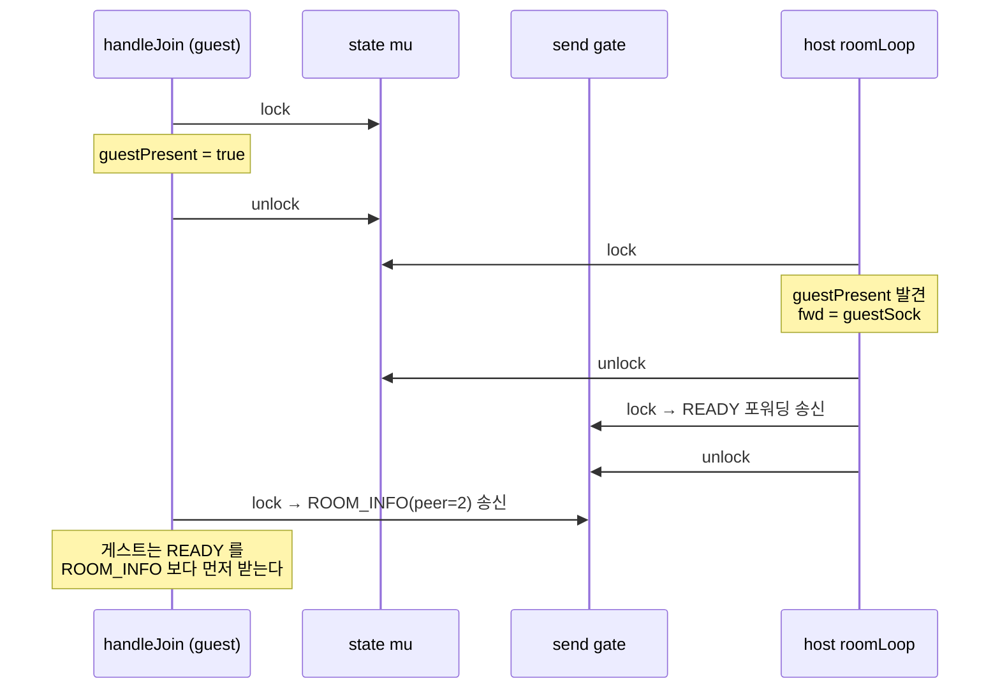
```mermaid
sequenceDiagram
    participant J as handleJoin (guest)
    participant M as state mu
    participant S as send gate
    participant H as host roomLoop

    J->>M: lock
    Note over J: guestPresent = true
    J->>M: unlock
    H->>M: lock
    Note over H: guestPresent 발견<br/>fwd = guestSock
    H->>M: unlock
    H->>S: lock → READY 포워딩 송신
    H->>S: unlock
    J->>S: lock → ROOM_INFO(peer=2) 송신
    Note over J: 게스트는 READY 를<br/>ROOM_INFO 보다 먼저 받는다
```

게스트 클라이언트는 아직 자기가 방에 들어갔다는 사실(`ROOM_INFO`)조차 모르는 채로 상대의 `READY` 를 먼저 받는다. 클라이언트 상태 기계는 그 프레임을 버리거나 `RoomState` 를 잘못 전이시킨다. 게이트를 먼저 잡으면 호스트의 포워딩은 게이트 뒤에서 대기하므로, `ROOM_INFO` 두 개가 먼저 나간 뒤에야 전달된다.

두 `ROOM_INFO` 를 **같은 임계구간 안에서 연속으로** 보내는 것도 같은 이유다. 사이에 다른 프레임이 끼면 호스트와 게스트가 보는 방 상태 순서가 어긋난다.

`lk.unlock()` 후 다시 `mu` 를 잡아 버전을 재확인하는 `entered` 검사는, 그 짧은 사이에 방이 사라지거나(호스트가 나감) 다른 상태 갱신이 끼어들었는지 보는 것이다. 버전이 바뀌었으면 `ROOM_INFO`를 보내지 않고 `roomLoop_`에도 들어가지 않는다. 이미 공개한 게스트 슬롯은 그 연결의 소유자 확인 후 정리하고 연결을 닫아, 읽는 작업 없이 남는 방을 방지한다.

`ROOM_INFO` 의 status 바이트는 네 값이다.

| 값 | 이름 | 의미 |
|----|------|------|
| 0 | WAITING | 방에 있고 대기/매칭 진행 가능 |
| 1 | FULL | 방은 있지만 이미 2명 (또는 매치 시작됨) |
| 2 | NOT_FOUND | 그런 코드 없음 |
| 3 | GONE_FULL | 상대가 나가서 혼자 남음 |

**예외 경로에도 방을 책임지는 실행 흐름이 필요하다.** handleCreate는 문자열 복사가
실패해도 반쯤 채운 항목이 남지 않도록 지역 Entry를 완성한 뒤 emplace한다.
handleJoin도 현재 항목의 사본을 준비한 뒤 예외 없는 이동 대입으로 공개한다.
등록 성공 뒤에도 안내 프레임의 버퍼 할당이나 roomLoop 초기화가 실패할 수 있다.
두 진입 함수의 catch는 잠금이 해제된 뒤 abortRoom_을 호출하고 예외를 다시 전달한다.

**현재 소스 발췌 — `server/room.cpp`**

```cpp
// An exceptional owner exit must not leave an entry without its reader loop.
// Compare owning handle identities, not reusable fd numbers or only the code.
void RoomRegistry::abortRoom_(const std::string& code, const net::TcpSocket& owner) {
    {
        std::lock_guard<std::mutex> lock(mu);
        const auto it = rooms.find(code);
        if (it == rooms.end()) return;
        const auto same = [&](const net::TcpSocket& socket) {
            return (owner.fdh || owner.transport) &&
                   socket.fdh == owner.fdh && socket.transport == owner.transport;
        };
        if (!same(it->second.hostSock) && !same(it->second.guestSock)) return;
        net::tcp_close(it->second.hostSock);
        net::tcp_close(it->second.guestSock);
        rooms.erase(it);
    }
    cv.notify_all();
}
```

예외 정리는 코드 문자열만 비교하지 않는다. 해당 방에 보관한 소켓과 실패한 작업의
소유 핸들이 같은지 확인한 뒤 양쪽 연결을 종료하고 항목을 지운다. 코드가 재사용되어도
다른 연결의 방을 지우지 않게 하는 조건이다. 이 검사는 예외 정리 경로의 계약이며,
모든 비동기 콜백이 자동으로 같은 보호를 받는 것은 아니다. 준비·종료·매치 인계는
각 경로의 소유권과 버전을 별도로 대조해야 한다.

### 8.6 대기실 루프 — `roomLoop_`

호스트와 게스트 스레드가 각각 한 벌씩 이 함수를 돈다. 함수 전체를 싣는다.

**현재 소스 발췌 — `server/room.cpp`**

```cpp
void RoomRegistry::roomLoop_(const std::string& code, bool isHost,
                             const net::TcpSocket& expected,
                             std::vector<uint8_t> streamPrefix) {
    // Keep the caller's owning identity: the same code/role may be reused.
    net::TcpSocket mySock = expected;
    bool ownsSlot = false;
    {
        std::lock_guard<std::mutex> lk(mu);
        const auto it = rooms.find(code);
        ownsSlot = it != rooms.end() && ownsSlot_(it->second, isHost, mySock);
    }
    if (!ownsSlot) {
        net::tcp_close(mySock);
        return;
    }

    // playerConnThread 가 첫 프레임과 함께 끌어온 잔여 바이트를 수신 버퍼의
    // 초기값으로 사용 — ROOM_CREATE/JOIN 직후 같은 recv 에 실려온 READY/CHAT
    // 등이 유실되지 않는다.
    std::vector<uint8_t> stream = std::move(streamPrefix);
    stream.reserve(256);
    bool leaveRequested   = false;
    bool peerStartedMatch = false;
    bool iAmStarter       = false;
    bool timedOut         = false;

    // 단계별 데드라인. 게스트 스레드의 대기는 시작부터 끝까지 READY 단계이고
    // (호스트가 떠난 방은 재입장 경로가 없어 더 진행될 수 없다), 호스트 스레드는
    // 게스트 입·퇴장을 관측하는 순간 단계가 전환되므로 아래 상태 체크에서
    // bothPresent 변화를 보고 데드라인을 다시 건다.
    auto armDeadline = [](bool bothPresent) {
        const auto now = std::chrono::steady_clock::now();
        return bothPresent
            ? std::chrono::steady_clock::time_point(now + kRoomReadyTimeout)
            : std::chrono::steady_clock::time_point(now + kRoomGuestWaitTimeout);
    };
    bool bothPresentPrev = !isHost;  // 게스트는 입장 시점에 이미 양측 재실
    auto deadline        = armDeadline(bothPresentPrev);

    while (!stopping.load()) {
        // 데드라인은 활동(채팅/READY 토글)으로 연장하지 않는다 — 활동 기준이면
        // 채팅만 계속 보내며 워커 슬롯을 무한정 점유할 수 있다.
        if (std::chrono::steady_clock::now() >= deadline) {
            RLOG_INFO("[room] code=" << code << " "
                      << (isHost ? "host" : "guest")
                      << (bothPresentPrev ? " ready-wait" : " guest-wait")
                      << " close: timeout match_uuid=-");
            timedOut = true;
            break;
        }

        if (!net::tcp_recv_some(mySock, stream)) {
            // EOF — 소켓 닫힘
            break;
        }

        if (!stream.empty()) {
            std::vector<net::Frame> frames;
            if (!net::parse_frames(stream, frames)) {
                RLOG_WARN("[room] code=" << code << " close: invalid frame boundary");
                break; // Use the common room/peer/socket cleanup below.
            }
            for (const auto& f : frames) {
                if (f.type == net::MsgType::READY) {
                    if (f.payload.size() != 1 || f.payload[0] > 1) {
                        leaveRequested = true;
                        break; // Common cleanup releases the room slot and socket.
                    }
                    const bool ready = f.payload[0] == 1;
                    net::TcpSocket fwd{};
                    bool hasFwd = false;
                    {
                        std::lock_guard<std::mutex> lk(mu);
                        auto it = rooms.find(code);
                        if (it != rooms.end() && ownsSlot_(it->second, isHost, mySock)) {
                            auto& r = it->second;
                            if (isHost) r.hostReady  = ready;
                            else        r.guestReady = ready;
                            if (isHost && r.guestPresent) { fwd = r.guestSock; hasFwd = true; }
                            if (!isHost && r.hostPresent) { fwd = r.hostSock;  hasFwd = true; }
                        } else {
                            leaveRequested = true;
                        }
                    }
                    if (hasFwd) {
                        std::vector<uint8_t> p; p.push_back(ready ? 1 : 0);
                        auto out = net::build_frame(net::MsgType::READY, p);
                        sendRoomFrame_(code, fwd, out);
                    }
                } else if (f.type == net::MsgType::ROOM_LEAVE) {
                    leaveRequested = true;
                    break;
                } else if (f.type == net::MsgType::CHAT) {
                    // 대기 중 채팅 — 상대에게 그대로 전달
                    net::TcpSocket fwd{};
                    bool hasFwd = false;
                    {
                        std::lock_guard<std::mutex> lk(mu);
                        auto it = rooms.find(code);
                        if (it != rooms.end() && ownsSlot_(it->second, isHost, mySock)) {
                            auto& r = it->second;
                            if (isHost && r.guestPresent) { fwd = r.guestSock; hasFwd = true; }
                            if (!isHost && r.hostPresent) { fwd = r.hostSock;  hasFwd = true; }
                        } else {
                            leaveRequested = true;
                        }
                    }
                    if (hasFwd) {
                        auto out = net::build_frame(net::MsgType::CHAT, f.payload);
                        sendRoomFrame_(code, fwd, out);
                    }
                }
                if (leaveRequested) break;
                // 다른 타입(HELLO 등)은 이 단계에서는 무시
            }
        }

        if (leaveRequested) break;

        // 상태 변화 체크
        bool bothPresentNow = false;
        {
            std::lock_guard<std::mutex> lk(mu);
            auto it = rooms.find(code);
            if (it == rooms.end() || !ownsSlot_(it->second, isHost, mySock)) break;
            auto& r = it->second;
            bothPresentNow = r.hostPresent && r.guestPresent;

            if (r.matchStarted) {
                // 상대가 starter 로 선점함 — 내 read 루프를 내려놓고 exit 플래그 세팅
                peerStartedMatch = true;
                if (isHost) r.hostExited = true;
                else        r.guestExited = true;
                cv.notify_all();
                break;
            }

            if (r.hostPresent && r.guestPresent && r.hostReady && r.guestReady) {
                r.matchStarted = true;
                iAmStarter     = true;
                cv.notify_all();
                break;
            }
        }

        // 호스트의 대기 단계 전환: 게스트 입장 → READY 대기(60s), 게스트 퇴장 →
        // 다시 게스트 대기(15m). 게스트 스레드는 단계가 바뀌지 않으므로 최초
        // 데드라인을 유지한다 — 호스트가 떠난 zombie 방에 눌러앉는 것도 이
        // 데드라인이 정리한다.
        if (isHost && bothPresentNow != bothPresentPrev) {
            bothPresentPrev = bothPresentNow;
            deadline = armDeadline(bothPresentNow);
        }

        std::this_thread::sleep_for(kPollInterval);
    }

    if (iAmStarter) {
        // 상대가 read 루프를 내려놓을 때까지 대기 — 이후 둘 다 소켓을 forwarderLoop
        // 에 넘긴다. 같은 fd 를 두 스레드가 동시에 recv 하지 않도록 보장.
        Match m{};
        {
            std::unique_lock<std::mutex> lk(mu);
            cv.wait(lk, [&] {
                if (stopping.load()) return true;
                auto it = rooms.find(code);
                if (it == rooms.end() || !ownsSlot_(it->second, isHost, mySock)) return true;
                auto& r = it->second;
                if (isHost)  return r.guestExited || !r.guestPresent;
                else         return r.hostExited  || !r.hostPresent;
            });

            auto it = rooms.find(code);
            const bool stillOwns = it != rooms.end() && ownsSlot_(it->second, isHost, mySock);
            if (!stillOwns || stopping.load()) {
                // Never erase a replacement room reached by an old reader.
                if (stillOwns) rooms.erase(it);
                net::tcp_close(mySock);
                return;
            }
            auto& r = it->second;
            if (!(r.hostPresent && r.guestPresent)) {
                // 상대가 매치 시작 직전에 퇴장 — 혼자 남은 소켓 정리
                net::tcp_close(mySock);
                rooms.erase(it);
                return;
            }

            m.a.sock      = r.hostSock;
            m.a.conn_id   = r.hostConn;
            m.a.player_id = r.hostPlayerId;
            m.a.elo       = r.hostElo;
            m.a.username  = r.hostUsername;
            m.a.token     = r.hostToken;
            m.a.selected_icon_id = r.hostSelectedIconId;
            m.a.session_lease = r.hostSessionLease;
            m.a.ip_session    = r.hostIpSession;
            m.b.sock      = r.guestSock;
            m.b.conn_id   = r.guestConn;
            m.b.player_id = r.guestPlayerId;
            m.b.elo       = r.guestElo;
            m.b.username  = r.guestUsername;
            m.b.token     = r.guestToken;
            m.b.selected_icon_id = r.guestSelectedIconId;
            m.b.session_lease = r.guestSessionLease;
            m.b.ip_session    = r.guestIpSession;
            m.seed        = nextSeed_();
            m.match_id    = nextMatchId_();
            m.match_uuid  = new_match_uuid();
            rooms.erase(it);
        }
        RLOG_INFO("[room] code=" << code << " -> match id=" << m.match_id
                  << " uuid=" << m.match_uuid
                  << " player_id=" << m.a.player_id << " x " << m.b.player_id
                  << " seed=" << log_hex(m.seed));
        relay::startPump(std::move(m), meta_);
        return;
    }

    if (peerStartedMatch) {
        // starter 가 내 소켓을 forwarderLoop 으로 이관함. 닫지 않고 리턴.
        return;
    }

    if (timedOut) {
        // 정중한 종료 통지: 데드라인 초과로 닫을 때 EOF 만 던지면 클라이언트는
        // 네트워크 오류로 오인한다. 전용 타임아웃 status 가 없어 gonefull(방 종료)
        // 을 재사용해 대기 화면을 정리할 기회를 준다. 상대 스레드가 같은 소켓에
        // READY/CHAT 을 포워딩 중일 수 있으므로 방 게이트로 직렬화.
        const size_t shard = std::hash<std::string>{}(code) % kRoomSendShardCount;
        std::lock_guard<std::mutex> sendLk(roomSendMu_[shard]);
        sendRoomInfo_(mySock, code, kStatusGoneFull, 1);
    }

    // 일반 종료(ROOM_LEAVE / EOF / 대기 타임아웃 / shutdown) — 상대에게 알리고
    // 내 소켓 닫음. peer 통지는 상태 mutex 밖에서 보내되 방별 게이트로 직렬화한다.
    // tcp_send_all 이 블록해도 다른 방의 처리는 계속되며, 버전 검증으로
    // 새 입장 뒤 오래된 gonefull 이 도착하는 상태 역전을 막는다.
    net::TcpSocket peerSock{};
    bool notifyPeer = false;
    uint64_t roomInfoVersion = 0;
    std::shared_ptr<PlayerSessionLease> retiredLease;
    std::shared_ptr<IpAdmission> retiredIp;
    {
        std::lock_guard<std::mutex> lk(mu);
        auto it = rooms.find(code);
        if (it != rooms.end() && ownsSlot_(it->second, isHost, mySock)) {
            auto& r = it->second;
            // Move departure leases out; release them after mu, before peer I/O.
            // A surviving room must not keep the departed admission alive.
            // Other aliases, if any, may still defer final release.
            if (isHost) {
                r.hostPresent = false;  r.hostReady  = false;
                r.hostSock = {}; // mySock retains the departing owner until close below.
                retiredLease = std::move(r.hostSessionLease); retiredIp = std::move(r.hostIpSession);
            } else {
                r.guestPresent = false; r.guestReady = false;
                r.guestSock = {};
                retiredLease = std::move(r.guestSessionLease); retiredIp = std::move(r.guestIpSession);
            }
            if (isHost && r.guestPresent) { peerSock = r.guestSock; notifyPeer = true; }
            if (!isHost && r.hostPresent) { peerSock = r.hostSock;  notifyPeer = true; }
            roomInfoVersion = r.roomInfoVersion = next_room_info_version_++;
            if (!r.hostPresent && !r.guestPresent) rooms.erase(it);
            // A starter may be waiting for this presence change, not reader-exit.
            cv.notify_all();
        }
    }
    retiredLease.reset();
    retiredIp.reset();

    if (notifyPeer) {
        sendRoomInfoIfCurrent_(peerSock, code, kStatusGoneFull, 1,
                               roomInfoVersion);
    }

    net::tcp_close(mySock);
}
```

**이미 읽은 바이트를 유지한다.** `std::vector<uint8_t> stream = std::move(streamPrefix);` — `playerConnThread` 가 끌어온 잔여 바이트를 수신 버퍼의 **초기값**으로 쓴다. 빈 벡터로 시작하면 `ROOM_CREATE` 와 같은 세그먼트에 담겨온 `READY` 가 그대로 사라져, 호스트가 방을 만들자마자 READY 를 눌렀을 때 서버가 영원히 그 사실을 모른다.

**방에도 데드라인이 있다.** 첫 프레임 5초(§6.1)와 수락 로비 30초(§10.5)가 있는데 정작 대기실만 무기한이면, 침묵하는 방 하나가 연결 워커 스레드와 IP admission 슬롯, 그리고 ranked 라면 세션 lease 까지 서버가 살아 있는 내내 점유한다. 방을 만들어 두고 떠나는 것만으로 — 악의든 부주의든 — 워커 예산 256개가 서서히 마르는 구조다. **점유형 자원에는 모든 대기 단계마다 상한이 있어야 하고, 상한이 없는 단계 하나가 전체 예산의 배수구가 된다.** 그래서 두 단계로 나눠 데드라인을 건다.

- **게스트 대기 15분** (`kRoomGuestWaitTimeout`): 코드를 친구에게 전달하고 상대가 실행·입장하기까지의 인간적인 시간. 길게 잡되 무기한은 아니다.
- **READY 대기 60초** (`kRoomReadyTimeout`): 둘 다 앉아 있는데 준비만 안 누르는 상태. 사람이 있다면 충분하고, 없다면 오래 붙잡을 이유가 없다.

세 가지 설계 결정이 딸려 온다. 첫째, **활동으로 연장하지 않는다** — 채팅이나 READY 토글로 데드라인이 밀리면 스크립트가 주기적으로 한 바이트씩 보내며 슬롯을 무한 점유할 수 있다. 단계 진입 시점에만 재장전하는 절대 데드라인이라야 상한이 상한이다. 둘째, **호스트 스레드만 단계 전환을 관측해 재장전한다** — 게스트 입장이면 60초로, 게스트 퇴장이면 다시 15분으로. 게스트 스레드는 입장부터 끝까지 READY 단계 하나뿐이라 최초 데드라인을 유지하며, 호스트가 이미 떠난 zombie 방에 게스트가 눌러앉는 경우도 이 데드라인이 정리한다. 셋째, **타임아웃으로 닫을 때는 `gonefull` 을 먼저 보낸다** — EOF 만 던지면 클라이언트가 네트워크 오류로 오인한다. 전용 status 를 새로 만드는 대신 "방이 끝났다" 는 의미의 기존 값을 재사용해 프로토콜 표면을 늘리지 않았다.

**READY 포워딩.** 서버는 내 플래그를 갱신하고 `sendRoomFrame_` 로 상대에게 그대로 전달한다. 상대 UI 의 "Opponent: READY" 토글을 위해서다. 서버가 UI 결정을 하지 않는다 — 서버는 상태의 단일 소스이고, 표시는 클라이언트 몫이다. 포워딩은 반드시 `sendRoomFrame_`(게이트 경유)로 나가야 한다. 직접 `tcp_send_all` 을 부르면 §8.5 의 순서 보장이 깨진다.

**상태 변화 체크는 매 iteration 마다 한다.** 두 조건 중 하나에 걸리면 루프를 나간다.

- `r.matchStarted` 가 이미 참 → 상대가 starter 로 선점했다. 내 `*Exited` 플래그를 세우고 `cv.notify_all()` 로 상대를 깨운 뒤 `peerStartedMatch = true` 로 나간다.
- 양쪽 present + 양쪽 ready → 내가 starter 다. `matchStarted = true` 로 선점하고 `iAmStarter = true` 로 나간다.

먼저 락을 잡은 쪽이 starter 가 되고 다른 쪽은 반드시 두 번째 분기를 못 본다. `startPump` 가 두 번 불리는 일이 구조적으로 불가능하다.

**코드·역할과 연결의 소유 동일성.** 같은 방 코드와 게스트 자리에는 다른 연결이
들어올 수 있다. `roomLoop_`는 호출자가 넘긴 `expected` 소켓을 붙들고 시작한다.
READY 갱신, CHAT 대상 선택, 시작 대기, 일반 퇴장마다 `ownsSlot_`로 현재 슬롯의
소유 핸들과 같은지 확인한다. 재사용 가능한 숫자 fd만 비교하지 않는다.

**현재 소스 발췌 — `server/room.cpp`**

```cpp
bool RoomRegistry::ownsSlot_(const Entry& entry, bool isHost,
                             const net::TcpSocket& expected) {
    const auto& socket = isHost ? entry.hostSock : entry.guestSock;
    const bool present = isHost ? entry.hostPresent : entry.guestPresent;
    return present && (expected.fdh || expected.transport) &&
           socket.fdh == expected.fdh && socket.transport == expected.transport;
}
```

오래된 작업이 새 방을 찾아도 새 연결의 상태를 바꾸거나 그 방을 삭제하지 않는다.
이 검사는 서버 내부 작업과 슬롯의 연결 관계를 확인하며, 클라이언트 인증을 대체하지 않는다.

### 8.7 룸에서 매치로의 인계 — `iAmStarter` 분기

이 프로젝트에서 가장 미묘한 부분이다. 다시 떼어 본다.

**현재 소스 발췌 — `server/room.cpp`**

```cpp
    if (iAmStarter) {
        // 상대가 read 루프를 내려놓을 때까지 대기 — 이후 둘 다 소켓을 forwarderLoop
        // 에 넘긴다. 같은 fd 를 두 스레드가 동시에 recv 하지 않도록 보장.
        Match m{};
        {
            std::unique_lock<std::mutex> lk(mu);
            cv.wait(lk, [&] {
                if (stopping.load()) return true;
                auto it = rooms.find(code);
                if (it == rooms.end() || !ownsSlot_(it->second, isHost, mySock)) return true;
                auto& r = it->second;
                if (isHost)  return r.guestExited || !r.guestPresent;
                else         return r.hostExited  || !r.hostPresent;
            });

            auto it = rooms.find(code);
            const bool stillOwns = it != rooms.end() && ownsSlot_(it->second, isHost, mySock);
            if (!stillOwns || stopping.load()) {
                // Never erase a replacement room reached by an old reader.
                if (stillOwns) rooms.erase(it);
                net::tcp_close(mySock);
                return;
            }
            auto& r = it->second;
            if (!(r.hostPresent && r.guestPresent)) {
                // 상대가 매치 시작 직전에 퇴장 — 혼자 남은 소켓 정리
                net::tcp_close(mySock);
                rooms.erase(it);
                return;
            }

            m.a.sock      = r.hostSock;
            m.a.conn_id   = r.hostConn;
            m.a.player_id = r.hostPlayerId;
            m.a.elo       = r.hostElo;
            m.a.username  = r.hostUsername;
            m.a.token     = r.hostToken;
            m.a.selected_icon_id = r.hostSelectedIconId;
            m.a.session_lease = r.hostSessionLease;
            m.a.ip_session    = r.hostIpSession;
            m.b.sock      = r.guestSock;
            m.b.conn_id   = r.guestConn;
            m.b.player_id = r.guestPlayerId;
            m.b.elo       = r.guestElo;
            m.b.username  = r.guestUsername;
            m.b.token     = r.guestToken;
            m.b.selected_icon_id = r.guestSelectedIconId;
            m.b.session_lease = r.guestSessionLease;
            m.b.ip_session    = r.guestIpSession;
            m.seed        = nextSeed_();
            m.match_id    = nextMatchId_();
            m.match_uuid  = new_match_uuid();
            rooms.erase(it);
        }
        RLOG_INFO("[room] code=" << code << " -> match id=" << m.match_id
                  << " uuid=" << m.match_uuid
                  << " player_id=" << m.a.player_id << " x " << m.b.player_id
                  << " seed=" << log_hex(m.seed));
        relay::startPump(std::move(m), meta_);
        return;
    }
```

**왜 상대의 exit 를 기다려야 하는가.** starter 가 `startPump` 를 부르면 그 안에서 `forwarderLoop` 두 개가 뜨고, 각각 두 소켓에 대해 `tcp_recv_some` 을 돌린다. 그런데 이 순간 상대 `roomLoop_` 스레드가 아직 자기 소켓에서 `tcp_recv_some` 을 돌고 있으면, **같은 fd 를 두 스레드가 동시에 recv 하게 된다.** 그러면 도착한 바이트가 두 버퍼로 쪼개져 들어간다. 어느 쪽도 완성 프레임을 못 만들거나, 룸 루프가 게임 프레임을 집어삼켜 포워더가 영영 못 보게 된다. 프레임 경계가 깨지므로 체크섬 실패도 아니고 그냥 스트림이 어긋난다 — 재현도 진단도 어려운 종류의 버그다.

그래서 `cv.wait` 로 `guestExited || !guestPresent`(호스트가 starter 인 경우)를 기다린다. 상대는 §8.6 의 첫 분기에서 `*Exited = true` 를 세우고 `notify_all` 을 한 뒤 루프를 나갔으므로, 이 조건이 참이 되는 시점에 상대 스레드는 확실히 recv 를 멈춘 상태다. `!guestPresent` 를 OR 로 넣은 이유는 상대가 exit 플래그를 세우기 전에 아예 연결이 끊겨 사라진 경우에도 깨어나야 하기 때문이다. `stopping` 과 `rooms.find == end` 도 같은 이유의 탈출 조건이다.

깨어난 뒤에는 조건을 **다시 확인**한다. `cv.wait` 의 술어가 참이 된 이유가 "상대가 준비됨" 이 아니라 "상대가 사라짐" 일 수 있기 때문이다. `hostPresent && guestPresent` 가 아니면 매치를 만들지 않고 자기 소켓만 닫고 방을 지운다.

**`Match` 조립.** 양쪽의 소켓·conn_id·player_id·elo·username·token·icon·세션 lease 를 그대로 복사한다. `Match` 는 §7.1 에서 매치메이커가 쓰던 것과 동일한 구조체다. 덕분에 `relay::startPump` 는 "이 매치가 랜덤 큐에서 왔는지 룸에서 왔는지" 를 알 필요가 없다. seed 와 match_id 는 `RoomRegistry` 의 자체 RNG/카운터에서, `match_uuid` 는 랜덤 큐 경로와 같은 `new_match_uuid()` 에서 뽑는다. `Entry` 에 보관돼 있던 두 lease 는 이 지점에서 `Match` 로 옮겨 타 채널까지 동행한다 — 방이 지워져도(`rooms.erase`) lease 는 매치와 함께 산다.

**`rooms.erase(it)` 는 `startPump` 호출 전에, 락 안에서 한다.** 방은 이 순간부터 존재 의미가 없다. 남겨두면 같은 코드로 새 `handleJoin` 이 들어와 이미 게임 중인 소켓에 `ROOM_INFO` 를 보낼 수 있다. 지운 뒤 락을 벗어나서 `startPump` 를 부른다 — `startPump` 안에서 `MATCH_FOUND` 두 개를 `tcp_send_all` 로 보내므로, 상태 뮤텍스를 쥔 채 부르면 네트워크가 막힐 때 모든 방이 멈춘다.

**게스트 스레드는 소켓을 닫지 않는다.** `peerStartedMatch` 분기가 그냥 `return` 이다. 소켓 소유권은 starter 가 `Match` 에 복사해 포워더로 넘겼다. `TcpSocket` 이 참조 카운트 핸들이라 게스트 스레드의 지역 사본이 소멸해도 fd 는 살아 있다.

조건 변수의 알림은 저장된 사건이 아니라 **조건을 다시 검사할 기회**다.
여기서는 상대의 reader 이탈뿐 아니라 `!guestPresent` 또는 `!hostPresent`도
대기를 끝내므로 일반 퇴장도 상태 변경 뒤 `cv.notify_all()`을 호출한다.
알림이 먼저 발생해도 같은 mutex로 보호한 predicate가 참이면 wait는 잠들지 않는다.
가짜 깨움이 있어도 predicate를 다시 검사한다. 소켓이 닫혔다는 이유만으로 이 조건 변수가
자동으로 깨어나는 것은 아니다. 깨어난 starter는 소유 동일성도 재확인하여
같은 코드로 다시 생긴 방을 지우지 않는다.

### 8.8 일반 종료 경로

**현재 소스 발췌 — `server/room.cpp`**

```cpp
    // 일반 종료(ROOM_LEAVE / EOF / 대기 타임아웃 / shutdown) — 상대에게 알리고
    // 내 소켓 닫음. peer 통지는 상태 mutex 밖에서 보내되 방별 게이트로 직렬화한다.
    // tcp_send_all 이 블록해도 다른 방의 처리는 계속되며, 버전 검증으로
    // 새 입장 뒤 오래된 gonefull 이 도착하는 상태 역전을 막는다.
    net::TcpSocket peerSock{};
    bool notifyPeer = false;
    uint64_t roomInfoVersion = 0;
    std::shared_ptr<PlayerSessionLease> retiredLease;
    std::shared_ptr<IpAdmission> retiredIp;
    {
        std::lock_guard<std::mutex> lk(mu);
        auto it = rooms.find(code);
        if (it != rooms.end() && ownsSlot_(it->second, isHost, mySock)) {
            auto& r = it->second;
            // Move departure leases out; release them after mu, before peer I/O.
            // A surviving room must not keep the departed admission alive.
            // Other aliases, if any, may still defer final release.
            if (isHost) {
                r.hostPresent = false;  r.hostReady  = false;
                r.hostSock = {}; // mySock retains the departing owner until close below.
                retiredLease = std::move(r.hostSessionLease); retiredIp = std::move(r.hostIpSession);
            } else {
                r.guestPresent = false; r.guestReady = false;
                r.guestSock = {};
                retiredLease = std::move(r.guestSessionLease); retiredIp = std::move(r.guestIpSession);
            }
            if (isHost && r.guestPresent) { peerSock = r.guestSock; notifyPeer = true; }
            if (!isHost && r.hostPresent) { peerSock = r.hostSock;  notifyPeer = true; }
            roomInfoVersion = r.roomInfoVersion = next_room_info_version_++;
            if (!r.hostPresent && !r.guestPresent) rooms.erase(it);
            // A starter may be waiting for this presence change, not reader-exit.
            cv.notify_all();
        }
    }
    retiredLease.reset();
    retiredIp.reset();

    if (notifyPeer) {
        sendRoomInfoIfCurrent_(peerSock, code, kStatusGoneFull, 1,
                               roomInfoVersion);
    }

    net::tcp_close(mySock);
```

내 present/ready 를 내리고 **내 세션 lease 참조를 지역 변수로 옮긴** 뒤, 상대가 남아 있으면 그 소켓 사본과 새 버전 번호를 확보하고, 아무도 안 남았으면 방을 지운다. 여기까지가 `mu` 안이다. 잠금을 놓은 뒤 지역 lease 참조를 해제하고, 실제 `ROOM_INFO(GONE_FULL)` 송신은 게이트를 통해 수행한다. 비운 슬롯의 소켓 참조도 제거하되 내 지역 소켓이 정리까지 수명을 유지한다. 다른 참조가 남아 있으면 실제 자원 소멸은 늦어질 수 있다.

lease 반납을 방 소멸까지 미루지 않는 이유는 상대가 남은 방의 `Entry` 가 계속 살기 때문이다. 떠난 플레이어의 lease 가 `Entry` 안에 잔류하면, 그 사람이 새 연결로 재접속했을 때 §6 의 `PlayerSessionLease::acquire` 가 "이미 활성 세션 있음" 으로 거절한다 — 자기 자신의 유령에게 막히는 셈이다. 방 단계에서 더는 사용하지 않는 lease 참조는 일반 퇴장 처리에서 해제한다. 실제 반납 시점은 남은 소유 참조의 수명에도 영향을 받는다.

이 짧은 코드에는 세 가지 방어가 겹쳐 있다. `TcpSocket` owning handle 사본이 락을 푼 뒤에도 fd 수명을 보존하고, `roomInfoVersion`이 stale 스냅샷을 걸러 내며, send gate가 `ROOM_INFO`와 포워딩 프레임의 wire 순서를 보장한다.

마지막으로 레지스트리 종료.

**현재 소스 발췌 — `server/room.cpp`**

```cpp
void RoomRegistry::shutdown() {
    {
        std::lock_guard<std::mutex> lk(mu);
        if (stopping.exchange(true)) return;
    }
    cv.notify_all();
    // roomLoop_ 들은 stopping 을 보고 자기 소켓을 닫으며 종료한다.
}
```

`exchange` 로 재진입을 막고, `cv.notify_all()` 로 `iAmStarter` 대기 중인 스레드를 깨운다. 나머지 `roomLoop_` 들은 다음 iteration 에서 `stopping` 을 보고 나간다. 최대 지연은 폴링 간격 10ms 다.

## 9. 동시 나가기 레이스 — 과거 버그와 현재 계약

릴레이 초기 구현에서 실제로 마주친 실패이며, 현재의 fd 소유권·worker 종료
계약이 필요한 이유를 가장 직접적으로 보여 준다. 단순히 락 하나를 추가하는
문제가 아니라 소켓 handle의 수명과 wire 순서를 별도로 보호해야 했다.

먼저 두 시점을 구분해야 한다.

- **당시**: `TcpSocket` 이 raw fd 정수에 가까웠다. 여러 스레드가 같은 fd **번호** 사본을 들고 있었고, 한쪽이 `close(fd)` 한 직후 OS 가 그 번호를 새 연결에 재사용하면 살아 있던 다른 스레드가 엉뚱한 연결에 `send` 할 수 있었다.
- **현재**: `TcpSocket` 은 `shared_ptr<int>` owning handle 이고, 실제 `close` 는 마지막 복사본이 사라질 때만 일어난다. `tcp_close()` 는 `shutdown()` 으로 루프를 깨우는 신호일 뿐이다. fd 재사용 유출은 소유권 모델에서 이미 막힌다.

그럼에도 §8.8 에 버전 검증과 송신 게이트가 남아 있는 이유는, 소유권 모델이 막는 것과 막지 못하는 것이 다르기 때문이다. 이 절은 그 경계를 정리한다.

### 9.1 증상

두 클라이언트가 거의 동시에 룸에서 나갈 때(한쪽은 `ROOM_LEAVE`, 다른 쪽은 창 닫기로 EOF) 서버가 드물게 죽거나, 이전 fd 번호로 전혀 다른 소켓에 `ROOM_INFO` 바이트가 섞여 들어갔다. raw fd 모델에서는 로컬 단발 테스트로 재현하기 어렵고, 접속과 퇴장을 반복하는 부하 상황에서 확률적으로만 드러나는 종류였다.

### 9.2 원인 — 락 밖으로 나온 send 와 fd 재사용

`roomLoop_` 의 "일반 종료" 경로 초기 버전은 대략 이랬다.

실제 저장소에는 없음 — 하드닝 이전 구현의 재구성

**예시(실제 저장소에는 없음)**

```cpp
net::TcpSocket peerSock{};
bool notifyPeer = false;
{
    std::lock_guard<std::mutex> lk(mu);
    auto it = rooms.find(code);
    if (it != rooms.end()) {
        auto& r = it->second;
        if (isHost) { r.hostPresent = false;  r.hostReady  = false; }
        else        { r.guestPresent = false; r.guestReady = false; }
        if (isHost && r.guestPresent) { peerSock = r.guestSock; notifyPeer = true; }
        if (!isHost && r.hostPresent) { peerSock = r.hostSock;  notifyPeer = true; }
        if (!r.hostPresent && !r.guestPresent) rooms.erase(it);
    }
}
// lock 밖에서 send
if (notifyPeer) sendRoomInfo_(peerSock, code, kStatusGoneFull, 1);
net::tcp_close(mySock);
```

"lock hold 시간을 줄이자" 는 상식적 최적화다. 실제로 `tcp_send_all` 은 상대가 느리면 소켓 send 버퍼가 찰 때까지 블록할 수 있고, 그동안 전역 `mu` 를 쥐고 있으면 서버의 **모든** 방이 멈춘다. 그러니 락 밖으로 빼는 방향 자체는 옳다.

문제는 그 시점의 `peerSock` 이 소유권 없는 fd 번호 **사본** 이었다는 점이다. 두 스레드가 거의 동시에 이 경로에 들어가면 다음 인터리빙이 가능했다.

1. **호스트 스레드**: 락 안에서 `hostPresent=false`, `peerSock=gs` 확보, unlock.
2. **게스트 스레드**: 락 안에서 `guestPresent=false`, `peerSock=hs` 확보, unlock.
3. **호스트 스레드**: 락 밖에서 `tcp_send_all(gs, ...)` 시스템 콜 진입.
4. **게스트 스레드**: `rooms.erase(code)` + `close(mySock=gs)` 실행 — fd 번호가 커널에서 해제된다.
5. **호스트 스레드**: 3번의 send 가 방금 닫힌 fd 번호를 참조한다. OS 가 그 번호를 새 `accept()` 에 곧바로 재사용하면, 전혀 무관한 클라이언트 연결에 `ROOM_INFO` 바이트가 섞여 들어간다.

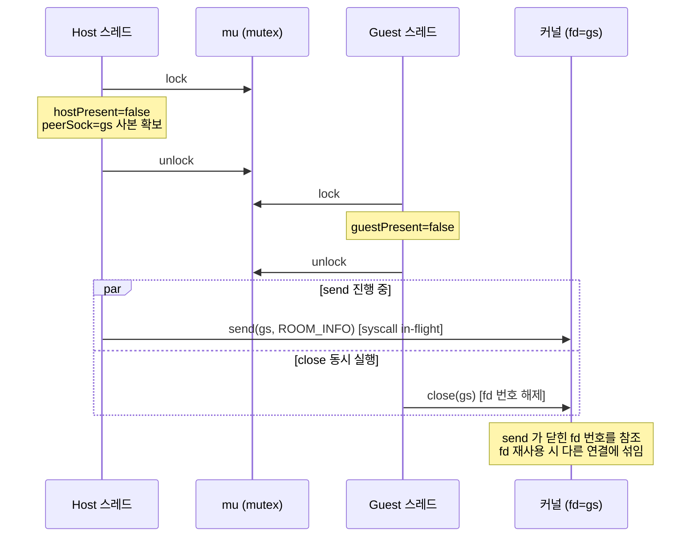
```mermaid
sequenceDiagram
    participant H as Host 스레드
    participant M as mu (mutex)
    participant G as Guest 스레드
    participant FD as 커널 (fd=gs)

    H->>M: lock
    Note over H: hostPresent=false<br/>peerSock=gs 사본 확보
    H->>M: unlock
    G->>M: lock
    Note over G: guestPresent=false
    G->>M: unlock
    par send 진행 중
        H->>FD: send(gs, ROOM_INFO)  [syscall in-flight]
    and close 동시 실행
        G->>FD: close(gs)  [fd 번호 해제]
    end
    Note over FD: send 가 닫힌 fd 번호를 참조<br/>fd 재사용 시 다른 연결에 섞임
```

단일 테스트에서는 보이지 않는다. 매치를 연속으로 수백 번 돌려야 확률이 누적된다.

### 9.3 현재의 세 겹 방어

현재 코드는 서로 다른 층위에서 세 가지를 건다.

**(1) fd 를 owning handle 로 소유한다.** `TcpSocket` 복사본이 살아 있는 동안 실제 fd 는 닫히지 않는다. `tcp_close()` 는 `shutdown()` 만 호출하고, 실제 `close` 는 마지막 참조가 소멸할 때 RAII deleter 가 한 번 수행한다. §9.2 의 4번과 5번 사이에 fd 번호가 재사용될 가능성이 사라진다. `peerSock` 사본이 살아 있는 한 그 번호는 누구에게도 배정되지 않는다.

이것만으로 fd 재사용 문제는 끝난다. 하지만 남는 게 둘 있다.

**(2) 상태에 단조 증가 버전을 붙인다.** 소유권은 "엉뚱한 소켓에 쓰는 것" 을 막지만 "오래된 정보를 옳은 소켓에 쓰는 것" 은 막지 못한다. 다음 시나리오를 보자.

- 게스트가 나간다. 호스트 쪽에 `GONE_FULL` 을 보내려고 준비한다 (version=41).
- 그 직후 새 게스트가 `handleJoin` 으로 들어와 `ROOM_INFO(WAITING, peer=2)` 를 보낸다 (version=42).
- 41번 알림이 42번보다 늦게 wire 에 올라가면, 호스트 UI 는 방금 사람이 들어왔는데 "혼자 남았음" 으로 되돌아간다.

`roomInfoVersion` 은 이 **상태 역전**을 막는다. 알림을 예약할 때 버전을 받아두고, 실제 송신 직전에 `mu` 아래에서 그 버전이 아직 최신인지 확인한다. 아니면 그냥 보내지 않는다. 잃는 것은 없다 — 더 새로운 알림이 이미 진실을 전달했기 때문이다.

**(3) 송신을 방별 게이트로 직렬화한다.** 버전 검증은 "보낼지 말지" 를 정할 뿐, 두 `tcp_send_all` 이 같은 소켓에 동시에 들어가는 것은 막지 못한다. partial send 루프 두 개가 겹치면 프레임 바이트가 섞이고, 수신 측은 체크섬 실패로 프레임을 버린다. `roomSendMu_[hash(code) % 64]` 가 같은 방의 `ROOM_INFO`/`READY`/`CHAT` 을 전부 한 줄로 세운다. §8.5 에서 본 "입장은 게이트를 먼저 잡고 `guestPresent` 를 공개한다" 도 이 게이트의 응용이다.

수정 후의 순서는 이렇다.

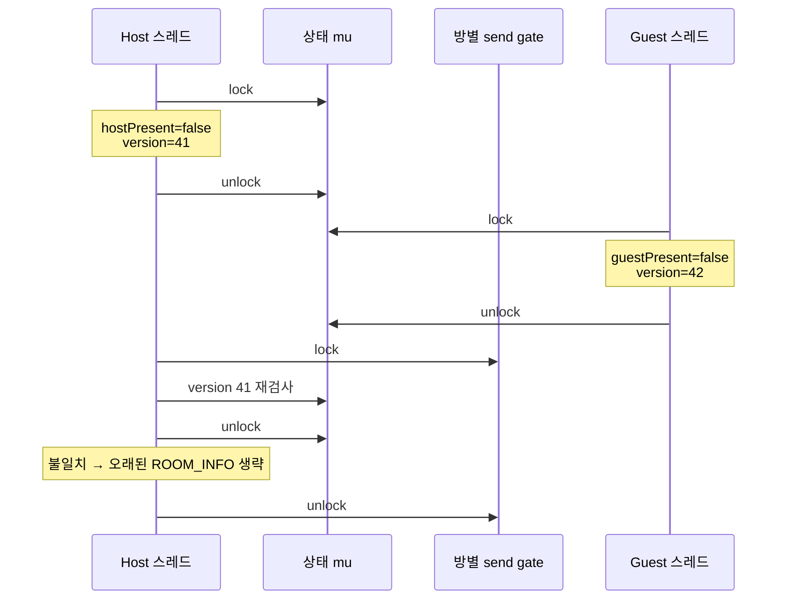
```mermaid
sequenceDiagram
    participant H as Host 스레드
    participant M as 상태 mu
    participant S as 방별 send gate
    participant G as Guest 스레드

    H->>M: lock
    Note over H: hostPresent=false<br/>version=41
    H->>M: unlock
    G->>M: lock
    Note over G: guestPresent=false<br/>version=42
    G->>M: unlock
    H->>S: lock
    H->>M: version 41 재검사
    H->>M: unlock
    Note over H: 불일치 → 오래된 ROOM_INFO 생략
    H->>S: unlock
```

`mu` 는 짧게 잡고 상태와 버전만 확정한다. 그 뒤 `sendRoomInfoIfCurrent_` 가 게이트를 잡고, `mu` 아래에서 버전을 재검사한 다음 송신한다. 네트워크가 타임아웃까지 막혀도 전역 room 상태 뮤텍스를 점유하지 않으므로 다른 방의 create/join/leave 는 계속된다.

**일반화된 교훈.** raw fd 정수는 소유권이 아니다. "fd 사본을 여러 스레드가 나눠 갖고, 한쪽이 close, 한쪽이 write" 하는 패턴은 반드시 fd 재사용 버그로 이어진다. 최종 해법은 `close` 와 `write` 순서를 임시로 맞추는 데 있지 않고 **fd 자체를 참조 카운트 owning handle 로 감싸는 것**이다. 그 위에 논리적 상태 역전을 막는 버전 번호와, wire 순서를 지키는 송신 게이트가 각각 별개로 얹힌다. 세 층이 각각 다른 문제를 푼다는 점이 중요하다.

## 10. `server/relay.cpp` — 수락 로비와 포워더

매치가 성립하면 두 진입점 중 하나가 호출된다.

- **커스텀 룸 경로**: `relay::startPump(Match, meta)` — 양쪽이 이미 룸 로비에서 READY 교환을 마쳤으므로 `MATCH_FOUND` 를 보내고 곧바로 포워더를 연다.
- **랜덤 큐 경로**: `relay::startQueuePump(Match, meta)` — `MATCH_FOUND` 를 보낸 뒤 **수락 로비** 워커를 띄우고, 양쪽 `READY(1)` 이 모이면 포워더를 연다.

둘 다 호출자(룸 스레드 / matcher 스레드)를 블록하지 않는다.

### 10.1 파일 수준 상태

**현재 소스 발췌 — `server/relay.cpp`**

```cpp
namespace {

std::atomic<bool> s_stopping{false};
// queue lobby와 양방향 forwarder도 모두 detached thread이므로 연결 워커와
// 별도로 상한을 둔다. 빠른 QUEUE_JOIN 플러드가 첫-frame 워커를 즉시 통과해
// 무제한 lobby thread를 만드는 경로까지 이 그룹이 차단한다.
constexpr size_t kMaxRelayWorkers = 512;
WorkerGroup s_workers{"relay", kMaxRelayWorkers};
```

연결 워커(256)와 relay 워커(512)를 별도 그룹으로 나눈 이유가 주석에 있다. `QUEUE_JOIN` 을 보내고 바로 빠지는 연결은 `playerConnThread` 를 순식간에 통과하므로 연결 워커 상한에 걸리지 않는다. 그 뒤에 만들어지는 로비/포워더 스레드에 별도 예산이 없으면 플러딩으로 무한정 생성된다.

### 10.2 `Channel` — 두 방향이 공유하는 상태

**현재 소스 발췌 — `server/relay.cpp`**

```cpp
struct Channel {
    net::TcpSocket   A;            // HOST 소켓
    net::TcpSocket   B;            // GUEST 소켓
    uint32_t         match_id{0};
    std::string      match_uuid;

    int64_t          playerA_id{0};
    int64_t          playerB_id{0};
    int              playerA_elo{0};
    int              playerB_elo{0};
    std::shared_ptr<PlayerSessionLease> playerA_session;
    std::shared_ptr<PlayerSessionLease> playerB_session;
    // per-IP 세션 슬롯 — 채널이 소켓을 소유하는 동안 함께 붙들고 있어야 한다.
    // 여기서 놓치면 Match 가 소멸하는 순간 슬롯이 풀려, 경기 중인 연결이
    // per-IP 세션 수에서 빠진다.
    std::shared_ptr<IpAdmission> playerA_ip;
    std::shared_ptr<IpAdmission> playerB_ip;

    std::atomic<bool> closed{false};
    std::atomic<int>  forwarder_count{2};
    std::atomic<int>  disconnect_side{0}; // 1=A, 2=B; first observed failure wins

    // MATCH_SUMMARY 수집
    std::mutex              sumMu;
    std::optional<Summary>  summaryA;
    std::optional<Summary>  summaryB;
    std::unique_ptr<RankedGame> verified;
    bool                    summaryHandled{false};   // 한 번만 처리

    // Bytes read by the lobby after READY are handed to the forwarders.
    std::vector<uint8_t>   prefixFromA;
    std::vector<uint8_t>   prefixFromB;

    // Serialize partial sends to each destination socket.
    std::mutex             sendMuA;
    std::mutex             sendMuB;

    // meta 호출 경로. nullptr이면 unranked raw 전달이며 MATCH_SUMMARY도
    // 서버 결과로 해석하지 않는다.
    meta::client::MetaClient* meta{nullptr};
};
```

`Channel` 은 `shared_ptr` 로 두 포워더가 공유한다. `forwarder_count` 가 0이 되는 순간 양 소켓을 닫는다 — 어느 쪽 스레드가 먼저 끝나든 마지막 하나가 정리를 맡는다.

`verified`는 이 채널 전용 규칙 상태다. 두 포워더가 `sumMu` 안에서만 접근하고, 확정 후 meta 호출은 잠금 밖에서 한다. `finalizeRanked`의 지역 `status`는 미완료·변조·저장 미확인을 점수 변화 0과 구분한다.

공유 멤버의 역할은 이렇다. `match_uuid` 는 §7.4 의 `MATCH_FOUND` 에 실렸던 그 멱등성 키로, `finalizeRanked`/`finalizeForfeit` 가 meta 에 결과를 저장할 때 그대로 쓴다. `playerA_session`/`playerB_session` 은 §6 에서 태어나 큐·룸을 거쳐 온 세션 lease 의 **종착지**다 — `Channel` 이 `shared_ptr` 라 두 포워더가 모두 내려가 마지막 참조가 사라질 때 채널과 함께 lease 도 풀리고, 그 순간부터 같은 계정이 새 매치에 들어올 수 있다. `disconnect_side` 는 어느 방향이 먼저 실패를 관측했는지의 기록으로(1=A, 2=B), §13.3 에서 보듯 승패 판정이 아니라 "결과를 통지할 생존자 선정" 에만 쓴다.

**목적지별 send 뮤텍스가 왜 필요한가.** 같은 목적지 소켓에 쓸 수 있는 주체가 셋이다.

- `A→B` 포워더가 B 에 게임 프레임을 쓴다.
- `B→A` 포워더가 A 에 게임 프레임을 쓴다.
- `finalizeRanked` 가 A 와 B **양쪽**에 `MATCH_RESULT` 를 직접 쓴다.

세 번째가 문제다. `finalizeRanked` 는 양쪽 `MATCH_SUMMARY` 를 다 모은 스레드 하나가 실행하는데, 그 순간 반대 방향 포워더는 여전히 자기 목적지에 쓰고 있다. `MATCH_RESULT` 는 재전송이 없으므로 바이트가 섞이면 그대로 유실된다. 그래서 **모든** 목적지 송신을 헬퍼로 감쌌다.

**현재 소스 발췌 — `server/relay.cpp`**

```cpp
// A/B 소켓 각각에 대한 send — 대상별 mutex 로 직렬화.
bool sendToA(Channel& ch, const std::vector<uint8_t>& frame)
{
    std::lock_guard<std::mutex> lk(ch.sendMuA);
    return net::tcp_send_all(ch.A, frame.data(), frame.size());
}
bool sendToA(Channel& ch, const uint8_t* data, size_t len)
{
    std::lock_guard<std::mutex> lk(ch.sendMuA);
    return net::tcp_send_all(ch.A, data, len);
}
bool sendToB(Channel& ch, const std::vector<uint8_t>& frame)
{
    std::lock_guard<std::mutex> lk(ch.sendMuB);
    return net::tcp_send_all(ch.B, frame.data(), frame.size());
}
bool sendToB(Channel& ch, const uint8_t* data, size_t len)
{
    std::lock_guard<std::mutex> lk(ch.sendMuB);
    return net::tcp_send_all(ch.B, data, len);
}
```

오버로드가 둘씩인 이유는 호출부가 두 형태이기 때문이다. 완성된 프레임 벡터를 보내는 경우(`MATCH_RESULT`)와, 수신 버퍼의 일부 구간을 그대로 보내는 경우(포워딩)다. 후자에서 벡터를 새로 만들면 매 프레임 복사가 생긴다.

같은 "메인 스레드와 I/O 스레드가 한 fd에 쓸 수 있는" 패턴은 클라이언트 `Session::QueueDecline` / `Session::RoomLeave`에도 적용된다. 다만 클라이언트 쪽은 하나의 공용 send mutex가 아니라 **단계별** 소켓 send mutex다 — `queueSockSendMu_`는 `QueueDecline`의 직접 송신과 `queueThread`의 drain을, `roomSockSendMu_`는 `RoomLeave`와 `roomThread`의 drain을 각각 직렬화한다. 게임 단계 `ioThread`의 sendQ flush는 `sendMu`로 큐 자료구조만 보호하며 위 두 뮤텍스와 무관하다 — 로비 단계와 게임 단계는 시간상 겹치지 않으므로 소켓 쓰기 경합 자체가 없다.

### 10.3 `MATCH_FOUND` 송신

**현재 소스 발췌 — `server/relay.cpp`**

```cpp
bool sendMatchFound(const net::TcpSocket& sock, uint8_t role, uint64_t seed,
                    const std::string& my_icon,
                    const std::string& peer_icon,
                    const std::string& match_uuid, bool ranked) {
    const std::string my = my_icon.empty() ? "default" : my_icon;
    const std::string peer = peer_icon.empty() ? "default" : peer_icon;
    const size_t my_len = std::min<size_t>(my.size(), 255);
    const size_t peer_len = std::min<size_t>(peer.size(), 255);

    std::vector<uint8_t> payload;
    const size_t uuid_len = std::min<size_t>(match_uuid.size(), 255);
    payload.reserve(9 + 1 + my_len + 1 + peer_len + 1 + uuid_len);
    payload.push_back(role);
    net::le_write_u64(payload, seed);
    auto append_icon = [&](const std::string& icon, size_t n) {
        payload.push_back(static_cast<uint8_t>(n));
        const size_t old_size = payload.size();
        payload.resize(old_size + n);
        if (n > 0) {
            std::memcpy(payload.data() + old_size, icon.data(), n);
        }
    };
    append_icon(my, my_len);
    append_icon(peer, peer_len);
    payload.push_back(static_cast<uint8_t>(uuid_len));
    payload.insert(payload.end(), match_uuid.begin(), match_uuid.begin() + uuid_len);
    payload.push_back(ranked ? 1 : 0);
    auto frame = net::build_frame(net::MsgType::MATCH_FOUND, payload);
    return net::tcp_send_all(sock, frame.data(), frame.size());
}
```

UUID 뒤의 `ranked` 바이트는 클라이언트가 보상·결과 대기 UI를 선택하는 기준이다. 입장권 발급/소비는 Part 16, 서버 판정과 상태 코드는 Part 18에서 이어서 설명한다.

길이 필드가 1바이트이므로 아이콘 식별자를 255로 clamp 한다. 빈 문자열은 `"default"` 로 정규화해 수신 측이 빈 값을 특별 취급하지 않아도 되게 한다. 이 함수는 포워딩이 아직 시작되기 전에만 불리므로 `sendToA`/`sendToB` 게이트를 쓰지 않는다 — 이 시점에 그 소켓에 쓰는 스레드는 하나뿐이다.

### 10.4 포워더 시작

**현재 소스 발췌 — `server/relay.cpp`**

```cpp
void startForwardingWithPrefix(Match match, meta::client::MetaClient* meta,
                                std::vector<uint8_t> prefixFromA,
                                std::vector<uint8_t> prefixFromB) {
    RLOG_INFO("[relay] match forwarding id=" << match.match_id
              << " uuid=" << match.match_uuid
              << " HOST=conn" << match.a.conn_id
              << " (pid=" << match.a.player_id << " elo=" << match.a.elo << ")"
              << " GUEST=conn" << match.b.conn_id
              << " (pid=" << match.b.player_id << " elo=" << match.b.elo << ")"
              << " seed=" << log_hex(match.seed));

    auto ch = std::make_shared<Channel>();
    ch->A           = match.a.sock;
    ch->B           = match.b.sock;
    ch->match_id    = match.match_id;
    ch->match_uuid  = match.match_uuid;
    ch->playerA_id  = match.a.player_id;
    ch->playerB_id  = match.b.player_id;
    ch->playerA_elo = match.a.elo;
    ch->playerB_elo = match.b.elo;
    ch->playerA_session = std::move(match.a.session_lease);
    ch->playerB_session = std::move(match.b.session_lease);
    ch->playerA_ip      = std::move(match.a.ip_session);
    ch->playerB_ip      = std::move(match.b.ip_session);
    ch->meta        = meta;
    if (meta) ch->verified = std::make_unique<RankedGame>(match.seed);
    ch->prefixFromA = std::move(prefixFromA);
    ch->prefixFromB = std::move(prefixFromB);

    const bool launchedA = s_workers.launch([ch] { forwarderLoop(ch, true); });
    const bool launchedB = s_workers.launch([ch] { forwarderLoop(ch, false); });
    if (!launchedA || !launchedB) {
        ch->closed.store(true);
        net::tcp_close(ch->A);
        net::tcp_close(ch->B);
    }
}

void startForwarding(Match match, meta::client::MetaClient* meta) {
    startForwardingWithPrefix(std::move(match), meta, {}, {});
}
```

두 워커 중 하나만 뜨는 경우가 있을 수 있다(상한 도달). 그때는 `closed` 를 세우고 양 소켓을 닫는다. 뜬 쪽 워커는 다음 iteration 에서 `closed` 를 보고 나가면서 `ForwarderCompletion` 으로 카운트를 정리한다. `forwarder_count` 초기값이 2 이므로 하나만 떴을 때는 0이 되지 않지만, 이미 `tcp_close` 를 여기서 했으므로 fd 는 정리된다.

`match_uuid` 와 두 세션 lease 가 `Match` 에서 `Channel` 로 이동하는 지점이 이 함수다. lease 는 `std::move` 로 넘어가므로 이 시점 이후 매치의 소유자는 오직 채널이고, §10.2 에서 본 대로 채널 소멸이 곧 lease 해제다.

**현재 소스 발췌 — `server/relay.cpp`**

```cpp
void startPump(Match match, meta::client::MetaClient* meta) {
    constexpr uint8_t ROLE_HOST  = 1;
    constexpr uint8_t ROLE_GUEST = 2;

    if (s_stopping.load()) {
        net::tcp_close(match.a.sock);
        net::tcp_close(match.b.sock);
        return;
    }

    const bool ok_a = sendMatchFound(match.a.sock, ROLE_HOST,  match.seed,
                                     match.a.selected_icon_id, match.b.selected_icon_id,
                                     match.match_uuid, meta && match.a.player_id && match.b.player_id);
    const bool ok_b = sendMatchFound(match.b.sock, ROLE_GUEST, match.seed,
                                     match.b.selected_icon_id, match.a.selected_icon_id,
                                     match.match_uuid, meta && match.a.player_id && match.b.player_id);

    if (!ok_a || !ok_b) {
        RLOG_WARN("[relay] MATCH_FOUND send failed, match=" << match.match_id
                  << " uuid=" << match.match_uuid
                  << " player_id=" << match.a.player_id
                  << " x " << match.b.player_id);
        net::tcp_close(match.a.sock);
        net::tcp_close(match.b.sock);
        return;
    }

    startForwarding(std::move(match), meta);
}
```

두 함수의 앞부분이 동일하고 마지막 한 줄만 다르다 — 룸 경로는 곧바로 포워딩, 큐 경로는 수락 로비를 한 단계 끼운다. icon 인자의 순서가 A 와 B 에서 뒤바뀌는 것, 그리고 같은 `match_uuid` 가 양쪽 프레임에 동일하게 실리는 것도 확인할 수 있다.

`Match` 를 `shared_ptr` 로 감싸 람다에 넘기는 이유는 `std::function` 계열 래퍼가 복사 가능한 호출체를 요구할 수 있기 때문이다. `Match` 는 소켓 핸들과 문자열을 담고 있어 이동만 가능한 형태로 캡처하면 다루기 번거롭다.

### 10.5 수락 로비 — `queueLobbyThread`

랜덤 매칭은 서로 모르는 사람을 붙이는 것이라 "매치가 잡혔으니 바로 시작" 은 불친절하다. 그래서 `MATCH_FOUND` 직후 30초짜리 수락 단계를 둔다.

**현재 소스 발췌 — `server/relay.cpp`**

```cpp
void queueLobbyThread(Match match, meta::client::MetaClient* meta) {
    constexpr auto kConfirmTimeout = std::chrono::seconds(30);
    constexpr auto kPollInterval   = std::chrono::milliseconds(10);
    constexpr size_t LEN_FIELD          = 2;
    constexpr size_t TYPE_FIELD         = 1;
    constexpr size_t CHECKSUM_FIELD     = 4;
    // 페이로드 상한은 net::kMaxPayloadBytes (framing.h) 를 직접 참조한다.
    // Bound bytes received between READY and forwarder ownership.
    constexpr size_t kMaxLobbyBufBytes  = 64 * 1024;

    bool aReady = false;
    bool bReady = false;
    bool abort  = false;

    // Continue from bytes already read during matchmaking.
    std::vector<uint8_t> bufA = std::move(match.a.streamBuf);
    std::vector<uint8_t> bufB = std::move(match.b.streamBuf);

    const auto deadline = std::chrono::steady_clock::now() + kConfirmTimeout;

    auto forward_ready = [](const net::TcpSocket& dst, uint8_t ready) -> bool {
        std::vector<uint8_t> pl; pl.push_back(ready ? 1 : 0);
        auto fr = net::build_frame(net::MsgType::READY, pl);
        return net::tcp_send_all(dst, fr.data(), fr.size());
    };

    // Return 0=continue, 1=ready, 2=decline, -1=send failure.
    auto consume_ready_frames = [&](std::vector<uint8_t>& buf,
                                     const net::TcpSocket& peer) -> int {
        while (buf.size() >= LEN_FIELD + CHECKSUM_FIELD) {
            const uint16_t len = (uint16_t)buf[0] | ((uint16_t)buf[1] << 8);

            // 페이로드 상한 초과 — framing.cpp::parse_frames 와 동일하게
            // 스트림 전체를 버리고 ready/cancel 어느 것도 소비하지 않는다.
            // 호출자는 이 사이드를 abort 처리한다.
            if ((size_t)len > net::kMaxPayloadBytes + TYPE_FIELD) {
                buf.clear();
                return -1;
            }

            const size_t totalNeeded = LEN_FIELD + (size_t)len + CHECKSUM_FIELD;
            if (buf.size() < totalNeeded) return 0;  // 미완성 — 다음 recv 대기.

            // 손상 프레임(len=0) — 한 프레임치 바이트를 버리고 계속.
            if (len < TYPE_FIELD) {
                buf.erase(buf.begin(), buf.begin() + totalNeeded);
                continue;
            }

            const uint8_t type = buf[LEN_FIELD];
            // 게임 프레임 (READY / QUEUE_CANCEL 이 아닌 것) 을 보면 멈춘다 — 포워더로 이관.
            if (type != (uint8_t)net::MsgType::READY &&
                type != (uint8_t)net::MsgType::QUEUE_CANCEL) {
                return 0;
            }

            // 체크섬 검증 (다른 invalid 프레임이면 버리고 계속).
            const size_t payloadLen = (size_t)len - TYPE_FIELD;
            const uint32_t chk = net::le_read_u32(buf.data() + LEN_FIELD + (size_t)len);
            const uint32_t calc = payloadLen == 0 ? 0u
                : net::fnv1a32(buf.data() + LEN_FIELD + TYPE_FIELD, payloadLen);
            if (chk != calc) {
                buf.erase(buf.begin(), buf.begin() + totalNeeded);
                continue;
            }

            // Validate the complete control message before changing consent.
            const bool isReady = type == (uint8_t)net::MsgType::READY;
            if ((isReady && (payloadLen != 1 || buf[LEN_FIELD + TYPE_FIELD] > 1)) ||
                (!isReady && payloadLen != 0)) {
                return -1;
            }
            if (isReady) {
                const uint8_t v = buf[LEN_FIELD + TYPE_FIELD];
                buf.erase(buf.begin(), buf.begin() + totalNeeded);
                if (v == 0) {
                    forward_ready(peer, 0);
                    return 2;
                }
                if (!forward_ready(peer, 1)) return -1;
                return 1;
            }
            // QUEUE_CANCEL
            buf.erase(buf.begin(), buf.begin() + totalNeeded);
            forward_ready(peer, 0);
            return 2;
        }
        return 0;
    };

    while (!abort && !(aReady && bReady) && !s_stopping.load()) {
        if (std::chrono::steady_clock::now() >= deadline) {
            RLOG_INFO("[relay] match=" << match.match_id
                      << " uuid=" << match.match_uuid
                      << " player_id=" << match.a.player_id
                      << " x " << match.b.player_id
                      << " close: queue lobby timeout (aReady=" << aReady
                      << " bReady=" << bReady << ")");
            abort = true;
            break;
        }

        // 양쪽 소켓 모두 폴링해 EOF 를 감지한다 — ready 확정된 쪽이 이후에 창 닫기
        // 같은 이유로 끊어져도 상대에게 즉시 알려 "상대가 계속 있는 것처럼 보이는"
        // 버그를 방지. 단, 프레임 파싱(READY/QUEUE_CANCEL 소비) 은 아직 ready 가
        // 안 된 쪽만. ready 확정 뒤의 raw 바이트는 bufA/bufB 에 그대로 쌓여 나중에
        // forwarder 로 prefix 이관된다.
        const bool okA = net::tcp_recv_some(match.a.sock, bufA);
        const bool okB = net::tcp_recv_some(match.b.sock, bufB);
        if (!okA) {
            RLOG_INFO("[relay] match=" << match.match_id
                      << " uuid=" << match.match_uuid
                      << " player_id=" << match.a.player_id
                      << " close: queue lobby A disconnected (aReady=" << aReady
                      << " bReady=" << bReady << ")");
            // 상대에게 READY(0) 전송해 "상대 취소" 시그널 — 소켓이 이미 닫혔을
            // 수 있지만 send 실패해도 어차피 다음 라인에서 close.
            if (bReady || !aReady) forward_ready(match.b.sock, 0);
            abort = true; break;
        }
        if (!okB) {
            RLOG_INFO("[relay] match=" << match.match_id
                      << " uuid=" << match.match_uuid
                      << " player_id=" << match.b.player_id
                      << " close: queue lobby B disconnected (aReady=" << aReady
                      << " bReady=" << bReady << ")");
            if (aReady || !bReady) forward_ready(match.a.sock, 0);
            abort = true; break;
        }

        // 로비 버퍼 상한 — ready 확정 뒤 forwarder 이관 대기 중인 raw 바이트가
        // 무한정 쌓이는 것을 차단. 초과하는 쪽은 프로토콜을 벗어난 것으로 보고
        // 매치를 중단한다.
        if (bufA.size() > kMaxLobbyBufBytes || bufB.size() > kMaxLobbyBufBytes) {
            RLOG_WARN("[relay] match=" << match.match_id
                      << " uuid=" << match.match_uuid
                      << " close: queue lobby buffer overflow (A=" << bufA.size()
                      << " B=" << bufB.size() << ")");
            abort = true; break;
        }

        if (!aReady) {
            int r = consume_ready_frames(bufA, match.b.sock);
            if (r == 1) {
                aReady = true;
            } else if (r == 2) {
                RLOG_INFO("[relay] match=" << match.match_id
                          << " uuid=" << match.match_uuid
                          << " player_id=" << match.a.player_id
                          << " close: A declined/cancelled in lobby");
                abort = true; break;
            } else if (r == -1) {
                abort = true; break;
            }
        }
        if (abort) break;

        if (!bReady) {
            int r = consume_ready_frames(bufB, match.a.sock);
            if (r == 1) {
                bReady = true;
            } else if (r == 2) {
                RLOG_INFO("[relay] match=" << match.match_id
                          << " uuid=" << match.match_uuid
                          << " player_id=" << match.b.player_id
                          << " close: B declined/cancelled in lobby");
                abort = true; break;
            } else if (r == -1) {
                abort = true; break;
            }
        }
        if (abort) break;

        if (!(aReady && bReady)) {
            std::this_thread::sleep_for(kPollInterval);
        }
    }

    if (abort || s_stopping.load()) {
        net::tcp_close(match.a.sock);
        net::tcp_close(match.b.sock);
        return;
    }

    RLOG_INFO("[relay] match=" << match.match_id
              << " uuid=" << match.match_uuid
              << " queue lobby accepted, starting forwarders");

    // lobby 에서 남긴 raw 바이트(READY 이후 도착한 게임 프레임) 를 forwarder 로 이관.
    startForwardingWithPrefix(std::move(match), meta, std::move(bufA), std::move(bufB));
}
```

세 가지를 짚는다.

**한 프레임씩 앞에서 파싱한다.** `parse_frames` 를 쓰지 않는다. `parse_frames` 는 버퍼에 있는 완성 프레임을 **전부** 소비하는데, 클라이언트는 상대의 `READY(1)` 포워딩을 본 순간 곧바로 `ioThread` 를 띄워 첫 `PING` 을 쏜다. 그 `PING`이나 게임 입력이 같은 recv에 묶여 로비에 들어왔을 때, 파서가 반환한 나머지 프레임을 호출자가 보관하지 않으면 다음 단계로 전달되지 않는다. 입력을 잃으면 해당 틱의 진행이 막힐 수 있다. 전체 파싱 자체가 손실의 원인은 아니며, 결과와 미완성 꼬리를 모두 인계하는 구현도 가능하다.

그래서 `consume_ready_frames` 는 직접 프레이밍을 돈다. `READY`/`QUEUE_CANCEL` 만 소비하고, 그 외 타입을 만나면 **아무것도 지우지 않고 즉시 반환**한다. 남은 바이트는 `bufA`/`bufB` 에 그대로 있다가 `startForwardingWithPrefix` 로 `Channel::prefixFromA/B` 에 실린다.

**양쪽 소켓을 모두 폴링한다.** 프레임 파싱은 아직 ready 가 아닌 쪽만 하지만 `tcp_recv_some` 은 양쪽 다 부른다. 초기 구현은 "ready 확정된 쪽은 더 읽지 않는다" 였는데 이런 UX 버그가 났다.

- B 가 `READY(1)` 을 보낸다 → `bReady=true` → 릴레이는 B 소켓을 더 읽지 않는다.
- A 는 아직 수락하지 않았다 → 릴레이는 A 만 폴링한다.
- B 가 창을 닫는다 → B 소켓 EOF. **릴레이는 B 를 읽지 않으므로 감지하지 못한다.**
- A 화면에는 최대 30초 동안 "Opponent: READY" 가 그대로 남는다.

현재는 양쪽 EOF를 검사하고, 조건에 따라 상대에게 READY(0) 송신을 시도한 뒤 양쪽을 닫는다. 상대가 수락했으나 본인은 아직 수락하지 않은 상태에서 상대 EOF를 관측하면, 현재 분기는 별도 READY(0) 없이 연결 종료로 알릴 수도 있다. ready 확정 쪽에서 읽은 raw 바이트도 `bufA`/`bufB` 에 그대로 쌓이므로 prefix 이관 로직은 영향받지 않는다. 파싱만 건너뛸 뿐 recv 는 계속한다.

**버퍼 검사 기준 64KiB.** READY 확정 후 포워더 인계까지 쌓이는 원시 바이트가 기준을 넘으면 종료한다. threaded의 직접 TCP 경로는 tcp_recv_some 호출 뒤 검사하므로 한 번의 최대4096바이트 수신만큼 검사 전에 넘어설 수 있다. vector의 capacity, 두 연결의 합계, 커널 버퍼까지 정확히64KiB라는 뜻은 아니다. 일반적인 클라이언트는 이 짧은 구간에 소수의 PING/INPUT을 보낸다. 상한이 없으면 악성 클라이언트가 30초 동안 회선 속도로 밀어넣어 릴레이 메모리를 소모시킬 수 있다.

프레임 페이로드 상한은 로컬 사본 상수가 아니라 `net/framing.h` 가 공개 상수로 승격한 `net::kMaxPayloadBytes` 를 직접 참조한다. 같은 4096 을 파서마다(framing, 로비, 포워더) 따로 적어 두면 언젠가 한 곳만 바뀌어 어긋난다 — **경계 상수는 wire 계약의 일부이므로 계약을 소유한 헤더가 공개하고 나머지는 참조만 해야** 상수 사본이 서로 달라지는 원인을 줄인다. 길이 계산과 적용 위치의 오류는 별도 검사가 필요하다.

READY는 체크섬 검증 다음에 **정확히 한 바이트이며 값이0 또는1인지** 확인한다.
QUEUE_CANCEL은 빈 본문만 허용한다. 길이와 값이 틀리면 수락 플래그를 바꾸거나
상대에게 READY(1)을 알리기 전에 연결 쌍을 종료한다. 체크섬 일치는 전송된 내용의
응용 규약 유효성이나 송신자 인증을 보장하지 않는다. Reactor 로비도 같은 규약을 적용한다.
방 대기실 역시 READY의 길이·값을 확인하지만, 방에서0은 준비 해제이고 랜덤 수락
로비에서0은 매치 거절이다. 상태가 다른 두 단계에 같은 UI 의미를 부여하지 않는다.

수락한 쪽의 뒤따르는 바이트는 파싱하지 않고 인계한다. 따라서 그 뒤에 보낸
QUEUE_CANCEL을 로비가 재취소로 처리한다고 가정하면 안 된다. 수락 취소를 계속
지원하려면 게임 입력을 보낼 수 있는 시점과 양쪽의 확정 응답 규약을 함께 바꿔야 한다.
현재 unknown 타입이 READY 앞에 있으면 threaded 로비는 파싱을 멈추고 마감까지 기다릴 수 있다.
HTML 기준 상태 기계는 준비 전 다른 타입을 즉시 거절하는 더 엄격한 정책을 사용한다.

30초는 steady_clock 기준 마감이며, 한 번의 검사 순간에 지난 시간이 마감을 넘었는지
판정한다. 스레드 스케줄링과 송신 대기를 포함해 정확히30초 안에 소켓이 닫힌다는 보장은 아니다.
양쪽 준비 플래그 확인은 서버의 국소적 결정이며 두 클라이언트가 동시에 화면을 전환하거나
실제 게임을 끝까지 진행한다는 분산된 보장을 뜻하지 않는다. 전송 실패와 경기 중 EOF는 별도로 처리한다.

### 10.6 `forwarderLoop`

매치가 시작된 뒤의 본체다. 한 방향을 담당하고 매치당 두 개가 돈다.

**현재 소스 발췌 — `server/relay.cpp`**

```cpp
void forwarderLoop(std::shared_ptr<Channel> ch, bool a_to_b)
{
    const net::TcpSocket& from = a_to_b ? ch->A : ch->B;
    const net::TcpSocket& to   = a_to_b ? ch->B : ch->A;
    const char*           dir  = a_to_b ? "A->B" : "B->A";
    int disconnectSide = 0;

    // Every exit stops the peer direction and releases the channel once.
    struct ForwarderCompletion {
        std::shared_ptr<Channel> channel;
        const char* direction;
        int* failureSide;

        ~ForwarderCompletion()
        {
            RLOG_INFO("[relay] match=" << channel->match_id
                      << " uuid=" << channel->match_uuid
                      << " player_id=" << channel->playerA_id
                      << " x " << channel->playerB_id
                      << " " << direction << " end");
            if (*failureSide != 0 && !s_stopping.load()) {
                int expected = 0;
                channel->disconnect_side.compare_exchange_strong(expected, *failureSide);
            }
            channel->closed.store(true);
            if (--channel->forwarder_count == 0) {
                if (!s_stopping.load()) {
                    finalizeForfeit(*channel, channel->disconnect_side.load());
                }
                net::tcp_close(channel->A);
                net::tcp_close(channel->B);
                RLOG_INFO("[relay] match=" << channel->match_id
                          << " uuid=" << channel->match_uuid
                          << " player_id=" << channel->playerA_id
                          << " x " << channel->playerB_id << " closed");
            }
        }
    } completion{ch, dir, &disconnectSide};

    const bool rankedMatch = (ch->meta != nullptr) &&
                             (ch->playerA_id != 0) &&
                             (ch->playerB_id != 0);

    // Both modes parse frame boundaries; only ranked mode inspects payloads.
    std::vector<uint8_t> raw; raw.reserve(4096);
    std::vector<uint8_t> streamBuf; streamBuf.reserve(4096);

    // 목적지 소켓으로 밀어내기. sendMuA/B 로 보호돼 반대 방향 forwarder 와
    // 같은 소켓에 쓰는 순서가 직렬화된다.
    auto push = [&](const uint8_t* d, size_t n) {
        return a_to_b ? sendToB(*ch, d, n) : sendToA(*ch, d, n);
    };

    // 클라이언트가 서버 전용 프레임을 올려보냈다. 방향당 한 줄만 남긴다 —
    // 프레임마다 찍으면 위조 프레임을 쏟아붓는 것만으로 로그를 밀어낼 수 있고,
    // 그건 이 결함을 고치면서 새로 만드는 또 하나의 값싼 공격이다.
    bool warnedServerOnly = false;
    auto noteServerOnly = [&](uint8_t type) {
        if (warnedServerOnly) return;
        warnedServerOnly = true;
        RLOG_WARN("[relay] match=" << ch->match_id << " uuid=" << ch->match_uuid
                  << " " << dir
                  << " dropping server-only frame sent by a client, type="
                  << (int)type << " (further violations on this direction are"
                  << " dropped silently)");
    };

    // Consume lobby-prefetched bytes before reading the socket.
    bool havePrefix = false;
    auto lastActivity = std::chrono::steady_clock::now();
    auto byteWindowStart = lastActivity;
    size_t byteWindow = 0;
    constexpr auto kIdleTimeout = std::chrono::seconds(15);
    constexpr size_t kMaxBytesPerSecond = 64 * 1024;
    {
        std::vector<uint8_t>& pref = a_to_b ? ch->prefixFromA : ch->prefixFromB;
        if (!pref.empty()) {
            raw = std::move(pref);
            pref.clear();
            havePrefix = true;
        }
    }

    while (!ch->closed.load() && !s_stopping.load()) {
        if (havePrefix) {
            havePrefix = false;  // raw 는 이미 준비돼 있음 — 바로 처리.
        } else {
            raw.clear();
            if (!net::tcp_recv_some(from, raw)) {
                disconnectSide = a_to_b ? 1 : 2;
                break;
            }
            if (raw.empty()) {
                if (std::chrono::steady_clock::now() - lastActivity >= kIdleTimeout) {
                    disconnectSide = a_to_b ? 1 : 2;
                    RLOG_INFO("[relay] match=" << ch->match_id
                              << " uuid=" << ch->match_uuid << " " << dir
                              << " close: idle timeout");
                    break;
                }
                std::this_thread::sleep_for(std::chrono::milliseconds(1));
                continue;
            }
        }

        const auto now = std::chrono::steady_clock::now();
        lastActivity = now;
        if (now - byteWindowStart >= std::chrono::seconds(1)) {
            byteWindowStart = now;
            byteWindow = 0;
        }
        byteWindow += raw.size();
        if (byteWindow > kMaxBytesPerSecond) {
            disconnectSide = a_to_b ? 1 : 2;
            RLOG_INFO("[relay] match=" << ch->match_id
                      << " uuid=" << ch->match_uuid << " " << dir
                      << " close: byte rate exceeded");
            break;
        }

        if (!rankedMatch) {
            // Unranked — MATCH_SUMMARY 는 여기서 평범한 wire byte 일 뿐이고
            // MATCH_RESULT 도 만들지 않는다. 다만 프레임 경계는 훑는다: 서버만
            // 만들 수 있는 프레임(net::is_server_only_type)이 클라이언트에서
            // 오면 상대에게 전달하지 않기 위해서다. 통과한 프레임은 복사하지
            // 않고 "붙어 있는 구간" 의 끝만 늘렸다가 배치 끝에 한 번 민다.
            //
            // 비용에 대해: 예전 이 경로는 바이트를 그대로 밀어 프레임당
            // 0.035µs 였고, 아래 랭크드 경로는 2.67µs 다(70배). 그 차이의
            // 내역은 경계 판정이 아니라 랭크드가 프레임마다 더 하는 일이다 —
            // 체크섬 계산(페이로드 전체를 훑는다), 페이로드 파싱, 버퍼 머리
            // 에서의 erase(O(n) 이동), 프레임당 send 한 번. 여기서는 그 넷을
            // 전부 피하고 헤더 3바이트(LEN 2 + TYPE 1)만 읽는다. 위조가 없는
            // 정상 트래픽에서 send 는 예전처럼 배치당 한 번이다.
            //
            // 늘어난 비용은 정확히 둘이다. (1) 프레임당 헤더 3바이트 읽기,
            // (2) 이 배치를 streamBuf 로 한 번 복사하는 것(일반 TCP recv는 최대4KiB,
            // 로비 prefix는 더 클 수 있다). 잘린 프레임의 꼬리를 이어 붙이려면 버퍼가
            // 있어야 한다. 이 복사는 프레임마다가 아니라 배치마다 한 번이다.
            // 위의 숫자는 이 저장소의 기존 측정치이고, 이 구현을 다시 잰
            // 값이 아니다 — 벤치(python/tools/relay_shard_bench.py)는 Linux
            // 전용이라 배포 대상에서 돌려 확인해야 한다.
            //
            // 대가가 하나 더 있다: 세그먼트 경계에 걸린 프레임의 꼬리를 다음
            // 읽기까지 들고 있어야 한다(경계를 모르면 거를 수 없다). 랭크드
            // 경로가 이미 그렇게 동작하고 락스텝 프레임은 수십 바이트라 보통
            // 한 번에 들어온다.
            streamBuf.insert(streamBuf.end(), raw.begin(), raw.end());
            size_t pos = 0, sent = 0;
            bool invalidBoundary = false, sendFailed = false;
            while (streamBuf.size() - pos >= 2) {
                const uint8_t* p   = streamBuf.data() + pos;
                const uint16_t len = static_cast<uint16_t>(p[0]) |
                                     (static_cast<uint16_t>(p[1]) << 8);
                if (static_cast<size_t>(len) > net::kMaxPayloadBytes + 1u) {
                    // The next recv is not a new frame boundary. End this
                    // source stream; already accepted output cannot be recalled.
                    RLOG_WARN("[relay] match=" << ch->match_id
                              << " uuid=" << ch->match_uuid
                              << " closing on over-sized frame (len=" << len
                              << ") from " << (a_to_b ? "A" : "B"));
                    invalidBoundary = true;
                    break;
                }
                const size_t total = 2u + static_cast<size_t>(len) + 4u;
                if (streamBuf.size() - pos < total) break;   // 미완성
                // len < 1 은 타입 바이트조차 없는 프레임이라 판정 대상이 아니다.
                // 예전처럼 구간에 남겨 그대로 흘려보낸다.
                if (len >= 1u && net::is_server_only_type(p[2])) {
                    if (pos > sent && !push(streamBuf.data() + sent, pos - sent)) {
                        sendFailed = true;
                        break;
                    }
                    noteServerOnly(p[2]);
                    sent = pos + total;                      // 이 프레임만 건너뛴다
                }
                pos += total;
            }
            if (!sendFailed && pos > sent &&
                !push(streamBuf.data() + sent, pos - sent)) {
                sendFailed = true;
            }
            if (sendFailed) {
                disconnectSide = a_to_b ? 2 : 1;
                break;
            }
            if (invalidBoundary) {
                disconnectSide = a_to_b ? 1 : 2;
                break;
            }
            if (pos) streamBuf.erase(streamBuf.begin(), streamBuf.begin() + pos);
            continue;
        }

        // Ranked mode parses frame boundaries to intercept MATCH_SUMMARY.
        streamBuf.insert(streamBuf.end(), raw.begin(), raw.end());
        // Non-summary frames retain their original wire bytes.

        bool sendFailed = false;
        while (streamBuf.size() >= 2) {
            const uint16_t payloadAndType = static_cast<uint16_t>(streamBuf[0]) |
                                            (static_cast<uint16_t>(streamBuf[1]) << 8);

            // Reject oversized declarations before the buffer grows.
            // 상한은 net/framing.h 가 공개하는 값을 직접 참조 — 로컬 사본이
            // framing 구현과 어긋나는 drift 를 막는다.
            if (static_cast<size_t>(payloadAndType) > net::kMaxPayloadBytes + 1u) {
                RLOG_WARN("[relay] match=" << ch->match_id
                          << " uuid=" << ch->match_uuid
                          << " closing on over-sized frame (len=" << payloadAndType
                          << ") from " << (a_to_b ? "A" : "B"));
                {
                    std::lock_guard<std::mutex> lock(ch->sumMu);
                    ch->verified->invalidate();
                }
                disconnectSide = a_to_b ? 1 : 2;
                break;
            }

            const size_t totalNeeded = 2u + payloadAndType + 4u;  // LEN(2)+LEN+CHK(4)
            if (streamBuf.size() < totalNeeded) break;

            if (payloadAndType < 1u) {
                RLOG_WARN("[relay] match=" << ch->match_id
                          << " uuid=" << ch->match_uuid
                          << " dropping malformed frame (len=0)");
                streamBuf.erase(streamBuf.begin(), streamBuf.begin() + totalNeeded);
                continue;
            }

            const uint8_t typeByte = streamBuf[2];
            if (typeByte == static_cast<uint8_t>(net::MsgType::INPUT) || typeByte == static_cast<uint8_t>(net::MsgType::SEED)) {
                const size_t length = payloadAndType - 1u;
                const auto checksum = net::le_read_u32(streamBuf.data() + 2u + payloadAndType);
                std::lock_guard<std::mutex> lock(ch->sumMu);
                if (checksum != (length ? net::fnv1a32(streamBuf.data() + 3, length) : 0u)) ch->verified->invalidate();
                else ch->verified->observe(a_to_b ? 1 : 2, static_cast<net::MsgType>(typeByte), streamBuf.data() + 3, length);
            }

            if (typeByte == static_cast<uint8_t>(net::MsgType::MATCH_SUMMARY)) {
                // 페이로드는 [2..2+len-1], len-1 은 payload 길이 (TYPE 제외).
                const size_t payloadLen = payloadAndType >= 1u ? payloadAndType - 1u : 0u;
                const uint8_t* payloadPtr = streamBuf.data() + 3;
                const uint32_t chk = net::le_read_u32(streamBuf.data() + 2u + payloadAndType);
                const uint32_t calc = payloadLen == 0
                    ? 0u
                    : net::fnv1a32(payloadPtr, payloadLen);

                if (chk != calc) {
                    RLOG_WARN("[relay] match=" << ch->match_id
                              << " uuid=" << ch->match_uuid
                              << " dropping MATCH_SUMMARY with bad checksum from "
                              << (a_to_b ? "A" : "B"));
                    streamBuf.erase(streamBuf.begin(), streamBuf.begin() + totalNeeded);
                    continue;
                }

                std::vector<uint8_t> payload(streamBuf.begin() + 3,
                                             streamBuf.begin() + 3 + payloadLen);
                Summary s{};
                if (parse_summary(payload, s)) {
                    {
                        std::lock_guard<std::mutex> lk(ch->sumMu);
                        if (a_to_b) { if (!ch->summaryA) ch->summaryA = s; }
                        else        { if (!ch->summaryB) ch->summaryB = s; }
                    }
                    RLOG_DEBUG("[relay] match=" << ch->match_id
                               << " uuid=" << ch->match_uuid
                               << " got MATCH_SUMMARY from " << (a_to_b ? "A" : "B")
                               << " won=" << (int)s.won
                               << " score=" << s.my_score);
                } else {
                    RLOG_WARN("[relay] match=" << ch->match_id
                              << " uuid=" << ch->match_uuid
                              << " dropping malformed MATCH_SUMMARY payload from "
                              << (a_to_b ? "A" : "B")
                              << " size=" << payload.size());
                }
                // 가로챔 — 상대 포워딩 안 함.
            } else if (net::is_server_only_type(typeByte)) {
                // 서버만 만들 수 있는 프레임을 클라이언트가 보냈다 — 버린다.
                // 근거는 net/framing.h 의 is_server_only_type 주석.
                noteServerOnly(typeByte);
            } else {
                // 다른 프레임은 원본 바이트 그대로 to 로 송신 (sendMuA/B 로 직렬화).
                const bool ok = a_to_b ? sendToB(*ch, streamBuf.data(), totalNeeded)
                                       : sendToA(*ch, streamBuf.data(), totalNeeded);
                if (!ok) {
                    disconnectSide = a_to_b ? 2 : 1;
                    sendFailed = true;
                    break;
                }
            }
            streamBuf.erase(streamBuf.begin(), streamBuf.begin() + totalNeeded);
        }

        if (disconnectSide != 0 && !sendFailed) break;

        // 양쪽 MATCH_SUMMARY 모두 모였다면 finalize. (매 루프 체크 — 가벼움)
        // sendFailed 로 빠져나가기 "직전"에도 반드시 수행한다 — 양 방향이 거의
        // 동시에 send 실패로 죽는 타이밍에는, 이 배치에서 마지막 요약을 방금
        // 가로챘는데도 어느 쪽도 루프를 한 바퀴 더 돌지 못해 교차검증이 생략되고
        // forfeit 경로로 흘러가는 경합이 있었다. (finalizeForfeit 도 양쪽 요약이
        // 있으면 위임하지만, 소켓이 닫히기 전에 결과를 보내려면 여기가 먼저다.)
        bool both = false;
        {
            std::lock_guard<std::mutex> lk(ch->sumMu);
            both = ch->summaryA.has_value() && ch->summaryB.has_value() && !ch->summaryHandled;
        }
        if (both) {
            finalizeRanked(*ch);
        }

        if (sendFailed) break;
    }

}
```

**`ForwarderCompletion` — §4.2 패턴의 재등장.** 이 루프의 탈출 경로는 하나가 아니다 — recv EOF 와 송신 실패에 더해 idle 타임아웃, 전송량 초과, `closed` 감지, `s_stopping` 까지, 어느 경로로 나가든 "반대편 루프를 멈추고, 카운트를 줄이고, 마지막이면 몰수패를 판정하고 소켓을 닫는" 같은 정리가 필요하다. 경로마다 반복해 쓰면 언젠가 하나를 빠뜨린다. 스택 객체의 소멸자에 묶어 모든 경로를 한 번에 덮는다.

소멸자가 하는 일이 둘 늘었다. 첫째, 이 방향이 실패를 관측했다면(`disconnectSide != 0`) 채널의 `disconnect_side` 에 compare-exchange 로 기록한다 — 0일 때만 쓰므로 **먼저 관측된 실패 하나만** 남고, 양방향이 거의 동시에 죽어도 값이 요동하지 않는다. 둘째, 마지막으로 내려가는 포워더가 소켓을 닫기 **전에** `finalizeForfeit` 를 호출한다. 아직 교차검증이 완료되지 않은 매치의 결과를 서버 관측 기준으로 확정하는 진입점이고, 판정 규칙은 §13.3 에서 다룬다. 서버 종료 중(`s_stopping`)에는 둘 다 건너뛴다 — 운영 작업이 플레이어의 패배가 되어서는 안 되고, 종료 drain 이 meta HTTP 호출에 막혀서도 안 된다.

`WorkerGroup` 이 이미 예외를 잡아주는데도 여기에 또 RAII 를 두는 이유는 층위가 다르기 때문이다. `WorkerGroup` 은 **프로세스를 지키고**(예외가 `terminate` 로 가지 않게), `ForwarderCompletion` 은 **도메인 상태를 지킨다**(상대 워커와 소켓이 남지 않게). 전자만 있으면 예외 발생 시 반대 방향 포워더가 영원히 recv 를 돌고, 매치가 서버에 남는다.

**prefix 주입.** 로비에서 넘어온 바이트가 있으면 첫 iteration 에서 `recv` 를 건너뛰고 그것부터 처리한다. `havePrefix` 를 즉시 `false` 로 되돌리므로 딱 한 번만 적용된다. unranked 든 ranked 든 `streamBuf` 로 들어가 프레이밍 파서를 탄다. §6.3 의 스트림 소유권 규칙이 서버 쪽에서 종착하는 지점이다.

**어디까지 프레임을 들여다보는가.** `rankedMatch` 가 아니어도 경계는 훑는다 — 서버만 만들 수 있는 타입(`net::is_server_only_type`)이 클라이언트에서 올라오면 상대에게 넘기지 않기 위해서다. 헤더의 길이·타입만 읽고, 통과한 프레임은 복사 없이 붙어 있는 구간으로 묶어 배치당 한 번에 민다. ranked 매치는 여기에 페이로드 검사를 더한다 — 릴레이가 `MATCH_SUMMARY` 를 가로채 결과를 교차검증해야 하므로 프레임마다 체크섬을 재계산한다. 적용되는 규칙은 이렇다.

1. `LEN` 이 `net::kMaxPayloadBytes + 1`(= 4097)을 넘으면 **스트림 전체를 버린다**. `net/framing.cpp::parse_frames` 와 같은 정책이고, 상수 자체도 `net/framing.h` 가 공개하는 그 값을 그대로 참조한다(§10.5 의 로비 파서와 동일). 손상되거나 악의적인 `LEN` 하나로 포워더가 큰 버퍼를 잡는 것을 막는다.
2. `MATCH_SUMMARY` 는 체크섬을 재검증한 뒤 수집만 하고 **포워딩하지 않는다**. 릴레이가 실제로 신뢰해 RP 갱신에 쓰는 유일한 프레임이므로 여기만 검증한다.
3. **서버만 만들 수 있는 타입은 버린다.** `net::is_server_only_type` 이 참인 프레임은 상대에게 넘기지 않는다. 이 규칙만 두 모드에 공통이다.
4. 그 외 타입은 잘라낸 바이트를 **원본 그대로** 목적지로 보낸다. 재직렬화하지 않는다.

즉 릴레이는 게임 규칙을 해석하지 않되, 신뢰 경계에 필요한 두 가지 — 랭킹 결과 프레임과 서버 사칭 프레임 — 만 선택적으로 본다. `finalizeRanked`는 두 요약의 상대 ID, 승패, 라인·공격량을 서로 대조하고 불일치하면 저장하지 않는다. 일치한 결과에는 relay가 만든 `match_uuid`를 붙여 meta의 `post_match`를 호출하므로 재시도되어도 한 경기만 반영된다.

#### 왜 서버 전용 프레임을 걸러야 하는가 — 그리고 왜 그 대가를 치를 만한가

세 번째 규칙은 나중에 붙은 것이고, 붙이기 전까지 이 릴레이에는 실제 취약점이 있었다.

문제의 뿌리는 이 장이 만든 구조 자체에 있다. 매치가 성립하면 두 클라이언트는 **같은 소켓 하나로** 서버 프레임과 상대 프레임을 함께 받는다. 프레임에는 출처 필드가 없으므로 받는 쪽은 둘을 구별할 수 없고, `MATCH_RESULT` 가 오면 서버가 보낸 확정 결과라고 믿는다. 그 믿음이 프로토콜의 전제다.

포워더가 받은 바이트를 그대로 흘려보내면 **그 믿음을 상대 플레이어가 위조할 수 있다.** 매치 중인 사람이 `MATCH_RESULT` 를 한 프레임 올려보내면 상대 화면에 없던 RP 변동이 뜨고, `ROOM_INFO` 나 `MATCH_FOUND` 를 보내면 상대를 있지도 않은 방·매치 상태로 밀어 넣는다. 예전에는 랭크드 경로가 `MATCH_SUMMARY` 만 가로챘으므로, 나머지 서버 전용 타입은 **양쪽 모드 모두에서 그대로 통과**했다. 어떤 타입이 서버 전용인지는 [Part 6](./part6-lockstep-networking.md) 이 `net/framing.h` 의 술어로 정의한다 — 목록을 서버마다 따로 들고 있으면 그중 하나가 갱신을 놓치는 순간 그 서버가 구멍이 된다.

**성능이 실제 쟁점이었다.** unranked 경로가 바이트를 그대로 미는 이유는 게으름이 아니라 측정이다 — 이 저장소의 기존 측정에서 프레임당 0.035µs 였고, 랭크드 경로는 2.67µs 로 70배였다. 거르려면 경계를 알아야 하는데, 랭크드 파서를 그대로 가져다 쓰면 그 70배를 unranked 매치 전부에 물린다.

그런데 **70배의 내역은 경계 판정이 아니다.** 랭크드가 프레임마다 하는 일은 넷이다: 페이로드 전체를 훑는 체크섬 계산, 페이로드 파싱, 버퍼 머리에서의 `erase`(O(n) 이동), 그리고 프레임당 `send` 한 번. 걸러 내는 데 필요한 것은 그중 어느 것도 아니다. 위 발췌가 하는 일은 헤더 세 바이트(`LEN` 2 + `TYPE` 1)를 읽는 것뿐이고, 체크섬은 계산하지 않으며(서버 전용인지 판단하는 데 필요 없다), 통과한 프레임은 복사하지 않고 구간의 끝만 늘렸다가 배치 끝에 한 번 민다. `erase` 도 배치당 한 번이다. **위조가 없는 정상 트래픽에서 늘어나는 비용은 프레임당 헤더 세 바이트를 읽는 것뿐이고, `send` 호출 수는 예전과 같다.**

여기서 얻는 일반적인 교훈은 이것이다. **"이 검사를 넣으면 70배 느려진다" 는 문장은 대개 검사의 비용이 아니라 검사와 함께 딸려 오던 것들의 비용이다.** 두 경로의 성능 차이를 근거로 안전 검사를 포기하기 전에, 그 차이의 내역을 항목별로 갈라 봐야 한다. 갈라 보면 필요한 부분만 떼어 올 수 있는 경우가 많다.

대가가 없지는 않다. 잘린 프레임의 꼬리를 다음 읽기까지 들고 있어야 하므로(경계를 모르면 거를 수 없다) 세그먼트 경계에 걸린 프레임은 예전보다 한 번 늦게 나간다. 랭크드 경로가 이미 그렇게 동작하고 있고 락스텝 프레임은 수십 바이트라 한 세그먼트에 통째로 들어오는 것이 보통이다. **거르지 않는 빠른 경로는 "빠르다" 가 아니라 "신뢰 경계가 없다" 다.**

**경계가 유효한 서버 전용 타입은 해당 프레임만 버린다.** 반칙한 쪽을 끊고 싶은 충동이 자연스럽지만, 포워딩은 양방향이라 여기서 연결을 끊으면 위조한 쪽만이 아니라 **상대의 경기까지 함께 끝난다.** 한 사람의 반칙으로 무관한 사람의 판을 깨는 것은, 이 프레임들을 막아서 지키려던 것과 정확히 같은 손해다. 해당 프레임이 상대에게 도달하는 것을 막지만, 송신량·파싱 비용·연결 점유에 대한 별도 제한은 여전히 필요하다.

**그리고 위반 로그는 방향당 한 줄만 남긴다.** 프레임마다 찍으면 위조 프레임을 쏟아붓는 것만으로 다른 모든 로그를 밀어낼 수 있다. 그건 이 결함을 고치면서 새로 만드는 또 하나의 값싼 공격이다. 보안 검사를 추가할 때 그 검사가 만드는 **로그·메트릭·알림의 양이 공격자가 정하는 값이 되지 않는지** 함께 봐야 한다 — 이 함정은 로그에서만 나오는 것이 아니라, 실패마다 이메일을 보내거나 캐시를 무효화하는 모든 방어 코드에서 같은 모양으로 나온다.

**both 체크는 `sendFailed` 로 빠져나가기 전에 온다.** 마지막 요약을 방금 가로챈 그 배치에서 송신이 실패하면, `break` 를 먼저 하는 배치 구조에서는 어느 방향도 루프를 한 바퀴 더 돌지 못해 두 요약이 다 있는데도 정상 확정이 생략되고 disconnect 경로로 흘러가는 경합이 있었다. finalize 를 배치 처리 직후·탈출 판정 직전에 두면 "관측한 정보는 소켓이 닫히기 전에 소진한다" 가 코드 순서로 보장된다. `finalizeForfeit`도 같은 서버 판정 확정 함수에 위임하므로 정확성은 겹으로 지켜지지만, 살아 있는 소켓으로 `MATCH_RESULT` 를 보내려면 여기가 먼저여야 한다.

**프레임 경계를 잃으면 연결을 끝낸다.** 선언 길이가 net::kMaxPayloadBytes+1을
넘으면 현재 버퍼만 지우고 다음 recv를 새 헤더로 취급해서는 안 된다. TCP 수신 경계에는
프로토콜 재동기화 의미가 없기 때문이다. 두 relay 모두 해당 소스를 닫으며, ranked 경로는
검증 상태도 invalidate한다. 앞서 상대 소켓에 수락된 바이트는 되돌릴 수 없다.
서버 전용 타입 하나를 거르는 정책과 길이를 신뢰할 수 없는 스트림을 종료하는 정책을 구별한다.

**방향별 idle 15초.** 실제 수신 진행이 없고 현재 시각이 lastActivity보다15초 이상
지났음을 루프에서 관측하면 종료한다. 이는 경기의 무응답 허용 정책이다. 상대가 물리적으로
고장 났다는 증명은 아니며, 송신 대기와 스케줄링으로 종료 관측이 늦어질 수도 있다.
TCP keepalive와 애플리케이션의 대기 정책은 서로 다른 계층에 있다.

**방향별 수신량 검사.** 각 방향의1초 구간에서 읽은 바이트가64KiB를 넘으면 종료한다.
고정된 구간을 갱신하는 방식이므로 임의의 연속1초 구간에 항상64KiB 이하라는 보장은 아니다.
소스의 EOF·수신 제한·잘못된 길이는 from을, 목적지 송신 실패는 to를 진단 대상으로 기록한다.
이 값은 네트워크 실패 관측 위치이며 공격 의도나 승패의 증거가 아니다.

**한 방향 종료와 마지막 소유자의 정리.** ForwarderCompletion은 closed를 세우고
두 worker의 카운터를 줄인다. 나머지 worker는 자신의 다음 검사에서 closed를 관측한다.
마지막 completion이 결과 확정 함수를 호출하고 양쪽 소켓을 정리한다. finalizeForfeit라는
이름이 남아 있지만, 실제 저장 여부와 승패는 서버 검증 결과에 따르며 단절만으로 상대의
승리를 만들어 내지 않는다. 운영 종료는 별도 stopping 분기로 처리한다.

**진행 중인 호출은 즉시 중단되지 않는다.** atomic closed는 정지 요청이다. 다른 방향이
송신이나 외부 작업 안에 있으면 그 호출이 반환해야 다음 검사에 도달한다. 이 경로의 직접
TCP 송신에는 전체5초 마감이 있지만 스케줄러 지연까지 포함한 실시간 보장은 아니다.
방향마다 읽는 루프는 하나이고, 같은 목적지에 결과 알림과 게임 바이트를 보낼 수 있으므로
목적지별 sendMu는 부분 송신들이 서로 섞이지 않도록 유지한다.

**idle 시1ms 양보.** 빈 수신 결과 뒤 sleep_for(1ms)를 호출해 바쁜 폴링을 줄인다.
잠든 시간과 재스케줄 시각은 정확히1ms로 고정되지 않는다. GUI의 프레임 주기와 비교한
체감 지연은 실제 부하와 OS에서 따로 판단해야 한다.

### 10.7 종료 프로토콜

**현재 소스 발췌 — `server/relay.cpp`**

```cpp
void beginShutdown()
{
    s_stopping.store(true);
    s_workers.stopAccepting();
}

void waitForShutdown()
{
    s_workers.wait();
}

bool isShuttingDown()
{
    return s_stopping.load();
}
```

`beginShutdown()` 은 두 가지를 동시에 한다 — 기존 루프에게 나가라고 알리고(`s_stopping`), 새 워커를 거부한다(`stopAccepting`). `isShuttingDown()` 은 §6.1 에서 본 대로 `playerConnThread` 도 참조한다. `waitForShutdown()` 은 `main` 이 마지막에 부르는 배리어다.

## 11. 클라이언트 측 릴레이 구현 — `net/session.cpp`

서버만 만들면 절반이다. Part 6 의 `Session` 은 직결 P2P 경로(`Host`/`Connect`)만 구현돼 있고, 릴레이용 메서드는 선언만 있었다. 이 절에서 그 나머지를 채운다.

### 11.1 공개 API

**현재 소스 발췌 — `net/session.h`**

```cpp
    bool QueueJoin(const std::string& host, uint16_t port,
                   uint32_t start_tick = 120, uint8_t input_delay = 2,
                   const std::string& auth_token = {});
    // 매칭 취소를 요청한다. 워커 join과 소유 핸들 해제는 Close에서 완료한다.
    void QueueCancel();

    // 랜덤 큐 수락 로비 (MATCH_FOUND 수신 이후 ~ 게임 시작 직전).
    //   · isQueueMatched()   : 서버가 상대를 페어링해 MATCH_FOUND 를 보냈지만
    //                          아직 양쪽 READY(1) 수락은 끝나지 않은 상태.
    //   · queueLocalReady()  : 내가 QueueConfirm(true) 을 보냈는가.
    //   · queuePeerReady()   : 상대도 READY(1) 을 보냈는가 (릴레이가 forward).
    //   · QueueConfirm()     : 로비에서 "수락" — READY(1) 전송.
    //   · QueueDecline()     : 로비에서 "거절" — READY(0) 전송 후 연결 종료.
    // 양쪽 ready 가 되면 queueThread 가 자동으로 ioThread 로 전환 (ready=true).
    bool isQueueMatched() const { return queueMatched_.load(); }
    bool queueLocalReady() const { return queueLocalReady_.load(); }
    bool queuePeerReady() const { return queuePeerReady_.load(); }
    void QueueConfirm();
    void QueueDecline();

    // 커스텀 룸 경로 — QueueJoin 과 유사한 비동기 구조.
    //   RoomCreate : 서버가 5자리 코드 발급 후 ROOM_INFO 회신
    //   RoomJoin   : 기존 코드로 입장
    // 두 메서드 모두 즉시 true 를 리턴하고, 진행 상태는 roomState() 로 폴링.
    // MATCH_FOUND 도착 시 QueueJoin 과 동일하게 ioThread 기동 + ready=true.
    bool RoomCreate(const std::string& host, uint16_t port,
                    uint32_t start_tick = 120, uint8_t input_delay = 2,
                    const std::string& auth_token = {});
    bool RoomJoin(const std::string& host, uint16_t port,
                  const std::string& code,
                  uint32_t start_tick = 120, uint8_t input_delay = 2,
                  const std::string& auth_token = {});
    // READY 플래그 송신 (양쪽 true 시 서버가 MATCH_FOUND 발행).
    void RoomSendReady(bool ready);
    // ROOM_LEAVE 송신 후 소켓 종료 — 큰 방을 떠난다.
    void RoomLeave();

    RoomState   roomState() const { return roomState_.load(); }
    int         roomPeerCount() const { return roomPeerCount_.load(); }
    std::string roomCode() const {
        std::lock_guard<std::mutex> lk(roomMu_);
        return roomCode_;
    }
```

연결·대기 작업은 전용 스레드로 옮겨 게임 루프가 상태를 관찰하게 한다. 호출부는 `isReady()`/`hasFailed()`/`roomState()`/`isQueueMatched()`를 매 프레임 폴링한다. 다만 취소·종료에서의 join과 거절·퇴장 프레임의 동기 송신은 호출자인 main을 기다리게 할 수 있다. 모든 공개 호출이 즉시 반환한다는 계약으로 일반화하지 않는다. 룸 상태 전이는 `roomThread`의 `ROOM_INFO` 처리와 함께 읽는다.

### 11.2 큐 진입점 네 개

**현재 소스 발췌 — `net/session.cpp`**

```cpp
bool Session::QueueJoin(const std::string& host, uint16_t port,
                        uint32_t start_tick, uint8_t input_delay,
                        const std::string& auth_token) {
    if (hasUnjoinedWorkers()) return false;

    // Close() 이후 재사용을 위한 상태 리셋 (sendQ / HASH 포함)
    quit = false;
    connectionFailed = false;
    connected = false;
    ready = false;
    listening = false;
    {
        std::lock_guard<std::mutex> lk(inMu);
        remoteInputs.clear();
    }
    lastRemoteTick = 0;
    lastLocalTick = 0;
    recvBuf.clear();
    { std::lock_guard<std::mutex> lk(sendMu); sendQ.clear(); pendingSendBytes = 0; }
    hashMailbox_.clear();
    queueMatched_.store(false);
    queueLocalReady_.store(false);
    queuePeerReady_.store(false);
    { std::lock_guard<std::mutex> lk(queueSendMu_); queueSendQ_.clear(); }

    qth = std::thread(&Session::queueThread, this, host, port, start_tick, input_delay, auth_token);
    return true;
}

void Session::QueueCancel() {
    // 큐잉 중에만 호출 — 가능하면 릴레이에 명시 취소를 먼저 보낸 뒤,
    // sock 을 닫아 recv 블록을 해제하고 quit 로 루프 종료.
    TcpSocket s;
    { std::lock_guard<std::mutex> lk(sockMu_); s = sock; }
    if (s.valid()) {
        auto fr = build_frame(MsgType::QUEUE_CANCEL, {});
        if (!fr.empty()) {
            tcp_send_all(s, fr.data(), fr.size());
        }
    }
    quit = true;
    if (s.valid()) tcp_close(s);
    // qth.join() 은 Close() 에서 처리 — 여기선 블록 없이 신호만 보낸다.
}

void Session::QueueConfirm() {
    // 로비에서 "수락" 버튼 — READY(1) 을 queueThread outbound 큐에 적재.
    // 실제 전송은 queueThread 가 처리하고, peer READY(1) 까지 오면 ioThread 로 전환.
    if (queueLocalReady_.exchange(true)) return;  // idempotent
    std::vector<uint8_t> pl; pl.push_back(1);
    auto fr = build_frame(MsgType::READY, pl);
    std::lock_guard<std::mutex> lk(queueSendMu_);
    queueSendQ_.push_back(std::move(fr));
}

void Session::QueueDecline() {
    // 로비에서 "거절". READY(0) 을 동기적으로 송신한 뒤 quit 을 세팅한다.
    //   이전 구현은 queueSendQ_ 에 밀어넣고 quit=true 를 즉시 세팅했지만 —
    //   queueThread 는 while(!quit) 상단에서 quit 을 먼저 보고 drain 없이 바로
    //   종료, main.cpp 가 곧바로 Close() 로 소켓을 닫아 READY(0) 이 실제로
    //   송신되지 않고 relay 쪽은 EOF 로만 본다. 그 결과 상대는 "거절" 이 아니라
    //   "상대 timeout/EOF" 로 판정받는 경계 케이스가 있었다.
    //   여기서 직접 tcp_send_all 을 호출하되, queueThread drain 과 같은 fd 에
    //   interleaved 쓰기가 되지 않도록 queueSockSendMu_ 로 직렬화.
    std::vector<uint8_t> pl; pl.push_back(0);
    auto fr = build_frame(MsgType::READY, pl);
    TcpSocket s;
    { std::lock_guard<std::mutex> lk(sockMu_); s = sock; }
    if (s.valid()) {
        std::lock_guard<std::mutex> lk(queueSockSendMu_);
        tcp_send_all(s, fr.data(), fr.size());
    }
    quit = true;
}
```

**상태 리셋이 왜 이렇게 긴가.** 같은 `Session` 객체를 타이틀 화면과 게임 사이에서 재사용하기 때문이다. 이전 세션의 `sendQ` 나 원격 해시가 남아 있으면 새 연결의 `ioThread` 가 그것부터 내보낸다 — 상대는 아직 시작하지도 않은 게임의 `INPUT` 을 받는다. 리셋 목록이 길다는 건 "이 객체는 상태가 많다" 는 신호이고, 새 멤버를 추가할 때마다 이 목록에도 넣어야 한다는 유지보수 부담이 있다.

**`QueueConfirm` 은 비동기, `QueueDecline` 은 동기.** 비대칭이 의도적이다.

- 수락은 큐에 적재만 하고 `queueThread` 의 drain 이 보낸다. 그 뒤로도 스레드가 계속 살아 있으므로 언제든 나간다.
- 거절은 그 직후 연결을 끊는다. 큐에 적재하면 `queueThread` 가 `while (!quit)` 상단에서 `quit` 을 먼저 보고 **drain 없이** 빠져나가고, `main` 이 곧바로 `Close()` 로 소켓을 닫는다. `READY(0)` 은 실제로 송신되지 않고 릴레이는 EOF 만 본다. 그러면 상대는 "명시적 거절" 이 아니라 "타임아웃/끊김" 으로 표시된다.

그래서 `QueueDecline` 은 `tcp_send_all` 을 직접 부른다. 다만 그 순간 `queueThread` 도 같은 fd 에 drain 중일 수 있으므로 `queueSockSendMu_` 로 직렬화한다. §10.2 의 `sendMuA`/`sendMuB` 와 정확히 같은 문제이고 같은 해법이다. `RoomLeave` 도 동일한 이유로 `roomSockSendMu_` 를 쓴다.

`QueueCancel` 도 명시 취소를 먼저 보낸 뒤 소켓을 닫는다. §7.2 의 `waitingPlayerStillActive` 가 그 `QUEUE_CANCEL` 을 읽고 큐에서 즉시 제거한다. EOF 만으로도 제거되지만, 명시 프레임이 있으면 로그가 정확해진다.

`sockMu_` 로 `sock` 복사본을 뜨는 패턴이 반복된다. `sock` 은 `shared_ptr` 기반이라 워커 스레드의 대입과 메인 스레드의 읽기가 겹치면 그 자체가 data race 다. 값을 지역 변수로 복사한 뒤 락 밖에서 쓴다.

### 11.3 `queueThread` — 큐 대기와 수락 로비

**현재 소스 발췌 — `net/session.cpp`**

```cpp
void Session::queueThread(std::string host, uint16_t port,
                          uint32_t start_tick, uint8_t input_delay,
                          std::string auth_token) {
    NET_TRACE("[QUEUE] Connecting to relay " << host << ":" << port);
    if (!prepareGameCredential(host, auth_token)) {
        connectionFailed = true;
        roomState_.store(RoomState::Failed);
        return;
    }
    TcpSocket s = game_connect(host, port);
    if (!s.valid()) {
        NET_WARN("[QUEUE] Failed to connect to relay");
        connectionFailed = true;
        return;
    }
    // connect 중에 QueueCancel/Close 가 호출됐다면 sock 할당 전에 로컬에서 닫는다.
    {
        std::lock_guard<std::mutex> lk(sockMu_);
        if (quit.load()) {
            tcp_close(s);
            return;
        }
        sock = s;
    }
    connected = true;
    NET_TRACE("[QUEUE] Connected, sending QUEUE_JOIN");

    // QUEUE_JOIN 페이로드: [tok_len:1][token:N]
    std::vector<uint8_t> joinPl;
    {
        const size_t n = std::min<size_t>(auth_token.size(), 255);
        joinPl.push_back(static_cast<uint8_t>(n));
        for (size_t i = 0; i < n; ++i) joinPl.push_back(static_cast<uint8_t>(auth_token[i]));
    }
    auto join = build_frame(MsgType::QUEUE_JOIN, joinPl);
    if (!tcp_send_all(sock, join.data(), join.size())) {
        NET_WARN("[QUEUE] Failed to send QUEUE_JOIN");
        connectionFailed = true; quit = true;
        return;
    }

    // MATCH_FOUND 대기 — 최대 5분, 2ms 폴링.
    auto matchDeadline = std::chrono::steady_clock::now() + std::chrono::minutes(5);
    std::vector<uint8_t> buf;
    bool matched = false;
    while (!quit.load() && !matched) {
        if (std::chrono::steady_clock::now() >= matchDeadline) {
            NET_WARN("[QUEUE] Timeout waiting for MATCH_FOUND");
            connectionFailed = true; quit = true;
            return;
        }
        if (!tcp_recv_some(sock, buf)) {
            NET_WARN("[QUEUE] Relay disconnected before MATCH_FOUND");
            connectionFailed = true; quit = true;
            return;
        }
        std::vector<Frame> frames;
        if (!parseReceived(buf, frames)) return;
        // MATCH_FOUND 뒤에 같은 recv 에 실린 프레임을 다음 단계(로비)로 넘기기 위한 보존 버퍼.
        // build_frame 은 동일 payload 에 대해 bit-identical 재생산되므로 체크섬 포함 복원 가능.
        std::vector<uint8_t> preserve;
        for (auto& f : frames) {
            if (f.type == MsgType::MATCH_FOUND && f.payload.size() >= 9) {
                uint8_t roleByte = f.payload[0];
                uint64_t seed = le_read_u64(f.payload.data() + 1);
                Role role = (roleByte == (uint8_t)Role::Host) ? Role::Host : Role::Peer;
                std::string localIcon = "default";
                std::string remoteIcon = "default";
                bool ranked = false;
                parse_match_icons(f.payload, localIcon, remoteIcon, ranked);
                {
                    std::lock_guard<std::mutex> lk(seedMu);
                    seedParams.seed = seed;
                    seedParams.start_tick = start_tick;
                    seedParams.input_delay = input_delay;
                    seedParams.role = role;
                    seedParams.ranked = ranked;
                    seedParams.local_icon_id = localIcon;
                    seedParams.remote_icon_id = remoteIcon;
                }
                NET_TRACE("[QUEUE] MATCH_FOUND role="
                          << (role == Role::Host ? "HOST" : "GUEST")
                          << " seed=0x" << std::hex << seed << std::dec
                          << " icons local=" << localIcon
                          << " remote=" << remoteIcon
                          << " — waiting for user to accept...");
                matched = true;
                queueMatched_.store(true);
            } else if (matched) {
                // MATCH_FOUND 직후 같은 recv 에 실린 lobby/게임 프레임 (상대의 빠른
                // READY 또는 이미 포워딩 시작된 바이트). 재직렬화해 보존.
                auto bytes = build_frame(f.type, f.payload);
                preserve.insert(preserve.end(), bytes.begin(), bytes.end());
            }
        }
        // preserve + buf(partial tail) 순서로 합쳐야 스트림 시간 순서가 보존된다.
        // buf.insert(end) 는 partial tail 뒤에 붙여 다음 parse 때 오프셋이 어긋나므로 금지.
        if (!preserve.empty()) {
            preserve.insert(preserve.end(), buf.begin(), buf.end());
            buf = std::move(preserve);
        }
        if (!matched) std::this_thread::sleep_for(std::chrono::milliseconds(2));
    }
    if (!matched) {
        NET_TRACE("[QUEUE] Cancelled");
        return;
    }

    // 수락 로비 단계: 서버가 양쪽 READY(1) 을 수집할 때까지 대기.
    // · outbound: QueueConfirm/QueueDecline 이 queueSendQ_ 에 적재한 READY 프레임 drain.
    // · inbound : 릴레이가 포워딩한 peer 의 READY 수신. READY(1) → queuePeerReady_=true,
    //             READY(0) → 상대가 거절 → connectionFailed.
    //   양쪽 ready 가 되면 릴레이가 바로 게임 바이트 포워딩을 시작하므로, 여기서도
    //   ready=true 로 전환해 ioThread 기동.
    auto lobbyDeadline = std::chrono::steady_clock::now() + std::chrono::seconds(45);
    while (!quit.load()) {
        if (std::chrono::steady_clock::now() >= lobbyDeadline) {
            NET_WARN("[QUEUE] Lobby timeout (peer did not accept)");
            connectionFailed = true; quit = true;
            return;
        }

        // outbound drain — QueueConfirm 결과 (QueueDecline 은 동기 송신 후 quit).
        // tcp_send_all 은 main thread 의 QueueDecline 과 같은 fd 로 동시 진입
        // 가능하므로 queueSockSendMu_ 로 직렬화.
        while (true) {
            std::vector<uint8_t> pkt;
            {
                std::lock_guard<std::mutex> lk(queueSendMu_);
                if (queueSendQ_.empty()) break;
                pkt = std::move(queueSendQ_.front());
                queueSendQ_.pop_front();
            }
            std::lock_guard<std::mutex> lkSock(queueSockSendMu_);
            if (!tcp_send_all(sock, pkt.data(), pkt.size())) {
                NET_WARN("[QUEUE] Lobby send failed");
                connectionFailed = true; quit = true; break;
            }
        }
        if (quit.load()) break;

        if (!tcp_recv_some(sock, buf)) {
            NET_WARN("[QUEUE] Lobby: peer/relay disconnected");
            connectionFailed = true; quit = true;
            return;
        }
        std::vector<Frame> frames;
        if (!parseReceived(buf, frames)) return;
        bool peerDeclined = false;
        // 로비 외 프레임(INPUT/PING/HASH 등)은 재직렬화해 recvBuf 에 바로 적재한다.
        // 릴레이는 양쪽 READY 를 본 순간부터 게임 바이트 포워딩을 시작하므로, 상대
        // ioThread 가 먼저 보낸 프레임이 같은 recv 에 묶여 로비 단계 queueThread
        // 로 들어올 수 있다. 버리면 첫 PING/INPUT 유실 → lockstep stall.
        for (auto& f : frames) {
            if (f.type == MsgType::READY) {
                uint8_t v = f.payload.empty() ? 0 : f.payload[0];
                if (v == 0) {
                    NET_TRACE("[QUEUE] Peer declined");
                    peerDeclined = true;
                } else {
                    queuePeerReady_.store(true);
                }
            } else {
                // 게임/기타 프레임 — 재직렬화해 recvBuf 로 이관(ioThread 가 소비).
                auto bytes = build_frame(f.type, f.payload);
                recvBuf.insert(recvBuf.end(), bytes.begin(), bytes.end());
            }
        }
        if (peerDeclined) {
            connectionFailed = true; quit = true;
            return;
        }

        if (queueLocalReady_.load() && queuePeerReady_.load()) {
            // 양쪽 수락 완료 → 게임 세션으로 전환.
            // parse_frames 가 뜯어내고 남은 partial tail 도 recvBuf 뒤에 붙여
            // ioThread 첫 루프에서 이어서 파싱되게 한다. (이미 보존된
            // 완성 프레임이 앞에 있고, 그 뒤에 partial 이 붙는 순서 → 스트림
            // 시간 순서 보존.)
            NET_TRACE("[QUEUE] Both accepted, starting game session");
            recvBuf.insert(recvBuf.end(), buf.begin(), buf.end());
            queueMatched_.store(false);
            lastPongMs.store(now_ms());
            lastPingSentMs.store(0);
            ready = true;
            th = std::thread(&Session::ioThread, this);
            return;
        }

        std::this_thread::sleep_for(std::chrono::milliseconds(5));
    }
    // quit 로 나옴 (QueueDecline/QueueCancel/Close).
    NET_TRACE("[QUEUE] Lobby cancelled");
}
```

이 함수는 세 단계다.

**(1) 연결과 `QUEUE_JOIN`.** `tcp_connect` 성공 후 `sock` 에 대입하기 전에 `quit` 을 다시 확인한다. connect 가 진행되는 동안 사용자가 취소했다면, `QueueCancel` 의 `sock.valid()` 검사는 이미 지나간 뒤다. 그대로 대입하면 아무도 닫지 않는 fd 가 남는다. 그래서 `sockMu_` 안에서 `quit` 을 보고, 참이면 지역 소켓을 직접 닫고 반환한다.

**(2) `MATCH_FOUND` 대기 (최대 5분).** 2ms 폴링이다. `preserve` 버퍼가 §6.3 의 규칙을 클라이언트 쪽에서 구현한 것이다. `MATCH_FOUND` 와 같은 recv 에 실려온 뒤쪽 프레임을 `build_frame` 으로 재직렬화해 보존한다.

합치는 **순서**에 주의한다. `preserve` 를 먼저 놓고 그 뒤에 `buf`(partial tail)를 이어 붙인 다음 `buf = std::move(preserve)` 로 바꿔치기한다. 반대로 `buf` 뒤에 `preserve` 를 붙이면 미완성 바이트 다음에 완성 프레임이 오게 되어, 다음 `parse_frames` 가 프레임 경계를 완전히 잘못 잡는다.

**(3) 수락 로비 (최대 45초).** outbound drain → recv → 프레임 처리 순으로 돈다. `READY(1)` 이면 `queuePeerReady_`, `READY(0)` 이면 상대 거절이다. 그 외 프레임은 **즉시 `recvBuf` 로 옮긴다** — 릴레이는 양쪽 READY 를 확인한 순간부터 게임 바이트를 포워딩하므로, 상대의 첫 `PING`/`INPUT` 이 내 로비 단계로 들어올 수 있다. 버리면 lockstep 첫 틱이 멈춘다. §10.5 의 서버 쪽 prefix 이관과 정확히 대칭인 처리다.

양쪽 ready 가 확정되면 남은 partial tail 까지 `recvBuf` 뒤에 붙이고, `ready = true` 로 바꾼 뒤 `ioThread` 를 띄우고 반환한다. `ioThread` 는 첫 루프에서 `recvBuf` 를 `parse_frames` 로 소비하므로 이관된 프레임이 정상 처리된다.

**클라이언트 45초 vs 서버 30초.** 로비 타임아웃이 서버보다 길다. 의도된 것이다. 서버가 30초에 먼저 포기하고 소켓을 닫으면 클라이언트는 EOF 를 받아 "상대가 수락하지 않음" 으로 정확히 처리한다. 반대로 클라이언트가 먼저 끊으면 서버 입장에서는 그냥 연결이 사라진 것이라 상대에게 보낼 이유를 특정하기 어렵다. **판정 권한은 항상 한쪽에 몰아두는 편이 상태 기계를 단순하게 만든다.**

### 11.4 룸 진입점 네 개

**현재 소스 발췌 — `net/session.cpp`**

```cpp
bool Session::RoomCreate(const std::string& host, uint16_t port,
                         uint32_t start_tick, uint8_t input_delay,
                         const std::string& auth_token) {
    if (hasUnjoinedWorkers()) return false;
    quit = false;
    connectionFailed = false;
    connected = false;
    ready = false;
    listening = false;
    { std::lock_guard<std::mutex> lk(inMu); remoteInputs.clear(); }
    lastRemoteTick = 0;
    lastLocalTick = 0;
    recvBuf.clear();
    { std::lock_guard<std::mutex> lk(sendMu); sendQ.clear(); pendingSendBytes = 0; }
    hashMailbox_.clear();
    roomState_.store(RoomState::Connecting);
    roomPeerCount_.store(0);
    { std::lock_guard<std::mutex> lk(roomMu_); roomCode_.clear(); }
    { std::lock_guard<std::mutex> lk(roomSendMu_); roomSendQ_.clear(); }
    rth = std::thread(&Session::roomThread, this, host, port,
                      std::string{}, start_tick, input_delay, auth_token);
    return true;
}

bool Session::RoomJoin(const std::string& host, uint16_t port,
                       const std::string& code,
                       uint32_t start_tick, uint8_t input_delay,
                       const std::string& auth_token) {
    if (hasUnjoinedWorkers()) return false;
    if (code.empty() || code.size() > 255) return false;
    quit = false;
    connectionFailed = false;
    connected = false;
    ready = false;
    listening = false;
    { std::lock_guard<std::mutex> lk(inMu); remoteInputs.clear(); }
    lastRemoteTick = 0;
    lastLocalTick = 0;
    recvBuf.clear();
    { std::lock_guard<std::mutex> lk(sendMu); sendQ.clear(); pendingSendBytes = 0; }
    hashMailbox_.clear();
    roomState_.store(RoomState::Connecting);
    roomPeerCount_.store(0);
    { std::lock_guard<std::mutex> lk(roomMu_); roomCode_ = code; }
    { std::lock_guard<std::mutex> lk(roomSendMu_); roomSendQ_.clear(); }
    rth = std::thread(&Session::roomThread, this, host, port,
                      code, start_tick, input_delay, auth_token);
    return true;
}
```

두 함수는 사실상 같다. 차이는 `roomThread` 에 넘기는 `joinCode` 가 비었는지 여부와, `roomCode_` 초기값뿐이다. `roomThread` 안에서 `joinCode.empty()` 로 CREATE/JOIN 을 가른다. 코드를 미리 `roomCode_` 에 넣어두는 이유는 UI 가 서버 응답 전에도 "입력한 코드로 접속 중" 을 표시할 수 있게 하기 위해서다.

**현재 소스 발췌 — `net/session.cpp`**

```cpp
void Session::RoomSendReady(bool readyFlag) {
    std::vector<uint8_t> pl; pl.push_back(readyFlag ? 1 : 0);
    auto fr = build_frame(MsgType::READY, pl);
    std::lock_guard<std::mutex> lk(roomSendMu_);
    roomSendQ_.push_back(std::move(fr));
}

void Session::RoomLeave() {
    // ROOM_LEAVE 는 동기적으로 직접 송신한다 — 이전 구현은 roomSendQ_ 에 넣고
    // quit=true 를 즉시 세팅했지만, roomThread 루프가 while(!quit) 상단에서
    // quit 을 먼저 보고 drain 없이 종료, main.cpp 는 곧바로 Close() 로 소켓을
    // 닫아 ROOM_LEAVE 가 실제로 송신되지 않는 경계가 있었다. (QueueDecline 과
    // 동일한 패턴 — roomSockSendMu_ 로 roomThread drain 과의 interleave 방지.)
    auto fr = build_frame(MsgType::ROOM_LEAVE, {});
    TcpSocket s;
    { std::lock_guard<std::mutex> lk(sockMu_); s = sock; }
    if (s.valid()) {
        std::lock_guard<std::mutex> lk(roomSockSendMu_);
        tcp_send_all(s, fr.data(), fr.size());
    }
    quit = true;
}
```

`RoomSendReady`(비동기 큐)와 `RoomLeave`(동기 송신)의 비대칭은 §11.2 의 `QueueConfirm`/`QueueDecline` 과 완전히 같은 이유다. **연결을 끊는 프레임은 반드시 동기로 보내야 한다.** 큐에 넣으면 소비자가 그 전에 죽는다.

### 11.5 `roomThread`

**현재 소스 발췌 — `net/session.cpp`**

```cpp
void Session::roomThread(std::string host, uint16_t port,
                         std::string joinCode,
                         uint32_t start_tick, uint8_t input_delay,
                         std::string auth_token) {
    const bool doCreate = joinCode.empty();
    NET_TRACE("[ROOM] Connecting to relay " << host << ":" << port
              << " for " << (doCreate ? "CREATE" : ("JOIN " + joinCode)));
    if (!prepareGameCredential(host, auth_token)) {
        connectionFailed = true;
        roomState_.store(RoomState::Failed);
        return;
    }
    TcpSocket s = game_connect(host, port);
    if (!s.valid()) {
        NET_WARN("[ROOM] Failed to connect");
        roomState_.store(RoomState::Failed);
        connectionFailed = true;
        return;
    }
    // connect 중에 Close()가 호출됐다면 sock 할당 전에 로컬에서 닫고 빠져나간다.
    // 그렇지 않으면 Close 의 sock.valid() 체크가 이미 지나간 뒤 할당되어 fd 누수.
    {
        std::lock_guard<std::mutex> lk(sockMu_);
        if (quit.load()) {
            tcp_close(s);
            roomState_.store(RoomState::Idle);
            return;
        }
        sock = s;
    }
    connected = true;

    // 첫 프레임 송신. 페이로드 끝에 [tok_len:1][token:N] 추가.
    // 토큰 길이는 최대 255 로 clamp — 실제로는 32 hex chars 표준.
    auto append_token = [&](std::vector<uint8_t>& pl) {
        const size_t n = std::min<size_t>(auth_token.size(), 255);
        pl.push_back(static_cast<uint8_t>(n));
        for (size_t i = 0; i < n; ++i) pl.push_back(static_cast<uint8_t>(auth_token[i]));
    };
    std::vector<uint8_t> first;
    if (doCreate) {
        std::vector<uint8_t> pl;
        append_token(pl);
        first = build_frame(MsgType::ROOM_CREATE, pl);
    } else {
        std::vector<uint8_t> pl;
        pl.push_back(static_cast<uint8_t>(joinCode.size()));
        for (char c : joinCode) pl.push_back(static_cast<uint8_t>(c));
        append_token(pl);
        first = build_frame(MsgType::ROOM_JOIN, pl);
    }
    if (!tcp_send_all(sock, first.data(), first.size())) {
        NET_WARN("[ROOM] Failed to send first frame");
        roomState_.store(RoomState::Failed);
        connectionFailed = true;
        quit = true;
        return;
    }

    std::vector<uint8_t> buf;
    while (!quit.load()) {
        // 아웃바운드 drain (READY) — ROOM_LEAVE 는 RoomLeave() 가 동기 송신.
        // roomSockSendMu_ 로 RoomLeave 의 직접 송신과 직렬화.
        while (true) {
            std::vector<uint8_t> pkt;
            {
                std::lock_guard<std::mutex> lk(roomSendMu_);
                if (roomSendQ_.empty()) break;
                pkt = std::move(roomSendQ_.front());
                roomSendQ_.pop_front();
            }
            std::lock_guard<std::mutex> lkSock(roomSockSendMu_);
            if (!tcp_send_all(sock, pkt.data(), pkt.size())) {
                NET_WARN("[ROOM] Send failed");
                roomState_.store(RoomState::Failed);
                connectionFailed = true;
                quit = true;
                break;
            }
        }

        if (quit.load()) break;

        if (!tcp_recv_some(sock, buf)) {
            NET_WARN("[ROOM] Disconnected");
            roomState_.store(RoomState::Failed);
            connectionFailed = true;
            quit = true;
            break;
        }

        std::vector<Frame> frames;
        if (!parseReceived(buf, frames)) {
            roomState_.store(RoomState::Failed);
            return;
        }
        bool matchFound = false;
        for (auto& f : frames) {
            if (f.type == MsgType::ROOM_INFO) {
                // [code_len:1][code:N][status:1][peer_count:1]
                if (f.payload.size() < 3) continue;
                uint8_t n = f.payload[0];
                if (f.payload.size() < 1u + n + 2u) continue;
                std::string code(f.payload.begin() + 1, f.payload.begin() + 1 + n);
                uint8_t status = f.payload[1 + n];
                uint8_t peerCount = f.payload[2 + n];
                {
                    std::lock_guard<std::mutex> lk(roomMu_);
                    roomCode_ = code;
                }
                roomPeerCount_.store(peerCount);
                switch (status) {
                    case 0: roomState_.store(peerCount >= 2 ? RoomState::WaitingWithPeer
                                                            : RoomState::Waiting); break;
                    case 1: roomState_.store(RoomState::Full); break;
                    case 2: roomState_.store(RoomState::NotFound); break;
                    case 3: roomState_.store(RoomState::GoneFull); break;
                    default: break;
                }
                NET_TRACE("[ROOM] INFO code=" << code
                          << " status=" << (int)status
                          << " peers=" << (int)peerCount);
                // NotFound/Full: 서버가 소켓을 닫을 예정이라 이 스레드도 곧 EOF로 종료된다.
            } else if (f.type == MsgType::READY) {
                // 상대방의 READY 에코 — UI 표시용으로만 사용 (세션에 저장 안 함).
                // peerReady 상태는 main.cpp 쪽에서 별도 플래그로 추적할 수 있도록 로그만.
                NET_TRACE("[ROOM] peer READY="
                          << (f.payload.empty() ? 0 : (int)f.payload[0]));
            } else if (f.type == MsgType::MATCH_FOUND && f.payload.size() >= 9) {
                uint8_t roleByte = f.payload[0];
                uint64_t seed = le_read_u64(f.payload.data() + 1);
                Role role = (roleByte == (uint8_t)Role::Host) ? Role::Host : Role::Peer;
                std::string localIcon = "default";
                std::string remoteIcon = "default";
                bool ranked = false;
                parse_match_icons(f.payload, localIcon, remoteIcon, ranked);
                {
                    std::lock_guard<std::mutex> lk(seedMu);
                    seedParams.seed = seed;
                    seedParams.start_tick = start_tick;
                    seedParams.input_delay = input_delay;
                    seedParams.role = role;
                    seedParams.ranked = ranked;
                    seedParams.local_icon_id = localIcon;
                    seedParams.remote_icon_id = remoteIcon;
                }
                NET_TRACE("[ROOM] MATCH_FOUND role="
                          << (role == Role::Host ? "HOST" : "GUEST")
                          << " seed=0x" << std::hex << seed << std::dec
                          << " icons local=" << localIcon
                          << " remote=" << remoteIcon);
                matchFound = true;
                // 계속 루프를 돌며 남은 frames 를 검사 — 릴레이가 MATCH_FOUND 직후
                // 게임 포워딩을 시작하므로 같은 recv 에 실린 게임 프레임을 놓치지
                // 않도록 아래 else 브랜치에서 recvBuf 에 복원한다.
            } else if (matchFound) {
                // MATCH_FOUND 가 먼저 온 뒤 같은 recv 에 실린 게임 프레임 (INPUT/PING 등).
                // 버리면 lockstep 1 tick stall 또는 첫 PING 유실. 재직렬화해 recvBuf
                // 맨 뒤에 쌓는다 — ioThread 가 첫 루프에서 parse_frames 로 소비.
                auto bytes = build_frame(f.type, f.payload);
                recvBuf.insert(recvBuf.end(), bytes.begin(), bytes.end());
            }
            // 그 외 (matchFound 이전의 예기치 못한 프레임)는 로비 단계라 관심 없음.
        }
        if (matchFound) {
            // parse_frames 가 뜯어내고 남은 incomplete-tail 바이트도 그대로 이관.
            recvBuf.insert(recvBuf.end(), buf.begin(), buf.end());
            lastPongMs.store(now_ms());
            lastPingSentMs.store(0);
            roomState_.store(RoomState::Starting);
            ready = true;
            th = std::thread(&Session::ioThread, this);
            return;
        }
        std::this_thread::sleep_for(std::chrono::milliseconds(2));
    }
    // quit 에 의해 종료된 경로 — 소켓 정리
    NET_TRACE("[ROOM] Leaving / cancelled");
    {
        std::lock_guard<std::mutex> lk(sockMu_);
        if (sock.valid()) {
            tcp_close(sock);
            sock = TcpSocket{};
        }
    }
    connected = false;
    if (roomState_.load() != RoomState::Starting) {
        roomState_.store(RoomState::Idle);
    }
}
```

구조는 `queueThread` 와 같다 — connect, 첫 프레임, 폴링 루프. 차이는 셋이다.

**`ROOM_INFO` 가 상태 기계를 구동한다.** status 바이트 하나와 `peer_count` 가 `RoomState` 로 매핑된다. status=0 일 때만 `peer_count` 를 보고 `Waiting`/`WaitingWithPeer` 를 가른다. 서버는 UI 를 모르고, 클라이언트는 이 네 값만 보면 룸의 모든 전이를 표시할 수 있다.

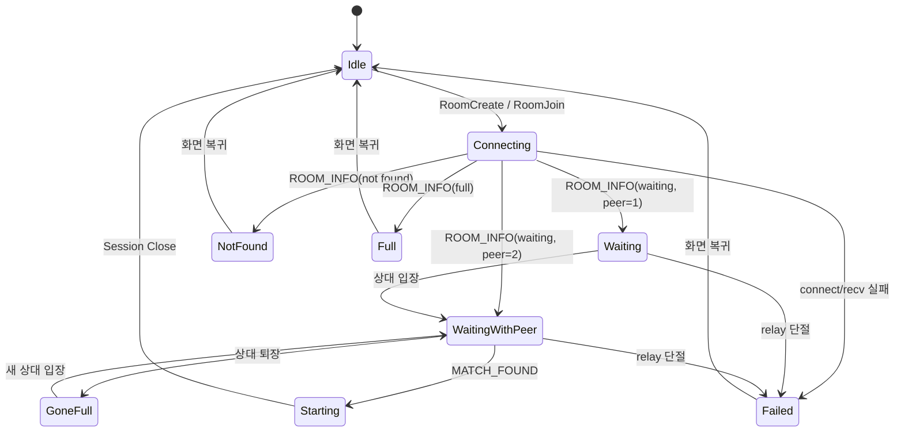
```mermaid
stateDiagram-v2
    [*] --> Idle
    Idle --> Connecting: RoomCreate / RoomJoin
    Connecting --> Waiting: ROOM_INFO(waiting, peer=1)
    Connecting --> WaitingWithPeer: ROOM_INFO(waiting, peer=2)
    Connecting --> NotFound: ROOM_INFO(not found)
    Connecting --> Full: ROOM_INFO(full)
    Waiting --> WaitingWithPeer: 상대 입장
    WaitingWithPeer --> GoneFull: 상대 퇴장
    GoneFull --> WaitingWithPeer: 새 상대 입장
    WaitingWithPeer --> Starting: MATCH_FOUND
    Connecting --> Failed: connect/recv 실패
    Waiting --> Failed: relay 단절
    WaitingWithPeer --> Failed: relay 단절
    Starting --> Idle: Session Close
    NotFound --> Idle: 화면 복귀
    Full --> Idle: 화면 복귀
    Failed --> Idle: 화면 복귀
```

enum 항목의 현재 개수보다 중요한 것은 wire status와 UI 상태가 일대일이 아니라는 사실이다. `waiting` status는 `peer_count`와 결합해야 혼자 기다리는 화면과 READY 화면으로 갈라진다. 새 상태를 추가할 때도 이 매핑과 실패 후 복귀 경로를 함께 바꿔야 한다.

`NotFound`/`Full` 인 경우 서버가 곧 소켓을 닫는다(§8.5). 클라이언트는 별도 처리 없이 다음 recv 에서 EOF 를 받고 `RoomState::Failed` 로 넘어간 뒤 루프를 나간다. 정확한 이유는 그 직전에 세팅된 `NotFound`/`Full` 이므로, UI 는 EOF 를 기다리지 말고 `roomState()` 가 그 두 값이 되는 즉시 메시지를 띄우고 로비로 돌아가야 한다.

함수 마지막의 `if (roomState_.load() != RoomState::Starting)` 는 정상 종료 경로에서만 `Idle` 로 되돌리기 위한 것이다. `MATCH_FOUND` 를 받아 `Starting` 이 된 경우에는 이 분기 자체에 도달하지 않지만(그 앞에서 `return`), 방어적으로 남겨 뒀다.

**`MATCH_FOUND` 이후에도 루프를 계속 돈다.** `break` 하지 않고 남은 프레임을 마저 검사한다. `else if (matchFound)` 브랜치가 그 뒤 프레임을 `recvBuf` 로 옮긴다. 룸 경로에는 수락 로비가 없어서 릴레이가 `MATCH_FOUND` 직후 곧바로 포워딩을 시작하므로, 상대의 첫 게임 프레임이 같은 세그먼트에 실려 올 확률이 큐 경로보다 오히려 높다.

**`ioThread`로의 전환은 인라인이다.** `ready = true; th = std::thread(&Session::ioThread, this);` 두 줄이 전부다. 같은 `Session`이 소켓과 매치메이킹 중 쌓인 `recvBuf`를 계속 소유하므로, 이미 함께 도착한 첫 게임 프레임도 인계 과정에서 잃지 않는다.

### 11.6 `recvBuf` 인계 — 왜 별도의 인계 API 를 쓰지 않는가

`ioThread` 로 넘어가는 대목이 이렇게 밋밋한 데에는 이유가 있다.

**현재 소스 발췌 — `net/session.cpp`**

```cpp
            ready = true;
            th = std::thread(&Session::ioThread, this);
```

한때 이 자리에는 `Session::Adopt(socket, role, seed, ...)` 라는 전용 인계 API 가 있었다. "릴레이가 페어링한 소켓을 통째로 채택하고 HELLO/SEED 핸드셰이크를 생략한다" 는 발상이었고, 이름만 보면 여기 딱 맞는 물건이다.

그런데 그 구현은 **"완전히 새 소켓을 처음부터 채택한다"** 는 전제로 세션 상태를 전부 리셋했고, 거기에 `recvBuf.clear()` 가 들어 있었다.

그게 이 경로에서는 치명적이다. §11.5 에서 본 대로 `MATCH_FOUND` 와 상대의 첫 게임 프레임이 **같은 recv 세그먼트에 함께 실려 오는 일이 흔하다.** 그 프레임들은 이미 `recvBuf` 에 옮겨져 있다. 여기서 `recvBuf` 를 비우면 상대의 첫 `PING` 이나 `INPUT` 이 통째로 사라진다 — lockstep 이 한 틱 멈추거나 링크 상태가 `Stalled` 로 오판된다.

그래서 두 스레드는 인계 API 를 부르는 대신 **필요한 것만** 한다.

| 전용 인계 API 가 하려던 일 | 릴레이 경로의 실제 대응 |
|---|---|
| 세션 상태 전체 리셋 | `QueueJoin`/`RoomCreate`/`RoomJoin` 진입 시 이미 수행했다 |
| `recvBuf.clear()` | **하지 않는다** — 인계된 프레임을 보존해야 한다 |
| `seedParams` 채우기 | `MATCH_FOUND` 파싱 시점에 이미 채웠다 |
| `sock` 대입 | 이미 자기 스레드가 소유 중인 소켓이다 |
| `lastPongMs`/`lastPingSentMs` 초기화 | 그대로 수행한다 |
| `ready = true` + `ioThread` 기동 | 그대로 수행한다 |

전용 인계 API가 하려던 일 가운데 실제 전환 시점에 필요한 것은 heartbeat 초기화와 `ioThread` 기동뿐이다. 나머지는 이미 됐거나, 해서는 안 되는 일이다.

`Adopt` 는 결국 **호출부가 한 곳도 없는 채로 남아 있다가 저장소에서 제거됐다.** "릴레이 인계용" 이라는 이름과 주석을 달고 있었지만 정작 릴레이 경로가 쓸 수 없는 API 였고, 남겨 두면 다음 사람이 "이걸 쓰면 되겠네" 하고 손을 댔다가 위의 `recvBuf` 문제를 다시 만나게 된다. 쓰이지 않는 잘못된 추상화는 없느니만 못하다.

이로써 스트림 소유권 규칙(§6.3)의 전 구간이 연결된다.

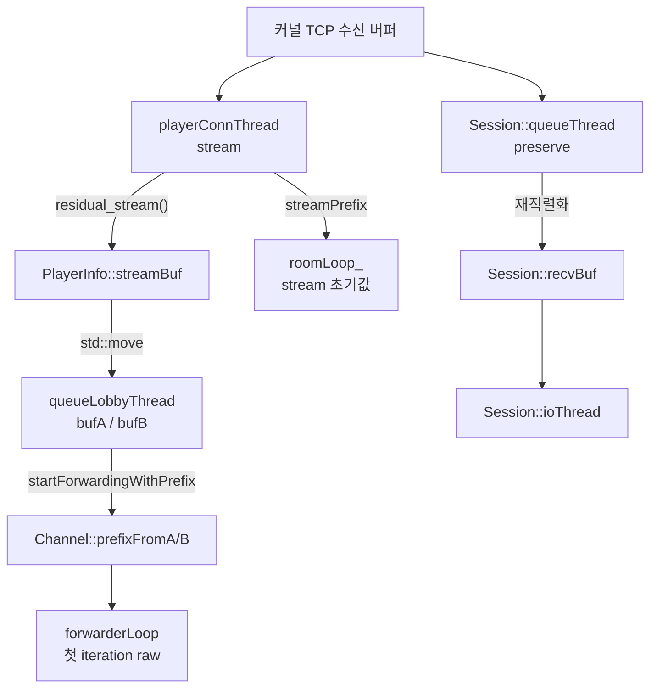
```mermaid
graph TB
    K["커널 TCP 수신 버퍼"]
    PC["playerConnThread<br/>stream"]
    PI["PlayerInfo::streamBuf"]
    LB["queueLobbyThread<br/>bufA / bufB"]
    PX["Channel::prefixFromA/B"]
    FW["forwarderLoop<br/>첫 iteration raw"]
    RL["roomLoop_<br/>stream 초기값"]
    CQ["Session::queueThread<br/>preserve"]
    CR["Session::recvBuf"]
    IO["Session::ioThread"]

    K --> PC
    PC -- "residual_stream()" --> PI
    PC -- "streamPrefix" --> RL
    PI -- "std::move" --> LB
    LB -- "startForwardingWithPrefix" --> PX
    PX --> FW
    K --> CQ
    CQ -- "재직렬화" --> CR
    CR --> IO
```

서버와 클라이언트의 모든 단계 전환이 같은 규칙을 따른다. 어느 한 곳에서 잔여 바이트를 버리면 그 지점에서 lockstep이 조용히 멈춘다.

### 11.7 릴레이 주소는 배포 설정이다

큐와 룸이 사용할 endpoint는 소스의 메뉴 문자열로 정하지 않는다. `TETRIS_DEFAULT_RELAY_ENDPOINT` CMake 값이 배포 바이너리의 기본값이 되고, 실행 시 `TETRIS_RELAY_ENDPOINT` 환경변수, `--relay host[:port]` CLI 순으로 덮어쓴다. 일반 사용자는 주소 입력 화면을 거치지 않고, 배포자나 런처가 환경에 맞는 값을 정한다.

`src/main.cpp`의 `parse_endpoint`가 host 단독 표기, host와 port 조합, bracketed IPv6를 검증한다. 잘못된 CMake 기본값은 loopback 기본으로 돌아가고, 잘못된 환경변수는 직전 값을 유지하며, 잘못된 CLI 값은 실행 오류로 끝난다. 설정 출처마다 실패 정책이 다른 이유는 빌드 기본값과 환경변수에는 안전한 폴백이 있지만 사용자가 명시한 CLI 오타를 조용히 무시하면 다른 서버에 접속할 수 있기 때문이다.

## 12. 메시지 시퀀스

두 경로를 한 번에 본다.

### 12.1 QUEUE 경로

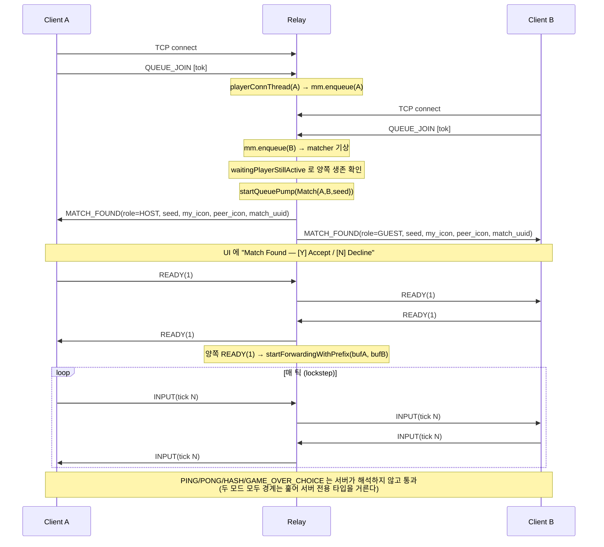
```mermaid
sequenceDiagram
    participant A as Client A
    participant R as Relay
    participant B as Client B

    A->>R: TCP connect
    A->>R: QUEUE_JOIN [tok]
    Note over R: playerConnThread(A) → mm.enqueue(A)
    B->>R: TCP connect
    B->>R: QUEUE_JOIN [tok]
    Note over R: mm.enqueue(B) → matcher 기상
    Note over R: waitingPlayerStillActive 로 양쪽 생존 확인
    Note over R: startQueuePump(Match{A,B,seed})
    R->>A: MATCH_FOUND(role=HOST, seed, my_icon, peer_icon, match_uuid)
    R->>B: MATCH_FOUND(role=GUEST, seed, my_icon, peer_icon, match_uuid)
    Note over A,B: UI 에 "Match Found — [Y] Accept / [N] Decline"
    A->>R: READY(1)
    R->>B: READY(1)
    B->>R: READY(1)
    R->>A: READY(1)
    Note over R: 양쪽 READY(1) → startForwardingWithPrefix(bufA, bufB)
    loop 매 틱 (lockstep)
        A->>R: INPUT(tick N)
        R->>B: INPUT(tick N)
        B->>R: INPUT(tick N)
        R->>A: INPUT(tick N)
    end
    Note over A,B: PING/PONG/HASH/GAME_OVER_CHOICE 는 서버가 해석하지 않고 통과<br/>(두 모드 모두 경계는 훑어 서버 전용 타입을 거른다)
```

**수락 로비가 큐 경로에만 있는 이유.** 랜덤 매칭은 서로 모르는 사람을 붙이는 것이라 "매치가 잡혔으니 바로 시작" 은 불친절하다. 자리를 비운 사이 매칭돼 그대로 패배하는 경험을 막는다. 커스텀 룸은 이미 자체 READY 교환 단계가 있으므로 이 로비를 거치지 않고 `startPump` 로 곧장 들어간다.

- 클라이언트는 `MATCH_FOUND` 수신 후 `Session::isQueueMatched()` 로 로비 진입을 감지하고 수락 UI 를 띄운다.
- `QueueConfirm()` → `READY(1)` 송신. 릴레이가 상대에게 그대로 forward 하므로 상대 화면의 "Opponent: READY" 가 즉시 갱신된다.
- 한쪽이 `READY(0)`/`QUEUE_CANCEL` 을 보내거나 30초가 지나면 양 소켓을 닫는다. 양쪽 모두 "Matchmaking Failed" 로 메뉴에 복귀한다.

### 12.2 ROOM 경로

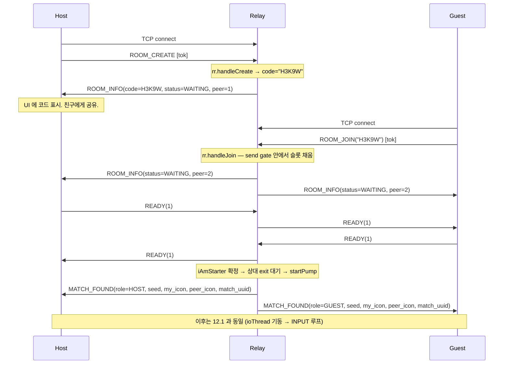
```mermaid
sequenceDiagram
    participant H as Host
    participant R as Relay
    participant G as Guest

    H->>R: TCP connect
    H->>R: ROOM_CREATE [tok]
    Note over R: rr.handleCreate → code="H3K9W"
    R->>H: ROOM_INFO(code=H3K9W, status=WAITING, peer=1)
    Note over H: UI 에 코드 표시. 친구에게 공유.
    G->>R: TCP connect
    G->>R: ROOM_JOIN("H3K9W") [tok]
    Note over R: rr.handleJoin — send gate 안에서 슬롯 채움
    R->>H: ROOM_INFO(status=WAITING, peer=2)
    R->>G: ROOM_INFO(status=WAITING, peer=2)
    H->>R: READY(1)
    R->>G: READY(1)
    G->>R: READY(1)
    R->>H: READY(1)
    Note over R: iAmStarter 확정 → 상대 exit 대기 → startPump
    R->>H: MATCH_FOUND(role=HOST, seed, my_icon, peer_icon, match_uuid)
    R->>G: MATCH_FOUND(role=GUEST, seed, my_icon, peer_icon, match_uuid)
    Note over H,G: 이후는 12.1 과 동일 (ioThread 기동 → INPUT 루프)
```

`ROOM_INFO` status 값의 UI 대응은 이렇다.

| status | 트리거 | 클라이언트 `RoomState` |
|--------|--------|------|
| 0 WAITING (peer=1) | 방 생성 · 상대 퇴장 후 재대기 | `Waiting` |
| 0 WAITING (peer=2) | 상대 입장 | `WaitingWithPeer` |
| 1 FULL | 세 번째 접속자가 JOIN 시도 | `Full` |
| 2 NOT_FOUND | 없는 코드로 JOIN | `NotFound` |
| 3 GONE_FULL | 상대 퇴장 | `GoneFull` |

## 13. 동시성 상수와 백프레셔 경계

### 13.1 동기화 자원은 어떤 상태를 지키는가

현재 릴레이의 동기화 자원은 수명 범위가 서로 다른 상태를 지킨다. 새 공유 상태를 추가할 때는 기존 뮤텍스에 얹기보다 어느 행과 같은 수명을 갖는지부터 정한다.

| 자원 | 보호 대상 | 경합 범위 |
|---|---|---|
| `Matchmaker::mu` + `cv` | 대기 큐 `deque` | 전역 (큐 전체) |
| `RoomRegistry::mu` + `cv` | `rooms` 맵과 모든 `Entry` | 전역 (모든 방) |
| `RoomRegistry::roomSendMu_[64]` | 방별 송신 순서 | 코드 해시 shard |
| `Channel::sumMu` | `summaryA/B`, `summaryHandled` | 매치 단위 |
| `Channel::sendMuA` / `sendMuB` | 목적지 소켓 쓰기 | 소켓 단위 |
| `WorkerGroup::mu_` + `cv_` | 활성 워커 수 | 그룹 단위 |
| `IpAdmission::mu_` | IP별 핸드셰이크 수와 세션 수 | 프로세스 단위. 핸드셰이크 슬롯은 인증까지, 세션 슬롯은 연결이 죽을 때까지 |
| `s_auth_cache_mu` | 성공한 token verify 캐시 | 프로세스 단위 |
| `PlayerSessionLease::mu_` | 활성 ranked `player_id` 집합 | 프로세스 단위 |

이 구조의 장점은 각 뮤텍스가 지키는 불변조건이 짧다는 점이다. 방 상태에는 §8.1의 gate → state mu 순서가 있고, 매치가 성립한 뒤의 데이터 경로는 주로 해당 `Channel`만 만진다. 단, 활성 계정 lease는 프로세스 전역이므로 입장 순간에는 짧은 전역 임계구역을 지난다.

단점은 두 가지다. 첫째, `RoomRegistry::mu` 는 여전히 전역이라 방 수가 많아지면 `roomLoop_` 들의 10ms 폴링이 모두 이 락을 두드린다. 둘째, 잠금 순서 규칙을 사람이 지켜야 한다. 새 코드가 `mu` 를 잡은 채 `sendRoomFrame_` 를 부르면 즉시 데드락이다.

**대안은 방별 outbound 큐 + 단일 writer 다.** 각 방에 송신 큐를 두고 전용 writer 스레드(또는 이벤트 루프)가 그 큐만 비운다. 그러면 송신 게이트가 아예 없어지고, "프레임 순서" 는 큐 순서로 자동 보장된다. 비용은 이렇다.

- 방마다 스레드를 두면 스레드 수가 폭발한다. 이벤트 루프(epoll/IOCP)로 가면 지금의 "스레드당 하나의 소켓, 블로킹 코드" 라는 단순함을 통째로 버려야 한다.
- 큐를 거치므로 송신에 한 단계 지연이 추가된다. lockstep 에서는 이 지연이 그대로 체감 입력 지연이다.
- 큐가 무한하면 느린 클라이언트가 메모리를 먹고, 유한하면 넘칠 때 무엇을 버릴지 정책이 필요하다.

수백 명 목표에서는 현재 구조가 단순하고 지연도 낮다. 동시 매치가 worker/thread 예산을 지속적으로 압박하기 시작하면 방별 스레드를 늘리기보다 epoll·kqueue·IOCP 기반 이벤트 루프로 전환할 시점이다. 그 전환을 실제로 수행하고 — 무엇이 사라지고 무엇을 새로 지켜야 하는지까지 — 다루는 것이 [Part 14](./part14-event-loop-scaling.md) 다.

### 13.2 자원 상한 표

릴레이가 실제로 강제하는 경계를 한자리에 모아둔다. 대부분은 상수이고, per-IP 세션 예산만 운영자가 `--max-sessions-per-ip` 로 조절한다 — 한 공인 주소를 정당하게 공유하는 배포가 실제로 존재하기 때문이다.

| 상수 | 값 | 위치 | 막는 것 |
|---|---|---|---|
| `kMaxConnWorkers` | 256 | `server/main.cpp` | connect 플러딩으로 인한 스레드/핸들 고갈 |
| `kMaxHandshakesPerIp` | 16 | `server/ip_admission.h` | 한 IP가 *인증 중인* 연결로 입장 경로를 독점하는 공격 |
| `kMaxSessionsPerIp` | 64 (기본값, `--max-sessions-per-ip`) | `server/ip_admission.h` | accept부터 최종 반납까지 한 IP의 동시 세션 점유 |
| `kMaxRelayWorkers` | 512 | `server/relay.cpp` | 로비/포워더 스레드 무한 생성 |
| `kJoinTimeout` | 5초 | `server/player_conn.cpp` | 첫 프레임을 안 보내는 연결 점유 |
| `kMaxCodeLen` | 5 | `server/player_conn.cpp` | 과대 룸 코드로 인한 로그 오염·조회 비용 |
| `kConfirmTimeout` | 30초 | `server/relay.cpp` | 수락 로비 무한 대기 |
| `kMaxLobbyBufBytes` | 64 KiB | `server/relay.cpp` | 로비 단계 메모리 소모 공격 |
| `net::kMaxPayloadBytes` | 4096 | `net/framing.h` | 손상/악성 `LEN` 버퍼링 — framing·로비·포워더 파서가 공유 |
| `kMaxBytesPerSecond` (방향별) | 64 KiB/s | `server/relay.cpp` | 성립된 매치의 대역폭·상대 CPU 소모 공격 |
| `kIdleTimeout` (방향별) | 15초 | `server/relay.cpp` | 반쪽 열린 연결과 사라진 모바일 peer 점유 |
| `kRoomGuestWaitTimeout` | 15분 | `server/room.cpp` | 게스트 없는 방의 워커·lease 무기한 점유 |
| `kRoomReadyTimeout` | 60초 | `server/room.cpp` | 만석인데 READY 없는 방 점유 |
| `kRoomSendShardCount` | 64 | `server/room.h` | 송신 게이트 뮤텍스 수 (전역 병목 회피) |
| 룸 폴링 간격 | 10ms | `server/room.cpp` | 대기실 CPU 사용 |
| 포워더 idle 슬립 | 1ms | `server/relay.cpp` | 바쁜 대기 |
| 클라 큐 대기 | 5분 | `net/session.cpp` | 상대 없는 큐 무한 대기 |
| 클라 로비 대기 | 45초 | `net/session.cpp` | 서버 30초보다 길게 — 판정은 서버가 |

프레임 크기와 전송률은 서로 다른 경계다. 4KB 이하 프레임도 회선 속도로 반복하면 릴레이 대역폭과 상대 CPU를 소모시킬 수 있으므로 `forwarderLoop`가 방향별 1초 창에서 받은 raw byte를 합산한다. 64KiB를 넘긴 방향은 공격 또는 고장으로 보고 끊는다. 정상 60Hz INPUT/PING/CHAT 트래픽에는 넉넉하지만 파일 전송용 프로토콜로 확장할 때는 메시지 종류별 token bucket으로 바꿔야 한다.

**예산의 단위를 구분한다.** 동시 핸드셰이크16은 지금 입장 처리 중인 수이고,
초당16회라는 뜻이 아니다. 세션64는 인증 전후를 통틀어 같은 IP가 붙들 수 있는 소유
슬롯 수다. 핸드셰이크를 빨리 끝내는 접속은 짧은 시간에 여러 번 이 예산을 재사용할 수
있으므로 요청 빈도·CPU 작업량은 별도 정책으로 제한해야 한다. NAT 뒤 정상 사용자도
하나의 IP 예산을 공유하며, 여러 IP를 쓰는 행위자는 여러 예산을 얻을 수 있다.

**연결 워커 수와 연결 수는 다르다.** 큐에 들어간 연결은 연결 워커가 반환한 뒤에도
살아 있다. 방 reader, 수락 로비, 게임 포워더도 각각 다른 수명을 가진다.512 relay
워커만 보고 프로세스 전체의 연결 수가512라고 계산하지 않는다. 대기 큐에는 별도로
kMaxWaiting=1024 상한이 있으며 Reactor의 --max-conns는 또 다른 계수 범위를 가진다.

**상한에 걸린 연결에 사유를 알려 주는가**는 바이너리마다 다르다. 이 장의 `tetris_relay` 는 소켓을 그냥 닫는다. 실제 배포 대상인 이벤트 루프 릴레이는 닫기 직전에 `SERVER_REJECT`(타입 21) 프레임으로 사유 코드를 먼저 내려보내고, 프로세스 전체 예산 몇 가지를 더 갖는다 — 그 계약과 근거는 [Part 6](./part6-lockstep-networking.md) 과 [Part 14](./part14-event-loop-scaling.md) 에 있다. 이 표는 threaded relay의 해당 상수를 기준으로 읽는다. 공유 헤더의 제한과 구현별 전송률·타이머·큐 예산은 구별해야 하며, 이벤트 루프 배포 옵션은 그 구현의 정의와 함께 확인한다.

TCP keepalive도 모든 accept/connect 소켓에 켠다. POSIX에서는 idle 15초, probe 간격 5초, 3회 실패를 요청한다. Windows는 기본 KeepAliveTime이 2시간이라 `SO_KEEPALIVE`만으로는 "FIN/RST 없이 사라진 peer 감지"가 사실상 동작하지 않으므로, `SIO_KEEPALIVE_VALS`로 같은 15초/5초를 명시해 두 플랫폼의 감지 시간을 맞춘다. 실제 감지 순서는 OS 타이머와 애플리케이션 스케줄링에 따라 달라진다. 포워더의15초 무활동 정책은 경기 대기의 허용 시간을 정한다. keepalive는 NAT·커널 수준의 죽은 연결 회수이고 애플리케이션 제한은 매치 정책이므로 둘은 대체 관계가 아니다.

### 13.3 인증 중복, meta 장애, 갑작스러운 단절

랭크 매치 입장은 인증 성공 뒤 `PlayerSessionLease::acquire(player_id)`를 얻어야 한다. lease는 큐, 룸, `Channel`로 이동하고 매치가 완전히 끝날 때 해제된다. 같은 토큰을 여러 창에서 동시에 써서 자기 자신과 매칭하거나 결과를 중복 생성하려는 시도는 두 번째 활성 세션 단계에서 거절된다. unranked의 `player_id=0`은 계정 식별자가 아니므로 이 제한을 받지 않는다. 구현은 이 장이 새로 만드는 헤더 전용 파일 하나가 전부다.

**현재 소스 발췌 — `server/player_session.h`**

```cpp
// A ranked player_id may own only one live lease.
class PlayerSessionLease {
public:
    static std::shared_ptr<PlayerSessionLease> acquire(int64_t player_id)
    {
        if (player_id <= 0) return {};
        // An unregistered candidate can be destroyed without touching active_.
        // Allocate its object/control block before committing the set entry.
        auto candidate = std::shared_ptr<PlayerSessionLease>(
            new PlayerSessionLease(player_id));
        std::lock_guard<std::mutex> lk(mu_);
        if (!active_.insert(player_id).second) return {};
        candidate->registered_ = true;
        return candidate;
    }

    ~PlayerSessionLease()
    {
        if (!registered_) return;
        std::lock_guard<std::mutex> lk(mu_);
        active_.erase(player_id_);
    }

    PlayerSessionLease(const PlayerSessionLease&) = delete;
    PlayerSessionLease& operator=(const PlayerSessionLease&) = delete;

private:
    explicit PlayerSessionLease(int64_t player_id) : player_id_(player_id) {}

    int64_t player_id_;
    bool registered_ = false;
    inline static std::mutex mu_;
    inline static std::unordered_set<int64_t> active_;
};
```

객체와 shared_ptr 제어 블록을 먼저 만든 뒤 집합에 insert한다. 등록 성공 때만 registered_를 세우고 소유 핸들을 반환한다. 미등록 후보의 소멸자는 집합을 건드리지 않으므로, 중복 요청이나 할당 실패가 다른 참가자의 등록을 지우지 않는다. 마지막 등록 소유자의 소멸자가 집합에서 지운다. `player_id <= 0`(unranked) 은 빈 `shared_ptr` 를 돌려주는데, §6 의 `authenticate` 는 meta 미연동일 때 lease 검사를 아예 하지 않으므로 unranked 입장은 막히지 않는다.

현재 relay는 오프라인 인증 캐시를 사용하지 않는다. 60초·1회용 입장권을 meta에서
원자적으로 소비해야 한다. meta 장애를 최근 인증 기록으로 우회하면 폐기된 키와 사용한
입장권이 다시 통과할 수 있기 때문이다. 세션 lease는 이미 승인한 계정의 동시 입장을
제한하며 인증의 대체 수단이 아니다.

**단절은 판정 근거가 아니라 결과 확정의 계기다.** 마지막 포워더는 소켓을 닫기 전에
`finalizeForfeit`를 호출한다. 이름은 호환상 남았지만 먼저 끊긴 쪽을 패자로 정하지 않는다.
요약의 유무와 관계없이 공통 `RankedGame`이 이미 끝까지 계산한 결과만 사용한다.

**현재 소스 발췌 — `server/relay.cpp`**

```cpp
void finalizeForfeit(Channel& ch, int disconnectSide)
{
    (void)disconnectSide;
    if (!ch.meta || !ch.verified) return;
    {
        std::lock_guard<std::mutex> lock(ch.sumMu);
        if (ch.summaryHandled) return;
        // Finalization no longer uses any fields from a client's summary.
        if (!ch.summaryA) ch.summaryA = Summary{};
        if (!ch.summaryB) ch.summaryB = Summary{};
    }
    finalizeRanked(ch);
}
```

- 종료 입력을 받은 뒤 한쪽이 요약 없이 나가도 서버가 승패를 재현했다면 저장한다.
- 입력이 없거나 아직 종료되지 않은 경기에는 RP/BP/XP를 주지 않는다.
- 입력 변조가 발견되면 해당 경기 전체를 보상에서 제외한다.
- 서버 자체 종료는 운영 작업을 기권으로 보지 않고 기존 종료 drain을 따른다.

요약 두 장이 일치하거나 남아 있는 사람이 승리를 주장하는 것은 실제 승리의 증명이
아니다. Part 18은 자기 신고 대신 규칙을 재현하는 공통 검증기와 입력 제한을 설명한다.
모든 저장 경로는 같은 UUID를 사용해 meta의 중복 지급 차단에 연결한다.

**현재 소스 발췌 — `server/match_uuid.h`**

```cpp
// Unique result key; it is an identifier, not an authentication secret.
inline std::string new_match_uuid()
{
    static std::atomic<uint64_t> counter{1};
    static const uint64_t boot_random = [] {
        std::random_device rd;
        uint64_t v = (static_cast<uint64_t>(rd()) << 32) ^ rd();
        return v ? v : 0x9e3779b97f4a7c15ULL;
    }();

    const uint64_t now = static_cast<uint64_t>(
        std::chrono::high_resolution_clock::now().time_since_epoch().count());
    uint64_t a = now ^ boot_random ^ counter.fetch_add(1, std::memory_order_relaxed);
    uint64_t b = a + 0x9e3779b97f4a7c15ULL;
    auto mix = [](uint64_t x) {
        x ^= x >> 30; x *= 0xbf58476d1ce4e5b9ULL;
        x ^= x >> 27; x *= 0x94d049bb133111ebULL;
        return x ^ (x >> 31);
    };
    a = mix(a);
    b = mix(b ^ boot_random);

    char out[33];
    std::snprintf(out, sizeof(out), "%016llx%016llx",
                  static_cast<unsigned long long>(a),
                  static_cast<unsigned long long>(b));
    return std::string(out, 32);
}
```

부팅 난수·고해상도 시각·단조 카운터를 섞어 32자리 hex 키를 만든다. 재시작 간 중복 가능성을 낮추려는 설계이며, 저장소의 unique 제약과 충돌 처리는 계속 필요하다. 첫 줄 주석이 위협 모델을 못 박는다 — 이 값은 **식별자이지 인증 비밀이 아니다**. `MATCH_FOUND` 로 양쪽 클라이언트에 공개되므로 예측 불가능성이 보안 속성일 필요가 없고, 요구 속성은 유일성뿐이다. 룸 코드(§8.2)는 방을 찾는 짧은 주소다. 현재 입장 규약에서 코드 추측이 접근으로 이어질 수 있으므로 난수원·추측 예산을 적용하지만, 강한 인증 토큰으로 취급하지 않는다.

### 13.4 지연

릴레이는 홉을 하나 늘린다. 추가 지연은 릴레이 위치와 네트워크 경로에 좌우되므로 문서에 고정 수치를 박지 않는다. 대신 조정 가능한 손잡이가 어디 있는지만 기록한다.

- Part 6 의 lockstep 은 `inputDelay` 로 지터 여유를 둔다. 릴레이 경로에서 이 값은 `Session::QueueJoin`/`RoomCreate`/`RoomJoin` 의 `input_delay` 인자로 들어가 `SeedParams` 에 실린다. 기본 2틱(약 33ms)이다.
- 운영 지역이 정해지면 실제 RTT 를 측정해 이 기본값을 조정한다. `PING`/`PONG` 왕복 시간이 그 측정치다.
- 결정론을 깨지 않는 것이 지연 몇 밀리초보다 훨씬 큰 이득이다. 지연을 줄이려고 입력을 추측 적용하는 순간 롤백 구현이 필요해진다.

## 14. 메타 통합 경계

현재 릴레이는 영속 DB를 소유하지 않는 **선택적 릴레이**이며, 랭크 채널에는 결정론적 게임 시뮬레이션을 둔다. 대부분의 게임 프레임은 해석하지 않고 전달하지만, 입장 시에는 인증 결과와 계정 lease를 보고, 포워딩 중에는 타입 바이트만 보아 서버 전용 프레임을 거르며, ranked INPUT은 원본으로 전달하면서 검증기에 기록하고, 종료 신고 시 서버 결과를 저장한다. 따라서 “완전한 투명 프록시”가 아니라 “영속 상태가 없는 서버 권위 경계”로 이해해야 한다.

별도 `tetris_meta` HTTP+SQLite 서버가 토큰 인증과 RP 갱신을 맡는다. relay는 아래 두 지점에서만 meta와 통신하며 DB 파일이나 RP 수식을 소유하지 않는다.

1. `QUEUE_JOIN`/`ROOM_CREATE`/`ROOM_JOIN`의 입장권을 `authenticate()`가 meta에서 한 번 소비해 ID·RP·닉네임·아이콘을 얻는다. `--meta` 없는 연습 relay만 이 경로를 건너뛴다.
2. `forwarderLoop` 이 ranked 매치(meta 연동 + 양쪽 `player_id != 0`)일 때만 `MATCH_SUMMARY` 를 가로챈다. 양쪽이 모두 도착하면 `finalizeRanked`가 서버의 완결된 시뮬레이션 결과를 `/v1/matches`로 POST 하고 `MATCH_RESULT` 를 두 클라이언트에 보낸다.

`post_match`는 relay가 생성한 32자리 소문자 hex `match_uuid`를 총 세 번의 시도(일시 오류 시 최대 두 번 재시도)에서 그대로 쓰고, 재시도를 포함한 전체 블로킹 시간은 wall-clock 예산으로 상한된다 — 어차피 멱등 재전송이 안전하므로 매치 종료 흐름을 오래 붙잡을 이유가 없다. meta의 unique index와 결과 스냅샷이 같은 UUID의 두 번째 요청을 기존 응답으로 바꾸므로 RP가 두 번 반영되지 않는다. DB와 RP 계산은 meta 쪽에 격리되고, relay에는 `forwarderLoop`의 selective passthrough와 `finalizeRanked`/`finalizeForfeit`만 남는다.

## 이 장에서 완성된 것

- `tetris_relay` 단일 바이너리 — 포트 하나로 매치메이킹 + 룸 코드 + 선택적 게임 프레임 전달.
- `WorkerGroup` — detached 워커의 상한·예외 격리·drain, 그리고 이를 검증하는 `worker_group_test`.
- `Matchmaker` FIFO 큐. 페어링 **전에** `waitingPlayerStillActive` 로 EOF/취소/손상 프레임을 걸러낸다.
- `RoomRegistry` — base32 5자 초대 코드 발급, 대기실 루프, READY 동기, CHAT 포워딩, `iAmStarter` 를 통한 룸 → 매치 인계.
- 동시 나가기 레이스의 세 겹 방어 — owning handle, `roomInfoVersion`, 방별 송신 게이트.
- `queueLobbyThread` 의 수락 로비와 한-프레임-씩 파싱, `Channel::prefixFromA/B` 로의 잔여 바이트 이관.
- `forwarderLoop` 양방향 전달. 두 모드 모두 프레임 경계를 훑어 클라이언트가 위조한 서버 전용 타입(`net::is_server_only_type`)을 버리고, ranked는 `INPUT`·`SEED`를 검증기에 관측시키고 `MATCH_SUMMARY`를 종료 요청으로 가로챈다. 통과한 프레임은 원본 바이트 그대로 전달.
- 클라이언트 측 릴레이 경로 전부 — `QueueJoin`/`QueueCancel`/`QueueConfirm`/ `QueueDecline`/`RoomCreate`/`RoomJoin`/`RoomSendReady`/`RoomLeave` 와 `queueThread`/`roomThread`, 그리고 `recvBuf` 인계.
- 단계 전환 시 잔여 TCP 바이트를 잃지 않는 스트림 소유권 규칙 — 서버와 클라이언트의 모든 인계 지점에 동일 적용.
- IP별 입장 제한, 5초 첫 프레임 제한, TCP keepalive(양 플랫폼 15초/5초 정합), 방향별 15초 idle·64KiB/s 제한.
- 룸 수명 데드라인 — 게스트 대기 15분·READY 60초 초과 시 `gonefull` 통지 후 방 정리, 떠나는 쪽 세션 lease 즉시 해제.
- 계정별 단일 활성 session lease(`server/player_session.h`), meta에서의 일회용 입장권 소비, 서버 입력에 근거한 결과 판정, `match_uuid`(`server/match_uuid.h`) 기반 멱등 저장.

## 수동 테스트

### 빌드

```bash
cmake -S . -B build -DTETRIS_BUILD_GAME=OFF -DTETRIS_BUILD_RELAY=ON -DTETRIS_BUILD_TEST=ON
cmake --build build --target tetris_relay worker_group_test
```

게임 클라이언트까지 함께 쓰려면 `-DTETRIS_BUILD_GAME=ON` 으로 다시 구성하고 `--target tetris` 를 추가한다. Visual Studio 같은 multi-config 제너레이터에서는 산출물이 `build/Release/tetris_relay.exe` 에 놓이고 `--config Release` 가 필요하다. Makefiles/Ninja 에서는 `--config` 가 무시되며 산출물은 `build/tetris_relay` 다. **두 경로를 섞어 쓰지 않는다.**

### 1. WorkerGroup 회귀

```bash
./build/worker_group_test && echo "WorkerGroup OK"
```

기대 결과: stderr 에 `worker limit reached (1)` 과 `worker failed: expected` 두 줄이 찍히고 종료 코드 0, `WorkerGroup OK` 출력.

### 2. relay / room smoke — 포트는 7788 고정

`python/tests/test_relay_smoke.py` 과 `test_room_smoke.py` 는 `RELAY_PORT = 7788` 하드코딩이다. 다른 포트로 띄우면 테스트가 실패하지 않고 조용히 skip 된다.

```bash
cmake -S . -B build -DTETRIS_BUILD_GAME=OFF -DTETRIS_BUILD_RELAY=ON
cmake --build build --target tetris_relay
./build/tetris_relay --port 7788 &
sleep 1
uv run python -m pytest python/tests/test_relay_smoke.py \
                       python/tests/test_room_smoke.py -q
kill %1
```

기대 결과: queue와 room 시나리오가 skip 없이 모두 통과한다. `-rs`를 붙여 바이너리 탐색 실패가 skip으로 숨지 않았는지 확인한다.

두 테스트가 검증하는 것은 이렇다. `test_relay_smoke.py` 는 소켓 두 개로 `QUEUE_JOIN` 을 보내 양쪽이 **같은 seed** 와 서로 다른 role(HOST/GUEST)의 `MATCH_FOUND` 를 받는지 본다. `test_room_smoke.py` 는 A 가 `ROOM_CREATE` 로 받은 코드를 B 가 `ROOM_JOIN` 하고, 양쪽 `READY` 후 `MATCH_FOUND` 가 나오는지 본다. 즉 이 장의 두 경로가 모두 덮인다.

### 3. 서버 로그로 흐름 확인

```bash
./build/tetris_relay --port 7788
```

모든 줄 앞에는 UTC 타임스탬프와 레벨 문자가 붙는다. 아래에서는 그 접두를 생략하고 본문만 적는다.

```text
[relay] meta=none (unranked mode)
[relay] per-IP limits: handshakes=16 sessions=64
[relay] listening on 0.0.0.0:7788
[relay] local IP: 192.168.x.y
[relay] Ctrl+C to stop
```

두 클라이언트가 붙으면 대략 이런 로그가 나온다.

```text
[conn 1] QUEUE_JOIN unranked (no meta)
[conn 1] QUEUE_JOIN -> queued
[conn 2] QUEUE_JOIN unranked (no meta)
[conn 2] QUEUE_JOIN -> queued
[relay] match=1 queue lobby accepted, starting forwarders
[relay] match forwarding id=1 HOST=conn1 (pid=0 elo=0) GUEST=conn2 (pid=0 elo=0) seed=0x...
```

**`accept conn=N` 줄이 안 보이는 것이 정상이다.** 접속 하나하나는 debug 레벨이라 기본 `info` 에서는 나오지 않는다. 접속까지 보려면 이벤트 루프 릴레이에서 `--log-level debug` 를 준다(스레드 모델은 아직 이 인자를 노출하지 않아 기본 레벨로 고정돼 있다). **한산할 때는 모든 줄을 보고 싶고 붐빌 때는 드문 사건만 보고 싶다** — 레벨을 나누는 이유가 이것이고, 그래서 접속은 debug 로, 거절과 종료는 info 로 갈라져 있다.

한쪽이 종료하면 다음 세 줄로 정리된다.

```text
[relay] match=1 uuid=<32hex> player_id=0 x 0 A->B end
[relay] match=1 uuid=<32hex> player_id=0 x 0 B->A end
[relay] match=1 uuid=<32hex> player_id=0 x 0 closed
```

`uuid=` 와 `player_id=` 가 붙어 있는 것이 핵심이다. 같은 `match_uuid` 로 meta 의 경기 기록을 조회할 수 있으므로, "이 사람이 이 시각에 왜 끊겼는가" 라는 문의를 릴레이 로그에서 DB 까지 한 키로 따라갈 수 있다. **로그의 값어치는 줄 수가 아니라 다른 시스템과 이어 붙일 수 있는 키의 유무에서 나온다.**

### 4. 게임 클라이언트로 QUEUE 경로

게임까지 빌드했다면 셸 두 개에서:

```bash
./build/tetris --queue 127.0.0.1:7788
./build/tetris --queue 127.0.0.1:7788
```

기대 결과: 양쪽에 "Match Found" 수락 UI 가 뜨고, 둘 다 수락하면 같은 seed 로 게임이 시작된다. 한쪽만 수락하고 30초를 넘기면 양쪽 모두 메뉴로 돌아온다.

### 5. 게임 클라이언트로 ROOM 경로

```bash
./build/tetris --relay 127.0.0.1:7788
```

호스트는 메뉴에서 `Custom Room Multi` → `Create Room` 으로 들어가 표시된 5자리 코드를 확인한다. 게스트도 같은 릴레이 주소로 실행해 `Custom Room Multi` → `Join Room` 에서 그 코드를 입력한다. 양쪽 화면의 peer count 가 2로 갱신되고, 둘 다 READY 를 켜면 매치가 시작된다.

### 6. 실패 시나리오

| 시나리오 | 기대 동작 |
|---|---|
| 존재하지 않는 코드로 Join (`ZZZZZ`) | `ROOM_INFO(status=NOT_FOUND)` 수신 → `RoomState::NotFound` → 에러 표시 후 로비 복귀 |
| 꽉 찬 방에 세 번째가 Join | `ROOM_INFO(status=FULL, peer=2)` → `RoomState::Full` |
| 대기실에서 한쪽이 창 닫기 | 남은 쪽이 `ROOM_INFO(status=GONE_FULL, peer=1)` 수신, 방에 그대로 남음 |
| 큐 대기 중 취소 | `QUEUE_CANCEL` 송신 → 서버 로그에 `cancelled queue`, 큐에서 제거 |
| 수락 로비에서 거절 | 상대에게 `READY(0)` 이 forward 되어 "상대 거절" 로 표시 (EOF 가 아님) |
| 릴레이에 `Ctrl+C` | 진행 중 매치의 양 소켓이 닫히고, 클라이언트는 링크 단절로 처리 |

### 7. 봇과 릴레이의 현재 경계

현재 봇은 `Single vs Bot` 의 인프로세스 휴리스틱/ONNX 경로이며 릴레이에 접속하지 않는다. `python/netbot/` 에는 wire 테스트용 framing, 입력 전개, ONNX export 만 남아 있다. 온라인 봇을 다시 붙이려면 `MATCH_FOUND`/`READY`, ranked 토큰, `MATCH_SUMMARY`/`MATCH_RESULT` 까지 모두 구현해야 한다.
