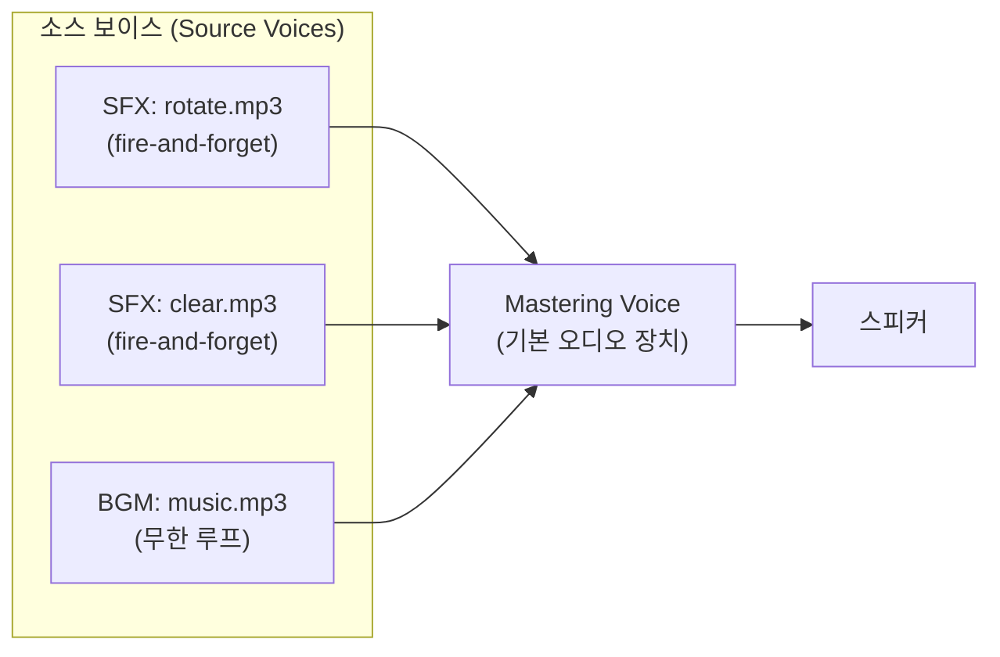
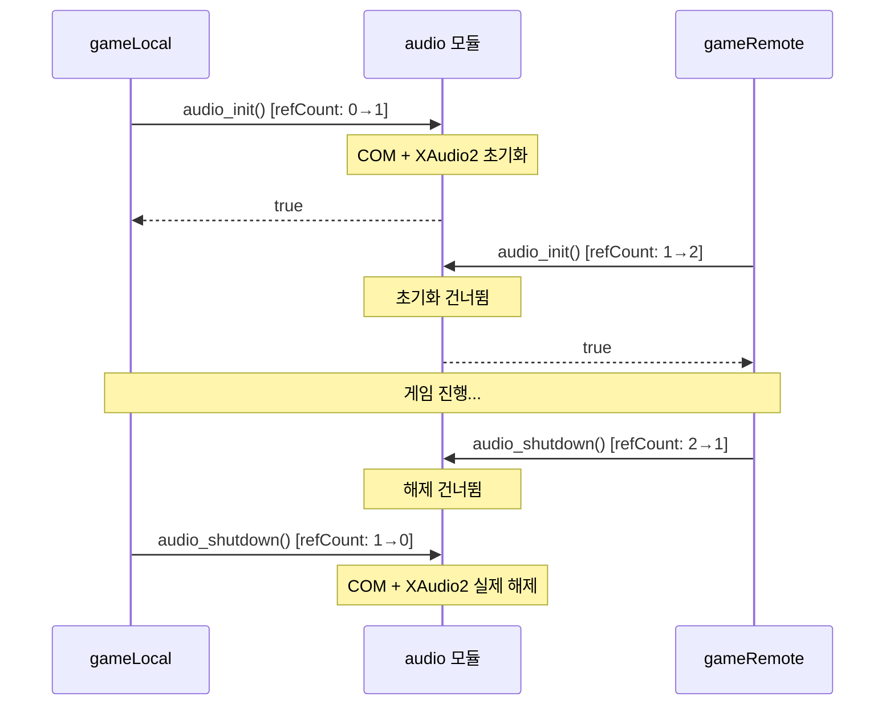
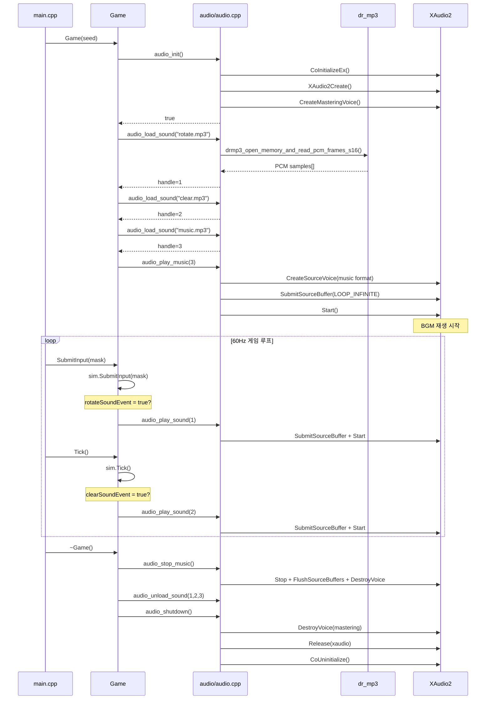

# Part 7: 소리 내기 -- XAudio2로 게임 오디오 구현

> **시리즈:** 제로부터 멀티플레이어 테트리스 + RL까지
> [Part 1: 윈도우와 OpenGL](./part1-window-and-opengl.md) | [Part 2: 2D 렌더링](./part2-2d-rendering.md) | [Part 3: 테트리스 로직](./part3-tetris-logic.md) | [Part 4: 게임 루프](./part4-game-loop.md) | [Part 5: 네트워킹](./part5-lockstep-networking.md) | [Part 6: Python RL](./part6-python-rl.md) | **Part 7**

---

## 들어가며

raylib에서 소리를 재생하는 코드는 세 줄이다:

```cpp
InitAudioDevice();
Sound rotate = LoadSound("Sounds/rotate.mp3");
PlaySound(rotate);
```

이 세 줄이 실제로 하는 일은 다음과 같다:

1. OS의 오디오 하드웨어에 접근하기 위해 COM을 초기화하고
2. MP3 바이너리를 PCM 샘플로 디코딩하고
3. 디코딩된 PCM 데이터를 오디오 그래프의 소스 보이스에 제출하여 스피커로 출력한다

raylib의 내부에서는 [miniaudio](https://miniaud.io/)라는 단일 헤더 라이브러리가 이 과정을 처리한다. miniaudio는 다시 플랫폼별 오디오 백엔드(Windows: WASAPI, macOS: Core Audio, Linux: PulseAudio/ALSA)를 추상화한다. 결국 `InitAudioDevice()` 한 줄은 OS의 오디오 서브시스템 전체를 초기화하는 것이다.

이 글에서는 Windows의 네이티브 오디오 API인 **XAudio2**를 직접 사용하여 같은 기능을 구현한다. Part 1에서 `InitWindow()`를 Win32 API로 풀어냈듯, 여기서는 `InitAudioDevice()` + `LoadSound()` + `PlaySound()`를 XAudio2 + dr_mp3로 풀어낸다.

이 시리즈의 전체 소스 코드는 실제 프로젝트의 `audio/audio.h` (37줄)와 `audio/audio.cpp` (~270줄)에 해당한다.

---

## 1. XAudio2 아키텍처 개요

### 1.1 오디오 그래프

XAudio2는 **오디오 그래프**(audio graph) 모델을 사용한다. 데이터는 소스(Source Voice)에서 출발하여 중간 처리 노드(Submix Voice)를 거쳐 최종 출력(Mastering Voice)으로 흐른다. 이 프로젝트에서는 Submix Voice 없이 Source Voice에서 Mastering Voice로 직접 연결한다:



**Source Voice**: PCM 데이터를 받아서 재생하는 노드. 효과음(SFX)마다 하나, 배경 음악(BGM)에 하나.

**Mastering Voice**: 모든 소스 보이스의 출력을 믹싱하여 OS의 기본 오디오 출력 장치로 보낸다. 애플리케이션당 보통 하나.

OpenGL의 셰이더 → 프레임버퍼 파이프라인과 대비하면, Source Voice는 셰이더 프로그램, Mastering Voice는 기본 프레임버퍼에 대응한다.

### 1.2 COM 초기화

XAudio2는 COM(Component Object Model) 객체다. 사용하기 전에 COM 런타임을 초기화해야 한다:

```cpp
HRESULT hr = CoInitializeEx(nullptr, COINIT_MULTITHREADED);
```

`COINIT_MULTITHREADED`는 XAudio2의 내부 워커 스레드가 자유롭게 COM 호출을 할 수 있게 한다. XAudio2는 오디오 처리를 별도 스레드에서 수행하므로, 단일 스레드 모델(`COINIT_APARTMENTTHREADED`)을 사용하면 교착 상태가 발생할 수 있다.

`CoInitializeEx`의 반환값 처리:

| HRESULT | 의미 | 대응 |
|---------|------|------|
| `S_OK` | 정상 초기화 | 진행 |
| `S_FALSE` | 이미 같은 모델로 초기화됨 | 진행 (CoUninitialize 필요) |
| `RPC_E_CHANGED_MODE` | 다른 스레딩 모델로 이미 초기화 | 경고 후 진행 시도 |

`S_FALSE`가 반환되어도 COM 사용에는 문제없다. 다만 **짝 맞추기 규칙**에 따라 `S_FALSE`도 `CoUninitialize()`를 호출해야 한다.

```cpp
if (hr == S_OK || hr == S_FALSE)
{
    s_comOwned = true;  // 종료 시 CoUninitialize 호출 필요
}
```

### 1.3 XAudio2 엔진과 마스터링 보이스

COM 초기화 이후, XAudio2 엔진을 생성하고 마스터링 보이스를 만든다:

```cpp
// XAudio2 엔진 생성
IXAudio2* s_xaudio = nullptr;
hr = XAudio2Create(&s_xaudio, 0, XAUDIO2_DEFAULT_PROCESSOR);

// 마스터링 보이스 생성 (기본 오디오 장치)
IXAudio2MasteringVoice* s_masterVoice = nullptr;
hr = s_xaudio->CreateMasteringVoice(&s_masterVoice);
```

`XAudio2Create`는 내부적으로 COM의 `CoCreateInstance`를 호출하여 XAudio2 엔진 인스턴스를 생성한다. `XAUDIO2_DEFAULT_PROCESSOR`는 오디오 처리에 사용할 CPU 코어 어피니티를 OS에 맡긴다는 뜻이다.

`CreateMasteringVoice`는 기본 오디오 출력 장치(사운드 카드, USB 헤드셋 등)를 자동으로 선택한다. 인자 없이 호출하면 Windows 설정에서 "기본 출력 장치"로 지정된 장치를 사용한다.

이 두 호출의 관계를 Part 1의 OpenGL 초기화와 대비하면:

| OpenGL (Part 1) | XAudio2 (Part 7) |
|------------------|-------------------|
| `wglCreateContext` | `XAudio2Create` |
| `wglMakeCurrent` | `CreateMasteringVoice` |
| GPU 드라이버 DLL | XAudio2 COM DLL |

두 경우 모두 **하드웨어 추상화 계층**에 접근하는 핸들을 얻는 과정이다.

---

## 2. MP3 디코딩

### 2.1 왜 디코딩이 필요한가

XAudio2의 Source Voice는 **비압축 PCM 데이터**만 받는다. MP3는 손실 압축 포맷이므로, 재생 전에 디코딩해야 한다.

PCM(Pulse-Code Modulation)은 아날로그 오디오 신호를 디지털로 표현하는 가장 기본적인 방식이다. 일정 간격(샘플 레이트)으로 신호의 진폭을 측정하고, 각 측정값을 정수(비트 깊이)로 기록한다.

$$\text{PCM 데이터 크기} = \text{채널 수} \times \text{샘플 레이트} \times \frac{\text{비트 깊이}}{8} \times \text{재생 시간(초)}$$

예: 스테레오, 44100Hz, 16비트, 3분 = $2 \times 44100 \times 2 \times 180 \approx 31.7\text{MB}$

이것이 같은 음원의 MP3 파일(5.2MB)보다 6배 큰 이유다.

### 2.2 dr_mp3 -- 단일 헤더 디코더

디코딩에는 [dr_mp3](https://github.com/mackron/dr_libs)를 사용한다. David Reid가 작성한 단일 헤더 라이브러리(public domain)로, minimp3를 기반으로 한다.

사용법은 stb_image와 동일한 패턴이다. **정확히 하나의** `.cpp` 파일에서 구현부를 활성화한다:

```cpp
// audio/audio.cpp
#define DR_MP3_IMPLEMENTATION
#include "../third_party/dr_mp3.h"
```

MP3 파일을 메모리에서 디코딩하는 호출:

```cpp
drmp3_config cfg = {};
drmp3_uint64 totalFrames = 0;
drmp3_int16* samples = drmp3_open_memory_and_read_pcm_frames_s16(
    fileData.data(), fileData.size(),  // MP3 바이너리
    &cfg,                              // 출력: 채널, 샘플레이트
    &totalFrames,                      // 출력: 총 프레임 수
    nullptr);                          // 할당자 (nullptr = malloc)
```

이 함수는 다음을 수행한다:
1. MP3 프레임 헤더를 파싱하여 채널 수와 샘플 레이트를 결정
2. Huffman 디코딩 → 역양자화 → IMDCT → 합성 필터뱅크를 통해 PCM으로 변환
3. 결과를 signed 16-bit 정수 배열로 반환

반환된 `samples`는 `drmp3_free(samples, nullptr)`로 해제해야 한다. 우리는 이 데이터를 `std::vector<uint8_t>`에 복사한 후 원본을 즉시 해제한다:

```cpp
SoundData sd;
sd.format = MakeWaveFormat(cfg.channels, cfg.sampleRate);
size_t pcmBytes = static_cast<size_t>(totalFrames) * cfg.channels * 2;
sd.pcmData.resize(pcmBytes);
memcpy(sd.pcmData.data(), samples, pcmBytes);
sd.valid = true;
drmp3_free(samples, nullptr);
```

### 2.3 WAVEFORMATEX

디코딩된 PCM의 포맷 정보는 XAudio2의 `WAVEFORMATEX` 구조체로 전달한다:

```cpp
static WAVEFORMATEX MakeWaveFormat(drmp3_uint32 channels, drmp3_uint32 sampleRate)
{
    WAVEFORMATEX wf = {};
    wf.wFormatTag      = WAVE_FORMAT_PCM;
    wf.nChannels       = static_cast<WORD>(channels);
    wf.nSamplesPerSec  = sampleRate;
    wf.wBitsPerSample  = 16;
    wf.nBlockAlign     = static_cast<WORD>(channels * 2);  // 16-bit = 2 bytes
    wf.nAvgBytesPerSec = sampleRate * wf.nBlockAlign;
    wf.cbSize          = 0;
    return wf;
}
```

| 필드 | 의미 | 예시 (스테레오, 44100Hz) |
|------|------|--------------------------|
| `wFormatTag` | 포맷 종류 | `WAVE_FORMAT_PCM` (1) |
| `nChannels` | 채널 수 | 2 (스테레오) |
| `nSamplesPerSec` | 초당 샘플 수 | 44100 |
| `wBitsPerSample` | 샘플당 비트 수 | 16 |
| `nBlockAlign` | 한 샘플 프레임 바이트 | $2 \times 2 = 4$ |
| `nAvgBytesPerSec` | 초당 바이트 | $44100 \times 4 = 176400$ |

이 구조체는 WAV 파일 헤더의 `fmt ` 청크와 동일한 포맷이다.

### 2.4 왜 WAV로 변환하지 않았는가

대안으로 MP3 파일을 사전에 WAV로 변환해두는 방법이 있다. 이 경우 런타임 디코딩이 필요 없다. 그러나:

| | MP3 + dr_mp3 | WAV |
|---|---|---|
| 저장소 크기 | 5.2MB | ~50MB |
| 바이너리 오버헤드 | ~100KB (dr_mp3 코드) | 0 |
| 로딩 시간 | 수 ms (디코딩) | 수 ms (읽기) |

저장소 크기 10배 차이 대비 런타임 비용이 미미하므로, MP3 + dr_mp3를 선택했다.

---

## 3. 소스 보이스와 재생

### 3.1 SFX: Fire-and-Forget 패턴

효과음(회전, 라인 클리어)은 짧고 자주 발생한다. 재생 요청 시:

1. **보이스 풀**에서 idle 보이스를 찾는다
2. PCM 데이터를 `XAUDIO2_BUFFER`에 담아 제출한다
3. 재생을 시작한다
4. 재생이 끝나면 보이스는 자동으로 idle 상태로 돌아간다

```cpp
void audio_play_sound(AudioHandle handle)
{
    if (!s_initialized) return;
    const SoundData& sd = s_sounds[handle];

    // 1. idle 보이스 찾기
    int slot = -1;
    for (int i = 0; i < MAX_SFX_VOICES; ++i)
    {
        if (!s_sfxVoices[i]) { slot = i; break; }  // 빈 슬롯

        XAUDIO2_VOICE_STATE state;
        s_sfxVoices[i]->GetState(&state, XAUDIO2_VOICE_NOSAMPLESPLAYED);
        if (state.BuffersQueued == 0)               // 재생 완료
        {
            slot = i;
            break;
        }
    }

    // 2. 보이스가 없으면 생성
    if (!s_sfxVoices[slot])
    {
        s_xaudio->CreateSourceVoice(&s_sfxVoices[slot], &sd.format);
        s_sfxFormats[slot] = sd.format;
    }

    // 3. 버퍼 제출 및 재생
    XAUDIO2_BUFFER buf = {};
    buf.AudioBytes = static_cast<UINT32>(sd.pcmData.size());
    buf.pAudioData = sd.pcmData.data();
    buf.Flags      = XAUDIO2_END_OF_STREAM;

    s_sfxVoices[slot]->SubmitSourceBuffer(&buf);
    s_sfxVoices[slot]->Start();
}
```

**왜 보이스 풀인가?** `CreateSourceVoice`는 내부적으로 메모리 할당과 DSP 그래프 노드 생성을 수반한다. 재생할 때마다 생성/파괴하면 **마이크로 히칭**(micro-hitching)이 발생할 수 있다. 8개의 보이스를 미리 만들어 재사용하면 이 비용을 제거한다.

**`XAUDIO2_VOICE_NOSAMPLESPLAYED`**: `GetState`에서 재생된 샘플 수를 계산하지 않는 플래그. 우리는 "재생 중인가?"만 알면 되므로, 불필요한 계산을 건너뛴다.

**모든 보이스가 바쁘면?** 가장 오래된 보이스를 강제 중단하고 재사용한다. 동시에 9개 이상의 효과음이 재생되는 상황은 극히 드물고, 하나를 끊어도 사용자가 인지하기 어렵다.

### 3.2 BGM: 무한 루프

배경 음악은 별도의 Source Voice로 관리한다. SFX와 다른 점은 `XAUDIO2_LOOP_INFINITE` 플래그뿐이다:

```cpp
void audio_play_music(AudioHandle handle)
{
    if (!s_initialized) return;
    audio_stop_music();  // 기존 BGM 정지

    const SoundData& sd = s_sounds[handle];

    // 새 소스 보이스 생성
    s_xaudio->CreateSourceVoice(&s_musicVoice, &sd.format);

    // 무한 루프 버퍼
    XAUDIO2_BUFFER buf = {};
    buf.AudioBytes = static_cast<UINT32>(sd.pcmData.size());
    buf.pAudioData = sd.pcmData.data();
    buf.Flags      = XAUDIO2_END_OF_STREAM;
    buf.LoopCount  = XAUDIO2_LOOP_INFINITE;  // 무한 반복

    s_musicVoice->SubmitSourceBuffer(&buf);
    s_musicVoice->Start();
    s_currentMusic = handle;
}
```

`XAUDIO2_LOOP_INFINITE`(255)는 XAudio2가 버퍼 끝에 도달하면 자동으로 처음부터 다시 재생하게 한다. 이 방식을 쓰면 **게임 루프에서 별도의 `update()` 호출이 필요 없다**. raylib의 `UpdateMusicStream()`은 스트리밍 방식이라 매 프레임 새 데이터를 채워야 했지만, 우리는 전체 PCM을 프리로드하므로 한 번 제출하면 끝이다.

### 3.3 프리로드 vs 스트리밍

| | 프리로드 | 스트리밍 |
|---|---|---|
| 구현 복잡도 | 낮음 (한 번 제출) | 높음 (콜백/타이머 필요) |
| 메모리 사용 | ~50MB (3분 스테레오 44.1kHz) | ~수 KB 버퍼 |
| CPU 부하 | 로딩 시 한 번 | 매 프레임 디코딩 |
| 대기 시간 | 로딩 시 수 ms | 없음 |
| 구현 | `SubmitSourceBuffer` 1회 | `IXAudio2VoiceCallback` 구현 필요 |

50MB는 현대 시스템에서 무시할 수 있는 수준이다. 프리로드를 선택하면 main loop의 코드를 전혀 수정하지 않아도 된다.

---

## 4. 이벤트 플래그 패턴

### 4.1 SimGame과 오디오의 분리

Part 3에서 설계한 `SimGame`은 **순수 시뮬레이션 엔진**이다. 렌더링도 오디오도 모른다. 그렇다면 "블록이 회전했을 때 소리를 재생한다"는 로직을 어디에 넣을 것인가?

해결: `SimGame`에 **일회성 이벤트 플래그**를 둔다:

```cpp
// src/sim_game.h
class SimGame
{
public:
    // ...

    // One-shot event flags for audio
    mutable bool rotateSoundEvent = false;
    mutable bool clearSoundEvent  = false;
};
```

`mutable` 키워드는 `const` 메서드 안에서도 이 필드를 수정할 수 있게 한다. 시뮬레이션 상태(그리드, 점수, RNG)를 변경하지 않으므로 논리적 상수성(logical constness)은 유지된다.

시뮬레이션 로직 내부에서 이벤트가 발생하면 플래그를 올린다:

```cpp
// src/sim_game.cpp — 회전 성공 시
void SimGame::RotateBlockImpl()
{
    currentBlock.Rotate();
    if (IsBlockOutside(currentBlock) || !BlockFits(currentBlock))
    {
        currentBlock.UndoRotation();
    }
    else
    {
        rotateSoundEvent = true;    // 플래그 설정
        ghostBlock = MakeGhostBlock(currentBlock);
    }
}

// src/sim_game.cpp — 라인 클리어 시
void SimGame::LockBlock()
{
    // ... 블록 고정 ...
    int rowsCleared = sim_grid.ClearFullRows();
    if (rowsCleared > 0)
    {
        clearSoundEvent = true;     // 플래그 설정
        UpdateScore(rowsCleared, 0);
    }
}
```

### 4.2 Game 래퍼에서의 소비

`Game` 클래스(Part 3의 래퍼)가 플래그를 읽고, 소리를 재생한 후, 플래그를 초기화한다:

```cpp
// src/game.cpp
void Game::SubmitInput(uint8_t inputMask)
{
    sim.SubmitInput(inputMask);
    if (sim.rotateSoundEvent)
    {
        audio_play_sound(sndRotate);
        sim.rotateSoundEvent = false;
    }
}

void Game::Tick()
{
    sim.Tick();
    if (sim.clearSoundEvent)
    {
        audio_play_sound(sndClear);
        sim.clearSoundEvent = false;
    }
}
```

**왜 rotate는 `SubmitInput`에서, clear는 `Tick`에서 처리하는가?**

| 이벤트 | 발생 시점 | 처리 위치 |
|--------|-----------|-----------|
| 회전 성공 | `SubmitInput` → `RotateBlockImpl` | `SubmitInput` 직후 |
| 라인 클리어 | `Tick` → 중력 낙하 → `LockBlock` | `Tick` 직후 |

회전은 사용자 입력에 의해 즉시 발생하고, 라인 클리어는 중력에 의한 자동 낙하(`Tick`) 후 블록이 고정될 때 발생한다. 각각의 처리 함수 직후에 플래그를 확인하면 이벤트를 놓치지 않는다.

이 패턴은 **옵저버 패턴**의 경량 변형이다. 콜백이나 이벤트 큐 대신 boolean 하나로 충분한 이유: 동시에 두 번 발생해도 소리 한 번이면 된다.

---

## 5. 참조 카운팅과 멀티플레이

### 5.1 문제: 두 Game 인스턴스

Part 5의 멀티플레이 모드에서는 두 개의 `Game` 인스턴스가 동시에 존재한다:

```cpp
// src/main.cpp
Game gameLocal(seed);    // 내 게임
Game gameRemote(seed);   // 상대방 게임
```

두 `Game`의 생성자가 각각 `audio_init()`를 호출한다. XAudio2 엔진을 두 번 초기화하면? 두 개의 독립적인 오디오 그래프가 생기고, 리소스가 낭비된다.

### 5.2 해결: static 참조 카운팅

```cpp
// audio/audio.cpp
static int s_refCount = 0;

bool audio_init()
{
    if (s_refCount > 0)          // 이미 초기화됨
    {
        ++s_refCount;
        return s_initialized;    // 기존 상태 반환
    }
    ++s_refCount;

    // ... COM + XAudio2 실제 초기화 ...
}

void audio_shutdown()
{
    if (s_refCount <= 0) return;
    --s_refCount;
    if (s_refCount > 0) return;  // 아직 다른 Game이 살아있음

    // ... 실제 해제 ...
}
```



이 패턴은 Part 1의 ARCHITECTURE.md에 설계되어 있던 것이다:

```cpp
// 두 Game 인스턴스(멀티플레이)가 있어도 AudioDevice는 한 번만 초기화됩니다.
static int s_audioRef = 0;
```

첫 번째 `Game`이 생성될 때 실제 초기화가 발생하고, 마지막 `Game`이 소멸될 때 실제 해제가 발생한다.

---

## 6. 비치명적 에러 처리

### 6.1 설계 원칙

오디오는 게임의 핵심 기능이 아니다. 소리가 안 나도 게임은 플레이할 수 있다. 따라서 **오디오 실패는 절대로 크래시를 일으키지 않아야 한다**.

이 원칙을 모든 함수에 적용한다:

```
audio_init() 실패
  → s_initialized = false
    → audio_load_sound() → return 0
      → audio_play_sound(0) → return (no-op)
```

체인의 어느 지점에서 실패해도, 이후 호출은 **정적으로 안전**하다. 예외를 던지지 않고, assert를 걸지 않는다.

### 6.2 실패 시나리오

| 시나리오 | 증상 | 대응 |
|----------|------|------|
| 오디오 장치 없음 | `CreateMasteringVoice` 실패 | `s_initialized = false`, 게임 계속 |
| MP3 파일 누락 | `fopen` 실패 | stderr 로그, 핸들 0 반환 |
| MP3 파일 손상 | `drmp3_open_memory...` nullptr 반환 | stderr 로그, 핸들 0 반환 |
| Source Voice 생성 실패 | `CreateSourceVoice` HRESULT 실패 | 해당 효과음만 건너뜀 |
| 오래된 Windows (7 이전) | XAudio2.9 미포함 | `XAudio2Create` 실패 → 무음 |

모든 에러 정보는 `fprintf(stderr, ...)`로 출력한다. 디버그 시 콘솔에서 확인할 수 있고, 릴리즈 빌드에서는 무시된다.

---

## 7. 빌드 시스템

### 7.1 CMakeLists.txt 변경

```cmake
set(TETRIS_GAME_SOURCES
    # ... 기존 소스 ...
    audio/audio.cpp          # 신규
)

target_link_libraries(tetris PRIVATE
    opengl32 gdi32 winmm ws2_32
    xaudio2                  # XAudio2 COM 인터페이스
    ole32                    # CoInitializeEx / CoUninitialize
)

# 에셋 복사
add_custom_target(copy_assets ALL
    COMMAND ${CMAKE_COMMAND} -E copy_directory
        ${CMAKE_CURRENT_SOURCE_DIR}/Font ${CMAKE_CURRENT_BINARY_DIR}/Font
    COMMAND ${CMAKE_COMMAND} -E copy_directory
        ${CMAKE_CURRENT_SOURCE_DIR}/Sounds ${CMAKE_CURRENT_BINARY_DIR}/Sounds
    DEPENDS tetris
)
```

**xaudio2.lib**: XAudio2 COM 클래스 팩토리. Windows 10 SDK에 포함.

**ole32.lib**: `CoInitializeEx` / `CoUninitialize`. COM 런타임 함수.

### 7.2 dr_mp3 벤더링

`third_party/dr_mp3.h`는 프로젝트에 직접 포함한다(벤더링). 패키지 매니저(vcpkg, conan)가 아닌 단일 파일 복사인 이유:

1. 5,385줄 단일 헤더 -- 외부 종속성 관리 도구가 불필요
2. public domain 라이선스 -- 법적 제약 없음
3. API가 안정적 -- 버전 업데이트 빈도 극히 낮음
4. 프로젝트의 "handmade" 철학 -- 의존성을 최소화하고, 포함하는 것은 직접 관리

`audio/audio.cpp` 상단에서 `#define DR_MP3_IMPLEMENTATION`으로 구현부를 활성화한다. 다른 파일에서 `dr_mp3.h`를 include하면 선언만 사용할 수 있다 (이 프로젝트에서는 `audio.cpp`만 사용).

---

## 8. 전체 흐름 요약



---

## 9. 오류와 함정

### 9.1 COM 스레딩 모델 충돌

**증상:** `CoInitializeEx`가 `RPC_E_CHANGED_MODE` (0x80010106)를 반환.

**원인:** 같은 스레드에서 다른 라이브러리가 이미 `COINIT_APARTMENTTHREADED`로 COM을 초기화한 경우. Windows의 COM은 스레드 단위로 하나의 모델만 허용한다.

**해결:** `RPC_E_CHANGED_MODE`를 치명적 에러로 취급하지 않는다. 대부분의 경우 XAudio2는 기존 COM 모델에서도 동작한다. 경고만 출력하고 `s_comOwned = false`로 설정하여 종료 시 `CoUninitialize()`를 호출하지 않는다.

### 9.2 Source Voice 포맷 불일치

**증상:** 효과음이 빠르게(혹은 느리게) 재생되거나, 노이즈가 들림.

**원인:** Source Voice 생성 시 전달한 `WAVEFORMATEX`와 실제 PCM 데이터의 포맷이 다른 경우. 예: 44100Hz 보이스에 22050Hz 데이터를 제출하면 2배속으로 재생.

**해결:** 보이스 풀에서 기존 보이스를 재사용할 때, 포맷이 일치하는지 확인한다. 불일치하면 기존 보이스를 파괴하고 새 포맷으로 재생성한다.

```cpp
if (!FormatMatches(s_sfxFormats[slot], sd.format))
{
    s_sfxVoices[slot]->DestroyVoice();
    s_sfxVoices[slot] = nullptr;
    // 아래에서 새로 생성
}
```

### 9.3 게임 재시작 시 음악 끊김

**증상:** 플레이어가 R키로 재시작하면 배경 음악이 0.5초 정도 멈췄다가 다시 시작.

**원인:** 재시작 시 기존 `Game` 객체가 파괴되고 새 객체가 생성된다. 소멸자가 `audio_shutdown()` (refcount 1→0 → 실제 해제)을 호출한 후, 생성자가 `audio_init()` (refcount 0→1 → 다시 초기화)를 호출한다.

**현재 상태:** 이 짧은 끊김은 허용 가능한 수준이다. 개선하려면 `Game` 파괴/생성 대신 `sim`만 리셋하는 방식으로 재시작을 구현하면 된다.

### 9.4 DestroyVoice 호출 순서

**증상:** `audio_shutdown()`에서 접근 위반(Access Violation) 크래시.

**원인:** Mastering Voice를 먼저 파괴하면, Source Voice가 출력 대상을 잃고 내부 상태가 불일치. 이후 Source Voice 파괴 시 잘못된 포인터 접근.

**해결:** 반드시 **Source Voice → Mastering Voice → XAudio2 엔진** 순서로 해제한다.

```cpp
// 올바른 순서
audio_stop_music();                     // 1. BGM Source Voice
for (auto& v : s_sfxVoices) { ... }     // 2. SFX Source Voices
s_masterVoice->DestroyVoice();          // 3. Mastering Voice
s_xaudio->Release();                    // 4. XAudio2 엔진
CoUninitialize();                       // 5. COM
```

이것은 Part 1의 OpenGL 종료 순서(`wglMakeCurrent(nullptr) → wglDeleteContext → ReleaseDC → DestroyWindow`)와 같은 원칙이다: **의존하는 쪽을 먼저 해제한다**.

---

## 정리

| 구성 요소 | 역할 | 구현 |
|-----------|------|------|
| COM | XAudio2 사용 전제조건 | `CoInitializeEx(COINIT_MULTITHREADED)` |
| XAudio2 엔진 | 오디오 처리 엔진 | `XAudio2Create` |
| Mastering Voice | 오디오 출력 endpoint | `CreateMasteringVoice` |
| dr_mp3 | MP3 → PCM 디코딩 | `drmp3_open_memory_and_read_pcm_frames_s16` |
| Source Voice (SFX) | 효과음 재생 (풀 8개) | `CreateSourceVoice` + `SubmitSourceBuffer` |
| Source Voice (BGM) | 배경 음악 루프 재생 | `XAUDIO2_LOOP_INFINITE` |
| 참조 카운팅 | 멀티플레이 안전 | `s_refCount` |
| 이벤트 플래그 | SimGame → Game 오디오 시그널 | `mutable bool rotateSoundEvent` |

이 시리즈를 통해 OS 창 생성(Part 1), GPU 렌더링(Part 2), 게임 로직(Part 3), 게임 루프(Part 4), 네트워킹(Part 5), RL 학습(Part 6), 그리고 오디오(Part 7)까지 -- 게임 엔진의 주요 서브시스템을 모두 직접 구현했다. raylib, SDL, Unity 같은 프레임워크의 각 모듈이 내부에서 무엇을 하는지 이해하면, 어떤 게임이든 스스로 만들 수 있는 기반이 된다.

---

## 참고 자료

### 공식 문서
- Microsoft. "XAudio2 Programming Guide." https://learn.microsoft.com/en-us/windows/win32/xaudio2/programming-guide
- Microsoft. "XAudio2Create function." https://learn.microsoft.com/en-us/windows/win32/api/xaudio2/nf-xaudio2-xaudio2create
- Microsoft. "WAVEFORMATEX structure." https://learn.microsoft.com/en-us/windows/win32/api/mmeapi/ns-mmeapi-waveformatex
- Microsoft. "CoInitializeEx function." https://learn.microsoft.com/en-us/windows/win32/api/combaseapi/nf-combaseapi-coinitializeex

### 라이브러리
- Reid, David. "dr_mp3 -- Public domain MP3 decoder." GitHub. https://github.com/mackron/dr_libs
- lieff. "minimp3 -- Minimalistic MP3 decoder." GitHub. https://github.com/lieff/minimp3

### 학습 자료
- Kiesel, Ethan. "Introduction to XAudio2." Game Audio Programming Principles and Practices (2016).
- raylib. "raudio.c -- Audio module (miniaudio backend)." https://github.com/raysan5/raylib/blob/master/src/raudio.c
