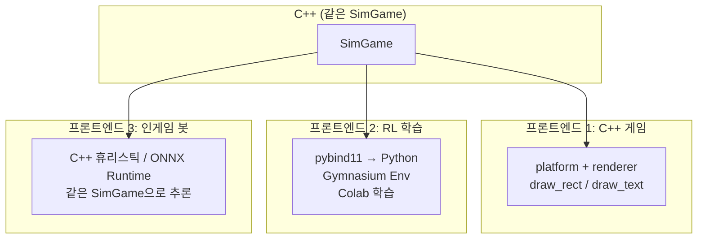
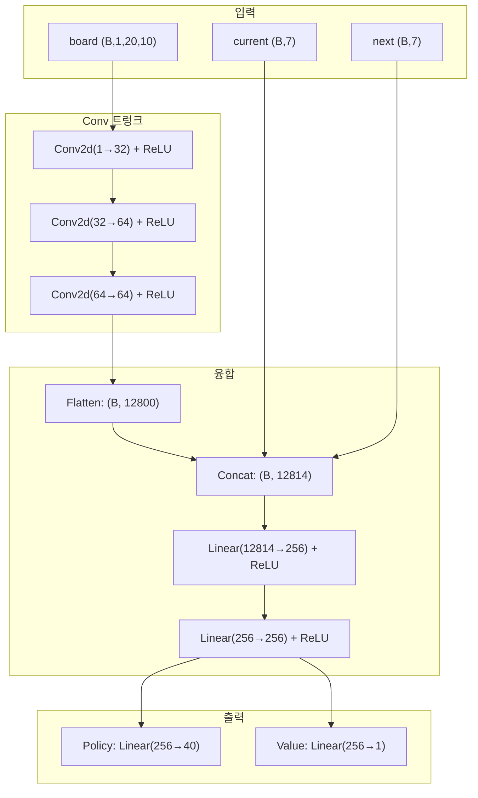
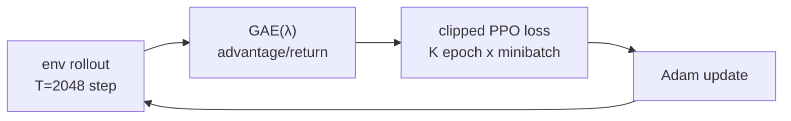
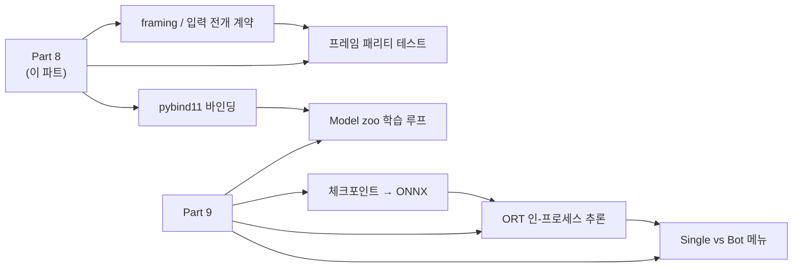

# Part 8: Python 바인딩과 강화학습 — pybind11에서 Colab 학습까지

> **시리즈:** 제로부터 멀티플레이어 테트리스 + RL까지
> [시리즈 목차](./README.md) · [이전: Part 7 — 릴레이](./part7-relay-server.md) · **Part 8** · [다음: Part 9 — ONNX 봇](./part9-rl-onnx-bot.md)

---

## 이 장의 구현 계약

- **선행 상태:** Part 1의 headless `SimGame` API와 결정론 기준 파일.
- **이번 장의 파일:** `bindings/tetris_py.cpp`, `python/sim/`,
  `python/common/`, `python/train/`.
- **연결점:** Python은 게임 규칙을 다시 구현하지 않고 C++ 객체를 바인딩해 관측,
  합법 행동 마스크와 Gym 환경을 만든다.
- **완료 게이트:** native module import, C++ 결정론 기준 비교, 환경 reset/step,
  체크포인트 round-trip과 학습 스크립트 정적 테스트가 통과해야 한다.

## 들어가며

Part 1의 `SimGame`은 C++ 순수 로직이다. 이 시뮬레이터를 Python에 노출하면
학습 환경을 만들 수 있고, 학습된 정책은 Part 9의 인프로세스 ONNX 봇으로
배포할 수 있다. Python은 학습·export와 wire/입력 계약 테스트에만 사용하고,
실행 중인 봇은 C++ 게임 프로세스 안에서 동작한다.

이것을 실현하려면:
1. C++ SimGame을 Python에서 호출할 수 있어야 한다 (pybind11)
2. 강화학습 프레임워크가 이해하는 인터페이스로 감싸야 한다 (Gymnasium 환경)
3. 정책 네트워크를 설계하고 학습해야 한다 (CNN + policy/value head)
4. 학습된 모델을 ONNX로 내보내 C++ 게임 안에서 추론해야 한다

같은 `SimGame` C++ 코드가 세 가지 프론트엔드를 구동한다:



이 장의 실제 파일 경계는 `bindings/tetris_py.cpp`, `python/common/`,
`python/train/`, `python/netbot/framing.py`, `python/netbot/input_expander.py`,
`tests/sim_hash_dump.cpp`다.

---

## 1. pybind11 바인딩

### 1.1 왜 pybind11인가

C++에서 Python으로의 바인딩 방법은 여러 가지다:

| 방법 | 장점 | 단점 |
|------|------|------|
| ctypes / cffi | Python 표준, 별도 빌드 불필요 | C API만 가능, 클래스 노출 어려움 |
| Cython | 성숙, 성능 좋음 | 별도 언어 문법 학습 필요 |
| **pybind11** | C++11 네이티브, 헤더 전용, numpy 통합 | CMake 설정 필요 |
| SWIG | 다중 언어 | 코드 생성 복잡, C++ 템플릿 제한 |

pybind11의 결정적 장점: C++ 클래스를 그대로 Python에 노출할 수 있고, numpy 배열과의 변환이 간단하다. 헤더 전용이므로 `pip install pybind11` 후 바로 사용 가능.

### 1.2 CMake 설정

```cmake
# CMakeLists.txt — pybind11 모듈
if (TETRIS_BUILD_PY)
    set(PYBIND11_FINDPYTHON ON)
    find_package(pybind11 CONFIG QUIET)
    if (NOT pybind11_FOUND)
        message(FATAL_ERROR
            "pybind11 not found. Install: pip install pybind11")
    endif()

    pybind11_add_module(tetris_py
        bindings/tetris_py.cpp
        ${TETRIS_SIM_SOURCES}     # sim_game.cpp, position.cpp
        ${TETRIS_SIM_HEADERS}
    )
    target_include_directories(tetris_py PRIVATE ${CMAKE_CURRENT_SOURCE_DIR})
endif()
```

`pybind11_add_module`은 공유 라이브러리(.pyd / .so)를 생성한다. 이 모듈은 `import tetris_py`로 Python에서 로드된다. raylib이나 Win32 API에 의존하지 않으므로 Linux/macOS에서도 빌드 가능하다.

### 1.3 바인딩 코드

```cpp
// bindings/tetris_py.cpp
#include <pybind11/pybind11.h>
#include <pybind11/stl.h>
#include <pybind11/numpy.h>
#include "../src/sim_game.h"

namespace py = pybind11;

PYBIND11_MODULE(tetris_py, m)
{
    // Placement 구조체
    py::class_<SimGame::Placement>(m, "Placement")
        .def_readonly("col", &SimGame::Placement::col)
        .def_readonly("rot", &SimGame::Placement::rot);

    // SimBlock (읽기 전용 관측 핸들)
    py::class_<SimBlock>(m, "SimBlock")
        .def_readonly("id",             &SimBlock::id)
        .def_readonly("rotation_state", &SimBlock::rotationState)
        .def_readonly("row_offset",     &SimBlock::rowOffset)
        .def_readonly("column_offset",  &SimBlock::columnOffset)
        .def("cell_positions", [](const SimBlock& b) {
            auto tiles = b.GetCellPositions();
            py::list out;
            for (const auto& t : tiles)
                out.append(py::make_tuple(t.row, t.column));
            return out;
        });

    // SimGame
    py::class_<SimGame>(m, "SimGame")
        .def(py::init<uint64_t>(), py::arg("seed") = 0)

        // RL 학습용 API
        .def("legal_placements", &SimGame::LegalPlacements)
        .def("apply_placement",  &SimGame::ApplyPlacement,
             py::arg("col"), py::arg("rot"))
        .def("clone", [](const SimGame& g) {
            return SimGame(g);
        })

        // Lockstep용 API
        .def("submit_input",     &SimGame::SubmitInput, py::arg("input_mask"))
        .def("tick",             &SimGame::Tick)

        // 관측 접근자
        .def("grid", [](const SimGame& g) {
            // 20x10 int 배열을 numpy로 복사
            const auto& raw = g.Grid();
            auto arr = py::array_t<int32_t>({20, 10});
            auto buf = arr.mutable_unchecked<2>();
            for (int r = 0; r < 20; ++r)
                for (int c = 0; c < 10; ++c)
                    buf(r, c) = raw[r][c];
            return arr;
        })
        .def("current_block", &SimGame::CurrentBlock,
             py::return_value_policy::reference_internal)
        .def("score",      &SimGame::Score)
        .def("game_over",  &SimGame::IsGameOver)
        .def("state_hash", &SimGame::StateHash);
}
```

> **참고**: 위 발췌는 핵심 흐름만 보이려고 줄인 것이다. 실제 `bindings/tetris_py.cpp` 는 뒤 섹션에서 쓰는 접근자들 — `current_block_id`, `next_block_id`, `current_rotation`, `current_row`, `current_col`, `ghost_block`, `next_block`, `next_block_ids`, `move_block_down`, `clone`, `rng_state`, 정적 상수 `ROWS`/`COLS` — 도 모두 노출한다. 전체 바인딩은 [Part 9](./part9-rl-onnx-bot.md) 의 "pybind11 바인딩" 절에 1:1 로 인용돼 있다. 예컨대 `build_observation()` 이 호출하는 `sim.current_block_id()` / `sim.next_block_id()` 는 이 전체 바인딩에 들어 있고, CBMPI-style 학습기가 쓰는 `sim.clone()` 도 여기서 제공된다.

### 1.4 grid()의 복사 정책

`grid()` 바인딩에서 `int grid[20][10]`을 numpy 배열로 **복사**한다. 참조를 반환하지 않는 이유:

```python
# 위험: 참조 반환 시
arr = game.grid()        # arr이 SimGame 내부 메모리를 직접 가리킴
game.apply_placement(4, 0)  # SimGame 내부 상태 변경
# arr이 가리키는 메모리가 이미 바뀜 → 이전 관측이 아닌 현재 상태를 보게 됨
```

더 심각한 경우: `SimGame` 객체가 소멸된 후 `arr`에 접근하면 **dangling pointer**가 된다. 200개 int(800바이트) 복사 비용은 학습 처리량 대비 무시할 수 있으므로, 안전한 복사를 선택했다.

### 1.5 reference_internal 정책

`current_block()`, `ghost_block()`은 `py::return_value_policy::reference_internal`을 사용한다. 이 정책은 "반환된 참조의 수명을 부모 객체(SimGame)에 묶는다". SimGame이 살아있는 동안 블록 참조도 유효하다. `next_block()`은 preview 큐 내부 원소이므로 큐 갱신 때 참조가 무효화될 수 있어 복사로 반환한다.

```python
block = game.current_block()   # SimGame 내부의 SimBlock에 대한 참조
print(block.id)                # OK (game이 살아있으므로)
del game                        # SimGame 소멸
print(block.id)                 # Python에서 에러 (내부적으로 보호됨)
```

---

## 2. 관측 공간 설계

### 2.1 관측 구성

```python
# python/common/obs.py
def build_observation(sim: SimGame) -> dict[str, torch.Tensor]:
    raw = np.asarray(sim.grid(), dtype=np.float32)      # (20, 10)
    occupied = ((raw > 0) & (raw != 8)).astype(np.float32)
    board = occupied[None, :, :]                          # (1, 20, 10)

    current = _piece_one_hot(sim.current_block_id())     # (7,)
    nxt     = _piece_one_hot(sim.next_block_id())        # (7,)

    return {"board": torch.from_numpy(board),
            "current": torch.from_numpy(current),
            "next": torch.from_numpy(nxt)}
```

| 키 | 형태 | 내용 |
|----|------|------|
| `board` | `(1, 20, 10)` float32 | 점유맵: 1 = 잠긴 블록, 0 = 빈칸 |
| `current` | `(7,)` float32 | 현재 블록 ID의 one-hot |
| `next` | `(7,)` float32 | preview 큐 첫 번째 다음 블록 ID의 one-hot |

### 2.2 설계 결정

**고스트 블록 제외**: 고스트(id=8)는 현재 블록의 하드 드롭 위치 프리뷰다. 정책이 이미 합법적 배치(placement)를 결정하므로, 고스트 정보는 중복이다. `(raw > 0) & (raw != 8)`로 필터링한다.

**현재 블록의 위치/회전 제외**: placement-level API에서 정책은 "이 블록을 어디에 놓을 것인가"를 결정한다. 현재 블록의 중간 상태(떨어지는 중의 위치/회전)는 이 API에서 무관하다. 블록 **종류**(id)만 필요하므로 one-hot으로 충분하다.

**float32 점유맵**: 원본 그리드는 0~8 int이지만, CNN 입력으로는 이진 점유맵(0/1)이 적합하다. 블록 색상(1~7)은 게임 진행에 무관한 시각적 속성이므로 제거한다.

---

## 3. 행동 공간 설계

### 3.1 배치 수준 행동

```python
# python/common/__init__.py
NUM_COLS = 10
NUM_ROTATIONS = 4
NUM_PLACEMENTS = NUM_COLS * NUM_ROTATIONS  # 40
```

40개 이산 행동: 10열 x 4회전. 인코딩:

$$\text{action} = \text{col} \times 4 + \text{rot}$$

```python
# python/common/action_mask.py
def encode_action(col: int, rot: int) -> int:
    return col * NUM_ROTATIONS + rot

def decode_action(action: int) -> tuple[int, int]:
    return action // NUM_ROTATIONS, action % NUM_ROTATIONS
```

### 3.2 합법 행동 마스크

모든 40개 행동이 항상 유효하지는 않다. O 블록(정사각형)은 4개의 회전 상태가 동일하므로 사실상 1개의 유효 회전만 있다. I 블록이 가장자리 열에서는 범위를 벗어날 수도 있다.

```python
def legal_mask(sim: SimGame) -> torch.Tensor:
    mask = torch.zeros(NUM_PLACEMENTS, dtype=torch.bool)
    for placement in sim.legal_placements():
        mask[encode_action(placement.col, placement.rot)] = True
    return mask
```

`sim.legal_placements()`는 C++ 측에서 모든 (col, rot) 조합을 검증한다: 회전 → 이동 → 하드 드롭 시뮬레이션. 유효한 조합만 반환.

정책 네트워크의 출력(40개 logit)에 합법 마스크를 적용하면, 불법 행동의 확률이 정확히 0이 된다:

```python
def masked_log_softmax(logits, mask, eps=1e-9):
    masked = logits.masked_fill(~mask, float("-inf"))
    return F.log_softmax(masked + eps, dim=-1)
```

불법 행동의 logit을 $-\infty$로 설정하면 softmax 후 확률이 0이 된다.

---

## 4. Gymnasium 환경

### 4.1 인터페이스

```python
# python/common/env.py
class TetrisPlacementEnv(gym.Env):
    metadata = {"render_modes": []}

    def __init__(self, seed=None):
        self.action_space = spaces.Discrete(NUM_PLACEMENTS)  # 40
        self.observation_space = spaces.Dict({
            "board":   spaces.Box(0, 1, (1, 20, 10), float32),
            "current": spaces.Box(0, 1, (7,),        float32),
            "next":    spaces.Box(0, 1, (7,),        float32),
        })
```

표준 Gymnasium 인터페이스를 따르므로, CleanRL, Stable Baselines3, RLlib 등 어떤 RL 프레임워크든 바로 연결 가능하다.

### 4.2 step()

```python
def step(self, action):
    col, rot = decode_action(int(action))
    cleared = self.sim.apply_placement(col, rot)

    if cleared < 0:
        reward = 0.0           # 불법 배치 → 0 보상 (방어적 처리)
    else:
        reward = float(cleared) # 클리어된 줄 수 = 보상

    terminated = self.sim.game_over()
    truncated = False
    return self._observation(), reward, terminated, truncated, self._info()
```

**보상 = 클리어된 줄 수 (0~4)**. 이 단순한 보상 함수가 작동하는 이유: 라인을 많이 클리어하면 높은 보상, 게임 오버되면 에피소드 종료(미래 보상 상실). 에이전트는 자연스럽게 "오래 생존하면서 많이 클리어"하는 전략을 학습한다.

### 4.3 info dict

```python
def _info(self):
    return {
        "legal_mask": legal_mask(self.sim).numpy(),
        "score": self.sim.score(),
        "state_hash": self.sim.state_hash(),
    }
```

`legal_mask`는 매 step마다 반환된다. 정책이 이 마스크를 사용해 불법 행동을 필터링한다. `state_hash`는 디버깅 용도.

---

## 5. CNN 정책 네트워크

### 5.1 아키텍처

```python
# python/common/models.py
class TetrisPolicyNet(nn.Module):
    ARCH_VERSION = 1

    def __init__(self, conv_channels=(32, 64, 64), hidden=256):
        # Conv 트렁크: (B, 1, 20, 10) → (B, 64, 20, 10)
        self.trunk = nn.Sequential(
            nn.Conv2d(1, 32, 3, padding=1), nn.ReLU(),
            nn.Conv2d(32, 64, 3, padding=1), nn.ReLU(),
            nn.Conv2d(64, 64, 3, padding=1), nn.ReLU(),
        )
        # Flatten + piece info → FC
        flat = 64 * 20 * 10  # 12,800
        self.fuse = nn.Sequential(
            nn.Linear(flat + 14, hidden), nn.ReLU(),  # +14 = current(7) + next(7)
            nn.Linear(hidden, hidden), nn.ReLU(),
        )
        self.policy_head = nn.Linear(hidden, 40)   # 40개 행동
        self.value_head  = nn.Linear(hidden, 1)    # 상태 가치
```



### 5.2 설계 결정

**Conv2d(kernel=3, padding=1)**: 3x3 커널로 인접 셀의 패턴(빈 행, 높이 차이, 구멍)을 감지한다. `padding=1`로 공간 차원을 보존한다. 테트리스 보드는 20x10으로 작아서 풀링 없이 전체 해상도를 유지한다.

**현재/다음 블록을 concat으로 융합**: 블록 정보를 CNN 입력 채널로 추가하는 방법도 있지만, one-hot 벡터 7개를 20x10 전체에 브로드캐스트하면 파라미터 대비 정보가 희박하다. 현재 학습 입력은 preview 큐의 첫 번째 next 만 쓰며, 3-piece preview 전체를 정책에 넣고 싶으면 `next_block_ids()` 를 별도 feature 로 확장한다. flatten 후 concat이 더 효율적이다.

**Actor-Critic 구조**: policy head(40개 logit)와 value head(스칼라)를 공유 트렁크에서 분기한다. PPO/A2C 같은 actor-critic policy gradient 알고리즘은 이 구조를 그대로 쓰고, DQN/DDQN 계열은 `policy_logits` 를 Q-value 로 해석한다. 즉 같은 `TetrisPolicyNet` 체크포인트 형식을 유지하면서 여러 알고리즘을 붙일 수 있다. 다음 절에서는 가장 먼저 만든 baseline 인 PPO 루프를 본다.

### 5.3 ARCH_VERSION 가드

```python
ARCH_VERSION = 1
```

아키텍처가 바뀔 때마다 이 값을 증가시킨다. 체크포인트 로더가 이 값을 검증한다.

아키텍처 변경 없이 `ARCH_VERSION`을 올리지 않으면: Colab에서 학습한 가중치가 엉뚱한 레이어에 로드되어, 모델이 의미 없는 행동을 출력한다. PyTorch의 `load_state_dict`는 키 이름만 검증하므로, 같은 이름이면 shape이 달라도 에러 없이 로드될 수 있다 (이후 forward pass에서 shape mismatch 에러).

---

## 6. 체크포인트 시스템

### 6.1 저장

```python
# python/common/checkpoint.py
def save_checkpoint(model, path, extra=None):
    payload = {
        "state_dict": model.state_dict(),
        "__meta__": {
            "arch_version": TetrisPolicyNet.ARCH_VERSION,
            "class": "TetrisPolicyNet",
            **(extra or {}),
        },
    }
    torch.save(payload, str(path))
```

### 6.2 로드

```python
def load_checkpoint(path, device="cpu"):
    payload = torch.load(str(path), map_location=device, weights_only=True)
    if not isinstance(payload, dict) or "state_dict" not in payload:
        raise RuntimeError("Checkpoint does not contain a TetrisPolicyNet state_dict.")
    meta = payload.get("__meta__", {})

    # 아키텍처 버전 검증
    if meta.get("arch_version") != TetrisPolicyNet.ARCH_VERSION:
        raise RuntimeError(
            f"Checkpoint arch_version {meta.get('arch_version')!r} != "
            f"current {TetrisPolicyNet.ARCH_VERSION!r}")

    model = TetrisPolicyNet()
    model.load_state_dict(payload["state_dict"])
    model.to(device).eval()
    return model
```

`map_location=device`가 크로스 플랫폼 이식에서 중요하다. Colab(Linux, CUDA)에서 학습한 모델을 Windows(CPU)에서 로드할 때, GPU 텐서를 CPU로 자동 매핑한다.

---

## 7. PPO baseline 학습 루프

여기까지 관측·행동·환경·정책망·체크포인트를 모두 갖췄다. 이제 이것들을 묶어 정책을 **학습**하는 루프가 필요하다. 여기서 설명하는 `python/train/ppo_tetris.py` 는 저장소의 첫 학습 baseline 이다. 현재 저장소에는 이후 확장으로 DQN/DDQN, CBMPI-style, REINFORCE, A2C, n-step actor-critic, CEM, MuZero-style 학습기도 추가되어 있다. 하지만 모든 배포 가능한 trainer 는 최종 산출물을 같은 `TetrisPolicyNet` 체크포인트로 저장한다는 계약을 공유한다. 이 절은 그 계약을 가장 잘 보여주는 PPO(Proximal Policy Optimization) 루프를 기준으로 설명한다.

### 7.1 왜 PPO인가

정책 학습 알고리즘은 크게 두 갈래다.

| 계열 | 예 | 특징 |
|------|-----|------|
| Value 기반 | DQN | 이산 행동·리플레이 버퍼·target net. 합법 마스크가 까다롭다 |
| Policy gradient | A2C, PPO | actor-critic 구조 그대로. 마스킹된 분포에서 바로 샘플 |

이 프로젝트는 §5의 `TetrisPolicyNet`(policy head + value head)을 그대로 학습 대상으로 쓴다. PPO는 그 actor-critic 구조에 정확히 맞고, **clipped surrogate objective**로 한 번의 rollout을 여러 epoch 재사용해도 정책이 급격히 망가지지 않는다 — 단일 동기 env(샘플이 비싼 구조)에서 샘플 효율이 중요하기 때문이다. `ppo_tetris.py`는 프레임워크의 정책 클래스가 아니라 **이 저장소의 `TetrisPolicyNet`을 직접** 학습한다. 그래야 체크포인트를 별도 가중치 변환 없이 `export_onnx`로 내보낼 수 있다.

학습 흐름은 네 단계 사이클이다: **rollout → advantage(GAE) → loss → update**.



### 7.2 하이퍼파라미터

`build_argparser()`의 기본값이 베이스라인 설정이다.

```python
# python/train/ppo_tetris.py
p.add_argument("--steps", type=int, default=1_000_000, help="total env steps")
p.add_argument("--rollout", type=int, default=2048, help="steps per PPO update")
p.add_argument("--epochs", type=int, default=4, help="PPO epochs per update")
p.add_argument("--minibatch", type=int, default=256)
p.add_argument("--lr", type=float, default=3e-4)
p.add_argument("--gamma", type=float, default=0.99)
p.add_argument("--lam", type=float, default=0.95, help="GAE lambda")
p.add_argument("--clip", type=float, default=0.2, help="PPO clip epsilon")
p.add_argument("--ent-coef", type=float, default=0.01)
p.add_argument("--vf-coef", type=float, default=0.5)
p.add_argument("--max-grad-norm", type=float, default=0.5)
p.add_argument("--shaping-coef", type=float, default=0.5,
               help="weight on dense board-feature shaping (0 = pure lines)")
```

| 인자 | 기본값 | 의미 |
|------|--------|------|
| `--rollout` | 2048 | 한 업데이트당 모으는 env 스텝 수 (T) |
| `--epochs` | 4 | 같은 rollout을 재사용하는 PPO epoch 수 |
| `--minibatch` | 256 | epoch 내 미니배치 크기 |
| `--lr` | 3e-4 | Adam 학습률 |
| `--gamma` | 0.99 | 할인율 |
| `--lam` | 0.95 | GAE λ |
| `--clip` | 0.2 | PPO clip ε |
| `--ent-coef` | 0.01 | 엔트로피 보너스 계수 |
| `--vf-coef` | 0.5 | value loss 계수 |
| `--max-grad-norm` | 0.5 | gradient clipping 상한 |
| `--shaping-coef` | 0.5 | dense 보상 shaping 가중치 (0 = 라인만) |

### 7.3 Rollout — 한 env로 T 스텝 수집

학습기는 벡터화 없이 **단일 동기 env**로 시작한다. 매 스텝, 합법 마스크를 적용한 정책 분포에서 행동을 샘플하고, transition을 버퍼에 쌓는다.

```python
# python/train/ppo_tetris.py
        for t in range(T):
            mask_np = info["legal_mask"]
            if not mask_np.any():
                # Defensive: a no-legal-action state should only happen at game
                # over (already handled by the reset after a terminal step). If
                # we ever see one here, reset and fill this slot with the fresh
                # transition rather than leaving a zero/all-illegal buffer slot
                # (which would produce NaN logits in the PPO update).
                obs, info = env.reset()
                ep_ret, ep_len, ep_lines = 0.0, 0, 0
                mask_np = info["legal_mask"]

            batch = to_batch(obs, device)
            mask = torch.as_tensor(mask_np, dtype=torch.bool, device=device).unsqueeze(0)
            with torch.no_grad():
                logits, value = model(batch["board"], batch["current"], batch["next"])
                logp_row, probs, _ = _logp_entropy(logits, mask)
                action = torch.multinomial(probs, 1).squeeze(-1)        # legal-only
                logp = logp_row.gather(-1, action.unsqueeze(-1)).squeeze(-1)

            a = int(action.item())
            next_obs, reward, term, trunc, next_info = env.step(a)
            shaped = shaping_reward(next_obs["board"], args.shaping_coef)
            total_r = float(reward) + shaped
```

`masked_log_softmax`(§3.2)로 만든 분포에서 `torch.multinomial`로 샘플하므로 **항상 합법 배치만** 뽑힌다. 그리고 매 transition의 보상은 env 보상(`reward`, §4.2의 라인 클리어 수)에 **shaping 항**(`shaped`)을 더한 값이다 — 이것이 다음 절의 주제다.

### 7.4 Dense 보상 shaping

§4.2의 env 보상은 "이번 배치로 클리어된 줄 수(0~4)"뿐이라 학습 초기에 극도로 희박하다. 갓 초기화된 정책은 첫 라인 클리어까지 수천 배치를 헛돈다. `ppo_tetris.py`는 라인 클리어 전에도 gradient를 주기 위해 **보드 특성 기반 dense shaping**을 기본으로 더한다.

```python
# python/train/ppo_tetris.py
_W_HOLE = 0.03
_W_HEIGHT = 0.005
_W_BUMP = 0.003


def board_features(board: np.ndarray) -> tuple[int, int, int]:
    """Return (holes, aggregate_height, bumpiness) for a (1,20,10) occupancy."""
    b = board.reshape(BOARD_ROWS, BOARD_COLS) > 0.5
    holes = 0
    heights = np.zeros(BOARD_COLS, dtype=np.int64)
    for c in range(BOARD_COLS):
        col = b[:, c]
        filled = np.flatnonzero(col)
        if filled.size == 0:
            continue
        top = int(filled[0])                 # 0 = top row
        heights[c] = BOARD_ROWS - top
        holes += int(np.count_nonzero(~col[top:]))
    agg_height = int(heights.sum())
    bumpiness = int(np.abs(np.diff(heights)).sum())
    return holes, agg_height, bumpiness


def shaping_reward(board: np.ndarray, coef: float) -> float:
    if coef == 0.0:
        return 0.0
    holes, agg_height, bumpiness = board_features(board)
    penalty = _W_HOLE * holes + _W_HEIGHT * agg_height + _W_BUMP * bumpiness
    return -coef * penalty
```

penalty는 구멍 수·전체 높이·울퉁불퉁함의 가중합이고, 최종 shaping 보상은 `-coef * penalty`(낮은 스택·적은 구멍·평평한 표면을 선호). 기본 `--shaping-coef 0.5`라서 학습 보상은 `라인 클리어 + 0.5 * (-penalty)`다. `--shaping-coef 0`을 주면 순수 라인 클리어 보상으로 돌아간다. 보상 함수를 단순히 두려는 입장(§4.2)과, 학습을 실제로 돌리기 위한 dense 신호 사이의 절충이다. 평가(`evaluate_policy`)는 의도적으로 shaping 없이 **raw 게임 지표만** 보고하므로 shaping 실험들끼리 비교가 깨지지 않는다.

### 7.5 GAE(λ) — advantage 추정

rollout이 끝나면 마지막 상태의 가치를 bootstrap하고, 시간 역순으로 GAE(Generalized Advantage Estimation)를 누적한다.

```python
# python/train/ppo_tetris.py
        # --- GAE(λ) advantages + returns ------------------------------------
        advantages = torch.zeros(T, device=device)
        lastgae = torch.zeros((), device=device)
        for t in reversed(range(T)):
            nonterminal = 1.0 - dones[t]
            nextval = last_value if t == T - 1 else values[t + 1]
            delta = rewards[t] + args.gamma * nextval * nonterminal - values[t]
            lastgae = delta + args.gamma * args.lam * nonterminal * lastgae
            advantages[t] = lastgae
        returns = advantages + values
        adv = (advantages - advantages.mean()) / (advantages.std() + 1e-8)
```

`delta`는 한 스텝 TD 오차 `r + γV(s') - V(s)`이고, `lastgae`가 `γλ`로 감쇠하며 미래 delta를 누적해 advantage를 만든다. `nonterminal`(= `1 - done`)이 에피소드 경계에서 누적을 끊는다. `returns = advantages + values`가 value head의 학습 타깃이고, advantage는 미니배치 학습 전에 정규화한다.

### 7.6 PPO clipped objective와 결합 손실

advantage가 준비되면 같은 rollout을 `--epochs`번, `--minibatch` 단위로 돌며 정책을 갱신한다. 핵심은 **importance ratio를 [1-ε, 1+ε]로 clip**하는 PPO surrogate다.

```python
# python/train/ppo_tetris.py
                ratio = (new_logp - logps[jt]).exp()
                mb_adv = adv[jt]
                pg1 = -mb_adv * ratio
                pg2 = -mb_adv * torch.clamp(ratio, 1 - args.clip, 1 + args.clip)
                pg_loss = torch.max(pg1, pg2).mean()
```

`ratio`는 갱신된 정책과 수집 당시 정책의 확률 비. clip하지 않은 `pg1`과 clip한 `pg2` 중 **더 나쁜(큰)** 쪽을 취하므로, 정책이 한 업데이트에서 너무 멀리 이동하면 이득이 잘려 보수적으로 학습된다. policy loss·value loss·엔트로피를 하나로 묶는다.

```python
# python/train/ppo_tetris.py
                loss = pg_loss + args.vf_coef * v_loss - args.ent_coef * ent_loss
```

`v_loss`(`0.5 * (value - returns)^2`)는 `--vf-coef 0.5`로, 엔트로피 보너스는 `--ent-coef 0.01`로 가중된다 — 엔트로피는 **빼서** 더 높은 엔트로피(탐색 유지)를 보상한다.

### 7.7 update — backward + grad clip

```python
# python/train/ppo_tetris.py
                opt.zero_grad()
                loss.backward()
                nn.utils.clip_grad_norm_(model.parameters(), args.max_grad_norm)
                opt.step()
```

`clip_grad_norm_`(`--max-grad-norm 0.5`)으로 gradient 폭주를 막은 뒤 Adam(`--lr 3e-4`)으로 한 스텝. 이 네 줄이 한 미니배치의 갱신이고, `--epochs`(4) x (T/minibatch = 2048/256 = 8) = 32회 반복이 한 PPO 업데이트를 이룬다.

### 7.8 학습 실행

```bash
# python/ 디렉터리에서
python -m train.ppo_tetris --steps 1000000 --out checkpoints/run.pt

# 이어 학습
python -m train.ppo_tetris --resume checkpoints/run.pt --steps 500000
```

학습기는 주기적으로(`--eval-every`) greedy 평가를 돌려 `avg_lines`/`avg_score`/`avg_pieces`를 찍고, 체크포인트(`run.pt`, `run.best.pt`, `run.eval_best.pt`)를 저장한다. 이 `.pt`는 §6의 로더를 거쳐 [Part 9](./part9-rl-onnx-bot.md)에서 ONNX로 export된다.

---

## 8. El-Tetris 휴리스틱 베이스라인

### 8.1 손수 만든 평가 함수

RL 학습 전에, 손으로 설계한 평가 함수로 "괜찮은" 수준의 AI를 만들 수 있다:

```python
# python/common/features.py
BCTS_WEIGHTS = {
    "aggregate_height": -0.510066,
    "bumpiness":        -0.184483,
    "holes":            -0.35663,
    "max_height":        0.0,
    "rows_cleared":      0.760666,
    "wells":            -0.1,
}
```

핵심 네 가중치(`aggregate_height` -0.510066, `rows_cleared` 0.760666, `holes` -0.35663, `bumpiness` -0.184483)는 **El-Tetris**(Islam, 2011)에서 보고된 값이다 — 이 저장소의 C++ 포트(`bot/placement.cpp`)도 해당 가중치 블록을 "El-Tetris"로 명시한다. 흔히 Dellacherie 가중치로 잘못 인용되지만, Dellacherie(2003)는 이 선형 평가 함수에서 쓰는 **특성 집합**(aggregate height, holes, bumpiness 등)의 원류일 뿐 위 수치 자체의 출처는 아니다. 각 합법 배치에 대해 보드 상태를 시뮬레이션하고, 위 특성의 가중합을 계산하여 가장 높은 점수의 배치를 선택한다.

특성의 의미:

| 특성 | 계산 | 의미 |
|------|------|------|
| `aggregate_height` | 모든 열의 높이 합 | 높을수록 위험 (음의 가중치) |
| `bumpiness` | 인접 열 높이 차이의 절대값 합 | 울퉁불퉁할수록 비효율 |
| `holes` | 위에 채워진 셀이 있는 빈칸 수 | 구멍은 라인 클리어를 방해 |
| `wells` | 양쪽이 높고 가운데가 낮은 깊이의 삼각합 | 깊은 우물은 I 블록 전용 |
| `rows_cleared` | 클리어된 줄 수 | 유일한 양의 가중치 |

### 8.2 휴리스틱의 성능

학습 없이도 이 El-Tetris 휴리스틱 에이전트는 많은 줄을 클리어할 수 있다. 이것이 RL 학습의 **베이스라인 하한**이 된다: 학습된 정책이 휴리스틱을 이기지 못하면 학습에 문제가 있다.

---


## 9. 크로스 플랫폼 결정론 테스트

### 9.1 C++ 레퍼런스 덤프

```cpp
// tests/sim_hash_dump.cpp — 결정론적 입력 스크립트
struct Step { uint8_t mask; int ticks; };

const Step SCRIPT[] = {
    {0x00, 30},   // 30틱 대기
    {0x01, 1},    // LEFT
    {0x01, 1},    // LEFT
    {0x01, 1},    // LEFT
    {0x08, 1},    // ROTATE
    {0x10, 2},    // DROP + 2틱
    // ... 30개 스텝
};
```

이 스크립트를 여러 시드에 대해 실행하고, 각 스텝 후의 `StateHash()`를 출력한다. 이 출력이 **레퍼런스**다.

### 9.2 Python 교차 검증

```python
# python/tests/test_determinism_crossplatform.py
def _run_script(seed):
    sim = SimGame(seed)
    out = []
    total_ticks = 0
    for step_index, (mask, ticks) in enumerate(SCRIPT):
        sim.submit_input(mask)
        for _ in range(ticks):
            sim.tick()
            total_ticks += 1
        out.append((step_index, total_ticks, sim.score(),
                     sim.game_over(), sim.state_hash()))
    return out
```

Python 바인딩(Linux Colab에서 빌드)으로 같은 스크립트를 실행한다. 모든 스텝의 `state_hash`가 C++ 레퍼런스와 일치하면, Linux와 Windows 빌드가 비트 단위로 동일하다는 증거다.

### 9.3 왜 이 테스트가 필요한가

SimGame은 순수 정수 연산(XorShift64*, FNV-1a, 그리드 조작)만 사용하므로 이론적으로 크로스 플랫폼 결정론이 보장된다. 그러나:

- `int`의 크기: C++ 표준은 `int`가 최소 16비트라고만 정의한다 (대부분 32비트이지만)
- unsigned modulo: `rng.nextUInt(7)`에서 `next() % 7`의 동작이 unsigned 64비트 modulo에 의존
- 메모리 레이아웃: `sizeof(int) * 20 * 10 = 800`이 양쪽에서 동일해야 `fnv1a64`의 결과가 일치

이 테스트는 이런 가정이 실제로 성립하는지 자동으로 검증한다.

---

## 오류와 함정

### (1) numpy 배열의 dangling pointer

**증상:** Python에서 `sim.grid()` 반환값에 접근 시 세그먼트 폴트 또는 쓰레기 데이터.

**원인:** grid()가 SimGame 내부 메모리에 대한 참조를 반환하면, SimGame이 소멸되거나 상태가 바뀐 후 numpy 배열이 무효한 메모리를 가리킨다.

**해결:** grid() 바인딩에서 데이터를 **복사**하여 반환. 800바이트 복사는 무시할 수 있는 비용.

### (2) ARCH_VERSION 미갱신

**증상:** 학습된 모델을 로드했는데 정책이 의미 없는 행동을 출력한다. 에러 없이 로드됨.

**원인:** `models.py`에서 레이어 크기를 변경했지만 `ARCH_VERSION`을 올리지 않아, 이전 체크포인트의 가중치가 새 아키텍처에 로드됨.

**해결:** `checkpoint.py`의 로더가 `ARCH_VERSION` 불일치 시 `RuntimeError`를 발생시킨다. 아키텍처 변경 시 반드시 버전을 올린다.

### (3) Colab → Windows 이식 시 endianness

**증상:** Colab(Linux x86_64)에서 학습한 모델이 Windows에서 다른 출력을 낸다.

**원인:** PyTorch의 `.pt` 파일은 텐서를 네이티브 endianness로 저장한다. 그러나 x86과 x86_64는 모두 리틀 엔디안이므로, **이 경우에는 문제가 없다.** ARM이나 다른 빅 엔디안 플랫폼으로 이식할 때만 주의.

PyTorch의 `torch.save`/`torch.load`는 내부적으로 pickle + zipfile을 사용하며, `map_location` 파라미터가 디바이스 매핑을 처리한다. 엔디안 변환은 PyTorch가 자동 처리하지 않으므로, 빅 엔디안 플랫폼에서는 수동 변환이 필요하다.

### (4) 합법 마스크와 탐색 정책

**증상:** 학습 초기에 에이전트가 불법 행동을 선택하려고 해서 보상이 항상 0.

**원인:** `legal_mask`를 정책에 적용하지 않으면, 40개 행동 중 유효한 것이 ~20개 정도이므로 무작위 탐색의 절반이 불법 행동.

**해결:** `masked_log_softmax`로 불법 행동의 logit을 $-\infty$로 설정. 이것은 학습의 **필수 요소**이지, 선택이 아니다.

---

## 10. 프레임 계층 — `python/netbot/framing.py`

이 파일은 C++ `net/framing.h` / `net/framing.cpp`의 wire 규약을 Python으로
옮긴 테스트 도우미다. 같은 `(MsgType, payload)`가 같은 byte sequence를 만든다는
계약을 고정 vector와 round-trip으로 검증한다. 현재 테스트는 C++ 함수를 런타임에
직접 호출하는 비교 방식은 아니다.

### 10.1 와이어 포맷 복기

```text
[LEN u16 LE][TYPE u8][PAYLOAD LEN-1 bytes][CHECKSUM u32 LE]
```

- `LEN` = `1 + len(payload)` (TYPE 바이트까지 포함)
- `CHECKSUM` = `fnv1a32(payload)` — **payload 만** 덮는다. 헤더/타입 미포함.
- payload 가 비면 체크섬은 `0` 으로 short-circuit. C++ 쪽과 동일한 규약.

### 10.2 FNV-1a32 — `& 0xFFFFFFFF` 가 왜 필요한가

```python
# python/netbot/framing.py
FNV1A32_OFFSET = 2166136261  # 0x811C9DC5
FNV1A32_PRIME  = 16777619    # 0x01000193
FNV1A32_MASK   = 0xFFFFFFFF


def fnv1a32(data: bytes, seed: int = FNV1A32_OFFSET) -> int:
    """FNV-1a 32-bit hash. Identical bit pattern to ``net::fnv1a32`` in C++."""
    h = seed & FNV1A32_MASK
    for byte in data:
        h ^= byte
        h = (h * FNV1A32_PRIME) & FNV1A32_MASK
    return h
```

C++ 의 `uint32_t h` 는 곱셈 후 **자연스럽게 상위 비트가 잘린다** (truncation).
Python 의 `int` 는 임의 정밀 정수라 그런 자동 자르기가 없다. 마스크를 빠뜨리면:

- 매 바이트마다 `h *= PRIME` 이 누적되면서 `h` 가 쑥쑥 커진다.
- 나중에 LE u32 로 저장할 때는 `struct.pack("<I", ...)` 가 `h & 0xFFFFFFFF`
  을 한 뒤 나머지를 버린다. 하지만 **중간 XOR** 단계가 32 비트를 넘어서 동작
  하므로 결과 비트 패턴이 C++ 과 달라진다.
- 결과: Python 고정 vector와 C++ wire checksum이 달라진다. 이 바이트를 실제
  C++ parser에 넣으면 체크섬 불일치로 drop된다.

`& FNV1A32_MASK` 를 매 곱셈마다 거는 것이 해답이다. seed 도 입구에서 마스킹
해서 사용자가 음수나 큰 수를 넘겨도 동일 동작.

이런 종류의 버그는 유닛 테스트가 없으면 정말 잡기 어렵다 — 그래서 공식 FNV
테스트 벡터 (`b""`, `b"a"`, `b"b"`, `b"foobar"`) 를 고정 기대값과 대조한다.
[다음 섹션](#12-테스트--크로스-언어-패리티)에서 자세히 다룬다.

### 10.3 `build_frame` — 전체 인용

```python
# python/netbot/framing.py
def build_frame(msg_type: MsgType | int, payload: bytes | bytearray) -> bytes:
    """Serialise ``(msg_type, payload)`` into the wire format.

    The result is exactly what ``net::build_frame`` produces in C++ — bytewise
    identical, including the empty-payload checksum=0 short-circuit.
    """
    payload_bytes = bytes(payload)
    if len(payload_bytes) > MAX_PAYLOAD_BYTES:
        raise ValueError(f"frame payload exceeds MAX_PAYLOAD_BYTES: {len(payload_bytes)}")
    out = bytearray()
    length = TYPE_FIELD_BYTES + len(payload_bytes)
    if length > 0xFFFF:
        raise ValueError(f"frame payload too large: {len(payload_bytes)} bytes")
    le_write_u16(out, length)
    out.append(int(msg_type) & 0xFF)
    out += payload_bytes
    checksum = 0 if not payload_bytes else fnv1a32(payload_bytes)
    le_write_u32(out, checksum)
    return bytes(out)
```

- `payload_bytes = bytes(payload)` 로 한 번 복사. 호출자가 `bytearray` 를
  넘기고 나중에 수정해도 프레임은 영향 받지 않는다.
- `MAX_PAYLOAD_BYTES = 4096` 상한. u16 의 자연 한계는 65535 지만, 실사용
  최대(CHAT 200자 UTF-8 ~800B) 대비 4 KB 면 충분. 넘치면 즉시 `ValueError`.
- `length` 는 TYPE(1) + payload. TYPE 은 LEN 아래에 굳이 1 바이트를 추가로
  뽑지 않고 같이 센다 — C++ 과 같은 규약.
- empty payload 일 때 `checksum = 0` — C++ 의 short-circuit (아예 FNV 루프를
  돌지 않음) 과 비트 동일. `fnv1a32(b"")` 를 그대로 쓰면 `FNV1A32_OFFSET`
  (0x811C9DC5) 가 되어 버려서 C++ 과 어긋난다. **0 을 명시적으로** 넣어야 한다.

### 10.4 `parse_frames` — 전체 인용

```python
# python/netbot/framing.py
def parse_frames(stream_buf: bytearray) -> list[tuple[MsgType, bytes]]:
    """Pull all complete frames out of ``stream_buf`` and return them.

    Bytes belonging to fully-parsed frames are removed from ``stream_buf`` in
    place — partial frames at the end are left for the next call. Frames whose
    checksum doesn't match are silently dropped (same behaviour as the C++
    parser, which keeps the lockstep loop forgiving rather than fatal).
    """
    out: list[tuple[MsgType, bytes]] = []
    offset = 0
    buf_len = len(stream_buf)

    while True:
        if buf_len - offset < LEN_FIELD_BYTES:
            break

        length = le_read_u16(stream_buf, offset)
        # Drop the whole stream if a frame declares a payload larger than the
        # cap — matches the C++ behaviour and prevents an attacker from
        # making our recv buffer grow without bound.
        if length > MAX_PAYLOAD_BYTES + TYPE_FIELD_BYTES:
            del stream_buf[:]
            return out
        need = LEN_FIELD_BYTES + length + CHECKSUM_FIELD_BYTES
        if buf_len - offset < need:
            break

        msg_type_byte = stream_buf[offset + LEN_FIELD_BYTES]
        payload_start = offset + LEN_FIELD_BYTES + TYPE_FIELD_BYTES
        payload_len = length - TYPE_FIELD_BYTES
        payload = bytes(stream_buf[payload_start : payload_start + payload_len])

        chk_pos = offset + LEN_FIELD_BYTES + length
        chk = le_read_u32(stream_buf, chk_pos)
        calc = 0 if payload_len == 0 else fnv1a32(payload)

        if chk == calc:
            try:
                msg_type = MsgType(msg_type_byte)
            except ValueError:
                # Unknown type — drop the frame defensively rather than crash.
                pass
            else:
                out.append((msg_type, payload))

        offset += need

    if offset > 0:
        del stream_buf[:offset]

    return out
```

구현 포인트 몇 개.

1. **partial frame 보존** — 바이트가 부족하면 `break` 하고 그대로 return.
   호출자(= `_drain_recv`) 가 다음 `recv` 에서 바이트를 더 채운 뒤 다시 불러
   이어붙인다. 이 덕에 TCP 스트림의 "아무 경계에서나 끊길 수 있음" 성질을
   자연스럽게 흡수한다.
2. **오버사이즈 공격 방어** — `length > MAX_PAYLOAD_BYTES + TYPE_FIELD_BYTES`
   면 버퍼 전체를 폐기 (`del stream_buf[:]`) 하고 return. 악의적 peer 가
   `LEN=65535` 같은 프레임을 흘리면 `recv_buf` 가 64 KB 까지 부풀 수 있는데,
   그걸 즉시 자른다.
3. **체크섬 불일치는 드롭 · 끊지 않음** — C++ 쪽과 동일. lockstep 이 한두
   프레임에 과민 반응해 세션을 끊어버리면 오히려 복원력이 떨어진다.
4. **알 수 없는 타입** — `MsgType(msg_type_byte)`가 `ValueError`를 내면
   조용히 drop한다. 새 타입을 추가할 때 Python mirror를 갱신하기 전에도 parser가
   예외로 전체 테스트 프로세스를 깨지 않게 하는 포워드 호환성이다.
5. **in-place 소비** — 끝에서 `del stream_buf[:offset]`. C++ 의 `erase` 와
   완전히 같은 동작. 이 프로토콜은 프레임 크기를 작게 제한하고, 수신 버퍼도
   보통 4 KB 단위로 읽으므로 여기서는 단순 삭제가 충분하다.

### 10.5 왜 ASCII 프로토콜이 아닌가

JSON / MessagePack 도 충분히 빠를 것 같지만, 60Hz 루프에서 **모든 바이트가
예측 가능** 해야 디버깅이 쉽다. 바이너리 프레임은 와이어샤크로 뜯을 때도
오프셋이 고정이고, C++ 쪽이 `struct.pack` 없이 그냥 `memcpy` 로 끝난다는
장점이 있다. 그리고 무엇보다 — 게임 로직의 해시와 똑같은 FNV-1a 를 쓰니까
한 번 배운 지식이 재활용된다.

---


## 11. 플레이스먼트 전개 — `python/netbot/input_expander.py`

정책이 "이 블록은 `(col=4, rot=2)` 에 놓자" 라고 결정했을 때, 그걸 Lockstep
와이어에 태우려면 **프레임 단위 마스크 시퀀스** 로 풀어야 한다. 그게 이 파일의
역할이다.

### 11.1 입력 비트 미러링

저장소 `python/netbot/input_expander.py` 의 `expand_placement` 앞부분을 발췌한다.

```python
# Mirror of core/input.h for the Python/C++ placement parity layer.
INPUT_NONE = 0
INPUT_LEFT = 1 << 0
INPUT_RIGHT = 1 << 1
INPUT_DOWN = 1 << 2
INPUT_ROTATE = 1 << 3
INPUT_DROP = 1 << 4
```

C++ `core/input.h`의 비트 레이아웃을 그대로 하드코딩한 의도적 중복이다. 현재
정의는 `NONE/LEFT/RIGHT/DOWN/ROTATE/DROP` 여섯 값이며, 어느 한쪽을 바꾸면
`test_placement_parity.py`와 정적 테스트가 실패해야 한다.

### 11.2 `expand_placement` — 전체 인용

저장소 `python/netbot/input_expander.py` 의 placement 확장 로직을 이어서 발췌한다. 아래 코드 블록 뒤에 회전, 이동, 드롭 세 단계 모두 풀어 쓴다.

```python
# python/netbot/input_expander.py
def expand_placement(
    cur_col: int,
    cur_rot: int,
    tgt_col: int,
    tgt_rot: int,
    num_rotations: int = 4,
) -> list[int]:
    """Build a frame-mask sequence that walks ``(cur_col, cur_rot)`` to
    ``(tgt_col, tgt_rot)`` and then hard drops.

    Rotations always go forward (the C++ block class only has ``Rotate`` /
    ``UndoRotation`` and rotation is the cheap operation, so 1-3 rotates is
    fine even if 1 backwards rotate would be shorter).
    """
    if num_rotations <= 0:
        raise ValueError(f"num_rotations must be positive, got {num_rotations}")
    seq: list[int] = []

    rot_steps = (tgt_rot - cur_rot) % num_rotations
    for _ in range(rot_steps):
        seq.append(INPUT_ROTATE)

    if tgt_col > cur_col:
        bit = INPUT_RIGHT
    elif tgt_col < cur_col:
        bit = INPUT_LEFT
    else:
        bit = INPUT_NONE

    if bit != INPUT_NONE:
        for _ in range(abs(tgt_col - cur_col)):
            seq.append(bit)

    seq.append(INPUT_DROP)
    return seq
```

순서는 **회전 × n → 이동 × m → 하드 드롭**. 이 순서가 중요하다.

**1. 회전 단계 — `rot_steps` 계산.** `(tgt_rot - cur_rot) % num_rotations` 로 "앞으로 몇 번 돌려야 하는가" 를 구한다. 예를 들어 `cur_rot=3`, `tgt_rot=1`, `num_rotations=4` 면 `(1 - 3) % 4 = 2` — 두 번 전방 회전으로 3 → 0 → 1 경유. `%` 가 Python 에서 항상 음이 아닌 나머지를 돌려주므로 추가 분기가 필요 없다. C++ `SimGame.LegalPlacements()` 가 반환하는 `(col, rot)` 은 회전 적용 **후** 최종 상태 기준이므로, 회전을 먼저 끝내놓고 이동을 시작해야 `tgt_col` 의 해석이 흔들리지 않는다 (특히 I 블록은 회전 전후로 bounding box 가 2 × 4 ↔ 4 × 2 로 바뀌어서 "현재 열" 의 의미가 달라진다).

**2. 이동 단계 — 좌우 반복 append.** `tgt_col > cur_col`이면 `INPUT_RIGHT`,
작으면 `INPUT_LEFT`, 같으면 `INPUT_NONE`이다. `abs(tgt_col - cur_col)`만큼 같은
비트를 반복한다. DAS/ARR은 플레이어 UX용이고, 봇의 C++ placement expander와
Python parity helper는 한 칸당 한 틱의 단순한 규칙을 공유한다.

**3. 드롭 단계 — `INPUT_DROP` 단일 append.** 마지막에 하드 드롭 비트 하나를 더해서 피스를 즉시 바닥으로 떨어뜨리고 잠근다. 소프트 드롭 (`INPUT_DOWN`) 을 쓰면 중력 틱 수에 잠금 타이밍이 좌우되어 "이 placement 를 확정하려면 몇 틱이 필요한가" 가 게임 상태에 따라 들쭉날쭉해진다. 하드 드롭은 1 틱에 결정적으로 끝난다. 결과 시퀀스는 보통 `[ROTATE, ROTATE, RIGHT, RIGHT, RIGHT, DROP]` 같은 6-10 개 원소 길이.

### 11.3 항상 전방 회전

C++ `Block` 클래스는 `Rotate()` 와 `UndoRotation()` 메서드가 있다. 이론적으로
`cur_rot = 0`, `tgt_rot = 3` 일 때 전방으로 3 번 돌리는 대신 후방으로 1 번
돌리면 한 틱이 줄어든다. 하지만:

- 회전은 가장 싼 연산 (1 틱). 1-3 회전 차이는 3-4 ms 수준.
- `INPUT_UNDO_ROTATE` 같은 비트가 필요해지는데, Lockstep 입력 비트가 늘어나는
  비용이 더 크다.
- 결정론 관점에서 "전방만" 규칙이 단순 → 리플레이/해시 검증이 쉽다.

그래서 `rot_steps = (tgt_rot - cur_rot) % num_rotations` 로 항상 양의 값
0-3 만 쓴다.

### 11.4 `num_rotations` 파라미터

기본값 4 는 테트로미노 4 회전 상태에 맞춘 것. 테스트에서 인공적으로
`num_rotations=2` 같은 값을 주고 동작을 검증할 수 있게 파라미터로 열어뒀다.
0 또는 음수는 즉시 `ValueError` — 모듈로 연산이 망가지는 걸 막는다.

### 11.5 `fallback_placement` — 전체 인용

```python
def fallback_placement(sim: "SimGame") -> tuple[int, int] | None:
    """Cheap fallback: pick the first legal placement (lowest col, lowest rot).

    Used when the chosen placement's expanded sequence fails validation, or
    when the policy returns an action whose mask bit is False (which the
    masking layer should prevent, but defensive code costs nothing here).
    """
    placements = sim.legal_placements()
    if not placements:
        return None
    placements_sorted = sorted(placements, key=lambda p: (p.col, p.rot))
    p = placements_sorted[0]
    return p.col, p.rot
```

"가장 작은 열, 가장 작은 회전" 이 항상 합법. 이 함수는 **예기치 못한 상황의
안전망**:

1. 정책이 합법 마스크를 무시하고 이상한 행동을 반환 → `select_placement` 가
   `(-1, -1)` 를 돌려주면 fallback 호출.
2. 합법 배치가 하나도 없음 → `None` 반환, 호출자가 game over 로 처리.

"첫 번째 합법 수" 는 테트리스에서 보통 **왼쪽 벽 근처에 회전 0 으로 세우기**
가 나온다. 이는 매우 나쁜 수지만 최소한 합법이고, 게임이 얼어붙는 것보다 나쁜
수를 두는 게 낫다 — 호스트 쪽이 desync 배너를 띄우는 것보다 봇이 그냥 죽는 쪽이
테스트 사이클에 친화적이다.

### 11.6 왜 placement-level API 인가

이 블로그의 다른 곳(2절, 3절) 에서도 설명했지만 다시 짚으면:

- **탐색 공간** — 프레임 단위 액션이면 평균 30-50 프레임 시퀀스를 예측해야
  한다. Placement 단위면 40 개 이산 선택. 샘플 효율이 수십 배.
- **보상 신호 희소성** — 라인 클리어 보상은 한 블록 잠금 후에 발생. 프레임
  단위 에이전트는 수십 틱을 "애매한 중간 상태" 에서 기다려야 한다.
- **전문가 비교** — BCTS, Dellacherie 등 고전 알고리즘은 전부 placement-level.
  벤치마크 호환성이 공짜로 따라온다.

그 대가는 `expand_placement` 의 존재다. Lockstep 은 여전히 프레임 단위니까.
하지만 변환 로직이 작고, 테스트 가능하고, 결정론적이다 — 충분히
감당할 만한 비용.

---

## 12. 테스트 — 크로스 언어 패리티

Python의 framing/placement 도우미가 C++ 계약과 맞는 근거는 고정 wire vector와
진리표 테스트다. `test_framing_parity.py`와 `test_placement_parity.py`로 이를
고정한다. 테스트 수보다 같은 입력이 같은 byte sequence와 mask sequence를
만든다는 계약이 중요하다.

### 12.1 FNV 고정 샘플 — 가장 기본

```python
# python/tests/test_framing_parity.py (요지)
@pytest.mark.parametrize(
    "data, expected",
    [
        (b"", FNV1A32_OFFSET),   # empty input -> offset basis
        (b"a", 0xE40C292C),
        (b"b", 0xE70C2DE5),
        (b"foobar", 0xBF9CF968),
    ],
)
def test_fnv1a32_known_values(data: bytes, expected: int) -> None:
    assert fnv1a32(data) == expected
```

`isthe.com/chongo/src/fnv/test_fnv.c` — FNV 의 원저자 Landon Curt Noll 이
배포한 공식 테스트 벡터다. 여기서 값이 하나라도 틀리면 **해시 구현이 깨진
것**이지 미묘한 설정 이슈가 아니다. `& 0xFFFFFFFF` 마스크를 빠뜨리면 `b"a"` 의
경우 31비트 곱 누적이 32비트를 넘어 다른 값이 나오면서 즉시 잡힌다.

### 12.2 프레임 라운드트립 — build → parse

```python
def test_parse_frames_round_trip() -> None:
    payloads = [
        (MsgType.HELLO, struct.pack("<H", 1)),
        (MsgType.SEED, struct.pack("<QIBB", 0xCAFEBABE, 120, 2, 1)),
        (MsgType.INPUT, struct.pack("<IHB", 7, 1, 0b10101)),
        (MsgType.HASH, struct.pack("<IQ", 60, 0xDEADBEEFCAFEBABE)),
        (MsgType.GAME_OVER_CHOICE, b"\x02"),
    ]
    stream = bytearray()
    for t, p in payloads:
        stream += build_frame(t, p)

    parsed = parse_frames(stream)
    assert len(stream) == 0  # all consumed
    assert parsed == payloads
```

5 종 메시지를 직렬화 → 스트림에 이어붙임 → `parse_frames` 로 되짚기. 결과가
**완전히 동일한 리스트** 로 나와야 하고, 스트림 버퍼는 **완전히 소비** 되어야
한다. 두 조건 중 하나만 깨져도 실패.

이 테스트는 순수 Python round-trip과 C++에서 캡처한 고정 vector를 검증한다.
따라서 Python/C++ 계약의 회귀를 잡지만, 현재 C++ `build_frame()`을 직접 호출해
비교하는 FFI 테스트는 아니다. 실제 TCP 수명주기는 relay/room smoke test가
별도로 담당한다.

### 12.3 partial buffer · 오버사이즈 방어 · 체크섬 drop

```python
def test_parse_frames_partial_buffer() -> None:
    full = build_frame(MsgType.PING, b"abcd")
    # Feed it one byte short — parser should hold the bytes for the next call.
    stream = bytearray(full[:-1])
    out = parse_frames(stream)
    assert out == []
    assert len(stream) == len(full) - 1  # nothing consumed

    stream += full[-1:]
    out = parse_frames(stream)
    assert out == [(MsgType.PING, b"abcd")]
```

마지막 바이트를 뺀 상태로 parse → 빈 리스트, 버퍼 그대로 보존. 한 바이트 채운
후 다시 parse → 정상 분리. TCP 의 "한 프레임이 두 recv 에 쪼개짐" 을 정확히
재현.

```python
def test_parse_frames_drops_bad_checksum() -> None:
    frame = bytearray(build_frame(MsgType.PONG, b"xyz"))
    frame[-1] ^= 0xFF          # 체크섬 마지막 바이트 뒤집기
    out = parse_frames(frame)
    assert out == []           # drop
    assert len(frame) == 0     # but consumed
```

체크섬 깨진 프레임은 drop 되지만 **바이트는 소비** 된다 — 그래야 다음 프레임
시작점을 찾을 수 있다. 만약 버퍼에 그대로 남기면 매 pump 마다 같은 프레임을
파싱 시도하면서 루프가 얼어붙는다.

```python
def test_parse_frames_discards_stream_when_length_exceeds_cap() -> None:
    bad = bytearray()
    bad += struct.pack("<H", MAX_PAYLOAD_BYTES + 2)
    bad.append(int(MsgType.HELLO))
    out = parse_frames(bad)
    assert out == []
    assert len(bad) == 0  # entire buffer dropped
```

`MAX_PAYLOAD_BYTES + 2` 를 LEN 필드에 박아 놓으면 parser 는 바디가 도착하기
전에 **버퍼 전체를 폐기** 한다. 바디를 기다렸다간 공격자가 4 GB payload 를
약속하고 recv 버퍼를 계속 부풀릴 수 있는데, 그걸 cap 한다.

### 12.4 릴레이 / 룸 / CHAT — 후방 호환성 잠금

```python
def test_new_msg_types_have_expected_numeric_values() -> None:
    assert int(MsgType.QUEUE_CANCEL) == 11
    assert int(MsgType.ROOM_CREATE)  == 13
    ...
    assert int(MsgType.CHAT)         == 20
```

enum 순서 · 값은 **와이어 계약** 이다. 누가 enum 중간에 값을 끼워넣으면
C++ 서버와 Python 클라이언트가 서로 다른 정수를 해석하는 재앙이 된다. 이
테스트는 리팩토링 방지턱 — 값 건드리려면 모두 동시에 업데이트해야 CI 통과.

### 12.5 UTF-8 CHAT 라운드트립

```python
def test_chat_utf8_round_trip() -> None:
    text = "안녕! hello 👋".encode("utf-8")
    payload = struct.pack("<H", len(text)) + text
    f = build_frame(MsgType.CHAT, payload)
    ...
    assert parsed == [(MsgType.CHAT, payload)]
```

한글 · 영어 · 이모지 혼합 UTF-8 을 그대로 통과. 프레임 레이어는 payload 내용을
해석하지 않으므로 당연히 통과해야 하는데, "당연" 을 테스트로 잠궈 놓는 것이
리팩토링 자유도를 준다. 나중에 `build_frame` 내부를 최적화할 때 이 테스트가
"UTF-8 이 깨지지 않는다" 를 보장.

### 12.6 왜 placement parity 는 별도 파일인가

현재 `test_placement_parity.py`는 native module 없이 `expand_placement`의
손계산 진리표와 구조적 불변식(회전→수평 이동→하드드롭)을 검증한다. C++
`bot/placement.cpp`와 직접 호출 대조하는 binding은 아직 없으므로, C++ 구현을
바꿀 때는 이 표와 양쪽 코드를 함께 갱신해야 한다.

### 12.7 테스트 철학 정리

| 관심사 | 테스트 | 특징 |
|---|---|---|
| 해시 정확성 | `test_fnv1a32_known_values` | 외부 레퍼런스 벡터 |
| 라운드트립 | `test_parse_frames_round_trip` | C++ 이 같은 바이트 → 논리적 동치 |
| TCP 스트리밍 | `test_parse_frames_partial_buffer` | 경계 절단 시뮬 |
| 악의적 입력 | `test_parse_frames_discards_stream_*` | cap 초과 즉시 폐기 |
| enum 계약 | `test_new_msg_types_*` | 숫자 리팩토링 방지턱 |
| UTF-8 투명성 | `test_chat_utf8_round_trip` | 이모지 포함 통과 |
| placement 전개 계약 | `test_placement_parity` | 순수 Python 진리표, C++ 직접 호출 비교는 아님 |

케이스 수는 `pytest.mark.parametrize` 의 조합 폭발에서 온다 —
FNV 벡터 4 개 × 해시 시드 5 개 × 바이트 길이 20 개 같은 식. 정확한 수는
테스트가 추가될 때마다 바뀌므로 문서에 고정하지 않는다. 실행 시간은
Python 버전, 네이티브 모듈 빌드 여부, 테스트 머신에 따라 달라지므로 숫자를
고정하지 않는다. 중요한 기준은 **pre-push hook** 에 걸어도 개발 플로우를
막지 않을 만큼 충분히 빠른지이며, 그 판단은 대상 환경에서 실제 `pytest -q`
시간을 보고 정한다.

---

## 13. Part 9 로 연결 — RL 학습과 ONNX 는 그쪽에서

여기까지 다룬 것:

- pybind11로 `SimGame`을 Python에 노출
- 관측·행동 마스크·Gym 환경·정책망과 체크포인트 계약
- 결정론 기준 비교
- 현재도 사용하는 framing·입력 전개와 패리티 테스트

아직 이 장에서 다루지 않은 것:

- **PPO 외 알고리즘** — DQN/DDQN, CBMPI-style, REINFORCE, A2C, n-step actor-critic, CEM, MuZero-style
- **Colab 워크플로우** — 현재는 `train_model_zoo_colab.ipynb` 하나에서 setup → smoke → long → export 순서
- **체크포인트 → ONNX 변환** — `torch.onnx.export` 설정과 batch=1 고정 런타임
- **ONNX Runtime 을 C++ 에서 로드** — `Ort::Session`, 입력 바인딩, 배치 추론
- **메뉴의 "Single vs Bot" 통합** — CMake `TETRIS_BUILD_BOT` 플래그, 스텁 모드, `model/bots/*.onnx` 로스터, 봇 속도 설정
- **자기 대전 데이터 수집** — 호스트-호스트 직접 대전으로 학습 세트 만들기

이 내용들은 [Part 9: RL + ONNX 봇](./part9-rl-onnx-bot.md) 과 `python/train/README_colab.md` 에서 다룬다.
현재 Part 8의 결과는 Python에서 `SimGame`을 제어하고 학습 계약을
고정한 데까지다. 실제 정책 학습과 인게임 ONNX 배포는 Part 9에서 이어진다.

간단 로드맵:



Part 9에서 만들 학습·ONNX 배포의 기반 계층이 이 파트에서 완성된다.
`tetris_py`는 학습 환경을, `netbot.framing`은 프로토콜 smoke test를 지원한다.

---

## 이 장에서 완성된 것

- `tetris_py` 바인딩으로 `SimGame` 을 Python 에서 직접 구동할 수 있게 했다.
- `python/common/` 에 관측, action mask, 체크포인트, 환경 래퍼를 분리해 학습 코드와 추론 코드를 같은 데이터 규약 위에 올렸다.
- `python/netbot/framing.py`와 `input_expander.py`로 wire/입력 계약을 테스트할 수 있게 했다.

## 수동 테스트

```bash
cmake -B build -DTETRIS_BUILD_PY=ON
cmake --build build --target tetris_py
cp build/tetris_py*.so python/sim/
uv run python -m pytest python/tests/test_framing_parity.py -q
```

기대 결과: Python 에서 `import sim` 이 성공하고, framing parity 테스트가 통과한다.
`test_checkpoint_roundtrip.py` 는 PyTorch가 있는 Colab/export 환경에서 별도로 실행한다.
Windows에서는 빌드된 `.pyd`를 `python\sim\`에 복사한다. framing 테스트는 고정
wire 벡터를 검증하며, C++ 함수를 직접 호출하는 비교 테스트는 아니다.

---

## 참고 자료

1. **pybind11 documentation** (pybind11.readthedocs.io). "First Steps", "NumPy", "Return Value Policies" — C++ 객체를 Python에 노출하는 패턴
2. **Gymnasium API** (gymnasium.farama.org). `Env.step()`, `Env.reset()`, `spaces.Dict` — 표준 RL 환경 인터페이스
3. **Christophe Thiery & Bruno Scherrer**, "Building Controllers for Tetris" (2009, International Computer Games Association Journal). BCTS 특성 집합의 정의와 최적 가중치 탐색
4. **Dellacherie's Tetris AI** (2003). 6개 특성의 선형 조합으로 수만 줄 클리어를 달성한 최초의 체계적 접근
5. **Volodymyr Mnih et al.**, "Human-level control through deep reinforcement learning" (2015, Nature). CNN + RL로 Atari 게임을 학습한 DQN 논문 — 이 프로젝트의 아키텍처 참고
6. **John Schulman et al.**, "Proximal Policy Optimization Algorithms" (2017, arXiv). PPO 알고리즘 — 이 프로젝트의 학습에 적합한 policy gradient 방법
