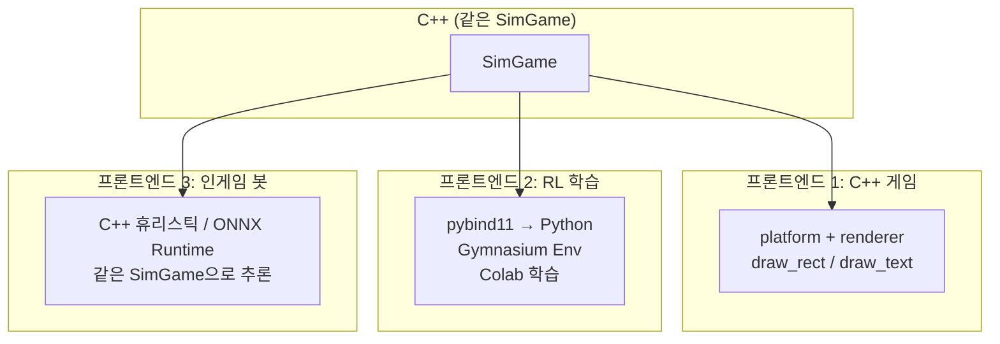
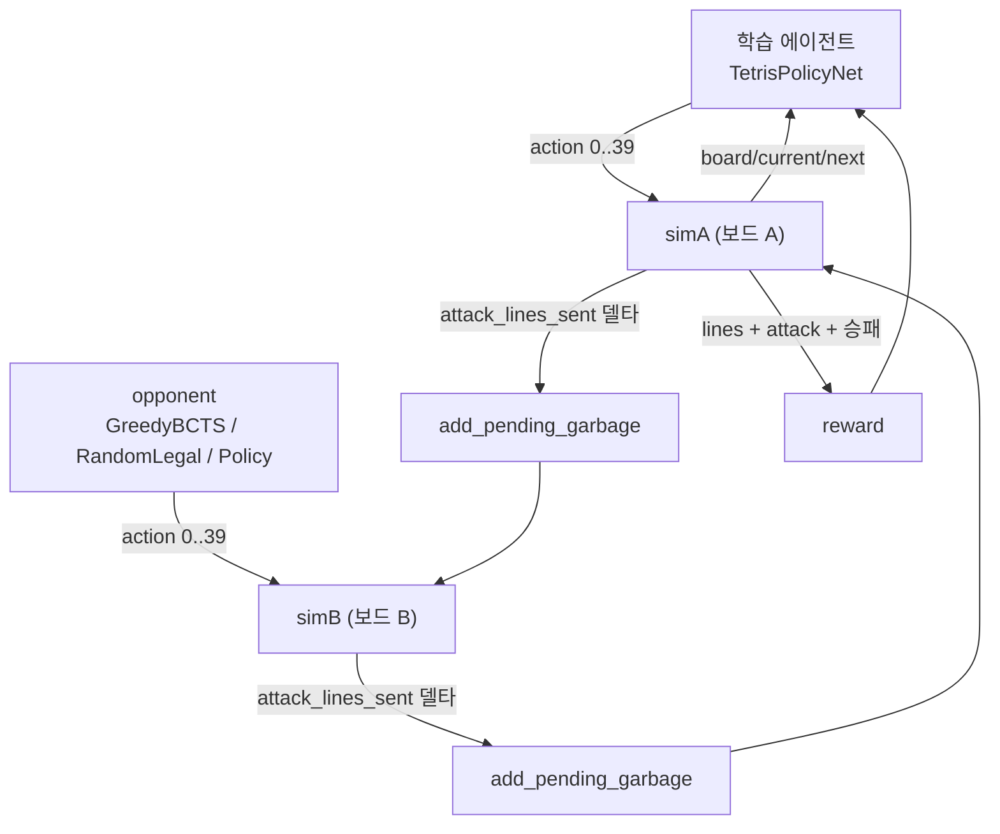
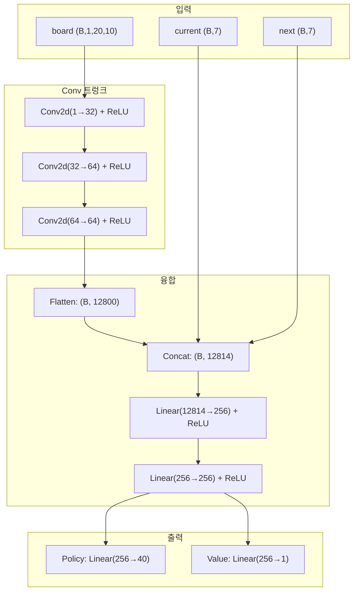
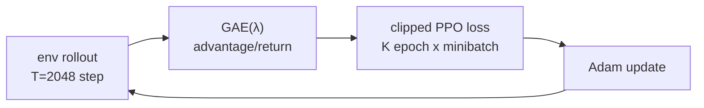
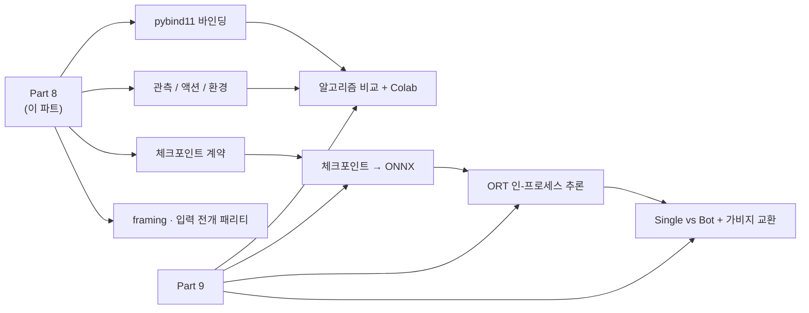

# Part 8: Python 바인딩과 강화학습 — pybind11에서 Colab 학습까지

> **시리즈:** 제로부터 멀티플레이어 테트리스 + RL까지 [시리즈 목차](./README.md) · [이전: Part 7 — 릴레이](./part7-relay-server.md) · **Part 8** · [다음: Part 9 — ONNX 봇](./part9-rl-onnx-bot.md)

---

## 이 장의 구현 계약

- **선행 상태:** Part 1의 headless `SimGame` API(`LegalPlacements`, `ApplyPlacement`, `Grid`, `StateHash`)와 `sim_hash_dump` 결정론 기준 파일, Part 6의 `net/framing.*` wire 규약.
- **이번 장의 파일:** `bindings/tetris_py.cpp`, `python/sim/`, `python/common/`, `python/train/`, `python/netbot/framing.py`, `python/netbot/input_expander.py`, `python/tests/`.
- **연결점:** Python은 게임 규칙을 다시 구현하지 않고 C++ 객체를 바인딩해 관측, 합법 행동 마스크, Gym 환경을 만든다. wire/입력 전개 계층만 Python으로 다시 쓰고, 그 재구현은 패리티 테스트로 C++ 과 고정한다.
- **완료 게이트:** 아래 다섯 항목. 각각에 대응하는 명령은 말미의 `수동 테스트` 에 있다.
  1. 네이티브 모듈 import (`from sim import SimGame`)
  2. C++ 결정론 기준과의 상태 해시 비교
  3. 환경 reset/step (단일 보드 + 2-보드 versus)
  4. 체크포인트 round-trip (arch/class 검증 포함)
  5. wire·입력 전개 패리티와 학습 스크립트 정적 파싱

## 들어가며

Part 1의 `SimGame`은 C++ 순수 로직이다. 이 시뮬레이터를 Python에 노출하면 학습 환경을 만들 수 있고, 학습된 정책은 Part 9의 인프로세스 ONNX 봇으로 배포할 수 있다. Python은 학습·export와 wire/입력 계약 테스트에만 사용하고, 실행 중인 봇은 C++ 게임 프로세스 안에서 동작한다.

이것을 실현하려면:

1. C++ SimGame을 Python에서 호출할 수 있어야 한다 (pybind11)
2. 강화학습 프레임워크가 이해하는 인터페이스로 감싸야 한다 (Gymnasium 환경)
3. 정책 네트워크를 설계하고 학습해야 한다 (CNN + policy/value head)
4. 학습된 모델을 ONNX로 내보내 C++ 게임 안에서 추론해야 한다 ([Part 9](./part9-rl-onnx-bot.md))

같은 `SimGame` C++ 코드가 세 가지 프론트엔드를 구동한다:


```mermaid
graph TB
    subgraph "C++ (같은 SimGame)"
        A["SimGame"]
    end
    subgraph "프론트엔드 1: C++ 게임"
        B["platform + renderer<br/>draw_rect / draw_text"]
    end
    subgraph "프론트엔드 2: RL 학습"
        C["pybind11 → Python<br/>Gymnasium Env<br/>Colab 학습"]
    end
    subgraph "프론트엔드 3: 인게임 봇"
        D["C++ 휴리스틱 / ONNX Runtime<br/>같은 SimGame으로 추론"]
    end

    A --> B
    A --> C
    A --> D
```

---

## 1. 왜 재구현이 아니라 바인딩인가

### 1.1 Python 으로 테트리스를 다시 짜면 무엇이 깨지는가

RL 프로젝트에서 가장 흔한 선택은 "학습용 시뮬레이터를 Python 으로 따로 짜는" 것이다. 빠르고, 의존성이 없고, 디버깅이 쉽다. 이 프로젝트는 그 길을 택하지 않았다. 이유는 하나로 요약된다 — **학습 때 본 보드와 실행 때 본 보드가 다르면 정책은 쓸모가 없다.**

두 구현이 갈라질 수 있는 지점은 생각보다 많다.

| 갈라질 수 있는 지점 | C++ `SimGame` 의 규약 |
|---|---|
| 피스 생성 순서 | XorShift64* 시드 상태에서 뽑는다. Python `random` 으로 흉내 내면 첫 피스부터 다르다 |
| 회전 축과 wall kick | `SimBlock::Rotate` 가 `cells[rotationState]` 를 순환. 회전 중심을 다르게 잡으면 같은 `(col, rot)` 이 다른 셀을 덮는다 |
| 하드 드롭 잠금 판정 | `IsBlockOutside` / `BlockFits` 조합. 경계 처리 한 칸 차이가 합법 배치 집합을 바꾼다 |
| 합법 배치 열거 | `LegalPlacements()` 가 spawn 높이에서 먼저 검증하고 그 뒤 드롭한다 (§4.4) |
| 가비지 주입 위치 | 잠금 시점에 바닥에서 밀어 올린다 |
| 라인 클리어 후 점수·레벨 | 레벨이 중력 틱 수를 바꾸고, 그게 다시 관측에 영향을 준다 |

여섯 개 중 하나만 틀려도 학습된 정책이 실전에서 다른 보드를 보게 된다. 그리고 이 종류의 버그는 **조용하다** — 예외도, 크래시도 없고, 단지 봇이 이상하게 둔다.

저장소가 이 결정을 코드 주석으로 세 군데에 못 박아 놓았다.

**현재 소스 발췌 — `bindings/tetris_py.cpp:1-10`**

```cpp
// SimGame을 Python에서 쓰기 위한 pybind11 binding.
//
// 게임 규칙을 Python으로 다시 구현하지 않고 C++ SimGame을 그대로 노출한다.
// 학습할 때와 실제로 플레이할 때의 규칙이 갈라지면 sim-to-real gap이 생기는데,
// 구현이 하나뿐이면 그 문제가 아예 없다.
//
// 두 가지 방식의 API를 제공한다.
//   - placement 단위: RL 학습용. "몇 번 열에 몇 번 회전해서 떨어뜨릴지"를 한 번에 지정
//   - frame 단위: parity test용. 한 tick의 input mask를 그대로 적용해
//                 C++ lockstep 경로와 결과가 같은지 대조
```

**현재 소스 발췌 — `python/common/obs.py:1-8`**

```python
"""SimGame -> observation tensor builder.

This module is the **only** Python place that converts a ``SimGame`` snapshot
into a network input. The C++ in-game bot's ``observe()`` (bot/placement.cpp)
mirrors this contract. There is not yet a direct Python-vs-C++ observation
parity test, so schema changes must update both implementations and be checked
with an ONNX smoke test. Keeping the conversion in one spot per language
prevents the classic "trained on one format, deployed on another" failure.
```

`same C++ source of truth` 와 `trained on one format, deployed on another` — 같은 문장의 앞뒤다. 바인딩은 이 실패 모드를 **구조적으로 불가능하게** 만든다. `sim_game.cpp` 를 고치면 게임과 학습 환경이 같은 커밋에서 함께 바뀐다.

그 대가는 두 가지다. 첫째, 학습을 시작하기 전에 C++ 툴체인과 pybind11 로 네이티브 모듈을 빌드해야 한다 (Colab 노트북이 이 단계를 자동화한다). 둘째, 프로세스당 하나의 sim 이라 벡터화 env 를 쓰려면 멀티프로세싱이 필요하다. 이 프로젝트의 학습기는 그래서 단일 동기 env 로 시작한다(§9.3).

### 1.2 그렇다면 무엇은 Python 으로 다시 쓰는가

전부 바인딩할 수는 없다. `net/framing.cpp` 와 `bot/placement.cpp` 는 **의도적으로** Python 으로 다시 구현되어 있고, 그 재구현이 원본과 같은지를 테스트가 잠근다(§12). 기준은 단순하다.

- **시뮬레이션 상태를 만드는 코드** → 바인딩. 재구현 금지.
- **바이트/마스크 포맷을 해석하는 코드** → Python 재구현 + 패리티 테스트. 릴레이 스모크 테스트 하네스가 C++ 게임 없이도 프레임을 만들 수 있어야 하기 때문.

### 1.3 왜 pybind11인가

C++에서 Python으로의 바인딩 방법은 여러 가지다:

| 방법 | 장점 | 단점 |
|------|------|------|
| ctypes / cffi | Python 표준, 별도 빌드 불필요 | C API만 가능, 클래스 노출 어려움 |
| Cython | 성숙, 성능 좋음 | 별도 언어 문법 학습 필요 |
| **pybind11** | C++11 네이티브, 헤더 전용, numpy 통합 | CMake 설정 필요 |
| SWIG | 다중 언어 | 코드 생성 복잡, C++ 템플릿 제한 |

pybind11의 결정적 장점: C++ 클래스를 그대로 Python에 노출할 수 있고, numpy 배열과의 변환이 간단하다. 헤더 전용이므로 `pip install pybind11` 후 바로 사용 가능하고, `py::return_value_policy` 로 수명 정책을 선언적으로 지정할 수 있다 — 이 프로젝트에서는 그게 §2.4 의 dangling pointer 방어에 직결된다.

### 1.4 CMakeLists 확장

이 장이 추가하는 소스는 `bindings/tetris_py.cpp` 하나다. 빌드 파일에는 새 타깃 블록 하나가 늘어난다.

**현재 소스 발췌 — `CMakeLists.txt:284-304`**

```cmake
# -----------------------------------------------------------------------------
# Target: tetris_py (pybind11 module — Colab training + parity tests)
# -----------------------------------------------------------------------------
if (TETRIS_BUILD_PY)
    # cmake 4.0+ removed FindPythonInterp/FindPythonLibs; tell pybind11 to use
    # the modern FindPython instead.
    set(PYBIND11_FINDPYTHON ON)
    # pybind11: prefer find_package (pip-installed), fall back to add_subdirectory
    # if a vendored pybind11 checkout is provided.
    find_package(pybind11 CONFIG QUIET)
    if (NOT pybind11_FOUND)
        message(FATAL_ERROR
            "pybind11 not found. Install it (pip install pybind11) and "
            "re-run cmake with -Dpybind11_DIR=$(python -m pybind11 --cmakedir)")
    endif()

    pybind11_add_module(tetris_py
        bindings/tetris_py.cpp
        ${TETRIS_SIM_SOURCES}
        ${TETRIS_SIM_HEADERS}
    )

    target_include_directories(tetris_py PRIVATE ${CMAKE_CURRENT_SOURCE_DIR})
endif()
```

`TETRIS_SIM_SOURCES` / `TETRIS_SIM_HEADERS` 는 Part 1 이 정의한 순수 시뮬 소스 목록 그대로다. 이 타깃은 렌더러도, 네트워크도, 오디오도 링크하지 않는다. 그래서 Colab Linux 컨테이너에서 SDL2 없이 빌드된다.

여기서 초심자가 반드시 밟는 함정이 두 개 있다.

1. **`TETRIS_BUILD_GAME` 은 기본 ON 이다** (`CMakeLists.txt:24`). `-DTETRIS_BUILD_PY=ON` 만 주면 게임 타깃까지 configure 되고, `third_party/httplib.h` 가 없으면 그 단계에서 FATAL_ERROR 로 죽는다. **반드시 `-DTETRIS_BUILD_GAME=OFF` 를 함께 준다.**
2. **pybind11 을 pip 로 깔아도 CMake 가 못 찾는 경우가 흔하다.** 위 FATAL_ERROR 메시지가 그대로 해답을 알려준다 — `-Dpybind11_DIR=$(python -m pybind11 --cmakedir)`.

검증된 형태는 이것이다.

```bash
cmake -S . -B build -DTETRIS_BUILD_GAME=OFF -DTETRIS_BUILD_PY=ON \
      -Dpybind11_DIR=$(uv run python -m pybind11 --cmakedir)
cmake --build build --target tetris_py
cp build/tetris_py*.so python/sim/          # Windows: build\Release\tetris_py*.pyd
```

`python/sim/` 은 `__init__.py` 가 들어 있는 얇은 래퍼 패키지다. 빌드 산출물을 그 안에 떨어뜨리면 `from sim import SimGame` 이 동작한다.

---

## 2. pybind11 바인딩 코드

### 2.1 모듈 골격

`PYBIND11_MODULE` 매크로 하나가 모듈 전체를 만든다. `SimGame::Placement`, `SimBlock`, `SimGame` 세 클래스를 등록한다.

**현재 소스 발췌 — `bindings/tetris_py.cpp:36-64`**

```cpp
PYBIND11_MODULE(tetris_py, m)
{
    m.doc() = "Headless Tetris simulation (pybind11 wrapper around SimGame)";

    // 한 번의 착수를 나타내는 (column, rotation) 쌍.
    py::class_<SimGame::Placement>(m, "Placement")
        .def_readonly("col", &SimGame::Placement::col)
        .def_readonly("rot", &SimGame::Placement::rot)
        .def("__repr__", [](const SimGame::Placement& p) {
            return "Placement(col=" + std::to_string(p.col) +
                   ", rot=" + std::to_string(p.rot) + ")";
        });

    // 관측용으로만 노출하는 테트로미노. Python 쪽에서 수정할 수 없다.
    py::class_<SimBlock>(m, "SimBlock")
        .def_readonly("id",             &SimBlock::id)
        .def_readonly("rotation_state", &SimBlock::rotationState)
        .def_readonly("row_offset",     &SimBlock::rowOffset)
        .def_readonly("column_offset",  &SimBlock::columnOffset)
        .def("cell_positions", [](const SimBlock& b) {
            // 현재 rotation 상태에서 이 블록이 차지하는 4칸의 절대 좌표.
            auto tiles = b.GetCellPositions();
            py::list out;
            for (const auto& t : tiles)
            {
                out.append(py::make_tuple(t.row, t.column));
            }
            return out;
        });
```

`__repr__` 를 붙여둔 덕에 `print(g.legal_placements())` 가 `[Placement(col=3, rot=0), ...]` 로 읽힌다. 학습 루프를 디버깅할 때 이 한 줄이 체감 차이를 만든다.

`bindings/tetris_py.cpp` 전문은 [Part 9](./part9-rl-onnx-bot.md) 의 "pybind11 바인딩" 절에 1:1 로 인용돼 있다. 이 장에서는 설계 결정이 걸려 있는 네 덩어리 — placement API, 가비지 API, `grid()` 복사, `reference_internal` — 만 본다.

### 2.2 두 개의 액션 API

**현재 소스 발췌 — `bindings/tetris_py.cpp:74-85`**

```cpp
        .def("legal_placements", &SimGame::LegalPlacements,
             "Enumerate all legal (col, rot) placements for the current piece "
             "via rotate-then-translate-then-hard-drop. Returns a list of "
             "Placement objects.")
        .def("apply_placement", &SimGame::ApplyPlacement,
             py::arg("col"), py::arg("rot"),
             "Apply a placement atomically (rotate -> translate -> hard drop -> "
             "lock). Returns the number of lines cleared, or -1 if the placement "
             "is illegal.")
        .def("clone", [](const SimGame& g) {
            return SimGame(g);
        }, "Return a deep copy of the full deterministic sim state.")
```

**현재 소스 발췌 — `bindings/tetris_py.cpp:111-118`**

```cpp
        .def("submit_input", &SimGame::SubmitInput, py::arg("input_mask"),
             "Apply a one-tick input bitmask (see core/input.h). Retained for "
             "frame-level parity/equivalence tests against the lockstep loop.")
        .def("tick", &SimGame::Tick,
             "Advance the gravity counter by one tick. Time-only progression "
             "separate from input.")
        .def("move_block_down", &SimGame::MoveBlockDown,
             "Single-step the current piece down by one row (locks on contact).")
```

`apply_placement` 는 학습이 쓰는 원자적 API (한 번 호출 = 한 피스 확정), `submit_input`/`tick` 은 Part 6 의 lockstep 경로와 프레임 단위로 같은 상태를 만드는지 검증하는 API 다. 둘 다 같은 `SimGame` 을 건드리지만 목적이 다르다 — 주석이 `Retained for frame-level parity/equivalence tests` 라고 그 목적을 명시한다.

`clone()` 은 값 복사 생성자를 그대로 노출한 것이다. 이걸 필요로 하는 학습기는 현재 하나뿐인데(CBMPI-style), 그 하나가 없으면 아예 동작하지 않는다 — 자세한 비교는 [Part 9](./part9-rl-onnx-bot.md) 의 알고리즘 비교 표에 있다.

### 2.3 전투 · 가비지 API — 2-보드 학습의 배선

단일 보드 학습만 할 거라면 필요 없지만, §6 의 versus 환경과 Part 9 의 `Single vs Bot` 가비지 교환이 모두 이 일곱 개 위에 올라간다.

**현재 소스 발췌 — `bindings/tetris_py.cpp:92-107`**

```cpp
        .def("attack_lines_sent", &SimGame::AttackLinesSent,
             "Cumulative attack lines this board has sent (monotonic). Take the "
             "delta across a placement to get the attack from that placement.")
        .def("pending_garbage", &SimGame::PendingGarbage,
             "Garbage rows queued to be injected on this board's next lock.")
        .def("add_pending_garbage", &SimGame::AddPendingGarbage, py::arg("rows"),
             "Queue `rows` garbage lines onto this board (injected on next lock). "
             "Negative/zero is ignored. Used to route an opponent's attack.")
        .def("last_lines_cleared", [](const SimGame& g) { return g.lastLinesCleared; },
             "Lines cleared by the most recent lock (0..4). Useful for reward.")
        .def("last_garbage_received", [](const SimGame& g) { return g.lastGarbageReceived; },
             "Garbage rows actually injected at the most recent lock.")
        .def("total_lines_cleared", [](const SimGame& g) { return g.totalLinesCleared; },
             "Cumulative lines cleared this game.")
        .def("level", [](const SimGame& g) { return g.level; },
             "Current gravity/speed level (1..20, +1 per 10 lines).")
```

설계의 핵심은 `attack_lines_sent()` 가 **누적 총계(monotonic)** 라는 점이다. "이번 배치가 몇 줄을 보냈는가" 를 알려면 배치 전후의 차분을 직접 계산해야 한다. 왜 이벤트가 아니라 누적값인가? 결정론 해시에 들어가는 상태이기 때문이다 — 누적 카운터는 상태의 일부라 저장·비교·재현이 되지만, "이번 틱의 이벤트" 는 소비되면 사라진다. Part 9 의 C++ `Single vs Bot` 루프도 정확히 같은 차분 패턴을 쓴다.

`pending_garbage` 는 큐다. 공격이 도착해도 즉시 밀어 올리지 않고, **받는 쪽 보드가 다음에 피스를 잠글 때** 주입된다. 이게 없으면 상대가 낙하 중인 피스가 갑자기 벽에 박히는 비결정적 상황이 생긴다.

### 2.4 `grid()`는 복사한다

**현재 소스 발췌 — `bindings/tetris_py.cpp:121-133`**

```cpp
        .def("grid", [](const SimGame& g) {
            // 내부 버퍼를 참조로 넘기지 않고 복사한다.
            // 참조를 넘기면 다음 착수 때 Python이 들고 있던 배열의 내용이
            // 조용히 바뀌어, replay buffer에 쌓아둔 관측이 전부 오염된다.
            // 200개짜리 복사는 학습 속도에 영향을 주지 않는다.
            const auto& raw = g.Grid();
            auto arr = py::array_t<int32_t>({SimGrid::kRows, SimGrid::kCols});
            auto buf = arr.mutable_unchecked<2>();
            for (int r = 0; r < SimGrid::kRows; ++r)
                for (int c = 0; c < SimGrid::kCols; ++c)
                    buf(r, c) = raw[r][c];
            return arr;
        }, "Return the 20x10 grid as a numpy int32 array (copied).")
```

참조를 반환했다면 이런 코드가 조용히 틀린다.

**예시(실제 저장소에는 없음)**

```python
arr = game.grid()            # 만약 참조라면 SimGame 내부 메모리를 직접 가리킨다
game.apply_placement(4, 0)   # SimGame 내부 상태 변경
# arr 이 "배치 이전" 이 아니라 "배치 이후" 를 보여준다 — replay buffer 가 통째로 오염
```

리플레이 버퍼는 관측을 나중에 다시 꺼내 쓴다. 참조를 담아두면 버퍼 전체가 "가장 최근 보드" 하나를 가리키게 되고, 학습은 완전히 무의미해진다. 게다가 `SimGame` 이 먼저 소멸되면 dangling pointer 다. 200개 int(800바이트) 복사 비용은 학습 처리량 대비 무시할 수 있으므로 안전한 복사를 선택했다.

### 2.5 `reference_internal` 은 무엇을 보장하고 무엇을 보장하지 않는가

**현재 소스 발췌 — `bindings/tetris_py.cpp:135-145`**

```cpp
        .def("current_block",
             &SimGame::CurrentBlock,
             py::return_value_policy::reference_internal,
             "Current falling piece.")
        .def("ghost_block",
             &SimGame::GhostBlock,
             py::return_value_policy::reference_internal,
             "Ghost/preview piece at the hard-drop target.")
        .def("next_block",
             [](const SimGame& g) { return g.NextBlock(); },
             "Copy of the first piece in the preview queue.")
```

`reference_internal` 은 pybind11 에서 `reference + keep_alive<0, 1>` 와 같다. "반환된 자식 객체가 살아 있는 동안 부모(`self`, 여기서는 `SimGame`)도 살려 둔다" 는 뜻이다. 즉 **수명 문제는 이 정책이 이미 해결했다.**

**예시**

```python
block = game.current_block()   # SimGame 내부의 SimBlock 에 대한 참조
print(block.id)                # OK
del game                       # 참조 카운트만 감소 — block 이 SimGame 을 붙잡고 있다
print(block.id)                # 여전히 유효
```

실제 위험은 소멸이 아니라 **상태 변경**이다.

**예시**

```python
block = game.current_block()
print(block.id)                # 예: 3 (I 블록)
game.apply_placement(4, 0)     # 피스가 잠기고 다음 피스가 current 가 된다
print(block.id)                # 같은 참조인데 값이 바뀌었다 — 이전 피스가 아니다
```

`block` 은 `SimGame` 내부 멤버를 가리키는 창(window)이지 스냅샷이 아니다. 관측을 보관하려면 값으로 뽑아야 한다 — `sim.current_block_id()` 처럼 정수를 읽거나, `next_block()` 처럼 복사본을 반환하는 접근자를 쓴다. `next_block` 이 복사인 이유도 같은 계열이다: preview 큐 원소라 큐가 갱신되면 참조가 무효화될 수 있다.

**규칙:** 학습 코드가 관측을 만들 때는 `grid()`(복사)와 `*_id()`(정수)만 쓴다. `current_block()` / `ghost_block()` 은 디버깅·시각화용이다.

---

## 3. 관측 공간 설계

### 3.1 관측 구성

**현재 소스 발췌 — `python/common/obs.py:36-56`**

```python
def build_observation(sim: "SimGame") -> dict[str, torch.Tensor]:
    """Convert a ``SimGame`` snapshot into the dict consumed by ``TetrisPolicyNet``.

    Returns un-batched tensors. Add a leading batch dim with ``unsqueeze(0)``
    before passing to the network — done at the call site so that batched
    rollouts and single-step inference share this builder.
    """
    import torch

    raw = np.asarray(sim.grid(), dtype=np.float32)  # (20, 10)
    occupied = ((raw > 0) & (raw != 8)).astype(np.float32)
    board = occupied[None, :, :]  # (1, 20, 10)

    current = _piece_one_hot(sim.current_block_id())
    nxt = _piece_one_hot(sim.next_block_id())

    return {
        "board": torch.from_numpy(board),
        "current": torch.from_numpy(current),
        "next": torch.from_numpy(nxt),
    }
```

| 키 | 형태 | 내용 |
|----|------|------|
| `board` | `(1, 20, 10)` float32 | 점유맵: 1 = 잠긴 블록, 0 = 빈칸 |
| `current` | `(7,)` float32 | 현재 블록 ID의 one-hot |
| `next` | `(7,)` float32 | preview 큐 첫 번째 다음 블록 ID의 one-hot |

### 3.2 함수 안의 `import torch` 는 스타일이 아니라 설계다

`build_observation` 첫 줄이 함수 **내부** `import torch` 다. 모듈 상단이 아니다. `action_mask.py::legal_mask` 도 같다. 이건 취향이 아니라 **의존성 경계**다.

`python/requirements.txt` 는 torch 를 일부러 포함하지 않는다. torch 는 `requirements-colab.txt` 와 `uv sync --extra train`(학습 환경) 쪽에만 있다. 배포·CI 머신에는 numpy 만 있으면 된다. 그런데 `common/__init__.py` 가 상단에서 torch 를 import 하면, torch 없는 머신에서는

```bash
uv run python -m pytest python/tests/test_framing_parity.py -q
```

같은 순수 Python 테스트조차 `ModuleNotFoundError` 로 죽는다. 지연 import 덕분에 `common` 패키지는 torch 없이도 import 되고, 실제로 텐서를 만드는 함수를 호출할 때만 torch 가 필요해진다. 타입 힌트도 같은 이유로 `if TYPE_CHECKING:` 블록 안에 격리돼 있다.

같은 패턴이 네이티브 모듈에도 적용된다 — `common/env.py` 와 `common/env_versus.py` 는 `from sim import SimGame` 을 `__init__` **안에서** 한다. `tetris_py` 를 아직 빌드하지 않은 머신에서도 `common` 을 import 할 수 있어야 하기 때문이다.

### 3.3 설계 결정

**고스트 블록 제외**: 고스트(id=8)는 현재 블록의 하드 드롭 위치 프리뷰다. 정책이 이미 합법적 배치(placement)를 결정하므로, 고스트 정보는 중복이다. `(raw > 0) & (raw != 8)`로 필터링한다. C++ 쪽 `bot/placement.cpp::observe` 도 문자 그대로 같은 조건식을 쓴다 — 이 한 줄이 학습-실행 격차의 최후 방어선이다.

**현재 블록의 위치/회전 제외**: placement-level API에서 정책은 "이 블록을 어디에 놓을 것인가"를 결정한다. 현재 블록의 중간 상태(떨어지는 중의 위치/회전)는 이 API에서 무관하다. 블록 **종류**(id)만 필요하므로 one-hot으로 충분하다.

**float32 점유맵**: 원본 그리드는 0~8 int이지만, CNN 입력으로는 이진 점유맵(0/1)이 적합하다. 블록 색상(1~7)은 게임 진행에 무관한 시각적 속성이므로 제거한다.

**관측에 없는 것**: 받을 예정인 가비지(`pending_garbage()`), 레벨, 점수는 관측에 넣지 않았다. 단일 보드 학습에서는 의미가 없고, §6 의 versus 환경에서도 관측 schema 를 단일 보드와 **동일하게** 유지해야 같은 `TetrisPolicyNet` 을 재사용할 수 있기 때문이다. 경쟁 신호는 관측이 아니라 `info` dict 와 보상으로 전달한다.

---

## 4. 행동 공간 설계

### 4.1 배치 수준 행동

**현재 소스 발췌 — `python/common/__init__.py:28-37`**

```python
NUM_COLS = 10
NUM_ROTATIONS = 4
NUM_PLACEMENTS = NUM_COLS * NUM_ROTATIONS  # 40

# 블록 종류 수. ID는 0이 아니라 1부터 시작한다(src/sim_blocks.h 기준).
NUM_PIECE_TYPES = 7

# 보드 크기. SimGrid::kRows / kCols와 어긋나면 관측 텐서 shape이 안 맞는다.
BOARD_ROWS = 20
BOARD_COLS = 10
```

40개 이산 행동: 10열 x 4회전. 인코딩:

$$\text{action} = \text{col} \times 4 + \text{rot}$$

**현재 소스 발췌 — `python/common/action_mask.py:25-47`**

```python
def encode_action(col: int, rot: int) -> int:
    """Map a ``(col, rot)`` placement to a flat action index in ``[0, 40)``."""
    return col * NUM_ROTATIONS + rot


def decode_action(action: int) -> tuple[int, int]:
    """Inverse of :func:`encode_action`."""
    return action // NUM_ROTATIONS, action % NUM_ROTATIONS


def legal_mask(sim: "SimGame") -> torch.Tensor:
    """Boolean tensor of shape ``(NUM_PLACEMENTS,)``.

    ``True`` at index ``encode_action(col, rot)`` iff that placement is in
    ``sim.legal_placements()``. The result lives on CPU; move to the policy
    device at the call site.
    """
    import torch

    mask = torch.zeros(NUM_PLACEMENTS, dtype=torch.bool)
    for placement in sim.legal_placements():
        mask[encode_action(placement.col, placement.rot)] = True
    return mask
```

이 수식(`col * 4 + rot`)은 C++ `bot/placement.h::encode_action` 과 **반드시** 같아야 한다. 다르면 같은 배치가 두 언어에서 다른 인덱스를 받고, 학습된 정책이 실행 시 완전히 엉뚱한 수를 둔다. Part 9 가 이 대칭성을 다시 짚는다.

### 4.2 합법 행동 마스크와 O 블록의 중복

40개 행동이 모두 항상 유효하지는 않다. `sim.legal_placements()` 가 C++ 쪽에서 회전 → 이동 → 하드 드롭을 실제로 시뮬레이션해 유효한 조합만 반환한다.

여기서 흔한 오해를 하나 정정한다. "O 블록(정사각형)은 회전이 하나뿐이므로 합법 행동이 10개다" 라는 서술은 **틀렸다.** `LegalPlacements()` 는 회전 수를 피스 모양이 아니라 `cells` 배열 크기로 정한다.

**현재 소스 발췌 — `src/sim_game.cpp:474-475`**

```cpp
    const int numRotations = static_cast<int>(currentBlock.cells.size());
    for (int rot = 0; rot < numRotations; rot++)
```

그리고 O 블록은 **동일한 cells 를 4번 등록**한다.

**현재 소스 발췌 — `src/sim_blocks.h:51-63`**

```cpp
class SimOBlock : public SimBlock
{
public:
    SimOBlock()
    {
        id = 4;
        cells[0] = {Position(0, 0), Position(0, 1), Position(1, 0), Position(1, 1)};
        cells[1] = {Position(0, 0), Position(0, 1), Position(1, 0), Position(1, 1)};
        cells[2] = {Position(0, 0), Position(0, 1), Position(1, 0), Position(1, 1)};
        cells[3] = {Position(0, 0), Position(0, 1), Position(1, 0), Position(1, 1)};
        Move(0, 4);
    }
};
```

결과적으로 O 블록의 합법 배치는 빈 보드에서 **36개**(9열 × 4회전)다. 4개씩 묶인 9개의 중복 그룹이며, 같은 그룹의 네 액션은 결과 보드가 완전히 동일하다.

이 중복을 제거하지 않은 이유는 **인덱스 대칭**이다. 액션 공간을 피스별로 줄이면 `encode_action` 이 피스에 따라 달라지고, C++ 런타임과 Python 학습이 같은 수식을 공유할 수 없게 된다. 40 고정 + 마스크가 훨씬 단순하다.

대가는 정책 분포의 희석이다. O 블록 차례에 정책은 사실상 9개의 선택지를 36개 슬롯에 나눠 담아야 하고, 엔트로피 보너스가 그 중복 위에서도 작동한다. 학습 정합성이 깨지지는 않는다 — 네 중복 액션은 모두 같은 다음 상태로 가므로 value 추정도 같은 값으로 수렴한다. 다만 O 블록에서 정책 엔트로피가 구조적으로 `log 4` 만큼 부풀어 보인다는 점은 로그를 읽을 때 알고 있어야 한다.

이 동작을 코드 주석이 한동안 반대로 적고 있었다. `python/common/__init__.py` 와 `python/common/action_mask.py` 의 docstring 이 둘 다 `the legal mask zeros those out` — "중복 회전은 마스크가 0으로 만든다" 고 썼는데, 마스크는 그런 일을 하지 않는다. 불법 배치만 거를 뿐 **중복은 그대로 남긴다.**

지금은 두 docstring 모두 실제 동작과 인덱스 대칭이라는 이유까지 함께 적도록 고쳐져 있다.

**현재 소스 발췌 — `python/common/action_mask.py:1-12`**

```python
"""Legal action masks for the placement-level action space.

The action space is fixed at ``NUM_PLACEMENTS == NUM_COLS * NUM_ROTATIONS == 40``,
encoded as ``action_index = col * NUM_ROTATIONS + rot``.

The mask zeros out placements that are out of bounds or blocked, so the policy
can never sample an illegal move. It does **not** deduplicate: a piece whose
rotations are not all distinct (O has one shape, I/S/Z have two) keeps every
rotation index that lands legally, so the same resulting board can be reachable
through more than one action. That dilutes the policy distribution slightly but
keeps the action index identical on both sides of the pybind11 boundary.
"""
```

주석이 코드와 반대를 말하는 것은 주석이 없는 것보다 나쁘다. 이 경우 읽는 사람은 "중복은 처리됐구나" 하고 넘어가고, 나중에 O 블록에서 엔트로피가 이상하게 높은 것을 보고도 원인을 딴 데서 찾게 된다.

### 4.3 합법 액션 수 — 실측

마스킹의 필요성을 "행동의 절반이 불법이라서" 로 설명하는 것은 실측과 맞지 않는다. 네이티브 모듈로 직접 세어 보면 이렇다.

- 빈 보드 기준: I 블록 31개, O 블록 36개, 나머지 다섯 피스 33개.
- 시드 1~50, 각 최대 60 배치를 **무작위 합법 배치**로 진행한 949 상태의 평균: **31.85 / 40**. 피스별 평균은 I 29.5 ~ O 35.2 범위.
- 스택이 높아진 말기 상태에서 최소 4개까지 떨어진다.

즉 통상 구간에서 불법 비율은 20~25% 수준이다. 마스킹이 필요한 진짜 이유는 "샘플의 절반이 낭비" 가 아니라 다음 두 가지다.

1. **불법 행동은 0 보상 no-op 다.** `TetrisPlacementEnv.step` 은 `cleared < 0` 이면 sim 을 진행시키지 않고 0 을 돌려준다(§5.2). 에이전트가 그 행동을 반복하면 에피소드가 진행되지 않은 채 rollout 슬롯만 소모된다. gradient 는 "아무것도 안 하는 행동" 을 학습하게 되고, 이건 신호가 아니라 잡음이다.
2. **마스킹 없이는 확률이 새 나간다.** 학습 후반에 정책이 날카로워져도, 불법 행동에 남은 잔여 확률은 사라지지 않는다. `-inf` 마스킹은 그 확률을 **정확히 0** 으로 만들어 남은 확률 질량 전부를 합법 행동 위에 재정규화한다. 이건 탐색 효율의 문제가 아니라 분포의 정의 문제다.

**현재 소스 발췌 — `python/common/models.py:98-107`**

```python
def masked_log_softmax(
    logits: torch.Tensor, mask: torch.Tensor, eps: float = 1e-9
) -> torch.Tensor:
    """Apply a boolean legal-action ``mask`` to ``logits`` then log-softmax.

    Setting illegal logits to ``-inf`` makes their softmax probability zero,
    so sampling and ``argmax`` only ever pick legal placements.
    """
    masked = logits.masked_fill(~mask, float("-inf"))
    return F.log_softmax(masked + eps, dim=-1)
```

### 4.4 placement-level 액션의 대가

placement-level 을 택한 이득은 명확하다. 프레임 단위 액션이면 한 피스를 놓기까지 20-30 틱을 예측해야 하고, 그 중 실제 의사결정은 하나뿐이다. placement 단위는 그 의사결정을 한 스텝으로 묶는다. 게다가 BCTS·Dellacherie 같은 고전 알고리즘이 전부 placement-level 이라 벤치마크 호환성이 공짜로 따라온다.

대가는 잘 언급되지 않으니 여기 적는다.

**1. 중력 타이밍과 soft drop 을 표현할 수 없다.** 액션은 "어디에 놓을지" 만 말하고, "언제/얼마나 천천히" 는 `expand_placement`(§12.3)가 기계적으로 정한다. 20G 상황이나 lock delay 를 이용한 기교는 액션 공간 밖이다.

**2. T-spin 이 표현되지 않는다.** T-spin 은 "회전으로 진입해야만 도달 가능한 위치" 다. 액션이 최종 `(col, rot)` 만 지정하고 도달 경로는 회전 → 이동 → 하드 드롭으로 고정돼 있으므로, 회전으로 끼워 넣는 배치는 애초에 열거되지 않는다.

**3. tuck / slide 배치가 액션 공간에서 아예 배제된다.** 이건 구조적이다. `LegalPlacements()` 는 회전·이동을 **spawn 높이에서 먼저 검증**하고, 통과한 것만 하드 드롭한다.

**현재 소스 발췌 — `src/sim_game.cpp:479-496`**

```cpp
            // Start from a fresh copy of the live piece.
            SimBlock test = currentBlock;
            // Rotate in place to the target rotation.
            while (test.rotationState != rot)
            {
                test.Rotate();
            }
            // Slide horizontally to the target column offset.
            int delta = col - test.columnOffset;
            test.columnOffset += delta;
            // Reject if the rotated & translated piece is invalid at spawn height.
            if (IsBlockOutside(test) || !BlockFits(test)) continue;
            // Hard drop simulation.
            while (IsBlockOutside(test) == false && BlockFits(test) == true)
            {
                test.rowOffset++;
            }
            test.rowOffset--;
```

`Reject if the rotated & translated piece is invalid at spawn height` 한 줄이 "오버행 아래로 밀어 넣는 수" 를 전부 제거한다. 사람이 두는 테트리스에서는 스택이 높아졌을 때 이런 수가 승부를 가르지만, 이 액션 공간에서는 존재하지 않는다. 학습된 정책의 상한이 여기서 한 번 잘린다.

이 세 가지는 "그래서 잘못된 선택" 이라는 뜻이 아니다. **아는 채로 감수한 비용**이며, 나중에 액션 공간을 확장할 때 어디를 건드려야 하는지를 알려준다 — `LegalPlacements()` 의 spawn-height reject 를 완화하고, `expand_placement` 에 경로 탐색을 넣으면 된다. 그 순간 C++/Python 양쪽과 ONNX 출력 차원이 함께 바뀐다는 것도 같이 알아야 한다.

---

## 5. Gymnasium 환경 — 단일 보드

### 5.1 인터페이스

**현재 소스 발췌 — `python/common/env.py:43-82`**

```python
class TetrisPlacementEnv(gym.Env if _HAS_GYM else object):  # type: ignore[misc]
    """Single-player Tetris environment exposing placement-level actions."""

    metadata = {"render_modes": []}

    def __init__(self, seed: int | None = None) -> None:
        if not _HAS_GYM:
            raise ImportError(
                "gymnasium is required for TetrisPlacementEnv. "
                "Install it with `pip install gymnasium`."
            )
        # 여기서 import하는 이유가 있다. 최상단에서 하면 tetris_py를 빌드하지 않은
        # 환경에서 common 패키지 자체를 import할 수 없게 된다.
        # 가짜 SimGame을 끼워 넣는 테스트도 이 지연 import 덕분에 가능하다.
        from sim import SimGame  # noqa: PLC0415

        self._SimGame = SimGame
        self._seed = seed if seed is not None else 0
        self.sim: SimGame | None = None

        self.action_space = spaces.Discrete(NUM_PLACEMENTS)
        self.observation_space = spaces.Dict(
            {
                "board": spaces.Box(
                    low=0.0, high=1.0,
                    shape=(1, BOARD_ROWS, BOARD_COLS),
                    dtype=np.float32,
                ),
                "current": spaces.Box(
                    low=0.0, high=1.0,
                    shape=(NUM_PIECE_TYPES,),
                    dtype=np.float32,
                ),
                "next": spaces.Box(
                    low=0.0, high=1.0,
                    shape=(NUM_PIECE_TYPES,),
                    dtype=np.float32,
                ),
            }
        )
```

표준 Gymnasium 인터페이스를 따르므로, CleanRL, Stable Baselines3, RLlib 등 어떤 RL 프레임워크든 바로 연결 가능하다. `gymnasium` 자체도 optional import 라 (`_HAS_GYM`), 설치돼 있지 않으면 생성자에서 명확한 `ImportError` 를 던진다 — 모듈 import 시점에 죽지 않는다.

### 5.2 step()

**현재 소스 발췌 — `python/common/env.py:96-115`**

```python
    def step(
        self, action: int
    ) -> tuple[dict[str, np.ndarray], float, bool, bool, dict[str, Any]]:
        assert self.sim is not None, "Call reset() before step()"

        col, rot = decode_action(int(action))
        cleared = self.sim.apply_placement(col, rot)

        if cleared < 0:
            # 불법 수가 오면 판을 건드리지 않고 보상 0만 돌려준다.
            # legal_mask를 제대로 쓰면 여기 올 일이 없지만, 마스킹을 빠뜨린
            # 학습 코드가 조용히 이상한 상태로 가는 것보다는 낫다.
            reward = 0.0
            terminated = self.sim.game_over()
        else:
            reward = float(cleared)
            terminated = self.sim.game_over()

        truncated = False
        return self._observation(), reward, terminated, truncated, self._info()
```

**보상 = 클리어된 줄 수 (0~4)**. 이 단순한 보상 함수가 작동하는 이유: 라인을 많이 클리어하면 높은 보상, 게임 오버되면 에피소드 종료(미래 보상 상실). 에이전트는 자연스럽게 "오래 생존하면서 많이 클리어"하는 전략을 학습한다.

보상을 단순하게 둔 이유는 **피처 엔지니어링을 보상 엔지니어링으로 옮기는 함정**을 피하기 위함이다. "구멍 하나당 -0.5, 높이 편차 -0.1" 같은 dense reward 를 설계하면 결국 §10 의 BCTS 평가 함수를 reward 공간에서 다시 짜는 셈이 된다. 다만 이 희박함이 학습 초기에 실제 문제가 되므로, PPO 학습기는 env 밖에서 shaping 항을 더하는 절충을 택했다(§9.4). **env 자체의 계약은 순수하게 유지**하고 shaping 은 학습기 쪽 옵션으로 둔 것이 중요하다 — 평가 지표가 오염되지 않는다.

### 5.3 info dict

**현재 소스 발췌 — `python/common/env.py:125-131`**

```python
    def _info(self) -> dict[str, Any]:
        assert self.sim is not None
        return {
            "legal_mask": legal_mask(self.sim).numpy(),
            "score": self.sim.score(),
            "state_hash": self.sim.state_hash(),
        }
```

`legal_mask`는 매 step마다 반환된다. 정책이 이 마스크를 사용해 불법 행동을 필터링한다. `state_hash`는 디버깅 용도이자 **환경 결정론의 증거**다 — 같은 시드와 같은 행동 열이면 같은 해시 열이 나와야 한다.

---

## 6. 2-보드 versus 환경

### 6.1 왜 필요한가

`TetrisPlacementEnv` 로 학습한 정책은 "혼자 오래 살아남으며 줄을 지우는" 법을 배운다. 그런데 이 게임의 실제 승부는 Part 6 이 만든 **가비지 교환**이다 — 줄을 지우면 상대 보드 바닥에 쓰레기 줄이 올라온다. 혼자 두는 환경에는 그 압력이 아예 없으므로, 단일 보드 정책은 "공격" 이라는 개념 자체를 학습하지 못한다.

`python/common/env_versus.py` 가 그 간극을 메운다. 두 개의 `SimGame` 을 두고 한쪽은 학습 에이전트가, 다른 쪽은 상대(opponent)가 조종하며, §2.3 의 가비지 API로 공격을 서로 라우팅한다. 모듈 도입부가 이 배선이 C++ 게임의 미러링임을 명시한다.

**현재 소스 발췌 — `python/common/env_versus.py:1-38`**

```python
"""Two-board competitive (versus) Tetris environment.

This is the garbage-trading counterpart to ``common.env.TetrisPlacementEnv``.
The learning agent controls board A; an *opponent* controls board B. Line
clears send garbage to the other board, exactly mirroring the C++ game's
combat wiring (``src/main.cpp``: take the ``attack_lines_sent()`` delta after a
placement and route it to the other board's ``add_pending_garbage()``; the
garbage is injected at the receiving board's next lock — ``SimGame::LockBlock``).

Design goals:

* **Drop-in for existing single-agent trainers.** The observation is identical
  to ``TetrisPlacementEnv`` (the agent's own ``board``/``current``/``next``), so
  ``common.models.TetrisPolicyNet`` and the PPO/DQN/A2C/CEM loops train against
  it unchanged. The competitive pressure arrives *through the board* (received
  garbage raises the agent's stack) and *through the reward* (attack sent +
  win/loss bonus). Extra competitive signals live in ``info`` for wrappers that
  want them.
* **Self-play ready.** Pass any ``opponent`` — a scripted heuristic
  (``GreedyBCTSOpponent``, the default), random legal play
  (``RandomLegalOpponent``), or a snapshot of the current policy via
  ``PolicyOpponent`` — to train against a frozen copy of yourself.

Action / observation contract (agent side)::

    action_space      = Discrete(40)                      # encode_action(col, rot)
    observation_space = Dict(board, current, next)        # same as single-player
    info["legal_mask"]        = bool (40,)
    info["incoming_garbage"]  = int   # queued on the agent's board
    info["agent_attack"]      = int   # lines the agent sent this step
    info["opp_attack"]        = int   # lines the opponent sent this step
    info["opp_alive"]         = bool

Reward per step = ``lines_cleared + attack_weight * attack_sent``; on the
terminal step ``+win_bonus`` if only the opponent topped out, ``-loss_penalty``
if the agent topped out (including a simultaneous top-out). Treating a mutual
top-out as a loss prevents the learning agent from exploiting suicidal attacks.
"""
```

핵심 설계 결정은 첫 번째 bullet 이다. **관측 schema 를 단일 보드와 동일하게 유지한다.** 상대 보드를 관측에 넣으면 `TetrisPolicyNet` 의 입력 차원이 바뀌고, 그러면 `ARCH_VERSION` 을 올려야 하고, ONNX 입출력 계약(Part 9)도 바뀌고, C++ `observe()` 도 바뀌어야 한다. 대신 경쟁 압력을 **보드를 통해** (받은 가비지가 내 스택을 올린다) 와 **보상을 통해** (보낸 공격 + 승패 보너스) 전달한다. 덕분에 기존 PPO/DQN/A2C/CEM 루프가 코드 수정 없이 versus 환경을 학습할 수 있다.


```mermaid
graph TB
    Agent["학습 에이전트<br/>TetrisPolicyNet"] -->|action 0..39| SimA["simA (보드 A)"]
    Opp["opponent<br/>GreedyBCTS / RandomLegal / Policy"] -->|action 0..39| SimB["simB (보드 B)"]
    SimA -->|attack_lines_sent 델타| GB["add_pending_garbage"]
    GB --> SimB
    SimB -->|attack_lines_sent 델타| GA["add_pending_garbage"]
    GA --> SimA
    SimA -->|board/current/next| Agent
    SimA -->|lines + attack + 승패| R["reward"]
    R --> Agent
```

### 6.2 상대 3종

**현재 소스 발췌 — `python/common/env_versus.py:74-96`**

```python
class VersusOpponent:
    """Decides one placement for a board. Return an encoded action (0..39) or
    ``None`` if the board has no legal move (treated as a pass)."""

    def reset(self) -> None:  # noqa: D401 - optional hook
        """Called on env reset. Override to reset per-episode state."""

    def act(self, sim: Any) -> Optional[int]:
        raise NotImplementedError


class RandomLegalOpponent(VersusOpponent):
    """Picks a uniformly random legal placement. Seeded for reproducibility."""

    def __init__(self, seed: int | None = None) -> None:
        self._rng = random.Random(seed)

    def act(self, sim: Any) -> Optional[int]:
        placements = sim.legal_placements()
        if not placements:
            return None
        p = self._rng.choice(placements)
        return encode_action(int(p.col), int(p.rot))
```

기본 상대는 1-ply 그리디 BCTS다. §10 의 `bcts_score()` 를 실제로 **선택 루프에 연결하는 유일한 Python 구현체**이기도 하다.

**현재 소스 발췌 — `python/common/env_versus.py:99-123`**

```python
class GreedyBCTSOpponent(VersusOpponent):
    """One-ply Dellacherie/BCTS greedy: clone the board, try every legal
    placement, keep the one with the best post-placement BCTS score. A solid,
    dependency-light sparring partner (the same evaluator CBMPI improves on)."""

    def __init__(self, line_weight: float = 1.0) -> None:
        self._line_weight = line_weight

    def act(self, sim: Any) -> Optional[int]:
        placements = sim.legal_placements()
        if not placements:
            return None
        best_action = None
        best_score = -float("inf")
        for p in placements:
            child = sim.clone()
            cleared = int(child.apply_placement(int(p.col), int(p.rot)))
            if cleared < 0:
                continue
            board = np.asarray(child.grid(), dtype=np.float32)
            score = self._line_weight * float(cleared) + bcts_score(board, cleared)
            if score > best_score:
                best_score = score
                best_action = encode_action(int(p.col), int(p.rot))
        return best_action
```

`sim.clone()`(§2.2)이 여기서 쓰인다. 원본 보드를 건드리지 않고 각 후보 배치의 결과 보드를 만들어야 하므로 값 복사가 필수다. C++ 쪽 `heuristic_placement` (Part 9)가 `SimGame trial = sim;` 으로 같은 일을 한다.

세 번째 상대가 자기 대전(self-play)의 진입점이다.

**현재 소스 발췌 — `python/common/env_versus.py:126-139`**

```python
class PolicyOpponent(VersusOpponent):
    """Wraps a callable ``policy_fn(obs_dict, legal_mask_np) -> action`` so a
    trained (or snapshot) policy can be the opponent for self-play. The env
    builds the opponent's own observation from its board before calling."""

    def __init__(self, policy_fn: Callable[[dict[str, np.ndarray], np.ndarray], int]) -> None:
        self._policy_fn = policy_fn

    def act(self, sim: Any) -> Optional[int]:
        obs = {k: v.numpy() for k, v in build_observation(sim).items()}
        mask = legal_mask(sim).numpy()
        if not mask.any():
            return None
        return int(self._policy_fn(obs, mask))
```

`policy_fn` 이 콜러블이므로 얼려둔 체크포인트든, 현재 학습 중인 네트워크의 복사본이든 그대로 넣을 수 있다. 관측을 상대 보드 기준으로 다시 만드는 것이 포인트다 — 상대도 자기 보드를 자기 시점에서 본다.

### 6.3 step — 공격 라우팅과 보상

**현재 소스 발췌 — `python/common/env_versus.py:211-269`**

```python
    def step(
        self, action: int
    ) -> tuple[dict[str, np.ndarray], float, bool, bool, dict[str, Any]]:
        assert self.simA is not None, "Call reset() before step()"

        col, rot = decode_action(int(action))
        cleared = self.simA.apply_placement(col, rot)

        if cleared < 0:
            # 불법 수면 내 보드는 그대로 두고 넘어간다.
            # 상대는 계속 두므로 결과적으로 한 수를 손해 보는 셈이다.
            return (
                self._observation(self.simA),
                0.0,
                self.simA.game_over(),
                False,
                self._info(0, 0),
            )

        # 이번 수로 보낸 공격을 상대 보드에 쌓는다.
        # 누적값의 차이를 쓰는 이유는 SimGame이 총합만 들고 있기 때문이다.
        agent_attack = self.simA.attack_lines_sent() - self._last_attack_a
        self._last_attack_a = self.simA.attack_lines_sent()
        if agent_attack > 0:
            self.simB.add_pending_garbage(agent_attack)

        # 상대도 한 수 둔다. 그쪽 공격은 반대로 내 보드에 쌓인다.
        opp_attack = 0
        if not self.simB.game_over():
            opp_action = self._opponent.act(self.simB)
            if opp_action is not None:
                bc, br = decode_action(int(opp_action))
                if self.simB.apply_placement(bc, br) >= 0:
                    opp_attack = self.simB.attack_lines_sent() - self._last_attack_b
                    self._last_attack_b = self.simB.attack_lines_sent()
                    if opp_attack > 0:
                        self.simA.add_pending_garbage(opp_attack)

        a_dead = self.simA.game_over()
        b_dead = self.simB.game_over()

        reward = float(cleared) + self.attack_weight * float(agent_attack)
        terminated = a_dead or b_dead
        if terminated:
            reward += _terminal_bonus(
                a_dead, b_dead, self.win_bonus, self.loss_penalty
            )
            # 둘 다 동시에 죽으면 패배로 친다.
            # 무승부를 인정하면 '같이 죽자'는 전략이 이득이 되어 버린다.

        self._pieces += 1
        truncated = self._pieces >= self.max_pieces
        return (
            self._observation(self.simA),
            reward,
            terminated,
            truncated,
            self._info(agent_attack, opp_attack),
        )
```

보상은 세 항의 합이다.

$$r = \text{cleared} + w_{\text{attack}} \cdot \text{attack} + \begin{cases} +\text{win\_bonus} & \text{상대만 탑아웃} \\ -\text{loss\_penalty} & \text{에이전트 탑아웃} \\ 0 & \text{그 외}\end{cases}$$

기본값은 `attack_weight=0.5`, `win_bonus=10.0`, `loss_penalty=10.0`, `max_pieces=2000`. 한 스텝 = 에이전트 한 피스 + 상대 한 피스이므로 두 보드가 같은 속도로 진행한다(실시간이 아니라 턴제 근사).

승패 처리에 미묘한 결정이 하나 숨어 있다.

**현재 소스 발췌 — `python/common/env_versus.py:62-70`**

```python
def _terminal_bonus(
    a_dead: bool, b_dead: bool, win_bonus: float, loss_penalty: float
) -> float:
    """Terminal reward from the learning agent's perspective."""
    if b_dead and not a_dead:
        return float(win_bonus)
    if a_dead:
        return -float(loss_penalty)
    return 0.0
```

`if a_dead:` 가 두 번째 분기다 — **동시 탑아웃은 패배로 친다.** 무승부를 0으로 두면 에이전트가 "어차피 죽을 거면 상대도 같이 죽이는" 자폭 전략에 보상을 받는다. `Mutual top-out is an agent loss: do not reward suicidal attacks.` 주석이 그 의도를 못 박는다.

### 6.4 info 로 나가는 경쟁 신호

**현재 소스 발췌 — `python/common/env_versus.py:275-287`**

```python
    def _info(self, agent_attack: int, opp_attack: int) -> dict[str, Any]:
        assert self.simA is not None and self.simB is not None
        return {
            "legal_mask": legal_mask(self.simA).numpy(),
            "score": self.simA.score(),
            "state_hash": self.simA.state_hash(),
            "incoming_garbage": self.simA.pending_garbage(),
            "agent_attack": int(agent_attack),
            "opp_attack": int(opp_attack),
            "opp_alive": not self.simB.game_over(),
            "agent_lines": self.simA.total_lines_cleared(),
            "opp_lines": self.simB.total_lines_cleared(),
        }
```

앞의 세 키는 `TetrisPlacementEnv` 와 동일하고, 뒤의 여섯 개가 versus 전용이다. 관측을 건드리지 않고 여기에 실은 것이 §6.1 의 설계 결정이다 — 이 신호를 쓰고 싶은 래퍼는 `info` 에서 꺼내 관측에 붙이면 되고, 안 쓰는 학습기는 그냥 무시한다.

### 6.5 현재 한계 — trainer CLI 에서 선택 불가

여기가 중요하다. `python/train/*.py` 의 모든 trainer 는 `TetrisPlacementEnv` 를 **직접 생성**한다. `--env versus` 같은 옵션은 없다.

**현재 소스 발췌 — `python/train/README_colab.md:41-43`**

```markdown
The current trainer CLIs instantiate `TetrisPlacementEnv` directly; selecting
`TetrisVersusEnv` is not yet a command-line option. To train versus play, wire
this environment into a trainer or wrapper explicitly. The regression test is:
```

이어지는 줄이 회귀 테스트 명령(`python -m pytest tests/test_versus_env.py -q`)과 "네이티브 모듈과 Gymnasium 이 없으면 pytest 가 모듈을 skip 한다" 는 단서다.

즉 `TetrisVersusEnv` 는 **검증된 채로 대기 중인 부품**이다. 회귀 테스트 7개가 가비지 주입, 관측 shape, 완주, 동시 탑아웃 패널티, 스택 상승, 결정론, 공격 라우팅 총량 일치를 잠그고 있어서, 학습기에 연결하는 작업은 env 생성 한 줄을 바꾸는 일로 줄어든다. 다만 **현재 저장소를 그대로 실행하면 단일 보드로 학습된다** 는 사실을 문서가 숨기면 안 된다.

가장 엄격한 테스트는 공격 총량 회계다.

**현재 소스 발췌 — `python/tests/test_versus_env.py:115-138`**

```python
def test_env_attack_routes_to_opponent():
    """When the agent sends attack lines (info['agent_attack'] > 0) the
    opponent must receive at least that much garbage over the episode."""
    env = TetrisVersusEnv(seed=11, opponent=GreedyBCTSOpponent(),
                          max_pieces=400)
    _, info = env.reset()
    total_agent_attack = 0
    total_opp_garbage_received = 0
    for _ in range(400):
        # A random stack usually tops out before clearing a line, which made
        # the old conditional assertion vacuous. BCTS guarantees this fixture
        # exercises at least one attack while keeping both boards alive longer.
        action = GreedyBCTSOpponent().act(env.simA)
        assert action is not None
        _, _, terminated, truncated, info = env.step(action)
        total_agent_attack += info["agent_attack"]
        # The opponent consumes pending garbage during its placement in the
        # same env.step(), so inspect the lock event rather than the drained
        # pending queue after the step.
        total_opp_garbage_received += env.simB.last_garbage_received()
        if terminated or truncated:
            break
    assert total_agent_attack > 0, "fixture must send attack (non-vacuous regression)"
    assert total_opp_garbage_received == total_agent_attack
```

주석 두 개가 이 테스트를 쓰면서 실제로 밟은 함정을 기록하고 있다. 첫째, 무작위 에이전트로는 줄을 거의 못 지워서 `total_agent_attack > 0` 조건이 공허하게 통과했다 — BCTS 를 에이전트 쪽에도 써서 반드시 공격이 발생하게 만들었다. 둘째, `pending_garbage()` 를 스텝 후에 읽으면 이미 상대가 소비한 뒤라 0 이다 — **잠금 이벤트**(`last_garbage_received()`)를 봐야 한다. 큐가 아니라 이벤트를 합산해야 회계가 맞는다.

게이트 명령:

```bash
uv run python -m pytest python/tests/test_versus_env.py -q
```

파일 첫머리의 `pytest.importorskip("sim")` / `pytest.importorskip("gymnasium")` 때문에, `tetris_py` 를 빌드하지 않았거나 `gymnasium` 이 없으면 **모듈 전체가 조용히 skip 된다**. 그러면 `1 skipped` 만 뜨고 초록으로 보인다. 이 테스트 7개가 실제로 돌았는지는 `-rs` 를 붙여 skip 사유를 확인하거나, `7 passed` 를 눈으로 확인해야 알 수 있다. `uv sync --dev` 만으로는 `gymnasium` 이 설치되지 않는다 (`train` extra 에 있다).

---

## 7. CNN 정책 네트워크

### 7.1 아키텍처

**현재 소스 발췌 — `python/common/models.py:43-79`**

```python
    def __init__(
        self,
        board_channels: int = 1,
        conv_channels: tuple[int, ...] = (32, 64, 64),
        hidden: int = 256,
        n_placements: int = NUM_PLACEMENTS,
        n_piece_types: int = NUM_PIECE_TYPES,
    ) -> None:
        super().__init__()
        self.board_channels = board_channels
        self.conv_channels = conv_channels
        self.hidden = hidden
        self.n_placements = n_placements
        self.n_piece_types = n_piece_types

        # 보드를 훑는 conv 스택. 20x10을 그대로 이미지처럼 다룬다.
        layers: list[nn.Module] = []
        in_ch = board_channels
        for out_ch in conv_channels:
            layers.append(nn.Conv2d(in_ch, out_ch, kernel_size=3, padding=1))
            layers.append(nn.ReLU(inplace=True))
            in_ch = out_ch
        self.trunk = nn.Sequential(*layers)

        flat = conv_channels[-1] * BOARD_ROWS * BOARD_COLS

        # conv가 뽑은 보드 특징에 현재/다음 블록 one-hot을 이어 붙인다.
        # 어떤 블록이 오는지 모르면 어디에 둘지 정할 수 없기 때문이다.
        self.fuse = nn.Sequential(
            nn.Linear(flat + 2 * n_piece_types, hidden),
            nn.ReLU(inplace=True),
            nn.Linear(hidden, hidden),
            nn.ReLU(inplace=True),
        )

        self.policy_head = nn.Linear(hidden, n_placements)
        self.value_head = nn.Linear(hidden, 1)
```

레이어 스택이 하드코딩이 아니라 `conv_channels` 튜플 루프라는 점에 주의한다. 기본값 `(32, 64, 64)` 로 3-Conv 스택이 만들어지고, `flat = 64 * 20 * 10 = 12800`, `fuse` 첫 Linear 입력은 `12800 + 14 = 12814` 다. 인자를 바꾸면 구조가 바뀌므로 **`ARCH_VERSION` 도 함께 올려야 한다**(§7.3).


```mermaid
graph TB
    subgraph "입력"
        A["board (B,1,20,10)"]
        B["current (B,7)"]
        C["next (B,7)"]
    end
    subgraph "Conv 트렁크"
        D["Conv2d(1→32) + ReLU"]
        E["Conv2d(32→64) + ReLU"]
        F["Conv2d(64→64) + ReLU"]
    end
    subgraph "융합"
        G["Flatten: (B, 12800)"]
        H["Concat: (B, 12814)"]
        I["Linear(12814→256) + ReLU"]
        J["Linear(256→256) + ReLU"]
    end
    subgraph "출력"
        K["Policy: Linear(256→40)"]
        L["Value: Linear(256→1)"]
    end

    A --> D --> E --> F --> G
    G --> H
    B --> H
    C --> H
    H --> I --> J
    J --> K
    J --> L
```

### 7.2 설계 결정

**Conv2d(kernel=3, padding=1)**: 3x3 커널로 인접 셀의 패턴(빈 행, 높이 차이, 구멍)을 감지한다. `padding=1`로 공간 차원을 보존한다. 테트리스 보드는 20x10으로 작아서 풀링 없이 전체 해상도를 유지한다.

**현재/다음 블록을 concat으로 융합**: 블록 정보를 CNN 입력 채널로 추가하는 방법도 있지만, one-hot 벡터 7개를 20x10 전체에 브로드캐스트하면 파라미터 대비 정보가 희박하다. flatten 후 concat이 더 효율적이다. 현재 학습 입력은 preview 큐의 첫 번째 next 만 쓰며, 3-piece preview 전체를 정책에 넣고 싶으면 `next_block_ids()` 를 별도 feature 로 확장한다.

**Actor-Critic 구조**: policy head(40개 logit)와 value head(스칼라)를 공유 트렁크에서 분기한다. PPO/A2C 같은 actor-critic policy gradient 알고리즘은 이 구조를 그대로 쓰고, DQN/DDQN 계열은 `policy_logits` 를 Q-value 로 해석한다. 즉 같은 `TetrisPolicyNet` 체크포인트 형식을 유지하면서 여러 알고리즘을 붙일 수 있다. 이 "형식 하나, 알고리즘 여럿" 계약이 이 프로젝트의 배포 파이프라인 전체를 지탱한다 — 알고리즘별 차이는 [Part 9](./part9-rl-onnx-bot.md) 의 비교 표에 있다.

### 7.3 ARCH_VERSION 가드

**예시**

```python
ARCH_VERSION = 1
```

아키텍처가 바뀔 때마다 이 값을 증가시킨다. 체크포인트 로더가 이 값을 검증한다.

아키텍처를 바꾸고 `ARCH_VERSION`을 올리지 않으면: Colab에서 학습한 가중치가 엉뚱한 레이어에 로드되어, 모델이 의미 없는 행동을 출력한다. PyTorch의 `load_state_dict`는 키 이름을 기준으로 매칭하므로, 같은 이름이면 shape이 달라도 에러 없이 로드되는 조합이 존재한다(이후 forward pass에서 shape mismatch 로 드러나거나, 최악의 경우 우연히 shape 이 맞아 조용히 잘못된 정책이 배포된다).

---

## 8. 체크포인트 시스템

### 8.1 무엇을 방어하는가

모듈 docstring 이 이 파일의 존재 이유를 한 문단으로 적어 놓았다.

**현재 소스 발췌 — `python/common/checkpoint.py:1-17`**

```python
"""Save / load wrappers with arch-version guarding.

The single point of failure for the Colab-train -> local-deploy workflow is a
silent architecture change: someone bumps a layer size in ``models.py``,
forgets to bump ``ARCH_VERSION``, retrains in Colab, downloads the .pt file,
and ``export_onnx`` loads it (because the keys happen to align) and ships a
confused policy to the in-game bot.

The save/load helpers here:

1. Embed an ``arch_version`` and the model class name in every checkpoint
2. Refuse to load a checkpoint whose recorded version differs from the current
   ``TetrisPolicyNet.ARCH_VERSION`` — fail loud, never silent

Bump ``TetrisPolicyNet.ARCH_VERSION`` whenever you change the network
shape or layer order.
"""
```

### 8.2 저장

**현재 소스 발췌 — `python/common/checkpoint.py:28-50`**

```python
CHECKPOINT_META_KEY = "__meta__"


def save_checkpoint(
    model: TetrisPolicyNet,
    path: str | Path,
    extra: dict[str, Any] | None = None,
) -> None:
    """Save a model state_dict together with arch version metadata.

    ``extra`` is merged into the metadata dict — use it for things like
    optimizer step count, replay buffer hash, training run id. None of those
    affect loading; they're for debugging.
    """
    payload = {
        "state_dict": model.state_dict(),
        CHECKPOINT_META_KEY: {
            "arch_version": TetrisPolicyNet.ARCH_VERSION,
            "class": "TetrisPolicyNet",
            **(extra or {}),
        },
    }
    torch.save(payload, str(path))
```

메타 키가 리터럴 `"__meta__"` 가 아니라 상수 `CHECKPOINT_META_KEY` 다. 테스트가 이 상수를 import 해서 payload 를 직접 조립하므로(§8.4), 키 이름을 바꾸면 테스트와 코드가 함께 움직인다.

`extra` 는 로딩에 영향을 주지 않는 디버깅용 필드다 — 학습 스텝 수, run id, git SHA 같은 것. 로더가 알 수 없는 키를 만나도 무시하도록 설계돼 있다.

### 8.3 로드 — 검증 네 단계

**현재 소스 발췌 — `python/common/checkpoint.py:53-84`**

```python
def load_checkpoint(
    path: str | Path,
    device: str | torch.device = "cpu",
) -> TetrisPolicyNet:
    """Load a checkpoint, raising ``RuntimeError`` on arch-version mismatch."""
    payload = torch.load(str(path), map_location=device, weights_only=True)
    if not isinstance(payload, dict) or "state_dict" not in payload:
        raise RuntimeError("Checkpoint does not contain a TetrisPolicyNet state_dict.")
    state_dict = payload["state_dict"]
    if not isinstance(state_dict, dict):
        raise RuntimeError("Checkpoint state_dict is not a mapping.")
    meta = payload.get(CHECKPOINT_META_KEY, {})
    if not isinstance(meta, dict):
        raise RuntimeError("Checkpoint metadata is not a mapping.")
    recorded = meta.get("arch_version")
    if recorded != TetrisPolicyNet.ARCH_VERSION:
        raise RuntimeError(
            f"Checkpoint arch_version {recorded!r} does not match current "
            f"TetrisPolicyNet.ARCH_VERSION {TetrisPolicyNet.ARCH_VERSION!r}. "
            "Either retrain with the new architecture or roll common/models.py "
            "back to the version this checkpoint was trained against."
        )
    if meta.get("class") != "TetrisPolicyNet":
        raise RuntimeError(
            f"Checkpoint class {meta.get('class')!r} != 'TetrisPolicyNet'. "
            "This loader only handles the canonical policy network."
        )

    model = TetrisPolicyNet()
    model.load_state_dict(state_dict)
    model.to(device).eval()
    return model
```

검증이 네 단계다. 하나씩 왜 필요한지 본다.

1. **payload 가 dict 이고 `state_dict` 키를 가지는가.** `torch.save(model)` (모델 객체 통째로)나 옵티마이저 state 만 저장한 파일을 잘못 넘기는 사고를 막는다.
2. **`state_dict` 가 mapping 인가 / `meta` 가 mapping 인가.** `weights_only=True` 로 로드하므로 임의 객체는 애초에 들어올 수 없지만, 리스트나 텐서가 그 자리에 있는 파일은 여전히 가능하다. `load_state_dict` 에 넘기기 전에 타입을 좁힌다.
3. **`arch_version` 일치.** §7.3 의 조용한 shape mismatch 방어.
4. **`class == "TetrisPolicyNet"`.** 이 검사가 왜 따로 필요한가? `arch_version` 은 **이 클래스의** 버전 번호다. 미래에 `TetrisDuelingNet` 같은 다른 네트워크 클래스가 생기고 그것도 `ARCH_VERSION = 1` 을 쓰면, 버전 검사만으로는 통과해 버린다. 그 다음 줄 `model = TetrisPolicyNet()` 이 무조건 정책망을 만들기 때문에, 로더는 **잘못된 그래프에 다른 클래스의 가중치를 로드**하려 시도한다. `class` 필드는 "이 체크포인트가 어떤 네트워크 것인가" 를 버전과 독립적으로 기록해 그 경로를 막는다.

`map_location=device` 는 크로스 플랫폼 이식의 핵심이다. Colab(Linux, CUDA)에서 학습한 모델을 로컬(CPU)에서 로드할 때 GPU 텐서를 CPU로 자동 매핑한다. 이게 없으면 CUDA 없는 머신에서 `RuntimeError: Attempting to deserialize object on a CUDA device` 로 죽는다.

### 8.4 게이트가 요구하는 것

이 장의 완료 게이트 4번(체크포인트 round-trip)은 `python/tests/test_checkpoint_roundtrip.py` 다. 그 안에 위 4단계 중 3·4번을 정확히 겨냥한 테스트가 하나씩 있다.

**현재 소스 발췌 — `python/tests/test_checkpoint_roundtrip.py:67-80`**

```python
def test_class_mismatch_raises(tmp_path: Path) -> None:
    model = TetrisPolicyNet()
    path = tmp_path / "wrong_class.pt"
    payload = {
        "state_dict": model.state_dict(),
        CHECKPOINT_META_KEY: {
            "arch_version": TetrisPolicyNet.ARCH_VERSION,
            "class": "SomethingElseNet",
        },
    }
    torch.save(payload, str(path))

    with pytest.raises(RuntimeError, match="class"):
        load_checkpoint(path)
```

`arch_version` 은 **일치**시키고 `class` 만 틀린 payload 다. 즉 `class` 검사가 없으면 이 테스트는 통과하지 못한다. 로더를 §8.3 그대로 구현해야 게이트가 열린다.

---

## 9. PPO baseline 학습 루프

여기까지 관측·행동·환경·정책망·체크포인트를 모두 갖췄다. 이제 이것들을 묶어 정책을 **학습**하는 루프가 필요하다. `python/train/ppo_tetris.py` 는 저장소의 첫 학습 baseline 이다. 현재 저장소에는 DQN/DDQN, CBMPI-style, REINFORCE, A2C, n-step actor-critic, CEM, MuZero-style 학습기도 있고, 그 비교는 [Part 9](./part9-rl-onnx-bot.md) 의 알고리즘 비교 표에서 다룬다. 모든 배포 가능한 trainer 가 최종 산출물을 같은 `TetrisPolicyNet` 체크포인트로 저장한다는 계약을 공유하며, 이 절은 그 계약을 가장 잘 보여주는 PPO 루프를 기준으로 설명한다.

학습 명령을 돌리려면 torch/gymnasium 이 필요하다. 저장소 루트에서는 `uv sync --dev --extra train`, Colab 에서는 노트북 setup 셀이 `pip install -r python/requirements-colab.txt` 로 설치한다. §12 의 패리티 테스트만 돌릴 거라면 `uv sync --dev` 로 충분하다.

### 9.1 왜 PPO인가

정책 학습 알고리즘은 크게 두 갈래다.

| 계열 | 예 | 특징 |
|------|-----|------|
| Value 기반 | DQN | 이산 행동·리플레이 버퍼·target net. 합법 마스크가 까다롭다 |
| Policy gradient | A2C, PPO | actor-critic 구조 그대로. 마스킹된 분포에서 바로 샘플 |

이 프로젝트는 §7의 `TetrisPolicyNet`(policy head + value head)을 그대로 학습 대상으로 쓴다. PPO는 그 actor-critic 구조에 정확히 맞고, **clipped surrogate objective**로 한 번의 rollout을 여러 epoch 재사용해도 정책이 급격히 망가지지 않는다 — 단일 동기 env(샘플이 비싼 구조)에서 샘플 효율이 중요하기 때문이다. `ppo_tetris.py`는 프레임워크의 정책 클래스가 아니라 **이 저장소의 `TetrisPolicyNet`을 직접** 학습한다. 그래야 체크포인트를 별도 가중치 변환 없이 `export_onnx`로 내보낼 수 있다.

학습 흐름은 네 단계 사이클이다: **rollout → advantage(GAE) → loss → update**.


```mermaid
graph LR
    A["env rollout<br/>T=2048 step"] --> B["GAE(λ)<br/>advantage/return"]
    B --> C["clipped PPO loss<br/>K epoch x minibatch"]
    C --> D["Adam update"]
    D --> A
```

### 9.2 하이퍼파라미터

`build_argparser()`의 기본값이 베이스라인 설정이다.

**현재 소스 발췌 — `python/train/ppo_tetris.py:426-438`**

```python
    p.add_argument("--steps", type=int, default=1_000_000, help="total env steps")
    p.add_argument("--rollout", type=int, default=2048, help="steps per PPO update")
    p.add_argument("--epochs", type=int, default=4, help="PPO epochs per update")
    p.add_argument("--minibatch", type=int, default=256)
    p.add_argument("--lr", type=float, default=3e-4)
    p.add_argument("--gamma", type=float, default=0.99)
    p.add_argument("--lam", type=float, default=0.95, help="GAE lambda")
    p.add_argument("--clip", type=float, default=0.2, help="PPO clip epsilon")
    p.add_argument("--ent-coef", type=float, default=0.01)
    p.add_argument("--vf-coef", type=float, default=0.5)
    p.add_argument("--max-grad-norm", type=float, default=0.5)
    p.add_argument("--shaping-coef", type=float, default=0.5,
                   help="weight on dense board-feature shaping (0 = pure lines)")
```

| 인자 | 기본값 | 의미 |
|------|--------|------|
| `--steps` | 1,000,000 | 총 env 스텝 수 |
| `--rollout` | 2048 | 한 업데이트당 모으는 env 스텝 수 (T) |
| `--epochs` | 4 | 같은 rollout을 재사용하는 PPO epoch 수 |
| `--minibatch` | 256 | epoch 내 미니배치 크기 |
| `--lr` | 3e-4 | Adam 학습률 |
| `--gamma` | 0.99 | 할인율 |
| `--lam` | 0.95 | GAE λ |
| `--clip` | 0.2 | PPO clip ε |
| `--ent-coef` | 0.01 | 엔트로피 보너스 계수 |
| `--vf-coef` | 0.5 | value loss 계수 |
| `--max-grad-norm` | 0.5 | gradient clipping 상한 |
| `--shaping-coef` | 0.5 | dense 보상 shaping 가중치 (0 = 라인만) |

### 9.3 Rollout — 한 env로 T 스텝 수집

학습기는 벡터화 없이 **단일 동기 env**로 시작한다. 매 스텝, 합법 마스크를 적용한 정책 분포에서 행동을 샘플하고, transition을 버퍼에 쌓는다.

**현재 소스 발췌 — `python/train/ppo_tetris.py:242-265`**

```python
        for t in range(T):
            mask_np = info["legal_mask"]
            if not mask_np.any():
                # 둘 곳이 없다는 것은 게임이 끝났다는 뜻이다.
                # 여기 도달했다면 terminal 처리 후 reset을 빠뜨린 것이다.
                # reset하고 이 슬롯을 새 transition으로 다시 채운다.
                # 빈 채로 두면 전부 불법인 마스크가 남고, 그 상태로 PPO 갱신에
                # 들어가면 logit이 전부 -inf가 되어 NaN이 퍼진다.
                obs, info = env.reset()
                ep_ret, ep_len, ep_lines = 0.0, 0, 0
                mask_np = info["legal_mask"]

            batch = to_batch(obs, device)
            mask = torch.as_tensor(mask_np, dtype=torch.bool, device=device).unsqueeze(0)
            with torch.no_grad():
                logits, value = model(batch["board"], batch["current"], batch["next"])
                logp_row, probs, _ = _logp_entropy(logits, mask)
                action = torch.multinomial(probs, 1).squeeze(-1)        # legal-only
                logp = logp_row.gather(-1, action.unsqueeze(-1)).squeeze(-1)

            a = int(action.item())
            next_obs, reward, term, trunc, next_info = env.step(a)
            shaped = shaping_reward(next_obs["board"], args.shaping_coef)
            total_r = float(reward) + shaped
```

`masked_log_softmax`(§4.3)로 만든 분포에서 `torch.multinomial`로 샘플하므로 **항상 합법 배치만** 뽑힌다. 방어 분기 주석이 그 마스킹이 왜 필수인지도 알려준다 — 전부 불법인 슬롯을 버퍼에 남기면 PPO 업데이트에서 NaN logits 가 나온다.

매 transition의 보상은 env 보상(`reward`, §5.2의 라인 클리어 수)에 **shaping 항** (`shaped`)을 더한 값이다 — 이것이 다음 절의 주제다.

### 9.4 Dense 보상 shaping

§5.2의 env 보상은 "이번 배치로 클리어된 줄 수(0~4)"뿐이라 학습 초기에 극도로 희박하다. 갓 초기화된 정책은 첫 라인 클리어까지 수천 배치를 헛돈다. `ppo_tetris.py`는 라인 클리어 전에도 gradient를 주기 위해 **보드 특성 기반 dense shaping**을 기본으로 더한다.

**현재 소스 발췌 — `python/train/ppo_tetris.py:61-89`**

```python
_W_HOLE = 0.03
_W_HEIGHT = 0.005
_W_BUMP = 0.003


def board_features(board: np.ndarray) -> tuple[int, int, int]:
    """Return (holes, aggregate_height, bumpiness) for a (1,20,10) occupancy."""
    b = board.reshape(BOARD_ROWS, BOARD_COLS) > 0.5
    holes = 0
    heights = np.zeros(BOARD_COLS, dtype=np.int64)
    for c in range(BOARD_COLS):
        col = b[:, c]
        filled = np.flatnonzero(col)
        if filled.size == 0:
            continue
        top = int(filled[0])                 # 0 = top row
        heights[c] = BOARD_ROWS - top
        holes += int(np.count_nonzero(~col[top:]))
    agg_height = int(heights.sum())
    bumpiness = int(np.abs(np.diff(heights)).sum())
    return holes, agg_height, bumpiness


def shaping_reward(board: np.ndarray, coef: float) -> float:
    if coef == 0.0:
        return 0.0
    holes, agg_height, bumpiness = board_features(board)
    penalty = _W_HOLE * holes + _W_HEIGHT * agg_height + _W_BUMP * bumpiness
    return -coef * penalty
```

penalty는 구멍 수·전체 높이·울퉁불퉁함의 가중합이고, 최종 shaping 보상은 `-coef * penalty`(낮은 스택·적은 구멍·평평한 표면을 선호). 기본 `--shaping-coef 0.5`라서 학습 보상은 `라인 클리어 + 0.5 * (-penalty)`다. `--shaping-coef 0`을 주면 순수 라인 클리어 보상으로 돌아간다(노트북의 `ppo_sparse` 프리셋이 정확히 이 값을 준다). 보상 함수를 단순히 두려는 입장(§5.2)과, 학습을 실제로 돌리기 위한 dense 신호 사이의 절충이다. 평가(`evaluate_policy`)는 의도적으로 shaping 없이 **raw 게임 지표만** 보고하므로 shaping 실험들끼리 비교가 깨지지 않는다.

### 9.5 GAE(λ) — advantage 추정

rollout이 끝나면 마지막 상태의 가치를 bootstrap하고, 시간 역순으로 GAE(Generalized Advantage Estimation)를 누적한다.

**현재 소스 발췌 — `python/train/ppo_tetris.py:300-309`**

```python
        advantages = torch.zeros(T, device=device)
        lastgae = torch.zeros((), device=device)
        for t in reversed(range(T)):
            nonterminal = 1.0 - dones[t]
            nextval = last_value if t == T - 1 else values[t + 1]
            delta = rewards[t] + args.gamma * nextval * nonterminal - values[t]
            lastgae = delta + args.gamma * args.lam * nonterminal * lastgae
            advantages[t] = lastgae
        returns = advantages + values
        adv = (advantages - advantages.mean()) / (advantages.std() + 1e-8)
```

`delta`는 한 스텝 TD 오차 `r + γV(s') - V(s)`이고, `lastgae`가 `γλ`로 감쇠하며 미래 delta를 누적해 advantage를 만든다. `nonterminal`(= `1 - done`)이 에피소드 경계에서 누적을 끊는다. `returns = advantages + values`가 value head의 학습 타깃이고, advantage는 미니배치 학습 전에 정규화한다.

### 9.6 PPO clipped objective와 결합 손실

advantage가 준비되면 같은 rollout을 `--epochs`번, `--minibatch` 단위로 돌며 정책을 갱신한다. 핵심은 **importance ratio를 [1-ε, 1+ε]로 clip**하는 PPO surrogate다.

**현재 소스 발췌 — `python/train/ppo_tetris.py:326-335`**

```python
                ratio = (new_logp - logps[jt]).exp()
                mb_adv = adv[jt]
                pg1 = -mb_adv * ratio
                pg2 = -mb_adv * torch.clamp(ratio, 1 - args.clip, 1 + args.clip)
                pg_loss = torch.max(pg1, pg2).mean()

                v_loss = 0.5 * (value - returns[jt]).pow(2).mean()
                ent_loss = entropy.mean()

                loss = pg_loss + args.vf_coef * v_loss - args.ent_coef * ent_loss
```

`ratio`는 갱신된 정책과 수집 당시 정책의 확률 비. clip하지 않은 `pg1`과 clip한 `pg2` 중 **더 나쁜(큰)** 쪽을 취하므로, 정책이 한 업데이트에서 너무 멀리 이동하면 이득이 잘려 보수적으로 학습된다. `v_loss`(`0.5 * (value - returns)^2`)는 `--vf-coef 0.5`로, 엔트로피 보너스는 `--ent-coef 0.01`로 가중된다 — 엔트로피는 **빼서** 더 높은 엔트로피(탐색 유지)를 보상한다.

### 9.7 update — backward + grad clip

**현재 소스 발췌 — `python/train/ppo_tetris.py:336-339`**

```python
                opt.zero_grad()
                loss.backward()
                nn.utils.clip_grad_norm_(model.parameters(), args.max_grad_norm)
                opt.step()
```

`clip_grad_norm_`(`--max-grad-norm 0.5`)으로 gradient 폭주를 막은 뒤 Adam(`--lr 3e-4`)으로 한 스텝. 이 네 줄이 한 미니배치의 갱신이고, `--epochs`(4) x (T/minibatch = 2048/256 = 8) = 32회 반복이 한 PPO 업데이트를 이룬다.

### 9.8 공통 기반 — `python/train/rl_common.py`

7개 trainer 가 각자 rollout 루프를 갖지만, 그 아래의 부품은 공유한다.

**현재 소스 발췌 — `python/train/rl_common.py:1-8`**

```python
"""Shared helpers for the hand-rolled Colab training scripts.

The scripts in ``python/train`` intentionally train the canonical
``common.models.TetrisPolicyNet`` whenever the output is meant for deployment.
This module keeps the small pieces of glue in one place: import path setup,
numpy observation batching, legal-action masking, greedy evaluation, and a
simple replay buffer.
"""
```

여기 들어 있는 것: `ensure_python_root()`(스크립트/모듈 양쪽 실행에서 `python/` 을 sys.path 에 넣는다), `obs_to_batch()`, 마스킹 헬퍼, `evaluate_greedy()`(shaping 없는 순수 평가), `ReplayBuffer`, `LinearSchedule`, `soft_update`, `bcts_shaped_reward`. DQN 계열은 리플레이 버퍼와 스케줄을, 정책 그래디언트 계열은 배칭과 평가를 쓴다.

`ensure_python_root()` 가 모듈 상단에서 **즉시 호출**된 뒤 `from common import ...` 가 오는 구조라 import 순서가 중요하다 — 그래서 그 아래 import 들에 `# noqa: E402` 가 붙어 있다.

### 9.9 학습 실행

```bash
# python/ 디렉터리에서 (torch 설치된 환경)
python -m train.ppo_tetris --steps 1000000 --out checkpoints/run.pt

# 이어 학습
python -m train.ppo_tetris --resume checkpoints/run.pt --steps 500000
```

학습기는 주기적으로(`--eval-every`) greedy 평가를 돌려 `avg_lines`/`avg_score`/ `avg_pieces`를 찍고, 체크포인트 세 개를 저장한다.

| 파일 | 내용 |
|---|---|
| `checkpoints/run.pt` | 가장 최근 정책 |
| `checkpoints/run.best.pt` | shaping 포함 학습 리턴이 최고였던 시점 |
| `checkpoints/run.eval_best.pt` | shaping 없는 greedy 평가가 최고였던 시점 |

배포에 쓸 것은 원칙적으로 `*.eval_best.pt` 다 — shaping 은 학습용 보조 신호이고 실제 게임 성능이 아니기 때문이다. 이 `.pt`는 §8의 로더를 거쳐 [Part 9](./part9-rl-onnx-bot.md)에서 ONNX로 export된다.

---

## 10. BCTS 휴리스틱 베이스라인

### 10.1 손수 만든 평가 함수

RL 학습 전에, 손으로 설계한 평가 함수로 "괜찮은" 수준의 AI를 만들 수 있다. `python/common/features.py` 가 특성 계산과 가중치를 제공한다.

**현재 소스 발췌 — `python/common/features.py:107-119`**

```python
BCTS_WEIGHTS = {
    "aggregate_height": -0.510066,
    "bumpiness":        -0.184483,
    "holes":            -0.35663,
    "max_height":        0.0,      # subsumed by aggregate_height
    "rows_cleared":      0.760666,
    "wells":            -0.1,
}


def bcts_score(board: np.ndarray, rows_cleared: int) -> float:
    feats = all_features(board, rows_cleared)
    return float(sum(BCTS_WEIGHTS[k] * v for k, v in feats.items()))
```

특성의 의미:

| 특성 | 계산 | 의미 |
|------|------|------|
| `aggregate_height` | 모든 열의 높이 합 | 높을수록 위험 (음의 가중치) |
| `bumpiness` | 인접 열 높이 차이의 절대값 합 | 울퉁불퉁할수록 비효율 |
| `holes` | 위에 채워진 셀이 있는 빈칸 수 | 구멍은 라인 클리어를 방해 |
| `wells` | 우물 깊이의 삼각합 (`d(d+1)/2`) | 깊은 우물은 I 블록 전용 |
| `max_height` | 가장 높은 열 | 가중치 0 — `aggregate_height` 에 포섭 |
| `rows_cleared` | 클리어된 줄 수 | 유일한 양의 가중치 |

`wells` 가 단순 깊이 합이 아니라 삼각합인 이유는 원본 BCTS 정식화를 따르기 때문이다 — 깊이 3짜리 우물 하나(6점)가 깊이 1짜리 셋(3점)보다 훨씬 나쁘다.

### 10.2 가중치의 출처 — 저장소 안에서 갈린다

이 네 개의 소수점 여섯 자리 숫자(`-0.510066`, `0.760666`, `-0.35663`, `-0.184483`)는 온라인에서 널리 인용되는 선형 평가 가중치다. 그런데 **이 저장소 안에서 귀속이 서로 다르다.**

- `python/common/features.py:102` 는 `Dellacherie's classic linear weights` 라고 적는다.
- `bot/placement.cpp:85` 는 같은 숫자를 `El-Tetris 가중치` 라고 적는다.
- 모듈 docstring(`features.py:3`)은 특성 **집합**을 BCTS = "Building Controllers for Tetris"(Thiery & Scherrer, 2009)로 귀속한다.

셋 다 완전히 같은 대상을 가리키지는 않는다. Dellacherie(2003)는 이 계열 선형 평가의 **특성 집합**을 정립한 쪽이고, "Building Controllers for Tetris" 는 그 특성 집합에 BCTS 라는 이름과 체계적 가중치 탐색을 붙인 논문이다. 위 숫자 자체가 어느 쪽에서 온 값인지는 **이 저장소 안의 근거만으로는 확정할 수 없다.**

이 문서는 그래서 다음만 단정한다: 위 여섯 개 특성은 BCTS 계열이고, 여섯 자리 가중치는 C++ 포트(`bot/placement.cpp`)와 Python(`features.py`)에서 **비트 단위로 같은 값**이다. 그 일치가 이 프로젝트에서 실제로 중요한 성질이다. 두 주석의 이름 표기가 갈라져 있다는 사실은 코드 측 정리 대상이며, 이 문서 작업에서는 주석을 수정하지 않았다.

### 10.3 이 파일에는 선택 루프가 없다

주의할 점 하나. `features.py` 는 `bcts_score()` 라는 **평가 함수만** 제공한다. "각 합법 배치를 시뮬레이션해 최고점을 고른다" 는 **선택 루프는 이 파일에 없다.** 그 루프를 실제로 갖고 있는 구현체는 두 개다.

| 구현체 | 위치 | 용도 |
|---|---|---|
| `GreedyBCTSOpponent.act` | `python/common/env_versus.py:99-123` (§6.2) | versus 환경의 기본 상대 |
| `bot::heuristic_placement` | `bot/placement.cpp:111-128` | 인게임 봇 — [Part 9](./part9-rl-onnx-bot.md) 에서 소개 |

즉 **Part 8 은 아직 휴리스틱 봇을 게임에 붙이지 않는다.** 이 장이 만드는 것은 평가 함수와, 그것을 쓰는 학습용 상대까지다. 인게임 휴리스틱 봇은 Part 9 가 처음 소개한다.

### 10.4 휴리스틱을 베이스라인 하한으로 쓰는 이유

학습 없이도 1-ply 그리디 BCTS 는 상당히 많은 줄을 클리어한다. 이것이 RL 학습의 **베이스라인 하한**이 된다: 학습된 정책이 이 휴리스틱을 이기지 못하면 학습 파이프라인 어딘가에 버그가 있다고 봐야 한다. `features.py` 모듈 docstring 이 그 용법을 명시한다.

**현재 소스 발췌 — `python/common/features.py:6-10`**

```python
1. As a sanity check: a linear combination of these features beats random play
   by orders of magnitude. If your trained policy can't outscore the BCTS
   baseline, training has a bug.
2. As a board evaluator inside training loops (``bcts_score`` is used by the
   CBMPI/DQN reward shaping in python/train/).
```

두 번째 용법이 CBMPI-style 학습기의 핵심이다 — 그 학습기는 BCTS 평가를 **개선 대상**으로 삼아 정책을 그 위로 끌어올린다.

---

## 11. 크로스 플랫폼 결정론 테스트

### 11.1 무엇을 증명하려는가

`SimGame`은 순수 정수 연산(XorShift64*, FNV-1a, 그리드 조작)만 사용하므로 이론적으로 크로스 플랫폼 결정론이 보장된다. 그러나 가정이 몇 개 깔려 있다.

- `int`의 크기: C++ 표준은 `int`가 최소 16비트라고만 정의한다 (실무상 32비트)
- unsigned modulo: `rng.nextUInt(7)` 이 unsigned 64비트 modulo 동작에 의존
- 그리드 메모리 레이아웃이 양쪽에서 같아야 `fnv1a64` 결과가 일치

이 가정들이 실제로 성립하는지 자동으로 검증하는 것이 이 테스트다. 학습은 Colab Linux 에서 하고 배포는 로컬(Windows/macOS)에서 하므로, 이 등식이 깨지면 학습한 정책이 실전에서 다른 보드를 보게 된다.

### 11.2 C++ 레퍼런스는 Part 1 의 `sim_hash_dump`

기준 파일을 만드는 쪽은 [Part 1](./part1-deterministic-simulation.md) 의 `tests/sim_hash_dump.cpp` 다. 입력 스크립트(`kScript`)의 구조, `mask == 0xFF` 규약, 기본 시드 세 개, 스텝 단위 출력 형식은 그 장에서 다룬다. 이 장은 그 출력을 **소비**한다.

```bash
cmake -S . -B build -DTETRIS_BUILD_GAME=OFF -DTETRIS_BUILD_TEST=ON
cmake --build build --target sim_hash_dump
./build/sim_hash_dump > python/tests/_sim_hash_dump.txt
```

### 11.3 Python 교차 검증

Python 쪽은 같은 스크립트를 미러링한 `SCRIPT` 리스트와, C++ `run_and_dump` 를 따라 하는 `_run_script` 를 갖는다.

**현재 소스 발췌 — `python/tests/test_determinism_crossplatform.py:79-100`**

```python
def _run_script(seed: int) -> list[tuple[int, int, int, bool, int]]:
    """Replay the script on a fresh SimGame and return the per-step state
    tuple ``(step, total_ticks, score, game_over, state_hash)``.

    Mirror of ``run_and_dump`` in ``sim_hash_dump.cpp``.
    """
    from sim import SimGame  # noqa: PLC0415

    sim = SimGame(seed)
    out: list[tuple[int, int, int, bool, int]] = []
    total_ticks = 0
    for step_index, (mask, ticks) in enumerate(SCRIPT):
        sim.submit_input(mask)
        for _ in range(ticks):
            sim.tick()
            total_ticks += 1
        out.append(
            (step_index, total_ticks, sim.score(), sim.game_over(), sim.state_hash())
        )
        if sim.game_over():
            break
    return out
```

마지막 `if sim.game_over(): break` 가 중요하다. C++ 드라이버도 게임오버에서 스크립트를 중단하므로, Python 이 계속 돌면 출력 줄 수가 어긋나 비교가 실패한다. 게임오버 이후의 `SimGame` 상태는 정의돼 있긴 하지만 비교 대상이 아니다.

`SCRIPT` 상단에 달린 주석이 이 파일의 유지보수 계약이다.

**현재 소스 발췌 — `python/tests/test_determinism_crossplatform.py:25-26`**

```python
# Mirror of the script in tests/sim_hash_dump.cpp. Keep these two in sync —
# any change here must be reflected in the C++ test driver.
```

기준 파일(`_sim_hash_dump.txt`)이 없으면 테스트는 **skip** 된다. 그래서 "C++ 바이너리를 한 번도 안 빌드한 상태" 에서도 스위트가 초록이다 — 편하지만 동시에 함정이다. 결정론을 실제로 검증하려면 기준 파일이 존재하는지 먼저 확인한다.

---

## 12. wire · 입력 전개 패리티 레이어

### 12.1 왜 Python 이 이 둘만 다시 구현하는가

§1.2 에서 정한 기준의 적용 예다. `python/netbot/framing.py` 와 `python/netbot/input_expander.py` 는 C++ 구현을 Python 으로 **다시 쓴** 두 모듈이다.

- `framing.py` — Part 6 의 `net/framing.h`/`net/framing.cpp` wire 규약 (`[LEN u16 LE][TYPE u8][PAYLOAD][CHECKSUM u32 LE]`, payload 만 덮는 FNV-1a32, 빈 payload 는 checksum 0 short-circuit)의 Python 미러. 존재 이유는 **테스트 하네스**다 — `test_relay_smoke.py` / `test_room_smoke.py` / `test_meta_db_smoke.py` 가 C++ 게임 클라이언트 없이 `tetris_relay` 에 붙어 프레임을 주고받아야 한다. 포맷의 근거와 설계 이유(왜 바이너리인가, 왜 checksum 이 payload 만 덮는가, 왜 체크섬 불일치가 세션을 끊지 않는가)는 [Part 6](./part6-lockstep-networking.md) 의 `build_frame` / `parse_frames` 절에 있다.
- `input_expander.py` — `bot/placement.cpp` 의 `expand_placement` / `fallback_placement` 를 Python 으로 옮긴 것. 존재 이유는 **회귀 잠금장치**다.

두 재구현 모두 "런타임 경로" 가 아니다. 게임이 실제로 실행하는 것은 C++ 쪽이다. 따라서 이 절이 지키는 것은 성능도 기능도 아니고 **동등성**뿐이다.

### 12.2 framing — Python 재구현이 바이트 단위로 같아야 하는 이유

가장 미묘한 것은 FNV-1a32 다.

**현재 소스 발췌 — `python/netbot/framing.py:78-84`**

```python
def fnv1a32(data: bytes, seed: int = FNV1A32_OFFSET) -> int:
    """FNV-1a 32-bit hash. Identical bit pattern to ``net::fnv1a32`` in C++."""
    h = seed & FNV1A32_MASK
    for byte in data:
        h ^= byte
        h = (h * FNV1A32_PRIME) & FNV1A32_MASK
    return h
```

C++ 의 `uint32_t h` 는 곱셈 후 상위 비트가 **자동으로** 잘린다. Python `int` 는 임의 정밀도라 그 자르기가 없다. `& FNV1A32_MASK` 를 빼먹으면 `h` 가 계속 커지고, **다음 바이트의 XOR 이 32비트를 넘는 위치에서** 일어나 결과 비트 패턴이 C++ 과 달라진다. 최종적으로 `struct.pack("<I", ...)` 이 하위 32비트만 남기더라도 이미 늦었다. 매 곱셈마다 마스크를 걸어야 하고, seed 도 입구에서 마스킹해야 사용자가 음수나 큰 수를 넘겨도 같은 동작을 한다.

결과가 어긋나면 무슨 일이 생기는가: Python 하네스가 만든 프레임을 C++ relay 가 체크섬 불일치로 **조용히 drop** 한다. 예외도 로그도 없고, 테스트는 그냥 타임아웃된다. 그래서 공식 FNV 테스트 벡터로 먼저 잠근다.

**현재 소스 발췌 — `python/tests/test_framing_parity.py:33-43`**

```python
@pytest.mark.parametrize(
    "data, expected",
    [
        (b"", FNV1A32_OFFSET),       # empty input -> offset basis
        (b"a", 0xE40C292C),
        (b"b", 0xE70C2DE5),
        (b"foobar", 0xBF9CF968),
    ],
)
def test_fnv1a32_known_values(data: bytes, expected: int) -> None:
    assert fnv1a32(data) == expected
```

FNV 원저자 Landon Curt Noll 이 배포한 벡터다. 여기서 하나라도 틀리면 해시 구현이 깨진 것이지 미묘한 설정 이슈가 아니다.

### 12.3 `parse_frames` 의 네 가지 방어 — 특히 LEN=0

C++ parser 와 동작이 어긋나기 쉬운 지점이 파서 쪽에 몰려 있다.

**현재 소스 발췌 — `python/netbot/framing.py:144-192`**

```python
    out: list[tuple[MsgType, bytes]] = []
    offset = 0
    buf_len = len(stream_buf)

    while True:
        if buf_len - offset < LEN_FIELD_BYTES:
            break

        length = le_read_u16(stream_buf, offset)
        # 길이가 상한을 넘으면 스트림 전체를 버린다.
        # 길이 필드가 깨졌다는 뜻이고, 그러면 다음 프레임이 어디서 시작하는지도
        # 알 수 없다. 억지로 복구하려 들면 쓰레기를 계속 먹는다.
        # 무한히 큰 길이를 보내 수신 버퍼를 불리는 공격도 여기서 막힌다.
        if length > MAX_PAYLOAD_BYTES + TYPE_FIELD_BYTES:
            del stream_buf[:]
            return out
        need = LEN_FIELD_BYTES + length + CHECKSUM_FIELD_BYTES
        if buf_len - offset < need:
            break

        if length < TYPE_FIELD_BYTES:
            offset += need
            continue

        msg_type_byte = stream_buf[offset + LEN_FIELD_BYTES]
        payload_start = offset + LEN_FIELD_BYTES + TYPE_FIELD_BYTES
        payload_len = length - TYPE_FIELD_BYTES
        payload = bytes(stream_buf[payload_start : payload_start + payload_len])

        chk_pos = offset + LEN_FIELD_BYTES + length
        chk = le_read_u32(stream_buf, chk_pos)
        calc = 0 if payload_len == 0 else fnv1a32(payload)

        if chk == calc:
            try:
                msg_type = MsgType(msg_type_byte)
            except ValueError:
                # 모르는 타입은 그 프레임만 버리고 계속 읽는다.
                # 나중에 메시지가 추가돼도 구버전 클라이언트가 죽지 않는다.
                pass
            else:
                out.append((msg_type, payload))

        offset += need

    if offset > 0:
        del stream_buf[:offset]

    return out
```

1. **partial frame 보존** — 바이트가 부족하면 `break` 하고 버퍼를 그대로 둔다. 호출자가 다음 `recv` 로 채운 뒤 다시 부른다. TCP 스트림이 아무 경계에서나 끊긴다는 성질을 흡수한다.
2. **오버사이즈 방어** — `length` 가 cap 을 넘으면 바디를 기다리지 않고 버퍼 **전체를 폐기**한다. 악의적 peer 가 `LEN=65535` 를 흘려 recv 버퍼를 부풀리는 것을 즉시 자른다.
3. **LEN=0 은 malformed 프레임** — `length < TYPE_FIELD_BYTES` 면 TYPE 바이트조차 없다는 뜻이다. 이 세 줄(`offset += need; continue`)이 그 프레임을 **소비하고 건너뛴다**. C++ 파서와 동일한 관용적 동작이며, 빠뜨리면 `payload_len` 이 음수가 되어 슬라이싱이 이상해지거나 같은 위치를 무한히 재파싱한다.
4. **체크섬 불일치·미지 타입은 drop 하되 소비** — 바이트를 남기면 다음 pump 마다 같은 프레임을 다시 파싱하며 루프가 얼어붙는다. drop 하되 `offset` 은 전진.

3번은 전용 테스트가 있다.

**현재 소스 발췌 — `python/tests/test_framing_parity.py:107-113`**

```python
def test_parse_frames_drops_malformed_zero_length_frame() -> None:
    # LEN=0 has no TYPE byte. C++ consumes that complete malformed frame and
    # keeps parsing later bytes; Python should match that forgiving behavior.
    stream = bytearray(struct.pack("<H", 0) + struct.pack("<I", 0))
    out = parse_frames(stream)
    assert out == []
    assert len(stream) == 0
```

이 밖에 `test_framing_parity.py` 는 5종 메시지 round-trip, 한 바이트 모자란 partial buffer, 체크섬 손상 drop, cap 초과 폐기, `MsgType` 정수값 고정 (와이어 계약 방지턱), UTF-8 CHAT 통과를 잠근다. 각 케이스가 방어하는 wire 규약 자체는 [Part 6](./part6-lockstep-networking.md) 의 프레이밍 절에서 설명한다.

### 12.4 `expand_placement` — placement 를 프레임 마스크로

정책이 "이 블록은 `(col=4, rot=2)` 에 놓자" 라고 결정하면, lockstep 와이어에 태우려면 **프레임 단위 마스크 시퀀스**로 풀어야 한다.

**현재 소스 발췌 — `python/netbot/input_expander.py:19-24`**

```python
INPUT_NONE = 0
INPUT_LEFT = 1 << 0
INPUT_RIGHT = 1 << 1
INPUT_DOWN = 1 << 2
INPUT_ROTATE = 1 << 3
INPUT_DROP = 1 << 4
```

**현재 소스 발췌 — `python/netbot/input_expander.py:30-64`**

```python
def expand_placement(
    cur_col: int,
    cur_rot: int,
    tgt_col: int,
    tgt_rot: int,
    num_rotations: int = 4,
) -> list[int]:
    """Build a frame-mask sequence that walks ``(cur_col, cur_rot)`` to
    ``(tgt_col, tgt_rot)`` and then hard drops.

    Rotations always go forward (the C++ block class only has ``Rotate`` /
    ``UndoRotation`` and rotation is the cheap operation, so 1-3 rotates is
    fine even if 1 backwards rotate would be shorter).
    """
    if num_rotations <= 0:
        raise ValueError(f"num_rotations must be positive, got {num_rotations}")
    seq: list[int] = []

    rot_steps = (tgt_rot - cur_rot) % num_rotations
    for _ in range(rot_steps):
        seq.append(INPUT_ROTATE)

    if tgt_col > cur_col:
        bit = INPUT_RIGHT
    elif tgt_col < cur_col:
        bit = INPUT_LEFT
    else:
        bit = INPUT_NONE

    if bit != INPUT_NONE:
        for _ in range(abs(tgt_col - cur_col)):
            seq.append(bit)

    seq.append(INPUT_DROP)
    return seq
```

순서는 **회전 × n → 이동 × m → 하드 드롭**. 이 순서가 중요하다.

**1. 회전 먼저.** `SimGame.LegalPlacements()` 가 반환하는 `(col, rot)` 은 회전 적용 **후** 최종 상태 기준이다. 회전을 끝내놓고 이동을 시작해야 `tgt_col` 의 해석이 흔들리지 않는다 — 특히 I 블록은 회전 전후로 bounding box 가 2×4 ↔ 4×2 로 바뀌어 "현재 열" 의 의미가 달라진다.

**2. 항상 전방 회전.** `(tgt_rot - cur_rot) % num_rotations` 는 Python 에서 항상 음이 아닌 나머지를 준다. `cur_rot=3, tgt_rot=1` 이면 `(1-3)%4 = 2`. 역회전 비트를 만들면 lockstep 입력 비트가 하나 늘고 상태 전이가 하나 늘어나는데, 아끼는 것은 최대 2틱이다. 결정론 관점에서 "전방만" 규칙이 단순해서 리플레이/해시 검증도 쉽다.

**3. 하드 드롭으로 마무리.** 소프트 드롭(`INPUT_DOWN`)을 쓰면 잠금 타이밍이 중력 틱 수에 좌우되어 "이 placement 를 확정하는 데 몇 틱이 필요한가" 가 보드 상태에 따라 들쭉날쭉해진다. 하드 드롭은 1틱에 결정적으로 끝난다.

`num_rotations` 기본값 4 는 테트로미노에 맞춘 것이고, 테스트가 인공적으로 `num_rotations=2` 를 넣어 모듈로 로직을 검증할 수 있게 파라미터로 열려 있다. 0 이하는 즉시 `ValueError` 다.

### 12.5 `fallback_placement` 와 실제 호출자

**현재 소스 발췌 — `python/netbot/input_expander.py:67-79`**

```python
def fallback_placement(sim: "SimGame") -> tuple[int, int] | None:
    """Cheap fallback: pick the first legal placement (lowest col, lowest rot).

    Used when the chosen placement's expanded sequence fails validation, or
    when the policy returns an action whose mask bit is False (which the
    masking layer should prevent, but defensive code costs nothing here).
    """
    placements = sim.legal_placements()
    if not placements:
        return None
    placements_sorted = sorted(placements, key=lambda p: (p.col, p.rot))
    p = placements_sorted[0]
    return p.col, p.rot
```

"가장 작은 열, 가장 작은 회전" 은 합법 배치가 하나라도 있으면 항상 존재한다. 이 함수가 실제로 불리는 자리는 C++ 쪽이며, [Part 9](./part9-rl-onnx-bot.md) 가 그 두 곳을 인용한다.

- `bot/bot_onnx.cpp` 의 `InferOnce`: masked argmax 결과가 `bestIdx < 0` 이면 (모든 합법 logit 이 -inf) `fallback_placement(sim, col_out, rot_out)` 로 위임.
- `src/main.cpp` 의 BotSingle 틱: `if (!ok) ok = bot::fallback_placement(...)` — ONNX 추론이든 휴리스틱이든 실패하면 여기로 떨어진다.

"첫 번째 합법 수" 는 보통 왼쪽 벽 근처에 회전 0 으로 세우기가 나온다. 매우 나쁜 수지만 최소한 합법이고, **봇이 입력 없이 얼어붙는 것보다 낫다** — 얼어붙으면 상대가 시간 초과로 이기고, 나쁜 수를 두면 봇이 그냥 진다. 테스트 사이클에는 후자가 훨씬 친화적이다.

### 12.6 이 패리티 테스트가 정확히 무엇을 지키는가

솔직하게 적어야 하는 부분이다. `python/netbot/__init__.py` 와 `input_expander.py` 의 docstring 이 이 모듈의 위치를 명시한다.

**현재 소스 발췌 — `python/netbot/input_expander.py:8-10`**

```python
If a policy proposes an illegal placement, :func:`fallback_placement` returns
the first legal placement. Regression tests keep this module aligned with the
C++ implementation; the runtime in-process bot uses the C++ implementation.
```

즉 **런타임은 이 Python 코드를 한 줄도 실행하지 않는다.** `test_placement_parity.py` 도 C++ 함수를 호출해서 비교하지 않는다 — 손으로 계산한 진리표와 구조적 불변식 (회전 → 수평 이동 → 하드 드롭 순서, 마지막 원소는 항상 `INPUT_DROP`, 길이 = 회전 수 + 이동 칸 수 + 1)을 Python 구현에 대해 검증할 뿐이다.

그러면 이 테스트가 지키는 것은 정확히 무엇인가?

**"사람이 두 구현을 수동 동기화할 때의 회귀 감지" 다. 그 이상은 아니다.**

시나리오는 이렇다. 누군가 `bot/placement.cpp::expand_placement` 의 회전 방향 규칙을 바꾼다. Python 미러를 같이 안 고치면 — 아무 일도 안 일어난다. 게임은 C++ 만 쓰니까 잘 돌아간다. 반대로 Python 쪽 진리표를 고치면 테스트가 실패해서 "C++ 도 같이 봐야 한다" 는 신호가 뜬다. 즉 **Python 쪽을 건드릴 때만** 알람이 울리는 비대칭 보호막이다.

진짜 양방향 보호를 원하면 `expand_placement` 를 pybind11 로 노출해 두 구현의 출력을 직접 대조하면 된다. 현재는 그 바인딩이 없다. 이 한계를 알고 쓰는 것이 "테스트가 있으니 안전하다" 고 오해하는 것보다 낫다.

---

## 오류와 함정

### (1) numpy 배열의 dangling pointer

**증상:** Python에서 `sim.grid()` 반환값에 접근 시 쓰레기 데이터 또는 세그폴트.

**원인:** `grid()` 가 SimGame 내부 메모리 참조를 반환하면, SimGame 상태가 바뀌거나 객체가 소멸된 후 numpy 배열이 무효한/변경된 메모리를 가리킨다. 리플레이 버퍼에 담긴 관측이 전부 "가장 최근 보드" 로 붕괴한다.

**해결:** `grid()` 바인딩에서 데이터를 **복사**해 반환(§2.4). 800바이트 복사는 무시할 수 있는 비용.

### (2) `current_block()` 을 스냅샷으로 착각

**증상:** 관측을 저장해 뒀는데 나중에 보니 전부 같은 피스다.

**원인:** `reference_internal` 은 수명은 보장하지만 값은 보장하지 않는다. `apply_placement` 후 같은 참조가 새 피스를 가리킨다(§2.5).

**해결:** 학습 코드는 `grid()`(복사)와 `current_block_id()`(정수)만 쓴다.

### (3) `TETRIS_BUILD_GAME` 을 끄지 않고 `tetris_py` 빌드

**증상:** `cmake -B build -DTETRIS_BUILD_PY=ON` 이 configure 단계에서 `third_party/httplib.h` 관련 FATAL_ERROR 로 죽는다.

**원인:** `TETRIS_BUILD_GAME` 기본값이 ON 이라 게임 타깃의 의존성 검사가 함께 돈다(§1.4).

**해결:** `-DTETRIS_BUILD_GAME=OFF` 를 항상 함께 준다.

### (4) ARCH_VERSION 미갱신

**증상:** 학습된 모델을 로드했는데 정책이 의미 없는 행동을 출력한다. 에러 없이 로드됨.

**원인:** `models.py`에서 레이어 크기를 변경했지만 `ARCH_VERSION`을 올리지 않아, 이전 체크포인트의 가중치가 새 아키텍처에 로드됨.

**해결:** `checkpoint.py`의 로더가 `arch_version` 과 `class` 를 둘 다 검증해 `RuntimeError`를 발생시킨다(§8.3). 아키텍처 변경 시 반드시 버전을 올린다.

### (5) 합법 마스크 없이 탐색

**증상:** 학습이 진행되지 않고, 에피소드 길이가 늘어나지 않는다.

**원인:** 마스크를 적용하지 않으면 실측 기준 20~25% 의 행동이 불법이고, 불법 배치는 sim 을 진행시키지 않는 0 보상 no-op 다(§4.3). rollout 슬롯만 소모되고 gradient 는 잡음이 된다. 더 나쁜 것은 학습 후반에도 불법 행동에 확률 질량이 남는다는 점이다.

**해결:** `masked_log_softmax`로 불법 행동의 logit을 $-\infty$로 설정. 이것은 학습의 **필수 요소**이지 선택이 아니다.

### (6) `.pt` 이식 시 endianness 걱정

**증상:** Colab(Linux x86_64)에서 학습한 모델이 다른 머신에서 다르게 동작할까 걱정.

**원인/사실:** PyTorch의 `.pt` 파일은 텐서를 네이티브 endianness로 저장한다. x86, x86_64, Apple Silicon 은 모두 리틀 엔디안이므로 **현재 배포 대상에서는 문제가 없다.** 빅 엔디안 플랫폼으로 이식할 때만 수동 변환이 필요하다. 실제로 신경 써야 할 것은 endianness 가 아니라 `map_location`(§8.3)이다.

---

## 13. Part 9 로 연결

이 장에서 다룬 것:

- pybind11로 `SimGame`을 Python에 노출 (placement/frame API, 가비지 API, 관측 접근자)
- 관측·행동 마스크·단일 보드 Gym 환경·2-보드 versus 환경
- 정책망과 체크포인트 계약(`ARCH_VERSION` + `class`)
- PPO baseline 학습 루프와 dense shaping
- BCTS 평가 함수와 베이스라인 논리
- 결정론 기준 비교, wire·입력 전개 패리티

아직 다루지 않은 것:

- **PPO 외 알고리즘 비교** — DQN/DDQN, CBMPI-style, REINFORCE, A2C, n-step actor-critic, CEM, MuZero-style. 특히 `clone()` 요구 여부와 배포 체크포인트 형식이 알고리즘마다 갈린다
- **Colab 워크플로우** — `train_model_zoo_colab.ipynb` 의 setup → smoke → long → export
- **체크포인트 → ONNX 변환** — `torch.onnx.export` 설정과 batch=1 고정 런타임
- **ONNX Runtime 을 C++ 에서 로드** — `Ort::Session`, 입력 바인딩, 출력 계약 검증
- **인게임 휴리스틱 봇** — `bot::heuristic_placement` (§10.3)
- **메뉴의 "Single vs Bot" 통합** — `TETRIS_BUILD_BOT` 플래그, 스텁 모드, `model/bots/*.onnx` 로스터, 두 보드 간 가비지 교환

이 내용들은 [Part 9: RL + ONNX 봇](./part9-rl-onnx-bot.md) 과 `python/train/README_colab.md` 에서 다룬다.


```mermaid
graph LR
    A["Part 8<br/>(이 파트)"] --> B["pybind11 바인딩"]
    A --> C["관측 / 액션 / 환경"]
    A --> D["체크포인트 계약"]
    A --> E["framing · 입력 전개 패리티"]

    F["Part 9"] --> G["알고리즘 비교 + Colab"]
    F --> H["체크포인트 → ONNX"]
    F --> I["ORT 인-프로세스 추론"]
    F --> J["Single vs Bot + 가비지 교환"]

    B --> G
    C --> G
    D --> H
    H --> I
    I --> J
```

---

## 이 장에서 완성된 것

- `tetris_py` 바인딩으로 `SimGame` 을 Python 에서 직접 구동할 수 있게 했다 — placement API, frame API, 가비지 API, 결정론 해시까지.
- `python/common/` 에 관측, action mask, 체크포인트, 단일 보드 환경, 2-보드 versus 환경을 분리해 학습 코드와 추론 코드를 같은 데이터 규약 위에 올렸다.
- `python/train/ppo_tetris.py` 로 첫 배포 가능한 정책 체크포인트를 만들 수 있다.
- `python/netbot/framing.py`와 `input_expander.py`로 wire/입력 계약을 테스트할 수 있게 했다.

## 수동 테스트

완료 게이트 다섯 항목에 1:1 대응하는 명령이다. 전부 저장소 루트에서 실행한다.

**게이트 1·2·3 — 네이티브 모듈 + 결정론 + 환경**

```bash
uv sync --dev
cmake -S . -B build -DTETRIS_BUILD_GAME=OFF -DTETRIS_BUILD_PY=ON \
      -DTETRIS_BUILD_TEST=ON \
      -Dpybind11_DIR=$(uv run python -m pybind11 --cmakedir)
cmake --build build --target tetris_py sim_hash_dump
cp build/tetris_py*.so python/sim/          # Windows: build\Release\tetris_py*.pyd
./build/sim_hash_dump > python/tests/_sim_hash_dump.txt

uv run python -c "from sim import SimGame; g = SimGame(42); print(len(g.legal_placements()), hex(g.state_hash()))"
uv run python -m pytest python/tests/test_determinism_crossplatform.py \
                       python/tests/test_placement_parity.py \
                       python/tests/test_versus_env.py -q
```

기대 결과: `import sim` 이 성공하고 합법 배치 수와 상태 해시가 출력된다. 확인된 결과는 `test_determinism_crossplatform.py` 3개, `test_placement_parity.py` 1608개(파라미터화 조합) 통과다. `test_versus_env.py` 의 7개 테스트는 `gymnasium` 이 있어야 돌아간다 — 없으면 모듈 전체가 `SKIPPED [1] ... could not import 'gymnasium'` 로 빠진다. **skip 을 통과로 오인하지 마라.** `-rs` 를 붙이면 skip 사유가 출력된다. `_sim_hash_dump.txt` 가 없으면 결정론 비교 테스트도 조용히 skip 된다.

**게이트 4·5 — 체크포인트 round-trip + 패리티 · 정적 테스트**

```bash
uv run python -m pytest python/tests/test_framing_parity.py \
                       python/tests/test_checkpoint_roundtrip.py \
                       python/tests/test_training_scripts_static.py -q
```

`test_framing_parity.py` 는 `python/netbot/framing.py` 만 쓰는 순수 Python 테스트라 네이티브 모듈 없이도 돌아간다 — 그래서 이 명령은 `import sim` 을 검증하지 않는다. 그건 위의 게이트 1 명령이 담당한다.

결과는 torch 유무로 갈린다.

| 환경 | 결과 |
|---|---|
| `uv sync --dev` (torch 없음) | `17 passed, 1 skipped` — `test_checkpoint_roundtrip.py` 가 모듈 단위로 skip |
| `uv sync --dev --extra train` (또는 `--extra export`) | `21 passed` |

`test_checkpoint_roundtrip.py` 첫머리의 `torch = pytest.importorskip("torch")` 가 그 분기를 만든다. torch 는 `[project.optional-dependencies]` 의 `train` / `export` extra 에만 있고 `dev` 그룹에는 없다(`pyproject.toml`). 게이트 4를 실제로 통과시키려면 extra 를 설치하거나 Colab 에서 돌려야 한다.

**학습 스모크 (torch 필요)**

```bash
uv sync --dev --extra train
cd python
uv run python -m train.ppo_tetris --steps 4096 --rollout 512 \
    --eval-every 1 --eval-episodes 1 --eval-max-pieces 500 \
    --out checkpoints/smoke.pt
```

기대 결과: `checkpoints/smoke.pt` / `smoke.best.pt` / `smoke.eval_best.pt` 생성. 학습 성능을 보려는 것이 아니라 파이프라인이 끊기지 않는지 보는 것이다.

---

## 참고 자료

1. **pybind11 documentation** (pybind11.readthedocs.io). "First Steps", "NumPy", "Return Value Policies" — C++ 객체를 Python에 노출하는 패턴. `reference_internal` = `reference + keep_alive<0,1>` 의 정의가 여기 있다
2. **Gymnasium API** (gymnasium.farama.org). `Env.step()`, `Env.reset()`, `spaces.Dict` — 표준 RL 환경 인터페이스
3. **Christophe Thiery & Bruno Scherrer**, "Building Controllers for Tetris" (2009, International Computer Games Association Journal). BCTS 특성 집합의 정의와 최적 가중치 탐색
4. **Dellacherie's Tetris AI** (2003). 6개 특성의 선형 조합으로 수만 줄 클리어를 달성한 최초의 체계적 접근
5. **Volodymyr Mnih et al.**, "Human-level control through deep reinforcement learning" (2015, Nature). CNN + RL로 Atari 게임을 학습한 DQN 논문 — 이 프로젝트의 아키텍처 참고
6. **John Schulman et al.**, "Proximal Policy Optimization Algorithms" (2017, arXiv). PPO 알고리즘 — 이 프로젝트의 학습에 적합한 policy gradient 방법
7. **John Schulman et al.**, "High-Dimensional Continuous Control Using Generalized Advantage Estimation" (2016, ICLR). §9.5 의 GAE(λ)
