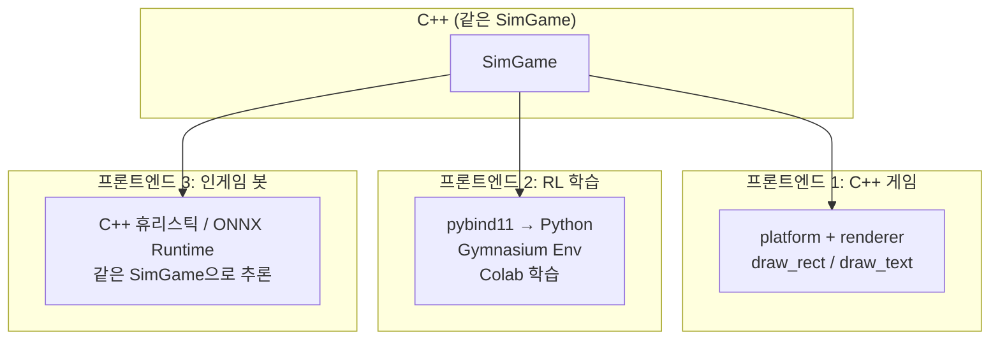
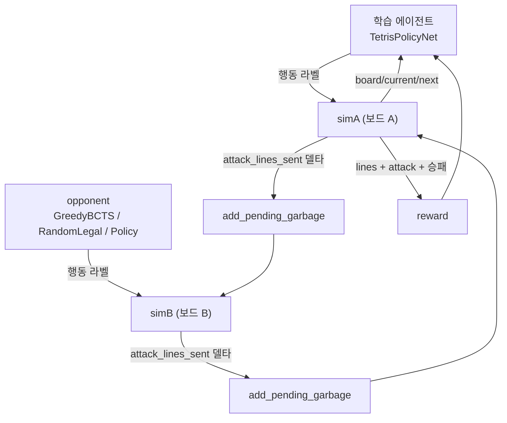
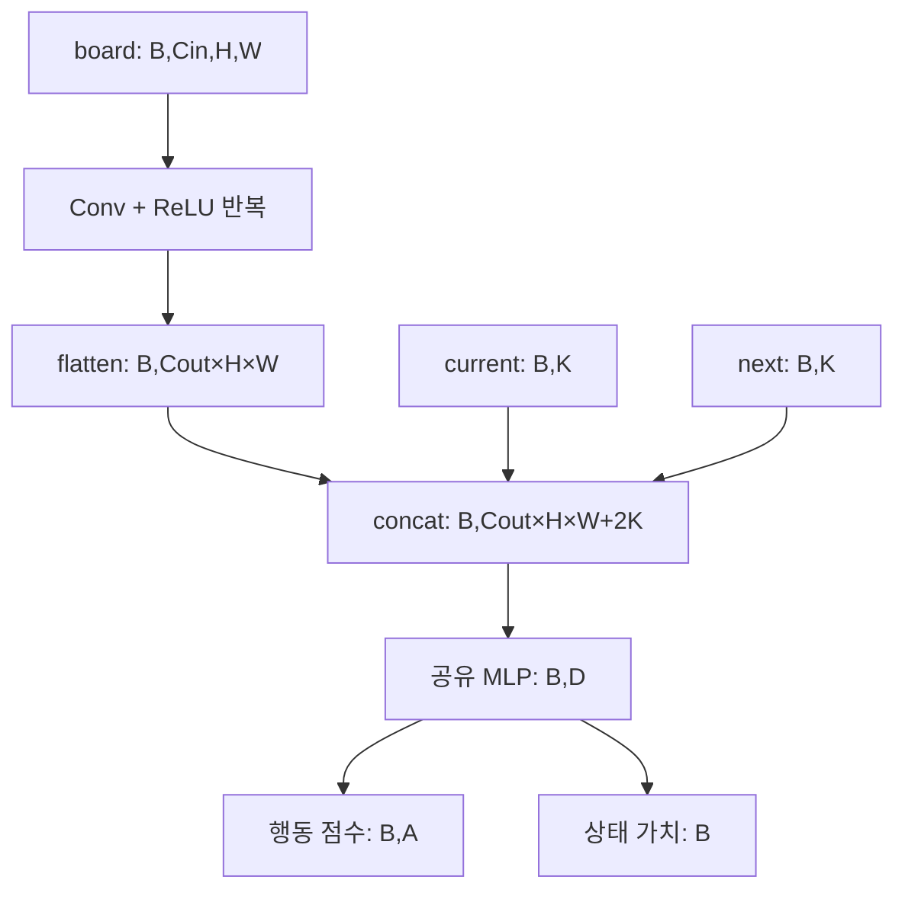
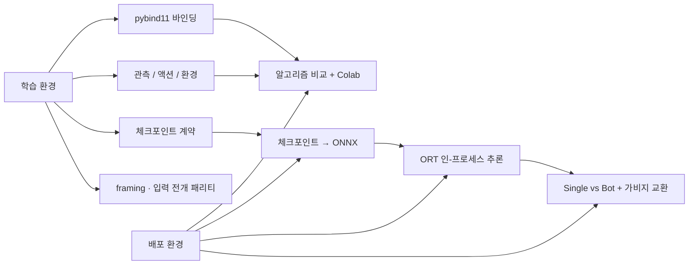

# Part 8: Python 바인딩과 강화학습 — pybind11에서 Colab 학습까지

> **시리즈:** 제로부터 멀티플레이어 테트리스 + RL | [시리즈 목차](./README.md) | **Part 8**

---

## 이번 Part의 구현 계약

- **선행 상태:** 학습 코어에는 Part 1의 headless `SimGame` API(`LegalPlacements`, `ApplyPlacement`, `Grid`, `StateHash`)와 `sim_hash_dump` 결정론 기준 파일만 필요하다. `python/netbot/framing.py` 패리티 절을 함께 구현할 때만 Part 6의 `net/framing.*` wire 규약이 추가로 필요하다.
- **이번 장의 파일:** `bindings/tetris_py.cpp`, `python/sim/`, `python/common/`, `python/train/`, `python/netbot/framing.py`, `python/netbot/input_expander.py`, `python/tests/`.
- **연결점:** Python은 게임 규칙을 다시 구현하지 않고 C++ 객체를 바인딩해 관측, 합법 행동 마스크, Gym 환경을 만든다. wire/입력 전개 계층만 Python으로 다시 쓰고, 그 재구현은 패리티 테스트로 C++ 과 고정한다.
- **완료 게이트:** 아래 계약을 각각 검증한다. 대응 명령은 이 장의 `수동 테스트` 에 있다.
  1. 네이티브 모듈 import (`from sim import SimGame`)
  2. C++ 결정론 기준과의 상태 해시 비교
  3. 환경 reset/step (단일 보드 + 2-보드 versus)
  4. 체크포인트 round-trip (arch/class 검증 포함)
  5. wire·입력 전개 패리티와 학습 스크립트 정적 파싱

## 들어가며

Part 1의 `SimGame`은 C++ 순수 로직이다. 이 시뮬레이터를 Python에 노출하면 학습 환경을 만들 수 있고, 학습된 정책은 Part 9의 인프로세스 ONNX 봇으로 배포할 수 있다. Python은 학습·export와 wire/입력 계약 테스트에만 사용하고, 실행 중인 봇은 C++ 게임 프로세스 안에서 동작한다.

이것을 실현하려면:

1. C++ SimGame을 Python에서 호출할 수 있어야 한다 (pybind11)
2. 강화학습 프레임워크가 이해하는 인터페이스로 감싸야 한다 (Gymnasium 환경)
3. 정책 네트워크를 설계하고 학습해야 한다 (CNN + policy/value head)
4. 학습된 모델을 ONNX로 내보내 C++ 게임 안에서 추론해야 한다 ([Part 9](./part9-rl-onnx-bot.md))

같은 `SimGame` C++ 코드가 세 가지 프론트엔드를 구동한다:


```mermaid
graph TB
    subgraph "C++ (같은 SimGame)"
        A["SimGame"]
    end
    subgraph "프론트엔드 1: C++ 게임"
        B["platform + renderer<br/>draw_rect / draw_text"]
    end
    subgraph "프론트엔드 2: RL 학습"
        C["pybind11 → Python<br/>Gymnasium Env<br/>Colab 학습"]
    end
    subgraph "프론트엔드 3: 인게임 봇"
        D["C++ 휴리스틱 / ONNX Runtime<br/>같은 SimGame으로 추론"]
    end

    A --> B
    A --> C
    A --> D
```

---

## 1. 왜 재구현이 아니라 바인딩인가

### 1.1 Python 으로 테트리스를 다시 짜면 무엇이 깨지는가

RL 프로젝트에서 가장 흔한 선택은 "학습용 시뮬레이터를 Python 으로 따로 짜는" 것이다. 빠르고, 의존성이 없고, 디버깅이 쉽다. 이 프로젝트는 그 길을 택하지 않았다. 이유는 하나로 요약된다 — **학습 때 본 보드와 실행 때 본 보드가 다르면 정책은 쓸모가 없다.**

두 구현이 갈라질 수 있는 지점은 생각보다 많다.

| 갈라질 수 있는 지점 | C++ `SimGame` 의 규약 |
|---|---|
| 피스 생성 순서 | XorShift64* 시드 상태에서 뽑는다. Python `random` 으로 흉내 내면 첫 피스부터 다르다 |
| 회전 축과 wall kick | `SimBlock::Rotate` 가 `cells[rotationState]` 를 순환. 회전 중심을 다르게 잡으면 같은 `(col, rot)` 이 다른 셀을 덮는다 |
| 하드 드롭 잠금 판정 | `IsBlockOutside` / `BlockFits` 조합. 경계 처리 한 칸 차이가 합법 배치 집합을 바꾼다 |
| 합법 배치 열거 | `LegalPlacements()` 가 spawn 높이에서 먼저 검증하고 그 뒤 드롭한다 (§4.4) |
| 가비지 주입 위치 | 잠금 시점에 바닥에서 밀어 올린다 |
| 라인 클리어 후 점수·레벨 | 레벨이 중력 틱 수를 바꾸고, 그게 다시 관측에 영향을 준다 |

이 계약 중 하나가 달라도 학습된 정책이 실전에서 다른 보드를 보게 된다. 그리고 이 종류의 버그는 **조용하다** — 예외도, 크래시도 없고, 단지 봇이 이상하게 둔다.

관련 코드 주석에서 각 계층의 책임을 확인한다.

**현재 소스 발췌 — `bindings/tetris_py.cpp`**

```cpp
// SimGame을 Python에서 쓰기 위한 pybind11 binding.
//
// 게임 규칙을 Python으로 다시 구현하지 않고 C++ SimGame을 그대로 노출한다.
// 학습할 때와 실제로 플레이할 때의 규칙이 갈라지면 sim-to-real gap이 생기는데,
// 규칙 구현의 중복을 없애면 드리프트 원인을 줄일 수 있다.
// 입력 전개·시간·관측·보상·모델 버전의 차이는 별도로 검증해야 한다.
//
// 두 가지 방식의 API를 제공한다.
//   - placement 단위: RL 학습용. "몇 번 열에 몇 번 회전해서 떨어뜨릴지"를 한 번에 지정
//   - frame 단위: parity test용. 한 tick의 input mask를 그대로 적용해
//                 C++ lockstep 경로와 결과가 같은지 대조
```

**현재 소스 발췌 — `python/common/obs.py`**

```python
"""SimGame -> observation tensor builder.

This module is the **only** Python place that converts a ``SimGame`` snapshot
into a network input. The C++ in-game bot's ``observe()`` (bot/placement.cpp)
mirrors this contract. ``test_observation_parity.py`` compares actual CPU
observations from both paths. Schema changes must update both implementations;
model input and ONNX integration checks remain separate.
```

(패키지 docstring 첫 문단)

**현재 소스 발췌 — `python/common/__init__.py`**

```python
"""Shared training/inference layer for the Tetris RL bot.

This package is the **single source of truth** for everything that crosses the
Colab-training to local-inference boundary:
```

`single source of truth`(`common/__init__.py`) 와 `trained on one format, deployed on another`(`common/obs.py`) — 패키지 경계와 관측 변환기가 각자의 자리에서 같은 결정을 반복해 말한다. 바인딩은 규칙의 중복 구현을 없앤다. 같은 커밋의 `sim_game.cpp`를 사용해 두 실행물을 다시 빌드해야 수정된 규칙을 공유한다. Python과 C++의 관측 변환·입력 전개는 여전히 별도 코드이므로 각 계약의 대조 검사가 필요하다.

그 대가는 두 가지다. 첫째, 학습을 시작하기 전에 C++ 툴체인과 pybind11 로 네이티브 모듈을 빌드해야 한다 (Colab 노트북이 이 단계를 자동화한다). 둘째, 언어 변환과 관측 복사 비용이 든다. 한 프로세스에 여러 SimGame을 만들 수 있으며, 독립 환경을 순서대로 진행하는 벡터화도 가능하다. 실제 계산 병렬화는 GIL·C++ 상태 소유권·프로세스 간 통신 비용을 고려해 별도로 선택한다. 이 프로젝트의 기본 학습 루프는 단일 동기 환경을 사용한다(§9.3).

### 1.2 그렇다면 무엇은 언어를 넘는가

전부 바인딩할 수는 없다. wire 프레이밍과 placement 입력 전개는 **의도적으로** 두 언어에 하나씩 구현을 두고, 두 구현이 같은지를 테스트가 잠근다(§12). 기준은 단순하다.

- **시뮬레이션 상태를 만드는 코드** → 바인딩. 재구현 금지.
- **바이트/마스크 포맷을 해석하는 코드** → 언어별 구현 + 패리티 테스트. 릴레이 스모크 테스트 하네스가 C++ 게임 없이도 프레임을 만들 수 있어야 하고, 봇의 placement 전개 규칙은 학습 쪽(Python)에서 먼저 확정되어야 하기 때문. 어느 언어가 원본인지는 모듈마다 다르다(§12.1).

### 1.3 왜 pybind11인가

C++에서 Python으로의 바인딩 방법은 여러 가지다:

| 방법 | 장점 | 단점 |
|------|------|------|
| ctypes / cffi | C ABI로 노출된 라이브러리와 연결 | C++ 클래스에는 C 형태의 래퍼가 필요하며, 네이티브 라이브러리 빌드는 별도다. ctypes는 표준 라이브러리, cffi는 별도 패키지다 |
| Cython | 성숙, 성능 좋음 | 별도 언어 문법 학습 필요 |
| **pybind11** | C++ 클래스·반환 정책·NumPy 변환 지원 | 확장 모듈을 컴파일할 빌드 설정 필요 |
| SWIG | 다중 언어 | 코드 생성 복잡, C++ 템플릿 제한 |

pybind11의 결정적 장점: C++ 클래스를 그대로 Python에 노출할 수 있고, numpy 배열과의 변환이 간단하다. 헤더 전용이라는 말은 별도 pybind11 실행 라이브러리를 링크하지 않는다는 뜻이다. 실제 확장 모듈은 컴파일해야 한다. `py::return_value_policy`로 반환 객체의 소유권을 지정하며, 내부 블록 참조의 부모 수명은 §2.5에서, 독립적인 배열 복사는 §2.4에서 다룬다.

### 1.4 CMakeLists 확장

이 장이 추가하는 소스는 `bindings/tetris_py.cpp` 하나다. 빌드 파일에는 새 타깃 블록 하나가 늘어난다.

**현재 소스 발췌 — `CMakeLists.txt`**

```cmake
# -----------------------------------------------------------------------------
# Target: tetris_py (pybind11 module — Colab training + parity tests)
# -----------------------------------------------------------------------------
if (TETRIS_BUILD_PY)
    # cmake 4.0+ removed FindPythonInterp/FindPythonLibs; tell pybind11 to use
    # the modern FindPython instead.
    set(PYBIND11_FINDPYTHON ON)
    # Locate the selected Python environment's pybind11 CMake package.
    find_package(pybind11 CONFIG QUIET)
    if (NOT pybind11_FOUND)
        message(FATAL_ERROR
            "pybind11 not found. Install it (pip install pybind11) and "
            "re-run cmake with -Dpybind11_DIR=$(python -m pybind11 --cmakedir)")
    endif()

    pybind11_add_module(tetris_py
        bindings/tetris_py.cpp
        ${TETRIS_SIM_SOURCES}
        ${TETRIS_SIM_HEADERS}
    )

    target_include_directories(tetris_py PRIVATE ${CMAKE_CURRENT_SOURCE_DIR})
endif()
```

`TETRIS_SIM_SOURCES` / `TETRIS_SIM_HEADERS` 는 Part 1 이 정의한 순수 시뮬 소스 목록 그대로다. 이 타깃은 렌더러도, 네트워크도, 오디오도 링크하지 않는다. 그래서 Colab Linux 컨테이너에서 SDL2 없이 빌드된다.

여기서 초심자가 반드시 밟는 함정이 두 개 있다.

1. **`TETRIS_BUILD_GAME` 은 기본 ON 이다** (`CMakeLists.txt`). `-DTETRIS_BUILD_PY=ON` 만 주면 게임 타깃까지 configure 되고, `third_party/httplib.h` 가 없으면 그 단계에서 FATAL_ERROR 로 죽는다. **반드시 `-DTETRIS_BUILD_GAME=OFF` 를 함께 준다.**
2. **pybind11 을 pip 로 깔아도 CMake 가 못 찾는 경우가 흔하다.** 위 FATAL_ERROR 메시지가 그대로 해답을 알려준다 — `-Dpybind11_DIR=$(python -m pybind11 --cmakedir)`.

검증된 형태는 이것이다.

```bash
cmake -S . -B build -DTETRIS_BUILD_GAME=OFF -DTETRIS_BUILD_PY=ON \
      -Dpybind11_DIR=$(uv run python -m pybind11 --cmakedir)
cmake --build build --target tetris_py
cp build/tetris_py*.so python/sim/          # Windows: build\Release\tetris_py*.pyd
```

`python/sim/__init__.py`는 네이티브 모듈을 다시 노출하는 얇은 래퍼다. 빌드 산출물을 그 안에 떨어뜨리면 `from sim import SimGame` 이 동작한다.

---

## 2. pybind11 바인딩 코드

### 2.1 모듈 골격

`PYBIND11_MODULE` 매크로 하나가 모듈 전체를 만든다. `SimGame::Placement`, `SimBlock`, `SimGame` 세 클래스를 등록한다.

**현재 소스 발췌 — `bindings/tetris_py.cpp`**

```cpp
PYBIND11_MODULE(tetris_py, m)
{
    m.doc() = "Headless Tetris simulation (pybind11 wrapper around SimGame)";

    // 한 번의 착수를 나타내는 (column, rotation) 쌍.
    py::class_<SimGame::Placement>(m, "Placement")
        .def_readonly("col", &SimGame::Placement::col)
        .def_readonly("rot", &SimGame::Placement::rot)
        .def("__repr__", [](const SimGame::Placement& p) {
            return "Placement(col=" + std::to_string(p.col) +
                   ", rot=" + std::to_string(p.rot) + ")";
        });

    // 관측용으로만 노출하는 테트로미노. Python 쪽에서 수정할 수 없다.
    py::class_<SimBlock>(m, "SimBlock")
        .def_readonly("id",             &SimBlock::id)
        .def_readonly("rotation_state", &SimBlock::rotationState)
        .def_readonly("row_offset",     &SimBlock::rowOffset)
        .def_readonly("column_offset",  &SimBlock::columnOffset)
        .def("cell_positions", [](const SimBlock& b) {
            // 현재 rotation 상태에서 이 블록이 차지하는 4칸의 절대 좌표.
            auto tiles = b.GetCellPositions();
            py::list out;
            for (const auto& t : tiles)
            {
                out.append(py::make_tuple(t.row, t.column));
            }
            return out;
        });
```

`__repr__` 를 붙여둔 덕에 `print(g.legal_placements())` 가 `[Placement(col=3, rot=0), ...]` 로 읽힌다. 학습 루프를 디버깅할 때 이 한 줄이 체감 차이를 만든다.

이 장에서는 `bindings/tetris_py.cpp` 전체를 반복하기보다 설계 결정이 걸린 placement API, 가비지 API, `grid()` 복사, `reference_internal` 수명 계약을 나눠 본다. 실제 변경 때는 같은 파일의 전체 바인딩 목록과 Python 소비자를 함께 대조한다.

### 2.2 두 개의 액션 API

**현재 소스 발췌 — `bindings/tetris_py.cpp`**

```cpp
        .def("legal_placements", &SimGame::LegalPlacements,
             "Enumerate all legal (col, rot) placements for the current piece "
             "via rotate-then-translate-then-hard-drop. Returns a list of "
             "Placement objects.")
        .def("apply_placement", &SimGame::ApplyPlacement,
             py::arg("col"), py::arg("rot"),
             "Apply a placement atomically (rotate -> translate -> hard drop -> "
             "lock). Returns the number of lines cleared, or -1 if the placement "
             "is illegal.")
        .def("clone", [](const SimGame& g) {
            return SimGame(g);
        }, "Return a deep copy of the full deterministic sim state.")
```

**현재 소스 발췌 — `bindings/tetris_py.cpp`**

```cpp
        .def("submit_input", &SimGame::SubmitInput, py::arg("input_mask"),
             "Apply a one-tick input bitmask (see core/input.h). Retained for "
             "frame-level parity/equivalence tests against the lockstep loop.")
        .def("tick", &SimGame::Tick,
             "Advance the gravity counter by one tick. Time-only progression "
             "separate from input.")
        .def("move_block_down", &SimGame::MoveBlockDown,
             "Single-step the current piece down by one row (locks on contact).")
```

`apply_placement` 는 학습이 쓰는 원자적 API (한 번 호출 = 한 피스 확정), `submit_input`/`tick` 은 Part 6 의 lockstep 경로와 프레임 단위로 같은 상태를 만드는지 검증하는 API 다. 둘 다 같은 `SimGame` 을 건드리지만 목적이 다르다 — 주석이 `Retained for frame-level parity/equivalence tests` 라고 그 목적을 명시한다.

`clone()`은 값 복사 생성자를 노출한다. 후보 행동을 별도의 상태에서 평가하는 탐색에 쓰며 RNG와 카운터도 함께 복사한다. 참조나 외부 자원을 멤버로 추가한다면 복사 생성이 여전히 독립된 분기를 만드는지 검토한다. 사용 맥락은 [Part 9](./part9-rl-onnx-bot.md)의 알고리즘 비교 표와 연결된다.

### 2.3 전투 · 가비지 API — 2-보드 학습의 배선

단일 보드 학습만 할 때는 가비지·공격 바인딩이 필요 없지만, versus 환경과 `Single vs Bot`의 가비지 교환은 이 공개 API 집합에 의존한다.

**현재 소스 발췌 — `bindings/tetris_py.cpp`**

```cpp
        .def("attack_lines_sent", &SimGame::AttackLinesSent,
             "Cumulative attack lines this board has sent (monotonic). Take the "
             "delta across a placement to get the attack from that placement.")
        .def("pending_garbage", &SimGame::PendingGarbage,
             "Garbage rows queued to be injected on this board's next lock.")
        .def("add_pending_garbage", &SimGame::AddPendingGarbage, py::arg("rows"),
             "Queue `rows` garbage lines onto this board (injected on next lock). "
             "Negative/zero is ignored. Used to route an opponent's attack.")
        .def("last_lines_cleared", [](const SimGame& g) { return g.lastLinesCleared; },
             "Lines cleared by the most recent lock (0..4). Useful for reward.")
        .def("last_garbage_received", [](const SimGame& g) { return g.lastGarbageReceived; },
             "Garbage rows actually injected at the most recent lock.")
        .def("total_lines_cleared", [](const SimGame& g) { return g.totalLinesCleared; },
             "Cumulative lines cleared this game.")
        .def("level", [](const SimGame& g) { return g.level; },
             "Current gravity/speed level (1..20, +1 per 10 lines).")
```

설계의 핵심은 `attack_lines_sent()` 가 **누적 총계(monotonic)** 라는 점이다. "이번 배치가 몇 줄을 보냈는가" 를 알려면 배치 전후의 차분을 직접 계산해야 한다. 왜 이벤트가 아니라 누적값인가? 결정론 해시에 들어가는 상태이기 때문이다 — 누적 카운터는 상태의 일부라 저장·비교·재현이 되지만, "이번 틱의 이벤트" 는 소비되면 사라진다. Part 9 의 C++ `Single vs Bot` 루프도 정확히 같은 차분 패턴을 쓴다.

`pending_garbage` 는 큐다. 공격이 도착해도 즉시 밀어 올리지 않고, **받는 쪽 보드가 다음에 피스를 잠글 때** 주입된다. 이게 없으면 상대가 낙하 중인 피스가 갑자기 벽에 박히는 비결정적 상황이 생긴다.

### 2.4 `grid()`는 복사한다

**현재 소스 발췌 — `bindings/tetris_py.cpp`**

```cpp
        .def("grid", [](const SimGame& g) {
            // 내부 버퍼를 참조로 넘기지 않고 복사한다.
            // 참조를 넘기면 다음 착수 때 Python이 들고 있던 배열의 내용이
            // 조용히 바뀌어, replay buffer에 쌓아둔 관측이 전부 오염된다.
            // 복사 비용은 보드 크기와 호출 빈도에 비례한다. 처리량은 별도로 측정한다.
            const auto& raw = g.Grid();
            auto arr = py::array_t<int32_t>({SimGrid::kRows, SimGrid::kCols});
            auto buf = arr.mutable_unchecked<2>();
            for (int r = 0; r < SimGrid::kRows; ++r)
                for (int c = 0; c < SimGrid::kCols; ++c)
                    buf(r, c) = raw[r][c];
            return arr;
        }, "Return the ROWS x COLS grid as a numpy int32 array (copied).")
```

참조를 반환했다면 이런 코드가 조용히 틀린다.

**예시(실제 저장소에는 없음)**

```python
arr = game.grid()            # 만약 참조라면 SimGame 내부 메모리를 직접 가리킨다
game.apply_placement(4, 0)   # SimGame 내부 상태 변경
# arr 이 "배치 이전" 이 아니라 "배치 이후" 를 보여준다 — replay buffer 가 통째로 오염
```

리플레이 버퍼는 관측을 나중에 다시 꺼내 쓴다. 같은 내부 버퍼를 가리키는 뷰를 저장하면 다음 상태 변경이 과거 관측에도 보인다. 소유자의 수명까지 연결하지 않은 뷰는 객체 소멸 뒤 유효하지 않다. 현재 `grid()`는 새 배열에 값을 복사하여 두 문제를 피한다. 복사 비용은 `ROWS × COLS × sizeof(int32_t)`와 호출 빈도에 따라 달라지므로 처리량은 측정한다. 복사한 배열을 Python에서 다시 수정할 수 있다는 사실과 C++ 원본으로부터 독립이라는 사실은 구분한다.

### 2.5 `reference_internal` 은 무엇을 보장하고 무엇을 보장하지 않는가

**현재 소스 발췌 — `bindings/tetris_py.cpp`**

```cpp
        .def("current_block",
             &SimGame::CurrentBlock,
             py::return_value_policy::reference_internal,
             "Current falling piece.")
        .def("ghost_block",
             &SimGame::GhostBlock,
             py::return_value_policy::reference_internal,
             "Ghost/preview piece at the hard-drop target.")
        .def("next_block",
             [](const SimGame& g) { return g.NextBlock(); },
             "Copy of the first piece in the preview queue.")
```

`reference_internal` 은 pybind11 에서 `reference + keep_alive<0, 1>` 와 같다. "반환된 자식 객체가 살아 있는 동안 부모(`self`, 여기서는 `SimGame`)도 살려 둔다" 는 뜻이다. 현재 `CurrentBlock()`과 `GhostBlock()`이 반환하는 멤버 참조는 이 부모 수명 관계를 따른다. 다만 컨테이너 재할당처럼 C++ 쪽에서 참조 대상 자체를 무효화하는 설계를 추가한다면 별도 검토가 필요하다.

**예시(실제 저장소에는 없음)**

```python
block = game.current_block()   # SimGame 내부의 SimBlock 에 대한 참조
print(block.id)                # OK
del game                       # 참조 카운트만 감소 — block 이 SimGame 을 붙잡고 있다
print(block.id)                # 여전히 유효
```

실제 위험은 소멸이 아니라 **상태 변경**이다.

**예시(실제 저장소에는 없음)**

```python
block = game.current_block()
print(block.id)                # 예: 3 (I 블록)
game.apply_placement(4, 0)     # 피스가 잠기고 다음 피스가 current 가 된다
print(block.id)                # 같은 참조인데 값이 바뀌었다 — 이전 피스가 아니다
```

`block` 은 `SimGame` 내부 멤버를 가리키는 창(window)이지 스냅샷이 아니다. 관측을 보관하려면 값으로 뽑아야 한다 — `sim.current_block_id()` 처럼 정수를 읽거나, `next_block()` 처럼 복사본을 반환하는 접근자를 쓴다. `next_block` 이 복사인 이유도 같은 계열이다: preview 큐 원소라 큐가 갱신되면 참조가 무효화될 수 있다.

**규칙:** 학습 코드가 관측을 만들 때는 `grid()`(복사)와 `*_id()`(정수)만 쓴다. `current_block()` / `ghost_block()` 은 디버깅·시각화용이다.

---

### 2.6 언어 경계와 동일성 검증

바인딩은 Python 객체·인자를 C++ 호출로 연결하고 결과를 Python 값으로 바꾼다. 규칙을 공유하면 중복 구현에서 생기는 차이를 줄이지만, placement 호출과 매 틱 입력은 서로 다른 호출 계약이다. 관측·보상·시간·입력 전개까지 같다는 결론은 별도 대조가 필요하다.

현재 바인딩은 호출 중 GIL을 해제하지 않는다. 일반적인 GIL 기반 CPython에서는 Python 스레드가 바인딩을 호출하는 것만으로 여러 시뮬레이션이 동시에 계산되지 않는다. GIL 해제는 Python 객체 접근과 같은 C++ 객체에 대한 동시 변경을 함께 검토한 뒤 적용한다. 이는 free-threaded Python 지원 선언과도 별개다.

학습 실습은 누적 `Round`를 가진 `Session`을 만들어 `step(mask)` 한 번을 규칙의 한 틱에 연결한다. 관측과 분기는 값 복사로 반환하고, 잘못된 인자와 실패한 reset은 기존 상태를 보존한다. C++ 직접 호출과 Python 호출에 같은 시드·입력열을 주어 매 전이의 정규 바이트를 비교한다. 이 비교는 두 호출 경로가 일치한다는 근거이며, 두 경로가 함께 사용하는 규칙 자체의 정확성은 규칙 회귀로 별도 확인한다.

현재 소스에서는 `grid()` 복사와 `current_block()`의 살아 있는 내부 참조를 구별한다. `readonly` 속성은 Python의 대입을 막지만, 게임 진행으로 바뀌는 멤버의 값을 고정하지 않는다. `python/tests/test_binding_boundary.py`가 복사본·참조·부모 수명·clone을 확인한다.

공식 계약: [pybind11 반환 정책](https://pybind11.readthedocs.io/en/stable/advanced/functions.html#return-value-policies), [GIL](https://pybind11.readthedocs.io/en/stable/advanced/misc.html#global-interpreter-lock-gil).


## 3. 관측 공간 설계

### 3.1 관측 구성

**현재 소스 발췌 — `python/common/obs.py`**

```python
def build_observation(sim: "SimGame") -> dict[str, torch.Tensor]:
    """Convert a ``SimGame`` snapshot into the dict consumed by ``TetrisPolicyNet``.

    Returns un-batched tensors. Add a leading batch dim with ``unsqueeze(0)``
    before passing to the network — done at the call site so that batched
    rollouts and single-step inference share this builder.
    """
    import torch

    raw = np.asarray(sim.grid(), dtype=np.float32)
    if raw.shape != (BOARD_ROWS, BOARD_COLS):
        raise ValueError(f"board shape {raw.shape} does not match {(BOARD_ROWS, BOARD_COLS)}")
    occupied = ((raw > 0) & (raw != 8)).astype(np.float32)
    board = occupied[None, :, :]  # channel, row, column; no batch axis yet

    current = _piece_one_hot(sim.current_block_id())
    nxt = _piece_one_hot(sim.next_block_id())

    return {
        "board": torch.from_numpy(board),
        "current": torch.from_numpy(current),
        "next": torch.from_numpy(nxt),
    }
```

| 키 | 형태 | 내용 |
|----|------|------|
| `board` | `(1, BOARD_ROWS, BOARD_COLS)` float32 | 점유맵: 1 = 잠긴 블록, 0 = 빈칸 |
| `current` | `(NUM_PIECE_TYPES,)` float32 | 현재 블록 ID의 one-hot |
| `next` | `(NUM_PIECE_TYPES,)` float32 | preview 큐 첫 번째 다음 블록 ID의 one-hot |

### 3.2 함수 안의 `import torch` 는 스타일이 아니라 설계다

`build_observation` 첫 줄이 함수 **내부** `import torch` 다. 모듈 상단이 아니다. `action_mask.py::legal_mask` 도 같다. 이건 취향이 아니라 **의존성 경계**다.

`python/requirements.txt` 는 torch 를 일부러 포함하지 않는다. torch 는 `requirements-colab.txt` 와 `uv sync --extra train`(학습 환경) 쪽에만 있다. 배포·CI 머신에는 numpy 만 있으면 된다. 그런데 `common/__init__.py` 가 상단에서 torch 를 import 하면, torch 없는 머신에서는

```bash
uv run python -m pytest python/tests/test_framing_parity.py -q
```

같은 순수 Python 테스트조차 `ModuleNotFoundError` 로 죽는다. 지연 import 덕분에 `common` 패키지는 torch 없이도 import 되고, 실제로 텐서를 만드는 함수를 호출할 때만 torch 가 필요해진다. 타입 힌트도 같은 이유로 `if TYPE_CHECKING:` 블록 안에 격리돼 있다.

같은 패턴이 네이티브 모듈에도 적용된다 — `common/env.py` 와 `common/env_versus.py` 는 `from sim import SimGame` 을 `__init__` **안에서** 한다. `tetris_py` 를 아직 빌드하지 않은 머신에서도 `common` 을 import 할 수 있어야 하기 때문이다.

### 3.3 설계 결정

**점유맵과 화면의 구분**: `SimGame.Grid()`는 잠긴 셀을 담고 현재 피스와 고스트는 별도 멤버다. 현재 관측의 `(raw > 0) & (raw != 8)`은 표시 ID를 제외하는 기존 schema를 유지한다. 관측에 그리기 결과를 합친 뒤 이 조건만으로 모든 표현을 제거할 수 있다고 가정하지 않는다.

**피스 종류의 one-hot**: 종류 ID는 크기나 우열을 뜻하지 않는다. `NUM_PIECE_TYPES`와 ID 순서로 원-핫 벡터를 만든다. 같은 길이여도 종류와 인덱스의 대응이 바뀌면 모델 입력 의미가 바뀐다. 현재 구현의 알려지지 않은 ID는 기존 호환 동작대로 전부 0이며 정상 one-hot과 구별한다.

**축·자료형·배치**: `board`의 첫 축은 채널이다. 한 게임의 CHW에 `unsqueeze(0)`를 적용하면 NCHW가 된다. 여러 게임은 `stack`으로 새 배치 축에 묶는다. 행·열을 reshape로 뒤집으면 전치와 다른 의미가 되므로 배열의 크기만이 아니라 셀 대응도 검사한다. C++ observe의 평평한 출력은 `row * kBoardCols + column` 순서다.

**일부 상태만 보는 관측**: 현재 위치/회전·시간·예고 나머지·대기 가비지·난수 상태는 관측에서 빠져 있다. placement 호출은 주로 피스 배치를 정하는 결정 경계를 쓰지만, 누락 정보가 모든 행동에서 무관하다는 뜻은 아니다. 같은 보드와 피스라도 대기 가비지가 다르면 같은 배치 뒤 보드가 달라질 수 있다. 이를 완전한 Markov 상태라고 설명하지 않는다. 가비지·레벨 등이 단일 보드에서는 모두 무의미하다는 기존 설명도 맞지 않는다.

**모델이 받는 입력**: schema를 유지하면 같은 입력 크기의 네트워크를 사용할 수 있지만, versus에서 숨긴 정보의 영향까지 해결되지는 않는다. `info`와 보상에 기록한 정보는 정책 함수의 입력으로 연결하지 않는 한 그 시점의 행동 선택에 직접 제공되지 않는다. 채널/필드/종류 순서를 바꾸면 모델과 체크포인트·내보내기·C++ 소비자 계약도 함께 갱신한다.

### 3.4 복사한 관측과 공유하는 텐서

현재 함수의 점유맵은 새 NumPy 배열이다. `torch.from_numpy`는 그 배열과 CPU 저장소를 공유하므로 텐서와 배열의 변경은 서로 보인다. 이 저장소는 C++ 게임의 그리드와는 독립이다. 같은 관측을 재사용하면서 원본 보존이 필요하면 `clone()` 또는 명시적 배열 복사를 쓴다. CPU 텐서 생성은 GPU 업로드가 아니며, 장치 이동과 배치 구성은 호출자의 별도 책임이다.

`python/tests/test_observation_parity.py`는 `tests/observation_dump.cpp`가 호출한 실제 `bot::observe`와 새 네이티브 바인딩의 `build_observation`을 비교한다. 같은 시드·입력·가비지 요청과 상태 해시를 먼저 대조하고 형상·dtype·메모리 순서·원소를 검사한다. 관측의 shape 불일치는 Python에서 ValueError로, C++ schema/SimGrid 크기 불일치는 컴파일 시 거절한다. 이 검사는 ONNX 추론이나 학습 성능까지 검증하지 않는다.

```sh
cmake --build build --target observation_dump tetris_py
# 아래 두 값은 실제 새 빌드의 확장 모듈 디렉터리와 실행파일 경로다.
TETRIS_PY_MODULE_DIR=/path/to/build TETRIS_OBSERVATION_DUMP=/path/to/build/observation_dump \
  python -m pytest python/tests/test_observation_parity.py -q
```

공식 계약: [PyTorch from_numpy](https://docs.pytorch.org/docs/stable/generated/torch.from_numpy.html), [NumPy stack](https://numpy.org/doc/stable/reference/generated/numpy.stack.html).

---

## 4. 행동 공간 설계

### 4.1 배치 인덱스와 좌표의 의미

행동 공간은 `NUM_COLS * NUM_ROTATIONS`개의 라벨이다. 열은 피스의 **원점 열**이며 가장 왼쪽 셀의 열과 다를 수 있다. 회전 라벨은 방향 상태를 가리킨다. 서로 다른 라벨이 같은 도형을 표현해도 인덱스는 유지한다.

인코딩은 `col * NUM_ROTATIONS + rot`, 역변환은 같은 회전 수로 나눈 몫과 나머지다. 아래 순수 산술 함수는 유효 범위의 인수를 전제로 한다. 외부 입력에서는 범위와 정수형을 먼저 검사해야 한다. Python의 음수 인덱스는 배열 끝을 가리키므로 특히 주의한다.

**현재 소스 발췌 — `python/common/action_mask.py`**

```python
def encode_action(col: int, rot: int) -> int:
    """Map a ``(col, rot)`` placement in the valid domain to a flat index."""
    return col * NUM_ROTATIONS + rot


def decode_action(action: int) -> tuple[int, int]:
    """Inverse of :func:`encode_action`."""
    return action // NUM_ROTATIONS, action % NUM_ROTATIONS


def legal_mask(sim: "SimGame") -> torch.Tensor:
    """Boolean tensor of shape ``(NUM_PLACEMENTS,)``.

    ``True`` at index ``encode_action(col, rot)`` iff that placement is in
    ``sim.legal_placements()``. The result lives on CPU; move to the policy
    device at the call site.
    """
    import torch

    mask = torch.zeros(NUM_PLACEMENTS, dtype=torch.bool)
    for placement in sim.legal_placements():
        mask[encode_action(placement.col, placement.rot)] = True
    return mask
```

C++ `bot/placement.h::encode_action`도 같은 순서를 사용한다. 모델 출력 길이가 같아도 열·회전 순서가 바뀌면 다른 행동으로 해석된다. `tests/action_codec_dump.cpp`와 `python/tests/test_action_codec_parity.py`는 실제 C++ 함수를 호출해 Python 인코딩·디코딩·입력 전개와 전체 유효 좌표 조합을 대조한다.

### 4.2 끝점 합법성과 입력 경로 합법성

`SimGame::LegalPlacements()`는 현재 피스를 복사하고, 목표 방향과 원점 열로 즉시 바꾼 뒤 **현재 행에서의 끝점**이 유효한지 검사한다. 이후 수직으로 내려 착지 위치를 구한다. 중간 회전·수평 이동 경로를 틱별로 재생하거나 벽 차기를 탐색하지 않는다.

따라서 이 메서드가 반환하는 합법성은 **즉시 배치 API의 합법성**이다. 피스와 목적지 사이에 세로 벽이 있어도 끝점과 낙하 경로가 비어 있으면 배치가 가능할 수 있다. 같은 목표를 좌우 키 입력으로 실행하면 벽에 막힌다. `tests/placement_contract_test.cpp`의 벽 fixture가 두 결과를 구분한다.

`ApplyPlacement`는 유효한 배치를 적용하고 삭제 줄 수를 반환한다. 정상 배치에서 삭제가 없으면 0이며, 거절은 -1이다. 검증을 통과하기 전에는 실제 게임 상태를 변경하지 않는다. 테스트는 열거된 배치의 적용과 잘못된 좌표 거절, 원본 상태 보존을 함께 확인한다.

### 4.3 중복 라벨과 확률 마스크

정사각형처럼 여러 방향 라벨이 같은 모양을 나타내는 피스도 있다. 마스크는 잘못된 배치만 제거하며 같은 모양을 자동으로 합치지 않는다. 출력 크기를 피스마다 바꾸지 않고 같은 인코딩을 유지하기 위한 선택이다.

같은 결과에 이르는 라벨들의 확률은 **합쳐서** 그 결과의 확률이 된다. 라벨 엔트로피는 결과 그룹을 고르는 불확실성과 그룹 내부 라벨을 고르는 불확실성을 모두 포함한다. 중복 라벨이 있다고 항상 일정한 값만큼 엔트로피가 증가하는 것은 아니다. 그룹 내부 확률까지 균등할 때 그 부분이 그룹 크기의 로그가 된다. 틱 입력 경로에서는 회전에 쓴 시간도 달라질 수 있으므로 같은 도형을 곧바로 같은 전체 상태로 취급하지 않는다.

합법 행동 수는 상태마다 `legal_mask(sim).sum()`으로 확인한다. 빈 보드나 특정 시드의 측정값을 모든 상태의 비율로 일반화하지 않는다. 마스크의 목적은 현재 계약에서 허용한 행동들 위에 확률 분포를 정의하는 것이다.

`masked_log_softmax`는 불법 logit을 음의 무한대로 바꾼다. 합법 logit이 유한하고 합법 행동이 하나 이상이면 지수 변환 후 불법 확률은 0이며 나머지 확률의 합은 1이다. 전부 False인 행에는 정규화할 분포가 없으므로 예외로 거절한다. 환경은 종료·잘못된 호출·행동 공간의 제한 중 원인을 판별해야 한다.

**현재 소스 발췌 — `python/common/models.py`**

```python
def masked_log_softmax(
    logits: torch.Tensor, mask: torch.Tensor, eps: float = 1e-9
) -> torch.Tensor:
    """Normalize finite legal logits; reject empty legal rows and schema mismatch.

    ``eps`` remains accepted for caller compatibility. Adding the same constant
    cannot repair an empty distribution and is not a probability floor.
    """
    del eps
    if not logits.is_floating_point() or mask.dtype != torch.bool:
        raise TypeError("logits must be floating point and mask must be bool")
    if logits.ndim < 1 or logits.shape[-1] == 0 or logits.shape != mask.shape:
        raise ValueError("logits and mask must have the same nonempty action axis")
    if logits.device != mask.device:
        raise ValueError("logits and mask must be on the same device")
    if not mask.any(dim=-1).all():
        raise ValueError("each row must have at least one legal action")
    if not torch.isfinite(logits.masked_select(mask)).all():
        raise ValueError("legal logits must be finite")
    masked = logits.masked_fill(~mask, float("-inf"))
    logp = F.log_softmax(masked, dim=-1)
    if not torch.isfinite(logp.masked_select(mask)).all():
        raise ValueError("normalized legal log probabilities must be finite")
    return logp


def masked_entropy(logp: torch.Tensor, mask: torch.Tensor) -> torch.Tensor:
    """Entropy of masked_log_softmax output; avoid 0 * -inf before autograd."""
    safe_logp = logp.masked_fill(~mask, 0.0)
    return -(logp.exp() * safe_logp).sum(dim=-1)
```

엔트로피는 `-sum(p * log(p))`지만 컴퓨터에서 불법 항의 `0 * -inf`를 계산하면 NaN이다. 곱한 **뒤** `where`로 가려도 역전파는 잘못된 곱셈 그래프를 통과할 수 있다. `masked_entropy`는 log 확률의 불법 항을 **곱하기 전에** 0으로 치환한다. 수학의 `lim(p→0) p log(p)=0`을 계산 순서로 구현한 것이다. `python/tests/test_masked_distribution.py`는 PPO와 정책경사 함수의 값뿐 아니라 기울기를 합법 좌표만 따로 계산한 기준과 대조한다.

### 4.4 행동의 시간과 도달 범위

매 틱 행동은 회전·이동·대기를 각각 결정한다. 최종 배치 행동은 여러 결정을 목표 좌표 하나로 묶어 정책의 결정 빈도를 줄인다. 그 사이를 어떻게 실행할지는 환경의 별도 계약이다.

현재 `ApplyPlacement`는 중간 `Tick`을 호출하지 않는다. 반면 `expand_placement`는 회전 → 수평 이동 → 하드 드롭의 입력열을 만든다. 두 언어에서 입력열이 같다는 검사는 충돌·중력까지 포함한 최종 상태의 동등성을 증명하지 않는다. 회전의 벽 차기로 원점이 변하거나 준비 입력 중 피스가 잠겨도 차이가 생길 수 있다.

T-spin 판정도 최종 좌표만으로 설명할 수 없다. 현재 규칙은 마지막 회전 이력과 주변 셀 조건 등을 사용하며, `ApplyPlacement`는 마지막 회전 플래그를 지운다. `tests/sim_t_spin_test.cpp`는 입력 회전·드롭과 배치 API를 구분한다. T-spin을 단순히 “회전으로만 갈 수 있는 위치”로 정의하면 이 계약을 놓친다.

현재 열거는 살아 있는 피스의 행에서 시작한다. 통상 생성 직후 배치하는 환경에서는 그 행이 스폰 행이지만, 매 틱 입력 뒤 호출하면 달라진다. 수직 낙하 중 옆으로 밀거나 늦게 회전하는 경로는 탐색하지 않는다. 모든 도달 가능한 배치가 필요하면 위치·방향뿐 아니라 시간과 잠금 상태까지 포함한 경로 탐색을 설계해야 한다.

HTML 강의의 행동 체크포인트는 누적 `Round::tick`을 복사본에서 실제로 실행해 회전 → 이동 → 드롭 경로가 성공하는 라벨만 허용한다. 준비 틱에서 잠기면 거절하고, 성공한 입력열과 결과를 함께 보관한다. 이 경로군도 전체 도달 가능성을 탐색하는 것은 아니다. 기존 즉시 배치 API와의 차이를 유지한 채 학습·실행 의미를 비교한다.

행동 의미를 바꾸면 학습과 배포 양쪽 계약을 재검토한다. 라벨 수를 바꾸면 모델 출력 형상도 바뀐다. 같은 라벨에 대한 경로만 바꾸면 출력 길이는 유지될 수 있지만, 전이·시간·보상의 의미는 달라질 수 있다.

---

## 5. Gymnasium 환경 — 단일 보드

### 5.1 인터페이스

**현재 소스 발췌 — `python/common/env.py`**

```python
class TetrisPlacementEnv(gym.Env if _HAS_GYM else object):  # type: ignore[misc]
    """Single-player Tetris environment exposing placement-level actions."""

    metadata = {"render_modes": []}

    def __init__(self, seed: int | None = None) -> None:
        if not _HAS_GYM:
            raise ImportError(
                "gymnasium is required for TetrisPlacementEnv. "
                "Install it with `pip install gymnasium`."
            )
        # 여기서 import하는 이유가 있다. 최상단에서 하면 tetris_py를 빌드하지 않은
        # 환경에서 common 패키지 자체를 import할 수 없게 된다.
        # 가짜 SimGame을 끼워 넣는 테스트도 이 지연 import 덕분에 가능하다.
        from sim import SimGame  # noqa: PLC0415

        self._SimGame = SimGame
        self._initial_seed = optional_seed(seed)
        self._seed = self._initial_seed
        self._has_reset = False
        self._needs_reset = True
        self.render_mode = None
        self.sim: SimGame | None = None

        self.action_space = spaces.Discrete(NUM_PLACEMENTS)
        self.observation_space = spaces.Dict(
            {
                "board": spaces.Box(
                    low=0.0, high=1.0,
                    shape=(1, BOARD_ROWS, BOARD_COLS),
                    dtype=np.float32,
                ),
                "current": spaces.Box(
                    low=0.0, high=1.0,
                    shape=(NUM_PIECE_TYPES,),
                    dtype=np.float32,
                ),
                "next": spaces.Box(
                    low=0.0, high=1.0,
                    shape=(NUM_PIECE_TYPES,),
                    dtype=np.float32,
                ),
            }
        )
```

Gymnasium의 reset/step과 spaces 계약을 제공한다. 다른 RL 프레임워크에 연결할 때는 Dict 관측·합법 마스크 전달·종료 처리·환경 생성 방식도 맞춰야 한다. `gymnasium` 자체도 optional import 라 (`_HAS_GYM`), 설치돼 있지 않으면 생성자에서 명확한 `ImportError` 를 던진다 — 모듈 import 시점에 죽지 않는다.

### 5.2 step()

**현재 소스 발췌 — `python/common/env.py`**

```python
    def step(
        self, action: int
    ) -> tuple[dict[str, np.ndarray], float, bool, bool, dict[str, Any]]:
        if self._needs_reset:
            raise gym.error.ResetNeeded("Call reset() before starting or continuing an episode")
        action = action_index(action, NUM_PLACEMENTS)
        col, rot = decode_action(action)
        cleared = self.sim.apply_placement(col, rot)

        if cleared < 0:
            # 도메인 안이지만 현재 보드에서 막힌 배치는 상태를 보존한다.
            # 정상 배치도 줄을 지우지 않으면 보상이 0이므로 info로 구별한다.
            reward = 0.0
            terminated = self.sim.game_over()
        else:
            reward = float(cleared)
            terminated = self.sim.game_over()

        truncated = False
        self._needs_reset = terminated
        info = self._info()
        info["action_applied"] = cleared >= 0
        return self._observation(), reward, terminated, truncated, info
```

**보상 = 이번 배치에서 삭제한 줄 수**. 종료까지의 할인된 줄 보상이 학습 목표다. 생존은 미래의 줄 보상을 얻는 데 도움이 될 수 있지만, 이 정의만으로 특정 전략의 습득이나 성능을 보장하지는 않는다.

보상을 단순하게 둔 이유는 **피처 엔지니어링을 보상 엔지니어링으로 옮기는 함정**을 피하기 위함이다. "구멍 하나당 -0.5, 높이 편차 -0.1" 같은 dense reward 를 설계하면 결국 §10 의 BCTS 평가 함수를 reward 공간에서 다시 짜는 셈이 된다. 다만 이 희박함이 학습 초기에 실제 문제가 되므로, PPO 학습기는 env 밖에서 shaping 항을 더하는 절충을 택했다(§9.4). **env 자체의 계약은 순수하게 유지**하고 shaping 은 학습기 쪽 옵션으로 둔 것이 중요하다 — 평가 지표가 오염되지 않는다.

### 5.3 info dict

**현재 소스 발췌 — `python/common/env.py`**

```python
    def _info(self) -> dict[str, Any]:
        assert self.sim is not None
        return {
            "legal_mask": legal_mask(self.sim).numpy(),
            "episode_seed": self._seed,
            "score": self.sim.score(),
            "lines": self.sim.total_lines_cleared(),
            "state_hash": self.sim.state_hash(),
        }
```

보상이 0이어도 유효한 배치가 없었다는 뜻은 아니다. 줄을 지우지 않은 정상 배치도 0이다. 행동 공간 안의 라벨이 현재 보드에서 막혔으면 두 환경 모두 보드를 보존하고 보상 0을 반환한다. `info["action_applied"]`가 정상 배치와 이를 구별한다. 대전은 이 요청도 결정 횟수에 포함해 제한 우회를 막는다. 단일 환경 자체에는 횟수 제한이 없으며 필요하면 `TimeLimit`으로 감싼다. 타입·범위가 잘못된 행동은 상태 변경 전에 `ValueError`로 거절한다.

`legal_mask`는 매 step마다 반환된다. 정책이 이 마스크를 사용해 불법 행동을 필터링한다. `state_hash`는 상태 비교용 진단값이다. 같은 초기화·행동 열에서 해시 열을 비교하면 결정론 회귀를 찾을 수 있다. 유한 해시의 일치만으로 모든 상태의 동등성이 증명되는 것은 아니다.

`lines`는 현재 에피소드의 누적 삭제 줄 수다. 보상에 공격·승패·shaping이 포함되는 경로에서도 원래 줄 지표를 보상에서 역산하지 않고 읽는다.

### 5.4 초기화·난수·종료의 호출 계약

**현재 소스 발췌 — `python/common/env.py`**

```python
    def reset(
        self,
        *,
        seed: int | None = None,
        options: dict[str, Any] | None = None,
    ) -> tuple[dict[str, np.ndarray], dict[str, Any]]:
        if options is not None and (not isinstance(options, dict) or options):
            raise ValueError("reset options are not supported")
        seed = optional_seed(seed)
        effective = seed if seed is not None else (self._initial_seed if not self._has_reset else None)
        super().reset(seed=effective)
        self._seed = effective if effective is not None else draw_seed(self.np_random)
        self.sim = self._SimGame(self._seed)
        self._has_reset = True
        self._needs_reset = False
        return self._observation(), self._info()
```

`super().reset(seed=effective)`가 환경의 `np_random`을 준비한다. 명시적인 시드는 네이티브 `SimGame`에도 그대로 전달하여 같은 판을 재현한다. 생성자 시드는 처음 `reset()`에 사용한다. 이후 시드 없는 `reset()`은 환경 난수열에서 다음 네이티브 시드를 뽑는다. 따라서 같은 시드를 다시 명시하면 에피소드뿐 아니라 그 뒤 초기화 순서도 재현할 수 있고, 단순 `reset()`을 반복하면 매번 처음 판으로 되돌아가지 않는다. 시드는 네이티브의 uint64 범위를 따른다.

`python/common/gym_contract.py`는 bool·소수·문자열을 정수 행동으로 조용히 바꾸지 않도록 타입과 범위를 검사한다. Python/NumPy 정수 스칼라와 0차원 정수 배열은 받을 수 있다. `reset`의 options는 None 또는 빈 dict만 지원한다. `action_space.sample()`의 난수 발생기는 환경과 별도이므로 샘플링 행동까지 재현하려면 `action_space.seed()`도 호출한다.

초기화 전·종료 후·close 후의 `step()`은 `ResetNeeded`로 거절한다. `close()`는 반복 호출할 수 있으며 다시 사용하려면 reset한다. `terminated`는 게임 규칙의 종료, `truncated`는 외부 수집 경계다. 어느 하나라도 참이면 수집기는 다음 에피소드로 넘어가되, 가치 부트스트랩을 없애는 기준은 진짜 종료 여부다. 시간 제한으로 멈췄다면 마지막 전이의 관측으로 미래 가치를 계산한다. reset 뒤 새 판의 관측과 섞으면 다른 에피소드의 값을 연결하게 된다.

`TimeLimit` 같은 바깥 래퍼의 제한은 원래 환경이 알지 못한다. 호출자는 가장 바깥 step 결과의 두 플래그를 확인한다. `python/tests/test_gym_contract.py`는 실제 바인딩을 지정하고 공식 `check_env`, 시드열, 행동 거절, 종료 뒤 재호출, 랜덤 상대 재현과 제한을 검사한다. 이것은 훈련기에서 리턴을 올바르게 계산한다는 증명과는 별개다.

---

## 6. 2-보드 versus 환경

### 6.1 왜 필요한가

`TetrisPlacementEnv` 로 학습한 정책은 "혼자 오래 살아남으며 줄을 지우는" 법을 배운다. 그런데 이 게임의 실제 승부는 Part 6 이 만든 **가비지 교환**이다 — 줄을 지우면 상대 보드 바닥에 쓰레기 줄이 올라온다. 혼자 두는 환경에는 그 압력이 아예 없으므로, 단일 보드 정책은 "공격" 이라는 개념 자체를 학습하지 못한다.

`python/common/env_versus.py` 가 그 간극을 메운다. 두 개의 `SimGame` 을 두고 한쪽은 학습 에이전트가, 다른 쪽은 상대(opponent)가 조종하며, §2.3 의 가비지 API로 공격을 서로 라우팅한다. 공격량 차분과 수신 큐라는 네이티브 전투 원시 연산을 사용한다. A 배치 뒤 B가 응답하는 순서는 이 학습 환경의 턴제 근사이며, 실시간 게임의 틱 배선 전체와 동일하다는 뜻은 아니다.

**현재 소스 발췌 — `python/common/env_versus.py`**

```python
"""Two-board competitive (versus) Tetris environment.

This is the garbage-trading counterpart to ``common.env.TetrisPlacementEnv``.
The learning agent controls board A; an *opponent* controls board B. Line
clears produce an ``attack_lines_sent()`` delta, queued through the other
board's ``add_pending_garbage()`` and injected at its next lock. These are the
same native combat primitives used by the game. This environment's ordered
A-then-B placement schedule is a turn-based approximation of real-time play.

Design goals:

* **Shared observation schema.** The agent's own ``board``/``current``/``next``
  match ``TetrisPlacementEnv`` and ``common.models.TetrisPolicyNet``. Trainers
  still need to select the environment and handle reward/termination semantics.
  Received garbage changes the board; attack and win/loss terms change reward.
  Extra competitive signals live in ``info`` for wrappers that need them.
* **Self-play ready.** Pass any ``opponent`` — a scripted heuristic
  (``GreedyBCTSOpponent``, the default), random legal play
  (``RandomLegalOpponent``), or a snapshot of the current policy via
  ``PolicyOpponent`` — to train against a frozen copy of yourself.

Action / observation contract (agent side)::

    action_space      = Discrete(NUM_PLACEMENTS)                      # encode_action(col, rot)
    observation_space = Dict(board, current, next)        # same as single-player
    info["legal_mask"]        = bool (NUM_PLACEMENTS,)
    info["incoming_garbage"]  = int   # queued on the agent's board
    info["agent_attack"]      = int   # lines the agent sent this step
    info["opp_attack"]        = int   # lines the opponent sent this step
    info["opp_alive"]         = bool

Reward per step = ``lines_cleared + attack_weight * attack_sent``; on the
terminal step ``+win_bonus`` if only the opponent topped out, ``-loss_penalty``
if the agent topped out (including a simultaneous top-out). Treating a mutual
top-out as a loss penalizes mutual failure; it does not prove that all
suicidal attack strategies have negative total return.
"""
```

핵심 설계 결정은 첫 번째 bullet 이다. **관측 schema 를 단일 보드와 동일하게 유지한다.** 상대 보드를 관측에 넣으면 `TetrisPolicyNet` 의 입력 차원이 바뀌고, 그러면 `ARCH_VERSION` 을 올려야 하고, ONNX 입출력 계약(Part 9)도 바뀌고, C++ `observe()` 도 바뀌어야 한다. 대신 경쟁 압력을 **보드를 통해** (받은 가비지가 내 스택을 올린다) 와 **보상을 통해** (보낸 공격 + 승패 보너스) 전달한다. 정책망의 입력 형상을 유지하면서 환경 생성과 보상·종료 처리의 차이를 연결할 수 있다. 상대 상태의 생략은 여전히 부분 관측을 만든다.


```mermaid
graph TB
    Agent["학습 에이전트<br/>TetrisPolicyNet"] -->|행동 라벨| SimA["simA (보드 A)"]
    Opp["opponent<br/>GreedyBCTS / RandomLegal / Policy"] -->|행동 라벨| SimB["simB (보드 B)"]
    SimA -->|attack_lines_sent 델타| GB["add_pending_garbage"]
    GB --> SimB
    SimB -->|attack_lines_sent 델타| GA["add_pending_garbage"]
    GA --> SimA
    SimA -->|board/current/next| Agent
    SimA -->|lines + attack + 승패| R["reward"]
    R --> Agent
```

### 6.2 교체할 수 있는 상대 정책

**현재 소스 발췌 — `python/common/env_versus.py`**

```python
class VersusOpponent:
    """Decides one placement for a board. Return an encoded action in the schema domain or
    ``None`` only if the board has no legal move. The environment supplies a
    disposable clone, so mutations to the argument are never committed."""

    def reset(self) -> None:  # noqa: D401 - optional hook
        """Called on env reset. Override to reset per-episode state."""

    def reseed(self, seed: int) -> None:
        """Override when a custom opponent owns randomness used during an episode."""

    def act(self, sim: Any) -> Optional[int]:
        raise NotImplementedError


class RandomLegalOpponent(VersusOpponent):
    """Picks a uniformly random legal placement. Seeded for reproducibility."""

    def __init__(self, seed: int | None = None) -> None:
        self._rng = random.Random(seed)

    def reseed(self, seed: int) -> None:
        self._rng.seed(seed)

    def act(self, sim: Any) -> Optional[int]:
        placements = sim.legal_placements()
        if not placements:
            return None
        p = self._rng.choice(placements)
        return encode_action(int(p.col), int(p.rot))
```

기본 상대는 한 배치 뒤의 결과를 평가하는 그리디 BCTS다. `bcts_score()`를 후보 선택 루프에 연결한다. 환경 초기화는 상대의 `reseed(seed)`와 `reset()`을 호출한다. 랜덤 상대는 reseed에서 자체 난수 발생기를 초기화하고, 사용자 정의 확률 정책도 자신이 소유한 난수·에피소드 상태를 이 계약에 맞춰 관리해야 한다.

**현재 소스 발췌 — `python/common/env_versus.py`**

```python
class GreedyBCTSOpponent(VersusOpponent):
    """One-ply board evaluator: clone each legal placement and keep its best score.

    line_weight adds to the rows_cleared coefficient already in bcts_score.
    Equal scores keep the first native placement; terminal states have no
    separate priority. These are policy choices, not performance guarantees.
    """

    def __init__(self, line_weight: float = 1.0) -> None:
        self._line_weight = finite_coefficient(line_weight, "line_weight")

    def act(self, sim: Any) -> Optional[int]:
        placements = sim.legal_placements()
        if not placements:
            return None
        best_action = None
        best_score = -float("inf")
        for p in placements:
            child = sim.clone()
            cleared = int(child.apply_placement(int(p.col), int(p.rot)))
            if cleared < 0:
                continue
            board = np.asarray(child.grid(), dtype=np.float32)
            score = self._line_weight * float(cleared) + bcts_score(board, cleared)
            if not np.isfinite(score):
                raise ValueError("greedy evaluation is not finite")
            if score > best_score:
                best_score = score
                best_action = encode_action(int(p.col), int(p.rot))
        return best_action
```

`sim.clone()`(§2.2)이 여기서 쓰인다. 원본 보드를 건드리지 않고 각 후보 배치의 결과 보드를 만들어야 하므로 값 복사가 필수다. C++ 쪽 `heuristic_placement` (Part 9)가 `SimGame trial = sim;` 으로 같은 일을 한다.

세 번째 상대가 자기 대전(self-play)의 진입점이다.

**현재 소스 발췌 — `python/common/env_versus.py`**

```python
class PolicyOpponent(VersusOpponent):
    """Wraps a callable ``policy_fn(obs_dict, legal_mask_np) -> action`` so a
    trained (or snapshot) policy can be the opponent for self-play. The env
    builds the opponent's own observation from its board before calling."""

    def __init__(self, policy_fn: Callable[[dict[str, np.ndarray], np.ndarray], int]) -> None:
        self._policy_fn = policy_fn

    def act(self, sim: Any) -> Optional[int]:
        obs = {k: v.numpy() for k, v in build_observation(sim).items()}
        mask = legal_mask(sim).numpy()
        if not mask.any():
            return None
        return action_index(self._policy_fn(obs, mask), NUM_PLACEMENTS)
```

`policy_fn` 이 콜러블이므로 얼려둔 체크포인트든, 현재 학습 중인 네트워크의 복사본이든 그대로 넣을 수 있다. 관측을 상대 보드 기준으로 다시 만드는 것이 포인트다 — 상대도 자기 보드를 자기 시점에서 본다.

### 6.3 step — 공격 라우팅과 보상

**현재 소스 발췌 — `python/common/env_versus.py`**

```python
    def step(
        self, action: int
    ) -> tuple[dict[str, np.ndarray], float, bool, bool, dict[str, Any]]:
        if self._needs_reset:
            raise gym.error.ResetNeeded("Call reset() before starting or continuing an episode")
        action = action_index(action, NUM_PLACEMENTS)
        # Preserve committed boards. A callback can advance its own RNG, so any
        # later failure requires reset rather than retrying an ambiguous episode.
        self._needs_reset = True
        candidate_a = self.simA.clone()
        candidate_b = self.simB.clone()
        col, rot = decode_action(action)
        attack_before_a = candidate_a.attack_lines_sent()
        cleared = candidate_a.apply_placement(col, rot)
        agent_attack = opp_attack = 0

        if cleared >= 0:
            agent_attack = candidate_a.attack_lines_sent() - attack_before_a
            if agent_attack > 0 and not candidate_b.game_over():
                candidate_b.add_pending_garbage(agent_attack)

            # The policy sees its own board after incoming attack has been queued.
            # Give it an isolated copy; policy-side mutations are never committed.
            if not candidate_b.game_over():
                opp_action = self._opponent.act(candidate_b.clone())
                mask = legal_mask(candidate_b).numpy()
                if opp_action is None:
                    if mask.any():
                        raise ValueError("opponent passed despite having legal actions")
                else:
                    opp_action = action_index(opp_action, NUM_PLACEMENTS)
                    if not mask[opp_action]:
                        raise ValueError("opponent returned a blocked action")
                    attack_before_b = candidate_b.attack_lines_sent()
                    bc, br = decode_action(opp_action)
                    if candidate_b.apply_placement(bc, br) < 0:
                        raise RuntimeError("opponent action disagreed with legal mask")
                    opp_attack = candidate_b.attack_lines_sent() - attack_before_b
                    if opp_attack > 0 and not candidate_a.game_over():
                        candidate_a.add_pending_garbage(opp_attack)

        a_dead, b_dead = candidate_a.game_over(), candidate_b.game_over()
        reward = (versus_reward(cleared, agent_attack, a_dead, b_dead,
                                self.attack_weight, self.win_bonus, self.loss_penalty)
                  if cleared >= 0 else 0.0)
        terminated = a_dead or b_dead
        decisions = self._pieces + 1
        truncated = decisions >= self.max_pieces
        obs = self._observation(candidate_a)
        info = self._info(agent_attack, opp_attack, sim_a=candidate_a,
                          sim_b=candidate_b, decisions=decisions)
        info["action_applied"] = cleared >= 0
        self.simA, self.simB = candidate_a, candidate_b
        self._pieces = decisions
        self._needs_reset = terminated or truncated
        return obs, reward, terminated, truncated, info
```

보상은 세 항의 합이다.

$$r = \text{cleared} + w_{\text{attack}} \cdot \text{attack} + \begin{cases} +\text{win\_bonus} & \text{상대만 탑아웃} \\ -\text{loss\_penalty} & \text{에이전트 탑아웃} \\ 0 & \text{그 외}\end{cases}$$

`attack_weight`·`win_bonus`·`loss_penalty`는 생성자에서 정하는 보상 정책이다. `max_pieces`는 호환을 위해 남긴 옵션 이름이며, 현재는 도메인 안의 step 요청 횟수를 센다. 막힌 배치도 한 결정을 소비한다. 유효한 배치에서 플레이어를 먼저 실행하고 살아 있는 상대가 한 번 응답하는 턴제 근사이므로 실시간 동시 진행과는 다르다. 규칙 종료와 횟수 제한이 같은 전이에서 발생하면 두 플래그가 모두 참일 수 있다.

승패 처리에 미묘한 결정이 하나 숨어 있다.

**현재 소스 발췌 — `python/common/env_versus.py`**

```python
def _terminal_bonus(
    a_dead: bool, b_dead: bool, win_bonus: float, loss_penalty: float
) -> float:
    """Terminal reward from the learning agent's perspective."""
    return versus_reward(0, 0, a_dead, b_dead, 0.0, win_bonus, loss_penalty)
```

`python/common/versus_reward.py`의 순수 계산은 A가 죽었으면 동시 탑아웃을 포함해 패배 항을 더한다. 이는 이 환경의 보상 설계다. 공격·삭제 줄 보상까지 합친 총 리턴에서 모든 자폭 전략을 배제한다는 보장은 없다. 실제 게임의 무승부 판정 및 계정 BP 지급 규칙과도 분리해서 읽는다.

### 6.4 실패한 공동 전이를 반영하지 않는다

하나의 대전 step은 A의 배치, A→B 공격 전달, B의 선택·배치, B→A 공격 전달, 보상·출력 구성으로 이루어진다. A가 탑아웃해도 이 순서 안에서 살아 있는 B의 응답을 수행한 뒤 승패를 판정한다. 상대가 이미 끝났으면 공격을 큐에 넣거나 행동을 요청하지 않는다. 이렇게 응답 시점을 정의해야 동시 탑아웃과 종료 항을 일관되게 해석할 수 있다.

환경은 두 SimGame의 복사본을 만들고 이 순서를 실행한다. 상대에는 B 복사본을 다시 복사해 전달한다. 상대가 후보 탐색을 위해 인수를 수정해도 실제로 반영할 B는 달라지지 않는다. 반환 행동은 정수 도메인과 현재 B의 마스크를 다시 검사한다. None은 합법 행동이 없을 때만 허용하며, 소수·문자열을 정수로 바꾸거나 막힌 배치를 무시하지 않는다. PolicyOpponent가 만드는 관측도 B 기준이다.

보상과 관측·info 구성까지 성공한 뒤 두 보드와 결정 횟수를 함께 반영한다. `env.simA`·`env.simB`는 성공 시 새 객체를 가리키므로, 바깥 코드에서 보드 참조를 저장했다면 그 참조는 과거 상태다. 현재 상태는 환경에서 다시 조회한다. 실패하면 기존 두 보드와 카운터는 유지하지만, 상대 정책이 이미 소비한 난수나 외부 부작용은 되돌리지 못한다. 따라서 `_needs_reset`을 유지해 같은 에피소드의 재시도를 거절한다. reset 훅이 실패했을 때도 진행 가능한 상태로 남기지 않는다. 이것은 같은 프로세스의 협력 코드에 대한 상태 경계이며 임의 Python 코드를 격리하는 보안 장치는 아니다.

보상 계수는 `finite_coefficient`로 실제 유한 수인지 확인하고, 전이의 합산 결과도 유한한지 검사한다. 유한한 큰 계수라도 공격량과 곱하면 overflow할 수 있으므로 생성자 검사만으로 충분하지 않다. `python/tests/test_versus_boundary.py`가 잘못된 상대 반환·콜백 예외/수정·수치 경계를 검사한다.

### 6.5 info 로 나가는 경쟁 신호

**현재 소스 발췌 — `python/common/env_versus.py`**

```python
    def _info(self, agent_attack: int, opp_attack: int, *,
              sim_a=None, sim_b=None, decisions=None) -> dict[str, Any]:
        sim_a = self.simA if sim_a is None else sim_a
        sim_b = self.simB if sim_b is None else sim_b
        decisions = self._pieces if decisions is None else decisions
        assert sim_a is not None and sim_b is not None
        return {
            "legal_mask": legal_mask(sim_a).numpy(),
            "episode_seed": self._seed,
            "opponent_seed": self._opp_seed,
            "decisions": decisions,
            "score": sim_a.score(),
            "lines": sim_a.total_lines_cleared(),
            "state_hash": sim_a.state_hash(),
            "incoming_garbage": sim_a.pending_garbage(),
            "agent_attack": int(agent_attack),
            "opp_attack": int(opp_attack),
            "opp_alive": not sim_b.game_over(),
            "agent_lines": sim_a.total_lines_cleared(),
            "opp_lines": sim_b.total_lines_cleared(),
        }
```

`legal_mask`·`episode_seed`·`score`·`lines`·`state_hash`는 단일 환경과 의미가 같고, `decisions`는 이번 에피소드의 결정 횟수다. `opponent_seed`를 명시하면 그 상대 보드 시드를 reset마다 유지한다. 생략하면 플레이어 시드의 다음 uint64 값을 쓰며 최댓값에서는 0으로 순환한다. 상대 정책의 reseed에도 이 값을 전달한다. 따라서 환경 안의 랜덤 상대는 자신의 생성자 시드보다 환경의 초기화 정책을 따른다. 나머지 `incoming_garbage` 이하가 versus 전용이다. 관측을 건드리지 않고 여기에 실은 것이 §6.1 의 설계 결정이다 — 이 신호를 쓰고 싶은 래퍼는 `info` 에서 꺼내 관측에 붙이면 되고, 안 쓰는 학습기는 그냥 무시한다.

### 6.6 trainer 에서 versus 를 고르기 — PPO 의 `--env`

관측 schema 를 단일 보드와 동일하게 유지한 결정(§6.1)이 여기서 회수된다. 같은 관측 형상을 받을 수 있으므로 환경 생성 분기를 추가할 수 있다. 보상 지표와 종료·수집 경계 처리도 별도로 점검해야 한다. PPO trainer 가 그 분기를 CLI 옵션으로 노출한다.

**현재 소스 발췌 — `python/train/ppo_tetris.py`**

```python
    p.add_argument("--env", type=str, default="single",
                   choices=["single", "versus"],
                   help="single = 1인 판, versus = garbage 교환 2-보드 판 "
                        "(versus 는 gymnasium 필요)")
```

`train()` 은 `make_env(args.env, args.seed)` 로 환경을 만들고, `make_env` 는 `kind == "versus"` 이면 `TetrisVersusEnv(seed=seed)` 를, 아니면 `TetrisPlacementEnv(seed=seed)` 를 돌려준다. 상대는 §6.2 의 기본 상대인 1-ply 그리디 BCTS 다. 주기 평가도 `env_kind=args.env` 로 같은 종류의 환경에서 돌므로, versus 로 학습하면 versus 에서 평가된다.

경계는 정확히 그어야 한다. **versus 를 CLI 에서 고를 수 있는 trainer 는 현재 PPO 뿐이다.** DQN/DDQN, CBMPI, REINFORCE/A2C/n-step, CEM, MuZero-style 은 여전히 `TetrisPlacementEnv` 를 직접 생성한다. 그 trainer 들로 대전 학습을 하려면 env 생성 지점에 같은 분기를 직접 넣어야 한다. `python/train/README_colab.md` 의 versus 절이 같은 경계를 문서화하고, 회귀 테스트 명령(`python -m pytest tests/test_versus_env.py -q`)과 "네이티브 모듈과 Gymnasium 이 없으면 pytest 가 모듈을 skip 한다" 는 단서를 함께 적는다.

`TetrisVersusEnv` 자체는 trainer 와 독립적으로 검증돼 있다. `python/tests/test_versus_env.py`가 가비지 주입, 관측 shape, 완주, 동시 탑아웃 패널티, 스택 상승, 결정론, 공격 라우팅 총량 일치를 잠근다.

가장 엄격한 테스트는 공격 총량 회계다.

**현재 소스 발췌 — `python/tests/test_versus_env.py`**

```python
def test_env_attack_routes_to_opponent():
    """When the agent sends attack lines (info['agent_attack'] > 0) the
    opponent must receive at least that much garbage over the episode."""
    env = TetrisVersusEnv(seed=11, opponent=GreedyBCTSOpponent(),
                          max_pieces=400)
    _, info = env.reset()
    total_agent_attack = 0
    total_opp_garbage_received = 0
    for _ in range(400):
        # A random stack usually tops out before clearing a line, which made
        # the old conditional assertion vacuous. BCTS guarantees this fixture
        # exercises at least one attack while keeping both boards alive longer.
        action = GreedyBCTSOpponent().act(env.simA)
        assert action is not None
        _, _, terminated, truncated, info = env.step(action)
        total_agent_attack += info["agent_attack"]
        # The opponent consumes pending garbage during its placement in the
        # same env.step(), so inspect the lock event rather than the drained
        # pending queue after the step.
        total_opp_garbage_received += env.simB.last_garbage_received()
        if terminated or truncated:
            break
    assert total_agent_attack > 0, "fixture must send attack (non-vacuous regression)"
    assert total_opp_garbage_received == total_agent_attack
```

주석 두 개가 이 테스트를 쓰면서 실제로 밟은 함정을 기록하고 있다. 첫째, 무작위 에이전트로는 줄을 거의 못 지워서 `total_agent_attack > 0` 조건이 공허하게 통과했다 — BCTS 를 에이전트 쪽에도 써서 반드시 공격이 발생하게 만들었다. 둘째, `pending_garbage()` 를 스텝 후에 읽으면 이미 상대가 소비한 뒤라 0 이다 — **잠금 이벤트**(`last_garbage_received()`)를 봐야 한다. 큐가 아니라 이벤트를 합산해야 회계가 맞는다.

게이트 명령:

```bash
uv run python -m pytest python/tests/test_versus_env.py -q
```

파일 첫머리의 `pytest.importorskip("sim")` / `pytest.importorskip("gymnasium")` 때문에, `tetris_py`를 빌드하지 않았거나 `gymnasium`이 없으면 **모듈 전체가 skip**된다. 초록색 종료 코드만으로는 실제 실행 여부를 알 수 없으므로 `-rs`로 skip 사유를 확인한다. `uv sync --dev`만으로는 `gymnasium`이 설치되지 않으며 `train` extra가 필요하다.

---

## 7. CNN 정책 네트워크

### 7.1 형상과 의미의 계약

`python/common/models.py`의 `TetrisPolicyNet`은 보드 특징을 피스 정보와 합쳐 행동 점수와 스칼라 가치를 만든다. H/W는 BOARD_ROWS/BOARD_COLS, K는 피스 종류 수, A는 배치 라벨 수, B는 배치의 표본 수다. 관측 생성 경로의 보드는 `(B,1,H,W)`, current/next는 각각 `(B,K)`인 float32다. 현재 one-hot 위치는 피스 ID에서 1을 뺀 값이다. 학습 체크포인트의 카탈로그 순서와 같은 순서라고 가정하지 않는다.

`python/common/model_contract.py`의 `validate_policy_inputs`는 행·열·각 피스 폭·배치 크기를 각각 확인한다. 같은 원소 수라도 H/W 전치는 공간 의미를 바꾸고, current의 부족한 폭을 next에 더한 입력도 잘못된 계약이다. 입력은 모델 파라미터와 dtype/device가 같아야 한다. 모델을 `.double()`로 변환했다면 입력도 함께 변환한다. 정상 관측 경로는 float32이며 모델·입력은 `.to(device)`로 같은 장치에 놓는다.

`build_observation`은 native 보드를 이진 점유로 변환하고 피스 ID를 one-hot 위치에 대응시킨다. 현재 `_piece_one_hot`은 범위 밖 ID를 전부 0인 벡터로 남기는 호환 규칙을 유지한다. 따라서 현재 관측 생성기가 임의 입력의 모든 의미 오류를 거절한다고 가정하지 않는다. 학습 체크포인트의 encode는 ID를 엄격하게 검사한다. 모델의 메타데이터 검사에는 GPU 동기화를 유발할 수 있는 전체 값 reduction을 넣지 않는다. 따라서 이 메타데이터 검사가 임의 NaN 입력이나 손상된 가중치까지 검출한다는 뜻은 아니다. 추론 분포를 만드는 `masked_log_softmax`는 합법 logit의 유한성을 확인한다. `python/tests/test_policy_contract.py`가 메타데이터·역전파·추적 경계를 검사한다.

### 7.2 네트워크 구성

**현재 소스 발췌 — `python/common/models.py`**

```python
    def __init__(
        self,
        board_channels: int = 1,
        conv_channels: tuple[int, ...] = (32, 64, 64),
        hidden: int = 256,
        n_placements: int = NUM_PLACEMENTS,
        n_piece_types: int = NUM_PIECE_TYPES,
    ) -> None:
        super().__init__()
        board_channels = positive_size(board_channels, "board_channels")
        hidden = positive_size(hidden, "hidden")
        n_placements = positive_size(n_placements, "n_placements")
        n_piece_types = positive_size(n_piece_types, "n_piece_types")
        if not isinstance(conv_channels, (tuple, list)) or not conv_channels:
            raise ValueError("conv_channels must be a nonempty sequence")
        conv_channels = tuple(positive_size(c, "conv_channels") for c in conv_channels)
        self.board_channels = board_channels
        self.conv_channels = conv_channels
        self.hidden = hidden
        self.n_placements = n_placements
        self.n_piece_types = n_piece_types

        # Stride 1 and padding 1 preserve the configured spatial axes.
        layers: list[nn.Module] = []
        in_ch = board_channels
        for out_ch in conv_channels:
            layers.append(nn.Conv2d(in_ch, out_ch, kernel_size=3, padding=1))
            layers.append(nn.ReLU(inplace=True))
            in_ch = out_ch
        self.trunk = nn.Sequential(*layers)

        flat = conv_channels[-1] * BOARD_ROWS * BOARD_COLS

        # conv가 뽑은 보드 특징에 현재/다음 블록 one-hot을 이어 붙인다.
        # 어떤 블록이 오는지 모르면 어디에 둘지 정할 수 없기 때문이다.
        self.fuse = nn.Sequential(
            nn.Linear(flat + 2 * n_piece_types, hidden),
            nn.ReLU(inplace=True),
            nn.Linear(hidden, hidden),
            nn.ReLU(inplace=True),
        )

        self.policy_head = nn.Linear(hidden, n_placements)
        self.value_head = nn.Linear(hidden, 1)
```

생성자는 양의 정수 크기와 비어 있지 않은 conv_channels를 요구한다. bool을 정수 크기로 받지 않는다. Conv의 마지막 채널 수를 C, MLP 폭을 D라 하면 flatten의 폭은 `C×H×W`, 결합 입력은 `C×H×W + 2K`다. 파라미터 개수는 생성한 모델의 `parameters()`에서 계산한다.


```mermaid
graph TB
    A["board: B,Cin,H,W"] --> T["Conv + ReLU 반복"]
    T --> F["flatten: B,Cout×H×W"]
    F --> J["concat: B,Cout×H×W+2K"]
    B["current: B,K"] --> J
    C["next: B,K"] --> J
    J --> M["공유 MLP: B,D"]
    M --> P["행동 점수: B,A"]
    M --> V["상태 가치: B"]
```

커널·padding·stride를 함께 읽는다. 이 스택은 커널3, padding1, stride1로 H/W를 유지한다. 공유 필터는 지역 패턴을 학습할 수 있고 MLP는 펼친 모든 위치와 피스 벡터를 조합한다. 특정 채널이 구멍이나 높이를 반드시 인식한다고 단정하지 않는다. 피스 정보를 공간 전체에 반복하는 방법도 가능하지만 이 구현은 flatten 뒤 결합을 선택했다. 실제 효율·성능은 같은 조건에서 비교한다. 현재 next 입력은 미리보기의 첫 피스다.

### 7.3 순전파와 출력 해석

**현재 소스 발췌 — `python/common/models.py`**

```python
    def forward(
        self,
        board: torch.Tensor,
        current: torch.Tensor,
        next: torch.Tensor,  # noqa: A002 - matches obs key name
    ) -> tuple[torch.Tensor, torch.Tensor]:
        if not isinstance(board, torch.Tensor):
            raise TypeError("board must be a tensor")
        if board.dim() == 3:
            board = board.unsqueeze(1)  # BHW -> NCHW; checked below in eager mode.
        if not torch.jit.is_tracing():
            validate_policy_inputs(
                board, current, next, channels=self.board_channels,
                rows=BOARD_ROWS, cols=BOARD_COLS, pieces=self.n_piece_types,
                parameter=self.trunk[0].weight,
            )
        h = self.trunk(board)
        h = h.flatten(1)
        h = torch.cat([h, current, next], dim=-1)
        h = self.fuse(h)
        policy_logits = self.policy_head(h)
        value = self.value_head(h).squeeze(-1)
        return policy_logits, value
```

BHW 입력은 단일 채널 배치의 호환 표현이다. 일반적인 CHW 한 표본을 자동 구분해 주는 API가 아니므로 호출자는 NCHW를 만드는 편이 명확하다. flatten(1)은 배치 축을 남긴다. 가치 head의 마지막 크기1 축만 squeeze하여 B=1에서도 `(B,)`를 유지한다.

PPO/A2C에서는 행동 점수를 **logit**으로 해석한다. 현재 합법 마스크를 적용하고 정규화해야 정책 확률이 된다. 가치 출력은 선택한 보상·할인·정책 아래의 리턴 추정치이며 값의 범위를 승률처럼 제한하지 않는다. DQN 계열 trainer는 같은 행동 출력 배열을 Q 추정치로 학습하므로 텐서 이름만 보고 확률/상태 가치와 동일시하지 않는다. 알고리즘에 따른 의미는 손실과 선택 코드를 함께 읽는다.

두 head의 손실은 공유 파라미터로 역전파된다. `backward()`는 gradient를 누적하고 optimizer.step()이 파라미터를 갱신한다. 평가 시 `eval()`은 모듈 모드를, `no_grad()`는 그래프 기록을 제어한다. 현재 구조에 dropout/batchnorm이 없어도 두 역할을 혼동하지 않는다.

### 7.4 호환성과 내보내기의 범위

ARCH_VERSION은 사람이 관리하는 호환성 표식이다. `load_checkpoint`는 기록된 버전·클래스를 대조하고 `load_state_dict(strict=True)`는 키와 텐서 크기를 검사한다. 일반 파라미터의 크기가 다르면 로드 단계에서 오류가 난다. 반면 채널 순서나 행동 라벨 뜻을 바꾸면서 크기를 유지한 변경은 shape 검사로 검출할 수 없다. 스키마의 의미와 버전을 함께 관리해야 한다.

현재 모델 파일은 생성자 config와 보드 축·관측/행동 의미 버전을 기록한다. 로더는 기록한 구성을 생성하고 키·shape·float32/유한성을 검사한다. format_version이 없는 과거 파일만 기본 생성자로 읽는다. 이 호환 경로에서 과거에 저장하지 않은 비기본 설정을 추론하지 않는다. Python shape 검증 추가는 정상 계산 그래프와 파라미터 키를 바꾸지 않으므로 이번 변경에서 ARCH_VERSION은 유지한다.

현재 legacy ONNX export가 사용하는 tracing 중에는 Python 메타데이터 검사를 건너뛴다. 추적할 예제 입력은 올바른 스키마로 준비하고, 그래프 호출자는 별도의 입력 계약을 지켜야 한다. eager 실행의 예외 메시지가 ONNX 런타임에 실린다고 생각하면 안 된다. TorchScript 추적의 출력 대조도 ONNX Runtime 실행 검증을 대신하지 않는다.

---

## 8. 체크포인트 시스템

### 8.1 가중치 재사용과 학습 재개

`python/common/checkpoint.py`의 파일은 모델을 추론하거나 새 학습의 출발점으로 재사용하는 형식이다. `state_dict`와 모델 생성자 구성, 명시적인 버전·입출력 의미 계약을 저장한다. `training_steps` 같은 주석을 함께 기록해도 optimizer·난수·환경 진행 상태가 저절로 복구되지는 않는다.

| 목적 | 필요한 정보 | 현재 프로젝트의 범위 |
|---|---|---|
| 추론 | 모델 구성·가중치·입출력 의미 | load_checkpoint가 eval 모델 반환 |
| warm start | 위 모델과 새로운 훈련 설정 | PPO/정책경사 --resume; 새 Adam·난수·환경 |
| 중단 지점 재개 | 모델 외에 optimizer·난수·환경·수집/스케줄 진행 | 별도의 전체 훈련 스냅샷 필요 |

가중치가 같아도 Adam의 모멘트나 다음 행동의 난수가 다르면 이후 업데이트는 달라진다. `--resume` 이름만으로 완전 재개를 추론하지 않는다. 현재 해당 CLI의 도움말과 시작 로그는 weights-only warm start임을 표시하며, 지정한 파일이 없으면 실패한다.

### 8.2 파일 형상과 의미를 버전으로 묶는다

체크포인트 메타데이터는 파일 형식 format_version, 그래프 arch_version, 클래스 이름, 생성자 config, io_contract로 나눈다. config에는 채널·은닉층·출력/피스 축 구성이 들어간다. io_contract는 보드 행열 및 사람이 관리하는 관측/행동 의미 버전을 담는다. 의미를 바꾸면 버전도 바꾸는 변경 규칙이 필요하다. 같은 크기의 배열만으로 라벨의 뜻을 자동 검출할 수는 없다.

`extra`는 실험 이름·코드 revision·학습량 같은 일반 주석이다. 예약 필드를 덮어쓰지 못하며 weights_only로 읽을 수 있는 유한한 기본 자료만 허용한다. 현재 모델 형식은 canonical TetrisPolicyNet의 dense float32 가중치를 대상으로 한다. 다른 dtype·클래스 지원은 별도의 명시적 호환성 변경이다.

**현재 소스 발췌 — `python/common/checkpoint.py`**

```python
def save_checkpoint(model: TetrisPolicyNet, path: str | Path,
                    extra: dict[str, Any] | None = None) -> None:
    """Synchronous single-writer save; do not update the model during this call."""
    if type(model) is not TetrisPolicyNet:
        raise TypeError("Only the canonical TetrisPolicyNet can use this format")
    extra = {} if extra is None else extra
    if type(extra) is not dict or not _plain_metadata(extra):
        raise TypeError("extra must contain plain finite metadata")
    if RESERVED.intersection(extra):
        raise ValueError("extra contains reserved checkpoint metadata")
    state = model.state_dict()
    _check_weights(state)
    payload = {"state_dict": state, CHECKPOINT_META_KEY: {
        **extra, "format_version": FORMAT_VERSION,
        "arch_version": TetrisPolicyNet.ARCH_VERSION, "class": "TetrisPolicyNet",
        "config": model_config(model), "io_contract": dict(IO_CONTRACT),
    }}
    atomic_torch_save(payload, path)
```

### 8.3 저장 중 실패와 파일 교체

목적지 파일을 바로 열어 쓰면 디스크 오류가 기존 정상 파일까지 잘라 버릴 수 있다. 같은 디렉터리에 임시 파일을 만들고 직렬화·flush·파일 fsync·close를 마친 뒤 os.replace로 바꾼다. 교체 전 실패하면 기존 파일을 유지하고 임시 파일을 정리한다.

**현재 소스 발췌 — `python/common/atomic_save.py`**

```python
def atomic_torch_save(payload, path):
    """Serialize ``payload`` to ``path`` atomically using ``torch.save``.

    Args:
        payload: Any object pickleable by ``torch.save``.
        path: Destination file path.
    """
    dest = Path(path)
    fd, tmp_name = tempfile.mkstemp(
        dir=dest.parent, prefix=f".{dest.name}.", suffix=".tmp"
    )
    try:
        try:
            stream = os.fdopen(fd, "wb")
        except BaseException:
            os.close(fd)
            raise
        with stream as fh:
            torch.save(payload, fh)
            fh.flush()
            os.fsync(fh.fileno())
        os.replace(tmp_name, dest)
    except BaseException:
        try:
            os.unlink(tmp_name)
        except OSError:
            pass
        raise
```

이 경로는 한 작성자가 동기적으로 저장하는 계약이다. 저장하는 동안 모델을 업데이트하면 서로 다른 순간의 텐서가 섞일 수 있다. state_dict의 텐서 참조를 dict에 담는 것만으로 불변 스냅샷이 생기지 않는다. 별도 저장 스레드를 쓰려면 학습을 멈춰 복사하거나 동기화한 복사본을 넘겨야 한다.

파일 교체의 원자성과 전원 장애 후 영속성은 구별한다. 이 helper는 부모 디렉터리 fsync까지 수행하지 않으며 모든 파일시스템·전원 장애의 내구성을 보장하지 않는다. 한 파일의 교체가 모델·로그·다른 파일 전체를 묶는 트랜잭션도 아니다.

### 8.4 CPU에서 검증하고 후보 모델을 만든다

**현재 소스 발췌 — `python/common/checkpoint.py`**

```python
def load_checkpoint(path: str | Path, device: str | torch.device = "cpu") -> TetrisPolicyNet:
    """Validate on CPU, build a candidate, then return an eval-mode model.

    Files without format_version are the historical default-configuration format.
    weights_only limits unpickling; it is not an authenticity or resource-limit check.
    """
    payload = torch.load(str(path), map_location="cpu", weights_only=True)
    if not isinstance(payload, dict) or "state_dict" not in payload:
        raise RuntimeError("Checkpoint does not contain a TetrisPolicyNet state_dict.")
    meta = payload.get(CHECKPOINT_META_KEY)
    if not isinstance(meta, dict):
        raise RuntimeError("Checkpoint metadata is not a mapping.")
    recorded = meta.get("arch_version")
    if type(recorded) is not int or recorded != TetrisPolicyNet.ARCH_VERSION:
        raise RuntimeError(f"Checkpoint arch_version {recorded!r} is incompatible.")
    if meta.get("class") != "TetrisPolicyNet":
        raise RuntimeError("Checkpoint class must be TetrisPolicyNet.")
    config = {}
    if "format_version" in meta:
        version = meta["format_version"]
        if type(version) is not int or version != FORMAT_VERSION:
            raise RuntimeError("Unsupported checkpoint format_version.")
        contract = meta.get("io_contract")
        if (not isinstance(contract, dict) or set(contract) != set(IO_CONTRACT)
                or any(type(contract[k]) is not int or contract[k] != v for k,v in IO_CONTRACT.items())):
            raise RuntimeError("Checkpoint io_contract differs from this runtime.")
        config = meta.get("config")
        if not isinstance(config, dict) or set(config) != CONFIG_KEYS:
            raise RuntimeError("Checkpoint config is incomplete or contains unknown fields.")
    elif "config" in meta or "io_contract" in meta:
        raise RuntimeError("Checkpoint config requires format_version.")
    _check_weights(payload["state_dict"])
    try:
        model = TetrisPolicyNet(**config)
    except (TypeError, ValueError) as exc:
        raise RuntimeError("Invalid checkpoint config") from exc
    model.load_state_dict(payload["state_dict"], strict=True)
    return model.to(device).eval()
```

map_location="cpu"는 저장 장치가 CUDA였더라도 먼저 CPU로 읽게 한다. 형식/클래스/구성/의미 계약과 가중치를 검사하고 strict=True로 키·크기를 대조한 뒤 요청 장치로 옮긴다. 새 후보 모델을 반환하므로 로딩 도중 오류가 이미 사용 중인 모델에 일부 가중치를 덮어쓰지 않는다. 반환 모델은 eval 상태이고 훈련기는 train으로 전환한다.

format_version이 없는 과거 모델 파일은 기본 구성·기록된 arch_version/class를 기준으로 읽는다. 새 형식의 필드가 누락됐는데 과거 형식으로 조용히 해석하는 경로는 거절한다. weights_only=True는 역직렬화 가능한 객체 범위를 제한하지만 출처 인증이나 파일 크기·메모리 사용량 제한을 대신하지 않는다. 신뢰한 모델 산출물을 사용한다.

### 8.5 전체 훈련 스냅샷의 저장 경계

학습 체크포인트 `158-training-checkpoint`는 별도 CPU 실습으로 TrainingRun을 만든다. PPO의 한 rollout 업데이트가 끝나고 gradient를 비운 지점만 저장한다. 이때 재사용 중인 미니배치가 없으므로 모델·Adam·실험 설정·진행 카운터·Torch RNG·수집기의 에피소드 통계·환경 상태를 묶는다. 실패한 advance는 run을 저장 불가능 상태로 두며 부분 업데이트를 성공 스냅샷으로 취급하지 않는다.

환경은 현재 에피소드 seed와 성공한 행동 열로 복원하고 native state_bytes를 대조한다. 향후 에피소드 seed를 고를 NumPy Generator 상태는 별도로 저장한다. 이 실습에서는 현재 경기 행동을 재실행하는 동안 정책을 다시 표집하지 않는다. 환경 전체를 관측 텐서로 복원하지도 않는다. 같은 실행 규칙과 입력 순서가 숨은 bag·진행 상태까지 재현하는 구조다.

이 방식은 단일 동기 환경·완료된 업데이트 경계를 위한 것이다. 업데이트 도중 재개하려면 고정 rollout·old logp·미니배치 순서와 위치·남은 gradient도 계약에 추가해야 한다. 대전 상대 상태·비동기 환경·CUDA RNG·scheduler·AMP scaler 등이 있으면 각각 저장 범위를 확장한다. 원자적 파일 쓰기와 별개로 **어느 순간의 상태를 모두 보관했는가**가 재개 계약의 중심이다.

### 8.6 실패 주입과 이어서 실행한 결과를 검사한다

`python/tests/test_checkpoint_integrity.py`는 비기본 모델 구성, 예약 메타데이터, 잘못된 버전/의미/shape/dtype/수치 및 저장·동기화·교체 실패를 검사한다. `python/tests/test_checkpoint_roundtrip.py`는 모델 가중치 왕복과 클래스/버전 호환성의 기본 경로를 담당한다.

전체 훈련 재개 실습에서는 첫 업데이트 뒤 저장하고, 연속 실행의 다음 rollout/업데이트와 별도 프로세스 복원의 다음 rollout/업데이트를 대조한다. 행동만 같다는 검사보다 모델·Adam·난수·환경 bytes·카운터까지 비교하는 쪽이 누락을 더 잘 드러낸다. 같은 버전·장치·연산 조건을 고정한 비교이며 OS·라이브러리·장치가 달라진 경우의 비트 단위 동일성을 보장하는 문구로 확대하지 않는다.

---

## 9. PPO baseline 학습 루프

### 9.1 수집·목표 계산·업데이트·평가

`python/train/ppo_tetris.py`는 현재 정책으로 행동을 표집하고, 그 rollout의 확률·가치·보상을 고정해 여러 미니배치 갱신에 사용한다. 수집 중에는 gradient를 기록하지 않는다. 업데이트 동안 old log 확률과 리턴 표적을 다시 계산해 덮어쓰지 않는다. 새로운 rollout은 갱신한 정책으로 모은다.

| 책임 | 입력과 보관할 값 | 변경하는 것 |
|---|---|---|
| 수집 | 관측·그 상태의 마스크·행동·old logp·가치·보상·실제 끝 관측 가치·두 종료 플래그 | 훈련 환경 상태 |
| GAE | 고정한 전이 배열·할인·lambda | advantage·리턴 표적 |
| 업데이트 | 같은 표본/마스크와 고정 표적 | 모델·optimizer 상태 |
| 평가 | 별도 환경·고정 시드·행동 예산·greedy 선택 | 평가 환경 상태 |

총 결정 예산에 맞춰 마지막 rollout의 길이를 줄인다. 피스 입력 폭은 모델 설정에서 읽는다. 비어 있는 살아 있는 관측의 마스크는 조용히 새 판으로 바꾸지 않고 환경 계약 오류로 드러낸다.

### 9.2 합법 분포에서 수집하고 실제 끝 관측을 보관한다

**현재 소스 발췌 — `python/train/ppo_tetris.py`**

```python
        for t in range(T):
            mask_np = info["legal_mask"]
            if not mask_np.any():
                raise RuntimeError("live rollout observation has no legal action; check environment termination")

            batch = to_batch(obs, device)
            mask = torch.as_tensor(mask_np, dtype=torch.bool, device=device).unsqueeze(0)
            with torch.no_grad():
                logits, value = model(batch["board"], batch["current"], batch["next"])
                logp_row, probs, _ = _logp_entropy(logits, mask)
                action = torch.multinomial(probs, 1).squeeze(-1)        # legal-only
                logp = logp_row.gather(-1, action.unsqueeze(-1)).squeeze(-1)

            a = int(action.item())
            next_obs, reward, term, trunc, next_info = env.step(a)
            shaped = shaping_reward(next_obs["board"], args.shaping_coef)
            total_r = float(reward) + shaped

            boards[t] = batch["board"][0]
            currents[t] = batch["current"][0]
            nexts[t] = batch["next"][0]
            masks[t] = mask[0]
            actions[t] = action[0]
            logps[t] = logp[0]
            values[t] = value[0]
            rewards[t] = total_r
            terminated[t] = bool(term)
            boundaries[t] = bool(term or trunc)
            # Bootstrap from the actual transition endpoint, never from reset().
            if not term:
                with torch.no_grad():
                    endpoint = to_batch(next_obs, device)
                    _, next_value = model(endpoint["board"], endpoint["current"], endpoint["next"])
                    next_values[t] = next_value[0]
```

단일 보드는 즉시 배치 API의 결정이고 대전은 A 배치 뒤 B 응답까지 포함한 결정이다. 현재 trainer의 gamma는 이 결정마다 적용된다. 학습 체크포인트의 실제 틱 경로와 정보·전이 시간의 의미를 맞춰야 한다.

terminated는 미래 가치 항을 제거한다. truncated는 마지막 상태에서 이어질 미래 가치를 남기되 에피소드 trace를 끊는다. 두 플래그를 합친 done 하나로 두 역할을 처리하면 외부 제한의 가치를 잃거나 새 경기 보상을 앞 경기에 붙이게 된다.

### 9.3 GAE의 두 마스크

`python/common/returns.py`의 gae_targets는 실제 전이 끝의 next_values를 받는다. discount d와 lambda에 대해 `delta = reward + d×bootstrap - value`, `advantage = delta + d×lambda×다음 trace`다. bootstrap은 terminated일 때만 0이고 다음 trace는 boundary에서 0이다. 마지막 carry를 0으로 시작하므로 수집 구간 끝을 실제 게임 종료로 바꿀 필요가 없다.

**현재 소스 발췌 — `python/common/returns.py`**

```python
    zeros = torch.zeros((), dtype=dtype, device=device)
    bootstraps = torch.where(terminated, zeros, next_values)
    deltas = rewards + discounts * bootstraps - values

    advantages = torch.empty_like(values)
    carry = zeros
    for t in range(length - 1, -1, -1):
        carry = deltas[t] + discounts[t] * lam * torch.where(boundaries[t], zeros, carry)
        advantages[t] = carry

    returns = advantages + values
    if not torch.isfinite(advantages).all() or not torch.isfinite(returns).all():
        raise ValueError('GAE targets overflowed')
    return advantages, returns
```

예제 조건으로 보상2, discount0.9, 실제 끝 가치7이면 시간 제한의 TD 표적은 8.3이다. 진짜 종료의 표적은 2다. reset 상태 가치가100이어도 이 전이의 표적에 들어가면 안 된다. `python/tests/test_returns_contract.py`와 `python/tests/test_ppo_contract.py`가 경계·실제 수집 endpoint·한 표본 배치·예산을 분리해 검사한다.

표준화는 rollout에서 한 번 계산한 advantage에 적용한다. 표본이 하나면 원래 값을 유지한다. 나머지는 모집단 표준편차를 사용한다. 값·형상·할인 범위 및 계산 overflow를 검사하고, 반환한 표적은 미분 그래프에서 분리한다.

### 9.4 보상과 원래 지표를 나눈다

환경 보상에 더하는 shaping_reward는 도착 보드의 구멍·높이·요철에 대한 반복 벌점이다. 잠재함수의 차이가 아니므로 계수가 작다고 최적 정책 보존을 보장하지 않는다. 현재 단일 환경 보상은 삭제 줄 수지만 대전은 공격·승패 항도 포함한다. 모든 경로의 줄 수를 reward에서 계산하면 잘못된 지표가 된다.

**현재 소스 발췌 — `python/train/ppo_tetris.py`**

```python
def shaping_reward(board: np.ndarray, coef: float) -> float:
    coef = float(coef)
    if not np.isfinite(coef):
        raise ValueError("shaping coefficient must be finite")
    if coef == 0.0:
        return 0.0
    holes, agg_height, bumpiness = board_features(board)
    penalty = _W_HOLE * holes + _W_HEIGHT * agg_height + _W_BUMP * bumpiness
    reward = -coef * penalty
    if not np.isfinite(reward):
        raise ValueError("shaping reward is not finite")
    return reward
```

학습용 RewardSpec은 별도의 잠재함수 차이 설계이며 env가 반환한 전이별 discount를 GAE에도 적용한다. gamma의 단위가 결정인지 틱인지, lambda의 감소 단위가 결정인지 함께 기록한다. 현재 trainer의 반복 벌점과 학습 예제의 잠재함수를 같은 구현이라고 설명하지 않는다.

### 9.5 확률비와 잘린 대리 목적

`python/common/ppo_loss.py`의 clipped_policy_loss는 수집한 행동의 확률비를 `exp(new_logp-old_logp)`로 구한다. old logp와 advantage는 고정 표적으로 취급한다. 최소화 손실은 `max(-A×ratio, -A×clamp(ratio,1-epsilon,1+epsilon))`이다.

**현재 소스 발췌 — `python/common/ppo_loss.py`**

```python
    # Rollout targets and behavior-policy probabilities remain fixed across epochs.
    log_ratio = new_logp - old_logp.detach()
    ratio = log_ratio.exp()
    if not torch.isfinite(log_ratio).all() or not torch.isfinite(ratio).all():
        raise ValueError('policy ratio overflowed')
    advantage = advantages.detach()
    ordinary = -advantage * ratio
    clipped = -advantage * ratio.clamp(1 - clip, 1 + clip)
    loss = torch.maximum(ordinary, clipped).mean()
    with torch.no_grad():
        approximate_kl = ((ratio - 1) - log_ratio).mean()
        clip_fraction = ((ratio - 1).abs() > clip).float().mean()
    if not torch.isfinite(loss) or not torch.isfinite(approximate_kl):
        raise ValueError('PPO objective overflowed')
    return loss, approximate_kl, clip_fraction
```

양의 advantage에서는 확률을 지나치게 늘려 얻는 목적 개선이 잘리고, 음의 advantage에서는 확률을 지나치게 줄여 얻는 개선이 잘린다. 반대 방향으로 나빠지는 변화에는 gradient가 남는다. ratio를 범위 안에 강제로 투영하는 제약과 다르다. 공유 파라미터·가치 손실·여러 갱신 때문에 정책 이동을 상수 하나로 보장하지 않는다.

approximate_kl과 clip_fraction은 표집된 행동에서 계산한 진단값이다. 전체 상태·행동의 보증이 아니다. 현재 로그의 kl_last/clip_last는 마지막 미니배치의 값이며 학습 체크포인트는 관측한 미니배치 값을 표본 수로 가중 평균한다.

### 9.6 손실과 gradient 갱신

**현재 소스 발췌 — `python/train/ppo_tetris.py`**

```python
                v_loss = 0.5 * (value - returns[jt]).pow(2).mean()
                ent_loss = entropy.mean()

                loss = pg_loss + args.vf_coef * v_loss - args.ent_coef * ent_loss
                if not torch.isfinite(loss):
                    raise ValueError("PPO loss is not finite")
                opt.zero_grad(set_to_none=True)
                loss.backward()
                nn.utils.clip_grad_norm_(model.parameters(), args.max_grad_norm, error_if_nonfinite=True)
                opt.step()
```

가치 오차·엔트로피 계수는 설정이다. optimizer는 각 미니배치에서 gradient를 계산하고 갱신한다. 미니배치의 마지막 조각과 마지막 rollout도 실제 길이를 사용한다. 유한하지 않은 loss나 gradient는 step 전에 거절한다. gradient norm clipping은 이번 gradient의 크기를 조절하는 별도의 처리이며 정책 확률비 클리핑과 같지 않다.

CLI의 steps/rollout/epochs/minibatch는 양의 정수, 할인·lambda는 유효 범위의 유한 값이어야 한다. save_every=0은 주기 저장만 끄고 마지막 저장은 유지한다. 기본 수치는 build_argparser를 기준으로 읽으며 조정값을 실험 설정으로 보관한다.

### 9.7 별도 환경에서 평가한다

현재 PPO의 evaluate_policy는 별도 환경과 고정 시드에서 greedy 행동을 고른다. 환경의 누적 lines/score, 결정 수, 환경 보상 합을 분리하고 종료·truncation·평가 예산 중단도 센다. 실패 경로에서도 모델의 원래 모드를 되돌리고 평가 환경을 닫는다. 훈련 상태에 평가 행동을 실행하지 않는다.

단일 환경의 eval_best는 avg_lines, 대전의 eval_best는 avg_reward를 기준으로 고른다. 대전 보상 설정·상대·예산을 고정한 비교이며 사람 상대 승률의 보증이 아니다. 평가 시드에서 후보를 고르면 그 시드는 검증 자료이므로 최종 보고에는 별도 시드 묶음을 두는 편이 좋다.

### 9.8 다른 정책경사 수집기의 경계

`python/train/policy_gradient_tetris.py`의 A2C/n-step 수집도 같은 두 마스크를 사용하며 lambda1로 구간 리턴을 만든다. 실제 종료에서는 미래 가치0, 외부 제한에서는 마지막 상태 가치로 끝을 잇고 다음 에피소드의 보상은 끊는다. progress가 에피소드 길이를 rollout 사이에서 이어 세므로 수집 구간을 바꿔도 max_pieces 제한이 사라지지 않는다.

REINFORCE 경로는 실제 종료의 에피소드 리턴을 쓰고 외부 예산/제한에서는 가치 tail을 붙인다. 이 제한 경로는 순수한 완결 에피소드 Monte Carlo와 구분한다. 표집에 temperature를 적용했으면 업데이트의 log 확률에도 같은 값을 적용한다. 알고리즘 이름만으로 모든 trainer의 수집 경계나 배포 의미가 같다고 가정하지 않는다.

### 9.9 실행과 저장의 범위

```bash
# python/ 디렉터리, 해당 Python용 native 확장이 준비된 환경
python -m train.ppo_tetris --steps 64 --rollout 32 --minibatch 16 --epochs 1 --eval-episodes 1 --eval-max-pieces 32 --out checkpoints/smoke.pt
```

위 숫자는 실행 경로를 확인할 짧은 예제 예산이다. 유한한 loss와 저장 성공은 게임 실력의 증거가 아니다. 실제 긴 학습은 시드·보상·모델 구성·학습 설정과 평가 조건을 함께 기록한다. 현재 resume은 모델 가중치를 읽고 새 Adam을 만드는 warm start이며 optimizer/RNG/수집 상태의 완전 복구와 다르다.

---

## 10. 손수 만든 휴리스틱 기준 정책

### 10.1 특징과 평가식을 분리한다

`python/common/features.py`는 배치 뒤 보드의 특징을 계산하고 선형 점수를 만든다. 특징은 입력을 요약한 수치이며 정책의 가치 함수와 같은 의미를 자동으로 갖지는 않는다. `bcts_score`라는 이름은 저장소의 BCTS-inspired 평가기를 가리킨다. 특정 논문 구현이나 최적 가중치를 완전히 재현한다고 주장하지 않는다.

| 특징 | 정의 | 해석할 때의 경계 |
|---|---|---|
| aggregate_height | 각 열의 가장 위 점유 셀에서 바닥까지 높이를 합함 | 같은 합도 서로 다른 최대 높이를 가질 수 있음 |
| bumpiness | 인접 열 높이 차이의 절대값 합 | 표면의 거칠기이며 구멍 위치는 표현하지 않음 |
| holes | 같은 열에서 점유 셀보다 아래에 있는 빈 셀 수 | 바로 붙은 아래 칸만 세는 것이 아님 |
| max_height | 가장 높은 열의 높이 | 계수 0은 설정 선택이며 합계 높이와 같은 특징이 아님 |
| rows_cleared | 이번 행동에서 삭제한 줄 수 | 최종 보드만으로 되살릴 수 없는 전이 사건 |
| wells | 양옆 표면보다 낮은 깊이 d의 삼각합 d(d+1)/2 | 가장자리는 보드 높이를 벽으로 사용, 실제 삽입 경로·도형 판정은 생략 |

현재 배열 API는 공유 스키마의 행·열과 유한한 비음수 정수 셀을 받는다. 이진 관측과 raw 블록 ID를 받을 수 있고 표시용 ghost ID는 점유에서 제외한다. 잘못된 shape·NaN·소수 셀·소수 줄 수를 먼저 거절한다. `python/tests/test_heuristic_contract.py`는 이 경계와 구멍·우물·최대 높이의 작은 사례를 확인한다.

### 10.2 계수의 숫자와 정책의 의미를 구별한다

**현재 소스 발췌 — `python/common/features.py`**

```python
BCTS_WEIGHTS = {
    "aggregate_height": -0.510066,
    "bumpiness":        -0.184483,
    "holes":            -0.35663,
    "max_height":        0.0,      # disabled by this configuration; distinct from the height sum
    "rows_cleared":      0.760666,
    "wells":            -0.1,
}


def bcts_score(board: np.ndarray, rows_cleared: int) -> float:
    feats = all_features(board, rows_cleared)
    try:
        score = float(sum(BCTS_WEIGHTS[k] * v for k, v in feats.items()))
    except (TypeError, ValueError, OverflowError) as exc:
        raise ValueError("feature weights must produce a finite score") from exc
    if not math.isfinite(score):
        raise ValueError("feature score is not finite")
    return score
```

가중치는 이 저장소에서 사용하는 평가 설정이다. 이름이나 소수점 자릿수만으로 원전·최적성·학습 방법을 단정할 수 없다. 가중치를 바꾸면 후보의 순위도 달라질 수 있으므로 평가 기록에 함께 남긴다. 특징의 단위를 바꾸면 계수의 의미도 다시 맞춰야 한다.

Python 평가에는 wells 항이 있고, `GreedyBCTSOpponent`는 `line_weight * cleared`를 추가한다. 따라서 줄 사건의 유효 계수는 BCTS_WEIGHTS의 rows_cleared 계수와 line_weight의 합이다. 이를 모르고 둘을 조정하면 줄 보상을 의도보다 크게 셀 수 있다. 기본 공식을 임의로 삭제하지 않고 두 역할을 명시한다.

C++ `eval_board`는 자신의 명시된 특징과 계수로 평가하며 Python의 우물 항과 추가 줄 가중치를 포함하지 않는다. 일부 계수 리터럴이 같아도 점수·선택 행동이 같다는 결론으로 이어지지 않는다. `tests/heuristic_dump.cpp`는 실제 C++ 선택을 실행하고, Python 회귀가 같은 SimGame 후보의 각 언어별 공식·첫 동점 선택·원본 보존을 대조한다. 두 정책이 실제로 다른 행동을 고르는 사례도 확인한다.

### 10.3 후보 생성·복사 실행·평가·동점 선택

특징 계산만으로 행동이 나오지는 않는다. 현재 `GreedyBCTSOpponent.act`와 `bot::heuristic_placement`는 합법 배치를 열거하고 원본의 복사본마다 배치를 적용한 뒤 결과 점수를 비교한다. 원본 상태를 진행하지 않고 가상의 다음 상태를 조사하는 한 배치 깊이 탐색이다.

현재 두 선택 루프는 점수가 엄격히 더 클 때만 최고값을 교체하므로 동점에서는 native 열거 순서의 첫 배치를 유지한다. 지금 `SimGame::LegalPlacements`의 순서는 방향 바깥 반복과 열 안쪽 반복이다. fallback의 (col,rot) 사전순 선택과 구별한다. 열거 순서를 바꾸면 평가식이 같아도 동점 결과가 달라질 수 있다.

현재 선택기에는 별도의 생존 우선순위가 없다. 높이 벌점이 탑아웃을 피하도록 유도할 수는 있지만 살아 있는 후보를 언제나 먼저 고르는 계약은 아니다. HTML의 GreedyPolicy 체크포인트는 이 선택을 prefer_survival로 분리하고, 생존 여부→점수→작은 행동 라벨 순으로 비교한다. 동일 점수의 비교는 정확한 부동소수점 값 기준이며 다른 플랫폼의 반올림 차이에 대한 동등성을 자동 보장하지 않는다.

### 10.4 기준 정책과 평가의 조건

휴리스틱은 구현 결과와 학습 정책을 비교할 기준이다. 성능의 보장된 하한이 아니며, 이기지 못했다는 이유만으로 훈련 버그라고 판정하지 않는다. 규칙·시드·상대·실행 시간 단위·결정 예산·지표를 맞추어 차이의 원인을 조사한다.

전체 SimGame 복사본으로 탐색하는 정책은 관측 배열만 받는 정책보다 많은 상태 정보에 접근할 수 있다. 자기 보드만 보는 정책과 상대 보드까지 보는 정책, 깊이가 다른 탐색을 같은 이름의 봇으로 묶지 않는다. 보상과 원래 줄·공격·승패 지표도 나누어 기록한다. 횟수 제한으로 끝난 경기를 자동 패배로 세지 않는다.

튜닝에 쓴 시드에서 계수를 고른 뒤 같은 시드로만 성능을 보고하면 그 표본에 맞춘 선택을 일반 성능처럼 보일 수 있다. 튜닝용·최종 평가용 시드를 분리하고 같은 조건의 정책 쌍을 비교한다. 적은 실행의 평균은 조건부 관찰이며 장기 승률 보증이 아니다.

---

## 11. 크로스 플랫폼 결정론 테스트

### 11.1 무엇을 증명하려는가

`SimGame`은 순수 정수 연산(XorShift64*, FNV-1a, 그리드 조작)만 사용하므로 이론적으로 크로스 플랫폼 결정론이 보장된다. 그러나 가정이 몇 개 깔려 있다.

- `int`의 크기: C++ 표준은 `int`가 최소 16비트라고만 정의한다 (실무상 32비트)
- unsigned modulo: `rng.nextUInt(7)` 이 unsigned 64비트 modulo 동작에 의존
- 그리드 메모리 레이아웃이 양쪽에서 같아야 `fnv1a64` 결과가 일치

이 가정들이 실제로 성립하는지 자동으로 검증하는 것이 이 테스트다. 학습은 Colab Linux 에서 하고 배포는 로컬(Windows/macOS)에서 하므로, 이 등식이 깨지면 학습한 정책이 실전에서 다른 보드를 보게 된다.

### 11.2 C++ 레퍼런스는 Part 1 의 `sim_hash_dump`

기준 파일을 만드는 쪽은 `tests/sim_hash_dump.cpp`다. 스크립트는 바이트 나열이 아니라 **(입력 마스크, 진행 틱 수) 스텝의 배열**이다.

**현재 소스 발췌 — `tests/sim_hash_dump.cpp`**

```cpp
struct Step
{
    // 스텝마다 입력 마스크 하나를 SubmitInput 으로 넣고, ticks 만큼 Tick 을 돌린다.
    uint8_t mask;
    int     ticks;
};
```

`kScript` 는 이 `Step` 의 고정 배열로, 좌우 이동·회전(벽에 거절되는 경우 포함)·소프트/하드 드롭·입력 없는 다중 틱 중력을 전부 한 번씩 밟도록 짜여 있다. `INPUT_NONE`(0)도 마스크로 **명시 제출**한다 — sim 은 빈 마스크를 no-op 으로 처리하므로 "입력 없이 30틱 중력만" 은 `{ INPUT_NONE, 30 }` 한 스텝이다. 드라이버 `run_and_dump` 는 기본 시드 세 개를 같은 스크립트로 실행하며, 시드 헤더와 스텝별 상태 라인, 마지막 요약을 stdout 에 찍는다. 출력의 모양은 이렇다 (해시 값이 플랫폼과 무관하게 같아야 하는 비교 대상이다):

```text
==== seed 0x0000000000000001 ====
seed=0x0000000000000001
initial_hash=0x...
step=000 mask=0x00 ticks=30 total_ticks=30 score=0 over=0 hash=0x...
step=001 mask=0x01 ticks=1 total_ticks=31 score=0 over=0 hash=0x...
...
final_hash=0x... final_score=... final_over=...
```

Python 테스트는 이 출력에서 `step=` 라인의 `hash=` 필드를 파싱해, 같은 스크립트를 바인딩으로 재생한 결과와 대조한다 — 바인딩 경계를 지나도 상태 전이가 같은지가 검증 대상이다.

```bash
cmake -S . -B build -DTETRIS_BUILD_GAME=OFF -DTETRIS_BUILD_TEST=ON
cmake --build build --target sim_hash_dump
./build/sim_hash_dump > python/tests/_sim_hash_dump.txt
```

### 11.3 Python 교차 검증

Python 쪽은 같은 스크립트를 `(mask, ticks)` 튜플 리스트로 미러링한 `SCRIPT` 와, C++ `run_and_dump` 를 따라 하는 `_run_script` 를 갖는다.

**현재 소스 발췌 — `python/tests/test_determinism_crossplatform.py`**

```python
def _run_script(seed: int) -> list[tuple[int, int, int, bool, int]]:
    """Replay the script on a fresh SimGame and return the per-step state
    tuple ``(step, total_ticks, score, game_over, state_hash)``.

    Mirror of ``run_and_dump`` in ``sim_hash_dump.cpp``.
    """
    from sim import SimGame  # noqa: PLC0415

    sim = SimGame(seed)
    out: list[tuple[int, int, int, bool, int]] = []
    total_ticks = 0
    for step_index, (mask, ticks) in enumerate(SCRIPT):
        sim.submit_input(mask)
        for _ in range(ticks):
            sim.tick()
            total_ticks += 1
        out.append(
            (step_index, total_ticks, sim.score(), sim.game_over(), sim.state_hash())
        )
        if sim.game_over():
            break
    return out
```

마지막 `if sim.game_over(): break` 가 중요하다. C++ 드라이버도 게임오버에서 스크립트를 중단하므로, Python 이 계속 돌면 출력 줄 수가 어긋나 비교가 실패한다. 게임오버 이후의 `SimGame` 상태는 정의돼 있긴 하지만 비교 대상이 아니다.

`SCRIPT` 상단에 달린 주석이 이 파일의 유지보수 계약이다.

**현재 소스 발췌 — `python/tests/test_determinism_crossplatform.py`**

```python
# Mirror of the script in tests/sim_hash_dump.cpp. Keep these two in sync —
# any change here must be reflected in the C++ test driver.
```

기준 파일(`_sim_hash_dump.txt`)이 없으면 테스트는 **skip** 된다. 그래서 "C++ 바이너리를 한 번도 안 빌드한 상태" 에서도 스위트가 초록이다 — 편하지만 동시에 함정이다. 결정론을 실제로 검증하려면 기준 파일이 존재하는지 먼저 확인한다.

---

## 12. wire · 입력 전개 패리티 레이어

### 12.1 왜 이 두 모듈만 언어를 넘는가

§1.2 에서 정한 기준의 적용 예다. `python/netbot/framing.py` 와 `python/netbot/input_expander.py` 는 같은 규칙이 두 언어에 존재하는 모듈들이다. 다만 **어느 쪽이 원본인가**는 서로 반대다.

- `framing.py` — Part 6 의 `net/framing.h`/`net/framing.cpp` wire 규약 (`[LEN u16 LE][TYPE u8][PAYLOAD][CHECKSUM u32 LE]`, payload 만 덮는 FNV-1a32, 빈 payload 는 checksum 0 short-circuit)의 **Python 미러**다. 이쪽은 C++ 이 원본이다. 존재 이유는 **테스트 하네스**다 — `test_relay_smoke.py` / `test_room_smoke.py` / `test_meta_db_smoke.py` 가 C++ 게임 클라이언트 없이 `tetris_relay` 에 붙어 프레임을 주고받아야 한다. 포맷의 근거와 설계 이유(왜 바이너리인가, 왜 checksum 이 payload 만 덮는가, 왜 체크섬 불일치가 세션을 끊지 않는가)는 [Part 6](./part6-lockstep-networking.md) 의 `build_frame` / `parse_frames` 절에 있다.
- `input_expander.py` — placement `(col, rot)` 를 프레임 마스크 시퀀스로 펼치는 **전개 규칙의 1차 정의**다. 이쪽은 Python 이 원본이다. [Part 9](./part9-rl-onnx-bot.md) 가 이 규칙의 C++ 포트를 만들어 인게임 봇에 연결하고, `python/tests/test_placement_parity.py` 의 진리표가 규칙 자체를 고정한다.

어느 방향이든 **런타임 경로는 C++ 쪽이다.** 게임이 실제로 실행하는 코드는 C++ 이고, Python 은 테스트를 만들거나 규칙을 정의한다. 따라서 이 절이 지키는 것은 성능도 기능도 아니고 **동등성**뿐이다.

### 12.2 framing — Python 재구현이 바이트 단위로 같아야 하는 이유

가장 미묘한 것은 FNV-1a32 다.

**현재 소스 발췌 — `python/netbot/framing.py`**

```python
def fnv1a32(data: bytes, seed: int = FNV1A32_OFFSET) -> int:
    """FNV-1a 32-bit hash. Identical bit pattern to ``net::fnv1a32`` in C++."""
    h = seed & FNV1A32_MASK
    for byte in data:
        h ^= byte
        h = (h * FNV1A32_PRIME) & FNV1A32_MASK
    return h
```

C++ 의 `uint32_t h` 는 곱셈 후 상위 비트가 **자동으로** 잘린다. Python `int` 는 임의 정밀도라 그 자르기가 없다. `& FNV1A32_MASK` 를 빼먹으면 `h` 가 계속 커지고, **다음 바이트의 XOR 이 32비트를 넘는 위치에서** 일어나 결과 비트 패턴이 C++ 과 달라진다. 최종적으로 `struct.pack("<I", ...)` 이 하위 32비트만 남기더라도 이미 늦었다. 매 곱셈마다 마스크를 걸어야 하고, seed 도 입구에서 마스킹해야 사용자가 음수나 큰 수를 넘겨도 같은 동작을 한다.

결과가 어긋나면 무슨 일이 생기는가: Python 하네스가 만든 프레임을 C++ relay 가 체크섬 불일치로 **조용히 drop** 한다. 예외도 로그도 없고, 테스트는 그냥 타임아웃된다. 그래서 공식 FNV 테스트 벡터로 먼저 잠근다.

**현재 소스 발췌 — `python/tests/test_framing_parity.py`**

```python
@pytest.mark.parametrize(
    "data, expected",
    [
        (b"", FNV1A32_OFFSET),       # empty input -> offset basis
        (b"a", 0xE40C292C),
        (b"b", 0xE70C2DE5),
        (b"foobar", 0xBF9CF968),
    ],
)
def test_fnv1a32_known_values(data: bytes, expected: int) -> None:
    assert fnv1a32(data) == expected
```

FNV 원저자 Landon Curt Noll 이 배포한 벡터다. 여기서 하나라도 틀리면 해시 구현이 깨진 것이지 미묘한 설정 이슈가 아니다.

### 12.3 `parse_frames`의 방어 경계 — LEN=0 과 `FramingError`

C++ parser 와 동작이 어긋나기 쉬운 지점이 파서 쪽에 몰려 있다. 먼저 이 모듈이 정의하는 예외부터 본다.

**현재 소스 발췌 — `python/netbot/framing.py`**

```python
class FramingError(Exception):
    """스트림 자체를 오염시키는 프레이밍 위반 (오버사이즈 길이 선언).

    C++ 의 ``net::parse_frames`` 는 이 상황에서 수신 버퍼를 비우고
    ``return false`` 하며, 호출자(relay/Session)는 false 를 보고 연결을
    닫는다. Python 은 반환값이 조용히 무시되기 쉬우므로 예외로 승격해
    호출자가 반드시 연결 종료로 대응하게 강제한다.

    ``frames`` 속성에는 오염 지점 이전까지 정상 파싱된 프레임들이 담긴다
    (C++ 에서 out 파라미터에 이미 쌓인 프레임과 동일).
    """

    def __init__(self, message: str,
                 frames: list[tuple["MsgType", bytes]] | None = None):
        super().__init__(message)
        self.frames: list[tuple[MsgType, bytes]] = frames if frames is not None else []
```

파서 본체는 이렇다.

(`parse_frames` 본문. docstring 은 생략)

**현재 소스 발췌 — `python/netbot/framing.py`**

```python
    out: list[tuple[MsgType, bytes]] = []
    offset = 0
    buf_len = len(stream_buf)

    while True:
        if buf_len - offset < LEN_FIELD_BYTES:
            break

        length = le_read_u16(stream_buf, offset)
        # 길이가 상한을 넘으면 스트림 전체를 버린다. 길이 필드가 깨졌다는
        # 뜻이므로 다음 프레임의 시작점을 더는 신뢰할 수 없다. 억지로 한
        # 프레임만 건너뛰면 쓰레기 바이트를 새 header로 오인할 수 있고,
        # 선언된 body를 기다리면 공격자가 수신 버퍼를 계속 키울 수 있다.
        #
        # 예전에는 여기서 그냥 out 을 반환해 정상 종료와 구분이 안 됐다.
        # C++ 은 return false 로 호출자에게 "연결을 끊어라" 를 알리므로,
        # Python 도 같은 신호를 FramingError 로 준다 (버퍼는 비운 뒤 raise —
        # 호출자는 연결 종료만 책임지면 된다).
        if length > MAX_PAYLOAD_BYTES + TYPE_FIELD_BYTES:
            del stream_buf[:]
            raise FramingError(
                f"declared frame length {length} exceeds cap "
                f"{MAX_PAYLOAD_BYTES + TYPE_FIELD_BYTES}",
                frames=out,
            )
        need = LEN_FIELD_BYTES + length + CHECKSUM_FIELD_BYTES
        if buf_len - offset < need:
            break

        if length < TYPE_FIELD_BYTES:
            offset += need
            continue

        msg_type_byte = stream_buf[offset + LEN_FIELD_BYTES]
        payload_start = offset + LEN_FIELD_BYTES + TYPE_FIELD_BYTES
        payload_len = length - TYPE_FIELD_BYTES
        payload = bytes(stream_buf[payload_start : payload_start + payload_len])

        chk_pos = offset + LEN_FIELD_BYTES + length
        chk = le_read_u32(stream_buf, chk_pos)
        calc = 0 if payload_len == 0 else fnv1a32(payload)

        if chk == calc:
            try:
                msg_type = MsgType(msg_type_byte)
            except ValueError:
                # 모르는 타입은 그 프레임만 소비하고 계속 읽는다. 선택 기능이
                # 추가돼도 구버전 Python 소비자가 예외로 종료되지 않게 한다.
                pass
            else:
                out.append((msg_type, payload))

        offset += need

    if offset > 0:
        del stream_buf[:offset]

    return out
```

- **partial frame 보존** — 바이트가 부족하면 `break`하고 버퍼를 그대로 둔다. 호출자가 다음 `recv`로 채운 뒤 다시 부르므로 TCP 스트림이 어느 경계에서 끊겨도 재조립된다.
- **오버사이즈 = 스트림 오염** — `length`가 cap을 넘으면 body를 기다리지 않고 버퍼 **전체를 폐기한 뒤 `FramingError` 를 던진다.** 이미 프레임 경계를 신뢰할 수 없고, 기다리면 공격자가 수신 버퍼를 부풀릴 수 있다. 오염 전까지 정상 파싱된 프레임은 예외의 `frames` 속성으로 전달된다.
- **LEN=0 처리** — `length < TYPE_FIELD_BYTES`면 TYPE 바이트조차 없다. 그 완성된 malformed frame은 소비하고 건너뛰어 unsigned 길이 계산과 반복 재파싱을 막는다.
- **체크섬 불일치·미지 타입 소비** — 결과에는 넣지 않지만 `offset`은 전진한다. 바이트를 남기면 다음 호출도 같은 프레임에서 멈춘다.

오버사이즈 분기에서 C++ 과 Python 의 **신호 방식**이 갈린다는 점이 이 절의 설계 포인트다. C++ `net::parse_frames` 는 이 상황에서 수신 버퍼를 비우고 `return false` 하며, 호출자(relay 의 forwarder, 클라이언트 `Session`)는 그 false 를 보고 소켓을 닫는다. 같은 신호를 Python 에서도 bool 반환으로 옮기면 위험하다 — Python 호출부는 반환된 프레임 리스트만 순회하고 성공 여부 플래그는 조용히 버리기 쉽고, 무시된 실패 신호는 "스트림이 오염됐는데 연결은 계속 살아 있는" 상태를 만든다. 그래서 Python 미러는 같은 상황을 `FramingError` **예외로 승격**한다. 예외는 무시가 기본값이 아니다 — 잡지 않으면 테스트 하네스가 그 자리에서 죽고, 잡으면 연결 종료로 대응하게 된다. 예외는 처리하지 않으면 호출 스택을 따라 전파된다. 다만 예외를 잡고 무시할 수도 있으므로 자동으로 연결 종료가 보장되는 것은 아니다. 반환값과 예외 어느 쪽이든 호출자의 종료 정책을 실제로 검사해야 한다. 신호 방식이 달라도 원시 파서는 버퍼를 비우고 오류 전 프레임을 출력 인자 또는 예외 속성에 남긴다. Session은 실패한 호출의 프레임을 추가로 폐기한다. 이 호출자 정책과 파서의 계약을 구분한다.

LEN=0 경계에는 전용 테스트가 있다.

**현재 소스 발췌 — `python/tests/test_framing_parity.py`**

```python
def test_parse_frames_drops_malformed_zero_length_frame() -> None:
    # LEN=0 has no TYPE byte. C++ consumes that complete malformed frame and
    # keeps parsing later bytes; Python should match that forgiving behavior.
    stream = bytearray(struct.pack("<H", 0) + struct.pack("<I", 0))
    out = parse_frames(stream)
    assert out == []
    assert len(stream) == 0
```

이 밖에 `test_framing_parity.py`는 대표 메시지 round-trip, 한 바이트 모자란 partial buffer, 체크섬 손상 drop, cap 초과 시 `FramingError`(버퍼 폐기 + 오염 전 프레임의 `frames` 전달), `MsgType` 정수값 고정, UTF-8 CHAT 통과를 잠근다. 길이에는 type 한 바이트가 포함되고 checksum은 **payload에만** 적용된다. 불완전 프레임은 버퍼에 남고 과대 선언은 스트림 전체를 폐기한다는 wire 규약을 Python 고정 벡터로 검증한다. 실제 C++ 구현과의 직접 비교는 `scripts/check_learning_framing.py`가 별도로 수행한다(Part6 §2.7).

### 12.4 `expand_placement` — placement를 입력 요청으로

정책 목표를 시계 회전 → 수평 이동 → 하드 드롭 요청으로 바꾼다. 입력 비트 규약은
core/input.h와 맞추고 폭은 common의 schema를 따른다. 순수 인코더에는 보드 상태가
없으므로 요청이 실제로 성공하는지는 실행 경계에서 별도로 확인한다.

**현재 소스 발췌 — `python/netbot/input_expander.py`**

```python
def expand_placement(
    cur_col: int,
    cur_rot: int,
    tgt_col: int,
    tgt_rot: int,
    num_rotations: int = NUM_ROTATIONS,
) -> list[int]:
    """Encode rotate/translate/drop requests in the native command domain.

    This helper has no board or gravity state: it does not prove arrival.
    Invalid types/domains are rejected before arithmetic or allocation.

    The shared input protocol exposes clockwise rotation. The normalized
    difference chooses that many clockwise requests; collisions are checked
    by the live controller, not by this encoder.
    """
    cur_col, cur_rot, tgt_col, tgt_rot, num_rotations = validate_expansion(
        cur_col, cur_rot, tgt_col, tgt_rot, num_rotations, NUM_COLS, NUM_ROTATIONS)
    seq: list[int] = []

    rot_steps = (tgt_rot - cur_rot) % num_rotations
    for _ in range(rot_steps):
        seq.append(INPUT_ROTATE)

    if tgt_col > cur_col:
        bit = INPUT_RIGHT
    elif tgt_col < cur_col:
        bit = INPUT_LEFT
    else:
        bit = INPUT_NONE

    if bit != INPUT_NONE:
        for _ in range(abs(tgt_col - cur_col)):
            seq.append(bit)

    seq.append(INPUT_DROP)
    return seq
```

validate_expansion은 Integral만 받고 bool·소수·문자열은 거절한다. 열과 회전 범위를
확인한 뒤 Python int로 정규화하므로 잘못된 입력이 거대한 목록이나 묵시적 반올림으로
이어지지 않는다. 현재 원점은 지역 좌표 때문에 음수일 수 있지만 정책 목표는 행동
공간의 도메인에 있어야 한다. 허용 범위와 실제 충돌 가능성은 서로 다른 계약이다.

### 12.5 `fallback_placement` — 호출자가 선택하는 별도 정책

**현재 소스 발췌 — `python/netbot/input_expander.py`**

```python
def fallback_placement(sim: "SimGame") -> tuple[int, int] | None:
    """Cheap fallback: pick the first legal placement (lowest col, lowest rot).

    This helper is opt-in; the encoder never calls it automatically.
    Native legal_placements checks endpoints, not every intervening key step.
    """
    placements = sim.legal_placements()
    if not placements:
        return None
    placements_sorted = sorted(placements, key=lambda p: (p.col, p.rot))
    p = placements_sorted[0]
    return p.col, p.rot
```

fallback은 호출자가 명시적으로 선택하는 helper다. expander가 오류를 만났을 때
자동 호출하지 않는다. 여기의 legal_placements는 배치 끝점 후보를 뜻하므로, 반환된
목표를 실제 틱 입력으로 수행할 수 있는지도 확인해야 한다. 빈 후보는 None이다.

### 12.6 요청 패리티와 실제 틱 재생

`test_placement_parity`는 손계산 요청과 회전/이동/드롭 순서를 검사한다.
`test_action_codec_parity`는 C++ action_codec_dump를 실행해 같은 입력 도메인의
인코딩·디코딩·마스크 열을 Python과 직접 대조한다. type/domain 거절은
`test_expansion_contract`가 검사한다.

현재 C++ Controller는 실제 상태의 복사본에서 다음 조작이 가능한지 확인하고,
막힌 요청이나 목표와 다른 상태의 드롭을 취소한다. 입력 사이의 중력·새 스폰과
가비지 때문에 원래 목표의 실행 조건은 달라질 수 있다. 요청 열의 일치, 동작의
성공, 학습 placement API와 실제 틱 결과의 일치는 각각 따로 비교한다.

## 오류와 함정

### (1) numpy 배열의 dangling pointer

**증상:** Python에서 `sim.grid()` 반환값에 접근 시 쓰레기 데이터 또는 세그폴트.

**원인:** `grid()` 가 SimGame 내부 메모리 참조를 반환하면, SimGame 상태가 바뀌거나 객체가 소멸된 후 numpy 배열이 무효한/변경된 메모리를 가리킨다. 리플레이 버퍼에 담긴 관측이 전부 "가장 최근 보드" 로 붕괴한다.

**해결:** `grid()` 바인딩에서 데이터를 **복사**해 반환(§2.4). 800바이트 복사는 무시할 수 있는 비용.

### (2) `current_block()` 을 스냅샷으로 착각

**증상:** 관측을 저장해 뒀는데 나중에 보니 전부 같은 피스다.

**원인:** `reference_internal` 은 수명은 보장하지만 값은 보장하지 않는다. `apply_placement` 후 같은 참조가 새 피스를 가리킨다(§2.5).

**해결:** 학습 코드는 `grid()`(복사)와 `current_block_id()`(정수)만 쓴다.

### (3) `TETRIS_BUILD_GAME` 을 끄지 않고 `tetris_py` 빌드

**증상:** `cmake -B build -DTETRIS_BUILD_PY=ON` 이 configure 단계에서 `third_party/httplib.h` 관련 FATAL_ERROR 로 죽는다.

**원인:** `TETRIS_BUILD_GAME` 기본값이 ON 이라 게임 타깃의 의존성 검사가 함께 돈다(§1.4).

**해결:** `-DTETRIS_BUILD_GAME=OFF` 를 항상 함께 준다.

### (4) ARCH_VERSION 미갱신

**증상:** 학습된 모델을 로드했는데 정책이 의미 없는 행동을 출력한다. 에러 없이 로드됨.

**원인:** `models.py`에서 레이어 크기를 변경했지만 `ARCH_VERSION`을 올리지 않아, 이전 체크포인트의 가중치가 새 아키텍처에 로드됨.

**해결:** `checkpoint.py`의 로더가 `arch_version` 과 `class` 를 둘 다 검증해 `RuntimeError`를 발생시킨다(§8.3). 아키텍처 변경 시 반드시 버전을 올린다.

### (5) 합법 마스크 없이 탐색

**증상:** 학습이 진행되지 않고, 에피소드 길이가 늘어나지 않는다.

**원인:** 마스크를 적용하지 않으면 실측 기준 20~25% 의 행동이 불법이고, 불법 배치는 sim 을 진행시키지 않는 0 보상 no-op 다(§4.3). rollout 슬롯만 소모되고 gradient 는 잡음이 된다. 더 나쁜 것은 학습 후반에도 불법 행동에 확률 질량이 남는다는 점이다.

**해결:** `masked_log_softmax`로 불법 행동의 logit을 $-\infty$로 설정. 이것은 학습의 **필수 요소**이지 선택이 아니다.

### (6) `.pt` 이식 시 endianness 걱정

**증상:** Colab(Linux x86_64)에서 학습한 모델이 다른 머신에서 다르게 동작할까 걱정.

**원인/사실:** PyTorch의 `.pt` 파일은 텐서를 네이티브 endianness로 저장한다. x86, x86_64, Apple Silicon 은 모두 리틀 엔디안이므로 **현재 배포 대상에서는 문제가 없다.** 빅 엔디안 플랫폼으로 이식할 때만 수동 변환이 필요하다. 실제로 신경 써야 할 것은 endianness 가 아니라 `map_location`(§8.3)이다.

---

## 13. 학습과 배포의 경계

이 장에서 다룬 것:

- pybind11로 `SimGame`을 Python에 노출 (placement/frame API, 가비지 API, 관측 접근자)
- 관측·행동 마스크·단일 보드 Gym 환경·2-보드 versus 환경
- 정책망과 체크포인트 계약(`ARCH_VERSION` + `class`)
- PPO baseline 학습 루프와 dense shaping
- BCTS 평가 함수와 베이스라인 논리
- 결정론 기준 비교, wire·입력 전개 패리티

학습 결과가 게임 안에서 실행되려면 다음 경계를 통과한다.

- **알고리즘 비교** — DQN/DDQN, CBMPI-style, REINFORCE, A2C, n-step actor-critic, CEM, MuZero-style은 `python/train/`의 공통 환경을 사용한다. `clone()` 요구 여부와 배포 체크포인트 형식은 알고리즘마다 다르다
- **Colab 워크플로우** — `train_model_zoo_colab.ipynb` 의 setup → smoke → long → export
- **체크포인트 → ONNX 변환** — `torch.onnx.export` 설정과 batch=1 고정 런타임
- **ONNX Runtime 을 C++ 에서 로드** — `Ort::Session`, 입력 바인딩, 출력 계약 검증
- **인게임 휴리스틱 봇** — `bot::heuristic_placement` (§10.3)
- **메뉴의 "Single vs Bot" 통합** — `TETRIS_BUILD_BOT` 플래그, 스텁 모드, `model/bots/*.onnx` 로스터, 두 보드 간 가비지 교환

`python/train/README_colab.md`는 Colab 실행 절차를 제공한다. 런타임 계약은
`bot/bot_onnx.cpp`, `bot/placement.cpp`, `python/netbot/export_onnx.py`에서 서로
대응한다.


```mermaid
graph LR
    A["학습 환경"] --> B["pybind11 바인딩"]
    A --> C["관측 / 액션 / 환경"]
    A --> D["체크포인트 계약"]
    A --> E["framing · 입력 전개 패리티"]

    F["배포 환경"] --> G["알고리즘 비교 + Colab"]
    F --> H["체크포인트 → ONNX"]
    F --> I["ORT 인-프로세스 추론"]
    F --> J["Single vs Bot + 가비지 교환"]

    B --> G
    C --> G
    D --> H
    H --> I
    I --> J
```

---

## 이 장에서 완성된 것

- `tetris_py` 바인딩으로 `SimGame` 을 Python 에서 직접 구동할 수 있게 했다 — placement API, frame API, 가비지 API, 결정론 해시까지.
- `python/common/` 에 관측, action mask, 체크포인트, 단일 보드 환경, 2-보드 versus 환경을 분리해 학습 코드와 추론 코드를 같은 데이터 규약 위에 올렸다.
- `python/train/ppo_tetris.py` 로 첫 배포 가능한 정책 체크포인트를 만들 수 있다.
- `python/netbot/framing.py`로 wire 계약을 C++ 게임 없이 테스트할 수 있게 했고, `input_expander.py`로 placement 전개 규칙을 1차 정의했다 — C++ 포트와 그 배선은 [Part 9](./part9-rl-onnx-bot.md) 가 만든다.

## 수동 테스트

완료 게이트에 대응하는 명령이다. 전부 저장소 루트에서 실행한다.

**게이트 1·2·3 — 네이티브 모듈 + 결정론 + 환경**

```bash
uv sync --dev
cmake -S . -B build -DTETRIS_BUILD_GAME=OFF -DTETRIS_BUILD_PY=ON \
      -DTETRIS_BUILD_TEST=ON \
      -Dpybind11_DIR=$(uv run python -m pybind11 --cmakedir)
cmake --build build --target tetris_py sim_hash_dump
cp build/tetris_py*.so python/sim/          # Windows: build\Release\tetris_py*.pyd
./build/sim_hash_dump > python/tests/_sim_hash_dump.txt

uv run python -c "from sim import SimGame; g = SimGame(42); print(len(g.legal_placements()), hex(g.state_hash()))"
uv run python -m pytest python/tests/test_determinism_crossplatform.py \
                       python/tests/test_placement_parity.py \
                       python/tests/test_versus_env.py -q
```

기대 결과: `import sim` 이 성공하고 합법 배치 수와 상태 해시가 출력되며, 지정한 테스트 파일에서 수집된 항목이 실패하지 않는다. `test_versus_env.py` 는 `gymnasium` 과 네이티브 모듈이 있어야 실제 실행된다. 의존성이 없으면 모듈 전체가 skip될 수 있으므로 **skip 을 통과로 오인하지 말고** `-rs` 로 사유를 확인한다. `_sim_hash_dump.txt` 가 없을 때 결정론 비교가 skip되는지도 같은 방식으로 구분한다.

**게이트 4·5 — 체크포인트 round-trip + 패리티 · 정적 테스트**

```bash
uv run python -m pytest python/tests/test_framing_parity.py \
                       python/tests/test_checkpoint_roundtrip.py \
                       python/tests/test_training_scripts_static.py -q
```

`test_framing_parity.py` 는 `python/netbot/framing.py` 만 쓰는 순수 Python 테스트라 네이티브 모듈 없이도 돌아간다 — 그래서 이 명령은 `import sim` 을 검증하지 않는다. 그건 위의 게이트 1 명령이 담당한다.

결과는 torch 유무로 갈린다.

| 환경 | 결과 |
|---|---|
| `uv sync --dev` (torch 없음) | torch·Gym·native module 의존 테스트는 skip될 수 있으므로 `-rs`로 확인 |
| `uv sync --dev --extra train` (또는 `--extra export`) | 해당 기능의 테스트가 skip이 아니라 실제 실행으로 통과해야 함 |

`test_checkpoint_roundtrip.py` 첫머리의 `torch = pytest.importorskip("torch")` 가 그 분기를 만든다. torch 는 `[project.optional-dependencies]` 의 `train` / `export` extra 에만 있고 `dev` 그룹에는 없다(`pyproject.toml`). 게이트 4를 실제로 통과시키려면 extra 를 설치하거나 Colab 에서 돌려야 한다.

**학습 스모크 (torch 필요)**

```bash
uv sync --dev --extra train
cd python
uv run python -m train.ppo_tetris --steps 4096 --rollout 512 \
    --eval-every 1 --eval-episodes 1 --eval-max-pieces 500 \
    --out checkpoints/smoke.pt
```

기대 결과: `checkpoints/smoke.pt` / `smoke.best.pt` / `smoke.eval_best.pt` 생성. 학습 성능을 보려는 것이 아니라 파이프라인이 끊기지 않는지 보는 것이다.

---

## 참고 자료

1. **pybind11 documentation** (pybind11.readthedocs.io). "First Steps", "NumPy", "Return Value Policies" — C++ 객체를 Python에 노출하는 패턴. `reference_internal` = `reference + keep_alive<0,1>` 의 정의가 여기 있다
2. **Gymnasium API** (gymnasium.farama.org). `Env.step()`, `Env.reset()`, `spaces.Dict` — 표준 RL 환경 인터페이스
3. **Christophe Thiery & Bruno Scherrer**, "Building Controllers for Tetris" (2009, International Computer Games Association Journal). BCTS 특성 집합의 정의와 최적 가중치 탐색
4. **Dellacherie's Tetris AI** (2003). 6개 특성의 선형 조합으로 수만 줄 클리어를 달성한 최초의 체계적 접근
5. **Volodymyr Mnih et al.**, "Human-level control through deep reinforcement learning" (2015, Nature). CNN + RL로 Atari 게임을 학습한 DQN 논문 — 이 프로젝트의 아키텍처 참고
6. **John Schulman et al.**, "Proximal Policy Optimization Algorithms" (2017, arXiv). PPO 알고리즘 — 이 프로젝트의 학습에 적합한 policy gradient 방법
7. **John Schulman et al.**, "High-Dimensional Continuous Control Using Generalized Advantage Estimation" (2016, ICLR). §9.5 의 GAE(λ)
