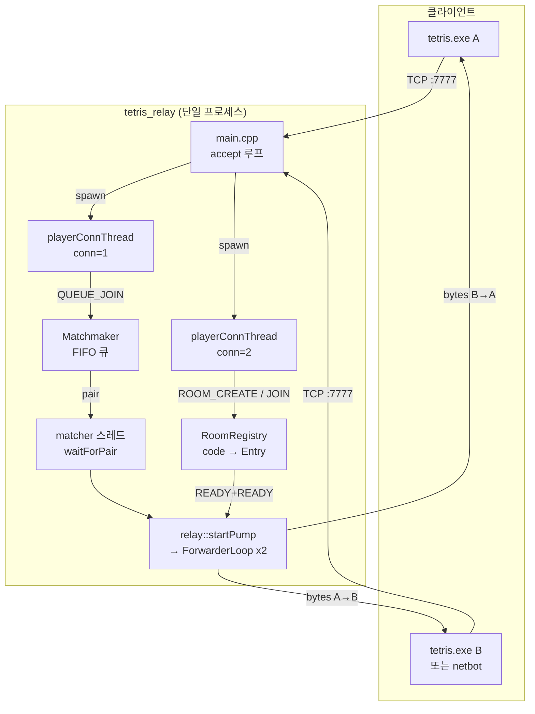
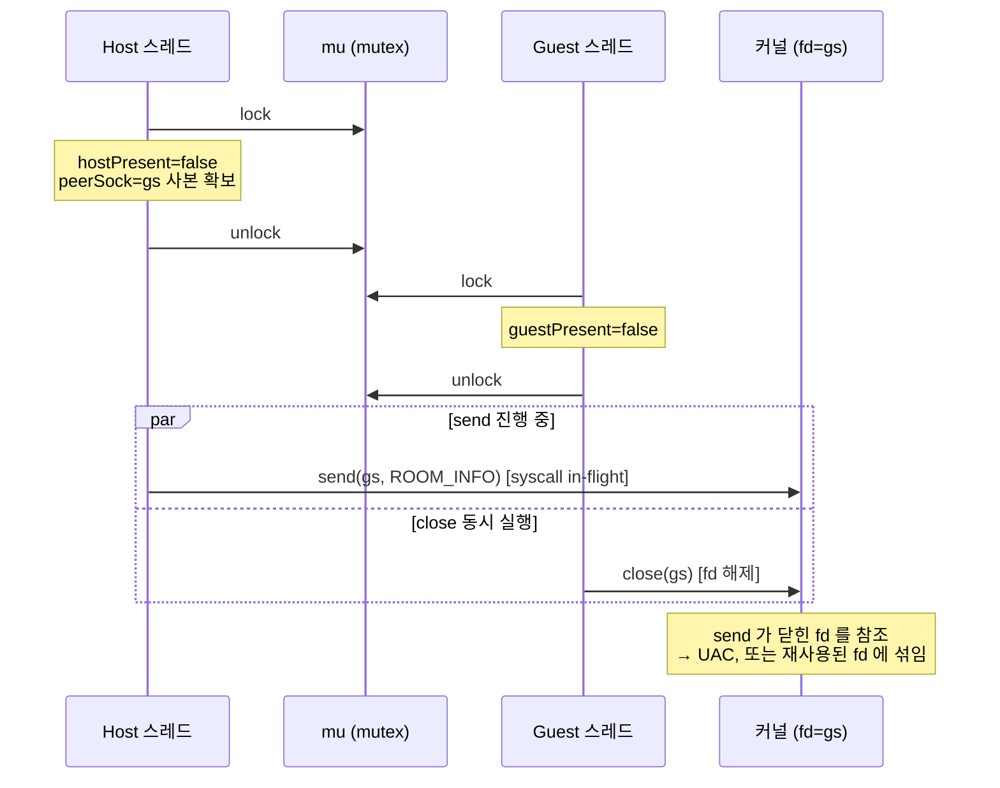
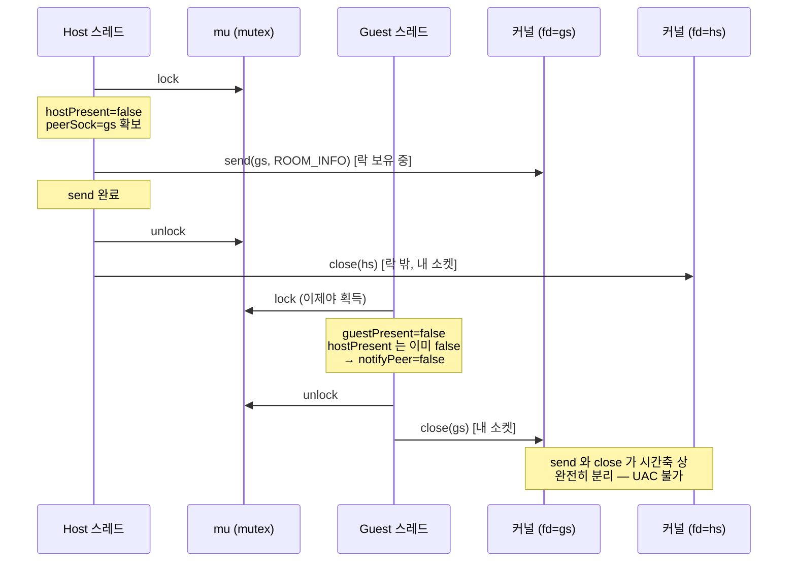
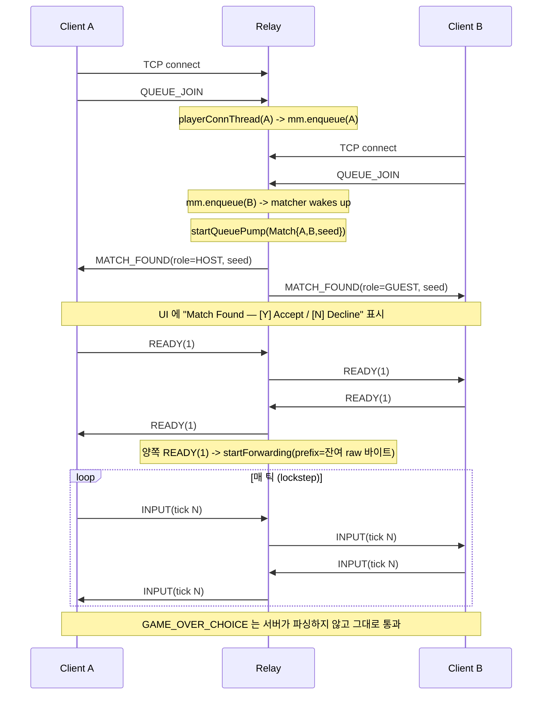
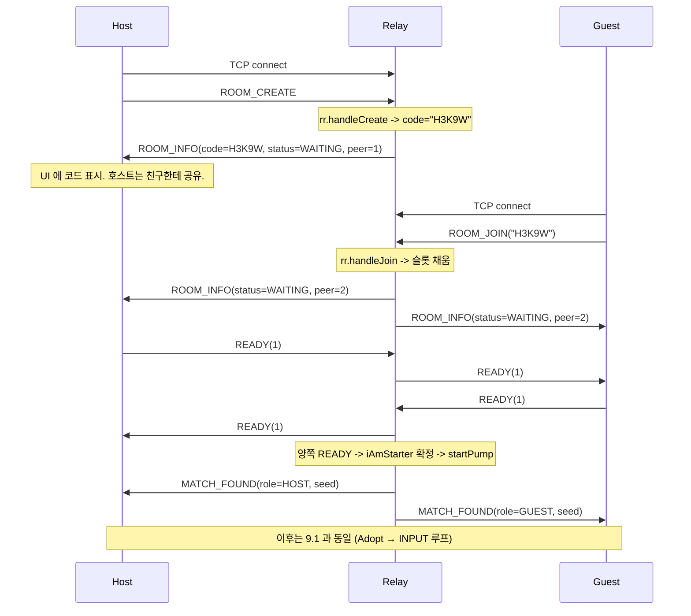

# Part 8: 릴레이 서버 — 매치메이킹과 룸 코드

> **시리즈:** 제로부터 멀티플레이어 테트리스 + RL까지
> **Part 8** | [Part 0: 셋업](./part0-project-setup.md) | [Part 1: Win32+GL](./part1-window-and-opengl.md) | [Part 2: 2D 렌더링](./part2-2d-rendering.md) | [Part 3: 테트리스 로직](./part3-tetris-logic.md) | [Part 4: 게임 루프](./part4-game-loop.md) | [Part 5: 네트워킹](./part5-lockstep-networking.md) | [Part 6: Python RL](./part6-python-rl.md) | [Part 7: 오디오](./part7-xaudio2-audio.md) | **Part 8: 릴레이 서버** | [Part 9: RL + ONNX 봇](./part9-rl-onnx-bot.md) | [Part 10: 메타 서버와 랭킹](./part10-meta-and-ranking.md)

---

## 1. 들어가며

Part 5 에서 TCP 기반 lockstep 네트워킹을 만들었다. 한쪽이 `tcp_listen()` 으로 포트를 열고 반대쪽이 `tcp_connect()` 로 붙는 구조. 단순하고 결정론적이지만, 실제 인터넷 환경에서는 바로 깨진다.

- **NAT.** 집에서 공유기를 쓰는 사용자가 "호스트" 가 되려면 포트포워딩을 해야 한다. 일반 사용자에게 이걸 시킬 수 없다. UPnP 는 환경 의존이 크고, STUN/TURN 은 결정론적 lockstep 과 궁합이 나쁘다 (UDP 기반).
- **단순성.** P2P 로 가면 "누가 호스트인가" 를 협상해야 하고, 둘 다 NAT 뒤일 때의 홀펀칭이 필요하다. 릴레이 서버 하나만 공인 IP 에 올려두면 모든 클라이언트가 동일하게 `tcp_connect("relay:7777")` 만 하면 된다.
- **매치메이킹.** 혼자 게임하기 싫은 사람이 "아무나" 와 붙고 싶을 때, 두 명을 모아주는 주체가 필요하다. P2P 에는 이런 디스커버리가 없다.
- **룸 코드.** 친구랑 하고 싶으면 5자리 코드 하나로 공유할 수 있어야 한다. IP 를 주고받게 하고 싶지 않다.

그래서 Part 8 에서는 `tetris_relay` 라는 별도 실행 파일을 만든다. 이 서버가 하는 일은 세 가지뿐:

1. **매치메이킹 큐**: `QUEUE_JOIN` 을 보낸 연결 두 개가 모이면 페어링.
2. **룸 레지스트리**: `ROOM_CREATE` 로 5자리 코드 발급, `ROOM_JOIN <code>` 으로 참여.
3. **투명 바이트 포워딩**: 둘이 맺어진 순간부터 `INPUT/HASH/GAME_OVER_CHOICE/...` 프레임을 해석하지 않고 그대로 중계. seed 는 `MATCH_FOUND` 안에 들어간다.

3번이 중요하다. 게임 로직 (결정론, 락스텝, 가비지 큐) 은 릴레이가 몰라야 한다. 릴레이는 두 소켓 사이의 "두꺼운 파이프" 일 뿐, 프로토콜 대부분은 클라이언트 사이의 e2e 규약이다. 릴레이가 파싱하는 프레임은 `QUEUE_JOIN / ROOM_CREATE / ROOM_JOIN / ROOM_LEAVE / READY / CHAT / MATCH_FOUND / ROOM_INFO` 정도뿐. 나머지는 모두 블라인드 포워딩.

덕분에 한쪽이 `netbot` (Python) 이고 한쪽이 `tetris.exe` (C++) 여도 릴레이는 동일하게 동작한다. Part 9 에서 RL 봇을 붙일 때 서버는 건드릴 필요가 없다.

> **참고**: `ARCHITECTURE.md §11/§12` 가 "ELO + DB + HTTP API 까지 붙인 완전체" 의 설계도다. 이 장에서는 그중 **릴레이 + 매치메이킹 + 룸** 만 구현한다. 메타/ELO 분리 실행파일(`tetris_meta`) 은 시리즈의 [Part 10](./part10-meta-and-ranking.md) 에서 이어서 붙인다. 없어도 게임은 동작한다.

## 2. 전체 아키텍처

릴레이 서버의 전체 그림은 다음과 같다.



스레드 모델:

- **main 스레드**: `accept()` 만 한다. 새 연결마다 `playerConnThread` 를 detach.
- **playerConnThread (N개)**: 첫 프레임을 기다린다. `QUEUE_JOIN` 이면 `Matchmaker` 큐에 넣고 종료. `ROOM_CREATE/JOIN` 이면 `RoomRegistry::roomLoop_` 으로 진입해 대기실 루프를 돈다.
- **matcher 스레드**: 큐에서 2명씩 꺼내 `relay::startPump()` 호출. 내부에서 두 개의 `ForwarderLoop` 스레드를 만들고 바로 리턴.
- **ForwarderLoop 스레드 (매치당 2개)**: `A → B`, `B → A` 바이트 복사. 한쪽이 EOF 면 반대쪽도 닫고 종료.

소유권은 명확하다. `net::TcpSocket` 은 파일 디스크립터의 가벼운 래퍼 (값 복사 가능, 실제 close 는 `tcp_close()` 가 담당) 라서 스레드 간 이동이 쉽다. 단, **같은 fd 를 두 스레드가 동시에 `recv` 하지 않도록** 인계 시점을 cv 로 동기화한다 — 뒤에서 보는 "동시 나가기 레이스" 가 정확히 이 부분이다.

## 3. 서버 엔트리 `server/main.cpp`

Part 8 단계의 엔트리 파일은 100줄 남짓이다. 세 가지만 한다: 포트 열고, matcher 스레드 띄우고, accept 루프 돌기. 아래 코드는 Part 8 시점의 스냅샷이다. 현재 저장소의 `server/main.cpp` 는 Part 10 에서 `--meta` 인자와 토큰 검증 경로가 추가되어 더 길다.

```cpp
// 예시(Part 8 단계 스냅샷 — 현재 저장소에는 Part 10 메타 확장 포함)
// server/main.cpp — Tetris Multiplayer 릴레이 서버
//
// 빠른 요약:
//   1) TCP 포트(기본 7777) listen
//   2) accept 될 때마다 playerConnThread 스폰 → 해당 스레드가
//      QUEUE_JOIN 프레임을 기다렸다가 matchmaker 큐에 등록
//   3) matcher 스레드가 2명이 모이면 꺼내 relay::startPump() 호출 →
//      양쪽에 MATCH_FOUND 전송 + 바이트 포워딩 시작
//
// 프로토콜(net/framing.h):
//   C→S QUEUE_JOIN   (10) : empty payload
//   S→C MATCH_FOUND  (12) : [role:1][seed:8 LE]   role: 1=HOST, 2=GUEST
//   (이후 바이트는 투명 포워딩 — INPUT/HASH/GAME_OVER_CHOICE 그대로 통과)

#include "matchmaker.h"
#include "player_conn.h"
#include "relay.h"
#include "room.h"
#include "../net/socket.h"

#include <atomic>
#include <chrono>
#include <csignal>
#include <cstdint>
#include <cstdio>
#include <cstdlib>
#include <cstring>
#include <functional>
#include <iostream>
#include <string>
#include <thread>

namespace {

std::atomic<bool> g_running{true};
net::TcpSocket    g_listen_sock{};  // SIGINT 시 accept() 를 깨우기 위함

void signalHandler(int /*sig*/) {
    g_running.store(false);
    // accept() 는 블로킹이므로 소켓을 닫아 system call 을 반환시킨다.
    // close() 는 signal-safe 하지 않은 구현도 있지만(Windows closesocket 포함)
    // 실전에서는 충분히 동작. 엄격한 async-signal-safety 가 필요하면
    // self-pipe trick 으로 대체 가능.
    net::tcp_close(g_listen_sock);
}

void printUsage() {
    std::cout <<
        "Usage: tetris_relay [--port N]\n"
        "  --port N         TCP listen port (default 7777)\n"
        "  -h, --help       Show this help\n";
}

}  // namespace

int main(int argc, char** argv) {
    uint16_t port = 7777;

    for (int i = 1; i < argc; ++i) {
        const std::string a = argv[i];
        if (a == "--port" && i + 1 < argc) {
            port = static_cast<uint16_t>(std::atoi(argv[++i]));
        } else if (a == "-h" || a == "--help") {
            printUsage();
            return 0;
        } else {
            std::cerr << "Unknown arg: " << a << "\n";
            printUsage();
            return 1;
        }
    }

    std::signal(SIGINT,  signalHandler);
    std::signal(SIGTERM, signalHandler);

    if (!net::net_init()) {
        std::cerr << "net_init() failed\n";
        return 1;
    }

    g_listen_sock = net::tcp_listen(port, /*backlog=*/16);
    if (!g_listen_sock.valid()) {
        std::cerr << "tcp_listen(" << port << ") failed — port in use?\n";
        net::net_shutdown();
        return 1;
    }
    std::cout << "[relay] listening on 0.0.0.0:" << port << "\n";
    std::cout << "[relay] local IP: " << net::get_local_ip() << "\n";
    std::cout << "[relay] Ctrl+C to stop\n";

    relay::Matchmaker   mm;
    relay::RoomRegistry rr;

    // 매칭 전담 스레드: 2명 모일 때마다 페어링 + relay 시작
    std::thread matcher([&mm] {
        while (true) {
            auto match = mm.waitForPair();
            if (!match) break;  // shutdown
            relay::startPump(std::move(*match));
        }
    });

    // accept 루프 (블로킹)
    uint32_t next_conn_id = 1;
    while (g_running.load()) {
        auto client = net::tcp_accept(g_listen_sock);
        if (!client.valid()) {
            // 셧다운 중이면 g_listen_sock 이 이미 닫혔을 것
            if (!g_running.load()) break;
            // 일시적 실패 — 잠깐 쉬었다가 재시도
            std::this_thread::sleep_for(std::chrono::milliseconds(10));
            continue;
        }
        const uint32_t id = next_conn_id++;
        std::cout << "[relay] accept conn=" << id << "\n";
        std::thread(relay::playerConnThread,
                    std::move(client), id, std::ref(mm), std::ref(rr)).detach();
    }

    std::cout << "[relay] shutting down...\n";
    mm.shutdown();
    rr.shutdown();
    if (matcher.joinable()) matcher.join();
    net::net_shutdown();
    std::cout << "[relay] done\n";
    return 0;
}
```

주목할 몇 가지.

**시그널 처리.** `SIGINT/SIGTERM` 핸들러가 `g_running = false` 로 전환하고 listen 소켓을 닫는다. `accept()` 는 블로킹이므로 플래그만 바꿔서는 깨어나지 않는다. 소켓을 닫으면 `accept()` 가 error 로 복귀하고, 바로 위 `g_running.load()` 체크에서 루프를 빠져나간다. `tcp_close` 가 엄밀한 async-signal-safe 는 아니지만 (Windows `closesocket`, Linux `close` 모두 해당), 단일 바이너리 서버 수준에서는 실전 문제 없다.

**`matcher` 스레드 한 개로 충분한가.** 이 스레드는 큐에서 쌍을 꺼내 `startPump()` 만 호출한다. `startPump` 자체가 두 개의 `ForwarderLoop` 스레드를 새로 띄우고 즉시 반환하므로 matcher 는 금방 다음 쌍으로 넘어간다. 동시에 수천 매치가 시작되지 않는 한 병목이 아니다.

**소켓 소유권 이전.** `std::thread(relay::playerConnThread, std::move(client), ...)` 에서 `client` 는 rvalue 로 이동된다. `TcpSocket` 에 소멸자가 자동으로 close 를 걸지 않는 이유가 여기 있다 — 값 복사 · 값 이동을 자유롭게 해야 하고, 실제 close 는 명시적 `tcp_close()` 가 담당한다.

이 시점에서 빌드하면 서버는 "연결을 받아서 스레드를 스폰한다" 까지만 한다. 실제 매칭 동작은 `playerConnThread` 구현에 달렸다.

## 4. 첫 프레임 분기 `player_conn.cpp`

새 연결이 들어오면 우리는 이 연결이 무엇을 원하는지 모른다. 세 가지 의도가 있을 수 있다.

1. **아무나랑 매칭하고 싶다** → `QUEUE_JOIN`
2. **방 만들어서 코드 공유하고 싶다** → `ROOM_CREATE`
3. **받은 코드로 입장하고 싶다** → `ROOM_JOIN <code>`

이걸 분기하는 게 `playerConnThread` 의 단일 책임. 아래 코드는 Part 8 단계의 구현이다. 현재 저장소의 `player_conn.cpp` 는 Part 10 에서 `[tok_len:1][token:N]` 추출과 `MetaClient::verify_token` 호출이 추가되어 있다.

```cpp
// 예시(Part 8 단계 스냅샷 — 현재 저장소에는 Part 10 토큰 인증 확장 포함)
#include "player_conn.h"

#include "matchmaker.h"
#include "room.h"
#include "../net/framing.h"

#include <chrono>
#include <iostream>
#include <string>
#include <thread>
#include <utility>
#include <vector>

namespace relay {

// 첫 프레임(QUEUE_JOIN / ROOM_CREATE / ROOM_JOIN) 대기 제한 시간.
// 클라이언트는 TCP connect 직후 바로 첫 프레임을 보내므로 10초면 충분.
static constexpr auto kJoinTimeout  = std::chrono::seconds(10);
static constexpr auto kPollInterval = std::chrono::milliseconds(10);

void playerConnThread(net::TcpSocket sock, uint32_t conn_id,
                      Matchmaker& mm, RoomRegistry& rr) {
    std::vector<uint8_t> stream;
    stream.reserve(64);

    const auto deadline = std::chrono::steady_clock::now() + kJoinTimeout;

    while (std::chrono::steady_clock::now() < deadline) {
        if (!net::tcp_recv_some(sock, stream)) {
            std::cerr << "[conn " << conn_id << "] disconnected before first frame\n";
            net::tcp_close(sock);
            return;
        }

        if (!stream.empty()) {
            std::vector<net::Frame> frames;
            net::parse_frames(stream, frames);
            for (const auto& f : frames) {
                if (f.type == net::MsgType::QUEUE_JOIN) {
                    std::cerr << "[conn " << conn_id << "] QUEUE_JOIN -> queued\n";
                    mm.enqueue({std::move(sock), conn_id});
                    return;
                }
                if (f.type == net::MsgType::ROOM_CREATE) {
                    std::cerr << "[conn " << conn_id << "] ROOM_CREATE\n";
                    rr.handleCreate(std::move(sock), conn_id);
                    return;
                }
                if (f.type == net::MsgType::ROOM_JOIN) {
                    if (f.payload.size() < 1) continue;
                    const uint8_t n = f.payload[0];
                    // 룸 코드는 room.cpp 의 kCodeLen=5 자 고정. 상한을 두어 악성/
                    // 손상 페이로드가 handleJoin 까지 내려가지 않도록 방어.
                    constexpr uint8_t kMaxCodeLen = 5;
                    if (n == 0 || n > kMaxCodeLen ||
                        f.payload.size() < 1u + n) continue;
                    std::string code(f.payload.begin() + 1,
                                     f.payload.begin() + 1 + n);
                    std::cerr << "[conn " << conn_id << "] ROOM_JOIN " << code << "\n";
                    rr.handleJoin(code, std::move(sock), conn_id);
                    return;
                }
                // HELLO 등 낯선 프레임은 초기 phase 에서는 무시 + 계속 대기
            }
        }

        std::this_thread::sleep_for(kPollInterval);
    }

    std::cerr << "[conn " << conn_id << "] first-frame timeout -> close\n";
    net::tcp_close(sock);
}

}  // namespace relay
```

흐름을 따라가 보자.

**10초 데드라인.** 클라이언트는 TCP `connect()` 가 성공한 직후 바로 첫 프레임을 보낸다 (`QueueJoin()` 은 `QUEUE_JOIN`, 메뉴에서 "create room" 클릭 시 `RoomCreate()` 는 `ROOM_CREATE` 전송). 10초를 넘기면 "뭔가 이상한 클라이언트" 로 간주하고 끊는다. 스레드/FD 가 무한정 쌓이는 DoS 를 막는 최소 방어.

**폴링 루프.** `tcp_recv_some` 은 논블로킹에 가까운 "한 번에 가능한 만큼" 읽기. 바이트가 없으면 빈 `stream` 으로 돌아온다. 이 경우 10ms 자고 다시 시도. CPU 를 1% 도 쓰지 않는다.

**`QUEUE_JOIN` / `ROOM_CREATE` 분기.** `std::move(sock)` 으로 소켓 소유권을 넘기고 리턴. 이후 이 스레드는 종료되고, 소켓은 매치메이커 또는 룸 레지스트리가 들고 있다.

**`ROOM_JOIN` 의 길이 상한 (kMaxCodeLen=5).** 페이로드 포맷은 `[code_len:1][code:N]`. `room.cpp` 의 `kCodeLen = 5` 와 일치시켜 5자 초과 코드는 여기서 거른다. 악성/손상 페이로드 (예: `code_len=200`) 가 `handleJoin` 까지 내려가 "존재하지 않는 200자 문자열" 조회를 돌리지 않도록 경계에서 잘라낸다. 경계 검증은 깊숙한 계층보다 바깥에서 할수록 좋다 — 아래 계층이 "내가 받는 code 는 반드시 길이 ≤ 5" 라는 가정을 안전히 할 수 있다.

**낯선 프레임은 무시.** `HELLO` 같은 프레임을 이 시점에 받으면 그냥 `continue`. 프로토콜 오용일 수도 있고, 언젠가 추가될 기능일 수도 있다. 가장 덜 파괴적인 선택은 "모르면 버리고 계속 기다리기" 다 (버전 간 전방 호환).

이 시점에서 서버는 두 의도 중 하나로 연결을 분류한 뒤 각 핸들러에 위임한다. 다음은 `Matchmaker` 먼저.

## 5. Matchmaker (FIFO 큐)

매치메이커의 책임은 단순하다: **대기 중인 연결을 FIFO 로 두 개씩 묶는다**. ELO 고려, 지역 고려 같은 건 이 장에서는 없다. (확장 계획은 `ARCHITECTURE.md §11.9` 의 "Out of scope" 참조.)

인터페이스 요지:

```cpp
// server/matchmaker.h (요지)
struct QueuedPlayer {
    net::TcpSocket sock;
    uint32_t       conn_id;
};

class Matchmaker {
public:
    void enqueue(QueuedPlayer p);
    // 두 명 모일 때까지 블로킹. shutdown 되면 nullopt.
    std::optional<Match> waitForPair();
    void shutdown();

private:
    std::mutex              mu_;
    std::condition_variable cv_;
    std::deque<QueuedPlayer> queue_;
    std::atomic<bool>       stopping_{false};
};
```

`playerConnThread` 가 `enqueue` 하면 `cv_.notify_one()`. `matcher` 스레드는 `waitForPair()` 안에서 `cv_.wait()` 하다가 큐 크기 ≥ 2 면 앞에서 둘을 꺼내 `Match{A, B, seed, match_id}` 를 반환. main.cpp 의 matcher 스레드가 이걸 받아 `relay::startPump` 로 넘긴다.

**MATCH_FOUND 포맷.** `net/framing.h` 에 정의된 대로:

```
MATCH_FOUND (12) 페이로드 = [role:1][seed:8 LE]
  role: 1 = HOST,  2 = GUEST
  seed:  8바이트 LE — 양쪽 클라이언트가 공유할 lockstep RNG 시드
```

`startPump` 가 호출되면 제일 먼저 두 소켓에 `MATCH_FOUND` 를 보낸다. HOST 에는 `role=1`, GUEST 에는 `role=2`. seed 는 동일한 8바이트. 클라이언트 측 `Session` 은 `Adopt(sock, role, seed)` 로 이미 연결된 릴레이 소켓과 seed 를 받아 곧바로 ready 상태가 된다. 일반 P2P 의 `HELLO → HELLO_ACK → SEED` 핸드셰이크는 이 경로에서 다시 하지 않는다. 서버는 더 이상 파싱하지 않고 바이트를 복사할 뿐이다.

**왜 서버가 seed 를 정하나.** 결정론적 lockstep 은 두 클라이언트가 동일한 RNG 스트림을 공유해야 한다. Part 5 의 직접 접속에서는 호스트가 seed 를 뽑아 `SEED` 프레임으로 알려준다. 릴레이 매칭에서는 서버가 seed 를 한 번 정해 `MATCH_FOUND` 에 실어 양쪽에 보낸다. HOST/GUEST 역할은 보드 배치, 로그, 재시작 협상 같은 클라이언트 내부의 비대칭을 일관되게 만들기 위한 라벨이다.

**FIFO 의 페어링 순서.** 큐 head 쪽이 먼저 기다린 사람이므로 HOST 로 주고, 새로 들어온 쪽을 GUEST 로 줬다. 대칭 릴레이라 사실상 구분이 의미 없지만, 디버그 로그를 읽을 때 "A 가 먼저 · B 가 나중" 을 일관되게 표시할 수 있어 유용하다.

**동시 나가기.** 큐에 들어간 뒤 클라이언트가 바로 창을 닫으면? `enqueue` 후 `playerConnThread` 는 이미 리턴했으므로, 매치메이커가 "상대가 모일 때까지" 붙잡고 있는 동안 그 소켓은 점유돼 있다. 다음 `waitForPair` 가 반환하는 순간 `startPump` 가 양쪽에 `MATCH_FOUND` 를 쏘는데, 이미 끊긴 쪽은 `tcp_send_all` 이 실패한다. `ForwarderLoop` 가 이 실패를 EOF 로 보고 즉시 양쪽을 닫는다 — 살아남은 쪽은 `MATCH_FOUND` 는 받지만 곧바로 EOF 를 보게 되고, 클라이언트는 "상대가 나감" 으로 처리. 프로토콜 상의 명시적 "취소" 메시지 없이도 자연스럽게 정리된다.

## 6. RoomRegistry (5자 코드)

매치메이킹이 "아무나랑" 이라면, 룸은 "지정된 사람과" 다. 책임 세 가지.

1. `handleCreate`: 새 코드 발급, `Entry` 생성, 호스트 대기 루프 시작.
2. `handleJoin`: 코드 검색, 빈 슬롯이면 게스트로 채움, 양쪽에 `ROOM_INFO` 통지.
3. `roomLoop_`: READY 동기, CHAT 포워딩, 양쪽 READY 일 때 match 시작.

### 6.1 코드 생성

```cpp
// base32 알파벳 — 혼동 쉬운 0/O/1/I 제외 (plan §D.1)
constexpr char   kCodeAlphabet[]    = "ABCDEFGHJKLMNPQRSTUVWXYZ23456789";
constexpr size_t kCodeAlphabetN     = sizeof(kCodeAlphabet) - 1;
constexpr size_t kCodeLen           = 5;
```

32 글자 알파벳 × 5자리 = 32^5 ≈ 33.5M 조합. 동시에 몇 백 개 방이 떠 있어도 충돌 확률은 무시할 수준. 혼동 쉬운 `0/O/1/I` 를 제외한 이유는 음성/문자 전달 실수 줄이기 — 친구랑 디스코드로 "내 방 코드 H3K9W" 라고 보낼 때 `0`/`O` 헷갈림을 피한다.

```cpp
std::string RoomRegistry::generateCode_() {
    // mu 잡힘. 충돌 나면 재시도 — 실질적으로 매우 드물다 (32^5 = 33M 조합).
    for (int attempt = 0; attempt < 32; ++attempt) {
        std::string c(kCodeLen, 'A');
        uint64_t x = xorshift64_(code_rng_state_);
        for (size_t i = 0; i < kCodeLen; ++i) {
            c[i] = kCodeAlphabet[x % kCodeAlphabetN];
            x /= kCodeAlphabetN;
            if (x == 0) x = xorshift64_(code_rng_state_);
        }
        if (rooms.find(c) == rooms.end()) return c;
    }
    return {};  // 상상 속 병리적 충돌
}
```

xorshift64 로 64비트를 뽑아 base32 로 나눠가며 5글자 채우기. 빈 자리가 남으면 새 난수를 뽑는다. 충돌 시 32회 재시도 — 실제로 여기까지 올 일은 "방이 수백만 개 떠있을 때" 뿐.

### 6.2 방 만들기

```cpp
void RoomRegistry::handleCreate(net::TcpSocket sock, uint32_t conn_id) {
    if (stopping.load()) { net::tcp_close(sock); return; }
    std::string code;
    {
        std::unique_lock<std::mutex> lk(mu);
        code = generateCode_();
        if (code.empty()) {
            lk.unlock();
            net::tcp_close(sock);
            return;
        }
        Entry& r       = rooms[code];
        r.code         = code;
        r.hostSock     = sock;
        r.hostConn     = conn_id;
        r.hostPresent  = true;
    }
    std::cerr << "[room] conn=" << conn_id << " created code=" << code << "\n";
    sendRoomInfo_(sock, code, kStatusWaiting, 1);
    roomLoop_(code, /*isHost=*/true);
}
```

락 안에서 Entry 만들고, 락 밖으로 나와 ROOM_INFO 한 개 보내고, `roomLoop_` 진입. 여기서는 호스트 혼자라 peer 를 건드릴 일이 없으므로 락 밖 send 가 안전하다 — 7장에서 다루는 레이스는 "둘 다 있을 때" 의 문제.

### 6.3 방 입장

```cpp
void RoomRegistry::handleJoin(const std::string& code, net::TcpSocket sock, uint32_t conn_id) {
    if (stopping.load()) { net::tcp_close(sock); return; }
    bool entered = false;
    {
        std::unique_lock<std::mutex> lk(mu);
        auto it = rooms.find(code);
        if (it == rooms.end()) {
            lk.unlock();
            sendRoomInfo_(sock, code, kStatusNotFound, 0);
            net::tcp_close(sock);
            std::cerr << "[room] conn=" << conn_id << " join " << code << " notfound\n";
            return;
        }
        auto& r = it->second;
        if (r.guestPresent || r.matchStarted) {
            const uint8_t peerCount =
                static_cast<uint8_t>((r.hostPresent ? 1 : 0) + (r.guestPresent ? 1 : 0));
            lk.unlock();
            sendRoomInfo_(sock, code, kStatusFull, peerCount);
            net::tcp_close(sock);
            std::cerr << "[room] conn=" << conn_id << " join " << code << " full\n";
            return;
        }
        r.guestSock     = sock;
        r.guestConn     = conn_id;
        r.guestPresent  = true;
        net::TcpSocket hs = r.hostSock;
        net::TcpSocket gs = r.guestSock;
        lk.unlock();
        sendRoomInfo_(hs, code, kStatusWaiting, 2);
        sendRoomInfo_(gs, code, kStatusWaiting, 2);
        entered = true;
    }
    if (entered) {
        std::cerr << "[room] conn=" << conn_id << " joined " << code << "\n";
        roomLoop_(code, /*isHost=*/false);
    }
}
```

세 경로.

1. **코드 없음** (`rooms.find(code) == end`): `ROOM_INFO(status=NOT_FOUND, peer=0)` 보내고 닫음.
2. **이미 꽉참** (`guestPresent || matchStarted`): `ROOM_INFO(status=FULL, peer=N)` 보내고 닫음.
3. **입장 성공**: 게스트를 Entry 에 등록, 양쪽에 `ROOM_INFO(status=WAITING, peer=2)` 브로드캐스트, `roomLoop_` 진입.

`ROOM_INFO` 의 status 바이트:

| 값 | 이름 | 의미 |
|----|------|------|
| 0 | WAITING | 방에 있고 대기/매칭 진행 가능 |
| 1 | FULL | 방은 있지만 이미 2명 |
| 2 | NOT_FOUND | 그런 코드 없음 |
| 3 | GONE_FULL | 상대가 나가서 혼자 남음 (roomLoop 종료 시 반대편에게) |

### 6.4 대기실 루프

`roomLoop_` 는 호스트·게스트 양쪽 스레드가 각각 한 벌씩 돈다. 책임:

- `READY` 프레임을 받으면 내 플래그 세팅 + 상대에게 투명 포워딩. 양쪽 `hostReady && guestReady` 면 matchStarted=true 로 선점하고 cv notify.
- `CHAT` 프레임은 상대에게 포워딩.
- `ROOM_LEAVE` 받으면 루프 종료.
- 상대가 먼저 matchStarted 를 세웠으면 내 loop 를 벗어나 fd 를 이관받게 한다 (cv wait).

핵심 루프 본문:

```cpp
void RoomRegistry::roomLoop_(const std::string& code, bool isHost) {
    // 내 소켓 사본 확보 (lock 밖에서 recv 하기 위함)
    net::TcpSocket mySock;
    {
        std::lock_guard<std::mutex> lk(mu);
        auto it = rooms.find(code);
        if (it == rooms.end()) return;
        auto& r = it->second;
        mySock = isHost ? r.hostSock : r.guestSock;
    }

    std::vector<uint8_t> stream;
    stream.reserve(256);
    bool leaveRequested   = false;
    bool peerStartedMatch = false;
    bool iAmStarter       = false;

    while (!stopping.load()) {
        if (!net::tcp_recv_some(mySock, stream)) {
            // EOF — 소켓 닫힘
            break;
        }

        if (!stream.empty()) {
            std::vector<net::Frame> frames;
            net::parse_frames(stream, frames);
            for (const auto& f : frames) {
                if (f.type == net::MsgType::READY) {
                    const bool ready = !f.payload.empty() && f.payload[0] != 0;
                    net::TcpSocket fwd{};
                    bool hasFwd = false;
                    {
                        std::lock_guard<std::mutex> lk(mu);
                        auto it = rooms.find(code);
                        if (it != rooms.end()) {
                            auto& r = it->second;
                            if (isHost) r.hostReady  = ready;
                            else        r.guestReady = ready;
                            if (isHost && r.guestPresent) { fwd = r.guestSock; hasFwd = true; }
                            if (!isHost && r.hostPresent) { fwd = r.hostSock;  hasFwd = true; }
                        }
                    }
                    if (hasFwd) {
                        std::vector<uint8_t> p; p.push_back(ready ? 1 : 0);
                        auto out = net::build_frame(net::MsgType::READY, p);
                        net::tcp_send_all(fwd, out.data(), out.size());
                    }
                } else if (f.type == net::MsgType::ROOM_LEAVE) {
                    leaveRequested = true;
                } else if (f.type == net::MsgType::CHAT) {
                    // 대기 중 채팅 — 상대에게 그대로 전달
                    net::TcpSocket fwd{};
                    bool hasFwd = false;
                    {
                        std::lock_guard<std::mutex> lk(mu);
                        auto it = rooms.find(code);
                        if (it != rooms.end()) {
                            auto& r = it->second;
                            if (isHost && r.guestPresent) { fwd = r.guestSock; hasFwd = true; }
                            if (!isHost && r.hostPresent) { fwd = r.hostSock;  hasFwd = true; }
                        }
                    }
                    if (hasFwd) {
                        auto out = net::build_frame(net::MsgType::CHAT, f.payload);
                        net::tcp_send_all(fwd, out.data(), out.size());
                    }
                }
                // 다른 타입(HELLO 등)은 이 단계에서는 무시
            }
        }

        if (leaveRequested) break;

        // 상태 변화 체크
        {
            std::lock_guard<std::mutex> lk(mu);
            auto it = rooms.find(code);
            if (it == rooms.end()) break;
            auto& r = it->second;

            if (r.matchStarted) {
                // 상대가 starter 로 선점함 — 내 read 루프를 내려놓고 exit 플래그 세팅
                peerStartedMatch = true;
                if (isHost) r.hostExited = true;
                else        r.guestExited = true;
                cv.notify_all();
                break;
            }

            if (r.hostPresent && r.guestPresent && r.hostReady && r.guestReady) {
                r.matchStarted = true;
                iAmStarter     = true;
                cv.notify_all();
                break;
            }
        }

        std::this_thread::sleep_for(kPollInterval);
    }
    // ... (이후 starter / peerStartedMatch / 일반 종료 분기; 아래 7장에서 세부 설명)
```

READY 포워딩에서 한 가지 미묘한 선택: "내가 READY 를 보냈다" 를 *상대에게* 알려주고 싶은 건 상대의 UI 가 "상대가 준비됨" 토글을 표시하기 위함. 서버에서 시각적 피드백 없이 처리하지 않는다 — UI 는 클라이언트, 서버는 진실의 단일 소스.

두 명 다 READY 가 되면 *먼저 락을 잡은 쪽* 이 `matchStarted = true, iAmStarter = true` 를 세우고 빠져나간다. 다른 쪽은 다음 락 획득 시점에 `r.matchStarted == true` 를 보고 `peerStartedMatch = true` 로 빠져나간다. 둘 중 하나만 starter 가 되어야 `startPump` 중복 호출을 막을 수 있다.

## 7. 동시 나가기 레이스 (실제 버그)

이 장의 "실패 모드" 교훈이다. 코드 상에 아직 커다란 주석으로 남아 있다:

```cpp
// 주의: peer 통지(sendRoomInfo_)는 반드시 lock 보유 상태에서 보낸다.
//   lock 밖에서 peerSock 사본으로 send 하는 동안, 상대 스레드가 자신의 종료
//   경로에 들어가 같은 fd 를 tcp_close 하면 send 중에 fd 가 사라진다(UAC).
//   ROOM_INFO 는 <50 B 단일 프레임이라 lock hold 시간 영향 미미.
```

### 7.1 증상

두 클라이언트가 거의 동시에 룸에서 나갈 때 (한쪽은 `ROOM_LEAVE` 송출, 다른 쪽은 창 닫기로 EOF), Windows 에서는 드물게 서버가 죽거나, Linux 에서는 드물게 이전 fd 번호로 전혀 다른 소켓에 쓰레기 바이트가 섞여 들어가는 현상. 로컬에서 재현이 어렵고, 매칭을 수백 번 반복하는 부하 테스트에서 1~2회 관측되는 종류.

### 7.2 원인

`roomLoop_` 의 "일반 종료" 경로 초기 버전은 대략 다음과 같았다 (과거 모습, 현재 저장소에는 없음 — 이해를 위한 재구성):

```cpp
// 예시(실제 저장소에는 없음 — 버그 이전 가상의 초기 구현):
net::TcpSocket peerSock{};
bool notifyPeer = false;
{
    std::lock_guard<std::mutex> lk(mu);
    auto it = rooms.find(code);
    if (it != rooms.end()) {
        auto& r = it->second;
        if (isHost) { r.hostPresent = false; ... }
        else        { r.guestPresent = false; ... }
        if (isHost && r.guestPresent) { peerSock = r.guestSock; notifyPeer = true; }
        if (!isHost && r.hostPresent) { peerSock = r.hostSock;  notifyPeer = true; }
    }
}
// ↓ lock 밖에서 send
if (notifyPeer) sendRoomInfo_(peerSock, code, kStatusGoneFull, 1);
net::tcp_close(mySock);
```

"lock hold 시간을 줄이자" 는 상식적 최적화. 문제는 `peerSock` 이 fd 의 **사본** 이라는 것. 두 스레드가 각자 "일반 종료" 경로에 거의 동시에 진입하면 다음 인터리빙이 일어난다:

1. **호스트 스레드**: 락 안에서 `hostPresent=false`, peerSock=gs 확보, lock 해제.
2. **게스트 스레드**: 락 안에서 `guestPresent=false`, peerSock=hs 확보, lock 해제.
3. **호스트 스레드**: lock 밖에서 `sendRoomInfo_(gs, ...)` — `tcp_send_all(gs, ...)` 시스템 콜 진입.
4. **게스트 스레드**: `rooms.erase(code)` + `tcp_close(mySock=gs)` 실행 — fd 가 커널에서 해제됨.
5. **호스트 스레드**: 3번의 send 가 진행 중이던 fd 가 방금 닫힘. 이 fd 번호가 OS 에 의해 곧바로 다른 소켓 accept 에 재사용되면, 전혀 무관한 클라이언트 연결에 `ROOM_INFO` 바이트가 섞여 들어간다 (use-after-close, UAC).

시퀀스 다이어그램으로 보면 "송신 구간과 close 구간이 겹치는" 윈도우가 보인다:



로그 없는 단일 테스트에서는 보이지 않지만, 매치를 연속으로 수백 번 돌리면 확률이 누적된다.

### 7.3 수정

현재 코드는 다음과 같이 **send 를 락 안에서** 한다:

```cpp
// 일반 종료(ROOM_LEAVE / EOF / shutdown) — 상대에게 알리고 내 소켓 닫음.
// 주의: peer 통지(sendRoomInfo_)는 반드시 lock 보유 상태에서 보낸다.
//   lock 밖에서 peerSock 사본으로 send 하는 동안, 상대 스레드가 자신의 종료
//   경로에 들어가 같은 fd 를 tcp_close 하면 send 중에 fd 가 사라진다(UAC).
//   ROOM_INFO 는 <50 B 단일 프레임이라 lock hold 시간 영향 미미.
bool eraseRoom = false;
{
    std::lock_guard<std::mutex> lk(mu);
    auto it = rooms.find(code);
    if (it != rooms.end()) {
        auto& r = it->second;
        if (isHost) { r.hostPresent = false;  r.hostReady  = false; }
        else        { r.guestPresent = false; r.guestReady = false; }
        net::TcpSocket peerSock{};
        bool notifyPeer = false;
        if (isHost && r.guestPresent) { peerSock = r.guestSock; notifyPeer = true; }
        if (!isHost && r.hostPresent) { peerSock = r.hostSock;  notifyPeer = true; }
        if (notifyPeer) sendRoomInfo_(peerSock, code, kStatusGoneFull, 1);
        if (!r.hostPresent && !r.guestPresent) eraseRoom = true;
    }
}

if (eraseRoom) {
    std::lock_guard<std::mutex> lk(mu);
    rooms.erase(code);
}

net::tcp_close(mySock);
```

핵심 변화 두 가지.

1. **`sendRoomInfo_` 를 `lock_guard` 블록 안으로**. 상대 스레드는 "내 `tcp_close(mySock)` 전에" 반드시 이 mu 를 획득하는 지점을 지나야 한다 (상대도 동일한 종료 경로를 타므로 락을 먼저 잡아 자기 present 플래그를 false 로 바꾼다). 내가 lock 을 잡은 동안 상대는 lock 을 대기 → 내 send 가 끝날 때까지 tcp_close 가 실행되지 않음. UAC 제거.
2. **`tcp_close(mySock)` 은 락 밖**. close 자체는 짧고 signal-safe 도 필요 없어서 락 밖이 자연스럽다. 관건은 "내가 쓰고 있는 상대 fd 가 상대에 의해 닫히지 않도록" 이지, 내 fd 를 상대가 읽고 있지는 않으므로 내 close 는 lock 밖으로 빼도 안전하다.

수정 후 시퀀스는 두 스레드의 임계구간이 완전히 직렬화된다:



상대편 send 가 끝나기 전에는 상대가 `mu` 를 잡을 수 없으므로, 내 fd 를 상대가 닫을 가능성이 사라진다. 한 쪽이 락 해제 시점에는 자기 present 플래그만 false 로 고쳐놓은 상태라 반대편이 뒤늦게 진입해도 `notifyPeer=false` 로 평가되어 중복 알림도 없다.

**트레이드오프**. 락 안에서 네트워크 send 를 하는 건 일반적으로 권장되지 않는다 (send 가 blocking 되면 mutex 점유 시간이 길어짐). 여기서 안전한 이유는: `ROOM_INFO` 가 1 프레임 ~15바이트, 커널 송신 버퍼가 거의 확실히 비어 있음, blocking send 라 해도 수 μs. 반대로 UAC 는 간헐적 데이터 섞임 · 크래시로 이어지는 치명적 버그. 결정론·안전성 ≫ 짧은 락 점유 시간.

일반화된 교훈: **"fd 사본을 여러 스레드가 나눠 갖고, 한쪽이 close, 한쪽이 write"** 패턴은 반드시 close 와 write 의 순서를 직렬화할 동기화가 필요하다. 사본을 쓰면 "내 손의 fd 는 내 것" 같은 직관이 작동하지 않는다 — fd 번호는 커널 자원에 대한 참조고, 참조 카운트가 아니다.

### 7.4 ROOM_JOIN 길이 상한 방어

같은 "경계에서 미리 거른다" 원칙이 ROOM_JOIN 페이로드 검증에도 적용된다. `player_conn.cpp` 의 초기 버전은 다음만 체크했다 (과거 모습):

```cpp
// 예시(실제 저장소에는 없음 — 상한 도입 전 초기 구현):
if (f.type == net::MsgType::ROOM_JOIN) {
    if (f.payload.size() < 1) continue;
    const uint8_t n = f.payload[0];
    if (n == 0 || f.payload.size() < 1u + n) continue;
    std::string code(f.payload.begin() + 1, f.payload.begin() + 1 + n);
    rr.handleJoin(code, std::move(sock), conn_id);
    return;
}
```

문제는 `n` 이 `uint8_t` 라 최대 255 까지 허용된다는 점. `room.cpp` 의 `kCodeLen = 5` 는 코드 **생성** 상수라 `handleJoin` 쪽이 "들어오는 code 도 5자다" 를 강제하지 않는다. 즉, 누군가 `code_len=200` + 200바이트 쓰레기 페이로드를 보내면:

- `unordered_map<string, Entry>::find` 가 200자 문자열 키로 호출됨 (해시 + 비교).
- 로그에 200자짜리 의미없는 문자열이 그대로 출력됨 (터미널/파일 오염).
- 악성 트래픽이 `handleJoin` 의 구조 깊숙이 도달.

Part 8 단계에서 수정은 간단하다. `player_conn.cpp` 의 해당 분기:

```cpp
// 예시(Part 8 단계 스냅샷 — 현재 저장소에는 code 뒤 token 추출이 추가됨)
if (f.type == net::MsgType::ROOM_JOIN) {
    if (f.payload.size() < 1) continue;
    const uint8_t n = f.payload[0];
    // 룸 코드는 room.cpp 의 kCodeLen=5 자 고정. 상한을 두어 악성/
    // 손상 페이로드가 handleJoin 까지 내려가지 않도록 방어.
    constexpr uint8_t kMaxCodeLen = 5;
    if (n == 0 || n > kMaxCodeLen ||
        f.payload.size() < 1u + n) continue;
    std::string code(f.payload.begin() + 1,
                     f.payload.begin() + 1 + n);
    std::cerr << "[conn " << conn_id << "] ROOM_JOIN " << code << "\n";
    rr.handleJoin(code, std::move(sock), conn_id);
    return;
}
```

`kMaxCodeLen = 5` 를 `constexpr` 로 두고 `n > kMaxCodeLen` 조건을 `continue` 기준에 합쳤다. 5자를 초과하는 code 는 정상 클라이언트가 생성할 수 없으므로, 여기 걸리는 건 ⑴ 프로토콜 버그, ⑵ 링크 상의 비트 플립 (framing 체크섬이 없는 계층이 있다면), ⑶ 악성 연결 — 어느 경우든 조용히 프레임을 버리고 다음 프레임을 기다리는 게 안전한 선택.

**왜 중요한가**:

- **로그 오염 방지**. 구조화 로그 파이프라인에 임의 바이트 (제어문자 포함) 가 들어가지 않는다.
- **메모리 경계 방어**. 구조적으로 200바이트가 최대지만, 향후 `code_len` 이 `uint16_t` 로 확장되거나 페이로드 경로가 달라져도 동일한 상한 검사가 이미 들어 있다.
- **심층 방어 (defense-in-depth)**. `handleJoin` 이 "내가 받는 code 는 반드시 길이 ≤ 5" 를 자연히 가정할 수 있다. 계층 아래로 내려갈수록 불변조건이 단순해지는 게 유지보수에 유리.

경계 검증은 항상 바깥에서부터 좁혀 들어가야 한다. `player_conn.cpp` 가 프로토콜 바깥 경계(= 첫 프레임 파싱) 이므로, 룸 코드에 대한 구조적 불변조건은 여기서 확정하는 게 옳다.

## 8. Relay ForwarderLoop

매치가 성립하면 두 개의 진입점 중 하나가 호출된다 (둘 다 `server/relay.cpp`):

- **커스텀 룸 경로**: `relay::startPump(Match, meta)` — 양쪽이 이미 룸 로비에서 READY 교환을 마친 상태라 바로 포워더를 연다.
  1. 두 소켓에 `MATCH_FOUND` 전송 (role + seed).
  2. `startForwarding` → 두 개의 `forwarderLoop` 스레드 spawn — 하나는 `A → B`, 하나는 `B → A`.
  3. 즉시 반환 (matcher 스레드를 붙잡아두지 않음).
- **랜덤 큐 경로**: `relay::startQueuePump(Match, meta)` — `MATCH_FOUND` 를 보낸 뒤 수락 로비 thread 를 detach 하고, 양쪽 `READY(1)` 이 모이면 `startForwardingWithPrefix` 로 포워더를 연다 (§9.1 상세).

둘 다 matcher 스레드는 블록하지 않는다 — lobby wait 조차 detached thread 에 넘겨, 다음 페어링이 즉시 이어진다.

`ForwarderLoop` 자체는 극단적으로 단순:

```cpp
// 예시(실제 저장소에는 없음 — 의미 재구성 스니펫):
void ForwarderLoop(net::TcpSocket src, net::TcpSocket dst,
                   std::atomic<bool>& pairClosed) {
    std::vector<uint8_t> buf;
    while (!pairClosed.load()) {
        if (!net::tcp_recv_some(src, buf)) break;   // EOF
        if (buf.empty()) {
            std::this_thread::sleep_for(std::chrono::milliseconds(1));
            continue;
        }
        if (!net::tcp_send_all(dst, buf.data(), buf.size())) break;
        buf.clear();
    }
    pairClosed.store(true);
    net::tcp_close(src);  // 실제 구현은 이중 close 방지를 위한 flag 필요
}
```

**왜 프레임 경계를 지키지 않나.** 일반적으로 TCP 는 바이트 스트림이고, `[LEN][TYPE][...]` 프레임을 중간에서 잘라 보내도 수신 측이 재조립한다. 릴레이는 중계자일 뿐 프로토콜 참여자가 아니므로 프레임 안쪽을 읽을 이유가 없다 — 받은 바이트를 그대로 넘기면 클라이언트의 `parse_frames` 가 알아서 재조립한다. 이게 "블라인드 포워딩" 의 전부.

**한쪽 EOF 시 반대쪽도 닫기.** `pairClosed` 원자 플래그로 두 스레드가 서로를 감지. A→B 가 EOF 를 보면 플래그 세팅 → B→A 스레드가 다음 recv 에서 break. 양쪽 모두 단일 소스로 종료 트리거.

**지연.** 릴레이는 한 홉이 추가된다. 집에서 집 직접 P2P 대비 수십 ms 더 든다. Part 5 의 lockstep 은 RTT/2 tick 딜레이 정도는 쉽게 흡수하도록 설계됐으므로 실전에서 체감 거의 없음. 결정론을 깨지 않는 게 훨씬 큰 이득.

**스로틀 없음.** 이 수준의 릴레이는 악성 클라이언트가 초당 수 MB 를 쏟아부으면 그대로 상대에게 전달한다. 현실에서는 프레임 sz 상한 · 초당 프레임 수 상한 같은 rate limit 가 필요하지만 이 장 범위는 아니다. Part 5 의 `parse_frames` 가 이상한 길이를 받으면 연결을 끊는 방식으로 최소 방어가 클라이언트 측에 이미 있다.

## 9. 메시지 시퀀스

두 가지 경로를 한 번에 본다.

### 9.1 QUEUE 경로



**수락 로비 단계 (Queue 전용)**. 랜덤 매칭은 서로 모르는 유저를 강제로 붙이는 성격이라 "매치가 잡혔으니 바로 시작" 은 플레이어에게 불친절하다. 그래서 `MATCH_FOUND` 를 보낸 직후 `startQueuePump` 가 **수락 로비 thread** 를 detach 하고, 양쪽 `READY(1)` 가 모일 때까지 기다린다.

- 클라는 MATCH_FOUND 수신 후 `Session::isQueueMatched()` 로 로비 상태 진입을 감지하고 "[Y] Accept / [N] Decline" UI 를 띄운다.
- `Y` 누르면 `QueueConfirm()` → `READY(1)` 송신. 릴레이가 상대에게 forward 하므로 상대 UI 에도 "Opponent: READY" 가 즉시 반영.
- 한쪽이라도 `READY(0)` 또는 `QUEUE_CANCEL` 을 쏘거나 30초 타임아웃이 걸리면 양 소켓 close, 양쪽 모두 "Matchmaking Failed" 로 메뉴 복귀.

커스텀 룸은 이미 자체 READY 교환 단계가 있으므로 이 로비를 거치지 않고 기존 `startPump` 로 곧장 진입한다 (`room.cpp::roomLoop_` 에서 양쪽 READY(1) 확인 후 직접 호출).

**prefix 바이트 이관**. 수락 로비 thread 가 `tcp_recv_some` 으로 양쪽 소켓을 폴링해 READY 를 파싱하는데, 한 recv() 에 `READY(1)` 과 뒤따르는 게임 프레임(PING 등) 이 섞여 올 수 있다. 클라이언트는 peer READY(1) 을 본 순간 즉시 `ioThread` 를 기동해 첫 PING 을 찍기 때문이다. 단순히 `parse_frames` 를 호출하면 그 뒷부분 프레임까지 전부 소비하고 삭제해버려 forwarder 가 영영 받지 못한다.

해결은 로비 thread 가 "한 프레임씩 앞에서 파싱" 하는 것이다 — `READY` / `QUEUE_CANCEL` 만 소비하고, 그 외 타입을 만나면 즉시 멈춰 잔여 바이트를 보존한다. 양쪽 READY 확정 후 `startForwardingWithPrefix(match, meta, bufA, bufB)` 로 forwarder 를 연다 — `Channel::prefixFromA/B` 에 잔여 raw 바이트가 실리고, `forwarderLoop` 의 첫 iteration 이 recv 없이 prefix 부터 처리한다.

**양쪽 소켓 모두 EOF 감시 (ready 확정 쪽 포함)**. 로비 루프는 매 iteration 마다 두 소켓 다 `tcp_recv_some` 으로 폴링한다. 프레임 파싱(READY/QUEUE_CANCEL 소비) 은 아직 ready 가 아닌 쪽만 하지만, **EOF 는 양쪽 모두 감시**해 이미 `READY(1)` 을 보낸 쪽이 뒤이어 창을 닫거나 프로세스가 죽어도 즉시 감지해 상대에게 `READY(0)` 을 forward 한 뒤 양 소켓을 닫는다.

초기 구현은 "ready 확정된 쪽은 더 읽지 않는다" 로 시작했는데, 그 결과:
- B 가 `READY(1)` 보냄 → `bReady=true` → relay 는 B 소켓을 읽지 않음.
- A 는 아직 수락 안 함 → relay 는 A 만 폴링 중.
- B 가 창 닫음 → B 소켓 EOF. **relay 는 B 를 읽지 않으므로 감지 못함.**
- A UI 에는 최대 30초(lobby 타임아웃) 까지 "Opponent: READY" 가 유지.

"상대가 나갔는데 계속 수락 대기 중인 것처럼 보이는" UX 버그였다. ready 확정 쪽의 raw 바이트는 여전히 `bufA`/`bufB` 에 쌓이므로 prefix 이관 로직은 그대로 작동 — 파싱만 건너뛸 뿐 recv 는 계속한다.

`MATCH_FOUND` 이후(READY 단계 포함) 는 릴레이가 프레이밍만 최소한으로 보고, 구간을 넘기면 raw 바이트 그대로 포워딩한다. 릴레이 큐/룸 경로에서는 seed 가 이미 `MATCH_FOUND` 에 들어 있으므로, 일반 P2P 의 `HELLO/HELLO_ACK/SEED` 핸드셰이크를 다시 하지 않는다.

### 9.2 ROOM 경로



`ROOM_INFO` 의 status 값만 추려 다시.

| status | 트리거 | 의미 |
|--------|--------|------|
| 0 WAITING | 방 입장 · 상대 입장 알림 | 대기 가능 |
| 1 FULL | 3번째 접속자가 JOIN 시도 | 못 들어감 |
| 2 NOT_FOUND | 없는 코드 JOIN | 못 들어감 |
| 3 GONE_FULL | 상대 나감 | 혼자 남음 (UI: 대기 상태 유지 or 재초대 안내) |

클라이언트 UI 는 이 네 값만 보면 룸의 모든 상태 전이를 표시할 수 있다.

### 9.3 목적지 소켓 send 직렬화 (A/B 별 mutex)

`forwarderLoop` 두 방향 + `finalizeRanked` 는 **세 스레드가 같은 목적지 소켓에 동시에 쓸 수 있는** 구조다:

- `A→B` 방향 포워더: 일반 게임 프레임을 B 에 `tcp_send_all`.
- `B→A` 방향 포워더: 일반 게임 프레임을 A 에.
- `finalizeRanked` (양쪽 MATCH_SUMMARY 수집 완료 시, 두 forwarder 중 먼저 도달한 쪽이 실행): A 와 B **양쪽** 에 `MATCH_RESULT` 직접 송신.

`tcp_send_all` 은 partial send 루프(`net/socket.cpp::tcp_send_all`) 를 돌므로, 두 스레드가 같은 fd 에 interleaved 로 진입하면 프레임 바이트가 섞인다. 손상된 바이트열은 수신 측 체크섬 실패로 드롭되는 게 보통이지만 — **재전송 없는 `MATCH_RESULT`** 같은 프레임은 그대로 유실될 위험.

방어: `Channel` 에 `sendMuA`, `sendMuB` 두 mutex 를 두고 `sendToA/B(ch, data, len)` 헬퍼로 **모든** 목적지 송신을 감싼다. 초기 구현은 `net::tcp_send_all(to, ...)` 을 직접 부르고 있었는데, 리뷰에서 지적된 동시 쓰기 가능성을 계기로 전체 경로를 헬퍼로 치환했다.

```cpp
// server/relay.cpp (발췌)
struct Channel {
    ...
    std::mutex sendMuA;
    std::mutex sendMuB;
    ...
};

bool sendToA(Channel& ch, const uint8_t* data, size_t len) {
    std::lock_guard<std::mutex> lk(ch.sendMuA);
    return net::tcp_send_all(ch.A, data, len);
}
// sendToB 동일 구조.

// forwarderLoop 송신 경로 — 예전엔 tcp_send_all(to, ...) 직접 호출.
const bool ok = a_to_b ? sendToB(*ch, raw.data(), raw.size())
                       : sendToA(*ch, raw.data(), raw.size());

// finalizeRanked 도 마찬가지 — A/B 개별 mutex 로 직렬화.
sendToA(ch, build_match_result(eloABefore, eloAAfter, deltaA));
sendToB(ch, build_match_result(eloBBefore, eloBAfter, deltaB));
```

같은 "main thread + 별도 I/O thread 가 한 fd 에 쓸 수 있는" 패턴은 **`Session::QueueDecline`** 에도 등장한다. 원래 구현은 `QueueDecline()` 이 `READY(0)` 프레임을 `queueSendQ_` 에 밀어넣고 `quit=true` 를 즉시 세팅했는데, `queueThread` 는 `while(!quit)` 상단에서 quit 을 먼저 보고 drain 없이 탈출, main.cpp 가 곧바로 `Close()` 로 소켓을 닫아 `READY(0)` 이 실제 송신되지 않고 relay 는 EOF 로만 보는 버그가 있었다. 수정: `QueueDecline` 에서 **동기 tcp_send_all 직접 호출** + `Session::queueSockSendMu_` 로 queueThread 의 drain 과 직렬화. 디코드 시퀀스가 "명시적 거절 → 상대에게 즉시 READY(0) forward" 로 보장됨.

## 10. 수동 테스트

이 시점에서 빌드하면 "매치메이킹 · 룸 · 바이트 포워딩" 이 되는 실제 릴레이가 완성된다. 단일 머신에서 로컬루프백으로 검증:

### 10.1 빌드

```bash
# 서버만 빌드
cmake -S . -B build -DTETRIS_BUILD_RELAY=ON -DTETRIS_BUILD_GAME=ON
cmake --build build --target tetris_relay tetris --config Release
```

### 10.2 서버 실행

```bash
./build/tetris_relay --port 7777
# [relay] listening on 0.0.0.0:7777
# [relay] local IP: 192.168.x.y
# [relay] Ctrl+C to stop
```

### 10.3 QUEUE 경로 — 두 클라이언트

별도 셸 두 개에서:

```bash
./build/tetris --queue 127.0.0.1:7777
./build/tetris --queue 127.0.0.1:7777
```

서버 로그:

```
[relay] accept conn=1
[conn 1] QUEUE_JOIN -> queued
[relay] accept conn=2
[conn 2] QUEUE_JOIN -> queued
[relay] match start id=1 HOST=conn1 GUEST=conn2 seed=0x...
```

양쪽 클라이언트에서 `MATCH_FOUND` 이후 정상적으로 게임이 시작되어야 한다.

### 10.4 ROOM 경로 — 5자리 코드

호스트 쪽은 릴레이 주소를 지정해 실행한 뒤, 메뉴에서 `Custom Room Multi` → `[C] Create Room` 으로 들어간다:

```bash
./build/tetris --relay 127.0.0.1:7777
# 로그: received ROOM_INFO code=H3K9W status=0 peer=1
```

게스트 쪽도 같은 릴레이 주소로 실행한다. 메뉴에서 `Custom Room Multi` → `[J] Join Room` 으로 들어가 호스트가 받은 5자리 코드를 입력한다:

```bash
./build/tetris --relay 127.0.0.1:7777
# 양쪽 모두 status=0 peer=2 갱신
# 메뉴에서 READY 토글 -> 양쪽 모두 체크되면 매치 시작
```

### 10.5 실패 시나리오

- 존재하지 않는 코드: Join 화면에서 `ZZZZZ` 입력 → `ROOM_INFO(status=NOT_FOUND)` 수신, 에러 표시, 로비 복귀.
- 꽉 찬 방: 세 번째 접속자가 같은 코드로 Join → `ROOM_INFO(status=FULL, peer=2)` 수신, 로비 복귀.
- 한쪽 Ctrl+C: 남은 쪽이 `ROOM_INFO(status=GONE_FULL, peer=1)` 수신 후 대기실 상태 유지.

### 10.6 `netbot` 과의 혼합 매치

Python 봇도 동일한 프레임 포맷을 쓰므로 릴레이는 구분하지 않는다:

```bash
# 한쪽: 사람
./build/tetris --host 7777
# 다른쪽: 봇
uv run --directory python python -m netbot.client --connect 127.0.0.1:7777
```

현재 `netbot.client` 는 직접 접속(`--connect host:port`) 클라이언트 경로다. 릴레이 큐에 봇을 넣으려면 Python 쪽에 `MATCH_FOUND`/`Adopt` 대응 경로를 추가해야 한다.

## 이 장에서 완성된 것

- `tetris_relay` 단일 바이너리 — 포트 하나로 매치메이킹 + 룸 코드 + 투명 포워딩.
- `Matchmaker` FIFO 큐 (mutex + condvar).
- `RoomRegistry` 5자리 base32 코드 발급 · 대기실 루프 · READY 동기 · CHAT 포워딩.
- 동시 나가기 레이스 (use-after-close) 의 원인 · 수정 · 일반화된 교훈.
- `ForwarderLoop` 양방향 바이트 포워딩 (프레임 파싱 없음).
- QUEUE / ROOM 두 경로의 메시지 시퀀스 다이어그램.

## 수동 테스트

```bash
cmake -B build -DTETRIS_BUILD_RELAY=ON -DTETRIS_BUILD_GAME=OFF
cmake --build build --target tetris_relay
./build-relay/Debug/tetris_relay.exe --port 7777
```

기대 결과: 두 클라이언트가 `--queue` 또는 ROOM_CREATE/ROOM_JOIN 경로로 붙었을 때 `MATCH_FOUND` 를 받고 투명 포워딩으로 게임을 시작한다. 대기실에서 한쪽이 나가면 남은 쪽은 `ROOM_INFO(status=GONE_FULL)` 를 받고 방에 남는다.

## 메타 통합 시 확장 지점

이 장의 relay 는 의도적으로 **transparent forwarder** 다 — 게임 점수도, 인증도, ELO 도 모른다. 이 단순함 덕분에 모바일 Linux 같은 자원 제약 환경에 무상태로 띄워둘 수 있다.

[Part 10](./part10-meta-and-ranking.md) 에서는 별도 `tetris_meta` HTTP+SQLite 서버를 도입해 토큰 인증과 ELO 갱신을 붙인다. relay 는 거의 그대로 두되, 두 가지만 추가된다:

1. `QUEUE_JOIN` / `ROOM_*` 페이로드에 `[tok_len:1][token:N]` — relay 가 meta `/v1/auth/verify` 로 1회 검증 후 `PlayerInfo` 에 `player_id`/`elo` 채움.
2. `forwarderLoop` 가 ranked 매치(meta 연동 + 양쪽 player_id != 0) 일 때만 `MATCH_SUMMARY` 프레임을 가로챈다. 양쪽이 모두 도착하면 교차검증 후 meta `/v1/matches` POST → `MATCH_RESULT` 두 클라이언트에 송신.

DB 와 ELO 계산은 전부 meta 쪽에 격리된다. relay 의 코드 추가량은 `forwarderLoop` 의 selective passthrough 한 분기 + `finalizeRanked` 한 함수 정도다.
