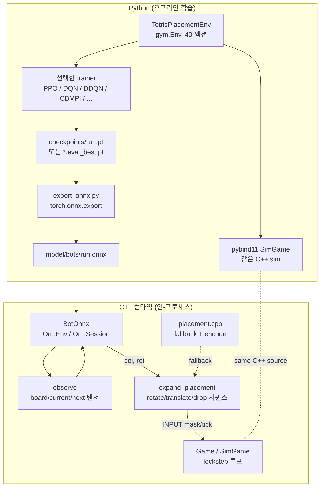
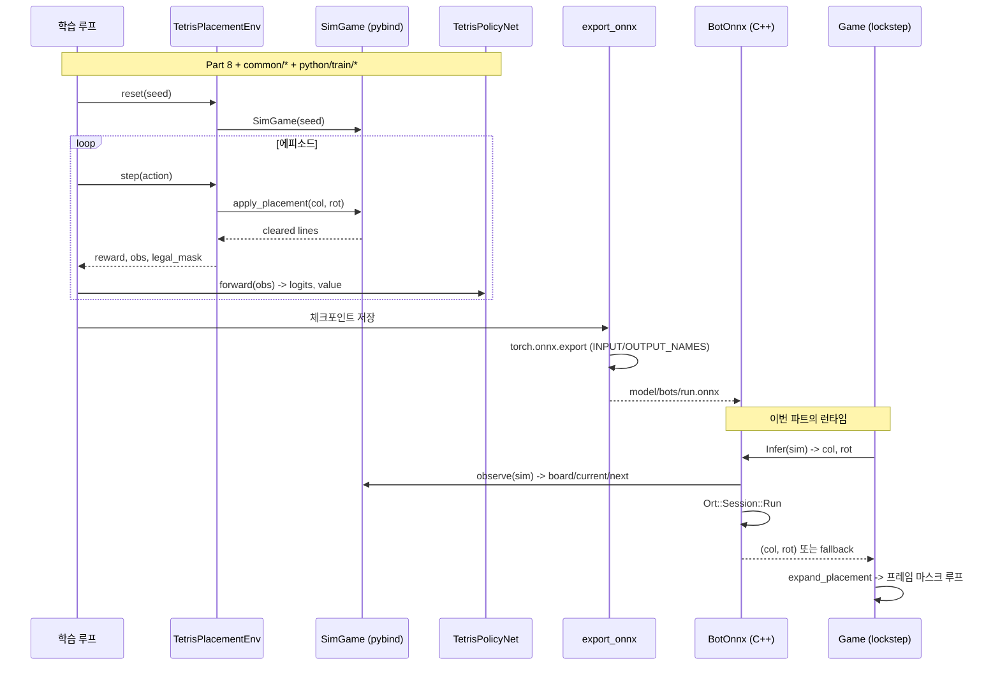
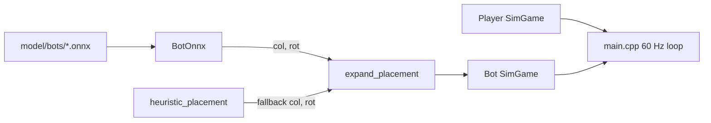

# Part 9: 강화학습과 ONNX 인-프로세스 봇

> **시리즈:** 제로부터 멀티플레이어 테트리스 + RL까지
> [시리즈 목차](./README.md) · [이전: Part 8 — Python RL](./part8-python-rl.md) · **Part 9** · [다음: Part 10 — 메타와 랭킹](./part10-meta-and-ranking.md)

---

## 이 장의 구현 계약

- **선행 상태:** Part 8의 관측·40-action·체크포인트 계약.
- **이번 장의 파일:** `python/netbot/export_onnx.py`, `bot/placement.*`,
  `bot/bot_onnx.*`, `model/bots/`.
- **연결점:** 학습 정책을 ONNX로 내보내고 C++에서 같은 관측을 만들어 placement를
  추론한 뒤, 인간 입력과 같은 `SubmitInput` 경로로 실행한다.
- **완료 게이트:** 모델이 없어도 휴리스틱 봇이 동작하고, ORT 빌드에서는 export한
  모델의 입출력 shape 검증과 Single vs Bot 실행이 성공해야 한다.

## 들어가며

Part 8 에서 Python 쪽에 pybind11 바인딩과 Gym 환경을 깔았다. 그 바인딩 위에 학습 루프를 올려 정책망을 훈련하고, 그 결과 체크포인트를 실제 C++ 클라이언트가 **인-프로세스로** 실행하는 것이 이번 파트의 목표다.

순수한 휴리스틱 봇은 Part 8 에서 이미 한 번 붙였다. Bertsekas-Tsitsiklis 계열의 BCTS 피처 — 구멍 수, 높이 분산, 잘 쌓인 전이 수 — 를 선형 결합한 평가 함수로, 설정 없이도 제법 오래 버틴다. 그러나 두 가지 한계가 명확하다.

1. **피처 엔지니어링의 상한.** BCTS 는 "좋은 보드" 를 사람이 정의한 함수다. T-spin, 다단 콤보, 백-투-백 테트리스 같은 공격 최적화는 피처로 표현되지 않아서 봇이 절대 그런 수를 찾지 않는다. Part 1의 가비지·공격량이 점수 이상으로 중요해지면 휴리스틱의 천장이 보인다.
2. **학습 가능성.** "다음 달에 보상 함수를 바꿔서 다시 훈련" 은 휴리스틱으로는 불가능하다. RL 은 그 반복 루프 자체를 프로젝트의 1급 시민으로 만든다.

봇 실행 경로는 C++ 게임 내부의 인프로세스 추론으로 둔다. 이유는 명확하다.

- **왕복 비용.** 로컬 봇 대전에 소켓과 별도 프로세스를 둘 이유가 없다.
- **배포.** 최종 사용자 머신에 Python + PyTorch 스택을 깔게 하고 싶지 않다. 배포 런타임은 ONNX Runtime CPU bundle 과 `.onnx` 파일이면 충분하다.
- **지연.** placement 정책은 매 프레임 호출되지 않는다. 블록 하나당 한 번만 추론하면 되므로, 대상 머신에서 충분히 빠른지 로드/추론 smoke 로 확인하면 된다.

그래서 이번 파트는 두 축으로 간다. (1) Python에서 학습한
`TetrisPolicyNet`을 ONNX로 내보내는 길, (2) C++에서 그 `.onnx`를 읽어
placement를 뽑고 프레임 마스크 시퀀스로 펼쳐 `SimGame`에 넣는 길이다. 모델
로드 실패와 모델이 없는 환경을 위한 결정론적 휴리스틱 fallback도 함께 둔다.

## 전체 파이프라인

학습부터 게임 루프 진입까지 한 장에 모으면 이렇다.



핵심은 `SimGame` 이 **양쪽에서 동일한 C++ 소스** 를 공유한다는 점이다. Python 이 pybind11 을 통해 실행하는 sim 과 C++ 런타임이 실행하는 sim 은 결정론적으로 같은 상태 해시를 만든다 (Part 1 의 FNV-1a StateHash 계약). 그래서 학습 쪽에서 본 보드 레이아웃과 실행 쪽에서 본 레이아웃은 비트 단위로 일치한다. 이 계약이 무너지면 훈련된 정책이 실전에서 엉뚱한 placement 를 뽑는다 — 관측 분포가 바뀌는 "sim-to-real" 격차가 0 이어야 한다.

데이터 흐름을 다시 한 번 정리하면:



두 다이어그램의 공통된 축은 **동일한 관측 규약·동일한 액션 인코딩**이다.
Python의 `common/obs.py::build_observation`과 C++의 `bot/placement.cpp::observe`가
같은 텐서 schema를 구현하고, 양쪽 action 인코딩이 같은 40-action 수식을 쓴다.
현재 관측 tensor를 Python/C++에서 직접 대조하는 자동 테스트는 없으므로 schema를
바꿀 때 두 구현과 ONNX smoke를 함께 갱신해야 한다.

## 관측 · 행동 · 보상

### 관측

`TetrisPolicyNet` 의 입력은 세 개의 텐서다 (배치 차원 B 는 학습 때만 의미 있음, 런타임은 B=1 고정).

| 이름 | 모양 | dtype | 내용 |
|------|------|-------|------|
| `board` | `(B, 1, 20, 10)` | float32 | 잠긴(locked) 셀 점유 여부, 0 또는 1 |
| `current` | `(B, 7)` | float32 | 현재 피스 id 의 one-hot |
| `next` | `(B, 7)` | float32 | preview 큐 첫 번째 다음 피스 id 의 one-hot |

`board` 에서 **떨어지는 피스와 고스트는 제외**한다. 정책이 추론할 대상은 "커밋된 보드 상태 + 이번에 내려줄 피스" 이지 화면에 보이는 시각 요소가 아니다. 고스트 블록의 cell id 값은 8 이라 `(v > 0) && (v != 8)` 로 방어적으로 걸러낸다. `common/obs.py`:

```python
def build_observation(sim: "SimGame") -> dict[str, torch.Tensor]:
    raw = np.asarray(sim.grid(), dtype=np.float32)  # (20, 10)
    occupied = ((raw > 0) & (raw != 8)).astype(np.float32)
    board = occupied[None, :, :]  # (1, 20, 10)

    current = _piece_one_hot(sim.current_block_id())
    nxt = _piece_one_hot(sim.next_block_id())

    return {
        "board": torch.from_numpy(board),
        "current": torch.from_numpy(current),
        "next": torch.from_numpy(nxt),
    }
```

C++ 쪽 `observe` 도 비트 단위로 같은 결과를 만든다 (`bot/placement.cpp`):

```cpp
void observe(const SimGame& sim,
             float* board_out,
             float* current_out,
             float* next_out)
{
    // board: (20 * 10) row-major, 0 또는 1.
    // python/common/obs.py 와 동일: (grid > 0) & (grid != 8).
    const auto& grid = sim.Grid();
    for (int r = 0; r < kBoardRows; ++r) {
        for (int c = 0; c < kBoardCols; ++c) {
            int v = grid[r][c];
            board_out[r * kBoardCols + c] = (v > 0 && v != 8) ? 1.0f : 0.0f;
        }
    }

    // current / next one-hot — id 는 1..7 범위, 그 외(0 등) 는 모두 0.
    for (int i = 0; i < kNumPieceTypes; ++i) {
        current_out[i] = 0.0f;
        next_out[i]    = 0.0f;
    }
    int cid = sim.CurrentBlockId();
    int nid = sim.NextBlockId();
    if (cid >= 1 && cid <= kNumPieceTypes) current_out[cid - 1] = 1.0f;
    if (nid >= 1 && nid <= kNumPieceTypes) next_out[nid - 1]    = 1.0f;
}
```

두 구현은 서로 다른 언어지만 **같은 조건식** (`v > 0 && v != 8`) 을 쓴다. 이 한 줄이 학습-실행 격차의 최후 방어선이다.

### 행동 공간

placement-level 이다. 한 피스당 가능한 놓임새를 `(col, rot)` 쌍으로 본다. `col ∈ [0, 10)`, `rot ∈ [0, 4)`, 총 40 개. 로테이션 수가 피스 종류에 따라 1/2/4 로 달라지지만 공간은 항상 40 으로 고정하고, 합법 마스크로 유효 동작만 통과시킨다 (`common/action_mask.py`):

```python
def encode_action(col: int, rot: int) -> int:
    """Map a (col, rot) placement to a flat action index in [0, 40)."""
    return col * NUM_ROTATIONS + rot


def decode_action(action: int) -> tuple[int, int]:
    """Inverse of encode_action."""
    return action // NUM_ROTATIONS, action % NUM_ROTATIONS


def legal_mask(sim: "SimGame") -> torch.Tensor:
    mask = torch.zeros(NUM_PLACEMENTS, dtype=torch.bool)
    for placement in sim.legal_placements():
        mask[encode_action(placement.col, placement.rot)] = True
    return mask
```

왜 placement-level 인가? 프레임-level (매 틱 좌/우/회전/드롭 비트 5개) 는 액션 공간이 훨씬 단순하지만, 에피소드 길이가 수십 배 길어져서 크레딧 할당과 replay 학습이 모두 어려워진다. 블록 하나를 놓기까지 20~30 틱이 걸리고, 그 중 실제 의사결정은 "어디에 어떤 회전으로 놓을지" 하나다. placement-level 은 그 의사결정을 **한 스텝으로 묶어서** 학습에 집어넣는다. 한 피스 = 한 `env.step()`. 프레임 시퀀스는 나중에 `expand_placement` 가 기계적으로 펼친다.

단점은 공격 최적화(소프트드롭 타이밍, 회전 트릭) 를 잃는 것. 그래도 BCTS 이상은 충분히 표현된다.

### 보상

최소한으로 뽑았다: **라인 클리어 수**. `TetrisPlacementEnv.step`:

```python
def step(self, action: int):
    col, rot = decode_action(int(action))
    cleared = self.sim.apply_placement(col, rot)

    if cleared < 0:
        reward = 0.0
        terminated = self.sim.game_over()
    else:
        reward = float(cleared)
        terminated = self.sim.game_over()

    truncated = False
    return self._observation(), reward, terminated, truncated, self._info()
```

`apply_placement` 가 -1 을 돌려주면 불법 placement 다. 환경은 sim 을 진행시키지 않고 0 보상을 돌려주지만, 정상적인 정책은 마스크 덕분에 거기에 도달하지 않는다. 방어적 코드일 뿐.

보상을 단순하게 둔 이유는 **피처 엔지니어링을 보상 엔지니어링으로 옮기는 함정** 을 피하기 위함이다. "구멍 하나당 -0.5, 높이 편차 -0.1" 같은 dense reward 를 만들면 결국 BCTS 를 reward 공간에서 다시 짜고 있는 꼴. 정책이 스스로 장기 보상 (쌓기를 잘해야 나중에 4줄을 한 번에 터뜨린다) 을 찾도록 둔다. 그 대신 `value_head` 가 상태가치를 학습해 크레딧 할당을 맡는다.

게임오버 페널티를 추가하고 싶으면 `if self.sim.game_over(): reward -= 5.0` 한 줄이면 되지만, 현 구성에서는 "오래 살아서 누적 점수가 많다 = 이득" 이라는 구조로 충분하다.

## pybind11 바인딩

학습 전체가 이 한 파일에 의존한다 (`bindings/tetris_py.cpp`):

```cpp
// [NET/RL] pybind11 bindings for SimGame.
//
// Exposes the headless Tetris simulation to Python so that the same C++
// source of truth drives both:
//   - Colab training loops (placement-level API)
//   - parity/equivalence tests (frame-level API)
//
// Build with -DTETRIS_BUILD_PY=ON. raylib is NOT required — this module only
// links against the pure sim sources.
//
// Python-side usage:
//   from sim import SimGame
//   g = SimGame(seed=42)
//   for p in g.legal_placements():
//       print(p.col, p.rot)
//   g.apply_placement(4, 0)
//   arr = g.grid()                # numpy (20, 10) int32 view
//   h   = g.state_hash()          # bitwise-equal to C++ SimGame::StateHash()

#include <pybind11/pybind11.h>
#include <pybind11/stl.h>
#include <pybind11/numpy.h>

#include "../src/sim_game.h"
#include "../src/sim_grid.h"
#include "../src/sim_block.h"

namespace py = pybind11;

PYBIND11_MODULE(tetris_py, m)
{
    m.doc() = "Headless Tetris simulation (pybind11 wrapper around SimGame)";

    // ---- Placement struct ------------------------------------------------
    py::class_<SimGame::Placement>(m, "Placement")
        .def_readonly("col", &SimGame::Placement::col)
        .def_readonly("rot", &SimGame::Placement::rot)
        .def("__repr__", [](const SimGame::Placement& p) {
            return "Placement(col=" + std::to_string(p.col) +
                   ", rot=" + std::to_string(p.rot) + ")";
        });

    // ---- SimBlock (read-only observation handle) -------------------------
    py::class_<SimBlock>(m, "SimBlock")
        .def_readonly("id",             &SimBlock::id)
        .def_readonly("rotation_state", &SimBlock::rotationState)
        .def_readonly("row_offset",     &SimBlock::rowOffset)
        .def_readonly("column_offset",  &SimBlock::columnOffset)
        .def("cell_positions", [](const SimBlock& b) {
            // Return list of (row, column) tuples for the current rotation.
            auto tiles = b.GetCellPositions();
            py::list out;
            for (const auto& t : tiles)
            {
                out.append(py::make_tuple(t.row, t.column));
            }
            return out;
        });

    // ---- SimGame ---------------------------------------------------------
    py::class_<SimGame>(m, "SimGame")
        .def(py::init<uint64_t>(), py::arg("seed") = 0,
             "Construct a new headless Tetris sim. seed=0 uses a fixed default "
             "so that unseeded runs are still deterministic across platforms.")

        // Placement-level action API (RL training)
        .def("legal_placements", &SimGame::LegalPlacements,
             "Enumerate all legal (col, rot) placements for the current piece "
             "via rotate-then-translate-then-hard-drop. Returns a list of "
             "Placement objects.")
        .def("apply_placement", &SimGame::ApplyPlacement,
             py::arg("col"), py::arg("rot"),
             "Apply a placement atomically (rotate -> translate -> hard drop -> "
             "lock). Returns the number of lines cleared, or -1 if the placement "
             "is illegal.")
        .def("clone", [](const SimGame& g) {
            return SimGame(g);
        }, "Return a deep copy of the full deterministic sim state.")

        // Frame-level action API (lockstep net play)
        .def("submit_input", &SimGame::SubmitInput, py::arg("input_mask"),
             "Apply a one-tick input bitmask (see core/input.h). Used by the "
             "frame-level parity tests to feed actions into the lockstep loop.")
        .def("tick", &SimGame::Tick,
             "Advance the gravity counter by one tick. Time-only progression "
             "separate from input.")
        .def("move_block_down", &SimGame::MoveBlockDown,
             "Single-step the current piece down by one row (locks on contact).")

        // Observation accessors
        .def("grid", [](const SimGame& g) {
            // Expose the 20x10 int grid as a numpy array. We COPY the buffer
            // so Python can keep the array alive past the next mutation —
            // a 200-int copy per call is negligible for training throughput.
            const auto& raw = g.Grid();
            auto arr = py::array_t<int32_t>({SimGrid::kRows, SimGrid::kCols});
            auto buf = arr.mutable_unchecked<2>();
            for (int r = 0; r < SimGrid::kRows; ++r)
                for (int c = 0; c < SimGrid::kCols; ++c)
                    buf(r, c) = raw[r][c];
            return arr;
        }, "Return the 20x10 grid as a numpy int32 array (copied).")

        .def("current_block",
             &SimGame::CurrentBlock,
             py::return_value_policy::reference_internal,
             "Current falling piece.")
        .def("ghost_block",
             &SimGame::GhostBlock,
             py::return_value_policy::reference_internal,
             "Ghost/preview piece at the hard-drop target.")
        .def("next_block",
             [](const SimGame& g) { return g.NextBlock(); },
             "Copy of the first piece in the preview queue.")
        .def("next_block_ids", [](const SimGame& g) {
            std::vector<int> ids;
            const auto& next = g.NextBlocks();
            ids.reserve(next.size());
            for (const SimBlock& block : next) ids.push_back(block.id);
            return ids;
        }, "Piece ids in the visible next preview queue.")

        .def("current_block_id", &SimGame::CurrentBlockId)
        .def("current_rotation", &SimGame::CurrentRotation)
        .def("current_row",      &SimGame::CurrentRow)
        .def("current_col",      &SimGame::CurrentCol)
        .def("next_block_id",    &SimGame::NextBlockId)
        .def("score",            &SimGame::Score)
        .def("game_over",        &SimGame::IsGameOver)

        // Determinism / debugging
        .def("state_hash", &SimGame::StateHash,
             "FNV-1a 64-bit hash of the full sim state. Bitwise-identical to "
             "Game::ComputeStateHash() — this is the gate the determinism "
             "regression test checks.")
        .def("rng_state", &SimGame::RngState,
             "Raw XorShift64* RNG state (for debugging cross-platform drift).")

        // Grid shape constants (useful for observation code on the Python side)
        .def_property_readonly_static("ROWS", [](py::object) { return SimGrid::kRows; })
        .def_property_readonly_static("COLS", [](py::object) { return SimGrid::kCols; });
}
```

바인딩 설계 원칙 몇 가지.

**두 API를 동시에 제공한다.** `apply_placement`는 학습용(한 번의 호출이
rotate → translate → hard-drop → lock까지 원자적으로 실행)이고,
`submit_input`과 `tick`은 C++ lockstep 경로와 프레임 단위 동등성을 검증하는
API다. 인게임 봇은 `SimGame`에 같은 프레임 입력을 넣는다.

**`grid()` 는 항상 복사한다.** 200 개 int 복사는 훈련 throughput 에 거의 영향이 없고, "Python 이 numpy 배열을 쥐고 있는데 SimGame 이 그 아래에서 mutate 해서 다음 프레임에 다른 값이 보인다" 는 미묘한 버그를 완전히 봉쇄한다. `return_value_policy::reference_internal` 은 `current_block`/`ghost_block` 처럼 멤버 수명이 안정적인 조회에만 쓴다. `next_block` 은 preview 큐 원소라 큐 갱신 때 참조가 무효화될 수 있어 복사로 반환한다.

**`state_hash()` 를 노출한다.** Part 1 의 FNV-1a 해시를 Python 에서 바로 찍어볼 수 있다. `test_determinism_crossplatform.py` 같은 테스트가 여기를 통해 Python 런과 C++ 런의 상태가 틱 단위로 일치하는지 검증한다.

**`clone()` 은 전체 deterministic state 의 값 복사다.** CBMPI-style policy improvement 는 현재 상태에서 합법 placement 를 하나씩 가정 적용해 후속 보드를 평가한다. 원본 `SimGame` 을 건드리면 rollout 이 망가지므로, `clone()` 으로 branch 를 만든 뒤 `apply_placement()` 를 호출한다. Colab 에서 `AttributeError: 'tetris_py.SimGame' object has no attribute 'clone'` 가 나오면 최신 소스를 pull 한 뒤 `build/` 와 `python/sim/tetris_py*.so` 를 지우고 네이티브 모듈을 다시 빌드해야 한다.

**`seed=0` 이 deterministic default.** Gym env 가 `TetrisPlacementEnv(seed=0)` 으로 초기화해도 플랫폼 간 동일한 피스 시퀀스를 받는다.

이 바인딩이 완성되면, Python 에서 이렇게 쓸 수 있다.

```python
from sim import SimGame

g = SimGame(seed=42)
print(g.legal_placements())        # [Placement(col=3, rot=0), ...]
g.apply_placement(4, 2)            # 내려놓고 라인 카운트 반환
print(g.current_block_id())        # 1..7
print(g.grid().shape)              # (20, 10)
print(hex(g.state_hash()))         # 0x...
```

이 호출들이 학습 루프에서 매 스텝 돌아가게 되고, 그 결과가 `TetrisPolicyNet` 으로 흘러들어가 policy/value 를 업데이트한다.

## 정책 네트워크

참고로 `common/models.py` 의 `TetrisPolicyNet`. 학습 파이프라인의 심장이지만 이번 파트의 주제는 아니므로 구조만.

```python
class TetrisPolicyNet(nn.Module):
    """Shared trunk + policy/value heads.

    Input contract (matches common.obs.build_observation)::

        board   : (B, 1, 20, 10) float32, occupancy in {0.0, 1.0}
        current : (B, 7) float32, one-hot of current piece id - 1
        next    : (B, 7) float32, one-hot of next piece id - 1

    Output::

        policy_logits : (B, 40) float32 — over (col * 4 + rot) placements
        value         : (B,)    float32 — scalar state value
    """

    ARCH_VERSION = 1

    def __init__(
        self,
        board_channels: int = 1,
        conv_channels: tuple[int, ...] = (32, 64, 64),
        hidden: int = 256,
        n_placements: int = NUM_PLACEMENTS,
        n_piece_types: int = NUM_PIECE_TYPES,
    ) -> None:
        super().__init__()
        self.board_channels = board_channels
        self.conv_channels = conv_channels
        self.hidden = hidden
        self.n_placements = n_placements
        self.n_piece_types = n_piece_types

        # ---- Convolutional trunk over the 20x10 board --------------------
        layers: list[nn.Module] = []
        in_ch = board_channels
        for out_ch in conv_channels:
            layers.append(nn.Conv2d(in_ch, out_ch, kernel_size=3, padding=1))
            layers.append(nn.ReLU(inplace=True))
            in_ch = out_ch
        self.trunk = nn.Sequential(*layers)

        flat = conv_channels[-1] * BOARD_ROWS * BOARD_COLS

        # ---- Fuse board features with current+next piece one-hots --------
        self.fuse = nn.Sequential(
            nn.Linear(flat + 2 * n_piece_types, hidden),
            nn.ReLU(inplace=True),
            nn.Linear(hidden, hidden),
            nn.ReLU(inplace=True),
        )

        self.policy_head = nn.Linear(hidden, n_placements)
        self.value_head = nn.Linear(hidden, 1)

    def forward(
        self,
        board: torch.Tensor,
        current: torch.Tensor,
        next: torch.Tensor,  # noqa: A002 - matches obs key name
    ) -> tuple[torch.Tensor, torch.Tensor]:
        if board.dim() == 3:
            board = board.unsqueeze(1)  # (B, 20, 10) -> (B, 1, 20, 10)
        h = self.trunk(board)
        h = h.flatten(1)
        h = torch.cat([h, current, next], dim=-1)
        h = self.fuse(h)
        policy_logits = self.policy_head(h)
        value = self.value_head(h).squeeze(-1)
        return policy_logits, value
```

구조 자체는 아주 평범하다. `(20, 10)` 보드를 3-레이어 conv (32→64→64) 로 지나가고 flatten, 거기에 `current`/`next` one-hot 을 concat 해서 2-레이어 MLP 로 올린 뒤 policy(40) 와 value(1) 두 헤드. conv 는 "옆 열이 얼마나 높은지" 같은 지역 패턴을 잡고 MLP 는 전체 보드 요약을 만든다. T-spin 같은 패턴은 학습 이후에 conv 필터 안에 녹아든다.

주목할 것은 `ARCH_VERSION = 1`. `common/checkpoint.py` 의 `load_checkpoint` 가 이 값을 검증해서, 구조가 바뀌면 체크포인트 로드를 **하드 실패** 시킨다. "1 번 레이어가 2 번 레이어가 됐는데 shape 이 우연히 같아서 조용히 로드되고 정책이 이상해졌다" 같은 무음 버그의 길을 막아놓은 것.

`masked_log_softmax` 도 같은 파일에 있다 (학습 시 log π(a|s) 계산에 쓴다).

```python
def masked_log_softmax(
    logits: torch.Tensor, mask: torch.Tensor, eps: float = 1e-9
) -> torch.Tensor:
    """Apply a boolean legal-action mask to logits then log-softmax.

    Setting illegal logits to -inf makes their softmax probability zero,
    so sampling and argmax only ever pick legal placements.
    """
    masked = logits.masked_fill(~mask, float("-inf"))
    return F.log_softmax(masked + eps, dim=-1)
```

학습 시의 마스킹은 확률 0, 런타임 C++ 에서의 마스킹은 단순 argmax 에서 제외 — 둘 다 "불법 placement 를 절대 고르지 않는다" 는 동일한 규약.

## ONNX 내보내기

체크포인트(`.pt`)는 PyTorch 포맷이다. 이걸 ONNX 그래프로 변환해야 C++ 런타임이 읽을 수 있다. 저장소 `python/netbot/export_onnx.py` 를 그대로 인용한다 — 드라이런 리뷰어가 "INPUT_NAMES/OUTPUT_NAMES 상수와 `torch.onnx.export` 호출이 연결된 한 맥락에서 보여야 한다" 라고 지적한 자리. 인용 뒤에 load-bearing 상수, `dynamic_axes`, opset 등 개별 설정을 풀어 쓴다.

```python
"""Convert a trained TetrisPolicyNet checkpoint to ONNX for the C++ in-game bot.

The C++ runtime uses onnxruntime (see ``bot/bot_onnx.cpp``) rather than libtorch
or a Python subprocess. Training/export can stay in Colab; deployment only
needs the exported ONNX file and the ONNX Runtime CPU bundle.

Input/output names are load-bearing: ``bot/bot_onnx.cpp`` looks them up by
string. If you rename one here, the C++ side must change in lockstep (and the
existing ``model/*.onnx`` / ``model/bots/*.onnx`` bundles must be re-exported).

Usage::

    uv run --directory python python -m netbot.export_onnx \\
        checkpoints/run42/step_2000000.pt \\
        ../model/bots/run42.onnx
"""

from __future__ import annotations

import argparse
import inspect
from pathlib import Path

try:
    import torch
except ImportError as exc:  # pragma: no cover - depends on optional local env
    raise SystemExit(
        "export_onnx requires PyTorch. Run this in Colab, or install the "
        "optional export dependencies (`uv sync --extra export`)."
    ) from exc

from common import BOARD_COLS, BOARD_ROWS, NUM_PIECE_TYPES
from common.checkpoint import load_checkpoint
from common.models import TetrisPolicyNet


# Must match bot/bot_onnx.cpp's inputNames / outputNames arrays.
INPUT_NAMES = ["board", "current", "next"]
OUTPUT_NAMES = ["policy_logits", "value"]


def export(ckpt_path: str | Path, out_path: str | Path, opset: int = 17) -> None:
    """Load ``ckpt_path`` (a TetrisPolicyNet .pt) and write an ONNX graph to
    ``out_path``.

    Batch size is fixed at 1 — the C++ in-game bot only runs single-step
    inference on one SimGame at a time. If a training-side consumer ever needs
    batched ONNX inference, add ``dynamic_axes={"board": {0: "batch"}, ...}``.
    """
    ckpt_path = Path(ckpt_path)
    out_path = Path(out_path)
    if not ckpt_path.exists():
        raise FileNotFoundError(f"checkpoint not found: {ckpt_path}")
    out_path.parent.mkdir(parents=True, exist_ok=True)

    model = load_checkpoint(ckpt_path, device="cpu")
    model.eval()

    # Dummy inputs matching common.obs.build_observation shapes with a batch dim.
    dummy_board = torch.zeros(1, 1, BOARD_ROWS, BOARD_COLS, dtype=torch.float32)
    dummy_current = torch.zeros(1, NUM_PIECE_TYPES, dtype=torch.float32)
    dummy_next = torch.zeros(1, NUM_PIECE_TYPES, dtype=torch.float32)

    kwargs = {
        "input_names": INPUT_NAMES,
        "output_names": OUTPUT_NAMES,
        "opset_version": opset,
        "dynamic_axes": None,
        "do_constant_folding": True,
    }
    if "dynamo" in inspect.signature(torch.onnx.export).parameters:
        # Keep this simple policy net on the stable legacy exporter path. Newer
        # PyTorch releases default to the dynamo exporter, which additionally
        # needs onnxscript and can fail in Colab runtimes that only have onnx.
        kwargs["dynamo"] = False

    print(f"[export_onnx] torch {torch.__version__}, opset {opset}")
    try:
        torch.onnx.export(
            model,
            (dummy_board, dummy_current, dummy_next),
            str(out_path),
            **kwargs,
        )
    except Exception as exc:
        message = str(exc)
        if (
            "Module onnx is not installed" in message
            or "No module named 'onnx'" in message
            or "No module named 'onnxscript'" in message
        ):
            raise SystemExit(
                "ONNX export dependency is missing. In Colab, run the setup "
                "cell again so `pip install -r python/requirements-colab.txt` "
                "installs onnx/onnxscript, then rerun this export cell."
            ) from exc
        raise
    print(f"[export_onnx] wrote {out_path} from {ckpt_path}")


def main() -> None:
    ap = argparse.ArgumentParser(description=__doc__, formatter_class=argparse.RawDescriptionHelpFormatter)
    ap.add_argument("ckpt", help="path to trained .pt checkpoint (TetrisPolicyNet)")
    ap.add_argument("out",  help="output .onnx path (e.g. ../model/bots/run42.onnx)")
    ap.add_argument("--opset", type=int, default=17, help="ONNX opset (default: 17)")
    args = ap.parse_args()
    export(args.ckpt, args.out, args.opset)


if __name__ == "__main__":
    main()
```

이 파일에서 **load-bearing** 인 상수 두 개.

```python
INPUT_NAMES = ["board", "current", "next"]
OUTPUT_NAMES = ["policy_logits", "value"]
```

ONNX 그래프는 텐서 이름으로 식별된다. `torch.onnx.export` 가 이 이름들을 graph node 에 박아넣고, `onnxruntime` 의 `Session::Run` 호출은 정확히 같은 문자열로 입출력을 끼워 맞춘다. C++ 쪽에 다시 등장한다.

```cpp
// bot/bot_onnx.cpp
std::array<const char*, 3> inputNames  = {"board", "current", "next"};
std::array<const char*, 2> outputNames = {"policy_logits", "value"};
```

Python 에서 `"next"` 를 `"next_piece"` 로 바꿨는데 C++ 을 안 고치면 `Run` 이 "input not found" 로 던진다. 모델은 로드되지만 추론은 불가능한 상태가 된다. 그래서 두 배열은 **커밋 단위로 동기화** 되어야 하며, 변경 시 기존 `model/*.onnx` / `model/bots/*.onnx` 번들은 모두 재-export 가 필요하다.

몇 가지 옵션 선택.

**Batch size = 1 고정.** `dynamic_axes=None` 이라서 export 된 그래프의 첫 축은 상수 1 이다. 런타임이 단일-스텝 추론만 하기 때문에 충분하고, ONNX 최적화가 고정 shape 에서 더 공격적이다 (상수 접힘, 메모리 사전할당). 나중에 학습 측에서 배치 추론이 필요하면 `dynamic_axes={"board": {0: "batch"}, ...}` 로 풀면 된다.

**opset 17.** `export_onnx.py` 의 기본값 (`--opset 17`) 이며 ONNX Runtime 이 폭넓게 지원하는 버전이다. 너무 낮으면 최근 op 가 폴리필로 풀려서 그래프가 비대해지고, 너무 높으면 이전 ORT 릴리스가 못 읽는다.

**`do_constant_folding=True`.** conv 레이어의 bias, fuse 레이어의 weight 상수 등을 export 타임에 미리 폴딩. 런타임 로드 시간과 추론 지연이 소폭 감소.

**`dynamo=False` 명시.** PyTorch 2.x 후반의 새 ONNX exporter 는 `onnxscript` 같은 추가 의존성에 민감하다. 이 프로젝트의 정책망은 단순한 conv/linear 그래프라 legacy exporter 로 충분하므로, `torch.onnx.export` 시그니처에 `dynamo` 인자가 있으면 `False` 로 고정한다. 그래도 Colab 의존성에는 `onnx` 와 `onnxscript` 를 둘 다 넣어, 런타임 조합이 바뀌어도 export 셀이 실패하지 않게 한다.

**`model.eval()`.** dropout/batchnorm 을 추론 모드로 고정. `TetrisPolicyNet` 은 둘 다 쓰지 않지만 미래의 구조 변경에 대한 방어다.

export 가 끝나면 `model/bots/<bot_name>.onnx` 파일이 남는다. C++ 런타임은 `model/*.onnx` 와 `model/bots/*.onnx` 를 스캔해 봇 로스터에 올린다.

## Colab model zoo — smoke 에서 long 으로

로컬 배포 머신이 Mac mini 2011 같은 약한 장비라면, 여기서 PyTorch 학습을 돌리지 않는다. 로컬은 빌드·정적 테스트·ONNX 추론만 맡고, 학습과 `.pt -> .onnx` export 는 Colab 에서 끝낸다. 현재 저장소의 권장 진입점은 `python/train/train_model_zoo_colab.ipynb` 다.

역할을 나누면 다음과 같다.

| 파일 | 용도 |
|------|------|
| `train_model_zoo_colab.ipynb` | setup, smoke, 학습 명령 생성, ONNX export, `model/bots.cfg` 생성까지 한 파일에서 수행한다. |
| `python/train/README_colab.md` | Colab 명령과 export troubleshooting 문서. |

`train_model_zoo_colab.ipynb` 의 핵심 설정은 세 개다.

```python
ALGO = 'ddqn'
RUN_NAME = f'aria_{ALGO}'
TRAIN_PRESET = 'smoke'  # 'smoke' or 'long'
```

`ALGO` 는 `ppo`, `ppo_sparse`, `dqn`, `ddqn`, `cbmpi`, `cbmpi_value`, `reinforce`, `a2c`, `nstep_ac`, `cem`, `muzero` 중 하나다. `smoke` 는 학습 성능을 보려는 값이 아니라 **전체 파이프라인이 깨지지 않았는지** 보는 값이다. smoke 로 다음이 모두 통과해야 long 을 돌린다.

1. `tetris_py` 빌드와 `from sim import SimGame`.
2. `SimGame.clone()` 존재 확인.
3. 선택 알고리즘의 짧은 학습 루프 1회.
4. `.pt` 체크포인트 생성.
5. `netbot.export_onnx` 로 `model/bots/<RUN_NAME>.onnx` 생성.

smoke 가 통과하면 `RUN_NAME` 을 바꿔 long run 을 시작한다. 같은 이름을 쓰면 smoke 체크포인트를 덮어쓴다.

```python
ALGO = 'ddqn'
RUN_NAME = 'aria_ddqn_long'
TRAIN_PRESET = 'long'
```

MuZero-style 만 예외가 있다. native MuZero checkpoint 는 현재 C++ ONNX 봇이 직접 읽지 못하므로, 학습 뒤 distillation 으로 만들어지는 `checkpoints/<RUN_NAME>.policy.pt` 를 export 한다. 나머지 알고리즘은 `*.eval_best.pt` 가 있으면 그 파일을, 없으면 최신 `*.pt` 를 export 한다.

export 실패가 `CalledProcessError` 로만 보이면 wrapper 에러일 뿐이다. 현재 노트북은 subprocess stdout/stderr 를 먼저 출력하므로, 실제 원인을 그 아래에서 본다. 흔한 원인은 `onnx`/`onnxscript` 미설치, 잘못된 작업 디렉터리, 아직 생성되지 않은 `*.eval_best.pt`, stale `python/sim/tetris_py*.so` 다.

## C++ 봇: Ort::Env 부터 Ort::Session 까지

`bot/bot_onnx.cpp` 는 Impl PIMPL 패턴으로 ORT 헤더를 인터페이스에서 숨긴다 (`bot_onnx.h` 는 ORT 심볼을 하나도 포함하지 않아, 다른 번역 단위에서 이 헤더만 include 해도 빌드가 빨라지고, ORT 버전 교체 시 인터페이스가 흔들리지 않는다).

```cpp
// bot/bot_onnx.cpp — ONNX Runtime C++ API 래퍼. 헤더 설명은 bot_onnx.h 참조.
//
// 이 파일은 항상 컴파일된다. TETRIS_BUILD_BOT=ON 이면 CMake 가
// TETRIS_HAS_ONNXRUNTIME 을 정의하고 third_party/onnxruntime/ 헤더/라이브러리를
// 연결한다. OFF 이면 아래의 stub 구현이 빌드되어 Load() 가 실패한다.

#include "bot_onnx.h"

#include "placement.h"
#include "../src/sim_game.h"

#include <array>
#include <cmath>
#include <cstddef>
#include <cstring>
#include <limits>

#if defined(TETRIS_HAS_ONNXRUNTIME)
    #include <onnxruntime_cxx_api.h>
#endif

namespace bot {

#if defined(TETRIS_HAS_ONNXRUNTIME)

struct BotOnnx::Impl {
    Ort::Env     env{ORT_LOGGING_LEVEL_WARNING, "tetris_bot"};
    Ort::SessionOptions sessOpts{};
    std::unique_ptr<Ort::Session> session;
    Ort::MemoryInfo memInfo = Ort::MemoryInfo::CreateCpu(OrtArenaAllocator, OrtMemTypeDefault);

    // 입출력 이름 — Python export_onnx 에서 고정.
    std::array<const char*, 3> inputNames  = {"board", "current", "next"};
    std::array<const char*, 2> outputNames = {"policy_logits", "value"};

    bool LoadModel(const std::string& path, std::string* err_out)
    {
        try {
            sessOpts.SetIntraOpNumThreads(1);
            sessOpts.SetGraphOptimizationLevel(GraphOptimizationLevel::ORT_ENABLE_ALL);
        #if defined(_WIN32)
            const std::wstring wpath =
                std::filesystem::u8path(path).wstring();
            session = std::make_unique<Ort::Session>(env, wpath.c_str(), sessOpts);
        #else
            session = std::make_unique<Ort::Session>(env, path.c_str(), sessOpts);
        #endif
        } catch (const Ort::Exception& e) {
            if (err_out) *err_out = std::string("Ort::Exception: ") + e.what();
            session.reset();
            return false;
        } catch (const std::exception& e) {
            if (err_out) *err_out = std::string("std::exception: ") + e.what();
            session.reset();
            return false;
        }
        return true;
    }

    // ... InferOnce (아래)
};
```

`Ort::Env` 는 전체 프로세스에 한 개만 있어도 되는 로거/스레드풀 핸들이다. 보통 전역에 두지만 여기서는 `Impl` 수명에 묶어서 여러 `BotOnnx` 인스턴스가 각자 독립된 환경을 가질 수 있게 했다. 문제가 생겨도 다른 인스턴스는 영향을 받지 않는다.

`SessionOptions` 의 두 설정.

- `SetIntraOpNumThreads(1)`: ORT 가 큰 matmul 을 내부적으로 병렬화하지 않는다. 게임 틱 루프는 이미 메인 스레드에서 돌고, 추론은 블록당 한 번뿐이라 병렬화로 얻는 이득보다 스레드 관리 비용이 커질 수 있다. 대상 머신에서 단일 스레드 추론 smoke 로 확인한다.
- `SetGraphOptimizationLevel(ORT_ENABLE_ALL)`: layer fusion, constant folding, operator elimination 등 모든 최적화 활성화. 첫 로드가 수십 ms 늘지만 이후 매 추론이 빨라진다.

`MemoryInfo::CreateCpu(OrtArenaAllocator, OrtMemTypeDefault)` 는 "CPU 상의 arena 할당자를 써달라" 는 힌트. ORT 는 추론 중 중간 텐서를 arena 에서 할당해서 매번 malloc 하지 않는다.

**Windows 경로 와이드 변환.** `std::string path`를 그대로 `Ort::Session`에
넘길 수 없다. Windows 생성자는 `wchar_t*`를 받는다. 이 프로젝트에서 모델
경로 문자열의 계약은 UTF-8이며, `src/main.cpp::normalize_model_key`도
`generic_u8string()`을 반환한다. 따라서 바이트를 단순 widening하지 않고
`std::filesystem::u8path(path).wstring()`으로 변환한다. 한글 사용자 폴더처럼
비ASCII 경로도 현재 C locale과 무관하게 보존된다.

**예외 → 불리언.** ORT C++ API 는 실패 시 `Ort::Exception` 을 던진다. 게임 루프가 try/catch 를 쓰고 싶지 않으므로 여기서 잡아서 bool + 메시지로 변환. 현재 `src/main.cpp` 는 봇 선택 시 선택한 ONNX 모델을 로드하고, 실패하면 선택 화면에 오류를 표시한다. ONNX 모델이 없어도 내장 휴리스틱 봇은 항상 선택할 수 있다. fallback 휴리스틱은 로드된 세션의 개별 추론이 실패했을 때의 안전망이다.

### 추론 호출

저장소 `bot/bot_onnx.cpp` 의 `InferOnce` 구현을 발췌한다. 이 함수 안에 세 덩어리 — **(a) `Ort::Value::CreateTensor<float>` 로 입력 텐서 3 개 구성** (board / current / next), **(b) `session->Run` 호출** (입출력 이름 배열을 그대로 넘김), **(c) logits 배열에서 masked argmax** — 가 모두 들어있다. 인용 뒤 7 단계로 분해한다.

```cpp
bool InferOnce(const SimGame& sim, int& col_out, int& rot_out)
{
    if (!session) return false;

    float board[kBoardRows * kBoardCols];   // flatten (1, 1, 20, 10)
    float current[kNumPieceTypes];          // (1, 7)
    float nxt[kNumPieceTypes];              // (1, 7)
    observe(sim, board, current, nxt);

    std::array<int64_t, 4> boardShape = {1, 1, kBoardRows, kBoardCols};
    std::array<int64_t, 2> pieceShape = {1, kNumPieceTypes};

    Ort::Value boardT = Ort::Value::CreateTensor<float>(
        memInfo, board, sizeof(board) / sizeof(float),
        boardShape.data(), boardShape.size());
    Ort::Value curT = Ort::Value::CreateTensor<float>(
        memInfo, current, kNumPieceTypes,
        pieceShape.data(), pieceShape.size());
    Ort::Value nxtT = Ort::Value::CreateTensor<float>(
        memInfo, nxt, kNumPieceTypes,
        pieceShape.data(), pieceShape.size());

    Ort::Value inputs[3] = {std::move(boardT), std::move(curT), std::move(nxtT)};

    std::vector<Ort::Value> outs;
    try {
        outs = session->Run(
            Ort::RunOptions{nullptr},
            inputNames.data(), inputs, 3,
            outputNames.data(), outputNames.size());
    } catch (const Ort::Exception&) {
        return false;
    }
    if (outs.empty()) return false;

    const float* logits = nullptr;
    try {
        if (!outs[0].IsTensor()) return false;
        const auto info = outs[0].GetTensorTypeAndShapeInfo();
        if (info.GetElementType() != ONNX_TENSOR_ELEMENT_DATA_TYPE_FLOAT ||
            info.GetElementCount() < static_cast<size_t>(kNumPlacements)) {
            return false;
        }
        logits = outs[0].GetTensorData<float>();
    } catch (const Ort::Exception&) {
        return false;
    }
    // kNumPlacements = 40 고정.

    // 합법 마스크: LegalPlacements 를 돌려 (col, rot) 집합을 bitset 으로.
    auto placements = sim.LegalPlacements();
    if (placements.empty()) return false;

    bool legal[kNumPlacements] = {false};
    for (const auto& p : placements) {
        int a = encode_action(p.col, p.rot);
        if (a >= 0 && a < kNumPlacements) legal[a] = true;
    }

    // masked argmax
    int   bestIdx = -1;
    float bestVal = -std::numeric_limits<float>::infinity();
    for (int i = 0; i < kNumPlacements; ++i) {
        if (!legal[i]) continue;
        if (logits[i] > bestVal) {
            bestVal = logits[i];
            bestIdx = i;
        }
    }
    if (bestIdx < 0) {
        // 모든 합법 logits 가 -inf 였다는 뜻 — 정상 케이스는 아님.
        // fallback 으로 사전순 최소 합법 수를 선택.
        return fallback_placement(sim, col_out, rot_out);
    }
    decode_action(bestIdx, col_out, rot_out);
    return true;
}
```

흐름을 단계별로 보자.

**1. 스택 버퍼에 관측 만들기.** `board[200]`, `current[7]`, `nxt[7]` — 모두 스택. 추론당 1KB 미만이라 heap 을 쓸 이유가 없고, 매 호출에 할당/해제 비용도 없다. `observe(sim, ...)` 가 세 버퍼를 채운다.

**2. `Ort::Value` 로 래핑.** `CreateTensor<float>` 는 **소유권을 가져가지 않는다** — 포인터와 shape 만 참조한다. `board` 가 스택에 있으므로 `Run` 이 반환할 때까지 이 함수 스코프가 살아있어야 한다. 여기서는 같은 함수 안에서 `Run` 을 동기적으로 부르니 문제없다.

shape 배열을 `std::array<int64_t, N>` 으로 만드는 이유는 ORT 가 `int64_t*` 을 요구하기 때문. `{1, 1, 20, 10}` 이 `board` 의 (batch, channels, rows, cols), `{1, 7}` 이 piece one-hot 의 (batch, classes).

**3. `session->Run`과 출력 계약 검증.** 인자 6개를 순서대로 넘기면 ORT가
`std::vector<Ort::Value>`로 출력을 돌려준다. `outs[0]`이
`policy_logits`, `outs[1]`이 `value`다. 실행 성공만으로 모델 계약이 맞다는 뜻은
아니다. 첫 출력이 tensor인지, 원소형이 `float`인지, 원소 수가 최소
`kNumPlacements(40)`인지 확인한 뒤에만 `GetTensorData<float>()`를 호출한다.
shape/type 조회도 malformed model에서 `Ort::Exception`을 던질 수 있으므로 같은
예외 경계 안에 둔다. 검증 실패는 모두 `false`가 되어 호출자의 fallback으로
이어지고, 40개 argmax가 출력 범위 밖을 읽지 않는다.

**4. 합법 마스크 재계산.** Python 학습 쪽이 `legal_mask` 로 불법 logit 을 -∞ 로 바꿨던 것처럼, 여기서도 `sim.LegalPlacements()` 를 돌려 bitset 을 만든다. placement 의 `(col, rot)` 을 `encode_action` 으로 40-공간 인덱스로 변환.

이 함수가 `bot/placement.h` 에 선언되어 있는데, Python 의 `encode_action` 과 수식이 같다: `col * 4 + rot`. 이 대칭성이 없으면 같은 placement 가 두 공간에서 다른 인덱스를 받고, 정책이 완전히 엉뚱한 수를 둔다.

**5. Masked argmax.** 학습 시에는 확률 샘플링 (exploration), 배포 시에는 argmax (exploitation). 40 개를 선형 스캔하면서 합법이고 가장 큰 logit 을 찾는다. 고정 40칸 스캔이라 알고리즘 비용은 작지만, 이 문서에서는 실측하지 않은 추론 시간을 숫자로 박지 않는다. 실제 체감은 ONNX Runtime 세션 실행 비용과 대상 CPU에 좌우된다.

**6. fallback 가드.** `bestIdx < 0` 은 모든 합법 logit 이 -∞ 였다는 뜻 — 정상적으로는 발생하지 않지만 (모델이 망가진 경우나 shape 불일치로 NaN 이 퍼진 경우), 여기서 터지면 봇이 멈춘다. 대신 `fallback_placement` 로 위임해 사전순 최소 합법 수를 선택한다. 약하지만 살아 있다.

**7. decode.** `bestIdx` → `(col, rot)`. 호출자에게 돌려주면 이후는 `expand_placement` 의 몫이다.

### PIMPL 바깥 인터페이스

```cpp
BotOnnx::BotOnnx() : impl_(std::make_unique<Impl>()) {}
BotOnnx::~BotOnnx() = default;

bool BotOnnx::Load(const std::string& onnx_path, std::string* err_out)
{
    if (!impl_) impl_ = std::make_unique<Impl>();
    return impl_->LoadModel(onnx_path, err_out);
}

bool BotOnnx::Infer(const SimGame& sim, int& col_out, int& rot_out)
{
    if (!impl_ || !impl_->session) return false;
    return impl_->InferOnce(sim, col_out, rot_out);
}

bool BotOnnx::IsLoaded() const
{
    return impl_ && impl_->session != nullptr;
}
```

세 개의 공개 함수: `Load`, `Infer`, `IsLoaded`. 호출자 입장에서는 ORT 가 존재하는지, 모델이 로드됐는지, 추론이 성공했는지만 신경 쓰면 된다. ORT 헤더는 이 번역 단위에만 노출.

### ONNX Runtime 이 없는 빌드

`third_party/onnxruntime/` 이 아직 벤더링되지 않았을 수도 있다 (새 머신에서 `fetch_onnxruntime.sh` 를 안 돌렸거나, 플랫폼 지원이 없거나). 이 경우에도 전체 프로젝트가 빌드되어야 한다.

```cpp
#else  // !TETRIS_HAS_ONNXRUNTIME

// ORT 바이너리가 준비되기 전에도 빌드가 돌아가도록 스텁. Load 는 항상 실패.
// Infer 경로는 호출자가 IsLoaded 로 가드하므로 도달하지 않는다.
struct BotOnnx::Impl { bool loaded = false; };

BotOnnx::BotOnnx() : impl_(std::make_unique<Impl>()) {}
BotOnnx::~BotOnnx() = default;

bool BotOnnx::Load(const std::string& onnx_path, std::string* err_out)
{
    (void)onnx_path;
    if (err_out) *err_out = "onnxruntime not vendored — rebuild with TETRIS_HAS_ONNXRUNTIME";
    return false;
}

bool BotOnnx::Infer(const SimGame&, int&, int&) { return false; }
bool BotOnnx::IsLoaded() const { return false; }

#endif  // TETRIS_HAS_ONNXRUNTIME
```

스텁 구현. `Load` 는 설명 메시지와 함께 false, `Infer` 는 항상 false, `IsLoaded` 도 false. 호출자가 `if (!bot.IsLoaded())` 가드로 자동으로 fallback 으로 빠진다. `TETRIS_HAS_ONNXRUNTIME` 매크로는 `CMakeLists.txt` 에서 onnxruntime 라이브러리 탐지 시 정의된다.

이 구성 덕분에, "빌드 시점에 모델이 없음" → "런타임에 모델 로드 실패" → "추론 호출 실패" 세 케이스 모두 **같은 fallback 경로** 를 탄다. 호출 사이트는 단 하나의 분기만 신경 쓰면 된다.

## Fallback 휴리스틱

ONNX 가 준비되지 않은 상황에서도 봇은 돌아가야 한다. `bot/placement.cpp::fallback_placement` 가 최후의 보루.

```cpp
// bot/placement.cpp — placement 선택/입력 전개 C++ 구현. 자세한 설명은 .h 참고.
#include "placement.h"

#include "../src/sim_game.h"
#include "../core/input.h"

#include <algorithm>

namespace bot {

std::vector<uint8_t> expand_placement(int cur_col,
                                      int cur_rot,
                                      int tgt_col,
                                      int tgt_rot)
{
    std::vector<uint8_t> seq;
    seq.reserve(8);

    // 회전은 항상 전진 방향 — SimBlock 이 Rotate 만 공개하고 역회전은 UndoRotate
    // 용 내부 API 라서 1~3 회 로테이트로 통일 (Python 원본과 동일).
    int rot_steps = ((tgt_rot - cur_rot) % kNumRotations + kNumRotations) % kNumRotations;
    for (int i = 0; i < rot_steps; ++i) {
        seq.push_back((uint8_t)INPUT_ROTATE);
    }

    if (tgt_col > cur_col) {
        int steps = tgt_col - cur_col;
        for (int i = 0; i < steps; ++i) seq.push_back((uint8_t)INPUT_RIGHT);
    } else if (tgt_col < cur_col) {
        int steps = cur_col - tgt_col;
        for (int i = 0; i < steps; ++i) seq.push_back((uint8_t)INPUT_LEFT);
    }

    seq.push_back((uint8_t)INPUT_DROP);
    return seq;
}

bool fallback_placement(const SimGame& sim, int& col_out, int& rot_out)
{
    auto placements = sim.LegalPlacements();
    if (placements.empty()) return false;

    // Python fallback_placement: sorted by (col, rot) — 최소값 선택.
    auto best = std::min_element(
        placements.begin(), placements.end(),
        [](const SimGame::Placement& a, const SimGame::Placement& b) {
            if (a.col != b.col) return a.col < b.col;
            return a.rot < b.rot;
        });
    col_out = best->col;
    rot_out = best->rot;
    return true;
}

void observe(const SimGame& sim,
             float* board_out,
             float* current_out,
             float* next_out)
{
    // board: (20 * 10) row-major, 0 또는 1.
    // python/common/obs.py 와 동일: (grid > 0) & (grid != 8).
    const auto& grid = sim.Grid();
    for (int r = 0; r < kBoardRows; ++r) {
        for (int c = 0; c < kBoardCols; ++c) {
            int v = grid[r][c];
            board_out[r * kBoardCols + c] = (v > 0 && v != 8) ? 1.0f : 0.0f;
        }
    }

    // current / next one-hot — id 는 1..7 범위, 그 외(0 등) 는 모두 0.
    for (int i = 0; i < kNumPieceTypes; ++i) {
        current_out[i] = 0.0f;
        next_out[i]    = 0.0f;
    }
    int cid = sim.CurrentBlockId();
    int nid = sim.NextBlockId();
    if (cid >= 1 && cid <= kNumPieceTypes) current_out[cid - 1] = 1.0f;
    if (nid >= 1 && nid <= kNumPieceTypes) next_out[nid - 1]    = 1.0f;
}

}  // namespace bot
```

`fallback_placement` 는 "합법 placement 중 (col, rot) 사전순으로 최소인 것 하나" 를 고른다. 극단적으로 단순한 규칙 — 블록을 거의 항상 왼쪽으로 몰아넣는다. **이것은 휴리스틱 봇이 아니다.** 승률을 노린 전략이 전혀 아니고, ONNX 추론이 실패하거나 합법 logit 이 전부 -inf 인 비정상 상황에서 **봇이 확정적으로(deterministic) 움직이게** 만드는 최후의 안전망일 뿐이다. 이 결정론적 최소선택은 두 가지 성질을 보장한다.

1. **결정론적 fallback.** 같은 `SimGame` 상태에서는 언제나 같은 합법 배치를
   고른다. Python `fallback_placement`도 같은 정책을 미러링하지만, 현재 테스트는
   C++ 함수를 직접 호출하지 않고 입력 전개 진리표만 고정한다.
2. **단순성이 안정성.** 복잡한 휴리스틱은 엣지 케이스에서 터질 수 있다. "첫 번째 합법 수" 는 `LegalPlacements()` 가 비어있는 경우만 실패하고, 그 경우는 이미 게임오버 판정에서 잡힌다.

즉 **ONNX 실패 → 확정된 fallback → 게임 지속**. 봇이 절대 입력 없이 멈춰서 상대가 시간 초과로 이기는 일이 없다.

### 진짜 휴리스틱: `heuristic_placement` + `eval_board`

`bot/placement.cpp`에는 fallback과 **별개로** 실제로 "잘 두는" 1-ply 그리디
휴리스틱이 있다. Part 8의 El-Tetris 선형 평가(높이·줄·구멍·요철)를 C++로
구현했으며, ONNX/모델 없이도 베이스라인 수준으로 플레이한다.

```cpp
// bot/placement.cpp
namespace {
// locked 셀 판정 — 0(빈칸)도 8(ghost)도 아닌 것만 고정 블록으로 친다(observe 와 동일).
inline bool is_locked(int v) { return v > 0 && v != 8; }

// El-Tetris 가중치로 결과 보드를 평가한다. 높을수록 좋음.
//   score = -0.51*총높이 + 0.76*삭제줄 - 0.36*구멍 - 0.18*요철
double eval_board(const int (&grid)[kBoardRows][kBoardCols], int lines_cleared)
{
    int heights[kBoardCols] = {0};
    int holes = 0;
    for (int c = 0; c < kBoardCols; ++c) {
        int top = -1;
        for (int r = 0; r < kBoardRows; ++r)
            if (is_locked(grid[r][c])) { top = r; break; }
        if (top < 0) continue;                 // 빈 컬럼
        heights[c] = kBoardRows - top;
        for (int r = top; r < kBoardRows; ++r)
            if (!is_locked(grid[r][c])) ++holes;
    }
    int agg_height = 0, bumpiness = 0;
    for (int c = 0; c < kBoardCols; ++c) agg_height += heights[c];
    for (int c = 0; c + 1 < kBoardCols; ++c) {
        int d = heights[c] - heights[c + 1];
        bumpiness += (d < 0 ? -d : d);
    }
    return -0.510066 * agg_height + 0.760666 * lines_cleared
           - 0.356630 * holes - 0.184483 * bumpiness;
}
}  // namespace

bool heuristic_placement(const SimGame& sim, int& col_out, int& rot_out)
{
    auto placements = sim.LegalPlacements();
    if (placements.empty()) return false;

    bool   found = false;
    double best  = 0.0;
    for (const auto& p : placements) {
        SimGame trial = sim;                   // 값 복사 — 실제 sim 은 불변
        int cleared = trial.ApplyPlacement(p.col, p.rot);
        if (cleared < 0) continue;             // 비합법(이론상 없음)
        double s = eval_board(trial.Grid(), cleared);
        if (!found || s > best) {
            best = s; col_out = p.col; rot_out = p.rot; found = true;
        }
    }
    return found;
}
```

핵심 차이를 분명히 해 두면:

| 함수 | 하는 일 | 강도 | 용도 |
|------|---------|------|------|
| `fallback_placement` | (col, rot) 사전순 최소 1개 | 무전략 (거의 항상 왼쪽) | ONNX 추론 실패 시 안전망 |
| `heuristic_placement` | 모든 합법 placement 를 복사본에 적용 → `eval_board` 최고점 선택 | El-Tetris 베이스라인 | 모델 없이 "잘 두는" 봇 |

`heuristic_placement` 는 각 합법 placement 를 `SimGame` **값 복사본** 에 적용해 결과 보드를 만들고(`trial = sim`; 실제 sim 은 불변), `eval_board` 로 점수를 매겨 최고점을 고른다. `eval_board` 의 가중치 `-0.510066`(총높이) / `0.760666`(삭제줄) / `-0.356630`(구멍) / `-0.184483`(요철)은 **El-Tetris**(Islam, 2011)에서 보고된 값이다 — 흔히 Dellacherie 가중치로 잘못 인용되지만, Dellacherie(2003)는 이 선형 평가의 *특성 집합* 원류일 뿐 위 수치 자체의 출처는 아니다. 소스 주석도 "El-Tetris 가중치" 로 명시한다.

이 1-ply 그리디가 "휴리스틱 → RL" 비교의 출발점이다. RL 정책이 이 베이스라인을 못 넘으면 학습에 문제가 있는 것이다(Part 8 §8 의 베이스라인 하한과 같은 논리). `heuristic_placement` 도 `BotOnnx::Infer` 와 같은 `(const SimGame&, int& col, int& rot)` 시그니처라, 호출 사이트에서 모델 추론과 자리만 바꿔 끼울 수 있다.

## Input Expander: placement → 프레임 시퀀스

정책은 "col 4, rot 2로 놓자"고 결정하지만 게임 루프는 틱별 `uint8_t` 입력
마스크를 받는다. placement 하나를 회전·이동·드롭 마스크 시퀀스로 **펼쳐야** 한다.

위에 이미 나온 `expand_placement` 가 그 일을 한다. 한 번 더 자세히 보자.

```cpp
std::vector<uint8_t> expand_placement(int cur_col,
                                      int cur_rot,
                                      int tgt_col,
                                      int tgt_rot)
{
    std::vector<uint8_t> seq;
    seq.reserve(8);

    // 회전은 항상 전진 방향 — SimBlock 이 Rotate 만 공개하고 역회전은 UndoRotate
    // 용 내부 API 라서 1~3 회 로테이트로 통일 (Python 원본과 동일).
    int rot_steps = ((tgt_rot - cur_rot) % kNumRotations + kNumRotations) % kNumRotations;
    for (int i = 0; i < rot_steps; ++i) {
        seq.push_back((uint8_t)INPUT_ROTATE);
    }

    if (tgt_col > cur_col) {
        int steps = tgt_col - cur_col;
        for (int i = 0; i < steps; ++i) seq.push_back((uint8_t)INPUT_RIGHT);
    } else if (tgt_col < cur_col) {
        int steps = cur_col - tgt_col;
        for (int i = 0; i < steps; ++i) seq.push_back((uint8_t)INPUT_LEFT);
    }

    seq.push_back((uint8_t)INPUT_DROP);
    return seq;
}
```

순서: **회전 → 수평 이동 → 하드 드롭**. 다른 순서도 가능하지만 이 순서가 안전하다. 회전 상태에 따라 피스의 바운딩 박스가 바뀌어서, 먼저 이동하면 벽에 걸릴 수 있다. 회전부터 해서 최종 모양으로 만든 뒤 이동.

회전 스텝의 양수 모듈로 수식:

```cpp
int rot_steps = ((tgt_rot - cur_rot) % kNumRotations + kNumRotations) % kNumRotations;
```

C++ 의 `%` 는 음수에서 구현 정의 동작일 수 있어서 `+ kNumRotations` 로 한 번 더 감싼다. `cur_rot=3`, `tgt_rot=0` 일 때 `-3 % 4 = -3` 이 나올 수 있는데, `+4 % 4 = 1` 로 정규화 — "0 → 0 으로 가려면 한 번 더 돌려라" 즉 3+1 = 4 mod 4 = 0. 맞다.

왜 "역회전 없이 1~3 회 전진 회전" 인가? `SimBlock` 은 `Rotate()` 만 공개하고 `UndoRotation()` 은 collision 탐색 내부에서만 쓰는 사설 API 다. 역회전을 공용 입력으로 만들면 서버-클라 간 상태 전이가 한 개 더 생긴다. "회전은 항상 CW 전진" 이라는 단일 규약이 구현 단순성과 결정론을 산다. 최악의 경우 3 번 회전해야 하는데, 1 틱당 한 번씩이라 3 틱이면 끝난다.

Python 쪽 `netbot/input_expander.py`도 같은 규칙을 미러링한다. 현재
`test_placement_parity.py`는 Python 구현의 손계산 진리표와 구조적 불변식을
고정하며, C++ 함수를 직접 호출하는 비교 binding은 아직 없다.

### 시퀀스를 게임 루프에 밀어넣기

호출자는 생성된 `seq` 를 한 틱에 하나씩 `SimGame::SubmitInput` 으로 밀어넣는다. 대략적인 사용 패턴 (실제 구현은 클라이언트 측 bot 어댑터에 있음):

```cpp
// 예시(실제 저장소에는 없음): bot 어댑터의 의사 코드
static std::vector<uint8_t> pending_seq;

void OnTick(SimGame& sim, BotOnnx& bot)
{
    if (pending_seq.empty()) {
        int col, rot;
        bool ok = bot.IsLoaded()
                      ? bot.Infer(sim, col, rot)
                      : fallback_placement(sim, col, rot);
        if (!ok) return;   // 합법 수 없음 → 게임오버

        pending_seq = expand_placement(
            sim.CurrentCol(), sim.CurrentRotation(), col, rot);
    }

    uint8_t mask = pending_seq.front();
    pending_seq.erase(pending_seq.begin());
    sim.SubmitInput(mask);
    sim.Tick();
}
```

틱당 정확히 한 입력만 소비한다. `INPUT_DROP` 이 최종 마스크로 나와서 피스가 즉시 바닥으로 떨어지고, 그 순간 `CurrentBlock` 이 다음 피스로 교체된다. 다음 틱에서 `pending_seq` 가 비어있으므로 `bot.Infer` 가 다시 불리고 새 시퀀스가 만들어진다.

이 설계의 장점은 **봇이 인간 플레이어와 같은 `SubmitInput` 인터페이스를 쓴다는
것**이다. 현재 봇은 `Single vs Bot`의 인프로세스 상대이므로 relay에 접속하지
않지만, 게임 루프와 결정론 코어는 별도 봇 전용 상태 변경 API를 갖지 않는다.

### 봇 로스터와 속도

학습 모델이 1개일 때는 `model/policy.onnx` 하나만 읽어도 충분했다. 지금은 알고리즘별로 10개 이상 모델을 비교해야 하므로 C++ 클라이언트는 로스터를 만든다.

```cpp
static std::vector<BotEntry> discover_bot_roster()
{
    std::vector<BotEntry> roster;
    roster.push_back({"Heuristic (test)", "@heuristic", 2});

    const auto cfg = load_bot_config("model/bots.cfg");
    apply_bot_config(roster[0], cfg);

    namespace fs = std::filesystem;
    std::vector<BotEntry> models;
    std::unordered_set<std::string> seen;

    auto scan_dir = [&](const char* dir) {
        std::error_code ec;
        if (!fs::exists(dir, ec) || !fs::is_directory(dir, ec)) return;
        for (fs::directory_iterator it(dir, ec), end; it != end && !ec; it.increment(ec)) {
            if (!it->is_regular_file(ec)) continue;
            const fs::path path = it->path();
            if (path.extension() != ".onnx") continue;
            const std::string key = normalize_model_key(path);
            if (!seen.insert(key).second) continue;
            BotEntry entry{bot_name_from_path(path), key, 1};
            apply_bot_config(entry, cfg);
            models.push_back(std::move(entry));
        }
    };

    scan_dir("model");
    scan_dir("model/bots");

    std::sort(models.begin(), models.end(), [](const BotEntry& a, const BotEntry& b) {
        if (a.name == b.name) return a.path < b.path;
        return a.name < b.name;
    });
    for (size_t i = 0; i < models.size(); ++i) {
        if (std::filesystem::path(models[i].path).stem().string() == "policy") {
            std::swap(models[0], models[i]);
            break;
        }
    }

    roster.insert(roster.end(), models.begin(), models.end());
    return roster;
}
```

항상 `Heuristic (test)` 가 먼저 들어간다. ONNX Runtime 이 없거나 모델 파일이 하나도 없어도 vs Bot 모드는 baseline 으로 실행된다. 모델 파일은 legacy `model/*.onnx` 와 권장 경로 `model/bots/*.onnx` 를 모두 스캔한다.

표시명과 기본 속도는 선택 파일 `model/bots.cfg` 로 덮어쓴다.

```text
# path-or-filename|display name|input_interval_ticks
model/bots/aria_ppo.onnx|Aria PPO|1
model/bots/aria_ddqn.onnx|Aria DDQN|2
model/bots/aria_cbmpi_value.onnx|Aria CBMPI Value|2
model/bots/aria_muzero.onnx|Aria MuZero|3
@heuristic|Heuristic (test)|2
```

`input_interval_ticks` 는 "몇 simulation tick 마다 봇 입력 마스크 하나를 소비할지"다. `1` 은 매 틱 하나 소비하는 가장 빠른 설정이고, `2`, `3`, `4` 로 갈수록 placement 시퀀스가 천천히 실행된다. 이 값은 모델 추론 주기가 아니라 **이미 만들어진 입력 큐의 소비 간격**이다.

큐가 무한히 쌓이지 않게 하는 조건은 `src/main.cpp` 의 BotSingle tick 에 있다.

```cpp
if (botInputQueue.empty() && botInputCooldownTicks <= 0 &&
    !gameBot->sim.IsGameOver()) {
    int tgtCol = -1, tgtRot = -1;
    bool ok;
    if (botUsesHeuristic)
        ok = bot::heuristic_placement(gameBot->sim, tgtCol, tgtRot);
    else
        ok = botOnnx.IsLoaded() && botOnnx.Infer(gameBot->sim, tgtCol, tgtRot);
    if (!ok) ok = bot::fallback_placement(gameBot->sim, tgtCol, tgtRot);
    if (ok) {
        int curCol = gameBot->sim.CurrentCol();
        int curRot = gameBot->sim.CurrentRotation();
        auto seq = bot::expand_placement(curCol, curRot, tgtCol, tgtRot);
        for (uint8_t m : seq) botInputQueue.push_back(m);
    }
}

uint8_t botMask = INPUT_NONE;
if (botInputCooldownTicks > 0) {
    --botInputCooldownTicks;
} else if (!botInputQueue.empty()) {
    botMask = botInputQueue.front();
    botInputQueue.pop_front();
    botInputCooldownTicks = selectedBotInputIntervalTicks - 1;
}
```

새 placement 는 **큐가 비었고 cooldown 이 0 이하일 때만** 계산한다. 따라서 매 틱 새 action 을 queue 에 추가하지 않는다. 모델이 한 번 placement 를 고르면 `expand_placement` 가 만든 `ROTATE/LEFT/RIGHT/DROP` 시퀀스를 끝까지 소비하고, 그 다음 피스에서 다시 추론한다.

속도 단축키는 debug UI 빌드 전용이다. `TETRIS_ENABLE_DEBUG_UI` 가 정의된 빌드에서만 봇 선택 화면의 Left/Right, 게임 중 `[`/`]` 로 임시 조절 UI 가 보인다. 배포 빌드는 `model/bots.cfg` 와 기본값만 사용한다.

## 현재 봇 실행 경로

봇은 `Single vs Bot` 안에서 같은 프로세스로 실행된다. 플레이어와 봇은 각각
`SimGame`을 가지고, `main.cpp`가 두 보드를 같은 60 Hz 루프에서 진행시킨다.
봇은 조각마다 `BotOnnx::Infer` 또는 `heuristic_placement`로 `(col, rot)`을
고르고, `bot::expand_placement`가 이를 `ROTATE/LEFT/RIGHT/DROP` 틱 입력으로
전개한다.



Python의 `input_expander.py`는 같은 입력 전개 계약을 테스트한다. 현재 봇은
인프로세스 `Single vs Bot` 상대이며 멀티플레이 큐나 커스텀 룸에 직접 참가하지
않는다.

## 수동 테스트

현재 코드에서 ONNX 모델이 없어도 "Single vs Bot" 메뉴에는 내장 휴리스틱 봇이 표시된다. 첫 테스트는 모델 파일 없이도 휴리스틱 봇 선택이 가능하고 일반 싱글/멀티가 계속 정상 동작하는지 확인하는 것이다.

```bash
# 1) 체크포인트 · .onnx 모두 없는 상태에서 실행
cmake --build build --config Debug
./build/Debug/tetris.exe
```

메뉴에서 "Single vs Bot" 을 열면 `Heuristic (test)` 가 보여야 한다. 이 상태에서도 "Single Play", "Matchmaking Multi", "Custom Room Multi" 는 그대로 사용할 수 있어야 한다.

`.onnx` 파일이 하나도 없으면 ONNX 로드 시도 자체가 없으므로 에러 로그도 없어야 정상이다. 반대로 ORT 가 없는 빌드에서 `.onnx` 모델을 선택하면 다음 오류가 선택 화면에 표시된다.

```text
[bot] selected ONNX model load failed: ...
```

또는 ORT 자체가 없는 빌드라면:

```text
[bot] selected ONNX model load failed: onnxruntime not vendored — rebuild with TETRIS_HAS_ONNXRUNTIME
```

ONNX 모델 선택은 실패하지만 내장 휴리스틱 봇은 계속 사용할 수 있다.

```bash
# 2) ORT 를 벤더링하고 재빌드
./third_party/fetch_onnxruntime.sh
cmake -B build -DTETRIS_BUILD_BOT=ON
cmake --build build --config Release
```

이제 같은 실행을 다시 해도 .onnx 파일이 없으면 휴리스틱 봇만 표시된다.

```bash
# 3) Colab/export 머신에서 학습된 체크포인트를 ONNX 로 export
cd /content/Tetris-Multiplayer-RL/python
python -m netbot.export_onnx \
    checkpoints/aria_ddqn.eval_best.pt \
    ../model/bots/aria_ddqn.onnx
```

`[export_onnx] torch ...` 와 `[export_onnx] wrote ../model/bots/aria_ddqn.onnx from checkpoints/aria_ddqn.eval_best.pt` 출력 확인. 결과 파일 크기는 모델 구조와 opset 에 따라 달라진다.

```bash
# 4) ONNX 로드 후 재실행
./build/Release/tetris.exe
```

봇 로스터에 새 모델이 표시되고, 선택 시 fallback 과 다른 placement 를 고르며 ONNX 로드/추론 실패 없이 게임을 진행해야 한다. 플레이 강도는 학습량과 보상 설계에 따라 달라지므로 이 문서에서는 고정 성능 수치를 기대값으로 박지 않는다.

### 기대 결과 요약

| 상태 | .onnx | 봇 메뉴/동작 | 로그 |
|------|------|--------|------|
| ORT 없음 | - | 휴리스틱 봇 가능, ONNX 선택 실패 | `onnxruntime not vendored ...` |
| ORT 있음, 모델 없음 | 없음 | 휴리스틱 봇 가능 | 로드 시도 없음 |
| ORT 있음, 모델 있음 | 있음 | 휴리스틱 + RL 정책 선택 가능 | 로드 실패 로그 없음 |

인프로세스 봇 메뉴는 모델 로드 성공을 활성 조건으로 삼지 않는다. 내장 휴리스틱
봇이 항상 있으므로 메뉴는 열리고, ONNX 모델을 선택했을 때만
`BotOnnx::Load` 성공 여부가 해당 항목의 진입 조건이 된다.

## 이 장에서 완성된 것

- `bindings/tetris_py.cpp` — pybind11로 `SimGame`의 placement/frame API,
  observation, state hash, 가비지 API를 Python에 노출.
- `python/common/models.py::TetrisPolicyNet` — conv trunk + piece one-hot fuse + policy/value head. `ARCH_VERSION` 기반 체크포인트 호환성 검증.
- `python/common/env.py::TetrisPlacementEnv` — Gym 환경 (40-action Discrete + Dict obs + legal_mask info). 보상은 라인 클리어 수.
- `python/netbot/export_onnx.py` — `TetrisPolicyNet` 체크포인트를 `model/bots/*.onnx` 로 변환. `INPUT_NAMES`/`OUTPUT_NAMES` 가 C++ 쪽 배열과 일치해야 함.
- `bot/bot_onnx.cpp` — ORT `Env` + `Session` + `Run` 래퍼. UTF-8 Windows
  wide-path, 출력 tensor/type/count 검증, `SetIntraOpNumThreads(1)`,
  `ORT_ENABLE_ALL`. PIMPL로 ORT 헤더 캡슐화. 없는 빌드용 스텁.
- `bot/placement.cpp` — `observe` (Python `build_observation` 과 동등), `fallback_placement` (사전순 최소), `expand_placement` (rotate → translate → drop).
- 로컬 vs Bot 모드가 export된 ONNX 정책 또는 내장 휴리스틱을 실행.

## 참고

학습 파이프라인 자체의 성능 튜닝(하이퍼파라미터, curriculum, self-play league, 장기 평가)은 이 파트 범위를 벗어난다. 프로젝트의 `python/` 아래에 있는 모듈들이 학습 쪽 계약의 전부다.

- `python/common/models.py` — 네트워크 구조, `masked_log_softmax`
- `python/common/obs.py` — `build_observation`
- `python/common/action_mask.py` — `encode_action` / `decode_action` / `legal_mask`
- `python/common/env.py` — `TetrisPlacementEnv` (Gymnasium 인터페이스)
- `python/common/checkpoint.py` — `ARCH_VERSION` 검증 포함 체크포인트 save/load
- `python/netbot/export_onnx.py` — `.pt` → `.onnx` 변환
- `python/train/ppo_tetris.py` — PPO / sparse PPO baseline.
- `python/train/dqn_tetris.py` — DQN / Double DQN. `policy_logits` 를 Q-value 로 해석한다.
- `python/train/cbmpi_tetris.py` — `SimGame.clone()` 기반 CBMPI-style policy improvement.
- `python/train/policy_gradient_tetris.py` — REINFORCE, A2C, n-step actor-critic.
- `python/train/cem_tetris.py` — Cross-Entropy Method baseline.
- `python/train/muzero_tetris.py` — MuZero-style native trainer + `TetrisPolicyNet` distillation.
- `python/train/train_model_zoo_colab.ipynb` — 위 알고리즘을 VSCode Colab에서 선택 실행하고 ONNX export 까지 수행하는 권장 노트북.

긴 학습과 `.pt -> .onnx` export 는 Colab 에서 수행하고, 로컬 배포 머신에는 export 된 `model/bots/*.onnx` 와 선택적 `model/bots.cfg` 만 둔다. MuZero-style 을 제외한 trainer 는 deployable `TetrisPolicyNet` 체크포인트를 직접 저장한다. MuZero-style 은 native checkpoint 자체가 아니라 distillation 결과인 `*.policy.pt` 를 export 한다.

핵심만 다시: 이번 파트의 주장은 **학습 쪽은 무엇을 쓰든 상관없다** 는 것. `TetrisPolicyNet` 과 동일한 입출력 규약의 체크포인트 또는 같은 ONNX 입출력 계약을 만들면, `export_onnx` → C++ 런타임 파이프라인이 그걸 실행한다. RL 알고리즘 교체는 `.pt`/`.onnx` 파일과 roster entry 를 바꾸는 일이 된다.

## 다음 장 예고

Part 10에서는 C++ 클라이언트와 relay 위에 **`tetris_meta` 메타 서버와 랭킹**을
얹는다. Part 9가 "학습된 정책을 게임 프로세스 안으로 들여오는 법"이었다면,
다음 장은 "클라이언트를 토큰·RP·리더보드가 있는 서비스에 연결하는 법"이다.

즉 다음 장의 관심사는 모델 정확도가 아니라 서비스 경계다. guest 토큰 발급,
relay의 `/v1/auth/verify` 검증, `MATCH_SUMMARY` 교차검증, `/v1/matches` 저장,
그리고 게임오버 화면의 RP delta 표시가 이어진다.

**적용 범위:** Part 10의 meta 통합은 C++ 게임 클라이언트와 relay에 적용된다.
인프로세스 봇은 `Single vs Bot` 전용이며 ranked relay 매칭에는 참여하지 않는다.
