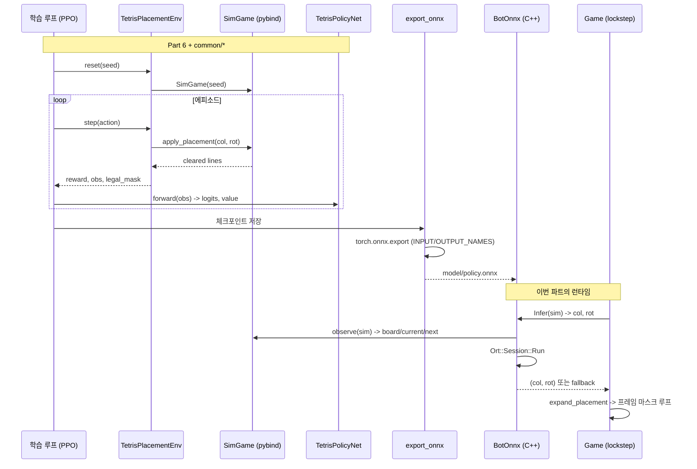
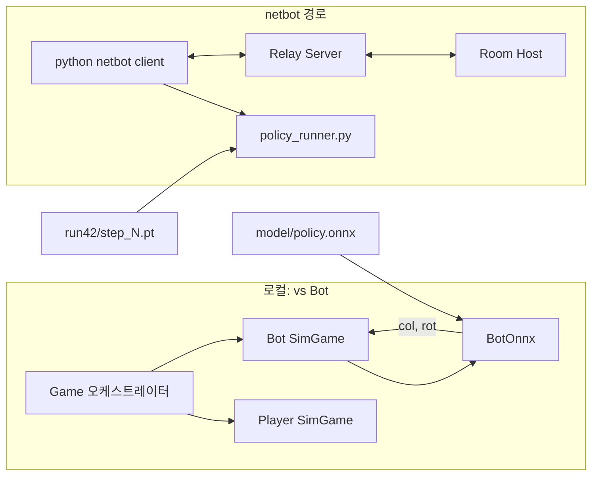

# Part 9: 강화학습과 ONNX 인-프로세스 봇

> **시리즈:** 제로부터 멀티플레이어 테트리스 + RL까지
> **Part 9** | [Part 0: 셋업](./part0-project-setup.md) | [Part 1: Win32+GL](./part1-window-and-opengl.md) | [Part 2: 2D 렌더링](./part2-2d-rendering.md) | [Part 3: 테트리스 로직](./part3-tetris-logic.md) | [Part 4: 게임 루프](./part4-game-loop.md) | [Part 5: 네트워킹](./part5-lockstep-networking.md) | [Part 6: Python RL](./part6-python-rl.md) | [Part 7: 오디오](./part7-xaudio2-audio.md) | [Part 8: 릴레이 서버](./part8-relay-server.md) | **Part 9: RL + ONNX 봇**

---

## 들어가며

Part 6 에서 Python 쪽에 pybind11 바인딩과 Gym 환경을 깔았다. 그 바인딩 위에 PPO 학습 루프를 올려 정책망을 훈련하고, 그 결과 체크포인트를 실제 C++ 클라이언트가 **인-프로세스로** 실행하는 것이 이번 파트의 목표다.

순수한 휴리스틱 봇은 Part 6 에서 이미 한 번 붙였다. Bertsekas-Tsitsiklis 계열의 BCTS 피처 — 구멍 수, 높이 분산, 잘 쌓인 전이 수 — 를 선형 결합한 평가 함수로, 설정 없이도 제법 오래 버틴다. 그러나 두 가지 한계가 명확하다.

1. **피처 엔지니어링의 상한.** BCTS 는 "좋은 보드" 를 사람이 정의한 함수다. T-spin, 다단 콤보, 백-투-백 테트리스 같은 공격 최적화는 피처로 표현되지 않아서 봇이 절대 그런 수를 찾지 않는다. 멀티플레이어 맥락에서 공격량이 점수 이상으로 중요해지는 순간 (Part 8 에서 붙인 가비지 큐·공격 라인) 휴리스틱의 천장이 보이기 시작한다.
2. **학습 가능성.** "다음 달에 보상 함수를 바꿔서 다시 훈련" 은 휴리스틱으로는 불가능하다. RL 은 그 반복 루프 자체를 프로젝트의 1급 시민으로 만든다.

봇을 실행하는 방식도 선택해야 한다. Part 6 의 `netbot` 은 이미 "별도 Python 프로세스가 TCP 로 접속하는 외부 플레이어" 형태로 작동한다. 학습한 정책을 그대로 netbot 에 얹으면 **추가 코드를 거의 쓰지 않고** RL 봇이 완성된다. 그런데도 별도의 인-프로세스 봇 경로를 만든 이유가 있다.

- **왕복 비용.** netbot 은 루프백 TCP 라 해도 매 틱 프레임을 주고받는다. 싱글플레이 vs 봇 모드에서까지 소켓을 쓰는 건 낭비다.
- **배포.** 최종 사용자 머신에 Python + PyTorch (250MB) 를 깔게 하고 싶지 않다. `onnxruntime` DLL 하나면 12MB 안팎이고, C 런타임 외 다른 의존성이 없다.
- **지연.** PPO 가 뽑은 placement 정책은 초당 수백 번 호출되지 않는다. 블록 하나당 한 번. 그래도 1ms 이하 추론이 보장되면 게임 프레임 한 번을 가볍게 소화한다. ONNX Runtime 은 이 요구를 맞춘다.

그래서 이번 파트는 두 축으로 간다. (1) Python 에서 학습한 `TetrisPolicyNet` 을 ONNX 로 내보내는 길, (2) C++ 에서 그 `.onnx` 를 읽어 placement 를 뽑고, 그 placement 를 프레임 마스크 시퀀스로 펼쳐 기존 `SimGame` 에 밀어넣는 길. 중간에 모델 로드 실패를 대비한 결정론적 fallback 이 있고, netbot 경로와 인-프로세스 경로가 같은 placement 결정 로직을 **공유**한다는 점이 이야기의 뼈대다.

## 전체 파이프라인

학습부터 게임 루프 진입까지 한 장에 모으면 이렇다.


핵심은 `SimGame` 이 **양쪽에서 동일한 C++ 소스** 를 공유한다는 점이다. Python 이 pybind11 을 통해 실행하는 sim 과 C++ 런타임이 실행하는 sim 은 결정론적으로 같은 상태 해시를 만든다 (Part 3 의 FNV-1a StateHash 계약). 그래서 학습 쪽에서 본 보드 레이아웃과 실행 쪽에서 본 레이아웃은 비트 단위로 일치한다. 이 계약이 무너지면 훈련된 정책이 실전에서 엉뚱한 placement 를 뽑는다 — 관측 분포가 바뀌는 "sim-to-real" 격차가 0 이어야 한다.

데이터 흐름을 다시 한 번 정리하면:



두 다이어그램의 공통된 축은 **동일한 관측 함수 · 동일한 액션 인코딩**이다. Python 의 `common/obs.py::build_observation` 과 C++ 의 `bot/placement.cpp::observe` 가 정확히 같은 규약으로 텐서를 만들고, Python 의 `action_mask.encode_action` 과 C++ 의 `bot::encode_action` 이 같은 수식으로 40-액션 공간을 인코딩한다. 이 대칭성이 부서지면 `.onnx` 파일은 껍데기만 맞는 쓰레기가 된다.

## 관측 · 행동 · 보상

### 관측

`TetrisPolicyNet` 의 입력은 세 개의 텐서다 (배치 차원 B 는 학습 때만 의미 있음, 런타임은 B=1 고정).

| 이름 | 모양 | dtype | 내용 |
|------|------|-------|------|
| `board` | `(B, 1, 20, 10)` | float32 | 잠긴(locked) 셀 점유 여부, 0 또는 1 |
| `current` | `(B, 7)` | float32 | 현재 피스 id 의 one-hot |
| `next` | `(B, 7)` | float32 | 다음 피스 id 의 one-hot |

`board` 에서 **떨어지는 피스와 고스트는 제외**한다. 정책이 추론할 대상은 "커밋된 보드 상태 + 이번에 내려줄 피스" 이지 화면에 보이는 시각 요소가 아니다. 고스트 블록의 cell id 값은 8 이라 `(v > 0) && (v != 8)` 로 방어적으로 걸러낸다. `common/obs.py`:

```python
def build_observation(sim: "SimGame") -> dict[str, torch.Tensor]:
    raw = np.asarray(sim.grid(), dtype=np.float32)  # (20, 10)
    occupied = ((raw > 0) & (raw != 8)).astype(np.float32)
    board = occupied[None, :, :]  # (1, 20, 10)

    current = _piece_one_hot(sim.current_block_id())
    nxt = _piece_one_hot(sim.next_block_id())

    return {
        "board": torch.from_numpy(board),
        "current": torch.from_numpy(current),
        "next": torch.from_numpy(nxt),
    }
```

C++ 쪽 `observe` 도 비트 단위로 같은 결과를 만든다 (`bot/placement.cpp`):

```cpp
void observe(const SimGame& sim,
             float* board_out,
             float* current_out,
             float* next_out)
{
    // board: (20 * 10) row-major, 0 또는 1.
    // python/common/obs.py 와 동일: (grid > 0) & (grid != 8).
    const auto& grid = sim.Grid();
    for (int r = 0; r < kBoardRows; ++r) {
        for (int c = 0; c < kBoardCols; ++c) {
            int v = grid[r][c];
            board_out[r * kBoardCols + c] = (v > 0 && v != 8) ? 1.0f : 0.0f;
        }
    }

    // current / next one-hot — id 는 1..7 범위, 그 외(0 등) 는 모두 0.
    for (int i = 0; i < kNumPieceTypes; ++i) {
        current_out[i] = 0.0f;
        next_out[i]    = 0.0f;
    }
    int cid = sim.CurrentBlockId();
    int nid = sim.NextBlockId();
    if (cid >= 1 && cid <= kNumPieceTypes) current_out[cid - 1] = 1.0f;
    if (nid >= 1 && nid <= kNumPieceTypes) next_out[nid - 1]    = 1.0f;
}
```

두 구현은 서로 다른 언어지만 **같은 조건식** (`v > 0 && v != 8`) 을 쓴다. 이 한 줄이 학습-실행 격차의 최후 방어선이다.

### 행동 공간

placement-level 이다. 한 피스당 가능한 놓임새를 `(col, rot)` 쌍으로 본다. `col ∈ [0, 10)`, `rot ∈ [0, 4)`, 총 40 개. 로테이션 수가 피스 종류에 따라 1/2/4 로 달라지지만 공간은 항상 40 으로 고정하고, 합법 마스크로 유효 동작만 통과시킨다 (`common/action_mask.py`):

```python
def encode_action(col: int, rot: int) -> int:
    """Map a (col, rot) placement to a flat action index in [0, 40)."""
    return col * NUM_ROTATIONS + rot


def decode_action(action: int) -> tuple[int, int]:
    """Inverse of encode_action."""
    return action // NUM_ROTATIONS, action % NUM_ROTATIONS


def legal_mask(sim: "SimGame") -> torch.Tensor:
    mask = torch.zeros(NUM_PLACEMENTS, dtype=torch.bool)
    for placement in sim.legal_placements():
        mask[encode_action(placement.col, placement.rot)] = True
    return mask
```

왜 placement-level 인가? 프레임-level (매 틱 좌/우/회전/드롭 비트 5개) 는 액션 공간이 훨씬 단순하지만, 에피소드 길이가 수십 배 길어져서 PPO 의 크레딧 할당이 극도로 어려워진다. 블록 하나를 놓기까지 20~30 틱이 걸리고, 그 중 실제 의사결정은 "어디에 어떤 회전으로 놓을지" 하나다. placement-level 은 그 의사결정을 **한 스텝으로 묶어서** 학습에 집어넣는다. 한 피스 = 한 `env.step()`. 프레임 시퀀스는 나중에 `expand_placement` 가 기계적으로 펼친다.

단점은 공격 최적화(소프트드롭 타이밍, 회전 트릭) 를 잃는 것. 그래도 BCTS 이상은 충분히 표현된다.

### 보상

최소한으로 뽑았다: **라인 클리어 수**. `TetrisPlacementEnv.step`:

```python
def step(self, action: int):
    col, rot = decode_action(int(action))
    cleared = self.sim.apply_placement(col, rot)

    if cleared < 0:
        reward = 0.0
        terminated = self.sim.game_over()
    else:
        reward = float(cleared)
        terminated = self.sim.game_over()

    truncated = False
    return self._observation(), reward, terminated, truncated, self._info()
```

`apply_placement` 가 -1 을 돌려주면 불법 placement 다. 환경은 sim 을 진행시키지 않고 0 보상을 돌려주지만, 정상적인 정책은 마스크 덕분에 거기에 도달하지 않는다. 방어적 코드일 뿐.

보상을 단순하게 둔 이유는 **피처 엔지니어링을 보상 엔지니어링으로 옮기는 함정** 을 피하기 위함이다. "구멍 하나당 -0.5, 높이 편차 -0.1" 같은 dense reward 를 만들면 결국 BCTS 를 reward 공간에서 다시 짜고 있는 꼴. 정책이 스스로 장기 보상 (쌓기를 잘해야 나중에 4줄을 한 번에 터뜨린다) 을 찾도록 둔다. 그 대신 `value_head` 가 상태가치를 학습해 크레딧 할당을 맡는다.

게임오버 페널티를 추가하고 싶으면 `if self.sim.game_over(): reward -= 5.0` 한 줄이면 되지만, 현 구성에서는 "오래 살아서 누적 점수가 많다 = 이득" 이라는 구조로 충분하다.

## pybind11 바인딩

학습 전체가 이 한 파일에 의존한다 (`bindings/tetris_py.cpp`):

```cpp
// [NET/RL] pybind11 bindings for SimGame.
//
// Exposes the headless Tetris simulation to Python so that the same C++
// source of truth drives both:
//   - Colab training loops (placement-level API)
//   - the local netbot client (frame-level API for lockstep TCP play)
//
// Build with -DTETRIS_BUILD_PY=ON. raylib is NOT required — this module only
// links against the pure sim sources.
//
// Python-side usage:
//   from sim import SimGame
//   g = SimGame(seed=42)
//   for p in g.legal_placements():
//       print(p.col, p.rot)
//   g.apply_placement(4, 0)
//   arr = g.grid()                # numpy (20, 10) int32 view
//   h   = g.state_hash()          # bitwise-equal to C++ SimGame::StateHash()

#include <pybind11/pybind11.h>
#include <pybind11/stl.h>
#include <pybind11/numpy.h>

#include "../src/sim_game.h"
#include "../src/sim_grid.h"
#include "../src/sim_block.h"

namespace py = pybind11;

PYBIND11_MODULE(tetris_py, m)
{
    m.doc() = "Headless Tetris simulation (pybind11 wrapper around SimGame)";

    // ---- Placement struct ------------------------------------------------
    py::class_<SimGame::Placement>(m, "Placement")
        .def_readonly("col", &SimGame::Placement::col)
        .def_readonly("rot", &SimGame::Placement::rot)
        .def("__repr__", [](const SimGame::Placement& p) {
            return "Placement(col=" + std::to_string(p.col) +
                   ", rot=" + std::to_string(p.rot) + ")";
        });

    // ---- SimBlock (read-only observation handle) -------------------------
    py::class_<SimBlock>(m, "SimBlock")
        .def_readonly("id",             &SimBlock::id)
        .def_readonly("rotation_state", &SimBlock::rotationState)
        .def_readonly("row_offset",     &SimBlock::rowOffset)
        .def_readonly("column_offset",  &SimBlock::columnOffset)
        .def("cell_positions", [](const SimBlock& b) {
            // Return list of (row, column) tuples for the current rotation.
            auto tiles = b.GetCellPositions();
            py::list out;
            for (const auto& t : tiles)
            {
                out.append(py::make_tuple(t.row, t.column));
            }
            return out;
        });

    // ---- SimGame ---------------------------------------------------------
    py::class_<SimGame>(m, "SimGame")
        .def(py::init<uint64_t>(), py::arg("seed") = 0,
             "Construct a new headless Tetris sim. seed=0 uses a fixed default "
             "so that unseeded runs are still deterministic across platforms.")

        // Placement-level action API (RL training)
        .def("legal_placements", &SimGame::LegalPlacements,
             "Enumerate all legal (col, rot) placements for the current piece "
             "via rotate-then-translate-then-hard-drop. Returns a list of "
             "Placement objects.")
        .def("apply_placement", &SimGame::ApplyPlacement,
             py::arg("col"), py::arg("rot"),
             "Apply a placement atomically (rotate -> translate -> hard drop -> "
             "lock). Returns the number of lines cleared, or -1 if the placement "
             "is illegal.")

        // Frame-level action API (lockstep net play)
        .def("submit_input", &SimGame::SubmitInput, py::arg("input_mask"),
             "Apply a one-tick input bitmask (see core/input.h). Used by the "
             "netbot client to feed frame-level actions into the lockstep loop.")
        .def("tick", &SimGame::Tick,
             "Advance the gravity counter by one tick. Time-only progression "
             "separate from input.")
        .def("move_block_down", &SimGame::MoveBlockDown,
             "Single-step the current piece down by one row (locks on contact).")

        // Observation accessors
        .def("grid", [](const SimGame& g) {
            // Expose the 20x10 int grid as a numpy array. We COPY the buffer
            // so Python can keep the array alive past the next mutation —
            // a 200-int copy per call is negligible for training throughput.
            const auto& raw = g.Grid();
            auto arr = py::array_t<int32_t>({SimGrid::kRows, SimGrid::kCols});
            auto buf = arr.mutable_unchecked<2>();
            for (int r = 0; r < SimGrid::kRows; ++r)
                for (int c = 0; c < SimGrid::kCols; ++c)
                    buf(r, c) = raw[r][c];
            return arr;
        }, "Return the 20x10 grid as a numpy int32 array (copied).")

        .def("current_block",
             &SimGame::CurrentBlock,
             py::return_value_policy::reference_internal,
             "Current falling piece.")
        .def("ghost_block",
             &SimGame::GhostBlock,
             py::return_value_policy::reference_internal,
             "Ghost/preview piece at the hard-drop target.")
        .def("next_block",
             &SimGame::NextBlock,
             py::return_value_policy::reference_internal,
             "Next piece in the preview slot.")

        .def("current_block_id", &SimGame::CurrentBlockId)
        .def("current_rotation", &SimGame::CurrentRotation)
        .def("current_row",      &SimGame::CurrentRow)
        .def("current_col",      &SimGame::CurrentCol)
        .def("next_block_id",    &SimGame::NextBlockId)
        .def("score",            &SimGame::Score)
        .def("game_over",        &SimGame::IsGameOver)

        // Determinism / debugging
        .def("state_hash", &SimGame::StateHash,
             "FNV-1a 64-bit hash of the full sim state. Bitwise-identical to "
             "Game::ComputeStateHash() — this is the gate the determinism "
             "regression test checks.")
        .def("rng_state", &SimGame::RngState,
             "Raw XorShift64* RNG state (for debugging cross-platform drift).")

        // Grid shape constants (useful for observation code on the Python side)
        .def_property_readonly_static("ROWS", [](py::object) { return SimGrid::kRows; })
        .def_property_readonly_static("COLS", [](py::object) { return SimGrid::kCols; });
}
```

바인딩 설계 원칙 몇 가지.

**두 API 를 동시에 제공한다.** `apply_placement` 는 학습용 (한 번의 호출이 rotate → translate → hard-drop → lock 까지 원자적으로 실행). `submit_input` 과 `tick` 은 netbot 이 lockstep TCP 루프에 맞춰 프레임 단위로 sim 을 굴리기 위함. 같은 C++ 객체가 둘 다 지원하기 때문에, 학습 시에는 빠르게 스텝을 밟고 배포 시에는 서버와 동기화된 틱 레이트로 움직인다.

**`grid()` 는 항상 복사한다.** 200 개 int 복사는 훈련 throughput 에 거의 영향이 없고, "Python 이 numpy 배열을 쥐고 있는데 SimGame 이 그 아래에서 mutate 해서 다음 프레임에 다른 값이 보인다" 는 미묘한 버그를 완전히 봉쇄한다. `return_value_policy::reference_internal` 은 SimBlock 조회처럼 **짧은 수명으로 바로 읽고 버리는** 경우에만 쓴다.

**`state_hash()` 를 노출한다.** Part 3 의 FNV-1a 해시를 Python 에서 바로 찍어볼 수 있다. `test_determinism_crossplatform.py` 같은 테스트가 여기를 통해 Python 런과 C++ 런의 상태가 틱 단위로 일치하는지 검증한다.

**`seed=0` 이 deterministic default.** Gym env 가 `TetrisPlacementEnv(seed=0)` 으로 초기화해도 플랫폼 간 동일한 피스 시퀀스를 받는다.

이 바인딩이 완성되면, Python 에서 이렇게 쓸 수 있다.

```python
from sim import SimGame

g = SimGame(seed=42)
print(g.legal_placements())        # [Placement(col=3, rot=0), ...]
g.apply_placement(4, 2)            # 내려놓고 라인 카운트 반환
print(g.current_block_id())        # 1..7
print(g.grid().shape)              # (20, 10)
print(hex(g.state_hash()))         # 0x...
```

이 호출들이 학습 루프에서 매 스텝 돌아가게 되고, 그 결과가 `TetrisPolicyNet` 으로 흘러들어가 policy/value 를 업데이트한다.

## 정책 네트워크

참고로 `common/models.py` 의 `TetrisPolicyNet`. 학습 파이프라인의 심장이지만 이번 파트의 주제는 아니므로 구조만.

```python
class TetrisPolicyNet(nn.Module):
    """Shared trunk + policy/value heads.

    Input contract (matches common.obs.build_observation)::

        board   : (B, 1, 20, 10) float32, occupancy in {0.0, 1.0}
        current : (B, 7) float32, one-hot of current piece id - 1
        next    : (B, 7) float32, one-hot of next piece id - 1

    Output::

        policy_logits : (B, 40) float32 — over (col * 4 + rot) placements
        value         : (B,)    float32 — scalar state value
    """

    ARCH_VERSION = 1

    def __init__(
        self,
        board_channels: int = 1,
        conv_channels: tuple[int, ...] = (32, 64, 64),
        hidden: int = 256,
        n_placements: int = NUM_PLACEMENTS,
        n_piece_types: int = NUM_PIECE_TYPES,
    ) -> None:
        super().__init__()
        self.board_channels = board_channels
        self.conv_channels = conv_channels
        self.hidden = hidden
        self.n_placements = n_placements
        self.n_piece_types = n_piece_types

        # ---- Convolutional trunk over the 20x10 board --------------------
        layers: list[nn.Module] = []
        in_ch = board_channels
        for out_ch in conv_channels:
            layers.append(nn.Conv2d(in_ch, out_ch, kernel_size=3, padding=1))
            layers.append(nn.ReLU(inplace=True))
            in_ch = out_ch
        self.trunk = nn.Sequential(*layers)

        flat = conv_channels[-1] * BOARD_ROWS * BOARD_COLS

        # ---- Fuse board features with current+next piece one-hots --------
        self.fuse = nn.Sequential(
            nn.Linear(flat + 2 * n_piece_types, hidden),
            nn.ReLU(inplace=True),
            nn.Linear(hidden, hidden),
            nn.ReLU(inplace=True),
        )

        self.policy_head = nn.Linear(hidden, n_placements)
        self.value_head = nn.Linear(hidden, 1)

    def forward(
        self,
        board: torch.Tensor,
        current: torch.Tensor,
        next: torch.Tensor,  # noqa: A002 - matches obs key name
    ) -> tuple[torch.Tensor, torch.Tensor]:
        if board.dim() == 3:
            board = board.unsqueeze(1)  # (B, 20, 10) -> (B, 1, 20, 10)
        h = self.trunk(board)
        h = h.flatten(1)
        h = torch.cat([h, current, next], dim=-1)
        h = self.fuse(h)
        policy_logits = self.policy_head(h)
        value = self.value_head(h).squeeze(-1)
        return policy_logits, value
```

구조 자체는 아주 평범하다. `(20, 10)` 보드를 3-레이어 conv (32→64→64) 로 지나가고 flatten, 거기에 `current`/`next` one-hot 을 concat 해서 2-레이어 MLP 로 올린 뒤 policy(40) 와 value(1) 두 헤드. conv 는 "옆 열이 얼마나 높은지" 같은 지역 패턴을 잡고 MLP 는 전체 보드 요약을 만든다. T-spin 같은 패턴은 학습 이후에 conv 필터 안에 녹아든다.

주목할 것은 `ARCH_VERSION = 1`. `common/checkpoint.py` 의 `load_checkpoint` 가 이 값을 검증해서, 구조가 바뀌면 체크포인트 로드를 **하드 실패** 시킨다. "1 번 레이어가 2 번 레이어가 됐는데 shape 이 우연히 같아서 조용히 로드되고 정책이 이상해졌다" 같은 무음 버그의 길을 막아놓은 것.

`masked_log_softmax` 도 같은 파일에 있다 (학습 시 log π(a|s) 계산에 쓴다).

```python
def masked_log_softmax(
    logits: torch.Tensor, mask: torch.Tensor, eps: float = 1e-9
) -> torch.Tensor:
    """Apply a boolean legal-action mask to logits then log-softmax.

    Setting illegal logits to -inf makes their softmax probability zero,
    so sampling and argmax only ever pick legal placements.
    """
    masked = logits.masked_fill(~mask, float("-inf"))
    return F.log_softmax(masked + eps, dim=-1)
```

학습 시의 마스킹은 확률 0, 런타임 C++ 에서의 마스킹은 단순 argmax 에서 제외 — 둘 다 "불법 placement 를 절대 고르지 않는다" 는 동일한 규약.

## ONNX 내보내기

체크포인트(`.pt`)는 PyTorch 포맷이다. 이걸 ONNX 그래프로 변환해야 C++ 런타임이 읽을 수 있다. 저장소 `python/netbot/export_onnx.py` 를 **80 줄 전체** 그대로 인용한다 — 드라이런 리뷰어가 "INPUT_NAMES/OUTPUT_NAMES 상수와 `torch.onnx.export` 호출이 연결된 한 맥락에서 보여야 한다" 라고 지적한 자리. 인용 뒤에 load-bearing 상수, `dynamic_axes`, opset 등 개별 설정을 풀어 쓴다.

```python
"""Convert a trained TetrisPolicyNet checkpoint to ONNX for the C++ netbot.

The C++ runtime uses onnxruntime (see ``bot/bot_onnx.cpp``) rather than libtorch
or a Python subprocess. The short version is "12 MB DLL vs. 250 MB libtorch,
sub-1ms infer, no Python on the end user's machine."

Input/output names are load-bearing: ``bot/bot_onnx.cpp`` looks them up by
string. If you rename one here, the C++ side must change in lockstep (and the
existing ``model/policy.onnx`` bundles must be re-exported).

Usage::

    uv run --directory python python -m netbot.export_onnx \\
        checkpoints/run42/step_2000000.pt \\
        ../model/policy.onnx
"""

from __future__ import annotations

import argparse
from pathlib import Path

import torch

from common import BOARD_COLS, BOARD_ROWS, NUM_PIECE_TYPES
from common.checkpoint import load_checkpoint
from common.models import TetrisPolicyNet


# Must match bot/bot_onnx.cpp's inputNames / outputNames arrays.
INPUT_NAMES = ["board", "current", "next"]
OUTPUT_NAMES = ["policy_logits", "value"]


def export(ckpt_path: str | Path, out_path: str | Path, opset: int = 17) -> None:
    """Load ``ckpt_path`` (a TetrisPolicyNet .pt) and write an ONNX graph to
    ``out_path``.

    Batch size is fixed at 1 — the C++ netbot only ever runs single-step
    inference on one SimGame at a time. If a training-side consumer ever needs
    batched ONNX inference, add ``dynamic_axes={"board": {0: "batch"}, ...}``.
    """
    ckpt_path = Path(ckpt_path)
    out_path = Path(out_path)
    out_path.parent.mkdir(parents=True, exist_ok=True)

    model = load_checkpoint(ckpt_path, device="cpu")
    model.eval()

    # Dummy inputs matching common.obs.build_observation shapes with a batch dim.
    dummy_board = torch.zeros(1, 1, BOARD_ROWS, BOARD_COLS, dtype=torch.float32)
    dummy_current = torch.zeros(1, NUM_PIECE_TYPES, dtype=torch.float32)
    dummy_next = torch.zeros(1, NUM_PIECE_TYPES, dtype=torch.float32)

    torch.onnx.export(
        model,
        (dummy_board, dummy_current, dummy_next),
        str(out_path),
        input_names=INPUT_NAMES,
        output_names=OUTPUT_NAMES,
        opset_version=opset,
        dynamic_axes=None,
        do_constant_folding=True,
    )
    print(f"[export_onnx] wrote {out_path} from {ckpt_path}")


def main() -> None:
    ap = argparse.ArgumentParser(description=__doc__, formatter_class=argparse.RawDescriptionHelpFormatter)
    ap.add_argument("ckpt", help="path to trained .pt checkpoint (TetrisPolicyNet)")
    ap.add_argument("out",  help="output .onnx path (e.g. ../model/policy.onnx)")
    ap.add_argument("--opset", type=int, default=17, help="ONNX opset (default: 17)")
    args = ap.parse_args()
    export(args.ckpt, args.out, args.opset)


if __name__ == "__main__":
    main()
```

이 파일에서 **load-bearing** 인 상수 두 개.

```python
INPUT_NAMES = ["board", "current", "next"]
OUTPUT_NAMES = ["policy_logits", "value"]
```

ONNX 그래프는 텐서 이름으로 식별된다. `torch.onnx.export` 가 이 이름들을 graph node 에 박아넣고, `onnxruntime` 의 `Session::Run` 호출은 정확히 같은 문자열로 입출력을 끼워 맞춘다. C++ 쪽에 다시 등장한다.

```cpp
// bot/bot_onnx.cpp
std::array<const char*, 3> inputNames  = {"board", "current", "next"};
std::array<const char*, 2> outputNames = {"policy_logits", "value"};
```

Python 에서 `"next"` 를 `"next_piece"` 로 바꿨는데 C++ 을 안 고치면 `Run` 이 "input not found" 로 던진다. 모델은 로드되지만 추론은 불가능한 상태가 된다. 그래서 두 배열은 **커밋 단위로 동기화** 되어야 하며, 변경 시 기존 `model/policy.onnx` 번들은 모두 재-export 가 필요하다.

몇 가지 옵션 선택.

**Batch size = 1 고정.** `dynamic_axes=None` 이라서 export 된 그래프의 첫 축은 상수 1 이다. 런타임이 단일-스텝 추론만 하기 때문에 충분하고, ONNX 최적화가 고정 shape 에서 더 공격적이다 (상수 접힘, 메모리 사전할당). 나중에 학습 측에서 배치 추론이 필요하면 `dynamic_axes={"board": {0: "batch"}, ...}` 로 풀면 된다.

**opset 17.** ORT 1.16+ 가 권장하는 최신 안정 버전. 너무 낮으면 최근 op 가 폴리필로 풀려서 그래프가 비대해지고, 너무 높으면 이전 ORT 릴리스가 못 읽는다.

**`do_constant_folding=True`.** conv 레이어의 bias, fuse 레이어의 weight 상수 등을 export 타임에 미리 폴딩. 런타임 로드 시간과 추론 지연이 소폭 감소.

**`model.eval()`.** dropout/batchnorm 을 추론 모드로 고정. `TetrisPolicyNet` 은 둘 다 쓰지 않지만 미래의 구조 변경에 대한 방어다.

export 가 끝나면 `model/policy.onnx` 파일 하나가 남는다. 이 파일이 이제 C++ 런타임의 유일한 입력이다.

## C++ 봇: Ort::Env 부터 Ort::Session 까지

`bot/bot_onnx.cpp` 는 Impl PIMPL 패턴으로 ORT 헤더를 인터페이스에서 숨긴다 (`bot_onnx.h` 는 ORT 심볼을 하나도 포함하지 않아, 다른 번역 단위에서 이 헤더만 include 해도 빌드가 빨라지고, ORT 버전 교체 시 인터페이스가 흔들리지 않는다).

```cpp
// bot/bot_onnx.cpp — ONNX Runtime C++ API 래퍼. 헤더 설명은 bot_onnx.h 참조.
//
// 빌드 시 TETRIS_BUILD_BOT 옵션이 ON 이어야 이 파일이 컴파일된다. 헤더/링크는
// third_party/onnxruntime/ 을 가리키도록 CMake 에서 설정.

#include "bot_onnx.h"

#include "placement.h"
#include "../src/sim_game.h"

#include <array>
#include <cmath>
#include <cstddef>
#include <cstring>
#include <limits>

#if defined(TETRIS_HAS_ONNXRUNTIME)
    #include <onnxruntime_cxx_api.h>
#endif

namespace bot {

#if defined(TETRIS_HAS_ONNXRUNTIME)

struct BotOnnx::Impl {
    Ort::Env     env{ORT_LOGGING_LEVEL_WARNING, "tetris_bot"};
    Ort::SessionOptions sessOpts{};
    std::unique_ptr<Ort::Session> session;
    Ort::MemoryInfo memInfo = Ort::MemoryInfo::CreateCpu(OrtArenaAllocator, OrtMemTypeDefault);

    // 입출력 이름 — Python export_onnx 에서 고정.
    std::array<const char*, 3> inputNames  = {"board", "current", "next"};
    std::array<const char*, 2> outputNames = {"policy_logits", "value"};

    bool LoadModel(const std::string& path, std::string* err_out)
    {
        try {
            sessOpts.SetIntraOpNumThreads(1);
            sessOpts.SetGraphOptimizationLevel(GraphOptimizationLevel::ORT_ENABLE_ALL);
        #if defined(_WIN32)
            std::wstring wpath(path.begin(), path.end());
            session = std::make_unique<Ort::Session>(env, wpath.c_str(), sessOpts);
        #else
            session = std::make_unique<Ort::Session>(env, path.c_str(), sessOpts);
        #endif
        } catch (const Ort::Exception& e) {
            if (err_out) *err_out = std::string("Ort::Exception: ") + e.what();
            session.reset();
            return false;
        } catch (const std::exception& e) {
            if (err_out) *err_out = std::string("std::exception: ") + e.what();
            session.reset();
            return false;
        }
        return true;
    }

    // ... InferOnce (아래)
};
```

`Ort::Env` 는 전체 프로세스에 한 개만 있어도 되는 로거/스레드풀 핸들이다. 보통 전역에 두지만 여기서는 `Impl` 수명에 묶어서 여러 `BotOnnx` 인스턴스가 각자 독립된 환경을 가질 수 있게 했다. 문제가 생겨도 다른 인스턴스는 영향을 받지 않는다.

`SessionOptions` 의 두 설정.

- `SetIntraOpNumThreads(1)`: ORT 가 큰 matmul 을 내부적으로 병렬화하지 않는다. 게임 틱 루프는 이미 메인 스레드에서 돌고, 추론은 블록당 한 번뿐이라 병렬화로 얻는 게 없고, 스레드 생성 오버헤드만 커진다. 1ms 미만의 고정된 지연이 멀티스레드보다 낫다.
- `SetGraphOptimizationLevel(ORT_ENABLE_ALL)`: layer fusion, constant folding, operator elimination 등 모든 최적화 활성화. 첫 로드가 수십 ms 늘지만 이후 매 추론이 빨라진다.

`MemoryInfo::CreateCpu(OrtArenaAllocator, OrtMemTypeDefault)` 는 "CPU 상의 arena 할당자를 써달라" 는 힌트. ORT 는 추론 중 중간 텐서를 arena 에서 할당해서 매번 malloc 하지 않는다.

**Windows 경로 와이드 변환.** `std::string path` 를 그대로 `Ort::Session` 에 넘길 수 없다 — Windows 생성자는 `wchar_t*` 를 받는다. `std::wstring wpath(path.begin(), path.end())` 는 ASCII 경로에서 단순하고 무해한 변환이다 (유니코드 경로가 필요하면 `MultiByteToWideChar` 로 확장).

**예외 → 불리언.** ORT C++ API 는 실패 시 `Ort::Exception` 을 던진다. 게임 루프가 try/catch 를 쓰고 싶지 않으므로 여기서 잡아서 bool + 메시지로 변환. 호출자는 "로드 실패 = fallback 휴리스틱" 이라는 단일 규약으로 처리한다.

### 추론 호출

저장소 `bot/bot_onnx.cpp` 라인 58-123 의 `InferOnce` **전체**. 이 함수 안에 리뷰어가 지적한 세 덩어리 — **(a) `Ort::Value::CreateTensor<float>` 로 입력 텐서 3 개 구성** (board / current / next), **(b) `session->Run` 호출** (입출력 이름 배열을 그대로 넘김), **(c) logits 배열에서 masked argmax** — 가 모두 들어있다. 인용 뒤 7 단계로 분해한다.

```cpp
bool InferOnce(const SimGame& sim, int& col_out, int& rot_out)
{
    if (!session) return false;

    float board[kBoardRows * kBoardCols];   // flatten (1, 1, 20, 10)
    float current[kNumPieceTypes];          // (1, 7)
    float nxt[kNumPieceTypes];              // (1, 7)
    observe(sim, board, current, nxt);

    std::array<int64_t, 4> boardShape = {1, 1, kBoardRows, kBoardCols};
    std::array<int64_t, 2> pieceShape = {1, kNumPieceTypes};

    Ort::Value boardT = Ort::Value::CreateTensor<float>(
        memInfo, board, sizeof(board) / sizeof(float),
        boardShape.data(), boardShape.size());
    Ort::Value curT = Ort::Value::CreateTensor<float>(
        memInfo, current, kNumPieceTypes,
        pieceShape.data(), pieceShape.size());
    Ort::Value nxtT = Ort::Value::CreateTensor<float>(
        memInfo, nxt, kNumPieceTypes,
        pieceShape.data(), pieceShape.size());

    Ort::Value inputs[3] = {std::move(boardT), std::move(curT), std::move(nxtT)};

    std::vector<Ort::Value> outs;
    try {
        outs = session->Run(
            Ort::RunOptions{nullptr},
            inputNames.data(), inputs, 3,
            outputNames.data(), outputNames.size());
    } catch (const Ort::Exception&) {
        return false;
    }
    if (outs.empty()) return false;

    const float* logits = outs[0].GetTensorData<float>();
    // kNumPlacements = 40 고정.

    // 합법 마스크: LegalPlacements 를 돌려 (col, rot) 집합을 bitset 으로.
    auto placements = sim.LegalPlacements();
    if (placements.empty()) return false;

    bool legal[kNumPlacements] = {false};
    for (const auto& p : placements) {
        int a = encode_action(p.col, p.rot);
        if (a >= 0 && a < kNumPlacements) legal[a] = true;
    }

    // masked argmax
    int   bestIdx = -1;
    float bestVal = -std::numeric_limits<float>::infinity();
    for (int i = 0; i < kNumPlacements; ++i) {
        if (!legal[i]) continue;
        if (logits[i] > bestVal) {
            bestVal = logits[i];
            bestIdx = i;
        }
    }
    if (bestIdx < 0) {
        // 모든 합법 logits 가 -inf 였다는 뜻 — 정상 케이스는 아님.
        // fallback 으로 사전순 최소 합법 수를 선택.
        return fallback_placement(sim, col_out, rot_out);
    }
    decode_action(bestIdx, col_out, rot_out);
    return true;
}
```

흐름을 단계별로 보자.

**1. 스택 버퍼에 관측 만들기.** `board[200]`, `current[7]`, `nxt[7]` — 모두 스택. 추론당 1KB 미만이라 heap 을 쓸 이유가 없고, 매 호출에 할당/해제 비용도 없다. `observe(sim, ...)` 가 세 버퍼를 채운다.

**2. `Ort::Value` 로 래핑.** `CreateTensor<float>` 는 **소유권을 가져가지 않는다** — 포인터와 shape 만 참조한다. `board` 가 스택에 있으므로 `Run` 이 반환할 때까지 이 함수 스코프가 살아있어야 한다. 여기서는 같은 함수 안에서 `Run` 을 동기적으로 부르니 문제없다.

shape 배열을 `std::array<int64_t, N>` 으로 만드는 이유는 ORT 가 `int64_t*` 을 요구하기 때문. `{1, 1, 20, 10}` 이 `board` 의 (batch, channels, rows, cols), `{1, 7}` 이 piece one-hot 의 (batch, classes).

**3. `session->Run`.** 인자 6 개를 순서대로 — `Ort::RunOptions{nullptr}` (기본 옵션), `inputNames.data()` (C 스트링 배열 `{"board", "current", "next"}`), `inputs` (`Ort::Value[3]`), 입력 개수 `3`, `outputNames.data()` (`{"policy_logits", "value"}`), 출력 개수 `outputNames.size() = 2`. ORT 가 그래프를 실행하고 `std::vector<Ort::Value>` 로 출력 텐서들을 돌려준다. `outs[0]` 이 `policy_logits`, `outs[1]` 이 `value`. value 는 현재 쓰지 않지만 (policy argmax 만 필요) 나중에 search 를 얹을 때 사용 예정. 예외 한 덩어리로 실패를 잡고 `return false` — 호출자가 fallback 으로 빠진다. 이 한 줄이 Python 의 `model(board, current, next)` 에 해당하는 C++ 등가물이다.

**4. 합법 마스크 재계산.** Python 학습 쪽이 `legal_mask` 로 불법 logit 을 -∞ 로 바꿨던 것처럼, 여기서도 `sim.LegalPlacements()` 를 돌려 bitset 을 만든다. placement 의 `(col, rot)` 을 `encode_action` 으로 40-공간 인덱스로 변환.

이 함수가 `bot/placement.h` 에 선언되어 있는데, Python 의 `encode_action` 과 수식이 같다: `col * 4 + rot`. 이 대칭성이 없으면 같은 placement 가 두 공간에서 다른 인덱스를 받고, 정책이 완전히 엉뚱한 수를 둔다.

**5. Masked argmax.** 학습 시에는 확률 샘플링 (exploration), 배포 시에는 argmax (exploitation). 40 개를 선형 스캔하면서 합법이고 가장 큰 logit 을 찾는다. 분기 예측 실패가 거의 없어서 수 마이크로초.

**6. fallback 가드.** `bestIdx < 0` 은 모든 합법 logit 이 -∞ 였다는 뜻 — 정상적으로는 발생하지 않지만 (모델이 망가진 경우나 shape 불일치로 NaN 이 퍼진 경우), 여기서 터지면 봇이 멈춘다. 대신 `fallback_placement` 로 위임해 사전순 최소 합법 수를 선택한다. 약하지만 살아 있다.

**7. decode.** `bestIdx` → `(col, rot)`. 호출자에게 돌려주면 이후는 `expand_placement` 의 몫이다.

### PIMPL 바깥 인터페이스

```cpp
BotOnnx::BotOnnx() : impl_(std::make_unique<Impl>()) {}
BotOnnx::~BotOnnx() = default;

bool BotOnnx::Load(const std::string& onnx_path, std::string* err_out)
{
    if (!impl_) impl_ = std::make_unique<Impl>();
    return impl_->LoadModel(onnx_path, err_out);
}

bool BotOnnx::Infer(const SimGame& sim, int& col_out, int& rot_out)
{
    if (!impl_ || !impl_->session) return false;
    return impl_->InferOnce(sim, col_out, rot_out);
}

bool BotOnnx::IsLoaded() const
{
    return impl_ && impl_->session != nullptr;
}
```

세 개의 공개 함수: `Load`, `Infer`, `IsLoaded`. 호출자 입장에서는 ORT 가 존재하는지, 모델이 로드됐는지, 추론이 성공했는지만 신경 쓰면 된다. ORT 헤더는 이 번역 단위에만 노출.

### ONNX Runtime 이 없는 빌드

`third_party/onnxruntime/` 이 아직 벤더링되지 않았을 수도 있다 (새 머신에서 `fetch_onnxruntime.sh` 를 안 돌렸거나, 플랫폼 지원이 없거나). 이 경우에도 전체 프로젝트가 빌드되어야 한다.

```cpp
#else  // !TETRIS_HAS_ONNXRUNTIME

// ORT 바이너리가 준비되기 전에도 빌드가 돌아가도록 스텁. Load 는 항상 실패.
// Infer 경로는 호출자가 IsLoaded 로 가드하므로 도달하지 않는다.
struct BotOnnx::Impl { bool loaded = false; };

BotOnnx::BotOnnx() : impl_(std::make_unique<Impl>()) {}
BotOnnx::~BotOnnx() = default;

bool BotOnnx::Load(const std::string& onnx_path, std::string* err_out)
{
    (void)onnx_path;
    if (err_out) *err_out = "onnxruntime not vendored — rebuild with TETRIS_HAS_ONNXRUNTIME";
    return false;
}

bool BotOnnx::Infer(const SimGame&, int&, int&) { return false; }
bool BotOnnx::IsLoaded() const { return false; }

#endif  // TETRIS_HAS_ONNXRUNTIME
```

스텁 구현. `Load` 는 설명 메시지와 함께 false, `Infer` 는 항상 false, `IsLoaded` 도 false. 호출자가 `if (!bot.IsLoaded())` 가드로 자동으로 fallback 으로 빠진다. `TETRIS_HAS_ONNXRUNTIME` 매크로는 `CMakeLists.txt` 에서 onnxruntime 라이브러리 탐지 시 정의된다.

이 구성 덕분에, "빌드 시점에 모델이 없음" → "런타임에 모델 로드 실패" → "추론 호출 실패" 세 케이스 모두 **같은 fallback 경로** 를 탄다. 호출 사이트는 단 하나의 분기만 신경 쓰면 된다.

## Fallback 휴리스틱

ONNX 가 준비되지 않은 상황에서도 봇은 돌아가야 한다. `bot/placement.cpp::fallback_placement` 가 최후의 보루.

```cpp
// bot/placement.cpp — Python netbot 로직의 C++ 포트. 자세한 설명은 .h 참고.
#include "placement.h"

#include "../src/sim_game.h"
#include "../core/input.h"

#include <algorithm>

namespace bot {

std::vector<uint8_t> expand_placement(int cur_col,
                                      int cur_rot,
                                      int tgt_col,
                                      int tgt_rot)
{
    std::vector<uint8_t> seq;
    seq.reserve(8);

    // 회전은 항상 전진 방향 — SimBlock 이 Rotate 만 공개하고 역회전은 UndoRotate
    // 용 내부 API 라서 1~3 회 로테이트로 통일 (Python 원본과 동일).
    int rot_steps = ((tgt_rot - cur_rot) % kNumRotations + kNumRotations) % kNumRotations;
    for (int i = 0; i < rot_steps; ++i) {
        seq.push_back((uint8_t)INPUT_ROTATE);
    }

    if (tgt_col > cur_col) {
        int steps = tgt_col - cur_col;
        for (int i = 0; i < steps; ++i) seq.push_back((uint8_t)INPUT_RIGHT);
    } else if (tgt_col < cur_col) {
        int steps = cur_col - tgt_col;
        for (int i = 0; i < steps; ++i) seq.push_back((uint8_t)INPUT_LEFT);
    }

    seq.push_back((uint8_t)INPUT_DROP);
    return seq;
}

bool fallback_placement(const SimGame& sim, int& col_out, int& rot_out)
{
    auto placements = sim.LegalPlacements();
    if (placements.empty()) return false;

    // Python fallback_placement: sorted by (col, rot) — 최소값 선택.
    auto best = std::min_element(
        placements.begin(), placements.end(),
        [](const SimGame::Placement& a, const SimGame::Placement& b) {
            if (a.col != b.col) return a.col < b.col;
            return a.rot < b.rot;
        });
    col_out = best->col;
    rot_out = best->rot;
    return true;
}

void observe(const SimGame& sim,
             float* board_out,
             float* current_out,
             float* next_out)
{
    // board: (20 * 10) row-major, 0 또는 1.
    // python/common/obs.py 와 동일: (grid > 0) & (grid != 8).
    const auto& grid = sim.Grid();
    for (int r = 0; r < kBoardRows; ++r) {
        for (int c = 0; c < kBoardCols; ++c) {
            int v = grid[r][c];
            board_out[r * kBoardCols + c] = (v > 0 && v != 8) ? 1.0f : 0.0f;
        }
    }

    // current / next one-hot — id 는 1..7 범위, 그 외(0 등) 는 모두 0.
    for (int i = 0; i < kNumPieceTypes; ++i) {
        current_out[i] = 0.0f;
        next_out[i]    = 0.0f;
    }
    int cid = sim.CurrentBlockId();
    int nid = sim.NextBlockId();
    if (cid >= 1 && cid <= kNumPieceTypes) current_out[cid - 1] = 1.0f;
    if (nid >= 1 && nid <= kNumPieceTypes) next_out[nid - 1]    = 1.0f;
}

}  // namespace bot
```

`fallback_placement` 는 "합법 placement 중 (col, rot) 사전순으로 최소인 것 하나" 를 고른다. 극단적으로 단순한 규칙 — 블록을 거의 항상 왼쪽으로 몰아넣는다. 승률을 노린 전략이 아니라 **봇이 확정적으로 움직이게** 하는 것이 목적이다.

Part 6 에서 쓰던 BCTS 피처 평가기는 별도 모듈에 남아 있고 필요하면 여기에 연결할 수 있지만, 현재의 결정론적 최소선택 구현도 두 가지 중요한 성질을 보장한다.

1. **크로스-언어 일치.** Python `netbot/input_expander.py::fallback_placement` 와 수식이 같다. 같은 seed, 같은 보드에서 Python 봇과 C++ 봇이 정확히 같은 수를 둔다. 테스트 (`test_placement_parity.py`) 가 이를 고정해 놓는다.
2. **단순성이 안정성.** 복잡한 휴리스틱은 엣지 케이스에서 터질 수 있다. "첫 번째 합법 수" 는 `LegalPlacements()` 가 비어있는 경우만 실패하고, 그 경우는 이미 게임오버 판정에서 잡힌다.

즉 **ONNX 실패 → 확정된 fallback → 게임 지속**. 봇이 절대 입력 없이 멈춰서 상대가 시간 초과로 이기는 일이 없다.

## Input Expander: placement → 프레임 시퀀스

정책은 "col 4, rot 2 로 놓자" 고 결정한다. 하지만 네트 루프는 이 단일 결정을 받을 수 없다. Part 5 에서 설계한 lockstep 프로토콜은 매 틱 **5비트짜리 입력 마스크** (`LEFT | RIGHT | DOWN | ROTATE | DROP`) 를 주고받는다. placement 하나를 여러 틱의 마스크 시퀀스로 **펼쳐야** 한다.

위에 이미 나온 `expand_placement` 가 그 일을 한다. 한 번 더 자세히 보자.

```cpp
std::vector<uint8_t> expand_placement(int cur_col,
                                      int cur_rot,
                                      int tgt_col,
                                      int tgt_rot)
{
    std::vector<uint8_t> seq;
    seq.reserve(8);

    // 회전은 항상 전진 방향 — SimBlock 이 Rotate 만 공개하고 역회전은 UndoRotate
    // 용 내부 API 라서 1~3 회 로테이트로 통일 (Python 원본과 동일).
    int rot_steps = ((tgt_rot - cur_rot) % kNumRotations + kNumRotations) % kNumRotations;
    for (int i = 0; i < rot_steps; ++i) {
        seq.push_back((uint8_t)INPUT_ROTATE);
    }

    if (tgt_col > cur_col) {
        int steps = tgt_col - cur_col;
        for (int i = 0; i < steps; ++i) seq.push_back((uint8_t)INPUT_RIGHT);
    } else if (tgt_col < cur_col) {
        int steps = cur_col - tgt_col;
        for (int i = 0; i < steps; ++i) seq.push_back((uint8_t)INPUT_LEFT);
    }

    seq.push_back((uint8_t)INPUT_DROP);
    return seq;
}
```

순서: **회전 → 수평 이동 → 하드 드롭**. 다른 순서도 가능하지만 이 순서가 안전하다. 회전 상태에 따라 피스의 바운딩 박스가 바뀌어서, 먼저 이동하면 벽에 걸릴 수 있다. 회전부터 해서 최종 모양으로 만든 뒤 이동.

회전 스텝의 양수 모듈로 수식:

```cpp
int rot_steps = ((tgt_rot - cur_rot) % kNumRotations + kNumRotations) % kNumRotations;
```

C++ 의 `%` 는 음수에서 구현 정의 동작일 수 있어서 `+ kNumRotations` 로 한 번 더 감싼다. `cur_rot=3`, `tgt_rot=0` 일 때 `-3 % 4 = -3` 이 나올 수 있는데, `+4 % 4 = 1` 로 정규화 — "0 → 0 으로 가려면 한 번 더 돌려라" 즉 3+1 = 4 mod 4 = 0. 맞다.

왜 "역회전 없이 1~3 회 전진 회전" 인가? `SimBlock` 은 `Rotate()` 만 공개하고 `UndoRotation()` 은 collision 탐색 내부에서만 쓰는 사설 API 다. 역회전을 공용 입력으로 만들면 서버-클라 간 상태 전이가 한 개 더 생긴다. "회전은 항상 CW 전진" 이라는 단일 규약이 구현 단순성과 결정론을 산다. 최악의 경우 3 번 회전해야 하는데, 1 틱당 한 번씩이라 3 틱이면 끝난다.

Python 쪽 `netbot/input_expander.py` 도 비트 단위로 같은 로직을 한다 (앞서 본 그대로). 두 구현은 `test_placement_parity.py` 에서 동일한 `(cur_col, cur_rot, tgt_col, tgt_rot)` 입력에 대해 동일한 시퀀스를 만드는지 회귀 테스트로 고정한다.

### 시퀀스를 게임 루프에 밀어넣기

호출자는 생성된 `seq` 를 한 틱에 하나씩 `SimGame::SubmitInput` 으로 밀어넣는다. 대략적인 사용 패턴 (실제 구현은 클라이언트 측 bot 어댑터에 있음):

```cpp
// 예시(실제 저장소에는 없음): bot 어댑터의 의사 코드
static std::vector<uint8_t> pending_seq;

void OnTick(SimGame& sim, BotOnnx& bot)
{
    if (pending_seq.empty()) {
        int col, rot;
        bool ok = bot.IsLoaded()
                      ? bot.Infer(sim, col, rot)
                      : fallback_placement(sim, col, rot);
        if (!ok) return;   // 합법 수 없음 → 게임오버

        pending_seq = expand_placement(
            sim.CurrentCol(), sim.CurrentRotation(), col, rot);
    }

    uint8_t mask = pending_seq.front();
    pending_seq.erase(pending_seq.begin());
    sim.SubmitInput(mask);
    sim.Tick();
}
```

틱당 정확히 한 입력만 소비한다. `INPUT_DROP` 이 최종 마스크로 나와서 피스가 즉시 바닥으로 떨어지고, 그 순간 `CurrentBlock` 이 다음 피스로 교체된다. 다음 틱에서 `pending_seq` 가 비어있으므로 `bot.Infer` 가 다시 불리고 새 시퀀스가 만들어진다.

이 설계의 장점은 **봇이 인간 플레이어와 정확히 같은 인터페이스를 쓴다는 것.** Part 5 의 `SubmitInput` 경로는 키보드 입력이든 봇이든 구분하지 않는다. 서버 관점에서 봇은 특별한 클라이언트가 아니라 그냥 잘 치는 플레이어다. 이 균일성이 lockstep 에 의한 HASH 동기 검증을 그대로 재활용하게 해준다 — 봇이 sim 을 찢어놓는 치팅을 하면 HASH 가 어긋나서 바로 잡힌다.

## 네트 대전 참여

봇이 멀티플레이 룸에 참가하는 경로는 두 가지.

1. **인-프로세스 (이번 파트).** 싱글 플레이어 UI 의 "vs Bot" 메뉴. 로컬 `Game` 인스턴스 하나에 두 개의 `SimGame` — 하나는 플레이어, 하나는 봇. 양쪽 다 같은 시드로 돌고, 봇 쪽은 `BotOnnx::Infer` 로 결정을 내린다. 네트워크 전혀 없음.
2. **netbot (Part 6 의 경로, RL 로 업그레이드됨).** `python/netbot/client.py` 는 직접 접속 클라이언트다. C++ 클라이언트를 `tetris --host 7777` 로 열고, 봇을 `--connect 127.0.0.1:7777` 로 붙인다. 정책은 `policy_runner.py` 가 `TetrisPolicyNet` 체크포인트를 로드해 실행한다. 같은 `export_onnx` 대상 체크포인트지만 PyTorch 에서 직접 돌린다.

두 경로가 공유하는 핵심 로직은 `expand_placement` + `fallback_placement` 조합. Python 은 `input_expander.py`, C++ 은 `bot/placement.cpp`. 비트 단위로 동등하게.

**F.1 이슈 재언급.** Part 5 후반에서 기록한 버그: 매치 준비 전이나 `startDelay` 동안 input 을 보내면 tick 0부터 stale INPUT 이 쌓여 desync 하거나 호스트 쪽 입력 지연처럼 보일 수 있다. 현재 Python netbot 은 `client.py` 의 60Hz 루프에서 `start_delay > 0` 동안 `send_input()` 을 호출하지 않고 `local_tick_next` 도 올리지 않는다. 자세한 맥락은 [Part 5](./part5-lockstep-networking.md) 참조.

연결 그림으로 정리:



같은 학습 산출물이 두 실행 경로로 뻗어 나가는 구조. 로컬 모드는 ONNX 로 부팅 속도와 배포 편의를, 네트 모드는 PyTorch 로 동적 재학습·디버깅 편의를 챙긴다.

## 수동 테스트

ONNX 모델이 없어도 봇 모드는 fallback 으로 동작해야 한다. 이게 첫 테스트다.

```bash
# 1) 체크포인트 · .onnx 모두 없는 상태에서 로컬 vs Bot
cmake --build build --config Debug
./build/Debug/tetris.exe
```

메뉴에서 "Single vs Bot" 선택. 오른쪽 보드의 봇이 움직여야 한다. 초반 몇 수는 피스가 왼쪽 컬럼에 몰리는 모습이 보일 것이다 (`fallback_placement` 의 사전순 최소선택 결과). 게임오버 없이 몇 분간 돌면 OK.

콘솔 출력에 다음 중 하나가 떠야 한다:

```
[bot] model/policy.onnx not found — using fallback heuristic
```

또는 ORT 자체가 없는 빌드라면:

```
[bot] onnxruntime not vendored — rebuild with TETRIS_HAS_ONNXRUNTIME
```

둘 다 봇은 움직인다.

```bash
# 2) ORT 를 벤더링하고 재빌드
./third_party/fetch_onnxruntime.sh
cmake -B build -DTETRIS_BUILD_BOT=ON
cmake --build build --config Release
```

이제 같은 실행을 다시 하면 `[bot] loaded model/policy.onnx (K params)` 같은 로그가 뜨지만 .onnx 파일이 없으면 여전히 로드 실패 → fallback.

```bash
# 3) 학습된 체크포인트를 ONNX 로 export
uv run --directory python python -m netbot.export_onnx \
    checkpoints/run42/step_2000000.pt \
    ../model/policy.onnx
```

`[export_onnx] wrote model/policy.onnx from checkpoints/run42/step_2000000.pt` 출력 확인. 결과 파일 크기는 보통 2~5MB.

```bash
# 4) ONNX 로드 후 재실행
./build/Release/tetris.exe
```

봇이 이제 **피스를 왼쪽 구석에 몰지 않고 골고루 분산**시키는 모습이 보여야 한다. 라인 클리어 빈도가 fallback 보다 뚜렷이 높다. 30 초 동안 최소 한 번은 2-line+ 클리어가 나와야 정상적인 훈련 수준.

```bash
# 5) netbot 경로 (선택 사항, C++ 호스트를 먼저 띄워둔다)
uv run --directory python python -m netbot.client \
    --connect 127.0.0.1:7777 \
    --policy checkpoints/run42/step_2000000.pt
```

먼저 다른 터미널에서 `./build/tetris --host 7777` 를 실행해야 한다. `[netbot] connected ... playing` 로그가 나오고, 호스트 쪽에서는 일반 클라이언트가 붙은 매치로 보여야 한다. Part 5 의 HASH 동기 검증이 매 10 초 돌면서 불일치 로그를 내지 않으면 봇-호스트 sim 이 비트 단위로 일치한다는 뜻.

### 기대 결과 요약

| 상태 | .onnx | 봇 동작 | 로그 |
|------|------|--------|------|
| ORT 없음 | - | fallback 휴리스틱 | `onnxruntime not vendored` |
| ORT 있음, 모델 없음 | 없음 | fallback 휴리스틱 | `model/policy.onnx not found` |
| ORT 있음, 모델 있음 | 있음 | RL 정책 | `loaded model/policy.onnx` |
| netbot 경로 | - | PyTorch 직접 | `[netbot] connected` |

네 가지 경로 모두에서 봇이 절대 **입력 없이 멈추지 않는다**. 최악이라도 fallback 이 돈다.

## 이 장에서 완성된 것

- `bindings/tetris_py.cpp` — pybind11 로 `SimGame` 의 placement/frame API · observation · state_hash 를 Python 으로 노출. 학습과 netbot 이 같은 C++ sim 을 쓴다.
- `python/common/models.py::TetrisPolicyNet` — conv trunk + piece one-hot fuse + policy/value head. `ARCH_VERSION` 기반 체크포인트 호환성 검증.
- `python/common/env.py::TetrisPlacementEnv` — Gym 환경 (40-action Discrete + Dict obs + legal_mask info). 보상은 라인 클리어 수.
- `python/netbot/export_onnx.py` — `TetrisPolicyNet` 체크포인트를 `model/policy.onnx` 로 변환. `INPUT_NAMES`/`OUTPUT_NAMES` 가 C++ 쪽 배열과 일치해야 함.
- `bot/bot_onnx.cpp` — ORT `Env` + `Session` + `Run` 래퍼. Windows wide-path, `SetIntraOpNumThreads(1)`, `ORT_ENABLE_ALL`. PIMPL 로 ORT 헤더 캡슐화. 없는 빌드용 스텁.
- `bot/placement.cpp` — `observe` (Python `build_observation` 과 동등), `fallback_placement` (사전순 최소), `expand_placement` (rotate → translate → drop).
- 로컬 vs Bot 모드 + netbot 경로 모두 동일 정책 산출물을 공유.

## 참고

학습 파이프라인 자체 (PPO 업데이트, advantage 계산, 하이퍼파라미터) 는 이 파트 범위를 벗어난다. 프로젝트의 `python/` 아래에 있는 모듈들이 학습 쪽 계약의 전부다.

- `python/common/models.py` — 네트워크 구조, `masked_log_softmax`
- `python/common/obs.py` — `build_observation`
- `python/common/action_mask.py` — `encode_action` / `decode_action` / `legal_mask`
- `python/common/env.py` — `TetrisPlacementEnv` (Gymnasium 인터페이스)
- `python/common/checkpoint.py` — `ARCH_VERSION` 검증 포함 체크포인트 save/load
- `python/netbot/export_onnx.py` — `.pt` → `.onnx` 변환

실제 PPO 학습 루프는 CleanRL 스타일 단일 파일 구현 또는 SB3/RLlib 의 표준 PPO agent 를 붙이는 형태로 별도 문서에 정리될 예정이다. 하이퍼파라미터 (lr, clip range, gamma, GAE lambda, rollout length, batch/minibatch 크기) 는 튜닝 기록과 함께 레포 내 학습 노트로 분리한다.

핵심만 다시: 이번 파트의 주장은 **학습 쪽은 무엇을 쓰든 상관없다** 는 것. `TetrisPolicyNet` 과 동일한 입출력 규약의 체크포인트만 만들면, `export_onnx` → C++ 런타임 파이프라인이 그걸 실행한다. RL 알고리즘 교체는 `.pt` 파일을 바꾸는 일이 된다.

## 다음 장 예고

시리즈는 여기서 마무리된다. Part 1~4 가 엔진 · 렌더링 · 게임 로직 · 루프를, Part 5 가 결정론적 네트워크 동기화를, Part 6 이 파이썬 RL 연동의 첫 단추를, Part 7 이 오디오, Part 8 이 릴레이 · 매치메이킹 · 공격 라인을 다루었고, 이번 Part 9 에서 RL 체크포인트가 실제 인-프로세스 봇으로 착륙했다.

이후의 확장은 레포 `docs/` 의 개별 노트 형태로 이어진다: PPO 학습 루프 상세, distillation 으로 더 작은 정책을 만들어 모바일 빌드에 넣기, self-play 커리큘럼으로 공격 플레이 학습 등. 블로그 시리즈의 기본 골격은 이 지점에서 닫힌다 — 이후의 실험들은 모두 이 9 장의 구조 위에서 `.onnx` 를 갈아 끼우거나, `TetrisPolicyNet` 구조를 교체해 `ARCH_VERSION` 을 올리는 형태로 반영된다.
