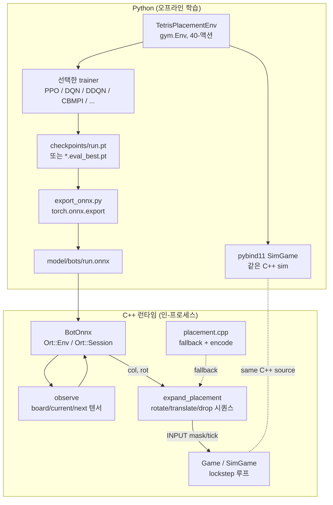
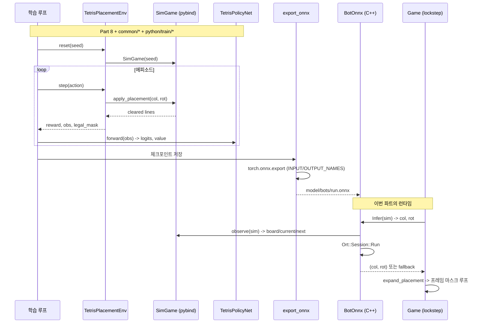
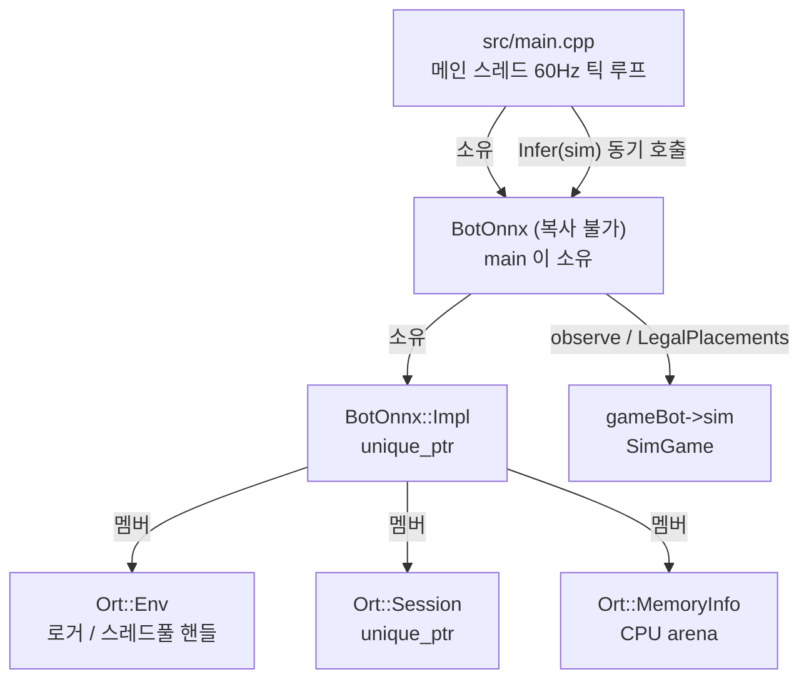
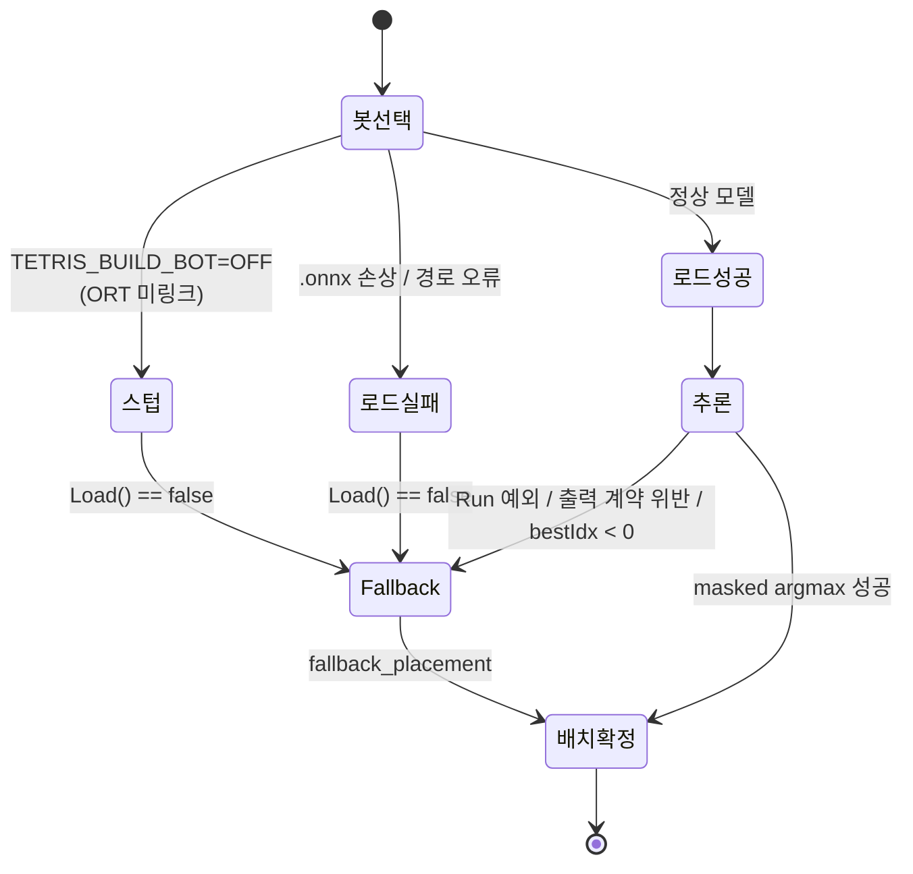
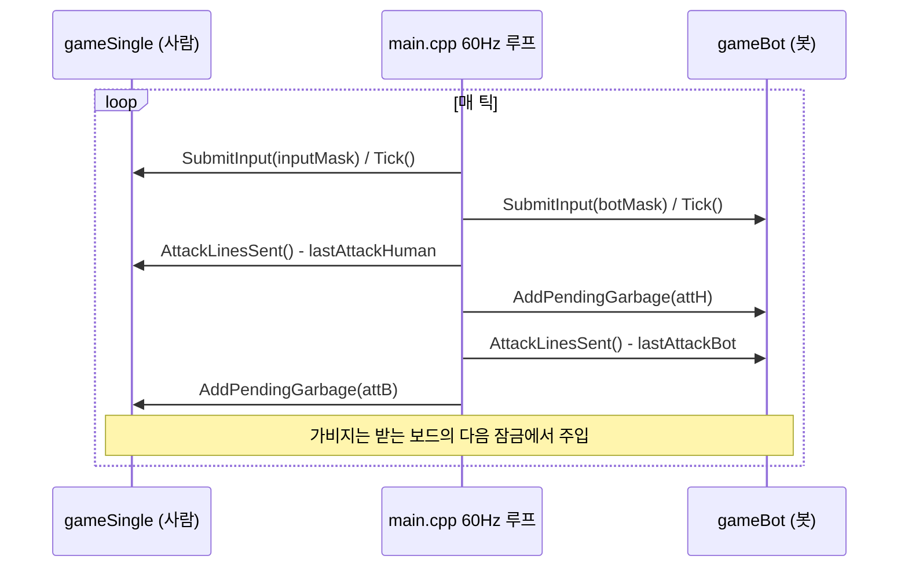
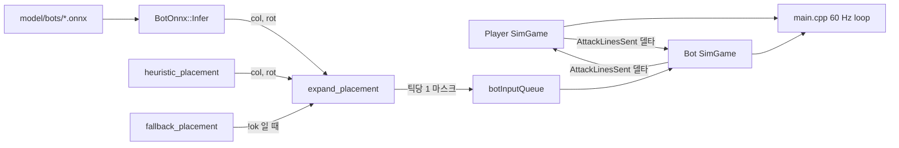

# Part 9: 강화학습과 ONNX 인-프로세스 봇

> **시리즈:** 제로부터 멀티플레이어 테트리스 + RL까지 [시리즈 목차](./README.md) · [이전: Part 8 — Python RL](./part8-python-rl.md) · **Part 9** · [다음: Part 10 — 메타와 랭킹](./part10-meta-and-ranking.md)

---

## 이 장의 구현 계약

- **선행 상태:** Part 8의 관측 schema(`build_observation`), 40-action 인코딩 (`encode_action`), `TetrisPolicyNet` 과 `load_checkpoint` 계약, `python/netbot/input_expander.py` 의 전개 규칙.
- **이번 장의 파일:** `python/netbot/export_onnx.py`, `bot/placement.h`, `bot/placement.cpp`, `bot/bot_onnx.h`, `bot/bot_onnx.cpp`, `model/bots/`, `model/bots.cfg`, `src/main.cpp` 의 봇 선택 화면과 `AppMode::BotSingle` 루프, `CMakeLists.txt` 의 `TETRIS_BUILD_BOT` 블록.
- **연결점:** 학습 정책을 ONNX로 내보내고 C++에서 같은 관측을 만들어 placement를 추론한 뒤, 인간 입력과 같은 `SubmitInput` 경로로 실행한다. 두 보드는 [Part 6](./part6-lockstep-networking.md) 의 네트워크 경로와 동일한 구조로 가비지를 교환한다.
- **완료 게이트:**
  1. ORT 없이 빌드한 클라이언트에서 `Single vs Bot` 메뉴가 열리고 `Heuristic (test)` 로 한 판이 진행된다.
  2. ORT 빌드에서 `.onnx` 를 선택했을 때 **봇 선택 화면에 로드 오류가 뜨지 않고** 게임이 시작된다. (오류가 있으면 그 자리에 문자열이 그려진다 — `수동 테스트` 의 시나리오 1)
  3. `.pt → .onnx` export 가 `[export_onnx] wrote ...` 를 출력한다.

## 1. 왜 학습된 정책인가

Part 8 에서 Python 쪽에 pybind11 바인딩과 Gym 환경을 깔았다. 그 바인딩 위에 학습 루프를 올려 정책망을 훈련하고, 그 결과 체크포인트를 실제 C++ 클라이언트가 **인-프로세스로** 실행하는 것이 이번 파트의 목표다.

### 1.1 휴리스틱의 천장

Part 8 이 만든 것은 평가 함수(`bcts_score`)와 그것을 쓰는 학습용 상대 (`GreedyBCTSOpponent`)까지다. 게임에 붙는 휴리스틱 봇 — `bot::heuristic_placement` — 은 **이 장에서 처음 만든다**(§11.2). 그 봇은 설정 없이도 제법 오래 버티지만 두 가지 한계가 명확하다.

1. **피처 엔지니어링의 상한.** 선형 평가 함수는 "좋은 보드" 를 사람이 정의한 것이다. §11.2 의 `eval_board` 가 쓰는 특성은 **총높이 · 삭제줄 · 구멍 · 요철(bumpiness) 네 개뿐**이다. T-spin, 다단 콤보, 백-투-백 테트리스 같은 공격 최적화는 이 네 숫자로 표현되지 않으므로 봇이 그런 수를 절대 찾지 않는다. §13.2 에서 보듯 `Single vs Bot` 은 두 보드가 실제로 가비지를 주고받는 구조라, 점수가 아니라 **공격량**이 승부를 가른다. 거기서 천장이 보인다.
2. **학습 가능성.** "다음 달에 보상 함수를 바꿔서 다시 훈련" 은 휴리스틱으로는 불가능하다. RL 은 그 반복 루프 자체를 프로젝트의 1급 시민으로 만든다.

참고로 이 평가 함수 계열의 이름은 BCTS 이며, 근거는 `python/common/features.py:3` 의 `These are the classic BCTS (Building Controllers for Tetris) features` 다 — Thiery & Scherrer(2009). Bertsekas-Tsitsiklis 계열의 근사 동적 계획법과는 다른 계보이며, 저장소 안에 그 귀속을 뒷받침하는 근거는 없다. 가중치 숫자의 출처가 저장소 안에서 갈린다는 점은 [Part 8](./part8-python-rl.md) 의 BCTS 가중치 절에 정리돼 있다.

### 1.2 왜 인-프로세스 추론인가

봇 실행 경로는 C++ 게임 내부의 인프로세스 추론으로 둔다. 이유는 명확하다.

- **왕복 비용.** 로컬 봇 대전에 소켓과 별도 프로세스를 둘 이유가 없다.
- **배포.** 최종 사용자 머신에 Python + PyTorch 스택을 깔게 하고 싶지 않다. 배포 런타임은 ONNX Runtime CPU bundle 과 `.onnx` 파일이면 충분하다.
- **지연.** placement 정책은 매 프레임 호출되지 않는다. 블록 하나당 한 번만 추론하면 되므로, 대상 머신에서 충분히 빠른지 로드/추론 smoke 로 확인하면 된다.

그래서 이번 파트는 두 축으로 간다. (1) Python에서 학습한 `TetrisPolicyNet`을 ONNX로 내보내는 길, (2) C++에서 그 `.onnx`를 읽어 placement를 뽑고 프레임 마스크 시퀀스로 펼쳐 `SimGame`에 넣는 길이다. 모델 로드 실패와 모델이 없는 환경을 위한 결정론적 fallback도 함께 둔다.

---

## 2. 전체 파이프라인

학습부터 게임 루프 진입까지 한 장에 모으면 이렇다.


```mermaid
graph TB
    subgraph Python["Python (오프라인 학습)"]
        Env[TetrisPlacementEnv<br/>gym.Env, 40-액션]
        Sim[pybind11 SimGame<br/>같은 C++ sim]
        Train[선택한 trainer<br/>PPO / DQN / DDQN / CBMPI / ...]
        Ckpt[checkpoints/run.pt<br/>또는 *.eval_best.pt]
        Export[export_onnx.py<br/>torch.onnx.export]
        Onnx[model/bots/run.onnx]

        Env --> Sim
        Env --> Train
        Train --> Ckpt
        Ckpt --> Export
        Export --> Onnx
    end

    subgraph Cpp["C++ 런타임 (인-프로세스)"]
        BotOnnx[BotOnnx<br/>Ort::Env / Ort::Session]
        Observe[observe<br/>board/current/next 텐서]
        Place[placement.cpp<br/>fallback + encode]
        Expand[expand_placement<br/>rotate/translate/drop 시퀀스]
        Game[Game / SimGame<br/>lockstep 루프]

        Onnx --> BotOnnx
        BotOnnx --> Observe
        Observe --> BotOnnx
        BotOnnx -->|col, rot| Expand
        Place -.fallback.-> Expand
        Expand -->|INPUT mask/tick| Game
    end

    Sim -.same C++ source.- Game
```

핵심은 `SimGame` 이 **양쪽에서 동일한 C++ 소스** 를 공유한다는 점이다. Python 이 pybind11 을 통해 실행하는 sim 과 C++ 런타임이 실행하는 sim 은 결정론적으로 같은 상태 해시를 만든다 ([Part 1](./part1-deterministic-simulation.md) 의 FNV-1a `StateHash` 계약). 그래서 학습 쪽에서 본 보드 레이아웃과 실행 쪽에서 본 레이아웃은 비트 단위로 일치한다. 이 계약이 무너지면 훈련된 정책이 실전에서 엉뚱한 placement 를 뽑는다 — 관측 분포가 바뀌는 "sim-to-real" 격차가 0 이어야 한다.

데이터 흐름을 다시 한 번 정리하면:


```mermaid
sequenceDiagram
    participant L as 학습 루프
    participant E as TetrisPlacementEnv
    participant S as SimGame (pybind)
    participant N as TetrisPolicyNet
    participant X as export_onnx
    participant B as BotOnnx (C++)
    participant G as Game (lockstep)

    Note over L,N: Part 8 + common/* + python/train/*
    L->>E: reset(seed)
    E->>S: SimGame(seed)
    loop 에피소드
        L->>E: step(action)
        E->>S: apply_placement(col, rot)
        S-->>E: cleared lines
        E-->>L: reward, obs, legal_mask
        L->>N: forward(obs) -> logits, value
    end
    L->>X: 체크포인트 저장
    X->>X: torch.onnx.export (INPUT/OUTPUT_NAMES)
    X-->>B: model/bots/run.onnx

    Note over B,G: 이번 파트의 런타임
    G->>B: Infer(sim) -> col, rot
    B->>S: observe(sim) -> board/current/next
    B->>B: Ort::Session::Run
    B-->>G: (col, rot) 또는 fallback
    G->>G: expand_placement -> 프레임 마스크 루프
```

두 다이어그램의 공통된 축은 **동일한 관측 규약·동일한 액션 인코딩**이다. Python의 `common/obs.py::build_observation`과 C++의 `bot/placement.cpp::observe`가 같은 텐서 schema를 구현하고, 양쪽 action 인코딩이 같은 40-action 수식을 쓴다. 현재 관측 tensor를 Python/C++에서 직접 대조하는 자동 테스트는 없으므로 schema를 바꿀 때 두 구현과 ONNX smoke를 함께 갱신해야 한다.

---

## 3. 런타임의 관측 · 행동 · 보상 계약

### 3.1 관측

`TetrisPolicyNet` 의 입력은 세 개의 텐서다 (배치 차원 B 는 학습 때만 의미 있음, 런타임은 B=1 고정).

| 이름 | 모양 | dtype | 내용 |
|------|------|-------|------|
| `board` | `(B, 1, 20, 10)` | float32 | 잠긴(locked) 셀 점유 여부, 0 또는 1 |
| `current` | `(B, 7)` | float32 | 현재 피스 id 의 one-hot |
| `next` | `(B, 7)` | float32 | preview 큐 첫 번째 다음 피스 id 의 one-hot |

`board` 에서 **떨어지는 피스와 고스트는 제외**한다. 정책이 추론할 대상은 "커밋된 보드 상태 + 이번에 내려줄 피스" 이지 화면에 보이는 시각 요소가 아니다. 고스트 블록의 cell id 값은 8 이라 `(v > 0) && (v != 8)` 로 방어적으로 걸러낸다.

**현재 소스 발췌 — `python/common/obs.py:36-56`**

```python
def build_observation(sim: "SimGame") -> dict[str, torch.Tensor]:
    """Convert a ``SimGame`` snapshot into the dict consumed by ``TetrisPolicyNet``.

    Returns un-batched tensors. Add a leading batch dim with ``unsqueeze(0)``
    before passing to the network — done at the call site so that batched
    rollouts and single-step inference share this builder.
    """
    import torch

    raw = np.asarray(sim.grid(), dtype=np.float32)  # (20, 10)
    occupied = ((raw > 0) & (raw != 8)).astype(np.float32)
    board = occupied[None, :, :]  # (1, 20, 10)

    current = _piece_one_hot(sim.current_block_id())
    nxt = _piece_one_hot(sim.next_block_id())

    return {
        "board": torch.from_numpy(board),
        "current": torch.from_numpy(current),
        "next": torch.from_numpy(nxt),
    }
```

C++ 쪽 `observe` 가 같은 결과를 만든다.

**현재 소스 발췌 — `bot/placement.cpp:56-81`**

```cpp
void observe(const SimGame& sim,
             float* board_out,
             float* current_out,
             float* next_out)
{
    // 굳은 블록만 1로 친다. ghost(8)는 화면에만 있는 것이라 0이다.
    // python/common/obs.py의 (grid > 0) & (grid != 8)과 같은 조건이다.
    const auto& grid = sim.Grid();
    for (int r = 0; r < kBoardRows; ++r) {
        for (int c = 0; c < kBoardCols; ++c) {
            int v = grid[r][c];
            board_out[r * kBoardCols + c] = (v > 0 && v != 8) ? 1.0f : 0.0f;
        }
    }

    // one-hot. 블록 ID는 1부터 시작하므로 인덱스는 하나씩 당긴다.
    // 범위 밖 ID가 들어오면 전부 0인 벡터가 되는데, 이는 정상 상황이 아니다.
    for (int i = 0; i < kNumPieceTypes; ++i) {
        current_out[i] = 0.0f;
        next_out[i]    = 0.0f;
    }
    int cid = sim.CurrentBlockId();
    int nid = sim.NextBlockId();
    if (cid >= 1 && cid <= kNumPieceTypes) current_out[cid - 1] = 1.0f;
    if (nid >= 1 && nid <= kNumPieceTypes) next_out[nid - 1]    = 1.0f;
}
```

두 구현은 서로 다른 언어지만 **같은 조건식** (`v > 0 && v != 8`) 을 쓴다. 이 한 줄이 학습-실행 격차의 최후 방어선이다. C++ 쪽 주석이 Python 파일 경로를 직접 가리키고 있다는 점도 의도적이다 — 한쪽을 고칠 때 다른 쪽을 찾아갈 수 있어야 한다.

### 3.2 행동 공간

placement-level 이다. 한 피스당 가능한 놓임새를 `(col, rot)` 쌍으로 본다. `col ∈ [0, 10)`, `rot ∈ [0, 4)`, 총 40 개. 로테이션 수가 피스 종류에 따라 실질적 다양성이 달라지지만 공간은 항상 40 으로 고정하고, 합법 마스크로 유효 동작만 통과시킨다.

**현재 소스 발췌 — `python/common/action_mask.py:25-47`**

```python
def encode_action(col: int, rot: int) -> int:
    """Map a ``(col, rot)`` placement to a flat action index in ``[0, 40)``."""
    return col * NUM_ROTATIONS + rot


def decode_action(action: int) -> tuple[int, int]:
    """Inverse of :func:`encode_action`."""
    return action // NUM_ROTATIONS, action % NUM_ROTATIONS


def legal_mask(sim: "SimGame") -> torch.Tensor:
    """Boolean tensor of shape ``(NUM_PLACEMENTS,)``.

    ``True`` at index ``encode_action(col, rot)`` iff that placement is in
    ``sim.legal_placements()``. The result lives on CPU; move to the policy
    device at the call site.
    """
    import torch

    mask = torch.zeros(NUM_PLACEMENTS, dtype=torch.bool)
    for placement in sim.legal_placements():
        mask[encode_action(placement.col, placement.rot)] = True
    return mask
```

placement-level 을 택한 이유와 그 대가(중력 타이밍·T-spin·tuck 배치를 표현할 수 없다)는 [Part 8](./part8-python-rl.md) 의 행동 공간 절에서 다뤘다. 여기서 다시 짚을 것은 하나다 — **`col * 4 + rot` 이 C++ `bot/placement.h::encode_action` 과 같아야 한다.** 이 대칭성이 없으면 정책이 뽑은 인덱스가 런타임에서 다른 배치로 해독된다.

### 3.3 보상

env 보상은 최소한으로 뽑았다: **라인 클리어 수**.

**현재 소스 발췌 — `python/common/env.py:101-115`**

```python
        col, rot = decode_action(int(action))
        cleared = self.sim.apply_placement(col, rot)

        if cleared < 0:
            # 불법 수가 오면 판을 건드리지 않고 보상 0만 돌려준다.
            # legal_mask를 제대로 쓰면 여기 올 일이 없지만, 마스킹을 빠뜨린
            # 학습 코드가 조용히 이상한 상태로 가는 것보다는 낫다.
            reward = 0.0
            terminated = self.sim.game_over()
        else:
            reward = float(cleared)
            terminated = self.sim.game_over()

        truncated = False
        return self._observation(), reward, terminated, truncated, self._info()
```

`apply_placement` 가 -1 을 돌려주면 불법 placement 다. 환경은 sim 을 진행시키지 않고 0 보상을 돌려주지만, 정상적인 정책은 마스크 덕분에 거기에 도달하지 않는다. 방어적 코드일 뿐이다.

보상을 단순하게 둔 이유는 **피처 엔지니어링을 보상 엔지니어링으로 옮기는 함정**을 피하기 위함이다. 다만 그 희박함이 학습 초기에 실제로 문제가 되므로, PPO 학습기는 env 밖에서 dense shaping 을 더하는 절충을 택했다 ([Part 8](./part8-python-rl.md) 의 `shaping_reward`). 그리고 가비지 교환까지 보상에 넣고 싶으면 `common/env_versus.py::TetrisVersusEnv` 가 그 형태를 이미 갖고 있다 — §13.2 의 C++ 배선을 그대로 미러링한 환경이다.

---

## 4. pybind11 바인딩

학습 전체가 이 한 파일에 의존한다. 전문을 인용한다.

**현재 소스 발췌 — `bindings/tetris_py.cpp:1-173`**

```cpp
// SimGame을 Python에서 쓰기 위한 pybind11 binding.
//
// 게임 규칙을 Python으로 다시 구현하지 않고 C++ SimGame을 그대로 노출한다.
// 학습할 때와 실제로 플레이할 때의 규칙이 갈라지면 sim-to-real gap이 생기는데,
// 구현이 하나뿐이면 그 문제가 아예 없다.
//
// 두 가지 방식의 API를 제공한다.
//   - placement 단위: RL 학습용. "몇 번 열에 몇 번 회전해서 떨어뜨릴지"를 한 번에 지정
//   - frame 단위: parity test용. 한 tick의 input mask를 그대로 적용해
//                 C++ lockstep 경로와 결과가 같은지 대조
//
// TETRIS_BUILD_PY=ON으로 빌드한다. 순수 시뮬레이션 소스만 링크하므로
// renderer나 audio 없이도 컴파일된다.
//
// 사용 예:
//   from sim import SimGame
//   g = SimGame(seed=42)
//   for p in g.legal_placements():
//       print(p.col, p.rot)
//   g.apply_placement(4, 0)
//   arr = g.grid()                # (20, 10) int32 NumPy 배열 (복사본)
//   h   = g.state_hash()          # C++ SimGame::StateHash()와 비트 단위로 동일
//
// 아래 docstring들은 Python 쪽 help()에 그대로 노출되므로 영어로 둔다.

#include <pybind11/pybind11.h>
#include <pybind11/stl.h>
#include <pybind11/numpy.h>

#include "../src/sim_game.h"
#include "../src/sim_grid.h"
#include "../src/sim_block.h"

namespace py = pybind11;

PYBIND11_MODULE(tetris_py, m)
{
    m.doc() = "Headless Tetris simulation (pybind11 wrapper around SimGame)";

    // 한 번의 착수를 나타내는 (column, rotation) 쌍.
    py::class_<SimGame::Placement>(m, "Placement")
        .def_readonly("col", &SimGame::Placement::col)
        .def_readonly("rot", &SimGame::Placement::rot)
        .def("__repr__", [](const SimGame::Placement& p) {
            return "Placement(col=" + std::to_string(p.col) +
                   ", rot=" + std::to_string(p.rot) + ")";
        });

    // 관측용으로만 노출하는 테트로미노. Python 쪽에서 수정할 수 없다.
    py::class_<SimBlock>(m, "SimBlock")
        .def_readonly("id",             &SimBlock::id)
        .def_readonly("rotation_state", &SimBlock::rotationState)
        .def_readonly("row_offset",     &SimBlock::rowOffset)
        .def_readonly("column_offset",  &SimBlock::columnOffset)
        .def("cell_positions", [](const SimBlock& b) {
            // 현재 rotation 상태에서 이 블록이 차지하는 4칸의 절대 좌표.
            auto tiles = b.GetCellPositions();
            py::list out;
            for (const auto& t : tiles)
            {
                out.append(py::make_tuple(t.row, t.column));
            }
            return out;
        });

    // 시뮬레이션 본체.
    py::class_<SimGame>(m, "SimGame")
        .def(py::init<uint64_t>(), py::arg("seed") = 0,
             "Construct a new headless Tetris sim. seed=0 uses a fixed default "
             "so that unseeded runs are still deterministic across platforms.")

        // --- placement 단위 API (RL 학습용) ---
        // 중력을 기다리지 않고 한 수를 통째로 두므로 학습 한 스텝이 곧 한 착수다.
        .def("legal_placements", &SimGame::LegalPlacements,
             "Enumerate all legal (col, rot) placements for the current piece "
             "via rotate-then-translate-then-hard-drop. Returns a list of "
             "Placement objects.")
        .def("apply_placement", &SimGame::ApplyPlacement,
             py::arg("col"), py::arg("rot"),
             "Apply a placement atomically (rotate -> translate -> hard drop -> "
             "lock). Returns the number of lines cleared, or -1 if the placement "
             "is illegal.")
        .def("clone", [](const SimGame& g) {
            return SimGame(g);
        }, "Return a deep copy of the full deterministic sim state.")

        // --- 공격/garbage API (2인 대전 환경용) ---
        // attack_lines_sent()는 누적값이라 그 자체로는 쓸 일이 없다.
        // apply_placement() 앞뒤로 읽어 그 차이를 상대 보드의
        // add_pending_garbage()에 넘기는 식으로 공격을 전달한다.
        // 쌓인 garbage는 받는 보드가 다음 블록을 lock하는 순간 바닥에서 올라온다.
        .def("attack_lines_sent", &SimGame::AttackLinesSent,
             "Cumulative attack lines this board has sent (monotonic). Take the "
             "delta across a placement to get the attack from that placement.")
        .def("pending_garbage", &SimGame::PendingGarbage,
             "Garbage rows queued to be injected on this board's next lock.")
        .def("add_pending_garbage", &SimGame::AddPendingGarbage, py::arg("rows"),
             "Queue `rows` garbage lines onto this board (injected on next lock). "
             "Negative/zero is ignored. Used to route an opponent's attack.")
        .def("last_lines_cleared", [](const SimGame& g) { return g.lastLinesCleared; },
             "Lines cleared by the most recent lock (0..4). Useful for reward.")
        .def("last_garbage_received", [](const SimGame& g) { return g.lastGarbageReceived; },
             "Garbage rows actually injected at the most recent lock.")
        .def("total_lines_cleared", [](const SimGame& g) { return g.totalLinesCleared; },
             "Cumulative lines cleared this game.")
        .def("level", [](const SimGame& g) { return g.level; },
             "Current gravity/speed level (1..20, +1 per 10 lines).")

        // --- frame 단위 API (lockstep parity test용) ---
        // 실제 게임 클라이언트와 같은 경로다. 학습에는 쓰지 않는다.
        .def("submit_input", &SimGame::SubmitInput, py::arg("input_mask"),
             "Apply a one-tick input bitmask (see core/input.h). Retained for "
             "frame-level parity/equivalence tests against the lockstep loop.")
        .def("tick", &SimGame::Tick,
             "Advance the gravity counter by one tick. Time-only progression "
             "separate from input.")
        .def("move_block_down", &SimGame::MoveBlockDown,
             "Single-step the current piece down by one row (locks on contact).")

        // --- 관측 ---
        .def("grid", [](const SimGame& g) {
            // 내부 버퍼를 참조로 넘기지 않고 복사한다.
            // 참조를 넘기면 다음 착수 때 Python이 들고 있던 배열의 내용이
            // 조용히 바뀌어, replay buffer에 쌓아둔 관측이 전부 오염된다.
            // 200개짜리 복사는 학습 속도에 영향을 주지 않는다.
            const auto& raw = g.Grid();
            auto arr = py::array_t<int32_t>({SimGrid::kRows, SimGrid::kCols});
            auto buf = arr.mutable_unchecked<2>();
            for (int r = 0; r < SimGrid::kRows; ++r)
                for (int c = 0; c < SimGrid::kCols; ++c)
                    buf(r, c) = raw[r][c];
            return arr;
        }, "Return the 20x10 grid as a numpy int32 array (copied).")

        .def("current_block",
             &SimGame::CurrentBlock,
             py::return_value_policy::reference_internal,
             "Current falling piece.")
        .def("ghost_block",
             &SimGame::GhostBlock,
             py::return_value_policy::reference_internal,
             "Ghost/preview piece at the hard-drop target.")
        .def("next_block",
             [](const SimGame& g) { return g.NextBlock(); },
             "Copy of the first piece in the preview queue.")
        .def("next_block_ids", [](const SimGame& g) {
            std::vector<int> ids;
            const auto& next = g.NextBlocks();
            ids.reserve(next.size());
            for (const SimBlock& block : next) ids.push_back(block.id);
            return ids;
        }, "Piece ids in the visible next preview queue.")

        .def("current_block_id", &SimGame::CurrentBlockId)
        .def("current_rotation", &SimGame::CurrentRotation)
        .def("current_row",      &SimGame::CurrentRow)
        .def("current_col",      &SimGame::CurrentCol)
        .def("next_block_id",    &SimGame::NextBlockId)
        .def("score",            &SimGame::Score)
        .def("game_over",        &SimGame::IsGameOver)

        // --- 결정성 검증용 ---
        .def("state_hash", &SimGame::StateHash,
             "FNV-1a 64-bit hash of the full sim state. Bitwise-identical to "
             "Game::ComputeStateHash() — this is the gate the determinism "
             "regression test checks.")
        .def("rng_state", &SimGame::RngState,
             "Raw XorShift64* RNG state (for debugging cross-platform drift).")

        // 관측 벡터 크기를 Python 쪽에서 하드코딩하지 않도록 노출한다.
        .def_property_readonly_static("ROWS", [](py::object) { return SimGrid::kRows; })
        .def_property_readonly_static("COLS", [](py::object) { return SimGrid::kCols; });
}
```

바인딩 설계 원칙 몇 가지.

**두 API를 동시에 제공한다.** `apply_placement`는 학습용(한 번의 호출이 rotate → translate → hard-drop → lock까지 원자적으로 실행)이고, `submit_input`과 `tick`은 C++ lockstep 경로와 프레임 단위 동등성을 검증하는 API다. 인게임 봇은 `SimGame`에 같은 프레임 입력을 넣는다.

**`grid()` 는 항상 복사한다.** 파일 상단 usage 주석의 `# numpy (20, 10) int32 copy` 와 `grid()` 람다 안의 `We COPY the buffer` 가 같은 사실을 두 번 말한다. 200 개 int 복사는 훈련 throughput 에 거의 영향이 없고, "Python 이 numpy 배열을 쥐고 있는데 SimGame 이 그 아래에서 mutate 해서 다음 프레임에 다른 값이 보인다" 는 미묘한 버그를 완전히 봉쇄한다. `return_value_policy::reference_internal` 은 `current_block`/`ghost_block` 처럼 멤버 수명이 안정적인 조회에만 쓴다. `next_block` 은 preview 큐 원소라 큐 갱신 때 참조가 무효화될 수 있어 복사로 반환한다.

**전투/가비지 API 일곱 개가 2-보드 구성의 토대다.** 이 블록은 이 장의 §13.2 (`src/main.cpp` 의 `Single vs Bot` 가비지 교환)와 `python/common/env_versus.py`(2-보드 RL 환경)가 **공통으로 올라타는 배선**이다. `attack_lines_sent()` 가 누적 총계라서 양쪽 모두 "배치 전후 차분" 이라는 같은 패턴을 쓰고, `add_pending_garbage()` 로 상대 보드에 라우팅하고, 실제 주입은 받는 보드의 다음 잠금에서 일어난다. C++ 게임과 Python 학습 환경이 같은 함수 호출 순서를 갖는 것이 이 API 설계의 목적이다.

**`state_hash()` 를 노출한다.** [Part 1](./part1-deterministic-simulation.md) 의 FNV-1a 해시를 Python 에서 바로 찍어볼 수 있다. `test_determinism_crossplatform.py` 같은 테스트가 여기를 통해 Python 런과 C++ 런의 상태가 틱 단위로 일치하는지 검증한다.

**`clone()` 은 전체 deterministic state 의 값 복사다.** CBMPI-style policy improvement 는 현재 상태에서 합법 placement 를 하나씩 가정 적용해 후속 보드를 평가한다. 원본 `SimGame` 을 건드리면 rollout 이 망가지므로, `clone()` 으로 branch 를 만든 뒤 `apply_placement()` 를 호출한다. Colab 에서 `AttributeError: 'tetris_py.SimGame' object has no attribute 'clone'` 가 나오면 최신 소스를 pull 한 뒤 `build/` 와 `python/sim/tetris_py*.so` 를 지우고 네이티브 모듈을 다시 빌드해야 한다. 이 의존이 알고리즘별로 갈린다는 점은 §7 의 비교 표에서 다시 다룬다.

**`seed=0` 이 deterministic default.** Gym env 가 `TetrisPlacementEnv(seed=0)` 으로 초기화해도 플랫폼 간 동일한 피스 시퀀스를 받는다.

이 바인딩이 완성되면, Python 에서 이렇게 쓸 수 있다.

**예시**

```python
from sim import SimGame

g = SimGame(seed=42)
print(g.legal_placements())        # [Placement(col=3, rot=0), ...]
g.apply_placement(4, 2)            # 내려놓고 라인 카운트 반환
print(g.current_block_id())        # 1..7
print(g.grid().shape)              # (20, 10)
print(hex(g.state_hash()))         # 0x...
```

---

## 5. 정책 네트워크

`common/models.py` 의 `TetrisPolicyNet`. 학습 파이프라인의 심장이지만 이번 파트의 주제는 아니므로 forward 계약만 본다.

**현재 소스 발췌 — `python/common/models.py:22-41`**

```python
class TetrisPolicyNet(nn.Module):
    """Shared trunk + policy/value heads.

    Input contract (matches ``common.obs.build_observation``)::

        board   : (B, 1, 20, 10) float32, occupancy in {0.0, 1.0}
        current : (B, 7) float32, one-hot of current piece id - 1
        next    : (B, 7) float32, one-hot of next piece id - 1

    Output::

        policy_logits : (B, 40) float32 — over (col * 4 + rot) placements
        value         : (B,)    float32 — scalar state value

    Bump ``ARCH_VERSION`` whenever any of the above shapes, the layer stack, or
    the layer ordering changes. The checkpoint loader treats a version mismatch
    as a hard failure.
    """

    ARCH_VERSION = 1
```

**현재 소스 발췌 — `python/common/models.py:81-95`**

```python
    def forward(
        self,
        board: torch.Tensor,
        current: torch.Tensor,
        next: torch.Tensor,  # noqa: A002 - matches obs key name
    ) -> tuple[torch.Tensor, torch.Tensor]:
        if board.dim() == 3:
            board = board.unsqueeze(1)  # (B, 20, 10) -> (B, 1, 20, 10)
        h = self.trunk(board)
        h = h.flatten(1)
        h = torch.cat([h, current, next], dim=-1)
        h = self.fuse(h)
        policy_logits = self.policy_head(h)
        value = self.value_head(h).squeeze(-1)
        return policy_logits, value
```

구조 자체는 평범하다. `(20, 10)` 보드를 3-레이어 conv (32→64→64) 로 지나가고 flatten, 거기에 `current`/`next` one-hot 을 concat 해서 2-레이어 MLP 로 올린 뒤 policy(40) 와 value(1) 두 헤드. conv 는 "옆 열이 얼마나 높은지" 같은 지역 패턴을 잡고 MLP 는 전체 보드 요약을 만든다.

**forward 가 인자 세 개를 순서대로 받는다** 는 점이 §6 에서 중요해진다. `torch.onnx.export` 는 이 시그니처 순서대로 dummy 입력을 넘기고, 그 순서가 `INPUT_NAMES` 와 맞아야 ONNX 그래프의 입력 이름이 옳게 붙는다.

`ARCH_VERSION = 1` 은 `common/checkpoint.py::load_checkpoint` 가 검증해서, 구조가 바뀌면 체크포인트 로드를 **하드 실패** 시킨다. `export_onnx` 도 그 로더를 쓰므로 (§6), 잘못된 체크포인트가 ONNX 로 나가는 경로 자체가 막혀 있다.

학습 시 마스킹에 쓰는 `masked_log_softmax` 도 같은 파일에 있다.

**현재 소스 발췌 — `python/common/models.py:98-107`**

```python
def masked_log_softmax(
    logits: torch.Tensor, mask: torch.Tensor, eps: float = 1e-9
) -> torch.Tensor:
    """Apply a boolean legal-action ``mask`` to ``logits`` then log-softmax.

    Setting illegal logits to ``-inf`` makes their softmax probability zero,
    so sampling and ``argmax`` only ever pick legal placements.
    """
    masked = logits.masked_fill(~mask, float("-inf"))
    return F.log_softmax(masked + eps, dim=-1)
```

학습 시의 마스킹은 확률 0, 런타임 C++ 에서의 마스킹은 argmax 에서 제외(§10.3) — 둘 다 "불법 placement 를 절대 고르지 않는다" 는 동일한 규약이다. 이 마스킹은 **ONNX 그래프 안에 들어가지 않는다.** 모델은 40개 raw logit 만 내놓고, 마스킹은 양쪽 호출자가 각자 한다.

---

## 6. ONNX 내보내기

체크포인트(`.pt`)는 PyTorch 포맷이다. 이걸 ONNX 그래프로 변환해야 C++ 런타임이 읽을 수 있다. `INPUT_NAMES`/`OUTPUT_NAMES` 상수와 `torch.onnx.export` 호출이 한 맥락에서 보여야 하므로 파일 전문을 인용한다.

**현재 소스 발췌 — `python/netbot/export_onnx.py:1-114`**

```python
"""Convert a trained TetrisPolicyNet checkpoint to ONNX for the C++ netbot.

The C++ runtime uses onnxruntime (see ``bot/bot_onnx.cpp``) rather than libtorch
or a Python subprocess. Training/export can stay in Colab; deployment only
needs the exported ONNX file and the ONNX Runtime CPU bundle.

Input/output names are load-bearing: ``bot/bot_onnx.cpp`` looks them up by
string. If you rename one here, the C++ side must change in lockstep (and the
existing ``model/*.onnx`` / ``model/bots/*.onnx`` bundles must be re-exported).

Usage::

    uv run --directory python python -m netbot.export_onnx \\
        checkpoints/run42/step_2000000.pt \\
        ../model/bots/run42.onnx
"""

from __future__ import annotations

import argparse
import inspect
from pathlib import Path

try:
    import torch
except ImportError as exc:  # pragma: no cover - depends on optional local env
    raise SystemExit(
        "export_onnx requires PyTorch. Run this in Colab, or install the "
        "optional export dependencies (`uv sync --extra export`)."
    ) from exc

from common import BOARD_COLS, BOARD_ROWS, NUM_PIECE_TYPES
from common.checkpoint import load_checkpoint
from common.models import TetrisPolicyNet


# bot/bot_onnx.cpp의 inputNames / outputNames와 한 글자도 달라선 안 된다.
# 여기가 어긋나면 모델은 로드되고 추론에서 터진다.
INPUT_NAMES = ["board", "current", "next"]
OUTPUT_NAMES = ["policy_logits", "value"]


def export(ckpt_path: str | Path, out_path: str | Path, opset: int = 17) -> None:
    """Load ``ckpt_path`` (a TetrisPolicyNet .pt) and write an ONNX graph to
    ``out_path``.

    Batch size is fixed at 1 — the C++ netbot only ever runs single-step
    inference on one SimGame at a time. If a training-side consumer ever needs
    batched ONNX inference, add ``dynamic_axes={"board": {0: "batch"}, ...}``.
    """
    ckpt_path = Path(ckpt_path)
    out_path = Path(out_path)
    if not ckpt_path.exists():
        raise FileNotFoundError(f"checkpoint not found: {ckpt_path}")
    out_path.parent.mkdir(parents=True, exist_ok=True)

    model = load_checkpoint(ckpt_path, device="cpu")
    model.eval()

    # export할 때 넘기는 예제 입력. shape만 맞으면 되고 값은 의미 없다.
    # common.obs.build_observation의 출력에 batch 차원 하나를 더한 모양이다.
    dummy_board = torch.zeros(1, 1, BOARD_ROWS, BOARD_COLS, dtype=torch.float32)
    dummy_current = torch.zeros(1, NUM_PIECE_TYPES, dtype=torch.float32)
    dummy_next = torch.zeros(1, NUM_PIECE_TYPES, dtype=torch.float32)

    kwargs = {
        "input_names": INPUT_NAMES,
        "output_names": OUTPUT_NAMES,
        "opset_version": opset,
        "dynamic_axes": None,
        "do_constant_folding": True,
    }
    if "dynamo" in inspect.signature(torch.onnx.export).parameters:
        # 구형 exporter를 명시적으로 쓴다. 최신 PyTorch가 기본으로 삼는
        # dynamo exporter는 onnxscript를 따로 요구하는데, Colab에는 onnx만
        # 깔려 있는 경우가 많아 export가 그냥 실패한다.
        # 이 정도 크기의 conv + linear 모델에는 구형 경로로 충분하다.
        kwargs["dynamo"] = False

    print(f"[export_onnx] torch {torch.__version__}, opset {opset}")
    try:
        torch.onnx.export(
            model,
            (dummy_board, dummy_current, dummy_next),
            str(out_path),
            **kwargs,
        )
    except Exception as exc:
        message = str(exc)
        if (
            "Module onnx is not installed" in message
            or "No module named 'onnx'" in message
            or "No module named 'onnxscript'" in message
        ):
            raise SystemExit(
                "ONNX export dependency is missing. In Colab, run the setup "
                "cell again so `pip install -r python/requirements-colab.txt` "
                "installs onnx/onnxscript, then rerun this export cell."
            ) from exc
        raise
    print(f"[export_onnx] wrote {out_path} from {ckpt_path}")


def main() -> None:
    ap = argparse.ArgumentParser(description=__doc__, formatter_class=argparse.RawDescriptionHelpFormatter)
    ap.add_argument("ckpt", help="path to trained .pt checkpoint (TetrisPolicyNet)")
    ap.add_argument("out",  help="output .onnx path (e.g. ../model/bots/run42.onnx)")
    ap.add_argument("--opset", type=int, default=17, help="ONNX opset (default: 17)")
    args = ap.parse_args()
    export(args.ckpt, args.out, args.opset)


if __name__ == "__main__":
    main()
```

### 6.1 load-bearing 상수 두 개

**예시**

```python
INPUT_NAMES = ["board", "current", "next"]
OUTPUT_NAMES = ["policy_logits", "value"]
```

ONNX 그래프는 텐서 이름으로 식별된다. `torch.onnx.export` 가 이 이름들을 graph node 에 박아넣고, `onnxruntime` 의 `Session::Run` 호출은 정확히 같은 문자열로 입출력을 끼워 맞춘다. C++ 쪽에 같은 배열이 다시 등장한다.

**현재 소스 발췌 — `bot/bot_onnx.cpp:36-37`**

```cpp
    std::array<const char*, 3> inputNames  = {"board", "current", "next"};
    std::array<const char*, 2> outputNames = {"policy_logits", "value"};
```

Python 에서 `"next"` 를 `"next_piece"` 로 바꿨는데 C++ 을 안 고치면 `Run` 이 "input not found" 로 던진다. 모델은 로드되지만 추론은 불가능한 상태가 된다. 그래서 두 배열은 **커밋 단위로 동기화** 되어야 하며, 변경 시 기존 `model/*.onnx` / `model/bots/*.onnx` 번들은 모두 재-export 가 필요하다. 파일 상단 docstring 이 `Input/output names are load-bearing` 이라고 이 계약을 명시한다.

### 6.2 옵션 선택

**Batch size = 1 고정.** `dynamic_axes=None` 이라서 export 된 그래프의 첫 축은 상수 1 이다. 런타임이 단일-스텝 추론만 하기 때문에 충분하고, ONNX 최적화가 고정 shape 에서 더 공격적이다 (상수 접힘, 메모리 사전할당). 나중에 학습 측에서 배치 추론이 필요하면 `dynamic_axes={"board": {0: "batch"}, ...}` 로 풀면 된다.

**opset 17.** `--opset 17` 이 기본값이며 ONNX Runtime 이 폭넓게 지원하는 버전이다. 너무 낮으면 최근 op 가 폴리필로 풀려서 그래프가 비대해지고, 너무 높으면 이전 ORT 릴리스가 못 읽는다.

**`do_constant_folding=True`.** conv 레이어의 bias, fuse 레이어의 weight 상수 등을 export 타임에 미리 폴딩. 런타임 로드 시간과 추론 지연이 소폭 감소.

**`dynamo=False` 명시.** PyTorch 2.x 후반의 새 ONNX exporter 는 `onnxscript` 같은 추가 의존성에 민감하다. 이 프로젝트의 정책망은 단순한 conv/linear 그래프라 legacy exporter 로 충분하므로, `torch.onnx.export` 시그니처에 `dynamo` 인자가 **있을 때만** `False` 로 고정한다 — `inspect.signature` 로 검사하는 이유는 인자가 없는 구버전 PyTorch 에서 `TypeError` 가 나지 않게 하기 위함이다.

**`model.eval()`.** dropout/batchnorm 을 추론 모드로 고정. `TetrisPolicyNet` 은 둘 다 쓰지 않지만 미래의 구조 변경에 대한 방어다.

**의존성 실패를 SystemExit 로 번역.** `torch.onnx.export` 가 `onnx`/`onnxscript` 미설치로 던지는 예외는 메시지가 길고 원인이 묻힌다. 세 가지 문자열 패턴을 잡아 "Colab setup 셀을 다시 돌려라" 로 바꾼다. Colab 사용자가 가장 자주 밟는 함정이다.

export 가 끝나면 `model/bots/<bot_name>.onnx` 파일이 남는다. C++ 런타임은 `model/*.onnx` 와 `model/bots/*.onnx` 를 스캔해 봇 로스터에 올린다(§13.3).

---

## 7. 학습 알고리즘 비교

`python/train/` 에는 7개 trainer 파일이 있고 노트북의 `ALGO` 값으로는 11가지를 고른다. 전부 같은 배포 계약을 지키지만 — **최종 산출물이 `TetrisPolicyNet` 체크포인트여야 한다** — 그 안에서 갈리는 지점이 있다.

| ALGO | 파일 | 계열 | 샘플 재사용 | `clone()` | 배포 체크포인트 |
|---|---|---|---|---|---|
| `ppo` | `ppo_tetris.py` | on-policy PG (actor-critic) | rollout 을 K epoch 재사용 | 불필요 | `*.eval_best.pt` |
| `ppo_sparse` | `ppo_tetris.py` | 위와 동일, `--shaping-coef 0` | 동일 | 불필요 | `*.eval_best.pt` |
| `dqn` | `dqn_tetris.py` | off-policy value (target max) | 리플레이 버퍼 | 불필요 | `*.eval_best.pt` |
| `ddqn` | `dqn_tetris.py` | off-policy value (Double DQN) | 리플레이 버퍼 | 불필요 | `*.eval_best.pt` |
| `cbmpi` | `cbmpi_tetris.py` | classification-based API | 상태 배치 재수집 | **필수** | `*.eval_best.pt` |
| `cbmpi_value` | `cbmpi_tetris.py` | 위 + value bootstrap (`--value-weight 0.25`) | 동일 | **필수** | `*.eval_best.pt` |
| `reinforce` | `policy_gradient_tetris.py` | 에피소드 MC PG + value baseline | 없음 (1회 사용) | 불필요 | `*.eval_best.pt` |
| `a2c` | `policy_gradient_tetris.py` | 동기 advantage actor-critic | 없음 | 불필요 | `*.eval_best.pt` |
| `nstep_ac` | `policy_gradient_tetris.py` | n-step actor-critic (짧은 rollout) | 없음 | 불필요 | `*.eval_best.pt` |
| `cem` | `cem_tetris.py` | derivative-free policy search | elite 에피소드만 | 불필요 | `*.eval_best.pt` |
| `muzero` | `muzero_tetris.py` | model-based + MCTS | 리플레이 + 학습된 dynamics | 불필요 | **`*.policy.pt`** |

두 열이 배포 파이프라인의 분기다. 굵게 표시한 두 칸을 놓치면 학습은 되는데 배포가 안 된다.

### 7.1 `clone()` 이 필요한 것은 CBMPI 뿐이다

CBMPI(Classification-Based Modified Policy Iteration)는 "현재 정책보다 나은 행동" 을 **실제 시뮬레이션으로** 만들어낸 다음, 그 행동을 지도학습으로 정책에 집어넣는다. 개선 단계가 진짜 후속 보드를 필요로 하므로 sim 을 분기해야 한다.

**현재 소스 발췌 — `python/train/cbmpi_tetris.py:1-17`**

```python
"""CBMPI-style trainer for the Tetris placement bot.

CBMPI (Classification-Based Modified Policy Iteration) alternates between:

1. policy improvement: score legal actions from the current state
2. policy fitting: train a classifier to imitate the improved action

For this project the improvement step uses real one-step ``SimGame`` clones,
then scores post-placement boards with BCTS features and an optional learned
value bootstrap. The fitted model is the canonical ``TetrisPolicyNet``, so the
saved checkpoint exports directly to ONNX.

Run from ``python/`` after the Colab setup notebook builds ``tetris_py``::

    python -m train.cbmpi_tetris --iterations 20 --out checkpoints/cbmpi.pt
    python -m netbot.export_onnx checkpoints/cbmpi.eval_best.pt ../model/cbmpi.onnx
"""
```

그리고 `clone` 이 없으면 즉시 명확한 예외를 던진다.

**현재 소스 발췌 — `python/train/cbmpi_tetris.py:46-52`**

```python
def _sim_clone(sim):
    if not hasattr(sim, "clone"):
        raise RuntimeError(
            "This CBMPI trainer requires SimGame.clone(). Rebuild tetris_py from "
            "the current repo in Colab with -DTETRIS_BUILD_PY=ON."
        )
    return sim.clone()
```

`hasattr` 검사가 있는 이유는 실무적이다 — Colab 세션에 **오래된 `python/sim/tetris_py*.so`** 가 남아 있는 경우가 흔하다. `clone` 은 나중에 추가된 바인딩이라, stale 모듈에서는 이 학습기만 골라서 죽는다. 진단 메시지가 없으면 `AttributeError` 만 보고 원인을 찾기 어렵다.

다른 알고리즘들은 왜 필요 없는가? PPO/A2C/REINFORCE/CEM 은 **실제로 둔 수의 결과**만 쓴다(on-policy). DQN 계열은 과거 transition 을 리플레이 버퍼에서 꺼내 쓰되 그것도 이미 일어난 전이다. MuZero 는 반대로 **학습된 dynamics 모델**로 가상 전개를 하므로 진짜 sim 분기가 필요 없다 — 그게 MuZero 의 요점이다.

### 7.2 MuZero 만 `.policy.pt` 를 거친다

MuZero-style trainer 는 representation / dynamics / prediction 세 네트워크를 가진 **다른 구조**를 학습한다. 그 native 체크포인트는 `TetrisPolicyNet` 이 아니므로 C++ ONNX 봇이 읽을 수 없다. 그래서 학습 뒤 distillation 단계가 MCTS 방문 분포를 정책망에 증류해 별도 파일로 저장한다.

**현재 소스 발췌 — `python/train/muzero_tetris.py:1-16`**

```python
"""MuZero-style trainer for the Tetris placement bot.

This is a compact MuZero-style baseline for Colab experimentation:

- representation: observation -> latent state
- dynamics: latent state + placement action -> next latent state + reward
- prediction: latent state -> policy logits + value
- self-play: root MCTS over legal placement actions

The native MuZero checkpoint is *not* deployable by the current C++ ONNX bot.
After training, this script distills the MCTS policy targets into the canonical
``TetrisPolicyNet`` and saves ``*.policy.pt``. Export that distilled policy:

    python -m train.muzero_tetris --episodes 200 --out checkpoints/muzero.pt
    python -m netbot.export_onnx checkpoints/muzero.policy.pt ../model/muzero.onnx
"""
```

즉 export 명령의 입력 파일이 다르다.

```bash
# 다른 모든 알고리즘
python -m netbot.export_onnx checkpoints/aria_ddqn.eval_best.pt ../model/bots/aria_ddqn.onnx

# MuZero-style 만
python -m netbot.export_onnx checkpoints/aria_muzero.policy.pt ../model/bots/aria_muzero.onnx
```

`aria_muzero.pt`(native)를 export 하려 하면 `load_checkpoint` 가 `arch_version` 또는 `class` 불일치로 `RuntimeError` 를 던진다 — Part 8 의 체크포인트 검증이 여기서 실제로 작동한다. **에러가 나는 것이 정상이고 올바른 동작이다.**

### 7.3 DQN 계열은 value head 를 버린다

`TetrisPolicyNet` 은 actor-critic 형태(policy head + value head)인데, DQN 은 Q-value 하나만 필요하다. 이 프로젝트는 네트워크를 새로 만들지 않고 **해석을 바꾼다.**

**현재 소스 발췌 — `python/train/dqn_tetris.py:1-8`**

```python
"""DQN / Double DQN trainer for the Tetris placement bot.

This trainer keeps deployment simple by using the canonical
``common.models.TetrisPolicyNet`` as the Q-network: ``policy_logits`` are
interpreted as Q-values over the 40 placement actions, and the value head is
unused. ``--target-mode ddqn`` uses Double DQN targets; ``--target-mode dqn``
uses the classic target-network max. Checkpoints saved here load directly in
``netbot.export_onnx``.
```

이게 가능한 이유는 런타임 추론이 **argmax** 이기 때문이다(§10.3). 정책 logit 의 argmax 든 Q-value 의 argmax 든 C++ 쪽 코드는 완전히 같다. `value` 출력은 ONNX 그래프에는 남아 있지만 C++ 이 `outs[1]` 을 읽지 않는다 — `bot/bot_onnx.h:18` 의 `"value" (1,) float32 — 학습에만 쓰고 여기선 무시` 주석이 그 사실을 적어둔 것이다.

즉 **"학습 쪽은 무엇을 쓰든 상관없다"** 는 이 파트의 주장이 여기서 구체화된다. `TetrisPolicyNet` 과 같은 입출력 규약의 체크포인트를 만들면, `export_onnx` → C++ 런타임 파이프라인이 그대로 실행한다. 알고리즘 교체는 `.pt`/`.onnx` 파일과 roster entry 를 바꾸는 일이 된다.

---

## 8. Colab model zoo — smoke 에서 long 으로

로컬 배포 머신이 Mac mini 2011 같은 약한 장비라면, 여기서 PyTorch 학습을 돌리지 않는다. 로컬은 빌드·정적 테스트·ONNX 추론만 맡고, 학습과 `.pt -> .onnx` export 는 Colab 에서 끝낸다. 현재 저장소의 권장 진입점은 `python/train/train_model_zoo_colab.ipynb` 다.

| 파일 | 용도 |
|------|------|
| `train_model_zoo_colab.ipynb` | setup, smoke, 학습 명령 생성, ONNX export, `model/bots.cfg` 생성까지 한 파일에서 수행한다. |
| `setup_colab.ipynb` | 저장소 clone 과 네이티브 모듈 빌드만 하는 독립 bootstrap 노트북. |
| `python/train/README_colab.md` | 알고리즘별 smoke/long 명령과 export troubleshooting 문서. |

### 8.1 저장소 기본값은 `'long'` 이다 — 첫 실행 전에 바꿔라

노트북 상단 설정 셀은 이렇게 되어 있다.

**현재 소스 발췌 — `python/train/train_model_zoo_colab.ipynb` (설정 셀 전체)**

```python
REPO_URL = 'https://github.com/Rein-ArXiv/Tetris-Multiplayer-RL.git'
REPO_DIR = '/content/Tetris-Multiplayer-RL'

ALGO = 'ddqn'
RUN_NAME = f'aria_{ALGO}'

# Smoke 값으로 먼저 검증하고, 잘 돌면 아래 TRAIN_PRESET을 'long'으로 바꾸세요.
TRAIN_PRESET = 'long'  # 'smoke' or 'long'

print('algo    :', ALGO)
print('run name:', RUN_NAME)
print('preset  :', TRAIN_PRESET)
```

주석은 "smoke 로 먼저 검증하라" 고 말하는데 **값 자체는 이미 `'long'`** 이다. 노트북을 그대로 위에서 아래로 실행하면 첫 실행이 곧바로 long run 이 된다 — `ddqn` 기준으로 500,000 스텝이다. 파이프라인이 어디선가 깨져 있으면 그 사실을 몇 시간 뒤에 알게 된다.

**첫 실행 전에 `TRAIN_PRESET = 'smoke'` 로 바꿔라.** 노트북의 학습 실행 셀 위 마크다운도 같은 것을 요구한다: `처음에는 반드시 TRAIN_PRESET = 'smoke'로 한 번 통과시킨 뒤, long으로 바꿔 학습하세요.` 즉 문서와 기본값이 어긋나 있는 상태이며, 이 문서는 **문서 쪽을 실제 값에 맞추고 독자에게 수동 변경을 요구**한다.

`ALGO` 는 §7 의 표에 있는 11개 값 중 하나다. `smoke` 는 학습 성능을 보려는 값이 아니라 **전체 파이프라인이 깨지지 않았는지** 보는 값이다. smoke 로 다음이 모두 통과해야 long 을 돌린다.

1. `tetris_py` 빌드와 `from sim import SimGame`.
2. `SimGame.clone()` 존재 확인 (§7.1 — stale `.so` 탐지).
3. 선택 알고리즘의 짧은 학습 루프 1회.
4. `.pt` 체크포인트 생성.
5. `netbot.export_onnx` 로 `model/bots/<RUN_NAME>.onnx` 생성.

smoke 가 통과하면 `RUN_NAME` 을 바꿔 long run 을 시작한다. 같은 이름을 쓰면 smoke 체크포인트를 덮어쓴다.

```python
ALGO = 'ddqn'
RUN_NAME = 'aria_ddqn_long'
TRAIN_PRESET = 'long'
```

### 8.2 preset 이 실제로 바꾸는 것

노트북의 `command_for(algo, run_name, preset)` 함수가 `smoke` 불리언 하나로 알고리즘별 인자를 갈아 끼운다. `ddqn` 을 예로 들면 `--steps 4096 → 500000`, `--warmup 512 → 10000`, `--batch 64 → 256`, `--eval-every 2048 → 25000` 이다. MuZero 는 `--episodes 4 → 500`, `--mcts-simulations 4 → 32`, `--distill-steps 20 → 2000` 으로 바뀐다. 즉 smoke 는 **같은 코드 경로를 최소 크기로** 밟는다 — 다른 코드를 도는 것이 아니다. 그래서 smoke 가 통과하면 파이프라인 구조는 검증된 것이고, 남은 위험은 학습량뿐이다.

### 8.3 export 실패 진단

export 실패가 `CalledProcessError` 로만 보이면 wrapper 에러일 뿐이다. 현재 노트북은 subprocess stdout/stderr 를 먼저 출력하므로, 실제 원인을 그 아래에서 본다. 흔한 원인 네 가지:

- `onnx`/`onnxscript` 미설치 → setup 셀 재실행(§6.2 의 `SystemExit` 메시지가 안내).
- 잘못된 작업 디렉터리 → `/content/Tetris-Multiplayer-RL/python` 에서 실행.
- 아직 생성되지 않은 `*.eval_best.pt` → 최신 `*.pt` 를 export 하거나 학습 셀을 마저 돌린다.
- stale `python/sim/tetris_py*.so` → `build/` 와 `.so` 삭제 후 재빌드.

---

## 9. CMakeLists 확장 — `TETRIS_BUILD_BOT` 과 `TETRIS_HAS_ONNXRUNTIME`

이 장이 추가하는 소스는 `bot/placement.cpp` 와 `bot/bot_onnx.cpp` 다. 그런데 빌드 쪽 이야기는 조금 미묘하다 — **두 파일 모두 항상 컴파일되지만, ORT 링크는 옵션이다.**

### 9.1 옵션 선언

**현재 소스 발췌 — `CMakeLists.txt:31-34`**

```cmake
# TETRIS_BUILD_BOT — Section C: link onnxruntime and compile bot/*.cpp.
# OFF 이면 bot_onnx 가 "not vendored" 스텁으로 빌드되어 ONNX 모델 로드는
# 실패한다. Single vs Bot과 내장 휴리스틱 봇은 그대로 사용할 수 있다.
option(TETRIS_BUILD_BOT   "Link onnxruntime (Section C bot inference)"      OFF)
```

기본값이 **OFF** 다. 즉 아무 옵션 없이 빌드한 클라이언트는 휴리스틱 봇만 쓸 수 있고, `.onnx` 를 선택하면 로드가 실패한다. 이게 정상 동작이다.

### 9.2 ORT 블록

**현재 소스 발췌 — `CMakeLists.txt:196-217`**

```cmake
    # ------------------------------------------------------------------------
    # Optional: ONNX Runtime for Section C (Single vs Bot inference)
    # third_party/onnxruntime/ 에 공식 CPU 번들을 풀어두면 링크된다.
    # 없거나 OFF 면 bot/bot_onnx.cpp 가 스텁으로 빌드됨 → Load 항상 실패.
    # ------------------------------------------------------------------------
    if (TETRIS_BUILD_BOT)
        set(ORT_ROOT "${CMAKE_CURRENT_SOURCE_DIR}/third_party/onnxruntime")
        if (NOT EXISTS "${ORT_ROOT}/include/onnxruntime_cxx_api.h")
            message(FATAL_ERROR
                "TETRIS_BUILD_BOT=ON 이지만 ${ORT_ROOT}/include/onnxruntime_cxx_api.h 가 없습니다. "
                "third_party/fetch_onnxruntime.sh 로 벤더링하거나 TETRIS_BUILD_BOT=OFF 로 빌드하세요.")
        endif()
        target_compile_definitions(tetris PRIVATE TETRIS_HAS_ONNXRUNTIME=1)
        target_include_directories(tetris PRIVATE "${ORT_ROOT}/include")
        if (WIN32)
            target_link_libraries(tetris PRIVATE "${ORT_ROOT}/lib/win-x64/onnxruntime.lib")
        elseif (APPLE)
            target_link_libraries(tetris PRIVATE "${ORT_ROOT}/lib/osx-universal2/libonnxruntime.dylib")
        else()
            target_link_libraries(tetris PRIVATE "${ORT_ROOT}/lib/linux-x64/libonnxruntime.so")
        endif()
    endif()
```

여기서 정확히 짚어야 할 것이 세 가지다.

1. **자동 탐지가 아니다.** `find_package(onnxruntime)` 같은 것이 없다. 헤더가 있는지 `EXISTS` 로 확인할 뿐이고, **없으면 탐지 실패가 아니라 `FATAL_ERROR` 로 configure 자체가 중단된다.** "라이브러리를 찾으면 켜진다" 가 아니라 "켜라고 했는데 없으면 죽는다" 다. 에러 메시지가 두 가지 해결책(벤더링하거나 OFF 로 빌드)을 직접 알려준다.
2. **`TETRIS_HAS_ONNXRUNTIME` 은 여기서만 정의된다.** `bot/bot_onnx.cpp` 의 `#if defined(TETRIS_HAS_ONNXRUNTIME)` 이 이 매크로를 본다. 정의되지 않으면 스텁 구현이 빌드된다(§10.5).
3. **이 블록은 `if (TETRIS_BUILD_GAME)` 안에 있다.** `target_compile_definitions(tetris ...)` 가 게임 타깃을 대상으로 하므로, `-DTETRIS_BUILD_GAME=OFF` 로 빌드하면 `TETRIS_BUILD_BOT=ON` 을 줘도 아무 효과가 없다. 봇을 켜려면 게임도 켜야 한다.

벤더링은 `third_party/fetch_onnxruntime.sh` 가 담당한다. 공식 CPU 번들을 받아 `third_party/onnxruntime/{include,lib/<platform>}` 구조로 풀어놓는다.

```bash
./third_party/fetch_onnxruntime.sh
cmake -S . -B build -DTETRIS_USE_SDL2=ON -DTETRIS_BUILD_BOT=ON
cmake --build build
```

이 세 갈래 — **`TETRIS_BUILD_BOT=OFF` / 벤더링 안 됨 / 런타임 로드 실패** — 가 모두 같은 fallback 경로로 수렴한다는 것이 §10.5 의 주제다.

---

## 10. C++ 봇: `Ort::Env` 부터 `Ort::Session` 까지

`bot/bot_onnx.cpp` 는 PIMPL 패턴으로 ORT 헤더를 인터페이스에서 숨긴다. `bot_onnx.h` 는 ORT 심볼을 하나도 포함하지 않아, 다른 번역 단위에서 이 헤더만 include 해도 빌드가 빨라지고 ORT 버전 교체 시 인터페이스가 흔들리지 않는다.

### 10.1 소유권과 스레드 모델

먼저 누가 무엇을 소유하는지 확정한다.

**현재 소스 발췌 — `bot/bot_onnx.h:27-54`**

```cpp
class BotOnnx {
public:
    BotOnnx();
    ~BotOnnx();

    BotOnnx(const BotOnnx&) = delete;
    BotOnnx& operator=(const BotOnnx&) = delete;

    // .onnx 파일을 읽는다. 파일이 없거나, 깨졌거나, 입출력 이름이 위 계약과
    // 다르면 false. 이 경우 err_out에 화면에 그대로 띄울 수 있는 사유가 담긴다.
    // 실패해도 예외를 던지지 않는다 — 모델이 없는 것은 정상 상황이고
    // 호출자는 heuristic bot으로 넘어가면 된다.
    bool Load(const std::string& onnx_path, std::string* err_out = nullptr);

    // 현재 판을 보고 둘 곳을 정한다.
    // 불법 수의 logit을 -inf로 눌러 놓고 최댓값을 고르므로, 모델이 이상한
    // 값을 내도 규칙에 어긋난 수는 나오지 않는다.
    // 둘 곳이 아예 없으면(게임 오버 직전) false.
    bool Infer(const SimGame& sim, int& col_out, int& rot_out);

    bool IsLoaded() const;

private:
    // PImpl. onnxruntime 헤더를 .cpp 안에만 두려는 것이다.
    // 이 헤더를 include하는 쪽은 ONNX Runtime 없이도 컴파일된다.
    struct Impl;
    std::unique_ptr<Impl> impl_;
};
```

복사 생성자와 대입 연산자가 `= delete` 다. `Ort::Session` 은 복사할 수 있는 물건이 아니고, `unique_ptr<Impl>` 도 복사 불가다. 명시적으로 지워서 호출부가 값 전달을 시도하면 컴파일 타임에 막는다.


```mermaid
graph TB
    Main["src/main.cpp<br/>메인 스레드 60Hz 틱 루프"]
    Bot["BotOnnx (복사 불가)<br/>main 이 소유"]
    Impl["BotOnnx::Impl<br/>unique_ptr"]
    OrtEnv["Ort::Env<br/>로거 / 스레드풀 핸들"]
    Sess["Ort::Session<br/>unique_ptr"]
    Mem["Ort::MemoryInfo<br/>CPU arena"]
    SimB["gameBot->sim<br/>SimGame"]

    Main -->|소유| Bot
    Bot -->|소유| Impl
    Impl -->|멤버| OrtEnv
    Impl -->|멤버| Sess
    Impl -->|멤버| Mem
    Main -->|"Infer(sim) 동기 호출"| Bot
    Bot -->|observe / LegalPlacements| SimB
```

**`Ort::Session::Run` 은 60Hz 틱 스레드에서 동기 실행된다.** 별도 추론 스레드도, 비동기 큐도 없다. 즉 **추론 지연이 곧 프레임 지연이다.** 이 설계가 성립하는 이유는 추론 빈도에 있다 — §13.1 의 큐 조건 때문에 `Infer` 는 매 틱이 아니라 **피스 하나당 한 번**만 불린다. `expand_placement` 가 만드는 시퀀스 길이는 `회전 수(0~3) + |Δcol|(0~9) + 드롭 1` 이라 1~13 개이고, 그 마스크를 `input_interval_ticks` 간격으로 소비한 뒤에야 다음 추론이 온다. 즉 최악의 경우 (목표가 현재 위치와 같아 시퀀스가 `[DROP]` 하나뿐)에도 추론은 틱당 한 번을 넘지 않고, 실제 플레이에서는 그보다 훨씬 드물다.

이 사실이 다음 설정의 근거가 된다.

### 10.2 세션 생성

**현재 소스 발췌 — `bot/bot_onnx.cpp:25-37`**

```cpp
namespace bot {

#if defined(TETRIS_HAS_ONNXRUNTIME)

struct BotOnnx::Impl {
    Ort::Env     env{ORT_LOGGING_LEVEL_WARNING, "tetris_bot"};
    Ort::SessionOptions sessOpts{};
    std::unique_ptr<Ort::Session> session;
    Ort::MemoryInfo memInfo = Ort::MemoryInfo::CreateCpu(OrtArenaAllocator, OrtMemTypeDefault);

    // 이 이름들은 export_onnx.py가 박아 넣은 것과 한 글자도 달라선 안 된다.
    std::array<const char*, 3> inputNames  = {"board", "current", "next"};
    std::array<const char*, 2> outputNames = {"policy_logits", "value"};
```

`<filesystem>` include 가 목록에 있는 것에 주목한다 — 바로 아래 Windows 경로 변환이 `std::filesystem::u8path` 를 쓴다. ORT 헤더는 `#if` 안에 있지만 표준 헤더들은 밖에 있다: 스텁 빌드도 같은 파일을 컴파일하기 때문이다.

**현재 소스 발췌 — `bot/bot_onnx.cpp:39-63`**

```cpp
    bool LoadModel(const std::string& path, std::string* err_out)
    {
        try {
            sessOpts.SetIntraOpNumThreads(1);
            sessOpts.SetGraphOptimizationLevel(GraphOptimizationLevel::ORT_ENABLE_ALL);
        #if defined(_WIN32)
            // 경로는 UTF-8로 들어온다. u8path를 거치지 않으면 Windows에서
            // 한글 사용자 폴더 같은 경로가 현재 C 로캘 기준으로 잘못 해석돼
            // "파일 없음"이 된다.
            const std::wstring wpath = std::filesystem::u8path(path).wstring();
            session = std::make_unique<Ort::Session>(env, wpath.c_str(), sessOpts);
        #else
            session = std::make_unique<Ort::Session>(env, path.c_str(), sessOpts);
        #endif
        } catch (const Ort::Exception& e) {
            if (err_out) *err_out = std::string("Ort::Exception: ") + e.what();
            session.reset();
            return false;
        } catch (const std::exception& e) {
            if (err_out) *err_out = std::string("std::exception: ") + e.what();
            session.reset();
            return false;
        }
        return true;
    }
```

`Ort::Env` 는 전체 프로세스에 한 개만 있어도 되는 로거/스레드풀 핸들이다. 보통 전역에 두지만 여기서는 `Impl` 수명에 묶어서 여러 `BotOnnx` 인스턴스가 각자 독립된 환경을 가질 수 있게 했다.

`SessionOptions` 의 두 설정.

- `SetIntraOpNumThreads(1)`: ORT 가 큰 matmul 을 내부적으로 병렬화하지 않는다. §10.1 에서 봤듯 추론은 이미 메인 틱 스레드에서 동기 실행되고 피스당 한 번뿐이라, 워커 스레드를 깨우고 동기화하는 비용이 병렬화 이득을 상쇄할 수 있다. 대상 머신에서 단일 스레드 추론 smoke 로 확인한다.
- `SetGraphOptimizationLevel(ORT_ENABLE_ALL)`: layer fusion, constant folding, operator elimination 등 모든 최적화 활성화. 첫 로드가 수십 ms 늘지만 이후 매 추론이 빨라진다. 로드는 봇 선택 시점에 한 번뿐이므로 이 트레이드오프가 맞다.

`MemoryInfo::CreateCpu(OrtArenaAllocator, OrtMemTypeDefault)` 는 "CPU 상의 arena 할당자를 써달라" 는 힌트. ORT 는 추론 중 중간 텐서를 arena 에서 할당해서 매번 malloc 하지 않는다 — 60Hz 루프에서 할당 스파이크를 줄이는 데 의미가 있다.

**Windows 경로 와이드 변환.** `std::string path` 를 그대로 `Ort::Session` 에 넘길 수 없다. Windows 생성자는 `wchar_t*` 를 받는다. 이 프로젝트에서 모델 경로 문자열의 계약은 UTF-8이며 `src/main.cpp::normalize_model_key` 도 `generic_u8string()` 을 반환한다. 따라서 바이트를 단순 widening 하지 않고 `std::filesystem::u8path(path).wstring()` 으로 변환한다. 코드 주석이 그 이유를 직접 적어놓았다 — 한글 사용자 폴더 같은 비ASCII 경로가 현재 C locale 과 무관하게 보존된다.

**예외 → 불리언.** ORT C++ API 는 실패 시 `Ort::Exception` 을 던진다. 게임 루프가 try/catch 를 쓰고 싶지 않으므로 여기서 잡아서 bool + 메시지로 변환한다. 두 개의 catch 절이 있는 이유는 ORT 예외와 표준 예외(파일 I/O 등)를 구분해 메시지에 접두사를 다르게 붙이기 위함이다. 실패 시 `session.reset()` 으로 반쯤 만들어진 세션을 확실히 버린다 — 그래야 `IsLoaded()` 가 false 를 돌려준다.

### 10.3 추론 호출

`InferOnce` 안에 세 덩어리가 모두 들어 있다: (a) `Ort::Value::CreateTensor<float>` 로 입력 텐서 3개 구성, (b) `session->Run` 호출, (c) logits 배열에서 masked argmax.

**현재 소스 발췌 — `bot/bot_onnx.cpp:65-143`**

```cpp
    bool InferOnce(const SimGame& sim, int& col_out, int& rot_out)
    {
        if (!session) return false;

        float board[kBoardRows * kBoardCols];   // flatten (1, 1, 20, 10)
        float current[kNumPieceTypes];          // (1, 7)
        float nxt[kNumPieceTypes];              // (1, 7)
        observe(sim, board, current, nxt);

        std::array<int64_t, 4> boardShape = {1, 1, kBoardRows, kBoardCols};
        std::array<int64_t, 2> pieceShape = {1, kNumPieceTypes};

        Ort::Value boardT = Ort::Value::CreateTensor<float>(
            memInfo, board, sizeof(board) / sizeof(float),
            boardShape.data(), boardShape.size());
        Ort::Value curT = Ort::Value::CreateTensor<float>(
            memInfo, current, kNumPieceTypes,
            pieceShape.data(), pieceShape.size());
        Ort::Value nxtT = Ort::Value::CreateTensor<float>(
            memInfo, nxt, kNumPieceTypes,
            pieceShape.data(), pieceShape.size());

        Ort::Value inputs[3] = {std::move(boardT), std::move(curT), std::move(nxtT)};

        std::vector<Ort::Value> outs;
        try {
            outs = session->Run(
                Ort::RunOptions{nullptr},
                inputNames.data(), inputs, 3,
                outputNames.data(), outputNames.size());
        } catch (const Ort::Exception&) {
            return false;
        }
        if (outs.empty()) return false;

        // 잘못 export된 모델은 shape을 물어보는 것만으로도 예외를 던진다.
        // 그래서 검증과 데이터 접근을 통째로 try 안에 둔다.
        const float* logits = nullptr;
        try {
            if (!outs[0].IsTensor()) return false;
            const auto info = outs[0].GetTensorTypeAndShapeInfo();
            if (info.GetElementType() != ONNX_TENSOR_ELEMENT_DATA_TYPE_FLOAT ||
                info.GetElementCount() < static_cast<size_t>(kNumPlacements)) {
                return false;
            }
            logits = outs[0].GetTensorData<float>();
        } catch (const Ort::Exception&) {
            return false;
        }
        // 출력은 항상 40개(10열 x 4회전)여야 한다.

        // 규칙상 둘 수 있는 자리만 남긴다. 모델이 뭘 내놓든 불법 수는 못 고른다.
        auto placements = sim.LegalPlacements();
        if (placements.empty()) return false;

        bool legal[kNumPlacements] = {false};
        for (const auto& p : placements) {
            int a = encode_action(p.col, p.rot);
            if (a >= 0 && a < kNumPlacements) legal[a] = true;
        }

        // 남은 것 중 점수가 제일 높은 자리를 고른다 (greedy).
        int   bestIdx = -1;
        float bestVal = -std::numeric_limits<float>::infinity();
        for (int i = 0; i < kNumPlacements; ++i) {
            if (!legal[i]) continue;
            if (logits[i] > bestVal) {
                bestVal = logits[i];
                bestIdx = i;
            }
        }
        if (bestIdx < 0) {
            // 합법 수는 있는데 전부 -inf인 경우. 모델이 NaN을 뱉으면 이렇게 된다.
            // 게임이 멈추는 것보다는 아무 수나 두는 편이 낫다.
            return fallback_placement(sim, col_out, rot_out);
        }
        decode_action(bestIdx, col_out, rot_out);
        return true;
    }
```

흐름을 단계별로 본다.

**1. 스택 버퍼에 관측 만들기.** `board[200]`, `current[7]`, `nxt[7]` — 모두 스택. 추론당 1KB 미만이라 heap 을 쓸 이유가 없고, 매 호출에 할당/해제 비용도 없다. `observe(sim, ...)` 가 세 버퍼를 채운다.

**2. `Ort::Value` 로 래핑.** `CreateTensor<float>` 는 **소유권을 가져가지 않는다** — 포인터와 shape 만 참조한다. `board` 가 스택에 있으므로 `Run` 이 반환할 때까지 이 함수 스코프가 살아있어야 한다. 여기서는 같은 함수 안에서 `Run` 을 동기적으로 부르니 문제없다. shape 배열을 `std::array<int64_t, N>` 으로 만드는 이유는 ORT 가 `int64_t*` 을 요구하기 때문. `{1, 1, 20, 10}` 이 `board` 의 (batch, channels, rows, cols), `{1, 7}` 이 piece one-hot 의 (batch, classes).

**3. `session->Run` 과 출력 계약 검증.** 인자 6개를 순서대로 넘기면 ORT가 `std::vector<Ort::Value>`로 출력을 돌려준다. `outs[0]`이 `policy_logits`, `outs[1]`이 `value`다(후자는 읽지 않는다 — §7.3). 실행 성공만으로 모델 계약이 맞다는 뜻은 아니다. 첫 출력이 tensor인지, 원소형이 `float`인지, 원소 수가 최소 `kNumPlacements(40)`인지 확인한 뒤에만 `GetTensorData<float>()`를 호출한다. 코드 주석이 그 이유를 명시한다 — **잘못 export 된 출력은 shape/type 조회 자체가 예외를 던질 수 있으므로** 검증과 데이터 접근을 모두 같은 예외 경계 안에 둔다. 검증 실패는 모두 `false`가 되어 호출자의 fallback으로 이어지고, 40개 argmax가 출력 범위 밖을 읽지 않는다.

**4. 합법 마스크 재계산.** Python 학습 쪽이 `legal_mask` 로 불법 logit 을 -∞ 로 바꿨던 것처럼, 여기서도 `sim.LegalPlacements()` 를 돌려 bitset 을 만든다. placement 의 `(col, rot)` 을 `encode_action` 으로 40-공간 인덱스로 변환한다. 이 함수가 `bot/placement.h` 에 선언되어 있고 Python 의 `encode_action` 과 수식이 같다: `col * 4 + rot`. 이 대칭성이 없으면 같은 placement 가 두 공간에서 다른 인덱스를 받고, 정책이 완전히 엉뚱한 수를 둔다.

**5. Masked argmax.** 학습 시에는 확률 샘플링 (exploration), 배포 시에는 argmax (exploitation). 40 개를 선형 스캔하면서 합법이고 가장 큰 logit 을 찾는다. 고정 40칸 스캔이라 알고리즘 비용은 작지만, 이 문서에서는 실측하지 않은 추론 시간을 숫자로 박지 않는다. 실제 체감은 ONNX Runtime 세션 실행 비용과 대상 CPU에 좌우된다.

**6. fallback 가드.** `bestIdx < 0` 은 모든 합법 logit 이 -∞ 였다는 뜻 — 정상적으로는 발생하지 않지만 (모델이 망가진 경우나 shape 불일치로 NaN 이 퍼진 경우), 여기서 터지면 봇이 멈춘다. 대신 `fallback_placement` 로 위임해 사전순 최소 합법 수를 선택한다. 약하지만 살아 있다.

**7. decode.** `bestIdx` → `(col, rot)`. 호출자에게 돌려주면 이후는 `expand_placement` 의 몫이다.

### 10.4 PIMPL 바깥 인터페이스

**현재 소스 발췌 — `bot/bot_onnx.cpp:146-164`**

```cpp
BotOnnx::BotOnnx() : impl_(std::make_unique<Impl>()) {}
BotOnnx::~BotOnnx() = default;

bool BotOnnx::Load(const std::string& onnx_path, std::string* err_out)
{
    if (!impl_) impl_ = std::make_unique<Impl>();
    return impl_->LoadModel(onnx_path, err_out);
}

bool BotOnnx::Infer(const SimGame& sim, int& col_out, int& rot_out)
{
    if (!impl_ || !impl_->session) return false;
    return impl_->InferOnce(sim, col_out, rot_out);
}

bool BotOnnx::IsLoaded() const
{
    return impl_ && impl_->session != nullptr;
}
```

세 개의 공개 함수: `Load`, `Infer`, `IsLoaded`. 호출자 입장에서는 ORT 가 존재하는지, 모델이 로드됐는지, 추론이 성공했는지만 신경 쓰면 된다. ORT 헤더는 이 번역 단위에만 노출된다. `~BotOnnx() = default` 가 헤더가 아니라 `.cpp` 에 있는 것도 PIMPL 의 필수 요건이다 — 소멸자가 `Impl` 의 완전한 정의를 봐야 하기 때문이다.

### 10.5 ONNX Runtime 이 없는 빌드

`third_party/onnxruntime/` 이 아직 벤더링되지 않았을 수도 있다 (새 머신에서 `fetch_onnxruntime.sh` 를 안 돌렸거나, `TETRIS_BUILD_BOT=OFF` 로 빌드했거나). 이 경우에도 전체 프로젝트가 빌드되어야 한다.

**현재 소스 발췌 — `bot/bot_onnx.cpp:170-187`**

```cpp
struct BotOnnx::Impl { bool loaded = false; };

BotOnnx::BotOnnx() : impl_(std::make_unique<Impl>()) {}
BotOnnx::~BotOnnx() = default;

bool BotOnnx::Load(const std::string& onnx_path, std::string* err_out)
{
    (void)onnx_path;
    if (err_out) *err_out = "onnxruntime not vendored — rebuild with TETRIS_HAS_ONNXRUNTIME";
    return false;
}

bool BotOnnx::Infer(const SimGame&, int&, int&) { return false; }
bool BotOnnx::IsLoaded() const { return false; }

#endif  // TETRIS_HAS_ONNXRUNTIME

}  // namespace bot
```

`Load` 는 설명 메시지와 함께 false, `Infer` 는 항상 false, `IsLoaded` 도 false. 저 메시지 문자열이 `수동 테스트` 의 시나리오 1 에서 화면에 뜨는 것을 다시 보게 된다.

이 구성 덕분에 세 케이스가 **같은 fallback 경로** 를 탄다.


```mermaid
stateDiagram-v2
    [*] --> 봇선택
    봇선택 --> 스텁: TETRIS_BUILD_BOT=OFF<br/>(ORT 미링크)
    봇선택 --> 로드실패: .onnx 손상 / 경로 오류
    봇선택 --> 로드성공: 정상 모델
    스텁 --> Fallback: Load() == false
    로드실패 --> Fallback: Load() == false
    로드성공 --> 추론
    추론 --> Fallback: Run 예외 / 출력 계약 위반 / bestIdx < 0
    추론 --> 배치확정: masked argmax 성공
    Fallback --> 배치확정: fallback_placement
    배치확정 --> [*]
```

호출 사이트는 단 하나의 분기만 신경 쓰면 된다 — §13.1 의 `if (!ok) ok = bot::fallback_placement(...)` 한 줄이다.

---

## 11. `bot/placement.cpp` — fallback 과 진짜 휴리스틱

이 파일은 네 개의 함수를 담는다. 순서대로 `expand_placement`(§12), `fallback_placement`, 익명 네임스페이스의 `is_locked`/`eval_board`, `heuristic_placement`. 그리고 그 사이에 `observe`(§3.1)가 있다. 파일 헤더와 include 목록이 그 범위를 그대로 보여준다.

**현재 소스 발췌 — `bot/placement.cpp:1-9`**

```cpp
// placement 계산과 관측 변환의 구현. Python 쪽과 맞춰야 하는 계약은 .h에 적어 뒀다.
#include "placement.h"

#include "../src/sim_game.h"
#include "../core/input.h"

#include <algorithm>

namespace bot {
```

include 가 네 개뿐이다 — ORT 도, 렌더러도, 네트워크도 없다. 이 파일은 `TETRIS_BUILD_BOT` 과 무관하게 항상 컴파일되고 항상 동작한다. **모델이 없어도 봇이 돌아가는 근거가 여기 있다.**

### 11.1 `fallback_placement` — 최후의 안전망

**현재 소스 발췌 — `bot/placement.cpp:39-54`**

```cpp
bool fallback_placement(const SimGame& sim, int& col_out, int& rot_out)
{
    auto placements = sim.LegalPlacements();
    if (placements.empty()) return false;

    // (col, rot) 사전순 첫 번째. 좋은 수를 찾는 게 아니라 아무거나 두는 것이다.
    auto best = std::min_element(
        placements.begin(), placements.end(),
        [](const SimGame::Placement& a, const SimGame::Placement& b) {
            if (a.col != b.col) return a.col < b.col;
            return a.rot < b.rot;
        });
    col_out = best->col;
    rot_out = best->rot;
    return true;
}
```

"합법 placement 중 `(col, rot)` 사전순으로 최소인 것 하나" 를 고른다. 극단적으로 단순한 규칙 — 블록을 거의 항상 왼쪽으로 몰아넣는다. **이것은 휴리스틱 봇이 아니다.** 승률을 노린 전략이 전혀 아니고, ONNX 추론이 실패하거나 합법 logit 이 전부 -inf 인 비정상 상황에서 **봇이 확정적으로(deterministic) 움직이게** 만드는 안전망일 뿐이다. 두 가지 성질을 보장한다.

1. **결정론적 fallback.** 같은 `SimGame` 상태에서는 언제나 같은 합법 배치를 고른다. `std::min_element` 는 동점일 때 첫 원소를 남기고, `LegalPlacements()` 의 열거 순서도 결정론적이므로 재현성이 완전하다. Python `fallback_placement` 도 같은 정책을 미러링하지만, 현재 테스트는 C++ 함수를 직접 호출하지 않고 입력 전개 진리표만 고정한다.
2. **단순성이 안정성.** 복잡한 휴리스틱은 엣지 케이스에서 터질 수 있다. "첫 번째 합법 수" 는 `LegalPlacements()` 가 비어있는 경우만 실패하고, 그 경우는 이미 게임오버 판정에서 잡힌다.

즉 **ONNX 실패 → 확정된 fallback → 게임 지속**. 봇이 절대 입력 없이 멈춰서 상대가 시간 초과로 이기는 일이 없다.

### 11.2 진짜 휴리스틱: `eval_board` + `heuristic_placement`

`bot/placement.cpp`에는 fallback과 **별개로** 실제로 "잘 두는" 1-ply 그리디 휴리스틱이 있다. 파일 순서상 `observe` 다음, 파일 끝부분이다.

**현재 소스 발췌 — `bot/placement.cpp:83-132`**

```cpp
namespace {
// 굳은 블록인지 판정한다. observe와 같은 규칙을 써야 평가와 관측이 어긋나지 않는다.
inline bool is_locked(int v) { return v > 0 && v != 8; }

// 보드를 한 숫자로 점수화한다. 클수록 좋은 판이다.
//   score = -0.51*총높이 + 0.76*삭제줄 - 0.36*구멍 - 0.18*요철
// 널리 쓰이는 Tetris 휴리스틱 가중치다. 구멍(위가 막힌 빈칸)에 큰 벌점을 주는
// 것이 핵심이고, 나머지는 판을 낮고 평평하게 유지하라는 뜻이다.
double eval_board(const int (&grid)[kBoardRows][kBoardCols], int lines_cleared)
{
    int heights[kBoardCols] = {0};
    int holes = 0;
    for (int c = 0; c < kBoardCols; ++c) {
        int top = -1;
        for (int r = 0; r < kBoardRows; ++r)
            if (is_locked(grid[r][c])) { top = r; break; }
        if (top < 0) continue;                 // 빈 컬럼
        heights[c] = kBoardRows - top;
        for (int r = top; r < kBoardRows; ++r)
            if (!is_locked(grid[r][c])) ++holes;
    }
    int agg_height = 0, bumpiness = 0;
    for (int c = 0; c < kBoardCols; ++c) agg_height += heights[c];
    for (int c = 0; c + 1 < kBoardCols; ++c) {
        int d = heights[c] - heights[c + 1];
        bumpiness += (d < 0 ? -d : d);
    }
    return -0.510066 * agg_height + 0.760666 * lines_cleared
           - 0.356630 * holes - 0.184483 * bumpiness;
}
}  // namespace

bool heuristic_placement(const SimGame& sim, int& col_out, int& rot_out)
{
    auto placements = sim.LegalPlacements();
    if (placements.empty()) return false;

    bool   found = false;
    double best  = 0.0;
    for (const auto& p : placements) {
        SimGame trial = sim;                   // 값 복사 — 실제 sim 은 불변
        int cleared = trial.ApplyPlacement(p.col, p.rot);
        if (cleared < 0) continue;             // 비합법(이론상 없음)
        double s = eval_board(trial.Grid(), cleared);
        if (!found || s > best) {
            best = s; col_out = p.col; rot_out = p.rot; found = true;
        }
    }
    return found;
}
```

**`eval_board` 가 쓰는 특성은 정확히 네 개다** — 총높이(`agg_height`), 삭제줄(`lines_cleared`), 구멍(`holes`), 요철(`bumpiness`). Part 8 의 `BCTS_WEIGHTS` 딕셔너리에는 `wells` 와 `max_height` 도 있지만 C++ 포트는 그 둘을 넣지 않았다(`max_height` 는 Python 쪽에서도 가중치 0). 즉 C++ 휴리스틱과 Python `bcts_score` 는 **같은 계열이지만 동일 함수가 아니다.** 두 값을 직접 비교하지 마라.

`is_locked(v) = v > 0 && v != 8` 이 `observe`(§3.1)와 문자 그대로 같은 조건이다. 휴리스틱이 보는 보드와 정책망이 보는 보드가 같아야 비교가 성립한다.

`heuristic_placement` 는 각 합법 placement 를 `SimGame` **값 복사본** 에 적용해 결과 보드를 만들고(`trial = sim`; 실제 sim 은 불변), `eval_board` 로 점수를 매겨 최고점을 고른다. Python 쪽 `GreedyBCTSOpponent`(Part 8)가 `sim.clone()` 으로 같은 일을 하는 것과 대응된다.

핵심 차이를 분명히 해 두면:

| 함수 | 하는 일 | 강도 | 용도 |
|------|---------|------|------|
| `fallback_placement` | (col, rot) 사전순 최소 1개 | 무전략 (거의 항상 왼쪽) | ONNX 추론 실패 시 안전망 |
| `heuristic_placement` | 모든 합법 placement 를 복사본에 적용 → `eval_board` 최고점 선택 | 1-ply 그리디 베이스라인 | 모델 없이 "잘 두는" 봇 |

`eval_board` 의 가중치 `-0.510066`(총높이) / `0.760666`(삭제줄) / `-0.356630`(구멍) / `-0.184483`(요철)은 Python `BCTS_WEIGHTS` 의 같은 네 항목과 **비트 단위로 같은 값**이다. 이름 표기는 저장소 안에서 갈린다 — 여기 주석은 "El-Tetris 가중치", `python/common/features.py:102` 는 "Dellacherie's classic linear weights". 그 불일치와 출처 문제는 [Part 8](./part8-python-rl.md) 의 BCTS 가중치 절에서 다뤘다.

이 1-ply 그리디가 "휴리스틱 → RL" 비교의 출발점이다. RL 정책이 이 베이스라인을 못 넘으면 학습에 문제가 있는 것이다. `heuristic_placement` 도 `BotOnnx::Infer` 와 같은 `(const SimGame&, int& col, int& rot)` 시그니처라, 호출 사이트에서 모델 추론과 자리만 바꿔 끼울 수 있다 — §13.1 이 정확히 그렇게 한다.

---

## 12. Input Expander: placement → 프레임 시퀀스

정책은 "col 4, rot 2로 놓자"고 결정하지만 게임 루프는 틱별 `uint8_t` 입력 마스크를 받는다. placement 하나를 회전·이동·드롭 마스크 시퀀스로 **펼쳐야** 한다.

**현재 소스 발췌 — `bot/placement.cpp:11-37`**

```cpp
std::vector<uint8_t> expand_placement(int cur_col,
                                      int cur_rot,
                                      int tgt_col,
                                      int tgt_rot)
{
    std::vector<uint8_t> seq;
    seq.reserve(8);

    // 회전은 항상 시계 방향으로만 돈다. SimBlock에 반시계 회전이 없기 때문에
    // 목표 rotation까지 1~3번 돌리는 식으로 맞춘다.
    // UndoRotation은 "돌려보고 안 맞으면 되돌리기" 전용이라 여기선 쓸 수 없다.
    int rot_steps = ((tgt_rot - cur_rot) % kNumRotations + kNumRotations) % kNumRotations;
    for (int i = 0; i < rot_steps; ++i) {
        seq.push_back((uint8_t)INPUT_ROTATE);
    }

    if (tgt_col > cur_col) {
        int steps = tgt_col - cur_col;
        for (int i = 0; i < steps; ++i) seq.push_back((uint8_t)INPUT_RIGHT);
    } else if (tgt_col < cur_col) {
        int steps = cur_col - tgt_col;
        for (int i = 0; i < steps; ++i) seq.push_back((uint8_t)INPUT_LEFT);
    }

    seq.push_back((uint8_t)INPUT_DROP);
    return seq;
}
```

순서: **회전 → 수평 이동 → 하드 드롭**. 다른 순서도 가능하지만 이 순서가 안전하다. 회전 상태에 따라 피스의 바운딩 박스가 바뀌어서, 먼저 이동하면 벽에 걸릴 수 있다. 회전부터 해서 최종 모양으로 만든 뒤 이동한다.

회전 스텝의 양수 모듈로 수식:

**예시**

```cpp
int rot_steps = ((tgt_rot - cur_rot) % kNumRotations + kNumRotations) % kNumRotations;
```

C++ 의 `%` 는 피연산자가 음수일 때 결과가 음수가 될 수 있다 (C++11 이후로는 truncation 방향이 규정되어 `-3 % 4 == -3`). `+ kNumRotations` 를 한 번 더 감싸서 `0..3` 범위로 정규화한다. Python 의 `%` 는 항상 음이 아닌 나머지를 주므로 `input_expander.py` 에는 이 보정이 없다 — **같은 결과를 얻기 위해 코드가 달라야 하는 지점**이며, 두 구현이 자동으로 같아지지 않는다는 것을 보여주는 예다.

왜 "역회전 없이 1~3 회 전진 회전" 인가? `SimBlock` 은 `Rotate()` 만 공개하고 `UndoRotation()` 은 collision 탐색 내부에서만 쓰는 사설 API 다. 역회전을 공용 입력으로 만들면 lockstep 입력 비트가 하나 늘고 서버-클라 간 상태 전이가 하나 늘어난다. "회전은 항상 전진" 이라는 단일 규약이 구현 단순성과 결정론을 산다. 최악의 경우 3 번 회전해야 하는데, 1 틱당 한 번씩이라 3 틱이면 끝난다.

Python 쪽 `netbot/input_expander.py` 도 같은 규칙을 미러링한다. 현재 `test_placement_parity.py` 는 Python 구현의 손계산 진리표와 구조적 불변식을 고정하며, C++ 함수를 직접 호출하는 비교 binding 은 아직 없다. 그 한계가 정확히 무엇을 의미하는지는 [Part 8](./part8-python-rl.md) 의 패리티 레이어 절에서 다뤘다.

---

## 13. 봇 실행 경로 — `Single vs Bot`

### 13.1 실제 틱 루프

봇은 `Single vs Bot` 안에서 같은 프로세스로 실행된다. 플레이어와 봇은 각각 `SimGame` 을 가지고, `main.cpp` 가 두 보드를 같은 60Hz 루프에서 진행시킨다. 아래가 그 루프의 봇 부분 전문이다.

**현재 소스 발췌 — `src/main.cpp:1360-1386`**

```cpp
                // 1) 봇 입력 큐가 비었으면 새 placement 계산.
                //    Infer 실패 또는 합법 수 없음 → INPUT_NONE 로 대기 (게임오버면 자연스럽게
                //    gameBot 가 멈춰 있음).
                if (botInputQueue.empty() && botInputCooldownTicks <= 0 &&
                    !gameBot->sim.IsGameOver()) {
                    int tgtCol = -1, tgtRot = -1;
                    bool ok;
                    if (botUsesHeuristic)
                        ok = bot::heuristic_placement(gameBot->sim, tgtCol, tgtRot);
                    else
                        ok = botOnnx.IsLoaded() && botOnnx.Infer(gameBot->sim, tgtCol, tgtRot);
                    if (!ok) ok = bot::fallback_placement(gameBot->sim, tgtCol, tgtRot);
                    if (ok) {
                        int curCol = gameBot->sim.CurrentCol();
                        int curRot = gameBot->sim.CurrentRotation();
                        auto seq = bot::expand_placement(curCol, curRot, tgtCol, tgtRot);
                        for (uint8_t m : seq) botInputQueue.push_back(m);
                    }
                }
                uint8_t botMask = INPUT_NONE;
                if (botInputCooldownTicks > 0) {
                    --botInputCooldownTicks;
                } else if (!botInputQueue.empty()) {
                    botMask = botInputQueue.front();
                    botInputQueue.pop_front();
                    botInputCooldownTicks = selectedBotInputIntervalTicks - 1;
                }
```

세 가지를 짚는다.

**새 placement 는 큐가 비었고 cooldown 이 0 이하일 때만 계산한다.** 따라서 매 틱 새 action 을 queue 에 추가하지 않는다. 모델이 한 번 placement 를 고르면 `expand_placement` 가 만든 `ROTATE/LEFT/RIGHT/DROP` 시퀀스를 끝까지 소비하고, 그 다음 피스에서 다시 추론한다. §10.1 에서 말한 "추론 빈도가 낮다" 의 근거가 이 조건문이다.

**세 경로가 한 줄로 수렴한다.** `botUsesHeuristic` 이면 휴리스틱, 아니면 `IsLoaded() && Infer(...)`, 그리고 둘 중 무엇이 실패하든 `if (!ok) ok = bot::fallback_placement(...)`. §10.5 의 상태 다이어그램이 이 세 줄로 구현되어 있다.

**cooldown 이 봇 속도를 만든다.** `selectedBotInputIntervalTicks` 가 1 이면 `botInputCooldownTicks = 0` 이라 매 틱 하나씩 소비한다. 2 면 한 틱 쉬고 하나 — 즉 시퀀스가 두 배 느리게 실행된다. 이건 **추론 주기가 아니라 이미 만들어진 입력 큐의 소비 간격**이다.

### 13.2 두 보드의 가비지 교환

이것이 `Single vs Bot` 을 "봇 시연" 이 아니라 **대전**으로 만드는 배선이다.

**현재 소스 발췌 — `src/main.cpp:1388-1401`**

```cpp
                gameSingle->SubmitInput(inputMask);
                gameBot->SubmitInput(botMask);
                gameSingle->Tick();
                gameBot->Tick();

                // Section I — 두 보드 간 가비지 교환 (Net 모드와 동일 구조).
                {
                    int attH = gameSingle->sim.AttackLinesSent() - lastAttackHuman;
                    int attB = gameBot->sim.AttackLinesSent()    - lastAttackBot;
                    if (attH > 0) gameBot->sim.AddPendingGarbage(attH);
                    if (attB > 0) gameSingle->sim.AddPendingGarbage(attB);
                    lastAttackHuman = gameSingle->sim.AttackLinesSent();
                    lastAttackBot   = gameBot->sim.AttackLinesSent();
                }
```

주석의 `Net 모드와 동일 구조` 가 핵심이다. 사람 vs 사람 네트워크 대전 ([Part 6](./part6-lockstep-networking.md))도, 사람 vs 봇 로컬 대전도, 그리고 Python 의 `TetrisVersusEnv`(Part 8)도 **모두 같은 세 단계**를 밟는다.

1. 매 틱(또는 매 배치) `AttackLinesSent()` 의 델타를 구한다.
2. 델타가 양수면 상대 보드의 `AddPendingGarbage()` 에 넣는다.
3. 마지막 총계를 저장해 다음 델타의 기준으로 삼는다.


```mermaid
sequenceDiagram
    participant H as gameSingle (사람)
    participant M as main.cpp 60Hz 루프
    participant B as gameBot (봇)

    loop 매 틱
        M->>H: SubmitInput(inputMask) / Tick()
        M->>B: SubmitInput(botMask) / Tick()
        M->>H: AttackLinesSent() - lastAttackHuman
        M->>B: AddPendingGarbage(attH)
        M->>B: AttackLinesSent() - lastAttackBot
        M->>H: AddPendingGarbage(attB)
        Note over H,B: 가비지는 받는 보드의 다음 잠금에서 주입
    end
```

이 배선 때문에 §1.1 에서 말한 "휴리스틱의 천장" 이 실제로 관측 가능해진다. `eval_board` 는 `lines_cleared` 에 `0.760666` 가중치를 줄 뿐, "4줄을 한 번에 지워 4줄짜리 공격을 보낸다" 와 "1줄씩 네 번 지운다" 를 구분하지 않는다. 공격량은 줄 수에 선형이 아니므로(테트리스가 훨씬 강한 공격), 휴리스틱은 구조적으로 공격 최적화를 못 한다.

그리고 이것이 `python/common/env_versus.py` 를 만든 이유다 — 학습 환경이 이 배선을 그대로 미러링해야 학습된 정책이 실제 대전에서 의미가 있다. 그 환경의 보상은 `lines_cleared + attack_weight * attack_sent` 로 공격에 명시적 가중치를 준다. 다만 [Part 8](./part8-python-rl.md) 에 적었듯 **현재 trainer CLI 는 아직 그 환경을 선택할 수 없다.**

### 13.3 봇 로스터

학습 모델이 1개일 때는 `model/policy.onnx` 하나만 읽어도 충분했다. 지금은 알고리즘별로 10개 이상 모델을 비교해야 하므로 C++ 클라이언트는 로스터를 만든다.

**현재 소스 발췌 — `src/main.cpp:334-377`**

```cpp
static std::vector<BotEntry> discover_bot_roster()
{
    std::vector<BotEntry> roster;
    roster.push_back({"Heuristic (test)", "@heuristic", 2});

    const auto cfg = load_bot_config("model/bots.cfg");
    apply_bot_config(roster[0], cfg);

    namespace fs = std::filesystem;
    std::vector<BotEntry> models;
    std::unordered_set<std::string> seen;

    auto scan_dir = [&](const char* dir) {
        std::error_code ec;
        if (!fs::exists(dir, ec) || !fs::is_directory(dir, ec)) return;
        for (fs::directory_iterator it(dir, ec), end; it != end && !ec; it.increment(ec)) {
            if (!it->is_regular_file(ec)) continue;
            const fs::path path = it->path();
            if (path.extension() != ".onnx") continue;
            const std::string key = normalize_model_key(path);
            if (!seen.insert(key).second) continue;
            BotEntry entry{bot_name_from_path(path), key, 1};
            apply_bot_config(entry, cfg);
            models.push_back(std::move(entry));
        }
    };

    scan_dir("model");
    scan_dir("model/bots");

    std::sort(models.begin(), models.end(), [](const BotEntry& a, const BotEntry& b) {
        if (a.name == b.name) return a.path < b.path;
        return a.name < b.name;
    });
    for (size_t i = 0; i < models.size(); ++i) {
        if (std::filesystem::path(models[i].path).stem().string() == "policy") {
            std::swap(models[0], models[i]);
            break;
        }
    }

    roster.insert(roster.end(), models.begin(), models.end());
    return roster;
}
```

항상 `Heuristic (test)` 가 먼저 들어간다. ONNX Runtime 이 없거나 모델 파일이 하나도 없어도 vs Bot 모드는 baseline 으로 실행된다. 모델 파일은 legacy `model/*.onnx` 와 권장 경로 `model/bots/*.onnx` 를 모두 스캔하며, `seen` 집합이 정규화된 키로 중복을 걸러낸다 — 같은 파일이 두 경로로 보이는 경우를 막는다. 디렉터리 순회는 `std::error_code` 오버로드를 써서 권한 문제나 깨진 심볼릭 링크에 예외를 던지지 않는다.

정렬은 이름 기준이지만 `stem == "policy"` 인 항목 하나를 맨 앞으로 끌어올린다. 단일 모델 시절의 `model/policy.onnx` 관습을 유지하는 배려다.

### 13.4 `model/bots.cfg` — 표시명과 속도

표시명과 기본 속도는 선택 파일 `model/bots.cfg` 로 덮어쓴다. 저장소에 `model/bots.cfg.example` 이 그대로 복사해 쓸 수 있는 형태로 들어 있다.

**현재 소스 발췌 — `model/bots.cfg.example:1-21`**

```text
# Optional in-game bot roster metadata.
#
# Format:
#   path-or-filename|display name|input_interval_ticks
#
# The game auto-discovers model/*.onnx and model/bots/*.onnx even without this
# file. Copy this file to model/bots.cfg only if you want stable display names
# or per-bot default speeds.

model/bots/aria_ppo.onnx|Aria PPO|1
model/bots/aria_ppo_sparse.onnx|Aria PPO Sparse|2
model/bots/aria_dqn.onnx|Aria DQN|2
model/bots/aria_ddqn.onnx|Aria DDQN|2
model/bots/aria_cbmpi.onnx|Aria CBMPI|2
model/bots/aria_cbmpi_value.onnx|Aria CBMPI Value|2
model/bots/aria_a2c.onnx|Aria A2C|2
model/bots/aria_reinforce.onnx|Aria REINFORCE|3
model/bots/aria_nstep_ac.onnx|Aria n-step AC|2
model/bots/aria_cem.onnx|Aria CEM|2
model/bots/aria_muzero.onnx|Aria MuZero|3
@heuristic|Heuristic (test)|2
```

주석 8줄 + 엔트리 12줄이다. 마지막 `@heuristic` 은 파일이 아니라 내장 휴리스틱을 가리키는 예약 키 — `discover_bot_roster` 가 로스터 0번 항목에 그 경로를 넣기 때문에(§13.3) 같은 문법으로 이름과 속도를 덮어쓸 수 있다.

파서 동작에서 문서화되지 않으면 헷갈리는 것이 네 가지 있다.

**1. `#` 이후는 주석으로 잘린다.** 줄 어디에 있든 `#` 부터 끝까지 버린다. 따라서 표시명에 `#` 을 쓸 수 없다.

**2. 키 매칭은 전체 경로 우선, 실패 시 파일명 fallback.**

**현재 소스 발췌 — `src/main.cpp:197-215`**

```cpp
static void apply_bot_config(
    BotEntry& entry,
    const std::unordered_map<std::string, BotConfigOverride>& cfg)
{
    auto apply = [&](const BotConfigOverride& c) {
        if (!c.name.empty()) entry.name = c.name;
        if (c.inputIntervalTicks > 0) entry.inputIntervalTicks = c.inputIntervalTicks;
    };

    auto it = cfg.find(entry.path);
    if (it != cfg.end()) {
        apply(it->second);
        return;
    }

    std::filesystem::path p(entry.path);
    it = cfg.find(p.filename().string());
    if (it != cfg.end()) apply(it->second);
}
```

즉 `model/bots/aria_ppo.onnx|...` 로도, 그냥 `aria_ppo.onnx|...` 로도 쓸 수 있다. 전자가 우선이며 매칭되면 후자는 보지 않는다. 파일을 `model/` 과 `model/bots/` 사이에서 옮겨도 파일명 키는 계속 먹는다.

**3. `input_interval_ticks` 는 1~30 으로 클램프된다.**

**현재 소스 발췌 — `src/main.cpp:130-135`**

```cpp
static int clamp_bot_input_interval(int ticks)
{
    if (ticks < 1) return 1;
    if (ticks > 30) return 30;
    return ticks;
}
```

`0` 이나 음수를 써도 1 이 되고, `999` 를 써도 30 이 된다. 클램프는 설정 파싱 시점(`load_bot_config`)과 봇 선택 확정 시점(`selectedBotInputIntervalTicks = clamp_bot_input_interval(...)`) 양쪽에서 걸린다.

**4. 값이 비었거나 파싱 실패면 "기본값 유지" 다.** `BotConfigOverride` 의 `inputIntervalTicks` 초기값이 `0` 이고 `apply_bot_config` 가 `> 0` 일 때만 덮어쓰므로, 세 번째 필드를 생략하면 로스터가 정한 기본값(모델 1, 휴리스틱 2)이 그대로 남는다. 이름도 비어 있으면 덮어쓰지 않는다.

속도 단축키는 debug UI 빌드 전용이다. `TETRIS_ENABLE_DEBUG_UI` 가 정의된 빌드에서만 봇 선택 화면의 Left/Right, 게임 중 `[`/`]` 로 임시 조절 UI 가 보인다 (`CMakeLists.txt:36`, 기본 OFF). 배포 빌드는 `model/bots.cfg` 와 기본값만 사용한다.

### 13.5 정리 — 봇도 사람과 같은 입구를 쓴다


```mermaid
graph LR
    Player[Player SimGame] --> Loop[main.cpp 60 Hz loop]
    Bot[Bot SimGame] --> Loop
    Model[model/bots/*.onnx] --> Infer[BotOnnx::Infer]
    Infer -->|col, rot| Expand[expand_placement]
    Heuristic[heuristic_placement] -->|col, rot| Expand
    Fallback[fallback_placement] -->|!ok 일 때| Expand
    Expand -->|틱당 1 마스크| Queue[botInputQueue]
    Queue --> Bot
    Player -->|AttackLinesSent 델타| Bot
    Bot -->|AttackLinesSent 델타| Player
```

이 설계의 장점은 **봇이 인간 플레이어와 같은 `SubmitInput` 인터페이스를 쓴다는 것**이다. 게임 루프와 결정론 코어는 별도 봇 전용 상태 변경 API 를 갖지 않는다. 현재 봇은 `Single vs Bot` 의 인프로세스 상대이므로 relay 에 접속하지 않고, 멀티플레이 큐나 커스텀 룸에도 직접 참가하지 않는다.

앞의 의사 코드로 정리하면 이렇게 단순해진다.

**예시(실제 저장소에는 없음): 최소 형태의 봇 어댑터**

```cpp
static std::vector<uint8_t> pending_seq;

void OnTick(SimGame& sim, BotOnnx& bot)
{
    if (pending_seq.empty()) {
        int col, rot;
        bool ok = bot.IsLoaded()
                      ? bot.Infer(sim, col, rot)
                      : fallback_placement(sim, col, rot);
        if (!ok) return;   // 합법 수 없음 → 게임오버

        pending_seq = expand_placement(
            sim.CurrentCol(), sim.CurrentRotation(), col, rot);
    }

    uint8_t mask = pending_seq.front();
    pending_seq.erase(pending_seq.begin());
    sim.SubmitInput(mask);
    sim.Tick();
}
```

실제 코드(§13.1)와의 차이는 두 가지다. 위 의사 코드에는 **속도 cooldown 이 없고**, **휴리스틱 분기가 없다.** 실제 저장소는 `botInputCooldownTicks` 로 소비 속도를 조절하고 `botUsesHeuristic` 으로 세 번째 경로를 갖는다. 구조를 처음 잡을 때는 위 형태로 시작해서, 속도 설정과 휴리스틱 봇을 얹어가면 §13.1 이 된다.

---

## 이 장에서 완성된 것

- `python/netbot/export_onnx.py` — `TetrisPolicyNet` 체크포인트를 `model/bots/*.onnx` 로 변환. `INPUT_NAMES`/`OUTPUT_NAMES` 가 C++ 쪽 배열과 일치해야 한다.
- `bot/bot_onnx.cpp` — ORT `Env` + `Session` + `Run` 래퍼. UTF-8 Windows wide-path, 출력 tensor/type/count 검증, `SetIntraOpNumThreads(1)`, `ORT_ENABLE_ALL`. PIMPL 로 ORT 헤더 캡슐화. ORT 없는 빌드용 스텁.
- `bot/placement.cpp` — `observe`(Python `build_observation` 과 동등), `fallback_placement`(사전순 최소), `heuristic_placement`(1-ply 그리디), `expand_placement`(rotate → translate → drop).
- `CMakeLists.txt` 의 `TETRIS_BUILD_BOT` 블록 — `TETRIS_HAS_ONNXRUNTIME` 정의와 플랫폼별 ORT 링크.
- `src/main.cpp` — 봇 로스터 스캔, `model/bots.cfg` 오버라이드, `Single vs Bot` 틱 루프와 두 보드 간 가비지 교환.
- 알고리즘 11종의 학습 → export → 배포 경로와 그 분기 지점(`clone()` 요구, `.policy.pt` 경유) 정리.

## 수동 테스트

### 시나리오 1 — 모델 없이 휴리스틱 봇만

먼저 ORT 도 `.onnx` 도 없는 상태에서 클라이언트가 정상 동작하는지 본다.

```bash
# Linux/macOS (SDL2 백엔드가 기본)
cmake -S . -B build -DTETRIS_USE_SDL2=ON
cmake --build build
./build/tetris
```

```powershell
# Windows (Win32/XAudio2 handmade 백엔드가 기본)
cmake -S . -B build -DTETRIS_USE_SDL2=OFF
cmake --build build --config Release
.\build\Release\tetris.exe
```

`--target tetris` 를 지정하지 않는 이유는 `copy_assets` 가 ALL 타깃이라 `Font/`·`Sounds/`·`model/` 이 빌드 디렉터리로 복사되어야 하기 때문이다. 저장소 루트에서 실행해도 된다.

메뉴에서 "Single vs Bot" 을 열면 `Heuristic (test)` 가 보여야 한다. 이 상태에서도 "Single Play", "Matchmaking Multi", "Custom Room Multi" 는 그대로 사용할 수 있어야 한다. `.onnx` 파일이 하나도 없으면 ONNX 로드 시도 자체가 없으므로 오류 표시도 없어야 정상이다.

반대로 ORT 없는 빌드에서 `.onnx` 모델을 선택하면 봇이 실행되지 않고 **봇 선택 화면에 오류 문자열이 그려진다.** 이건 stdout 로그가 아니다 — `src/main.cpp:1742` 가 `botSelectError = "Load failed: " + err;` 로 문자열을 만들고, `:1720-1721` 이 그것을 `draw_text` 로 화면에 그린다.

**현재 소스 발췌 — `src/main.cpp:1720-1721`**

```cpp
            if (!botSelectError.empty())
                draw_text(truncate_middle(botSelectError, 78).c_str(), bx, 578, 13, RED);
```

따라서 화면에 나타나는 문자열은 정확히 이것이다.

```text
Load failed: onnxruntime not vendored — rebuild with TETRIS_HAS_ONNXRUNTIME
```

`truncate_middle(..., 78)` 을 거치므로 78 을 넘으면 가운데가 `...` 로 잘린다. 이 한도는 `std::string::size()` 기준, 즉 **문자 수가 아니라 바이트 수**다. 위 메시지는 UTF-8 로 77 바이트(75 문자 — em dash 하나가 3 바이트)라 아슬아슬하게 그대로 표시된다. `Ort::Exception` 메시지처럼 긴 사유가 들어오면 가운데가 잘리고, 비ASCII 경로가 섞이면 바이트가 빨리 차므로 잘림이 더 일찍 일어난다.

ONNX 모델 선택은 실패하지만 내장 휴리스틱 봇은 계속 사용할 수 있다.

### 시나리오 2 — ORT 벤더링 후

```bash
./third_party/fetch_onnxruntime.sh
cmake -S . -B build -DTETRIS_USE_SDL2=ON -DTETRIS_BUILD_BOT=ON
cmake --build build
```

`fetch_onnxruntime.sh` 를 돌리지 않고 `-DTETRIS_BUILD_BOT=ON` 만 주면 configure 단계에서 `FATAL_ERROR` 로 멈춘다(§9.2). 그게 정상이고, 메시지가 해결책을 알려준다.

이 상태에서 `.onnx` 파일이 없으면 여전히 휴리스틱 봇만 표시된다.

### 시나리오 3 — export 와 로드

학습·export 는 Colab 같은 학습 머신에서 한다.

```bash
cd /content/Tetris-Multiplayer-RL/python
python -m netbot.export_onnx \
    checkpoints/aria_ddqn.eval_best.pt \
    ../model/bots/aria_ddqn.onnx
```

기대 출력:

```text
[export_onnx] torch 2.x.x, opset 17
[export_onnx] wrote ../model/bots/aria_ddqn.onnx from checkpoints/aria_ddqn.eval_best.pt
```

결과 파일 크기는 모델 구조와 opset 에 따라 달라지므로 고정 수치를 기대값으로 삼지 않는다. MuZero-style 만 입력 파일이 `*.policy.pt` 라는 점을 다시 확인한다(§7.2).

export 한 `.onnx` 를 로컬 `model/bots/` 에 두고 클라이언트를 다시 실행하면 봇 로스터에 새 항목이 뜬다. 선택했을 때 **선택 화면에 `Load failed:` 가 뜨지 않고 곧바로 게임이 시작되면 로드 성공**이다. 플레이 강도는 학습량과 보상 설계에 따라 달라지므로 이 문서에서는 고정 성능 수치를 기대값으로 박지 않는다.

### 시나리오 4 — 입출력 shape 을 Python 쪽에서 먼저 확인하려면

`python/` 아래에는 `onnxruntime.InferenceSession` 이나 `onnx.checker` 를 쓰는 코드가 없다. 즉 **저장소가 제공하는 shape 검증 도구는 C++ 런타임의 `InferOnce` 검증(§10.3)뿐이고, 그건 게임을 켜야 발동한다.**

export 직후 학습 머신에서 미리 확인하고 싶다면 아래 스니펫을 쓴다. 저장소에 없는 코드이므로 필요할 때만 붙여 쓴다.

**예시(실제 저장소에는 없음): export 결과 shape 스모크**

```python
import numpy as np, onnxruntime as ort

s = ort.InferenceSession("model/bots/aria_ddqn.onnx", providers=["CPUExecutionProvider"])
print([(i.name, i.shape, i.type) for i in s.get_inputs()])
print([(o.name, o.shape, o.type) for o in s.get_outputs()])

out = s.run(
    ["policy_logits", "value"],
    {
        "board":   np.zeros((1, 1, 20, 10), dtype=np.float32),
        "current": np.zeros((1, 7), dtype=np.float32),
        "next":    np.zeros((1, 7), dtype=np.float32),
    },
)
print(out[0].shape, out[1].shape)   # (1, 40) (1,)
```

입력 이름 세 개와 출력 이름 두 개가 §6.1 의 상수와 정확히 같아야 하고, `policy_logits` 가 `(1, 40)` 이어야 한다. 여기서 이름이 다르면 C++ 쪽 `Session::Run` 이 "input not found" 로 던진다. 여기서 shape 이 다르면 `InferOnce` 의 `GetElementCount() < 40` 검사에 걸려 조용히 fallback 으로 빠진다 — 게임은 돌아가는데 봇이 왼쪽에만 쌓는다면 이걸 의심한다.

### 기대 결과 요약

| 상태 | `.onnx` | 봇 메뉴/동작 | 봇 선택 화면 메시지 |
|------|------|--------|------|
| ORT 없음 (`TETRIS_BUILD_BOT=OFF` 또는 미벤더링) | - | 휴리스틱 봇 가능, ONNX 선택 실패 | `Load failed: onnxruntime not vendored — rebuild with TETRIS_HAS_ONNXRUNTIME` |
| ORT 있음, 모델 없음 | 없음 | 휴리스틱 봇 가능 | 없음 (로드 시도 자체가 없음) |
| ORT 있음, 모델 정상 | 있음 | 휴리스틱 + RL 정책 선택 가능 | 없음 |
| ORT 있음, 모델 손상/이름 불일치 | 있음 | 선택 실패, 휴리스틱은 가능 | `Load failed: Ort::Exception: ...` |

인프로세스 봇 메뉴는 모델 로드 성공을 활성 조건으로 삼지 않는다. 내장 휴리스틱 봇이 항상 있으므로 메뉴는 열리고, ONNX 모델을 선택했을 때만 `BotOnnx::Load` 성공 여부가 해당 항목의 진입 조건이 된다.

---

## 참고

학습 파이프라인 자체의 성능 튜닝(하이퍼파라미터, curriculum, self-play league, 장기 평가)은 이 파트 범위를 벗어난다. `python/` 아래 모듈들이 학습 쪽 계약의 전부다.

- `python/common/models.py` — 네트워크 구조, `masked_log_softmax`
- `python/common/obs.py` — `build_observation`
- `python/common/action_mask.py` — `encode_action` / `decode_action` / `legal_mask`
- `python/common/env.py` — `TetrisPlacementEnv` (단일 보드 Gymnasium 인터페이스)
- `python/common/env_versus.py` — `TetrisVersusEnv` (2-보드 가비지 교환)
- `python/common/checkpoint.py` — `ARCH_VERSION` / `class` 검증 포함 save/load
- `python/common/features.py` — BCTS 특성과 `bcts_score`
- `python/train/rl_common.py` — 7개 trainer 의 공통 배칭·마스킹·평가·리플레이
- `python/netbot/export_onnx.py` — `.pt` → `.onnx` 변환
- `python/train/*.py` — §7 의 알고리즘 11종
- `python/train/train_model_zoo_colab.ipynb` — 권장 Colab 노트북
- `python/train/setup_colab.ipynb` — 독립 bootstrap 노트북

긴 학습과 `.pt -> .onnx` export 는 Colab 에서 수행하고, 로컬 배포 머신에는 export 된 `model/bots/*.onnx` 와 선택적 `model/bots.cfg` 만 둔다.

## 다음 장 예고

Part 10에서는 C++ 클라이언트와 relay 위에 **`tetris_meta` 메타 서버와 랭킹**을 얹는다. Part 9가 "학습된 정책을 게임 프로세스 안으로 들여오는 법"이었다면, 다음 장은 "클라이언트를 토큰·RP·리더보드가 있는 서비스에 연결하는 법"이다.

즉 다음 장의 관심사는 모델 정확도가 아니라 서비스 경계다. guest 토큰 발급, relay의 `/v1/auth/verify` 검증, `MATCH_SUMMARY` 교차검증, `/v1/matches` 저장, 그리고 게임오버 화면의 RP delta 표시가 이어진다.

**적용 범위:** Part 10의 meta 통합은 C++ 게임 클라이언트와 relay에 적용된다. 인프로세스 봇은 `Single vs Bot` 전용이며 ranked relay 매칭에는 참여하지 않는다.
