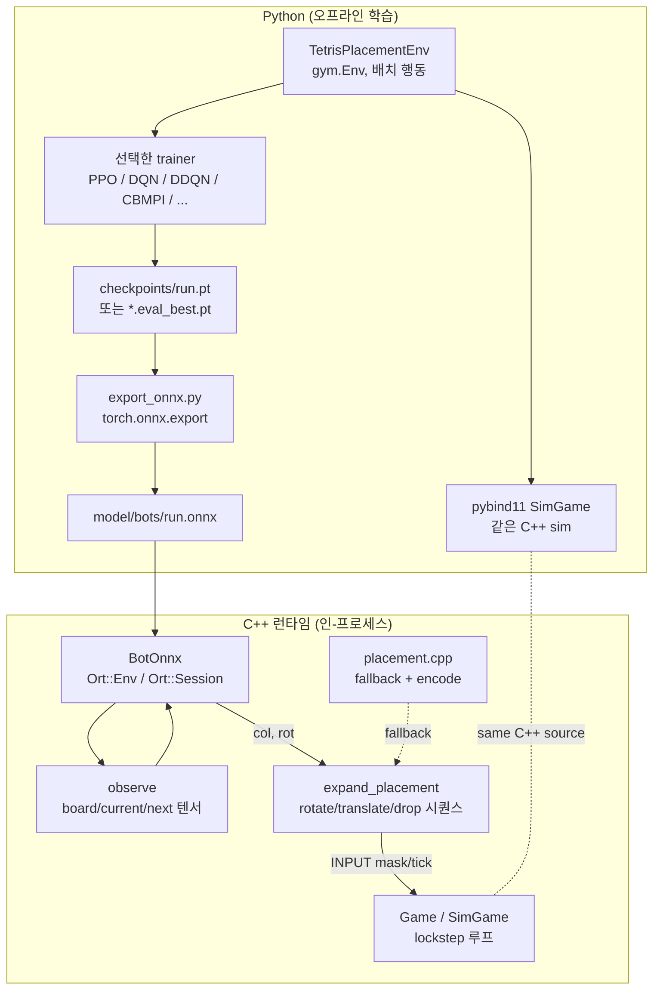
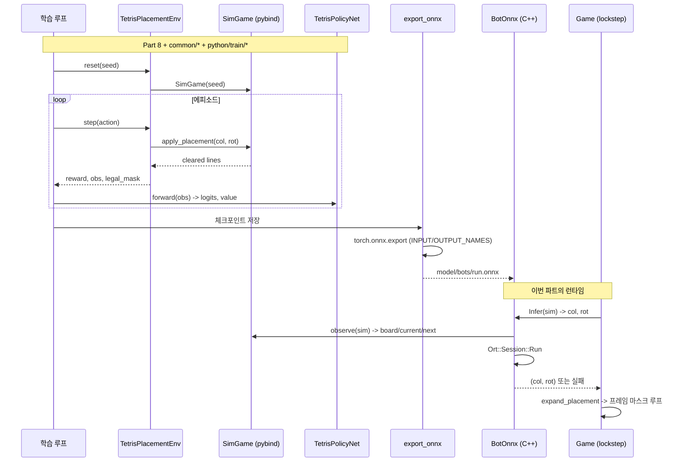

# Part 9: 강화학습과 ONNX 인-프로세스 봇

> **시리즈:** 제로부터 멀티플레이어 테트리스 + RL | [시리즈 목차](./README.md) | **Part 9**

---

## 이번 Part의 구현 계약

- **선행 상태:** Part 4까지 완성된 실행 가능한 클라이언트(메뉴 루프·렌더러·60Hz 틱 루프 — 이 장의 봇 선택 화면과 `AppMode::BotSingle` 이 그 위에 얹힌다), 그리고 Part 8의 관측 schema(`build_observation`), 배치 행동 인코딩 (`encode_action`), `TetrisPolicyNet` 과 `load_checkpoint` 계약, `python/netbot/input_expander.py` 의 전개 규칙.
- **이번 장의 파일:** `python/netbot/export_onnx.py`, `bot/placement.h`, `bot/placement.cpp`, `bot/bot_onnx.h`, `bot/bot_onnx.cpp`, `model/bots/`, `model/bots.cfg`, `src/main.cpp` 의 봇 선택 화면과 `AppMode::BotSingle` 루프, `CMakeLists.txt` 의 `TETRIS_BUILD_BOT` 블록.
- **연결점:** 학습 정책을 ONNX로 내보내고 C++에서 같은 관측을 만들어 placement를 추론한 뒤, 인간 입력과 같은 `SubmitInput` 경로로 실행한다. 두 보드는 [Part 6](./part6-lockstep-networking.md) 의 네트워크 경로와 동일한 구조로 가비지를 교환한다.
- **완료 게이트:**
  1. ORT 없이 빌드한 클라이언트에서 `Single vs Bot` 메뉴가 열리고 `Practice Partner` 로 한 판이 진행된다.
  2. ORT 빌드에서 `.onnx` 를 선택했을 때 **봇 선택 화면에 로드 오류가 뜨지 않고** 게임이 시작된다. (오류가 있으면 그 자리에 문자열이 그려진다 — `수동 테스트` 의 시나리오 1)
  3. `.pt → .onnx` export 가 `[export_onnx] wrote ...` 를 출력한다.

## 1. 왜 학습된 정책인가

Part 8 에서 Python 쪽에 pybind11 바인딩과 Gym 환경을 깔았다. 그 바인딩 위에 학습 루프를 올려 정책망을 훈련하고, 그 결과 체크포인트를 실제 C++ 클라이언트가 **인-프로세스로** 실행하는 것이 이번 파트의 목표다.

### 1.1 휴리스틱의 천장

Part 8 이 만든 것은 평가 함수(`bcts_score`)와 그것을 쓰는 학습용 상대 (`GreedyBCTSOpponent`)까지다. 게임에 붙는 휴리스틱 봇 — `bot::heuristic_placement` — 은 **이 장에서 처음 만든다**(§11.2). 이 정책의 표현과 조정 방법을 살펴보면 다음 차이를 비교할 수 있다.

1. **피처 엔지니어링의 범위.** 선형 평가는 사람이 선택한 보드 특징과 계수로 후보를 비교한다. `eval_board`의 높이·삭제 줄·구멍·요철은 유용한 기준이지만 공격과 장기 생존의 모든 관계를 직접 표현하지는 않는다. 특정 전략의 부재를 특징 수만으로 단정하지 않고 행동 공간·실행 이력·평가식을 함께 읽는다. 두 보드가 가비지를 주고받는 대전에서는 점수 외에 공격·승패 지표도 비교한다.
2. **조정할 표현의 범위.** 고정 특징의 계수도 데이터나 탐색으로 조정할 수 있다. 정책망은 입력에서 표현과 행동 선택을 함께 조정할 수 있지만, 성공 여부는 목표·데이터·학습 방법과 평가로 확인해야 한다.

저장소의 bcts_score는 선택한 보드 특징을 선형 결합하는 BCTS-inspired 기준 평가기다. 이름과 계수만으로 특정 연구 구현의 재현을 주장하지 않는다. Python과 C++의 특징 항·추가 줄 가중치·동점 규칙은 [Part 8](./part8-python-rl.md)의 기준 정책 절과 대조한다.

### 1.2 왜 인-프로세스 추론인가

봇 실행 경로는 C++ 게임 내부의 인프로세스 추론으로 둔다. 이유는 명확하다.

- **왕복 비용.** 로컬 봇 대전에 소켓과 별도 프로세스를 둘 이유가 없다.
- **배포.** 최종 사용자 머신에 Python + PyTorch 스택을 깔게 하고 싶지 않다. 배포 런타임은 ONNX Runtime CPU bundle 과 `.onnx` 파일이면 충분하다.
- **지연.** placement 정책은 매 프레임 호출되지 않는다. 블록 하나당 한 번만 추론하면 되므로, 대상 머신에서 충분히 빠른지 로드/추론 smoke 로 확인하면 된다.

그래서 이번 파트는 두 축으로 간다. (1) Python에서 학습한 `TetrisPolicyNet`을 ONNX로 내보내는 길, (2) C++에서 그 `.onnx`를 읽어 placement를 뽑고 프레임 마스크 시퀀스로 펼쳐 `SimGame`에 넣는 길이다. 모델이 없는 환경의 명시 휴리스틱과 실행 중 정책 오류 때의 무보상 fallback을 구별한다.

---

## 2. 전체 파이프라인

학습부터 게임 루프 진입까지 한 장에 모으면 이렇다.


```mermaid
graph TB
    subgraph Python["Python (오프라인 학습)"]
        Env[TetrisPlacementEnv<br/>gym.Env, 배치 행동]
        Sim[pybind11 SimGame<br/>같은 C++ sim]
        Train[선택한 trainer<br/>PPO / DQN / DDQN / CBMPI / ...]
        Ckpt[checkpoints/run.pt<br/>또는 *.eval_best.pt]
        Export[export_onnx.py<br/>torch.onnx.export]
        Onnx[model/bots/run.onnx]

        Env --> Sim
        Env --> Train
        Train --> Ckpt
        Ckpt --> Export
        Export --> Onnx
    end

    subgraph Cpp["C++ 런타임 (인-프로세스)"]
        BotOnnx[BotOnnx<br/>Ort::Env / Ort::Session]
        Observe[observe<br/>board/current/next 텐서]
        Place[placement.cpp<br/>fallback + encode]
        Expand[expand_placement<br/>rotate/translate/drop 시퀀스]
        Game[Game / SimGame<br/>lockstep 루프]

        Onnx --> BotOnnx
        BotOnnx --> Observe
        Observe --> BotOnnx
        BotOnnx -->|col, rot| Expand
        Place -.fallback.-> Expand
        Expand -->|INPUT mask/tick| Game
    end

    Sim -.same C++ source.- Game
```

핵심은 `SimGame` 이 **양쪽에서 동일한 C++ 소스** 를 공유한다는 점이다. Python 이 pybind11 을 통해 실행하는 sim 과 C++ 런타임이 실행하는 sim 은 결정론적으로 같은 상태 해시를 만든다 ([Part 1](./part1-deterministic-simulation.md) 의 FNV-1a `StateHash` 계약). 그래서 학습 쪽에서 본 보드 레이아웃과 실행 쪽에서 본 레이아웃은 비트 단위로 일치한다. 이 계약이 무너지면 훈련된 정책이 실전에서 엉뚱한 placement 를 뽑는다 — 관측 분포가 바뀌는 "sim-to-real" 격차가 0 이어야 한다.

데이터 흐름을 다시 한 번 정리하면:


```mermaid
sequenceDiagram
    participant L as 학습 루프
    participant E as TetrisPlacementEnv
    participant S as SimGame (pybind)
    participant N as TetrisPolicyNet
    participant X as export_onnx
    participant B as BotOnnx (C++)
    participant G as Game (lockstep)

    Note over L,N: Part 8 + common/* + python/train/*
    L->>E: reset(seed)
    E->>S: SimGame(seed)
    loop 에피소드
        L->>E: step(action)
        E->>S: apply_placement(col, rot)
        S-->>E: cleared lines
        E-->>L: reward, obs, legal_mask
        L->>N: forward(obs) -> logits, value
    end
    L->>X: 체크포인트 저장
    X->>X: torch.onnx.export (INPUT/OUTPUT_NAMES)
    X-->>B: model/bots/run.onnx

    Note over B,G: 이번 파트의 런타임
    G->>B: Infer(sim) -> col, rot
    B->>S: observe(sim) -> board/current/next
    B->>B: Ort::Session::Run
    B-->>G: (col, rot) 또는 실패
    G->>G: expand_placement -> 프레임 마스크 루프
```

두 다이어그램의 공통된 축은 **동일한 관측 규약·동일한 액션 인코딩**이다. Python의 `common/obs.py::build_observation`과 C++의 `bot/placement.cpp::observe`가 같은 텐서 schema를 구현하고, 양쪽 action 인코딩이 같은 배치 인코딩 수식을 쓴다. `python/tests/test_observation_parity.py`가 실제 C++/Python 관측을 대조한다. schema를 바꿀 때 이 검사와 두 구현, ONNX 입력·추론 검증을 함께 갱신한다.

---

## 3. 런타임의 관측 · 행동 · 보상 계약

### 3.1 관측

`TetrisPolicyNet`은 이름이 정해진 관측 텐서를 받는다. 배치 축 B는 학습과 추론 모두에서 표본 수를 뜻하며, 현재 C++ 추론 호출은 한 보드를 묶어 전달한다.

| 이름 | 모양 | dtype | 내용 |
|------|------|-------|------|
| `board` | `(B, 1, BOARD_ROWS, BOARD_COLS)` | float32 | 잠긴(locked) 셀 점유 여부, 0 또는 1 |
| `current` | `(B, NUM_PIECE_TYPES)` | float32 | 현재 피스 id 의 one-hot |
| `next` | `(B, NUM_PIECE_TYPES)` | float32 | preview 큐 첫 번째 다음 피스 id 의 one-hot |

`board` 에서 **떨어지는 피스와 고스트는 제외**한다. 정책이 추론할 대상은 "커밋된 보드 상태 + 이번에 내려줄 피스" 이지 화면에 보이는 시각 요소가 아니다. 고스트 블록의 cell id 값은 8 이라 `(v > 0) && (v != 8)` 로 방어적으로 걸러낸다.

**현재 소스 발췌 — `python/common/obs.py`**

```python
def build_observation(sim: "SimGame") -> dict[str, torch.Tensor]:
    """Convert a ``SimGame`` snapshot into the dict consumed by ``TetrisPolicyNet``.

    Returns un-batched tensors. Add a leading batch dim with ``unsqueeze(0)``
    before passing to the network — done at the call site so that batched
    rollouts and single-step inference share this builder.
    """
    import torch

    raw = np.asarray(sim.grid(), dtype=np.float32)
    if raw.shape != (BOARD_ROWS, BOARD_COLS):
        raise ValueError(f"board shape {raw.shape} does not match {(BOARD_ROWS, BOARD_COLS)}")
    occupied = ((raw > 0) & (raw != 8)).astype(np.float32)
    board = occupied[None, :, :]  # channel, row, column; no batch axis yet

    current = _piece_one_hot(sim.current_block_id())
    nxt = _piece_one_hot(sim.next_block_id())

    return {
        "board": torch.from_numpy(board),
        "current": torch.from_numpy(current),
        "next": torch.from_numpy(nxt),
    }
```

C++ 쪽 `observe` 가 같은 결과를 만든다.

**현재 소스 발췌 — `bot/placement.cpp`**

```cpp
void observe(const SimGame& sim,
             float* board_out,
             float* current_out,
             float* next_out)
{
    // 굳은 블록만 1로 친다. ghost(8)는 화면에만 있는 것이라 0이다.
    // python/common/obs.py의 (grid > 0) & (grid != 8)과 같은 조건이다.
    const auto& grid = sim.Grid();
    for (int r = 0; r < kBoardRows; ++r) {
        for (int c = 0; c < kBoardCols; ++c) {
            int v = grid[r][c];
            board_out[r * kBoardCols + c] = (v > 0 && v != 8) ? 1.0f : 0.0f;
        }
    }

    // one-hot. 블록 ID는 1부터 시작하므로 인덱스는 하나씩 당긴다.
    // 범위 밖 ID가 들어오면 전부 0인 벡터가 되는데, 이는 정상 상황이 아니다.
    for (int i = 0; i < kNumPieceTypes; ++i) {
        current_out[i] = 0.0f;
        next_out[i]    = 0.0f;
    }
    int cid = sim.CurrentBlockId();
    int nid = sim.NextBlockId();
    if (cid >= 1 && cid <= kNumPieceTypes) current_out[cid - 1] = 1.0f;
    if (nid >= 1 && nid <= kNumPieceTypes) next_out[nid - 1]    = 1.0f;
}
```

두 구현은 서로 다른 언어지만 **같은 조건식** (`v > 0 && v != 8`) 을 쓴다. 이 한 줄이 학습-실행 격차의 최후 방어선이다. C++ 쪽 주석이 Python 파일 경로를 직접 가리키고 있다는 점도 의도적이다 — 한쪽을 고칠 때 다른 쪽을 찾아갈 수 있어야 한다.

### 3.2 행동 공간

placement-level 행동은 피스 원점 열과 방향 라벨 `(col, rot)`을 지정한다. 열 범위는 `NUM_COLS`, 방향 범위는 `NUM_ROTATIONS`에서 얻고 출력 수는 두 값의 곱이다. 마스크는 현재 즉시 배치 API의 유효 라벨을 나타내며 틱 입력 경로를 탐색하지 않는다.

**현재 소스 발췌 — `python/common/action_mask.py`**

```python
def encode_action(col: int, rot: int) -> int:
    """Map a ``(col, rot)`` placement in the valid domain to a flat index."""
    return col * NUM_ROTATIONS + rot


def decode_action(action: int) -> tuple[int, int]:
    """Inverse of :func:`encode_action`."""
    return action // NUM_ROTATIONS, action % NUM_ROTATIONS


def legal_mask(sim: "SimGame") -> torch.Tensor:
    """Boolean tensor of shape ``(NUM_PLACEMENTS,)``.

    ``True`` at index ``encode_action(col, rot)`` iff that placement is in
    ``sim.legal_placements()``. The result lives on CPU; move to the policy
    device at the call site.
    """
    import torch

    mask = torch.zeros(NUM_PLACEMENTS, dtype=torch.bool)
    for placement in sim.legal_placements():
        mask[encode_action(placement.col, placement.rot)] = True
    return mask
```

placement-level 을 택한 이유와 그 대가(시간·회전 이력·도달 경로를 별도로 정의해야 한다)는 [Part 8](./part8-python-rl.md) 의 행동 공간 절에서 다뤘다. 여기서 다시 짚을 것은 하나다 — **`col * NUM_ROTATIONS + rot`이 C++ `bot/placement.h::encode_action` 과 같아야 한다.** 이 대칭성이 없으면 정책이 뽑은 인덱스가 런타임에서 다른 배치로 해독된다.

### 3.3 보상

env 보상은 최소한으로 뽑았다: **라인 클리어 수**.

**현재 소스 발췌 — `python/common/env.py`**

```python
    def step(
        self, action: int
    ) -> tuple[dict[str, np.ndarray], float, bool, bool, dict[str, Any]]:
        if self._needs_reset:
            raise gym.error.ResetNeeded("Call reset() before starting or continuing an episode")
        action = action_index(action, NUM_PLACEMENTS)
        col, rot = decode_action(action)
        cleared = self.sim.apply_placement(col, rot)

        if cleared < 0:
            # 도메인 안이지만 현재 보드에서 막힌 배치는 상태를 보존한다.
            # 정상 배치도 줄을 지우지 않으면 보상이 0이므로 info로 구별한다.
            reward = 0.0
            terminated = self.sim.game_over()
        else:
            reward = float(cleared)
            terminated = self.sim.game_over()

        truncated = False
        self._needs_reset = terminated
        info = self._info()
        info["action_applied"] = cleared >= 0
        return self._observation(), reward, terminated, truncated, info
```

`apply_placement` 가 -1 을 돌려주면 불법 placement 다. 환경은 sim을 진행시키지 않고 0 보상을 반환하며 `action_applied=False`를 붙인다. 이 분기는 도메인 안의 라벨에 대한 것이다. 타입·범위 오류는 `python/common/gym_contract.py`에서 먼저 거절한다. 줄을 지우지 않은 정상 배치도 0이므로 보상만으로 유효성을 판정할 수 없다. 정책은 현재 상태의 합법 마스크를 사용한다.

보상을 단순하게 둔 이유는 **피처 엔지니어링을 보상 엔지니어링으로 옮기는 함정**을 피하기 위함이다. 다만 그 희박함이 학습 초기에 실제로 문제가 되므로, PPO 학습기는 env 밖에서 dense shaping 을 더하는 절충을 택했다 ([Part 8](./part8-python-rl.md) 의 `shaping_reward`). 그리고 가비지 교환까지 보상에 넣고 싶으면 `common/env_versus.py::TetrisVersusEnv` 가 그 형태를 이미 갖고 있다 — 네이티브 공격 큐를 재사용하되 A 배치 뒤 B가 응답하는 턴제 스케줄을 선택한 환경이다.

---

## 4. pybind11 바인딩

학습 전체가 `bindings/tetris_py.cpp` 한 파일에 의존한다. 모듈 등록 전체(`Placement`·`SimBlock`·`SimGame` 클래스와 개별 메서드의 해설)는 [Part 8](./part8-python-rl.md) 이 절별로 해부했으므로, 여기서는 **런타임 계약에 직접 걸리는 표면**만 다시 본다 — 시드 기본값, placement API 와 `clone()`, 전투/가비지 API, 관측 복사, 결정론 해시다.

(`SimGame` 등록부 앞부분. `Placement`·`SimBlock` 등록, frame 단위 API, 조회 접근자는 생략)

**현재 소스 발췌 — `bindings/tetris_py.cpp`**

```cpp
    // 시뮬레이션 본체.
    py::class_<SimGame>(m, "SimGame")
        .def(py::init<uint64_t>(), py::arg("seed") = 0,
             "Construct a new headless Tetris sim. seed=0 uses a fixed default "
             "so that unseeded runs are still deterministic across platforms.")

        // --- placement 단위 API (RL 학습용) ---
        // 중력을 기다리지 않고 한 수를 통째로 두므로 학습 한 스텝이 곧 한 착수다.
        .def("legal_placements", &SimGame::LegalPlacements,
             "Enumerate all legal (col, rot) placements for the current piece "
             "via rotate-then-translate-then-hard-drop. Returns a list of "
             "Placement objects.")
        .def("apply_placement", &SimGame::ApplyPlacement,
             py::arg("col"), py::arg("rot"),
             "Apply a placement atomically (rotate -> translate -> hard drop -> "
             "lock). Returns the number of lines cleared, or -1 if the placement "
             "is illegal.")
        .def("clone", [](const SimGame& g) {
            return SimGame(g);
        }, "Return a deep copy of the full deterministic sim state.")

        // --- 공격/garbage API (2인 대전 환경용) ---
        // attack_lines_sent()는 누적값이라 그 자체로는 쓸 일이 없다.
        // apply_placement() 앞뒤로 읽어 그 차이를 상대 보드의
        // add_pending_garbage()에 넘기는 식으로 공격을 전달한다.
        // 쌓인 garbage는 받는 보드가 다음 블록을 lock하는 순간 바닥에서 올라온다.
        .def("attack_lines_sent", &SimGame::AttackLinesSent,
             "Cumulative attack lines this board has sent (monotonic). Take the "
             "delta across a placement to get the attack from that placement.")
        .def("pending_garbage", &SimGame::PendingGarbage,
             "Garbage rows queued to be injected on this board's next lock.")
        .def("add_pending_garbage", &SimGame::AddPendingGarbage, py::arg("rows"),
             "Queue `rows` garbage lines onto this board (injected on next lock). "
             "Negative/zero is ignored. Used to route an opponent's attack.")
```

(`grid()` — 관측 복사)

**현재 소스 발췌 — `bindings/tetris_py.cpp`**

```cpp
        // --- 관측 ---
        .def("grid", [](const SimGame& g) {
            // 내부 버퍼를 참조로 넘기지 않고 복사한다.
            // 참조를 넘기면 다음 착수 때 Python이 들고 있던 배열의 내용이
            // 조용히 바뀌어, replay buffer에 쌓아둔 관측이 전부 오염된다.
            // 복사 비용은 보드 크기와 호출 빈도에 비례한다. 처리량은 별도로 측정한다.
            const auto& raw = g.Grid();
            auto arr = py::array_t<int32_t>({SimGrid::kRows, SimGrid::kCols});
            auto buf = arr.mutable_unchecked<2>();
            for (int r = 0; r < SimGrid::kRows; ++r)
                for (int c = 0; c < SimGrid::kCols; ++c)
                    buf(r, c) = raw[r][c];
            return arr;
        }, "Return the ROWS x COLS grid as a numpy int32 array (copied).")
```

(결정론 검증 표면)

**현재 소스 발췌 — `bindings/tetris_py.cpp`**

```cpp
        // --- 결정성 검증용 ---
        .def("state_hash", &SimGame::StateHash,
             "FNV-1a 64-bit hash of the full sim state. Bitwise-identical to "
             "Game::ComputeStateHash() — this is the gate the determinism "
             "regression test checks.")
        .def("rng_state", &SimGame::RngState,
             "Raw XorShift64* RNG state (for debugging cross-platform drift).")
```

이 밖에 조회 접근자(`current_block_id`, `score`, `game_over` 등)와 관측 벡터 크기 상수(`SimGame.ROWS`/`COLS`), frame 단위 API(`submit_input`/`tick`)가 같은 등록부에 이어진다. 바인딩 설계 원칙 몇 가지.

**두 API를 동시에 제공한다.** `apply_placement`는 학습용(한 번의 호출이 rotate → translate → hard-drop → lock까지 원자적으로 실행)이고, `submit_input`과 `tick`은 C++ lockstep 경로와 프레임 단위 동등성을 검증하는 API다. 인게임 봇은 `SimGame`에 같은 프레임 입력을 넣는다.

**`grid()` 는 항상 복사한다.** 파일 상단 usage 주석의 `# (20, 10) int32 NumPy 배열 (복사본)` 과 `grid()` 람다 첫 줄의 `내부 버퍼를 참조로 넘기지 않고 복사한다` 가 같은 사실을 두 번 말한다. 복사 비용은 보드 크기와 호출 빈도에 따라 달라지며, "Python 이 numpy 배열을 쥐고 있는데 SimGame 이 그 아래에서 mutate 해서 다음 프레임에 다른 값이 보인다" 는 미묘한 버그를 완전히 봉쇄한다. `return_value_policy::reference_internal` 은 `current_block`/`ghost_block` 처럼 멤버 수명이 안정적인 조회에만 쓴다. `next_block` 은 preview 큐 원소라 큐 갱신 때 참조가 무효화될 수 있어 복사로 반환한다.

**전투/가비지 API가 2-보드 구성의 토대다.** `src/main.cpp`의 `Single vs Bot` 가비지 교환과 `python/common/env_versus.py`의 2-보드 RL 환경이 이 배선을 공유한다. `attack_lines_sent()`가 누적 총계라서 양쪽 모두 "배치 전후 차분" 패턴을 쓰고, `add_pending_garbage()`로 상대 보드에 라우팅하며 실제 주입은 받는 보드의 다음 잠금에서 일어난다. 공격 원시 연산을 공유해도 실시간 C++ 틱과 Python의 A→B 배치 스케줄은 다르다. 학습·실행을 비교할 때는 상대의 응답 시점과 정보까지 확인한다.

**`state_hash()` 를 노출한다.** [Part 1](./part1-deterministic-simulation.md) 의 FNV-1a 해시를 Python 에서 바로 찍어볼 수 있다. `test_determinism_crossplatform.py` 같은 테스트가 여기를 통해 Python 런과 C++ 런의 상태가 틱 단위로 일치하는지 검증한다.

**`clone()` 은 전체 deterministic state 의 값 복사다.** CBMPI-style policy improvement 는 현재 상태에서 합법 placement 를 하나씩 가정 적용해 후속 보드를 평가한다. 원본 `SimGame` 을 건드리면 rollout 이 망가지므로, `clone()` 으로 branch 를 만든 뒤 `apply_placement()` 를 호출한다. Colab에서 clone 속성이 없으면 실제 import 경로와 준비한 확장을 대조한다. 선택한 소스로 독립 빌드를 만든 뒤 새 프로세스에서 로드한다. 사용 중인 확장이나 기존 build 전체를 지우지 않는다. CBMPI는 알고리즘의 후보 탐색에서 clone을 직접 사용하며, 공통 환경도 상태 전이의 커밋 경계를 위해 내부적으로 clone을 사용한다.

**네이티브 시드와 환경의 시드열을 구별한다.** 네이티브 SimGame의 기본 시드는 고정이지만 Gym 환경의 시드 없는 첫 reset은 난수 초기화다. `reset(seed=0)`은 그 값을 네이티브에 전달하고, 다음 시드 없는 reset은 환경 난수열을 이어서 새 판을 만든다. 명시한 시드와 입력열을 기록해야 재현 조건이 분명해진다.

이 바인딩이 완성되면, Python 에서 이렇게 쓸 수 있다.

**예시(실제 저장소에는 없음)**

```python
from sim import SimGame

g = SimGame(seed=42)
print(g.legal_placements())        # [Placement(col=3, rot=0), ...]
g.apply_placement(4, 2)            # 내려놓고 라인 카운트 반환
print(g.current_block_id())        # 1..7
print(g.grid().shape)              # (20, 10)
print(hex(g.state_hash()))         # 0x...
```

---

## 5. 정책 네트워크

`python/common/models.py`의 `TetrisPolicyNet`은 학습과 내보내기가 공유하는 클래스다. 입력은 board `(B,C,H,W)`, current/next 각각 `(B,K)`이고 출력은 행동 점수 `(B,A)`와 가치 `(B,)`다. 크기는 공유 스키마와 생성자 설정에서 읽는다. 정상 관측은 잠긴 보드의 단일 점유 채널과 피스 ID 순서의 one-hot이다.

**현재 소스 발췌 — `python/common/models.py`**

```python
    def forward(
        self,
        board: torch.Tensor,
        current: torch.Tensor,
        next: torch.Tensor,  # noqa: A002 - matches obs key name
    ) -> tuple[torch.Tensor, torch.Tensor]:
        if not isinstance(board, torch.Tensor):
            raise TypeError("board must be a tensor")
        if board.dim() == 3:
            board = board.unsqueeze(1)  # BHW -> NCHW; checked below in eager mode.
        if not torch.jit.is_tracing():
            validate_policy_inputs(
                board, current, next, channels=self.board_channels,
                rows=BOARD_ROWS, cols=BOARD_COLS, pieces=self.n_piece_types,
                parameter=self.trunk[0].weight,
            )
        h = self.trunk(board)
        h = h.flatten(1)
        h = torch.cat([h, current, next], dim=-1)
        h = self.fuse(h)
        policy_logits = self.policy_head(h)
        value = self.value_head(h).squeeze(-1)
        return policy_logits, value
```

Conv 특징을 펼치고 피스 벡터를 결합한 공유 MLP에서 두 head가 갈라진다. PPO의 행동 점수는 합법 마스크로 정규화할 logit이고 가치는 학습한 리턴 추정치다. 같은 크기의 배열이라도 Q-learning 출력과 의미가 다르므로 모델을 만든 알고리즘과 선택 방식을 확인한다.

Python eager 입력 검사는 `python/common/model_contract.py`에 있다. 행·열과 각 피스 벡터의 폭을 별도로 확인하고 배치·dtype·device를 맞춘다. 관측 값의 의미는 생성 경계와 native 상태 계약을 함께 확인한다. 현재 범위 밖 피스 ID의 영벡터 호환 규칙도 모델의 shape 검사로 거절되지 않는다. legacy tracing에서는 이 Python 검사를 건너뛰므로 내보낸 그래프의 호출 계약과 구분한다.

forward의 인자 순서는 내보내기의 INPUT_SPECS 순서와 일치해야 한다. 기본 synthetic tensor probes는 형상과 수치 대조용이며 모두 실제 도달한 게임 상태라는 뜻은 아니다. 실제 관측과 legal_mask를 사용한 사례 대조를 별도로 연결한다.

ARCH_VERSION은 버전 불일치를 거절하는 표식이고 strict state loading은 키/크기를 확인한다. 같은 형상에서 피스 순서나 라벨 뜻이 바뀐 오류까지 자동 검출하지 않는다. 현재 로더는 저장한 생성자 config와 입출력 의미 버전을 검증하고 모델을 복원한다. 과거 형식만 기본 구성을 사용한다. 모델 파일과 optimizer·환경까지 담는 훈련 스냅샷의 범위는 구별한다. 자세한 구조와 경계는 [Part 8 정책 네트워크](./part8-python-rl.md#7-cnn-정책-네트워크)를 함께 읽는다.

학습 시 마스킹에 쓰는 `masked_log_softmax` 도 같은 파일에 있다.

**현재 소스 발췌 — `python/common/models.py`**

```python
def masked_log_softmax(
    logits: torch.Tensor, mask: torch.Tensor, eps: float = 1e-9
) -> torch.Tensor:
    """Normalize finite legal logits; reject empty legal rows and schema mismatch.

    ``eps`` remains accepted for caller compatibility. Adding the same constant
    cannot repair an empty distribution and is not a probability floor.
    """
    del eps
    if not logits.is_floating_point() or mask.dtype != torch.bool:
        raise TypeError("logits must be floating point and mask must be bool")
    if logits.ndim < 1 or logits.shape[-1] == 0 or logits.shape != mask.shape:
        raise ValueError("logits and mask must have the same nonempty action axis")
    if logits.device != mask.device:
        raise ValueError("logits and mask must be on the same device")
    if not mask.any(dim=-1).all():
        raise ValueError("each row must have at least one legal action")
    if not torch.isfinite(logits.masked_select(mask)).all():
        raise ValueError("legal logits must be finite")
    masked = logits.masked_fill(~mask, float("-inf"))
    logp = F.log_softmax(masked, dim=-1)
    if not torch.isfinite(logp.masked_select(mask)).all():
        raise ValueError("normalized legal log probabilities must be finite")
    return logp


def masked_entropy(logp: torch.Tensor, mask: torch.Tensor) -> torch.Tensor:
    """Entropy of masked_log_softmax output; avoid 0 * -inf before autograd."""
    safe_logp = logp.masked_fill(~mask, 0.0)
    return -(logp.exp() * safe_logp).sum(dim=-1)
```

학습에서는 합법 logit의 유한성과 비어 있지 않은 마스크를 확인한 뒤 분포를 만든다. 런타임 C++은 합법 후보 위에서 argmax를 수행한다(§10.3). 마스킹은 **ONNX 그래프 밖**의 호출자 책임이며 모델은 스키마의 행동 축에 맞춘 raw logits를 낸다. 엔트로피를 학습 손실에 사용할 때는 불법 항을 곱셈 전에 가려 역전파까지 유한하게 유지한다. `python/tests/test_masked_distribution.py`가 두 학습 함수의 기울기를 직접 검사한다.

---

## 6. ONNX 내보내기

ONNX는 추론 계산을 표현하는 그래프와 가중치를 담는다. PyTorch 학습 checkpoint에 있는 optimizer, 난수 위치, 수집 중인 환경을 복원하는 파일과 용도가 다르다. `netbot.export_onnx`는 canonical 모델을 CPU에 읽고 `netbot.onnx_pipeline`에서 후보를 검증한 뒤 목적지를 교체한다.

### 6.1 게임과 공유하는 입출력 경계

**현재 소스 발췌 — `python/netbot/export_onnx.py`**

```python
INPUT_SPECS=[('board',(1,1,BOARD_ROWS,BOARD_COLS)),
             ('current',(1,NUM_PIECE_TYPES)),('next',(1,NUM_PIECE_TYPES))]
OUTPUT_SPECS=[('policy_logits',(1,NUM_PLACEMENTS)),('value',(1,))]
INPUT_NAMES=[name for name,_ in INPUT_SPECS]
OUTPUT_NAMES=[name for name,_ in OUTPUT_SPECS]
```

입력 이름·순서와 float32 형상은 C++ BotOnnx의 LoadModel/Run 계약과 같아야 한다. 배치 축은 이 배포 계약에서1로 고정한다. 관측의 행/열·피스 폭·행동 출력 폭은 공통 규칙 상수를 따른다. 가중치 용량은 달라도 이 의미와 입출력 경계를 지켜야 한다. export 전에는 checkpoint의 board_channels/n_piece_types/n_placements를 대조한다.

**현재 소스 발췌 — `python/netbot/onnx_contract.py`**

```python
def _fixed_dims(value_info):
    """Return the tuple of dim_value dimensions, rejecting symbolic/unknown."""
    if not value_info.type.tensor_type.HasField("shape"):
        raise ValueError(f"{value_info.name!r} has unknown tensor rank")
    dims = []
    for i, dim in enumerate(value_info.type.tensor_type.shape.dim):
        if dim.HasField("dim_value"):
            dims.append(dim.dim_value)
        elif dim.HasField("dim_param") and dim.dim_param:
            raise ValueError(
                f"{value_info.name!r} dimension {i} is symbolic "
                f"({dim.dim_param!r}); only fixed dim_value dimensions are allowed"
            )
        else:
            raise ValueError(
                f"{value_info.name!r} dimension {i} has no fixed dim_value"
            )
    return tuple(dims)
```

`dim_param`은 기호적 차원이며, 현재 검증기는 정해진 정수 dim_value를 요구한다. shape 필드가 없으면 스칼라로 해석하지 않고 알 수 없는 rank로 거절한다. 입출력 이름·순서·개수·tensor 종류·float32·rank·각 차원을 검사하며, initializer가 runtime 입력에도 나타나면 고정 가중치 계약에 맞지 않는 것으로 처리한다.

### 6.2 그래프 포맷과 실행 엔진의 역할

노드는 Conv/Relu/Gemm 같은 연산을, 텐서 이름은 연산 간 연결을 표현한다. 학습된 파라미터는 initializer에 들어간다. ONNX의 IR 버전과 operator-set(opset) 버전은 다르다. IR은 모델 표현 규약, opset은 domain 안 연산의 의미 버전이다. exporter가 만들 수 있는 그래프와 대상 Runtime이 실행할 수 있는 그래프의 교집합을 사용해야 한다.

실습의 기본 opset은 선택한 호환성 설정이다. 높은 숫자를 지정한다고 더 정확한 모델이 되지는 않는다. checker는 구조/타입 규칙을, 실제 ONNX Runtime 실행은 선택한 실행 환경에서의 지원을 확인한다. dtype/shape가 같아도 보드 방향이나 피스 ID 의미가 다르면 게임 계약이 다른 모델이 된다.

### 6.3 추적 입력과 검증 사례

현재 정책은 Tensor 연산으로 이루어진 고정 구조이므로 `dynamo=False`의 TorchScript exporter 경로를 명시한다. 일반 Python 분기·부작용 전체를 이식하는 절차가 아니다. 예제 입력을 보고 추적한 경로가 입력값 의존 분기 전체를 대표한다는 보장은 없다. Python 호스트의 shape 검증도 ONNX 안에 같은 예외 검사로 들어간다고 가정하지 않는다.

model.eval은 모드에 의존하는 층의 동작을 고른다. no_grad는 미분 그래프 기록을 끄는 문맥이다. 현재 canonical 모델에 Dropout/BatchNorm은 없지만 두 개념을 혼동하지 않는다. initializer를 포함해 저장하는 것과 constant folding도 다르다. folding은 상수 입력만으로 계산 가능한 부분을 미리 계산하는 최적화이며 모든 Conv/Linear를 상수 결과로 바꾸는 작업이 아니다.

기본 CLI는 synthetic tensor probes로 구조와 수치 연결을 확인한다. 모두 실제로 도달한 게임 보드라는 뜻은 아니다. export의 cases 인자로 실제 환경 관측과 그 상태의 legal_mask를 전달하면 그 사례에 대해 PyTorch/Runtime 결과를 대조할 수 있다. native 관측 대조와 모델의 플레이 성능 평가는 별도 실험이다.

### 6.4 수치와 선택 행동을 따로 비교한다

`onnx_pipeline.compare_outputs`는 CPUExecutionProvider를 선택하고 출력의 dtype·shape·유한성을 확인한 뒤 허용오차로 각 원소를 대조한다. 허용오차는 `abs(actual-reference) <= atol + rtol*abs(reference)`로 해석한다. 모든 플랫폼에서 bitwise 일치를 요구하는 규칙이 아니다.

아주 가까운 두 행동 값은 이 수치 비교를 통과하면서도 argmax 순서가 바뀔 수 있다. 그래서 같은 legal_mask를 적용한 선택 인덱스도 별도로 검사한다. 실패하면 후보를 공개하지 않는다. 검증 결과의 사례 수·최대 절대 오차·허용오차·실행 provider는 이번 입력 집합에 대한 근거다. 전체 상태 공간의 동일성이나 실력을 증명하지 않는다.

### 6.5 한 파일 후보를 검사한 뒤 교체한다

**현재 소스 발췌 — `python/netbot/onnx_pipeline.py`**

```python
            graph=onnx.load(str(candidate),load_external_data=False)
            ensure_embedded(graph)
            validate_io(graph,input_specs,output_specs)
            imports={item.domain:item.version for item in graph.opset_import}
            if imports.get('') != opset:
                raise ValueError('exported opset differs from request')
            if metadata:
                onnx.helper.set_model_props(graph,metadata)
            onnx.checker.check_model(graph,full_check=True)
            onnx.save_model(graph,str(candidate),save_as_external_data=False)
            evidence=compare_outputs(model,candidate,cases,input_specs,output_specs)
            if {p.name for p in Path(folder).iterdir()} != {'candidate.onnx'}:
                raise ValueError('export created unexpected companion files')
            with candidate.open('r+b') as stream:
                stream.flush();os.fsync(stream.fileno())
            os.replace(candidate,out)
```

export_checked는 목적지와 같은 파일시스템의 임시 디렉터리에서 작업한다. 외부 weight 파일을 참조하는 TensorProto를 중첩 protobuf까지 찾아 거절하고, 예상하지 않은 동반 파일도 거절한다. 이 배포 경로는 그래프와 가중치가 들어 있는 단일 파일 계약이다. 큰 external-data 모델은 별도의 묶음 배포 계약이 필요하다.

구조·입출력·실제 CPU 수치/행동 검사가 끝난 후보만 flush/fsync 뒤 os.replace로 공개한다. 변환·검사·교체 전 오류이면 임시 폴더를 정리하고 기존 목적지를 유지한다. source와 destination이 같은 경로인 요청도 거절한다. 단일 작성자 계약이며 부모 디렉터리 fsync, 전원 장애 내구성, 파일 출처 인증까지 보장하지 않는다.

메타데이터에는 checkpoint 해시와 관측/행동 의미 규약 및 exporter 정보를 넣는다. 현재 C++ LoadModel은 이름·dtype·shape를 검사하며 이 메타데이터의 의미 버전을 직접 검사하는 구현은 별도 대조 대상이다. shape 검사만으로 같은 게임 의미가 확인됐다고 쓰지 않는다.

### 6.6 준비와 실행

내보내기 환경에 export extra 또는 requirements-colab.txt를 설치한다. CPU ONNX Runtime은 변환 결과의 실행 비교에 사용한다. 예제 명령은 python/ 디렉터리 기준이다.

```sh
python -m netbot.export_onnx checkpoints/candidate.pt ../model/bots/candidate.onnx
```

`.pt`는 canonical 정책 파일을 선택한다. MuZero native 파일은 증류한 .policy.pt를 사용한다. Windows/macOS용 게임에는 그 플랫폼의 ONNX Runtime 라이브러리와 검증한 모델을 묶는다. Python CPU 검증이 대상 OS의 C++ 네이티브 로드·실행 검사를 대신하지 않는다.

---

## 7. 학습 알고리즘 비교

모델 zoo는 학습 파일들을 실행 조건과 함께 관리하는 목록이다. 알고리즘 이름이나 학습 예산을 난이도 등급으로 쓰지 않는다. 지원 실행 명령은 `python/train/training_commands.py`의 command_for, 세부 인자는 각 trainer CLI에서 확인한다. 최종 배포 대상은 공통 관측·행동 의미를 따르는 TetrisPolicyNet이다.

| 선택 | 표적을 만드는 방식 | 경험 사용 | 배포 후보 |
|---|---|---|---|
| PPO / sparse PPO | 고정한 rollout의 advantage와 확률비 | 수집 뒤 제한된 epoch 갱신 | canonical .pt |
| DQN / Double DQN | 보상과 다음 합법 행동의 Q 추정 | 과거 전이 replay | canonical .pt |
| CBMPI / value 변형 | clone한 실제 후보 상태를 평가해 개선 행동 생성 | 상태 배치를 수집해 분류 학습 | canonical .pt |
| REINFORCE / A2C / n-step AC | 보상 수익과 가치 baseline | 수집한 경로를 설정한 epoch로 갱신 | canonical .pt |
| CEM 스타일 | 높은 점수 에피소드의 행동 선택 | elite 행동을 cross-entropy로 학습 | canonical .pt |
| MuZero 스타일 | 잠재 dynamics와 MCTS 방문 분포 | 경로 replay와 잠재 모델 갱신 | 증류한 .policy.pt |

표의 이름은 이 저장소의 구현을 설명한다. CEM은 파라미터 분포를 미분 없이 갱신하는 구현이 아니다. collect_episode가 샘플링한 경로 중 elite를 뽑고 fit_elites가 cross-entropy와 Adam으로 정책을 학습한다. PPO의 여러 epoch는 매번 새 on-policy 자료라는 뜻이 아니다. 고정 자료와 행동 확률을 기준으로 갱신한다.

### 7.1 공통 출력 형상과 학습 의미

정책 logit은 행동 분포를 만들기 위한 점수다. DQN의 같은 출력 슬롯은 할인 수익 Q 추정값이다. 합법 argmax는 둘 다 처리하지만 값의 단위·softmax의 해석·손실은 다르다. 별도 value head는 DQN 손실에 사용하지 않는다. 출력 폭뿐 아니라 관측 인코딩과 행동 라벨도 같아야 공통 export 경로로 연결된다.

**현재 소스 발췌 — `python/train/dqn_tetris.py`**

```python
"""DQN / Double DQN trainer for the Tetris placement bot.

This trainer keeps deployment simple by using the canonical
``common.models.TetrisPolicyNet`` as the Q-network: ``policy_logits`` are
interpreted as Q-values over the configured placement actions, and the value head is
unused. ``--target-mode ddqn`` uses Double DQN targets; ``--target-mode dqn``
uses the classic target-network max. Checkpoints saved here load directly in
``netbot.export_onnx``.

Run from ``python/`` after the Colab setup notebook builds ``tetris_py``::

    python -m train.dqn_tetris --steps 200000 --out checkpoints/dqn.pt
    python -m netbot.export_onnx checkpoints/dqn.eval_best.pt ../model/dqn.onnx

This is intended for Colab or another training machine. Do not run long
training jobs on low-power deployment machines.
"""
```

DQN 표적은 `r + gamma * max Q_target(s_next, a)`다. Double DQN은 online망의 합법 argmax로 행동을 고르고 target망에서 그 행동 값을 읽는다. target망은 일정한 갱신 간격 동안 고정한다. replay는 자신이 소유한 배열에 전이를 복사하고 복원 추출한다.

실제 종료이면 다음 상태 추정을 계산하지 않고 r만 사용한다. 빈 마스크에 max를 적용하면 -inf가 나올 수 있고 `0 * -inf`는 NaN이므로 곱셈으로 종료를 처리하지 않는다. 외부 제한은 환경 reset의 사유지만 MDP 종료가 아니므로 실제 마지막 관측의 Q를 남긴다. live 상태의 빈 합법 마스크는 계약 오류로 거절한다.

### 7.2 실제 후보 탐색과 잠재 모델 탐색

CBMPI의 clone은 실제 규칙 상태에서 행동 결과를 비교한다. MuZero 스타일은 observation을 latent로 표현하고 dynamics로 다음 latent와 reward를 예측한다. 여기서 root는 실제 legal_mask를 쓰지만 깊은 노드는 전체 행동 라벨을 펼친다. 가상 분기는 학습된 근사이며 실제 도달 가능성 검증이 아니다. 현재 self_play는 단일 보드 경로 수집 이름이다.

**현재 소스 발췌 — `python/train/muzero_tetris.py`**

```python
"""MuZero-style trainer for the Tetris placement bot.

This is a compact MuZero-style baseline for Colab experimentation:

- representation: observation -> latent state
- dynamics: latent state + placement action -> next latent state + reward
- prediction: latent state -> policy logits + value
- self-play: root MCTS over legal placement actions

The native MuZero checkpoint is *not* deployable by the current C++ ONNX bot.
After training, this script distills the MCTS policy targets into the canonical
``TetrisPolicyNet`` and saves ``*.policy.pt``. Export that distilled policy:

    python -m train.muzero_tetris --episodes 200 --out checkpoints/muzero.pt
    python -m netbot.export_onnx checkpoints/muzero.policy.pt ../model/muzero.onnx
"""
```

MCTS의 reward와 value를 더하려면 단위가 같아야 한다. 현재 trainer는 reward_scale과 value_scale을 같은 양의 유한 값으로 요구한다. 외부 max_pieces 또는 truncation에서는 실제 끝 관측의 scaled value를 원래 보상 단위로 바꿔 리턴의 꼬리에 넣고, 실제 종료만0으로 둔다. 방문 분포의 temperature는 log 공간에서 정규화해 작은 온도에서 power overflow가 생기는 경로를 피한다.

native MuZero 파일과 canonical policy는 구조가 다르다. 증류는 replay의 방문 분포를 교사로 policy head에 학습하는 과정이며 탐색의 성능이 그대로 보존된다는 보장은 없다. 게임에 쓸 .policy.pt를 별도로 평가한다. native 파일은 형식·관측/행동 규약·용량·scaling·가중치를 검사하고 원자적으로 교체한다. --resume은 가중치 warm start이며 optimizer와 replay는 새로 시작한다. CEM/CBMPI/DQN도 명시한 resume 파일이 없으면 실패한다.

### 7.3 같은 조건에서 개별 평가 결과를 남긴다

`python/train/model_zoo.py`는 선택한 canonical 모델들을 같은 시드·예산·단일 보드 환경·합법 argmax로 평가한다. `rl_common.evaluate_episodes`는 줄 수, 점수, 보상 합, 배치 수와 terminated/truncated/budget 종료를 시드별로 남긴다. 줄 수는 환경의 누적 lines에서 읽으며 shaping된 보상을 줄 수로 해석하지 않는다. 평가는 별도 환경을 사용하고 실패해도 모델 모드와 환경 수명을 정리한다.

실행은 준비한 native 확장을 먼저 로드하는 colab_runtime launch 경로에서 수행한다. notebook의 READY 또는 새 준비 결과에서 module_dir를 선택한다. 다음은 평가 조건의 예이며 시드와 예산은 프로젝트의 영구 상수가 아니다.

```sh
python -m train.colab_runtime launch --module-dir /path/to/prepared/build \
  --module train.model_zoo -- /path/to/a.pt /path/to/b.policy.pt \
  --seeds 101 202 303 --max-pieces 100 --split validation --out /path/to/comparison.json
```

보고서는 후보의 경로/해시, 선택 소스/확장 식별값, Python/패키지/장치, protocol, 원자료와 요약을 포함한다. 같은 출력 경로는 덮어쓰지 않는다. 이 JSON은 모델 실험 기록이며 학습 사이트 진도 이동 기능이 아니다. hash는 파일 식별용으로, 출처 인증이나 같은 성능 보장을 뜻하지 않는다.

`python/train/evaluation_summary.py`는 평균·중앙값·범위·종료 수를 계산하고 같은 순서의 시드에서 후보 간 차이를 낸다. 예산에 걸린 판을 실제 사망 판으로 합치지 않는다. 검증 시드는 선택과 조정에, 별도 test 시드는 선택 완료 뒤 사용한다. split 표기 자체는 중복 시드나 반복적인 test 사용을 자동 차단하지 않는다.

고정 시드는 후보 비교의 공통 조건이다. 새 학습 seed의 변동성과 새로운 평가 seed에서의 일반화는 별도 문제다. 작은 smoke에서 나온 평균이나 서로 다른 보상 단위의 training loss로 알고리즘 순위를 정하지 않는다. 단일 placement 평가의 줄 수 역시 속도가 있는 대전 승률·BP 지급 조건과 다르다.

---

## 8. Colab 실행 — 준비·smoke·장기 실험

### 8.1 노트북과 실행 머신의 수명을 구분한다

노트북 파일은 셀과 저장된 출력을 담는다. 실행 중인 Python 커널의 객체, 런타임 디스크의 빌드/학습 파일, Drive에 쓴 자료는 각각 별도 수명을 가진다. 노트북 저장만으로 가중치나 C++ 확장이 보존되는 것은 아니다. 런타임이 없어지면 설치·빌드부터 다시 준비하고, 실제 저장해 둔 파일을 가져와야 한다.

`python/train/train_model_zoo_colab.ipynb`를 전체 작업 입구로 사용한다. `setup_colab.ipynb`는 렌더러 없는 확장과 CPU smoke만 확인하는 입구다. 현재 런타임에서 특정 GPU나 고정 실행 시간을 항상 받는다고 가정하지 않는다. [Colab 공식 FAQ](https://research.google.com/colaboratory/faq.html)의 런타임 수명·자원 조건을 확인한다.

### 8.2 코드 revision과 현재 Python을 고정한다

**현재 소스 발췌 — `python/train/train_model_zoo_colab.ipynb`**

```python
REPO_URL = 'https://github.com/Rein-ArXiv/Tetris-Multiplayer-RL.git'
REPO_DIR = '/content/Tetris-Multiplayer-RL'
REPO_COMMIT = ''  # Optional full commit SHA; existing checkouts are kept as-is.

ALGO = 'ppo'
CHARACTER_ID = 'aria'  # 다른 상대를 만들 때 변경 (소문자/숫자/_/-)
CHARACTER_NAME = 'Aria'
RUN_NAME = f'{CHARACTER_ID}_{ALGO}_smoke'
SMOKE_RUN = None  # For long: path to a successful matching smoke run directory.
USE_DRIVE = True  # 체크포인트·실험 기록을 별도 run 폴더에 저장

# Smoke 값으로 먼저 검증하고, 잘 돌면 아래 TRAIN_PRESET을 'long'으로 바꾸세요.
TRAIN_PRESET = 'smoke'  # 'smoke' or 'long'

print('algo    :', ALGO)
print('run name:', RUN_NAME)
print('preset  :', TRAIN_PRESET)
```

없는 저장소만 clone한다. 기존 checkout은 자동 pull/reset하지 않는다. 특정 full commit SHA를 선택하면 작업 변경이 없는지 확인한 뒤 그 commit으로 이동한다. commit 이름 외에 실제 선택 소스의 해시도 기록하므로 커밋하지 않은 코드가 섞였는지 식별할 근거가 남는다.

설치는 `sys.executable -m pip`, pybind11 조회와 CMake의 Python_EXECUTABLE도 같은 인터프리터를 사용한다. 노트북의 커널 Python과 PATH에서 찾은 python/pip가 다른 경우를 피한다. 설치·구성·빌드는 subprocess의 실패 코드를 검사한다. 실패한 셀 뒤에 오래된 결과를 성공 자료로 넘기지 않는다.

### 8.3 확장을 새 폴더에 빌드하고 새 프로세스에서 읽는다

`python/train/colab_runtime.py`의 prepare_native는 매번 독립 빌드 폴더를 만들고 tetris_py와 sim_hash_dump만 빌드한다. 현재 Python ABI에 맞는 확장 파일이 정확히 하나 있는지 확인하고, 빌드 전후 소스 해시가 같아야 preparation 자료를 반환한다. 기존 build/와 python/sim의 라이브러리를 지우거나 덮어쓰지 않는다.

run_smoke는 새 Python 프로세스를 시작하고 지정 폴더의 tetris_py를 먼저 import한다. 실제 __file__의 부모 경로와 파일 해시를 확인한다. 이후 sim 래퍼와 환경이 이미 확인한 모듈을 사용한다. 커널 메모리에 남은 이전 import를 다시 썼다는 사실을 파일 복사만으로 바꿀 수는 없다.

CPU smoke는 clone의 원본 보존, 합법 배치, 환경 step, 모델의 gradient/업데이트, 체크포인트 왕복을 실행한다. apply_placement의 반환값은 삭제 줄 수이며0도 성공이다. 합법 마스크의 길이는 관측 계약에서 읽는다. import 성공만으로 GPU 훈련이나 ONNX export가 완료됐다고 기록하지 않는다.

### 8.4 명령 인자와 예산은 명시적인 데이터다

`python/train/training_commands.py`의 command_for는 지원 알고리즘·smoke/long 이름·run_name을 검증한다. 알 수 없는 preset을 긴 작업으로 해석하지 않는다. 반환값은 현재 Python으로 시작하는 인자 배열이며 shell=True로 명령 문자열을 실행하지 않는다.

smoke와 long의 수치는 이 파일의 실험 설정이다. 차이를 설명할 때 고정한 학습량을 아키텍처의 영구 상수로 서술하지 않는다. 알고리즘마다 rollout·warmup·탐색·distillation 등 실제 소비하는 작업량이 다르다. smoke는 연결과 작은 갱신을 확인하는 작업이며 충분한 정책 학습이나 모든 실패 조건의 검증을 의미하지 않는다.

### 8.5 같은 smoke의 성공 기록을 확인하고 긴 실행을 시작한다

run_experiment는 준비 자료의 Python·패키지 버전·소스/확장 해시를 다시 검사한다. long을 선택하면 SMOKE_RUN의 manifest/result가 같은 알고리즘·준비 상태의 성공한 smoke인지 대조한다. 새 빌드·런타임·코드·의존성으로 바뀌었으면 smoke부터 다시 수행한다.

각 RUN_NAME은 새 하위 폴더를 예약한다. 기존 폴더가 있으면 자동 덮어쓰기 없이 실패한다. manifest.json에는 명령·코드와 모듈 식별값·환경·시작 시각을, train.log에는 합쳐진 stdout/stderr를, result.json에는 종료 결과와 산출물 해시를 남긴다. 강제 종료 등으로 완료 기록이 없다면 결과는 미확인이다. 로그 마지막 한 줄이나 .pt의 존재만으로 성공을 판정하지 않는다.

`python/train/process_runner.py`는 출력 소비·기록·최종 wait가 실패하면 직접 자식 프로세스를 정리한다. 비정상 종료 코드는 예외로 전달하며, 종료0이어도 기대한 체크포인트가 없으면 실행 실패다. 이 helper는 자식이 추가 생성한 전체 프로세스 그룹까지 관리하는 서비스 감독자가 아니다.

### 8.6 저장 위치와 재개 범위를 함께 읽는다

USE_DRIVE가 켜지면 run 폴더 안의 체크포인트·manifest·로그·종료 기록을 Drive 마운트 아래에 둔다. 모델/로그를 저장한 호출이 끝났다는 것과 원격 저장소 동기화·전원 장애 내구성은 같은 보장이 아니다. 자주 작은 파일을 쓰는 비용과 저장 사이에 잃을 수 있는 작업량을 함께 고려한다.

현재 PPO/정책경사의 --resume은 가중치 warm start다. 학습 카운터·Adam·환경을 모두 이어가는 계약은 [Part 8 체크포인트](./part8-python-rl.md#8-체크포인트-시스템)를 따른다. 이미 존재하는 run 폴더를 덮어써 이어가는 대신, 사용할 모델과 새로운 run 이름을 명시한다.

내보낸 ONNX·캐릭터 설정·그림 묶음은 별도의 export/download 단계가 만든다. Drive의 학습 run 폴더가 게임 배포 묶음 전체를 대신하지 않는다. export 셀은 선택한 ALGO/RUN_NAME과 완료 manifest가 일치하는지 확인하고 현재 준비 자료를 다시 검사한다.

### 8.7 실패 위치별로 읽는 진단

| 관찰 | 먼저 확인할 자료 |
|---|---|
| 준비 실패 | 해당 독립 빌드의 configure/build 로그, Python과 개발헤더 |
| 다른 모듈이 읽힘 | 새 프로세스의 실제 __file__, 준비 자료의 모듈 경로/해시 |
| 학습 비정상 종료 | run의 train.log, result.json의 실패 기록 |
| 결과 기록 없음 | 프로세스/런타임 종료 여부; 성공으로 추정하지 않음 |
| export 실패 | export 출력, 해당 run의 모델 파일과 형식/입출력 계약 |

prepare helper 소스가 실행 중인 커널에서 바뀌면 다시 import했다고 가정하지 않고 커널 재시작을 요구한다. 소스/패키지 변화 뒤의 오래된 성공 표시는 갱신한 준비 자료로 대체한다. ONNX 설치·변환과 실제 런타임의 출력 검사는 각각 export와 배포 검증에서 다룬다.

---

## 9. CMakeLists 확장 — `TETRIS_BUILD_BOT` 과 `TETRIS_HAS_ONNXRUNTIME`

이 장이 추가하는 소스는 `bot/placement.cpp` 와 `bot/bot_onnx.cpp` 다. 그런데 빌드 쪽 이야기는 조금 미묘하다 — **두 파일 모두 항상 컴파일되지만, ORT 링크는 옵션이다.**

### 9.1 옵션 선언

**현재 소스 발췌 — `CMakeLists.txt`**

```cmake
# TETRIS_BUILD_BOT — Section C: link onnxruntime and compile bot/*.cpp.
# OFF 이면 bot_onnx 가 "not vendored" 스텁으로 빌드되어 ONNX 모델 로드는
# 실패한다. Single vs Bot과 내장 휴리스틱 봇은 그대로 사용할 수 있다.
option(TETRIS_BUILD_BOT   "Link onnxruntime (Section C bot inference)"      OFF)
```

기본값이 **OFF** 다. 즉 아무 옵션 없이 빌드한 클라이언트는 휴리스틱 봇만 쓸 수 있고, `.onnx` 를 선택하면 로드가 실패한다. 이게 정상 동작이다.

### 9.2 ORT 블록

**현재 소스 발췌 — `CMakeLists.txt`**

```cmake
    # ------------------------------------------------------------------------
    # Optional: ONNX Runtime for Section C (Single vs Bot inference)
    # third_party/onnxruntime/ 에 공식 CPU 번들을 풀어두면 링크된다.
    # OFF는 스텁 빌드. ON에서 SDK가 불완전하면 configure 단계에서 실패.
    # ------------------------------------------------------------------------
    if (TETRIS_BUILD_BOT)
        target_compile_definitions(tetris PRIVATE TETRIS_HAS_ONNXRUNTIME=1)
        target_link_libraries(tetris PRIVATE Tetris::OnnxRuntime)
    endif()
```

루트 구성은 필요한 ONNX 소비자가 켜졌을 때 `cmake/TetrisOnnxRuntime.cmake`를
읽고 `TETRIS_ORT_ROOT`의 SDK를 가져온다. `Tetris::OnnxRuntime`이 대상 OS·CPU의
라이브러리 경로와 헤더 사용 요구사항을 모은다. 필수 파일이나 지원 대상이 맞지 않으면
configure 단계에서 실패한다.

이 블록은 게임 소비자에 `TETRIS_HAS_ONNXRUNTIME`을 정의한다. 같은 매크로와
IMPORTED 타깃 연결을 meta 서버 및 `bot_onnx_contract_test`에도 적용한다.
매크로가 없는 소비자는 `bot/bot_onnx.cpp`의 스텁 분기를 컴파일한다.
`TETRIS_BUILD_GAME=OFF`, `TETRIS_BUILD_TEST=ON`, `TETRIS_BUILD_BOT=ON` 조합은
창 없이 C++ 모델 계약 검사기를 빌드한다. 헤더/링크 경로를 찾는 것과 실행 시
동적 로더가 SDK 바이너리를 찾는 것은 별도 단계다.

벤더링은 `third_party/fetch_onnxruntime.sh` 가 담당한다. 공식 CPU 번들을 받아 `third_party/onnxruntime/{include,lib/<platform>}` 구조로 풀어놓는다.

```bash
./third_party/fetch_onnxruntime.sh
cmake -S . -B build -DTETRIS_USE_SDL2=ON -DTETRIS_BUILD_BOT=ON
cmake --build build
```

`TETRIS_BUILD_BOT=OFF`는 스텁 빌드다. ON 상태에서 SDK가 없으면 빌드 준비가 실패하고, SDK를 링크해도 모델 파일 로드는 별도로 실패할 수 있다. 빌드 의존성 실패·모델 로드 실패·추론 실패를 구별한다.

---

## 10. `bot/bot_onnx.cpp` — C++에서 추론 파일을 실행한다

Python은 학습과 내보내기를 맡고 게임은 ONNX Runtime의 C++ API로 관측을 계산한다.
`Load`는 그래프를 준비하고, `Infer`는 현재 관측의 행동 점수를 계산한다. 세션 생성은
그래프 해석과 최적화가 필요하므로 매 결정마다 반복하지 않고 모델 선택 시 수행한다.

### 10.1 PImpl과 파괴 순서

헤더의 `unique_ptr<Impl>`은 구현 소유권을 표현한다. ONNX Runtime 헤더는 cpp에만
두므로 호출자는 ORT 타입 없이 인터페이스를 컴파일한다. 소멸자는 Impl이 완전히
정의된 cpp에서 구현한다. 복사를 금지하여 하나의 구현 소유권을 복제하지 않는다.

**현재 소스 발췌 — `bot/bot_onnx.cpp`**

```cpp
struct BotOnnx::Impl {
    Ort::Env     env{ORT_LOGGING_LEVEL_WARNING, "tetris_bot"};
    Ort::SessionOptions sessOpts{};
    std::unique_ptr<Ort::Session> session;
    Ort::MemoryInfo memInfo = Ort::MemoryInfo::CreateCpu(OrtArenaAllocator, OrtMemTypeDefault);

    // 이 이름들은 export_onnx.py가 박아 넣은 것과 한 글자도 달라선 안 된다.
    std::array<const char*, 3> inputNames  = {"board", "current", "next"};
    std::array<const char*, 2> outputNames = {"policy_logits", "value"};
```

멤버는 선언 순서로 생성되고 역순으로 파괴된다. session은 env보다 나중에 선언하여
먼저 파괴되도록 한다. Env는 런타임 환경, SessionOptions는 생성 설정, Session은
로드한 그래프의 실행 자원이다. `MemoryInfo`는 입력 메모리가 CPU에 있다는 설명이며,
사용자 버퍼를 할당하거나 스택 배열의 소유권을 가져가는 객체가 아니다. 내부 arena 사용은
런타임 세션의 메모리 정책과 구별한다.

### 10.2 로드·검사·실패 상태

**현재 소스 발췌 — `bot/bot_onnx.cpp`**

```cpp
    bool LoadModel(const std::string& path, std::string* err_out)
    {
        try {
            sessOpts.SetIntraOpNumThreads(1);
            sessOpts.SetGraphOptimizationLevel(GraphOptimizationLevel::ORT_ENABLE_ALL);
        #if defined(_WIN32)
            // 경로는 UTF-8로 들어온다. u8path를 거치지 않으면 Windows에서
            // 한글 사용자 폴더 같은 경로가 현재 C 로캘 기준으로 잘못 해석돼
            // "파일 없음"이 된다.
            const std::wstring wpath = std::filesystem::u8path(path).wstring();
            session = std::make_unique<Ort::Session>(env, wpath.c_str(), sessOpts);
        #else
            session = std::make_unique<Ort::Session>(env, path.c_str(), sessOpts);
        #endif
            if (session->GetInputCount()!=3 || session->GetOutputCount()!=2)
                throw std::runtime_error("expected 3 inputs and 2 outputs");
            Ort::AllocatorWithDefaultOptions allocator;
            auto validate=[&](bool input,size_t index,const char* name,const std::vector<int64_t>& shape) {
                auto actualName=input ? session->GetInputNameAllocated(index,allocator)
                                      : session->GetOutputNameAllocated(index,allocator);
                auto type=input ? session->GetInputTypeInfo(index) : session->GetOutputTypeInfo(index);
                if(std::strcmp(actualName.get(),name)!=0 || type.GetONNXType()!=ONNX_TYPE_TENSOR)
                    throw std::runtime_error(std::string("incompatible tensor: ")+name);
                auto info=type.GetTensorTypeAndShapeInfo();
                if(info.GetElementType()!=ONNX_TENSOR_ELEMENT_DATA_TYPE_FLOAT || info.GetShape()!=shape)
                    throw std::runtime_error(std::string("incompatible float32 shape: ")+name);
            };
            validate(true,0,"board",{1,1,kBoardRows,kBoardCols});
            validate(true,1,"current",{1,kNumPieceTypes});
            validate(true,2,"next",{1,kNumPieceTypes});
            validate(false,0,"policy_logits",{1,kNumPlacements});
            validate(false,1,"value",{1});
        } catch (const Ort::Exception& e) {
            if (err_out) *err_out = std::string("Ort::Exception: ") + e.what();
            session.reset();
            return false;
        } catch (const std::exception& e) {
            if (err_out) *err_out = std::string("std::exception: ") + e.what();
            session.reset();
            return false;
        }
        if (err_out) err_out->clear();
        return true;
    }
```

`SetIntraOpNumThreads(1)`은 한 연산 안의 병렬 실행 설정이다. 프로세스 전체의 스레드
수가 하나라는 뜻이 아니다. `ORT_ENABLE_ALL`은 지원하는 그래프 최적화 수준을 선택하며
대상 CPU에서 더 빠르거나 출력이 비트 단위로 같다는 보장은 별도 측정이 필요하다.

경로 문자열은 UTF-8을 받는다. Windows API의 와이드 경로에는 `u8path(...).wstring()`으로
변환하여 넘긴다. 입력/출력 개수·이름 순서·float32·고정 shape를 검사한 뒤 로드를 성공으로
본다. 이름 조회의 AllocatedStringPtr는 할당 문자열을 소유하며 비교가 끝날 때까지 유지한다.

실패하면 session을 비워 `IsLoaded()`도 false로 만든다. 성공하면 이전 err_out을 지운다.
크기와 이름이 같은 모델의 피스 순서·행동 의미까지 자동 판별하지는 않는다. 현재 exporter와
관측/행동 규약을 맞추고 실제 입력 비교를 수행한다. 저장한 메타데이터는 출처 인증이나
이 C++ 로더의 의미 검증으로 간주하지 않는다.

### 10.3 입력 배열과 텐서 핸들의 수명

**현재 소스 발췌 — `bot/bot_onnx.cpp`**

```cpp
    bool InferOnce(const SimGame& sim, int& col_out, int& rot_out)
    {
        if (!session) return false;

        float board[kBoardRows * kBoardCols];   // row-major occupancy
        float current[kNumPieceTypes];          // catalog-order one-hot
        float nxt[kNumPieceTypes];
        observe(sim, board, current, nxt);

        std::array<int64_t, 4> boardShape = {1, 1, kBoardRows, kBoardCols};
        std::array<int64_t, 2> pieceShape = {1, kNumPieceTypes};

        Ort::Value boardT = Ort::Value::CreateTensor<float>(
            memInfo, board, sizeof(board) / sizeof(float),
            boardShape.data(), boardShape.size());
        Ort::Value curT = Ort::Value::CreateTensor<float>(
            memInfo, current, kNumPieceTypes,
            pieceShape.data(), pieceShape.size());
        Ort::Value nxtT = Ort::Value::CreateTensor<float>(
            memInfo, nxt, kNumPieceTypes,
            pieceShape.data(), pieceShape.size());

        Ort::Value inputs[3] = {std::move(boardT), std::move(curT), std::move(nxtT)};

        // Run is synchronous; input arrays and wrappers remain alive until return.
        auto outs = session->Run(Ort::RunOptions{nullptr}, inputNames.data(),
                                 inputs, inputNames.size(), outputNames.data(), outputNames.size());
        if (outs.size() != outputNames.size()) return false;
        const std::array<std::vector<int64_t>, 2> shapes = {{{1, kNumPlacements}, {1}}};
        for (size_t i = 0; i < outs.size(); ++i) {
            if (!outs[i].IsTensor()) return false;
            const auto info = outs[i].GetTensorTypeAndShapeInfo();
            if (info.GetElementType() != ONNX_TENSOR_ELEMENT_DATA_TYPE_FLOAT ||
                info.GetShape() != shapes[i]) return false;
        }
        // These pointers borrow output storage. Consume them before outs is destroyed.
        const float* logits = outs[0].GetTensorData<float>();
        if (!std::isfinite(outs[1].GetTensorData<float>()[0])) return false;
```

입력 배열 크기는 보드와 피스 schema 상수를 따른다. `observe`가 행 우선 점유맵과
피스 어휘 순서의 one-hot을 채운다. 템플릿 `CreateTensor<float>`의 길이는 바이트 수가
아닌 float 원소 수이고, shape의 길이는 축 개수다. shape는 텐서를 생성할 때 전달하는
메타데이터다. 직접 제공한 데이터 버퍼는 호출자 소유로 남는다.

여기서 `Run`은 동기 호출이다. 배열을 먼저 선언하고 Ort::Value를 나중에 만들어,
실행과 래퍼 사용이 끝난 뒤 배열이 사라지게 한다. 비동기 작업으로 바꾸려면 입력 버퍼의
소유자를 완료 시점까지 함께 보관해야 한다. `std::move`는 텐서 핸들의 소유권을 옮기며
빌려 준 데이터 배열의 소유권까지 바꾸지 않는다.

출력 벡터의 Ort::Value는 반환된 출력 자원을 관리한다. `GetTensorData<float>()`가 주는
포인터는 그 출력이 살아 있을 동안 읽는다. API가 템플릿 인자와 실제 dtype을 대조하지
않으므로 먼저 tensor·dtype·정확한 shape를 확인한다. value도 유한성을 검사하지만
현재 배치 선택의 비교값으로 사용하지는 않는다.

### 10.4 유한성·합법성·동점 규칙

**현재 소스 발췌 — `bot/bot_onnx.cpp`**

```cpp
        // 규칙상 둘 수 있는 자리만 남긴다. 모델이 뭘 내놓든 불법 수는 못 고른다.
        auto placements = sim.LegalPlacements();
        if (placements.empty()) return false;

        bool legal[kNumPlacements] = {false};
        for (const auto& p : placements) {
            int a = encode_action(p.col, p.rot);
            if (a >= 0 && a < kNumPlacements) legal[a] = true;
        }

        int bestIdx = -1;
        if (!choose_finite_legal(logits, legal, kNumPlacements, bestIdx)) return false;
        decode_action(bestIdx, col_out, rot_out);
        return true;
    }
```

관측과 동일한 SimGame 상태에서 합법 후보를 구한다. `policy_choice.h`는 모든 출력이
유한한지 먼저 검사하고, 합법 후보 중 큰 점수를 선택한다. NaN은 비교가 모두 거짓이
될 수 있고 무한대는 정상 점수를 압도하므로 정상적인 순위 입력으로 받지 않는다.
불법 후보의 값도 유한성을 요구하여 그래프 수치 이상을 숨기지 않는다. 동점에서는
작은 행동 인덱스가 유지된다. 인덱스 폭은 `kNumPlacements`를 따른다.

비유한 출력이나 빈 합법 집합이면 false다. 추론 래퍼 안에서 fallback을 성공으로
반환하지 않는다. 대체 정책 사용과 사용자 안내, 보상 가능 여부는 호출자가 결정한다.
`bot/policy_decision.h`는 선택의 출처와 최초 정책 오류를 유지한다. 클라이언트는
대체 선택으로 계속할 수 있지만 그 경기는 무보상 연습으로 표시한다. 서버 재현은
대체 선택을 허용하지 않으며 정책 오류를 승리나 사용자 패배와 구별한다.

### 10.5 예외 경계와 결과 반영

**현재 소스 발췌 — `bot/bot_onnx.cpp`**

```cpp
BotOnnx::BotOnnx() = default;
BotOnnx::~BotOnnx() = default;

bool BotOnnx::Load(const std::string& onnx_path, std::string* err_out)
{
    try {
        if (!impl_) impl_ = std::make_unique<Impl>();
        return impl_->LoadModel(onnx_path, err_out);
    } catch (const std::exception& error) {
        impl_.reset();
        if (err_out) *err_out = error.what();
        return false;
    }
}

bool BotOnnx::Infer(const SimGame& sim, int& col_out, int& rot_out)
{
    if (!impl_ || !impl_->session) return false;
    try {
        int col = 0, rot = 0;
        if (!impl_->InferOnce(sim, col, rot)) return false;
        col_out = col;
        rot_out = rot;
        return true;
    } catch (const std::exception&) {
        return false;
    }
}

bool BotOnnx::IsLoaded() const
{
    return impl_ && impl_->session != nullptr;
}
```

생성자는 ORT 자원을 만들지 않고 Load의 예외 경계 안에서 Impl을 준비한다. Infer는
배열·텐서 준비부터 Run·검증·선택까지의 표준 예외를 실패로 돌린다. 후보 col/rot을
지역 변수에 받은 뒤 성공한 경우에만 호출자 출력에 반영하므로 실패한 호출은 기존
출력을 보존한다. 오류 문자열 할당까지 절대 실패하지 않는다는 noexcept 계약은 두지 않는다.

이 래퍼의 호출자는 한 소유 스레드에서 Load·Infer·파괴를 직렬화한다. Session 자체의
실행 기능과 wrapper의 재로드/파괴 경쟁은 별개다. 현재 게임은 틱 흐름에서 동기적으로
추론하므로 그 지연이 해당 흐름에 포함된다. 모델 연산 시간과 입력 동작 간격은 다른 값이다.

### 10.6 런타임이 없는 빌드와 재현 검사

`TETRIS_BUILD_BOT=OFF`이면 같은 인터페이스의 스텁을 컴파일한다. Load와 Infer가 false이고
IsLoaded도 false다. 호출자가 그 실패를 어떻게 보여 주는지 확인해야 한다. 대상 OS/CPU에
맞는 공유 라이브러리와 시스템 의존성은 배포물에서 해결한다. Python 패키지 설치만으로
C++ 링커와 실행 시 동적 로더의 경로가 함께 설정되지는 않는다.

`python/tests/make_onnx_fixtures.py`는 정상·잘못된 출력 폭·비유한 출력을 갖는 작은 그래프를
만든다. `bot_onnx_contract_test`는 반복 호출·오류 뒤 재로드·오류 메시지 정리·실패 출력
보존을 검사한다. 실제 학습 모델의 출력 비교는 동일 관측에서 Python과 대상 C++ 실행기를
함께 호출하여 수행한다. 구조 검사만으로 모든 입력이나 모델 성능을 보증하지 않는다.

---

## 11. `bot/placement.cpp` — fallback 과 진짜 휴리스틱

이 파일은 placement 전개, 결정론적 fallback, board 평가, heuristic 선택을 한 흐름에 모은다. `observe`는 같은 상태 표현을 정책 입력으로 바꾼다. 함수 개수보다 “합법 후보 생성 → 평가 → 하나 선택”이라는 순서와 deterministic tie-break가 파일의 계약이다.

**현재 소스 발췌 — `bot/placement.cpp`**

```cpp
// placement 계산과 관측 변환의 구현. Python 쪽과 맞춰야 하는 계약은 .h에 적어 뒀다.
#include "placement.h"

#include "../src/sim_game.h"
#include "../core/input.h"

#include <algorithm>
#include <stdexcept>

namespace bot {
```

include 목록에 ORT 도, 렌더러도, 네트워크도 없다. 이 파일은 `TETRIS_BUILD_BOT` 과 무관하게 항상 컴파일되고 항상 동작한다. **모델이 없어도 봇이 돌아가는 근거가 여기 있다.**

### 11.1 `fallback_placement` — 최후의 안전망

**현재 소스 발췌 — `bot/placement.cpp`**

```cpp
bool fallback_placement(const SimGame& sim, int& col_out, int& rot_out)
{
    auto placements = sim.LegalPlacements();
    if (placements.empty()) return false;

    // (col, rot) 사전순 첫 번째. 좋은 수를 찾는 게 아니라 아무거나 두는 것이다.
    auto best = std::min_element(
        placements.begin(), placements.end(),
        [](const SimGame::Placement& a, const SimGame::Placement& b) {
            if (a.col != b.col) return a.col < b.col;
            return a.rot < b.rot;
        });
    col_out = best->col;
    rot_out = best->rot;
    return true;
}
```

"합법 placement 중 `(col, rot)` 사전순으로 최소인 것 하나" 를 고른다. 극단적으로 단순한 규칙 — 블록을 거의 항상 왼쪽으로 몰아넣는다. **이것은 휴리스틱 봇이 아니다.** 승률을 노린 전략이 전혀 아니고, ONNX 추론이 실패하거나 합법 logit 이 전부 -inf 인 비정상 상황에서 **봇이 확정적으로(deterministic) 움직이게** 만드는 안전망일 뿐이다. 두 가지 성질을 보장한다.

1. **결정론적 fallback.** 같은 `SimGame` 상태에서는 언제나 같은 합법 배치를 고른다. `std::min_element` 는 동점일 때 첫 원소를 남기고, `LegalPlacements()` 의 열거 순서도 결정론적이므로 같은 규칙 상태에서 선택이 재현된다. 현재 C++ 선택/전개 검사는 실제 native 경로로 수행하며, Python fallback 전체의 동등성과 구별한다.
2. **빈 후보의 처리.** fallback은 현재 열거에서 합법 수가 없으면 false를 반환한다. 호출자가 종료 상태와 배치 경로의 한계를 구분해 처리해야 한다.

클라이언트는 ONNX 오류 뒤 합법 fallback을 시도하면서 오류 이력을 기록하고 무보상 연습으로 전환한다. 서버 보상 재현에는 fallback을 쓰지 않는다. 대체 선택의 성공과 원래 정책의 성공을 같은 bool로 합치지 않는다.

### 11.2 진짜 휴리스틱: `eval_board` + `heuristic_placement`

`bot/placement.cpp`에는 후보의 결과 보드를 평가하는 한 배치 깊이 그리디 선택기가 있다. 파일 순서상 `observe` 다음, 파일 끝부분이다.

**현재 소스 발췌 — `bot/placement.cpp`**

```cpp
namespace {
// 굳은 블록인지 판정한다. observe와 같은 규칙을 써야 평가와 관측이 어긋나지 않는다.
inline bool is_locked(int v) { return v > 0 && v != 8; }

// 보드를 한 숫자로 점수화한다. 클수록 좋은 판이다.
// 아래 계수는 이 구현의 선형 평가 설정이다. 성능이나 특정 논문의 재현을 보장하지 않는다.
// Python 평가에는 우물 항과 상대의 추가 줄 가중치도 있으므로 같은 함수가 아니다.
double eval_board(const int (&grid)[kBoardRows][kBoardCols], int lines_cleared)
{
    int heights[kBoardCols] = {0};
    int holes = 0;
    for (int c = 0; c < kBoardCols; ++c) {
        int top = -1;
        for (int r = 0; r < kBoardRows; ++r)
            if (is_locked(grid[r][c])) { top = r; break; }
        if (top < 0) continue;                 // 빈 컬럼
        heights[c] = kBoardRows - top;
        for (int r = top; r < kBoardRows; ++r)
            if (!is_locked(grid[r][c])) ++holes;
    }
    int agg_height = 0, bumpiness = 0;
    for (int c = 0; c < kBoardCols; ++c) agg_height += heights[c];
    for (int c = 0; c + 1 < kBoardCols; ++c) {
        int d = heights[c] - heights[c + 1];
        bumpiness += (d < 0 ? -d : d);
    }
    return -0.510066 * agg_height + 0.760666 * lines_cleared
           - 0.356630 * holes - 0.184483 * bumpiness;
}
}  // namespace

bool heuristic_placement(const SimGame& sim, int& col_out, int& rot_out)
{
    auto placements = sim.LegalPlacements();
    if (placements.empty()) return false;

    bool   found = false;
    double best  = 0.0;
    for (const auto& p : placements) {
        SimGame trial = sim;                   // 값 복사 — 실제 sim 은 불변
        int cleared = trial.ApplyPlacement(p.col, p.rot);
        if (cleared < 0) continue;             // 비합법(이론상 없음)
        double s = eval_board(trial.Grid(), cleared);
        if (!found || s > best) {
            best = s; col_out = p.col; rot_out = p.rot; found = true;
        }
    }
    return found;
}
```

`eval_board`는 총높이·삭제 줄·구멍·요철을 사용한다. Python bcts_score에는 우물 항이 더 있고, GreedyBCTSOpponent는 별도의 줄 가중치를 추가한다. 현재 두 구현이 같은 함수나 같은 행동을 만드는 것으로 취급하지 않는다. 비교할 때는 실제 특징과 전체 계수를 읽는다.

`is_locked(v)`는 표시용 ghost를 제외한 점유 조건이며 Python 특징 계산도 raw 보드를 같은 기준으로 읽는다. 동일한 입력 점유 의미는 비교의 한 조건이다. 후보 탐색은 전체 SimGame에 접근하므로 관측만 받는 정책과 정보 예산까지 같은 것은 아니다.

heuristic_placement는 합법 배치마다 값 복사본을 만들고 평가한다. s > best일 때만 교체하므로 동점은 native 열거에서 첫 후보를 고른다. 별도의 종료 우선순위는 없다. fallback_placement는 평가를 하지 않고 (col,rot)의 사전순 최소 후보를 선택하므로 두 함수의 동점/선택 기준도 구별한다.

`tests/heuristic_dump.cpp`와 `python/tests/test_heuristic_contract.py`가 실제 C++ 선택·원본 보존·적용 결과를 같은 네이티브 Python 후보들과 대조한다. 각 구현의 전체 공식으로 기대 행동을 계산하며, Python/C++ 정책이 다른 선택을 내리는 사례도 검증한다. 일부 가중치 리터럴의 일치만으로 전체 점수의 비트 동등성을 주장하지 않는다.

휴리스틱은 평가 기준이며 RL 정책의 보장된 하한이 아니다. 비교에서는 실행 규칙·상대·시드·결정 예산·원래 게임 지표를 맞춘다. 두 함수가 같은 호출 시그니처를 제공한다는 것은 구현 교체를 쉽게 하지만 시간·정보·목표의 의미까지 같게 만들지는 않는다.

---

## 12. Input Expander: 목표 배치를 입력 요청으로

정책의 (열, 회전)은 목표이며 입력 마스크는 실제 조작 요청이다. 현재 `SimGame::LegalPlacements`와
`ApplyPlacement`는 회전·이동한 최종 형상의 충돌을 검사한다. 사이에 있는 모든 이동 경로나
중력 틱을 실행하는 API는 아니다. 벽 너머의 빈 공간에 끝 형상이 들어가더라도 한 칸씩
움직이는 입력은 벽에서 막힐 수 있다. 이 차이는 tests/placement_contract_test.cpp의 벽 사례로 확인한다.

### 12.1 범위를 검사한 뒤 요청을 만든다

**현재 소스 발췌 — `bot/placement.cpp`**

```cpp
std::vector<uint8_t> expand_placement(int cur_col,
                                      int cur_rot,
                                      int tgt_col,
                                      int tgt_rot)
{
    // A bounded command domain; actual reachability needs live-state checks.
    if (cur_col < -kNumCols || cur_col >= kNumCols ||
        tgt_col < 0 || tgt_col >= kNumCols ||
        cur_rot < 0 || cur_rot >= kNumRotations ||
        tgt_rot < 0 || tgt_rot >= kNumRotations)
        throw std::invalid_argument("placement input outside command domain");
    std::vector<uint8_t> seq;
    seq.reserve(static_cast<size_t>(kNumRotations + 2 * kNumCols));

    // 회전은 항상 시계 방향으로만 돈다. SimBlock에 반시계 회전이 없기 때문에
    // 목표 rotation까지 1~3번 돌리는 식으로 맞춘다.
    // UndoRotation은 "돌려보고 안 맞으면 되돌리기" 전용이라 여기선 쓸 수 없다.
    int rot_steps = ((tgt_rot - cur_rot) % kNumRotations + kNumRotations) % kNumRotations;
    for (int i = 0; i < rot_steps; ++i) {
        seq.push_back((uint8_t)INPUT_ROTATE);
    }

    if (tgt_col > cur_col) {
        int steps = tgt_col - cur_col;
        for (int i = 0; i < steps; ++i) seq.push_back((uint8_t)INPUT_RIGHT);
    } else if (tgt_col < cur_col) {
        int steps = cur_col - tgt_col;
        for (int i = 0; i < steps; ++i) seq.push_back((uint8_t)INPUT_LEFT);
    }

    seq.push_back((uint8_t)INPUT_DROP);
    return seq;
}
```

현재 원점과 목표 열·회전의 도메인을 먼저 검사한다. 범위 밖 값을 빼면 signed integer
overflow가 생길 수 있고, 지나치게 큰 차이로 벡터를 만들면 메모리와 시간이 소모된다.
현재 원점은 지역 셀 좌표 때문에 음수일 수 있어 제한된 음수 범위를 허용한다. 목표 열은
정책 행동 공간의 범위를 따른다. 이 검사는 물리적 충돌 검사와 다른 입력 계약이다.

회전 횟수는 현재 상태에서 목표까지 시계 방향으로 이동하는 나머지다. C++의 음수
나머지를 양의 회전 주기 안으로 정규화한다. Python은 양의 divisor에서 같은 결과를
직접 얻는다. 두 구현의 표현이 달라도 최종 마스크 열을 대조하여 계약을 확인한다.

### 12.2 경로의 순서와 성공 조건

요청 순서는 회전 → 수평 이동 → 하드 드롭이다. 이는 선택한 경로 계열이며 모든 보드에서
성공하거나 최단 경로라는 뜻은 아니다. 벽에 붙어서 회전이 막히는 경우에는 이동을 먼저
해야 할 수도 있다. 현재 expander는 대체 경로를 탐색하지 않는다.

수평 원점과 피스의 보이는 왼쪽 끝도 구별한다. 목표 열은 피스 원점이고 지역 셀의 열은
그 원점에 더해진다. 회전 킥이 있는 규칙에서는 회전 결과의 원점으로부터 이동 거리를
다시 구해야 한다. 현재 SimGame은 킥 없는 회전을, 누적 학습 실습은 자체 킥 규칙을 사용한다.

하드 드롭 요청 전에는 목표 회전·원점에 도달했는지 확인한다. 중간의 회전·이동 요청이
거절됐는데 큐의 마지막 드롭만 실행하면 의도하지 않은 배치를 완료하게 된다.

### 12.3 현재 상태의 조작을 미리 확인한다

Controller는 다음 회전·이동을 SimGame 값 복사본에 적용하여 원점/회전의 예상 변화가
일어나는지 확인한다. 실패하면 큐를 버리고 blocked를 기록한다. 드롭 앞에서는 보관한
목표와 실제 상태를 비교해 다르면 target_lost를 기록한다. 판별용 복사본에는 Tick을
추가하지 않는다. 실제 호출자가 SubmitInput과 Tick을 한 번씩 실행한다.

이 검사는 즉시 요청의 성공을 확인한다. 입력 사이에 보드가 내려가므로 과거 계획의
최종 행이나 낙하 위치가 영구히 유지된다고 보장하지 않는다. 스폰이 바뀌면 큐를
초기화하고 새 관측으로 계획을 만든다. 현재 스폰 탐지는 매 블록 draw의 RNG 소비에
의존하므로 피스 생성 규칙을 바꾸면 이 가정도 다시 검토한다.

### 12.4 언어 간 대조와 실패 신호

Python validate_expansion은 bool·소수·문자열을 거절하고 정수 도메인을 확인한 뒤
연산한다. C++도 범위 오류는 invalid_argument로 반환한다. `test_action_codec_parity`는
실제 C++ dump와 Python의 요청 시퀀스를 같은 입력으로 비교한다. 별도로 current
controller 검사에서는 벽·잘못된 목표·목표 도달 실패를 재현한다. 마스크 일치와
실제 도착 성공은 다른 검사다.

Controller의 status는 waiting/input/no_decision/invalid_target/blocked/target_lost/finished를
구별한다. INPUT_NONE만 보면 대기인지 실패인지 알 수 없기 때문이다. 호출자는 상태와
대체 정책·사용자 안내·보상 가능 여부를 연결해야 한다. 상태가 생겼다는 사실만으로
현재 모든 호출부에 그 정책이 적용됐다고 간주하지 않는다.

---

## 13. 봇 실행 경로 — `Single vs Bot`

### 13.1 추론과 입력 속도를 분리한다

모델은 목표 열·회전을 고르고 Controller는 그것을 틱 입력으로 실행한다. 계산 시간이
짧아도 조작을 같은 속도로 소비할 필요는 없다. Pacing은 세 조건을, TickGate는
해당 조건을 평가하는 카운터를 소유한다. 기본값과 허용 범위는 bot/pacing.h에서 정의한다.

| 값 | 역할 | 평가 기준 |
|---|---|---|
| inputIntervalTicks | 연속 조작/재시도 사이 간격 | 직전 조작 뒤 필요한 빈 호출 |
| thinkTicks | 새 피스를 관찰한 뒤 첫 계획까지 대기 | 완료된 대기 호출 수 |
| minPieceTicks | 자발적 드롭을 허용하는 최소 소비 틱 | 현재 호출의 틱도 포함 |

현재 main의 picker는 다음과 같다.

**현재 소스 발췌 — `src/main.cpp`**

```cpp
const uint8_t botMask = botController.next(gameBot->sim,
                    [&](const SimGame& sim, int& col, int& rot) {
                        const auto primary=[&](const SimGame& state,int& c,int& r) {
                            return botUsesHeuristic ? bot::heuristic_placement(state,c,r)
                                : (botOnnx.IsLoaded() && botOnnx.Infer(state,c,r));
                        };
                        const auto decision=bot::choose_policy(sim,primary,bot::fallback_placement,true,col,rot);
                        botRun.observe(decision.fault);
                        return decision.selected();
                    });
                if(botRun.degraded()) {
                    botTicket.clear();botReplay.clear();
                    botRewardStatus="Practice - opponent policy failed; no BP";
                }
```

휴리스틱과 ONNX, 연습용 fallback은 공통 controller의 입력 속도 계약을 따른다.
선택 출처와 오류 이력은 RunStatus로 별도 유지한다. 정책이 회복되어도 해당 경기의
보상 적격성을 되살리지 않는다. blocked/target_lost는 재현 가능한 경로 결과로 재계획하며,
추론 오류나 불법 목표와 구별한다. 합법 후보가 없으면 추론을 호출하지 않고 빈 입력으로
자연 중력을 진행한다.

**현재 소스 발췌 — `bot/controller.h`**

```cpp
#pragma once
#include "../src/sim_game.h"
#include "placement.h"
#include "pacing.h"
#include <deque>

namespace bot {
// Frame input scheduling, independent of rendering and model inference speed.
// A changed piece RNG state detects every spawn, including gravity locking while
// a slow bot is still executing an old plan (even if the new piece has the same ID).
class Controller {
public:
    enum class Status { waiting, input, no_decision, invalid_target, blocked, target_lost, finished };
    Status status() const noexcept { return status_; }
    void reset(int interval = Pacing{}.interval, int think = Pacing{}.think, int minimum = Pacing{}.minimum) {
        gate_.reset(Pacing::clamped(interval,think,minimum));
        spawned_ = false; queue_.clear();
        status_ = Status::waiting;
    }
    template<class Picker>
    uint8_t next(const SimGame& sim, Picker pick) {
        status_ = Status::waiting;
        if (sim.IsGameOver()) { queue_.clear(); status_=Status::finished; return INPUT_NONE; }
        if (!spawned_ || pieceRng_ != sim.RngState()) {
            spawned_ = true; pieceRng_ = sim.RngState();
            queue_.clear(); gate_.new_piece();
        }
        if (!gate_.begin_tick()) return INPUT_NONE;
        if (queue_.empty()) {
            int col=-1, rot=-1;
            if (!pick(sim, col, rot)) {
                gate_.defer(); status_=Status::no_decision; return INPUT_NONE;
            }
            if(col<0 || col>=kNumCols || rot<0 || rot>=kNumRotations) {
                gate_.defer(); status_=Status::invalid_target; return INPUT_NONE;
            }
            const auto plan=expand_placement(sim.CurrentCol(),sim.CurrentRotation(),col,rot);
            queue_.assign(plan.begin(),plan.end());
            targetCol_=col; targetRot_=rot;
        }
        if (queue_.empty()) return INPUT_NONE;
        if ((queue_.front() & INPUT_DROP) && !gate_.drop_ready()) return INPUT_NONE;
        const auto input=queue_.front();
        if(input==INPUT_DROP) {
            if(sim.CurrentCol()!=targetCol_ || sim.CurrentRotation()!=targetRot_) {
                queue_.clear(); gate_.defer(); status_=Status::target_lost; return INPUT_NONE;
            }
        } else {
            // Check the immediate command on a value copy. Gravity is still
            // consumed by the caller's real Tick; it is not simulated twice.
            SimGame probe=sim;
            probe.SubmitInput(input);
            const int expectedCol=sim.CurrentCol()+(input==INPUT_RIGHT)-(input==INPUT_LEFT);
            const int expectedRot=(sim.CurrentRotation()+(input==INPUT_ROTATE))%kNumRotations;
            if(probe.CurrentCol()!=expectedCol || probe.CurrentRotation()!=expectedRot) {
                queue_.clear(); gate_.defer(); status_=Status::blocked; return INPUT_NONE;
            }
        }
        queue_.pop_front();
        gate_.defer();
        status_=Status::input;
        return input;
    }
private:
    TickGate gate_;
    int targetCol_=0, targetRot_=0;
    Status status_=Status::waiting;
    bool spawned_=false;
    uint64_t pieceRng_=0;
    std::deque<uint8_t> queue_;
};
}
```

현재 피스 생성기는 매 draw마다 RNG를 소비하므로 스폰을 RNG 상태 변화로 감지한다.
피스가 같아 보여도 새 스폰이면 큐와 TickGate를 초기화한다. 최소 소비 틱 조건은
자발적 드롭의 문이며 자연 중력에 의한 잠금은 계속 일어난다.

**현재 소스 발췌 — `bot/pacing.h`**

```cpp
    bool begin_tick() noexcept {
        const int old_age = age_;
        const int cap = std::max(pacing_.think, pacing_.minimum);
        if (age_ < cap) ++age_; // saturate at cap
        if (old_age < pacing_.think) return false;
        if (cooldown_ > 0) {
            --cooldown_;
            return false;
        }
        return true;
    }

    // Ready once the saturated gate counter reaches minimum.
    bool drop_ready() const noexcept {
        return age_ >= pacing_.minimum;
    }

    // Block the next interval-1 ticks.
    void defer() noexcept {
        cooldown_ = pacing_.interval - 1;
    }
```

새 피스를 처음 관찰한 호출의 인덱스를0으로 두고 생각 시간을 S, 입력 간격을 I,
최소 소비 틱을 M이라 하자. 준비할 움직임 없이 바로 드롭하는 목표의 첫 드롭 호출은
max(S, M-1)이다. 조작을 a에서 반환했다면 다음 조작은 a+I부터 가능하다. 현재 틱을
포함하는 카운트와 이미 지난 대기 틱을 구분하면 경계의1틱 차이를 설명할 수 있다.

생각/최소 조건을 모두 넘은 나이는 더 이상 비교 결과를 바꾸지 않으므로 max(S,M)에서
포화시킨다. 이 값은 실제 총 경과 틱을 표시하는 통계가 아니다. 재시도도 defer를 거쳐
간격을 유지하며 계획을 보관한 동안에는 최소 드롭 조건을 기다리느라 재추론하지 않는다.

INPUT_NONE을 반환해도 호출자는 SubmitInput/Tick을 정상 순서로 수행한다. 렌더링을
건너뛰거나 sleep으로 기다리는 것과 다른 규칙 시간이다. 같은 seed·규칙·모델 결과·
입력 스케줄과 전이 순서가 있어야 서버가 재생할 수 있다. wall-clock 추론 시간이나
다른 CPU의 ONNX 부동소수 결과까지 이 카운터가 결정론적으로 만드는 것은 아니다.

### 13.2 두 보드의 가비지 교환

main은 사람과 봇에 SubmitInput → Tick을 실행한 뒤 공통 helper를 호출한다.

**현재 소스 발췌 — `bot/reward_replay.h`**

```cpp
inline void exchange_garbage(SimGame& human, SimGame& enemy, int& humanAttack, int& enemyAttack) {
    const int a=human.AttackLinesSent(), b=enemy.AttackLinesSent();
    if(a>humanAttack) enemy.AddPendingGarbage(a-humanAttack);
    if(b>enemyAttack) human.AddPendingGarbage(b-enemyAttack);
    humanAttack=a; enemyAttack=b;
}
```

누적 공격 총계의 차이만 상대 pending에 넣는다. 총계를 매번 그대로 넣으면 같은 공격을
반복 지급한다. 공격은 받는 보드의 다음 잠금에서 주입된다. Python versus 학습 환경도
이 공격 교환 의미를 따라야 한다. 점수만 최적화한 단일 보드 정책과 대전 정책이 다른 이유다.

### 13.3 캐릭터와 모델을 분리한 로스터

**현재 소스 발췌 — `bot/opponents.h`**

```cpp
#pragma once
#include "pacing.h"
#include <string>
#include <vector>

namespace bot {
struct Opponent {
    std::string name;
    std::string path;
    int inputIntervalTicks = Pacing{}.interval;
    std::string id;
    std::string iconPath;
    std::string portraitPath;
    std::string difficulty = "Normal";
    int thinkTicks = Pacing{}.think;
    int minPieceTicks = Pacing{}.minimum;
};

// Character entries can share a model. Legacy model scanning remains available.
// Asset/model paths are relative to the game resource working directory.
std::vector<Opponent> discover_opponents(const char* characters = "assets/opponents.cfg",
                                        const char* legacy = "model/bots.cfg");
int clamp_input_interval(int ticks);
}
```

`discover_opponents()`는 먼저 `assets/opponents.cfg`의 명시적 캐릭터를 읽는다.
서로 다른 캐릭터가 같은 모델을 쓸 수도 있다. 중복 ID·잘못된 숫자·필드 수는 거절한다.
캐릭터가 없으면 `Practice Partner` 휴리스틱을 만든다. 이후 `model/`과 `model/bots/`의
미등록 ONNX 파일을 추가하고 경로 순으로 정렬한다. 설정·아이콘·일러스트는 모델 파일과
독립적이며 서버 보상은 캐릭터 ID와 서버 쪽 모델·설정을 기준으로 검증한다.

현재 캐릭터 설정 형식은 다음 파일과 같다.

**현재 소스 발췌 — `assets/opponents.cfg`**

```text
# id|name|model|icon|portrait|difficulty|input ticks|think ticks|min piece ticks
# 60 ticks = 1 second. These starter characters use the built-in heuristic.
# Replace portrait paths with your own illustrations; current images are placeholders.
lumen|Lumen|@heuristic|assets/icons/player.png|assets/icons/player.png|Easy|8|24|90
rook|Rook|@heuristic|assets/icons/bot.png|assets/icons/bot.png|Normal|6|18|60
vega|Vega|@heuristic|assets/icons/opponent.png|assets/icons/opponent.png|Hard|4|12|45
# Example trained character (uncomment after copying its ONNX and images):
# aria|Aria|model/bots/aria_ppo.onnx|assets/icons/aria.png|assets/portraits/aria.png|Normal|6|18|60
```

### 13.4 이전 모델 설정과 속도 조정

`model/bots.cfg`의 `path|name|interval[|think|min_piece]`는 자동 발견된 모델과 기본
연습 상대의 호환 설정이다. 명시적 캐릭터의 값을 덮지 않는다. 전체 경로가 파일명보다
우선하고 `#`부터 줄 끝까지는 주석이다. 빈 값·범위를 벗어난 값은 기본값을 유지한다.
입력 간격의 기본값은 6, 생각 시간은 18, 최소 배치 시간은 60틱이다.

속도를 조정하려면 캐릭터의 세 숫자를 바꾼다. Colab에서 다시 학습할 필요는 없다.
목표 선택 자체를 바꾸려면 모델을 학습·export하고 관측/행동 shape를 검증한다.
공용 BP를 주는 상대는 서버와 클라이언트의 모델·설정이 같아야 한다.

### 13.5 보상 실패를 연습전 성공처럼 보이지 않는다

온라인 보상 시작 요청이 실패하면 선택 화면에 머물며 재시도 또는 **Play practice - no BP**를
고르게 한다. 경기 중과 결과 화면에도 보상 검증 여부를 유지한다. 로그인 없는 오프라인
연습은 가능하지만 보상 경기는 서버 발급 challenge가 필요하다. 봇 BP의 한도·입력
재현은 Part 15, 실패 상태 표시와 계층 분리는 Part 18에서 설명한다.

## 이 장에서 완성된 것

- `python/netbot/export_onnx.py` — `TetrisPolicyNet` 체크포인트를 `model/bots/*.onnx` 로 변환. `INPUT_NAMES`/`OUTPUT_NAMES` 가 C++ 쪽 배열과 일치해야 한다.
- `bot/bot_onnx.cpp` — ORT `Env` + `Session` + `Run` 래퍼. UTF-8 Windows wide-path, 출력 tensor/type/shape/finite 검증, `SetIntraOpNumThreads(1)`, `ORT_ENABLE_ALL`. PIMPL 로 ORT 헤더 캡슐화. ORT 없는 빌드용 스텁.
- `bot/placement.cpp` — `observe`(Python `build_observation` 과 동등), `fallback_placement`(사전순 최소), `heuristic_placement`(1-ply 그리디), `expand_placement`(rotate → translate → drop).
- `CMakeLists.txt` 의 `TETRIS_BUILD_BOT` 블록 — `TETRIS_HAS_ONNXRUNTIME` 정의와 플랫폼별 ORT 링크.
- `src/main.cpp` — 봇 로스터 스캔, `model/bots.cfg` 오버라이드, `Single vs Bot` 틱 루프와 두 보드 간 가비지 교환.
- 지원 알고리즘의 학습 → export → 배포 경로와 그 분기 지점(`clone()` 요구, `.policy.pt` 경유) 정리.

## 수동 테스트

### 시나리오 1 — 모델 없이 휴리스틱 봇만

먼저 ORT 도 `.onnx` 도 없는 상태에서 클라이언트가 정상 동작하는지 본다.

```bash
# Linux/macOS (SDL2 백엔드가 기본)
cmake -S . -B build -DTETRIS_USE_SDL2=ON
cmake --build build
./build/tetris
```

```powershell
# Windows (Win32/XAudio2 handmade 백엔드가 기본)
cmake -S . -B build -DTETRIS_USE_SDL2=OFF
cmake --build build --config Release
.\build\Release\tetris.exe
```

현재 저장소에서는 전체 빌드와 `--target tetris` 모두 `Font/`·`Sounds/`·존재하는 `model/`을 준비한다. 실행 파일 경로와 작업 디렉터리는 별도이므로, 상대 모델 경로를 읽을 수 있는 위치에서 실행한다.

메뉴에서 "Single vs Bot" 을 열면 `Practice Partner` 가 보여야 한다. 이 상태에서도 "Single Play", "Matchmaking Multi", "Custom Room Multi" 는 그대로 사용할 수 있어야 한다. `.onnx` 파일이 하나도 없으면 ONNX 로드 시도 자체가 없으므로 오류 표시도 없어야 정상이다.

반대로 ORT 없는 빌드에서 `.onnx` 모델을 선택하면 봇이 실행되지 않고 **봇 선택 화면에 오류 문자열이 그려진다.** 이건 stdout 로그가 아니다 — `src/main.cpp` 가 `botSelectError = "Load failed: " + err;` 로 문자열을 만들고, 봇 선택 화면이 그것을 `draw_text` 로 화면에 그린다.

**현재 소스 발췌 — `src/main.cpp`**

```cpp
            if (!botSelectError.empty())
                draw_text(truncate_middle(botSelectError, 78).c_str(), 40, 564, 13, RED);
```

로드 실패 시 생성하는 오류 문자열은 다음과 같다.

```text
Load failed: ONNX Runtime unavailable — fetch the CPU runtime and rebuild with TETRIS_BUILD_BOT=ON
```

`truncate_middle(..., 78)`은 화면 폭을 제한하기 위해 긴 메시지의 가운데를 줄인다. 실제 오류의 전체 내용은 로그와 모델 파일·빌드 옵션을 함께 확인한다. 문자 수와 UTF-8 바이트 수는 다르므로 비ASCII 경로를 포함한 오류 표시도 배포 UI에서 확인해야 한다.

ONNX 모델 선택은 실패하지만 내장 휴리스틱 봇은 계속 사용할 수 있다.

### 시나리오 2 — ORT 벤더링 후

```bash
./third_party/fetch_onnxruntime.sh
cmake -S . -B build -DTETRIS_USE_SDL2=ON -DTETRIS_BUILD_BOT=ON
cmake --build build
```

`fetch_onnxruntime.sh` 를 돌리지 않고 `-DTETRIS_BUILD_BOT=ON` 만 주면 configure 단계에서 `FATAL_ERROR` 로 멈춘다(§9.2). 그게 정상이고, 메시지가 해결책을 알려준다.

이 상태에서 `.onnx` 파일이 없으면 여전히 휴리스틱 봇만 표시된다.

### 시나리오 3 — export 와 로드

학습·export 는 Colab 같은 학습 머신에서 한다.

```bash
cd /content/Tetris-Multiplayer-RL/python
python -m netbot.export_onnx \
    checkpoints/aria_ddqn.eval_best.pt \
    ../model/bots/aria_ddqn.onnx
```

기대 출력:

```text
[export_onnx] torch 2.x.x, opset 17
[export_onnx] wrote ../model/bots/aria_ddqn.onnx from checkpoints/aria_ddqn.eval_best.pt
```

결과 파일 크기는 모델 구조와 opset 에 따라 달라지므로 고정 수치를 기대값으로 삼지 않는다. MuZero-style 만 입력 파일이 `*.policy.pt` 라는 점을 다시 확인한다(§7.2).

export 한 `.onnx` 를 로컬 `model/bots/` 에 두고 클라이언트를 다시 실행하면 봇 로스터에 새 항목이 뜬다. 선택했을 때 **선택 화면에 `Load failed:` 가 뜨지 않고 곧바로 게임이 시작되면 로드 성공**이다. 플레이 강도는 학습량과 보상 설계에 따라 달라지므로 이 문서에서는 고정 성능 수치를 기대값으로 박지 않는다.

### 시나리오 4 — 입출력 shape 을 Python 쪽에서 먼저 확인하려면

`python/` 아래에는 `onnxruntime.InferenceSession` 이나 `onnx.checker` 를 쓰는 코드가 없다. 즉 **저장소가 제공하는 shape 검증 도구는 C++ 런타임의 `InferOnce` 검증(§10.3)뿐이고, 그건 게임을 켜야 발동한다.**

export 직후 학습 머신에서 미리 확인하고 싶다면 아래 스니펫을 쓴다. 저장소에 없는 코드이므로 필요할 때만 붙여 쓴다.

export 결과 shape 스모크

**예시(실제 저장소에는 없음)**

```python
import numpy as np, onnxruntime as ort

s = ort.InferenceSession("model/bots/aria_ddqn.onnx", providers=["CPUExecutionProvider"])
print([(i.name, i.shape, i.type) for i in s.get_inputs()])
print([(o.name, o.shape, o.type) for o in s.get_outputs()])

out = s.run(
    ["policy_logits", "value"],
    {
        "board":   np.zeros((1, 1, 20, 10), dtype=np.float32),
        "current": np.zeros((1, 7), dtype=np.float32),
        "next":    np.zeros((1, 7), dtype=np.float32),
    },
)
print(out[0].shape, out[1].shape)   # (1, 40) (1,)
```

입력 이름 세 개와 출력 이름 두 개가 §6.1 의 상수와 정확히 같아야 하고, `policy_logits` 가 `(1, 40)` 이어야 한다. 현재 C++ 구현은 이름·float32 타입·고정 shape를 `LoadModel`에서 검사한다. 계약이 다르면 로드를 거절하고 선택 화면에서 다른 상대를 고르도록 안내한다. 추론 결과의 shape는 행동 schema와 다시 대조하고, 모든 점수와 value의 유한성을 검사한다.

### 기대 결과 요약

| 상태 | `.onnx` | 봇 메뉴/동작 | 봇 선택 화면 메시지 |
|------|------|--------|------|
| ORT 없음 (`TETRIS_BUILD_BOT=OFF` 또는 미벤더링) | - | 휴리스틱 봇 가능, ONNX 선택 실패 | `Load failed: ONNX Runtime unavailable — fetch the CPU runtime and rebuild with TETRIS_BUILD_BOT=ON` |
| ORT 있음, 모델 없음 | 없음 | 휴리스틱 봇 가능 | 없음 (로드 시도 자체가 없음) |
| ORT 있음, 모델 정상 | 있음 | 휴리스틱 + RL 정책 선택 가능 | 없음 |
| ORT 있음, 모델 손상/이름 불일치 | 있음 | 선택 실패, 휴리스틱은 가능 | `Load failed: Ort::Exception: ...` |

인프로세스 봇 메뉴는 모델 로드 성공을 활성 조건으로 삼지 않는다. 내장 휴리스틱 봇이 항상 있으므로 메뉴는 열리고, ONNX 모델을 선택했을 때만 `BotOnnx::Load` 성공 여부가 해당 항목의 진입 조건이 된다.

---

## 참고

학습 파이프라인 자체의 성능 튜닝(하이퍼파라미터, curriculum, self-play league, 장기 평가)은 이 파트 범위를 벗어난다. `python/` 아래 모듈들이 학습 쪽 계약의 전부다.

- `python/common/models.py` — 네트워크 구조, `masked_log_softmax`
- `python/common/obs.py` — `build_observation`
- `python/common/action_mask.py` — `encode_action` / `decode_action` / `legal_mask`
- `python/common/env.py` — `TetrisPlacementEnv` (단일 보드 Gymnasium 인터페이스)
- `python/common/env_versus.py` — `TetrisVersusEnv` (2-보드 가비지 교환)
- `python/common/checkpoint.py` — `ARCH_VERSION` / `class` 검증 포함 save/load
- `python/common/features.py` — BCTS 특성과 `bcts_score`
- `python/train/rl_common.py` — trainer가 공유하는 배칭·마스킹·평가·리플레이
- `python/netbot/export_onnx.py` — `.pt` → `.onnx` 변환
- `python/train/*.py` — 알고리즘별 trainer와 공통 학습 코드
- `python/train/train_model_zoo_colab.ipynb` — 권장 Colab 노트북
- `python/train/setup_colab.ipynb` — 독립 bootstrap 노트북

긴 학습과 `.pt -> .onnx` export 는 Colab 에서 수행하고, 로컬 배포 머신에는 export 된 `model/bots/*.onnx` 와 선택적 `model/bots.cfg` 만 둔다.

## 적용 범위

인프로세스 봇은 `Single vs Bot` 전용이며 ranked relay 매칭에는 참여하지 않는다.
guest 토큰, RP, 리더보드, 경기 결과 저장은 C++ 클라이언트와 relay, `tetris_meta`의
서비스 경계에 속하고 모델 추론 계약과 분리된다.
