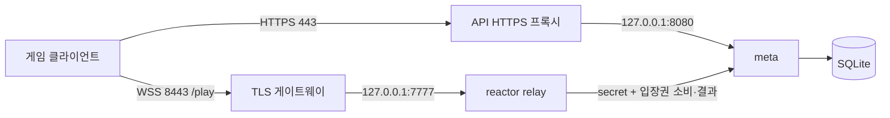

# 공개 서버 배포 — Linux 주 서버 / Windows 예비 서버

2026-09-19 코드 기준. Mac 하드웨어에 **Linux**가 설치된 주 서버를 기준으로 한다.
접속 보호의 구현 원리는 [Part 16](blog/part16-secure-admission.md), 빌드 입구는
[실행 안내](start-here.md), 남은 출시 조건은 [출시 점검](release-readiness.md)에 있다.
아래는 배포 절차이며 실제 DNS·방화벽·서비스를 변경했다는 기록이 아니다.

## 1. 공개 포트와 내부 포트를 구분한다



- **WSS 게이트웨이:** 도메인 인증서로 암호화하고 binary 메시지를 내부 relay로 전달한다.
- **relay:** 매칭·방·게임 바이트 전달과 서버 규칙 검증. 첫 입장권을 meta에서 한 번 소비하고 실제 종료 입력으로 결과를 판정한다.
- **meta:** 가입 없는 계정, 입장권 발급, 상점, 경기 기록. 봇 BP는 선택적 서버 리플레이 검증이다.
- **API HTTPS 프록시:** meta의 HTTP API와 랭킹 페이지를 외부 HTTPS로 제공한다.

게임 연결과 API 연결은 별개다. API에만 HTTPS를 붙이고 게임 7777을 공개하는
이전 배치는 현재 출시 절차가 아니다. 외부에서 내부 7777·8080에 접근할 수 없어야 한다.
게이트웨이는 자체 TLS를 사용한다. 이 버전에서는 게이트웨이를 또 다른 HTTP 프록시
뒤에 두면 실제 사용자의 IP 대신 프록시 IP 제한을 공유하므로 직접 TLS 진입을 기준으로 한다.

## 2. 빌드하고 비밀을 준비한다

Linux에는 CMake, C++17 컴파일러, Boost.Beast 헤더, OpenSSL 개발 패키지가 필요하다.
서버 빌드는 그래픽·Python 학습 의존성이 없다. 모델 상대의 BP를 검증할 때만
`BOT=1`과 ONNX Runtime CPU 묶음, 같은 캐릭터·모델 버전이 필요하다.

저장소 루트에서 서버 묶음을 만든다.

```bash
./scripts/release_server_linux.sh
```

산출물 `dist/tetris-server-linux-x64.tar.gz`에는 `tetris_meta`,
`tetris_relay_reactor`, `tetris_wss_gateway`, TLS 라이브러리, 캐릭터 설정,
운영 예제와 백업 도구가 들어간다. 학습 모델은 자동 생성되지 않는다.
Boost가 별도 경로에 있으면 해당 빌드 폴더를 `TETRIS_BOOST_INCLUDE`로 먼저 구성한다.
기본 WSS 포함을 끄는 `WSS=0`은 공개 서버용 설정이 아니다.

운영 장비에는 전용 사용자 `tetris`와 아래 경로를 준비한다.

| 경로 | 내용 | 권한 의도 |
|---|---|---|
| `/opt/tetris` | 압축을 푼 실행 파일·lib·assets·model | 서비스는 읽기·실행만 |
| `/srv/tetris/db` | `tetris.db`와 SQLite WAL | meta 사용자만 쓰기 |
| `/etc/tetris/meta.env`, `relay.env` | 같은 `TETRIS_RELAY_SECRET` | 제한된 관리자/서비스만 접근 |
| `/etc/tetris/tls` | 게임 도메인의 인증서 체인·개인키 | gateway 사용자가 읽되 외부 공개 금지 |
| 별도 장비의 백업 폴더 | 검증된 DB 스냅샷 | 배포 zip·웹 루트와 분리 |

secret은 처음 한 번만 암호학적 난수로 만들고 두 환경 파일에 같은 값을 넣는다.
기존 운영 secret 파일을 재실행으로 덮어쓰지 않는다. 파일 형식은 다음과 같다.

```dotenv
TETRIS_RELAY_SECRET=<openssl rand -hex 32로 만든 값>
```

이 파일에 `TETRIS_RELAY_LEGACY_AUTH=1`을 넣지 않는다. 클라이언트에는 relay secret,
계정 DB, 서버 개인키를 포함하지 않는다. 로그·스크린샷에도 이 값들을 남기지 않는다.

## 3. meta와 API HTTPS

`deploy/systemd/tetris-meta.service`는 `/opt/tetris`에서 실행하고
`127.0.0.1:8080`만 듣는다. JSON API에는 HTTPS 프록시를 앞에 둔다.
기존 `deploy/Caddyfile.example`은 **API용 Tunnel 뒤의 loopback Caddy** 예제다.
그 파일만 실행하면 공개 HTTPS가 생기는 것은 아니다. `deploy/cloudflared` 예제의
실제 도메인·터널 설정을 완성하거나, 별도의 직접 HTTPS 프록시를 준비해야 한다.
게임 게이트웨이와 API 프록시가 같은 IP의 443을 동시에 차지하지 않도록 한다.
이 문서는 게임 외부 8443, API 외부 443을 기준으로 한다.

meta의 `--trust-loopback-proxy`는 기본 OFF다. 프록시가 실제 클라이언트 주소를
검증해 XFF의 마지막 주소로 전달하는 배치에서만 명시적으로 켠다. 클라이언트가 넣은
헤더를 그대로 신뢰하면 요청 제한을 우회할 수 있다. 여러 프록시/Tunnel을 연결했을 때는
마지막 값이 실제 누구의 주소인지 먼저 확인한다. 이 옵션을 끄면 프록시 뒤 사용자가
하나의 요청 예산을 공유하는 것은 의도된 보수적 기본값이다.

meta 자체의 현재 제한은 공개 요청 60회/초/IP, 게스트·게임 입장권 발급 각각
10회/60초/IP, HTTP 작업자 8개·대기열 128개다. 같은 NAT 사용자는 제한을 공유한다.
다중 IP 가입·분산 공격·디스크 증가를 이 제한만으로 해결하지는 않는다.

## 4. 내부 relay와 WSS 게이트웨이

`deploy/systemd/tetris-relay.service`는 현재 같은 호스트 meta에 연결한다.
중요한 실행 부분은 다음과 같다.

```bash
/opt/tetris/tetris_relay_reactor --port 7777 --loopback-only \
  --max-sessions-per-ip 128 --meta http://127.0.0.1:8080 --log-level info
```

relay가 보는 peer는 모두 gateway의 loopback이다. 실제 인터넷 주소별 동시 제한은
게이트웨이가 맡는다(전체 128, IP당 16; IPv6는 /64 단위). 기존 relay의 handshake
슬롯·인증 대기열·프레임 예산도 유지한다. 이 숫자는 운영 동접 보장이 아니라 자원 상한이다.

`deploy/systemd/tetris-wss.service`의 인증서 경로·Origin을 실제 값으로 수정한다.
명령은 다음 모양이다.

```bash
/opt/tetris/tetris_wss_gateway --port 8443 --backend-port 7777 \
  --cert /etc/tetris/tls/fullchain.pem --key /etc/tetris/tls/privkey.pem \
  --origin https://game.example.com
```

브라우저 출처는 scheme+host+선택적 port의 정확한 값이다. 끝에 `/`나 경로를 붙이지 않는다.
여러 출처는 `--origin`을 반복한다. 아직 브라우저 게임이 없으면 생략할 수 있고,
Origin을 보내지 않는 네이티브 클라이언트는 입장권으로 인증한다.

서비스 파일 설치와 활성화는 운영 경로·권한·인증서를 확인한 뒤 관리자가 수행한다.
시작은 **meta → relay → gateway**, 종료는 역순이다. 인증서를 갱신한 뒤 gateway를
재시작해야 하며 기존 경기는 연결이 끊긴다. 현재 자동 인증서 갱신기나 hot reload는 없다.

처음에는 `--loops 1`로 운영한다. 이전 raw relay 부하 측정값을 WSS 전체 경로의
동접 보장으로 재사용하지 않는다. TLS 비용과 IP별 제한을 포함한 실제 장비 부하 검사가 필요하다.

## 5. 클라이언트 배포

Linux/macOS release 스크립트에는 도메인을 명시한다.

```bash
RELAY_ENDPOINT=wss://relay.example.com:8443/play \
META_URL=https://api.example.com ./scripts/release_linux.sh
```

macOS는 `release_macos.sh`, Windows는 같은 주소를 `release_win.ps1`의
`-RelayEndpoint`, `-MetaUrl`로 준다. WSS는 release 기본 ON이다.
OpenSSL 런타임도 묶지만, 대상 OS의 CA 저장소·DLL/dylib·아키텍처·서명은 깨끗한 장비에서
확인해야 한다. 테스트용 `TETRIS_CA_FILE`이나 인증서 검사 해제 우회를 배포하지 않는다.

접속 시 기존 계정 토큰은 HTTPS API로만 보내고, 새로 받은 60초 입장권으로
큐·룸에 들어간다. 입장권 발급·소비가 실패하면 다음 접속에서 다시 발급한다.
서버 연결 실패를 기존 장기 토큰의 raw TCP 전송으로 자동 우회하지 않는다.

## 6. 외부 공개 전 확인

1. 다른 네트워크의 두 사용자 데이터 폴더로 WSS 매칭·방·대전·상점·재접속을 확인한다.
2. 게임 도메인 인증서의 신뢰·이름·유효기간과 API HTTPS를 각각 확인한다.
3. 외부 7777·8080이 차단되고 WSS 게이트웨이만 내부 relay에 접근하는지 확인한다.
4. 잘못된 인증서·반복 입장권·장기 토큰의 relay 직접 입장이 거절되는지 확인한다.
5. meta 중지 중 새 입장이 거절되고 복구 후 새 입장권으로 다시 들어가는지 확인한다.
6. 서비스 재시작·인증서 갱신·백업 복원·Windows 전환을 연습한다.

`web/ranking/index.html`은 랭킹 페이지다. WSS 진입점 추가만으로 브라우저 게임이
구현되지는 않는다. WASM/WebGL·브라우저 루프·입력·오디오·저장소·비동기 API 작업이 남는다.

## 7. 백업과 Windows 예비 서버

현재 SQLite를 일관된 스냅샷으로 복사한다. 실행 중 WAL의 커밋된 기록도 포함하며,
출력 파일이 이미 있으면 덮어쓰지 않는다.

```bash
python scripts/backup_meta_db.py /srv/tetris/db/tetris.db /safe/backup/tetris-snapshot.db
```

Windows에 같은 버전의 meta·relay·gateway를 빌드하고, OpenSSL DLL과 도메인 인증서를
준비한다. reactor는 IOCP 단일 루프를 쓴다. systemd는 사용할 수 없으므로 Windows
서비스 등록과 계정 ACL을 별도로 준비한다. DB·secret은 옮기되 메모리 입장권과 진행
경기는 이전하지 않는다. 신규 입장을 막고 경기 종료 → meta 쓰기 중지 → 최종 스냅샷 →
원본 중지 → 새 장비에서 복원·검증 → DNS 전환 순서다. writer는 항상 한 곳만 활성화한다.
상세 명령과 롤백은 [출시 점검](release-readiness.md)에 있다.

meta를 Android/Termux나 다른 호스트에 분리하는 것은 가능한 별도 배치다.
이때 relay↔meta를 보호된 사설망/VPN 또는 HTTPS로 연결하고 절전·전원·백업을 고려한다.
현재 기본 서비스 파일은 같은 Linux 호스트 배치이며, 분리를 자동 구성하지 않는다.

## 8. 계정 DB 업그레이드와 복구

키 해시화·교체·복구는 [Part 17](blog/part17-guest-account-recovery.md)에 구현했다.
새 버전의 meta는 시작할 때 기존 32자리 토큰을 해시로 이관한다. ID·BP·아이콘·기록은
유지하며, 사용자에게 접근 키 재발급을 요구하지 않는다.

업그레이드는 신규 입장 중단 → 경기 종료 → meta 중지 → 일관된 DB 백업 → 새 바이너리
시작 순서다. 최초 시작의 WAL 정리·VACUUM 동안 외부 DB 읽기 도구도 닫고 여유 디스크를
확보한다. 정리 실패 시 HTTP 서비스를 시작하지 않으며 원인을 해소하고 다시 시작한다.
변환된 DB를 구버전 meta로 열지 않는다. 롤백은 점검 중 확보한 이전 DB와 이전 바이너리를
짝지어 복원하며, 이후 발생한 키 교체·경기 기록은 해당 백업에 없다는 점을 고려한다.
외부 백업·스냅샷의 예전 원문은 자동 삭제되지 않으므로 기존 비밀 자료처럼 보호한다.

클라이언트는 Account & Recovery에서 복구 파일을 만들고 따로 보관한다. Restore나
Replace 후에는 새 복구 파일을 다시 보관해야 한다. 키 교체는 새 인증과 미사용 입장권을
막지만 이미 승인된 경기나 처리 중 요청을 소급 취소하지 않는다.

현재 PvP relay는 같은 SimGame으로 INPUT을 검증한다. 서버와 클라이언트를 함께 갱신해야
랭크·결과 사유와 새 연결을 사용하는 재경기 UI가 일치한다. 완료 전 단절은 보상하지 않는다.
기존 단순 전달 부하 수치를 새 버전의 용량으로 간주하지 말고 실제 ranked 부하를 측정한다.
[Part 18](blog/part18-authoritative-results.md)은 검증 한도와 결과 계약을 설명한다.

클라이언트 계정은 서버별 `accounts/<origin locator>`로 분리된다. 구버전의 서버 정보 없는
토큰은 자동 전송하지 않으므로 Account 화면의 Import older account에서 현재 서버를
확인한 뒤 가져온다. 원본 파일은 남고, 최초 키 저장 실패는 Retry로 같은 키를 다시 저장한다.

## 9. 아직 해결하지 않은 위험

활성 세션의 즉시 회수·시간 기반 키 만료·계정 삭제, 익명 다중 계정의
보상 파밍 대책은 별도 작업이다. 봇 BP는 서버 재현 검증을 추가했지만 사람인지까지
증명하지는 않는다. WSS와 일회용 입장권이 모든 게임 부정행위를 막는다고 해석하지 않는다.
최신 로컬 테스트 결과와 미검증 사항은 [검증 기록](polish-validation.md)에 있다.
