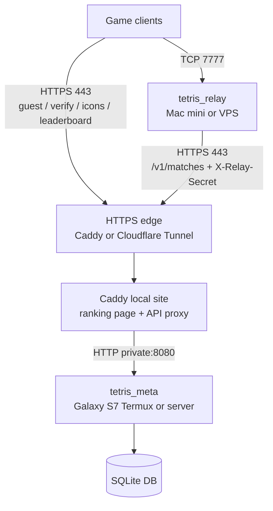

# 공개 서버 배포

이 문서는 일반 유저용 public matchmaking/ranking 서버를 구성하는 절차를 정리한다.
목표는 집 IP 와 DB 를 직접 노출하지 않고, 무료/저가 relay compute 가 사라져도
랭킹 DB 를 잃지 않는 구조다.

## 목표 구조

권장 구조는 `relay` 와 `meta` 를 분리한다.



- `tetris_relay` 는 무상태다. Oracle Free Tier/VPS 가 회수되어도 같은 secret 과
  같은 meta URL 로 새로 띄우면 된다.
- 초기 보유 장비 구성은 Mac mini가 relay, Galaxy S7 Termux가 meta+SQLite를 맡는다.
- meta는 relay와 같은 기계면 loopback, 다른 기계면 방화벽으로 제한한 사설망 주소에 bind한다. 공인망에 8080을 직접 열지 않는다.
- public HTTPS 는 Caddy 직접 노출 또는 Cloudflare Tunnel 이 담당한다.
- `/v1/matches` 는 `X-Relay-Secret` 없이는 403 이다.
- 일반 유저용 game client 에 개인 IP 를 하드코딩하지 않는다. CMake 기본값 또는
  런타임 환경변수로 공개 도메인을 넣는다.

## 0. 선택지

### 보유 장비 시험 운영: Mac mini relay + Galaxy S7 meta

Mac mini는 TCP 7777 relay만 실행하고, S7은 Termux에서 HTTP+SQLite meta를 실행한다.
relay가 사설망의 S7에 접근할 수 있게 하고 S7의 8080은 인터넷에서 직접 접근할 수
없게 막는다. 2011 Mac mini의 loopback 부하 측정에서는 200명 relay 전달이 성공했지만,
실제 회선·열·공격을 포함한 보장은 아니므로 초기 경보 기준은 더 낮게 잡고 WAN soak를
거친다. 재현 명령과 측정표는 [`blog/part12-hardening-and-release.md`](blog/part12-hardening-and-release.md)에 있다.

S7은 부팅 자동 시작, wake lock, 상시 전원, 발열 관리가 필요하다. SQLite DB와 WAL은
Mac mini나 Windows 노트북으로 주기적으로 백업한다. Android 절전이나 재부팅이 길어지면
신규 인증과 결과 저장이 실패하므로 장기 public 운영의 단일 원본으로는 위험하다.

### 장기 권장: 사설 meta + VPS relay + Tunnel

meta가 있는 사설망에 inbound port forwarding을 열지 않아도 된다. meta 호스트에서
`cloudflared` 같은 outbound tunnel 이 HTTPS edge 로 연결하고, 외부 사용자는
`https://api.example.com` 만 본다. 집 IP 를 DNS 에 직접 올리지 않는 구성이므로
일반 유저용으로 가장 안전하다.

### 가능: 사설 meta + VPS relay + Caddy 직접 노출

공유기에서 TCP 80/443 을 Mac mini 로 포워딩하고 DNS A/AAAA 레코드를 집 IP 로 둔다.
구성은 단순하지만 집 IP 가 노출되고, 같은 공유기를 쓰는 다른 기기까지 운영 리스크를
공유한다. 사용하려면 공유기 관리자 비밀번호, 펌웨어, 방화벽, 포트포워딩 범위를
반드시 정리한다.

### 주의: 가정망 Mac mini를 public relay로 사용

`tetris_relay`는 raw TCP 7777을 public inbound로 받아야 한다. 보유 장비 시험 운영에는
가능하지만 가정망 포트포워딩이 집 IP와 공격 표면을 노출한다. 공유기 보안, 방화벽,
모니터링, IP별 입장 제한이 함께 필요하며 DDoS를 장비 한 대의 코드만으로 막을 수는 없다.
S7은 배터리·발열·절전·스토리지 이유로 public relay까지 겸하지 않는다.

## 1. 공통 secret 만들기

relay 와 meta 가 같은 값을 공유해야 한다.

```bash
openssl rand -hex 32
```

이 값을 relay 와 meta 양쪽 서버 환경변수로 둔다.

```bash
export TETRIS_RELAY_SECRET='64-hex-secret-here'
```

운영에서는 shell history 에 남기지 말고 systemd 환경 파일, launchd plist, 또는
서버의 secret 관리 방식에 넣는다. 이 값은 클라이언트 빌드나 정적 웹 페이지에 절대
넣지 않는다.

`tetris_meta`는 이 값이 없으면 기본적으로 시작하지 않는다. 로컬 테스트에서만
`--allow-public-matches`를 명시할 수 있고, public 운영에서는 사용하지 않는다.

## 1.5 운영 번들 만들기

Linux 서버에 올릴 파일은 서버 전용 번들로 만든다. 이 번들에는 클라이언트가 들어가지
않고, `tetris_relay`, `tetris_meta`, ranking 정적 페이지, systemd/Caddy/cloudflared
예시, DB 백업 스크립트만 들어간다.

```bash
./scripts/release_server_linux.sh
```

산출물:

```text
dist/tetris-server-linux-x64.tar.gz
```

클라이언트 배포물은 별도 스크립트로 만든다. 일반 유저용 클라이언트 번들에는
`tetris_relay`, `tetris_meta`, secret, DB 경로가 포함되지 않는다.

## 2. Meta 호스트: 빌드와 DB 위치

일반 Linux/macOS 서버는 아래 `/srv/tetris` 예시를 쓴다. Galaxy S7 Termux에서는
쓰기 가능한 `$PREFIX/var/lib/tetris` 같은 전용 디렉터리로 바꾸고, meta가 Mac mini의
relay에서만 접근 가능하도록 WLAN/VPN 방화벽을 제한한다. S7의 loopback에 bind하면
Mac mini가 접근할 수 없으므로 S7 사설 주소에만 노출해야 한다.

```bash
cmake -S . -B build-meta \
  -DCMAKE_BUILD_TYPE=Release \
  -DTETRIS_BUILD_GAME=OFF \
  -DTETRIS_BUILD_RELAY=OFF \
  -DTETRIS_BUILD_META=ON

cmake --build build-meta --config Release --target tetris_meta
```

DB 와 정적 페이지 디렉터리를 만든다.

```bash
sudo mkdir -p /srv/tetris/db /srv/tetris/www
sudo chown -R "$USER" /srv/tetris
cp web/ranking/index.html /srv/tetris/www/index.html
```

수동 실행:

```bash
export TETRIS_RELAY_SECRET='64-hex-secret-here'
./build-meta/tetris_meta \
  --db /srv/tetris/db/tetris.db \
  --http 127.0.0.1:8080
```

기대 로그:

```text
[meta] opening db: /srv/tetris/db/tetris.db
[meta] schema ready
[meta] /v1/matches requires X-Relay-Secret
[meta] HTTP listening on 127.0.0.1:8080
```

## 3. Edge proxy 호스트: local Caddy site

Tunnel 뒤에 둘 때는 Caddy 가 public TLS 를 직접 받을 필요가 없다. local HTTP site 로
정적 ranking 페이지와 API proxy 만 제공한다.

meta와 Caddy가 같은 기계면 아래 loopback 구성을 쓴다. S7이 meta이고 Mac mini가
Caddy를 맡으면 `reverse_proxy` 대상을 S7의 고정 사설 주소 또는 VPN 주소로 바꾼다.
공인 주소를 넣지 않는다.

`/srv/tetris/Caddyfile` (`deploy/Caddyfile.example` 참고):

```caddyfile
127.0.0.1:8088 {
    encode zstd gzip
    root * /srv/tetris/www

    handle /v1/* {
        reverse_proxy 127.0.0.1:8080
    }

    handle /healthz {
        reverse_proxy 127.0.0.1:8080
    }

    handle {
        file_server
    }
}
```

수동 실행:

```bash
caddy run --config /srv/tetris/Caddyfile
```

local 검증:

```bash
curl http://127.0.0.1:8088/v1/leaderboard?limit=10
```

## 4. HTTPS edge

### 4.1 Tunnel 방식

Tunnel provider 에서 `api.example.com` 을 Mac mini 의 local Caddy 로 연결한다.
Cloudflare Tunnel 기준 흐름은 다음과 같다.

```bash
cloudflared tunnel login
cloudflared tunnel create tetris-meta
cloudflared tunnel route dns tetris-meta api.example.com
```

`~/.cloudflared/config.yml`:

```yaml
tunnel: tetris-meta
credentials-file: /Users/YOUR_USER/.cloudflared/TUNNEL_ID.json

ingress:
  - hostname: api.example.com
    service: http://127.0.0.1:8088
  - service: http_status:404
```

수동 실행:

```bash
cloudflared tunnel run tetris-meta
```

외부 검증:

```bash
curl https://api.example.com/v1/leaderboard?limit=10
```

### 4.2 Caddy 직접 노출 방식

공유기에서 TCP 80/443 을 Mac mini 로 포워딩하고, DNS 를 집 IP 로 연결할 때만 사용한다.

```caddyfile
api.example.com {
    encode zstd gzip
    root * /srv/tetris/www

    handle /v1/* {
        reverse_proxy 127.0.0.1:8080
    }

    handle /healthz {
        reverse_proxy 127.0.0.1:8080
    }

    handle {
        file_server
    }
}
```

relay 가 meta 와 같은 기기에 있을 때는 `/v1/matches` 를 public 에서 막고 relay 만
localhost 로 쓰게 만들 수 있다. 지금 권장 구조처럼 relay 가 외부 VPS 에 있으면
`/v1/matches` 를 proxy 하되, meta 의 secret 검증에 맡긴다.

## 5. VPS: relay 빌드 및 실행

Ubuntu/Debian 예시:

```bash
sudo apt update
sudo apt install -y build-essential cmake libssl-dev

cmake -S . -B build-relay \
  -DCMAKE_BUILD_TYPE=Release \
  -DTETRIS_BUILD_GAME=OFF \
  -DTETRIS_BUILD_META=OFF \
  -DTETRIS_BUILD_RELAY=ON \
  -DTETRIS_ENABLE_HTTPS=ON

cmake --build build-relay --config Release --target tetris_relay
```

실행:

```bash
export TETRIS_RELAY_SECRET='64-hex-secret-here'
./build-relay/tetris_relay \
  --port 7777 \
  --meta https://api.example.com
```

방화벽은 TCP `7777` 만 public 으로 연다. SSH 는 키 인증과 IP 제한을 권장한다.
meta 서버의 `8080` 은 VPS 에서 열지 않는다.

systemd 예시:

```ini
[Unit]
Description=Tetris relay
After=network-online.target
Wants=network-online.target

[Service]
Type=simple
EnvironmentFile=/etc/tetris/relay.env
WorkingDirectory=/opt/tetris
ExecStart=/opt/tetris/tetris_relay --port 7777 --meta https://api.example.com
Restart=always
RestartSec=3
User=tetris

[Install]
WantedBy=multi-user.target
```

같은 내용의 템플릿은 `deploy/systemd/tetris-relay.service` 와
`deploy/systemd/tetris-relay.env.example` 에 있다.

`/etc/tetris/relay.env`:

```text
TETRIS_RELAY_SECRET=64-hex-secret-here
```

## 6. 일반 유저용 클라이언트 빌드

개인 IP 를 release 바이너리에 넣지 않는다. 공개 도메인을 CMake 기본값으로 주입한다.

```bash
cmake -S . -B build-release \
  -DCMAKE_BUILD_TYPE=Release \
  -DTETRIS_DEFAULT_RELAY_ENDPOINT=relay.example.com:7777 \
  -DTETRIS_DEFAULT_META_URL=https://api.example.com

cmake --build build-release --config Release --target tetris
```

릴리스 스크립트를 쓰면 같은 작업을 한 줄로 처리한다.

```bash
RELAY_ENDPOINT=relay.example.com:7777 \
META_URL=https://api.example.com \
./scripts/release_linux.sh
```

```bash
RELAY_ENDPOINT=relay.example.com:7777 \
META_URL=https://api.example.com \
./scripts/release_macos.sh
```

```powershell
.\scripts\release_win.ps1 `
  -RelayEndpoint "relay.example.com:7777" `
  -MetaUrl "https://api.example.com"
```

개발 중에는 환경변수나 CLI 로 덮어쓸 수 있다.

```bash
TETRIS_RELAY_ENDPOINT=127.0.0.1:7777 \
TETRIS_META_URL=http://127.0.0.1:8080 \
./build/tetris
```

또는:

```bash
./build/tetris \
  --relay relay.example.com:7777 \
  --meta https://api.example.com
```

## 6.5 Windows 노트북 standby와 자동 전환의 범위

Windows 노트북에 같은 버전의 `tetris_relay`와 secret·meta URL을 준비해 standby로 둘
수 있다. health check나 외부 TCP 프록시가 Mac mini 장애를 감지하면 **새 연결**을
Windows relay로 보낸다. DNS만 바꾸는 방식은 캐시 때문에 전환 시간이 일정하지 않으므로
짧은 TTL보다 명시적인 TCP frontend가 더 예측 가능하다.

현재 queue, room, socket, summary는 relay 프로세스 메모리에 있다. 진행 중 연결을 다른
relay로 옮기는 resume protocol이나 공유 session directory가 없으므로 Mac mini가 죽은
시점의 매치는 종료되고 클라이언트가 재접속해야 한다. standby는 새 매치의 복구 시간을
줄이는 장치이지 진행 중 매치의 무중단 분산 처리가 아니다.

S7 SQLite를 두 meta가 동시에 쓰게 하거나 파일 동기화 프로그램으로 실시간 복제하지
않는다. active meta는 하나로 유지하고 `.backup` 산출물을 standby에 복원한다. multi-active가
필요해지는 규모에서는 PostgreSQL 같은 네트워크 DB, durable result outbox, session-aware
routing을 함께 설계해야 한다.

## 7. 보안 체크

- meta와 proxy가 같은 호스트면 `127.0.0.1:8080`을 유지한다. S7 분리 배치면 사설/VPN 주소와 방화벽 allowlist를 사용하고 8080을 공인망에 직접 공개하지 않는다.
- `/v1/matches` 는 secret 없이는 403 이어야 한다.
- `TETRIS_RELAY_SECRET` 는 relay/meta 서버만 가진다.
- release client 에 집 IP, relay secret, DB 경로를 넣지 않는다.
- DB 파일은 정기 백업한다. 최소한 `tetris.db`, `tetris.db-wal`,
  `tetris.db-shm` 을 같은 시점에 백업한다.
- `sqlite3` CLI 가 있으면 `scripts/backup_meta_db.sh` 의 `.backup` 경로를 사용한다.
- meta는 public 요청을 IP당 60/s, 올바른 relay secret을 가진 내부 요청을 별도 512/s
  버킷으로 제한한다. reverse proxy의 실제 client IP 헤더는 loopback peer에서만 신뢰한다.
  `/v1/guest`의 사용자별/IP별 제한은 Caddy·Tunnel 같은 edge에도 별도로 둔다.
- Caddy/Tunnel HTTPS 를 사용한다. public HTTP 로 토큰을 보내지 않는다.
- Oracle/VPS 가 회수되면 새 relay 를 띄우고 같은 secret + 같은 meta URL 을 넣는다.

## 8. 수동 검증

secret 없이 match 저장 시도:

```bash
curl -i -X POST https://api.example.com/v1/matches \
  -H 'Content-Type: application/json' \
  -d '{"match_uuid":"0123456789abcdef0123456789abcdef","player_a":1,"player_b":2,"winner":1,"score_a":1,"score_b":0,"lines_a":0,"lines_b":0,"duration_s":1}'
```

기대 결과: `HTTP/2 403`.

secret 있는 relay 경로는 relay 로그에서 확인한다. 일반 운영 shell 에서는 secret 을
직접 curl history 에 남기지 않는 편이 좋다.

리더보드:

```bash
curl https://api.example.com/v1/leaderboard?limit=10
```

기대 결과: JSON 배열. 브라우저에서 `https://api.example.com/` 를 열면
`web/ranking/index.html` 이 같은 데이터를 표로 표시한다.

health check:

```bash
curl https://api.example.com/healthz
```

기대 결과: `{"ok":true}`.

클라이언트 smoke:

```bash
./build-release/tetris --queue relay.example.com:7777 --meta https://api.example.com
```

기대 결과: 첫 실행이면 guest 토큰이 발급되고 메뉴에
`ranking: online   Lv 1   RP 0   BP 0`이 표시된다. 두 클라이언트가 매치를
끝내면 relay가 `/v1/matches`를 호출하고, 게임오버 화면에 RP 변화가 표시된다.
